```python
import pandas as pd
import glob
import matplotlib as mpl
import matplotlib.pyplot as plt
import dateutil
from IPython.display import display, HTML

from pandas.plotting import register_matplotlib_converters
register_matplotlib_converters()

# pd.options.display.max_columns = None
# pd.options.display.max_rows = None
```


```python
INCUBATION_PERIOD = 5 # days
```


```python
df = pd.concat(map(pd.read_csv, glob.glob('csse_covid_19_data/csse_covid_19_daily_reports/*.csv')), sort=False)
```


```python
df['Country/Region'] = df['Country/Region'].apply(str.strip)
df['Province/State'] = df['Province/State'].fillna('All')
df['Recovered'] = df['Recovered'].fillna(0)
df['Deaths'] = df['Deaths'].fillna(0)
df['Confirmed'] = df['Confirmed'].fillna(0)
```


```python
df['Last Update'] = df['Last Update'].apply(lambda x: dateutil.parser.parse(x).date())
df = df.groupby(['Last Update', 'Country/Region', 'Province/State']).agg({
    'Confirmed': 'max',
    'Deaths': 'max',
    'Recovered': 'max',
    'Latitude': 'first',
    'Longitude': 'first',
}).reset_index()
```


```python
regions = pd.unique(df['Country/Region'])
regions.sort()
```


```python
data_by_country = df.groupby(['Last Update', 'Country/Region',]).agg({
    'Confirmed': 'sum',
    'Deaths': 'sum',
    'Recovered': 'sum',
}).reset_index()

by_country = {}
for country in regions: 
    co_data = data_by_country.loc[data_by_country['Country/Region'] == country].sort_values(['Last Update'])
    co_data['Death Rate (%)'] = 100 * co_data['Deaths'] / (co_data['Recovered'] + co_data['Deaths'])
    r0 = pd.DataFrame({'r0': list(co_data['Confirmed']), 'Last Update': list(co_data['Last Update'])}, index=co_data['Last Update']).rolling(INCUBATION_PERIOD).apply(lambda a: a[-1]/a[0], raw=True)
    
    by_country[country] = {
        'data': co_data,
        'r0': r0,
    }

```


```python
for country, data in by_country.items():       
    anchor = country.lower().replace(' ', '_')
    display(HTML(f'<h2><a name="{anchor}" href="#{anchor}">{country}</a></h2>'))    
    co_data = data['data']
    r0 = data['r0']

    fig, axs = plt.subplots(4, 1, figsize=(8,15), constrained_layout=True, sharex=True)
    fig.suptitle(f'COVID-19 cases in {country}')

    axs[0].set_title('Count')
    axs[0].plot(co_data['Last Update'], co_data['Confirmed'], label='Confirmed')
    axs[0].plot(co_data['Last Update'], co_data['Deaths'], label='Deaths')
    axs[0].plot(co_data['Last Update'], co_data['Recovered'], label='Recovered')
    axs[0].legend()
    axs[0].set_ylabel('count')

    axs[1].set_yscale('log')
    axs[1].plot(co_data['Last Update'], co_data['Confirmed'], label='Confirmed')
    axs[1].plot(co_data['Last Update'], co_data['Deaths'], label='Deaths')
    axs[1].plot(co_data['Last Update'], co_data['Recovered'], label='Recovered')
    axs[1].set_ylabel('count (log)')

    axs[2].set_title('Death Rate (%)')
    axs[2].plot(co_data['Last Update'], co_data['Death Rate (%)'])
    axs[2].set_ylabel('rate')

    axs[3].set_title(f'R0 for incubation per. {INCUBATION_PERIOD} days')
    axs[3].plot(co_data['Last Update'], r0['r0'])
    axs[3].set_ylabel('r0')

    display(HTML(f'<p>Plot of COVID-19 cases.</p>'))
    display(HTML(f'<p>Death rate calculated as (count of death)/(count of death + count of recovered)</p>'))    
    display(fig)
    
    display(HTML(f'<p>Data extracted from <a href="https://github.com/CSSEGISandData/COVID-19">Johns Hopkins CSSE Data Repository</a></p>'))    
    display(data['data'])
    
    display(HTML(f'<p>r0 calculated as (Confirmed cases at day N + incubation period = {INCUBATION_PERIOD} days)/(confirmed cases at day N)</p>'))
    display(HTML(f'<p>Note that this is just a very rough value determined by "garage epidemiology" and should not be used as reference</p>'))
    display(data['r0'])
```


<h2><a name="afghanistan" href="#afghanistan">Afghanistan</a></h2>


<p>Plot of COVID-19 cases.</p>


<p>Death rate calculated as (count of death)(count of death + count of recovered)</p>


<p>Data extracted from <a href="https://github.com/CSSEGISandData/COVID-19">Johns Hopkins CSSE Data Repository</a></p>


<div>
<style scoped>
    .dataframe tbody tr th:only-of-type {
        vertical-align: middle;
    }

    .dataframe tbody tr th {
        vertical-align: top;
    }

    .dataframe thead th {
        text-align: right;
    }
</style>
<table border="1" class="dataframe">
  <thead>
    <tr style="text-align: right;">
      <th></th>
      <th>Last Update</th>
      <th>Country/Region</th>
      <th>Confirmed</th>
      <th>Deaths</th>
      <th>Recovered</th>
      <th>Death Rate (%)</th>
    </tr>
  </thead>
  <tbody>
    <tr>
      <td>410</td>
      <td>2020-02-24</td>
      <td>Afghanistan</td>
      <td>1.0</td>
      <td>0.0</td>
      <td>0.0</td>
      <td>NaN</td>
    </tr>
    <tr>
      <td>933</td>
      <td>2020-03-08</td>
      <td>Afghanistan</td>
      <td>4.0</td>
      <td>0.0</td>
      <td>0.0</td>
      <td>NaN</td>
    </tr>
  </tbody>
</table>
</div>


<p>r0 calculated as (Confirmed cases at day N + incubation period = 5 days)/(confirmed cases at day N)</p>


<p>Note that this is just a very rough value determined by "garage epidemiology" and should not be used as reference</p>


<div>
<style scoped>
    .dataframe tbody tr th:only-of-type {
        vertical-align: middle;
    }

    .dataframe tbody tr th {
        vertical-align: top;
    }

    .dataframe thead th {
        text-align: right;
    }
</style>
<table border="1" class="dataframe">
  <thead>
    <tr style="text-align: right;">
      <th></th>
      <th>r0</th>
    </tr>
    <tr>
      <th>Last Update</th>
      <th></th>
    </tr>
  </thead>
  <tbody>
    <tr>
      <td>2020-02-24</td>
      <td>NaN</td>
    </tr>
    <tr>
      <td>2020-03-08</td>
      <td>NaN</td>
    </tr>
  </tbody>
</table>
</div>


<h2><a name="algeria" href="#algeria">Algeria</a></h2>


<p>Plot of COVID-19 cases.</p>


<p>Death rate calculated as (count of death)(count of death + count of recovered)</p>


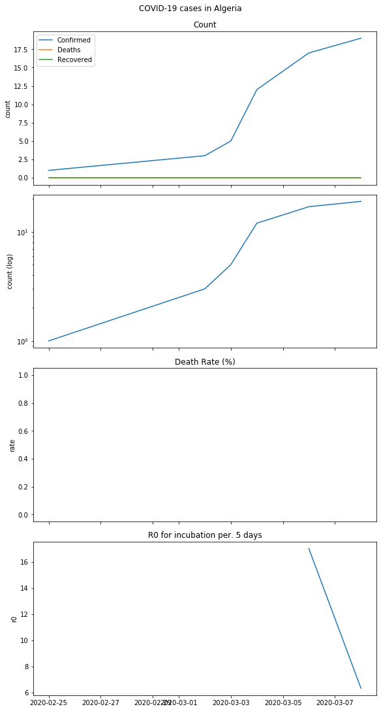


<p>Data extracted from <a href="https://github.com/CSSEGISandData/COVID-19">Johns Hopkins CSSE Data Repository</a></p>


<div>
<style scoped>
    .dataframe tbody tr th:only-of-type {
        vertical-align: middle;
    }

    .dataframe tbody tr th {
        vertical-align: top;
    }

    .dataframe thead th {
        text-align: right;
    }
</style>
<table border="1" class="dataframe">
  <thead>
    <tr style="text-align: right;">
      <th></th>
      <th>Last Update</th>
      <th>Country/Region</th>
      <th>Confirmed</th>
      <th>Deaths</th>
      <th>Recovered</th>
      <th>Death Rate (%)</th>
    </tr>
  </thead>
  <tbody>
    <tr>
      <td>426</td>
      <td>2020-02-25</td>
      <td>Algeria</td>
      <td>1.0</td>
      <td>0.0</td>
      <td>0.0</td>
      <td>NaN</td>
    </tr>
    <tr>
      <td>627</td>
      <td>2020-03-02</td>
      <td>Algeria</td>
      <td>3.0</td>
      <td>0.0</td>
      <td>0.0</td>
      <td>NaN</td>
    </tr>
    <tr>
      <td>668</td>
      <td>2020-03-03</td>
      <td>Algeria</td>
      <td>5.0</td>
      <td>0.0</td>
      <td>0.0</td>
      <td>NaN</td>
    </tr>
    <tr>
      <td>717</td>
      <td>2020-03-04</td>
      <td>Algeria</td>
      <td>12.0</td>
      <td>0.0</td>
      <td>0.0</td>
      <td>NaN</td>
    </tr>
    <tr>
      <td>819</td>
      <td>2020-03-06</td>
      <td>Algeria</td>
      <td>17.0</td>
      <td>0.0</td>
      <td>0.0</td>
      <td>NaN</td>
    </tr>
    <tr>
      <td>934</td>
      <td>2020-03-08</td>
      <td>Algeria</td>
      <td>19.0</td>
      <td>0.0</td>
      <td>0.0</td>
      <td>NaN</td>
    </tr>
  </tbody>
</table>
</div>


<p>r0 calculated as (Confirmed cases at day N + incubation period = 5 days)/(confirmed cases at day N)</p>


<p>Note that this is just a very rough value determined by "garage epidemiology" and should not be used as reference</p>


<div>
<style scoped>
    .dataframe tbody tr th:only-of-type {
        vertical-align: middle;
    }

    .dataframe tbody tr th {
        vertical-align: top;
    }

    .dataframe thead th {
        text-align: right;
    }
</style>
<table border="1" class="dataframe">
  <thead>
    <tr style="text-align: right;">
      <th></th>
      <th>r0</th>
    </tr>
    <tr>
      <th>Last Update</th>
      <th></th>
    </tr>
  </thead>
  <tbody>
    <tr>
      <td>2020-02-25</td>
      <td>NaN</td>
    </tr>
    <tr>
      <td>2020-03-02</td>
      <td>NaN</td>
    </tr>
    <tr>
      <td>2020-03-03</td>
      <td>NaN</td>
    </tr>
    <tr>
      <td>2020-03-04</td>
      <td>NaN</td>
    </tr>
    <tr>
      <td>2020-03-06</td>
      <td>17.000000</td>
    </tr>
    <tr>
      <td>2020-03-08</td>
      <td>6.333333</td>
    </tr>
  </tbody>
</table>
</div>


<h2><a name="andorra" href="#andorra">Andorra</a></h2>


<p>Plot of COVID-19 cases.</p>


<p>Death rate calculated as (count of death)(count of death + count of recovered)</p>


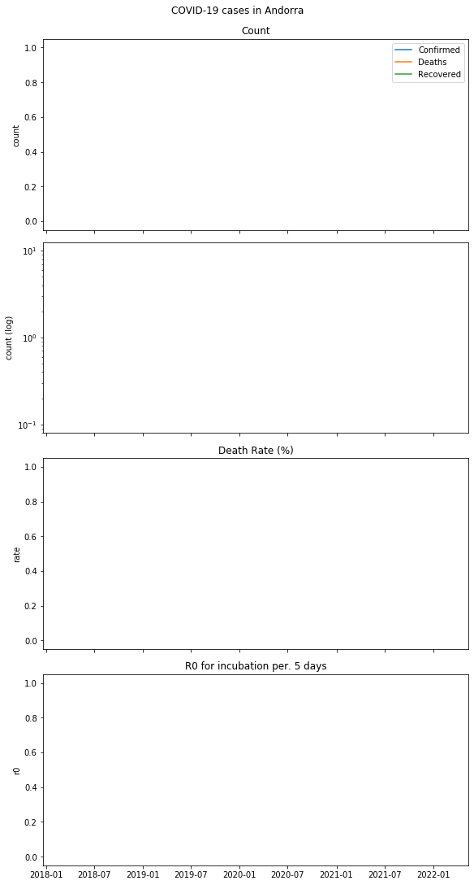


<p>Data extracted from <a href="https://github.com/CSSEGISandData/COVID-19">Johns Hopkins CSSE Data Repository</a></p>


<div>
<style scoped>
    .dataframe tbody tr th:only-of-type {
        vertical-align: middle;
    }

    .dataframe tbody tr th {
        vertical-align: top;
    }

    .dataframe thead th {
        text-align: right;
    }
</style>
<table border="1" class="dataframe">
  <thead>
    <tr style="text-align: right;">
      <th></th>
      <th>Last Update</th>
      <th>Country/Region</th>
      <th>Confirmed</th>
      <th>Deaths</th>
      <th>Recovered</th>
      <th>Death Rate (%)</th>
    </tr>
  </thead>
  <tbody>
    <tr>
      <td>628</td>
      <td>2020-03-02</td>
      <td>Andorra</td>
      <td>1.0</td>
      <td>0.0</td>
      <td>0.0</td>
      <td>NaN</td>
    </tr>
  </tbody>
</table>
</div>


<p>r0 calculated as (Confirmed cases at day N + incubation period = 5 days)/(confirmed cases at day N)</p>


<p>Note that this is just a very rough value determined by "garage epidemiology" and should not be used as reference</p>


<div>
<style scoped>
    .dataframe tbody tr th:only-of-type {
        vertical-align: middle;
    }

    .dataframe tbody tr th {
        vertical-align: top;
    }

    .dataframe thead th {
        text-align: right;
    }
</style>
<table border="1" class="dataframe">
  <thead>
    <tr style="text-align: right;">
      <th></th>
      <th>r0</th>
    </tr>
    <tr>
      <th>Last Update</th>
      <th></th>
    </tr>
  </thead>
  <tbody>
    <tr>
      <td>2020-03-02</td>
      <td>NaN</td>
    </tr>
  </tbody>
</table>
</div>


<h2><a name="argentina" href="#argentina">Argentina</a></h2>


<p>Plot of COVID-19 cases.</p>


<p>Death rate calculated as (count of death)(count of death + count of recovered)</p>


<p>Data extracted from <a href="https://github.com/CSSEGISandData/COVID-19">Johns Hopkins CSSE Data Repository</a></p>


<div>
<style scoped>
    .dataframe tbody tr th:only-of-type {
        vertical-align: middle;
    }

    .dataframe tbody tr th {
        vertical-align: top;
    }

    .dataframe thead th {
        text-align: right;
    }
</style>
<table border="1" class="dataframe">
  <thead>
    <tr style="text-align: right;">
      <th></th>
      <th>Last Update</th>
      <th>Country/Region</th>
      <th>Confirmed</th>
      <th>Deaths</th>
      <th>Recovered</th>
      <th>Death Rate (%)</th>
    </tr>
  </thead>
  <tbody>
    <tr>
      <td>669</td>
      <td>2020-03-03</td>
      <td>Argentina</td>
      <td>1.0</td>
      <td>0.0</td>
      <td>0.0</td>
      <td>NaN</td>
    </tr>
    <tr>
      <td>718</td>
      <td>2020-03-04</td>
      <td>Argentina</td>
      <td>1.0</td>
      <td>0.0</td>
      <td>0.0</td>
      <td>NaN</td>
    </tr>
    <tr>
      <td>820</td>
      <td>2020-03-06</td>
      <td>Argentina</td>
      <td>2.0</td>
      <td>0.0</td>
      <td>0.0</td>
      <td>NaN</td>
    </tr>
    <tr>
      <td>885</td>
      <td>2020-03-07</td>
      <td>Argentina</td>
      <td>8.0</td>
      <td>0.0</td>
      <td>0.0</td>
      <td>NaN</td>
    </tr>
    <tr>
      <td>935</td>
      <td>2020-03-08</td>
      <td>Argentina</td>
      <td>12.0</td>
      <td>1.0</td>
      <td>0.0</td>
      <td>100.0</td>
    </tr>
  </tbody>
</table>
</div>


<p>r0 calculated as (Confirmed cases at day N + incubation period = 5 days)/(confirmed cases at day N)</p>


<p>Note that this is just a very rough value determined by "garage epidemiology" and should not be used as reference</p>


<div>
<style scoped>
    .dataframe tbody tr th:only-of-type {
        vertical-align: middle;
    }

    .dataframe tbody tr th {
        vertical-align: top;
    }

    .dataframe thead th {
        text-align: right;
    }
</style>
<table border="1" class="dataframe">
  <thead>
    <tr style="text-align: right;">
      <th></th>
      <th>r0</th>
    </tr>
    <tr>
      <th>Last Update</th>
      <th></th>
    </tr>
  </thead>
  <tbody>
    <tr>
      <td>2020-03-03</td>
      <td>NaN</td>
    </tr>
    <tr>
      <td>2020-03-04</td>
      <td>NaN</td>
    </tr>
    <tr>
      <td>2020-03-06</td>
      <td>NaN</td>
    </tr>
    <tr>
      <td>2020-03-07</td>
      <td>NaN</td>
    </tr>
    <tr>
      <td>2020-03-08</td>
      <td>12.0</td>
    </tr>
  </tbody>
</table>
</div>


<h2><a name="armenia" href="#armenia">Armenia</a></h2>


<p>Plot of COVID-19 cases.</p>


<p>Death rate calculated as (count of death)(count of death + count of recovered)</p>


<p>Data extracted from <a href="https://github.com/CSSEGISandData/COVID-19">Johns Hopkins CSSE Data Repository</a></p>


<div>
<style scoped>
    .dataframe tbody tr th:only-of-type {
        vertical-align: middle;
    }

    .dataframe tbody tr th {
        vertical-align: top;
    }

    .dataframe thead th {
        text-align: right;
    }
</style>
<table border="1" class="dataframe">
  <thead>
    <tr style="text-align: right;">
      <th></th>
      <th>Last Update</th>
      <th>Country/Region</th>
      <th>Confirmed</th>
      <th>Deaths</th>
      <th>Recovered</th>
      <th>Death Rate (%)</th>
    </tr>
  </thead>
  <tbody>
    <tr>
      <td>583</td>
      <td>2020-03-01</td>
      <td>Armenia</td>
      <td>1.0</td>
      <td>0.0</td>
      <td>0.0</td>
      <td>NaN</td>
    </tr>
  </tbody>
</table>
</div>


<p>r0 calculated as (Confirmed cases at day N + incubation period = 5 days)/(confirmed cases at day N)</p>


<p>Note that this is just a very rough value determined by "garage epidemiology" and should not be used as reference</p>


<div>
<style scoped>
    .dataframe tbody tr th:only-of-type {
        vertical-align: middle;
    }

    .dataframe tbody tr th {
        vertical-align: top;
    }

    .dataframe thead th {
        text-align: right;
    }
</style>
<table border="1" class="dataframe">
  <thead>
    <tr style="text-align: right;">
      <th></th>
      <th>r0</th>
    </tr>
    <tr>
      <th>Last Update</th>
      <th></th>
    </tr>
  </thead>
  <tbody>
    <tr>
      <td>2020-03-01</td>
      <td>NaN</td>
    </tr>
  </tbody>
</table>
</div>


<h2><a name="australia" href="#australia">Australia</a></h2>


<p>Plot of COVID-19 cases.</p>


<p>Death rate calculated as (count of death)(count of death + count of recovered)</p>


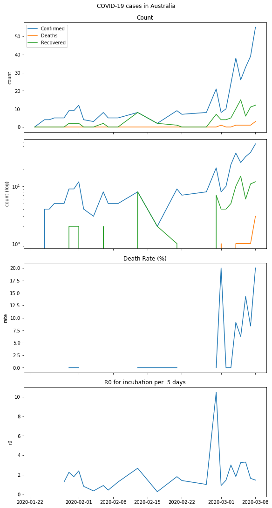


<p>Data extracted from <a href="https://github.com/CSSEGISandData/COVID-19">Johns Hopkins CSSE Data Repository</a></p>


<div>
<style scoped>
    .dataframe tbody tr th:only-of-type {
        vertical-align: middle;
    }

    .dataframe tbody tr th {
        vertical-align: top;
    }

    .dataframe thead th {
        text-align: right;
    }
</style>
<table border="1" class="dataframe">
  <thead>
    <tr style="text-align: right;">
      <th></th>
      <th>Last Update</th>
      <th>Country/Region</th>
      <th>Confirmed</th>
      <th>Deaths</th>
      <th>Recovered</th>
      <th>Death Rate (%)</th>
    </tr>
  </thead>
  <tbody>
    <tr>
      <td>8</td>
      <td>2020-01-23</td>
      <td>Australia</td>
      <td>0.0</td>
      <td>0.0</td>
      <td>0.0</td>
      <td>NaN</td>
    </tr>
    <tr>
      <td>35</td>
      <td>2020-01-25</td>
      <td>Australia</td>
      <td>4.0</td>
      <td>0.0</td>
      <td>0.0</td>
      <td>NaN</td>
    </tr>
    <tr>
      <td>49</td>
      <td>2020-01-26</td>
      <td>Australia</td>
      <td>4.0</td>
      <td>0.0</td>
      <td>0.0</td>
      <td>NaN</td>
    </tr>
    <tr>
      <td>64</td>
      <td>2020-01-27</td>
      <td>Australia</td>
      <td>5.0</td>
      <td>0.0</td>
      <td>0.0</td>
      <td>NaN</td>
    </tr>
    <tr>
      <td>82</td>
      <td>2020-01-28</td>
      <td>Australia</td>
      <td>5.0</td>
      <td>0.0</td>
      <td>0.0</td>
      <td>NaN</td>
    </tr>
    <tr>
      <td>100</td>
      <td>2020-01-29</td>
      <td>Australia</td>
      <td>5.0</td>
      <td>0.0</td>
      <td>0.0</td>
      <td>NaN</td>
    </tr>
    <tr>
      <td>120</td>
      <td>2020-01-30</td>
      <td>Australia</td>
      <td>9.0</td>
      <td>0.0</td>
      <td>2.0</td>
      <td>0.000000</td>
    </tr>
    <tr>
      <td>142</td>
      <td>2020-01-31</td>
      <td>Australia</td>
      <td>9.0</td>
      <td>0.0</td>
      <td>2.0</td>
      <td>0.000000</td>
    </tr>
    <tr>
      <td>168</td>
      <td>2020-02-01</td>
      <td>Australia</td>
      <td>12.0</td>
      <td>0.0</td>
      <td>2.0</td>
      <td>0.000000</td>
    </tr>
    <tr>
      <td>183</td>
      <td>2020-02-02</td>
      <td>Australia</td>
      <td>4.0</td>
      <td>0.0</td>
      <td>0.0</td>
      <td>NaN</td>
    </tr>
    <tr>
      <td>198</td>
      <td>2020-02-04</td>
      <td>Australia</td>
      <td>3.0</td>
      <td>0.0</td>
      <td>0.0</td>
      <td>NaN</td>
    </tr>
    <tr>
      <td>217</td>
      <td>2020-02-06</td>
      <td>Australia</td>
      <td>8.0</td>
      <td>0.0</td>
      <td>2.0</td>
      <td>0.000000</td>
    </tr>
    <tr>
      <td>225</td>
      <td>2020-02-07</td>
      <td>Australia</td>
      <td>5.0</td>
      <td>0.0</td>
      <td>0.0</td>
      <td>NaN</td>
    </tr>
    <tr>
      <td>248</td>
      <td>2020-02-09</td>
      <td>Australia</td>
      <td>5.0</td>
      <td>0.0</td>
      <td>0.0</td>
      <td>NaN</td>
    </tr>
    <tr>
      <td>295</td>
      <td>2020-02-13</td>
      <td>Australia</td>
      <td>8.0</td>
      <td>0.0</td>
      <td>8.0</td>
      <td>0.000000</td>
    </tr>
    <tr>
      <td>336</td>
      <td>2020-02-17</td>
      <td>Australia</td>
      <td>2.0</td>
      <td>0.0</td>
      <td>2.0</td>
      <td>0.000000</td>
    </tr>
    <tr>
      <td>371</td>
      <td>2020-02-21</td>
      <td>Australia</td>
      <td>9.0</td>
      <td>0.0</td>
      <td>1.0</td>
      <td>0.000000</td>
    </tr>
    <tr>
      <td>388</td>
      <td>2020-02-22</td>
      <td>Australia</td>
      <td>7.0</td>
      <td>0.0</td>
      <td>0.0</td>
      <td>NaN</td>
    </tr>
    <tr>
      <td>480</td>
      <td>2020-02-27</td>
      <td>Australia</td>
      <td>8.0</td>
      <td>0.0</td>
      <td>0.0</td>
      <td>NaN</td>
    </tr>
    <tr>
      <td>543</td>
      <td>2020-02-29</td>
      <td>Australia</td>
      <td>21.0</td>
      <td>0.0</td>
      <td>7.0</td>
      <td>0.000000</td>
    </tr>
    <tr>
      <td>584</td>
      <td>2020-03-01</td>
      <td>Australia</td>
      <td>8.0</td>
      <td>1.0</td>
      <td>4.0</td>
      <td>20.000000</td>
    </tr>
    <tr>
      <td>629</td>
      <td>2020-03-02</td>
      <td>Australia</td>
      <td>10.0</td>
      <td>0.0</td>
      <td>4.0</td>
      <td>0.000000</td>
    </tr>
    <tr>
      <td>670</td>
      <td>2020-03-03</td>
      <td>Australia</td>
      <td>24.0</td>
      <td>0.0</td>
      <td>5.0</td>
      <td>0.000000</td>
    </tr>
    <tr>
      <td>719</td>
      <td>2020-03-04</td>
      <td>Australia</td>
      <td>38.0</td>
      <td>1.0</td>
      <td>10.0</td>
      <td>9.090909</td>
    </tr>
    <tr>
      <td>769</td>
      <td>2020-03-05</td>
      <td>Australia</td>
      <td>26.0</td>
      <td>1.0</td>
      <td>15.0</td>
      <td>6.250000</td>
    </tr>
    <tr>
      <td>821</td>
      <td>2020-03-06</td>
      <td>Australia</td>
      <td>33.0</td>
      <td>1.0</td>
      <td>6.0</td>
      <td>14.285714</td>
    </tr>
    <tr>
      <td>886</td>
      <td>2020-03-07</td>
      <td>Australia</td>
      <td>39.0</td>
      <td>1.0</td>
      <td>11.0</td>
      <td>8.333333</td>
    </tr>
    <tr>
      <td>936</td>
      <td>2020-03-08</td>
      <td>Australia</td>
      <td>55.0</td>
      <td>3.0</td>
      <td>12.0</td>
      <td>20.000000</td>
    </tr>
  </tbody>
</table>
</div>


<p>r0 calculated as (Confirmed cases at day N + incubation period = 5 days)/(confirmed cases at day N)</p>


<p>Note that this is just a very rough value determined by "garage epidemiology" and should not be used as reference</p>


<div>
<style scoped>
    .dataframe tbody tr th:only-of-type {
        vertical-align: middle;
    }

    .dataframe tbody tr th {
        vertical-align: top;
    }

    .dataframe thead th {
        text-align: right;
    }
</style>
<table border="1" class="dataframe">
  <thead>
    <tr style="text-align: right;">
      <th></th>
      <th>r0</th>
    </tr>
    <tr>
      <th>Last Update</th>
      <th></th>
    </tr>
  </thead>
  <tbody>
    <tr>
      <td>2020-01-23</td>
      <td>NaN</td>
    </tr>
    <tr>
      <td>2020-01-25</td>
      <td>NaN</td>
    </tr>
    <tr>
      <td>2020-01-26</td>
      <td>NaN</td>
    </tr>
    <tr>
      <td>2020-01-27</td>
      <td>NaN</td>
    </tr>
    <tr>
      <td>2020-01-28</td>
      <td>inf</td>
    </tr>
    <tr>
      <td>2020-01-29</td>
      <td>1.250000</td>
    </tr>
    <tr>
      <td>2020-01-30</td>
      <td>2.250000</td>
    </tr>
    <tr>
      <td>2020-01-31</td>
      <td>1.800000</td>
    </tr>
    <tr>
      <td>2020-02-01</td>
      <td>2.400000</td>
    </tr>
    <tr>
      <td>2020-02-02</td>
      <td>0.800000</td>
    </tr>
    <tr>
      <td>2020-02-04</td>
      <td>0.333333</td>
    </tr>
    <tr>
      <td>2020-02-06</td>
      <td>0.888889</td>
    </tr>
    <tr>
      <td>2020-02-07</td>
      <td>0.416667</td>
    </tr>
    <tr>
      <td>2020-02-09</td>
      <td>1.250000</td>
    </tr>
    <tr>
      <td>2020-02-13</td>
      <td>2.666667</td>
    </tr>
    <tr>
      <td>2020-02-17</td>
      <td>0.250000</td>
    </tr>
    <tr>
      <td>2020-02-21</td>
      <td>1.800000</td>
    </tr>
    <tr>
      <td>2020-02-22</td>
      <td>1.400000</td>
    </tr>
    <tr>
      <td>2020-02-27</td>
      <td>1.000000</td>
    </tr>
    <tr>
      <td>2020-02-29</td>
      <td>10.500000</td>
    </tr>
    <tr>
      <td>2020-03-01</td>
      <td>0.888889</td>
    </tr>
    <tr>
      <td>2020-03-02</td>
      <td>1.428571</td>
    </tr>
    <tr>
      <td>2020-03-03</td>
      <td>3.000000</td>
    </tr>
    <tr>
      <td>2020-03-04</td>
      <td>1.809524</td>
    </tr>
    <tr>
      <td>2020-03-05</td>
      <td>3.250000</td>
    </tr>
    <tr>
      <td>2020-03-06</td>
      <td>3.300000</td>
    </tr>
    <tr>
      <td>2020-03-07</td>
      <td>1.625000</td>
    </tr>
    <tr>
      <td>2020-03-08</td>
      <td>1.447368</td>
    </tr>
  </tbody>
</table>
</div>


<h2><a name="austria" href="#austria">Austria</a></h2>


<p>Plot of COVID-19 cases.</p>


<p>Death rate calculated as (count of death)(count of death + count of recovered)</p>


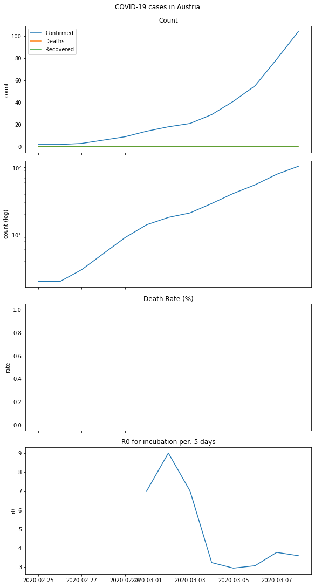


<p>Data extracted from <a href="https://github.com/CSSEGISandData/COVID-19">Johns Hopkins CSSE Data Repository</a></p>


<div>
<style scoped>
    .dataframe tbody tr th:only-of-type {
        vertical-align: middle;
    }

    .dataframe tbody tr th {
        vertical-align: top;
    }

    .dataframe thead th {
        text-align: right;
    }
</style>
<table border="1" class="dataframe">
  <thead>
    <tr style="text-align: right;">
      <th></th>
      <th>Last Update</th>
      <th>Country/Region</th>
      <th>Confirmed</th>
      <th>Deaths</th>
      <th>Recovered</th>
      <th>Death Rate (%)</th>
    </tr>
  </thead>
  <tbody>
    <tr>
      <td>427</td>
      <td>2020-02-25</td>
      <td>Austria</td>
      <td>2.0</td>
      <td>0.0</td>
      <td>0.0</td>
      <td>NaN</td>
    </tr>
    <tr>
      <td>449</td>
      <td>2020-02-26</td>
      <td>Austria</td>
      <td>2.0</td>
      <td>0.0</td>
      <td>0.0</td>
      <td>NaN</td>
    </tr>
    <tr>
      <td>481</td>
      <td>2020-02-27</td>
      <td>Austria</td>
      <td>3.0</td>
      <td>0.0</td>
      <td>0.0</td>
      <td>NaN</td>
    </tr>
    <tr>
      <td>544</td>
      <td>2020-02-29</td>
      <td>Austria</td>
      <td>9.0</td>
      <td>0.0</td>
      <td>0.0</td>
      <td>NaN</td>
    </tr>
    <tr>
      <td>585</td>
      <td>2020-03-01</td>
      <td>Austria</td>
      <td>14.0</td>
      <td>0.0</td>
      <td>0.0</td>
      <td>NaN</td>
    </tr>
    <tr>
      <td>630</td>
      <td>2020-03-02</td>
      <td>Austria</td>
      <td>18.0</td>
      <td>0.0</td>
      <td>0.0</td>
      <td>NaN</td>
    </tr>
    <tr>
      <td>671</td>
      <td>2020-03-03</td>
      <td>Austria</td>
      <td>21.0</td>
      <td>0.0</td>
      <td>0.0</td>
      <td>NaN</td>
    </tr>
    <tr>
      <td>720</td>
      <td>2020-03-04</td>
      <td>Austria</td>
      <td>29.0</td>
      <td>0.0</td>
      <td>0.0</td>
      <td>NaN</td>
    </tr>
    <tr>
      <td>770</td>
      <td>2020-03-05</td>
      <td>Austria</td>
      <td>41.0</td>
      <td>0.0</td>
      <td>0.0</td>
      <td>NaN</td>
    </tr>
    <tr>
      <td>822</td>
      <td>2020-03-06</td>
      <td>Austria</td>
      <td>55.0</td>
      <td>0.0</td>
      <td>0.0</td>
      <td>NaN</td>
    </tr>
    <tr>
      <td>887</td>
      <td>2020-03-07</td>
      <td>Austria</td>
      <td>79.0</td>
      <td>0.0</td>
      <td>0.0</td>
      <td>NaN</td>
    </tr>
    <tr>
      <td>937</td>
      <td>2020-03-08</td>
      <td>Austria</td>
      <td>104.0</td>
      <td>0.0</td>
      <td>0.0</td>
      <td>NaN</td>
    </tr>
  </tbody>
</table>
</div>


<p>r0 calculated as (Confirmed cases at day N + incubation period = 5 days)/(confirmed cases at day N)</p>


<p>Note that this is just a very rough value determined by "garage epidemiology" and should not be used as reference</p>


<div>
<style scoped>
    .dataframe tbody tr th:only-of-type {
        vertical-align: middle;
    }

    .dataframe tbody tr th {
        vertical-align: top;
    }

    .dataframe thead th {
        text-align: right;
    }
</style>
<table border="1" class="dataframe">
  <thead>
    <tr style="text-align: right;">
      <th></th>
      <th>r0</th>
    </tr>
    <tr>
      <th>Last Update</th>
      <th></th>
    </tr>
  </thead>
  <tbody>
    <tr>
      <td>2020-02-25</td>
      <td>NaN</td>
    </tr>
    <tr>
      <td>2020-02-26</td>
      <td>NaN</td>
    </tr>
    <tr>
      <td>2020-02-27</td>
      <td>NaN</td>
    </tr>
    <tr>
      <td>2020-02-29</td>
      <td>NaN</td>
    </tr>
    <tr>
      <td>2020-03-01</td>
      <td>7.000000</td>
    </tr>
    <tr>
      <td>2020-03-02</td>
      <td>9.000000</td>
    </tr>
    <tr>
      <td>2020-03-03</td>
      <td>7.000000</td>
    </tr>
    <tr>
      <td>2020-03-04</td>
      <td>3.222222</td>
    </tr>
    <tr>
      <td>2020-03-05</td>
      <td>2.928571</td>
    </tr>
    <tr>
      <td>2020-03-06</td>
      <td>3.055556</td>
    </tr>
    <tr>
      <td>2020-03-07</td>
      <td>3.761905</td>
    </tr>
    <tr>
      <td>2020-03-08</td>
      <td>3.586207</td>
    </tr>
  </tbody>
</table>
</div>


<h2><a name="azerbaijan" href="#azerbaijan">Azerbaijan</a></h2>


<p>Plot of COVID-19 cases.</p>


<p>Death rate calculated as (count of death)(count of death + count of recovered)</p>


<p>Data extracted from <a href="https://github.com/CSSEGISandData/COVID-19">Johns Hopkins CSSE Data Repository</a></p>


<div>
<style scoped>
    .dataframe tbody tr th:only-of-type {
        vertical-align: middle;
    }

    .dataframe tbody tr th {
        vertical-align: top;
    }

    .dataframe thead th {
        text-align: right;
    }
</style>
<table border="1" class="dataframe">
  <thead>
    <tr style="text-align: right;">
      <th></th>
      <th>Last Update</th>
      <th>Country/Region</th>
      <th>Confirmed</th>
      <th>Deaths</th>
      <th>Recovered</th>
      <th>Death Rate (%)</th>
    </tr>
  </thead>
  <tbody>
    <tr>
      <td>510</td>
      <td>2020-02-28</td>
      <td>Azerbaijan</td>
      <td>1.0</td>
      <td>0.0</td>
      <td>0.0</td>
      <td>NaN</td>
    </tr>
    <tr>
      <td>586</td>
      <td>2020-03-01</td>
      <td>Azerbaijan</td>
      <td>3.0</td>
      <td>0.0</td>
      <td>0.0</td>
      <td>NaN</td>
    </tr>
    <tr>
      <td>771</td>
      <td>2020-03-05</td>
      <td>Azerbaijan</td>
      <td>6.0</td>
      <td>0.0</td>
      <td>0.0</td>
      <td>NaN</td>
    </tr>
    <tr>
      <td>888</td>
      <td>2020-03-07</td>
      <td>Azerbaijan</td>
      <td>9.0</td>
      <td>0.0</td>
      <td>0.0</td>
      <td>NaN</td>
    </tr>
  </tbody>
</table>
</div>


<p>r0 calculated as (Confirmed cases at day N + incubation period = 5 days)/(confirmed cases at day N)</p>


<p>Note that this is just a very rough value determined by "garage epidemiology" and should not be used as reference</p>


<div>
<style scoped>
    .dataframe tbody tr th:only-of-type {
        vertical-align: middle;
    }

    .dataframe tbody tr th {
        vertical-align: top;
    }

    .dataframe thead th {
        text-align: right;
    }
</style>
<table border="1" class="dataframe">
  <thead>
    <tr style="text-align: right;">
      <th></th>
      <th>r0</th>
    </tr>
    <tr>
      <th>Last Update</th>
      <th></th>
    </tr>
  </thead>
  <tbody>
    <tr>
      <td>2020-02-28</td>
      <td>NaN</td>
    </tr>
    <tr>
      <td>2020-03-01</td>
      <td>NaN</td>
    </tr>
    <tr>
      <td>2020-03-05</td>
      <td>NaN</td>
    </tr>
    <tr>
      <td>2020-03-07</td>
      <td>NaN</td>
    </tr>
  </tbody>
</table>
</div>


<h2><a name="bahrain" href="#bahrain">Bahrain</a></h2>


<p>Plot of COVID-19 cases.</p>


<p>Death rate calculated as (count of death)(count of death + count of recovered)</p>


<p>Data extracted from <a href="https://github.com/CSSEGISandData/COVID-19">Johns Hopkins CSSE Data Repository</a></p>


<div>
<style scoped>
    .dataframe tbody tr th:only-of-type {
        vertical-align: middle;
    }

    .dataframe tbody tr th {
        vertical-align: top;
    }

    .dataframe thead th {
        text-align: right;
    }
</style>
<table border="1" class="dataframe">
  <thead>
    <tr style="text-align: right;">
      <th></th>
      <th>Last Update</th>
      <th>Country/Region</th>
      <th>Confirmed</th>
      <th>Deaths</th>
      <th>Recovered</th>
      <th>Death Rate (%)</th>
    </tr>
  </thead>
  <tbody>
    <tr>
      <td>411</td>
      <td>2020-02-24</td>
      <td>Bahrain</td>
      <td>1.0</td>
      <td>0.0</td>
      <td>0.0</td>
      <td>NaN</td>
    </tr>
    <tr>
      <td>428</td>
      <td>2020-02-25</td>
      <td>Bahrain</td>
      <td>23.0</td>
      <td>0.0</td>
      <td>0.0</td>
      <td>NaN</td>
    </tr>
    <tr>
      <td>450</td>
      <td>2020-02-26</td>
      <td>Bahrain</td>
      <td>33.0</td>
      <td>0.0</td>
      <td>0.0</td>
      <td>NaN</td>
    </tr>
    <tr>
      <td>511</td>
      <td>2020-02-28</td>
      <td>Bahrain</td>
      <td>36.0</td>
      <td>0.0</td>
      <td>0.0</td>
      <td>NaN</td>
    </tr>
    <tr>
      <td>545</td>
      <td>2020-02-29</td>
      <td>Bahrain</td>
      <td>41.0</td>
      <td>0.0</td>
      <td>0.0</td>
      <td>NaN</td>
    </tr>
    <tr>
      <td>587</td>
      <td>2020-03-01</td>
      <td>Bahrain</td>
      <td>47.0</td>
      <td>0.0</td>
      <td>0.0</td>
      <td>NaN</td>
    </tr>
    <tr>
      <td>631</td>
      <td>2020-03-02</td>
      <td>Bahrain</td>
      <td>49.0</td>
      <td>0.0</td>
      <td>0.0</td>
      <td>NaN</td>
    </tr>
    <tr>
      <td>721</td>
      <td>2020-03-04</td>
      <td>Bahrain</td>
      <td>52.0</td>
      <td>0.0</td>
      <td>0.0</td>
      <td>NaN</td>
    </tr>
    <tr>
      <td>772</td>
      <td>2020-03-05</td>
      <td>Bahrain</td>
      <td>55.0</td>
      <td>0.0</td>
      <td>0.0</td>
      <td>NaN</td>
    </tr>
    <tr>
      <td>823</td>
      <td>2020-03-06</td>
      <td>Bahrain</td>
      <td>60.0</td>
      <td>0.0</td>
      <td>4.0</td>
      <td>0.0</td>
    </tr>
    <tr>
      <td>889</td>
      <td>2020-03-07</td>
      <td>Bahrain</td>
      <td>85.0</td>
      <td>0.0</td>
      <td>4.0</td>
      <td>0.0</td>
    </tr>
  </tbody>
</table>
</div>


<p>r0 calculated as (Confirmed cases at day N + incubation period = 5 days)/(confirmed cases at day N)</p>


<p>Note that this is just a very rough value determined by "garage epidemiology" and should not be used as reference</p>


<div>
<style scoped>
    .dataframe tbody tr th:only-of-type {
        vertical-align: middle;
    }

    .dataframe tbody tr th {
        vertical-align: top;
    }

    .dataframe thead th {
        text-align: right;
    }
</style>
<table border="1" class="dataframe">
  <thead>
    <tr style="text-align: right;">
      <th></th>
      <th>r0</th>
    </tr>
    <tr>
      <th>Last Update</th>
      <th></th>
    </tr>
  </thead>
  <tbody>
    <tr>
      <td>2020-02-24</td>
      <td>NaN</td>
    </tr>
    <tr>
      <td>2020-02-25</td>
      <td>NaN</td>
    </tr>
    <tr>
      <td>2020-02-26</td>
      <td>NaN</td>
    </tr>
    <tr>
      <td>2020-02-28</td>
      <td>NaN</td>
    </tr>
    <tr>
      <td>2020-02-29</td>
      <td>41.000000</td>
    </tr>
    <tr>
      <td>2020-03-01</td>
      <td>2.043478</td>
    </tr>
    <tr>
      <td>2020-03-02</td>
      <td>1.484848</td>
    </tr>
    <tr>
      <td>2020-03-04</td>
      <td>1.444444</td>
    </tr>
    <tr>
      <td>2020-03-05</td>
      <td>1.341463</td>
    </tr>
    <tr>
      <td>2020-03-06</td>
      <td>1.276596</td>
    </tr>
    <tr>
      <td>2020-03-07</td>
      <td>1.734694</td>
    </tr>
  </tbody>
</table>
</div>


<h2><a name="bangladesh" href="#bangladesh">Bangladesh</a></h2>


<p>Plot of COVID-19 cases.</p>


<p>Death rate calculated as (count of death)(count of death + count of recovered)</p>


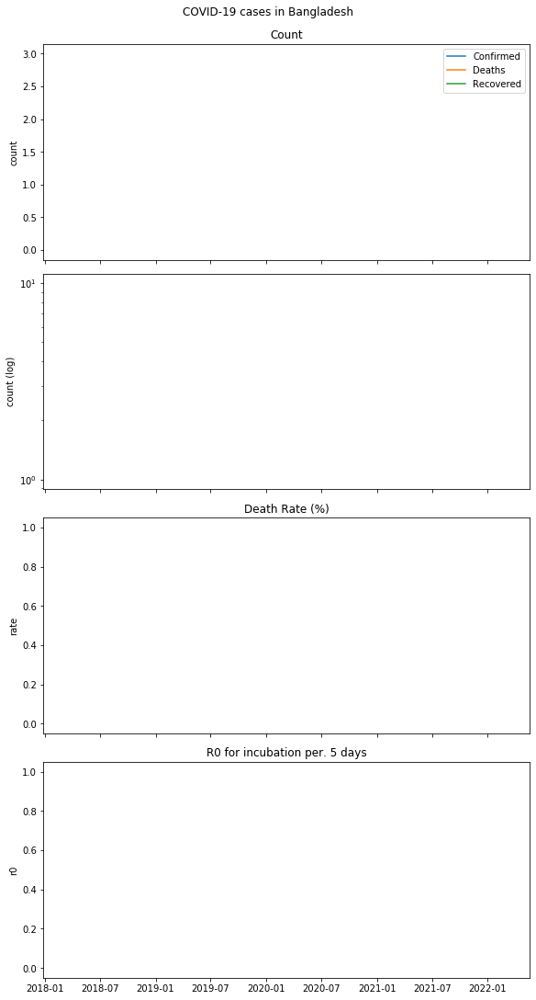


<p>Data extracted from <a href="https://github.com/CSSEGISandData/COVID-19">Johns Hopkins CSSE Data Repository</a></p>


<div>
<style scoped>
    .dataframe tbody tr th:only-of-type {
        vertical-align: middle;
    }

    .dataframe tbody tr th {
        vertical-align: top;
    }

    .dataframe thead th {
        text-align: right;
    }
</style>
<table border="1" class="dataframe">
  <thead>
    <tr style="text-align: right;">
      <th></th>
      <th>Last Update</th>
      <th>Country/Region</th>
      <th>Confirmed</th>
      <th>Deaths</th>
      <th>Recovered</th>
      <th>Death Rate (%)</th>
    </tr>
  </thead>
  <tbody>
    <tr>
      <td>938</td>
      <td>2020-03-08</td>
      <td>Bangladesh</td>
      <td>3.0</td>
      <td>0.0</td>
      <td>0.0</td>
      <td>NaN</td>
    </tr>
  </tbody>
</table>
</div>


<p>r0 calculated as (Confirmed cases at day N + incubation period = 5 days)/(confirmed cases at day N)</p>


<p>Note that this is just a very rough value determined by "garage epidemiology" and should not be used as reference</p>


<div>
<style scoped>
    .dataframe tbody tr th:only-of-type {
        vertical-align: middle;
    }

    .dataframe tbody tr th {
        vertical-align: top;
    }

    .dataframe thead th {
        text-align: right;
    }
</style>
<table border="1" class="dataframe">
  <thead>
    <tr style="text-align: right;">
      <th></th>
      <th>r0</th>
    </tr>
    <tr>
      <th>Last Update</th>
      <th></th>
    </tr>
  </thead>
  <tbody>
    <tr>
      <td>2020-03-08</td>
      <td>NaN</td>
    </tr>
  </tbody>
</table>
</div>


<h2><a name="belarus" href="#belarus">Belarus</a></h2>


<p>Plot of COVID-19 cases.</p>


<p>Death rate calculated as (count of death)(count of death + count of recovered)</p>


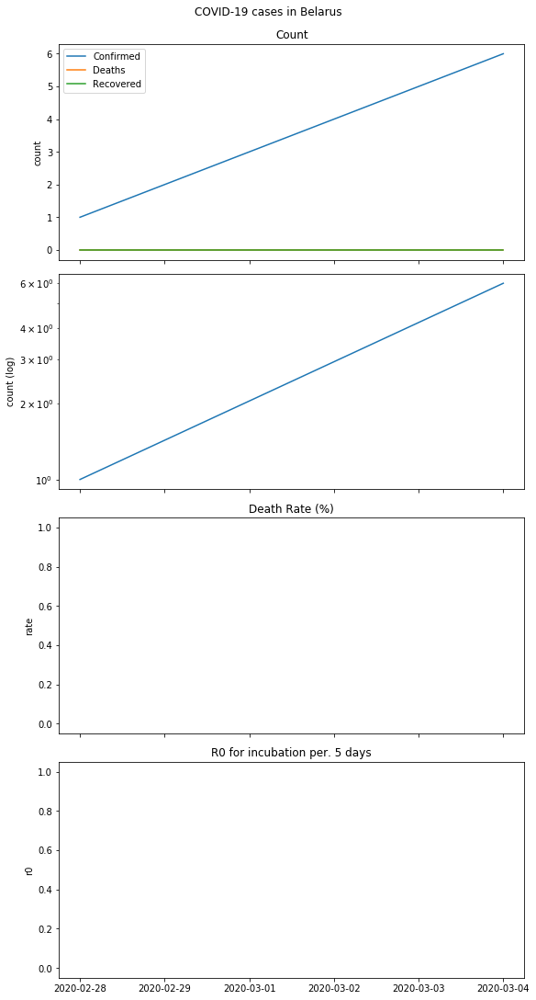


<p>Data extracted from <a href="https://github.com/CSSEGISandData/COVID-19">Johns Hopkins CSSE Data Repository</a></p>


<div>
<style scoped>
    .dataframe tbody tr th:only-of-type {
        vertical-align: middle;
    }

    .dataframe tbody tr th {
        vertical-align: top;
    }

    .dataframe thead th {
        text-align: right;
    }
</style>
<table border="1" class="dataframe">
  <thead>
    <tr style="text-align: right;">
      <th></th>
      <th>Last Update</th>
      <th>Country/Region</th>
      <th>Confirmed</th>
      <th>Deaths</th>
      <th>Recovered</th>
      <th>Death Rate (%)</th>
    </tr>
  </thead>
  <tbody>
    <tr>
      <td>512</td>
      <td>2020-02-28</td>
      <td>Belarus</td>
      <td>1.0</td>
      <td>0.0</td>
      <td>0.0</td>
      <td>NaN</td>
    </tr>
    <tr>
      <td>722</td>
      <td>2020-03-04</td>
      <td>Belarus</td>
      <td>6.0</td>
      <td>0.0</td>
      <td>0.0</td>
      <td>NaN</td>
    </tr>
  </tbody>
</table>
</div>


<p>r0 calculated as (Confirmed cases at day N + incubation period = 5 days)/(confirmed cases at day N)</p>


<p>Note that this is just a very rough value determined by "garage epidemiology" and should not be used as reference</p>


<div>
<style scoped>
    .dataframe tbody tr th:only-of-type {
        vertical-align: middle;
    }

    .dataframe tbody tr th {
        vertical-align: top;
    }

    .dataframe thead th {
        text-align: right;
    }
</style>
<table border="1" class="dataframe">
  <thead>
    <tr style="text-align: right;">
      <th></th>
      <th>r0</th>
    </tr>
    <tr>
      <th>Last Update</th>
      <th></th>
    </tr>
  </thead>
  <tbody>
    <tr>
      <td>2020-02-28</td>
      <td>NaN</td>
    </tr>
    <tr>
      <td>2020-03-04</td>
      <td>NaN</td>
    </tr>
  </tbody>
</table>
</div>


<h2><a name="belgium" href="#belgium">Belgium</a></h2>


<p>Plot of COVID-19 cases.</p>


<p>Death rate calculated as (count of death)(count of death + count of recovered)</p>


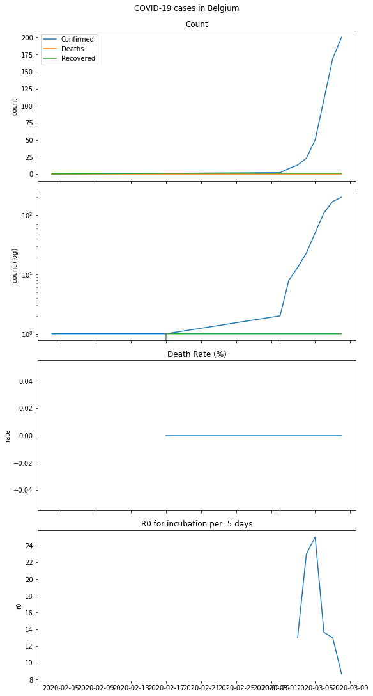


<p>Data extracted from <a href="https://github.com/CSSEGISandData/COVID-19">Johns Hopkins CSSE Data Repository</a></p>


<div>
<style scoped>
    .dataframe tbody tr th:only-of-type {
        vertical-align: middle;
    }

    .dataframe tbody tr th {
        vertical-align: top;
    }

    .dataframe thead th {
        text-align: right;
    }
</style>
<table border="1" class="dataframe">
  <thead>
    <tr style="text-align: right;">
      <th></th>
      <th>Last Update</th>
      <th>Country/Region</th>
      <th>Confirmed</th>
      <th>Deaths</th>
      <th>Recovered</th>
      <th>Death Rate (%)</th>
    </tr>
  </thead>
  <tbody>
    <tr>
      <td>199</td>
      <td>2020-02-04</td>
      <td>Belgium</td>
      <td>1.0</td>
      <td>0.0</td>
      <td>0.0</td>
      <td>NaN</td>
    </tr>
    <tr>
      <td>337</td>
      <td>2020-02-17</td>
      <td>Belgium</td>
      <td>1.0</td>
      <td>0.0</td>
      <td>1.0</td>
      <td>0.0</td>
    </tr>
    <tr>
      <td>588</td>
      <td>2020-03-01</td>
      <td>Belgium</td>
      <td>2.0</td>
      <td>0.0</td>
      <td>1.0</td>
      <td>0.0</td>
    </tr>
    <tr>
      <td>632</td>
      <td>2020-03-02</td>
      <td>Belgium</td>
      <td>8.0</td>
      <td>0.0</td>
      <td>1.0</td>
      <td>0.0</td>
    </tr>
    <tr>
      <td>672</td>
      <td>2020-03-03</td>
      <td>Belgium</td>
      <td>13.0</td>
      <td>0.0</td>
      <td>1.0</td>
      <td>0.0</td>
    </tr>
    <tr>
      <td>723</td>
      <td>2020-03-04</td>
      <td>Belgium</td>
      <td>23.0</td>
      <td>0.0</td>
      <td>1.0</td>
      <td>0.0</td>
    </tr>
    <tr>
      <td>773</td>
      <td>2020-03-05</td>
      <td>Belgium</td>
      <td>50.0</td>
      <td>0.0</td>
      <td>1.0</td>
      <td>0.0</td>
    </tr>
    <tr>
      <td>824</td>
      <td>2020-03-06</td>
      <td>Belgium</td>
      <td>109.0</td>
      <td>0.0</td>
      <td>1.0</td>
      <td>0.0</td>
    </tr>
    <tr>
      <td>890</td>
      <td>2020-03-07</td>
      <td>Belgium</td>
      <td>169.0</td>
      <td>0.0</td>
      <td>1.0</td>
      <td>0.0</td>
    </tr>
    <tr>
      <td>939</td>
      <td>2020-03-08</td>
      <td>Belgium</td>
      <td>200.0</td>
      <td>0.0</td>
      <td>1.0</td>
      <td>0.0</td>
    </tr>
  </tbody>
</table>
</div>


<p>r0 calculated as (Confirmed cases at day N + incubation period = 5 days)/(confirmed cases at day N)</p>


<p>Note that this is just a very rough value determined by "garage epidemiology" and should not be used as reference</p>


<div>
<style scoped>
    .dataframe tbody tr th:only-of-type {
        vertical-align: middle;
    }

    .dataframe tbody tr th {
        vertical-align: top;
    }

    .dataframe thead th {
        text-align: right;
    }
</style>
<table border="1" class="dataframe">
  <thead>
    <tr style="text-align: right;">
      <th></th>
      <th>r0</th>
    </tr>
    <tr>
      <th>Last Update</th>
      <th></th>
    </tr>
  </thead>
  <tbody>
    <tr>
      <td>2020-02-04</td>
      <td>NaN</td>
    </tr>
    <tr>
      <td>2020-02-17</td>
      <td>NaN</td>
    </tr>
    <tr>
      <td>2020-03-01</td>
      <td>NaN</td>
    </tr>
    <tr>
      <td>2020-03-02</td>
      <td>NaN</td>
    </tr>
    <tr>
      <td>2020-03-03</td>
      <td>13.000000</td>
    </tr>
    <tr>
      <td>2020-03-04</td>
      <td>23.000000</td>
    </tr>
    <tr>
      <td>2020-03-05</td>
      <td>25.000000</td>
    </tr>
    <tr>
      <td>2020-03-06</td>
      <td>13.625000</td>
    </tr>
    <tr>
      <td>2020-03-07</td>
      <td>13.000000</td>
    </tr>
    <tr>
      <td>2020-03-08</td>
      <td>8.695652</td>
    </tr>
  </tbody>
</table>
</div>


<h2><a name="bhutan" href="#bhutan">Bhutan</a></h2>


<p>Plot of COVID-19 cases.</p>


<p>Death rate calculated as (count of death)(count of death + count of recovered)</p>


<p>Data extracted from <a href="https://github.com/CSSEGISandData/COVID-19">Johns Hopkins CSSE Data Repository</a></p>


<div>
<style scoped>
    .dataframe tbody tr th:only-of-type {
        vertical-align: middle;
    }

    .dataframe tbody tr th {
        vertical-align: top;
    }

    .dataframe thead th {
        text-align: right;
    }
</style>
<table border="1" class="dataframe">
  <thead>
    <tr style="text-align: right;">
      <th></th>
      <th>Last Update</th>
      <th>Country/Region</th>
      <th>Confirmed</th>
      <th>Deaths</th>
      <th>Recovered</th>
      <th>Death Rate (%)</th>
    </tr>
  </thead>
  <tbody>
    <tr>
      <td>825</td>
      <td>2020-03-06</td>
      <td>Bhutan</td>
      <td>1.0</td>
      <td>0.0</td>
      <td>0.0</td>
      <td>NaN</td>
    </tr>
  </tbody>
</table>
</div>


<p>r0 calculated as (Confirmed cases at day N + incubation period = 5 days)/(confirmed cases at day N)</p>


<p>Note that this is just a very rough value determined by "garage epidemiology" and should not be used as reference</p>


<div>
<style scoped>
    .dataframe tbody tr th:only-of-type {
        vertical-align: middle;
    }

    .dataframe tbody tr th {
        vertical-align: top;
    }

    .dataframe thead th {
        text-align: right;
    }
</style>
<table border="1" class="dataframe">
  <thead>
    <tr style="text-align: right;">
      <th></th>
      <th>r0</th>
    </tr>
    <tr>
      <th>Last Update</th>
      <th></th>
    </tr>
  </thead>
  <tbody>
    <tr>
      <td>2020-03-06</td>
      <td>NaN</td>
    </tr>
  </tbody>
</table>
</div>


<h2><a name="bosnia_and_herzegovina" href="#bosnia_and_herzegovina">Bosnia and Herzegovina</a></h2>


<p>Plot of COVID-19 cases.</p>


<p>Death rate calculated as (count of death)(count of death + count of recovered)</p>


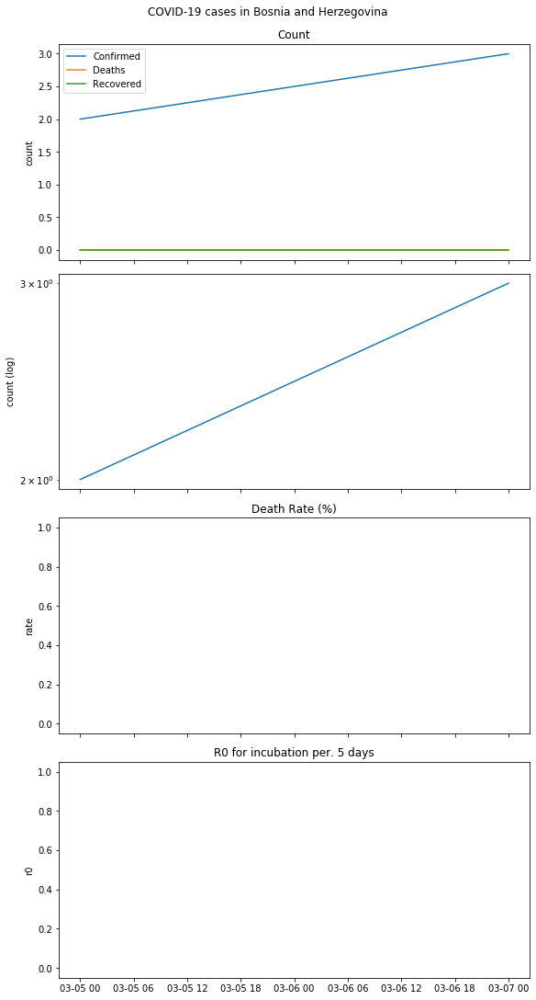


<p>Data extracted from <a href="https://github.com/CSSEGISandData/COVID-19">Johns Hopkins CSSE Data Repository</a></p>


<div>
<style scoped>
    .dataframe tbody tr th:only-of-type {
        vertical-align: middle;
    }

    .dataframe tbody tr th {
        vertical-align: top;
    }

    .dataframe thead th {
        text-align: right;
    }
</style>
<table border="1" class="dataframe">
  <thead>
    <tr style="text-align: right;">
      <th></th>
      <th>Last Update</th>
      <th>Country/Region</th>
      <th>Confirmed</th>
      <th>Deaths</th>
      <th>Recovered</th>
      <th>Death Rate (%)</th>
    </tr>
  </thead>
  <tbody>
    <tr>
      <td>774</td>
      <td>2020-03-05</td>
      <td>Bosnia and Herzegovina</td>
      <td>2.0</td>
      <td>0.0</td>
      <td>0.0</td>
      <td>NaN</td>
    </tr>
    <tr>
      <td>891</td>
      <td>2020-03-07</td>
      <td>Bosnia and Herzegovina</td>
      <td>3.0</td>
      <td>0.0</td>
      <td>0.0</td>
      <td>NaN</td>
    </tr>
  </tbody>
</table>
</div>


<p>r0 calculated as (Confirmed cases at day N + incubation period = 5 days)/(confirmed cases at day N)</p>


<p>Note that this is just a very rough value determined by "garage epidemiology" and should not be used as reference</p>


<div>
<style scoped>
    .dataframe tbody tr th:only-of-type {
        vertical-align: middle;
    }

    .dataframe tbody tr th {
        vertical-align: top;
    }

    .dataframe thead th {
        text-align: right;
    }
</style>
<table border="1" class="dataframe">
  <thead>
    <tr style="text-align: right;">
      <th></th>
      <th>r0</th>
    </tr>
    <tr>
      <th>Last Update</th>
      <th></th>
    </tr>
  </thead>
  <tbody>
    <tr>
      <td>2020-03-05</td>
      <td>NaN</td>
    </tr>
    <tr>
      <td>2020-03-07</td>
      <td>NaN</td>
    </tr>
  </tbody>
</table>
</div>


<h2><a name="brazil" href="#brazil">Brazil</a></h2>


<p>Plot of COVID-19 cases.</p>


<p>Death rate calculated as (count of death)(count of death + count of recovered)</p>


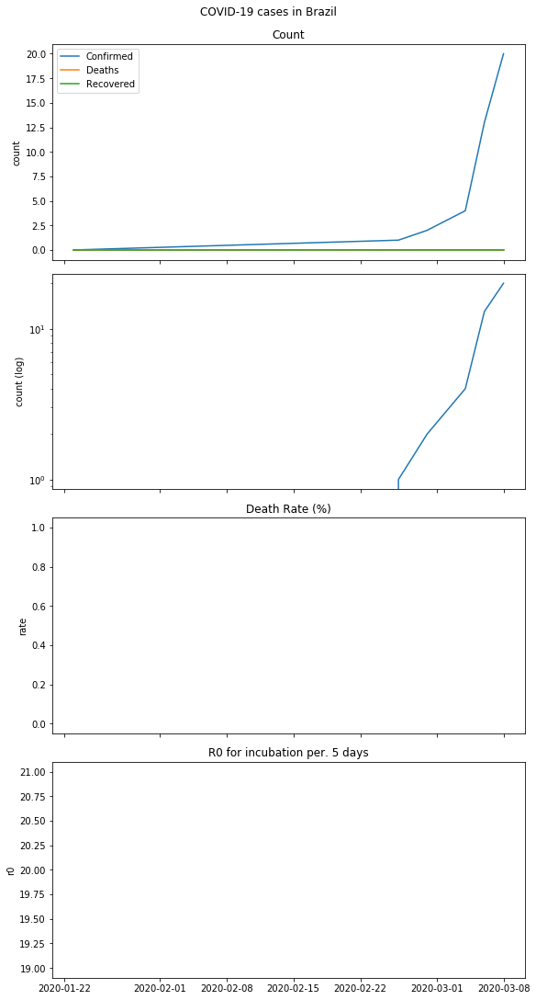


<p>Data extracted from <a href="https://github.com/CSSEGISandData/COVID-19">Johns Hopkins CSSE Data Repository</a></p>


<div>
<style scoped>
    .dataframe tbody tr th:only-of-type {
        vertical-align: middle;
    }

    .dataframe tbody tr th {
        vertical-align: top;
    }

    .dataframe thead th {
        text-align: right;
    }
</style>
<table border="1" class="dataframe">
  <thead>
    <tr style="text-align: right;">
      <th></th>
      <th>Last Update</th>
      <th>Country/Region</th>
      <th>Confirmed</th>
      <th>Deaths</th>
      <th>Recovered</th>
      <th>Death Rate (%)</th>
    </tr>
  </thead>
  <tbody>
    <tr>
      <td>9</td>
      <td>2020-01-23</td>
      <td>Brazil</td>
      <td>0.0</td>
      <td>0.0</td>
      <td>0.0</td>
      <td>NaN</td>
    </tr>
    <tr>
      <td>451</td>
      <td>2020-02-26</td>
      <td>Brazil</td>
      <td>1.0</td>
      <td>0.0</td>
      <td>0.0</td>
      <td>NaN</td>
    </tr>
    <tr>
      <td>546</td>
      <td>2020-02-29</td>
      <td>Brazil</td>
      <td>2.0</td>
      <td>0.0</td>
      <td>0.0</td>
      <td>NaN</td>
    </tr>
    <tr>
      <td>724</td>
      <td>2020-03-04</td>
      <td>Brazil</td>
      <td>4.0</td>
      <td>0.0</td>
      <td>0.0</td>
      <td>NaN</td>
    </tr>
    <tr>
      <td>826</td>
      <td>2020-03-06</td>
      <td>Brazil</td>
      <td>13.0</td>
      <td>0.0</td>
      <td>0.0</td>
      <td>NaN</td>
    </tr>
    <tr>
      <td>940</td>
      <td>2020-03-08</td>
      <td>Brazil</td>
      <td>20.0</td>
      <td>0.0</td>
      <td>0.0</td>
      <td>NaN</td>
    </tr>
  </tbody>
</table>
</div>


<p>r0 calculated as (Confirmed cases at day N + incubation period = 5 days)/(confirmed cases at day N)</p>


<p>Note that this is just a very rough value determined by "garage epidemiology" and should not be used as reference</p>


<div>
<style scoped>
    .dataframe tbody tr th:only-of-type {
        vertical-align: middle;
    }

    .dataframe tbody tr th {
        vertical-align: top;
    }

    .dataframe thead th {
        text-align: right;
    }
</style>
<table border="1" class="dataframe">
  <thead>
    <tr style="text-align: right;">
      <th></th>
      <th>r0</th>
    </tr>
    <tr>
      <th>Last Update</th>
      <th></th>
    </tr>
  </thead>
  <tbody>
    <tr>
      <td>2020-01-23</td>
      <td>NaN</td>
    </tr>
    <tr>
      <td>2020-02-26</td>
      <td>NaN</td>
    </tr>
    <tr>
      <td>2020-02-29</td>
      <td>NaN</td>
    </tr>
    <tr>
      <td>2020-03-04</td>
      <td>NaN</td>
    </tr>
    <tr>
      <td>2020-03-06</td>
      <td>inf</td>
    </tr>
    <tr>
      <td>2020-03-08</td>
      <td>20.0</td>
    </tr>
  </tbody>
</table>
</div>


<h2><a name="bulgaria" href="#bulgaria">Bulgaria</a></h2>


<p>Plot of COVID-19 cases.</p>


<p>Death rate calculated as (count of death)(count of death + count of recovered)</p>


<p>Data extracted from <a href="https://github.com/CSSEGISandData/COVID-19">Johns Hopkins CSSE Data Repository</a></p>


<div>
<style scoped>
    .dataframe tbody tr th:only-of-type {
        vertical-align: middle;
    }

    .dataframe tbody tr th {
        vertical-align: top;
    }

    .dataframe thead th {
        text-align: right;
    }
</style>
<table border="1" class="dataframe">
  <thead>
    <tr style="text-align: right;">
      <th></th>
      <th>Last Update</th>
      <th>Country/Region</th>
      <th>Confirmed</th>
      <th>Deaths</th>
      <th>Recovered</th>
      <th>Death Rate (%)</th>
    </tr>
  </thead>
  <tbody>
    <tr>
      <td>941</td>
      <td>2020-03-08</td>
      <td>Bulgaria</td>
      <td>4.0</td>
      <td>0.0</td>
      <td>0.0</td>
      <td>NaN</td>
    </tr>
  </tbody>
</table>
</div>


<p>r0 calculated as (Confirmed cases at day N + incubation period = 5 days)/(confirmed cases at day N)</p>


<p>Note that this is just a very rough value determined by "garage epidemiology" and should not be used as reference</p>


<div>
<style scoped>
    .dataframe tbody tr th:only-of-type {
        vertical-align: middle;
    }

    .dataframe tbody tr th {
        vertical-align: top;
    }

    .dataframe thead th {
        text-align: right;
    }
</style>
<table border="1" class="dataframe">
  <thead>
    <tr style="text-align: right;">
      <th></th>
      <th>r0</th>
    </tr>
    <tr>
      <th>Last Update</th>
      <th></th>
    </tr>
  </thead>
  <tbody>
    <tr>
      <td>2020-03-08</td>
      <td>NaN</td>
    </tr>
  </tbody>
</table>
</div>


<h2><a name="cambodia" href="#cambodia">Cambodia</a></h2>


<p>Plot of COVID-19 cases.</p>


<p>Death rate calculated as (count of death)(count of death + count of recovered)</p>


<p>Data extracted from <a href="https://github.com/CSSEGISandData/COVID-19">Johns Hopkins CSSE Data Repository</a></p>


<div>
<style scoped>
    .dataframe tbody tr th:only-of-type {
        vertical-align: middle;
    }

    .dataframe tbody tr th {
        vertical-align: top;
    }

    .dataframe thead th {
        text-align: right;
    }
</style>
<table border="1" class="dataframe">
  <thead>
    <tr style="text-align: right;">
      <th></th>
      <th>Last Update</th>
      <th>Country/Region</th>
      <th>Confirmed</th>
      <th>Deaths</th>
      <th>Recovered</th>
      <th>Death Rate (%)</th>
    </tr>
  </thead>
  <tbody>
    <tr>
      <td>65</td>
      <td>2020-01-27</td>
      <td>Cambodia</td>
      <td>1.0</td>
      <td>0.0</td>
      <td>0.0</td>
      <td>NaN</td>
    </tr>
    <tr>
      <td>83</td>
      <td>2020-01-28</td>
      <td>Cambodia</td>
      <td>1.0</td>
      <td>0.0</td>
      <td>0.0</td>
      <td>NaN</td>
    </tr>
    <tr>
      <td>101</td>
      <td>2020-01-29</td>
      <td>Cambodia</td>
      <td>1.0</td>
      <td>0.0</td>
      <td>0.0</td>
      <td>NaN</td>
    </tr>
    <tr>
      <td>121</td>
      <td>2020-01-30</td>
      <td>Cambodia</td>
      <td>1.0</td>
      <td>0.0</td>
      <td>0.0</td>
      <td>NaN</td>
    </tr>
    <tr>
      <td>143</td>
      <td>2020-01-31</td>
      <td>Cambodia</td>
      <td>1.0</td>
      <td>0.0</td>
      <td>0.0</td>
      <td>NaN</td>
    </tr>
    <tr>
      <td>279</td>
      <td>2020-02-12</td>
      <td>Cambodia</td>
      <td>1.0</td>
      <td>0.0</td>
      <td>1.0</td>
      <td>0.0</td>
    </tr>
    <tr>
      <td>942</td>
      <td>2020-03-08</td>
      <td>Cambodia</td>
      <td>2.0</td>
      <td>0.0</td>
      <td>1.0</td>
      <td>0.0</td>
    </tr>
  </tbody>
</table>
</div>


<p>r0 calculated as (Confirmed cases at day N + incubation period = 5 days)/(confirmed cases at day N)</p>


<p>Note that this is just a very rough value determined by "garage epidemiology" and should not be used as reference</p>


<div>
<style scoped>
    .dataframe tbody tr th:only-of-type {
        vertical-align: middle;
    }

    .dataframe tbody tr th {
        vertical-align: top;
    }

    .dataframe thead th {
        text-align: right;
    }
</style>
<table border="1" class="dataframe">
  <thead>
    <tr style="text-align: right;">
      <th></th>
      <th>r0</th>
    </tr>
    <tr>
      <th>Last Update</th>
      <th></th>
    </tr>
  </thead>
  <tbody>
    <tr>
      <td>2020-01-27</td>
      <td>NaN</td>
    </tr>
    <tr>
      <td>2020-01-28</td>
      <td>NaN</td>
    </tr>
    <tr>
      <td>2020-01-29</td>
      <td>NaN</td>
    </tr>
    <tr>
      <td>2020-01-30</td>
      <td>NaN</td>
    </tr>
    <tr>
      <td>2020-01-31</td>
      <td>1.0</td>
    </tr>
    <tr>
      <td>2020-02-12</td>
      <td>1.0</td>
    </tr>
    <tr>
      <td>2020-03-08</td>
      <td>2.0</td>
    </tr>
  </tbody>
</table>
</div>


<h2><a name="cameroon" href="#cameroon">Cameroon</a></h2>


<p>Plot of COVID-19 cases.</p>


<p>Death rate calculated as (count of death)(count of death + count of recovered)</p>


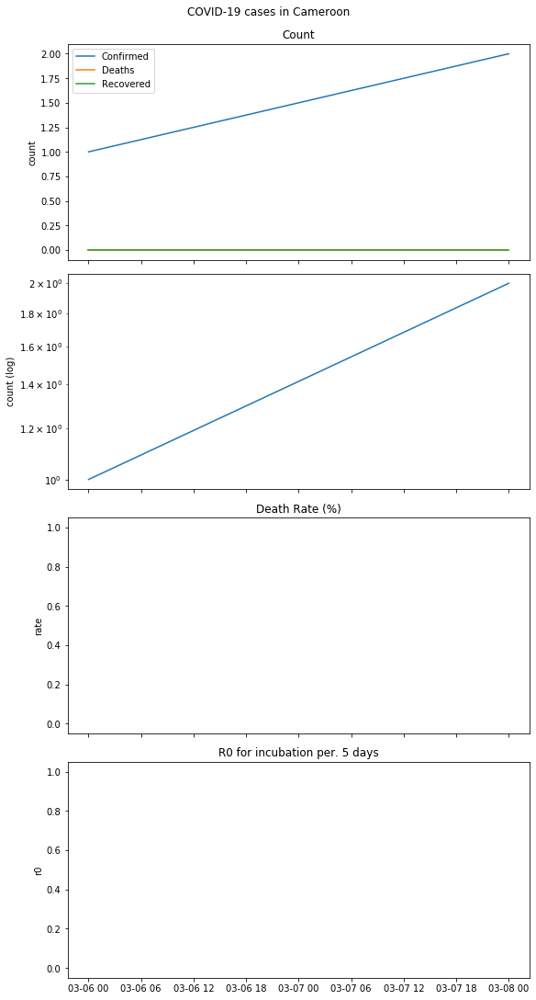


<p>Data extracted from <a href="https://github.com/CSSEGISandData/COVID-19">Johns Hopkins CSSE Data Repository</a></p>


<div>
<style scoped>
    .dataframe tbody tr th:only-of-type {
        vertical-align: middle;
    }

    .dataframe tbody tr th {
        vertical-align: top;
    }

    .dataframe thead th {
        text-align: right;
    }
</style>
<table border="1" class="dataframe">
  <thead>
    <tr style="text-align: right;">
      <th></th>
      <th>Last Update</th>
      <th>Country/Region</th>
      <th>Confirmed</th>
      <th>Deaths</th>
      <th>Recovered</th>
      <th>Death Rate (%)</th>
    </tr>
  </thead>
  <tbody>
    <tr>
      <td>827</td>
      <td>2020-03-06</td>
      <td>Cameroon</td>
      <td>1.0</td>
      <td>0.0</td>
      <td>0.0</td>
      <td>NaN</td>
    </tr>
    <tr>
      <td>943</td>
      <td>2020-03-08</td>
      <td>Cameroon</td>
      <td>2.0</td>
      <td>0.0</td>
      <td>0.0</td>
      <td>NaN</td>
    </tr>
  </tbody>
</table>
</div>


<p>r0 calculated as (Confirmed cases at day N + incubation period = 5 days)/(confirmed cases at day N)</p>


<p>Note that this is just a very rough value determined by "garage epidemiology" and should not be used as reference</p>


<div>
<style scoped>
    .dataframe tbody tr th:only-of-type {
        vertical-align: middle;
    }

    .dataframe tbody tr th {
        vertical-align: top;
    }

    .dataframe thead th {
        text-align: right;
    }
</style>
<table border="1" class="dataframe">
  <thead>
    <tr style="text-align: right;">
      <th></th>
      <th>r0</th>
    </tr>
    <tr>
      <th>Last Update</th>
      <th></th>
    </tr>
  </thead>
  <tbody>
    <tr>
      <td>2020-03-06</td>
      <td>NaN</td>
    </tr>
    <tr>
      <td>2020-03-08</td>
      <td>NaN</td>
    </tr>
  </tbody>
</table>
</div>


<h2><a name="canada" href="#canada">Canada</a></h2>


<p>Plot of COVID-19 cases.</p>


<p>Death rate calculated as (count of death)(count of death + count of recovered)</p>


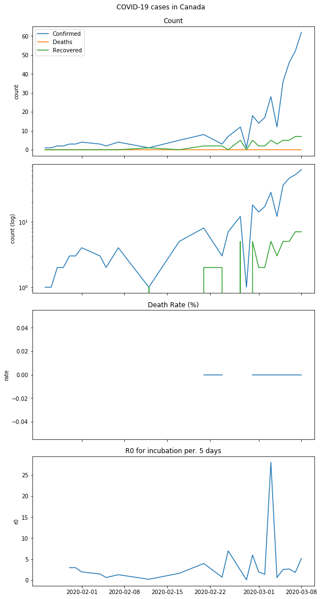


<p>Data extracted from <a href="https://github.com/CSSEGISandData/COVID-19">Johns Hopkins CSSE Data Repository</a></p>


<div>
<style scoped>
    .dataframe tbody tr th:only-of-type {
        vertical-align: middle;
    }

    .dataframe tbody tr th {
        vertical-align: top;
    }

    .dataframe thead th {
        text-align: right;
    }
</style>
<table border="1" class="dataframe">
  <thead>
    <tr style="text-align: right;">
      <th></th>
      <th>Last Update</th>
      <th>Country/Region</th>
      <th>Confirmed</th>
      <th>Deaths</th>
      <th>Recovered</th>
      <th>Death Rate (%)</th>
    </tr>
  </thead>
  <tbody>
    <tr>
      <td>50</td>
      <td>2020-01-26</td>
      <td>Canada</td>
      <td>1.0</td>
      <td>0.0</td>
      <td>0.0</td>
      <td>NaN</td>
    </tr>
    <tr>
      <td>66</td>
      <td>2020-01-27</td>
      <td>Canada</td>
      <td>1.0</td>
      <td>0.0</td>
      <td>0.0</td>
      <td>NaN</td>
    </tr>
    <tr>
      <td>84</td>
      <td>2020-01-28</td>
      <td>Canada</td>
      <td>2.0</td>
      <td>0.0</td>
      <td>0.0</td>
      <td>NaN</td>
    </tr>
    <tr>
      <td>102</td>
      <td>2020-01-29</td>
      <td>Canada</td>
      <td>2.0</td>
      <td>0.0</td>
      <td>0.0</td>
      <td>NaN</td>
    </tr>
    <tr>
      <td>122</td>
      <td>2020-01-30</td>
      <td>Canada</td>
      <td>3.0</td>
      <td>0.0</td>
      <td>0.0</td>
      <td>NaN</td>
    </tr>
    <tr>
      <td>144</td>
      <td>2020-01-31</td>
      <td>Canada</td>
      <td>3.0</td>
      <td>0.0</td>
      <td>0.0</td>
      <td>NaN</td>
    </tr>
    <tr>
      <td>169</td>
      <td>2020-02-01</td>
      <td>Canada</td>
      <td>4.0</td>
      <td>0.0</td>
      <td>0.0</td>
      <td>NaN</td>
    </tr>
    <tr>
      <td>200</td>
      <td>2020-02-04</td>
      <td>Canada</td>
      <td>3.0</td>
      <td>0.0</td>
      <td>0.0</td>
      <td>NaN</td>
    </tr>
    <tr>
      <td>210</td>
      <td>2020-02-05</td>
      <td>Canada</td>
      <td>2.0</td>
      <td>0.0</td>
      <td>0.0</td>
      <td>NaN</td>
    </tr>
    <tr>
      <td>226</td>
      <td>2020-02-07</td>
      <td>Canada</td>
      <td>4.0</td>
      <td>0.0</td>
      <td>0.0</td>
      <td>NaN</td>
    </tr>
    <tr>
      <td>280</td>
      <td>2020-02-12</td>
      <td>Canada</td>
      <td>1.0</td>
      <td>0.0</td>
      <td>1.0</td>
      <td>0.0</td>
    </tr>
    <tr>
      <td>338</td>
      <td>2020-02-17</td>
      <td>Canada</td>
      <td>5.0</td>
      <td>0.0</td>
      <td>0.0</td>
      <td>NaN</td>
    </tr>
    <tr>
      <td>372</td>
      <td>2020-02-21</td>
      <td>Canada</td>
      <td>8.0</td>
      <td>0.0</td>
      <td>2.0</td>
      <td>0.0</td>
    </tr>
    <tr>
      <td>412</td>
      <td>2020-02-24</td>
      <td>Canada</td>
      <td>3.0</td>
      <td>0.0</td>
      <td>2.0</td>
      <td>0.0</td>
    </tr>
    <tr>
      <td>429</td>
      <td>2020-02-25</td>
      <td>Canada</td>
      <td>7.0</td>
      <td>0.0</td>
      <td>0.0</td>
      <td>NaN</td>
    </tr>
    <tr>
      <td>482</td>
      <td>2020-02-27</td>
      <td>Canada</td>
      <td>12.0</td>
      <td>0.0</td>
      <td>5.0</td>
      <td>0.0</td>
    </tr>
    <tr>
      <td>513</td>
      <td>2020-02-28</td>
      <td>Canada</td>
      <td>1.0</td>
      <td>0.0</td>
      <td>0.0</td>
      <td>NaN</td>
    </tr>
    <tr>
      <td>547</td>
      <td>2020-02-29</td>
      <td>Canada</td>
      <td>18.0</td>
      <td>0.0</td>
      <td>5.0</td>
      <td>0.0</td>
    </tr>
    <tr>
      <td>589</td>
      <td>2020-03-01</td>
      <td>Canada</td>
      <td>14.0</td>
      <td>0.0</td>
      <td>2.0</td>
      <td>0.0</td>
    </tr>
    <tr>
      <td>633</td>
      <td>2020-03-02</td>
      <td>Canada</td>
      <td>17.0</td>
      <td>0.0</td>
      <td>2.0</td>
      <td>0.0</td>
    </tr>
    <tr>
      <td>673</td>
      <td>2020-03-03</td>
      <td>Canada</td>
      <td>28.0</td>
      <td>0.0</td>
      <td>5.0</td>
      <td>0.0</td>
    </tr>
    <tr>
      <td>725</td>
      <td>2020-03-04</td>
      <td>Canada</td>
      <td>12.0</td>
      <td>0.0</td>
      <td>3.0</td>
      <td>0.0</td>
    </tr>
    <tr>
      <td>775</td>
      <td>2020-03-05</td>
      <td>Canada</td>
      <td>36.0</td>
      <td>0.0</td>
      <td>5.0</td>
      <td>0.0</td>
    </tr>
    <tr>
      <td>828</td>
      <td>2020-03-06</td>
      <td>Canada</td>
      <td>46.0</td>
      <td>0.0</td>
      <td>5.0</td>
      <td>0.0</td>
    </tr>
    <tr>
      <td>892</td>
      <td>2020-03-07</td>
      <td>Canada</td>
      <td>52.0</td>
      <td>0.0</td>
      <td>7.0</td>
      <td>0.0</td>
    </tr>
    <tr>
      <td>944</td>
      <td>2020-03-08</td>
      <td>Canada</td>
      <td>62.0</td>
      <td>0.0</td>
      <td>7.0</td>
      <td>0.0</td>
    </tr>
  </tbody>
</table>
</div>


<p>r0 calculated as (Confirmed cases at day N + incubation period = 5 days)/(confirmed cases at day N)</p>


<p>Note that this is just a very rough value determined by "garage epidemiology" and should not be used as reference</p>


<div>
<style scoped>
    .dataframe tbody tr th:only-of-type {
        vertical-align: middle;
    }

    .dataframe tbody tr th {
        vertical-align: top;
    }

    .dataframe thead th {
        text-align: right;
    }
</style>
<table border="1" class="dataframe">
  <thead>
    <tr style="text-align: right;">
      <th></th>
      <th>r0</th>
    </tr>
    <tr>
      <th>Last Update</th>
      <th></th>
    </tr>
  </thead>
  <tbody>
    <tr>
      <td>2020-01-26</td>
      <td>NaN</td>
    </tr>
    <tr>
      <td>2020-01-27</td>
      <td>NaN</td>
    </tr>
    <tr>
      <td>2020-01-28</td>
      <td>NaN</td>
    </tr>
    <tr>
      <td>2020-01-29</td>
      <td>NaN</td>
    </tr>
    <tr>
      <td>2020-01-30</td>
      <td>3.000000</td>
    </tr>
    <tr>
      <td>2020-01-31</td>
      <td>3.000000</td>
    </tr>
    <tr>
      <td>2020-02-01</td>
      <td>2.000000</td>
    </tr>
    <tr>
      <td>2020-02-04</td>
      <td>1.500000</td>
    </tr>
    <tr>
      <td>2020-02-05</td>
      <td>0.666667</td>
    </tr>
    <tr>
      <td>2020-02-07</td>
      <td>1.333333</td>
    </tr>
    <tr>
      <td>2020-02-12</td>
      <td>0.250000</td>
    </tr>
    <tr>
      <td>2020-02-17</td>
      <td>1.666667</td>
    </tr>
    <tr>
      <td>2020-02-21</td>
      <td>4.000000</td>
    </tr>
    <tr>
      <td>2020-02-24</td>
      <td>0.750000</td>
    </tr>
    <tr>
      <td>2020-02-25</td>
      <td>7.000000</td>
    </tr>
    <tr>
      <td>2020-02-27</td>
      <td>2.400000</td>
    </tr>
    <tr>
      <td>2020-02-28</td>
      <td>0.125000</td>
    </tr>
    <tr>
      <td>2020-02-29</td>
      <td>6.000000</td>
    </tr>
    <tr>
      <td>2020-03-01</td>
      <td>2.000000</td>
    </tr>
    <tr>
      <td>2020-03-02</td>
      <td>1.416667</td>
    </tr>
    <tr>
      <td>2020-03-03</td>
      <td>28.000000</td>
    </tr>
    <tr>
      <td>2020-03-04</td>
      <td>0.666667</td>
    </tr>
    <tr>
      <td>2020-03-05</td>
      <td>2.571429</td>
    </tr>
    <tr>
      <td>2020-03-06</td>
      <td>2.705882</td>
    </tr>
    <tr>
      <td>2020-03-07</td>
      <td>1.857143</td>
    </tr>
    <tr>
      <td>2020-03-08</td>
      <td>5.166667</td>
    </tr>
  </tbody>
</table>
</div>


<h2><a name="chile" href="#chile">Chile</a></h2>


<p>Plot of COVID-19 cases.</p>


<p>Death rate calculated as (count of death)(count of death + count of recovered)</p>


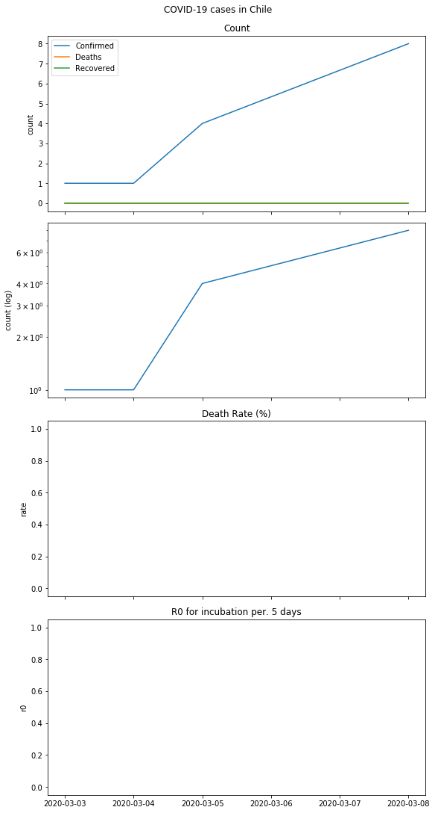


<p>Data extracted from <a href="https://github.com/CSSEGISandData/COVID-19">Johns Hopkins CSSE Data Repository</a></p>


<div>
<style scoped>
    .dataframe tbody tr th:only-of-type {
        vertical-align: middle;
    }

    .dataframe tbody tr th {
        vertical-align: top;
    }

    .dataframe thead th {
        text-align: right;
    }
</style>
<table border="1" class="dataframe">
  <thead>
    <tr style="text-align: right;">
      <th></th>
      <th>Last Update</th>
      <th>Country/Region</th>
      <th>Confirmed</th>
      <th>Deaths</th>
      <th>Recovered</th>
      <th>Death Rate (%)</th>
    </tr>
  </thead>
  <tbody>
    <tr>
      <td>674</td>
      <td>2020-03-03</td>
      <td>Chile</td>
      <td>1.0</td>
      <td>0.0</td>
      <td>0.0</td>
      <td>NaN</td>
    </tr>
    <tr>
      <td>726</td>
      <td>2020-03-04</td>
      <td>Chile</td>
      <td>1.0</td>
      <td>0.0</td>
      <td>0.0</td>
      <td>NaN</td>
    </tr>
    <tr>
      <td>776</td>
      <td>2020-03-05</td>
      <td>Chile</td>
      <td>4.0</td>
      <td>0.0</td>
      <td>0.0</td>
      <td>NaN</td>
    </tr>
    <tr>
      <td>945</td>
      <td>2020-03-08</td>
      <td>Chile</td>
      <td>8.0</td>
      <td>0.0</td>
      <td>0.0</td>
      <td>NaN</td>
    </tr>
  </tbody>
</table>
</div>


<p>r0 calculated as (Confirmed cases at day N + incubation period = 5 days)/(confirmed cases at day N)</p>


<p>Note that this is just a very rough value determined by "garage epidemiology" and should not be used as reference</p>


<div>
<style scoped>
    .dataframe tbody tr th:only-of-type {
        vertical-align: middle;
    }

    .dataframe tbody tr th {
        vertical-align: top;
    }

    .dataframe thead th {
        text-align: right;
    }
</style>
<table border="1" class="dataframe">
  <thead>
    <tr style="text-align: right;">
      <th></th>
      <th>r0</th>
    </tr>
    <tr>
      <th>Last Update</th>
      <th></th>
    </tr>
  </thead>
  <tbody>
    <tr>
      <td>2020-03-03</td>
      <td>NaN</td>
    </tr>
    <tr>
      <td>2020-03-04</td>
      <td>NaN</td>
    </tr>
    <tr>
      <td>2020-03-05</td>
      <td>NaN</td>
    </tr>
    <tr>
      <td>2020-03-08</td>
      <td>NaN</td>
    </tr>
  </tbody>
</table>
</div>


<h2><a name="colombia" href="#colombia">Colombia</a></h2>


    /opt/conda/lib/python3.7/site-packages/ipykernel_launcher.py:7: RuntimeWarning: More than 20 figures have been opened. Figures created through the pyplot interface (`matplotlib.pyplot.figure`) are retained until explicitly closed and may consume too much memory. (To control this warning, see the rcParam `figure.max_open_warning`).
      import sys


<p>Plot of COVID-19 cases.</p>


<p>Death rate calculated as (count of death)(count of death + count of recovered)</p>


<p>Data extracted from <a href="https://github.com/CSSEGISandData/COVID-19">Johns Hopkins CSSE Data Repository</a></p>


<div>
<style scoped>
    .dataframe tbody tr th:only-of-type {
        vertical-align: middle;
    }

    .dataframe tbody tr th {
        vertical-align: top;
    }

    .dataframe thead th {
        text-align: right;
    }
</style>
<table border="1" class="dataframe">
  <thead>
    <tr style="text-align: right;">
      <th></th>
      <th>Last Update</th>
      <th>Country/Region</th>
      <th>Confirmed</th>
      <th>Deaths</th>
      <th>Recovered</th>
      <th>Death Rate (%)</th>
    </tr>
  </thead>
  <tbody>
    <tr>
      <td>10</td>
      <td>2020-01-23</td>
      <td>Colombia</td>
      <td>0.0</td>
      <td>0.0</td>
      <td>0.0</td>
      <td>NaN</td>
    </tr>
    <tr>
      <td>829</td>
      <td>2020-03-06</td>
      <td>Colombia</td>
      <td>1.0</td>
      <td>0.0</td>
      <td>0.0</td>
      <td>NaN</td>
    </tr>
    <tr>
      <td>893</td>
      <td>2020-03-07</td>
      <td>Colombia</td>
      <td>1.0</td>
      <td>0.0</td>
      <td>0.0</td>
      <td>NaN</td>
    </tr>
  </tbody>
</table>
</div>


<p>r0 calculated as (Confirmed cases at day N + incubation period = 5 days)/(confirmed cases at day N)</p>


<p>Note that this is just a very rough value determined by "garage epidemiology" and should not be used as reference</p>


<div>
<style scoped>
    .dataframe tbody tr th:only-of-type {
        vertical-align: middle;
    }

    .dataframe tbody tr th {
        vertical-align: top;
    }

    .dataframe thead th {
        text-align: right;
    }
</style>
<table border="1" class="dataframe">
  <thead>
    <tr style="text-align: right;">
      <th></th>
      <th>r0</th>
    </tr>
    <tr>
      <th>Last Update</th>
      <th></th>
    </tr>
  </thead>
  <tbody>
    <tr>
      <td>2020-01-23</td>
      <td>NaN</td>
    </tr>
    <tr>
      <td>2020-03-06</td>
      <td>NaN</td>
    </tr>
    <tr>
      <td>2020-03-07</td>
      <td>NaN</td>
    </tr>
  </tbody>
</table>
</div>


<h2><a name="costa_rica" href="#costa_rica">Costa Rica</a></h2>


<p>Plot of COVID-19 cases.</p>


<p>Death rate calculated as (count of death)(count of death + count of recovered)</p>


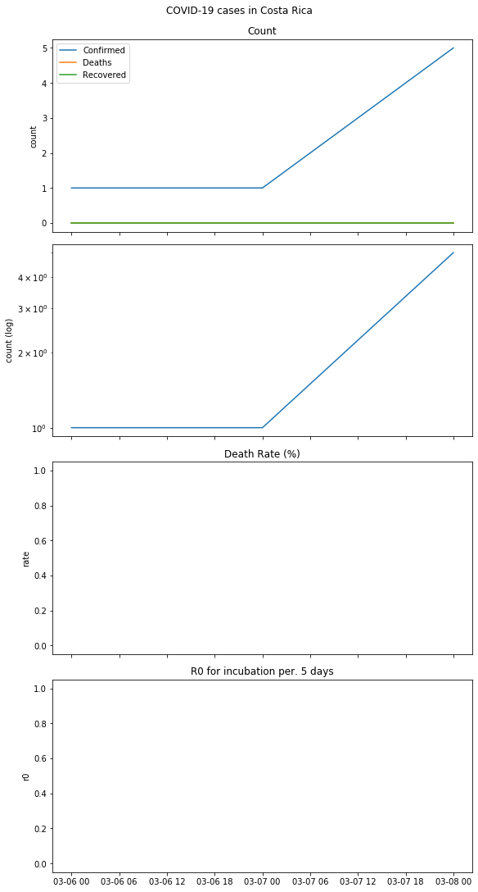


<p>Data extracted from <a href="https://github.com/CSSEGISandData/COVID-19">Johns Hopkins CSSE Data Repository</a></p>


<div>
<style scoped>
    .dataframe tbody tr th:only-of-type {
        vertical-align: middle;
    }

    .dataframe tbody tr th {
        vertical-align: top;
    }

    .dataframe thead th {
        text-align: right;
    }
</style>
<table border="1" class="dataframe">
  <thead>
    <tr style="text-align: right;">
      <th></th>
      <th>Last Update</th>
      <th>Country/Region</th>
      <th>Confirmed</th>
      <th>Deaths</th>
      <th>Recovered</th>
      <th>Death Rate (%)</th>
    </tr>
  </thead>
  <tbody>
    <tr>
      <td>830</td>
      <td>2020-03-06</td>
      <td>Costa Rica</td>
      <td>1.0</td>
      <td>0.0</td>
      <td>0.0</td>
      <td>NaN</td>
    </tr>
    <tr>
      <td>894</td>
      <td>2020-03-07</td>
      <td>Costa Rica</td>
      <td>1.0</td>
      <td>0.0</td>
      <td>0.0</td>
      <td>NaN</td>
    </tr>
    <tr>
      <td>946</td>
      <td>2020-03-08</td>
      <td>Costa Rica</td>
      <td>5.0</td>
      <td>0.0</td>
      <td>0.0</td>
      <td>NaN</td>
    </tr>
  </tbody>
</table>
</div>


<p>r0 calculated as (Confirmed cases at day N + incubation period = 5 days)/(confirmed cases at day N)</p>


<p>Note that this is just a very rough value determined by "garage epidemiology" and should not be used as reference</p>


<div>
<style scoped>
    .dataframe tbody tr th:only-of-type {
        vertical-align: middle;
    }

    .dataframe tbody tr th {
        vertical-align: top;
    }

    .dataframe thead th {
        text-align: right;
    }
</style>
<table border="1" class="dataframe">
  <thead>
    <tr style="text-align: right;">
      <th></th>
      <th>r0</th>
    </tr>
    <tr>
      <th>Last Update</th>
      <th></th>
    </tr>
  </thead>
  <tbody>
    <tr>
      <td>2020-03-06</td>
      <td>NaN</td>
    </tr>
    <tr>
      <td>2020-03-07</td>
      <td>NaN</td>
    </tr>
    <tr>
      <td>2020-03-08</td>
      <td>NaN</td>
    </tr>
  </tbody>
</table>
</div>


<h2><a name="croatia" href="#croatia">Croatia</a></h2>


<p>Plot of COVID-19 cases.</p>


<p>Death rate calculated as (count of death)(count of death + count of recovered)</p>


<p>Data extracted from <a href="https://github.com/CSSEGISandData/COVID-19">Johns Hopkins CSSE Data Repository</a></p>


<div>
<style scoped>
    .dataframe tbody tr th:only-of-type {
        vertical-align: middle;
    }

    .dataframe tbody tr th {
        vertical-align: top;
    }

    .dataframe thead th {
        text-align: right;
    }
</style>
<table border="1" class="dataframe">
  <thead>
    <tr style="text-align: right;">
      <th></th>
      <th>Last Update</th>
      <th>Country/Region</th>
      <th>Confirmed</th>
      <th>Deaths</th>
      <th>Recovered</th>
      <th>Death Rate (%)</th>
    </tr>
  </thead>
  <tbody>
    <tr>
      <td>430</td>
      <td>2020-02-25</td>
      <td>Croatia</td>
      <td>1.0</td>
      <td>0.0</td>
      <td>0.0</td>
      <td>NaN</td>
    </tr>
    <tr>
      <td>452</td>
      <td>2020-02-26</td>
      <td>Croatia</td>
      <td>3.0</td>
      <td>0.0</td>
      <td>0.0</td>
      <td>NaN</td>
    </tr>
    <tr>
      <td>514</td>
      <td>2020-02-28</td>
      <td>Croatia</td>
      <td>5.0</td>
      <td>0.0</td>
      <td>0.0</td>
      <td>NaN</td>
    </tr>
    <tr>
      <td>548</td>
      <td>2020-02-29</td>
      <td>Croatia</td>
      <td>6.0</td>
      <td>0.0</td>
      <td>0.0</td>
      <td>NaN</td>
    </tr>
    <tr>
      <td>590</td>
      <td>2020-03-01</td>
      <td>Croatia</td>
      <td>7.0</td>
      <td>0.0</td>
      <td>0.0</td>
      <td>NaN</td>
    </tr>
    <tr>
      <td>675</td>
      <td>2020-03-03</td>
      <td>Croatia</td>
      <td>9.0</td>
      <td>0.0</td>
      <td>0.0</td>
      <td>NaN</td>
    </tr>
    <tr>
      <td>727</td>
      <td>2020-03-04</td>
      <td>Croatia</td>
      <td>10.0</td>
      <td>0.0</td>
      <td>0.0</td>
      <td>NaN</td>
    </tr>
    <tr>
      <td>831</td>
      <td>2020-03-06</td>
      <td>Croatia</td>
      <td>11.0</td>
      <td>0.0</td>
      <td>0.0</td>
      <td>NaN</td>
    </tr>
    <tr>
      <td>895</td>
      <td>2020-03-07</td>
      <td>Croatia</td>
      <td>12.0</td>
      <td>0.0</td>
      <td>0.0</td>
      <td>NaN</td>
    </tr>
  </tbody>
</table>
</div>


<p>r0 calculated as (Confirmed cases at day N + incubation period = 5 days)/(confirmed cases at day N)</p>


<p>Note that this is just a very rough value determined by "garage epidemiology" and should not be used as reference</p>


<div>
<style scoped>
    .dataframe tbody tr th:only-of-type {
        vertical-align: middle;
    }

    .dataframe tbody tr th {
        vertical-align: top;
    }

    .dataframe thead th {
        text-align: right;
    }
</style>
<table border="1" class="dataframe">
  <thead>
    <tr style="text-align: right;">
      <th></th>
      <th>r0</th>
    </tr>
    <tr>
      <th>Last Update</th>
      <th></th>
    </tr>
  </thead>
  <tbody>
    <tr>
      <td>2020-02-25</td>
      <td>NaN</td>
    </tr>
    <tr>
      <td>2020-02-26</td>
      <td>NaN</td>
    </tr>
    <tr>
      <td>2020-02-28</td>
      <td>NaN</td>
    </tr>
    <tr>
      <td>2020-02-29</td>
      <td>NaN</td>
    </tr>
    <tr>
      <td>2020-03-01</td>
      <td>7.000000</td>
    </tr>
    <tr>
      <td>2020-03-03</td>
      <td>3.000000</td>
    </tr>
    <tr>
      <td>2020-03-04</td>
      <td>2.000000</td>
    </tr>
    <tr>
      <td>2020-03-06</td>
      <td>1.833333</td>
    </tr>
    <tr>
      <td>2020-03-07</td>
      <td>1.714286</td>
    </tr>
  </tbody>
</table>
</div>


<h2><a name="czech_republic" href="#czech_republic">Czech Republic</a></h2>


<p>Plot of COVID-19 cases.</p>


<p>Death rate calculated as (count of death)(count of death + count of recovered)</p>


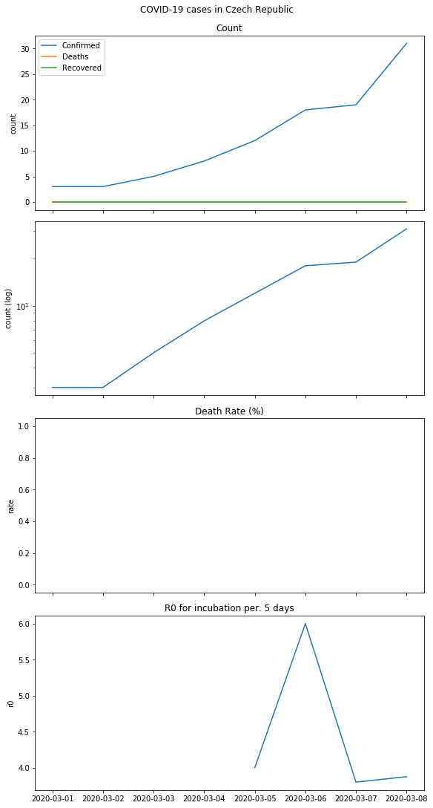


<p>Data extracted from <a href="https://github.com/CSSEGISandData/COVID-19">Johns Hopkins CSSE Data Repository</a></p>


<div>
<style scoped>
    .dataframe tbody tr th:only-of-type {
        vertical-align: middle;
    }

    .dataframe tbody tr th {
        vertical-align: top;
    }

    .dataframe thead th {
        text-align: right;
    }
</style>
<table border="1" class="dataframe">
  <thead>
    <tr style="text-align: right;">
      <th></th>
      <th>Last Update</th>
      <th>Country/Region</th>
      <th>Confirmed</th>
      <th>Deaths</th>
      <th>Recovered</th>
      <th>Death Rate (%)</th>
    </tr>
  </thead>
  <tbody>
    <tr>
      <td>591</td>
      <td>2020-03-01</td>
      <td>Czech Republic</td>
      <td>3.0</td>
      <td>0.0</td>
      <td>0.0</td>
      <td>NaN</td>
    </tr>
    <tr>
      <td>634</td>
      <td>2020-03-02</td>
      <td>Czech Republic</td>
      <td>3.0</td>
      <td>0.0</td>
      <td>0.0</td>
      <td>NaN</td>
    </tr>
    <tr>
      <td>676</td>
      <td>2020-03-03</td>
      <td>Czech Republic</td>
      <td>5.0</td>
      <td>0.0</td>
      <td>0.0</td>
      <td>NaN</td>
    </tr>
    <tr>
      <td>728</td>
      <td>2020-03-04</td>
      <td>Czech Republic</td>
      <td>8.0</td>
      <td>0.0</td>
      <td>0.0</td>
      <td>NaN</td>
    </tr>
    <tr>
      <td>777</td>
      <td>2020-03-05</td>
      <td>Czech Republic</td>
      <td>12.0</td>
      <td>0.0</td>
      <td>0.0</td>
      <td>NaN</td>
    </tr>
    <tr>
      <td>832</td>
      <td>2020-03-06</td>
      <td>Czech Republic</td>
      <td>18.0</td>
      <td>0.0</td>
      <td>0.0</td>
      <td>NaN</td>
    </tr>
    <tr>
      <td>896</td>
      <td>2020-03-07</td>
      <td>Czech Republic</td>
      <td>19.0</td>
      <td>0.0</td>
      <td>0.0</td>
      <td>NaN</td>
    </tr>
    <tr>
      <td>947</td>
      <td>2020-03-08</td>
      <td>Czech Republic</td>
      <td>31.0</td>
      <td>0.0</td>
      <td>0.0</td>
      <td>NaN</td>
    </tr>
  </tbody>
</table>
</div>


<p>r0 calculated as (Confirmed cases at day N + incubation period = 5 days)/(confirmed cases at day N)</p>


<p>Note that this is just a very rough value determined by "garage epidemiology" and should not be used as reference</p>


<div>
<style scoped>
    .dataframe tbody tr th:only-of-type {
        vertical-align: middle;
    }

    .dataframe tbody tr th {
        vertical-align: top;
    }

    .dataframe thead th {
        text-align: right;
    }
</style>
<table border="1" class="dataframe">
  <thead>
    <tr style="text-align: right;">
      <th></th>
      <th>r0</th>
    </tr>
    <tr>
      <th>Last Update</th>
      <th></th>
    </tr>
  </thead>
  <tbody>
    <tr>
      <td>2020-03-01</td>
      <td>NaN</td>
    </tr>
    <tr>
      <td>2020-03-02</td>
      <td>NaN</td>
    </tr>
    <tr>
      <td>2020-03-03</td>
      <td>NaN</td>
    </tr>
    <tr>
      <td>2020-03-04</td>
      <td>NaN</td>
    </tr>
    <tr>
      <td>2020-03-05</td>
      <td>4.000</td>
    </tr>
    <tr>
      <td>2020-03-06</td>
      <td>6.000</td>
    </tr>
    <tr>
      <td>2020-03-07</td>
      <td>3.800</td>
    </tr>
    <tr>
      <td>2020-03-08</td>
      <td>3.875</td>
    </tr>
  </tbody>
</table>
</div>


<h2><a name="denmark" href="#denmark">Denmark</a></h2>


<p>Plot of COVID-19 cases.</p>


<p>Death rate calculated as (count of death)(count of death + count of recovered)</p>


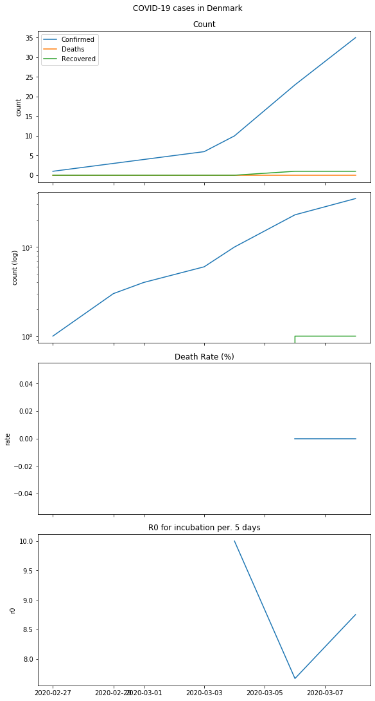


<p>Data extracted from <a href="https://github.com/CSSEGISandData/COVID-19">Johns Hopkins CSSE Data Repository</a></p>


<div>
<style scoped>
    .dataframe tbody tr th:only-of-type {
        vertical-align: middle;
    }

    .dataframe tbody tr th {
        vertical-align: top;
    }

    .dataframe thead th {
        text-align: right;
    }
</style>
<table border="1" class="dataframe">
  <thead>
    <tr style="text-align: right;">
      <th></th>
      <th>Last Update</th>
      <th>Country/Region</th>
      <th>Confirmed</th>
      <th>Deaths</th>
      <th>Recovered</th>
      <th>Death Rate (%)</th>
    </tr>
  </thead>
  <tbody>
    <tr>
      <td>483</td>
      <td>2020-02-27</td>
      <td>Denmark</td>
      <td>1.0</td>
      <td>0.0</td>
      <td>0.0</td>
      <td>NaN</td>
    </tr>
    <tr>
      <td>549</td>
      <td>2020-02-29</td>
      <td>Denmark</td>
      <td>3.0</td>
      <td>0.0</td>
      <td>0.0</td>
      <td>NaN</td>
    </tr>
    <tr>
      <td>592</td>
      <td>2020-03-01</td>
      <td>Denmark</td>
      <td>4.0</td>
      <td>0.0</td>
      <td>0.0</td>
      <td>NaN</td>
    </tr>
    <tr>
      <td>677</td>
      <td>2020-03-03</td>
      <td>Denmark</td>
      <td>6.0</td>
      <td>0.0</td>
      <td>0.0</td>
      <td>NaN</td>
    </tr>
    <tr>
      <td>729</td>
      <td>2020-03-04</td>
      <td>Denmark</td>
      <td>10.0</td>
      <td>0.0</td>
      <td>0.0</td>
      <td>NaN</td>
    </tr>
    <tr>
      <td>833</td>
      <td>2020-03-06</td>
      <td>Denmark</td>
      <td>23.0</td>
      <td>0.0</td>
      <td>1.0</td>
      <td>0.0</td>
    </tr>
    <tr>
      <td>948</td>
      <td>2020-03-08</td>
      <td>Denmark</td>
      <td>35.0</td>
      <td>0.0</td>
      <td>1.0</td>
      <td>0.0</td>
    </tr>
  </tbody>
</table>
</div>


<p>r0 calculated as (Confirmed cases at day N + incubation period = 5 days)/(confirmed cases at day N)</p>


<p>Note that this is just a very rough value determined by "garage epidemiology" and should not be used as reference</p>


<div>
<style scoped>
    .dataframe tbody tr th:only-of-type {
        vertical-align: middle;
    }

    .dataframe tbody tr th {
        vertical-align: top;
    }

    .dataframe thead th {
        text-align: right;
    }
</style>
<table border="1" class="dataframe">
  <thead>
    <tr style="text-align: right;">
      <th></th>
      <th>r0</th>
    </tr>
    <tr>
      <th>Last Update</th>
      <th></th>
    </tr>
  </thead>
  <tbody>
    <tr>
      <td>2020-02-27</td>
      <td>NaN</td>
    </tr>
    <tr>
      <td>2020-02-29</td>
      <td>NaN</td>
    </tr>
    <tr>
      <td>2020-03-01</td>
      <td>NaN</td>
    </tr>
    <tr>
      <td>2020-03-03</td>
      <td>NaN</td>
    </tr>
    <tr>
      <td>2020-03-04</td>
      <td>10.000000</td>
    </tr>
    <tr>
      <td>2020-03-06</td>
      <td>7.666667</td>
    </tr>
    <tr>
      <td>2020-03-08</td>
      <td>8.750000</td>
    </tr>
  </tbody>
</table>
</div>


<h2><a name="dominican_republic" href="#dominican_republic">Dominican Republic</a></h2>


<p>Plot of COVID-19 cases.</p>


<p>Death rate calculated as (count of death)(count of death + count of recovered)</p>


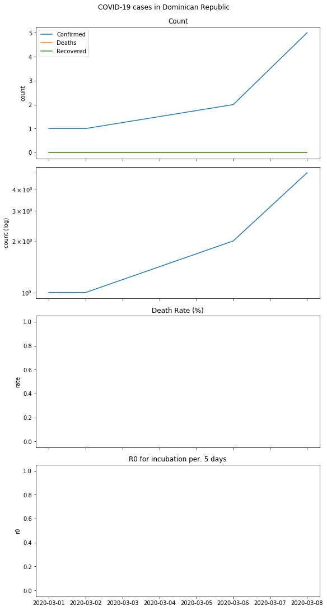


<p>Data extracted from <a href="https://github.com/CSSEGISandData/COVID-19">Johns Hopkins CSSE Data Repository</a></p>


<div>
<style scoped>
    .dataframe tbody tr th:only-of-type {
        vertical-align: middle;
    }

    .dataframe tbody tr th {
        vertical-align: top;
    }

    .dataframe thead th {
        text-align: right;
    }
</style>
<table border="1" class="dataframe">
  <thead>
    <tr style="text-align: right;">
      <th></th>
      <th>Last Update</th>
      <th>Country/Region</th>
      <th>Confirmed</th>
      <th>Deaths</th>
      <th>Recovered</th>
      <th>Death Rate (%)</th>
    </tr>
  </thead>
  <tbody>
    <tr>
      <td>593</td>
      <td>2020-03-01</td>
      <td>Dominican Republic</td>
      <td>1.0</td>
      <td>0.0</td>
      <td>0.0</td>
      <td>NaN</td>
    </tr>
    <tr>
      <td>635</td>
      <td>2020-03-02</td>
      <td>Dominican Republic</td>
      <td>1.0</td>
      <td>0.0</td>
      <td>0.0</td>
      <td>NaN</td>
    </tr>
    <tr>
      <td>834</td>
      <td>2020-03-06</td>
      <td>Dominican Republic</td>
      <td>2.0</td>
      <td>0.0</td>
      <td>0.0</td>
      <td>NaN</td>
    </tr>
    <tr>
      <td>949</td>
      <td>2020-03-08</td>
      <td>Dominican Republic</td>
      <td>5.0</td>
      <td>0.0</td>
      <td>0.0</td>
      <td>NaN</td>
    </tr>
  </tbody>
</table>
</div>


<p>r0 calculated as (Confirmed cases at day N + incubation period = 5 days)/(confirmed cases at day N)</p>


<p>Note that this is just a very rough value determined by "garage epidemiology" and should not be used as reference</p>


<div>
<style scoped>
    .dataframe tbody tr th:only-of-type {
        vertical-align: middle;
    }

    .dataframe tbody tr th {
        vertical-align: top;
    }

    .dataframe thead th {
        text-align: right;
    }
</style>
<table border="1" class="dataframe">
  <thead>
    <tr style="text-align: right;">
      <th></th>
      <th>r0</th>
    </tr>
    <tr>
      <th>Last Update</th>
      <th></th>
    </tr>
  </thead>
  <tbody>
    <tr>
      <td>2020-03-01</td>
      <td>NaN</td>
    </tr>
    <tr>
      <td>2020-03-02</td>
      <td>NaN</td>
    </tr>
    <tr>
      <td>2020-03-06</td>
      <td>NaN</td>
    </tr>
    <tr>
      <td>2020-03-08</td>
      <td>NaN</td>
    </tr>
  </tbody>
</table>
</div>


<h2><a name="ecuador" href="#ecuador">Ecuador</a></h2>


<p>Plot of COVID-19 cases.</p>


<p>Death rate calculated as (count of death)(count of death + count of recovered)</p>


<p>Data extracted from <a href="https://github.com/CSSEGISandData/COVID-19">Johns Hopkins CSSE Data Repository</a></p>


<div>
<style scoped>
    .dataframe tbody tr th:only-of-type {
        vertical-align: middle;
    }

    .dataframe tbody tr th {
        vertical-align: top;
    }

    .dataframe thead th {
        text-align: right;
    }
</style>
<table border="1" class="dataframe">
  <thead>
    <tr style="text-align: right;">
      <th></th>
      <th>Last Update</th>
      <th>Country/Region</th>
      <th>Confirmed</th>
      <th>Deaths</th>
      <th>Recovered</th>
      <th>Death Rate (%)</th>
    </tr>
  </thead>
  <tbody>
    <tr>
      <td>594</td>
      <td>2020-03-01</td>
      <td>Ecuador</td>
      <td>6.0</td>
      <td>0.0</td>
      <td>0.0</td>
      <td>NaN</td>
    </tr>
    <tr>
      <td>678</td>
      <td>2020-03-03</td>
      <td>Ecuador</td>
      <td>7.0</td>
      <td>0.0</td>
      <td>0.0</td>
      <td>NaN</td>
    </tr>
    <tr>
      <td>730</td>
      <td>2020-03-04</td>
      <td>Ecuador</td>
      <td>10.0</td>
      <td>0.0</td>
      <td>0.0</td>
      <td>NaN</td>
    </tr>
    <tr>
      <td>778</td>
      <td>2020-03-05</td>
      <td>Ecuador</td>
      <td>13.0</td>
      <td>0.0</td>
      <td>0.0</td>
      <td>NaN</td>
    </tr>
    <tr>
      <td>950</td>
      <td>2020-03-08</td>
      <td>Ecuador</td>
      <td>14.0</td>
      <td>0.0</td>
      <td>0.0</td>
      <td>NaN</td>
    </tr>
  </tbody>
</table>
</div>


<p>r0 calculated as (Confirmed cases at day N + incubation period = 5 days)/(confirmed cases at day N)</p>


<p>Note that this is just a very rough value determined by "garage epidemiology" and should not be used as reference</p>


<div>
<style scoped>
    .dataframe tbody tr th:only-of-type {
        vertical-align: middle;
    }

    .dataframe tbody tr th {
        vertical-align: top;
    }

    .dataframe thead th {
        text-align: right;
    }
</style>
<table border="1" class="dataframe">
  <thead>
    <tr style="text-align: right;">
      <th></th>
      <th>r0</th>
    </tr>
    <tr>
      <th>Last Update</th>
      <th></th>
    </tr>
  </thead>
  <tbody>
    <tr>
      <td>2020-03-01</td>
      <td>NaN</td>
    </tr>
    <tr>
      <td>2020-03-03</td>
      <td>NaN</td>
    </tr>
    <tr>
      <td>2020-03-04</td>
      <td>NaN</td>
    </tr>
    <tr>
      <td>2020-03-05</td>
      <td>NaN</td>
    </tr>
    <tr>
      <td>2020-03-08</td>
      <td>2.333333</td>
    </tr>
  </tbody>
</table>
</div>


<h2><a name="egypt" href="#egypt">Egypt</a></h2>


<p>Plot of COVID-19 cases.</p>


<p>Death rate calculated as (count of death)(count of death + count of recovered)</p>


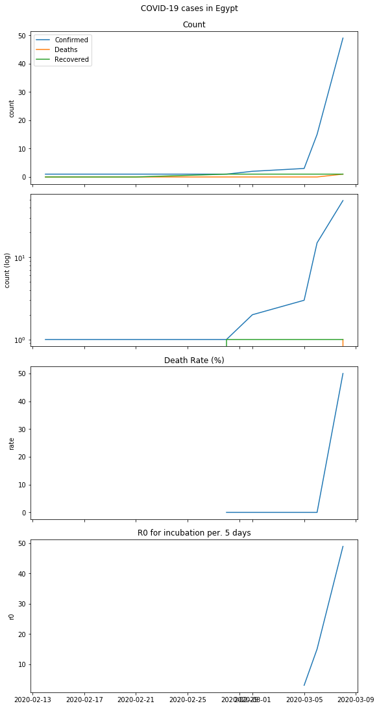


<p>Data extracted from <a href="https://github.com/CSSEGISandData/COVID-19">Johns Hopkins CSSE Data Repository</a></p>


<div>
<style scoped>
    .dataframe tbody tr th:only-of-type {
        vertical-align: middle;
    }

    .dataframe tbody tr th {
        vertical-align: top;
    }

    .dataframe thead th {
        text-align: right;
    }
</style>
<table border="1" class="dataframe">
  <thead>
    <tr style="text-align: right;">
      <th></th>
      <th>Last Update</th>
      <th>Country/Region</th>
      <th>Confirmed</th>
      <th>Deaths</th>
      <th>Recovered</th>
      <th>Death Rate (%)</th>
    </tr>
  </thead>
  <tbody>
    <tr>
      <td>307</td>
      <td>2020-02-14</td>
      <td>Egypt</td>
      <td>1.0</td>
      <td>0.0</td>
      <td>0.0</td>
      <td>NaN</td>
    </tr>
    <tr>
      <td>373</td>
      <td>2020-02-21</td>
      <td>Egypt</td>
      <td>1.0</td>
      <td>0.0</td>
      <td>0.0</td>
      <td>NaN</td>
    </tr>
    <tr>
      <td>515</td>
      <td>2020-02-28</td>
      <td>Egypt</td>
      <td>1.0</td>
      <td>0.0</td>
      <td>1.0</td>
      <td>0.0</td>
    </tr>
    <tr>
      <td>595</td>
      <td>2020-03-01</td>
      <td>Egypt</td>
      <td>2.0</td>
      <td>0.0</td>
      <td>1.0</td>
      <td>0.0</td>
    </tr>
    <tr>
      <td>779</td>
      <td>2020-03-05</td>
      <td>Egypt</td>
      <td>3.0</td>
      <td>0.0</td>
      <td>1.0</td>
      <td>0.0</td>
    </tr>
    <tr>
      <td>835</td>
      <td>2020-03-06</td>
      <td>Egypt</td>
      <td>15.0</td>
      <td>0.0</td>
      <td>1.0</td>
      <td>0.0</td>
    </tr>
    <tr>
      <td>951</td>
      <td>2020-03-08</td>
      <td>Egypt</td>
      <td>49.0</td>
      <td>1.0</td>
      <td>1.0</td>
      <td>50.0</td>
    </tr>
  </tbody>
</table>
</div>


<p>r0 calculated as (Confirmed cases at day N + incubation period = 5 days)/(confirmed cases at day N)</p>


<p>Note that this is just a very rough value determined by "garage epidemiology" and should not be used as reference</p>


<div>
<style scoped>
    .dataframe tbody tr th:only-of-type {
        vertical-align: middle;
    }

    .dataframe tbody tr th {
        vertical-align: top;
    }

    .dataframe thead th {
        text-align: right;
    }
</style>
<table border="1" class="dataframe">
  <thead>
    <tr style="text-align: right;">
      <th></th>
      <th>r0</th>
    </tr>
    <tr>
      <th>Last Update</th>
      <th></th>
    </tr>
  </thead>
  <tbody>
    <tr>
      <td>2020-02-14</td>
      <td>NaN</td>
    </tr>
    <tr>
      <td>2020-02-21</td>
      <td>NaN</td>
    </tr>
    <tr>
      <td>2020-02-28</td>
      <td>NaN</td>
    </tr>
    <tr>
      <td>2020-03-01</td>
      <td>NaN</td>
    </tr>
    <tr>
      <td>2020-03-05</td>
      <td>3.0</td>
    </tr>
    <tr>
      <td>2020-03-06</td>
      <td>15.0</td>
    </tr>
    <tr>
      <td>2020-03-08</td>
      <td>49.0</td>
    </tr>
  </tbody>
</table>
</div>


<h2><a name="estonia" href="#estonia">Estonia</a></h2>


<p>Plot of COVID-19 cases.</p>


<p>Death rate calculated as (count of death)(count of death + count of recovered)</p>


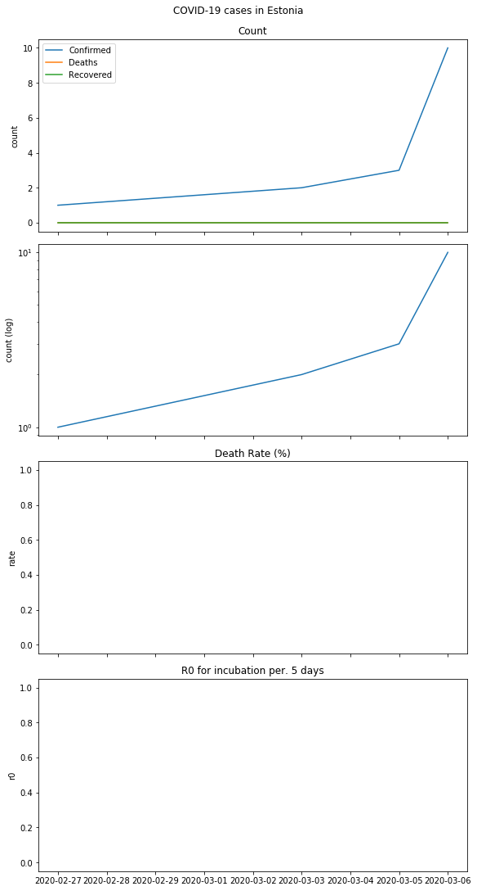


<p>Data extracted from <a href="https://github.com/CSSEGISandData/COVID-19">Johns Hopkins CSSE Data Repository</a></p>


<div>
<style scoped>
    .dataframe tbody tr th:only-of-type {
        vertical-align: middle;
    }

    .dataframe tbody tr th {
        vertical-align: top;
    }

    .dataframe thead th {
        text-align: right;
    }
</style>
<table border="1" class="dataframe">
  <thead>
    <tr style="text-align: right;">
      <th></th>
      <th>Last Update</th>
      <th>Country/Region</th>
      <th>Confirmed</th>
      <th>Deaths</th>
      <th>Recovered</th>
      <th>Death Rate (%)</th>
    </tr>
  </thead>
  <tbody>
    <tr>
      <td>484</td>
      <td>2020-02-27</td>
      <td>Estonia</td>
      <td>1.0</td>
      <td>0.0</td>
      <td>0.0</td>
      <td>NaN</td>
    </tr>
    <tr>
      <td>679</td>
      <td>2020-03-03</td>
      <td>Estonia</td>
      <td>2.0</td>
      <td>0.0</td>
      <td>0.0</td>
      <td>NaN</td>
    </tr>
    <tr>
      <td>780</td>
      <td>2020-03-05</td>
      <td>Estonia</td>
      <td>3.0</td>
      <td>0.0</td>
      <td>0.0</td>
      <td>NaN</td>
    </tr>
    <tr>
      <td>836</td>
      <td>2020-03-06</td>
      <td>Estonia</td>
      <td>10.0</td>
      <td>0.0</td>
      <td>0.0</td>
      <td>NaN</td>
    </tr>
  </tbody>
</table>
</div>


<p>r0 calculated as (Confirmed cases at day N + incubation period = 5 days)/(confirmed cases at day N)</p>


<p>Note that this is just a very rough value determined by "garage epidemiology" and should not be used as reference</p>


<div>
<style scoped>
    .dataframe tbody tr th:only-of-type {
        vertical-align: middle;
    }

    .dataframe tbody tr th {
        vertical-align: top;
    }

    .dataframe thead th {
        text-align: right;
    }
</style>
<table border="1" class="dataframe">
  <thead>
    <tr style="text-align: right;">
      <th></th>
      <th>r0</th>
    </tr>
    <tr>
      <th>Last Update</th>
      <th></th>
    </tr>
  </thead>
  <tbody>
    <tr>
      <td>2020-02-27</td>
      <td>NaN</td>
    </tr>
    <tr>
      <td>2020-03-03</td>
      <td>NaN</td>
    </tr>
    <tr>
      <td>2020-03-05</td>
      <td>NaN</td>
    </tr>
    <tr>
      <td>2020-03-06</td>
      <td>NaN</td>
    </tr>
  </tbody>
</table>
</div>


<h2><a name="faroe_islands" href="#faroe_islands">Faroe Islands</a></h2>


<p>Plot of COVID-19 cases.</p>


<p>Death rate calculated as (count of death)(count of death + count of recovered)</p>


<p>Data extracted from <a href="https://github.com/CSSEGISandData/COVID-19">Johns Hopkins CSSE Data Repository</a></p>


<div>
<style scoped>
    .dataframe tbody tr th:only-of-type {
        vertical-align: middle;
    }

    .dataframe tbody tr th {
        vertical-align: top;
    }

    .dataframe thead th {
        text-align: right;
    }
</style>
<table border="1" class="dataframe">
  <thead>
    <tr style="text-align: right;">
      <th></th>
      <th>Last Update</th>
      <th>Country/Region</th>
      <th>Confirmed</th>
      <th>Deaths</th>
      <th>Recovered</th>
      <th>Death Rate (%)</th>
    </tr>
  </thead>
  <tbody>
    <tr>
      <td>731</td>
      <td>2020-03-04</td>
      <td>Faroe Islands</td>
      <td>1.0</td>
      <td>0.0</td>
      <td>0.0</td>
      <td>NaN</td>
    </tr>
    <tr>
      <td>952</td>
      <td>2020-03-08</td>
      <td>Faroe Islands</td>
      <td>2.0</td>
      <td>0.0</td>
      <td>0.0</td>
      <td>NaN</td>
    </tr>
  </tbody>
</table>
</div>


<p>r0 calculated as (Confirmed cases at day N + incubation period = 5 days)/(confirmed cases at day N)</p>


<p>Note that this is just a very rough value determined by "garage epidemiology" and should not be used as reference</p>


<div>
<style scoped>
    .dataframe tbody tr th:only-of-type {
        vertical-align: middle;
    }

    .dataframe tbody tr th {
        vertical-align: top;
    }

    .dataframe thead th {
        text-align: right;
    }
</style>
<table border="1" class="dataframe">
  <thead>
    <tr style="text-align: right;">
      <th></th>
      <th>r0</th>
    </tr>
    <tr>
      <th>Last Update</th>
      <th></th>
    </tr>
  </thead>
  <tbody>
    <tr>
      <td>2020-03-04</td>
      <td>NaN</td>
    </tr>
    <tr>
      <td>2020-03-08</td>
      <td>NaN</td>
    </tr>
  </tbody>
</table>
</div>


<h2><a name="finland" href="#finland">Finland</a></h2>


<p>Plot of COVID-19 cases.</p>


<p>Death rate calculated as (count of death)(count of death + count of recovered)</p>


<p>Data extracted from <a href="https://github.com/CSSEGISandData/COVID-19">Johns Hopkins CSSE Data Repository</a></p>


<div>
<style scoped>
    .dataframe tbody tr th:only-of-type {
        vertical-align: middle;
    }

    .dataframe tbody tr th {
        vertical-align: top;
    }

    .dataframe thead th {
        text-align: right;
    }
</style>
<table border="1" class="dataframe">
  <thead>
    <tr style="text-align: right;">
      <th></th>
      <th>Last Update</th>
      <th>Country/Region</th>
      <th>Confirmed</th>
      <th>Deaths</th>
      <th>Recovered</th>
      <th>Death Rate (%)</th>
    </tr>
  </thead>
  <tbody>
    <tr>
      <td>103</td>
      <td>2020-01-29</td>
      <td>Finland</td>
      <td>1.0</td>
      <td>0.0</td>
      <td>0.0</td>
      <td>NaN</td>
    </tr>
    <tr>
      <td>123</td>
      <td>2020-01-30</td>
      <td>Finland</td>
      <td>1.0</td>
      <td>0.0</td>
      <td>0.0</td>
      <td>NaN</td>
    </tr>
    <tr>
      <td>145</td>
      <td>2020-01-31</td>
      <td>Finland</td>
      <td>1.0</td>
      <td>0.0</td>
      <td>0.0</td>
      <td>NaN</td>
    </tr>
    <tr>
      <td>281</td>
      <td>2020-02-12</td>
      <td>Finland</td>
      <td>1.0</td>
      <td>0.0</td>
      <td>1.0</td>
      <td>0.0</td>
    </tr>
    <tr>
      <td>453</td>
      <td>2020-02-26</td>
      <td>Finland</td>
      <td>2.0</td>
      <td>0.0</td>
      <td>1.0</td>
      <td>0.0</td>
    </tr>
    <tr>
      <td>550</td>
      <td>2020-02-29</td>
      <td>Finland</td>
      <td>3.0</td>
      <td>0.0</td>
      <td>1.0</td>
      <td>0.0</td>
    </tr>
    <tr>
      <td>596</td>
      <td>2020-03-01</td>
      <td>Finland</td>
      <td>6.0</td>
      <td>0.0</td>
      <td>1.0</td>
      <td>0.0</td>
    </tr>
    <tr>
      <td>781</td>
      <td>2020-03-05</td>
      <td>Finland</td>
      <td>12.0</td>
      <td>0.0</td>
      <td>1.0</td>
      <td>0.0</td>
    </tr>
    <tr>
      <td>837</td>
      <td>2020-03-06</td>
      <td>Finland</td>
      <td>15.0</td>
      <td>0.0</td>
      <td>1.0</td>
      <td>0.0</td>
    </tr>
    <tr>
      <td>953</td>
      <td>2020-03-08</td>
      <td>Finland</td>
      <td>23.0</td>
      <td>0.0</td>
      <td>1.0</td>
      <td>0.0</td>
    </tr>
  </tbody>
</table>
</div>


<p>r0 calculated as (Confirmed cases at day N + incubation period = 5 days)/(confirmed cases at day N)</p>


<p>Note that this is just a very rough value determined by "garage epidemiology" and should not be used as reference</p>


<div>
<style scoped>
    .dataframe tbody tr th:only-of-type {
        vertical-align: middle;
    }

    .dataframe tbody tr th {
        vertical-align: top;
    }

    .dataframe thead th {
        text-align: right;
    }
</style>
<table border="1" class="dataframe">
  <thead>
    <tr style="text-align: right;">
      <th></th>
      <th>r0</th>
    </tr>
    <tr>
      <th>Last Update</th>
      <th></th>
    </tr>
  </thead>
  <tbody>
    <tr>
      <td>2020-01-29</td>
      <td>NaN</td>
    </tr>
    <tr>
      <td>2020-01-30</td>
      <td>NaN</td>
    </tr>
    <tr>
      <td>2020-01-31</td>
      <td>NaN</td>
    </tr>
    <tr>
      <td>2020-02-12</td>
      <td>NaN</td>
    </tr>
    <tr>
      <td>2020-02-26</td>
      <td>2.000000</td>
    </tr>
    <tr>
      <td>2020-02-29</td>
      <td>3.000000</td>
    </tr>
    <tr>
      <td>2020-03-01</td>
      <td>6.000000</td>
    </tr>
    <tr>
      <td>2020-03-05</td>
      <td>12.000000</td>
    </tr>
    <tr>
      <td>2020-03-06</td>
      <td>7.500000</td>
    </tr>
    <tr>
      <td>2020-03-08</td>
      <td>7.666667</td>
    </tr>
  </tbody>
</table>
</div>


<h2><a name="france" href="#france">France</a></h2>


<p>Plot of COVID-19 cases.</p>


<p>Death rate calculated as (count of death)(count of death + count of recovered)</p>


<p>Data extracted from <a href="https://github.com/CSSEGISandData/COVID-19">Johns Hopkins CSSE Data Repository</a></p>


<div>
<style scoped>
    .dataframe tbody tr th:only-of-type {
        vertical-align: middle;
    }

    .dataframe tbody tr th {
        vertical-align: top;
    }

    .dataframe thead th {
        text-align: right;
    }
</style>
<table border="1" class="dataframe">
  <thead>
    <tr style="text-align: right;">
      <th></th>
      <th>Last Update</th>
      <th>Country/Region</th>
      <th>Confirmed</th>
      <th>Deaths</th>
      <th>Recovered</th>
      <th>Death Rate (%)</th>
    </tr>
  </thead>
  <tbody>
    <tr>
      <td>24</td>
      <td>2020-01-24</td>
      <td>France</td>
      <td>2.0</td>
      <td>0.0</td>
      <td>0.0</td>
      <td>NaN</td>
    </tr>
    <tr>
      <td>36</td>
      <td>2020-01-25</td>
      <td>France</td>
      <td>3.0</td>
      <td>0.0</td>
      <td>0.0</td>
      <td>NaN</td>
    </tr>
    <tr>
      <td>51</td>
      <td>2020-01-26</td>
      <td>France</td>
      <td>3.0</td>
      <td>0.0</td>
      <td>0.0</td>
      <td>NaN</td>
    </tr>
    <tr>
      <td>67</td>
      <td>2020-01-27</td>
      <td>France</td>
      <td>3.0</td>
      <td>0.0</td>
      <td>0.0</td>
      <td>NaN</td>
    </tr>
    <tr>
      <td>85</td>
      <td>2020-01-28</td>
      <td>France</td>
      <td>4.0</td>
      <td>0.0</td>
      <td>0.0</td>
      <td>NaN</td>
    </tr>
    <tr>
      <td>104</td>
      <td>2020-01-29</td>
      <td>France</td>
      <td>5.0</td>
      <td>0.0</td>
      <td>0.0</td>
      <td>NaN</td>
    </tr>
    <tr>
      <td>124</td>
      <td>2020-01-30</td>
      <td>France</td>
      <td>5.0</td>
      <td>0.0</td>
      <td>0.0</td>
      <td>NaN</td>
    </tr>
    <tr>
      <td>146</td>
      <td>2020-01-31</td>
      <td>France</td>
      <td>5.0</td>
      <td>0.0</td>
      <td>0.0</td>
      <td>NaN</td>
    </tr>
    <tr>
      <td>170</td>
      <td>2020-02-01</td>
      <td>France</td>
      <td>6.0</td>
      <td>0.0</td>
      <td>0.0</td>
      <td>NaN</td>
    </tr>
    <tr>
      <td>238</td>
      <td>2020-02-08</td>
      <td>France</td>
      <td>11.0</td>
      <td>0.0</td>
      <td>0.0</td>
      <td>NaN</td>
    </tr>
    <tr>
      <td>282</td>
      <td>2020-02-12</td>
      <td>France</td>
      <td>11.0</td>
      <td>0.0</td>
      <td>2.0</td>
      <td>0.000000</td>
    </tr>
    <tr>
      <td>314</td>
      <td>2020-02-15</td>
      <td>France</td>
      <td>12.0</td>
      <td>1.0</td>
      <td>4.0</td>
      <td>20.000000</td>
    </tr>
    <tr>
      <td>431</td>
      <td>2020-02-25</td>
      <td>France</td>
      <td>14.0</td>
      <td>1.0</td>
      <td>11.0</td>
      <td>8.333333</td>
    </tr>
    <tr>
      <td>454</td>
      <td>2020-02-26</td>
      <td>France</td>
      <td>18.0</td>
      <td>2.0</td>
      <td>11.0</td>
      <td>15.384615</td>
    </tr>
    <tr>
      <td>485</td>
      <td>2020-02-27</td>
      <td>France</td>
      <td>38.0</td>
      <td>2.0</td>
      <td>11.0</td>
      <td>15.384615</td>
    </tr>
    <tr>
      <td>516</td>
      <td>2020-02-28</td>
      <td>France</td>
      <td>57.0</td>
      <td>2.0</td>
      <td>11.0</td>
      <td>15.384615</td>
    </tr>
    <tr>
      <td>551</td>
      <td>2020-02-29</td>
      <td>France</td>
      <td>100.0</td>
      <td>2.0</td>
      <td>12.0</td>
      <td>14.285714</td>
    </tr>
    <tr>
      <td>597</td>
      <td>2020-03-01</td>
      <td>France</td>
      <td>130.0</td>
      <td>2.0</td>
      <td>12.0</td>
      <td>14.285714</td>
    </tr>
    <tr>
      <td>636</td>
      <td>2020-03-02</td>
      <td>France</td>
      <td>191.0</td>
      <td>3.0</td>
      <td>12.0</td>
      <td>20.000000</td>
    </tr>
    <tr>
      <td>680</td>
      <td>2020-03-03</td>
      <td>France</td>
      <td>204.0</td>
      <td>4.0</td>
      <td>12.0</td>
      <td>25.000000</td>
    </tr>
    <tr>
      <td>732</td>
      <td>2020-03-04</td>
      <td>France</td>
      <td>285.0</td>
      <td>4.0</td>
      <td>12.0</td>
      <td>25.000000</td>
    </tr>
    <tr>
      <td>782</td>
      <td>2020-03-05</td>
      <td>France</td>
      <td>377.0</td>
      <td>6.0</td>
      <td>12.0</td>
      <td>33.333333</td>
    </tr>
    <tr>
      <td>838</td>
      <td>2020-03-06</td>
      <td>France</td>
      <td>653.0</td>
      <td>9.0</td>
      <td>12.0</td>
      <td>42.857143</td>
    </tr>
    <tr>
      <td>897</td>
      <td>2020-03-07</td>
      <td>France</td>
      <td>949.0</td>
      <td>11.0</td>
      <td>12.0</td>
      <td>47.826087</td>
    </tr>
    <tr>
      <td>954</td>
      <td>2020-03-08</td>
      <td>France</td>
      <td>1126.0</td>
      <td>19.0</td>
      <td>12.0</td>
      <td>61.290323</td>
    </tr>
  </tbody>
</table>
</div>


<p>r0 calculated as (Confirmed cases at day N + incubation period = 5 days)/(confirmed cases at day N)</p>


<p>Note that this is just a very rough value determined by "garage epidemiology" and should not be used as reference</p>


<div>
<style scoped>
    .dataframe tbody tr th:only-of-type {
        vertical-align: middle;
    }

    .dataframe tbody tr th {
        vertical-align: top;
    }

    .dataframe thead th {
        text-align: right;
    }
</style>
<table border="1" class="dataframe">
  <thead>
    <tr style="text-align: right;">
      <th></th>
      <th>r0</th>
    </tr>
    <tr>
      <th>Last Update</th>
      <th></th>
    </tr>
  </thead>
  <tbody>
    <tr>
      <td>2020-01-24</td>
      <td>NaN</td>
    </tr>
    <tr>
      <td>2020-01-25</td>
      <td>NaN</td>
    </tr>
    <tr>
      <td>2020-01-26</td>
      <td>NaN</td>
    </tr>
    <tr>
      <td>2020-01-27</td>
      <td>NaN</td>
    </tr>
    <tr>
      <td>2020-01-28</td>
      <td>2.000000</td>
    </tr>
    <tr>
      <td>2020-01-29</td>
      <td>1.666667</td>
    </tr>
    <tr>
      <td>2020-01-30</td>
      <td>1.666667</td>
    </tr>
    <tr>
      <td>2020-01-31</td>
      <td>1.666667</td>
    </tr>
    <tr>
      <td>2020-02-01</td>
      <td>1.500000</td>
    </tr>
    <tr>
      <td>2020-02-08</td>
      <td>2.200000</td>
    </tr>
    <tr>
      <td>2020-02-12</td>
      <td>2.200000</td>
    </tr>
    <tr>
      <td>2020-02-15</td>
      <td>2.400000</td>
    </tr>
    <tr>
      <td>2020-02-25</td>
      <td>2.333333</td>
    </tr>
    <tr>
      <td>2020-02-26</td>
      <td>1.636364</td>
    </tr>
    <tr>
      <td>2020-02-27</td>
      <td>3.454545</td>
    </tr>
    <tr>
      <td>2020-02-28</td>
      <td>4.750000</td>
    </tr>
    <tr>
      <td>2020-02-29</td>
      <td>7.142857</td>
    </tr>
    <tr>
      <td>2020-03-01</td>
      <td>7.222222</td>
    </tr>
    <tr>
      <td>2020-03-02</td>
      <td>5.026316</td>
    </tr>
    <tr>
      <td>2020-03-03</td>
      <td>3.578947</td>
    </tr>
    <tr>
      <td>2020-03-04</td>
      <td>2.850000</td>
    </tr>
    <tr>
      <td>2020-03-05</td>
      <td>2.900000</td>
    </tr>
    <tr>
      <td>2020-03-06</td>
      <td>3.418848</td>
    </tr>
    <tr>
      <td>2020-03-07</td>
      <td>4.651961</td>
    </tr>
    <tr>
      <td>2020-03-08</td>
      <td>3.950877</td>
    </tr>
  </tbody>
</table>
</div>


<h2><a name="french_guiana" href="#french_guiana">French Guiana</a></h2>


<p>Plot of COVID-19 cases.</p>


<p>Death rate calculated as (count of death)(count of death + count of recovered)</p>


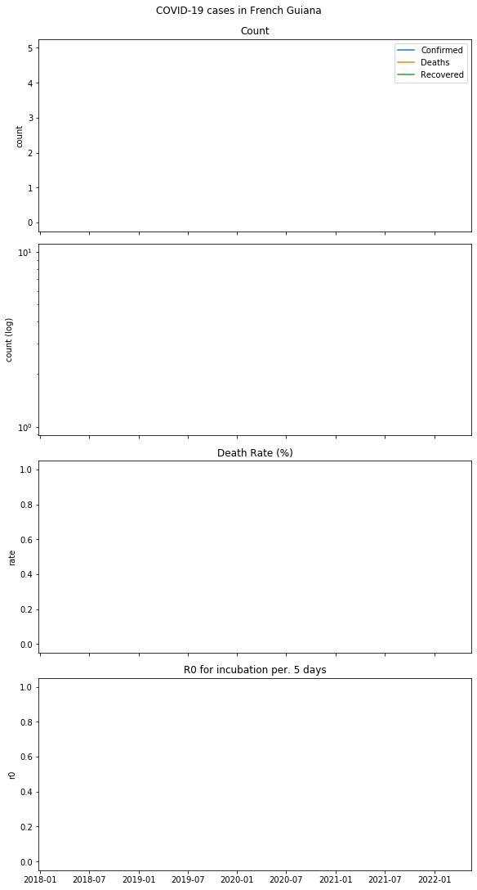


<p>Data extracted from <a href="https://github.com/CSSEGISandData/COVID-19">Johns Hopkins CSSE Data Repository</a></p>


<div>
<style scoped>
    .dataframe tbody tr th:only-of-type {
        vertical-align: middle;
    }

    .dataframe tbody tr th {
        vertical-align: top;
    }

    .dataframe thead th {
        text-align: right;
    }
</style>
<table border="1" class="dataframe">
  <thead>
    <tr style="text-align: right;">
      <th></th>
      <th>Last Update</th>
      <th>Country/Region</th>
      <th>Confirmed</th>
      <th>Deaths</th>
      <th>Recovered</th>
      <th>Death Rate (%)</th>
    </tr>
  </thead>
  <tbody>
    <tr>
      <td>898</td>
      <td>2020-03-07</td>
      <td>French Guiana</td>
      <td>5.0</td>
      <td>0.0</td>
      <td>0.0</td>
      <td>NaN</td>
    </tr>
  </tbody>
</table>
</div>


<p>r0 calculated as (Confirmed cases at day N + incubation period = 5 days)/(confirmed cases at day N)</p>


<p>Note that this is just a very rough value determined by "garage epidemiology" and should not be used as reference</p>


<div>
<style scoped>
    .dataframe tbody tr th:only-of-type {
        vertical-align: middle;
    }

    .dataframe tbody tr th {
        vertical-align: top;
    }

    .dataframe thead th {
        text-align: right;
    }
</style>
<table border="1" class="dataframe">
  <thead>
    <tr style="text-align: right;">
      <th></th>
      <th>r0</th>
    </tr>
    <tr>
      <th>Last Update</th>
      <th></th>
    </tr>
  </thead>
  <tbody>
    <tr>
      <td>2020-03-07</td>
      <td>NaN</td>
    </tr>
  </tbody>
</table>
</div>


<h2><a name="georgia" href="#georgia">Georgia</a></h2>


<p>Plot of COVID-19 cases.</p>


<p>Death rate calculated as (count of death)(count of death + count of recovered)</p>


<p>Data extracted from <a href="https://github.com/CSSEGISandData/COVID-19">Johns Hopkins CSSE Data Repository</a></p>


<div>
<style scoped>
    .dataframe tbody tr th:only-of-type {
        vertical-align: middle;
    }

    .dataframe tbody tr th {
        vertical-align: top;
    }

    .dataframe thead th {
        text-align: right;
    }
</style>
<table border="1" class="dataframe">
  <thead>
    <tr style="text-align: right;">
      <th></th>
      <th>Last Update</th>
      <th>Country/Region</th>
      <th>Confirmed</th>
      <th>Deaths</th>
      <th>Recovered</th>
      <th>Death Rate (%)</th>
    </tr>
  </thead>
  <tbody>
    <tr>
      <td>455</td>
      <td>2020-02-26</td>
      <td>Georgia</td>
      <td>1.0</td>
      <td>0.0</td>
      <td>0.0</td>
      <td>NaN</td>
    </tr>
    <tr>
      <td>486</td>
      <td>2020-02-27</td>
      <td>Georgia</td>
      <td>1.0</td>
      <td>0.0</td>
      <td>0.0</td>
      <td>NaN</td>
    </tr>
    <tr>
      <td>598</td>
      <td>2020-03-01</td>
      <td>Georgia</td>
      <td>3.0</td>
      <td>0.0</td>
      <td>0.0</td>
      <td>NaN</td>
    </tr>
    <tr>
      <td>783</td>
      <td>2020-03-05</td>
      <td>Georgia</td>
      <td>4.0</td>
      <td>0.0</td>
      <td>0.0</td>
      <td>NaN</td>
    </tr>
    <tr>
      <td>955</td>
      <td>2020-03-08</td>
      <td>Georgia</td>
      <td>13.0</td>
      <td>0.0</td>
      <td>0.0</td>
      <td>NaN</td>
    </tr>
  </tbody>
</table>
</div>


<p>r0 calculated as (Confirmed cases at day N + incubation period = 5 days)/(confirmed cases at day N)</p>


<p>Note that this is just a very rough value determined by "garage epidemiology" and should not be used as reference</p>


<div>
<style scoped>
    .dataframe tbody tr th:only-of-type {
        vertical-align: middle;
    }

    .dataframe tbody tr th {
        vertical-align: top;
    }

    .dataframe thead th {
        text-align: right;
    }
</style>
<table border="1" class="dataframe">
  <thead>
    <tr style="text-align: right;">
      <th></th>
      <th>r0</th>
    </tr>
    <tr>
      <th>Last Update</th>
      <th></th>
    </tr>
  </thead>
  <tbody>
    <tr>
      <td>2020-02-26</td>
      <td>NaN</td>
    </tr>
    <tr>
      <td>2020-02-27</td>
      <td>NaN</td>
    </tr>
    <tr>
      <td>2020-03-01</td>
      <td>NaN</td>
    </tr>
    <tr>
      <td>2020-03-05</td>
      <td>NaN</td>
    </tr>
    <tr>
      <td>2020-03-08</td>
      <td>13.0</td>
    </tr>
  </tbody>
</table>
</div>


<h2><a name="germany" href="#germany">Germany</a></h2>


<p>Plot of COVID-19 cases.</p>


<p>Death rate calculated as (count of death)(count of death + count of recovered)</p>


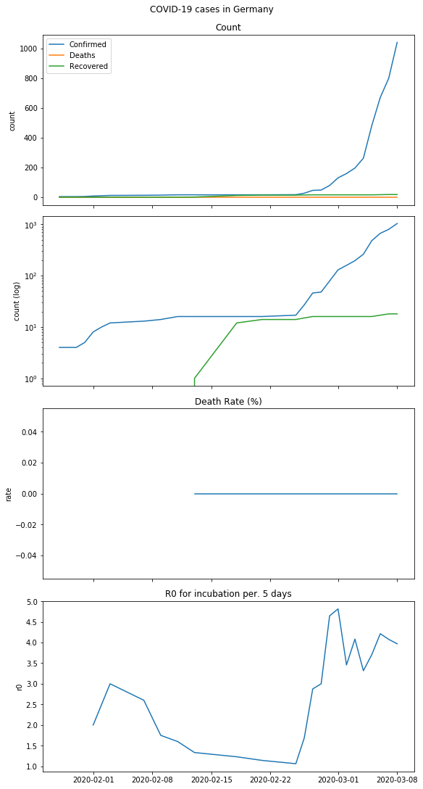


<p>Data extracted from <a href="https://github.com/CSSEGISandData/COVID-19">Johns Hopkins CSSE Data Repository</a></p>


<div>
<style scoped>
    .dataframe tbody tr th:only-of-type {
        vertical-align: middle;
    }

    .dataframe tbody tr th {
        vertical-align: top;
    }

    .dataframe thead th {
        text-align: right;
    }
</style>
<table border="1" class="dataframe">
  <thead>
    <tr style="text-align: right;">
      <th></th>
      <th>Last Update</th>
      <th>Country/Region</th>
      <th>Confirmed</th>
      <th>Deaths</th>
      <th>Recovered</th>
      <th>Death Rate (%)</th>
    </tr>
  </thead>
  <tbody>
    <tr>
      <td>86</td>
      <td>2020-01-28</td>
      <td>Germany</td>
      <td>4.0</td>
      <td>0.0</td>
      <td>0.0</td>
      <td>NaN</td>
    </tr>
    <tr>
      <td>105</td>
      <td>2020-01-29</td>
      <td>Germany</td>
      <td>4.0</td>
      <td>0.0</td>
      <td>0.0</td>
      <td>NaN</td>
    </tr>
    <tr>
      <td>125</td>
      <td>2020-01-30</td>
      <td>Germany</td>
      <td>4.0</td>
      <td>0.0</td>
      <td>0.0</td>
      <td>NaN</td>
    </tr>
    <tr>
      <td>147</td>
      <td>2020-01-31</td>
      <td>Germany</td>
      <td>5.0</td>
      <td>0.0</td>
      <td>0.0</td>
      <td>NaN</td>
    </tr>
    <tr>
      <td>171</td>
      <td>2020-02-01</td>
      <td>Germany</td>
      <td>8.0</td>
      <td>0.0</td>
      <td>0.0</td>
      <td>NaN</td>
    </tr>
    <tr>
      <td>184</td>
      <td>2020-02-02</td>
      <td>Germany</td>
      <td>10.0</td>
      <td>0.0</td>
      <td>0.0</td>
      <td>NaN</td>
    </tr>
    <tr>
      <td>193</td>
      <td>2020-02-03</td>
      <td>Germany</td>
      <td>12.0</td>
      <td>0.0</td>
      <td>0.0</td>
      <td>NaN</td>
    </tr>
    <tr>
      <td>227</td>
      <td>2020-02-07</td>
      <td>Germany</td>
      <td>13.0</td>
      <td>0.0</td>
      <td>0.0</td>
      <td>NaN</td>
    </tr>
    <tr>
      <td>249</td>
      <td>2020-02-09</td>
      <td>Germany</td>
      <td>14.0</td>
      <td>0.0</td>
      <td>0.0</td>
      <td>NaN</td>
    </tr>
    <tr>
      <td>269</td>
      <td>2020-02-11</td>
      <td>Germany</td>
      <td>16.0</td>
      <td>0.0</td>
      <td>0.0</td>
      <td>NaN</td>
    </tr>
    <tr>
      <td>296</td>
      <td>2020-02-13</td>
      <td>Germany</td>
      <td>16.0</td>
      <td>0.0</td>
      <td>1.0</td>
      <td>0.0</td>
    </tr>
    <tr>
      <td>347</td>
      <td>2020-02-18</td>
      <td>Germany</td>
      <td>16.0</td>
      <td>0.0</td>
      <td>12.0</td>
      <td>0.0</td>
    </tr>
    <tr>
      <td>374</td>
      <td>2020-02-21</td>
      <td>Germany</td>
      <td>16.0</td>
      <td>0.0</td>
      <td>14.0</td>
      <td>0.0</td>
    </tr>
    <tr>
      <td>432</td>
      <td>2020-02-25</td>
      <td>Germany</td>
      <td>17.0</td>
      <td>0.0</td>
      <td>14.0</td>
      <td>0.0</td>
    </tr>
    <tr>
      <td>456</td>
      <td>2020-02-26</td>
      <td>Germany</td>
      <td>27.0</td>
      <td>0.0</td>
      <td>15.0</td>
      <td>0.0</td>
    </tr>
    <tr>
      <td>487</td>
      <td>2020-02-27</td>
      <td>Germany</td>
      <td>46.0</td>
      <td>0.0</td>
      <td>16.0</td>
      <td>0.0</td>
    </tr>
    <tr>
      <td>517</td>
      <td>2020-02-28</td>
      <td>Germany</td>
      <td>48.0</td>
      <td>0.0</td>
      <td>16.0</td>
      <td>0.0</td>
    </tr>
    <tr>
      <td>552</td>
      <td>2020-02-29</td>
      <td>Germany</td>
      <td>79.0</td>
      <td>0.0</td>
      <td>16.0</td>
      <td>0.0</td>
    </tr>
    <tr>
      <td>599</td>
      <td>2020-03-01</td>
      <td>Germany</td>
      <td>130.0</td>
      <td>0.0</td>
      <td>16.0</td>
      <td>0.0</td>
    </tr>
    <tr>
      <td>637</td>
      <td>2020-03-02</td>
      <td>Germany</td>
      <td>159.0</td>
      <td>0.0</td>
      <td>16.0</td>
      <td>0.0</td>
    </tr>
    <tr>
      <td>681</td>
      <td>2020-03-03</td>
      <td>Germany</td>
      <td>196.0</td>
      <td>0.0</td>
      <td>16.0</td>
      <td>0.0</td>
    </tr>
    <tr>
      <td>733</td>
      <td>2020-03-04</td>
      <td>Germany</td>
      <td>262.0</td>
      <td>0.0</td>
      <td>16.0</td>
      <td>0.0</td>
    </tr>
    <tr>
      <td>784</td>
      <td>2020-03-05</td>
      <td>Germany</td>
      <td>482.0</td>
      <td>0.0</td>
      <td>16.0</td>
      <td>0.0</td>
    </tr>
    <tr>
      <td>839</td>
      <td>2020-03-06</td>
      <td>Germany</td>
      <td>670.0</td>
      <td>0.0</td>
      <td>17.0</td>
      <td>0.0</td>
    </tr>
    <tr>
      <td>899</td>
      <td>2020-03-07</td>
      <td>Germany</td>
      <td>799.0</td>
      <td>0.0</td>
      <td>18.0</td>
      <td>0.0</td>
    </tr>
    <tr>
      <td>956</td>
      <td>2020-03-08</td>
      <td>Germany</td>
      <td>1040.0</td>
      <td>0.0</td>
      <td>18.0</td>
      <td>0.0</td>
    </tr>
  </tbody>
</table>
</div>


<p>r0 calculated as (Confirmed cases at day N + incubation period = 5 days)/(confirmed cases at day N)</p>


<p>Note that this is just a very rough value determined by "garage epidemiology" and should not be used as reference</p>


<div>
<style scoped>
    .dataframe tbody tr th:only-of-type {
        vertical-align: middle;
    }

    .dataframe tbody tr th {
        vertical-align: top;
    }

    .dataframe thead th {
        text-align: right;
    }
</style>
<table border="1" class="dataframe">
  <thead>
    <tr style="text-align: right;">
      <th></th>
      <th>r0</th>
    </tr>
    <tr>
      <th>Last Update</th>
      <th></th>
    </tr>
  </thead>
  <tbody>
    <tr>
      <td>2020-01-28</td>
      <td>NaN</td>
    </tr>
    <tr>
      <td>2020-01-29</td>
      <td>NaN</td>
    </tr>
    <tr>
      <td>2020-01-30</td>
      <td>NaN</td>
    </tr>
    <tr>
      <td>2020-01-31</td>
      <td>NaN</td>
    </tr>
    <tr>
      <td>2020-02-01</td>
      <td>2.000000</td>
    </tr>
    <tr>
      <td>2020-02-02</td>
      <td>2.500000</td>
    </tr>
    <tr>
      <td>2020-02-03</td>
      <td>3.000000</td>
    </tr>
    <tr>
      <td>2020-02-07</td>
      <td>2.600000</td>
    </tr>
    <tr>
      <td>2020-02-09</td>
      <td>1.750000</td>
    </tr>
    <tr>
      <td>2020-02-11</td>
      <td>1.600000</td>
    </tr>
    <tr>
      <td>2020-02-13</td>
      <td>1.333333</td>
    </tr>
    <tr>
      <td>2020-02-18</td>
      <td>1.230769</td>
    </tr>
    <tr>
      <td>2020-02-21</td>
      <td>1.142857</td>
    </tr>
    <tr>
      <td>2020-02-25</td>
      <td>1.062500</td>
    </tr>
    <tr>
      <td>2020-02-26</td>
      <td>1.687500</td>
    </tr>
    <tr>
      <td>2020-02-27</td>
      <td>2.875000</td>
    </tr>
    <tr>
      <td>2020-02-28</td>
      <td>3.000000</td>
    </tr>
    <tr>
      <td>2020-02-29</td>
      <td>4.647059</td>
    </tr>
    <tr>
      <td>2020-03-01</td>
      <td>4.814815</td>
    </tr>
    <tr>
      <td>2020-03-02</td>
      <td>3.456522</td>
    </tr>
    <tr>
      <td>2020-03-03</td>
      <td>4.083333</td>
    </tr>
    <tr>
      <td>2020-03-04</td>
      <td>3.316456</td>
    </tr>
    <tr>
      <td>2020-03-05</td>
      <td>3.707692</td>
    </tr>
    <tr>
      <td>2020-03-06</td>
      <td>4.213836</td>
    </tr>
    <tr>
      <td>2020-03-07</td>
      <td>4.076531</td>
    </tr>
    <tr>
      <td>2020-03-08</td>
      <td>3.969466</td>
    </tr>
  </tbody>
</table>
</div>


<h2><a name="gibraltar" href="#gibraltar">Gibraltar</a></h2>


<p>Plot of COVID-19 cases.</p>


<p>Death rate calculated as (count of death)(count of death + count of recovered)</p>


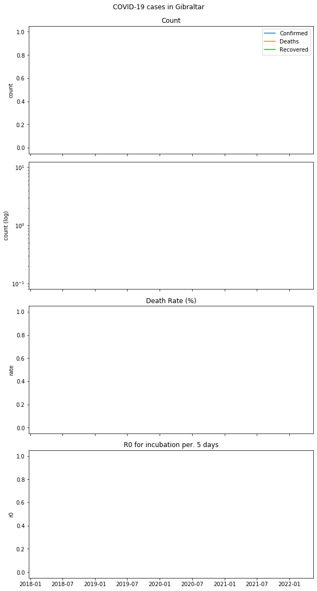


<p>Data extracted from <a href="https://github.com/CSSEGISandData/COVID-19">Johns Hopkins CSSE Data Repository</a></p>


<div>
<style scoped>
    .dataframe tbody tr th:only-of-type {
        vertical-align: middle;
    }

    .dataframe tbody tr th {
        vertical-align: top;
    }

    .dataframe thead th {
        text-align: right;
    }
</style>
<table border="1" class="dataframe">
  <thead>
    <tr style="text-align: right;">
      <th></th>
      <th>Last Update</th>
      <th>Country/Region</th>
      <th>Confirmed</th>
      <th>Deaths</th>
      <th>Recovered</th>
      <th>Death Rate (%)</th>
    </tr>
  </thead>
  <tbody>
    <tr>
      <td>734</td>
      <td>2020-03-04</td>
      <td>Gibraltar</td>
      <td>1.0</td>
      <td>0.0</td>
      <td>0.0</td>
      <td>NaN</td>
    </tr>
  </tbody>
</table>
</div>


<p>r0 calculated as (Confirmed cases at day N + incubation period = 5 days)/(confirmed cases at day N)</p>


<p>Note that this is just a very rough value determined by "garage epidemiology" and should not be used as reference</p>


<div>
<style scoped>
    .dataframe tbody tr th:only-of-type {
        vertical-align: middle;
    }

    .dataframe tbody tr th {
        vertical-align: top;
    }

    .dataframe thead th {
        text-align: right;
    }
</style>
<table border="1" class="dataframe">
  <thead>
    <tr style="text-align: right;">
      <th></th>
      <th>r0</th>
    </tr>
    <tr>
      <th>Last Update</th>
      <th></th>
    </tr>
  </thead>
  <tbody>
    <tr>
      <td>2020-03-04</td>
      <td>NaN</td>
    </tr>
  </tbody>
</table>
</div>


<h2><a name="greece" href="#greece">Greece</a></h2>


<p>Plot of COVID-19 cases.</p>


<p>Death rate calculated as (count of death)(count of death + count of recovered)</p>


<p>Data extracted from <a href="https://github.com/CSSEGISandData/COVID-19">Johns Hopkins CSSE Data Repository</a></p>


<div>
<style scoped>
    .dataframe tbody tr th:only-of-type {
        vertical-align: middle;
    }

    .dataframe tbody tr th {
        vertical-align: top;
    }

    .dataframe thead th {
        text-align: right;
    }
</style>
<table border="1" class="dataframe">
  <thead>
    <tr style="text-align: right;">
      <th></th>
      <th>Last Update</th>
      <th>Country/Region</th>
      <th>Confirmed</th>
      <th>Deaths</th>
      <th>Recovered</th>
      <th>Death Rate (%)</th>
    </tr>
  </thead>
  <tbody>
    <tr>
      <td>457</td>
      <td>2020-02-26</td>
      <td>Greece</td>
      <td>1.0</td>
      <td>0.0</td>
      <td>0.0</td>
      <td>NaN</td>
    </tr>
    <tr>
      <td>488</td>
      <td>2020-02-27</td>
      <td>Greece</td>
      <td>3.0</td>
      <td>0.0</td>
      <td>0.0</td>
      <td>NaN</td>
    </tr>
    <tr>
      <td>518</td>
      <td>2020-02-28</td>
      <td>Greece</td>
      <td>4.0</td>
      <td>0.0</td>
      <td>0.0</td>
      <td>NaN</td>
    </tr>
    <tr>
      <td>600</td>
      <td>2020-03-01</td>
      <td>Greece</td>
      <td>7.0</td>
      <td>0.0</td>
      <td>0.0</td>
      <td>NaN</td>
    </tr>
    <tr>
      <td>735</td>
      <td>2020-03-04</td>
      <td>Greece</td>
      <td>9.0</td>
      <td>0.0</td>
      <td>0.0</td>
      <td>NaN</td>
    </tr>
    <tr>
      <td>785</td>
      <td>2020-03-05</td>
      <td>Greece</td>
      <td>31.0</td>
      <td>0.0</td>
      <td>0.0</td>
      <td>NaN</td>
    </tr>
    <tr>
      <td>840</td>
      <td>2020-03-06</td>
      <td>Greece</td>
      <td>45.0</td>
      <td>0.0</td>
      <td>0.0</td>
      <td>NaN</td>
    </tr>
    <tr>
      <td>900</td>
      <td>2020-03-07</td>
      <td>Greece</td>
      <td>46.0</td>
      <td>0.0</td>
      <td>0.0</td>
      <td>NaN</td>
    </tr>
    <tr>
      <td>957</td>
      <td>2020-03-08</td>
      <td>Greece</td>
      <td>73.0</td>
      <td>0.0</td>
      <td>0.0</td>
      <td>NaN</td>
    </tr>
  </tbody>
</table>
</div>


<p>r0 calculated as (Confirmed cases at day N + incubation period = 5 days)/(confirmed cases at day N)</p>


<p>Note that this is just a very rough value determined by "garage epidemiology" and should not be used as reference</p>


<div>
<style scoped>
    .dataframe tbody tr th:only-of-type {
        vertical-align: middle;
    }

    .dataframe tbody tr th {
        vertical-align: top;
    }

    .dataframe thead th {
        text-align: right;
    }
</style>
<table border="1" class="dataframe">
  <thead>
    <tr style="text-align: right;">
      <th></th>
      <th>r0</th>
    </tr>
    <tr>
      <th>Last Update</th>
      <th></th>
    </tr>
  </thead>
  <tbody>
    <tr>
      <td>2020-02-26</td>
      <td>NaN</td>
    </tr>
    <tr>
      <td>2020-02-27</td>
      <td>NaN</td>
    </tr>
    <tr>
      <td>2020-02-28</td>
      <td>NaN</td>
    </tr>
    <tr>
      <td>2020-03-01</td>
      <td>NaN</td>
    </tr>
    <tr>
      <td>2020-03-04</td>
      <td>9.000000</td>
    </tr>
    <tr>
      <td>2020-03-05</td>
      <td>10.333333</td>
    </tr>
    <tr>
      <td>2020-03-06</td>
      <td>11.250000</td>
    </tr>
    <tr>
      <td>2020-03-07</td>
      <td>6.571429</td>
    </tr>
    <tr>
      <td>2020-03-08</td>
      <td>8.111111</td>
    </tr>
  </tbody>
</table>
</div>


<h2><a name="hong_kong" href="#hong_kong">Hong Kong</a></h2>


<p>Plot of COVID-19 cases.</p>


<p>Death rate calculated as (count of death)(count of death + count of recovered)</p>


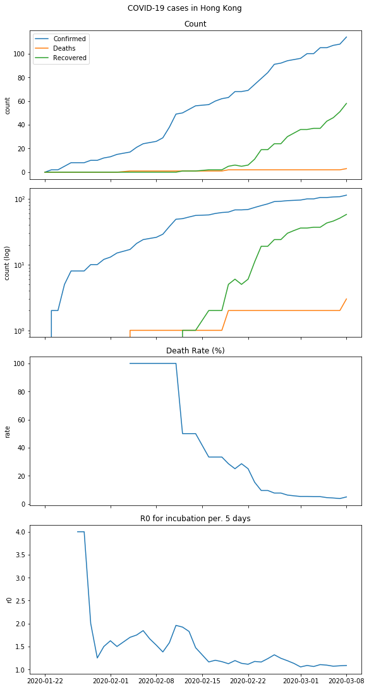


<p>Data extracted from <a href="https://github.com/CSSEGISandData/COVID-19">Johns Hopkins CSSE Data Repository</a></p>


<div>
<style scoped>
    .dataframe tbody tr th:only-of-type {
        vertical-align: middle;
    }

    .dataframe tbody tr th {
        vertical-align: top;
    }

    .dataframe thead th {
        text-align: right;
    }
</style>
<table border="1" class="dataframe">
  <thead>
    <tr style="text-align: right;">
      <th></th>
      <th>Last Update</th>
      <th>Country/Region</th>
      <th>Confirmed</th>
      <th>Deaths</th>
      <th>Recovered</th>
      <th>Death Rate (%)</th>
    </tr>
  </thead>
  <tbody>
    <tr>
      <td>0</td>
      <td>2020-01-22</td>
      <td>Hong Kong</td>
      <td>0.0</td>
      <td>0.0</td>
      <td>0.0</td>
      <td>NaN</td>
    </tr>
    <tr>
      <td>11</td>
      <td>2020-01-23</td>
      <td>Hong Kong</td>
      <td>2.0</td>
      <td>0.0</td>
      <td>0.0</td>
      <td>NaN</td>
    </tr>
    <tr>
      <td>25</td>
      <td>2020-01-24</td>
      <td>Hong Kong</td>
      <td>2.0</td>
      <td>0.0</td>
      <td>0.0</td>
      <td>NaN</td>
    </tr>
    <tr>
      <td>37</td>
      <td>2020-01-25</td>
      <td>Hong Kong</td>
      <td>5.0</td>
      <td>0.0</td>
      <td>0.0</td>
      <td>NaN</td>
    </tr>
    <tr>
      <td>52</td>
      <td>2020-01-26</td>
      <td>Hong Kong</td>
      <td>8.0</td>
      <td>0.0</td>
      <td>0.0</td>
      <td>NaN</td>
    </tr>
    <tr>
      <td>68</td>
      <td>2020-01-27</td>
      <td>Hong Kong</td>
      <td>8.0</td>
      <td>0.0</td>
      <td>0.0</td>
      <td>NaN</td>
    </tr>
    <tr>
      <td>87</td>
      <td>2020-01-28</td>
      <td>Hong Kong</td>
      <td>8.0</td>
      <td>0.0</td>
      <td>0.0</td>
      <td>NaN</td>
    </tr>
    <tr>
      <td>106</td>
      <td>2020-01-29</td>
      <td>Hong Kong</td>
      <td>10.0</td>
      <td>0.0</td>
      <td>0.0</td>
      <td>NaN</td>
    </tr>
    <tr>
      <td>126</td>
      <td>2020-01-30</td>
      <td>Hong Kong</td>
      <td>10.0</td>
      <td>0.0</td>
      <td>0.0</td>
      <td>NaN</td>
    </tr>
    <tr>
      <td>148</td>
      <td>2020-01-31</td>
      <td>Hong Kong</td>
      <td>12.0</td>
      <td>0.0</td>
      <td>0.0</td>
      <td>NaN</td>
    </tr>
    <tr>
      <td>172</td>
      <td>2020-02-01</td>
      <td>Hong Kong</td>
      <td>13.0</td>
      <td>0.0</td>
      <td>0.0</td>
      <td>NaN</td>
    </tr>
    <tr>
      <td>185</td>
      <td>2020-02-02</td>
      <td>Hong Kong</td>
      <td>15.0</td>
      <td>0.0</td>
      <td>0.0</td>
      <td>NaN</td>
    </tr>
    <tr>
      <td>201</td>
      <td>2020-02-04</td>
      <td>Hong Kong</td>
      <td>17.0</td>
      <td>1.0</td>
      <td>0.0</td>
      <td>100.000000</td>
    </tr>
    <tr>
      <td>211</td>
      <td>2020-02-05</td>
      <td>Hong Kong</td>
      <td>21.0</td>
      <td>1.0</td>
      <td>0.0</td>
      <td>100.000000</td>
    </tr>
    <tr>
      <td>218</td>
      <td>2020-02-06</td>
      <td>Hong Kong</td>
      <td>24.0</td>
      <td>1.0</td>
      <td>0.0</td>
      <td>100.000000</td>
    </tr>
    <tr>
      <td>228</td>
      <td>2020-02-07</td>
      <td>Hong Kong</td>
      <td>25.0</td>
      <td>1.0</td>
      <td>0.0</td>
      <td>100.000000</td>
    </tr>
    <tr>
      <td>239</td>
      <td>2020-02-08</td>
      <td>Hong Kong</td>
      <td>26.0</td>
      <td>1.0</td>
      <td>0.0</td>
      <td>100.000000</td>
    </tr>
    <tr>
      <td>250</td>
      <td>2020-02-09</td>
      <td>Hong Kong</td>
      <td>29.0</td>
      <td>1.0</td>
      <td>0.0</td>
      <td>100.000000</td>
    </tr>
    <tr>
      <td>259</td>
      <td>2020-02-10</td>
      <td>Hong Kong</td>
      <td>38.0</td>
      <td>1.0</td>
      <td>0.0</td>
      <td>100.000000</td>
    </tr>
    <tr>
      <td>270</td>
      <td>2020-02-11</td>
      <td>Hong Kong</td>
      <td>49.0</td>
      <td>1.0</td>
      <td>0.0</td>
      <td>100.000000</td>
    </tr>
    <tr>
      <td>283</td>
      <td>2020-02-12</td>
      <td>Hong Kong</td>
      <td>50.0</td>
      <td>1.0</td>
      <td>1.0</td>
      <td>50.000000</td>
    </tr>
    <tr>
      <td>297</td>
      <td>2020-02-13</td>
      <td>Hong Kong</td>
      <td>53.0</td>
      <td>1.0</td>
      <td>1.0</td>
      <td>50.000000</td>
    </tr>
    <tr>
      <td>308</td>
      <td>2020-02-14</td>
      <td>Hong Kong</td>
      <td>56.0</td>
      <td>1.0</td>
      <td>1.0</td>
      <td>50.000000</td>
    </tr>
    <tr>
      <td>324</td>
      <td>2020-02-16</td>
      <td>Hong Kong</td>
      <td>57.0</td>
      <td>1.0</td>
      <td>2.0</td>
      <td>33.333333</td>
    </tr>
    <tr>
      <td>339</td>
      <td>2020-02-17</td>
      <td>Hong Kong</td>
      <td>60.0</td>
      <td>1.0</td>
      <td>2.0</td>
      <td>33.333333</td>
    </tr>
    <tr>
      <td>348</td>
      <td>2020-02-18</td>
      <td>Hong Kong</td>
      <td>62.0</td>
      <td>1.0</td>
      <td>2.0</td>
      <td>33.333333</td>
    </tr>
    <tr>
      <td>355</td>
      <td>2020-02-19</td>
      <td>Hong Kong</td>
      <td>63.0</td>
      <td>2.0</td>
      <td>5.0</td>
      <td>28.571429</td>
    </tr>
    <tr>
      <td>363</td>
      <td>2020-02-20</td>
      <td>Hong Kong</td>
      <td>68.0</td>
      <td>2.0</td>
      <td>6.0</td>
      <td>25.000000</td>
    </tr>
    <tr>
      <td>375</td>
      <td>2020-02-21</td>
      <td>Hong Kong</td>
      <td>68.0</td>
      <td>2.0</td>
      <td>5.0</td>
      <td>28.571429</td>
    </tr>
    <tr>
      <td>389</td>
      <td>2020-02-22</td>
      <td>Hong Kong</td>
      <td>69.0</td>
      <td>2.0</td>
      <td>6.0</td>
      <td>25.000000</td>
    </tr>
    <tr>
      <td>399</td>
      <td>2020-02-23</td>
      <td>Hong Kong</td>
      <td>74.0</td>
      <td>2.0</td>
      <td>11.0</td>
      <td>15.384615</td>
    </tr>
    <tr>
      <td>413</td>
      <td>2020-02-24</td>
      <td>Hong Kong</td>
      <td>79.0</td>
      <td>2.0</td>
      <td>19.0</td>
      <td>9.523810</td>
    </tr>
    <tr>
      <td>433</td>
      <td>2020-02-25</td>
      <td>Hong Kong</td>
      <td>84.0</td>
      <td>2.0</td>
      <td>19.0</td>
      <td>9.523810</td>
    </tr>
    <tr>
      <td>458</td>
      <td>2020-02-26</td>
      <td>Hong Kong</td>
      <td>91.0</td>
      <td>2.0</td>
      <td>24.0</td>
      <td>7.692308</td>
    </tr>
    <tr>
      <td>489</td>
      <td>2020-02-27</td>
      <td>Hong Kong</td>
      <td>92.0</td>
      <td>2.0</td>
      <td>24.0</td>
      <td>7.692308</td>
    </tr>
    <tr>
      <td>519</td>
      <td>2020-02-28</td>
      <td>Hong Kong</td>
      <td>94.0</td>
      <td>2.0</td>
      <td>30.0</td>
      <td>6.250000</td>
    </tr>
    <tr>
      <td>553</td>
      <td>2020-02-29</td>
      <td>Hong Kong</td>
      <td>95.0</td>
      <td>2.0</td>
      <td>33.0</td>
      <td>5.714286</td>
    </tr>
    <tr>
      <td>601</td>
      <td>2020-03-01</td>
      <td>Hong Kong</td>
      <td>96.0</td>
      <td>2.0</td>
      <td>36.0</td>
      <td>5.263158</td>
    </tr>
    <tr>
      <td>638</td>
      <td>2020-03-02</td>
      <td>Hong Kong</td>
      <td>100.0</td>
      <td>2.0</td>
      <td>36.0</td>
      <td>5.263158</td>
    </tr>
    <tr>
      <td>682</td>
      <td>2020-03-03</td>
      <td>Hong Kong</td>
      <td>100.0</td>
      <td>2.0</td>
      <td>37.0</td>
      <td>5.128205</td>
    </tr>
    <tr>
      <td>736</td>
      <td>2020-03-04</td>
      <td>Hong Kong</td>
      <td>105.0</td>
      <td>2.0</td>
      <td>37.0</td>
      <td>5.128205</td>
    </tr>
    <tr>
      <td>786</td>
      <td>2020-03-05</td>
      <td>Hong Kong</td>
      <td>105.0</td>
      <td>2.0</td>
      <td>43.0</td>
      <td>4.444444</td>
    </tr>
    <tr>
      <td>841</td>
      <td>2020-03-06</td>
      <td>Hong Kong</td>
      <td>107.0</td>
      <td>2.0</td>
      <td>46.0</td>
      <td>4.166667</td>
    </tr>
    <tr>
      <td>901</td>
      <td>2020-03-07</td>
      <td>Hong Kong</td>
      <td>108.0</td>
      <td>2.0</td>
      <td>51.0</td>
      <td>3.773585</td>
    </tr>
    <tr>
      <td>958</td>
      <td>2020-03-08</td>
      <td>Hong Kong</td>
      <td>114.0</td>
      <td>3.0</td>
      <td>58.0</td>
      <td>4.918033</td>
    </tr>
  </tbody>
</table>
</div>


<p>r0 calculated as (Confirmed cases at day N + incubation period = 5 days)/(confirmed cases at day N)</p>


<p>Note that this is just a very rough value determined by "garage epidemiology" and should not be used as reference</p>


<div>
<style scoped>
    .dataframe tbody tr th:only-of-type {
        vertical-align: middle;
    }

    .dataframe tbody tr th {
        vertical-align: top;
    }

    .dataframe thead th {
        text-align: right;
    }
</style>
<table border="1" class="dataframe">
  <thead>
    <tr style="text-align: right;">
      <th></th>
      <th>r0</th>
    </tr>
    <tr>
      <th>Last Update</th>
      <th></th>
    </tr>
  </thead>
  <tbody>
    <tr>
      <td>2020-01-22</td>
      <td>NaN</td>
    </tr>
    <tr>
      <td>2020-01-23</td>
      <td>NaN</td>
    </tr>
    <tr>
      <td>2020-01-24</td>
      <td>NaN</td>
    </tr>
    <tr>
      <td>2020-01-25</td>
      <td>NaN</td>
    </tr>
    <tr>
      <td>2020-01-26</td>
      <td>inf</td>
    </tr>
    <tr>
      <td>2020-01-27</td>
      <td>4.000000</td>
    </tr>
    <tr>
      <td>2020-01-28</td>
      <td>4.000000</td>
    </tr>
    <tr>
      <td>2020-01-29</td>
      <td>2.000000</td>
    </tr>
    <tr>
      <td>2020-01-30</td>
      <td>1.250000</td>
    </tr>
    <tr>
      <td>2020-01-31</td>
      <td>1.500000</td>
    </tr>
    <tr>
      <td>2020-02-01</td>
      <td>1.625000</td>
    </tr>
    <tr>
      <td>2020-02-02</td>
      <td>1.500000</td>
    </tr>
    <tr>
      <td>2020-02-04</td>
      <td>1.700000</td>
    </tr>
    <tr>
      <td>2020-02-05</td>
      <td>1.750000</td>
    </tr>
    <tr>
      <td>2020-02-06</td>
      <td>1.846154</td>
    </tr>
    <tr>
      <td>2020-02-07</td>
      <td>1.666667</td>
    </tr>
    <tr>
      <td>2020-02-08</td>
      <td>1.529412</td>
    </tr>
    <tr>
      <td>2020-02-09</td>
      <td>1.380952</td>
    </tr>
    <tr>
      <td>2020-02-10</td>
      <td>1.583333</td>
    </tr>
    <tr>
      <td>2020-02-11</td>
      <td>1.960000</td>
    </tr>
    <tr>
      <td>2020-02-12</td>
      <td>1.923077</td>
    </tr>
    <tr>
      <td>2020-02-13</td>
      <td>1.827586</td>
    </tr>
    <tr>
      <td>2020-02-14</td>
      <td>1.473684</td>
    </tr>
    <tr>
      <td>2020-02-16</td>
      <td>1.163265</td>
    </tr>
    <tr>
      <td>2020-02-17</td>
      <td>1.200000</td>
    </tr>
    <tr>
      <td>2020-02-18</td>
      <td>1.169811</td>
    </tr>
    <tr>
      <td>2020-02-19</td>
      <td>1.125000</td>
    </tr>
    <tr>
      <td>2020-02-20</td>
      <td>1.192982</td>
    </tr>
    <tr>
      <td>2020-02-21</td>
      <td>1.133333</td>
    </tr>
    <tr>
      <td>2020-02-22</td>
      <td>1.112903</td>
    </tr>
    <tr>
      <td>2020-02-23</td>
      <td>1.174603</td>
    </tr>
    <tr>
      <td>2020-02-24</td>
      <td>1.161765</td>
    </tr>
    <tr>
      <td>2020-02-25</td>
      <td>1.235294</td>
    </tr>
    <tr>
      <td>2020-02-26</td>
      <td>1.318841</td>
    </tr>
    <tr>
      <td>2020-02-27</td>
      <td>1.243243</td>
    </tr>
    <tr>
      <td>2020-02-28</td>
      <td>1.189873</td>
    </tr>
    <tr>
      <td>2020-02-29</td>
      <td>1.130952</td>
    </tr>
    <tr>
      <td>2020-03-01</td>
      <td>1.054945</td>
    </tr>
    <tr>
      <td>2020-03-02</td>
      <td>1.086957</td>
    </tr>
    <tr>
      <td>2020-03-03</td>
      <td>1.063830</td>
    </tr>
    <tr>
      <td>2020-03-04</td>
      <td>1.105263</td>
    </tr>
    <tr>
      <td>2020-03-05</td>
      <td>1.093750</td>
    </tr>
    <tr>
      <td>2020-03-06</td>
      <td>1.070000</td>
    </tr>
    <tr>
      <td>2020-03-07</td>
      <td>1.080000</td>
    </tr>
    <tr>
      <td>2020-03-08</td>
      <td>1.085714</td>
    </tr>
  </tbody>
</table>
</div>


<h2><a name="hungary" href="#hungary">Hungary</a></h2>


<p>Plot of COVID-19 cases.</p>


<p>Death rate calculated as (count of death)(count of death + count of recovered)</p>


<p>Data extracted from <a href="https://github.com/CSSEGISandData/COVID-19">Johns Hopkins CSSE Data Repository</a></p>


<div>
<style scoped>
    .dataframe tbody tr th:only-of-type {
        vertical-align: middle;
    }

    .dataframe tbody tr th {
        vertical-align: top;
    }

    .dataframe thead th {
        text-align: right;
    }
</style>
<table border="1" class="dataframe">
  <thead>
    <tr style="text-align: right;">
      <th></th>
      <th>Last Update</th>
      <th>Country/Region</th>
      <th>Confirmed</th>
      <th>Deaths</th>
      <th>Recovered</th>
      <th>Death Rate (%)</th>
    </tr>
  </thead>
  <tbody>
    <tr>
      <td>737</td>
      <td>2020-03-04</td>
      <td>Hungary</td>
      <td>2.0</td>
      <td>0.0</td>
      <td>0.0</td>
      <td>NaN</td>
    </tr>
    <tr>
      <td>787</td>
      <td>2020-03-05</td>
      <td>Hungary</td>
      <td>2.0</td>
      <td>0.0</td>
      <td>0.0</td>
      <td>NaN</td>
    </tr>
    <tr>
      <td>902</td>
      <td>2020-03-07</td>
      <td>Hungary</td>
      <td>4.0</td>
      <td>0.0</td>
      <td>0.0</td>
      <td>NaN</td>
    </tr>
    <tr>
      <td>959</td>
      <td>2020-03-08</td>
      <td>Hungary</td>
      <td>7.0</td>
      <td>0.0</td>
      <td>0.0</td>
      <td>NaN</td>
    </tr>
  </tbody>
</table>
</div>


<p>r0 calculated as (Confirmed cases at day N + incubation period = 5 days)/(confirmed cases at day N)</p>


<p>Note that this is just a very rough value determined by "garage epidemiology" and should not be used as reference</p>


<div>
<style scoped>
    .dataframe tbody tr th:only-of-type {
        vertical-align: middle;
    }

    .dataframe tbody tr th {
        vertical-align: top;
    }

    .dataframe thead th {
        text-align: right;
    }
</style>
<table border="1" class="dataframe">
  <thead>
    <tr style="text-align: right;">
      <th></th>
      <th>r0</th>
    </tr>
    <tr>
      <th>Last Update</th>
      <th></th>
    </tr>
  </thead>
  <tbody>
    <tr>
      <td>2020-03-04</td>
      <td>NaN</td>
    </tr>
    <tr>
      <td>2020-03-05</td>
      <td>NaN</td>
    </tr>
    <tr>
      <td>2020-03-07</td>
      <td>NaN</td>
    </tr>
    <tr>
      <td>2020-03-08</td>
      <td>NaN</td>
    </tr>
  </tbody>
</table>
</div>


<h2><a name="iceland" href="#iceland">Iceland</a></h2>


<p>Plot of COVID-19 cases.</p>


<p>Death rate calculated as (count of death)(count of death + count of recovered)</p>


<p>Data extracted from <a href="https://github.com/CSSEGISandData/COVID-19">Johns Hopkins CSSE Data Repository</a></p>


<div>
<style scoped>
    .dataframe tbody tr th:only-of-type {
        vertical-align: middle;
    }

    .dataframe tbody tr th {
        vertical-align: top;
    }

    .dataframe thead th {
        text-align: right;
    }
</style>
<table border="1" class="dataframe">
  <thead>
    <tr style="text-align: right;">
      <th></th>
      <th>Last Update</th>
      <th>Country/Region</th>
      <th>Confirmed</th>
      <th>Deaths</th>
      <th>Recovered</th>
      <th>Death Rate (%)</th>
    </tr>
  </thead>
  <tbody>
    <tr>
      <td>520</td>
      <td>2020-02-28</td>
      <td>Iceland</td>
      <td>1.0</td>
      <td>0.0</td>
      <td>0.0</td>
      <td>NaN</td>
    </tr>
    <tr>
      <td>554</td>
      <td>2020-02-29</td>
      <td>Iceland</td>
      <td>1.0</td>
      <td>0.0</td>
      <td>0.0</td>
      <td>NaN</td>
    </tr>
    <tr>
      <td>602</td>
      <td>2020-03-01</td>
      <td>Iceland</td>
      <td>3.0</td>
      <td>0.0</td>
      <td>0.0</td>
      <td>NaN</td>
    </tr>
    <tr>
      <td>639</td>
      <td>2020-03-02</td>
      <td>Iceland</td>
      <td>6.0</td>
      <td>0.0</td>
      <td>0.0</td>
      <td>NaN</td>
    </tr>
    <tr>
      <td>683</td>
      <td>2020-03-03</td>
      <td>Iceland</td>
      <td>11.0</td>
      <td>0.0</td>
      <td>0.0</td>
      <td>NaN</td>
    </tr>
    <tr>
      <td>738</td>
      <td>2020-03-04</td>
      <td>Iceland</td>
      <td>26.0</td>
      <td>0.0</td>
      <td>0.0</td>
      <td>NaN</td>
    </tr>
    <tr>
      <td>788</td>
      <td>2020-03-05</td>
      <td>Iceland</td>
      <td>34.0</td>
      <td>0.0</td>
      <td>0.0</td>
      <td>NaN</td>
    </tr>
    <tr>
      <td>842</td>
      <td>2020-03-06</td>
      <td>Iceland</td>
      <td>43.0</td>
      <td>0.0</td>
      <td>0.0</td>
      <td>NaN</td>
    </tr>
    <tr>
      <td>903</td>
      <td>2020-03-07</td>
      <td>Iceland</td>
      <td>50.0</td>
      <td>0.0</td>
      <td>0.0</td>
      <td>NaN</td>
    </tr>
  </tbody>
</table>
</div>


<p>r0 calculated as (Confirmed cases at day N + incubation period = 5 days)/(confirmed cases at day N)</p>


<p>Note that this is just a very rough value determined by "garage epidemiology" and should not be used as reference</p>


<div>
<style scoped>
    .dataframe tbody tr th:only-of-type {
        vertical-align: middle;
    }

    .dataframe tbody tr th {
        vertical-align: top;
    }

    .dataframe thead th {
        text-align: right;
    }
</style>
<table border="1" class="dataframe">
  <thead>
    <tr style="text-align: right;">
      <th></th>
      <th>r0</th>
    </tr>
    <tr>
      <th>Last Update</th>
      <th></th>
    </tr>
  </thead>
  <tbody>
    <tr>
      <td>2020-02-28</td>
      <td>NaN</td>
    </tr>
    <tr>
      <td>2020-02-29</td>
      <td>NaN</td>
    </tr>
    <tr>
      <td>2020-03-01</td>
      <td>NaN</td>
    </tr>
    <tr>
      <td>2020-03-02</td>
      <td>NaN</td>
    </tr>
    <tr>
      <td>2020-03-03</td>
      <td>11.000000</td>
    </tr>
    <tr>
      <td>2020-03-04</td>
      <td>26.000000</td>
    </tr>
    <tr>
      <td>2020-03-05</td>
      <td>11.333333</td>
    </tr>
    <tr>
      <td>2020-03-06</td>
      <td>7.166667</td>
    </tr>
    <tr>
      <td>2020-03-07</td>
      <td>4.545455</td>
    </tr>
  </tbody>
</table>
</div>


<h2><a name="india" href="#india">India</a></h2>


<p>Plot of COVID-19 cases.</p>


<p>Death rate calculated as (count of death)(count of death + count of recovered)</p>


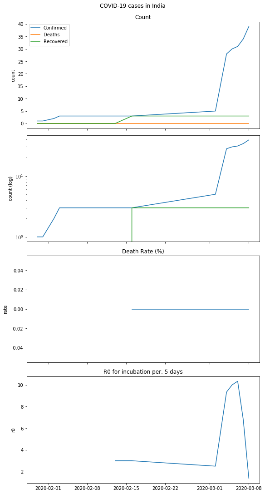


<p>Data extracted from <a href="https://github.com/CSSEGISandData/COVID-19">Johns Hopkins CSSE Data Repository</a></p>


<div>
<style scoped>
    .dataframe tbody tr th:only-of-type {
        vertical-align: middle;
    }

    .dataframe tbody tr th {
        vertical-align: top;
    }

    .dataframe thead th {
        text-align: right;
    }
</style>
<table border="1" class="dataframe">
  <thead>
    <tr style="text-align: right;">
      <th></th>
      <th>Last Update</th>
      <th>Country/Region</th>
      <th>Confirmed</th>
      <th>Deaths</th>
      <th>Recovered</th>
      <th>Death Rate (%)</th>
    </tr>
  </thead>
  <tbody>
    <tr>
      <td>127</td>
      <td>2020-01-30</td>
      <td>India</td>
      <td>1.0</td>
      <td>0.0</td>
      <td>0.0</td>
      <td>NaN</td>
    </tr>
    <tr>
      <td>149</td>
      <td>2020-01-31</td>
      <td>India</td>
      <td>1.0</td>
      <td>0.0</td>
      <td>0.0</td>
      <td>NaN</td>
    </tr>
    <tr>
      <td>186</td>
      <td>2020-02-02</td>
      <td>India</td>
      <td>2.0</td>
      <td>0.0</td>
      <td>0.0</td>
      <td>NaN</td>
    </tr>
    <tr>
      <td>194</td>
      <td>2020-02-03</td>
      <td>India</td>
      <td>3.0</td>
      <td>0.0</td>
      <td>0.0</td>
      <td>NaN</td>
    </tr>
    <tr>
      <td>298</td>
      <td>2020-02-13</td>
      <td>India</td>
      <td>3.0</td>
      <td>0.0</td>
      <td>0.0</td>
      <td>NaN</td>
    </tr>
    <tr>
      <td>325</td>
      <td>2020-02-16</td>
      <td>India</td>
      <td>3.0</td>
      <td>0.0</td>
      <td>3.0</td>
      <td>0.0</td>
    </tr>
    <tr>
      <td>640</td>
      <td>2020-03-02</td>
      <td>India</td>
      <td>5.0</td>
      <td>0.0</td>
      <td>3.0</td>
      <td>0.0</td>
    </tr>
    <tr>
      <td>739</td>
      <td>2020-03-04</td>
      <td>India</td>
      <td>28.0</td>
      <td>0.0</td>
      <td>3.0</td>
      <td>0.0</td>
    </tr>
    <tr>
      <td>789</td>
      <td>2020-03-05</td>
      <td>India</td>
      <td>30.0</td>
      <td>0.0</td>
      <td>3.0</td>
      <td>0.0</td>
    </tr>
    <tr>
      <td>843</td>
      <td>2020-03-06</td>
      <td>India</td>
      <td>31.0</td>
      <td>0.0</td>
      <td>3.0</td>
      <td>0.0</td>
    </tr>
    <tr>
      <td>904</td>
      <td>2020-03-07</td>
      <td>India</td>
      <td>34.0</td>
      <td>0.0</td>
      <td>3.0</td>
      <td>0.0</td>
    </tr>
    <tr>
      <td>960</td>
      <td>2020-03-08</td>
      <td>India</td>
      <td>39.0</td>
      <td>0.0</td>
      <td>3.0</td>
      <td>0.0</td>
    </tr>
  </tbody>
</table>
</div>


<p>r0 calculated as (Confirmed cases at day N + incubation period = 5 days)/(confirmed cases at day N)</p>


<p>Note that this is just a very rough value determined by "garage epidemiology" and should not be used as reference</p>


<div>
<style scoped>
    .dataframe tbody tr th:only-of-type {
        vertical-align: middle;
    }

    .dataframe tbody tr th {
        vertical-align: top;
    }

    .dataframe thead th {
        text-align: right;
    }
</style>
<table border="1" class="dataframe">
  <thead>
    <tr style="text-align: right;">
      <th></th>
      <th>r0</th>
    </tr>
    <tr>
      <th>Last Update</th>
      <th></th>
    </tr>
  </thead>
  <tbody>
    <tr>
      <td>2020-01-30</td>
      <td>NaN</td>
    </tr>
    <tr>
      <td>2020-01-31</td>
      <td>NaN</td>
    </tr>
    <tr>
      <td>2020-02-02</td>
      <td>NaN</td>
    </tr>
    <tr>
      <td>2020-02-03</td>
      <td>NaN</td>
    </tr>
    <tr>
      <td>2020-02-13</td>
      <td>3.000000</td>
    </tr>
    <tr>
      <td>2020-02-16</td>
      <td>3.000000</td>
    </tr>
    <tr>
      <td>2020-03-02</td>
      <td>2.500000</td>
    </tr>
    <tr>
      <td>2020-03-04</td>
      <td>9.333333</td>
    </tr>
    <tr>
      <td>2020-03-05</td>
      <td>10.000000</td>
    </tr>
    <tr>
      <td>2020-03-06</td>
      <td>10.333333</td>
    </tr>
    <tr>
      <td>2020-03-07</td>
      <td>6.800000</td>
    </tr>
    <tr>
      <td>2020-03-08</td>
      <td>1.392857</td>
    </tr>
  </tbody>
</table>
</div>


<h2><a name="indonesia" href="#indonesia">Indonesia</a></h2>


<p>Plot of COVID-19 cases.</p>


<p>Death rate calculated as (count of death)(count of death + count of recovered)</p>


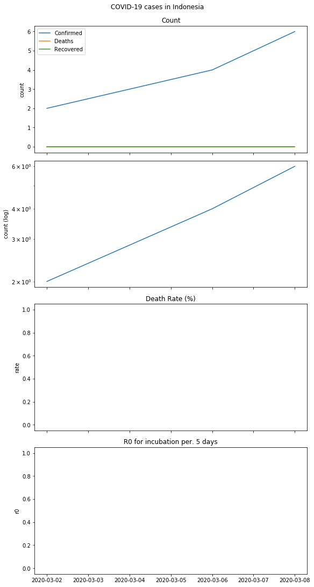


<p>Data extracted from <a href="https://github.com/CSSEGISandData/COVID-19">Johns Hopkins CSSE Data Repository</a></p>


<div>
<style scoped>
    .dataframe tbody tr th:only-of-type {
        vertical-align: middle;
    }

    .dataframe tbody tr th {
        vertical-align: top;
    }

    .dataframe thead th {
        text-align: right;
    }
</style>
<table border="1" class="dataframe">
  <thead>
    <tr style="text-align: right;">
      <th></th>
      <th>Last Update</th>
      <th>Country/Region</th>
      <th>Confirmed</th>
      <th>Deaths</th>
      <th>Recovered</th>
      <th>Death Rate (%)</th>
    </tr>
  </thead>
  <tbody>
    <tr>
      <td>641</td>
      <td>2020-03-02</td>
      <td>Indonesia</td>
      <td>2.0</td>
      <td>0.0</td>
      <td>0.0</td>
      <td>NaN</td>
    </tr>
    <tr>
      <td>844</td>
      <td>2020-03-06</td>
      <td>Indonesia</td>
      <td>4.0</td>
      <td>0.0</td>
      <td>0.0</td>
      <td>NaN</td>
    </tr>
    <tr>
      <td>961</td>
      <td>2020-03-08</td>
      <td>Indonesia</td>
      <td>6.0</td>
      <td>0.0</td>
      <td>0.0</td>
      <td>NaN</td>
    </tr>
  </tbody>
</table>
</div>


<p>r0 calculated as (Confirmed cases at day N + incubation period = 5 days)/(confirmed cases at day N)</p>


<p>Note that this is just a very rough value determined by "garage epidemiology" and should not be used as reference</p>


<div>
<style scoped>
    .dataframe tbody tr th:only-of-type {
        vertical-align: middle;
    }

    .dataframe tbody tr th {
        vertical-align: top;
    }

    .dataframe thead th {
        text-align: right;
    }
</style>
<table border="1" class="dataframe">
  <thead>
    <tr style="text-align: right;">
      <th></th>
      <th>r0</th>
    </tr>
    <tr>
      <th>Last Update</th>
      <th></th>
    </tr>
  </thead>
  <tbody>
    <tr>
      <td>2020-03-02</td>
      <td>NaN</td>
    </tr>
    <tr>
      <td>2020-03-06</td>
      <td>NaN</td>
    </tr>
    <tr>
      <td>2020-03-08</td>
      <td>NaN</td>
    </tr>
  </tbody>
</table>
</div>


<h2><a name="iran" href="#iran">Iran</a></h2>


<p>Plot of COVID-19 cases.</p>


<p>Death rate calculated as (count of death)(count of death + count of recovered)</p>


<p>Data extracted from <a href="https://github.com/CSSEGISandData/COVID-19">Johns Hopkins CSSE Data Repository</a></p>


<div>
<style scoped>
    .dataframe tbody tr th:only-of-type {
        vertical-align: middle;
    }

    .dataframe tbody tr th {
        vertical-align: top;
    }

    .dataframe thead th {
        text-align: right;
    }
</style>
<table border="1" class="dataframe">
  <thead>
    <tr style="text-align: right;">
      <th></th>
      <th>Last Update</th>
      <th>Country/Region</th>
      <th>Confirmed</th>
      <th>Deaths</th>
      <th>Recovered</th>
      <th>Death Rate (%)</th>
    </tr>
  </thead>
  <tbody>
    <tr>
      <td>356</td>
      <td>2020-02-19</td>
      <td>Iran</td>
      <td>2.0</td>
      <td>2.0</td>
      <td>0.0</td>
      <td>100.000000</td>
    </tr>
    <tr>
      <td>364</td>
      <td>2020-02-20</td>
      <td>Iran</td>
      <td>5.0</td>
      <td>2.0</td>
      <td>0.0</td>
      <td>100.000000</td>
    </tr>
    <tr>
      <td>376</td>
      <td>2020-02-21</td>
      <td>Iran</td>
      <td>18.0</td>
      <td>4.0</td>
      <td>0.0</td>
      <td>100.000000</td>
    </tr>
    <tr>
      <td>390</td>
      <td>2020-02-22</td>
      <td>Iran</td>
      <td>28.0</td>
      <td>5.0</td>
      <td>0.0</td>
      <td>100.000000</td>
    </tr>
    <tr>
      <td>400</td>
      <td>2020-02-23</td>
      <td>Iran</td>
      <td>43.0</td>
      <td>8.0</td>
      <td>0.0</td>
      <td>100.000000</td>
    </tr>
    <tr>
      <td>414</td>
      <td>2020-02-24</td>
      <td>Iran</td>
      <td>61.0</td>
      <td>12.0</td>
      <td>0.0</td>
      <td>100.000000</td>
    </tr>
    <tr>
      <td>434</td>
      <td>2020-02-25</td>
      <td>Iran</td>
      <td>95.0</td>
      <td>16.0</td>
      <td>0.0</td>
      <td>100.000000</td>
    </tr>
    <tr>
      <td>459</td>
      <td>2020-02-26</td>
      <td>Iran</td>
      <td>139.0</td>
      <td>19.0</td>
      <td>49.0</td>
      <td>27.941176</td>
    </tr>
    <tr>
      <td>490</td>
      <td>2020-02-27</td>
      <td>Iran</td>
      <td>245.0</td>
      <td>26.0</td>
      <td>49.0</td>
      <td>34.666667</td>
    </tr>
    <tr>
      <td>521</td>
      <td>2020-02-28</td>
      <td>Iran</td>
      <td>388.0</td>
      <td>34.0</td>
      <td>73.0</td>
      <td>31.775701</td>
    </tr>
    <tr>
      <td>555</td>
      <td>2020-02-29</td>
      <td>Iran</td>
      <td>593.0</td>
      <td>43.0</td>
      <td>123.0</td>
      <td>25.903614</td>
    </tr>
    <tr>
      <td>603</td>
      <td>2020-03-01</td>
      <td>Iran</td>
      <td>978.0</td>
      <td>54.0</td>
      <td>175.0</td>
      <td>23.580786</td>
    </tr>
    <tr>
      <td>642</td>
      <td>2020-03-02</td>
      <td>Iran</td>
      <td>1501.0</td>
      <td>66.0</td>
      <td>291.0</td>
      <td>18.487395</td>
    </tr>
    <tr>
      <td>684</td>
      <td>2020-03-03</td>
      <td>Iran</td>
      <td>2336.0</td>
      <td>77.0</td>
      <td>291.0</td>
      <td>20.923913</td>
    </tr>
    <tr>
      <td>740</td>
      <td>2020-03-04</td>
      <td>Iran</td>
      <td>2922.0</td>
      <td>92.0</td>
      <td>552.0</td>
      <td>14.285714</td>
    </tr>
    <tr>
      <td>790</td>
      <td>2020-03-05</td>
      <td>Iran</td>
      <td>3513.0</td>
      <td>107.0</td>
      <td>739.0</td>
      <td>12.647754</td>
    </tr>
    <tr>
      <td>845</td>
      <td>2020-03-06</td>
      <td>Iran</td>
      <td>4747.0</td>
      <td>124.0</td>
      <td>913.0</td>
      <td>11.957570</td>
    </tr>
    <tr>
      <td>905</td>
      <td>2020-03-07</td>
      <td>Iran</td>
      <td>5823.0</td>
      <td>145.0</td>
      <td>1669.0</td>
      <td>7.993385</td>
    </tr>
    <tr>
      <td>962</td>
      <td>2020-03-08</td>
      <td>Iran</td>
      <td>6566.0</td>
      <td>194.0</td>
      <td>2134.0</td>
      <td>8.333333</td>
    </tr>
  </tbody>
</table>
</div>


<p>r0 calculated as (Confirmed cases at day N + incubation period = 5 days)/(confirmed cases at day N)</p>


<p>Note that this is just a very rough value determined by "garage epidemiology" and should not be used as reference</p>


<div>
<style scoped>
    .dataframe tbody tr th:only-of-type {
        vertical-align: middle;
    }

    .dataframe tbody tr th {
        vertical-align: top;
    }

    .dataframe thead th {
        text-align: right;
    }
</style>
<table border="1" class="dataframe">
  <thead>
    <tr style="text-align: right;">
      <th></th>
      <th>r0</th>
    </tr>
    <tr>
      <th>Last Update</th>
      <th></th>
    </tr>
  </thead>
  <tbody>
    <tr>
      <td>2020-02-19</td>
      <td>NaN</td>
    </tr>
    <tr>
      <td>2020-02-20</td>
      <td>NaN</td>
    </tr>
    <tr>
      <td>2020-02-21</td>
      <td>NaN</td>
    </tr>
    <tr>
      <td>2020-02-22</td>
      <td>NaN</td>
    </tr>
    <tr>
      <td>2020-02-23</td>
      <td>21.500000</td>
    </tr>
    <tr>
      <td>2020-02-24</td>
      <td>12.200000</td>
    </tr>
    <tr>
      <td>2020-02-25</td>
      <td>5.277778</td>
    </tr>
    <tr>
      <td>2020-02-26</td>
      <td>4.964286</td>
    </tr>
    <tr>
      <td>2020-02-27</td>
      <td>5.697674</td>
    </tr>
    <tr>
      <td>2020-02-28</td>
      <td>6.360656</td>
    </tr>
    <tr>
      <td>2020-02-29</td>
      <td>6.242105</td>
    </tr>
    <tr>
      <td>2020-03-01</td>
      <td>7.035971</td>
    </tr>
    <tr>
      <td>2020-03-02</td>
      <td>6.126531</td>
    </tr>
    <tr>
      <td>2020-03-03</td>
      <td>6.020619</td>
    </tr>
    <tr>
      <td>2020-03-04</td>
      <td>4.927487</td>
    </tr>
    <tr>
      <td>2020-03-05</td>
      <td>3.592025</td>
    </tr>
    <tr>
      <td>2020-03-06</td>
      <td>3.162558</td>
    </tr>
    <tr>
      <td>2020-03-07</td>
      <td>2.492723</td>
    </tr>
    <tr>
      <td>2020-03-08</td>
      <td>2.247091</td>
    </tr>
  </tbody>
</table>
</div>


<h2><a name="iraq" href="#iraq">Iraq</a></h2>


<p>Plot of COVID-19 cases.</p>


<p>Death rate calculated as (count of death)(count of death + count of recovered)</p>


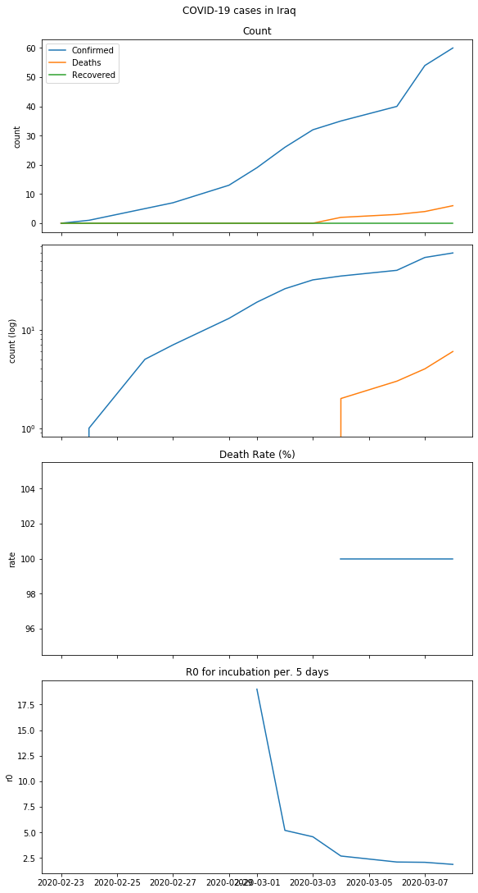


<p>Data extracted from <a href="https://github.com/CSSEGISandData/COVID-19">Johns Hopkins CSSE Data Repository</a></p>


<div>
<style scoped>
    .dataframe tbody tr th:only-of-type {
        vertical-align: middle;
    }

    .dataframe tbody tr th {
        vertical-align: top;
    }

    .dataframe thead th {
        text-align: right;
    }
</style>
<table border="1" class="dataframe">
  <thead>
    <tr style="text-align: right;">
      <th></th>
      <th>Last Update</th>
      <th>Country/Region</th>
      <th>Confirmed</th>
      <th>Deaths</th>
      <th>Recovered</th>
      <th>Death Rate (%)</th>
    </tr>
  </thead>
  <tbody>
    <tr>
      <td>401</td>
      <td>2020-02-23</td>
      <td>Iraq</td>
      <td>0.0</td>
      <td>0.0</td>
      <td>0.0</td>
      <td>NaN</td>
    </tr>
    <tr>
      <td>415</td>
      <td>2020-02-24</td>
      <td>Iraq</td>
      <td>1.0</td>
      <td>0.0</td>
      <td>0.0</td>
      <td>NaN</td>
    </tr>
    <tr>
      <td>460</td>
      <td>2020-02-26</td>
      <td>Iraq</td>
      <td>5.0</td>
      <td>0.0</td>
      <td>0.0</td>
      <td>NaN</td>
    </tr>
    <tr>
      <td>491</td>
      <td>2020-02-27</td>
      <td>Iraq</td>
      <td>7.0</td>
      <td>0.0</td>
      <td>0.0</td>
      <td>NaN</td>
    </tr>
    <tr>
      <td>556</td>
      <td>2020-02-29</td>
      <td>Iraq</td>
      <td>13.0</td>
      <td>0.0</td>
      <td>0.0</td>
      <td>NaN</td>
    </tr>
    <tr>
      <td>604</td>
      <td>2020-03-01</td>
      <td>Iraq</td>
      <td>19.0</td>
      <td>0.0</td>
      <td>0.0</td>
      <td>NaN</td>
    </tr>
    <tr>
      <td>643</td>
      <td>2020-03-02</td>
      <td>Iraq</td>
      <td>26.0</td>
      <td>0.0</td>
      <td>0.0</td>
      <td>NaN</td>
    </tr>
    <tr>
      <td>685</td>
      <td>2020-03-03</td>
      <td>Iraq</td>
      <td>32.0</td>
      <td>0.0</td>
      <td>0.0</td>
      <td>NaN</td>
    </tr>
    <tr>
      <td>741</td>
      <td>2020-03-04</td>
      <td>Iraq</td>
      <td>35.0</td>
      <td>2.0</td>
      <td>0.0</td>
      <td>100.0</td>
    </tr>
    <tr>
      <td>846</td>
      <td>2020-03-06</td>
      <td>Iraq</td>
      <td>40.0</td>
      <td>3.0</td>
      <td>0.0</td>
      <td>100.0</td>
    </tr>
    <tr>
      <td>906</td>
      <td>2020-03-07</td>
      <td>Iraq</td>
      <td>54.0</td>
      <td>4.0</td>
      <td>0.0</td>
      <td>100.0</td>
    </tr>
    <tr>
      <td>963</td>
      <td>2020-03-08</td>
      <td>Iraq</td>
      <td>60.0</td>
      <td>6.0</td>
      <td>0.0</td>
      <td>100.0</td>
    </tr>
  </tbody>
</table>
</div>


<p>r0 calculated as (Confirmed cases at day N + incubation period = 5 days)/(confirmed cases at day N)</p>


<p>Note that this is just a very rough value determined by "garage epidemiology" and should not be used as reference</p>


<div>
<style scoped>
    .dataframe tbody tr th:only-of-type {
        vertical-align: middle;
    }

    .dataframe tbody tr th {
        vertical-align: top;
    }

    .dataframe thead th {
        text-align: right;
    }
</style>
<table border="1" class="dataframe">
  <thead>
    <tr style="text-align: right;">
      <th></th>
      <th>r0</th>
    </tr>
    <tr>
      <th>Last Update</th>
      <th></th>
    </tr>
  </thead>
  <tbody>
    <tr>
      <td>2020-02-23</td>
      <td>NaN</td>
    </tr>
    <tr>
      <td>2020-02-24</td>
      <td>NaN</td>
    </tr>
    <tr>
      <td>2020-02-26</td>
      <td>NaN</td>
    </tr>
    <tr>
      <td>2020-02-27</td>
      <td>NaN</td>
    </tr>
    <tr>
      <td>2020-02-29</td>
      <td>inf</td>
    </tr>
    <tr>
      <td>2020-03-01</td>
      <td>19.000000</td>
    </tr>
    <tr>
      <td>2020-03-02</td>
      <td>5.200000</td>
    </tr>
    <tr>
      <td>2020-03-03</td>
      <td>4.571429</td>
    </tr>
    <tr>
      <td>2020-03-04</td>
      <td>2.692308</td>
    </tr>
    <tr>
      <td>2020-03-06</td>
      <td>2.105263</td>
    </tr>
    <tr>
      <td>2020-03-07</td>
      <td>2.076923</td>
    </tr>
    <tr>
      <td>2020-03-08</td>
      <td>1.875000</td>
    </tr>
  </tbody>
</table>
</div>


<h2><a name="ireland" href="#ireland">Ireland</a></h2>


<p>Plot of COVID-19 cases.</p>


<p>Death rate calculated as (count of death)(count of death + count of recovered)</p>


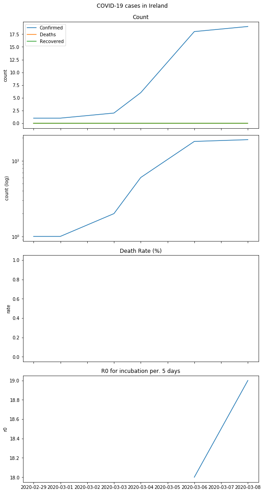


<p>Data extracted from <a href="https://github.com/CSSEGISandData/COVID-19">Johns Hopkins CSSE Data Repository</a></p>


<div>
<style scoped>
    .dataframe tbody tr th:only-of-type {
        vertical-align: middle;
    }

    .dataframe tbody tr th {
        vertical-align: top;
    }

    .dataframe thead th {
        text-align: right;
    }
</style>
<table border="1" class="dataframe">
  <thead>
    <tr style="text-align: right;">
      <th></th>
      <th>Last Update</th>
      <th>Country/Region</th>
      <th>Confirmed</th>
      <th>Deaths</th>
      <th>Recovered</th>
      <th>Death Rate (%)</th>
    </tr>
  </thead>
  <tbody>
    <tr>
      <td>557</td>
      <td>2020-02-29</td>
      <td>Ireland</td>
      <td>1.0</td>
      <td>0.0</td>
      <td>0.0</td>
      <td>NaN</td>
    </tr>
    <tr>
      <td>605</td>
      <td>2020-03-01</td>
      <td>Ireland</td>
      <td>1.0</td>
      <td>0.0</td>
      <td>0.0</td>
      <td>NaN</td>
    </tr>
    <tr>
      <td>686</td>
      <td>2020-03-03</td>
      <td>Ireland</td>
      <td>2.0</td>
      <td>0.0</td>
      <td>0.0</td>
      <td>NaN</td>
    </tr>
    <tr>
      <td>742</td>
      <td>2020-03-04</td>
      <td>Ireland</td>
      <td>6.0</td>
      <td>0.0</td>
      <td>0.0</td>
      <td>NaN</td>
    </tr>
    <tr>
      <td>847</td>
      <td>2020-03-06</td>
      <td>Ireland</td>
      <td>18.0</td>
      <td>0.0</td>
      <td>0.0</td>
      <td>NaN</td>
    </tr>
    <tr>
      <td>964</td>
      <td>2020-03-08</td>
      <td>Ireland</td>
      <td>19.0</td>
      <td>0.0</td>
      <td>0.0</td>
      <td>NaN</td>
    </tr>
  </tbody>
</table>
</div>


<p>r0 calculated as (Confirmed cases at day N + incubation period = 5 days)/(confirmed cases at day N)</p>


<p>Note that this is just a very rough value determined by "garage epidemiology" and should not be used as reference</p>


<div>
<style scoped>
    .dataframe tbody tr th:only-of-type {
        vertical-align: middle;
    }

    .dataframe tbody tr th {
        vertical-align: top;
    }

    .dataframe thead th {
        text-align: right;
    }
</style>
<table border="1" class="dataframe">
  <thead>
    <tr style="text-align: right;">
      <th></th>
      <th>r0</th>
    </tr>
    <tr>
      <th>Last Update</th>
      <th></th>
    </tr>
  </thead>
  <tbody>
    <tr>
      <td>2020-02-29</td>
      <td>NaN</td>
    </tr>
    <tr>
      <td>2020-03-01</td>
      <td>NaN</td>
    </tr>
    <tr>
      <td>2020-03-03</td>
      <td>NaN</td>
    </tr>
    <tr>
      <td>2020-03-04</td>
      <td>NaN</td>
    </tr>
    <tr>
      <td>2020-03-06</td>
      <td>18.0</td>
    </tr>
    <tr>
      <td>2020-03-08</td>
      <td>19.0</td>
    </tr>
  </tbody>
</table>
</div>


<h2><a name="israel" href="#israel">Israel</a></h2>


<p>Plot of COVID-19 cases.</p>


<p>Death rate calculated as (count of death)(count of death + count of recovered)</p>


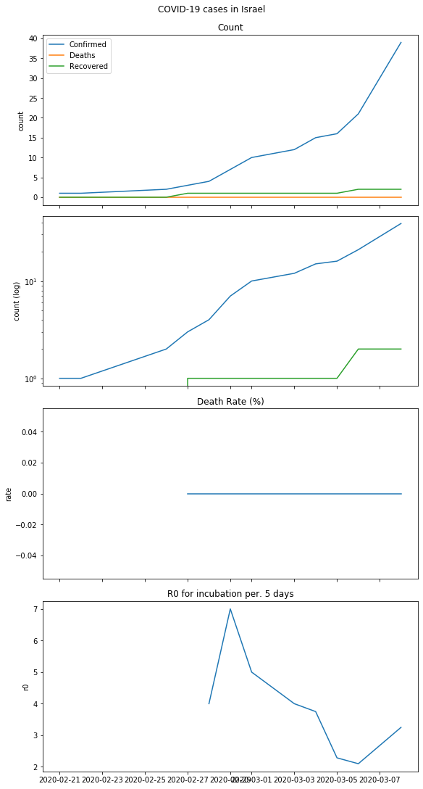


<p>Data extracted from <a href="https://github.com/CSSEGISandData/COVID-19">Johns Hopkins CSSE Data Repository</a></p>


<div>
<style scoped>
    .dataframe tbody tr th:only-of-type {
        vertical-align: middle;
    }

    .dataframe tbody tr th {
        vertical-align: top;
    }

    .dataframe thead th {
        text-align: right;
    }
</style>
<table border="1" class="dataframe">
  <thead>
    <tr style="text-align: right;">
      <th></th>
      <th>Last Update</th>
      <th>Country/Region</th>
      <th>Confirmed</th>
      <th>Deaths</th>
      <th>Recovered</th>
      <th>Death Rate (%)</th>
    </tr>
  </thead>
  <tbody>
    <tr>
      <td>377</td>
      <td>2020-02-21</td>
      <td>Israel</td>
      <td>1.0</td>
      <td>0.0</td>
      <td>0.0</td>
      <td>NaN</td>
    </tr>
    <tr>
      <td>391</td>
      <td>2020-02-22</td>
      <td>Israel</td>
      <td>1.0</td>
      <td>0.0</td>
      <td>0.0</td>
      <td>NaN</td>
    </tr>
    <tr>
      <td>461</td>
      <td>2020-02-26</td>
      <td>Israel</td>
      <td>2.0</td>
      <td>0.0</td>
      <td>0.0</td>
      <td>NaN</td>
    </tr>
    <tr>
      <td>492</td>
      <td>2020-02-27</td>
      <td>Israel</td>
      <td>3.0</td>
      <td>0.0</td>
      <td>1.0</td>
      <td>0.0</td>
    </tr>
    <tr>
      <td>522</td>
      <td>2020-02-28</td>
      <td>Israel</td>
      <td>4.0</td>
      <td>0.0</td>
      <td>1.0</td>
      <td>0.0</td>
    </tr>
    <tr>
      <td>558</td>
      <td>2020-02-29</td>
      <td>Israel</td>
      <td>7.0</td>
      <td>0.0</td>
      <td>1.0</td>
      <td>0.0</td>
    </tr>
    <tr>
      <td>606</td>
      <td>2020-03-01</td>
      <td>Israel</td>
      <td>10.0</td>
      <td>0.0</td>
      <td>1.0</td>
      <td>0.0</td>
    </tr>
    <tr>
      <td>687</td>
      <td>2020-03-03</td>
      <td>Israel</td>
      <td>12.0</td>
      <td>0.0</td>
      <td>1.0</td>
      <td>0.0</td>
    </tr>
    <tr>
      <td>743</td>
      <td>2020-03-04</td>
      <td>Israel</td>
      <td>15.0</td>
      <td>0.0</td>
      <td>1.0</td>
      <td>0.0</td>
    </tr>
    <tr>
      <td>791</td>
      <td>2020-03-05</td>
      <td>Israel</td>
      <td>16.0</td>
      <td>0.0</td>
      <td>1.0</td>
      <td>0.0</td>
    </tr>
    <tr>
      <td>848</td>
      <td>2020-03-06</td>
      <td>Israel</td>
      <td>21.0</td>
      <td>0.0</td>
      <td>2.0</td>
      <td>0.0</td>
    </tr>
    <tr>
      <td>965</td>
      <td>2020-03-08</td>
      <td>Israel</td>
      <td>39.0</td>
      <td>0.0</td>
      <td>2.0</td>
      <td>0.0</td>
    </tr>
  </tbody>
</table>
</div>


<p>r0 calculated as (Confirmed cases at day N + incubation period = 5 days)/(confirmed cases at day N)</p>


<p>Note that this is just a very rough value determined by "garage epidemiology" and should not be used as reference</p>


<div>
<style scoped>
    .dataframe tbody tr th:only-of-type {
        vertical-align: middle;
    }

    .dataframe tbody tr th {
        vertical-align: top;
    }

    .dataframe thead th {
        text-align: right;
    }
</style>
<table border="1" class="dataframe">
  <thead>
    <tr style="text-align: right;">
      <th></th>
      <th>r0</th>
    </tr>
    <tr>
      <th>Last Update</th>
      <th></th>
    </tr>
  </thead>
  <tbody>
    <tr>
      <td>2020-02-21</td>
      <td>NaN</td>
    </tr>
    <tr>
      <td>2020-02-22</td>
      <td>NaN</td>
    </tr>
    <tr>
      <td>2020-02-26</td>
      <td>NaN</td>
    </tr>
    <tr>
      <td>2020-02-27</td>
      <td>NaN</td>
    </tr>
    <tr>
      <td>2020-02-28</td>
      <td>4.000000</td>
    </tr>
    <tr>
      <td>2020-02-29</td>
      <td>7.000000</td>
    </tr>
    <tr>
      <td>2020-03-01</td>
      <td>5.000000</td>
    </tr>
    <tr>
      <td>2020-03-03</td>
      <td>4.000000</td>
    </tr>
    <tr>
      <td>2020-03-04</td>
      <td>3.750000</td>
    </tr>
    <tr>
      <td>2020-03-05</td>
      <td>2.285714</td>
    </tr>
    <tr>
      <td>2020-03-06</td>
      <td>2.100000</td>
    </tr>
    <tr>
      <td>2020-03-08</td>
      <td>3.250000</td>
    </tr>
  </tbody>
</table>
</div>


<h2><a name="italy" href="#italy">Italy</a></h2>


<p>Plot of COVID-19 cases.</p>


<p>Death rate calculated as (count of death)(count of death + count of recovered)</p>


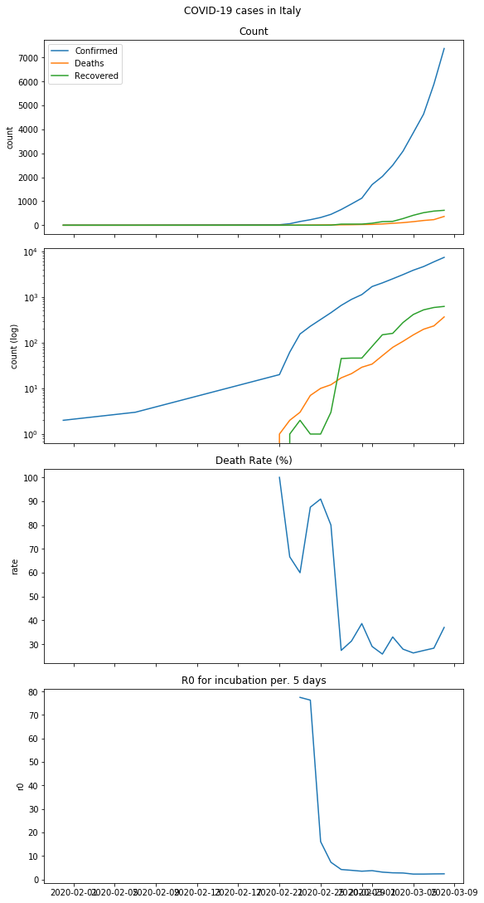


<p>Data extracted from <a href="https://github.com/CSSEGISandData/COVID-19">Johns Hopkins CSSE Data Repository</a></p>


<div>
<style scoped>
    .dataframe tbody tr th:only-of-type {
        vertical-align: middle;
    }

    .dataframe tbody tr th {
        vertical-align: top;
    }

    .dataframe thead th {
        text-align: right;
    }
</style>
<table border="1" class="dataframe">
  <thead>
    <tr style="text-align: right;">
      <th></th>
      <th>Last Update</th>
      <th>Country/Region</th>
      <th>Confirmed</th>
      <th>Deaths</th>
      <th>Recovered</th>
      <th>Death Rate (%)</th>
    </tr>
  </thead>
  <tbody>
    <tr>
      <td>150</td>
      <td>2020-01-31</td>
      <td>Italy</td>
      <td>2.0</td>
      <td>0.0</td>
      <td>0.0</td>
      <td>NaN</td>
    </tr>
    <tr>
      <td>229</td>
      <td>2020-02-07</td>
      <td>Italy</td>
      <td>3.0</td>
      <td>0.0</td>
      <td>0.0</td>
      <td>NaN</td>
    </tr>
    <tr>
      <td>378</td>
      <td>2020-02-21</td>
      <td>Italy</td>
      <td>20.0</td>
      <td>1.0</td>
      <td>0.0</td>
      <td>100.000000</td>
    </tr>
    <tr>
      <td>392</td>
      <td>2020-02-22</td>
      <td>Italy</td>
      <td>62.0</td>
      <td>2.0</td>
      <td>1.0</td>
      <td>66.666667</td>
    </tr>
    <tr>
      <td>402</td>
      <td>2020-02-23</td>
      <td>Italy</td>
      <td>155.0</td>
      <td>3.0</td>
      <td>2.0</td>
      <td>60.000000</td>
    </tr>
    <tr>
      <td>416</td>
      <td>2020-02-24</td>
      <td>Italy</td>
      <td>229.0</td>
      <td>7.0</td>
      <td>1.0</td>
      <td>87.500000</td>
    </tr>
    <tr>
      <td>435</td>
      <td>2020-02-25</td>
      <td>Italy</td>
      <td>322.0</td>
      <td>10.0</td>
      <td>1.0</td>
      <td>90.909091</td>
    </tr>
    <tr>
      <td>462</td>
      <td>2020-02-26</td>
      <td>Italy</td>
      <td>453.0</td>
      <td>12.0</td>
      <td>3.0</td>
      <td>80.000000</td>
    </tr>
    <tr>
      <td>493</td>
      <td>2020-02-27</td>
      <td>Italy</td>
      <td>655.0</td>
      <td>17.0</td>
      <td>45.0</td>
      <td>27.419355</td>
    </tr>
    <tr>
      <td>523</td>
      <td>2020-02-28</td>
      <td>Italy</td>
      <td>888.0</td>
      <td>21.0</td>
      <td>46.0</td>
      <td>31.343284</td>
    </tr>
    <tr>
      <td>559</td>
      <td>2020-02-29</td>
      <td>Italy</td>
      <td>1128.0</td>
      <td>29.0</td>
      <td>46.0</td>
      <td>38.666667</td>
    </tr>
    <tr>
      <td>607</td>
      <td>2020-03-01</td>
      <td>Italy</td>
      <td>1694.0</td>
      <td>34.0</td>
      <td>83.0</td>
      <td>29.059829</td>
    </tr>
    <tr>
      <td>644</td>
      <td>2020-03-02</td>
      <td>Italy</td>
      <td>2036.0</td>
      <td>52.0</td>
      <td>149.0</td>
      <td>25.870647</td>
    </tr>
    <tr>
      <td>688</td>
      <td>2020-03-03</td>
      <td>Italy</td>
      <td>2502.0</td>
      <td>79.0</td>
      <td>160.0</td>
      <td>33.054393</td>
    </tr>
    <tr>
      <td>744</td>
      <td>2020-03-04</td>
      <td>Italy</td>
      <td>3089.0</td>
      <td>107.0</td>
      <td>276.0</td>
      <td>27.937337</td>
    </tr>
    <tr>
      <td>792</td>
      <td>2020-03-05</td>
      <td>Italy</td>
      <td>3858.0</td>
      <td>148.0</td>
      <td>414.0</td>
      <td>26.334520</td>
    </tr>
    <tr>
      <td>849</td>
      <td>2020-03-06</td>
      <td>Italy</td>
      <td>4636.0</td>
      <td>197.0</td>
      <td>523.0</td>
      <td>27.361111</td>
    </tr>
    <tr>
      <td>907</td>
      <td>2020-03-07</td>
      <td>Italy</td>
      <td>5883.0</td>
      <td>233.0</td>
      <td>589.0</td>
      <td>28.345499</td>
    </tr>
    <tr>
      <td>966</td>
      <td>2020-03-08</td>
      <td>Italy</td>
      <td>7375.0</td>
      <td>366.0</td>
      <td>622.0</td>
      <td>37.044534</td>
    </tr>
  </tbody>
</table>
</div>


<p>r0 calculated as (Confirmed cases at day N + incubation period = 5 days)/(confirmed cases at day N)</p>


<p>Note that this is just a very rough value determined by "garage epidemiology" and should not be used as reference</p>


<div>
<style scoped>
    .dataframe tbody tr th:only-of-type {
        vertical-align: middle;
    }

    .dataframe tbody tr th {
        vertical-align: top;
    }

    .dataframe thead th {
        text-align: right;
    }
</style>
<table border="1" class="dataframe">
  <thead>
    <tr style="text-align: right;">
      <th></th>
      <th>r0</th>
    </tr>
    <tr>
      <th>Last Update</th>
      <th></th>
    </tr>
  </thead>
  <tbody>
    <tr>
      <td>2020-01-31</td>
      <td>NaN</td>
    </tr>
    <tr>
      <td>2020-02-07</td>
      <td>NaN</td>
    </tr>
    <tr>
      <td>2020-02-21</td>
      <td>NaN</td>
    </tr>
    <tr>
      <td>2020-02-22</td>
      <td>NaN</td>
    </tr>
    <tr>
      <td>2020-02-23</td>
      <td>77.500000</td>
    </tr>
    <tr>
      <td>2020-02-24</td>
      <td>76.333333</td>
    </tr>
    <tr>
      <td>2020-02-25</td>
      <td>16.100000</td>
    </tr>
    <tr>
      <td>2020-02-26</td>
      <td>7.306452</td>
    </tr>
    <tr>
      <td>2020-02-27</td>
      <td>4.225806</td>
    </tr>
    <tr>
      <td>2020-02-28</td>
      <td>3.877729</td>
    </tr>
    <tr>
      <td>2020-02-29</td>
      <td>3.503106</td>
    </tr>
    <tr>
      <td>2020-03-01</td>
      <td>3.739514</td>
    </tr>
    <tr>
      <td>2020-03-02</td>
      <td>3.108397</td>
    </tr>
    <tr>
      <td>2020-03-03</td>
      <td>2.817568</td>
    </tr>
    <tr>
      <td>2020-03-04</td>
      <td>2.738475</td>
    </tr>
    <tr>
      <td>2020-03-05</td>
      <td>2.277450</td>
    </tr>
    <tr>
      <td>2020-03-06</td>
      <td>2.277014</td>
    </tr>
    <tr>
      <td>2020-03-07</td>
      <td>2.351319</td>
    </tr>
    <tr>
      <td>2020-03-08</td>
      <td>2.387504</td>
    </tr>
  </tbody>
</table>
</div>


<h2><a name="ivory_coast" href="#ivory_coast">Ivory Coast</a></h2>


<p>Plot of COVID-19 cases.</p>


<p>Death rate calculated as (count of death)(count of death + count of recovered)</p>


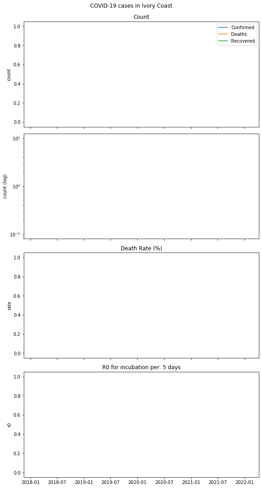


<p>Data extracted from <a href="https://github.com/CSSEGISandData/COVID-19">Johns Hopkins CSSE Data Repository</a></p>


<div>
<style scoped>
    .dataframe tbody tr th:only-of-type {
        vertical-align: middle;
    }

    .dataframe tbody tr th {
        vertical-align: top;
    }

    .dataframe thead th {
        text-align: right;
    }
</style>
<table border="1" class="dataframe">
  <thead>
    <tr style="text-align: right;">
      <th></th>
      <th>Last Update</th>
      <th>Country/Region</th>
      <th>Confirmed</th>
      <th>Deaths</th>
      <th>Recovered</th>
      <th>Death Rate (%)</th>
    </tr>
  </thead>
  <tbody>
    <tr>
      <td>69</td>
      <td>2020-01-27</td>
      <td>Ivory Coast</td>
      <td>1.0</td>
      <td>0.0</td>
      <td>0.0</td>
      <td>NaN</td>
    </tr>
  </tbody>
</table>
</div>


<p>r0 calculated as (Confirmed cases at day N + incubation period = 5 days)/(confirmed cases at day N)</p>


<p>Note that this is just a very rough value determined by "garage epidemiology" and should not be used as reference</p>


<div>
<style scoped>
    .dataframe tbody tr th:only-of-type {
        vertical-align: middle;
    }

    .dataframe tbody tr th {
        vertical-align: top;
    }

    .dataframe thead th {
        text-align: right;
    }
</style>
<table border="1" class="dataframe">
  <thead>
    <tr style="text-align: right;">
      <th></th>
      <th>r0</th>
    </tr>
    <tr>
      <th>Last Update</th>
      <th></th>
    </tr>
  </thead>
  <tbody>
    <tr>
      <td>2020-01-27</td>
      <td>NaN</td>
    </tr>
  </tbody>
</table>
</div>


<h2><a name="japan" href="#japan">Japan</a></h2>


<p>Plot of COVID-19 cases.</p>


<p>Death rate calculated as (count of death)(count of death + count of recovered)</p>


<p>Data extracted from <a href="https://github.com/CSSEGISandData/COVID-19">Johns Hopkins CSSE Data Repository</a></p>


<div>
<style scoped>
    .dataframe tbody tr th:only-of-type {
        vertical-align: middle;
    }

    .dataframe tbody tr th {
        vertical-align: top;
    }

    .dataframe thead th {
        text-align: right;
    }
</style>
<table border="1" class="dataframe">
  <thead>
    <tr style="text-align: right;">
      <th></th>
      <th>Last Update</th>
      <th>Country/Region</th>
      <th>Confirmed</th>
      <th>Deaths</th>
      <th>Recovered</th>
      <th>Death Rate (%)</th>
    </tr>
  </thead>
  <tbody>
    <tr>
      <td>1</td>
      <td>2020-01-22</td>
      <td>Japan</td>
      <td>2.0</td>
      <td>0.0</td>
      <td>0.0</td>
      <td>NaN</td>
    </tr>
    <tr>
      <td>12</td>
      <td>2020-01-23</td>
      <td>Japan</td>
      <td>1.0</td>
      <td>0.0</td>
      <td>0.0</td>
      <td>NaN</td>
    </tr>
    <tr>
      <td>26</td>
      <td>2020-01-24</td>
      <td>Japan</td>
      <td>2.0</td>
      <td>0.0</td>
      <td>0.0</td>
      <td>NaN</td>
    </tr>
    <tr>
      <td>38</td>
      <td>2020-01-25</td>
      <td>Japan</td>
      <td>2.0</td>
      <td>0.0</td>
      <td>0.0</td>
      <td>NaN</td>
    </tr>
    <tr>
      <td>53</td>
      <td>2020-01-26</td>
      <td>Japan</td>
      <td>4.0</td>
      <td>0.0</td>
      <td>1.0</td>
      <td>0.000000</td>
    </tr>
    <tr>
      <td>70</td>
      <td>2020-01-27</td>
      <td>Japan</td>
      <td>4.0</td>
      <td>0.0</td>
      <td>1.0</td>
      <td>0.000000</td>
    </tr>
    <tr>
      <td>88</td>
      <td>2020-01-28</td>
      <td>Japan</td>
      <td>7.0</td>
      <td>0.0</td>
      <td>1.0</td>
      <td>0.000000</td>
    </tr>
    <tr>
      <td>107</td>
      <td>2020-01-29</td>
      <td>Japan</td>
      <td>7.0</td>
      <td>0.0</td>
      <td>1.0</td>
      <td>0.000000</td>
    </tr>
    <tr>
      <td>128</td>
      <td>2020-01-30</td>
      <td>Japan</td>
      <td>11.0</td>
      <td>0.0</td>
      <td>1.0</td>
      <td>0.000000</td>
    </tr>
    <tr>
      <td>151</td>
      <td>2020-01-31</td>
      <td>Japan</td>
      <td>15.0</td>
      <td>0.0</td>
      <td>1.0</td>
      <td>0.000000</td>
    </tr>
    <tr>
      <td>173</td>
      <td>2020-02-01</td>
      <td>Japan</td>
      <td>20.0</td>
      <td>0.0</td>
      <td>1.0</td>
      <td>0.000000</td>
    </tr>
    <tr>
      <td>202</td>
      <td>2020-02-04</td>
      <td>Japan</td>
      <td>22.0</td>
      <td>0.0</td>
      <td>1.0</td>
      <td>0.000000</td>
    </tr>
    <tr>
      <td>219</td>
      <td>2020-02-06</td>
      <td>Japan</td>
      <td>45.0</td>
      <td>0.0</td>
      <td>1.0</td>
      <td>0.000000</td>
    </tr>
    <tr>
      <td>230</td>
      <td>2020-02-07</td>
      <td>Japan</td>
      <td>25.0</td>
      <td>0.0</td>
      <td>1.0</td>
      <td>0.000000</td>
    </tr>
    <tr>
      <td>251</td>
      <td>2020-02-09</td>
      <td>Japan</td>
      <td>26.0</td>
      <td>0.0</td>
      <td>1.0</td>
      <td>0.000000</td>
    </tr>
    <tr>
      <td>260</td>
      <td>2020-02-10</td>
      <td>Japan</td>
      <td>26.0</td>
      <td>0.0</td>
      <td>4.0</td>
      <td>0.000000</td>
    </tr>
    <tr>
      <td>271</td>
      <td>2020-02-11</td>
      <td>Japan</td>
      <td>26.0</td>
      <td>0.0</td>
      <td>9.0</td>
      <td>0.000000</td>
    </tr>
    <tr>
      <td>284</td>
      <td>2020-02-12</td>
      <td>Japan</td>
      <td>28.0</td>
      <td>0.0</td>
      <td>9.0</td>
      <td>0.000000</td>
    </tr>
    <tr>
      <td>299</td>
      <td>2020-02-13</td>
      <td>Japan</td>
      <td>28.0</td>
      <td>1.0</td>
      <td>9.0</td>
      <td>10.000000</td>
    </tr>
    <tr>
      <td>309</td>
      <td>2020-02-14</td>
      <td>Japan</td>
      <td>29.0</td>
      <td>1.0</td>
      <td>9.0</td>
      <td>10.000000</td>
    </tr>
    <tr>
      <td>315</td>
      <td>2020-02-15</td>
      <td>Japan</td>
      <td>43.0</td>
      <td>1.0</td>
      <td>12.0</td>
      <td>7.692308</td>
    </tr>
    <tr>
      <td>326</td>
      <td>2020-02-16</td>
      <td>Japan</td>
      <td>59.0</td>
      <td>1.0</td>
      <td>12.0</td>
      <td>7.692308</td>
    </tr>
    <tr>
      <td>340</td>
      <td>2020-02-17</td>
      <td>Japan</td>
      <td>66.0</td>
      <td>1.0</td>
      <td>12.0</td>
      <td>7.692308</td>
    </tr>
    <tr>
      <td>349</td>
      <td>2020-02-18</td>
      <td>Japan</td>
      <td>74.0</td>
      <td>1.0</td>
      <td>13.0</td>
      <td>7.142857</td>
    </tr>
    <tr>
      <td>357</td>
      <td>2020-02-19</td>
      <td>Japan</td>
      <td>84.0</td>
      <td>1.0</td>
      <td>18.0</td>
      <td>5.263158</td>
    </tr>
    <tr>
      <td>365</td>
      <td>2020-02-20</td>
      <td>Japan</td>
      <td>94.0</td>
      <td>1.0</td>
      <td>18.0</td>
      <td>5.263158</td>
    </tr>
    <tr>
      <td>379</td>
      <td>2020-02-21</td>
      <td>Japan</td>
      <td>105.0</td>
      <td>1.0</td>
      <td>22.0</td>
      <td>4.347826</td>
    </tr>
    <tr>
      <td>393</td>
      <td>2020-02-22</td>
      <td>Japan</td>
      <td>122.0</td>
      <td>1.0</td>
      <td>22.0</td>
      <td>4.347826</td>
    </tr>
    <tr>
      <td>403</td>
      <td>2020-02-23</td>
      <td>Japan</td>
      <td>147.0</td>
      <td>1.0</td>
      <td>22.0</td>
      <td>4.347826</td>
    </tr>
    <tr>
      <td>417</td>
      <td>2020-02-24</td>
      <td>Japan</td>
      <td>159.0</td>
      <td>1.0</td>
      <td>22.0</td>
      <td>4.347826</td>
    </tr>
    <tr>
      <td>436</td>
      <td>2020-02-25</td>
      <td>Japan</td>
      <td>170.0</td>
      <td>1.0</td>
      <td>22.0</td>
      <td>4.347826</td>
    </tr>
    <tr>
      <td>463</td>
      <td>2020-02-26</td>
      <td>Japan</td>
      <td>189.0</td>
      <td>2.0</td>
      <td>22.0</td>
      <td>8.333333</td>
    </tr>
    <tr>
      <td>494</td>
      <td>2020-02-27</td>
      <td>Japan</td>
      <td>214.0</td>
      <td>4.0</td>
      <td>22.0</td>
      <td>15.384615</td>
    </tr>
    <tr>
      <td>524</td>
      <td>2020-02-28</td>
      <td>Japan</td>
      <td>228.0</td>
      <td>4.0</td>
      <td>22.0</td>
      <td>15.384615</td>
    </tr>
    <tr>
      <td>560</td>
      <td>2020-02-29</td>
      <td>Japan</td>
      <td>241.0</td>
      <td>5.0</td>
      <td>32.0</td>
      <td>13.513514</td>
    </tr>
    <tr>
      <td>608</td>
      <td>2020-03-01</td>
      <td>Japan</td>
      <td>256.0</td>
      <td>6.0</td>
      <td>32.0</td>
      <td>15.789474</td>
    </tr>
    <tr>
      <td>645</td>
      <td>2020-03-02</td>
      <td>Japan</td>
      <td>274.0</td>
      <td>6.0</td>
      <td>32.0</td>
      <td>15.789474</td>
    </tr>
    <tr>
      <td>689</td>
      <td>2020-03-03</td>
      <td>Japan</td>
      <td>293.0</td>
      <td>6.0</td>
      <td>43.0</td>
      <td>12.244898</td>
    </tr>
    <tr>
      <td>745</td>
      <td>2020-03-04</td>
      <td>Japan</td>
      <td>331.0</td>
      <td>6.0</td>
      <td>43.0</td>
      <td>12.244898</td>
    </tr>
    <tr>
      <td>793</td>
      <td>2020-03-05</td>
      <td>Japan</td>
      <td>360.0</td>
      <td>6.0</td>
      <td>43.0</td>
      <td>12.244898</td>
    </tr>
    <tr>
      <td>850</td>
      <td>2020-03-06</td>
      <td>Japan</td>
      <td>420.0</td>
      <td>6.0</td>
      <td>46.0</td>
      <td>11.538462</td>
    </tr>
    <tr>
      <td>908</td>
      <td>2020-03-07</td>
      <td>Japan</td>
      <td>461.0</td>
      <td>6.0</td>
      <td>76.0</td>
      <td>7.317073</td>
    </tr>
    <tr>
      <td>967</td>
      <td>2020-03-08</td>
      <td>Japan</td>
      <td>502.0</td>
      <td>6.0</td>
      <td>76.0</td>
      <td>7.317073</td>
    </tr>
  </tbody>
</table>
</div>


<p>r0 calculated as (Confirmed cases at day N + incubation period = 5 days)/(confirmed cases at day N)</p>


<p>Note that this is just a very rough value determined by "garage epidemiology" and should not be used as reference</p>


<div>
<style scoped>
    .dataframe tbody tr th:only-of-type {
        vertical-align: middle;
    }

    .dataframe tbody tr th {
        vertical-align: top;
    }

    .dataframe thead th {
        text-align: right;
    }
</style>
<table border="1" class="dataframe">
  <thead>
    <tr style="text-align: right;">
      <th></th>
      <th>r0</th>
    </tr>
    <tr>
      <th>Last Update</th>
      <th></th>
    </tr>
  </thead>
  <tbody>
    <tr>
      <td>2020-01-22</td>
      <td>NaN</td>
    </tr>
    <tr>
      <td>2020-01-23</td>
      <td>NaN</td>
    </tr>
    <tr>
      <td>2020-01-24</td>
      <td>NaN</td>
    </tr>
    <tr>
      <td>2020-01-25</td>
      <td>NaN</td>
    </tr>
    <tr>
      <td>2020-01-26</td>
      <td>2.000000</td>
    </tr>
    <tr>
      <td>2020-01-27</td>
      <td>4.000000</td>
    </tr>
    <tr>
      <td>2020-01-28</td>
      <td>3.500000</td>
    </tr>
    <tr>
      <td>2020-01-29</td>
      <td>3.500000</td>
    </tr>
    <tr>
      <td>2020-01-30</td>
      <td>2.750000</td>
    </tr>
    <tr>
      <td>2020-01-31</td>
      <td>3.750000</td>
    </tr>
    <tr>
      <td>2020-02-01</td>
      <td>2.857143</td>
    </tr>
    <tr>
      <td>2020-02-04</td>
      <td>3.142857</td>
    </tr>
    <tr>
      <td>2020-02-06</td>
      <td>4.090909</td>
    </tr>
    <tr>
      <td>2020-02-07</td>
      <td>1.666667</td>
    </tr>
    <tr>
      <td>2020-02-09</td>
      <td>1.300000</td>
    </tr>
    <tr>
      <td>2020-02-10</td>
      <td>1.181818</td>
    </tr>
    <tr>
      <td>2020-02-11</td>
      <td>0.577778</td>
    </tr>
    <tr>
      <td>2020-02-12</td>
      <td>1.120000</td>
    </tr>
    <tr>
      <td>2020-02-13</td>
      <td>1.076923</td>
    </tr>
    <tr>
      <td>2020-02-14</td>
      <td>1.115385</td>
    </tr>
    <tr>
      <td>2020-02-15</td>
      <td>1.653846</td>
    </tr>
    <tr>
      <td>2020-02-16</td>
      <td>2.107143</td>
    </tr>
    <tr>
      <td>2020-02-17</td>
      <td>2.357143</td>
    </tr>
    <tr>
      <td>2020-02-18</td>
      <td>2.551724</td>
    </tr>
    <tr>
      <td>2020-02-19</td>
      <td>1.953488</td>
    </tr>
    <tr>
      <td>2020-02-20</td>
      <td>1.593220</td>
    </tr>
    <tr>
      <td>2020-02-21</td>
      <td>1.590909</td>
    </tr>
    <tr>
      <td>2020-02-22</td>
      <td>1.648649</td>
    </tr>
    <tr>
      <td>2020-02-23</td>
      <td>1.750000</td>
    </tr>
    <tr>
      <td>2020-02-24</td>
      <td>1.691489</td>
    </tr>
    <tr>
      <td>2020-02-25</td>
      <td>1.619048</td>
    </tr>
    <tr>
      <td>2020-02-26</td>
      <td>1.549180</td>
    </tr>
    <tr>
      <td>2020-02-27</td>
      <td>1.455782</td>
    </tr>
    <tr>
      <td>2020-02-28</td>
      <td>1.433962</td>
    </tr>
    <tr>
      <td>2020-02-29</td>
      <td>1.417647</td>
    </tr>
    <tr>
      <td>2020-03-01</td>
      <td>1.354497</td>
    </tr>
    <tr>
      <td>2020-03-02</td>
      <td>1.280374</td>
    </tr>
    <tr>
      <td>2020-03-03</td>
      <td>1.285088</td>
    </tr>
    <tr>
      <td>2020-03-04</td>
      <td>1.373444</td>
    </tr>
    <tr>
      <td>2020-03-05</td>
      <td>1.406250</td>
    </tr>
    <tr>
      <td>2020-03-06</td>
      <td>1.532847</td>
    </tr>
    <tr>
      <td>2020-03-07</td>
      <td>1.573379</td>
    </tr>
    <tr>
      <td>2020-03-08</td>
      <td>1.516616</td>
    </tr>
  </tbody>
</table>
</div>


<h2><a name="jordan" href="#jordan">Jordan</a></h2>


<p>Plot of COVID-19 cases.</p>


<p>Death rate calculated as (count of death)(count of death + count of recovered)</p>


<p>Data extracted from <a href="https://github.com/CSSEGISandData/COVID-19">Johns Hopkins CSSE Data Repository</a></p>


<div>
<style scoped>
    .dataframe tbody tr th:only-of-type {
        vertical-align: middle;
    }

    .dataframe tbody tr th {
        vertical-align: top;
    }

    .dataframe thead th {
        text-align: right;
    }
</style>
<table border="1" class="dataframe">
  <thead>
    <tr style="text-align: right;">
      <th></th>
      <th>Last Update</th>
      <th>Country/Region</th>
      <th>Confirmed</th>
      <th>Deaths</th>
      <th>Recovered</th>
      <th>Death Rate (%)</th>
    </tr>
  </thead>
  <tbody>
    <tr>
      <td>690</td>
      <td>2020-03-03</td>
      <td>Jordan</td>
      <td>1.0</td>
      <td>0.0</td>
      <td>0.0</td>
      <td>NaN</td>
    </tr>
  </tbody>
</table>
</div>


<p>r0 calculated as (Confirmed cases at day N + incubation period = 5 days)/(confirmed cases at day N)</p>


<p>Note that this is just a very rough value determined by "garage epidemiology" and should not be used as reference</p>


<div>
<style scoped>
    .dataframe tbody tr th:only-of-type {
        vertical-align: middle;
    }

    .dataframe tbody tr th {
        vertical-align: top;
    }

    .dataframe thead th {
        text-align: right;
    }
</style>
<table border="1" class="dataframe">
  <thead>
    <tr style="text-align: right;">
      <th></th>
      <th>r0</th>
    </tr>
    <tr>
      <th>Last Update</th>
      <th></th>
    </tr>
  </thead>
  <tbody>
    <tr>
      <td>2020-03-03</td>
      <td>NaN</td>
    </tr>
  </tbody>
</table>
</div>


<h2><a name="kuwait" href="#kuwait">Kuwait</a></h2>


<p>Plot of COVID-19 cases.</p>


<p>Death rate calculated as (count of death)(count of death + count of recovered)</p>


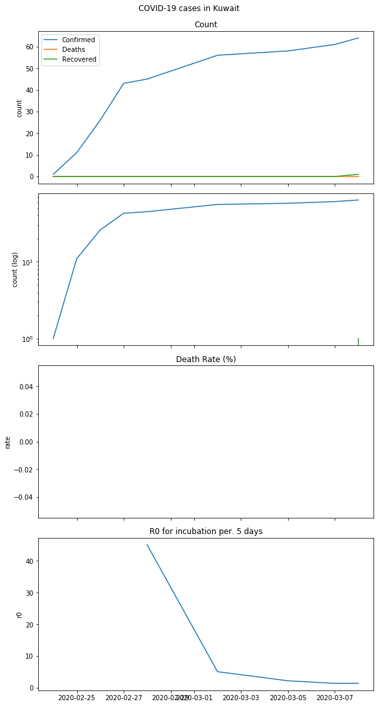


<p>Data extracted from <a href="https://github.com/CSSEGISandData/COVID-19">Johns Hopkins CSSE Data Repository</a></p>


<div>
<style scoped>
    .dataframe tbody tr th:only-of-type {
        vertical-align: middle;
    }

    .dataframe tbody tr th {
        vertical-align: top;
    }

    .dataframe thead th {
        text-align: right;
    }
</style>
<table border="1" class="dataframe">
  <thead>
    <tr style="text-align: right;">
      <th></th>
      <th>Last Update</th>
      <th>Country/Region</th>
      <th>Confirmed</th>
      <th>Deaths</th>
      <th>Recovered</th>
      <th>Death Rate (%)</th>
    </tr>
  </thead>
  <tbody>
    <tr>
      <td>418</td>
      <td>2020-02-24</td>
      <td>Kuwait</td>
      <td>1.0</td>
      <td>0.0</td>
      <td>0.0</td>
      <td>NaN</td>
    </tr>
    <tr>
      <td>437</td>
      <td>2020-02-25</td>
      <td>Kuwait</td>
      <td>11.0</td>
      <td>0.0</td>
      <td>0.0</td>
      <td>NaN</td>
    </tr>
    <tr>
      <td>464</td>
      <td>2020-02-26</td>
      <td>Kuwait</td>
      <td>26.0</td>
      <td>0.0</td>
      <td>0.0</td>
      <td>NaN</td>
    </tr>
    <tr>
      <td>495</td>
      <td>2020-02-27</td>
      <td>Kuwait</td>
      <td>43.0</td>
      <td>0.0</td>
      <td>0.0</td>
      <td>NaN</td>
    </tr>
    <tr>
      <td>525</td>
      <td>2020-02-28</td>
      <td>Kuwait</td>
      <td>45.0</td>
      <td>0.0</td>
      <td>0.0</td>
      <td>NaN</td>
    </tr>
    <tr>
      <td>646</td>
      <td>2020-03-02</td>
      <td>Kuwait</td>
      <td>56.0</td>
      <td>0.0</td>
      <td>0.0</td>
      <td>NaN</td>
    </tr>
    <tr>
      <td>794</td>
      <td>2020-03-05</td>
      <td>Kuwait</td>
      <td>58.0</td>
      <td>0.0</td>
      <td>0.0</td>
      <td>NaN</td>
    </tr>
    <tr>
      <td>909</td>
      <td>2020-03-07</td>
      <td>Kuwait</td>
      <td>61.0</td>
      <td>0.0</td>
      <td>0.0</td>
      <td>NaN</td>
    </tr>
    <tr>
      <td>968</td>
      <td>2020-03-08</td>
      <td>Kuwait</td>
      <td>64.0</td>
      <td>0.0</td>
      <td>1.0</td>
      <td>0.0</td>
    </tr>
  </tbody>
</table>
</div>


<p>r0 calculated as (Confirmed cases at day N + incubation period = 5 days)/(confirmed cases at day N)</p>


<p>Note that this is just a very rough value determined by "garage epidemiology" and should not be used as reference</p>


<div>
<style scoped>
    .dataframe tbody tr th:only-of-type {
        vertical-align: middle;
    }

    .dataframe tbody tr th {
        vertical-align: top;
    }

    .dataframe thead th {
        text-align: right;
    }
</style>
<table border="1" class="dataframe">
  <thead>
    <tr style="text-align: right;">
      <th></th>
      <th>r0</th>
    </tr>
    <tr>
      <th>Last Update</th>
      <th></th>
    </tr>
  </thead>
  <tbody>
    <tr>
      <td>2020-02-24</td>
      <td>NaN</td>
    </tr>
    <tr>
      <td>2020-02-25</td>
      <td>NaN</td>
    </tr>
    <tr>
      <td>2020-02-26</td>
      <td>NaN</td>
    </tr>
    <tr>
      <td>2020-02-27</td>
      <td>NaN</td>
    </tr>
    <tr>
      <td>2020-02-28</td>
      <td>45.000000</td>
    </tr>
    <tr>
      <td>2020-03-02</td>
      <td>5.090909</td>
    </tr>
    <tr>
      <td>2020-03-05</td>
      <td>2.230769</td>
    </tr>
    <tr>
      <td>2020-03-07</td>
      <td>1.418605</td>
    </tr>
    <tr>
      <td>2020-03-08</td>
      <td>1.422222</td>
    </tr>
  </tbody>
</table>
</div>


<h2><a name="latvia" href="#latvia">Latvia</a></h2>


<p>Plot of COVID-19 cases.</p>


<p>Death rate calculated as (count of death)(count of death + count of recovered)</p>


<p>Data extracted from <a href="https://github.com/CSSEGISandData/COVID-19">Johns Hopkins CSSE Data Repository</a></p>


<div>
<style scoped>
    .dataframe tbody tr th:only-of-type {
        vertical-align: middle;
    }

    .dataframe tbody tr th {
        vertical-align: top;
    }

    .dataframe thead th {
        text-align: right;
    }
</style>
<table border="1" class="dataframe">
  <thead>
    <tr style="text-align: right;">
      <th></th>
      <th>Last Update</th>
      <th>Country/Region</th>
      <th>Confirmed</th>
      <th>Deaths</th>
      <th>Recovered</th>
      <th>Death Rate (%)</th>
    </tr>
  </thead>
  <tbody>
    <tr>
      <td>647</td>
      <td>2020-03-02</td>
      <td>Latvia</td>
      <td>1.0</td>
      <td>0.0</td>
      <td>0.0</td>
      <td>NaN</td>
    </tr>
    <tr>
      <td>746</td>
      <td>2020-03-04</td>
      <td>Latvia</td>
      <td>1.0</td>
      <td>0.0</td>
      <td>0.0</td>
      <td>NaN</td>
    </tr>
    <tr>
      <td>969</td>
      <td>2020-03-08</td>
      <td>Latvia</td>
      <td>2.0</td>
      <td>0.0</td>
      <td>0.0</td>
      <td>NaN</td>
    </tr>
  </tbody>
</table>
</div>


<p>r0 calculated as (Confirmed cases at day N + incubation period = 5 days)/(confirmed cases at day N)</p>


<p>Note that this is just a very rough value determined by "garage epidemiology" and should not be used as reference</p>


<div>
<style scoped>
    .dataframe tbody tr th:only-of-type {
        vertical-align: middle;
    }

    .dataframe tbody tr th {
        vertical-align: top;
    }

    .dataframe thead th {
        text-align: right;
    }
</style>
<table border="1" class="dataframe">
  <thead>
    <tr style="text-align: right;">
      <th></th>
      <th>r0</th>
    </tr>
    <tr>
      <th>Last Update</th>
      <th></th>
    </tr>
  </thead>
  <tbody>
    <tr>
      <td>2020-03-02</td>
      <td>NaN</td>
    </tr>
    <tr>
      <td>2020-03-04</td>
      <td>NaN</td>
    </tr>
    <tr>
      <td>2020-03-08</td>
      <td>NaN</td>
    </tr>
  </tbody>
</table>
</div>


<h2><a name="lebanon" href="#lebanon">Lebanon</a></h2>


<p>Plot of COVID-19 cases.</p>


<p>Death rate calculated as (count of death)(count of death + count of recovered)</p>


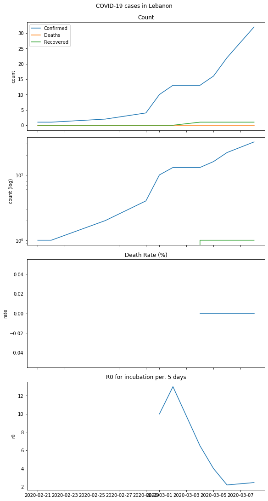


<p>Data extracted from <a href="https://github.com/CSSEGISandData/COVID-19">Johns Hopkins CSSE Data Repository</a></p>


<div>
<style scoped>
    .dataframe tbody tr th:only-of-type {
        vertical-align: middle;
    }

    .dataframe tbody tr th {
        vertical-align: top;
    }

    .dataframe thead th {
        text-align: right;
    }
</style>
<table border="1" class="dataframe">
  <thead>
    <tr style="text-align: right;">
      <th></th>
      <th>Last Update</th>
      <th>Country/Region</th>
      <th>Confirmed</th>
      <th>Deaths</th>
      <th>Recovered</th>
      <th>Death Rate (%)</th>
    </tr>
  </thead>
  <tbody>
    <tr>
      <td>380</td>
      <td>2020-02-21</td>
      <td>Lebanon</td>
      <td>1.0</td>
      <td>0.0</td>
      <td>0.0</td>
      <td>NaN</td>
    </tr>
    <tr>
      <td>394</td>
      <td>2020-02-22</td>
      <td>Lebanon</td>
      <td>1.0</td>
      <td>0.0</td>
      <td>0.0</td>
      <td>NaN</td>
    </tr>
    <tr>
      <td>465</td>
      <td>2020-02-26</td>
      <td>Lebanon</td>
      <td>2.0</td>
      <td>0.0</td>
      <td>0.0</td>
      <td>NaN</td>
    </tr>
    <tr>
      <td>561</td>
      <td>2020-02-29</td>
      <td>Lebanon</td>
      <td>4.0</td>
      <td>0.0</td>
      <td>0.0</td>
      <td>NaN</td>
    </tr>
    <tr>
      <td>609</td>
      <td>2020-03-01</td>
      <td>Lebanon</td>
      <td>10.0</td>
      <td>0.0</td>
      <td>0.0</td>
      <td>NaN</td>
    </tr>
    <tr>
      <td>648</td>
      <td>2020-03-02</td>
      <td>Lebanon</td>
      <td>13.0</td>
      <td>0.0</td>
      <td>0.0</td>
      <td>NaN</td>
    </tr>
    <tr>
      <td>747</td>
      <td>2020-03-04</td>
      <td>Lebanon</td>
      <td>13.0</td>
      <td>0.0</td>
      <td>1.0</td>
      <td>0.0</td>
    </tr>
    <tr>
      <td>795</td>
      <td>2020-03-05</td>
      <td>Lebanon</td>
      <td>16.0</td>
      <td>0.0</td>
      <td>1.0</td>
      <td>0.0</td>
    </tr>
    <tr>
      <td>851</td>
      <td>2020-03-06</td>
      <td>Lebanon</td>
      <td>22.0</td>
      <td>0.0</td>
      <td>1.0</td>
      <td>0.0</td>
    </tr>
    <tr>
      <td>970</td>
      <td>2020-03-08</td>
      <td>Lebanon</td>
      <td>32.0</td>
      <td>0.0</td>
      <td>1.0</td>
      <td>0.0</td>
    </tr>
  </tbody>
</table>
</div>


<p>r0 calculated as (Confirmed cases at day N + incubation period = 5 days)/(confirmed cases at day N)</p>


<p>Note that this is just a very rough value determined by "garage epidemiology" and should not be used as reference</p>


<div>
<style scoped>
    .dataframe tbody tr th:only-of-type {
        vertical-align: middle;
    }

    .dataframe tbody tr th {
        vertical-align: top;
    }

    .dataframe thead th {
        text-align: right;
    }
</style>
<table border="1" class="dataframe">
  <thead>
    <tr style="text-align: right;">
      <th></th>
      <th>r0</th>
    </tr>
    <tr>
      <th>Last Update</th>
      <th></th>
    </tr>
  </thead>
  <tbody>
    <tr>
      <td>2020-02-21</td>
      <td>NaN</td>
    </tr>
    <tr>
      <td>2020-02-22</td>
      <td>NaN</td>
    </tr>
    <tr>
      <td>2020-02-26</td>
      <td>NaN</td>
    </tr>
    <tr>
      <td>2020-02-29</td>
      <td>NaN</td>
    </tr>
    <tr>
      <td>2020-03-01</td>
      <td>10.000000</td>
    </tr>
    <tr>
      <td>2020-03-02</td>
      <td>13.000000</td>
    </tr>
    <tr>
      <td>2020-03-04</td>
      <td>6.500000</td>
    </tr>
    <tr>
      <td>2020-03-05</td>
      <td>4.000000</td>
    </tr>
    <tr>
      <td>2020-03-06</td>
      <td>2.200000</td>
    </tr>
    <tr>
      <td>2020-03-08</td>
      <td>2.461538</td>
    </tr>
  </tbody>
</table>
</div>


<h2><a name="liechtenstein" href="#liechtenstein">Liechtenstein</a></h2>


<p>Plot of COVID-19 cases.</p>


<p>Death rate calculated as (count of death)(count of death + count of recovered)</p>


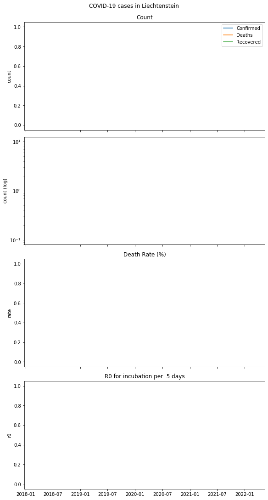


<p>Data extracted from <a href="https://github.com/CSSEGISandData/COVID-19">Johns Hopkins CSSE Data Repository</a></p>


<div>
<style scoped>
    .dataframe tbody tr th:only-of-type {
        vertical-align: middle;
    }

    .dataframe tbody tr th {
        vertical-align: top;
    }

    .dataframe thead th {
        text-align: right;
    }
</style>
<table border="1" class="dataframe">
  <thead>
    <tr style="text-align: right;">
      <th></th>
      <th>Last Update</th>
      <th>Country/Region</th>
      <th>Confirmed</th>
      <th>Deaths</th>
      <th>Recovered</th>
      <th>Death Rate (%)</th>
    </tr>
  </thead>
  <tbody>
    <tr>
      <td>748</td>
      <td>2020-03-04</td>
      <td>Liechtenstein</td>
      <td>1.0</td>
      <td>0.0</td>
      <td>0.0</td>
      <td>NaN</td>
    </tr>
  </tbody>
</table>
</div>


<p>r0 calculated as (Confirmed cases at day N + incubation period = 5 days)/(confirmed cases at day N)</p>


<p>Note that this is just a very rough value determined by "garage epidemiology" and should not be used as reference</p>


<div>
<style scoped>
    .dataframe tbody tr th:only-of-type {
        vertical-align: middle;
    }

    .dataframe tbody tr th {
        vertical-align: top;
    }

    .dataframe thead th {
        text-align: right;
    }
</style>
<table border="1" class="dataframe">
  <thead>
    <tr style="text-align: right;">
      <th></th>
      <th>r0</th>
    </tr>
    <tr>
      <th>Last Update</th>
      <th></th>
    </tr>
  </thead>
  <tbody>
    <tr>
      <td>2020-03-04</td>
      <td>NaN</td>
    </tr>
  </tbody>
</table>
</div>


<h2><a name="lithuania" href="#lithuania">Lithuania</a></h2>


<p>Plot of COVID-19 cases.</p>


<p>Death rate calculated as (count of death)(count of death + count of recovered)</p>


<p>Data extracted from <a href="https://github.com/CSSEGISandData/COVID-19">Johns Hopkins CSSE Data Repository</a></p>


<div>
<style scoped>
    .dataframe tbody tr th:only-of-type {
        vertical-align: middle;
    }

    .dataframe tbody tr th {
        vertical-align: top;
    }

    .dataframe thead th {
        text-align: right;
    }
</style>
<table border="1" class="dataframe">
  <thead>
    <tr style="text-align: right;">
      <th></th>
      <th>Last Update</th>
      <th>Country/Region</th>
      <th>Confirmed</th>
      <th>Deaths</th>
      <th>Recovered</th>
      <th>Death Rate (%)</th>
    </tr>
  </thead>
  <tbody>
    <tr>
      <td>526</td>
      <td>2020-02-28</td>
      <td>Lithuania</td>
      <td>1.0</td>
      <td>0.0</td>
      <td>0.0</td>
      <td>NaN</td>
    </tr>
  </tbody>
</table>
</div>


<p>r0 calculated as (Confirmed cases at day N + incubation period = 5 days)/(confirmed cases at day N)</p>


<p>Note that this is just a very rough value determined by "garage epidemiology" and should not be used as reference</p>


<div>
<style scoped>
    .dataframe tbody tr th:only-of-type {
        vertical-align: middle;
    }

    .dataframe tbody tr th {
        vertical-align: top;
    }

    .dataframe thead th {
        text-align: right;
    }
</style>
<table border="1" class="dataframe">
  <thead>
    <tr style="text-align: right;">
      <th></th>
      <th>r0</th>
    </tr>
    <tr>
      <th>Last Update</th>
      <th></th>
    </tr>
  </thead>
  <tbody>
    <tr>
      <td>2020-02-28</td>
      <td>NaN</td>
    </tr>
  </tbody>
</table>
</div>


<h2><a name="luxembourg" href="#luxembourg">Luxembourg</a></h2>


<p>Plot of COVID-19 cases.</p>


<p>Death rate calculated as (count of death)(count of death + count of recovered)</p>


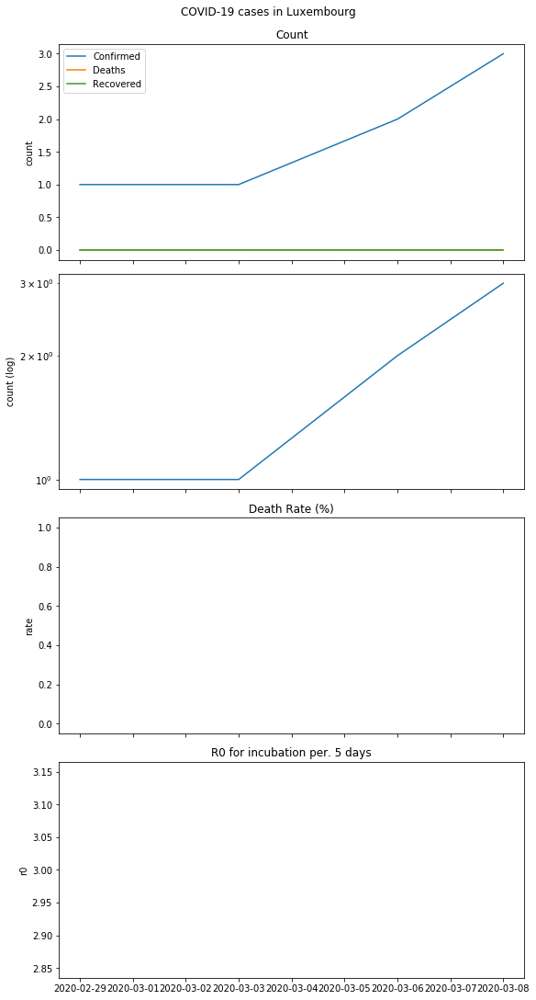


<p>Data extracted from <a href="https://github.com/CSSEGISandData/COVID-19">Johns Hopkins CSSE Data Repository</a></p>


<div>
<style scoped>
    .dataframe tbody tr th:only-of-type {
        vertical-align: middle;
    }

    .dataframe tbody tr th {
        vertical-align: top;
    }

    .dataframe thead th {
        text-align: right;
    }
</style>
<table border="1" class="dataframe">
  <thead>
    <tr style="text-align: right;">
      <th></th>
      <th>Last Update</th>
      <th>Country/Region</th>
      <th>Confirmed</th>
      <th>Deaths</th>
      <th>Recovered</th>
      <th>Death Rate (%)</th>
    </tr>
  </thead>
  <tbody>
    <tr>
      <td>562</td>
      <td>2020-02-29</td>
      <td>Luxembourg</td>
      <td>1.0</td>
      <td>0.0</td>
      <td>0.0</td>
      <td>NaN</td>
    </tr>
    <tr>
      <td>610</td>
      <td>2020-03-01</td>
      <td>Luxembourg</td>
      <td>1.0</td>
      <td>0.0</td>
      <td>0.0</td>
      <td>NaN</td>
    </tr>
    <tr>
      <td>691</td>
      <td>2020-03-03</td>
      <td>Luxembourg</td>
      <td>1.0</td>
      <td>0.0</td>
      <td>0.0</td>
      <td>NaN</td>
    </tr>
    <tr>
      <td>852</td>
      <td>2020-03-06</td>
      <td>Luxembourg</td>
      <td>2.0</td>
      <td>0.0</td>
      <td>0.0</td>
      <td>NaN</td>
    </tr>
    <tr>
      <td>971</td>
      <td>2020-03-08</td>
      <td>Luxembourg</td>
      <td>3.0</td>
      <td>0.0</td>
      <td>0.0</td>
      <td>NaN</td>
    </tr>
  </tbody>
</table>
</div>


<p>r0 calculated as (Confirmed cases at day N + incubation period = 5 days)/(confirmed cases at day N)</p>


<p>Note that this is just a very rough value determined by "garage epidemiology" and should not be used as reference</p>


<div>
<style scoped>
    .dataframe tbody tr th:only-of-type {
        vertical-align: middle;
    }

    .dataframe tbody tr th {
        vertical-align: top;
    }

    .dataframe thead th {
        text-align: right;
    }
</style>
<table border="1" class="dataframe">
  <thead>
    <tr style="text-align: right;">
      <th></th>
      <th>r0</th>
    </tr>
    <tr>
      <th>Last Update</th>
      <th></th>
    </tr>
  </thead>
  <tbody>
    <tr>
      <td>2020-02-29</td>
      <td>NaN</td>
    </tr>
    <tr>
      <td>2020-03-01</td>
      <td>NaN</td>
    </tr>
    <tr>
      <td>2020-03-03</td>
      <td>NaN</td>
    </tr>
    <tr>
      <td>2020-03-06</td>
      <td>NaN</td>
    </tr>
    <tr>
      <td>2020-03-08</td>
      <td>3.0</td>
    </tr>
  </tbody>
</table>
</div>


<h2><a name="macau" href="#macau">Macau</a></h2>


<p>Plot of COVID-19 cases.</p>


<p>Death rate calculated as (count of death)(count of death + count of recovered)</p>


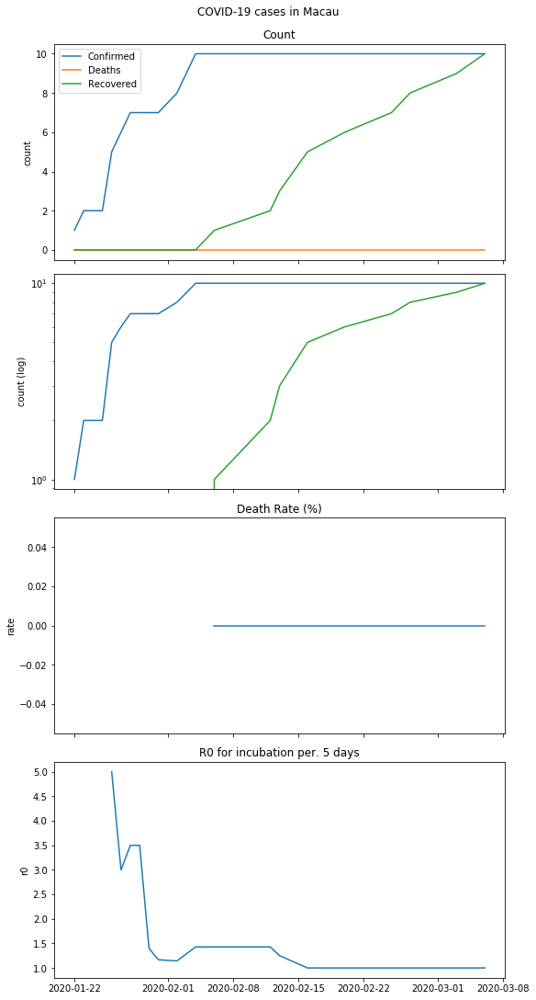


<p>Data extracted from <a href="https://github.com/CSSEGISandData/COVID-19">Johns Hopkins CSSE Data Repository</a></p>


<div>
<style scoped>
    .dataframe tbody tr th:only-of-type {
        vertical-align: middle;
    }

    .dataframe tbody tr th {
        vertical-align: top;
    }

    .dataframe thead th {
        text-align: right;
    }
</style>
<table border="1" class="dataframe">
  <thead>
    <tr style="text-align: right;">
      <th></th>
      <th>Last Update</th>
      <th>Country/Region</th>
      <th>Confirmed</th>
      <th>Deaths</th>
      <th>Recovered</th>
      <th>Death Rate (%)</th>
    </tr>
  </thead>
  <tbody>
    <tr>
      <td>2</td>
      <td>2020-01-22</td>
      <td>Macau</td>
      <td>1.0</td>
      <td>0.0</td>
      <td>0.0</td>
      <td>NaN</td>
    </tr>
    <tr>
      <td>13</td>
      <td>2020-01-23</td>
      <td>Macau</td>
      <td>2.0</td>
      <td>0.0</td>
      <td>0.0</td>
      <td>NaN</td>
    </tr>
    <tr>
      <td>27</td>
      <td>2020-01-24</td>
      <td>Macau</td>
      <td>2.0</td>
      <td>0.0</td>
      <td>0.0</td>
      <td>NaN</td>
    </tr>
    <tr>
      <td>39</td>
      <td>2020-01-25</td>
      <td>Macau</td>
      <td>2.0</td>
      <td>0.0</td>
      <td>0.0</td>
      <td>NaN</td>
    </tr>
    <tr>
      <td>54</td>
      <td>2020-01-26</td>
      <td>Macau</td>
      <td>5.0</td>
      <td>0.0</td>
      <td>0.0</td>
      <td>NaN</td>
    </tr>
    <tr>
      <td>71</td>
      <td>2020-01-27</td>
      <td>Macau</td>
      <td>6.0</td>
      <td>0.0</td>
      <td>0.0</td>
      <td>NaN</td>
    </tr>
    <tr>
      <td>89</td>
      <td>2020-01-28</td>
      <td>Macau</td>
      <td>7.0</td>
      <td>0.0</td>
      <td>0.0</td>
      <td>NaN</td>
    </tr>
    <tr>
      <td>108</td>
      <td>2020-01-29</td>
      <td>Macau</td>
      <td>7.0</td>
      <td>0.0</td>
      <td>0.0</td>
      <td>NaN</td>
    </tr>
    <tr>
      <td>129</td>
      <td>2020-01-30</td>
      <td>Macau</td>
      <td>7.0</td>
      <td>0.0</td>
      <td>0.0</td>
      <td>NaN</td>
    </tr>
    <tr>
      <td>152</td>
      <td>2020-01-31</td>
      <td>Macau</td>
      <td>7.0</td>
      <td>0.0</td>
      <td>0.0</td>
      <td>NaN</td>
    </tr>
    <tr>
      <td>187</td>
      <td>2020-02-02</td>
      <td>Macau</td>
      <td>8.0</td>
      <td>0.0</td>
      <td>0.0</td>
      <td>NaN</td>
    </tr>
    <tr>
      <td>203</td>
      <td>2020-02-04</td>
      <td>Macau</td>
      <td>10.0</td>
      <td>0.0</td>
      <td>0.0</td>
      <td>NaN</td>
    </tr>
    <tr>
      <td>220</td>
      <td>2020-02-06</td>
      <td>Macau</td>
      <td>10.0</td>
      <td>0.0</td>
      <td>1.0</td>
      <td>0.0</td>
    </tr>
    <tr>
      <td>285</td>
      <td>2020-02-12</td>
      <td>Macau</td>
      <td>10.0</td>
      <td>0.0</td>
      <td>2.0</td>
      <td>0.0</td>
    </tr>
    <tr>
      <td>300</td>
      <td>2020-02-13</td>
      <td>Macau</td>
      <td>10.0</td>
      <td>0.0</td>
      <td>3.0</td>
      <td>0.0</td>
    </tr>
    <tr>
      <td>327</td>
      <td>2020-02-16</td>
      <td>Macau</td>
      <td>10.0</td>
      <td>0.0</td>
      <td>5.0</td>
      <td>0.0</td>
    </tr>
    <tr>
      <td>366</td>
      <td>2020-02-20</td>
      <td>Macau</td>
      <td>10.0</td>
      <td>0.0</td>
      <td>6.0</td>
      <td>0.0</td>
    </tr>
    <tr>
      <td>438</td>
      <td>2020-02-25</td>
      <td>Macau</td>
      <td>10.0</td>
      <td>0.0</td>
      <td>7.0</td>
      <td>0.0</td>
    </tr>
    <tr>
      <td>496</td>
      <td>2020-02-27</td>
      <td>Macau</td>
      <td>10.0</td>
      <td>0.0</td>
      <td>8.0</td>
      <td>0.0</td>
    </tr>
    <tr>
      <td>692</td>
      <td>2020-03-03</td>
      <td>Macau</td>
      <td>10.0</td>
      <td>0.0</td>
      <td>9.0</td>
      <td>0.0</td>
    </tr>
    <tr>
      <td>853</td>
      <td>2020-03-06</td>
      <td>Macau</td>
      <td>10.0</td>
      <td>0.0</td>
      <td>10.0</td>
      <td>0.0</td>
    </tr>
  </tbody>
</table>
</div>


<p>r0 calculated as (Confirmed cases at day N + incubation period = 5 days)/(confirmed cases at day N)</p>


<p>Note that this is just a very rough value determined by "garage epidemiology" and should not be used as reference</p>


<div>
<style scoped>
    .dataframe tbody tr th:only-of-type {
        vertical-align: middle;
    }

    .dataframe tbody tr th {
        vertical-align: top;
    }

    .dataframe thead th {
        text-align: right;
    }
</style>
<table border="1" class="dataframe">
  <thead>
    <tr style="text-align: right;">
      <th></th>
      <th>r0</th>
    </tr>
    <tr>
      <th>Last Update</th>
      <th></th>
    </tr>
  </thead>
  <tbody>
    <tr>
      <td>2020-01-22</td>
      <td>NaN</td>
    </tr>
    <tr>
      <td>2020-01-23</td>
      <td>NaN</td>
    </tr>
    <tr>
      <td>2020-01-24</td>
      <td>NaN</td>
    </tr>
    <tr>
      <td>2020-01-25</td>
      <td>NaN</td>
    </tr>
    <tr>
      <td>2020-01-26</td>
      <td>5.000000</td>
    </tr>
    <tr>
      <td>2020-01-27</td>
      <td>3.000000</td>
    </tr>
    <tr>
      <td>2020-01-28</td>
      <td>3.500000</td>
    </tr>
    <tr>
      <td>2020-01-29</td>
      <td>3.500000</td>
    </tr>
    <tr>
      <td>2020-01-30</td>
      <td>1.400000</td>
    </tr>
    <tr>
      <td>2020-01-31</td>
      <td>1.166667</td>
    </tr>
    <tr>
      <td>2020-02-02</td>
      <td>1.142857</td>
    </tr>
    <tr>
      <td>2020-02-04</td>
      <td>1.428571</td>
    </tr>
    <tr>
      <td>2020-02-06</td>
      <td>1.428571</td>
    </tr>
    <tr>
      <td>2020-02-12</td>
      <td>1.428571</td>
    </tr>
    <tr>
      <td>2020-02-13</td>
      <td>1.250000</td>
    </tr>
    <tr>
      <td>2020-02-16</td>
      <td>1.000000</td>
    </tr>
    <tr>
      <td>2020-02-20</td>
      <td>1.000000</td>
    </tr>
    <tr>
      <td>2020-02-25</td>
      <td>1.000000</td>
    </tr>
    <tr>
      <td>2020-02-27</td>
      <td>1.000000</td>
    </tr>
    <tr>
      <td>2020-03-03</td>
      <td>1.000000</td>
    </tr>
    <tr>
      <td>2020-03-06</td>
      <td>1.000000</td>
    </tr>
  </tbody>
</table>
</div>


<h2><a name="mainland_china" href="#mainland_china">Mainland China</a></h2>


<p>Plot of COVID-19 cases.</p>


<p>Death rate calculated as (count of death)(count of death + count of recovered)</p>


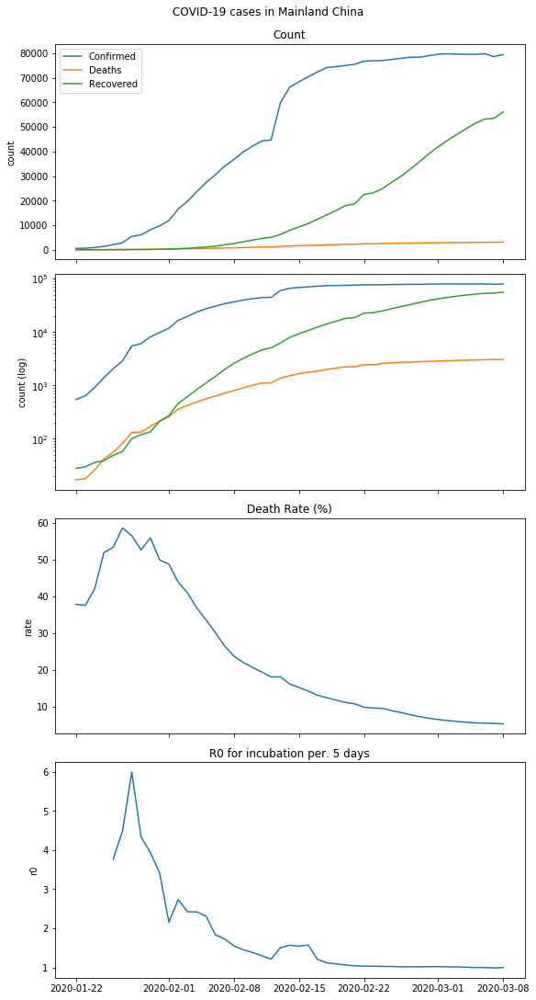


<p>Data extracted from <a href="https://github.com/CSSEGISandData/COVID-19">Johns Hopkins CSSE Data Repository</a></p>


<div>
<style scoped>
    .dataframe tbody tr th:only-of-type {
        vertical-align: middle;
    }

    .dataframe tbody tr th {
        vertical-align: top;
    }

    .dataframe thead th {
        text-align: right;
    }
</style>
<table border="1" class="dataframe">
  <thead>
    <tr style="text-align: right;">
      <th></th>
      <th>Last Update</th>
      <th>Country/Region</th>
      <th>Confirmed</th>
      <th>Deaths</th>
      <th>Recovered</th>
      <th>Death Rate (%)</th>
    </tr>
  </thead>
  <tbody>
    <tr>
      <td>3</td>
      <td>2020-01-22</td>
      <td>Mainland China</td>
      <td>547.0</td>
      <td>17.0</td>
      <td>28.0</td>
      <td>37.777778</td>
    </tr>
    <tr>
      <td>14</td>
      <td>2020-01-23</td>
      <td>Mainland China</td>
      <td>639.0</td>
      <td>18.0</td>
      <td>30.0</td>
      <td>37.500000</td>
    </tr>
    <tr>
      <td>28</td>
      <td>2020-01-24</td>
      <td>Mainland China</td>
      <td>916.0</td>
      <td>26.0</td>
      <td>36.0</td>
      <td>41.935484</td>
    </tr>
    <tr>
      <td>40</td>
      <td>2020-01-25</td>
      <td>Mainland China</td>
      <td>1399.0</td>
      <td>42.0</td>
      <td>39.0</td>
      <td>51.851852</td>
    </tr>
    <tr>
      <td>55</td>
      <td>2020-01-26</td>
      <td>Mainland China</td>
      <td>2062.0</td>
      <td>56.0</td>
      <td>49.0</td>
      <td>53.333333</td>
    </tr>
    <tr>
      <td>72</td>
      <td>2020-01-27</td>
      <td>Mainland China</td>
      <td>2863.0</td>
      <td>82.0</td>
      <td>58.0</td>
      <td>58.571429</td>
    </tr>
    <tr>
      <td>90</td>
      <td>2020-01-28</td>
      <td>Mainland China</td>
      <td>5494.0</td>
      <td>131.0</td>
      <td>101.0</td>
      <td>56.465517</td>
    </tr>
    <tr>
      <td>109</td>
      <td>2020-01-29</td>
      <td>Mainland China</td>
      <td>6070.0</td>
      <td>133.0</td>
      <td>120.0</td>
      <td>52.569170</td>
    </tr>
    <tr>
      <td>130</td>
      <td>2020-01-30</td>
      <td>Mainland China</td>
      <td>8124.0</td>
      <td>171.0</td>
      <td>135.0</td>
      <td>55.882353</td>
    </tr>
    <tr>
      <td>153</td>
      <td>2020-01-31</td>
      <td>Mainland China</td>
      <td>9783.0</td>
      <td>213.0</td>
      <td>214.0</td>
      <td>49.882904</td>
    </tr>
    <tr>
      <td>174</td>
      <td>2020-02-01</td>
      <td>Mainland China</td>
      <td>11842.0</td>
      <td>259.0</td>
      <td>273.0</td>
      <td>48.684211</td>
    </tr>
    <tr>
      <td>188</td>
      <td>2020-02-02</td>
      <td>Mainland China</td>
      <td>16606.0</td>
      <td>361.0</td>
      <td>463.0</td>
      <td>43.810680</td>
    </tr>
    <tr>
      <td>195</td>
      <td>2020-02-03</td>
      <td>Mainland China</td>
      <td>19692.0</td>
      <td>425.0</td>
      <td>614.0</td>
      <td>40.904716</td>
    </tr>
    <tr>
      <td>204</td>
      <td>2020-02-04</td>
      <td>Mainland China</td>
      <td>23679.0</td>
      <td>490.0</td>
      <td>843.0</td>
      <td>36.759190</td>
    </tr>
    <tr>
      <td>212</td>
      <td>2020-02-05</td>
      <td>Mainland China</td>
      <td>27374.0</td>
      <td>562.0</td>
      <td>1114.0</td>
      <td>33.532220</td>
    </tr>
    <tr>
      <td>221</td>
      <td>2020-02-06</td>
      <td>Mainland China</td>
      <td>30490.0</td>
      <td>632.0</td>
      <td>1470.0</td>
      <td>30.066603</td>
    </tr>
    <tr>
      <td>231</td>
      <td>2020-02-07</td>
      <td>Mainland China</td>
      <td>34056.0</td>
      <td>717.0</td>
      <td>1995.0</td>
      <td>26.438053</td>
    </tr>
    <tr>
      <td>240</td>
      <td>2020-02-08</td>
      <td>Mainland China</td>
      <td>36759.0</td>
      <td>804.0</td>
      <td>2592.0</td>
      <td>23.674912</td>
    </tr>
    <tr>
      <td>252</td>
      <td>2020-02-09</td>
      <td>Mainland China</td>
      <td>39771.0</td>
      <td>904.0</td>
      <td>3215.0</td>
      <td>21.947075</td>
    </tr>
    <tr>
      <td>261</td>
      <td>2020-02-10</td>
      <td>Mainland China</td>
      <td>42168.0</td>
      <td>1011.0</td>
      <td>3889.0</td>
      <td>20.632653</td>
    </tr>
    <tr>
      <td>272</td>
      <td>2020-02-11</td>
      <td>Mainland China</td>
      <td>44268.0</td>
      <td>1111.0</td>
      <td>4630.0</td>
      <td>19.352029</td>
    </tr>
    <tr>
      <td>286</td>
      <td>2020-02-12</td>
      <td>Mainland China</td>
      <td>44699.0</td>
      <td>1116.0</td>
      <td>5079.0</td>
      <td>18.014528</td>
    </tr>
    <tr>
      <td>301</td>
      <td>2020-02-13</td>
      <td>Mainland China</td>
      <td>59831.0</td>
      <td>1368.0</td>
      <td>6212.0</td>
      <td>18.047493</td>
    </tr>
    <tr>
      <td>310</td>
      <td>2020-02-14</td>
      <td>Mainland China</td>
      <td>66183.0</td>
      <td>1518.0</td>
      <td>7922.0</td>
      <td>16.080508</td>
    </tr>
    <tr>
      <td>316</td>
      <td>2020-02-15</td>
      <td>Mainland China</td>
      <td>68346.0</td>
      <td>1662.0</td>
      <td>9293.0</td>
      <td>15.171155</td>
    </tr>
    <tr>
      <td>328</td>
      <td>2020-02-16</td>
      <td>Mainland China</td>
      <td>70357.0</td>
      <td>1765.0</td>
      <td>10701.0</td>
      <td>14.158511</td>
    </tr>
    <tr>
      <td>341</td>
      <td>2020-02-17</td>
      <td>Mainland China</td>
      <td>72345.0</td>
      <td>1863.0</td>
      <td>12441.0</td>
      <td>13.024329</td>
    </tr>
    <tr>
      <td>350</td>
      <td>2020-02-18</td>
      <td>Mainland China</td>
      <td>74138.0</td>
      <td>2002.0</td>
      <td>14198.0</td>
      <td>12.358025</td>
    </tr>
    <tr>
      <td>358</td>
      <td>2020-02-19</td>
      <td>Mainland China</td>
      <td>74545.0</td>
      <td>2114.0</td>
      <td>15951.0</td>
      <td>11.702187</td>
    </tr>
    <tr>
      <td>367</td>
      <td>2020-02-20</td>
      <td>Mainland China</td>
      <td>74980.0</td>
      <td>2236.0</td>
      <td>17985.0</td>
      <td>11.057811</td>
    </tr>
    <tr>
      <td>381</td>
      <td>2020-02-21</td>
      <td>Mainland China</td>
      <td>75471.0</td>
      <td>2236.0</td>
      <td>18692.0</td>
      <td>10.684251</td>
    </tr>
    <tr>
      <td>395</td>
      <td>2020-02-22</td>
      <td>Mainland China</td>
      <td>76741.0</td>
      <td>2439.0</td>
      <td>22544.0</td>
      <td>9.762639</td>
    </tr>
    <tr>
      <td>404</td>
      <td>2020-02-23</td>
      <td>Mainland China</td>
      <td>76919.0</td>
      <td>2443.0</td>
      <td>23151.0</td>
      <td>9.545206</td>
    </tr>
    <tr>
      <td>419</td>
      <td>2020-02-24</td>
      <td>Mainland China</td>
      <td>76987.0</td>
      <td>2591.0</td>
      <td>24869.0</td>
      <td>9.435543</td>
    </tr>
    <tr>
      <td>439</td>
      <td>2020-02-25</td>
      <td>Mainland China</td>
      <td>77474.0</td>
      <td>2659.0</td>
      <td>27521.0</td>
      <td>8.810471</td>
    </tr>
    <tr>
      <td>466</td>
      <td>2020-02-26</td>
      <td>Mainland China</td>
      <td>77900.0</td>
      <td>2713.0</td>
      <td>29930.0</td>
      <td>8.311123</td>
    </tr>
    <tr>
      <td>497</td>
      <td>2020-02-27</td>
      <td>Mainland China</td>
      <td>78388.0</td>
      <td>2742.0</td>
      <td>32798.0</td>
      <td>7.715250</td>
    </tr>
    <tr>
      <td>527</td>
      <td>2020-02-28</td>
      <td>Mainland China</td>
      <td>78330.0</td>
      <td>2782.0</td>
      <td>35897.0</td>
      <td>7.192533</td>
    </tr>
    <tr>
      <td>563</td>
      <td>2020-02-29</td>
      <td>Mainland China</td>
      <td>78995.0</td>
      <td>2831.0</td>
      <td>39066.0</td>
      <td>6.757047</td>
    </tr>
    <tr>
      <td>611</td>
      <td>2020-03-01</td>
      <td>Mainland China</td>
      <td>79588.0</td>
      <td>2868.0</td>
      <td>41918.0</td>
      <td>6.403787</td>
    </tr>
    <tr>
      <td>649</td>
      <td>2020-03-02</td>
      <td>Mainland China</td>
      <td>79749.0</td>
      <td>2908.0</td>
      <td>44577.0</td>
      <td>6.124039</td>
    </tr>
    <tr>
      <td>693</td>
      <td>2020-03-03</td>
      <td>Mainland China</td>
      <td>79574.0</td>
      <td>2941.0</td>
      <td>46903.0</td>
      <td>5.900409</td>
    </tr>
    <tr>
      <td>749</td>
      <td>2020-03-04</td>
      <td>Mainland China</td>
      <td>79538.0</td>
      <td>2973.0</td>
      <td>49299.0</td>
      <td>5.687557</td>
    </tr>
    <tr>
      <td>796</td>
      <td>2020-03-05</td>
      <td>Mainland China</td>
      <td>79465.0</td>
      <td>3000.0</td>
      <td>51466.0</td>
      <td>5.508023</td>
    </tr>
    <tr>
      <td>854</td>
      <td>2020-03-06</td>
      <td>Mainland China</td>
      <td>79771.0</td>
      <td>3029.0</td>
      <td>53172.0</td>
      <td>5.389584</td>
    </tr>
    <tr>
      <td>910</td>
      <td>2020-03-07</td>
      <td>Mainland China</td>
      <td>78619.0</td>
      <td>3051.0</td>
      <td>53511.0</td>
      <td>5.394081</td>
    </tr>
    <tr>
      <td>972</td>
      <td>2020-03-08</td>
      <td>Mainland China</td>
      <td>79455.0</td>
      <td>3084.0</td>
      <td>56114.0</td>
      <td>5.209635</td>
    </tr>
  </tbody>
</table>
</div>


<p>r0 calculated as (Confirmed cases at day N + incubation period = 5 days)/(confirmed cases at day N)</p>


<p>Note that this is just a very rough value determined by "garage epidemiology" and should not be used as reference</p>


<div>
<style scoped>
    .dataframe tbody tr th:only-of-type {
        vertical-align: middle;
    }

    .dataframe tbody tr th {
        vertical-align: top;
    }

    .dataframe thead th {
        text-align: right;
    }
</style>
<table border="1" class="dataframe">
  <thead>
    <tr style="text-align: right;">
      <th></th>
      <th>r0</th>
    </tr>
    <tr>
      <th>Last Update</th>
      <th></th>
    </tr>
  </thead>
  <tbody>
    <tr>
      <td>2020-01-22</td>
      <td>NaN</td>
    </tr>
    <tr>
      <td>2020-01-23</td>
      <td>NaN</td>
    </tr>
    <tr>
      <td>2020-01-24</td>
      <td>NaN</td>
    </tr>
    <tr>
      <td>2020-01-25</td>
      <td>NaN</td>
    </tr>
    <tr>
      <td>2020-01-26</td>
      <td>3.769653</td>
    </tr>
    <tr>
      <td>2020-01-27</td>
      <td>4.480438</td>
    </tr>
    <tr>
      <td>2020-01-28</td>
      <td>5.997817</td>
    </tr>
    <tr>
      <td>2020-01-29</td>
      <td>4.338813</td>
    </tr>
    <tr>
      <td>2020-01-30</td>
      <td>3.939864</td>
    </tr>
    <tr>
      <td>2020-01-31</td>
      <td>3.417045</td>
    </tr>
    <tr>
      <td>2020-02-01</td>
      <td>2.155442</td>
    </tr>
    <tr>
      <td>2020-02-02</td>
      <td>2.735750</td>
    </tr>
    <tr>
      <td>2020-02-03</td>
      <td>2.423929</td>
    </tr>
    <tr>
      <td>2020-02-04</td>
      <td>2.420423</td>
    </tr>
    <tr>
      <td>2020-02-05</td>
      <td>2.311603</td>
    </tr>
    <tr>
      <td>2020-02-06</td>
      <td>1.836083</td>
    </tr>
    <tr>
      <td>2020-02-07</td>
      <td>1.729433</td>
    </tr>
    <tr>
      <td>2020-02-08</td>
      <td>1.552388</td>
    </tr>
    <tr>
      <td>2020-02-09</td>
      <td>1.452875</td>
    </tr>
    <tr>
      <td>2020-02-10</td>
      <td>1.383011</td>
    </tr>
    <tr>
      <td>2020-02-11</td>
      <td>1.299859</td>
    </tr>
    <tr>
      <td>2020-02-12</td>
      <td>1.216002</td>
    </tr>
    <tr>
      <td>2020-02-13</td>
      <td>1.504388</td>
    </tr>
    <tr>
      <td>2020-02-14</td>
      <td>1.569508</td>
    </tr>
    <tr>
      <td>2020-02-15</td>
      <td>1.543914</td>
    </tr>
    <tr>
      <td>2020-02-16</td>
      <td>1.574017</td>
    </tr>
    <tr>
      <td>2020-02-17</td>
      <td>1.209156</td>
    </tr>
    <tr>
      <td>2020-02-18</td>
      <td>1.120197</td>
    </tr>
    <tr>
      <td>2020-02-19</td>
      <td>1.090700</td>
    </tr>
    <tr>
      <td>2020-02-20</td>
      <td>1.065708</td>
    </tr>
    <tr>
      <td>2020-02-21</td>
      <td>1.043210</td>
    </tr>
    <tr>
      <td>2020-02-22</td>
      <td>1.035110</td>
    </tr>
    <tr>
      <td>2020-02-23</td>
      <td>1.031847</td>
    </tr>
    <tr>
      <td>2020-02-24</td>
      <td>1.026767</td>
    </tr>
    <tr>
      <td>2020-02-25</td>
      <td>1.026540</td>
    </tr>
    <tr>
      <td>2020-02-26</td>
      <td>1.015103</td>
    </tr>
    <tr>
      <td>2020-02-27</td>
      <td>1.019098</td>
    </tr>
    <tr>
      <td>2020-02-28</td>
      <td>1.017445</td>
    </tr>
    <tr>
      <td>2020-02-29</td>
      <td>1.019632</td>
    </tr>
    <tr>
      <td>2020-03-01</td>
      <td>1.021669</td>
    </tr>
    <tr>
      <td>2020-03-02</td>
      <td>1.017362</td>
    </tr>
    <tr>
      <td>2020-03-03</td>
      <td>1.015882</td>
    </tr>
    <tr>
      <td>2020-03-04</td>
      <td>1.006874</td>
    </tr>
    <tr>
      <td>2020-03-05</td>
      <td>0.998455</td>
    </tr>
    <tr>
      <td>2020-03-06</td>
      <td>1.000276</td>
    </tr>
    <tr>
      <td>2020-03-07</td>
      <td>0.987999</td>
    </tr>
    <tr>
      <td>2020-03-08</td>
      <td>0.998956</td>
    </tr>
  </tbody>
</table>
</div>


<h2><a name="malaysia" href="#malaysia">Malaysia</a></h2>


<p>Plot of COVID-19 cases.</p>


<p>Death rate calculated as (count of death)(count of death + count of recovered)</p>


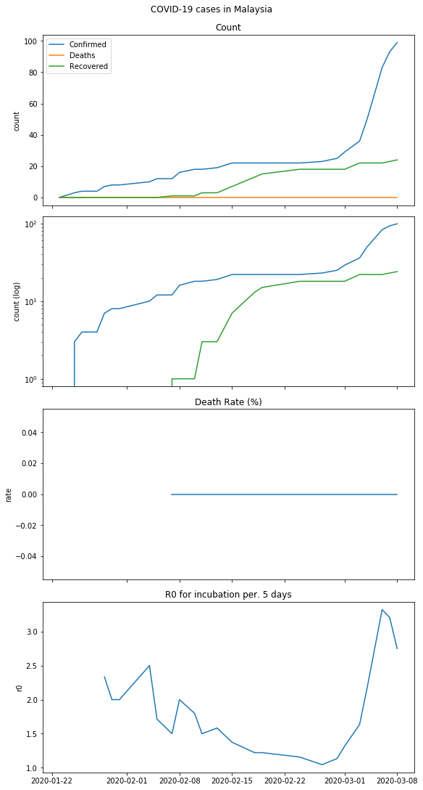


<p>Data extracted from <a href="https://github.com/CSSEGISandData/COVID-19">Johns Hopkins CSSE Data Repository</a></p>


<div>
<style scoped>
    .dataframe tbody tr th:only-of-type {
        vertical-align: middle;
    }

    .dataframe tbody tr th {
        vertical-align: top;
    }

    .dataframe thead th {
        text-align: right;
    }
</style>
<table border="1" class="dataframe">
  <thead>
    <tr style="text-align: right;">
      <th></th>
      <th>Last Update</th>
      <th>Country/Region</th>
      <th>Confirmed</th>
      <th>Deaths</th>
      <th>Recovered</th>
      <th>Death Rate (%)</th>
    </tr>
  </thead>
  <tbody>
    <tr>
      <td>15</td>
      <td>2020-01-23</td>
      <td>Malaysia</td>
      <td>0.0</td>
      <td>0.0</td>
      <td>0.0</td>
      <td>NaN</td>
    </tr>
    <tr>
      <td>41</td>
      <td>2020-01-25</td>
      <td>Malaysia</td>
      <td>3.0</td>
      <td>0.0</td>
      <td>0.0</td>
      <td>NaN</td>
    </tr>
    <tr>
      <td>56</td>
      <td>2020-01-26</td>
      <td>Malaysia</td>
      <td>4.0</td>
      <td>0.0</td>
      <td>0.0</td>
      <td>NaN</td>
    </tr>
    <tr>
      <td>73</td>
      <td>2020-01-27</td>
      <td>Malaysia</td>
      <td>4.0</td>
      <td>0.0</td>
      <td>0.0</td>
      <td>NaN</td>
    </tr>
    <tr>
      <td>91</td>
      <td>2020-01-28</td>
      <td>Malaysia</td>
      <td>4.0</td>
      <td>0.0</td>
      <td>0.0</td>
      <td>NaN</td>
    </tr>
    <tr>
      <td>110</td>
      <td>2020-01-29</td>
      <td>Malaysia</td>
      <td>7.0</td>
      <td>0.0</td>
      <td>0.0</td>
      <td>NaN</td>
    </tr>
    <tr>
      <td>131</td>
      <td>2020-01-30</td>
      <td>Malaysia</td>
      <td>8.0</td>
      <td>0.0</td>
      <td>0.0</td>
      <td>NaN</td>
    </tr>
    <tr>
      <td>154</td>
      <td>2020-01-31</td>
      <td>Malaysia</td>
      <td>8.0</td>
      <td>0.0</td>
      <td>0.0</td>
      <td>NaN</td>
    </tr>
    <tr>
      <td>205</td>
      <td>2020-02-04</td>
      <td>Malaysia</td>
      <td>10.0</td>
      <td>0.0</td>
      <td>0.0</td>
      <td>NaN</td>
    </tr>
    <tr>
      <td>213</td>
      <td>2020-02-05</td>
      <td>Malaysia</td>
      <td>12.0</td>
      <td>0.0</td>
      <td>0.0</td>
      <td>NaN</td>
    </tr>
    <tr>
      <td>232</td>
      <td>2020-02-07</td>
      <td>Malaysia</td>
      <td>12.0</td>
      <td>0.0</td>
      <td>1.0</td>
      <td>0.0</td>
    </tr>
    <tr>
      <td>241</td>
      <td>2020-02-08</td>
      <td>Malaysia</td>
      <td>16.0</td>
      <td>0.0</td>
      <td>1.0</td>
      <td>0.0</td>
    </tr>
    <tr>
      <td>262</td>
      <td>2020-02-10</td>
      <td>Malaysia</td>
      <td>18.0</td>
      <td>0.0</td>
      <td>1.0</td>
      <td>0.0</td>
    </tr>
    <tr>
      <td>273</td>
      <td>2020-02-11</td>
      <td>Malaysia</td>
      <td>18.0</td>
      <td>0.0</td>
      <td>3.0</td>
      <td>0.0</td>
    </tr>
    <tr>
      <td>302</td>
      <td>2020-02-13</td>
      <td>Malaysia</td>
      <td>19.0</td>
      <td>0.0</td>
      <td>3.0</td>
      <td>0.0</td>
    </tr>
    <tr>
      <td>317</td>
      <td>2020-02-15</td>
      <td>Malaysia</td>
      <td>22.0</td>
      <td>0.0</td>
      <td>7.0</td>
      <td>0.0</td>
    </tr>
    <tr>
      <td>351</td>
      <td>2020-02-18</td>
      <td>Malaysia</td>
      <td>22.0</td>
      <td>0.0</td>
      <td>13.0</td>
      <td>0.0</td>
    </tr>
    <tr>
      <td>359</td>
      <td>2020-02-19</td>
      <td>Malaysia</td>
      <td>22.0</td>
      <td>0.0</td>
      <td>15.0</td>
      <td>0.0</td>
    </tr>
    <tr>
      <td>420</td>
      <td>2020-02-24</td>
      <td>Malaysia</td>
      <td>22.0</td>
      <td>0.0</td>
      <td>18.0</td>
      <td>0.0</td>
    </tr>
    <tr>
      <td>498</td>
      <td>2020-02-27</td>
      <td>Malaysia</td>
      <td>23.0</td>
      <td>0.0</td>
      <td>18.0</td>
      <td>0.0</td>
    </tr>
    <tr>
      <td>564</td>
      <td>2020-02-29</td>
      <td>Malaysia</td>
      <td>25.0</td>
      <td>0.0</td>
      <td>18.0</td>
      <td>0.0</td>
    </tr>
    <tr>
      <td>612</td>
      <td>2020-03-01</td>
      <td>Malaysia</td>
      <td>29.0</td>
      <td>0.0</td>
      <td>18.0</td>
      <td>0.0</td>
    </tr>
    <tr>
      <td>694</td>
      <td>2020-03-03</td>
      <td>Malaysia</td>
      <td>36.0</td>
      <td>0.0</td>
      <td>22.0</td>
      <td>0.0</td>
    </tr>
    <tr>
      <td>750</td>
      <td>2020-03-04</td>
      <td>Malaysia</td>
      <td>50.0</td>
      <td>0.0</td>
      <td>22.0</td>
      <td>0.0</td>
    </tr>
    <tr>
      <td>855</td>
      <td>2020-03-06</td>
      <td>Malaysia</td>
      <td>83.0</td>
      <td>0.0</td>
      <td>22.0</td>
      <td>0.0</td>
    </tr>
    <tr>
      <td>911</td>
      <td>2020-03-07</td>
      <td>Malaysia</td>
      <td>93.0</td>
      <td>0.0</td>
      <td>23.0</td>
      <td>0.0</td>
    </tr>
    <tr>
      <td>973</td>
      <td>2020-03-08</td>
      <td>Malaysia</td>
      <td>99.0</td>
      <td>0.0</td>
      <td>24.0</td>
      <td>0.0</td>
    </tr>
  </tbody>
</table>
</div>


<p>r0 calculated as (Confirmed cases at day N + incubation period = 5 days)/(confirmed cases at day N)</p>


<p>Note that this is just a very rough value determined by "garage epidemiology" and should not be used as reference</p>


<div>
<style scoped>
    .dataframe tbody tr th:only-of-type {
        vertical-align: middle;
    }

    .dataframe tbody tr th {
        vertical-align: top;
    }

    .dataframe thead th {
        text-align: right;
    }
</style>
<table border="1" class="dataframe">
  <thead>
    <tr style="text-align: right;">
      <th></th>
      <th>r0</th>
    </tr>
    <tr>
      <th>Last Update</th>
      <th></th>
    </tr>
  </thead>
  <tbody>
    <tr>
      <td>2020-01-23</td>
      <td>NaN</td>
    </tr>
    <tr>
      <td>2020-01-25</td>
      <td>NaN</td>
    </tr>
    <tr>
      <td>2020-01-26</td>
      <td>NaN</td>
    </tr>
    <tr>
      <td>2020-01-27</td>
      <td>NaN</td>
    </tr>
    <tr>
      <td>2020-01-28</td>
      <td>inf</td>
    </tr>
    <tr>
      <td>2020-01-29</td>
      <td>2.333333</td>
    </tr>
    <tr>
      <td>2020-01-30</td>
      <td>2.000000</td>
    </tr>
    <tr>
      <td>2020-01-31</td>
      <td>2.000000</td>
    </tr>
    <tr>
      <td>2020-02-04</td>
      <td>2.500000</td>
    </tr>
    <tr>
      <td>2020-02-05</td>
      <td>1.714286</td>
    </tr>
    <tr>
      <td>2020-02-07</td>
      <td>1.500000</td>
    </tr>
    <tr>
      <td>2020-02-08</td>
      <td>2.000000</td>
    </tr>
    <tr>
      <td>2020-02-10</td>
      <td>1.800000</td>
    </tr>
    <tr>
      <td>2020-02-11</td>
      <td>1.500000</td>
    </tr>
    <tr>
      <td>2020-02-13</td>
      <td>1.583333</td>
    </tr>
    <tr>
      <td>2020-02-15</td>
      <td>1.375000</td>
    </tr>
    <tr>
      <td>2020-02-18</td>
      <td>1.222222</td>
    </tr>
    <tr>
      <td>2020-02-19</td>
      <td>1.222222</td>
    </tr>
    <tr>
      <td>2020-02-24</td>
      <td>1.157895</td>
    </tr>
    <tr>
      <td>2020-02-27</td>
      <td>1.045455</td>
    </tr>
    <tr>
      <td>2020-02-29</td>
      <td>1.136364</td>
    </tr>
    <tr>
      <td>2020-03-01</td>
      <td>1.318182</td>
    </tr>
    <tr>
      <td>2020-03-03</td>
      <td>1.636364</td>
    </tr>
    <tr>
      <td>2020-03-04</td>
      <td>2.173913</td>
    </tr>
    <tr>
      <td>2020-03-06</td>
      <td>3.320000</td>
    </tr>
    <tr>
      <td>2020-03-07</td>
      <td>3.206897</td>
    </tr>
    <tr>
      <td>2020-03-08</td>
      <td>2.750000</td>
    </tr>
  </tbody>
</table>
</div>


<h2><a name="maldives" href="#maldives">Maldives</a></h2>


<p>Plot of COVID-19 cases.</p>


<p>Death rate calculated as (count of death)(count of death + count of recovered)</p>


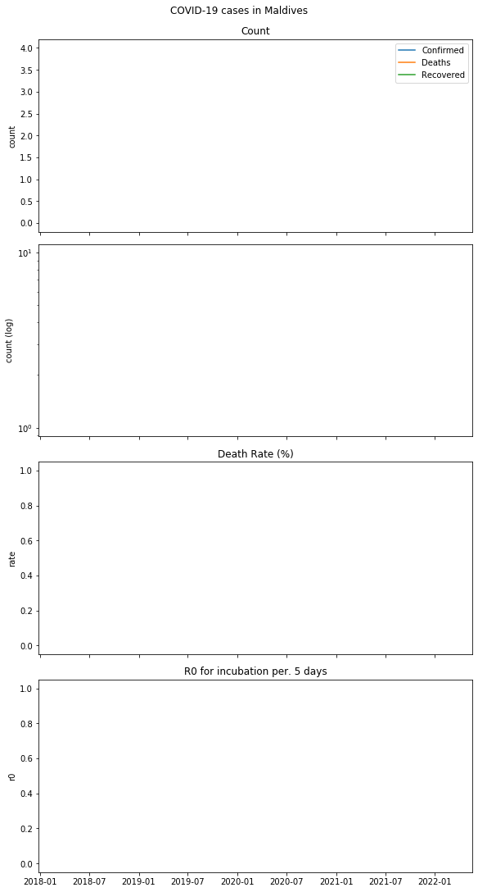


<p>Data extracted from <a href="https://github.com/CSSEGISandData/COVID-19">Johns Hopkins CSSE Data Repository</a></p>


<div>
<style scoped>
    .dataframe tbody tr th:only-of-type {
        vertical-align: middle;
    }

    .dataframe tbody tr th {
        vertical-align: top;
    }

    .dataframe thead th {
        text-align: right;
    }
</style>
<table border="1" class="dataframe">
  <thead>
    <tr style="text-align: right;">
      <th></th>
      <th>Last Update</th>
      <th>Country/Region</th>
      <th>Confirmed</th>
      <th>Deaths</th>
      <th>Recovered</th>
      <th>Death Rate (%)</th>
    </tr>
  </thead>
  <tbody>
    <tr>
      <td>974</td>
      <td>2020-03-08</td>
      <td>Maldives</td>
      <td>4.0</td>
      <td>0.0</td>
      <td>0.0</td>
      <td>NaN</td>
    </tr>
  </tbody>
</table>
</div>


<p>r0 calculated as (Confirmed cases at day N + incubation period = 5 days)/(confirmed cases at day N)</p>


<p>Note that this is just a very rough value determined by "garage epidemiology" and should not be used as reference</p>


<div>
<style scoped>
    .dataframe tbody tr th:only-of-type {
        vertical-align: middle;
    }

    .dataframe tbody tr th {
        vertical-align: top;
    }

    .dataframe thead th {
        text-align: right;
    }
</style>
<table border="1" class="dataframe">
  <thead>
    <tr style="text-align: right;">
      <th></th>
      <th>r0</th>
    </tr>
    <tr>
      <th>Last Update</th>
      <th></th>
    </tr>
  </thead>
  <tbody>
    <tr>
      <td>2020-03-08</td>
      <td>NaN</td>
    </tr>
  </tbody>
</table>
</div>


<h2><a name="malta" href="#malta">Malta</a></h2>


<p>Plot of COVID-19 cases.</p>


<p>Death rate calculated as (count of death)(count of death + count of recovered)</p>


<p>Data extracted from <a href="https://github.com/CSSEGISandData/COVID-19">Johns Hopkins CSSE Data Repository</a></p>


<div>
<style scoped>
    .dataframe tbody tr th:only-of-type {
        vertical-align: middle;
    }

    .dataframe tbody tr th {
        vertical-align: top;
    }

    .dataframe thead th {
        text-align: right;
    }
</style>
<table border="1" class="dataframe">
  <thead>
    <tr style="text-align: right;">
      <th></th>
      <th>Last Update</th>
      <th>Country/Region</th>
      <th>Confirmed</th>
      <th>Deaths</th>
      <th>Recovered</th>
      <th>Death Rate (%)</th>
    </tr>
  </thead>
  <tbody>
    <tr>
      <td>912</td>
      <td>2020-03-07</td>
      <td>Malta</td>
      <td>3.0</td>
      <td>0.0</td>
      <td>0.0</td>
      <td>NaN</td>
    </tr>
    <tr>
      <td>975</td>
      <td>2020-03-08</td>
      <td>Malta</td>
      <td>3.0</td>
      <td>0.0</td>
      <td>0.0</td>
      <td>NaN</td>
    </tr>
  </tbody>
</table>
</div>


<p>r0 calculated as (Confirmed cases at day N + incubation period = 5 days)/(confirmed cases at day N)</p>


<p>Note that this is just a very rough value determined by "garage epidemiology" and should not be used as reference</p>


<div>
<style scoped>
    .dataframe tbody tr th:only-of-type {
        vertical-align: middle;
    }

    .dataframe tbody tr th {
        vertical-align: top;
    }

    .dataframe thead th {
        text-align: right;
    }
</style>
<table border="1" class="dataframe">
  <thead>
    <tr style="text-align: right;">
      <th></th>
      <th>r0</th>
    </tr>
    <tr>
      <th>Last Update</th>
      <th></th>
    </tr>
  </thead>
  <tbody>
    <tr>
      <td>2020-03-07</td>
      <td>NaN</td>
    </tr>
    <tr>
      <td>2020-03-08</td>
      <td>NaN</td>
    </tr>
  </tbody>
</table>
</div>


<h2><a name="martinique" href="#martinique">Martinique</a></h2>


<p>Plot of COVID-19 cases.</p>


<p>Death rate calculated as (count of death)(count of death + count of recovered)</p>


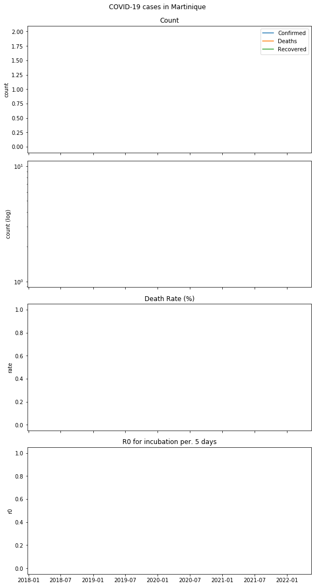


<p>Data extracted from <a href="https://github.com/CSSEGISandData/COVID-19">Johns Hopkins CSSE Data Repository</a></p>


<div>
<style scoped>
    .dataframe tbody tr th:only-of-type {
        vertical-align: middle;
    }

    .dataframe tbody tr th {
        vertical-align: top;
    }

    .dataframe thead th {
        text-align: right;
    }
</style>
<table border="1" class="dataframe">
  <thead>
    <tr style="text-align: right;">
      <th></th>
      <th>Last Update</th>
      <th>Country/Region</th>
      <th>Confirmed</th>
      <th>Deaths</th>
      <th>Recovered</th>
      <th>Death Rate (%)</th>
    </tr>
  </thead>
  <tbody>
    <tr>
      <td>913</td>
      <td>2020-03-07</td>
      <td>Martinique</td>
      <td>2.0</td>
      <td>0.0</td>
      <td>0.0</td>
      <td>NaN</td>
    </tr>
  </tbody>
</table>
</div>


<p>r0 calculated as (Confirmed cases at day N + incubation period = 5 days)/(confirmed cases at day N)</p>


<p>Note that this is just a very rough value determined by "garage epidemiology" and should not be used as reference</p>


<div>
<style scoped>
    .dataframe tbody tr th:only-of-type {
        vertical-align: middle;
    }

    .dataframe tbody tr th {
        vertical-align: top;
    }

    .dataframe thead th {
        text-align: right;
    }
</style>
<table border="1" class="dataframe">
  <thead>
    <tr style="text-align: right;">
      <th></th>
      <th>r0</th>
    </tr>
    <tr>
      <th>Last Update</th>
      <th></th>
    </tr>
  </thead>
  <tbody>
    <tr>
      <td>2020-03-07</td>
      <td>NaN</td>
    </tr>
  </tbody>
</table>
</div>


<h2><a name="mexico" href="#mexico">Mexico</a></h2>


<p>Plot of COVID-19 cases.</p>


<p>Death rate calculated as (count of death)(count of death + count of recovered)</p>


<p>Data extracted from <a href="https://github.com/CSSEGISandData/COVID-19">Johns Hopkins CSSE Data Repository</a></p>


<div>
<style scoped>
    .dataframe tbody tr th:only-of-type {
        vertical-align: middle;
    }

    .dataframe tbody tr th {
        vertical-align: top;
    }

    .dataframe thead th {
        text-align: right;
    }
</style>
<table border="1" class="dataframe">
  <thead>
    <tr style="text-align: right;">
      <th></th>
      <th>Last Update</th>
      <th>Country/Region</th>
      <th>Confirmed</th>
      <th>Deaths</th>
      <th>Recovered</th>
      <th>Death Rate (%)</th>
    </tr>
  </thead>
  <tbody>
    <tr>
      <td>16</td>
      <td>2020-01-23</td>
      <td>Mexico</td>
      <td>0.0</td>
      <td>0.0</td>
      <td>0.0</td>
      <td>NaN</td>
    </tr>
    <tr>
      <td>528</td>
      <td>2020-02-28</td>
      <td>Mexico</td>
      <td>1.0</td>
      <td>0.0</td>
      <td>0.0</td>
      <td>NaN</td>
    </tr>
    <tr>
      <td>565</td>
      <td>2020-02-29</td>
      <td>Mexico</td>
      <td>4.0</td>
      <td>0.0</td>
      <td>0.0</td>
      <td>NaN</td>
    </tr>
    <tr>
      <td>613</td>
      <td>2020-03-01</td>
      <td>Mexico</td>
      <td>5.0</td>
      <td>0.0</td>
      <td>0.0</td>
      <td>NaN</td>
    </tr>
    <tr>
      <td>695</td>
      <td>2020-03-03</td>
      <td>Mexico</td>
      <td>5.0</td>
      <td>0.0</td>
      <td>1.0</td>
      <td>0.0</td>
    </tr>
    <tr>
      <td>856</td>
      <td>2020-03-06</td>
      <td>Mexico</td>
      <td>6.0</td>
      <td>0.0</td>
      <td>1.0</td>
      <td>0.0</td>
    </tr>
    <tr>
      <td>976</td>
      <td>2020-03-08</td>
      <td>Mexico</td>
      <td>7.0</td>
      <td>0.0</td>
      <td>1.0</td>
      <td>0.0</td>
    </tr>
  </tbody>
</table>
</div>


<p>r0 calculated as (Confirmed cases at day N + incubation period = 5 days)/(confirmed cases at day N)</p>


<p>Note that this is just a very rough value determined by "garage epidemiology" and should not be used as reference</p>


<div>
<style scoped>
    .dataframe tbody tr th:only-of-type {
        vertical-align: middle;
    }

    .dataframe tbody tr th {
        vertical-align: top;
    }

    .dataframe thead th {
        text-align: right;
    }
</style>
<table border="1" class="dataframe">
  <thead>
    <tr style="text-align: right;">
      <th></th>
      <th>r0</th>
    </tr>
    <tr>
      <th>Last Update</th>
      <th></th>
    </tr>
  </thead>
  <tbody>
    <tr>
      <td>2020-01-23</td>
      <td>NaN</td>
    </tr>
    <tr>
      <td>2020-02-28</td>
      <td>NaN</td>
    </tr>
    <tr>
      <td>2020-02-29</td>
      <td>NaN</td>
    </tr>
    <tr>
      <td>2020-03-01</td>
      <td>NaN</td>
    </tr>
    <tr>
      <td>2020-03-03</td>
      <td>inf</td>
    </tr>
    <tr>
      <td>2020-03-06</td>
      <td>6.00</td>
    </tr>
    <tr>
      <td>2020-03-08</td>
      <td>1.75</td>
    </tr>
  </tbody>
</table>
</div>


<h2><a name="moldova" href="#moldova">Moldova</a></h2>


<p>Plot of COVID-19 cases.</p>


<p>Death rate calculated as (count of death)(count of death + count of recovered)</p>


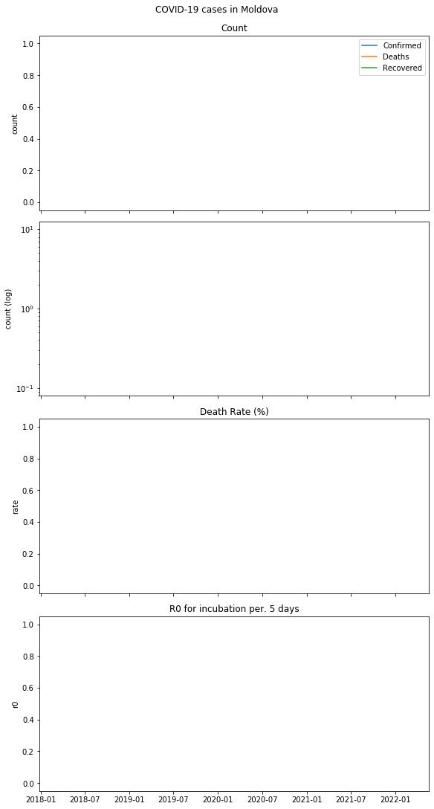


<p>Data extracted from <a href="https://github.com/CSSEGISandData/COVID-19">Johns Hopkins CSSE Data Repository</a></p>


<div>
<style scoped>
    .dataframe tbody tr th:only-of-type {
        vertical-align: middle;
    }

    .dataframe tbody tr th {
        vertical-align: top;
    }

    .dataframe thead th {
        text-align: right;
    }
</style>
<table border="1" class="dataframe">
  <thead>
    <tr style="text-align: right;">
      <th></th>
      <th>Last Update</th>
      <th>Country/Region</th>
      <th>Confirmed</th>
      <th>Deaths</th>
      <th>Recovered</th>
      <th>Death Rate (%)</th>
    </tr>
  </thead>
  <tbody>
    <tr>
      <td>977</td>
      <td>2020-03-08</td>
      <td>Moldova</td>
      <td>1.0</td>
      <td>0.0</td>
      <td>0.0</td>
      <td>NaN</td>
    </tr>
  </tbody>
</table>
</div>


<p>r0 calculated as (Confirmed cases at day N + incubation period = 5 days)/(confirmed cases at day N)</p>


<p>Note that this is just a very rough value determined by "garage epidemiology" and should not be used as reference</p>


<div>
<style scoped>
    .dataframe tbody tr th:only-of-type {
        vertical-align: middle;
    }

    .dataframe tbody tr th {
        vertical-align: top;
    }

    .dataframe thead th {
        text-align: right;
    }
</style>
<table border="1" class="dataframe">
  <thead>
    <tr style="text-align: right;">
      <th></th>
      <th>r0</th>
    </tr>
    <tr>
      <th>Last Update</th>
      <th></th>
    </tr>
  </thead>
  <tbody>
    <tr>
      <td>2020-03-08</td>
      <td>NaN</td>
    </tr>
  </tbody>
</table>
</div>


<h2><a name="monaco" href="#monaco">Monaco</a></h2>


<p>Plot of COVID-19 cases.</p>


<p>Death rate calculated as (count of death)(count of death + count of recovered)</p>


<p>Data extracted from <a href="https://github.com/CSSEGISandData/COVID-19">Johns Hopkins CSSE Data Repository</a></p>


<div>
<style scoped>
    .dataframe tbody tr th:only-of-type {
        vertical-align: middle;
    }

    .dataframe tbody tr th {
        vertical-align: top;
    }

    .dataframe thead th {
        text-align: right;
    }
</style>
<table border="1" class="dataframe">
  <thead>
    <tr style="text-align: right;">
      <th></th>
      <th>Last Update</th>
      <th>Country/Region</th>
      <th>Confirmed</th>
      <th>Deaths</th>
      <th>Recovered</th>
      <th>Death Rate (%)</th>
    </tr>
  </thead>
  <tbody>
    <tr>
      <td>566</td>
      <td>2020-02-29</td>
      <td>Monaco</td>
      <td>1.0</td>
      <td>0.0</td>
      <td>0.0</td>
      <td>NaN</td>
    </tr>
  </tbody>
</table>
</div>


<p>r0 calculated as (Confirmed cases at day N + incubation period = 5 days)/(confirmed cases at day N)</p>


<p>Note that this is just a very rough value determined by "garage epidemiology" and should not be used as reference</p>


<div>
<style scoped>
    .dataframe tbody tr th:only-of-type {
        vertical-align: middle;
    }

    .dataframe tbody tr th {
        vertical-align: top;
    }

    .dataframe thead th {
        text-align: right;
    }
</style>
<table border="1" class="dataframe">
  <thead>
    <tr style="text-align: right;">
      <th></th>
      <th>r0</th>
    </tr>
    <tr>
      <th>Last Update</th>
      <th></th>
    </tr>
  </thead>
  <tbody>
    <tr>
      <td>2020-02-29</td>
      <td>NaN</td>
    </tr>
  </tbody>
</table>
</div>


<h2><a name="morocco" href="#morocco">Morocco</a></h2>


<p>Plot of COVID-19 cases.</p>


<p>Death rate calculated as (count of death)(count of death + count of recovered)</p>


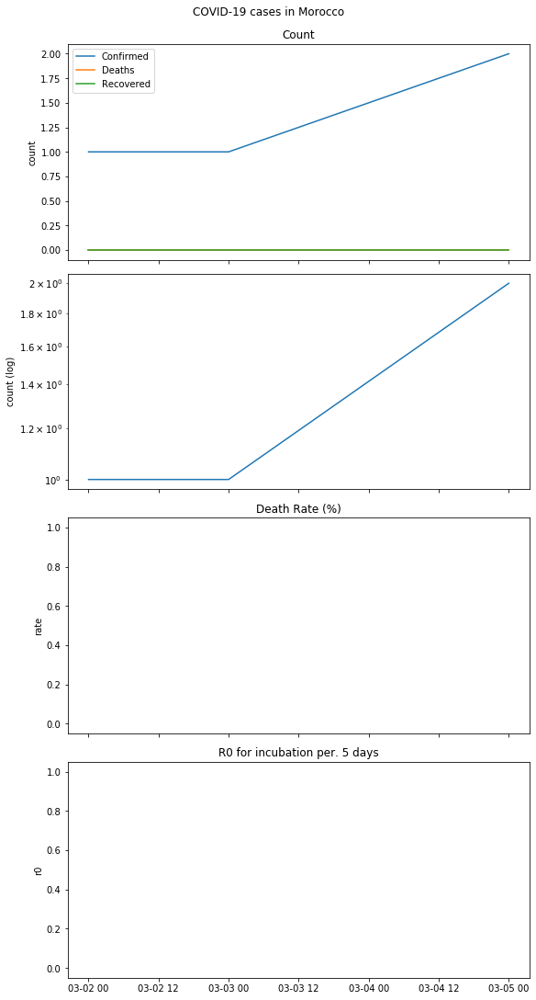


<p>Data extracted from <a href="https://github.com/CSSEGISandData/COVID-19">Johns Hopkins CSSE Data Repository</a></p>


<div>
<style scoped>
    .dataframe tbody tr th:only-of-type {
        vertical-align: middle;
    }

    .dataframe tbody tr th {
        vertical-align: top;
    }

    .dataframe thead th {
        text-align: right;
    }
</style>
<table border="1" class="dataframe">
  <thead>
    <tr style="text-align: right;">
      <th></th>
      <th>Last Update</th>
      <th>Country/Region</th>
      <th>Confirmed</th>
      <th>Deaths</th>
      <th>Recovered</th>
      <th>Death Rate (%)</th>
    </tr>
  </thead>
  <tbody>
    <tr>
      <td>650</td>
      <td>2020-03-02</td>
      <td>Morocco</td>
      <td>1.0</td>
      <td>0.0</td>
      <td>0.0</td>
      <td>NaN</td>
    </tr>
    <tr>
      <td>696</td>
      <td>2020-03-03</td>
      <td>Morocco</td>
      <td>1.0</td>
      <td>0.0</td>
      <td>0.0</td>
      <td>NaN</td>
    </tr>
    <tr>
      <td>797</td>
      <td>2020-03-05</td>
      <td>Morocco</td>
      <td>2.0</td>
      <td>0.0</td>
      <td>0.0</td>
      <td>NaN</td>
    </tr>
  </tbody>
</table>
</div>


<p>r0 calculated as (Confirmed cases at day N + incubation period = 5 days)/(confirmed cases at day N)</p>


<p>Note that this is just a very rough value determined by "garage epidemiology" and should not be used as reference</p>


<div>
<style scoped>
    .dataframe tbody tr th:only-of-type {
        vertical-align: middle;
    }

    .dataframe tbody tr th {
        vertical-align: top;
    }

    .dataframe thead th {
        text-align: right;
    }
</style>
<table border="1" class="dataframe">
  <thead>
    <tr style="text-align: right;">
      <th></th>
      <th>r0</th>
    </tr>
    <tr>
      <th>Last Update</th>
      <th></th>
    </tr>
  </thead>
  <tbody>
    <tr>
      <td>2020-03-02</td>
      <td>NaN</td>
    </tr>
    <tr>
      <td>2020-03-03</td>
      <td>NaN</td>
    </tr>
    <tr>
      <td>2020-03-05</td>
      <td>NaN</td>
    </tr>
  </tbody>
</table>
</div>


<h2><a name="nepal" href="#nepal">Nepal</a></h2>


<p>Plot of COVID-19 cases.</p>


<p>Death rate calculated as (count of death)(count of death + count of recovered)</p>


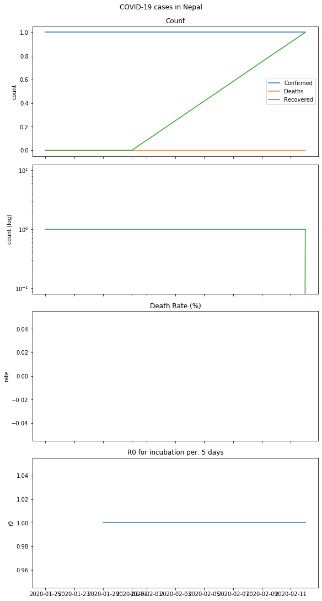


<p>Data extracted from <a href="https://github.com/CSSEGISandData/COVID-19">Johns Hopkins CSSE Data Repository</a></p>


<div>
<style scoped>
    .dataframe tbody tr th:only-of-type {
        vertical-align: middle;
    }

    .dataframe tbody tr th {
        vertical-align: top;
    }

    .dataframe thead th {
        text-align: right;
    }
</style>
<table border="1" class="dataframe">
  <thead>
    <tr style="text-align: right;">
      <th></th>
      <th>Last Update</th>
      <th>Country/Region</th>
      <th>Confirmed</th>
      <th>Deaths</th>
      <th>Recovered</th>
      <th>Death Rate (%)</th>
    </tr>
  </thead>
  <tbody>
    <tr>
      <td>42</td>
      <td>2020-01-25</td>
      <td>Nepal</td>
      <td>1.0</td>
      <td>0.0</td>
      <td>0.0</td>
      <td>NaN</td>
    </tr>
    <tr>
      <td>57</td>
      <td>2020-01-26</td>
      <td>Nepal</td>
      <td>1.0</td>
      <td>0.0</td>
      <td>0.0</td>
      <td>NaN</td>
    </tr>
    <tr>
      <td>74</td>
      <td>2020-01-27</td>
      <td>Nepal</td>
      <td>1.0</td>
      <td>0.0</td>
      <td>0.0</td>
      <td>NaN</td>
    </tr>
    <tr>
      <td>92</td>
      <td>2020-01-28</td>
      <td>Nepal</td>
      <td>1.0</td>
      <td>0.0</td>
      <td>0.0</td>
      <td>NaN</td>
    </tr>
    <tr>
      <td>111</td>
      <td>2020-01-29</td>
      <td>Nepal</td>
      <td>1.0</td>
      <td>0.0</td>
      <td>0.0</td>
      <td>NaN</td>
    </tr>
    <tr>
      <td>132</td>
      <td>2020-01-30</td>
      <td>Nepal</td>
      <td>1.0</td>
      <td>0.0</td>
      <td>0.0</td>
      <td>NaN</td>
    </tr>
    <tr>
      <td>155</td>
      <td>2020-01-31</td>
      <td>Nepal</td>
      <td>1.0</td>
      <td>0.0</td>
      <td>0.0</td>
      <td>NaN</td>
    </tr>
    <tr>
      <td>287</td>
      <td>2020-02-12</td>
      <td>Nepal</td>
      <td>1.0</td>
      <td>0.0</td>
      <td>1.0</td>
      <td>0.0</td>
    </tr>
  </tbody>
</table>
</div>


<p>r0 calculated as (Confirmed cases at day N + incubation period = 5 days)/(confirmed cases at day N)</p>


<p>Note that this is just a very rough value determined by "garage epidemiology" and should not be used as reference</p>


<div>
<style scoped>
    .dataframe tbody tr th:only-of-type {
        vertical-align: middle;
    }

    .dataframe tbody tr th {
        vertical-align: top;
    }

    .dataframe thead th {
        text-align: right;
    }
</style>
<table border="1" class="dataframe">
  <thead>
    <tr style="text-align: right;">
      <th></th>
      <th>r0</th>
    </tr>
    <tr>
      <th>Last Update</th>
      <th></th>
    </tr>
  </thead>
  <tbody>
    <tr>
      <td>2020-01-25</td>
      <td>NaN</td>
    </tr>
    <tr>
      <td>2020-01-26</td>
      <td>NaN</td>
    </tr>
    <tr>
      <td>2020-01-27</td>
      <td>NaN</td>
    </tr>
    <tr>
      <td>2020-01-28</td>
      <td>NaN</td>
    </tr>
    <tr>
      <td>2020-01-29</td>
      <td>1.0</td>
    </tr>
    <tr>
      <td>2020-01-30</td>
      <td>1.0</td>
    </tr>
    <tr>
      <td>2020-01-31</td>
      <td>1.0</td>
    </tr>
    <tr>
      <td>2020-02-12</td>
      <td>1.0</td>
    </tr>
  </tbody>
</table>
</div>


<h2><a name="netherlands" href="#netherlands">Netherlands</a></h2>


<p>Plot of COVID-19 cases.</p>


<p>Death rate calculated as (count of death)(count of death + count of recovered)</p>


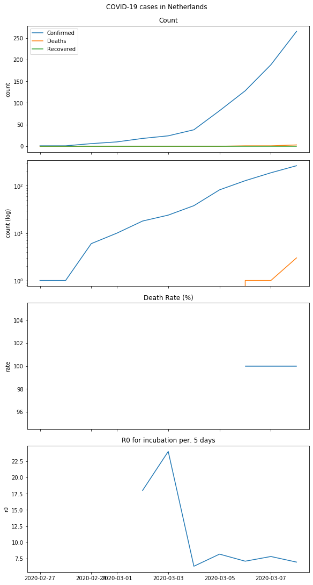


<p>Data extracted from <a href="https://github.com/CSSEGISandData/COVID-19">Johns Hopkins CSSE Data Repository</a></p>


<div>
<style scoped>
    .dataframe tbody tr th:only-of-type {
        vertical-align: middle;
    }

    .dataframe tbody tr th {
        vertical-align: top;
    }

    .dataframe thead th {
        text-align: right;
    }
</style>
<table border="1" class="dataframe">
  <thead>
    <tr style="text-align: right;">
      <th></th>
      <th>Last Update</th>
      <th>Country/Region</th>
      <th>Confirmed</th>
      <th>Deaths</th>
      <th>Recovered</th>
      <th>Death Rate (%)</th>
    </tr>
  </thead>
  <tbody>
    <tr>
      <td>499</td>
      <td>2020-02-27</td>
      <td>Netherlands</td>
      <td>1.0</td>
      <td>0.0</td>
      <td>0.0</td>
      <td>NaN</td>
    </tr>
    <tr>
      <td>529</td>
      <td>2020-02-28</td>
      <td>Netherlands</td>
      <td>1.0</td>
      <td>0.0</td>
      <td>0.0</td>
      <td>NaN</td>
    </tr>
    <tr>
      <td>567</td>
      <td>2020-02-29</td>
      <td>Netherlands</td>
      <td>6.0</td>
      <td>0.0</td>
      <td>0.0</td>
      <td>NaN</td>
    </tr>
    <tr>
      <td>614</td>
      <td>2020-03-01</td>
      <td>Netherlands</td>
      <td>10.0</td>
      <td>0.0</td>
      <td>0.0</td>
      <td>NaN</td>
    </tr>
    <tr>
      <td>651</td>
      <td>2020-03-02</td>
      <td>Netherlands</td>
      <td>18.0</td>
      <td>0.0</td>
      <td>0.0</td>
      <td>NaN</td>
    </tr>
    <tr>
      <td>697</td>
      <td>2020-03-03</td>
      <td>Netherlands</td>
      <td>24.0</td>
      <td>0.0</td>
      <td>0.0</td>
      <td>NaN</td>
    </tr>
    <tr>
      <td>751</td>
      <td>2020-03-04</td>
      <td>Netherlands</td>
      <td>38.0</td>
      <td>0.0</td>
      <td>0.0</td>
      <td>NaN</td>
    </tr>
    <tr>
      <td>798</td>
      <td>2020-03-05</td>
      <td>Netherlands</td>
      <td>82.0</td>
      <td>0.0</td>
      <td>0.0</td>
      <td>NaN</td>
    </tr>
    <tr>
      <td>857</td>
      <td>2020-03-06</td>
      <td>Netherlands</td>
      <td>128.0</td>
      <td>1.0</td>
      <td>0.0</td>
      <td>100.0</td>
    </tr>
    <tr>
      <td>914</td>
      <td>2020-03-07</td>
      <td>Netherlands</td>
      <td>188.0</td>
      <td>1.0</td>
      <td>0.0</td>
      <td>100.0</td>
    </tr>
    <tr>
      <td>978</td>
      <td>2020-03-08</td>
      <td>Netherlands</td>
      <td>265.0</td>
      <td>3.0</td>
      <td>0.0</td>
      <td>100.0</td>
    </tr>
  </tbody>
</table>
</div>


<p>r0 calculated as (Confirmed cases at day N + incubation period = 5 days)/(confirmed cases at day N)</p>


<p>Note that this is just a very rough value determined by "garage epidemiology" and should not be used as reference</p>


<div>
<style scoped>
    .dataframe tbody tr th:only-of-type {
        vertical-align: middle;
    }

    .dataframe tbody tr th {
        vertical-align: top;
    }

    .dataframe thead th {
        text-align: right;
    }
</style>
<table border="1" class="dataframe">
  <thead>
    <tr style="text-align: right;">
      <th></th>
      <th>r0</th>
    </tr>
    <tr>
      <th>Last Update</th>
      <th></th>
    </tr>
  </thead>
  <tbody>
    <tr>
      <td>2020-02-27</td>
      <td>NaN</td>
    </tr>
    <tr>
      <td>2020-02-28</td>
      <td>NaN</td>
    </tr>
    <tr>
      <td>2020-02-29</td>
      <td>NaN</td>
    </tr>
    <tr>
      <td>2020-03-01</td>
      <td>NaN</td>
    </tr>
    <tr>
      <td>2020-03-02</td>
      <td>18.000000</td>
    </tr>
    <tr>
      <td>2020-03-03</td>
      <td>24.000000</td>
    </tr>
    <tr>
      <td>2020-03-04</td>
      <td>6.333333</td>
    </tr>
    <tr>
      <td>2020-03-05</td>
      <td>8.200000</td>
    </tr>
    <tr>
      <td>2020-03-06</td>
      <td>7.111111</td>
    </tr>
    <tr>
      <td>2020-03-07</td>
      <td>7.833333</td>
    </tr>
    <tr>
      <td>2020-03-08</td>
      <td>6.973684</td>
    </tr>
  </tbody>
</table>
</div>


<h2><a name="new_zealand" href="#new_zealand">New Zealand</a></h2>


<p>Plot of COVID-19 cases.</p>


<p>Death rate calculated as (count of death)(count of death + count of recovered)</p>


<p>Data extracted from <a href="https://github.com/CSSEGISandData/COVID-19">Johns Hopkins CSSE Data Repository</a></p>


<div>
<style scoped>
    .dataframe tbody tr th:only-of-type {
        vertical-align: middle;
    }

    .dataframe tbody tr th {
        vertical-align: top;
    }

    .dataframe thead th {
        text-align: right;
    }
</style>
<table border="1" class="dataframe">
  <thead>
    <tr style="text-align: right;">
      <th></th>
      <th>Last Update</th>
      <th>Country/Region</th>
      <th>Confirmed</th>
      <th>Deaths</th>
      <th>Recovered</th>
      <th>Death Rate (%)</th>
    </tr>
  </thead>
  <tbody>
    <tr>
      <td>530</td>
      <td>2020-02-28</td>
      <td>New Zealand</td>
      <td>1.0</td>
      <td>0.0</td>
      <td>0.0</td>
      <td>NaN</td>
    </tr>
    <tr>
      <td>752</td>
      <td>2020-03-04</td>
      <td>New Zealand</td>
      <td>3.0</td>
      <td>0.0</td>
      <td>0.0</td>
      <td>NaN</td>
    </tr>
    <tr>
      <td>858</td>
      <td>2020-03-06</td>
      <td>New Zealand</td>
      <td>4.0</td>
      <td>0.0</td>
      <td>0.0</td>
      <td>NaN</td>
    </tr>
    <tr>
      <td>915</td>
      <td>2020-03-07</td>
      <td>New Zealand</td>
      <td>5.0</td>
      <td>0.0</td>
      <td>0.0</td>
      <td>NaN</td>
    </tr>
  </tbody>
</table>
</div>


<p>r0 calculated as (Confirmed cases at day N + incubation period = 5 days)/(confirmed cases at day N)</p>


<p>Note that this is just a very rough value determined by "garage epidemiology" and should not be used as reference</p>


<div>
<style scoped>
    .dataframe tbody tr th:only-of-type {
        vertical-align: middle;
    }

    .dataframe tbody tr th {
        vertical-align: top;
    }

    .dataframe thead th {
        text-align: right;
    }
</style>
<table border="1" class="dataframe">
  <thead>
    <tr style="text-align: right;">
      <th></th>
      <th>r0</th>
    </tr>
    <tr>
      <th>Last Update</th>
      <th></th>
    </tr>
  </thead>
  <tbody>
    <tr>
      <td>2020-02-28</td>
      <td>NaN</td>
    </tr>
    <tr>
      <td>2020-03-04</td>
      <td>NaN</td>
    </tr>
    <tr>
      <td>2020-03-06</td>
      <td>NaN</td>
    </tr>
    <tr>
      <td>2020-03-07</td>
      <td>NaN</td>
    </tr>
  </tbody>
</table>
</div>


<h2><a name="nigeria" href="#nigeria">Nigeria</a></h2>


<p>Plot of COVID-19 cases.</p>


<p>Death rate calculated as (count of death)(count of death + count of recovered)</p>


<p>Data extracted from <a href="https://github.com/CSSEGISandData/COVID-19">Johns Hopkins CSSE Data Repository</a></p>


<div>
<style scoped>
    .dataframe tbody tr th:only-of-type {
        vertical-align: middle;
    }

    .dataframe tbody tr th {
        vertical-align: top;
    }

    .dataframe thead th {
        text-align: right;
    }
</style>
<table border="1" class="dataframe">
  <thead>
    <tr style="text-align: right;">
      <th></th>
      <th>Last Update</th>
      <th>Country/Region</th>
      <th>Confirmed</th>
      <th>Deaths</th>
      <th>Recovered</th>
      <th>Death Rate (%)</th>
    </tr>
  </thead>
  <tbody>
    <tr>
      <td>531</td>
      <td>2020-02-28</td>
      <td>Nigeria</td>
      <td>1.0</td>
      <td>0.0</td>
      <td>0.0</td>
      <td>NaN</td>
    </tr>
  </tbody>
</table>
</div>


<p>r0 calculated as (Confirmed cases at day N + incubation period = 5 days)/(confirmed cases at day N)</p>


<p>Note that this is just a very rough value determined by "garage epidemiology" and should not be used as reference</p>


<div>
<style scoped>
    .dataframe tbody tr th:only-of-type {
        vertical-align: middle;
    }

    .dataframe tbody tr th {
        vertical-align: top;
    }

    .dataframe thead th {
        text-align: right;
    }
</style>
<table border="1" class="dataframe">
  <thead>
    <tr style="text-align: right;">
      <th></th>
      <th>r0</th>
    </tr>
    <tr>
      <th>Last Update</th>
      <th></th>
    </tr>
  </thead>
  <tbody>
    <tr>
      <td>2020-02-28</td>
      <td>NaN</td>
    </tr>
  </tbody>
</table>
</div>


<h2><a name="north_ireland" href="#north_ireland">North Ireland</a></h2>


<p>Plot of COVID-19 cases.</p>


<p>Death rate calculated as (count of death)(count of death + count of recovered)</p>


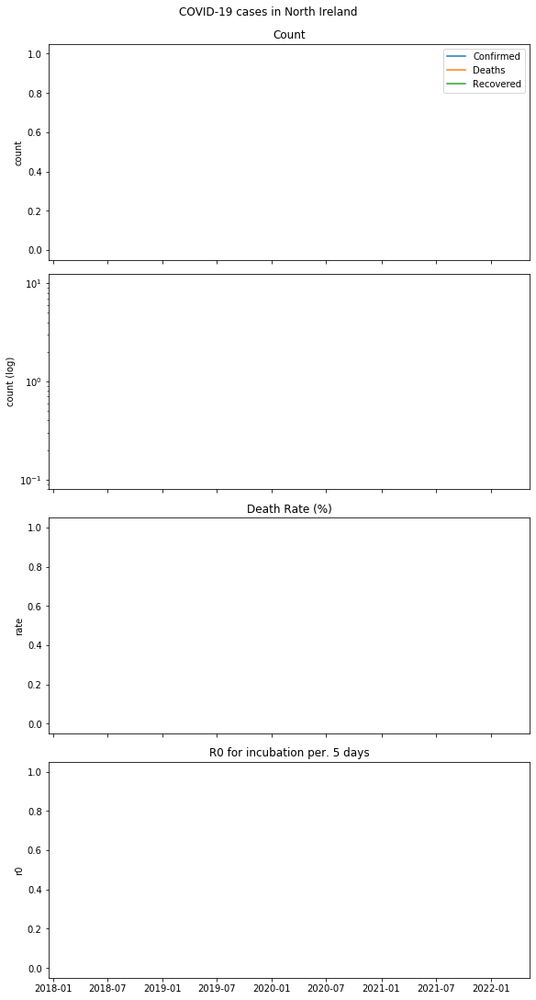


<p>Data extracted from <a href="https://github.com/CSSEGISandData/COVID-19">Johns Hopkins CSSE Data Repository</a></p>


<div>
<style scoped>
    .dataframe tbody tr th:only-of-type {
        vertical-align: middle;
    }

    .dataframe tbody tr th {
        vertical-align: top;
    }

    .dataframe thead th {
        text-align: right;
    }
</style>
<table border="1" class="dataframe">
  <thead>
    <tr style="text-align: right;">
      <th></th>
      <th>Last Update</th>
      <th>Country/Region</th>
      <th>Confirmed</th>
      <th>Deaths</th>
      <th>Recovered</th>
      <th>Death Rate (%)</th>
    </tr>
  </thead>
  <tbody>
    <tr>
      <td>532</td>
      <td>2020-02-28</td>
      <td>North Ireland</td>
      <td>1.0</td>
      <td>0.0</td>
      <td>0.0</td>
      <td>NaN</td>
    </tr>
  </tbody>
</table>
</div>


<p>r0 calculated as (Confirmed cases at day N + incubation period = 5 days)/(confirmed cases at day N)</p>


<p>Note that this is just a very rough value determined by "garage epidemiology" and should not be used as reference</p>


<div>
<style scoped>
    .dataframe tbody tr th:only-of-type {
        vertical-align: middle;
    }

    .dataframe tbody tr th {
        vertical-align: top;
    }

    .dataframe thead th {
        text-align: right;
    }
</style>
<table border="1" class="dataframe">
  <thead>
    <tr style="text-align: right;">
      <th></th>
      <th>r0</th>
    </tr>
    <tr>
      <th>Last Update</th>
      <th></th>
    </tr>
  </thead>
  <tbody>
    <tr>
      <td>2020-02-28</td>
      <td>NaN</td>
    </tr>
  </tbody>
</table>
</div>


<h2><a name="north_macedonia" href="#north_macedonia">North Macedonia</a></h2>


<p>Plot of COVID-19 cases.</p>


<p>Death rate calculated as (count of death)(count of death + count of recovered)</p>


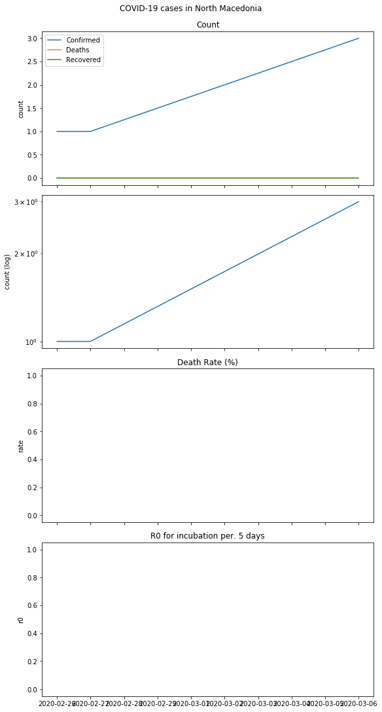


<p>Data extracted from <a href="https://github.com/CSSEGISandData/COVID-19">Johns Hopkins CSSE Data Repository</a></p>


<div>
<style scoped>
    .dataframe tbody tr th:only-of-type {
        vertical-align: middle;
    }

    .dataframe tbody tr th {
        vertical-align: top;
    }

    .dataframe thead th {
        text-align: right;
    }
</style>
<table border="1" class="dataframe">
  <thead>
    <tr style="text-align: right;">
      <th></th>
      <th>Last Update</th>
      <th>Country/Region</th>
      <th>Confirmed</th>
      <th>Deaths</th>
      <th>Recovered</th>
      <th>Death Rate (%)</th>
    </tr>
  </thead>
  <tbody>
    <tr>
      <td>467</td>
      <td>2020-02-26</td>
      <td>North Macedonia</td>
      <td>1.0</td>
      <td>0.0</td>
      <td>0.0</td>
      <td>NaN</td>
    </tr>
    <tr>
      <td>500</td>
      <td>2020-02-27</td>
      <td>North Macedonia</td>
      <td>1.0</td>
      <td>0.0</td>
      <td>0.0</td>
      <td>NaN</td>
    </tr>
    <tr>
      <td>859</td>
      <td>2020-03-06</td>
      <td>North Macedonia</td>
      <td>3.0</td>
      <td>0.0</td>
      <td>0.0</td>
      <td>NaN</td>
    </tr>
  </tbody>
</table>
</div>


<p>r0 calculated as (Confirmed cases at day N + incubation period = 5 days)/(confirmed cases at day N)</p>


<p>Note that this is just a very rough value determined by "garage epidemiology" and should not be used as reference</p>


<div>
<style scoped>
    .dataframe tbody tr th:only-of-type {
        vertical-align: middle;
    }

    .dataframe tbody tr th {
        vertical-align: top;
    }

    .dataframe thead th {
        text-align: right;
    }
</style>
<table border="1" class="dataframe">
  <thead>
    <tr style="text-align: right;">
      <th></th>
      <th>r0</th>
    </tr>
    <tr>
      <th>Last Update</th>
      <th></th>
    </tr>
  </thead>
  <tbody>
    <tr>
      <td>2020-02-26</td>
      <td>NaN</td>
    </tr>
    <tr>
      <td>2020-02-27</td>
      <td>NaN</td>
    </tr>
    <tr>
      <td>2020-03-06</td>
      <td>NaN</td>
    </tr>
  </tbody>
</table>
</div>


<h2><a name="norway" href="#norway">Norway</a></h2>


<p>Plot of COVID-19 cases.</p>


<p>Death rate calculated as (count of death)(count of death + count of recovered)</p>


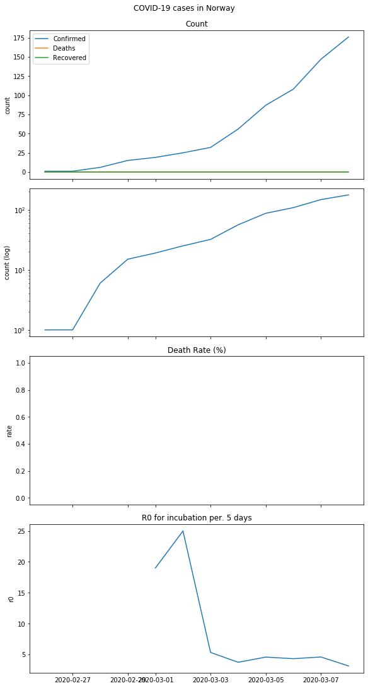


<p>Data extracted from <a href="https://github.com/CSSEGISandData/COVID-19">Johns Hopkins CSSE Data Repository</a></p>


<div>
<style scoped>
    .dataframe tbody tr th:only-of-type {
        vertical-align: middle;
    }

    .dataframe tbody tr th {
        vertical-align: top;
    }

    .dataframe thead th {
        text-align: right;
    }
</style>
<table border="1" class="dataframe">
  <thead>
    <tr style="text-align: right;">
      <th></th>
      <th>Last Update</th>
      <th>Country/Region</th>
      <th>Confirmed</th>
      <th>Deaths</th>
      <th>Recovered</th>
      <th>Death Rate (%)</th>
    </tr>
  </thead>
  <tbody>
    <tr>
      <td>468</td>
      <td>2020-02-26</td>
      <td>Norway</td>
      <td>1.0</td>
      <td>0.0</td>
      <td>0.0</td>
      <td>NaN</td>
    </tr>
    <tr>
      <td>501</td>
      <td>2020-02-27</td>
      <td>Norway</td>
      <td>1.0</td>
      <td>0.0</td>
      <td>0.0</td>
      <td>NaN</td>
    </tr>
    <tr>
      <td>533</td>
      <td>2020-02-28</td>
      <td>Norway</td>
      <td>6.0</td>
      <td>0.0</td>
      <td>0.0</td>
      <td>NaN</td>
    </tr>
    <tr>
      <td>568</td>
      <td>2020-02-29</td>
      <td>Norway</td>
      <td>15.0</td>
      <td>0.0</td>
      <td>0.0</td>
      <td>NaN</td>
    </tr>
    <tr>
      <td>615</td>
      <td>2020-03-01</td>
      <td>Norway</td>
      <td>19.0</td>
      <td>0.0</td>
      <td>0.0</td>
      <td>NaN</td>
    </tr>
    <tr>
      <td>652</td>
      <td>2020-03-02</td>
      <td>Norway</td>
      <td>25.0</td>
      <td>0.0</td>
      <td>0.0</td>
      <td>NaN</td>
    </tr>
    <tr>
      <td>698</td>
      <td>2020-03-03</td>
      <td>Norway</td>
      <td>32.0</td>
      <td>0.0</td>
      <td>0.0</td>
      <td>NaN</td>
    </tr>
    <tr>
      <td>753</td>
      <td>2020-03-04</td>
      <td>Norway</td>
      <td>56.0</td>
      <td>0.0</td>
      <td>0.0</td>
      <td>NaN</td>
    </tr>
    <tr>
      <td>799</td>
      <td>2020-03-05</td>
      <td>Norway</td>
      <td>87.0</td>
      <td>0.0</td>
      <td>0.0</td>
      <td>NaN</td>
    </tr>
    <tr>
      <td>860</td>
      <td>2020-03-06</td>
      <td>Norway</td>
      <td>108.0</td>
      <td>0.0</td>
      <td>0.0</td>
      <td>NaN</td>
    </tr>
    <tr>
      <td>916</td>
      <td>2020-03-07</td>
      <td>Norway</td>
      <td>147.0</td>
      <td>0.0</td>
      <td>0.0</td>
      <td>NaN</td>
    </tr>
    <tr>
      <td>979</td>
      <td>2020-03-08</td>
      <td>Norway</td>
      <td>176.0</td>
      <td>0.0</td>
      <td>0.0</td>
      <td>NaN</td>
    </tr>
  </tbody>
</table>
</div>


<p>r0 calculated as (Confirmed cases at day N + incubation period = 5 days)/(confirmed cases at day N)</p>


<p>Note that this is just a very rough value determined by "garage epidemiology" and should not be used as reference</p>


<div>
<style scoped>
    .dataframe tbody tr th:only-of-type {
        vertical-align: middle;
    }

    .dataframe tbody tr th {
        vertical-align: top;
    }

    .dataframe thead th {
        text-align: right;
    }
</style>
<table border="1" class="dataframe">
  <thead>
    <tr style="text-align: right;">
      <th></th>
      <th>r0</th>
    </tr>
    <tr>
      <th>Last Update</th>
      <th></th>
    </tr>
  </thead>
  <tbody>
    <tr>
      <td>2020-02-26</td>
      <td>NaN</td>
    </tr>
    <tr>
      <td>2020-02-27</td>
      <td>NaN</td>
    </tr>
    <tr>
      <td>2020-02-28</td>
      <td>NaN</td>
    </tr>
    <tr>
      <td>2020-02-29</td>
      <td>NaN</td>
    </tr>
    <tr>
      <td>2020-03-01</td>
      <td>19.000000</td>
    </tr>
    <tr>
      <td>2020-03-02</td>
      <td>25.000000</td>
    </tr>
    <tr>
      <td>2020-03-03</td>
      <td>5.333333</td>
    </tr>
    <tr>
      <td>2020-03-04</td>
      <td>3.733333</td>
    </tr>
    <tr>
      <td>2020-03-05</td>
      <td>4.578947</td>
    </tr>
    <tr>
      <td>2020-03-06</td>
      <td>4.320000</td>
    </tr>
    <tr>
      <td>2020-03-07</td>
      <td>4.593750</td>
    </tr>
    <tr>
      <td>2020-03-08</td>
      <td>3.142857</td>
    </tr>
  </tbody>
</table>
</div>


<h2><a name="oman" href="#oman">Oman</a></h2>


<p>Plot of COVID-19 cases.</p>


<p>Death rate calculated as (count of death)(count of death + count of recovered)</p>


<p>Data extracted from <a href="https://github.com/CSSEGISandData/COVID-19">Johns Hopkins CSSE Data Repository</a></p>


<div>
<style scoped>
    .dataframe tbody tr th:only-of-type {
        vertical-align: middle;
    }

    .dataframe tbody tr th {
        vertical-align: top;
    }

    .dataframe thead th {
        text-align: right;
    }
</style>
<table border="1" class="dataframe">
  <thead>
    <tr style="text-align: right;">
      <th></th>
      <th>Last Update</th>
      <th>Country/Region</th>
      <th>Confirmed</th>
      <th>Deaths</th>
      <th>Recovered</th>
      <th>Death Rate (%)</th>
    </tr>
  </thead>
  <tbody>
    <tr>
      <td>421</td>
      <td>2020-02-24</td>
      <td>Oman</td>
      <td>2.0</td>
      <td>0.0</td>
      <td>0.0</td>
      <td>NaN</td>
    </tr>
    <tr>
      <td>440</td>
      <td>2020-02-25</td>
      <td>Oman</td>
      <td>2.0</td>
      <td>0.0</td>
      <td>0.0</td>
      <td>NaN</td>
    </tr>
    <tr>
      <td>469</td>
      <td>2020-02-26</td>
      <td>Oman</td>
      <td>4.0</td>
      <td>0.0</td>
      <td>0.0</td>
      <td>NaN</td>
    </tr>
    <tr>
      <td>569</td>
      <td>2020-02-29</td>
      <td>Oman</td>
      <td>6.0</td>
      <td>0.0</td>
      <td>1.0</td>
      <td>0.0</td>
    </tr>
    <tr>
      <td>699</td>
      <td>2020-03-03</td>
      <td>Oman</td>
      <td>12.0</td>
      <td>0.0</td>
      <td>2.0</td>
      <td>0.0</td>
    </tr>
    <tr>
      <td>754</td>
      <td>2020-03-04</td>
      <td>Oman</td>
      <td>15.0</td>
      <td>0.0</td>
      <td>2.0</td>
      <td>0.0</td>
    </tr>
    <tr>
      <td>800</td>
      <td>2020-03-05</td>
      <td>Oman</td>
      <td>16.0</td>
      <td>0.0</td>
      <td>2.0</td>
      <td>0.0</td>
    </tr>
  </tbody>
</table>
</div>


<p>r0 calculated as (Confirmed cases at day N + incubation period = 5 days)/(confirmed cases at day N)</p>


<p>Note that this is just a very rough value determined by "garage epidemiology" and should not be used as reference</p>


<div>
<style scoped>
    .dataframe tbody tr th:only-of-type {
        vertical-align: middle;
    }

    .dataframe tbody tr th {
        vertical-align: top;
    }

    .dataframe thead th {
        text-align: right;
    }
</style>
<table border="1" class="dataframe">
  <thead>
    <tr style="text-align: right;">
      <th></th>
      <th>r0</th>
    </tr>
    <tr>
      <th>Last Update</th>
      <th></th>
    </tr>
  </thead>
  <tbody>
    <tr>
      <td>2020-02-24</td>
      <td>NaN</td>
    </tr>
    <tr>
      <td>2020-02-25</td>
      <td>NaN</td>
    </tr>
    <tr>
      <td>2020-02-26</td>
      <td>NaN</td>
    </tr>
    <tr>
      <td>2020-02-29</td>
      <td>NaN</td>
    </tr>
    <tr>
      <td>2020-03-03</td>
      <td>6.0</td>
    </tr>
    <tr>
      <td>2020-03-04</td>
      <td>7.5</td>
    </tr>
    <tr>
      <td>2020-03-05</td>
      <td>4.0</td>
    </tr>
  </tbody>
</table>
</div>


<h2><a name="others" href="#others">Others</a></h2>


<p>Plot of COVID-19 cases.</p>


<p>Death rate calculated as (count of death)(count of death + count of recovered)</p>


<p>Data extracted from <a href="https://github.com/CSSEGISandData/COVID-19">Johns Hopkins CSSE Data Repository</a></p>


<div>
<style scoped>
    .dataframe tbody tr th:only-of-type {
        vertical-align: middle;
    }

    .dataframe tbody tr th {
        vertical-align: top;
    }

    .dataframe thead th {
        text-align: right;
    }
</style>
<table border="1" class="dataframe">
  <thead>
    <tr style="text-align: right;">
      <th></th>
      <th>Last Update</th>
      <th>Country/Region</th>
      <th>Confirmed</th>
      <th>Deaths</th>
      <th>Recovered</th>
      <th>Death Rate (%)</th>
    </tr>
  </thead>
  <tbody>
    <tr>
      <td>233</td>
      <td>2020-02-07</td>
      <td>Others</td>
      <td>61.0</td>
      <td>0.0</td>
      <td>0.0</td>
      <td>NaN</td>
    </tr>
    <tr>
      <td>253</td>
      <td>2020-02-09</td>
      <td>Others</td>
      <td>64.0</td>
      <td>0.0</td>
      <td>0.0</td>
      <td>NaN</td>
    </tr>
    <tr>
      <td>263</td>
      <td>2020-02-10</td>
      <td>Others</td>
      <td>135.0</td>
      <td>0.0</td>
      <td>0.0</td>
      <td>NaN</td>
    </tr>
    <tr>
      <td>288</td>
      <td>2020-02-12</td>
      <td>Others</td>
      <td>175.0</td>
      <td>0.0</td>
      <td>0.0</td>
      <td>NaN</td>
    </tr>
    <tr>
      <td>311</td>
      <td>2020-02-14</td>
      <td>Others</td>
      <td>218.0</td>
      <td>0.0</td>
      <td>0.0</td>
      <td>NaN</td>
    </tr>
    <tr>
      <td>318</td>
      <td>2020-02-15</td>
      <td>Others</td>
      <td>285.0</td>
      <td>0.0</td>
      <td>0.0</td>
      <td>NaN</td>
    </tr>
    <tr>
      <td>329</td>
      <td>2020-02-16</td>
      <td>Others</td>
      <td>355.0</td>
      <td>0.0</td>
      <td>0.0</td>
      <td>NaN</td>
    </tr>
    <tr>
      <td>342</td>
      <td>2020-02-17</td>
      <td>Others</td>
      <td>454.0</td>
      <td>0.0</td>
      <td>0.0</td>
      <td>NaN</td>
    </tr>
    <tr>
      <td>352</td>
      <td>2020-02-18</td>
      <td>Others</td>
      <td>542.0</td>
      <td>0.0</td>
      <td>0.0</td>
      <td>NaN</td>
    </tr>
    <tr>
      <td>360</td>
      <td>2020-02-19</td>
      <td>Others</td>
      <td>621.0</td>
      <td>0.0</td>
      <td>1.0</td>
      <td>0.000000</td>
    </tr>
    <tr>
      <td>368</td>
      <td>2020-02-20</td>
      <td>Others</td>
      <td>634.0</td>
      <td>2.0</td>
      <td>1.0</td>
      <td>66.666667</td>
    </tr>
    <tr>
      <td>405</td>
      <td>2020-02-23</td>
      <td>Others</td>
      <td>691.0</td>
      <td>3.0</td>
      <td>0.0</td>
      <td>100.000000</td>
    </tr>
    <tr>
      <td>470</td>
      <td>2020-02-26</td>
      <td>Others</td>
      <td>705.0</td>
      <td>4.0</td>
      <td>10.0</td>
      <td>28.571429</td>
    </tr>
    <tr>
      <td>534</td>
      <td>2020-02-28</td>
      <td>Others</td>
      <td>705.0</td>
      <td>6.0</td>
      <td>10.0</td>
      <td>37.500000</td>
    </tr>
    <tr>
      <td>570</td>
      <td>2020-02-29</td>
      <td>Others</td>
      <td>705.0</td>
      <td>6.0</td>
      <td>10.0</td>
      <td>37.500000</td>
    </tr>
    <tr>
      <td>653</td>
      <td>2020-03-02</td>
      <td>Others</td>
      <td>705.0</td>
      <td>6.0</td>
      <td>10.0</td>
      <td>37.500000</td>
    </tr>
    <tr>
      <td>700</td>
      <td>2020-03-03</td>
      <td>Others</td>
      <td>706.0</td>
      <td>6.0</td>
      <td>10.0</td>
      <td>37.500000</td>
    </tr>
    <tr>
      <td>861</td>
      <td>2020-03-06</td>
      <td>Others</td>
      <td>696.0</td>
      <td>6.0</td>
      <td>40.0</td>
      <td>13.043478</td>
    </tr>
  </tbody>
</table>
</div>


<p>r0 calculated as (Confirmed cases at day N + incubation period = 5 days)/(confirmed cases at day N)</p>


<p>Note that this is just a very rough value determined by "garage epidemiology" and should not be used as reference</p>


<div>
<style scoped>
    .dataframe tbody tr th:only-of-type {
        vertical-align: middle;
    }

    .dataframe tbody tr th {
        vertical-align: top;
    }

    .dataframe thead th {
        text-align: right;
    }
</style>
<table border="1" class="dataframe">
  <thead>
    <tr style="text-align: right;">
      <th></th>
      <th>r0</th>
    </tr>
    <tr>
      <th>Last Update</th>
      <th></th>
    </tr>
  </thead>
  <tbody>
    <tr>
      <td>2020-02-07</td>
      <td>NaN</td>
    </tr>
    <tr>
      <td>2020-02-09</td>
      <td>NaN</td>
    </tr>
    <tr>
      <td>2020-02-10</td>
      <td>NaN</td>
    </tr>
    <tr>
      <td>2020-02-12</td>
      <td>NaN</td>
    </tr>
    <tr>
      <td>2020-02-14</td>
      <td>3.573770</td>
    </tr>
    <tr>
      <td>2020-02-15</td>
      <td>4.453125</td>
    </tr>
    <tr>
      <td>2020-02-16</td>
      <td>2.629630</td>
    </tr>
    <tr>
      <td>2020-02-17</td>
      <td>2.594286</td>
    </tr>
    <tr>
      <td>2020-02-18</td>
      <td>2.486239</td>
    </tr>
    <tr>
      <td>2020-02-19</td>
      <td>2.178947</td>
    </tr>
    <tr>
      <td>2020-02-20</td>
      <td>1.785915</td>
    </tr>
    <tr>
      <td>2020-02-23</td>
      <td>1.522026</td>
    </tr>
    <tr>
      <td>2020-02-26</td>
      <td>1.300738</td>
    </tr>
    <tr>
      <td>2020-02-28</td>
      <td>1.135266</td>
    </tr>
    <tr>
      <td>2020-02-29</td>
      <td>1.111987</td>
    </tr>
    <tr>
      <td>2020-03-02</td>
      <td>1.020260</td>
    </tr>
    <tr>
      <td>2020-03-03</td>
      <td>1.001418</td>
    </tr>
    <tr>
      <td>2020-03-06</td>
      <td>0.987234</td>
    </tr>
  </tbody>
</table>
</div>


<h2><a name="pakistan" href="#pakistan">Pakistan</a></h2>


<p>Plot of COVID-19 cases.</p>


<p>Death rate calculated as (count of death)(count of death + count of recovered)</p>


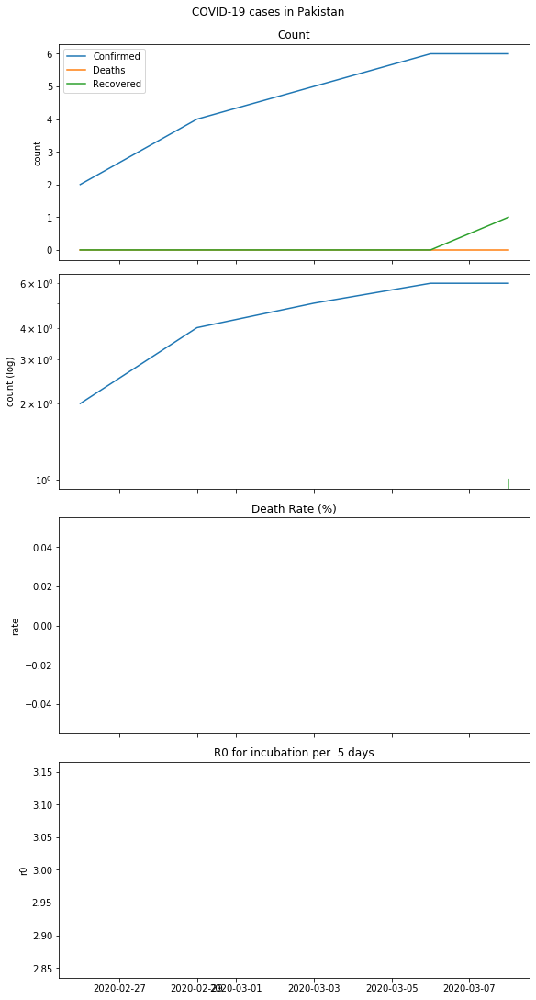


<p>Data extracted from <a href="https://github.com/CSSEGISandData/COVID-19">Johns Hopkins CSSE Data Repository</a></p>


<div>
<style scoped>
    .dataframe tbody tr th:only-of-type {
        vertical-align: middle;
    }

    .dataframe tbody tr th {
        vertical-align: top;
    }

    .dataframe thead th {
        text-align: right;
    }
</style>
<table border="1" class="dataframe">
  <thead>
    <tr style="text-align: right;">
      <th></th>
      <th>Last Update</th>
      <th>Country/Region</th>
      <th>Confirmed</th>
      <th>Deaths</th>
      <th>Recovered</th>
      <th>Death Rate (%)</th>
    </tr>
  </thead>
  <tbody>
    <tr>
      <td>471</td>
      <td>2020-02-26</td>
      <td>Pakistan</td>
      <td>2.0</td>
      <td>0.0</td>
      <td>0.0</td>
      <td>NaN</td>
    </tr>
    <tr>
      <td>571</td>
      <td>2020-02-29</td>
      <td>Pakistan</td>
      <td>4.0</td>
      <td>0.0</td>
      <td>0.0</td>
      <td>NaN</td>
    </tr>
    <tr>
      <td>701</td>
      <td>2020-03-03</td>
      <td>Pakistan</td>
      <td>5.0</td>
      <td>0.0</td>
      <td>0.0</td>
      <td>NaN</td>
    </tr>
    <tr>
      <td>862</td>
      <td>2020-03-06</td>
      <td>Pakistan</td>
      <td>6.0</td>
      <td>0.0</td>
      <td>0.0</td>
      <td>NaN</td>
    </tr>
    <tr>
      <td>980</td>
      <td>2020-03-08</td>
      <td>Pakistan</td>
      <td>6.0</td>
      <td>0.0</td>
      <td>1.0</td>
      <td>0.0</td>
    </tr>
  </tbody>
</table>
</div>


<p>r0 calculated as (Confirmed cases at day N + incubation period = 5 days)/(confirmed cases at day N)</p>


<p>Note that this is just a very rough value determined by "garage epidemiology" and should not be used as reference</p>


<div>
<style scoped>
    .dataframe tbody tr th:only-of-type {
        vertical-align: middle;
    }

    .dataframe tbody tr th {
        vertical-align: top;
    }

    .dataframe thead th {
        text-align: right;
    }
</style>
<table border="1" class="dataframe">
  <thead>
    <tr style="text-align: right;">
      <th></th>
      <th>r0</th>
    </tr>
    <tr>
      <th>Last Update</th>
      <th></th>
    </tr>
  </thead>
  <tbody>
    <tr>
      <td>2020-02-26</td>
      <td>NaN</td>
    </tr>
    <tr>
      <td>2020-02-29</td>
      <td>NaN</td>
    </tr>
    <tr>
      <td>2020-03-03</td>
      <td>NaN</td>
    </tr>
    <tr>
      <td>2020-03-06</td>
      <td>NaN</td>
    </tr>
    <tr>
      <td>2020-03-08</td>
      <td>3.0</td>
    </tr>
  </tbody>
</table>
</div>


<h2><a name="palestine" href="#palestine">Palestine</a></h2>


<p>Plot of COVID-19 cases.</p>


<p>Death rate calculated as (count of death)(count of death + count of recovered)</p>


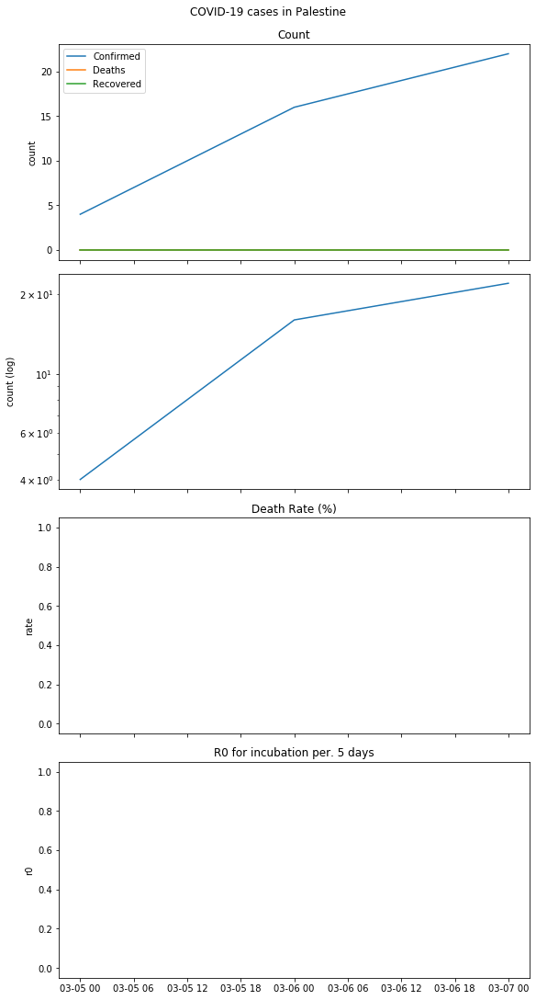


<p>Data extracted from <a href="https://github.com/CSSEGISandData/COVID-19">Johns Hopkins CSSE Data Repository</a></p>


<div>
<style scoped>
    .dataframe tbody tr th:only-of-type {
        vertical-align: middle;
    }

    .dataframe tbody tr th {
        vertical-align: top;
    }

    .dataframe thead th {
        text-align: right;
    }
</style>
<table border="1" class="dataframe">
  <thead>
    <tr style="text-align: right;">
      <th></th>
      <th>Last Update</th>
      <th>Country/Region</th>
      <th>Confirmed</th>
      <th>Deaths</th>
      <th>Recovered</th>
      <th>Death Rate (%)</th>
    </tr>
  </thead>
  <tbody>
    <tr>
      <td>801</td>
      <td>2020-03-05</td>
      <td>Palestine</td>
      <td>4.0</td>
      <td>0.0</td>
      <td>0.0</td>
      <td>NaN</td>
    </tr>
    <tr>
      <td>863</td>
      <td>2020-03-06</td>
      <td>Palestine</td>
      <td>16.0</td>
      <td>0.0</td>
      <td>0.0</td>
      <td>NaN</td>
    </tr>
    <tr>
      <td>917</td>
      <td>2020-03-07</td>
      <td>Palestine</td>
      <td>22.0</td>
      <td>0.0</td>
      <td>0.0</td>
      <td>NaN</td>
    </tr>
  </tbody>
</table>
</div>


<p>r0 calculated as (Confirmed cases at day N + incubation period = 5 days)/(confirmed cases at day N)</p>


<p>Note that this is just a very rough value determined by "garage epidemiology" and should not be used as reference</p>


<div>
<style scoped>
    .dataframe tbody tr th:only-of-type {
        vertical-align: middle;
    }

    .dataframe tbody tr th {
        vertical-align: top;
    }

    .dataframe thead th {
        text-align: right;
    }
</style>
<table border="1" class="dataframe">
  <thead>
    <tr style="text-align: right;">
      <th></th>
      <th>r0</th>
    </tr>
    <tr>
      <th>Last Update</th>
      <th></th>
    </tr>
  </thead>
  <tbody>
    <tr>
      <td>2020-03-05</td>
      <td>NaN</td>
    </tr>
    <tr>
      <td>2020-03-06</td>
      <td>NaN</td>
    </tr>
    <tr>
      <td>2020-03-07</td>
      <td>NaN</td>
    </tr>
  </tbody>
</table>
</div>


<h2><a name="paraguay" href="#paraguay">Paraguay</a></h2>


<p>Plot of COVID-19 cases.</p>


<p>Death rate calculated as (count of death)(count of death + count of recovered)</p>


<p>Data extracted from <a href="https://github.com/CSSEGISandData/COVID-19">Johns Hopkins CSSE Data Repository</a></p>


<div>
<style scoped>
    .dataframe tbody tr th:only-of-type {
        vertical-align: middle;
    }

    .dataframe tbody tr th {
        vertical-align: top;
    }

    .dataframe thead th {
        text-align: right;
    }
</style>
<table border="1" class="dataframe">
  <thead>
    <tr style="text-align: right;">
      <th></th>
      <th>Last Update</th>
      <th>Country/Region</th>
      <th>Confirmed</th>
      <th>Deaths</th>
      <th>Recovered</th>
      <th>Death Rate (%)</th>
    </tr>
  </thead>
  <tbody>
    <tr>
      <td>981</td>
      <td>2020-03-08</td>
      <td>Paraguay</td>
      <td>1.0</td>
      <td>0.0</td>
      <td>0.0</td>
      <td>NaN</td>
    </tr>
  </tbody>
</table>
</div>


<p>r0 calculated as (Confirmed cases at day N + incubation period = 5 days)/(confirmed cases at day N)</p>


<p>Note that this is just a very rough value determined by "garage epidemiology" and should not be used as reference</p>


<div>
<style scoped>
    .dataframe tbody tr th:only-of-type {
        vertical-align: middle;
    }

    .dataframe tbody tr th {
        vertical-align: top;
    }

    .dataframe thead th {
        text-align: right;
    }
</style>
<table border="1" class="dataframe">
  <thead>
    <tr style="text-align: right;">
      <th></th>
      <th>r0</th>
    </tr>
    <tr>
      <th>Last Update</th>
      <th></th>
    </tr>
  </thead>
  <tbody>
    <tr>
      <td>2020-03-08</td>
      <td>NaN</td>
    </tr>
  </tbody>
</table>
</div>


<h2><a name="peru" href="#peru">Peru</a></h2>


<p>Plot of COVID-19 cases.</p>


<p>Death rate calculated as (count of death)(count of death + count of recovered)</p>


<p>Data extracted from <a href="https://github.com/CSSEGISandData/COVID-19">Johns Hopkins CSSE Data Repository</a></p>


<div>
<style scoped>
    .dataframe tbody tr th:only-of-type {
        vertical-align: middle;
    }

    .dataframe tbody tr th {
        vertical-align: top;
    }

    .dataframe thead th {
        text-align: right;
    }
</style>
<table border="1" class="dataframe">
  <thead>
    <tr style="text-align: right;">
      <th></th>
      <th>Last Update</th>
      <th>Country/Region</th>
      <th>Confirmed</th>
      <th>Deaths</th>
      <th>Recovered</th>
      <th>Death Rate (%)</th>
    </tr>
  </thead>
  <tbody>
    <tr>
      <td>864</td>
      <td>2020-03-06</td>
      <td>Peru</td>
      <td>1.0</td>
      <td>0.0</td>
      <td>0.0</td>
      <td>NaN</td>
    </tr>
    <tr>
      <td>982</td>
      <td>2020-03-08</td>
      <td>Peru</td>
      <td>6.0</td>
      <td>0.0</td>
      <td>0.0</td>
      <td>NaN</td>
    </tr>
  </tbody>
</table>
</div>


<p>r0 calculated as (Confirmed cases at day N + incubation period = 5 days)/(confirmed cases at day N)</p>


<p>Note that this is just a very rough value determined by "garage epidemiology" and should not be used as reference</p>


<div>
<style scoped>
    .dataframe tbody tr th:only-of-type {
        vertical-align: middle;
    }

    .dataframe tbody tr th {
        vertical-align: top;
    }

    .dataframe thead th {
        text-align: right;
    }
</style>
<table border="1" class="dataframe">
  <thead>
    <tr style="text-align: right;">
      <th></th>
      <th>r0</th>
    </tr>
    <tr>
      <th>Last Update</th>
      <th></th>
    </tr>
  </thead>
  <tbody>
    <tr>
      <td>2020-03-06</td>
      <td>NaN</td>
    </tr>
    <tr>
      <td>2020-03-08</td>
      <td>NaN</td>
    </tr>
  </tbody>
</table>
</div>


<h2><a name="philippines" href="#philippines">Philippines</a></h2>


<p>Plot of COVID-19 cases.</p>


<p>Death rate calculated as (count of death)(count of death + count of recovered)</p>


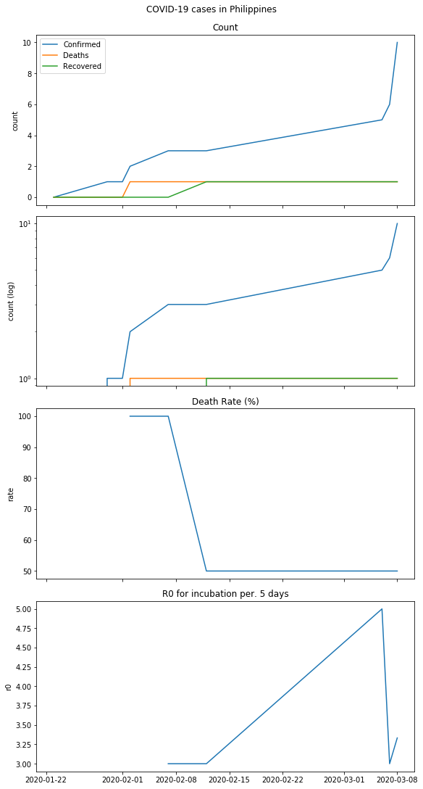


<p>Data extracted from <a href="https://github.com/CSSEGISandData/COVID-19">Johns Hopkins CSSE Data Repository</a></p>


<div>
<style scoped>
    .dataframe tbody tr th:only-of-type {
        vertical-align: middle;
    }

    .dataframe tbody tr th {
        vertical-align: top;
    }

    .dataframe thead th {
        text-align: right;
    }
</style>
<table border="1" class="dataframe">
  <thead>
    <tr style="text-align: right;">
      <th></th>
      <th>Last Update</th>
      <th>Country/Region</th>
      <th>Confirmed</th>
      <th>Deaths</th>
      <th>Recovered</th>
      <th>Death Rate (%)</th>
    </tr>
  </thead>
  <tbody>
    <tr>
      <td>17</td>
      <td>2020-01-23</td>
      <td>Philippines</td>
      <td>0.0</td>
      <td>0.0</td>
      <td>0.0</td>
      <td>NaN</td>
    </tr>
    <tr>
      <td>133</td>
      <td>2020-01-30</td>
      <td>Philippines</td>
      <td>1.0</td>
      <td>0.0</td>
      <td>0.0</td>
      <td>NaN</td>
    </tr>
    <tr>
      <td>156</td>
      <td>2020-01-31</td>
      <td>Philippines</td>
      <td>1.0</td>
      <td>0.0</td>
      <td>0.0</td>
      <td>NaN</td>
    </tr>
    <tr>
      <td>175</td>
      <td>2020-02-01</td>
      <td>Philippines</td>
      <td>1.0</td>
      <td>0.0</td>
      <td>0.0</td>
      <td>NaN</td>
    </tr>
    <tr>
      <td>189</td>
      <td>2020-02-02</td>
      <td>Philippines</td>
      <td>2.0</td>
      <td>1.0</td>
      <td>0.0</td>
      <td>100.0</td>
    </tr>
    <tr>
      <td>234</td>
      <td>2020-02-07</td>
      <td>Philippines</td>
      <td>3.0</td>
      <td>1.0</td>
      <td>0.0</td>
      <td>100.0</td>
    </tr>
    <tr>
      <td>289</td>
      <td>2020-02-12</td>
      <td>Philippines</td>
      <td>3.0</td>
      <td>1.0</td>
      <td>1.0</td>
      <td>50.0</td>
    </tr>
    <tr>
      <td>865</td>
      <td>2020-03-06</td>
      <td>Philippines</td>
      <td>5.0</td>
      <td>1.0</td>
      <td>1.0</td>
      <td>50.0</td>
    </tr>
    <tr>
      <td>918</td>
      <td>2020-03-07</td>
      <td>Philippines</td>
      <td>6.0</td>
      <td>1.0</td>
      <td>1.0</td>
      <td>50.0</td>
    </tr>
    <tr>
      <td>983</td>
      <td>2020-03-08</td>
      <td>Philippines</td>
      <td>10.0</td>
      <td>1.0</td>
      <td>1.0</td>
      <td>50.0</td>
    </tr>
  </tbody>
</table>
</div>


<p>r0 calculated as (Confirmed cases at day N + incubation period = 5 days)/(confirmed cases at day N)</p>


<p>Note that this is just a very rough value determined by "garage epidemiology" and should not be used as reference</p>


<div>
<style scoped>
    .dataframe tbody tr th:only-of-type {
        vertical-align: middle;
    }

    .dataframe tbody tr th {
        vertical-align: top;
    }

    .dataframe thead th {
        text-align: right;
    }
</style>
<table border="1" class="dataframe">
  <thead>
    <tr style="text-align: right;">
      <th></th>
      <th>r0</th>
    </tr>
    <tr>
      <th>Last Update</th>
      <th></th>
    </tr>
  </thead>
  <tbody>
    <tr>
      <td>2020-01-23</td>
      <td>NaN</td>
    </tr>
    <tr>
      <td>2020-01-30</td>
      <td>NaN</td>
    </tr>
    <tr>
      <td>2020-01-31</td>
      <td>NaN</td>
    </tr>
    <tr>
      <td>2020-02-01</td>
      <td>NaN</td>
    </tr>
    <tr>
      <td>2020-02-02</td>
      <td>inf</td>
    </tr>
    <tr>
      <td>2020-02-07</td>
      <td>3.000000</td>
    </tr>
    <tr>
      <td>2020-02-12</td>
      <td>3.000000</td>
    </tr>
    <tr>
      <td>2020-03-06</td>
      <td>5.000000</td>
    </tr>
    <tr>
      <td>2020-03-07</td>
      <td>3.000000</td>
    </tr>
    <tr>
      <td>2020-03-08</td>
      <td>3.333333</td>
    </tr>
  </tbody>
</table>
</div>


<h2><a name="poland" href="#poland">Poland</a></h2>


<p>Plot of COVID-19 cases.</p>


<p>Death rate calculated as (count of death)(count of death + count of recovered)</p>


<p>Data extracted from <a href="https://github.com/CSSEGISandData/COVID-19">Johns Hopkins CSSE Data Repository</a></p>


<div>
<style scoped>
    .dataframe tbody tr th:only-of-type {
        vertical-align: middle;
    }

    .dataframe tbody tr th {
        vertical-align: top;
    }

    .dataframe thead th {
        text-align: right;
    }
</style>
<table border="1" class="dataframe">
  <thead>
    <tr style="text-align: right;">
      <th></th>
      <th>Last Update</th>
      <th>Country/Region</th>
      <th>Confirmed</th>
      <th>Deaths</th>
      <th>Recovered</th>
      <th>Death Rate (%)</th>
    </tr>
  </thead>
  <tbody>
    <tr>
      <td>755</td>
      <td>2020-03-04</td>
      <td>Poland</td>
      <td>1.0</td>
      <td>0.0</td>
      <td>0.0</td>
      <td>NaN</td>
    </tr>
    <tr>
      <td>866</td>
      <td>2020-03-06</td>
      <td>Poland</td>
      <td>5.0</td>
      <td>0.0</td>
      <td>0.0</td>
      <td>NaN</td>
    </tr>
    <tr>
      <td>984</td>
      <td>2020-03-08</td>
      <td>Poland</td>
      <td>11.0</td>
      <td>0.0</td>
      <td>0.0</td>
      <td>NaN</td>
    </tr>
  </tbody>
</table>
</div>


<p>r0 calculated as (Confirmed cases at day N + incubation period = 5 days)/(confirmed cases at day N)</p>


<p>Note that this is just a very rough value determined by "garage epidemiology" and should not be used as reference</p>


<div>
<style scoped>
    .dataframe tbody tr th:only-of-type {
        vertical-align: middle;
    }

    .dataframe tbody tr th {
        vertical-align: top;
    }

    .dataframe thead th {
        text-align: right;
    }
</style>
<table border="1" class="dataframe">
  <thead>
    <tr style="text-align: right;">
      <th></th>
      <th>r0</th>
    </tr>
    <tr>
      <th>Last Update</th>
      <th></th>
    </tr>
  </thead>
  <tbody>
    <tr>
      <td>2020-03-04</td>
      <td>NaN</td>
    </tr>
    <tr>
      <td>2020-03-06</td>
      <td>NaN</td>
    </tr>
    <tr>
      <td>2020-03-08</td>
      <td>NaN</td>
    </tr>
  </tbody>
</table>
</div>


<h2><a name="portugal" href="#portugal">Portugal</a></h2>


<p>Plot of COVID-19 cases.</p>


<p>Death rate calculated as (count of death)(count of death + count of recovered)</p>


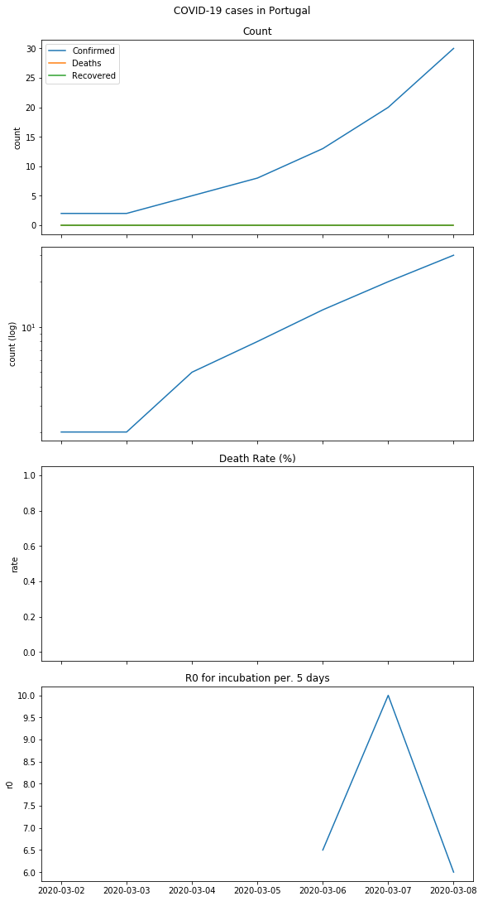


<p>Data extracted from <a href="https://github.com/CSSEGISandData/COVID-19">Johns Hopkins CSSE Data Repository</a></p>


<div>
<style scoped>
    .dataframe tbody tr th:only-of-type {
        vertical-align: middle;
    }

    .dataframe tbody tr th {
        vertical-align: top;
    }

    .dataframe thead th {
        text-align: right;
    }
</style>
<table border="1" class="dataframe">
  <thead>
    <tr style="text-align: right;">
      <th></th>
      <th>Last Update</th>
      <th>Country/Region</th>
      <th>Confirmed</th>
      <th>Deaths</th>
      <th>Recovered</th>
      <th>Death Rate (%)</th>
    </tr>
  </thead>
  <tbody>
    <tr>
      <td>654</td>
      <td>2020-03-02</td>
      <td>Portugal</td>
      <td>2.0</td>
      <td>0.0</td>
      <td>0.0</td>
      <td>NaN</td>
    </tr>
    <tr>
      <td>702</td>
      <td>2020-03-03</td>
      <td>Portugal</td>
      <td>2.0</td>
      <td>0.0</td>
      <td>0.0</td>
      <td>NaN</td>
    </tr>
    <tr>
      <td>756</td>
      <td>2020-03-04</td>
      <td>Portugal</td>
      <td>5.0</td>
      <td>0.0</td>
      <td>0.0</td>
      <td>NaN</td>
    </tr>
    <tr>
      <td>802</td>
      <td>2020-03-05</td>
      <td>Portugal</td>
      <td>8.0</td>
      <td>0.0</td>
      <td>0.0</td>
      <td>NaN</td>
    </tr>
    <tr>
      <td>867</td>
      <td>2020-03-06</td>
      <td>Portugal</td>
      <td>13.0</td>
      <td>0.0</td>
      <td>0.0</td>
      <td>NaN</td>
    </tr>
    <tr>
      <td>919</td>
      <td>2020-03-07</td>
      <td>Portugal</td>
      <td>20.0</td>
      <td>0.0</td>
      <td>0.0</td>
      <td>NaN</td>
    </tr>
    <tr>
      <td>985</td>
      <td>2020-03-08</td>
      <td>Portugal</td>
      <td>30.0</td>
      <td>0.0</td>
      <td>0.0</td>
      <td>NaN</td>
    </tr>
  </tbody>
</table>
</div>


<p>r0 calculated as (Confirmed cases at day N + incubation period = 5 days)/(confirmed cases at day N)</p>


<p>Note that this is just a very rough value determined by "garage epidemiology" and should not be used as reference</p>


<div>
<style scoped>
    .dataframe tbody tr th:only-of-type {
        vertical-align: middle;
    }

    .dataframe tbody tr th {
        vertical-align: top;
    }

    .dataframe thead th {
        text-align: right;
    }
</style>
<table border="1" class="dataframe">
  <thead>
    <tr style="text-align: right;">
      <th></th>
      <th>r0</th>
    </tr>
    <tr>
      <th>Last Update</th>
      <th></th>
    </tr>
  </thead>
  <tbody>
    <tr>
      <td>2020-03-02</td>
      <td>NaN</td>
    </tr>
    <tr>
      <td>2020-03-03</td>
      <td>NaN</td>
    </tr>
    <tr>
      <td>2020-03-04</td>
      <td>NaN</td>
    </tr>
    <tr>
      <td>2020-03-05</td>
      <td>NaN</td>
    </tr>
    <tr>
      <td>2020-03-06</td>
      <td>6.5</td>
    </tr>
    <tr>
      <td>2020-03-07</td>
      <td>10.0</td>
    </tr>
    <tr>
      <td>2020-03-08</td>
      <td>6.0</td>
    </tr>
  </tbody>
</table>
</div>


<h2><a name="qatar" href="#qatar">Qatar</a></h2>


<p>Plot of COVID-19 cases.</p>


<p>Death rate calculated as (count of death)(count of death + count of recovered)</p>


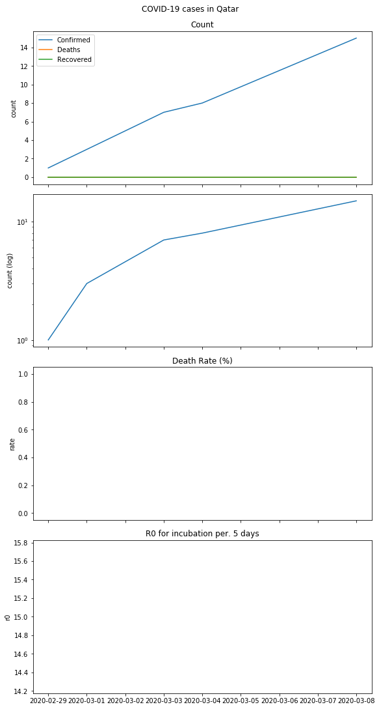


<p>Data extracted from <a href="https://github.com/CSSEGISandData/COVID-19">Johns Hopkins CSSE Data Repository</a></p>


<div>
<style scoped>
    .dataframe tbody tr th:only-of-type {
        vertical-align: middle;
    }

    .dataframe tbody tr th {
        vertical-align: top;
    }

    .dataframe thead th {
        text-align: right;
    }
</style>
<table border="1" class="dataframe">
  <thead>
    <tr style="text-align: right;">
      <th></th>
      <th>Last Update</th>
      <th>Country/Region</th>
      <th>Confirmed</th>
      <th>Deaths</th>
      <th>Recovered</th>
      <th>Death Rate (%)</th>
    </tr>
  </thead>
  <tbody>
    <tr>
      <td>572</td>
      <td>2020-02-29</td>
      <td>Qatar</td>
      <td>1.0</td>
      <td>0.0</td>
      <td>0.0</td>
      <td>NaN</td>
    </tr>
    <tr>
      <td>616</td>
      <td>2020-03-01</td>
      <td>Qatar</td>
      <td>3.0</td>
      <td>0.0</td>
      <td>0.0</td>
      <td>NaN</td>
    </tr>
    <tr>
      <td>703</td>
      <td>2020-03-03</td>
      <td>Qatar</td>
      <td>7.0</td>
      <td>0.0</td>
      <td>0.0</td>
      <td>NaN</td>
    </tr>
    <tr>
      <td>757</td>
      <td>2020-03-04</td>
      <td>Qatar</td>
      <td>8.0</td>
      <td>0.0</td>
      <td>0.0</td>
      <td>NaN</td>
    </tr>
    <tr>
      <td>986</td>
      <td>2020-03-08</td>
      <td>Qatar</td>
      <td>15.0</td>
      <td>0.0</td>
      <td>0.0</td>
      <td>NaN</td>
    </tr>
  </tbody>
</table>
</div>


<p>r0 calculated as (Confirmed cases at day N + incubation period = 5 days)/(confirmed cases at day N)</p>


<p>Note that this is just a very rough value determined by "garage epidemiology" and should not be used as reference</p>


<div>
<style scoped>
    .dataframe tbody tr th:only-of-type {
        vertical-align: middle;
    }

    .dataframe tbody tr th {
        vertical-align: top;
    }

    .dataframe thead th {
        text-align: right;
    }
</style>
<table border="1" class="dataframe">
  <thead>
    <tr style="text-align: right;">
      <th></th>
      <th>r0</th>
    </tr>
    <tr>
      <th>Last Update</th>
      <th></th>
    </tr>
  </thead>
  <tbody>
    <tr>
      <td>2020-02-29</td>
      <td>NaN</td>
    </tr>
    <tr>
      <td>2020-03-01</td>
      <td>NaN</td>
    </tr>
    <tr>
      <td>2020-03-03</td>
      <td>NaN</td>
    </tr>
    <tr>
      <td>2020-03-04</td>
      <td>NaN</td>
    </tr>
    <tr>
      <td>2020-03-08</td>
      <td>15.0</td>
    </tr>
  </tbody>
</table>
</div>


<h2><a name="republic_of_ireland" href="#republic_of_ireland">Republic of Ireland</a></h2>


<p>Plot of COVID-19 cases.</p>


<p>Death rate calculated as (count of death)(count of death + count of recovered)</p>


<p>Data extracted from <a href="https://github.com/CSSEGISandData/COVID-19">Johns Hopkins CSSE Data Repository</a></p>


<div>
<style scoped>
    .dataframe tbody tr th:only-of-type {
        vertical-align: middle;
    }

    .dataframe tbody tr th {
        vertical-align: top;
    }

    .dataframe thead th {
        text-align: right;
    }
</style>
<table border="1" class="dataframe">
  <thead>
    <tr style="text-align: right;">
      <th></th>
      <th>Last Update</th>
      <th>Country/Region</th>
      <th>Confirmed</th>
      <th>Deaths</th>
      <th>Recovered</th>
      <th>Death Rate (%)</th>
    </tr>
  </thead>
  <tbody>
    <tr>
      <td>987</td>
      <td>2020-03-08</td>
      <td>Republic of Ireland</td>
      <td>21.0</td>
      <td>0.0</td>
      <td>0.0</td>
      <td>NaN</td>
    </tr>
  </tbody>
</table>
</div>


<p>r0 calculated as (Confirmed cases at day N + incubation period = 5 days)/(confirmed cases at day N)</p>


<p>Note that this is just a very rough value determined by "garage epidemiology" and should not be used as reference</p>


<div>
<style scoped>
    .dataframe tbody tr th:only-of-type {
        vertical-align: middle;
    }

    .dataframe tbody tr th {
        vertical-align: top;
    }

    .dataframe thead th {
        text-align: right;
    }
</style>
<table border="1" class="dataframe">
  <thead>
    <tr style="text-align: right;">
      <th></th>
      <th>r0</th>
    </tr>
    <tr>
      <th>Last Update</th>
      <th></th>
    </tr>
  </thead>
  <tbody>
    <tr>
      <td>2020-03-08</td>
      <td>NaN</td>
    </tr>
  </tbody>
</table>
</div>


<h2><a name="romania" href="#romania">Romania</a></h2>


<p>Plot of COVID-19 cases.</p>


<p>Death rate calculated as (count of death)(count of death + count of recovered)</p>


<p>Data extracted from <a href="https://github.com/CSSEGISandData/COVID-19">Johns Hopkins CSSE Data Repository</a></p>


<div>
<style scoped>
    .dataframe tbody tr th:only-of-type {
        vertical-align: middle;
    }

    .dataframe tbody tr th {
        vertical-align: top;
    }

    .dataframe thead th {
        text-align: right;
    }
</style>
<table border="1" class="dataframe">
  <thead>
    <tr style="text-align: right;">
      <th></th>
      <th>Last Update</th>
      <th>Country/Region</th>
      <th>Confirmed</th>
      <th>Deaths</th>
      <th>Recovered</th>
      <th>Death Rate (%)</th>
    </tr>
  </thead>
  <tbody>
    <tr>
      <td>472</td>
      <td>2020-02-26</td>
      <td>Romania</td>
      <td>1.0</td>
      <td>0.0</td>
      <td>0.0</td>
      <td>NaN</td>
    </tr>
    <tr>
      <td>502</td>
      <td>2020-02-27</td>
      <td>Romania</td>
      <td>1.0</td>
      <td>0.0</td>
      <td>0.0</td>
      <td>NaN</td>
    </tr>
    <tr>
      <td>535</td>
      <td>2020-02-28</td>
      <td>Romania</td>
      <td>3.0</td>
      <td>0.0</td>
      <td>0.0</td>
      <td>NaN</td>
    </tr>
    <tr>
      <td>704</td>
      <td>2020-03-03</td>
      <td>Romania</td>
      <td>3.0</td>
      <td>0.0</td>
      <td>0.0</td>
      <td>NaN</td>
    </tr>
    <tr>
      <td>758</td>
      <td>2020-03-04</td>
      <td>Romania</td>
      <td>4.0</td>
      <td>0.0</td>
      <td>1.0</td>
      <td>0.0</td>
    </tr>
    <tr>
      <td>803</td>
      <td>2020-03-05</td>
      <td>Romania</td>
      <td>6.0</td>
      <td>0.0</td>
      <td>1.0</td>
      <td>0.0</td>
    </tr>
    <tr>
      <td>868</td>
      <td>2020-03-06</td>
      <td>Romania</td>
      <td>9.0</td>
      <td>0.0</td>
      <td>1.0</td>
      <td>0.0</td>
    </tr>
    <tr>
      <td>920</td>
      <td>2020-03-07</td>
      <td>Romania</td>
      <td>9.0</td>
      <td>0.0</td>
      <td>3.0</td>
      <td>0.0</td>
    </tr>
    <tr>
      <td>988</td>
      <td>2020-03-08</td>
      <td>Romania</td>
      <td>15.0</td>
      <td>0.0</td>
      <td>3.0</td>
      <td>0.0</td>
    </tr>
  </tbody>
</table>
</div>


<p>r0 calculated as (Confirmed cases at day N + incubation period = 5 days)/(confirmed cases at day N)</p>


<p>Note that this is just a very rough value determined by "garage epidemiology" and should not be used as reference</p>


<div>
<style scoped>
    .dataframe tbody tr th:only-of-type {
        vertical-align: middle;
    }

    .dataframe tbody tr th {
        vertical-align: top;
    }

    .dataframe thead th {
        text-align: right;
    }
</style>
<table border="1" class="dataframe">
  <thead>
    <tr style="text-align: right;">
      <th></th>
      <th>r0</th>
    </tr>
    <tr>
      <th>Last Update</th>
      <th></th>
    </tr>
  </thead>
  <tbody>
    <tr>
      <td>2020-02-26</td>
      <td>NaN</td>
    </tr>
    <tr>
      <td>2020-02-27</td>
      <td>NaN</td>
    </tr>
    <tr>
      <td>2020-02-28</td>
      <td>NaN</td>
    </tr>
    <tr>
      <td>2020-03-03</td>
      <td>NaN</td>
    </tr>
    <tr>
      <td>2020-03-04</td>
      <td>4.00</td>
    </tr>
    <tr>
      <td>2020-03-05</td>
      <td>6.00</td>
    </tr>
    <tr>
      <td>2020-03-06</td>
      <td>3.00</td>
    </tr>
    <tr>
      <td>2020-03-07</td>
      <td>3.00</td>
    </tr>
    <tr>
      <td>2020-03-08</td>
      <td>3.75</td>
    </tr>
  </tbody>
</table>
</div>


<h2><a name="russia" href="#russia">Russia</a></h2>


<p>Plot of COVID-19 cases.</p>


<p>Death rate calculated as (count of death)(count of death + count of recovered)</p>


<p>Data extracted from <a href="https://github.com/CSSEGISandData/COVID-19">Johns Hopkins CSSE Data Repository</a></p>


<div>
<style scoped>
    .dataframe tbody tr th:only-of-type {
        vertical-align: middle;
    }

    .dataframe tbody tr th {
        vertical-align: top;
    }

    .dataframe thead th {
        text-align: right;
    }
</style>
<table border="1" class="dataframe">
  <thead>
    <tr style="text-align: right;">
      <th></th>
      <th>Last Update</th>
      <th>Country/Region</th>
      <th>Confirmed</th>
      <th>Deaths</th>
      <th>Recovered</th>
      <th>Death Rate (%)</th>
    </tr>
  </thead>
  <tbody>
    <tr>
      <td>157</td>
      <td>2020-01-31</td>
      <td>Russia</td>
      <td>2.0</td>
      <td>0.0</td>
      <td>0.0</td>
      <td>NaN</td>
    </tr>
    <tr>
      <td>290</td>
      <td>2020-02-12</td>
      <td>Russia</td>
      <td>2.0</td>
      <td>0.0</td>
      <td>2.0</td>
      <td>0.0</td>
    </tr>
    <tr>
      <td>655</td>
      <td>2020-03-02</td>
      <td>Russia</td>
      <td>3.0</td>
      <td>0.0</td>
      <td>2.0</td>
      <td>0.0</td>
    </tr>
    <tr>
      <td>804</td>
      <td>2020-03-05</td>
      <td>Russia</td>
      <td>4.0</td>
      <td>0.0</td>
      <td>2.0</td>
      <td>0.0</td>
    </tr>
    <tr>
      <td>869</td>
      <td>2020-03-06</td>
      <td>Russia</td>
      <td>13.0</td>
      <td>0.0</td>
      <td>2.0</td>
      <td>0.0</td>
    </tr>
    <tr>
      <td>989</td>
      <td>2020-03-08</td>
      <td>Russia</td>
      <td>17.0</td>
      <td>0.0</td>
      <td>3.0</td>
      <td>0.0</td>
    </tr>
  </tbody>
</table>
</div>


<p>r0 calculated as (Confirmed cases at day N + incubation period = 5 days)/(confirmed cases at day N)</p>


<p>Note that this is just a very rough value determined by "garage epidemiology" and should not be used as reference</p>


<div>
<style scoped>
    .dataframe tbody tr th:only-of-type {
        vertical-align: middle;
    }

    .dataframe tbody tr th {
        vertical-align: top;
    }

    .dataframe thead th {
        text-align: right;
    }
</style>
<table border="1" class="dataframe">
  <thead>
    <tr style="text-align: right;">
      <th></th>
      <th>r0</th>
    </tr>
    <tr>
      <th>Last Update</th>
      <th></th>
    </tr>
  </thead>
  <tbody>
    <tr>
      <td>2020-01-31</td>
      <td>NaN</td>
    </tr>
    <tr>
      <td>2020-02-12</td>
      <td>NaN</td>
    </tr>
    <tr>
      <td>2020-03-02</td>
      <td>NaN</td>
    </tr>
    <tr>
      <td>2020-03-05</td>
      <td>NaN</td>
    </tr>
    <tr>
      <td>2020-03-06</td>
      <td>6.5</td>
    </tr>
    <tr>
      <td>2020-03-08</td>
      <td>8.5</td>
    </tr>
  </tbody>
</table>
</div>


<h2><a name="saint_barthelemy" href="#saint_barthelemy">Saint Barthelemy</a></h2>


<p>Plot of COVID-19 cases.</p>


<p>Death rate calculated as (count of death)(count of death + count of recovered)</p>


<p>Data extracted from <a href="https://github.com/CSSEGISandData/COVID-19">Johns Hopkins CSSE Data Repository</a></p>


<div>
<style scoped>
    .dataframe tbody tr th:only-of-type {
        vertical-align: middle;
    }

    .dataframe tbody tr th {
        vertical-align: top;
    }

    .dataframe thead th {
        text-align: right;
    }
</style>
<table border="1" class="dataframe">
  <thead>
    <tr style="text-align: right;">
      <th></th>
      <th>Last Update</th>
      <th>Country/Region</th>
      <th>Confirmed</th>
      <th>Deaths</th>
      <th>Recovered</th>
      <th>Death Rate (%)</th>
    </tr>
  </thead>
  <tbody>
    <tr>
      <td>759</td>
      <td>2020-03-04</td>
      <td>Saint Barthelemy</td>
      <td>3.0</td>
      <td>0.0</td>
      <td>0.0</td>
      <td>NaN</td>
    </tr>
  </tbody>
</table>
</div>


<p>r0 calculated as (Confirmed cases at day N + incubation period = 5 days)/(confirmed cases at day N)</p>


<p>Note that this is just a very rough value determined by "garage epidemiology" and should not be used as reference</p>


<div>
<style scoped>
    .dataframe tbody tr th:only-of-type {
        vertical-align: middle;
    }

    .dataframe tbody tr th {
        vertical-align: top;
    }

    .dataframe thead th {
        text-align: right;
    }
</style>
<table border="1" class="dataframe">
  <thead>
    <tr style="text-align: right;">
      <th></th>
      <th>r0</th>
    </tr>
    <tr>
      <th>Last Update</th>
      <th></th>
    </tr>
  </thead>
  <tbody>
    <tr>
      <td>2020-03-04</td>
      <td>NaN</td>
    </tr>
  </tbody>
</table>
</div>


<h2><a name="san_marino" href="#san_marino">San Marino</a></h2>


<p>Plot of COVID-19 cases.</p>


<p>Death rate calculated as (count of death)(count of death + count of recovered)</p>


<p>Data extracted from <a href="https://github.com/CSSEGISandData/COVID-19">Johns Hopkins CSSE Data Repository</a></p>


<div>
<style scoped>
    .dataframe tbody tr th:only-of-type {
        vertical-align: middle;
    }

    .dataframe tbody tr th {
        vertical-align: top;
    }

    .dataframe thead th {
        text-align: right;
    }
</style>
<table border="1" class="dataframe">
  <thead>
    <tr style="text-align: right;">
      <th></th>
      <th>Last Update</th>
      <th>Country/Region</th>
      <th>Confirmed</th>
      <th>Deaths</th>
      <th>Recovered</th>
      <th>Death Rate (%)</th>
    </tr>
  </thead>
  <tbody>
    <tr>
      <td>503</td>
      <td>2020-02-27</td>
      <td>San Marino</td>
      <td>1.0</td>
      <td>0.0</td>
      <td>0.0</td>
      <td>NaN</td>
    </tr>
    <tr>
      <td>617</td>
      <td>2020-03-01</td>
      <td>San Marino</td>
      <td>1.0</td>
      <td>0.0</td>
      <td>0.0</td>
      <td>NaN</td>
    </tr>
    <tr>
      <td>656</td>
      <td>2020-03-02</td>
      <td>San Marino</td>
      <td>8.0</td>
      <td>0.0</td>
      <td>0.0</td>
      <td>NaN</td>
    </tr>
    <tr>
      <td>705</td>
      <td>2020-03-03</td>
      <td>San Marino</td>
      <td>10.0</td>
      <td>1.0</td>
      <td>0.0</td>
      <td>100.0</td>
    </tr>
    <tr>
      <td>760</td>
      <td>2020-03-04</td>
      <td>San Marino</td>
      <td>16.0</td>
      <td>1.0</td>
      <td>0.0</td>
      <td>100.0</td>
    </tr>
    <tr>
      <td>805</td>
      <td>2020-03-05</td>
      <td>San Marino</td>
      <td>21.0</td>
      <td>1.0</td>
      <td>0.0</td>
      <td>100.0</td>
    </tr>
    <tr>
      <td>921</td>
      <td>2020-03-07</td>
      <td>San Marino</td>
      <td>23.0</td>
      <td>1.0</td>
      <td>0.0</td>
      <td>100.0</td>
    </tr>
    <tr>
      <td>990</td>
      <td>2020-03-08</td>
      <td>San Marino</td>
      <td>36.0</td>
      <td>1.0</td>
      <td>0.0</td>
      <td>100.0</td>
    </tr>
  </tbody>
</table>
</div>


<p>r0 calculated as (Confirmed cases at day N + incubation period = 5 days)/(confirmed cases at day N)</p>


<p>Note that this is just a very rough value determined by "garage epidemiology" and should not be used as reference</p>


<div>
<style scoped>
    .dataframe tbody tr th:only-of-type {
        vertical-align: middle;
    }

    .dataframe tbody tr th {
        vertical-align: top;
    }

    .dataframe thead th {
        text-align: right;
    }
</style>
<table border="1" class="dataframe">
  <thead>
    <tr style="text-align: right;">
      <th></th>
      <th>r0</th>
    </tr>
    <tr>
      <th>Last Update</th>
      <th></th>
    </tr>
  </thead>
  <tbody>
    <tr>
      <td>2020-02-27</td>
      <td>NaN</td>
    </tr>
    <tr>
      <td>2020-03-01</td>
      <td>NaN</td>
    </tr>
    <tr>
      <td>2020-03-02</td>
      <td>NaN</td>
    </tr>
    <tr>
      <td>2020-03-03</td>
      <td>NaN</td>
    </tr>
    <tr>
      <td>2020-03-04</td>
      <td>16.000</td>
    </tr>
    <tr>
      <td>2020-03-05</td>
      <td>21.000</td>
    </tr>
    <tr>
      <td>2020-03-07</td>
      <td>2.875</td>
    </tr>
    <tr>
      <td>2020-03-08</td>
      <td>3.600</td>
    </tr>
  </tbody>
</table>
</div>


<h2><a name="saudi_arabia" href="#saudi_arabia">Saudi Arabia</a></h2>


<p>Plot of COVID-19 cases.</p>


<p>Death rate calculated as (count of death)(count of death + count of recovered)</p>


<p>Data extracted from <a href="https://github.com/CSSEGISandData/COVID-19">Johns Hopkins CSSE Data Repository</a></p>


<div>
<style scoped>
    .dataframe tbody tr th:only-of-type {
        vertical-align: middle;
    }

    .dataframe tbody tr th {
        vertical-align: top;
    }

    .dataframe thead th {
        text-align: right;
    }
</style>
<table border="1" class="dataframe">
  <thead>
    <tr style="text-align: right;">
      <th></th>
      <th>Last Update</th>
      <th>Country/Region</th>
      <th>Confirmed</th>
      <th>Deaths</th>
      <th>Recovered</th>
      <th>Death Rate (%)</th>
    </tr>
  </thead>
  <tbody>
    <tr>
      <td>657</td>
      <td>2020-03-02</td>
      <td>Saudi Arabia</td>
      <td>1.0</td>
      <td>0.0</td>
      <td>0.0</td>
      <td>NaN</td>
    </tr>
    <tr>
      <td>806</td>
      <td>2020-03-05</td>
      <td>Saudi Arabia</td>
      <td>5.0</td>
      <td>0.0</td>
      <td>0.0</td>
      <td>NaN</td>
    </tr>
    <tr>
      <td>991</td>
      <td>2020-03-08</td>
      <td>Saudi Arabia</td>
      <td>11.0</td>
      <td>0.0</td>
      <td>0.0</td>
      <td>NaN</td>
    </tr>
  </tbody>
</table>
</div>


<p>r0 calculated as (Confirmed cases at day N + incubation period = 5 days)/(confirmed cases at day N)</p>


<p>Note that this is just a very rough value determined by "garage epidemiology" and should not be used as reference</p>


<div>
<style scoped>
    .dataframe tbody tr th:only-of-type {
        vertical-align: middle;
    }

    .dataframe tbody tr th {
        vertical-align: top;
    }

    .dataframe thead th {
        text-align: right;
    }
</style>
<table border="1" class="dataframe">
  <thead>
    <tr style="text-align: right;">
      <th></th>
      <th>r0</th>
    </tr>
    <tr>
      <th>Last Update</th>
      <th></th>
    </tr>
  </thead>
  <tbody>
    <tr>
      <td>2020-03-02</td>
      <td>NaN</td>
    </tr>
    <tr>
      <td>2020-03-05</td>
      <td>NaN</td>
    </tr>
    <tr>
      <td>2020-03-08</td>
      <td>NaN</td>
    </tr>
  </tbody>
</table>
</div>


<h2><a name="senegal" href="#senegal">Senegal</a></h2>


<p>Plot of COVID-19 cases.</p>


<p>Death rate calculated as (count of death)(count of death + count of recovered)</p>


<p>Data extracted from <a href="https://github.com/CSSEGISandData/COVID-19">Johns Hopkins CSSE Data Repository</a></p>


<div>
<style scoped>
    .dataframe tbody tr th:only-of-type {
        vertical-align: middle;
    }

    .dataframe tbody tr th {
        vertical-align: top;
    }

    .dataframe thead th {
        text-align: right;
    }
</style>
<table border="1" class="dataframe">
  <thead>
    <tr style="text-align: right;">
      <th></th>
      <th>Last Update</th>
      <th>Country/Region</th>
      <th>Confirmed</th>
      <th>Deaths</th>
      <th>Recovered</th>
      <th>Death Rate (%)</th>
    </tr>
  </thead>
  <tbody>
    <tr>
      <td>658</td>
      <td>2020-03-02</td>
      <td>Senegal</td>
      <td>1.0</td>
      <td>0.0</td>
      <td>0.0</td>
      <td>NaN</td>
    </tr>
    <tr>
      <td>706</td>
      <td>2020-03-03</td>
      <td>Senegal</td>
      <td>2.0</td>
      <td>0.0</td>
      <td>0.0</td>
      <td>NaN</td>
    </tr>
    <tr>
      <td>761</td>
      <td>2020-03-04</td>
      <td>Senegal</td>
      <td>4.0</td>
      <td>0.0</td>
      <td>0.0</td>
      <td>NaN</td>
    </tr>
    <tr>
      <td>992</td>
      <td>2020-03-08</td>
      <td>Senegal</td>
      <td>4.0</td>
      <td>0.0</td>
      <td>1.0</td>
      <td>0.0</td>
    </tr>
  </tbody>
</table>
</div>


<p>r0 calculated as (Confirmed cases at day N + incubation period = 5 days)/(confirmed cases at day N)</p>


<p>Note that this is just a very rough value determined by "garage epidemiology" and should not be used as reference</p>


<div>
<style scoped>
    .dataframe tbody tr th:only-of-type {
        vertical-align: middle;
    }

    .dataframe tbody tr th {
        vertical-align: top;
    }

    .dataframe thead th {
        text-align: right;
    }
</style>
<table border="1" class="dataframe">
  <thead>
    <tr style="text-align: right;">
      <th></th>
      <th>r0</th>
    </tr>
    <tr>
      <th>Last Update</th>
      <th></th>
    </tr>
  </thead>
  <tbody>
    <tr>
      <td>2020-03-02</td>
      <td>NaN</td>
    </tr>
    <tr>
      <td>2020-03-03</td>
      <td>NaN</td>
    </tr>
    <tr>
      <td>2020-03-04</td>
      <td>NaN</td>
    </tr>
    <tr>
      <td>2020-03-08</td>
      <td>NaN</td>
    </tr>
  </tbody>
</table>
</div>


<h2><a name="serbia" href="#serbia">Serbia</a></h2>


<p>Plot of COVID-19 cases.</p>


<p>Death rate calculated as (count of death)(count of death + count of recovered)</p>


<p>Data extracted from <a href="https://github.com/CSSEGISandData/COVID-19">Johns Hopkins CSSE Data Repository</a></p>


<div>
<style scoped>
    .dataframe tbody tr th:only-of-type {
        vertical-align: middle;
    }

    .dataframe tbody tr th {
        vertical-align: top;
    }

    .dataframe thead th {
        text-align: right;
    }
</style>
<table border="1" class="dataframe">
  <thead>
    <tr style="text-align: right;">
      <th></th>
      <th>Last Update</th>
      <th>Country/Region</th>
      <th>Confirmed</th>
      <th>Deaths</th>
      <th>Recovered</th>
      <th>Death Rate (%)</th>
    </tr>
  </thead>
  <tbody>
    <tr>
      <td>870</td>
      <td>2020-03-06</td>
      <td>Serbia</td>
      <td>1.0</td>
      <td>0.0</td>
      <td>0.0</td>
      <td>NaN</td>
    </tr>
  </tbody>
</table>
</div>


<p>r0 calculated as (Confirmed cases at day N + incubation period = 5 days)/(confirmed cases at day N)</p>


<p>Note that this is just a very rough value determined by "garage epidemiology" and should not be used as reference</p>


<div>
<style scoped>
    .dataframe tbody tr th:only-of-type {
        vertical-align: middle;
    }

    .dataframe tbody tr th {
        vertical-align: top;
    }

    .dataframe thead th {
        text-align: right;
    }
</style>
<table border="1" class="dataframe">
  <thead>
    <tr style="text-align: right;">
      <th></th>
      <th>r0</th>
    </tr>
    <tr>
      <th>Last Update</th>
      <th></th>
    </tr>
  </thead>
  <tbody>
    <tr>
      <td>2020-03-06</td>
      <td>NaN</td>
    </tr>
  </tbody>
</table>
</div>


<h2><a name="singapore" href="#singapore">Singapore</a></h2>


<p>Plot of COVID-19 cases.</p>


<p>Death rate calculated as (count of death)(count of death + count of recovered)</p>


<p>Data extracted from <a href="https://github.com/CSSEGISandData/COVID-19">Johns Hopkins CSSE Data Repository</a></p>


<div>
<style scoped>
    .dataframe tbody tr th:only-of-type {
        vertical-align: middle;
    }

    .dataframe tbody tr th {
        vertical-align: top;
    }

    .dataframe thead th {
        text-align: right;
    }
</style>
<table border="1" class="dataframe">
  <thead>
    <tr style="text-align: right;">
      <th></th>
      <th>Last Update</th>
      <th>Country/Region</th>
      <th>Confirmed</th>
      <th>Deaths</th>
      <th>Recovered</th>
      <th>Death Rate (%)</th>
    </tr>
  </thead>
  <tbody>
    <tr>
      <td>18</td>
      <td>2020-01-23</td>
      <td>Singapore</td>
      <td>1.0</td>
      <td>0.0</td>
      <td>0.0</td>
      <td>NaN</td>
    </tr>
    <tr>
      <td>29</td>
      <td>2020-01-24</td>
      <td>Singapore</td>
      <td>3.0</td>
      <td>0.0</td>
      <td>0.0</td>
      <td>NaN</td>
    </tr>
    <tr>
      <td>43</td>
      <td>2020-01-25</td>
      <td>Singapore</td>
      <td>3.0</td>
      <td>0.0</td>
      <td>0.0</td>
      <td>NaN</td>
    </tr>
    <tr>
      <td>58</td>
      <td>2020-01-26</td>
      <td>Singapore</td>
      <td>4.0</td>
      <td>0.0</td>
      <td>0.0</td>
      <td>NaN</td>
    </tr>
    <tr>
      <td>75</td>
      <td>2020-01-27</td>
      <td>Singapore</td>
      <td>5.0</td>
      <td>0.0</td>
      <td>0.0</td>
      <td>NaN</td>
    </tr>
    <tr>
      <td>93</td>
      <td>2020-01-28</td>
      <td>Singapore</td>
      <td>7.0</td>
      <td>0.0</td>
      <td>0.0</td>
      <td>NaN</td>
    </tr>
    <tr>
      <td>112</td>
      <td>2020-01-29</td>
      <td>Singapore</td>
      <td>7.0</td>
      <td>0.0</td>
      <td>0.0</td>
      <td>NaN</td>
    </tr>
    <tr>
      <td>134</td>
      <td>2020-01-30</td>
      <td>Singapore</td>
      <td>10.0</td>
      <td>0.0</td>
      <td>0.0</td>
      <td>NaN</td>
    </tr>
    <tr>
      <td>158</td>
      <td>2020-01-31</td>
      <td>Singapore</td>
      <td>13.0</td>
      <td>0.0</td>
      <td>0.0</td>
      <td>NaN</td>
    </tr>
    <tr>
      <td>176</td>
      <td>2020-02-01</td>
      <td>Singapore</td>
      <td>16.0</td>
      <td>0.0</td>
      <td>0.0</td>
      <td>NaN</td>
    </tr>
    <tr>
      <td>190</td>
      <td>2020-02-02</td>
      <td>Singapore</td>
      <td>18.0</td>
      <td>0.0</td>
      <td>0.0</td>
      <td>NaN</td>
    </tr>
    <tr>
      <td>206</td>
      <td>2020-02-04</td>
      <td>Singapore</td>
      <td>24.0</td>
      <td>0.0</td>
      <td>0.0</td>
      <td>NaN</td>
    </tr>
    <tr>
      <td>214</td>
      <td>2020-02-05</td>
      <td>Singapore</td>
      <td>28.0</td>
      <td>0.0</td>
      <td>0.0</td>
      <td>NaN</td>
    </tr>
    <tr>
      <td>235</td>
      <td>2020-02-07</td>
      <td>Singapore</td>
      <td>30.0</td>
      <td>0.0</td>
      <td>0.0</td>
      <td>NaN</td>
    </tr>
    <tr>
      <td>242</td>
      <td>2020-02-08</td>
      <td>Singapore</td>
      <td>33.0</td>
      <td>0.0</td>
      <td>2.0</td>
      <td>0.0</td>
    </tr>
    <tr>
      <td>254</td>
      <td>2020-02-09</td>
      <td>Singapore</td>
      <td>40.0</td>
      <td>0.0</td>
      <td>2.0</td>
      <td>0.0</td>
    </tr>
    <tr>
      <td>264</td>
      <td>2020-02-10</td>
      <td>Singapore</td>
      <td>45.0</td>
      <td>0.0</td>
      <td>2.0</td>
      <td>0.0</td>
    </tr>
    <tr>
      <td>274</td>
      <td>2020-02-11</td>
      <td>Singapore</td>
      <td>47.0</td>
      <td>0.0</td>
      <td>9.0</td>
      <td>0.0</td>
    </tr>
    <tr>
      <td>291</td>
      <td>2020-02-12</td>
      <td>Singapore</td>
      <td>50.0</td>
      <td>0.0</td>
      <td>15.0</td>
      <td>0.0</td>
    </tr>
    <tr>
      <td>303</td>
      <td>2020-02-13</td>
      <td>Singapore</td>
      <td>58.0</td>
      <td>0.0</td>
      <td>15.0</td>
      <td>0.0</td>
    </tr>
    <tr>
      <td>312</td>
      <td>2020-02-14</td>
      <td>Singapore</td>
      <td>67.0</td>
      <td>0.0</td>
      <td>17.0</td>
      <td>0.0</td>
    </tr>
    <tr>
      <td>319</td>
      <td>2020-02-15</td>
      <td>Singapore</td>
      <td>72.0</td>
      <td>0.0</td>
      <td>18.0</td>
      <td>0.0</td>
    </tr>
    <tr>
      <td>330</td>
      <td>2020-02-16</td>
      <td>Singapore</td>
      <td>75.0</td>
      <td>0.0</td>
      <td>18.0</td>
      <td>0.0</td>
    </tr>
    <tr>
      <td>343</td>
      <td>2020-02-17</td>
      <td>Singapore</td>
      <td>77.0</td>
      <td>0.0</td>
      <td>24.0</td>
      <td>0.0</td>
    </tr>
    <tr>
      <td>353</td>
      <td>2020-02-18</td>
      <td>Singapore</td>
      <td>81.0</td>
      <td>0.0</td>
      <td>29.0</td>
      <td>0.0</td>
    </tr>
    <tr>
      <td>361</td>
      <td>2020-02-19</td>
      <td>Singapore</td>
      <td>84.0</td>
      <td>0.0</td>
      <td>34.0</td>
      <td>0.0</td>
    </tr>
    <tr>
      <td>382</td>
      <td>2020-02-21</td>
      <td>Singapore</td>
      <td>85.0</td>
      <td>0.0</td>
      <td>37.0</td>
      <td>0.0</td>
    </tr>
    <tr>
      <td>406</td>
      <td>2020-02-23</td>
      <td>Singapore</td>
      <td>89.0</td>
      <td>0.0</td>
      <td>51.0</td>
      <td>0.0</td>
    </tr>
    <tr>
      <td>441</td>
      <td>2020-02-25</td>
      <td>Singapore</td>
      <td>91.0</td>
      <td>0.0</td>
      <td>53.0</td>
      <td>0.0</td>
    </tr>
    <tr>
      <td>473</td>
      <td>2020-02-26</td>
      <td>Singapore</td>
      <td>93.0</td>
      <td>0.0</td>
      <td>62.0</td>
      <td>0.0</td>
    </tr>
    <tr>
      <td>573</td>
      <td>2020-02-29</td>
      <td>Singapore</td>
      <td>102.0</td>
      <td>0.0</td>
      <td>72.0</td>
      <td>0.0</td>
    </tr>
    <tr>
      <td>618</td>
      <td>2020-03-01</td>
      <td>Singapore</td>
      <td>106.0</td>
      <td>0.0</td>
      <td>72.0</td>
      <td>0.0</td>
    </tr>
    <tr>
      <td>659</td>
      <td>2020-03-02</td>
      <td>Singapore</td>
      <td>108.0</td>
      <td>0.0</td>
      <td>78.0</td>
      <td>0.0</td>
    </tr>
    <tr>
      <td>707</td>
      <td>2020-03-03</td>
      <td>Singapore</td>
      <td>110.0</td>
      <td>0.0</td>
      <td>78.0</td>
      <td>0.0</td>
    </tr>
    <tr>
      <td>807</td>
      <td>2020-03-05</td>
      <td>Singapore</td>
      <td>117.0</td>
      <td>0.0</td>
      <td>78.0</td>
      <td>0.0</td>
    </tr>
    <tr>
      <td>871</td>
      <td>2020-03-06</td>
      <td>Singapore</td>
      <td>130.0</td>
      <td>0.0</td>
      <td>78.0</td>
      <td>0.0</td>
    </tr>
    <tr>
      <td>922</td>
      <td>2020-03-07</td>
      <td>Singapore</td>
      <td>138.0</td>
      <td>0.0</td>
      <td>78.0</td>
      <td>0.0</td>
    </tr>
    <tr>
      <td>993</td>
      <td>2020-03-08</td>
      <td>Singapore</td>
      <td>150.0</td>
      <td>0.0</td>
      <td>78.0</td>
      <td>0.0</td>
    </tr>
  </tbody>
</table>
</div>


<p>r0 calculated as (Confirmed cases at day N + incubation period = 5 days)/(confirmed cases at day N)</p>


<p>Note that this is just a very rough value determined by "garage epidemiology" and should not be used as reference</p>


<div>
<style scoped>
    .dataframe tbody tr th:only-of-type {
        vertical-align: middle;
    }

    .dataframe tbody tr th {
        vertical-align: top;
    }

    .dataframe thead th {
        text-align: right;
    }
</style>
<table border="1" class="dataframe">
  <thead>
    <tr style="text-align: right;">
      <th></th>
      <th>r0</th>
    </tr>
    <tr>
      <th>Last Update</th>
      <th></th>
    </tr>
  </thead>
  <tbody>
    <tr>
      <td>2020-01-23</td>
      <td>NaN</td>
    </tr>
    <tr>
      <td>2020-01-24</td>
      <td>NaN</td>
    </tr>
    <tr>
      <td>2020-01-25</td>
      <td>NaN</td>
    </tr>
    <tr>
      <td>2020-01-26</td>
      <td>NaN</td>
    </tr>
    <tr>
      <td>2020-01-27</td>
      <td>5.000000</td>
    </tr>
    <tr>
      <td>2020-01-28</td>
      <td>2.333333</td>
    </tr>
    <tr>
      <td>2020-01-29</td>
      <td>2.333333</td>
    </tr>
    <tr>
      <td>2020-01-30</td>
      <td>2.500000</td>
    </tr>
    <tr>
      <td>2020-01-31</td>
      <td>2.600000</td>
    </tr>
    <tr>
      <td>2020-02-01</td>
      <td>2.285714</td>
    </tr>
    <tr>
      <td>2020-02-02</td>
      <td>2.571429</td>
    </tr>
    <tr>
      <td>2020-02-04</td>
      <td>2.400000</td>
    </tr>
    <tr>
      <td>2020-02-05</td>
      <td>2.153846</td>
    </tr>
    <tr>
      <td>2020-02-07</td>
      <td>1.875000</td>
    </tr>
    <tr>
      <td>2020-02-08</td>
      <td>1.833333</td>
    </tr>
    <tr>
      <td>2020-02-09</td>
      <td>1.666667</td>
    </tr>
    <tr>
      <td>2020-02-10</td>
      <td>1.607143</td>
    </tr>
    <tr>
      <td>2020-02-11</td>
      <td>1.566667</td>
    </tr>
    <tr>
      <td>2020-02-12</td>
      <td>1.515152</td>
    </tr>
    <tr>
      <td>2020-02-13</td>
      <td>1.450000</td>
    </tr>
    <tr>
      <td>2020-02-14</td>
      <td>1.488889</td>
    </tr>
    <tr>
      <td>2020-02-15</td>
      <td>1.531915</td>
    </tr>
    <tr>
      <td>2020-02-16</td>
      <td>1.500000</td>
    </tr>
    <tr>
      <td>2020-02-17</td>
      <td>1.327586</td>
    </tr>
    <tr>
      <td>2020-02-18</td>
      <td>1.208955</td>
    </tr>
    <tr>
      <td>2020-02-19</td>
      <td>1.166667</td>
    </tr>
    <tr>
      <td>2020-02-21</td>
      <td>1.133333</td>
    </tr>
    <tr>
      <td>2020-02-23</td>
      <td>1.155844</td>
    </tr>
    <tr>
      <td>2020-02-25</td>
      <td>1.123457</td>
    </tr>
    <tr>
      <td>2020-02-26</td>
      <td>1.107143</td>
    </tr>
    <tr>
      <td>2020-02-29</td>
      <td>1.200000</td>
    </tr>
    <tr>
      <td>2020-03-01</td>
      <td>1.191011</td>
    </tr>
    <tr>
      <td>2020-03-02</td>
      <td>1.186813</td>
    </tr>
    <tr>
      <td>2020-03-03</td>
      <td>1.182796</td>
    </tr>
    <tr>
      <td>2020-03-05</td>
      <td>1.147059</td>
    </tr>
    <tr>
      <td>2020-03-06</td>
      <td>1.226415</td>
    </tr>
    <tr>
      <td>2020-03-07</td>
      <td>1.277778</td>
    </tr>
    <tr>
      <td>2020-03-08</td>
      <td>1.363636</td>
    </tr>
  </tbody>
</table>
</div>


<h2><a name="slovakia" href="#slovakia">Slovakia</a></h2>


<p>Plot of COVID-19 cases.</p>


<p>Death rate calculated as (count of death)(count of death + count of recovered)</p>


<p>Data extracted from <a href="https://github.com/CSSEGISandData/COVID-19">Johns Hopkins CSSE Data Repository</a></p>


<div>
<style scoped>
    .dataframe tbody tr th:only-of-type {
        vertical-align: middle;
    }

    .dataframe tbody tr th {
        vertical-align: top;
    }

    .dataframe thead th {
        text-align: right;
    }
</style>
<table border="1" class="dataframe">
  <thead>
    <tr style="text-align: right;">
      <th></th>
      <th>Last Update</th>
      <th>Country/Region</th>
      <th>Confirmed</th>
      <th>Deaths</th>
      <th>Recovered</th>
      <th>Death Rate (%)</th>
    </tr>
  </thead>
  <tbody>
    <tr>
      <td>872</td>
      <td>2020-03-06</td>
      <td>Slovakia</td>
      <td>1.0</td>
      <td>0.0</td>
      <td>0.0</td>
      <td>NaN</td>
    </tr>
    <tr>
      <td>994</td>
      <td>2020-03-08</td>
      <td>Slovakia</td>
      <td>3.0</td>
      <td>0.0</td>
      <td>0.0</td>
      <td>NaN</td>
    </tr>
  </tbody>
</table>
</div>


<p>r0 calculated as (Confirmed cases at day N + incubation period = 5 days)/(confirmed cases at day N)</p>


<p>Note that this is just a very rough value determined by "garage epidemiology" and should not be used as reference</p>


<div>
<style scoped>
    .dataframe tbody tr th:only-of-type {
        vertical-align: middle;
    }

    .dataframe tbody tr th {
        vertical-align: top;
    }

    .dataframe thead th {
        text-align: right;
    }
</style>
<table border="1" class="dataframe">
  <thead>
    <tr style="text-align: right;">
      <th></th>
      <th>r0</th>
    </tr>
    <tr>
      <th>Last Update</th>
      <th></th>
    </tr>
  </thead>
  <tbody>
    <tr>
      <td>2020-03-06</td>
      <td>NaN</td>
    </tr>
    <tr>
      <td>2020-03-08</td>
      <td>NaN</td>
    </tr>
  </tbody>
</table>
</div>


<h2><a name="slovenia" href="#slovenia">Slovenia</a></h2>


<p>Plot of COVID-19 cases.</p>


<p>Death rate calculated as (count of death)(count of death + count of recovered)</p>


<p>Data extracted from <a href="https://github.com/CSSEGISandData/COVID-19">Johns Hopkins CSSE Data Repository</a></p>


<div>
<style scoped>
    .dataframe tbody tr th:only-of-type {
        vertical-align: middle;
    }

    .dataframe tbody tr th {
        vertical-align: top;
    }

    .dataframe thead th {
        text-align: right;
    }
</style>
<table border="1" class="dataframe">
  <thead>
    <tr style="text-align: right;">
      <th></th>
      <th>Last Update</th>
      <th>Country/Region</th>
      <th>Confirmed</th>
      <th>Deaths</th>
      <th>Recovered</th>
      <th>Death Rate (%)</th>
    </tr>
  </thead>
  <tbody>
    <tr>
      <td>808</td>
      <td>2020-03-05</td>
      <td>Slovenia</td>
      <td>2.0</td>
      <td>0.0</td>
      <td>0.0</td>
      <td>NaN</td>
    </tr>
    <tr>
      <td>873</td>
      <td>2020-03-06</td>
      <td>Slovenia</td>
      <td>7.0</td>
      <td>0.0</td>
      <td>0.0</td>
      <td>NaN</td>
    </tr>
    <tr>
      <td>995</td>
      <td>2020-03-08</td>
      <td>Slovenia</td>
      <td>16.0</td>
      <td>0.0</td>
      <td>0.0</td>
      <td>NaN</td>
    </tr>
  </tbody>
</table>
</div>


<p>r0 calculated as (Confirmed cases at day N + incubation period = 5 days)/(confirmed cases at day N)</p>


<p>Note that this is just a very rough value determined by "garage epidemiology" and should not be used as reference</p>


<div>
<style scoped>
    .dataframe tbody tr th:only-of-type {
        vertical-align: middle;
    }

    .dataframe tbody tr th {
        vertical-align: top;
    }

    .dataframe thead th {
        text-align: right;
    }
</style>
<table border="1" class="dataframe">
  <thead>
    <tr style="text-align: right;">
      <th></th>
      <th>r0</th>
    </tr>
    <tr>
      <th>Last Update</th>
      <th></th>
    </tr>
  </thead>
  <tbody>
    <tr>
      <td>2020-03-05</td>
      <td>NaN</td>
    </tr>
    <tr>
      <td>2020-03-06</td>
      <td>NaN</td>
    </tr>
    <tr>
      <td>2020-03-08</td>
      <td>NaN</td>
    </tr>
  </tbody>
</table>
</div>


<h2><a name="south_africa" href="#south_africa">South Africa</a></h2>


<p>Plot of COVID-19 cases.</p>


<p>Death rate calculated as (count of death)(count of death + count of recovered)</p>


<p>Data extracted from <a href="https://github.com/CSSEGISandData/COVID-19">Johns Hopkins CSSE Data Repository</a></p>


<div>
<style scoped>
    .dataframe tbody tr th:only-of-type {
        vertical-align: middle;
    }

    .dataframe tbody tr th {
        vertical-align: top;
    }

    .dataframe thead th {
        text-align: right;
    }
</style>
<table border="1" class="dataframe">
  <thead>
    <tr style="text-align: right;">
      <th></th>
      <th>Last Update</th>
      <th>Country/Region</th>
      <th>Confirmed</th>
      <th>Deaths</th>
      <th>Recovered</th>
      <th>Death Rate (%)</th>
    </tr>
  </thead>
  <tbody>
    <tr>
      <td>809</td>
      <td>2020-03-05</td>
      <td>South Africa</td>
      <td>1.0</td>
      <td>0.0</td>
      <td>0.0</td>
      <td>NaN</td>
    </tr>
    <tr>
      <td>874</td>
      <td>2020-03-06</td>
      <td>South Africa</td>
      <td>1.0</td>
      <td>0.0</td>
      <td>0.0</td>
      <td>NaN</td>
    </tr>
    <tr>
      <td>996</td>
      <td>2020-03-08</td>
      <td>South Africa</td>
      <td>3.0</td>
      <td>0.0</td>
      <td>0.0</td>
      <td>NaN</td>
    </tr>
  </tbody>
</table>
</div>


<p>r0 calculated as (Confirmed cases at day N + incubation period = 5 days)/(confirmed cases at day N)</p>


<p>Note that this is just a very rough value determined by "garage epidemiology" and should not be used as reference</p>


<div>
<style scoped>
    .dataframe tbody tr th:only-of-type {
        vertical-align: middle;
    }

    .dataframe tbody tr th {
        vertical-align: top;
    }

    .dataframe thead th {
        text-align: right;
    }
</style>
<table border="1" class="dataframe">
  <thead>
    <tr style="text-align: right;">
      <th></th>
      <th>r0</th>
    </tr>
    <tr>
      <th>Last Update</th>
      <th></th>
    </tr>
  </thead>
  <tbody>
    <tr>
      <td>2020-03-05</td>
      <td>NaN</td>
    </tr>
    <tr>
      <td>2020-03-06</td>
      <td>NaN</td>
    </tr>
    <tr>
      <td>2020-03-08</td>
      <td>NaN</td>
    </tr>
  </tbody>
</table>
</div>


<h2><a name="south_korea" href="#south_korea">South Korea</a></h2>


<p>Plot of COVID-19 cases.</p>


<p>Death rate calculated as (count of death)(count of death + count of recovered)</p>


<p>Data extracted from <a href="https://github.com/CSSEGISandData/COVID-19">Johns Hopkins CSSE Data Repository</a></p>


<div>
<style scoped>
    .dataframe tbody tr th:only-of-type {
        vertical-align: middle;
    }

    .dataframe tbody tr th {
        vertical-align: top;
    }

    .dataframe thead th {
        text-align: right;
    }
</style>
<table border="1" class="dataframe">
  <thead>
    <tr style="text-align: right;">
      <th></th>
      <th>Last Update</th>
      <th>Country/Region</th>
      <th>Confirmed</th>
      <th>Deaths</th>
      <th>Recovered</th>
      <th>Death Rate (%)</th>
    </tr>
  </thead>
  <tbody>
    <tr>
      <td>4</td>
      <td>2020-01-22</td>
      <td>South Korea</td>
      <td>1.0</td>
      <td>0.0</td>
      <td>0.0</td>
      <td>NaN</td>
    </tr>
    <tr>
      <td>19</td>
      <td>2020-01-23</td>
      <td>South Korea</td>
      <td>1.0</td>
      <td>0.0</td>
      <td>0.0</td>
      <td>NaN</td>
    </tr>
    <tr>
      <td>30</td>
      <td>2020-01-24</td>
      <td>South Korea</td>
      <td>2.0</td>
      <td>0.0</td>
      <td>0.0</td>
      <td>NaN</td>
    </tr>
    <tr>
      <td>44</td>
      <td>2020-01-25</td>
      <td>South Korea</td>
      <td>2.0</td>
      <td>0.0</td>
      <td>0.0</td>
      <td>NaN</td>
    </tr>
    <tr>
      <td>59</td>
      <td>2020-01-26</td>
      <td>South Korea</td>
      <td>3.0</td>
      <td>0.0</td>
      <td>0.0</td>
      <td>NaN</td>
    </tr>
    <tr>
      <td>76</td>
      <td>2020-01-27</td>
      <td>South Korea</td>
      <td>4.0</td>
      <td>0.0</td>
      <td>0.0</td>
      <td>NaN</td>
    </tr>
    <tr>
      <td>94</td>
      <td>2020-01-28</td>
      <td>South Korea</td>
      <td>4.0</td>
      <td>0.0</td>
      <td>0.0</td>
      <td>NaN</td>
    </tr>
    <tr>
      <td>113</td>
      <td>2020-01-29</td>
      <td>South Korea</td>
      <td>4.0</td>
      <td>0.0</td>
      <td>0.0</td>
      <td>NaN</td>
    </tr>
    <tr>
      <td>135</td>
      <td>2020-01-30</td>
      <td>South Korea</td>
      <td>4.0</td>
      <td>0.0</td>
      <td>0.0</td>
      <td>NaN</td>
    </tr>
    <tr>
      <td>159</td>
      <td>2020-01-31</td>
      <td>South Korea</td>
      <td>11.0</td>
      <td>0.0</td>
      <td>0.0</td>
      <td>NaN</td>
    </tr>
    <tr>
      <td>177</td>
      <td>2020-02-01</td>
      <td>South Korea</td>
      <td>12.0</td>
      <td>0.0</td>
      <td>0.0</td>
      <td>NaN</td>
    </tr>
    <tr>
      <td>191</td>
      <td>2020-02-02</td>
      <td>South Korea</td>
      <td>15.0</td>
      <td>0.0</td>
      <td>0.0</td>
      <td>NaN</td>
    </tr>
    <tr>
      <td>207</td>
      <td>2020-02-04</td>
      <td>South Korea</td>
      <td>16.0</td>
      <td>0.0</td>
      <td>0.0</td>
      <td>NaN</td>
    </tr>
    <tr>
      <td>215</td>
      <td>2020-02-05</td>
      <td>South Korea</td>
      <td>19.0</td>
      <td>0.0</td>
      <td>0.0</td>
      <td>NaN</td>
    </tr>
    <tr>
      <td>222</td>
      <td>2020-02-06</td>
      <td>South Korea</td>
      <td>23.0</td>
      <td>0.0</td>
      <td>0.0</td>
      <td>NaN</td>
    </tr>
    <tr>
      <td>236</td>
      <td>2020-02-07</td>
      <td>South Korea</td>
      <td>24.0</td>
      <td>0.0</td>
      <td>1.0</td>
      <td>0.000000</td>
    </tr>
    <tr>
      <td>255</td>
      <td>2020-02-09</td>
      <td>South Korea</td>
      <td>25.0</td>
      <td>0.0</td>
      <td>3.0</td>
      <td>0.000000</td>
    </tr>
    <tr>
      <td>265</td>
      <td>2020-02-10</td>
      <td>South Korea</td>
      <td>27.0</td>
      <td>0.0</td>
      <td>3.0</td>
      <td>0.000000</td>
    </tr>
    <tr>
      <td>275</td>
      <td>2020-02-11</td>
      <td>South Korea</td>
      <td>28.0</td>
      <td>0.0</td>
      <td>3.0</td>
      <td>0.000000</td>
    </tr>
    <tr>
      <td>292</td>
      <td>2020-02-12</td>
      <td>South Korea</td>
      <td>28.0</td>
      <td>0.0</td>
      <td>7.0</td>
      <td>0.000000</td>
    </tr>
    <tr>
      <td>320</td>
      <td>2020-02-15</td>
      <td>South Korea</td>
      <td>28.0</td>
      <td>0.0</td>
      <td>9.0</td>
      <td>0.000000</td>
    </tr>
    <tr>
      <td>331</td>
      <td>2020-02-16</td>
      <td>South Korea</td>
      <td>29.0</td>
      <td>0.0</td>
      <td>9.0</td>
      <td>0.000000</td>
    </tr>
    <tr>
      <td>344</td>
      <td>2020-02-17</td>
      <td>South Korea</td>
      <td>30.0</td>
      <td>0.0</td>
      <td>10.0</td>
      <td>0.000000</td>
    </tr>
    <tr>
      <td>354</td>
      <td>2020-02-18</td>
      <td>South Korea</td>
      <td>31.0</td>
      <td>0.0</td>
      <td>12.0</td>
      <td>0.000000</td>
    </tr>
    <tr>
      <td>369</td>
      <td>2020-02-20</td>
      <td>South Korea</td>
      <td>104.0</td>
      <td>1.0</td>
      <td>16.0</td>
      <td>5.882353</td>
    </tr>
    <tr>
      <td>383</td>
      <td>2020-02-21</td>
      <td>South Korea</td>
      <td>204.0</td>
      <td>2.0</td>
      <td>16.0</td>
      <td>11.111111</td>
    </tr>
    <tr>
      <td>396</td>
      <td>2020-02-22</td>
      <td>South Korea</td>
      <td>433.0</td>
      <td>2.0</td>
      <td>16.0</td>
      <td>11.111111</td>
    </tr>
    <tr>
      <td>407</td>
      <td>2020-02-23</td>
      <td>South Korea</td>
      <td>602.0</td>
      <td>6.0</td>
      <td>18.0</td>
      <td>25.000000</td>
    </tr>
    <tr>
      <td>422</td>
      <td>2020-02-24</td>
      <td>South Korea</td>
      <td>833.0</td>
      <td>8.0</td>
      <td>18.0</td>
      <td>30.769231</td>
    </tr>
    <tr>
      <td>442</td>
      <td>2020-02-25</td>
      <td>South Korea</td>
      <td>977.0</td>
      <td>10.0</td>
      <td>22.0</td>
      <td>31.250000</td>
    </tr>
    <tr>
      <td>474</td>
      <td>2020-02-26</td>
      <td>South Korea</td>
      <td>1261.0</td>
      <td>12.0</td>
      <td>22.0</td>
      <td>35.294118</td>
    </tr>
    <tr>
      <td>504</td>
      <td>2020-02-27</td>
      <td>South Korea</td>
      <td>1766.0</td>
      <td>13.0</td>
      <td>22.0</td>
      <td>37.142857</td>
    </tr>
    <tr>
      <td>536</td>
      <td>2020-02-28</td>
      <td>South Korea</td>
      <td>2337.0</td>
      <td>13.0</td>
      <td>22.0</td>
      <td>37.142857</td>
    </tr>
    <tr>
      <td>574</td>
      <td>2020-02-29</td>
      <td>South Korea</td>
      <td>3150.0</td>
      <td>16.0</td>
      <td>27.0</td>
      <td>37.209302</td>
    </tr>
    <tr>
      <td>619</td>
      <td>2020-03-01</td>
      <td>South Korea</td>
      <td>3736.0</td>
      <td>17.0</td>
      <td>30.0</td>
      <td>36.170213</td>
    </tr>
    <tr>
      <td>660</td>
      <td>2020-03-02</td>
      <td>South Korea</td>
      <td>4335.0</td>
      <td>28.0</td>
      <td>30.0</td>
      <td>48.275862</td>
    </tr>
    <tr>
      <td>708</td>
      <td>2020-03-03</td>
      <td>South Korea</td>
      <td>5186.0</td>
      <td>28.0</td>
      <td>30.0</td>
      <td>48.275862</td>
    </tr>
    <tr>
      <td>762</td>
      <td>2020-03-04</td>
      <td>South Korea</td>
      <td>5621.0</td>
      <td>35.0</td>
      <td>41.0</td>
      <td>46.052632</td>
    </tr>
    <tr>
      <td>810</td>
      <td>2020-03-05</td>
      <td>South Korea</td>
      <td>6088.0</td>
      <td>35.0</td>
      <td>41.0</td>
      <td>46.052632</td>
    </tr>
    <tr>
      <td>875</td>
      <td>2020-03-06</td>
      <td>South Korea</td>
      <td>6593.0</td>
      <td>42.0</td>
      <td>135.0</td>
      <td>23.728814</td>
    </tr>
    <tr>
      <td>923</td>
      <td>2020-03-07</td>
      <td>South Korea</td>
      <td>7041.0</td>
      <td>44.0</td>
      <td>135.0</td>
      <td>24.581006</td>
    </tr>
    <tr>
      <td>997</td>
      <td>2020-03-08</td>
      <td>South Korea</td>
      <td>7314.0</td>
      <td>50.0</td>
      <td>118.0</td>
      <td>29.761905</td>
    </tr>
  </tbody>
</table>
</div>


<p>r0 calculated as (Confirmed cases at day N + incubation period = 5 days)/(confirmed cases at day N)</p>


<p>Note that this is just a very rough value determined by "garage epidemiology" and should not be used as reference</p>


<div>
<style scoped>
    .dataframe tbody tr th:only-of-type {
        vertical-align: middle;
    }

    .dataframe tbody tr th {
        vertical-align: top;
    }

    .dataframe thead th {
        text-align: right;
    }
</style>
<table border="1" class="dataframe">
  <thead>
    <tr style="text-align: right;">
      <th></th>
      <th>r0</th>
    </tr>
    <tr>
      <th>Last Update</th>
      <th></th>
    </tr>
  </thead>
  <tbody>
    <tr>
      <td>2020-01-22</td>
      <td>NaN</td>
    </tr>
    <tr>
      <td>2020-01-23</td>
      <td>NaN</td>
    </tr>
    <tr>
      <td>2020-01-24</td>
      <td>NaN</td>
    </tr>
    <tr>
      <td>2020-01-25</td>
      <td>NaN</td>
    </tr>
    <tr>
      <td>2020-01-26</td>
      <td>3.000000</td>
    </tr>
    <tr>
      <td>2020-01-27</td>
      <td>4.000000</td>
    </tr>
    <tr>
      <td>2020-01-28</td>
      <td>2.000000</td>
    </tr>
    <tr>
      <td>2020-01-29</td>
      <td>2.000000</td>
    </tr>
    <tr>
      <td>2020-01-30</td>
      <td>1.333333</td>
    </tr>
    <tr>
      <td>2020-01-31</td>
      <td>2.750000</td>
    </tr>
    <tr>
      <td>2020-02-01</td>
      <td>3.000000</td>
    </tr>
    <tr>
      <td>2020-02-02</td>
      <td>3.750000</td>
    </tr>
    <tr>
      <td>2020-02-04</td>
      <td>4.000000</td>
    </tr>
    <tr>
      <td>2020-02-05</td>
      <td>1.727273</td>
    </tr>
    <tr>
      <td>2020-02-06</td>
      <td>1.916667</td>
    </tr>
    <tr>
      <td>2020-02-07</td>
      <td>1.600000</td>
    </tr>
    <tr>
      <td>2020-02-09</td>
      <td>1.562500</td>
    </tr>
    <tr>
      <td>2020-02-10</td>
      <td>1.421053</td>
    </tr>
    <tr>
      <td>2020-02-11</td>
      <td>1.217391</td>
    </tr>
    <tr>
      <td>2020-02-12</td>
      <td>1.166667</td>
    </tr>
    <tr>
      <td>2020-02-15</td>
      <td>1.120000</td>
    </tr>
    <tr>
      <td>2020-02-16</td>
      <td>1.074074</td>
    </tr>
    <tr>
      <td>2020-02-17</td>
      <td>1.071429</td>
    </tr>
    <tr>
      <td>2020-02-18</td>
      <td>1.107143</td>
    </tr>
    <tr>
      <td>2020-02-20</td>
      <td>3.714286</td>
    </tr>
    <tr>
      <td>2020-02-21</td>
      <td>7.034483</td>
    </tr>
    <tr>
      <td>2020-02-22</td>
      <td>14.433333</td>
    </tr>
    <tr>
      <td>2020-02-23</td>
      <td>19.419355</td>
    </tr>
    <tr>
      <td>2020-02-24</td>
      <td>8.009615</td>
    </tr>
    <tr>
      <td>2020-02-25</td>
      <td>4.789216</td>
    </tr>
    <tr>
      <td>2020-02-26</td>
      <td>2.912240</td>
    </tr>
    <tr>
      <td>2020-02-27</td>
      <td>2.933555</td>
    </tr>
    <tr>
      <td>2020-02-28</td>
      <td>2.805522</td>
    </tr>
    <tr>
      <td>2020-02-29</td>
      <td>3.224156</td>
    </tr>
    <tr>
      <td>2020-03-01</td>
      <td>2.962728</td>
    </tr>
    <tr>
      <td>2020-03-02</td>
      <td>2.454700</td>
    </tr>
    <tr>
      <td>2020-03-03</td>
      <td>2.219084</td>
    </tr>
    <tr>
      <td>2020-03-04</td>
      <td>1.784444</td>
    </tr>
    <tr>
      <td>2020-03-05</td>
      <td>1.629550</td>
    </tr>
    <tr>
      <td>2020-03-06</td>
      <td>1.520877</td>
    </tr>
    <tr>
      <td>2020-03-07</td>
      <td>1.357694</td>
    </tr>
    <tr>
      <td>2020-03-08</td>
      <td>1.301192</td>
    </tr>
  </tbody>
</table>
</div>


<h2><a name="spain" href="#spain">Spain</a></h2>


<p>Plot of COVID-19 cases.</p>


<p>Death rate calculated as (count of death)(count of death + count of recovered)</p>


<p>Data extracted from <a href="https://github.com/CSSEGISandData/COVID-19">Johns Hopkins CSSE Data Repository</a></p>


<div>
<style scoped>
    .dataframe tbody tr th:only-of-type {
        vertical-align: middle;
    }

    .dataframe tbody tr th {
        vertical-align: top;
    }

    .dataframe thead th {
        text-align: right;
    }
</style>
<table border="1" class="dataframe">
  <thead>
    <tr style="text-align: right;">
      <th></th>
      <th>Last Update</th>
      <th>Country/Region</th>
      <th>Confirmed</th>
      <th>Deaths</th>
      <th>Recovered</th>
      <th>Death Rate (%)</th>
    </tr>
  </thead>
  <tbody>
    <tr>
      <td>178</td>
      <td>2020-02-01</td>
      <td>Spain</td>
      <td>1.0</td>
      <td>0.0</td>
      <td>0.0</td>
      <td>NaN</td>
    </tr>
    <tr>
      <td>256</td>
      <td>2020-02-09</td>
      <td>Spain</td>
      <td>2.0</td>
      <td>0.0</td>
      <td>0.0</td>
      <td>NaN</td>
    </tr>
    <tr>
      <td>321</td>
      <td>2020-02-15</td>
      <td>Spain</td>
      <td>2.0</td>
      <td>0.0</td>
      <td>2.0</td>
      <td>0.000000</td>
    </tr>
    <tr>
      <td>443</td>
      <td>2020-02-25</td>
      <td>Spain</td>
      <td>6.0</td>
      <td>0.0</td>
      <td>2.0</td>
      <td>0.000000</td>
    </tr>
    <tr>
      <td>475</td>
      <td>2020-02-26</td>
      <td>Spain</td>
      <td>13.0</td>
      <td>0.0</td>
      <td>2.0</td>
      <td>0.000000</td>
    </tr>
    <tr>
      <td>505</td>
      <td>2020-02-27</td>
      <td>Spain</td>
      <td>15.0</td>
      <td>0.0</td>
      <td>2.0</td>
      <td>0.000000</td>
    </tr>
    <tr>
      <td>537</td>
      <td>2020-02-28</td>
      <td>Spain</td>
      <td>32.0</td>
      <td>0.0</td>
      <td>2.0</td>
      <td>0.000000</td>
    </tr>
    <tr>
      <td>575</td>
      <td>2020-02-29</td>
      <td>Spain</td>
      <td>45.0</td>
      <td>0.0</td>
      <td>2.0</td>
      <td>0.000000</td>
    </tr>
    <tr>
      <td>620</td>
      <td>2020-03-01</td>
      <td>Spain</td>
      <td>84.0</td>
      <td>0.0</td>
      <td>2.0</td>
      <td>0.000000</td>
    </tr>
    <tr>
      <td>661</td>
      <td>2020-03-02</td>
      <td>Spain</td>
      <td>120.0</td>
      <td>0.0</td>
      <td>2.0</td>
      <td>0.000000</td>
    </tr>
    <tr>
      <td>709</td>
      <td>2020-03-03</td>
      <td>Spain</td>
      <td>165.0</td>
      <td>1.0</td>
      <td>2.0</td>
      <td>33.333333</td>
    </tr>
    <tr>
      <td>763</td>
      <td>2020-03-04</td>
      <td>Spain</td>
      <td>222.0</td>
      <td>2.0</td>
      <td>2.0</td>
      <td>50.000000</td>
    </tr>
    <tr>
      <td>811</td>
      <td>2020-03-05</td>
      <td>Spain</td>
      <td>259.0</td>
      <td>3.0</td>
      <td>2.0</td>
      <td>60.000000</td>
    </tr>
    <tr>
      <td>876</td>
      <td>2020-03-06</td>
      <td>Spain</td>
      <td>400.0</td>
      <td>5.0</td>
      <td>2.0</td>
      <td>71.428571</td>
    </tr>
    <tr>
      <td>924</td>
      <td>2020-03-07</td>
      <td>Spain</td>
      <td>500.0</td>
      <td>10.0</td>
      <td>30.0</td>
      <td>25.000000</td>
    </tr>
    <tr>
      <td>998</td>
      <td>2020-03-08</td>
      <td>Spain</td>
      <td>673.0</td>
      <td>17.0</td>
      <td>30.0</td>
      <td>36.170213</td>
    </tr>
  </tbody>
</table>
</div>


<p>r0 calculated as (Confirmed cases at day N + incubation period = 5 days)/(confirmed cases at day N)</p>


<p>Note that this is just a very rough value determined by "garage epidemiology" and should not be used as reference</p>


<div>
<style scoped>
    .dataframe tbody tr th:only-of-type {
        vertical-align: middle;
    }

    .dataframe tbody tr th {
        vertical-align: top;
    }

    .dataframe thead th {
        text-align: right;
    }
</style>
<table border="1" class="dataframe">
  <thead>
    <tr style="text-align: right;">
      <th></th>
      <th>r0</th>
    </tr>
    <tr>
      <th>Last Update</th>
      <th></th>
    </tr>
  </thead>
  <tbody>
    <tr>
      <td>2020-02-01</td>
      <td>NaN</td>
    </tr>
    <tr>
      <td>2020-02-09</td>
      <td>NaN</td>
    </tr>
    <tr>
      <td>2020-02-15</td>
      <td>NaN</td>
    </tr>
    <tr>
      <td>2020-02-25</td>
      <td>NaN</td>
    </tr>
    <tr>
      <td>2020-02-26</td>
      <td>13.000000</td>
    </tr>
    <tr>
      <td>2020-02-27</td>
      <td>7.500000</td>
    </tr>
    <tr>
      <td>2020-02-28</td>
      <td>16.000000</td>
    </tr>
    <tr>
      <td>2020-02-29</td>
      <td>7.500000</td>
    </tr>
    <tr>
      <td>2020-03-01</td>
      <td>6.461538</td>
    </tr>
    <tr>
      <td>2020-03-02</td>
      <td>8.000000</td>
    </tr>
    <tr>
      <td>2020-03-03</td>
      <td>5.156250</td>
    </tr>
    <tr>
      <td>2020-03-04</td>
      <td>4.933333</td>
    </tr>
    <tr>
      <td>2020-03-05</td>
      <td>3.083333</td>
    </tr>
    <tr>
      <td>2020-03-06</td>
      <td>3.333333</td>
    </tr>
    <tr>
      <td>2020-03-07</td>
      <td>3.030303</td>
    </tr>
    <tr>
      <td>2020-03-08</td>
      <td>3.031532</td>
    </tr>
  </tbody>
</table>
</div>


<h2><a name="sri_lanka" href="#sri_lanka">Sri Lanka</a></h2>


<p>Plot of COVID-19 cases.</p>


<p>Death rate calculated as (count of death)(count of death + count of recovered)</p>


<p>Data extracted from <a href="https://github.com/CSSEGISandData/COVID-19">Johns Hopkins CSSE Data Repository</a></p>


<div>
<style scoped>
    .dataframe tbody tr th:only-of-type {
        vertical-align: middle;
    }

    .dataframe tbody tr th {
        vertical-align: top;
    }

    .dataframe thead th {
        text-align: right;
    }
</style>
<table border="1" class="dataframe">
  <thead>
    <tr style="text-align: right;">
      <th></th>
      <th>Last Update</th>
      <th>Country/Region</th>
      <th>Confirmed</th>
      <th>Deaths</th>
      <th>Recovered</th>
      <th>Death Rate (%)</th>
    </tr>
  </thead>
  <tbody>
    <tr>
      <td>77</td>
      <td>2020-01-27</td>
      <td>Sri Lanka</td>
      <td>1.0</td>
      <td>0.0</td>
      <td>0.0</td>
      <td>NaN</td>
    </tr>
    <tr>
      <td>95</td>
      <td>2020-01-28</td>
      <td>Sri Lanka</td>
      <td>1.0</td>
      <td>0.0</td>
      <td>0.0</td>
      <td>NaN</td>
    </tr>
    <tr>
      <td>114</td>
      <td>2020-01-29</td>
      <td>Sri Lanka</td>
      <td>1.0</td>
      <td>0.0</td>
      <td>0.0</td>
      <td>NaN</td>
    </tr>
    <tr>
      <td>136</td>
      <td>2020-01-30</td>
      <td>Sri Lanka</td>
      <td>1.0</td>
      <td>0.0</td>
      <td>0.0</td>
      <td>NaN</td>
    </tr>
    <tr>
      <td>160</td>
      <td>2020-01-31</td>
      <td>Sri Lanka</td>
      <td>1.0</td>
      <td>0.0</td>
      <td>0.0</td>
      <td>NaN</td>
    </tr>
    <tr>
      <td>243</td>
      <td>2020-02-08</td>
      <td>Sri Lanka</td>
      <td>1.0</td>
      <td>0.0</td>
      <td>1.0</td>
      <td>0.0</td>
    </tr>
  </tbody>
</table>
</div>


<p>r0 calculated as (Confirmed cases at day N + incubation period = 5 days)/(confirmed cases at day N)</p>


<p>Note that this is just a very rough value determined by "garage epidemiology" and should not be used as reference</p>


<div>
<style scoped>
    .dataframe tbody tr th:only-of-type {
        vertical-align: middle;
    }

    .dataframe tbody tr th {
        vertical-align: top;
    }

    .dataframe thead th {
        text-align: right;
    }
</style>
<table border="1" class="dataframe">
  <thead>
    <tr style="text-align: right;">
      <th></th>
      <th>r0</th>
    </tr>
    <tr>
      <th>Last Update</th>
      <th></th>
    </tr>
  </thead>
  <tbody>
    <tr>
      <td>2020-01-27</td>
      <td>NaN</td>
    </tr>
    <tr>
      <td>2020-01-28</td>
      <td>NaN</td>
    </tr>
    <tr>
      <td>2020-01-29</td>
      <td>NaN</td>
    </tr>
    <tr>
      <td>2020-01-30</td>
      <td>NaN</td>
    </tr>
    <tr>
      <td>2020-01-31</td>
      <td>1.0</td>
    </tr>
    <tr>
      <td>2020-02-08</td>
      <td>1.0</td>
    </tr>
  </tbody>
</table>
</div>


<h2><a name="sweden" href="#sweden">Sweden</a></h2>


<p>Plot of COVID-19 cases.</p>


<p>Death rate calculated as (count of death)(count of death + count of recovered)</p>


<p>Data extracted from <a href="https://github.com/CSSEGISandData/COVID-19">Johns Hopkins CSSE Data Repository</a></p>


<div>
<style scoped>
    .dataframe tbody tr th:only-of-type {
        vertical-align: middle;
    }

    .dataframe tbody tr th {
        vertical-align: top;
    }

    .dataframe thead th {
        text-align: right;
    }
</style>
<table border="1" class="dataframe">
  <thead>
    <tr style="text-align: right;">
      <th></th>
      <th>Last Update</th>
      <th>Country/Region</th>
      <th>Confirmed</th>
      <th>Deaths</th>
      <th>Recovered</th>
      <th>Death Rate (%)</th>
    </tr>
  </thead>
  <tbody>
    <tr>
      <td>161</td>
      <td>2020-01-31</td>
      <td>Sweden</td>
      <td>1.0</td>
      <td>0.0</td>
      <td>0.0</td>
      <td>NaN</td>
    </tr>
    <tr>
      <td>179</td>
      <td>2020-02-01</td>
      <td>Sweden</td>
      <td>1.0</td>
      <td>0.0</td>
      <td>0.0</td>
      <td>NaN</td>
    </tr>
    <tr>
      <td>476</td>
      <td>2020-02-26</td>
      <td>Sweden</td>
      <td>2.0</td>
      <td>0.0</td>
      <td>0.0</td>
      <td>NaN</td>
    </tr>
    <tr>
      <td>506</td>
      <td>2020-02-27</td>
      <td>Sweden</td>
      <td>7.0</td>
      <td>0.0</td>
      <td>0.0</td>
      <td>NaN</td>
    </tr>
    <tr>
      <td>576</td>
      <td>2020-02-29</td>
      <td>Sweden</td>
      <td>12.0</td>
      <td>0.0</td>
      <td>0.0</td>
      <td>NaN</td>
    </tr>
    <tr>
      <td>621</td>
      <td>2020-03-01</td>
      <td>Sweden</td>
      <td>14.0</td>
      <td>0.0</td>
      <td>0.0</td>
      <td>NaN</td>
    </tr>
    <tr>
      <td>662</td>
      <td>2020-03-02</td>
      <td>Sweden</td>
      <td>15.0</td>
      <td>0.0</td>
      <td>0.0</td>
      <td>NaN</td>
    </tr>
    <tr>
      <td>710</td>
      <td>2020-03-03</td>
      <td>Sweden</td>
      <td>21.0</td>
      <td>0.0</td>
      <td>0.0</td>
      <td>NaN</td>
    </tr>
    <tr>
      <td>764</td>
      <td>2020-03-04</td>
      <td>Sweden</td>
      <td>35.0</td>
      <td>0.0</td>
      <td>0.0</td>
      <td>NaN</td>
    </tr>
    <tr>
      <td>812</td>
      <td>2020-03-05</td>
      <td>Sweden</td>
      <td>94.0</td>
      <td>0.0</td>
      <td>0.0</td>
      <td>NaN</td>
    </tr>
    <tr>
      <td>877</td>
      <td>2020-03-06</td>
      <td>Sweden</td>
      <td>101.0</td>
      <td>0.0</td>
      <td>0.0</td>
      <td>NaN</td>
    </tr>
    <tr>
      <td>925</td>
      <td>2020-03-07</td>
      <td>Sweden</td>
      <td>161.0</td>
      <td>0.0</td>
      <td>0.0</td>
      <td>NaN</td>
    </tr>
    <tr>
      <td>999</td>
      <td>2020-03-08</td>
      <td>Sweden</td>
      <td>203.0</td>
      <td>0.0</td>
      <td>0.0</td>
      <td>NaN</td>
    </tr>
  </tbody>
</table>
</div>


<p>r0 calculated as (Confirmed cases at day N + incubation period = 5 days)/(confirmed cases at day N)</p>


<p>Note that this is just a very rough value determined by "garage epidemiology" and should not be used as reference</p>


<div>
<style scoped>
    .dataframe tbody tr th:only-of-type {
        vertical-align: middle;
    }

    .dataframe tbody tr th {
        vertical-align: top;
    }

    .dataframe thead th {
        text-align: right;
    }
</style>
<table border="1" class="dataframe">
  <thead>
    <tr style="text-align: right;">
      <th></th>
      <th>r0</th>
    </tr>
    <tr>
      <th>Last Update</th>
      <th></th>
    </tr>
  </thead>
  <tbody>
    <tr>
      <td>2020-01-31</td>
      <td>NaN</td>
    </tr>
    <tr>
      <td>2020-02-01</td>
      <td>NaN</td>
    </tr>
    <tr>
      <td>2020-02-26</td>
      <td>NaN</td>
    </tr>
    <tr>
      <td>2020-02-27</td>
      <td>NaN</td>
    </tr>
    <tr>
      <td>2020-02-29</td>
      <td>12.000000</td>
    </tr>
    <tr>
      <td>2020-03-01</td>
      <td>14.000000</td>
    </tr>
    <tr>
      <td>2020-03-02</td>
      <td>7.500000</td>
    </tr>
    <tr>
      <td>2020-03-03</td>
      <td>3.000000</td>
    </tr>
    <tr>
      <td>2020-03-04</td>
      <td>2.916667</td>
    </tr>
    <tr>
      <td>2020-03-05</td>
      <td>6.714286</td>
    </tr>
    <tr>
      <td>2020-03-06</td>
      <td>6.733333</td>
    </tr>
    <tr>
      <td>2020-03-07</td>
      <td>7.666667</td>
    </tr>
    <tr>
      <td>2020-03-08</td>
      <td>5.800000</td>
    </tr>
  </tbody>
</table>
</div>


<h2><a name="switzerland" href="#switzerland">Switzerland</a></h2>


<p>Plot of COVID-19 cases.</p>


<p>Death rate calculated as (count of death)(count of death + count of recovered)</p>


<p>Data extracted from <a href="https://github.com/CSSEGISandData/COVID-19">Johns Hopkins CSSE Data Repository</a></p>


<div>
<style scoped>
    .dataframe tbody tr th:only-of-type {
        vertical-align: middle;
    }

    .dataframe tbody tr th {
        vertical-align: top;
    }

    .dataframe thead th {
        text-align: right;
    }
</style>
<table border="1" class="dataframe">
  <thead>
    <tr style="text-align: right;">
      <th></th>
      <th>Last Update</th>
      <th>Country/Region</th>
      <th>Confirmed</th>
      <th>Deaths</th>
      <th>Recovered</th>
      <th>Death Rate (%)</th>
    </tr>
  </thead>
  <tbody>
    <tr>
      <td>444</td>
      <td>2020-02-25</td>
      <td>Switzerland</td>
      <td>1.0</td>
      <td>0.0</td>
      <td>0.0</td>
      <td>NaN</td>
    </tr>
    <tr>
      <td>507</td>
      <td>2020-02-27</td>
      <td>Switzerland</td>
      <td>8.0</td>
      <td>0.0</td>
      <td>0.0</td>
      <td>NaN</td>
    </tr>
    <tr>
      <td>577</td>
      <td>2020-02-29</td>
      <td>Switzerland</td>
      <td>18.0</td>
      <td>0.0</td>
      <td>0.0</td>
      <td>NaN</td>
    </tr>
    <tr>
      <td>622</td>
      <td>2020-03-01</td>
      <td>Switzerland</td>
      <td>27.0</td>
      <td>0.0</td>
      <td>0.0</td>
      <td>NaN</td>
    </tr>
    <tr>
      <td>663</td>
      <td>2020-03-02</td>
      <td>Switzerland</td>
      <td>42.0</td>
      <td>0.0</td>
      <td>0.0</td>
      <td>NaN</td>
    </tr>
    <tr>
      <td>711</td>
      <td>2020-03-03</td>
      <td>Switzerland</td>
      <td>56.0</td>
      <td>0.0</td>
      <td>2.0</td>
      <td>0.0</td>
    </tr>
    <tr>
      <td>765</td>
      <td>2020-03-04</td>
      <td>Switzerland</td>
      <td>90.0</td>
      <td>0.0</td>
      <td>3.0</td>
      <td>0.0</td>
    </tr>
    <tr>
      <td>813</td>
      <td>2020-03-05</td>
      <td>Switzerland</td>
      <td>114.0</td>
      <td>1.0</td>
      <td>3.0</td>
      <td>25.0</td>
    </tr>
    <tr>
      <td>878</td>
      <td>2020-03-06</td>
      <td>Switzerland</td>
      <td>214.0</td>
      <td>1.0</td>
      <td>3.0</td>
      <td>25.0</td>
    </tr>
    <tr>
      <td>926</td>
      <td>2020-03-07</td>
      <td>Switzerland</td>
      <td>268.0</td>
      <td>1.0</td>
      <td>3.0</td>
      <td>25.0</td>
    </tr>
    <tr>
      <td>1000</td>
      <td>2020-03-08</td>
      <td>Switzerland</td>
      <td>337.0</td>
      <td>2.0</td>
      <td>3.0</td>
      <td>40.0</td>
    </tr>
  </tbody>
</table>
</div>


<p>r0 calculated as (Confirmed cases at day N + incubation period = 5 days)/(confirmed cases at day N)</p>


<p>Note that this is just a very rough value determined by "garage epidemiology" and should not be used as reference</p>


<div>
<style scoped>
    .dataframe tbody tr th:only-of-type {
        vertical-align: middle;
    }

    .dataframe tbody tr th {
        vertical-align: top;
    }

    .dataframe thead th {
        text-align: right;
    }
</style>
<table border="1" class="dataframe">
  <thead>
    <tr style="text-align: right;">
      <th></th>
      <th>r0</th>
    </tr>
    <tr>
      <th>Last Update</th>
      <th></th>
    </tr>
  </thead>
  <tbody>
    <tr>
      <td>2020-02-25</td>
      <td>NaN</td>
    </tr>
    <tr>
      <td>2020-02-27</td>
      <td>NaN</td>
    </tr>
    <tr>
      <td>2020-02-29</td>
      <td>NaN</td>
    </tr>
    <tr>
      <td>2020-03-01</td>
      <td>NaN</td>
    </tr>
    <tr>
      <td>2020-03-02</td>
      <td>42.000000</td>
    </tr>
    <tr>
      <td>2020-03-03</td>
      <td>7.000000</td>
    </tr>
    <tr>
      <td>2020-03-04</td>
      <td>5.000000</td>
    </tr>
    <tr>
      <td>2020-03-05</td>
      <td>4.222222</td>
    </tr>
    <tr>
      <td>2020-03-06</td>
      <td>5.095238</td>
    </tr>
    <tr>
      <td>2020-03-07</td>
      <td>4.785714</td>
    </tr>
    <tr>
      <td>2020-03-08</td>
      <td>3.744444</td>
    </tr>
  </tbody>
</table>
</div>


<h2><a name="taiwan" href="#taiwan">Taiwan</a></h2>


<p>Plot of COVID-19 cases.</p>


<p>Death rate calculated as (count of death)(count of death + count of recovered)</p>


<p>Data extracted from <a href="https://github.com/CSSEGISandData/COVID-19">Johns Hopkins CSSE Data Repository</a></p>


<div>
<style scoped>
    .dataframe tbody tr th:only-of-type {
        vertical-align: middle;
    }

    .dataframe tbody tr th {
        vertical-align: top;
    }

    .dataframe thead th {
        text-align: right;
    }
</style>
<table border="1" class="dataframe">
  <thead>
    <tr style="text-align: right;">
      <th></th>
      <th>Last Update</th>
      <th>Country/Region</th>
      <th>Confirmed</th>
      <th>Deaths</th>
      <th>Recovered</th>
      <th>Death Rate (%)</th>
    </tr>
  </thead>
  <tbody>
    <tr>
      <td>5</td>
      <td>2020-01-22</td>
      <td>Taiwan</td>
      <td>1.0</td>
      <td>0.0</td>
      <td>0.0</td>
      <td>NaN</td>
    </tr>
    <tr>
      <td>20</td>
      <td>2020-01-23</td>
      <td>Taiwan</td>
      <td>1.0</td>
      <td>0.0</td>
      <td>0.0</td>
      <td>NaN</td>
    </tr>
    <tr>
      <td>31</td>
      <td>2020-01-24</td>
      <td>Taiwan</td>
      <td>3.0</td>
      <td>0.0</td>
      <td>0.0</td>
      <td>NaN</td>
    </tr>
    <tr>
      <td>45</td>
      <td>2020-01-25</td>
      <td>Taiwan</td>
      <td>3.0</td>
      <td>0.0</td>
      <td>0.0</td>
      <td>NaN</td>
    </tr>
    <tr>
      <td>60</td>
      <td>2020-01-26</td>
      <td>Taiwan</td>
      <td>4.0</td>
      <td>0.0</td>
      <td>0.0</td>
      <td>NaN</td>
    </tr>
    <tr>
      <td>78</td>
      <td>2020-01-27</td>
      <td>Taiwan</td>
      <td>5.0</td>
      <td>0.0</td>
      <td>0.0</td>
      <td>NaN</td>
    </tr>
    <tr>
      <td>96</td>
      <td>2020-01-28</td>
      <td>Taiwan</td>
      <td>8.0</td>
      <td>0.0</td>
      <td>0.0</td>
      <td>NaN</td>
    </tr>
    <tr>
      <td>115</td>
      <td>2020-01-29</td>
      <td>Taiwan</td>
      <td>8.0</td>
      <td>0.0</td>
      <td>0.0</td>
      <td>NaN</td>
    </tr>
    <tr>
      <td>137</td>
      <td>2020-01-30</td>
      <td>Taiwan</td>
      <td>9.0</td>
      <td>0.0</td>
      <td>0.0</td>
      <td>NaN</td>
    </tr>
    <tr>
      <td>162</td>
      <td>2020-01-31</td>
      <td>Taiwan</td>
      <td>10.0</td>
      <td>0.0</td>
      <td>0.0</td>
      <td>NaN</td>
    </tr>
    <tr>
      <td>208</td>
      <td>2020-02-04</td>
      <td>Taiwan</td>
      <td>11.0</td>
      <td>0.0</td>
      <td>0.0</td>
      <td>NaN</td>
    </tr>
    <tr>
      <td>223</td>
      <td>2020-02-06</td>
      <td>Taiwan</td>
      <td>16.0</td>
      <td>0.0</td>
      <td>1.0</td>
      <td>0.000000</td>
    </tr>
    <tr>
      <td>244</td>
      <td>2020-02-08</td>
      <td>Taiwan</td>
      <td>17.0</td>
      <td>0.0</td>
      <td>1.0</td>
      <td>0.000000</td>
    </tr>
    <tr>
      <td>257</td>
      <td>2020-02-09</td>
      <td>Taiwan</td>
      <td>18.0</td>
      <td>0.0</td>
      <td>1.0</td>
      <td>0.000000</td>
    </tr>
    <tr>
      <td>313</td>
      <td>2020-02-14</td>
      <td>Taiwan</td>
      <td>18.0</td>
      <td>0.0</td>
      <td>2.0</td>
      <td>0.000000</td>
    </tr>
    <tr>
      <td>322</td>
      <td>2020-02-15</td>
      <td>Taiwan</td>
      <td>18.0</td>
      <td>0.0</td>
      <td>2.0</td>
      <td>0.000000</td>
    </tr>
    <tr>
      <td>332</td>
      <td>2020-02-16</td>
      <td>Taiwan</td>
      <td>20.0</td>
      <td>1.0</td>
      <td>2.0</td>
      <td>33.333333</td>
    </tr>
    <tr>
      <td>345</td>
      <td>2020-02-17</td>
      <td>Taiwan</td>
      <td>22.0</td>
      <td>1.0</td>
      <td>2.0</td>
      <td>33.333333</td>
    </tr>
    <tr>
      <td>362</td>
      <td>2020-02-19</td>
      <td>Taiwan</td>
      <td>23.0</td>
      <td>1.0</td>
      <td>2.0</td>
      <td>33.333333</td>
    </tr>
    <tr>
      <td>370</td>
      <td>2020-02-20</td>
      <td>Taiwan</td>
      <td>24.0</td>
      <td>1.0</td>
      <td>2.0</td>
      <td>33.333333</td>
    </tr>
    <tr>
      <td>384</td>
      <td>2020-02-21</td>
      <td>Taiwan</td>
      <td>26.0</td>
      <td>1.0</td>
      <td>2.0</td>
      <td>33.333333</td>
    </tr>
    <tr>
      <td>408</td>
      <td>2020-02-23</td>
      <td>Taiwan</td>
      <td>28.0</td>
      <td>1.0</td>
      <td>2.0</td>
      <td>33.333333</td>
    </tr>
    <tr>
      <td>423</td>
      <td>2020-02-24</td>
      <td>Taiwan</td>
      <td>30.0</td>
      <td>1.0</td>
      <td>5.0</td>
      <td>16.666667</td>
    </tr>
    <tr>
      <td>445</td>
      <td>2020-02-25</td>
      <td>Taiwan</td>
      <td>31.0</td>
      <td>1.0</td>
      <td>5.0</td>
      <td>16.666667</td>
    </tr>
    <tr>
      <td>477</td>
      <td>2020-02-26</td>
      <td>Taiwan</td>
      <td>32.0</td>
      <td>1.0</td>
      <td>5.0</td>
      <td>16.666667</td>
    </tr>
    <tr>
      <td>538</td>
      <td>2020-02-28</td>
      <td>Taiwan</td>
      <td>34.0</td>
      <td>1.0</td>
      <td>6.0</td>
      <td>14.285714</td>
    </tr>
    <tr>
      <td>578</td>
      <td>2020-02-29</td>
      <td>Taiwan</td>
      <td>39.0</td>
      <td>1.0</td>
      <td>9.0</td>
      <td>10.000000</td>
    </tr>
    <tr>
      <td>623</td>
      <td>2020-03-01</td>
      <td>Taiwan</td>
      <td>40.0</td>
      <td>1.0</td>
      <td>9.0</td>
      <td>10.000000</td>
    </tr>
    <tr>
      <td>664</td>
      <td>2020-03-02</td>
      <td>Taiwan</td>
      <td>41.0</td>
      <td>1.0</td>
      <td>12.0</td>
      <td>7.692308</td>
    </tr>
    <tr>
      <td>712</td>
      <td>2020-03-03</td>
      <td>Taiwan</td>
      <td>42.0</td>
      <td>1.0</td>
      <td>12.0</td>
      <td>7.692308</td>
    </tr>
    <tr>
      <td>814</td>
      <td>2020-03-05</td>
      <td>Taiwan</td>
      <td>44.0</td>
      <td>1.0</td>
      <td>12.0</td>
      <td>7.692308</td>
    </tr>
    <tr>
      <td>879</td>
      <td>2020-03-06</td>
      <td>Taiwan</td>
      <td>45.0</td>
      <td>1.0</td>
      <td>12.0</td>
      <td>7.692308</td>
    </tr>
    <tr>
      <td>1001</td>
      <td>2020-03-08</td>
      <td>Taiwan</td>
      <td>45.0</td>
      <td>1.0</td>
      <td>13.0</td>
      <td>7.142857</td>
    </tr>
  </tbody>
</table>
</div>


<p>r0 calculated as (Confirmed cases at day N + incubation period = 5 days)/(confirmed cases at day N)</p>


<p>Note that this is just a very rough value determined by "garage epidemiology" and should not be used as reference</p>


<div>
<style scoped>
    .dataframe tbody tr th:only-of-type {
        vertical-align: middle;
    }

    .dataframe tbody tr th {
        vertical-align: top;
    }

    .dataframe thead th {
        text-align: right;
    }
</style>
<table border="1" class="dataframe">
  <thead>
    <tr style="text-align: right;">
      <th></th>
      <th>r0</th>
    </tr>
    <tr>
      <th>Last Update</th>
      <th></th>
    </tr>
  </thead>
  <tbody>
    <tr>
      <td>2020-01-22</td>
      <td>NaN</td>
    </tr>
    <tr>
      <td>2020-01-23</td>
      <td>NaN</td>
    </tr>
    <tr>
      <td>2020-01-24</td>
      <td>NaN</td>
    </tr>
    <tr>
      <td>2020-01-25</td>
      <td>NaN</td>
    </tr>
    <tr>
      <td>2020-01-26</td>
      <td>4.000000</td>
    </tr>
    <tr>
      <td>2020-01-27</td>
      <td>5.000000</td>
    </tr>
    <tr>
      <td>2020-01-28</td>
      <td>2.666667</td>
    </tr>
    <tr>
      <td>2020-01-29</td>
      <td>2.666667</td>
    </tr>
    <tr>
      <td>2020-01-30</td>
      <td>2.250000</td>
    </tr>
    <tr>
      <td>2020-01-31</td>
      <td>2.000000</td>
    </tr>
    <tr>
      <td>2020-02-04</td>
      <td>1.375000</td>
    </tr>
    <tr>
      <td>2020-02-06</td>
      <td>2.000000</td>
    </tr>
    <tr>
      <td>2020-02-08</td>
      <td>1.888889</td>
    </tr>
    <tr>
      <td>2020-02-09</td>
      <td>1.800000</td>
    </tr>
    <tr>
      <td>2020-02-14</td>
      <td>1.636364</td>
    </tr>
    <tr>
      <td>2020-02-15</td>
      <td>1.125000</td>
    </tr>
    <tr>
      <td>2020-02-16</td>
      <td>1.176471</td>
    </tr>
    <tr>
      <td>2020-02-17</td>
      <td>1.222222</td>
    </tr>
    <tr>
      <td>2020-02-19</td>
      <td>1.277778</td>
    </tr>
    <tr>
      <td>2020-02-20</td>
      <td>1.333333</td>
    </tr>
    <tr>
      <td>2020-02-21</td>
      <td>1.300000</td>
    </tr>
    <tr>
      <td>2020-02-23</td>
      <td>1.272727</td>
    </tr>
    <tr>
      <td>2020-02-24</td>
      <td>1.304348</td>
    </tr>
    <tr>
      <td>2020-02-25</td>
      <td>1.291667</td>
    </tr>
    <tr>
      <td>2020-02-26</td>
      <td>1.230769</td>
    </tr>
    <tr>
      <td>2020-02-28</td>
      <td>1.214286</td>
    </tr>
    <tr>
      <td>2020-02-29</td>
      <td>1.300000</td>
    </tr>
    <tr>
      <td>2020-03-01</td>
      <td>1.290323</td>
    </tr>
    <tr>
      <td>2020-03-02</td>
      <td>1.281250</td>
    </tr>
    <tr>
      <td>2020-03-03</td>
      <td>1.235294</td>
    </tr>
    <tr>
      <td>2020-03-05</td>
      <td>1.128205</td>
    </tr>
    <tr>
      <td>2020-03-06</td>
      <td>1.125000</td>
    </tr>
    <tr>
      <td>2020-03-08</td>
      <td>1.097561</td>
    </tr>
  </tbody>
</table>
</div>


<h2><a name="thailand" href="#thailand">Thailand</a></h2>


<p>Plot of COVID-19 cases.</p>


<p>Death rate calculated as (count of death)(count of death + count of recovered)</p>


<p>Data extracted from <a href="https://github.com/CSSEGISandData/COVID-19">Johns Hopkins CSSE Data Repository</a></p>


<div>
<style scoped>
    .dataframe tbody tr th:only-of-type {
        vertical-align: middle;
    }

    .dataframe tbody tr th {
        vertical-align: top;
    }

    .dataframe thead th {
        text-align: right;
    }
</style>
<table border="1" class="dataframe">
  <thead>
    <tr style="text-align: right;">
      <th></th>
      <th>Last Update</th>
      <th>Country/Region</th>
      <th>Confirmed</th>
      <th>Deaths</th>
      <th>Recovered</th>
      <th>Death Rate (%)</th>
    </tr>
  </thead>
  <tbody>
    <tr>
      <td>6</td>
      <td>2020-01-22</td>
      <td>Thailand</td>
      <td>2.0</td>
      <td>0.0</td>
      <td>0.0</td>
      <td>NaN</td>
    </tr>
    <tr>
      <td>21</td>
      <td>2020-01-23</td>
      <td>Thailand</td>
      <td>3.0</td>
      <td>0.0</td>
      <td>0.0</td>
      <td>NaN</td>
    </tr>
    <tr>
      <td>32</td>
      <td>2020-01-24</td>
      <td>Thailand</td>
      <td>5.0</td>
      <td>0.0</td>
      <td>0.0</td>
      <td>NaN</td>
    </tr>
    <tr>
      <td>46</td>
      <td>2020-01-25</td>
      <td>Thailand</td>
      <td>7.0</td>
      <td>0.0</td>
      <td>0.0</td>
      <td>NaN</td>
    </tr>
    <tr>
      <td>61</td>
      <td>2020-01-26</td>
      <td>Thailand</td>
      <td>8.0</td>
      <td>0.0</td>
      <td>2.0</td>
      <td>0.000000</td>
    </tr>
    <tr>
      <td>79</td>
      <td>2020-01-27</td>
      <td>Thailand</td>
      <td>8.0</td>
      <td>0.0</td>
      <td>2.0</td>
      <td>0.000000</td>
    </tr>
    <tr>
      <td>97</td>
      <td>2020-01-28</td>
      <td>Thailand</td>
      <td>14.0</td>
      <td>0.0</td>
      <td>5.0</td>
      <td>0.000000</td>
    </tr>
    <tr>
      <td>116</td>
      <td>2020-01-29</td>
      <td>Thailand</td>
      <td>14.0</td>
      <td>0.0</td>
      <td>5.0</td>
      <td>0.000000</td>
    </tr>
    <tr>
      <td>138</td>
      <td>2020-01-30</td>
      <td>Thailand</td>
      <td>14.0</td>
      <td>0.0</td>
      <td>5.0</td>
      <td>0.000000</td>
    </tr>
    <tr>
      <td>163</td>
      <td>2020-01-31</td>
      <td>Thailand</td>
      <td>19.0</td>
      <td>0.0</td>
      <td>5.0</td>
      <td>0.000000</td>
    </tr>
    <tr>
      <td>209</td>
      <td>2020-02-04</td>
      <td>Thailand</td>
      <td>25.0</td>
      <td>0.0</td>
      <td>5.0</td>
      <td>0.000000</td>
    </tr>
    <tr>
      <td>245</td>
      <td>2020-02-08</td>
      <td>Thailand</td>
      <td>32.0</td>
      <td>0.0</td>
      <td>10.0</td>
      <td>0.000000</td>
    </tr>
    <tr>
      <td>276</td>
      <td>2020-02-11</td>
      <td>Thailand</td>
      <td>33.0</td>
      <td>0.0</td>
      <td>10.0</td>
      <td>0.000000</td>
    </tr>
    <tr>
      <td>304</td>
      <td>2020-02-13</td>
      <td>Thailand</td>
      <td>33.0</td>
      <td>0.0</td>
      <td>12.0</td>
      <td>0.000000</td>
    </tr>
    <tr>
      <td>333</td>
      <td>2020-02-16</td>
      <td>Thailand</td>
      <td>34.0</td>
      <td>0.0</td>
      <td>14.0</td>
      <td>0.000000</td>
    </tr>
    <tr>
      <td>346</td>
      <td>2020-02-17</td>
      <td>Thailand</td>
      <td>35.0</td>
      <td>0.0</td>
      <td>15.0</td>
      <td>0.000000</td>
    </tr>
    <tr>
      <td>385</td>
      <td>2020-02-21</td>
      <td>Thailand</td>
      <td>35.0</td>
      <td>0.0</td>
      <td>17.0</td>
      <td>0.000000</td>
    </tr>
    <tr>
      <td>409</td>
      <td>2020-02-23</td>
      <td>Thailand</td>
      <td>35.0</td>
      <td>0.0</td>
      <td>21.0</td>
      <td>0.000000</td>
    </tr>
    <tr>
      <td>446</td>
      <td>2020-02-25</td>
      <td>Thailand</td>
      <td>37.0</td>
      <td>0.0</td>
      <td>22.0</td>
      <td>0.000000</td>
    </tr>
    <tr>
      <td>478</td>
      <td>2020-02-26</td>
      <td>Thailand</td>
      <td>40.0</td>
      <td>0.0</td>
      <td>22.0</td>
      <td>0.000000</td>
    </tr>
    <tr>
      <td>539</td>
      <td>2020-02-28</td>
      <td>Thailand</td>
      <td>41.0</td>
      <td>0.0</td>
      <td>28.0</td>
      <td>0.000000</td>
    </tr>
    <tr>
      <td>579</td>
      <td>2020-02-29</td>
      <td>Thailand</td>
      <td>42.0</td>
      <td>0.0</td>
      <td>28.0</td>
      <td>0.000000</td>
    </tr>
    <tr>
      <td>624</td>
      <td>2020-03-01</td>
      <td>Thailand</td>
      <td>42.0</td>
      <td>1.0</td>
      <td>28.0</td>
      <td>3.448276</td>
    </tr>
    <tr>
      <td>665</td>
      <td>2020-03-02</td>
      <td>Thailand</td>
      <td>43.0</td>
      <td>1.0</td>
      <td>31.0</td>
      <td>3.125000</td>
    </tr>
    <tr>
      <td>815</td>
      <td>2020-03-05</td>
      <td>Thailand</td>
      <td>47.0</td>
      <td>1.0</td>
      <td>31.0</td>
      <td>3.125000</td>
    </tr>
    <tr>
      <td>880</td>
      <td>2020-03-06</td>
      <td>Thailand</td>
      <td>48.0</td>
      <td>1.0</td>
      <td>31.0</td>
      <td>3.125000</td>
    </tr>
    <tr>
      <td>927</td>
      <td>2020-03-07</td>
      <td>Thailand</td>
      <td>50.0</td>
      <td>1.0</td>
      <td>31.0</td>
      <td>3.125000</td>
    </tr>
  </tbody>
</table>
</div>


<p>r0 calculated as (Confirmed cases at day N + incubation period = 5 days)/(confirmed cases at day N)</p>


<p>Note that this is just a very rough value determined by "garage epidemiology" and should not be used as reference</p>


<div>
<style scoped>
    .dataframe tbody tr th:only-of-type {
        vertical-align: middle;
    }

    .dataframe tbody tr th {
        vertical-align: top;
    }

    .dataframe thead th {
        text-align: right;
    }
</style>
<table border="1" class="dataframe">
  <thead>
    <tr style="text-align: right;">
      <th></th>
      <th>r0</th>
    </tr>
    <tr>
      <th>Last Update</th>
      <th></th>
    </tr>
  </thead>
  <tbody>
    <tr>
      <td>2020-01-22</td>
      <td>NaN</td>
    </tr>
    <tr>
      <td>2020-01-23</td>
      <td>NaN</td>
    </tr>
    <tr>
      <td>2020-01-24</td>
      <td>NaN</td>
    </tr>
    <tr>
      <td>2020-01-25</td>
      <td>NaN</td>
    </tr>
    <tr>
      <td>2020-01-26</td>
      <td>4.000000</td>
    </tr>
    <tr>
      <td>2020-01-27</td>
      <td>2.666667</td>
    </tr>
    <tr>
      <td>2020-01-28</td>
      <td>2.800000</td>
    </tr>
    <tr>
      <td>2020-01-29</td>
      <td>2.000000</td>
    </tr>
    <tr>
      <td>2020-01-30</td>
      <td>1.750000</td>
    </tr>
    <tr>
      <td>2020-01-31</td>
      <td>2.375000</td>
    </tr>
    <tr>
      <td>2020-02-04</td>
      <td>1.785714</td>
    </tr>
    <tr>
      <td>2020-02-08</td>
      <td>2.285714</td>
    </tr>
    <tr>
      <td>2020-02-11</td>
      <td>2.357143</td>
    </tr>
    <tr>
      <td>2020-02-13</td>
      <td>1.736842</td>
    </tr>
    <tr>
      <td>2020-02-16</td>
      <td>1.360000</td>
    </tr>
    <tr>
      <td>2020-02-17</td>
      <td>1.093750</td>
    </tr>
    <tr>
      <td>2020-02-21</td>
      <td>1.060606</td>
    </tr>
    <tr>
      <td>2020-02-23</td>
      <td>1.060606</td>
    </tr>
    <tr>
      <td>2020-02-25</td>
      <td>1.088235</td>
    </tr>
    <tr>
      <td>2020-02-26</td>
      <td>1.142857</td>
    </tr>
    <tr>
      <td>2020-02-28</td>
      <td>1.171429</td>
    </tr>
    <tr>
      <td>2020-02-29</td>
      <td>1.200000</td>
    </tr>
    <tr>
      <td>2020-03-01</td>
      <td>1.135135</td>
    </tr>
    <tr>
      <td>2020-03-02</td>
      <td>1.075000</td>
    </tr>
    <tr>
      <td>2020-03-05</td>
      <td>1.146341</td>
    </tr>
    <tr>
      <td>2020-03-06</td>
      <td>1.142857</td>
    </tr>
    <tr>
      <td>2020-03-07</td>
      <td>1.190476</td>
    </tr>
  </tbody>
</table>
</div>


<h2><a name="togo" href="#togo">Togo</a></h2>


<p>Plot of COVID-19 cases.</p>


<p>Death rate calculated as (count of death)(count of death + count of recovered)</p>


<p>Data extracted from <a href="https://github.com/CSSEGISandData/COVID-19">Johns Hopkins CSSE Data Repository</a></p>


<div>
<style scoped>
    .dataframe tbody tr th:only-of-type {
        vertical-align: middle;
    }

    .dataframe tbody tr th {
        vertical-align: top;
    }

    .dataframe thead th {
        text-align: right;
    }
</style>
<table border="1" class="dataframe">
  <thead>
    <tr style="text-align: right;">
      <th></th>
      <th>Last Update</th>
      <th>Country/Region</th>
      <th>Confirmed</th>
      <th>Deaths</th>
      <th>Recovered</th>
      <th>Death Rate (%)</th>
    </tr>
  </thead>
  <tbody>
    <tr>
      <td>881</td>
      <td>2020-03-06</td>
      <td>Togo</td>
      <td>1.0</td>
      <td>0.0</td>
      <td>0.0</td>
      <td>NaN</td>
    </tr>
    <tr>
      <td>928</td>
      <td>2020-03-07</td>
      <td>Togo</td>
      <td>1.0</td>
      <td>0.0</td>
      <td>0.0</td>
      <td>NaN</td>
    </tr>
  </tbody>
</table>
</div>


<p>r0 calculated as (Confirmed cases at day N + incubation period = 5 days)/(confirmed cases at day N)</p>


<p>Note that this is just a very rough value determined by "garage epidemiology" and should not be used as reference</p>


<div>
<style scoped>
    .dataframe tbody tr th:only-of-type {
        vertical-align: middle;
    }

    .dataframe tbody tr th {
        vertical-align: top;
    }

    .dataframe thead th {
        text-align: right;
    }
</style>
<table border="1" class="dataframe">
  <thead>
    <tr style="text-align: right;">
      <th></th>
      <th>r0</th>
    </tr>
    <tr>
      <th>Last Update</th>
      <th></th>
    </tr>
  </thead>
  <tbody>
    <tr>
      <td>2020-03-06</td>
      <td>NaN</td>
    </tr>
    <tr>
      <td>2020-03-07</td>
      <td>NaN</td>
    </tr>
  </tbody>
</table>
</div>


<h2><a name="tunisia" href="#tunisia">Tunisia</a></h2>


<p>Plot of COVID-19 cases.</p>


<p>Death rate calculated as (count of death)(count of death + count of recovered)</p>


<p>Data extracted from <a href="https://github.com/CSSEGISandData/COVID-19">Johns Hopkins CSSE Data Repository</a></p>


<div>
<style scoped>
    .dataframe tbody tr th:only-of-type {
        vertical-align: middle;
    }

    .dataframe tbody tr th {
        vertical-align: top;
    }

    .dataframe thead th {
        text-align: right;
    }
</style>
<table border="1" class="dataframe">
  <thead>
    <tr style="text-align: right;">
      <th></th>
      <th>Last Update</th>
      <th>Country/Region</th>
      <th>Confirmed</th>
      <th>Deaths</th>
      <th>Recovered</th>
      <th>Death Rate (%)</th>
    </tr>
  </thead>
  <tbody>
    <tr>
      <td>766</td>
      <td>2020-03-04</td>
      <td>Tunisia</td>
      <td>1.0</td>
      <td>0.0</td>
      <td>0.0</td>
      <td>NaN</td>
    </tr>
    <tr>
      <td>1002</td>
      <td>2020-03-08</td>
      <td>Tunisia</td>
      <td>2.0</td>
      <td>0.0</td>
      <td>0.0</td>
      <td>NaN</td>
    </tr>
  </tbody>
</table>
</div>


<p>r0 calculated as (Confirmed cases at day N + incubation period = 5 days)/(confirmed cases at day N)</p>


<p>Note that this is just a very rough value determined by "garage epidemiology" and should not be used as reference</p>


<div>
<style scoped>
    .dataframe tbody tr th:only-of-type {
        vertical-align: middle;
    }

    .dataframe tbody tr th {
        vertical-align: top;
    }

    .dataframe thead th {
        text-align: right;
    }
</style>
<table border="1" class="dataframe">
  <thead>
    <tr style="text-align: right;">
      <th></th>
      <th>r0</th>
    </tr>
    <tr>
      <th>Last Update</th>
      <th></th>
    </tr>
  </thead>
  <tbody>
    <tr>
      <td>2020-03-04</td>
      <td>NaN</td>
    </tr>
    <tr>
      <td>2020-03-08</td>
      <td>NaN</td>
    </tr>
  </tbody>
</table>
</div>


<h2><a name="uk" href="#uk">UK</a></h2>


<p>Plot of COVID-19 cases.</p>


<p>Death rate calculated as (count of death)(count of death + count of recovered)</p>


<p>Data extracted from <a href="https://github.com/CSSEGISandData/COVID-19">Johns Hopkins CSSE Data Repository</a></p>


<div>
<style scoped>
    .dataframe tbody tr th:only-of-type {
        vertical-align: middle;
    }

    .dataframe tbody tr th {
        vertical-align: top;
    }

    .dataframe thead th {
        text-align: right;
    }
</style>
<table border="1" class="dataframe">
  <thead>
    <tr style="text-align: right;">
      <th></th>
      <th>Last Update</th>
      <th>Country/Region</th>
      <th>Confirmed</th>
      <th>Deaths</th>
      <th>Recovered</th>
      <th>Death Rate (%)</th>
    </tr>
  </thead>
  <tbody>
    <tr>
      <td>164</td>
      <td>2020-01-31</td>
      <td>UK</td>
      <td>2.0</td>
      <td>0.0</td>
      <td>0.0</td>
      <td>NaN</td>
    </tr>
    <tr>
      <td>180</td>
      <td>2020-02-01</td>
      <td>UK</td>
      <td>2.0</td>
      <td>0.0</td>
      <td>0.0</td>
      <td>NaN</td>
    </tr>
    <tr>
      <td>237</td>
      <td>2020-02-07</td>
      <td>UK</td>
      <td>3.0</td>
      <td>0.0</td>
      <td>0.0</td>
      <td>NaN</td>
    </tr>
    <tr>
      <td>266</td>
      <td>2020-02-10</td>
      <td>UK</td>
      <td>8.0</td>
      <td>0.0</td>
      <td>0.0</td>
      <td>NaN</td>
    </tr>
    <tr>
      <td>293</td>
      <td>2020-02-12</td>
      <td>UK</td>
      <td>9.0</td>
      <td>0.0</td>
      <td>1.0</td>
      <td>0.000000</td>
    </tr>
    <tr>
      <td>334</td>
      <td>2020-02-16</td>
      <td>UK</td>
      <td>9.0</td>
      <td>0.0</td>
      <td>8.0</td>
      <td>0.000000</td>
    </tr>
    <tr>
      <td>424</td>
      <td>2020-02-24</td>
      <td>UK</td>
      <td>13.0</td>
      <td>0.0</td>
      <td>8.0</td>
      <td>0.000000</td>
    </tr>
    <tr>
      <td>508</td>
      <td>2020-02-27</td>
      <td>UK</td>
      <td>15.0</td>
      <td>0.0</td>
      <td>8.0</td>
      <td>0.000000</td>
    </tr>
    <tr>
      <td>540</td>
      <td>2020-02-28</td>
      <td>UK</td>
      <td>20.0</td>
      <td>0.0</td>
      <td>8.0</td>
      <td>0.000000</td>
    </tr>
    <tr>
      <td>580</td>
      <td>2020-02-29</td>
      <td>UK</td>
      <td>23.0</td>
      <td>0.0</td>
      <td>8.0</td>
      <td>0.000000</td>
    </tr>
    <tr>
      <td>625</td>
      <td>2020-03-01</td>
      <td>UK</td>
      <td>36.0</td>
      <td>0.0</td>
      <td>8.0</td>
      <td>0.000000</td>
    </tr>
    <tr>
      <td>666</td>
      <td>2020-03-02</td>
      <td>UK</td>
      <td>40.0</td>
      <td>0.0</td>
      <td>8.0</td>
      <td>0.000000</td>
    </tr>
    <tr>
      <td>713</td>
      <td>2020-03-03</td>
      <td>UK</td>
      <td>51.0</td>
      <td>0.0</td>
      <td>8.0</td>
      <td>0.000000</td>
    </tr>
    <tr>
      <td>767</td>
      <td>2020-03-04</td>
      <td>UK</td>
      <td>85.0</td>
      <td>0.0</td>
      <td>8.0</td>
      <td>0.000000</td>
    </tr>
    <tr>
      <td>816</td>
      <td>2020-03-05</td>
      <td>UK</td>
      <td>115.0</td>
      <td>1.0</td>
      <td>8.0</td>
      <td>11.111111</td>
    </tr>
    <tr>
      <td>882</td>
      <td>2020-03-06</td>
      <td>UK</td>
      <td>163.0</td>
      <td>2.0</td>
      <td>8.0</td>
      <td>20.000000</td>
    </tr>
    <tr>
      <td>929</td>
      <td>2020-03-07</td>
      <td>UK</td>
      <td>206.0</td>
      <td>2.0</td>
      <td>18.0</td>
      <td>10.000000</td>
    </tr>
    <tr>
      <td>1003</td>
      <td>2020-03-08</td>
      <td>UK</td>
      <td>273.0</td>
      <td>3.0</td>
      <td>18.0</td>
      <td>14.285714</td>
    </tr>
  </tbody>
</table>
</div>


<p>r0 calculated as (Confirmed cases at day N + incubation period = 5 days)/(confirmed cases at day N)</p>


<p>Note that this is just a very rough value determined by "garage epidemiology" and should not be used as reference</p>


<div>
<style scoped>
    .dataframe tbody tr th:only-of-type {
        vertical-align: middle;
    }

    .dataframe tbody tr th {
        vertical-align: top;
    }

    .dataframe thead th {
        text-align: right;
    }
</style>
<table border="1" class="dataframe">
  <thead>
    <tr style="text-align: right;">
      <th></th>
      <th>r0</th>
    </tr>
    <tr>
      <th>Last Update</th>
      <th></th>
    </tr>
  </thead>
  <tbody>
    <tr>
      <td>2020-01-31</td>
      <td>NaN</td>
    </tr>
    <tr>
      <td>2020-02-01</td>
      <td>NaN</td>
    </tr>
    <tr>
      <td>2020-02-07</td>
      <td>NaN</td>
    </tr>
    <tr>
      <td>2020-02-10</td>
      <td>NaN</td>
    </tr>
    <tr>
      <td>2020-02-12</td>
      <td>4.500000</td>
    </tr>
    <tr>
      <td>2020-02-16</td>
      <td>4.500000</td>
    </tr>
    <tr>
      <td>2020-02-24</td>
      <td>4.333333</td>
    </tr>
    <tr>
      <td>2020-02-27</td>
      <td>1.875000</td>
    </tr>
    <tr>
      <td>2020-02-28</td>
      <td>2.222222</td>
    </tr>
    <tr>
      <td>2020-02-29</td>
      <td>2.555556</td>
    </tr>
    <tr>
      <td>2020-03-01</td>
      <td>2.769231</td>
    </tr>
    <tr>
      <td>2020-03-02</td>
      <td>2.666667</td>
    </tr>
    <tr>
      <td>2020-03-03</td>
      <td>2.550000</td>
    </tr>
    <tr>
      <td>2020-03-04</td>
      <td>3.695652</td>
    </tr>
    <tr>
      <td>2020-03-05</td>
      <td>3.194444</td>
    </tr>
    <tr>
      <td>2020-03-06</td>
      <td>4.075000</td>
    </tr>
    <tr>
      <td>2020-03-07</td>
      <td>4.039216</td>
    </tr>
    <tr>
      <td>2020-03-08</td>
      <td>3.211765</td>
    </tr>
  </tbody>
</table>
</div>


<h2><a name="us" href="#us">US</a></h2>


<p>Plot of COVID-19 cases.</p>


<p>Death rate calculated as (count of death)(count of death + count of recovered)</p>


<p>Data extracted from <a href="https://github.com/CSSEGISandData/COVID-19">Johns Hopkins CSSE Data Repository</a></p>


<div>
<style scoped>
    .dataframe tbody tr th:only-of-type {
        vertical-align: middle;
    }

    .dataframe tbody tr th {
        vertical-align: top;
    }

    .dataframe thead th {
        text-align: right;
    }
</style>
<table border="1" class="dataframe">
  <thead>
    <tr style="text-align: right;">
      <th></th>
      <th>Last Update</th>
      <th>Country/Region</th>
      <th>Confirmed</th>
      <th>Deaths</th>
      <th>Recovered</th>
      <th>Death Rate (%)</th>
    </tr>
  </thead>
  <tbody>
    <tr>
      <td>7</td>
      <td>2020-01-22</td>
      <td>US</td>
      <td>1.0</td>
      <td>0.0</td>
      <td>0.0</td>
      <td>NaN</td>
    </tr>
    <tr>
      <td>22</td>
      <td>2020-01-23</td>
      <td>US</td>
      <td>1.0</td>
      <td>0.0</td>
      <td>0.0</td>
      <td>NaN</td>
    </tr>
    <tr>
      <td>33</td>
      <td>2020-01-24</td>
      <td>US</td>
      <td>2.0</td>
      <td>0.0</td>
      <td>0.0</td>
      <td>NaN</td>
    </tr>
    <tr>
      <td>47</td>
      <td>2020-01-25</td>
      <td>US</td>
      <td>2.0</td>
      <td>0.0</td>
      <td>0.0</td>
      <td>NaN</td>
    </tr>
    <tr>
      <td>62</td>
      <td>2020-01-26</td>
      <td>US</td>
      <td>5.0</td>
      <td>0.0</td>
      <td>0.0</td>
      <td>NaN</td>
    </tr>
    <tr>
      <td>80</td>
      <td>2020-01-27</td>
      <td>US</td>
      <td>5.0</td>
      <td>0.0</td>
      <td>0.0</td>
      <td>NaN</td>
    </tr>
    <tr>
      <td>98</td>
      <td>2020-01-28</td>
      <td>US</td>
      <td>5.0</td>
      <td>0.0</td>
      <td>0.0</td>
      <td>NaN</td>
    </tr>
    <tr>
      <td>117</td>
      <td>2020-01-29</td>
      <td>US</td>
      <td>5.0</td>
      <td>0.0</td>
      <td>0.0</td>
      <td>NaN</td>
    </tr>
    <tr>
      <td>139</td>
      <td>2020-01-30</td>
      <td>US</td>
      <td>5.0</td>
      <td>0.0</td>
      <td>0.0</td>
      <td>NaN</td>
    </tr>
    <tr>
      <td>165</td>
      <td>2020-01-31</td>
      <td>US</td>
      <td>6.0</td>
      <td>0.0</td>
      <td>0.0</td>
      <td>NaN</td>
    </tr>
    <tr>
      <td>181</td>
      <td>2020-02-01</td>
      <td>US</td>
      <td>8.0</td>
      <td>0.0</td>
      <td>0.0</td>
      <td>NaN</td>
    </tr>
    <tr>
      <td>196</td>
      <td>2020-02-03</td>
      <td>US</td>
      <td>4.0</td>
      <td>0.0</td>
      <td>0.0</td>
      <td>NaN</td>
    </tr>
    <tr>
      <td>216</td>
      <td>2020-02-05</td>
      <td>US</td>
      <td>1.0</td>
      <td>0.0</td>
      <td>0.0</td>
      <td>NaN</td>
    </tr>
    <tr>
      <td>258</td>
      <td>2020-02-09</td>
      <td>US</td>
      <td>3.0</td>
      <td>0.0</td>
      <td>3.0</td>
      <td>0.000000</td>
    </tr>
    <tr>
      <td>277</td>
      <td>2020-02-11</td>
      <td>US</td>
      <td>1.0</td>
      <td>0.0</td>
      <td>0.0</td>
      <td>NaN</td>
    </tr>
    <tr>
      <td>305</td>
      <td>2020-02-13</td>
      <td>US</td>
      <td>3.0</td>
      <td>0.0</td>
      <td>0.0</td>
      <td>NaN</td>
    </tr>
    <tr>
      <td>386</td>
      <td>2020-02-21</td>
      <td>US</td>
      <td>24.0</td>
      <td>0.0</td>
      <td>2.0</td>
      <td>0.000000</td>
    </tr>
    <tr>
      <td>397</td>
      <td>2020-02-22</td>
      <td>US</td>
      <td>18.0</td>
      <td>0.0</td>
      <td>0.0</td>
      <td>NaN</td>
    </tr>
    <tr>
      <td>425</td>
      <td>2020-02-24</td>
      <td>US</td>
      <td>36.0</td>
      <td>0.0</td>
      <td>0.0</td>
      <td>NaN</td>
    </tr>
    <tr>
      <td>447</td>
      <td>2020-02-25</td>
      <td>US</td>
      <td>37.0</td>
      <td>0.0</td>
      <td>1.0</td>
      <td>0.000000</td>
    </tr>
    <tr>
      <td>479</td>
      <td>2020-02-26</td>
      <td>US</td>
      <td>42.0</td>
      <td>0.0</td>
      <td>0.0</td>
      <td>NaN</td>
    </tr>
    <tr>
      <td>509</td>
      <td>2020-02-27</td>
      <td>US</td>
      <td>2.0</td>
      <td>0.0</td>
      <td>0.0</td>
      <td>NaN</td>
    </tr>
    <tr>
      <td>541</td>
      <td>2020-02-28</td>
      <td>US</td>
      <td>45.0</td>
      <td>0.0</td>
      <td>1.0</td>
      <td>0.000000</td>
    </tr>
    <tr>
      <td>581</td>
      <td>2020-02-29</td>
      <td>US</td>
      <td>11.0</td>
      <td>1.0</td>
      <td>2.0</td>
      <td>33.333333</td>
    </tr>
    <tr>
      <td>626</td>
      <td>2020-03-01</td>
      <td>US</td>
      <td>15.0</td>
      <td>1.0</td>
      <td>3.0</td>
      <td>25.000000</td>
    </tr>
    <tr>
      <td>667</td>
      <td>2020-03-02</td>
      <td>US</td>
      <td>88.0</td>
      <td>6.0</td>
      <td>4.0</td>
      <td>60.000000</td>
    </tr>
    <tr>
      <td>714</td>
      <td>2020-03-03</td>
      <td>US</td>
      <td>54.0</td>
      <td>7.0</td>
      <td>3.0</td>
      <td>70.000000</td>
    </tr>
    <tr>
      <td>768</td>
      <td>2020-03-04</td>
      <td>US</td>
      <td>62.0</td>
      <td>11.0</td>
      <td>1.0</td>
      <td>91.666667</td>
    </tr>
    <tr>
      <td>817</td>
      <td>2020-03-05</td>
      <td>US</td>
      <td>142.0</td>
      <td>11.0</td>
      <td>5.0</td>
      <td>68.750000</td>
    </tr>
    <tr>
      <td>883</td>
      <td>2020-03-06</td>
      <td>US</td>
      <td>168.0</td>
      <td>14.0</td>
      <td>2.0</td>
      <td>87.500000</td>
    </tr>
    <tr>
      <td>930</td>
      <td>2020-03-07</td>
      <td>US</td>
      <td>311.0</td>
      <td>16.0</td>
      <td>5.0</td>
      <td>76.190476</td>
    </tr>
    <tr>
      <td>1004</td>
      <td>2020-03-08</td>
      <td>US</td>
      <td>387.0</td>
      <td>20.0</td>
      <td>5.0</td>
      <td>80.000000</td>
    </tr>
  </tbody>
</table>
</div>


<p>r0 calculated as (Confirmed cases at day N + incubation period = 5 days)/(confirmed cases at day N)</p>


<p>Note that this is just a very rough value determined by "garage epidemiology" and should not be used as reference</p>


<div>
<style scoped>
    .dataframe tbody tr th:only-of-type {
        vertical-align: middle;
    }

    .dataframe tbody tr th {
        vertical-align: top;
    }

    .dataframe thead th {
        text-align: right;
    }
</style>
<table border="1" class="dataframe">
  <thead>
    <tr style="text-align: right;">
      <th></th>
      <th>r0</th>
    </tr>
    <tr>
      <th>Last Update</th>
      <th></th>
    </tr>
  </thead>
  <tbody>
    <tr>
      <td>2020-01-22</td>
      <td>NaN</td>
    </tr>
    <tr>
      <td>2020-01-23</td>
      <td>NaN</td>
    </tr>
    <tr>
      <td>2020-01-24</td>
      <td>NaN</td>
    </tr>
    <tr>
      <td>2020-01-25</td>
      <td>NaN</td>
    </tr>
    <tr>
      <td>2020-01-26</td>
      <td>5.000000</td>
    </tr>
    <tr>
      <td>2020-01-27</td>
      <td>5.000000</td>
    </tr>
    <tr>
      <td>2020-01-28</td>
      <td>2.500000</td>
    </tr>
    <tr>
      <td>2020-01-29</td>
      <td>2.500000</td>
    </tr>
    <tr>
      <td>2020-01-30</td>
      <td>1.000000</td>
    </tr>
    <tr>
      <td>2020-01-31</td>
      <td>1.200000</td>
    </tr>
    <tr>
      <td>2020-02-01</td>
      <td>1.600000</td>
    </tr>
    <tr>
      <td>2020-02-03</td>
      <td>0.800000</td>
    </tr>
    <tr>
      <td>2020-02-05</td>
      <td>0.200000</td>
    </tr>
    <tr>
      <td>2020-02-09</td>
      <td>0.500000</td>
    </tr>
    <tr>
      <td>2020-02-11</td>
      <td>0.125000</td>
    </tr>
    <tr>
      <td>2020-02-13</td>
      <td>0.750000</td>
    </tr>
    <tr>
      <td>2020-02-21</td>
      <td>24.000000</td>
    </tr>
    <tr>
      <td>2020-02-22</td>
      <td>6.000000</td>
    </tr>
    <tr>
      <td>2020-02-24</td>
      <td>36.000000</td>
    </tr>
    <tr>
      <td>2020-02-25</td>
      <td>12.333333</td>
    </tr>
    <tr>
      <td>2020-02-26</td>
      <td>1.750000</td>
    </tr>
    <tr>
      <td>2020-02-27</td>
      <td>0.111111</td>
    </tr>
    <tr>
      <td>2020-02-28</td>
      <td>1.250000</td>
    </tr>
    <tr>
      <td>2020-02-29</td>
      <td>0.297297</td>
    </tr>
    <tr>
      <td>2020-03-01</td>
      <td>0.357143</td>
    </tr>
    <tr>
      <td>2020-03-02</td>
      <td>44.000000</td>
    </tr>
    <tr>
      <td>2020-03-03</td>
      <td>1.200000</td>
    </tr>
    <tr>
      <td>2020-03-04</td>
      <td>5.636364</td>
    </tr>
    <tr>
      <td>2020-03-05</td>
      <td>9.466667</td>
    </tr>
    <tr>
      <td>2020-03-06</td>
      <td>1.909091</td>
    </tr>
    <tr>
      <td>2020-03-07</td>
      <td>5.759259</td>
    </tr>
    <tr>
      <td>2020-03-08</td>
      <td>6.241935</td>
    </tr>
  </tbody>
</table>
</div>


<h2><a name="ukraine" href="#ukraine">Ukraine</a></h2>


<p>Plot of COVID-19 cases.</p>


<p>Death rate calculated as (count of death)(count of death + count of recovered)</p>


<p>Data extracted from <a href="https://github.com/CSSEGISandData/COVID-19">Johns Hopkins CSSE Data Repository</a></p>


<div>
<style scoped>
    .dataframe tbody tr th:only-of-type {
        vertical-align: middle;
    }

    .dataframe tbody tr th {
        vertical-align: top;
    }

    .dataframe thead th {
        text-align: right;
    }
</style>
<table border="1" class="dataframe">
  <thead>
    <tr style="text-align: right;">
      <th></th>
      <th>Last Update</th>
      <th>Country/Region</th>
      <th>Confirmed</th>
      <th>Deaths</th>
      <th>Recovered</th>
      <th>Death Rate (%)</th>
    </tr>
  </thead>
  <tbody>
    <tr>
      <td>715</td>
      <td>2020-03-03</td>
      <td>Ukraine</td>
      <td>1.0</td>
      <td>0.0</td>
      <td>0.0</td>
      <td>NaN</td>
    </tr>
  </tbody>
</table>
</div>


<p>r0 calculated as (Confirmed cases at day N + incubation period = 5 days)/(confirmed cases at day N)</p>


<p>Note that this is just a very rough value determined by "garage epidemiology" and should not be used as reference</p>


<div>
<style scoped>
    .dataframe tbody tr th:only-of-type {
        vertical-align: middle;
    }

    .dataframe tbody tr th {
        vertical-align: top;
    }

    .dataframe thead th {
        text-align: right;
    }
</style>
<table border="1" class="dataframe">
  <thead>
    <tr style="text-align: right;">
      <th></th>
      <th>r0</th>
    </tr>
    <tr>
      <th>Last Update</th>
      <th></th>
    </tr>
  </thead>
  <tbody>
    <tr>
      <td>2020-03-03</td>
      <td>NaN</td>
    </tr>
  </tbody>
</table>
</div>


<h2><a name="united_arab_emirates" href="#united_arab_emirates">United Arab Emirates</a></h2>


<p>Plot of COVID-19 cases.</p>


<p>Death rate calculated as (count of death)(count of death + count of recovered)</p>


<p>Data extracted from <a href="https://github.com/CSSEGISandData/COVID-19">Johns Hopkins CSSE Data Repository</a></p>


<div>
<style scoped>
    .dataframe tbody tr th:only-of-type {
        vertical-align: middle;
    }

    .dataframe tbody tr th {
        vertical-align: top;
    }

    .dataframe thead th {
        text-align: right;
    }
</style>
<table border="1" class="dataframe">
  <thead>
    <tr style="text-align: right;">
      <th></th>
      <th>Last Update</th>
      <th>Country/Region</th>
      <th>Confirmed</th>
      <th>Deaths</th>
      <th>Recovered</th>
      <th>Death Rate (%)</th>
    </tr>
  </thead>
  <tbody>
    <tr>
      <td>118</td>
      <td>2020-01-29</td>
      <td>United Arab Emirates</td>
      <td>4.0</td>
      <td>0.0</td>
      <td>0.0</td>
      <td>NaN</td>
    </tr>
    <tr>
      <td>140</td>
      <td>2020-01-30</td>
      <td>United Arab Emirates</td>
      <td>4.0</td>
      <td>0.0</td>
      <td>0.0</td>
      <td>NaN</td>
    </tr>
    <tr>
      <td>166</td>
      <td>2020-01-31</td>
      <td>United Arab Emirates</td>
      <td>4.0</td>
      <td>0.0</td>
      <td>0.0</td>
      <td>NaN</td>
    </tr>
    <tr>
      <td>192</td>
      <td>2020-02-02</td>
      <td>United Arab Emirates</td>
      <td>5.0</td>
      <td>0.0</td>
      <td>0.0</td>
      <td>NaN</td>
    </tr>
    <tr>
      <td>246</td>
      <td>2020-02-08</td>
      <td>United Arab Emirates</td>
      <td>7.0</td>
      <td>0.0</td>
      <td>0.0</td>
      <td>NaN</td>
    </tr>
    <tr>
      <td>267</td>
      <td>2020-02-10</td>
      <td>United Arab Emirates</td>
      <td>8.0</td>
      <td>0.0</td>
      <td>0.0</td>
      <td>NaN</td>
    </tr>
    <tr>
      <td>294</td>
      <td>2020-02-12</td>
      <td>United Arab Emirates</td>
      <td>8.0</td>
      <td>0.0</td>
      <td>1.0</td>
      <td>0.0</td>
    </tr>
    <tr>
      <td>323</td>
      <td>2020-02-15</td>
      <td>United Arab Emirates</td>
      <td>8.0</td>
      <td>0.0</td>
      <td>3.0</td>
      <td>0.0</td>
    </tr>
    <tr>
      <td>335</td>
      <td>2020-02-16</td>
      <td>United Arab Emirates</td>
      <td>9.0</td>
      <td>0.0</td>
      <td>4.0</td>
      <td>0.0</td>
    </tr>
    <tr>
      <td>398</td>
      <td>2020-02-22</td>
      <td>United Arab Emirates</td>
      <td>13.0</td>
      <td>0.0</td>
      <td>4.0</td>
      <td>0.0</td>
    </tr>
    <tr>
      <td>542</td>
      <td>2020-02-28</td>
      <td>United Arab Emirates</td>
      <td>19.0</td>
      <td>0.0</td>
      <td>5.0</td>
      <td>0.0</td>
    </tr>
    <tr>
      <td>582</td>
      <td>2020-02-29</td>
      <td>United Arab Emirates</td>
      <td>21.0</td>
      <td>0.0</td>
      <td>5.0</td>
      <td>0.0</td>
    </tr>
    <tr>
      <td>716</td>
      <td>2020-03-03</td>
      <td>United Arab Emirates</td>
      <td>27.0</td>
      <td>0.0</td>
      <td>5.0</td>
      <td>0.0</td>
    </tr>
    <tr>
      <td>818</td>
      <td>2020-03-05</td>
      <td>United Arab Emirates</td>
      <td>29.0</td>
      <td>0.0</td>
      <td>5.0</td>
      <td>0.0</td>
    </tr>
    <tr>
      <td>931</td>
      <td>2020-03-07</td>
      <td>United Arab Emirates</td>
      <td>45.0</td>
      <td>0.0</td>
      <td>7.0</td>
      <td>0.0</td>
    </tr>
  </tbody>
</table>
</div>


<p>r0 calculated as (Confirmed cases at day N + incubation period = 5 days)/(confirmed cases at day N)</p>


<p>Note that this is just a very rough value determined by "garage epidemiology" and should not be used as reference</p>


<div>
<style scoped>
    .dataframe tbody tr th:only-of-type {
        vertical-align: middle;
    }

    .dataframe tbody tr th {
        vertical-align: top;
    }

    .dataframe thead th {
        text-align: right;
    }
</style>
<table border="1" class="dataframe">
  <thead>
    <tr style="text-align: right;">
      <th></th>
      <th>r0</th>
    </tr>
    <tr>
      <th>Last Update</th>
      <th></th>
    </tr>
  </thead>
  <tbody>
    <tr>
      <td>2020-01-29</td>
      <td>NaN</td>
    </tr>
    <tr>
      <td>2020-01-30</td>
      <td>NaN</td>
    </tr>
    <tr>
      <td>2020-01-31</td>
      <td>NaN</td>
    </tr>
    <tr>
      <td>2020-02-02</td>
      <td>NaN</td>
    </tr>
    <tr>
      <td>2020-02-08</td>
      <td>1.750000</td>
    </tr>
    <tr>
      <td>2020-02-10</td>
      <td>2.000000</td>
    </tr>
    <tr>
      <td>2020-02-12</td>
      <td>2.000000</td>
    </tr>
    <tr>
      <td>2020-02-15</td>
      <td>1.600000</td>
    </tr>
    <tr>
      <td>2020-02-16</td>
      <td>1.285714</td>
    </tr>
    <tr>
      <td>2020-02-22</td>
      <td>1.625000</td>
    </tr>
    <tr>
      <td>2020-02-28</td>
      <td>2.375000</td>
    </tr>
    <tr>
      <td>2020-02-29</td>
      <td>2.625000</td>
    </tr>
    <tr>
      <td>2020-03-03</td>
      <td>3.000000</td>
    </tr>
    <tr>
      <td>2020-03-05</td>
      <td>2.230769</td>
    </tr>
    <tr>
      <td>2020-03-07</td>
      <td>2.368421</td>
    </tr>
  </tbody>
</table>
</div>


<h2><a name="vatican_city" href="#vatican_city">Vatican City</a></h2>


<p>Plot of COVID-19 cases.</p>


<p>Death rate calculated as (count of death)(count of death + count of recovered)</p>


<p>Data extracted from <a href="https://github.com/CSSEGISandData/COVID-19">Johns Hopkins CSSE Data Repository</a></p>


<div>
<style scoped>
    .dataframe tbody tr th:only-of-type {
        vertical-align: middle;
    }

    .dataframe tbody tr th {
        vertical-align: top;
    }

    .dataframe thead th {
        text-align: right;
    }
</style>
<table border="1" class="dataframe">
  <thead>
    <tr style="text-align: right;">
      <th></th>
      <th>Last Update</th>
      <th>Country/Region</th>
      <th>Confirmed</th>
      <th>Deaths</th>
      <th>Recovered</th>
      <th>Death Rate (%)</th>
    </tr>
  </thead>
  <tbody>
    <tr>
      <td>884</td>
      <td>2020-03-06</td>
      <td>Vatican City</td>
      <td>1.0</td>
      <td>0.0</td>
      <td>0.0</td>
      <td>NaN</td>
    </tr>
  </tbody>
</table>
</div>


<p>r0 calculated as (Confirmed cases at day N + incubation period = 5 days)/(confirmed cases at day N)</p>


<p>Note that this is just a very rough value determined by "garage epidemiology" and should not be used as reference</p>


<div>
<style scoped>
    .dataframe tbody tr th:only-of-type {
        vertical-align: middle;
    }

    .dataframe tbody tr th {
        vertical-align: top;
    }

    .dataframe thead th {
        text-align: right;
    }
</style>
<table border="1" class="dataframe">
  <thead>
    <tr style="text-align: right;">
      <th></th>
      <th>r0</th>
    </tr>
    <tr>
      <th>Last Update</th>
      <th></th>
    </tr>
  </thead>
  <tbody>
    <tr>
      <td>2020-03-06</td>
      <td>NaN</td>
    </tr>
  </tbody>
</table>
</div>


<h2><a name="vietnam" href="#vietnam">Vietnam</a></h2>


<p>Plot of COVID-19 cases.</p>


<p>Death rate calculated as (count of death)(count of death + count of recovered)</p>


<p>Data extracted from <a href="https://github.com/CSSEGISandData/COVID-19">Johns Hopkins CSSE Data Repository</a></p>


<div>
<style scoped>
    .dataframe tbody tr th:only-of-type {
        vertical-align: middle;
    }

    .dataframe tbody tr th {
        vertical-align: top;
    }

    .dataframe thead th {
        text-align: right;
    }
</style>
<table border="1" class="dataframe">
  <thead>
    <tr style="text-align: right;">
      <th></th>
      <th>Last Update</th>
      <th>Country/Region</th>
      <th>Confirmed</th>
      <th>Deaths</th>
      <th>Recovered</th>
      <th>Death Rate (%)</th>
    </tr>
  </thead>
  <tbody>
    <tr>
      <td>23</td>
      <td>2020-01-23</td>
      <td>Vietnam</td>
      <td>2.0</td>
      <td>0.0</td>
      <td>0.0</td>
      <td>NaN</td>
    </tr>
    <tr>
      <td>34</td>
      <td>2020-01-24</td>
      <td>Vietnam</td>
      <td>2.0</td>
      <td>0.0</td>
      <td>0.0</td>
      <td>NaN</td>
    </tr>
    <tr>
      <td>48</td>
      <td>2020-01-25</td>
      <td>Vietnam</td>
      <td>2.0</td>
      <td>0.0</td>
      <td>0.0</td>
      <td>NaN</td>
    </tr>
    <tr>
      <td>63</td>
      <td>2020-01-26</td>
      <td>Vietnam</td>
      <td>2.0</td>
      <td>0.0</td>
      <td>0.0</td>
      <td>NaN</td>
    </tr>
    <tr>
      <td>81</td>
      <td>2020-01-27</td>
      <td>Vietnam</td>
      <td>2.0</td>
      <td>0.0</td>
      <td>0.0</td>
      <td>NaN</td>
    </tr>
    <tr>
      <td>99</td>
      <td>2020-01-28</td>
      <td>Vietnam</td>
      <td>2.0</td>
      <td>0.0</td>
      <td>0.0</td>
      <td>NaN</td>
    </tr>
    <tr>
      <td>119</td>
      <td>2020-01-29</td>
      <td>Vietnam</td>
      <td>2.0</td>
      <td>0.0</td>
      <td>0.0</td>
      <td>NaN</td>
    </tr>
    <tr>
      <td>141</td>
      <td>2020-01-30</td>
      <td>Vietnam</td>
      <td>2.0</td>
      <td>0.0</td>
      <td>0.0</td>
      <td>NaN</td>
    </tr>
    <tr>
      <td>167</td>
      <td>2020-01-31</td>
      <td>Vietnam</td>
      <td>2.0</td>
      <td>0.0</td>
      <td>0.0</td>
      <td>NaN</td>
    </tr>
    <tr>
      <td>182</td>
      <td>2020-02-01</td>
      <td>Vietnam</td>
      <td>6.0</td>
      <td>0.0</td>
      <td>1.0</td>
      <td>0.0</td>
    </tr>
    <tr>
      <td>197</td>
      <td>2020-02-03</td>
      <td>Vietnam</td>
      <td>8.0</td>
      <td>0.0</td>
      <td>1.0</td>
      <td>0.0</td>
    </tr>
    <tr>
      <td>224</td>
      <td>2020-02-06</td>
      <td>Vietnam</td>
      <td>10.0</td>
      <td>0.0</td>
      <td>1.0</td>
      <td>0.0</td>
    </tr>
    <tr>
      <td>247</td>
      <td>2020-02-08</td>
      <td>Vietnam</td>
      <td>13.0</td>
      <td>0.0</td>
      <td>1.0</td>
      <td>0.0</td>
    </tr>
    <tr>
      <td>268</td>
      <td>2020-02-10</td>
      <td>Vietnam</td>
      <td>14.0</td>
      <td>0.0</td>
      <td>1.0</td>
      <td>0.0</td>
    </tr>
    <tr>
      <td>278</td>
      <td>2020-02-11</td>
      <td>Vietnam</td>
      <td>15.0</td>
      <td>0.0</td>
      <td>6.0</td>
      <td>0.0</td>
    </tr>
    <tr>
      <td>306</td>
      <td>2020-02-13</td>
      <td>Vietnam</td>
      <td>16.0</td>
      <td>0.0</td>
      <td>7.0</td>
      <td>0.0</td>
    </tr>
    <tr>
      <td>387</td>
      <td>2020-02-21</td>
      <td>Vietnam</td>
      <td>16.0</td>
      <td>0.0</td>
      <td>14.0</td>
      <td>0.0</td>
    </tr>
    <tr>
      <td>448</td>
      <td>2020-02-25</td>
      <td>Vietnam</td>
      <td>16.0</td>
      <td>0.0</td>
      <td>16.0</td>
      <td>0.0</td>
    </tr>
    <tr>
      <td>932</td>
      <td>2020-03-07</td>
      <td>Vietnam</td>
      <td>18.0</td>
      <td>0.0</td>
      <td>16.0</td>
      <td>0.0</td>
    </tr>
    <tr>
      <td>1005</td>
      <td>2020-03-08</td>
      <td>Vietnam</td>
      <td>30.0</td>
      <td>0.0</td>
      <td>16.0</td>
      <td>0.0</td>
    </tr>
  </tbody>
</table>
</div>


<p>r0 calculated as (Confirmed cases at day N + incubation period = 5 days)/(confirmed cases at day N)</p>


<p>Note that this is just a very rough value determined by "garage epidemiology" and should not be used as reference</p>


<div>
<style scoped>
    .dataframe tbody tr th:only-of-type {
        vertical-align: middle;
    }

    .dataframe tbody tr th {
        vertical-align: top;
    }

    .dataframe thead th {
        text-align: right;
    }
</style>
<table border="1" class="dataframe">
  <thead>
    <tr style="text-align: right;">
      <th></th>
      <th>r0</th>
    </tr>
    <tr>
      <th>Last Update</th>
      <th></th>
    </tr>
  </thead>
  <tbody>
    <tr>
      <td>2020-01-23</td>
      <td>NaN</td>
    </tr>
    <tr>
      <td>2020-01-24</td>
      <td>NaN</td>
    </tr>
    <tr>
      <td>2020-01-25</td>
      <td>NaN</td>
    </tr>
    <tr>
      <td>2020-01-26</td>
      <td>NaN</td>
    </tr>
    <tr>
      <td>2020-01-27</td>
      <td>1.000000</td>
    </tr>
    <tr>
      <td>2020-01-28</td>
      <td>1.000000</td>
    </tr>
    <tr>
      <td>2020-01-29</td>
      <td>1.000000</td>
    </tr>
    <tr>
      <td>2020-01-30</td>
      <td>1.000000</td>
    </tr>
    <tr>
      <td>2020-01-31</td>
      <td>1.000000</td>
    </tr>
    <tr>
      <td>2020-02-01</td>
      <td>3.000000</td>
    </tr>
    <tr>
      <td>2020-02-03</td>
      <td>4.000000</td>
    </tr>
    <tr>
      <td>2020-02-06</td>
      <td>5.000000</td>
    </tr>
    <tr>
      <td>2020-02-08</td>
      <td>6.500000</td>
    </tr>
    <tr>
      <td>2020-02-10</td>
      <td>2.333333</td>
    </tr>
    <tr>
      <td>2020-02-11</td>
      <td>1.875000</td>
    </tr>
    <tr>
      <td>2020-02-13</td>
      <td>1.600000</td>
    </tr>
    <tr>
      <td>2020-02-21</td>
      <td>1.230769</td>
    </tr>
    <tr>
      <td>2020-02-25</td>
      <td>1.142857</td>
    </tr>
    <tr>
      <td>2020-03-07</td>
      <td>1.200000</td>
    </tr>
    <tr>
      <td>2020-03-08</td>
      <td>1.875000</td>
    </tr>
  </tbody>
</table>
</div>


