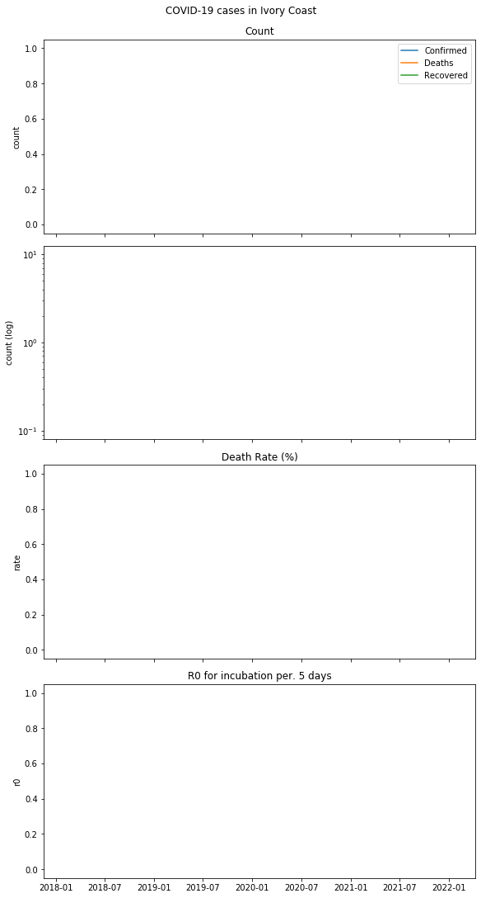
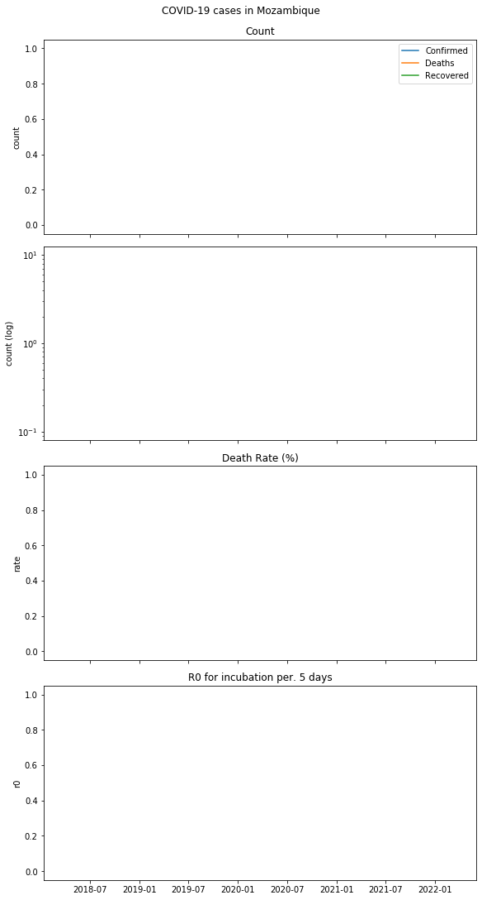
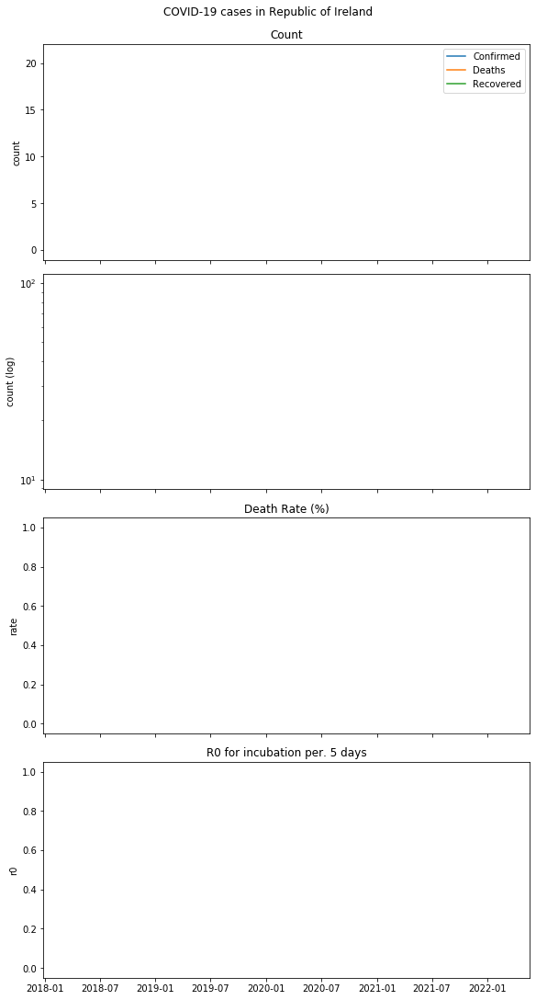
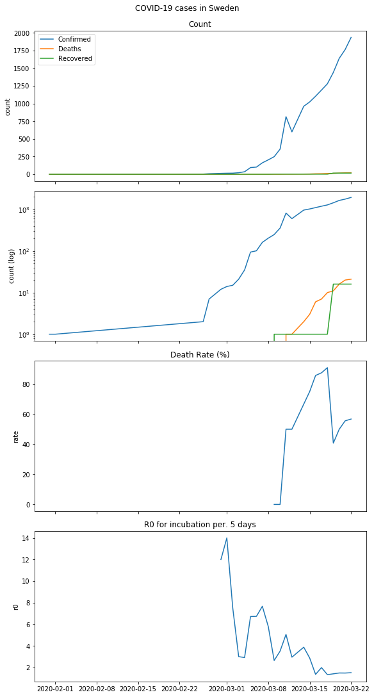
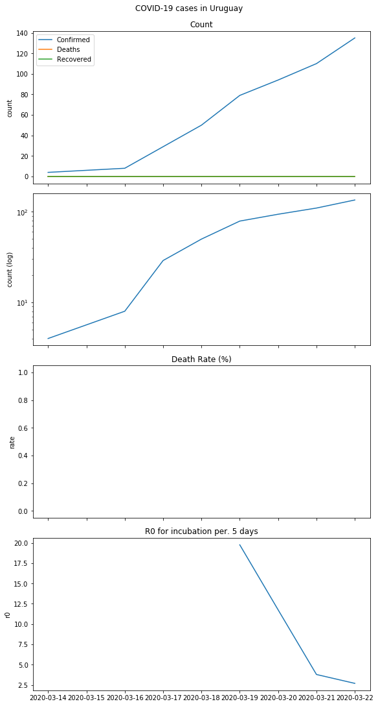
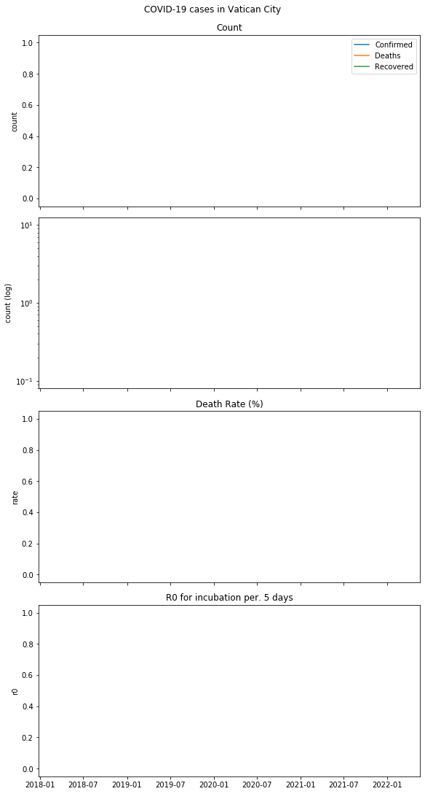

```python
import pandas as pd
import glob
import matplotlib as mpl
import matplotlib.pyplot as plt
import dateutil
from IPython.display import display, HTML

from pandas.plotting import register_matplotlib_converters
register_matplotlib_converters()

# pd.options.display.max_columns = None
# pd.options.display.max_rows = None
```


```python
INCUBATION_PERIOD = 5 # days
```


```python
df = pd.concat(map(pd.read_csv, glob.glob('data/csse_covid_19_data/csse_covid_19_daily_reports/*.csv')), sort=False)
```


```python
df['Country/Region'] = df['Country/Region'].apply(str.strip)
df['Province/State'] = df['Province/State'].fillna('All')
df['Recovered'] = df['Recovered'].fillna(0)
df['Deaths'] = df['Deaths'].fillna(0)
df['Confirmed'] = df['Confirmed'].fillna(0)
```


```python
df['Last Update'] = df['Last Update'].apply(lambda x: dateutil.parser.parse(x).date())
df = df.groupby(['Last Update', 'Country/Region', 'Province/State']).agg({
    'Confirmed': 'max',
    'Deaths': 'max',
    'Recovered': 'max',
    'Latitude': 'first',
    'Longitude': 'first',
}).reset_index()
```


```python
regions = pd.unique(df['Country/Region'])
regions.sort()
```


```python
data_by_country = df.groupby(['Last Update', 'Country/Region',]).agg({
    'Confirmed': 'sum',
    'Deaths': 'sum',
    'Recovered': 'sum',
}).reset_index()

by_country = {}
for country in regions: 
    co_data = data_by_country.loc[data_by_country['Country/Region'] == country].sort_values(['Last Update'])
    co_data['Death Rate (%)'] = 100 * co_data['Deaths'] / (co_data['Recovered'] + co_data['Deaths'])
    r0 = pd.DataFrame({'r0': list(co_data['Confirmed']), 'Last Update': list(co_data['Last Update'])}, index=co_data['Last Update']).rolling(INCUBATION_PERIOD).apply(lambda a: a[-1]/a[0], raw=True)
    
    by_country[country] = {
        'data': co_data,
        'r0': r0,
    }

```


```python
for country, data in by_country.items():       
    anchor = country.lower().replace(' ', '_')
    display(HTML(f'<h2><a name="{anchor}" href="#{anchor}">{country}</a></h2>'))    
    co_data = data['data']
    r0 = data['r0']

    fig, axs = plt.subplots(4, 1, figsize=(8,15), constrained_layout=True, sharex=True)
    fig.suptitle(f'COVID-19 cases in {country}')

    axs[0].set_title('Count')
    axs[0].plot(co_data['Last Update'], co_data['Confirmed'], label='Confirmed')
    axs[0].plot(co_data['Last Update'], co_data['Deaths'], label='Deaths')
    axs[0].plot(co_data['Last Update'], co_data['Recovered'], label='Recovered')
    axs[0].legend()
    axs[0].set_ylabel('count')

    axs[1].set_yscale('log')
    axs[1].plot(co_data['Last Update'], co_data['Confirmed'], label='Confirmed')
    axs[1].plot(co_data['Last Update'], co_data['Deaths'], label='Deaths')
    axs[1].plot(co_data['Last Update'], co_data['Recovered'], label='Recovered')
    axs[1].set_ylabel('count (log)')

    axs[2].set_title('Death Rate (%)')
    axs[2].plot(co_data['Last Update'], co_data['Death Rate (%)'])
    axs[2].set_ylabel('rate')

    axs[3].set_title(f'R0 for incubation per. {INCUBATION_PERIOD} days')
    axs[3].plot(co_data['Last Update'], r0['r0'])
    axs[3].set_ylabel('r0')

    display(HTML(f'<p>Plot of COVID-19 cases.</p>'))
    display(HTML(f'<p>Death rate calculated as (count of death)/(count of death + count of recovered)</p>'))    
    display(fig)
    
    display(HTML(f'<p>Data extracted from <a href="https://github.com/CSSEGISandData/COVID-19">Johns Hopkins CSSE Data Repository</a></p>'))    
    display(data['data'])
    
    display(HTML(f'<p>r0 calculated as (Confirmed cases at day N + incubation period = {INCUBATION_PERIOD} days)/(confirmed cases at day N)</p>'))
    display(HTML(f'<p>Note that this is just a very rough value determined by "garage epidemiology" and should not be used as reference</p>'))
    display(data['r0'])
```


<h2><a name="afghanistan" href="#afghanistan">Afghanistan</a></h2>


<p>Plot of COVID-19 cases.</p>


<p>Death rate calculated as (count of death)/(count of death + count of recovered)</p>


<p>Data extracted from <a href="https://github.com/CSSEGISandData/COVID-19">Johns Hopkins CSSE Data Repository</a></p>


<div>
<style scoped>
    .dataframe tbody tr th:only-of-type {
        vertical-align: middle;
    }

    .dataframe tbody tr th {
        vertical-align: top;
    }

    .dataframe thead th {
        text-align: right;
    }
</style>
<table border="1" class="dataframe">
  <thead>
    <tr style="text-align: right;">
      <th></th>
      <th>Last Update</th>
      <th>Country/Region</th>
      <th>Confirmed</th>
      <th>Deaths</th>
      <th>Recovered</th>
      <th>Death Rate (%)</th>
    </tr>
  </thead>
  <tbody>
    <tr>
      <td>410</td>
      <td>2020-02-24</td>
      <td>Afghanistan</td>
      <td>1.0</td>
      <td>0.0</td>
      <td>0.0</td>
      <td>NaN</td>
    </tr>
    <tr>
      <td>933</td>
      <td>2020-03-08</td>
      <td>Afghanistan</td>
      <td>4.0</td>
      <td>0.0</td>
      <td>0.0</td>
      <td>NaN</td>
    </tr>
    <tr>
      <td>1057</td>
      <td>2020-03-10</td>
      <td>Afghanistan</td>
      <td>5.0</td>
      <td>0.0</td>
      <td>0.0</td>
      <td>NaN</td>
    </tr>
    <tr>
      <td>1145</td>
      <td>2020-03-11</td>
      <td>Afghanistan</td>
      <td>7.0</td>
      <td>0.0</td>
      <td>0.0</td>
      <td>NaN</td>
    </tr>
    <tr>
      <td>1362</td>
      <td>2020-03-14</td>
      <td>Afghanistan</td>
      <td>11.0</td>
      <td>0.0</td>
      <td>0.0</td>
      <td>NaN</td>
    </tr>
    <tr>
      <td>1469</td>
      <td>2020-03-15</td>
      <td>Afghanistan</td>
      <td>16.0</td>
      <td>0.0</td>
      <td>0.0</td>
      <td>NaN</td>
    </tr>
    <tr>
      <td>1558</td>
      <td>2020-03-16</td>
      <td>Afghanistan</td>
      <td>21.0</td>
      <td>0.0</td>
      <td>1.0</td>
      <td>0.0</td>
    </tr>
    <tr>
      <td>1681</td>
      <td>2020-03-17</td>
      <td>Afghanistan</td>
      <td>22.0</td>
      <td>0.0</td>
      <td>1.0</td>
      <td>0.0</td>
    </tr>
    <tr>
      <td>2051</td>
      <td>2020-03-20</td>
      <td>Afghanistan</td>
      <td>24.0</td>
      <td>0.0</td>
      <td>1.0</td>
      <td>0.0</td>
    </tr>
    <tr>
      <td>2313</td>
      <td>2020-03-22</td>
      <td>Afghanistan</td>
      <td>40.0</td>
      <td>1.0</td>
      <td>1.0</td>
      <td>50.0</td>
    </tr>
  </tbody>
</table>
</div>


<p>r0 calculated as (Confirmed cases at day N + incubation period = 5 days)/(confirmed cases at day N)</p>


<p>Note that this is just a very rough value determined by "garage epidemiology" and should not be used as reference</p>


<div>
<style scoped>
    .dataframe tbody tr th:only-of-type {
        vertical-align: middle;
    }

    .dataframe tbody tr th {
        vertical-align: top;
    }

    .dataframe thead th {
        text-align: right;
    }
</style>
<table border="1" class="dataframe">
  <thead>
    <tr style="text-align: right;">
      <th></th>
      <th>r0</th>
    </tr>
    <tr>
      <th>Last Update</th>
      <th></th>
    </tr>
  </thead>
  <tbody>
    <tr>
      <td>2020-02-24</td>
      <td>NaN</td>
    </tr>
    <tr>
      <td>2020-03-08</td>
      <td>NaN</td>
    </tr>
    <tr>
      <td>2020-03-10</td>
      <td>NaN</td>
    </tr>
    <tr>
      <td>2020-03-11</td>
      <td>NaN</td>
    </tr>
    <tr>
      <td>2020-03-14</td>
      <td>11.000000</td>
    </tr>
    <tr>
      <td>2020-03-15</td>
      <td>4.000000</td>
    </tr>
    <tr>
      <td>2020-03-16</td>
      <td>4.200000</td>
    </tr>
    <tr>
      <td>2020-03-17</td>
      <td>3.142857</td>
    </tr>
    <tr>
      <td>2020-03-20</td>
      <td>2.181818</td>
    </tr>
    <tr>
      <td>2020-03-22</td>
      <td>2.500000</td>
    </tr>
  </tbody>
</table>
</div>


<h2><a name="albania" href="#albania">Albania</a></h2>


<p>Plot of COVID-19 cases.</p>


<p>Death rate calculated as (count of death)/(count of death + count of recovered)</p>


<p>Data extracted from <a href="https://github.com/CSSEGISandData/COVID-19">Johns Hopkins CSSE Data Repository</a></p>


<div>
<style scoped>
    .dataframe tbody tr th:only-of-type {
        vertical-align: middle;
    }

    .dataframe tbody tr th {
        vertical-align: top;
    }

    .dataframe thead th {
        text-align: right;
    }
</style>
<table border="1" class="dataframe">
  <thead>
    <tr style="text-align: right;">
      <th></th>
      <th>Last Update</th>
      <th>Country/Region</th>
      <th>Confirmed</th>
      <th>Deaths</th>
      <th>Recovered</th>
      <th>Death Rate (%)</th>
    </tr>
  </thead>
  <tbody>
    <tr>
      <td>1006</td>
      <td>2020-03-09</td>
      <td>Albania</td>
      <td>2.0</td>
      <td>0.0</td>
      <td>0.0</td>
      <td>NaN</td>
    </tr>
    <tr>
      <td>1058</td>
      <td>2020-03-10</td>
      <td>Albania</td>
      <td>10.0</td>
      <td>0.0</td>
      <td>0.0</td>
      <td>NaN</td>
    </tr>
    <tr>
      <td>1146</td>
      <td>2020-03-11</td>
      <td>Albania</td>
      <td>33.0</td>
      <td>1.0</td>
      <td>0.0</td>
      <td>100.0</td>
    </tr>
    <tr>
      <td>1272</td>
      <td>2020-03-12</td>
      <td>Albania</td>
      <td>23.0</td>
      <td>1.0</td>
      <td>0.0</td>
      <td>100.0</td>
    </tr>
    <tr>
      <td>1363</td>
      <td>2020-03-14</td>
      <td>Albania</td>
      <td>38.0</td>
      <td>1.0</td>
      <td>0.0</td>
      <td>100.0</td>
    </tr>
    <tr>
      <td>1470</td>
      <td>2020-03-15</td>
      <td>Albania</td>
      <td>42.0</td>
      <td>1.0</td>
      <td>0.0</td>
      <td>100.0</td>
    </tr>
    <tr>
      <td>1559</td>
      <td>2020-03-16</td>
      <td>Albania</td>
      <td>51.0</td>
      <td>1.0</td>
      <td>0.0</td>
      <td>100.0</td>
    </tr>
    <tr>
      <td>1682</td>
      <td>2020-03-17</td>
      <td>Albania</td>
      <td>55.0</td>
      <td>1.0</td>
      <td>0.0</td>
      <td>100.0</td>
    </tr>
    <tr>
      <td>1803</td>
      <td>2020-03-18</td>
      <td>Albania</td>
      <td>59.0</td>
      <td>2.0</td>
      <td>0.0</td>
      <td>100.0</td>
    </tr>
    <tr>
      <td>1927</td>
      <td>2020-03-19</td>
      <td>Albania</td>
      <td>64.0</td>
      <td>2.0</td>
      <td>0.0</td>
      <td>100.0</td>
    </tr>
    <tr>
      <td>2052</td>
      <td>2020-03-20</td>
      <td>Albania</td>
      <td>70.0</td>
      <td>2.0</td>
      <td>0.0</td>
      <td>100.0</td>
    </tr>
    <tr>
      <td>2179</td>
      <td>2020-03-21</td>
      <td>Albania</td>
      <td>76.0</td>
      <td>2.0</td>
      <td>2.0</td>
      <td>50.0</td>
    </tr>
    <tr>
      <td>2314</td>
      <td>2020-03-22</td>
      <td>Albania</td>
      <td>89.0</td>
      <td>2.0</td>
      <td>2.0</td>
      <td>50.0</td>
    </tr>
  </tbody>
</table>
</div>


<p>r0 calculated as (Confirmed cases at day N + incubation period = 5 days)/(confirmed cases at day N)</p>


<p>Note that this is just a very rough value determined by "garage epidemiology" and should not be used as reference</p>


<div>
<style scoped>
    .dataframe tbody tr th:only-of-type {
        vertical-align: middle;
    }

    .dataframe tbody tr th {
        vertical-align: top;
    }

    .dataframe thead th {
        text-align: right;
    }
</style>
<table border="1" class="dataframe">
  <thead>
    <tr style="text-align: right;">
      <th></th>
      <th>r0</th>
    </tr>
    <tr>
      <th>Last Update</th>
      <th></th>
    </tr>
  </thead>
  <tbody>
    <tr>
      <td>2020-03-09</td>
      <td>NaN</td>
    </tr>
    <tr>
      <td>2020-03-10</td>
      <td>NaN</td>
    </tr>
    <tr>
      <td>2020-03-11</td>
      <td>NaN</td>
    </tr>
    <tr>
      <td>2020-03-12</td>
      <td>NaN</td>
    </tr>
    <tr>
      <td>2020-03-14</td>
      <td>19.000000</td>
    </tr>
    <tr>
      <td>2020-03-15</td>
      <td>4.200000</td>
    </tr>
    <tr>
      <td>2020-03-16</td>
      <td>1.545455</td>
    </tr>
    <tr>
      <td>2020-03-17</td>
      <td>2.391304</td>
    </tr>
    <tr>
      <td>2020-03-18</td>
      <td>1.552632</td>
    </tr>
    <tr>
      <td>2020-03-19</td>
      <td>1.523810</td>
    </tr>
    <tr>
      <td>2020-03-20</td>
      <td>1.372549</td>
    </tr>
    <tr>
      <td>2020-03-21</td>
      <td>1.381818</td>
    </tr>
    <tr>
      <td>2020-03-22</td>
      <td>1.508475</td>
    </tr>
  </tbody>
</table>
</div>


<h2><a name="algeria" href="#algeria">Algeria</a></h2>


<p>Plot of COVID-19 cases.</p>


<p>Death rate calculated as (count of death)/(count of death + count of recovered)</p>


<p>Data extracted from <a href="https://github.com/CSSEGISandData/COVID-19">Johns Hopkins CSSE Data Repository</a></p>


<div>
<style scoped>
    .dataframe tbody tr th:only-of-type {
        vertical-align: middle;
    }

    .dataframe tbody tr th {
        vertical-align: top;
    }

    .dataframe thead th {
        text-align: right;
    }
</style>
<table border="1" class="dataframe">
  <thead>
    <tr style="text-align: right;">
      <th></th>
      <th>Last Update</th>
      <th>Country/Region</th>
      <th>Confirmed</th>
      <th>Deaths</th>
      <th>Recovered</th>
      <th>Death Rate (%)</th>
    </tr>
  </thead>
  <tbody>
    <tr>
      <td>426</td>
      <td>2020-02-25</td>
      <td>Algeria</td>
      <td>1.0</td>
      <td>0.0</td>
      <td>0.0</td>
      <td>NaN</td>
    </tr>
    <tr>
      <td>627</td>
      <td>2020-03-02</td>
      <td>Algeria</td>
      <td>3.0</td>
      <td>0.0</td>
      <td>0.0</td>
      <td>NaN</td>
    </tr>
    <tr>
      <td>668</td>
      <td>2020-03-03</td>
      <td>Algeria</td>
      <td>5.0</td>
      <td>0.0</td>
      <td>0.0</td>
      <td>NaN</td>
    </tr>
    <tr>
      <td>717</td>
      <td>2020-03-04</td>
      <td>Algeria</td>
      <td>12.0</td>
      <td>0.0</td>
      <td>0.0</td>
      <td>NaN</td>
    </tr>
    <tr>
      <td>819</td>
      <td>2020-03-06</td>
      <td>Algeria</td>
      <td>17.0</td>
      <td>0.0</td>
      <td>0.0</td>
      <td>NaN</td>
    </tr>
    <tr>
      <td>934</td>
      <td>2020-03-08</td>
      <td>Algeria</td>
      <td>19.0</td>
      <td>0.0</td>
      <td>0.0</td>
      <td>NaN</td>
    </tr>
    <tr>
      <td>1007</td>
      <td>2020-03-09</td>
      <td>Algeria</td>
      <td>20.0</td>
      <td>0.0</td>
      <td>0.0</td>
      <td>NaN</td>
    </tr>
    <tr>
      <td>1147</td>
      <td>2020-03-11</td>
      <td>Algeria</td>
      <td>26.0</td>
      <td>2.0</td>
      <td>8.0</td>
      <td>20.000000</td>
    </tr>
    <tr>
      <td>1273</td>
      <td>2020-03-12</td>
      <td>Algeria</td>
      <td>24.0</td>
      <td>1.0</td>
      <td>8.0</td>
      <td>11.111111</td>
    </tr>
    <tr>
      <td>1364</td>
      <td>2020-03-14</td>
      <td>Algeria</td>
      <td>37.0</td>
      <td>3.0</td>
      <td>12.0</td>
      <td>20.000000</td>
    </tr>
    <tr>
      <td>1471</td>
      <td>2020-03-15</td>
      <td>Algeria</td>
      <td>48.0</td>
      <td>4.0</td>
      <td>12.0</td>
      <td>25.000000</td>
    </tr>
    <tr>
      <td>1560</td>
      <td>2020-03-16</td>
      <td>Algeria</td>
      <td>54.0</td>
      <td>4.0</td>
      <td>12.0</td>
      <td>25.000000</td>
    </tr>
    <tr>
      <td>1683</td>
      <td>2020-03-17</td>
      <td>Algeria</td>
      <td>60.0</td>
      <td>4.0</td>
      <td>12.0</td>
      <td>25.000000</td>
    </tr>
    <tr>
      <td>1804</td>
      <td>2020-03-18</td>
      <td>Algeria</td>
      <td>74.0</td>
      <td>7.0</td>
      <td>12.0</td>
      <td>36.842105</td>
    </tr>
    <tr>
      <td>1928</td>
      <td>2020-03-19</td>
      <td>Algeria</td>
      <td>87.0</td>
      <td>9.0</td>
      <td>32.0</td>
      <td>21.951220</td>
    </tr>
    <tr>
      <td>2053</td>
      <td>2020-03-20</td>
      <td>Algeria</td>
      <td>90.0</td>
      <td>11.0</td>
      <td>32.0</td>
      <td>25.581395</td>
    </tr>
    <tr>
      <td>2180</td>
      <td>2020-03-21</td>
      <td>Algeria</td>
      <td>139.0</td>
      <td>15.0</td>
      <td>32.0</td>
      <td>31.914894</td>
    </tr>
    <tr>
      <td>2315</td>
      <td>2020-03-22</td>
      <td>Algeria</td>
      <td>201.0</td>
      <td>17.0</td>
      <td>65.0</td>
      <td>20.731707</td>
    </tr>
  </tbody>
</table>
</div>


<p>r0 calculated as (Confirmed cases at day N + incubation period = 5 days)/(confirmed cases at day N)</p>


<p>Note that this is just a very rough value determined by "garage epidemiology" and should not be used as reference</p>


<div>
<style scoped>
    .dataframe tbody tr th:only-of-type {
        vertical-align: middle;
    }

    .dataframe tbody tr th {
        vertical-align: top;
    }

    .dataframe thead th {
        text-align: right;
    }
</style>
<table border="1" class="dataframe">
  <thead>
    <tr style="text-align: right;">
      <th></th>
      <th>r0</th>
    </tr>
    <tr>
      <th>Last Update</th>
      <th></th>
    </tr>
  </thead>
  <tbody>
    <tr>
      <td>2020-02-25</td>
      <td>NaN</td>
    </tr>
    <tr>
      <td>2020-03-02</td>
      <td>NaN</td>
    </tr>
    <tr>
      <td>2020-03-03</td>
      <td>NaN</td>
    </tr>
    <tr>
      <td>2020-03-04</td>
      <td>NaN</td>
    </tr>
    <tr>
      <td>2020-03-06</td>
      <td>17.000000</td>
    </tr>
    <tr>
      <td>2020-03-08</td>
      <td>6.333333</td>
    </tr>
    <tr>
      <td>2020-03-09</td>
      <td>4.000000</td>
    </tr>
    <tr>
      <td>2020-03-11</td>
      <td>2.166667</td>
    </tr>
    <tr>
      <td>2020-03-12</td>
      <td>1.411765</td>
    </tr>
    <tr>
      <td>2020-03-14</td>
      <td>1.947368</td>
    </tr>
    <tr>
      <td>2020-03-15</td>
      <td>2.400000</td>
    </tr>
    <tr>
      <td>2020-03-16</td>
      <td>2.076923</td>
    </tr>
    <tr>
      <td>2020-03-17</td>
      <td>2.500000</td>
    </tr>
    <tr>
      <td>2020-03-18</td>
      <td>2.000000</td>
    </tr>
    <tr>
      <td>2020-03-19</td>
      <td>1.812500</td>
    </tr>
    <tr>
      <td>2020-03-20</td>
      <td>1.666667</td>
    </tr>
    <tr>
      <td>2020-03-21</td>
      <td>2.316667</td>
    </tr>
    <tr>
      <td>2020-03-22</td>
      <td>2.716216</td>
    </tr>
  </tbody>
</table>
</div>


<h2><a name="andorra" href="#andorra">Andorra</a></h2>


<p>Plot of COVID-19 cases.</p>


<p>Death rate calculated as (count of death)/(count of death + count of recovered)</p>


<p>Data extracted from <a href="https://github.com/CSSEGISandData/COVID-19">Johns Hopkins CSSE Data Repository</a></p>


<div>
<style scoped>
    .dataframe tbody tr th:only-of-type {
        vertical-align: middle;
    }

    .dataframe tbody tr th {
        vertical-align: top;
    }

    .dataframe thead th {
        text-align: right;
    }
</style>
<table border="1" class="dataframe">
  <thead>
    <tr style="text-align: right;">
      <th></th>
      <th>Last Update</th>
      <th>Country/Region</th>
      <th>Confirmed</th>
      <th>Deaths</th>
      <th>Recovered</th>
      <th>Death Rate (%)</th>
    </tr>
  </thead>
  <tbody>
    <tr>
      <td>628</td>
      <td>2020-03-02</td>
      <td>Andorra</td>
      <td>1.0</td>
      <td>0.0</td>
      <td>0.0</td>
      <td>NaN</td>
    </tr>
    <tr>
      <td>1148</td>
      <td>2020-03-11</td>
      <td>Andorra</td>
      <td>1.0</td>
      <td>0.0</td>
      <td>0.0</td>
      <td>NaN</td>
    </tr>
    <tr>
      <td>1274</td>
      <td>2020-03-12</td>
      <td>Andorra</td>
      <td>1.0</td>
      <td>0.0</td>
      <td>1.0</td>
      <td>0.0</td>
    </tr>
    <tr>
      <td>1325</td>
      <td>2020-03-13</td>
      <td>Andorra</td>
      <td>1.0</td>
      <td>0.0</td>
      <td>1.0</td>
      <td>0.0</td>
    </tr>
    <tr>
      <td>1561</td>
      <td>2020-03-16</td>
      <td>Andorra</td>
      <td>2.0</td>
      <td>0.0</td>
      <td>1.0</td>
      <td>0.0</td>
    </tr>
    <tr>
      <td>1684</td>
      <td>2020-03-17</td>
      <td>Andorra</td>
      <td>39.0</td>
      <td>0.0</td>
      <td>1.0</td>
      <td>0.0</td>
    </tr>
    <tr>
      <td>1929</td>
      <td>2020-03-19</td>
      <td>Andorra</td>
      <td>53.0</td>
      <td>0.0</td>
      <td>1.0</td>
      <td>0.0</td>
    </tr>
    <tr>
      <td>2054</td>
      <td>2020-03-20</td>
      <td>Andorra</td>
      <td>75.0</td>
      <td>0.0</td>
      <td>1.0</td>
      <td>0.0</td>
    </tr>
    <tr>
      <td>2181</td>
      <td>2020-03-21</td>
      <td>Andorra</td>
      <td>88.0</td>
      <td>0.0</td>
      <td>1.0</td>
      <td>0.0</td>
    </tr>
    <tr>
      <td>2316</td>
      <td>2020-03-22</td>
      <td>Andorra</td>
      <td>113.0</td>
      <td>1.0</td>
      <td>1.0</td>
      <td>50.0</td>
    </tr>
  </tbody>
</table>
</div>


<p>r0 calculated as (Confirmed cases at day N + incubation period = 5 days)/(confirmed cases at day N)</p>


<p>Note that this is just a very rough value determined by "garage epidemiology" and should not be used as reference</p>


<div>
<style scoped>
    .dataframe tbody tr th:only-of-type {
        vertical-align: middle;
    }

    .dataframe tbody tr th {
        vertical-align: top;
    }

    .dataframe thead th {
        text-align: right;
    }
</style>
<table border="1" class="dataframe">
  <thead>
    <tr style="text-align: right;">
      <th></th>
      <th>r0</th>
    </tr>
    <tr>
      <th>Last Update</th>
      <th></th>
    </tr>
  </thead>
  <tbody>
    <tr>
      <td>2020-03-02</td>
      <td>NaN</td>
    </tr>
    <tr>
      <td>2020-03-11</td>
      <td>NaN</td>
    </tr>
    <tr>
      <td>2020-03-12</td>
      <td>NaN</td>
    </tr>
    <tr>
      <td>2020-03-13</td>
      <td>NaN</td>
    </tr>
    <tr>
      <td>2020-03-16</td>
      <td>2.000000</td>
    </tr>
    <tr>
      <td>2020-03-17</td>
      <td>39.000000</td>
    </tr>
    <tr>
      <td>2020-03-19</td>
      <td>53.000000</td>
    </tr>
    <tr>
      <td>2020-03-20</td>
      <td>75.000000</td>
    </tr>
    <tr>
      <td>2020-03-21</td>
      <td>44.000000</td>
    </tr>
    <tr>
      <td>2020-03-22</td>
      <td>2.897436</td>
    </tr>
  </tbody>
</table>
</div>


<h2><a name="angola" href="#angola">Angola</a></h2>


<p>Plot of COVID-19 cases.</p>


<p>Death rate calculated as (count of death)/(count of death + count of recovered)</p>


<p>Data extracted from <a href="https://github.com/CSSEGISandData/COVID-19">Johns Hopkins CSSE Data Repository</a></p>


<div>
<style scoped>
    .dataframe tbody tr th:only-of-type {
        vertical-align: middle;
    }

    .dataframe tbody tr th {
        vertical-align: top;
    }

    .dataframe thead th {
        text-align: right;
    }
</style>
<table border="1" class="dataframe">
  <thead>
    <tr style="text-align: right;">
      <th></th>
      <th>Last Update</th>
      <th>Country/Region</th>
      <th>Confirmed</th>
      <th>Deaths</th>
      <th>Recovered</th>
      <th>Death Rate (%)</th>
    </tr>
  </thead>
  <tbody>
    <tr>
      <td>2055</td>
      <td>2020-03-20</td>
      <td>Angola</td>
      <td>1.0</td>
      <td>0.0</td>
      <td>0.0</td>
      <td>NaN</td>
    </tr>
    <tr>
      <td>2182</td>
      <td>2020-03-21</td>
      <td>Angola</td>
      <td>2.0</td>
      <td>0.0</td>
      <td>0.0</td>
      <td>NaN</td>
    </tr>
  </tbody>
</table>
</div>


<p>r0 calculated as (Confirmed cases at day N + incubation period = 5 days)/(confirmed cases at day N)</p>


<p>Note that this is just a very rough value determined by "garage epidemiology" and should not be used as reference</p>


<div>
<style scoped>
    .dataframe tbody tr th:only-of-type {
        vertical-align: middle;
    }

    .dataframe tbody tr th {
        vertical-align: top;
    }

    .dataframe thead th {
        text-align: right;
    }
</style>
<table border="1" class="dataframe">
  <thead>
    <tr style="text-align: right;">
      <th></th>
      <th>r0</th>
    </tr>
    <tr>
      <th>Last Update</th>
      <th></th>
    </tr>
  </thead>
  <tbody>
    <tr>
      <td>2020-03-20</td>
      <td>NaN</td>
    </tr>
    <tr>
      <td>2020-03-21</td>
      <td>NaN</td>
    </tr>
  </tbody>
</table>
</div>


<h2><a name="antigua_and_barbuda" href="#antigua_and_barbuda">Antigua and Barbuda</a></h2>


<p>Plot of COVID-19 cases.</p>


<p>Death rate calculated as (count of death)/(count of death + count of recovered)</p>


<p>Data extracted from <a href="https://github.com/CSSEGISandData/COVID-19">Johns Hopkins CSSE Data Repository</a></p>


<div>
<style scoped>
    .dataframe tbody tr th:only-of-type {
        vertical-align: middle;
    }

    .dataframe tbody tr th {
        vertical-align: top;
    }

    .dataframe thead th {
        text-align: right;
    }
</style>
<table border="1" class="dataframe">
  <thead>
    <tr style="text-align: right;">
      <th></th>
      <th>Last Update</th>
      <th>Country/Region</th>
      <th>Confirmed</th>
      <th>Deaths</th>
      <th>Recovered</th>
      <th>Death Rate (%)</th>
    </tr>
  </thead>
  <tbody>
    <tr>
      <td>1149</td>
      <td>2020-03-11</td>
      <td>Antigua and Barbuda</td>
      <td>1.0</td>
      <td>0.0</td>
      <td>0.0</td>
      <td>NaN</td>
    </tr>
    <tr>
      <td>1326</td>
      <td>2020-03-13</td>
      <td>Antigua and Barbuda</td>
      <td>1.0</td>
      <td>0.0</td>
      <td>0.0</td>
      <td>NaN</td>
    </tr>
    <tr>
      <td>1472</td>
      <td>2020-03-15</td>
      <td>Antigua and Barbuda</td>
      <td>1.0</td>
      <td>0.0</td>
      <td>0.0</td>
      <td>NaN</td>
    </tr>
  </tbody>
</table>
</div>


<p>r0 calculated as (Confirmed cases at day N + incubation period = 5 days)/(confirmed cases at day N)</p>


<p>Note that this is just a very rough value determined by "garage epidemiology" and should not be used as reference</p>


<div>
<style scoped>
    .dataframe tbody tr th:only-of-type {
        vertical-align: middle;
    }

    .dataframe tbody tr th {
        vertical-align: top;
    }

    .dataframe thead th {
        text-align: right;
    }
</style>
<table border="1" class="dataframe">
  <thead>
    <tr style="text-align: right;">
      <th></th>
      <th>r0</th>
    </tr>
    <tr>
      <th>Last Update</th>
      <th></th>
    </tr>
  </thead>
  <tbody>
    <tr>
      <td>2020-03-11</td>
      <td>NaN</td>
    </tr>
    <tr>
      <td>2020-03-13</td>
      <td>NaN</td>
    </tr>
    <tr>
      <td>2020-03-15</td>
      <td>NaN</td>
    </tr>
  </tbody>
</table>
</div>


<h2><a name="argentina" href="#argentina">Argentina</a></h2>


<p>Plot of COVID-19 cases.</p>


<p>Death rate calculated as (count of death)/(count of death + count of recovered)</p>


<p>Data extracted from <a href="https://github.com/CSSEGISandData/COVID-19">Johns Hopkins CSSE Data Repository</a></p>


<div>
<style scoped>
    .dataframe tbody tr th:only-of-type {
        vertical-align: middle;
    }

    .dataframe tbody tr th {
        vertical-align: top;
    }

    .dataframe thead th {
        text-align: right;
    }
</style>
<table border="1" class="dataframe">
  <thead>
    <tr style="text-align: right;">
      <th></th>
      <th>Last Update</th>
      <th>Country/Region</th>
      <th>Confirmed</th>
      <th>Deaths</th>
      <th>Recovered</th>
      <th>Death Rate (%)</th>
    </tr>
  </thead>
  <tbody>
    <tr>
      <td>669</td>
      <td>2020-03-03</td>
      <td>Argentina</td>
      <td>1.0</td>
      <td>0.0</td>
      <td>0.0</td>
      <td>NaN</td>
    </tr>
    <tr>
      <td>718</td>
      <td>2020-03-04</td>
      <td>Argentina</td>
      <td>1.0</td>
      <td>0.0</td>
      <td>0.0</td>
      <td>NaN</td>
    </tr>
    <tr>
      <td>820</td>
      <td>2020-03-06</td>
      <td>Argentina</td>
      <td>2.0</td>
      <td>0.0</td>
      <td>0.0</td>
      <td>NaN</td>
    </tr>
    <tr>
      <td>885</td>
      <td>2020-03-07</td>
      <td>Argentina</td>
      <td>8.0</td>
      <td>0.0</td>
      <td>0.0</td>
      <td>NaN</td>
    </tr>
    <tr>
      <td>935</td>
      <td>2020-03-08</td>
      <td>Argentina</td>
      <td>12.0</td>
      <td>1.0</td>
      <td>0.0</td>
      <td>100.000000</td>
    </tr>
    <tr>
      <td>1059</td>
      <td>2020-03-10</td>
      <td>Argentina</td>
      <td>17.0</td>
      <td>1.0</td>
      <td>0.0</td>
      <td>100.000000</td>
    </tr>
    <tr>
      <td>1150</td>
      <td>2020-03-11</td>
      <td>Argentina</td>
      <td>31.0</td>
      <td>2.0</td>
      <td>0.0</td>
      <td>100.000000</td>
    </tr>
    <tr>
      <td>1365</td>
      <td>2020-03-14</td>
      <td>Argentina</td>
      <td>34.0</td>
      <td>2.0</td>
      <td>1.0</td>
      <td>66.666667</td>
    </tr>
    <tr>
      <td>1473</td>
      <td>2020-03-15</td>
      <td>Argentina</td>
      <td>45.0</td>
      <td>2.0</td>
      <td>1.0</td>
      <td>66.666667</td>
    </tr>
    <tr>
      <td>1562</td>
      <td>2020-03-16</td>
      <td>Argentina</td>
      <td>56.0</td>
      <td>2.0</td>
      <td>1.0</td>
      <td>66.666667</td>
    </tr>
    <tr>
      <td>1685</td>
      <td>2020-03-17</td>
      <td>Argentina</td>
      <td>68.0</td>
      <td>2.0</td>
      <td>3.0</td>
      <td>40.000000</td>
    </tr>
    <tr>
      <td>1805</td>
      <td>2020-03-18</td>
      <td>Argentina</td>
      <td>79.0</td>
      <td>2.0</td>
      <td>3.0</td>
      <td>40.000000</td>
    </tr>
    <tr>
      <td>1930</td>
      <td>2020-03-19</td>
      <td>Argentina</td>
      <td>97.0</td>
      <td>3.0</td>
      <td>3.0</td>
      <td>50.000000</td>
    </tr>
    <tr>
      <td>2056</td>
      <td>2020-03-20</td>
      <td>Argentina</td>
      <td>128.0</td>
      <td>3.0</td>
      <td>3.0</td>
      <td>50.000000</td>
    </tr>
    <tr>
      <td>2183</td>
      <td>2020-03-21</td>
      <td>Argentina</td>
      <td>158.0</td>
      <td>4.0</td>
      <td>3.0</td>
      <td>57.142857</td>
    </tr>
    <tr>
      <td>2317</td>
      <td>2020-03-22</td>
      <td>Argentina</td>
      <td>225.0</td>
      <td>4.0</td>
      <td>3.0</td>
      <td>57.142857</td>
    </tr>
  </tbody>
</table>
</div>


<p>r0 calculated as (Confirmed cases at day N + incubation period = 5 days)/(confirmed cases at day N)</p>


<p>Note that this is just a very rough value determined by "garage epidemiology" and should not be used as reference</p>


<div>
<style scoped>
    .dataframe tbody tr th:only-of-type {
        vertical-align: middle;
    }

    .dataframe tbody tr th {
        vertical-align: top;
    }

    .dataframe thead th {
        text-align: right;
    }
</style>
<table border="1" class="dataframe">
  <thead>
    <tr style="text-align: right;">
      <th></th>
      <th>r0</th>
    </tr>
    <tr>
      <th>Last Update</th>
      <th></th>
    </tr>
  </thead>
  <tbody>
    <tr>
      <td>2020-03-03</td>
      <td>NaN</td>
    </tr>
    <tr>
      <td>2020-03-04</td>
      <td>NaN</td>
    </tr>
    <tr>
      <td>2020-03-06</td>
      <td>NaN</td>
    </tr>
    <tr>
      <td>2020-03-07</td>
      <td>NaN</td>
    </tr>
    <tr>
      <td>2020-03-08</td>
      <td>12.000000</td>
    </tr>
    <tr>
      <td>2020-03-10</td>
      <td>17.000000</td>
    </tr>
    <tr>
      <td>2020-03-11</td>
      <td>15.500000</td>
    </tr>
    <tr>
      <td>2020-03-14</td>
      <td>4.250000</td>
    </tr>
    <tr>
      <td>2020-03-15</td>
      <td>3.750000</td>
    </tr>
    <tr>
      <td>2020-03-16</td>
      <td>3.294118</td>
    </tr>
    <tr>
      <td>2020-03-17</td>
      <td>2.193548</td>
    </tr>
    <tr>
      <td>2020-03-18</td>
      <td>2.323529</td>
    </tr>
    <tr>
      <td>2020-03-19</td>
      <td>2.155556</td>
    </tr>
    <tr>
      <td>2020-03-20</td>
      <td>2.285714</td>
    </tr>
    <tr>
      <td>2020-03-21</td>
      <td>2.323529</td>
    </tr>
    <tr>
      <td>2020-03-22</td>
      <td>2.848101</td>
    </tr>
  </tbody>
</table>
</div>


<h2><a name="armenia" href="#armenia">Armenia</a></h2>


<p>Plot of COVID-19 cases.</p>


<p>Death rate calculated as (count of death)/(count of death + count of recovered)</p>


<p>Data extracted from <a href="https://github.com/CSSEGISandData/COVID-19">Johns Hopkins CSSE Data Repository</a></p>


<div>
<style scoped>
    .dataframe tbody tr th:only-of-type {
        vertical-align: middle;
    }

    .dataframe tbody tr th {
        vertical-align: top;
    }

    .dataframe thead th {
        text-align: right;
    }
</style>
<table border="1" class="dataframe">
  <thead>
    <tr style="text-align: right;">
      <th></th>
      <th>Last Update</th>
      <th>Country/Region</th>
      <th>Confirmed</th>
      <th>Deaths</th>
      <th>Recovered</th>
      <th>Death Rate (%)</th>
    </tr>
  </thead>
  <tbody>
    <tr>
      <td>583</td>
      <td>2020-03-01</td>
      <td>Armenia</td>
      <td>1.0</td>
      <td>0.0</td>
      <td>0.0</td>
      <td>NaN</td>
    </tr>
    <tr>
      <td>1151</td>
      <td>2020-03-11</td>
      <td>Armenia</td>
      <td>8.0</td>
      <td>0.0</td>
      <td>0.0</td>
      <td>NaN</td>
    </tr>
    <tr>
      <td>1275</td>
      <td>2020-03-12</td>
      <td>Armenia</td>
      <td>4.0</td>
      <td>0.0</td>
      <td>0.0</td>
      <td>NaN</td>
    </tr>
    <tr>
      <td>1366</td>
      <td>2020-03-14</td>
      <td>Armenia</td>
      <td>18.0</td>
      <td>0.0</td>
      <td>0.0</td>
      <td>NaN</td>
    </tr>
    <tr>
      <td>1474</td>
      <td>2020-03-15</td>
      <td>Armenia</td>
      <td>26.0</td>
      <td>0.0</td>
      <td>0.0</td>
      <td>NaN</td>
    </tr>
    <tr>
      <td>1563</td>
      <td>2020-03-16</td>
      <td>Armenia</td>
      <td>52.0</td>
      <td>0.0</td>
      <td>0.0</td>
      <td>NaN</td>
    </tr>
    <tr>
      <td>1686</td>
      <td>2020-03-17</td>
      <td>Armenia</td>
      <td>78.0</td>
      <td>0.0</td>
      <td>1.0</td>
      <td>0.0</td>
    </tr>
    <tr>
      <td>1806</td>
      <td>2020-03-18</td>
      <td>Armenia</td>
      <td>84.0</td>
      <td>0.0</td>
      <td>1.0</td>
      <td>0.0</td>
    </tr>
    <tr>
      <td>1931</td>
      <td>2020-03-19</td>
      <td>Armenia</td>
      <td>115.0</td>
      <td>0.0</td>
      <td>1.0</td>
      <td>0.0</td>
    </tr>
    <tr>
      <td>2057</td>
      <td>2020-03-20</td>
      <td>Armenia</td>
      <td>136.0</td>
      <td>0.0</td>
      <td>1.0</td>
      <td>0.0</td>
    </tr>
    <tr>
      <td>2184</td>
      <td>2020-03-21</td>
      <td>Armenia</td>
      <td>160.0</td>
      <td>0.0</td>
      <td>1.0</td>
      <td>0.0</td>
    </tr>
    <tr>
      <td>2318</td>
      <td>2020-03-22</td>
      <td>Armenia</td>
      <td>194.0</td>
      <td>0.0</td>
      <td>2.0</td>
      <td>0.0</td>
    </tr>
  </tbody>
</table>
</div>


<p>r0 calculated as (Confirmed cases at day N + incubation period = 5 days)/(confirmed cases at day N)</p>


<p>Note that this is just a very rough value determined by "garage epidemiology" and should not be used as reference</p>


<div>
<style scoped>
    .dataframe tbody tr th:only-of-type {
        vertical-align: middle;
    }

    .dataframe tbody tr th {
        vertical-align: top;
    }

    .dataframe thead th {
        text-align: right;
    }
</style>
<table border="1" class="dataframe">
  <thead>
    <tr style="text-align: right;">
      <th></th>
      <th>r0</th>
    </tr>
    <tr>
      <th>Last Update</th>
      <th></th>
    </tr>
  </thead>
  <tbody>
    <tr>
      <td>2020-03-01</td>
      <td>NaN</td>
    </tr>
    <tr>
      <td>2020-03-11</td>
      <td>NaN</td>
    </tr>
    <tr>
      <td>2020-03-12</td>
      <td>NaN</td>
    </tr>
    <tr>
      <td>2020-03-14</td>
      <td>NaN</td>
    </tr>
    <tr>
      <td>2020-03-15</td>
      <td>26.000000</td>
    </tr>
    <tr>
      <td>2020-03-16</td>
      <td>6.500000</td>
    </tr>
    <tr>
      <td>2020-03-17</td>
      <td>19.500000</td>
    </tr>
    <tr>
      <td>2020-03-18</td>
      <td>4.666667</td>
    </tr>
    <tr>
      <td>2020-03-19</td>
      <td>4.423077</td>
    </tr>
    <tr>
      <td>2020-03-20</td>
      <td>2.615385</td>
    </tr>
    <tr>
      <td>2020-03-21</td>
      <td>2.051282</td>
    </tr>
    <tr>
      <td>2020-03-22</td>
      <td>2.309524</td>
    </tr>
  </tbody>
</table>
</div>


<h2><a name="aruba" href="#aruba">Aruba</a></h2>


<p>Plot of COVID-19 cases.</p>


<p>Death rate calculated as (count of death)/(count of death + count of recovered)</p>


<p>Data extracted from <a href="https://github.com/CSSEGISandData/COVID-19">Johns Hopkins CSSE Data Repository</a></p>


<div>
<style scoped>
    .dataframe tbody tr th:only-of-type {
        vertical-align: middle;
    }

    .dataframe tbody tr th {
        vertical-align: top;
    }

    .dataframe thead th {
        text-align: right;
    }
</style>
<table border="1" class="dataframe">
  <thead>
    <tr style="text-align: right;">
      <th></th>
      <th>Last Update</th>
      <th>Country/Region</th>
      <th>Confirmed</th>
      <th>Deaths</th>
      <th>Recovered</th>
      <th>Death Rate (%)</th>
    </tr>
  </thead>
  <tbody>
    <tr>
      <td>1152</td>
      <td>2020-03-11</td>
      <td>Aruba</td>
      <td>2.0</td>
      <td>0.0</td>
      <td>0.0</td>
      <td>NaN</td>
    </tr>
    <tr>
      <td>1327</td>
      <td>2020-03-13</td>
      <td>Aruba</td>
      <td>2.0</td>
      <td>0.0</td>
      <td>0.0</td>
      <td>NaN</td>
    </tr>
    <tr>
      <td>1687</td>
      <td>2020-03-17</td>
      <td>Aruba</td>
      <td>3.0</td>
      <td>0.0</td>
      <td>0.0</td>
      <td>NaN</td>
    </tr>
    <tr>
      <td>1807</td>
      <td>2020-03-18</td>
      <td>Aruba</td>
      <td>4.0</td>
      <td>0.0</td>
      <td>0.0</td>
      <td>NaN</td>
    </tr>
  </tbody>
</table>
</div>


<p>r0 calculated as (Confirmed cases at day N + incubation period = 5 days)/(confirmed cases at day N)</p>


<p>Note that this is just a very rough value determined by "garage epidemiology" and should not be used as reference</p>


<div>
<style scoped>
    .dataframe tbody tr th:only-of-type {
        vertical-align: middle;
    }

    .dataframe tbody tr th {
        vertical-align: top;
    }

    .dataframe thead th {
        text-align: right;
    }
</style>
<table border="1" class="dataframe">
  <thead>
    <tr style="text-align: right;">
      <th></th>
      <th>r0</th>
    </tr>
    <tr>
      <th>Last Update</th>
      <th></th>
    </tr>
  </thead>
  <tbody>
    <tr>
      <td>2020-03-11</td>
      <td>NaN</td>
    </tr>
    <tr>
      <td>2020-03-13</td>
      <td>NaN</td>
    </tr>
    <tr>
      <td>2020-03-17</td>
      <td>NaN</td>
    </tr>
    <tr>
      <td>2020-03-18</td>
      <td>NaN</td>
    </tr>
  </tbody>
</table>
</div>


<h2><a name="australia" href="#australia">Australia</a></h2>


<p>Plot of COVID-19 cases.</p>


<p>Death rate calculated as (count of death)/(count of death + count of recovered)</p>


<p>Data extracted from <a href="https://github.com/CSSEGISandData/COVID-19">Johns Hopkins CSSE Data Repository</a></p>


<div>
<style scoped>
    .dataframe tbody tr th:only-of-type {
        vertical-align: middle;
    }

    .dataframe tbody tr th {
        vertical-align: top;
    }

    .dataframe thead th {
        text-align: right;
    }
</style>
<table border="1" class="dataframe">
  <thead>
    <tr style="text-align: right;">
      <th></th>
      <th>Last Update</th>
      <th>Country/Region</th>
      <th>Confirmed</th>
      <th>Deaths</th>
      <th>Recovered</th>
      <th>Death Rate (%)</th>
    </tr>
  </thead>
  <tbody>
    <tr>
      <td>8</td>
      <td>2020-01-23</td>
      <td>Australia</td>
      <td>0.0</td>
      <td>0.0</td>
      <td>0.0</td>
      <td>NaN</td>
    </tr>
    <tr>
      <td>35</td>
      <td>2020-01-25</td>
      <td>Australia</td>
      <td>4.0</td>
      <td>0.0</td>
      <td>0.0</td>
      <td>NaN</td>
    </tr>
    <tr>
      <td>49</td>
      <td>2020-01-26</td>
      <td>Australia</td>
      <td>4.0</td>
      <td>0.0</td>
      <td>0.0</td>
      <td>NaN</td>
    </tr>
    <tr>
      <td>64</td>
      <td>2020-01-27</td>
      <td>Australia</td>
      <td>5.0</td>
      <td>0.0</td>
      <td>0.0</td>
      <td>NaN</td>
    </tr>
    <tr>
      <td>82</td>
      <td>2020-01-28</td>
      <td>Australia</td>
      <td>5.0</td>
      <td>0.0</td>
      <td>0.0</td>
      <td>NaN</td>
    </tr>
    <tr>
      <td>100</td>
      <td>2020-01-29</td>
      <td>Australia</td>
      <td>5.0</td>
      <td>0.0</td>
      <td>0.0</td>
      <td>NaN</td>
    </tr>
    <tr>
      <td>120</td>
      <td>2020-01-30</td>
      <td>Australia</td>
      <td>9.0</td>
      <td>0.0</td>
      <td>2.0</td>
      <td>0.000000</td>
    </tr>
    <tr>
      <td>142</td>
      <td>2020-01-31</td>
      <td>Australia</td>
      <td>9.0</td>
      <td>0.0</td>
      <td>2.0</td>
      <td>0.000000</td>
    </tr>
    <tr>
      <td>168</td>
      <td>2020-02-01</td>
      <td>Australia</td>
      <td>12.0</td>
      <td>0.0</td>
      <td>2.0</td>
      <td>0.000000</td>
    </tr>
    <tr>
      <td>183</td>
      <td>2020-02-02</td>
      <td>Australia</td>
      <td>4.0</td>
      <td>0.0</td>
      <td>0.0</td>
      <td>NaN</td>
    </tr>
    <tr>
      <td>198</td>
      <td>2020-02-04</td>
      <td>Australia</td>
      <td>3.0</td>
      <td>0.0</td>
      <td>0.0</td>
      <td>NaN</td>
    </tr>
    <tr>
      <td>217</td>
      <td>2020-02-06</td>
      <td>Australia</td>
      <td>8.0</td>
      <td>0.0</td>
      <td>2.0</td>
      <td>0.000000</td>
    </tr>
    <tr>
      <td>225</td>
      <td>2020-02-07</td>
      <td>Australia</td>
      <td>5.0</td>
      <td>0.0</td>
      <td>0.0</td>
      <td>NaN</td>
    </tr>
    <tr>
      <td>248</td>
      <td>2020-02-09</td>
      <td>Australia</td>
      <td>5.0</td>
      <td>0.0</td>
      <td>0.0</td>
      <td>NaN</td>
    </tr>
    <tr>
      <td>295</td>
      <td>2020-02-13</td>
      <td>Australia</td>
      <td>8.0</td>
      <td>0.0</td>
      <td>8.0</td>
      <td>0.000000</td>
    </tr>
    <tr>
      <td>336</td>
      <td>2020-02-17</td>
      <td>Australia</td>
      <td>2.0</td>
      <td>0.0</td>
      <td>2.0</td>
      <td>0.000000</td>
    </tr>
    <tr>
      <td>371</td>
      <td>2020-02-21</td>
      <td>Australia</td>
      <td>9.0</td>
      <td>0.0</td>
      <td>1.0</td>
      <td>0.000000</td>
    </tr>
    <tr>
      <td>388</td>
      <td>2020-02-22</td>
      <td>Australia</td>
      <td>7.0</td>
      <td>0.0</td>
      <td>0.0</td>
      <td>NaN</td>
    </tr>
    <tr>
      <td>480</td>
      <td>2020-02-27</td>
      <td>Australia</td>
      <td>8.0</td>
      <td>0.0</td>
      <td>0.0</td>
      <td>NaN</td>
    </tr>
    <tr>
      <td>543</td>
      <td>2020-02-29</td>
      <td>Australia</td>
      <td>21.0</td>
      <td>0.0</td>
      <td>7.0</td>
      <td>0.000000</td>
    </tr>
    <tr>
      <td>584</td>
      <td>2020-03-01</td>
      <td>Australia</td>
      <td>8.0</td>
      <td>1.0</td>
      <td>4.0</td>
      <td>20.000000</td>
    </tr>
    <tr>
      <td>629</td>
      <td>2020-03-02</td>
      <td>Australia</td>
      <td>10.0</td>
      <td>0.0</td>
      <td>4.0</td>
      <td>0.000000</td>
    </tr>
    <tr>
      <td>670</td>
      <td>2020-03-03</td>
      <td>Australia</td>
      <td>24.0</td>
      <td>0.0</td>
      <td>5.0</td>
      <td>0.000000</td>
    </tr>
    <tr>
      <td>719</td>
      <td>2020-03-04</td>
      <td>Australia</td>
      <td>38.0</td>
      <td>1.0</td>
      <td>10.0</td>
      <td>9.090909</td>
    </tr>
    <tr>
      <td>769</td>
      <td>2020-03-05</td>
      <td>Australia</td>
      <td>26.0</td>
      <td>1.0</td>
      <td>15.0</td>
      <td>6.250000</td>
    </tr>
    <tr>
      <td>821</td>
      <td>2020-03-06</td>
      <td>Australia</td>
      <td>33.0</td>
      <td>1.0</td>
      <td>6.0</td>
      <td>14.285714</td>
    </tr>
    <tr>
      <td>886</td>
      <td>2020-03-07</td>
      <td>Australia</td>
      <td>39.0</td>
      <td>1.0</td>
      <td>11.0</td>
      <td>8.333333</td>
    </tr>
    <tr>
      <td>936</td>
      <td>2020-03-08</td>
      <td>Australia</td>
      <td>55.0</td>
      <td>3.0</td>
      <td>12.0</td>
      <td>20.000000</td>
    </tr>
    <tr>
      <td>1008</td>
      <td>2020-03-09</td>
      <td>Australia</td>
      <td>67.0</td>
      <td>4.0</td>
      <td>11.0</td>
      <td>26.666667</td>
    </tr>
    <tr>
      <td>1060</td>
      <td>2020-03-10</td>
      <td>Australia</td>
      <td>98.0</td>
      <td>3.0</td>
      <td>19.0</td>
      <td>13.636364</td>
    </tr>
    <tr>
      <td>1153</td>
      <td>2020-03-11</td>
      <td>Australia</td>
      <td>200.0</td>
      <td>3.0</td>
      <td>23.0</td>
      <td>11.538462</td>
    </tr>
    <tr>
      <td>1367</td>
      <td>2020-03-14</td>
      <td>Australia</td>
      <td>250.0</td>
      <td>3.0</td>
      <td>23.0</td>
      <td>11.538462</td>
    </tr>
    <tr>
      <td>1475</td>
      <td>2020-03-15</td>
      <td>Australia</td>
      <td>278.0</td>
      <td>2.0</td>
      <td>23.0</td>
      <td>8.000000</td>
    </tr>
    <tr>
      <td>1564</td>
      <td>2020-03-16</td>
      <td>Australia</td>
      <td>376.0</td>
      <td>3.0</td>
      <td>23.0</td>
      <td>11.538462</td>
    </tr>
    <tr>
      <td>1688</td>
      <td>2020-03-17</td>
      <td>Australia</td>
      <td>413.0</td>
      <td>5.0</td>
      <td>20.0</td>
      <td>20.000000</td>
    </tr>
    <tr>
      <td>1808</td>
      <td>2020-03-18</td>
      <td>Australia</td>
      <td>567.0</td>
      <td>6.0</td>
      <td>23.0</td>
      <td>20.689655</td>
    </tr>
    <tr>
      <td>1932</td>
      <td>2020-03-19</td>
      <td>Australia</td>
      <td>559.0</td>
      <td>6.0</td>
      <td>18.0</td>
      <td>25.000000</td>
    </tr>
    <tr>
      <td>2058</td>
      <td>2020-03-20</td>
      <td>Australia</td>
      <td>660.0</td>
      <td>7.0</td>
      <td>15.0</td>
      <td>31.818182</td>
    </tr>
    <tr>
      <td>2185</td>
      <td>2020-03-21</td>
      <td>Australia</td>
      <td>1068.0</td>
      <td>7.0</td>
      <td>26.0</td>
      <td>21.212121</td>
    </tr>
    <tr>
      <td>2319</td>
      <td>2020-03-22</td>
      <td>Australia</td>
      <td>1090.0</td>
      <td>7.0</td>
      <td>80.0</td>
      <td>8.045977</td>
    </tr>
  </tbody>
</table>
</div>


<p>r0 calculated as (Confirmed cases at day N + incubation period = 5 days)/(confirmed cases at day N)</p>


<p>Note that this is just a very rough value determined by "garage epidemiology" and should not be used as reference</p>


<div>
<style scoped>
    .dataframe tbody tr th:only-of-type {
        vertical-align: middle;
    }

    .dataframe tbody tr th {
        vertical-align: top;
    }

    .dataframe thead th {
        text-align: right;
    }
</style>
<table border="1" class="dataframe">
  <thead>
    <tr style="text-align: right;">
      <th></th>
      <th>r0</th>
    </tr>
    <tr>
      <th>Last Update</th>
      <th></th>
    </tr>
  </thead>
  <tbody>
    <tr>
      <td>2020-01-23</td>
      <td>NaN</td>
    </tr>
    <tr>
      <td>2020-01-25</td>
      <td>NaN</td>
    </tr>
    <tr>
      <td>2020-01-26</td>
      <td>NaN</td>
    </tr>
    <tr>
      <td>2020-01-27</td>
      <td>NaN</td>
    </tr>
    <tr>
      <td>2020-01-28</td>
      <td>inf</td>
    </tr>
    <tr>
      <td>2020-01-29</td>
      <td>1.250000</td>
    </tr>
    <tr>
      <td>2020-01-30</td>
      <td>2.250000</td>
    </tr>
    <tr>
      <td>2020-01-31</td>
      <td>1.800000</td>
    </tr>
    <tr>
      <td>2020-02-01</td>
      <td>2.400000</td>
    </tr>
    <tr>
      <td>2020-02-02</td>
      <td>0.800000</td>
    </tr>
    <tr>
      <td>2020-02-04</td>
      <td>0.333333</td>
    </tr>
    <tr>
      <td>2020-02-06</td>
      <td>0.888889</td>
    </tr>
    <tr>
      <td>2020-02-07</td>
      <td>0.416667</td>
    </tr>
    <tr>
      <td>2020-02-09</td>
      <td>1.250000</td>
    </tr>
    <tr>
      <td>2020-02-13</td>
      <td>2.666667</td>
    </tr>
    <tr>
      <td>2020-02-17</td>
      <td>0.250000</td>
    </tr>
    <tr>
      <td>2020-02-21</td>
      <td>1.800000</td>
    </tr>
    <tr>
      <td>2020-02-22</td>
      <td>1.400000</td>
    </tr>
    <tr>
      <td>2020-02-27</td>
      <td>1.000000</td>
    </tr>
    <tr>
      <td>2020-02-29</td>
      <td>10.500000</td>
    </tr>
    <tr>
      <td>2020-03-01</td>
      <td>0.888889</td>
    </tr>
    <tr>
      <td>2020-03-02</td>
      <td>1.428571</td>
    </tr>
    <tr>
      <td>2020-03-03</td>
      <td>3.000000</td>
    </tr>
    <tr>
      <td>2020-03-04</td>
      <td>1.809524</td>
    </tr>
    <tr>
      <td>2020-03-05</td>
      <td>3.250000</td>
    </tr>
    <tr>
      <td>2020-03-06</td>
      <td>3.300000</td>
    </tr>
    <tr>
      <td>2020-03-07</td>
      <td>1.625000</td>
    </tr>
    <tr>
      <td>2020-03-08</td>
      <td>1.447368</td>
    </tr>
    <tr>
      <td>2020-03-09</td>
      <td>2.576923</td>
    </tr>
    <tr>
      <td>2020-03-10</td>
      <td>2.969697</td>
    </tr>
    <tr>
      <td>2020-03-11</td>
      <td>5.128205</td>
    </tr>
    <tr>
      <td>2020-03-14</td>
      <td>4.545455</td>
    </tr>
    <tr>
      <td>2020-03-15</td>
      <td>4.149254</td>
    </tr>
    <tr>
      <td>2020-03-16</td>
      <td>3.836735</td>
    </tr>
    <tr>
      <td>2020-03-17</td>
      <td>2.065000</td>
    </tr>
    <tr>
      <td>2020-03-18</td>
      <td>2.268000</td>
    </tr>
    <tr>
      <td>2020-03-19</td>
      <td>2.010791</td>
    </tr>
    <tr>
      <td>2020-03-20</td>
      <td>1.755319</td>
    </tr>
    <tr>
      <td>2020-03-21</td>
      <td>2.585956</td>
    </tr>
    <tr>
      <td>2020-03-22</td>
      <td>1.922399</td>
    </tr>
  </tbody>
</table>
</div>


<h2><a name="austria" href="#austria">Austria</a></h2>


<p>Plot of COVID-19 cases.</p>


<p>Death rate calculated as (count of death)/(count of death + count of recovered)</p>


<p>Data extracted from <a href="https://github.com/CSSEGISandData/COVID-19">Johns Hopkins CSSE Data Repository</a></p>


<div>
<style scoped>
    .dataframe tbody tr th:only-of-type {
        vertical-align: middle;
    }

    .dataframe tbody tr th {
        vertical-align: top;
    }

    .dataframe thead th {
        text-align: right;
    }
</style>
<table border="1" class="dataframe">
  <thead>
    <tr style="text-align: right;">
      <th></th>
      <th>Last Update</th>
      <th>Country/Region</th>
      <th>Confirmed</th>
      <th>Deaths</th>
      <th>Recovered</th>
      <th>Death Rate (%)</th>
    </tr>
  </thead>
  <tbody>
    <tr>
      <td>427</td>
      <td>2020-02-25</td>
      <td>Austria</td>
      <td>2.0</td>
      <td>0.0</td>
      <td>0.0</td>
      <td>NaN</td>
    </tr>
    <tr>
      <td>449</td>
      <td>2020-02-26</td>
      <td>Austria</td>
      <td>2.0</td>
      <td>0.0</td>
      <td>0.0</td>
      <td>NaN</td>
    </tr>
    <tr>
      <td>481</td>
      <td>2020-02-27</td>
      <td>Austria</td>
      <td>3.0</td>
      <td>0.0</td>
      <td>0.0</td>
      <td>NaN</td>
    </tr>
    <tr>
      <td>544</td>
      <td>2020-02-29</td>
      <td>Austria</td>
      <td>9.0</td>
      <td>0.0</td>
      <td>0.0</td>
      <td>NaN</td>
    </tr>
    <tr>
      <td>585</td>
      <td>2020-03-01</td>
      <td>Austria</td>
      <td>14.0</td>
      <td>0.0</td>
      <td>0.0</td>
      <td>NaN</td>
    </tr>
    <tr>
      <td>630</td>
      <td>2020-03-02</td>
      <td>Austria</td>
      <td>18.0</td>
      <td>0.0</td>
      <td>0.0</td>
      <td>NaN</td>
    </tr>
    <tr>
      <td>671</td>
      <td>2020-03-03</td>
      <td>Austria</td>
      <td>21.0</td>
      <td>0.0</td>
      <td>0.0</td>
      <td>NaN</td>
    </tr>
    <tr>
      <td>720</td>
      <td>2020-03-04</td>
      <td>Austria</td>
      <td>29.0</td>
      <td>0.0</td>
      <td>0.0</td>
      <td>NaN</td>
    </tr>
    <tr>
      <td>770</td>
      <td>2020-03-05</td>
      <td>Austria</td>
      <td>41.0</td>
      <td>0.0</td>
      <td>0.0</td>
      <td>NaN</td>
    </tr>
    <tr>
      <td>822</td>
      <td>2020-03-06</td>
      <td>Austria</td>
      <td>55.0</td>
      <td>0.0</td>
      <td>0.0</td>
      <td>NaN</td>
    </tr>
    <tr>
      <td>887</td>
      <td>2020-03-07</td>
      <td>Austria</td>
      <td>79.0</td>
      <td>0.0</td>
      <td>0.0</td>
      <td>NaN</td>
    </tr>
    <tr>
      <td>937</td>
      <td>2020-03-08</td>
      <td>Austria</td>
      <td>104.0</td>
      <td>0.0</td>
      <td>0.0</td>
      <td>NaN</td>
    </tr>
    <tr>
      <td>1009</td>
      <td>2020-03-09</td>
      <td>Austria</td>
      <td>131.0</td>
      <td>0.0</td>
      <td>2.0</td>
      <td>0.000000</td>
    </tr>
    <tr>
      <td>1061</td>
      <td>2020-03-10</td>
      <td>Austria</td>
      <td>182.0</td>
      <td>0.0</td>
      <td>4.0</td>
      <td>0.000000</td>
    </tr>
    <tr>
      <td>1154</td>
      <td>2020-03-11</td>
      <td>Austria</td>
      <td>504.0</td>
      <td>1.0</td>
      <td>6.0</td>
      <td>14.285714</td>
    </tr>
    <tr>
      <td>1276</td>
      <td>2020-03-12</td>
      <td>Austria</td>
      <td>302.0</td>
      <td>1.0</td>
      <td>4.0</td>
      <td>20.000000</td>
    </tr>
    <tr>
      <td>1368</td>
      <td>2020-03-14</td>
      <td>Austria</td>
      <td>655.0</td>
      <td>1.0</td>
      <td>6.0</td>
      <td>14.285714</td>
    </tr>
    <tr>
      <td>1476</td>
      <td>2020-03-15</td>
      <td>Austria</td>
      <td>860.0</td>
      <td>1.0</td>
      <td>6.0</td>
      <td>14.285714</td>
    </tr>
    <tr>
      <td>1565</td>
      <td>2020-03-16</td>
      <td>Austria</td>
      <td>1018.0</td>
      <td>3.0</td>
      <td>6.0</td>
      <td>33.333333</td>
    </tr>
    <tr>
      <td>1689</td>
      <td>2020-03-17</td>
      <td>Austria</td>
      <td>1332.0</td>
      <td>3.0</td>
      <td>1.0</td>
      <td>75.000000</td>
    </tr>
    <tr>
      <td>1809</td>
      <td>2020-03-18</td>
      <td>Austria</td>
      <td>1646.0</td>
      <td>4.0</td>
      <td>9.0</td>
      <td>30.769231</td>
    </tr>
    <tr>
      <td>1933</td>
      <td>2020-03-19</td>
      <td>Austria</td>
      <td>2013.0</td>
      <td>6.0</td>
      <td>9.0</td>
      <td>40.000000</td>
    </tr>
    <tr>
      <td>2059</td>
      <td>2020-03-20</td>
      <td>Austria</td>
      <td>2388.0</td>
      <td>6.0</td>
      <td>9.0</td>
      <td>40.000000</td>
    </tr>
    <tr>
      <td>2186</td>
      <td>2020-03-21</td>
      <td>Austria</td>
      <td>2814.0</td>
      <td>8.0</td>
      <td>9.0</td>
      <td>47.058824</td>
    </tr>
    <tr>
      <td>2320</td>
      <td>2020-03-22</td>
      <td>Austria</td>
      <td>3244.0</td>
      <td>16.0</td>
      <td>9.0</td>
      <td>64.000000</td>
    </tr>
  </tbody>
</table>
</div>


<p>r0 calculated as (Confirmed cases at day N + incubation period = 5 days)/(confirmed cases at day N)</p>


<p>Note that this is just a very rough value determined by "garage epidemiology" and should not be used as reference</p>


<div>
<style scoped>
    .dataframe tbody tr th:only-of-type {
        vertical-align: middle;
    }

    .dataframe tbody tr th {
        vertical-align: top;
    }

    .dataframe thead th {
        text-align: right;
    }
</style>
<table border="1" class="dataframe">
  <thead>
    <tr style="text-align: right;">
      <th></th>
      <th>r0</th>
    </tr>
    <tr>
      <th>Last Update</th>
      <th></th>
    </tr>
  </thead>
  <tbody>
    <tr>
      <td>2020-02-25</td>
      <td>NaN</td>
    </tr>
    <tr>
      <td>2020-02-26</td>
      <td>NaN</td>
    </tr>
    <tr>
      <td>2020-02-27</td>
      <td>NaN</td>
    </tr>
    <tr>
      <td>2020-02-29</td>
      <td>NaN</td>
    </tr>
    <tr>
      <td>2020-03-01</td>
      <td>7.000000</td>
    </tr>
    <tr>
      <td>2020-03-02</td>
      <td>9.000000</td>
    </tr>
    <tr>
      <td>2020-03-03</td>
      <td>7.000000</td>
    </tr>
    <tr>
      <td>2020-03-04</td>
      <td>3.222222</td>
    </tr>
    <tr>
      <td>2020-03-05</td>
      <td>2.928571</td>
    </tr>
    <tr>
      <td>2020-03-06</td>
      <td>3.055556</td>
    </tr>
    <tr>
      <td>2020-03-07</td>
      <td>3.761905</td>
    </tr>
    <tr>
      <td>2020-03-08</td>
      <td>3.586207</td>
    </tr>
    <tr>
      <td>2020-03-09</td>
      <td>3.195122</td>
    </tr>
    <tr>
      <td>2020-03-10</td>
      <td>3.309091</td>
    </tr>
    <tr>
      <td>2020-03-11</td>
      <td>6.379747</td>
    </tr>
    <tr>
      <td>2020-03-12</td>
      <td>2.903846</td>
    </tr>
    <tr>
      <td>2020-03-14</td>
      <td>5.000000</td>
    </tr>
    <tr>
      <td>2020-03-15</td>
      <td>4.725275</td>
    </tr>
    <tr>
      <td>2020-03-16</td>
      <td>2.019841</td>
    </tr>
    <tr>
      <td>2020-03-17</td>
      <td>4.410596</td>
    </tr>
    <tr>
      <td>2020-03-18</td>
      <td>2.512977</td>
    </tr>
    <tr>
      <td>2020-03-19</td>
      <td>2.340698</td>
    </tr>
    <tr>
      <td>2020-03-20</td>
      <td>2.345776</td>
    </tr>
    <tr>
      <td>2020-03-21</td>
      <td>2.112613</td>
    </tr>
    <tr>
      <td>2020-03-22</td>
      <td>1.970838</td>
    </tr>
  </tbody>
</table>
</div>


<h2><a name="azerbaijan" href="#azerbaijan">Azerbaijan</a></h2>


<p>Plot of COVID-19 cases.</p>


<p>Death rate calculated as (count of death)/(count of death + count of recovered)</p>


<p>Data extracted from <a href="https://github.com/CSSEGISandData/COVID-19">Johns Hopkins CSSE Data Repository</a></p>


<div>
<style scoped>
    .dataframe tbody tr th:only-of-type {
        vertical-align: middle;
    }

    .dataframe tbody tr th {
        vertical-align: top;
    }

    .dataframe thead th {
        text-align: right;
    }
</style>
<table border="1" class="dataframe">
  <thead>
    <tr style="text-align: right;">
      <th></th>
      <th>Last Update</th>
      <th>Country/Region</th>
      <th>Confirmed</th>
      <th>Deaths</th>
      <th>Recovered</th>
      <th>Death Rate (%)</th>
    </tr>
  </thead>
  <tbody>
    <tr>
      <td>510</td>
      <td>2020-02-28</td>
      <td>Azerbaijan</td>
      <td>1.0</td>
      <td>0.0</td>
      <td>0.0</td>
      <td>NaN</td>
    </tr>
    <tr>
      <td>586</td>
      <td>2020-03-01</td>
      <td>Azerbaijan</td>
      <td>3.0</td>
      <td>0.0</td>
      <td>0.0</td>
      <td>NaN</td>
    </tr>
    <tr>
      <td>771</td>
      <td>2020-03-05</td>
      <td>Azerbaijan</td>
      <td>6.0</td>
      <td>0.0</td>
      <td>0.0</td>
      <td>NaN</td>
    </tr>
    <tr>
      <td>888</td>
      <td>2020-03-07</td>
      <td>Azerbaijan</td>
      <td>9.0</td>
      <td>0.0</td>
      <td>0.0</td>
      <td>NaN</td>
    </tr>
    <tr>
      <td>1062</td>
      <td>2020-03-10</td>
      <td>Azerbaijan</td>
      <td>11.0</td>
      <td>0.0</td>
      <td>0.0</td>
      <td>NaN</td>
    </tr>
    <tr>
      <td>1155</td>
      <td>2020-03-11</td>
      <td>Azerbaijan</td>
      <td>15.0</td>
      <td>1.0</td>
      <td>3.0</td>
      <td>25.000000</td>
    </tr>
    <tr>
      <td>1328</td>
      <td>2020-03-13</td>
      <td>Azerbaijan</td>
      <td>23.0</td>
      <td>1.0</td>
      <td>6.0</td>
      <td>14.285714</td>
    </tr>
    <tr>
      <td>1566</td>
      <td>2020-03-16</td>
      <td>Azerbaijan</td>
      <td>15.0</td>
      <td>1.0</td>
      <td>6.0</td>
      <td>14.285714</td>
    </tr>
    <tr>
      <td>1690</td>
      <td>2020-03-17</td>
      <td>Azerbaijan</td>
      <td>28.0</td>
      <td>1.0</td>
      <td>6.0</td>
      <td>14.285714</td>
    </tr>
    <tr>
      <td>1934</td>
      <td>2020-03-19</td>
      <td>Azerbaijan</td>
      <td>44.0</td>
      <td>1.0</td>
      <td>6.0</td>
      <td>14.285714</td>
    </tr>
    <tr>
      <td>2187</td>
      <td>2020-03-21</td>
      <td>Azerbaijan</td>
      <td>53.0</td>
      <td>1.0</td>
      <td>11.0</td>
      <td>8.333333</td>
    </tr>
    <tr>
      <td>2321</td>
      <td>2020-03-22</td>
      <td>Azerbaijan</td>
      <td>65.0</td>
      <td>1.0</td>
      <td>10.0</td>
      <td>9.090909</td>
    </tr>
  </tbody>
</table>
</div>


<p>r0 calculated as (Confirmed cases at day N + incubation period = 5 days)/(confirmed cases at day N)</p>


<p>Note that this is just a very rough value determined by "garage epidemiology" and should not be used as reference</p>


<div>
<style scoped>
    .dataframe tbody tr th:only-of-type {
        vertical-align: middle;
    }

    .dataframe tbody tr th {
        vertical-align: top;
    }

    .dataframe thead th {
        text-align: right;
    }
</style>
<table border="1" class="dataframe">
  <thead>
    <tr style="text-align: right;">
      <th></th>
      <th>r0</th>
    </tr>
    <tr>
      <th>Last Update</th>
      <th></th>
    </tr>
  </thead>
  <tbody>
    <tr>
      <td>2020-02-28</td>
      <td>NaN</td>
    </tr>
    <tr>
      <td>2020-03-01</td>
      <td>NaN</td>
    </tr>
    <tr>
      <td>2020-03-05</td>
      <td>NaN</td>
    </tr>
    <tr>
      <td>2020-03-07</td>
      <td>NaN</td>
    </tr>
    <tr>
      <td>2020-03-10</td>
      <td>11.000000</td>
    </tr>
    <tr>
      <td>2020-03-11</td>
      <td>5.000000</td>
    </tr>
    <tr>
      <td>2020-03-13</td>
      <td>3.833333</td>
    </tr>
    <tr>
      <td>2020-03-16</td>
      <td>1.666667</td>
    </tr>
    <tr>
      <td>2020-03-17</td>
      <td>2.545455</td>
    </tr>
    <tr>
      <td>2020-03-19</td>
      <td>2.933333</td>
    </tr>
    <tr>
      <td>2020-03-21</td>
      <td>2.304348</td>
    </tr>
    <tr>
      <td>2020-03-22</td>
      <td>4.333333</td>
    </tr>
  </tbody>
</table>
</div>


<h2><a name="bahamas,_the" href="#bahamas,_the">Bahamas, The</a></h2>


<p>Plot of COVID-19 cases.</p>


<p>Death rate calculated as (count of death)/(count of death + count of recovered)</p>


<p>Data extracted from <a href="https://github.com/CSSEGISandData/COVID-19">Johns Hopkins CSSE Data Repository</a></p>


<div>
<style scoped>
    .dataframe tbody tr th:only-of-type {
        vertical-align: middle;
    }

    .dataframe tbody tr th {
        vertical-align: top;
    }

    .dataframe thead th {
        text-align: right;
    }
</style>
<table border="1" class="dataframe">
  <thead>
    <tr style="text-align: right;">
      <th></th>
      <th>Last Update</th>
      <th>Country/Region</th>
      <th>Confirmed</th>
      <th>Deaths</th>
      <th>Recovered</th>
      <th>Death Rate (%)</th>
    </tr>
  </thead>
  <tbody>
    <tr>
      <td>1935</td>
      <td>2020-03-19</td>
      <td>Bahamas, The</td>
      <td>3.0</td>
      <td>0.0</td>
      <td>0.0</td>
      <td>NaN</td>
    </tr>
    <tr>
      <td>2188</td>
      <td>2020-03-21</td>
      <td>Bahamas, The</td>
      <td>4.0</td>
      <td>0.0</td>
      <td>0.0</td>
      <td>NaN</td>
    </tr>
  </tbody>
</table>
</div>


<p>r0 calculated as (Confirmed cases at day N + incubation period = 5 days)/(confirmed cases at day N)</p>


<p>Note that this is just a very rough value determined by "garage epidemiology" and should not be used as reference</p>


<div>
<style scoped>
    .dataframe tbody tr th:only-of-type {
        vertical-align: middle;
    }

    .dataframe tbody tr th {
        vertical-align: top;
    }

    .dataframe thead th {
        text-align: right;
    }
</style>
<table border="1" class="dataframe">
  <thead>
    <tr style="text-align: right;">
      <th></th>
      <th>r0</th>
    </tr>
    <tr>
      <th>Last Update</th>
      <th></th>
    </tr>
  </thead>
  <tbody>
    <tr>
      <td>2020-03-19</td>
      <td>NaN</td>
    </tr>
    <tr>
      <td>2020-03-21</td>
      <td>NaN</td>
    </tr>
  </tbody>
</table>
</div>


<h2><a name="bahrain" href="#bahrain">Bahrain</a></h2>


<p>Plot of COVID-19 cases.</p>


<p>Death rate calculated as (count of death)/(count of death + count of recovered)</p>


<p>Data extracted from <a href="https://github.com/CSSEGISandData/COVID-19">Johns Hopkins CSSE Data Repository</a></p>


<div>
<style scoped>
    .dataframe tbody tr th:only-of-type {
        vertical-align: middle;
    }

    .dataframe tbody tr th {
        vertical-align: top;
    }

    .dataframe thead th {
        text-align: right;
    }
</style>
<table border="1" class="dataframe">
  <thead>
    <tr style="text-align: right;">
      <th></th>
      <th>Last Update</th>
      <th>Country/Region</th>
      <th>Confirmed</th>
      <th>Deaths</th>
      <th>Recovered</th>
      <th>Death Rate (%)</th>
    </tr>
  </thead>
  <tbody>
    <tr>
      <td>411</td>
      <td>2020-02-24</td>
      <td>Bahrain</td>
      <td>1.0</td>
      <td>0.0</td>
      <td>0.0</td>
      <td>NaN</td>
    </tr>
    <tr>
      <td>428</td>
      <td>2020-02-25</td>
      <td>Bahrain</td>
      <td>23.0</td>
      <td>0.0</td>
      <td>0.0</td>
      <td>NaN</td>
    </tr>
    <tr>
      <td>450</td>
      <td>2020-02-26</td>
      <td>Bahrain</td>
      <td>33.0</td>
      <td>0.0</td>
      <td>0.0</td>
      <td>NaN</td>
    </tr>
    <tr>
      <td>511</td>
      <td>2020-02-28</td>
      <td>Bahrain</td>
      <td>36.0</td>
      <td>0.0</td>
      <td>0.0</td>
      <td>NaN</td>
    </tr>
    <tr>
      <td>545</td>
      <td>2020-02-29</td>
      <td>Bahrain</td>
      <td>41.0</td>
      <td>0.0</td>
      <td>0.0</td>
      <td>NaN</td>
    </tr>
    <tr>
      <td>587</td>
      <td>2020-03-01</td>
      <td>Bahrain</td>
      <td>47.0</td>
      <td>0.0</td>
      <td>0.0</td>
      <td>NaN</td>
    </tr>
    <tr>
      <td>631</td>
      <td>2020-03-02</td>
      <td>Bahrain</td>
      <td>49.0</td>
      <td>0.0</td>
      <td>0.0</td>
      <td>NaN</td>
    </tr>
    <tr>
      <td>721</td>
      <td>2020-03-04</td>
      <td>Bahrain</td>
      <td>52.0</td>
      <td>0.0</td>
      <td>0.0</td>
      <td>NaN</td>
    </tr>
    <tr>
      <td>772</td>
      <td>2020-03-05</td>
      <td>Bahrain</td>
      <td>55.0</td>
      <td>0.0</td>
      <td>0.0</td>
      <td>NaN</td>
    </tr>
    <tr>
      <td>823</td>
      <td>2020-03-06</td>
      <td>Bahrain</td>
      <td>60.0</td>
      <td>0.0</td>
      <td>4.0</td>
      <td>0.000000</td>
    </tr>
    <tr>
      <td>889</td>
      <td>2020-03-07</td>
      <td>Bahrain</td>
      <td>85.0</td>
      <td>0.0</td>
      <td>4.0</td>
      <td>0.000000</td>
    </tr>
    <tr>
      <td>1010</td>
      <td>2020-03-09</td>
      <td>Bahrain</td>
      <td>95.0</td>
      <td>0.0</td>
      <td>14.0</td>
      <td>0.000000</td>
    </tr>
    <tr>
      <td>1063</td>
      <td>2020-03-10</td>
      <td>Bahrain</td>
      <td>110.0</td>
      <td>0.0</td>
      <td>22.0</td>
      <td>0.000000</td>
    </tr>
    <tr>
      <td>1156</td>
      <td>2020-03-11</td>
      <td>Bahrain</td>
      <td>195.0</td>
      <td>0.0</td>
      <td>44.0</td>
      <td>0.000000</td>
    </tr>
    <tr>
      <td>1369</td>
      <td>2020-03-14</td>
      <td>Bahrain</td>
      <td>214.0</td>
      <td>0.0</td>
      <td>60.0</td>
      <td>0.000000</td>
    </tr>
    <tr>
      <td>1567</td>
      <td>2020-03-16</td>
      <td>Bahrain</td>
      <td>214.0</td>
      <td>1.0</td>
      <td>77.0</td>
      <td>1.282051</td>
    </tr>
    <tr>
      <td>1691</td>
      <td>2020-03-17</td>
      <td>Bahrain</td>
      <td>228.0</td>
      <td>1.0</td>
      <td>81.0</td>
      <td>1.219512</td>
    </tr>
    <tr>
      <td>1810</td>
      <td>2020-03-18</td>
      <td>Bahrain</td>
      <td>256.0</td>
      <td>1.0</td>
      <td>88.0</td>
      <td>1.123596</td>
    </tr>
    <tr>
      <td>1936</td>
      <td>2020-03-19</td>
      <td>Bahrain</td>
      <td>278.0</td>
      <td>1.0</td>
      <td>100.0</td>
      <td>0.990099</td>
    </tr>
    <tr>
      <td>2060</td>
      <td>2020-03-20</td>
      <td>Bahrain</td>
      <td>285.0</td>
      <td>1.0</td>
      <td>100.0</td>
      <td>0.990099</td>
    </tr>
    <tr>
      <td>2189</td>
      <td>2020-03-21</td>
      <td>Bahrain</td>
      <td>305.0</td>
      <td>1.0</td>
      <td>125.0</td>
      <td>0.793651</td>
    </tr>
    <tr>
      <td>2322</td>
      <td>2020-03-22</td>
      <td>Bahrain</td>
      <td>332.0</td>
      <td>2.0</td>
      <td>149.0</td>
      <td>1.324503</td>
    </tr>
  </tbody>
</table>
</div>


<p>r0 calculated as (Confirmed cases at day N + incubation period = 5 days)/(confirmed cases at day N)</p>


<p>Note that this is just a very rough value determined by "garage epidemiology" and should not be used as reference</p>


<div>
<style scoped>
    .dataframe tbody tr th:only-of-type {
        vertical-align: middle;
    }

    .dataframe tbody tr th {
        vertical-align: top;
    }

    .dataframe thead th {
        text-align: right;
    }
</style>
<table border="1" class="dataframe">
  <thead>
    <tr style="text-align: right;">
      <th></th>
      <th>r0</th>
    </tr>
    <tr>
      <th>Last Update</th>
      <th></th>
    </tr>
  </thead>
  <tbody>
    <tr>
      <td>2020-02-24</td>
      <td>NaN</td>
    </tr>
    <tr>
      <td>2020-02-25</td>
      <td>NaN</td>
    </tr>
    <tr>
      <td>2020-02-26</td>
      <td>NaN</td>
    </tr>
    <tr>
      <td>2020-02-28</td>
      <td>NaN</td>
    </tr>
    <tr>
      <td>2020-02-29</td>
      <td>41.000000</td>
    </tr>
    <tr>
      <td>2020-03-01</td>
      <td>2.043478</td>
    </tr>
    <tr>
      <td>2020-03-02</td>
      <td>1.484848</td>
    </tr>
    <tr>
      <td>2020-03-04</td>
      <td>1.444444</td>
    </tr>
    <tr>
      <td>2020-03-05</td>
      <td>1.341463</td>
    </tr>
    <tr>
      <td>2020-03-06</td>
      <td>1.276596</td>
    </tr>
    <tr>
      <td>2020-03-07</td>
      <td>1.734694</td>
    </tr>
    <tr>
      <td>2020-03-09</td>
      <td>1.826923</td>
    </tr>
    <tr>
      <td>2020-03-10</td>
      <td>2.000000</td>
    </tr>
    <tr>
      <td>2020-03-11</td>
      <td>3.250000</td>
    </tr>
    <tr>
      <td>2020-03-14</td>
      <td>2.517647</td>
    </tr>
    <tr>
      <td>2020-03-16</td>
      <td>2.252632</td>
    </tr>
    <tr>
      <td>2020-03-17</td>
      <td>2.072727</td>
    </tr>
    <tr>
      <td>2020-03-18</td>
      <td>1.312821</td>
    </tr>
    <tr>
      <td>2020-03-19</td>
      <td>1.299065</td>
    </tr>
    <tr>
      <td>2020-03-20</td>
      <td>1.331776</td>
    </tr>
    <tr>
      <td>2020-03-21</td>
      <td>1.337719</td>
    </tr>
    <tr>
      <td>2020-03-22</td>
      <td>1.296875</td>
    </tr>
  </tbody>
</table>
</div>


<h2><a name="bangladesh" href="#bangladesh">Bangladesh</a></h2>


<p>Plot of COVID-19 cases.</p>


<p>Death rate calculated as (count of death)/(count of death + count of recovered)</p>


<p>Data extracted from <a href="https://github.com/CSSEGISandData/COVID-19">Johns Hopkins CSSE Data Repository</a></p>


<div>
<style scoped>
    .dataframe tbody tr th:only-of-type {
        vertical-align: middle;
    }

    .dataframe tbody tr th {
        vertical-align: top;
    }

    .dataframe thead th {
        text-align: right;
    }
</style>
<table border="1" class="dataframe">
  <thead>
    <tr style="text-align: right;">
      <th></th>
      <th>Last Update</th>
      <th>Country/Region</th>
      <th>Confirmed</th>
      <th>Deaths</th>
      <th>Recovered</th>
      <th>Death Rate (%)</th>
    </tr>
  </thead>
  <tbody>
    <tr>
      <td>938</td>
      <td>2020-03-08</td>
      <td>Bangladesh</td>
      <td>3.0</td>
      <td>0.0</td>
      <td>0.0</td>
      <td>NaN</td>
    </tr>
    <tr>
      <td>1064</td>
      <td>2020-03-10</td>
      <td>Bangladesh</td>
      <td>3.0</td>
      <td>0.0</td>
      <td>0.0</td>
      <td>NaN</td>
    </tr>
    <tr>
      <td>1157</td>
      <td>2020-03-11</td>
      <td>Bangladesh</td>
      <td>3.0</td>
      <td>0.0</td>
      <td>0.0</td>
      <td>NaN</td>
    </tr>
    <tr>
      <td>1329</td>
      <td>2020-03-13</td>
      <td>Bangladesh</td>
      <td>3.0</td>
      <td>0.0</td>
      <td>0.0</td>
      <td>NaN</td>
    </tr>
    <tr>
      <td>1477</td>
      <td>2020-03-15</td>
      <td>Bangladesh</td>
      <td>5.0</td>
      <td>0.0</td>
      <td>0.0</td>
      <td>NaN</td>
    </tr>
    <tr>
      <td>1568</td>
      <td>2020-03-16</td>
      <td>Bangladesh</td>
      <td>8.0</td>
      <td>0.0</td>
      <td>2.0</td>
      <td>0.0</td>
    </tr>
    <tr>
      <td>1692</td>
      <td>2020-03-17</td>
      <td>Bangladesh</td>
      <td>10.0</td>
      <td>0.0</td>
      <td>3.0</td>
      <td>0.0</td>
    </tr>
    <tr>
      <td>1811</td>
      <td>2020-03-18</td>
      <td>Bangladesh</td>
      <td>14.0</td>
      <td>1.0</td>
      <td>3.0</td>
      <td>25.0</td>
    </tr>
    <tr>
      <td>1937</td>
      <td>2020-03-19</td>
      <td>Bangladesh</td>
      <td>17.0</td>
      <td>1.0</td>
      <td>3.0</td>
      <td>25.0</td>
    </tr>
    <tr>
      <td>2061</td>
      <td>2020-03-20</td>
      <td>Bangladesh</td>
      <td>20.0</td>
      <td>1.0</td>
      <td>3.0</td>
      <td>25.0</td>
    </tr>
    <tr>
      <td>2190</td>
      <td>2020-03-21</td>
      <td>Bangladesh</td>
      <td>25.0</td>
      <td>2.0</td>
      <td>3.0</td>
      <td>40.0</td>
    </tr>
    <tr>
      <td>2323</td>
      <td>2020-03-22</td>
      <td>Bangladesh</td>
      <td>27.0</td>
      <td>2.0</td>
      <td>3.0</td>
      <td>40.0</td>
    </tr>
  </tbody>
</table>
</div>


<p>r0 calculated as (Confirmed cases at day N + incubation period = 5 days)/(confirmed cases at day N)</p>


<p>Note that this is just a very rough value determined by "garage epidemiology" and should not be used as reference</p>


<div>
<style scoped>
    .dataframe tbody tr th:only-of-type {
        vertical-align: middle;
    }

    .dataframe tbody tr th {
        vertical-align: top;
    }

    .dataframe thead th {
        text-align: right;
    }
</style>
<table border="1" class="dataframe">
  <thead>
    <tr style="text-align: right;">
      <th></th>
      <th>r0</th>
    </tr>
    <tr>
      <th>Last Update</th>
      <th></th>
    </tr>
  </thead>
  <tbody>
    <tr>
      <td>2020-03-08</td>
      <td>NaN</td>
    </tr>
    <tr>
      <td>2020-03-10</td>
      <td>NaN</td>
    </tr>
    <tr>
      <td>2020-03-11</td>
      <td>NaN</td>
    </tr>
    <tr>
      <td>2020-03-13</td>
      <td>NaN</td>
    </tr>
    <tr>
      <td>2020-03-15</td>
      <td>1.666667</td>
    </tr>
    <tr>
      <td>2020-03-16</td>
      <td>2.666667</td>
    </tr>
    <tr>
      <td>2020-03-17</td>
      <td>3.333333</td>
    </tr>
    <tr>
      <td>2020-03-18</td>
      <td>4.666667</td>
    </tr>
    <tr>
      <td>2020-03-19</td>
      <td>3.400000</td>
    </tr>
    <tr>
      <td>2020-03-20</td>
      <td>2.500000</td>
    </tr>
    <tr>
      <td>2020-03-21</td>
      <td>2.500000</td>
    </tr>
    <tr>
      <td>2020-03-22</td>
      <td>1.928571</td>
    </tr>
  </tbody>
</table>
</div>


<h2><a name="barbados" href="#barbados">Barbados</a></h2>


<p>Plot of COVID-19 cases.</p>


<p>Death rate calculated as (count of death)/(count of death + count of recovered)</p>


<p>Data extracted from <a href="https://github.com/CSSEGISandData/COVID-19">Johns Hopkins CSSE Data Repository</a></p>


<div>
<style scoped>
    .dataframe tbody tr th:only-of-type {
        vertical-align: middle;
    }

    .dataframe tbody tr th {
        vertical-align: top;
    }

    .dataframe thead th {
        text-align: right;
    }
</style>
<table border="1" class="dataframe">
  <thead>
    <tr style="text-align: right;">
      <th></th>
      <th>Last Update</th>
      <th>Country/Region</th>
      <th>Confirmed</th>
      <th>Deaths</th>
      <th>Recovered</th>
      <th>Death Rate (%)</th>
    </tr>
  </thead>
  <tbody>
    <tr>
      <td>1693</td>
      <td>2020-03-17</td>
      <td>Barbados</td>
      <td>2.0</td>
      <td>0.0</td>
      <td>0.0</td>
      <td>NaN</td>
    </tr>
    <tr>
      <td>1812</td>
      <td>2020-03-18</td>
      <td>Barbados</td>
      <td>2.0</td>
      <td>0.0</td>
      <td>0.0</td>
      <td>NaN</td>
    </tr>
    <tr>
      <td>1938</td>
      <td>2020-03-19</td>
      <td>Barbados</td>
      <td>5.0</td>
      <td>0.0</td>
      <td>0.0</td>
      <td>NaN</td>
    </tr>
    <tr>
      <td>2191</td>
      <td>2020-03-21</td>
      <td>Barbados</td>
      <td>6.0</td>
      <td>0.0</td>
      <td>0.0</td>
      <td>NaN</td>
    </tr>
    <tr>
      <td>2324</td>
      <td>2020-03-22</td>
      <td>Barbados</td>
      <td>14.0</td>
      <td>0.0</td>
      <td>0.0</td>
      <td>NaN</td>
    </tr>
  </tbody>
</table>
</div>


<p>r0 calculated as (Confirmed cases at day N + incubation period = 5 days)/(confirmed cases at day N)</p>


<p>Note that this is just a very rough value determined by "garage epidemiology" and should not be used as reference</p>


<div>
<style scoped>
    .dataframe tbody tr th:only-of-type {
        vertical-align: middle;
    }

    .dataframe tbody tr th {
        vertical-align: top;
    }

    .dataframe thead th {
        text-align: right;
    }
</style>
<table border="1" class="dataframe">
  <thead>
    <tr style="text-align: right;">
      <th></th>
      <th>r0</th>
    </tr>
    <tr>
      <th>Last Update</th>
      <th></th>
    </tr>
  </thead>
  <tbody>
    <tr>
      <td>2020-03-17</td>
      <td>NaN</td>
    </tr>
    <tr>
      <td>2020-03-18</td>
      <td>NaN</td>
    </tr>
    <tr>
      <td>2020-03-19</td>
      <td>NaN</td>
    </tr>
    <tr>
      <td>2020-03-21</td>
      <td>NaN</td>
    </tr>
    <tr>
      <td>2020-03-22</td>
      <td>7.0</td>
    </tr>
  </tbody>
</table>
</div>


<h2><a name="belarus" href="#belarus">Belarus</a></h2>


<p>Plot of COVID-19 cases.</p>


<p>Death rate calculated as (count of death)/(count of death + count of recovered)</p>


<p>Data extracted from <a href="https://github.com/CSSEGISandData/COVID-19">Johns Hopkins CSSE Data Repository</a></p>


<div>
<style scoped>
    .dataframe tbody tr th:only-of-type {
        vertical-align: middle;
    }

    .dataframe tbody tr th {
        vertical-align: top;
    }

    .dataframe thead th {
        text-align: right;
    }
</style>
<table border="1" class="dataframe">
  <thead>
    <tr style="text-align: right;">
      <th></th>
      <th>Last Update</th>
      <th>Country/Region</th>
      <th>Confirmed</th>
      <th>Deaths</th>
      <th>Recovered</th>
      <th>Death Rate (%)</th>
    </tr>
  </thead>
  <tbody>
    <tr>
      <td>512</td>
      <td>2020-02-28</td>
      <td>Belarus</td>
      <td>1.0</td>
      <td>0.0</td>
      <td>0.0</td>
      <td>NaN</td>
    </tr>
    <tr>
      <td>722</td>
      <td>2020-03-04</td>
      <td>Belarus</td>
      <td>6.0</td>
      <td>0.0</td>
      <td>0.0</td>
      <td>NaN</td>
    </tr>
    <tr>
      <td>1011</td>
      <td>2020-03-09</td>
      <td>Belarus</td>
      <td>6.0</td>
      <td>0.0</td>
      <td>1.0</td>
      <td>0.0</td>
    </tr>
    <tr>
      <td>1065</td>
      <td>2020-03-10</td>
      <td>Belarus</td>
      <td>9.0</td>
      <td>0.0</td>
      <td>3.0</td>
      <td>0.0</td>
    </tr>
    <tr>
      <td>1158</td>
      <td>2020-03-11</td>
      <td>Belarus</td>
      <td>27.0</td>
      <td>0.0</td>
      <td>3.0</td>
      <td>0.0</td>
    </tr>
    <tr>
      <td>1277</td>
      <td>2020-03-12</td>
      <td>Belarus</td>
      <td>12.0</td>
      <td>0.0</td>
      <td>3.0</td>
      <td>0.0</td>
    </tr>
    <tr>
      <td>1330</td>
      <td>2020-03-13</td>
      <td>Belarus</td>
      <td>27.0</td>
      <td>0.0</td>
      <td>3.0</td>
      <td>0.0</td>
    </tr>
    <tr>
      <td>1569</td>
      <td>2020-03-16</td>
      <td>Belarus</td>
      <td>36.0</td>
      <td>0.0</td>
      <td>3.0</td>
      <td>0.0</td>
    </tr>
    <tr>
      <td>1813</td>
      <td>2020-03-18</td>
      <td>Belarus</td>
      <td>51.0</td>
      <td>0.0</td>
      <td>5.0</td>
      <td>0.0</td>
    </tr>
    <tr>
      <td>2062</td>
      <td>2020-03-20</td>
      <td>Belarus</td>
      <td>69.0</td>
      <td>0.0</td>
      <td>5.0</td>
      <td>0.0</td>
    </tr>
    <tr>
      <td>2192</td>
      <td>2020-03-21</td>
      <td>Belarus</td>
      <td>76.0</td>
      <td>0.0</td>
      <td>15.0</td>
      <td>0.0</td>
    </tr>
  </tbody>
</table>
</div>


<p>r0 calculated as (Confirmed cases at day N + incubation period = 5 days)/(confirmed cases at day N)</p>


<p>Note that this is just a very rough value determined by "garage epidemiology" and should not be used as reference</p>


<div>
<style scoped>
    .dataframe tbody tr th:only-of-type {
        vertical-align: middle;
    }

    .dataframe tbody tr th {
        vertical-align: top;
    }

    .dataframe thead th {
        text-align: right;
    }
</style>
<table border="1" class="dataframe">
  <thead>
    <tr style="text-align: right;">
      <th></th>
      <th>r0</th>
    </tr>
    <tr>
      <th>Last Update</th>
      <th></th>
    </tr>
  </thead>
  <tbody>
    <tr>
      <td>2020-02-28</td>
      <td>NaN</td>
    </tr>
    <tr>
      <td>2020-03-04</td>
      <td>NaN</td>
    </tr>
    <tr>
      <td>2020-03-09</td>
      <td>NaN</td>
    </tr>
    <tr>
      <td>2020-03-10</td>
      <td>NaN</td>
    </tr>
    <tr>
      <td>2020-03-11</td>
      <td>27.000000</td>
    </tr>
    <tr>
      <td>2020-03-12</td>
      <td>2.000000</td>
    </tr>
    <tr>
      <td>2020-03-13</td>
      <td>4.500000</td>
    </tr>
    <tr>
      <td>2020-03-16</td>
      <td>4.000000</td>
    </tr>
    <tr>
      <td>2020-03-18</td>
      <td>1.888889</td>
    </tr>
    <tr>
      <td>2020-03-20</td>
      <td>5.750000</td>
    </tr>
    <tr>
      <td>2020-03-21</td>
      <td>2.814815</td>
    </tr>
  </tbody>
</table>
</div>


<h2><a name="belgium" href="#belgium">Belgium</a></h2>


<p>Plot of COVID-19 cases.</p>


<p>Death rate calculated as (count of death)/(count of death + count of recovered)</p>


<p>Data extracted from <a href="https://github.com/CSSEGISandData/COVID-19">Johns Hopkins CSSE Data Repository</a></p>


<div>
<style scoped>
    .dataframe tbody tr th:only-of-type {
        vertical-align: middle;
    }

    .dataframe tbody tr th {
        vertical-align: top;
    }

    .dataframe thead th {
        text-align: right;
    }
</style>
<table border="1" class="dataframe">
  <thead>
    <tr style="text-align: right;">
      <th></th>
      <th>Last Update</th>
      <th>Country/Region</th>
      <th>Confirmed</th>
      <th>Deaths</th>
      <th>Recovered</th>
      <th>Death Rate (%)</th>
    </tr>
  </thead>
  <tbody>
    <tr>
      <td>199</td>
      <td>2020-02-04</td>
      <td>Belgium</td>
      <td>1.0</td>
      <td>0.0</td>
      <td>0.0</td>
      <td>NaN</td>
    </tr>
    <tr>
      <td>337</td>
      <td>2020-02-17</td>
      <td>Belgium</td>
      <td>1.0</td>
      <td>0.0</td>
      <td>1.0</td>
      <td>0.000000</td>
    </tr>
    <tr>
      <td>588</td>
      <td>2020-03-01</td>
      <td>Belgium</td>
      <td>2.0</td>
      <td>0.0</td>
      <td>1.0</td>
      <td>0.000000</td>
    </tr>
    <tr>
      <td>632</td>
      <td>2020-03-02</td>
      <td>Belgium</td>
      <td>8.0</td>
      <td>0.0</td>
      <td>1.0</td>
      <td>0.000000</td>
    </tr>
    <tr>
      <td>672</td>
      <td>2020-03-03</td>
      <td>Belgium</td>
      <td>13.0</td>
      <td>0.0</td>
      <td>1.0</td>
      <td>0.000000</td>
    </tr>
    <tr>
      <td>723</td>
      <td>2020-03-04</td>
      <td>Belgium</td>
      <td>23.0</td>
      <td>0.0</td>
      <td>1.0</td>
      <td>0.000000</td>
    </tr>
    <tr>
      <td>773</td>
      <td>2020-03-05</td>
      <td>Belgium</td>
      <td>50.0</td>
      <td>0.0</td>
      <td>1.0</td>
      <td>0.000000</td>
    </tr>
    <tr>
      <td>824</td>
      <td>2020-03-06</td>
      <td>Belgium</td>
      <td>109.0</td>
      <td>0.0</td>
      <td>1.0</td>
      <td>0.000000</td>
    </tr>
    <tr>
      <td>890</td>
      <td>2020-03-07</td>
      <td>Belgium</td>
      <td>169.0</td>
      <td>0.0</td>
      <td>1.0</td>
      <td>0.000000</td>
    </tr>
    <tr>
      <td>939</td>
      <td>2020-03-08</td>
      <td>Belgium</td>
      <td>200.0</td>
      <td>0.0</td>
      <td>1.0</td>
      <td>0.000000</td>
    </tr>
    <tr>
      <td>1012</td>
      <td>2020-03-09</td>
      <td>Belgium</td>
      <td>239.0</td>
      <td>0.0</td>
      <td>1.0</td>
      <td>0.000000</td>
    </tr>
    <tr>
      <td>1066</td>
      <td>2020-03-10</td>
      <td>Belgium</td>
      <td>267.0</td>
      <td>0.0</td>
      <td>1.0</td>
      <td>0.000000</td>
    </tr>
    <tr>
      <td>1159</td>
      <td>2020-03-11</td>
      <td>Belgium</td>
      <td>559.0</td>
      <td>3.0</td>
      <td>1.0</td>
      <td>75.000000</td>
    </tr>
    <tr>
      <td>1370</td>
      <td>2020-03-14</td>
      <td>Belgium</td>
      <td>689.0</td>
      <td>4.0</td>
      <td>1.0</td>
      <td>80.000000</td>
    </tr>
    <tr>
      <td>1478</td>
      <td>2020-03-15</td>
      <td>Belgium</td>
      <td>886.0</td>
      <td>4.0</td>
      <td>1.0</td>
      <td>80.000000</td>
    </tr>
    <tr>
      <td>1570</td>
      <td>2020-03-16</td>
      <td>Belgium</td>
      <td>1058.0</td>
      <td>5.0</td>
      <td>1.0</td>
      <td>83.333333</td>
    </tr>
    <tr>
      <td>1694</td>
      <td>2020-03-17</td>
      <td>Belgium</td>
      <td>1243.0</td>
      <td>10.0</td>
      <td>1.0</td>
      <td>90.909091</td>
    </tr>
    <tr>
      <td>1814</td>
      <td>2020-03-18</td>
      <td>Belgium</td>
      <td>1486.0</td>
      <td>14.0</td>
      <td>31.0</td>
      <td>31.111111</td>
    </tr>
    <tr>
      <td>1939</td>
      <td>2020-03-19</td>
      <td>Belgium</td>
      <td>1795.0</td>
      <td>21.0</td>
      <td>31.0</td>
      <td>40.384615</td>
    </tr>
    <tr>
      <td>2063</td>
      <td>2020-03-20</td>
      <td>Belgium</td>
      <td>2257.0</td>
      <td>37.0</td>
      <td>1.0</td>
      <td>97.368421</td>
    </tr>
    <tr>
      <td>2193</td>
      <td>2020-03-21</td>
      <td>Belgium</td>
      <td>2815.0</td>
      <td>67.0</td>
      <td>263.0</td>
      <td>20.303030</td>
    </tr>
    <tr>
      <td>2325</td>
      <td>2020-03-22</td>
      <td>Belgium</td>
      <td>3401.0</td>
      <td>75.0</td>
      <td>263.0</td>
      <td>22.189349</td>
    </tr>
  </tbody>
</table>
</div>


<p>r0 calculated as (Confirmed cases at day N + incubation period = 5 days)/(confirmed cases at day N)</p>


<p>Note that this is just a very rough value determined by "garage epidemiology" and should not be used as reference</p>


<div>
<style scoped>
    .dataframe tbody tr th:only-of-type {
        vertical-align: middle;
    }

    .dataframe tbody tr th {
        vertical-align: top;
    }

    .dataframe thead th {
        text-align: right;
    }
</style>
<table border="1" class="dataframe">
  <thead>
    <tr style="text-align: right;">
      <th></th>
      <th>r0</th>
    </tr>
    <tr>
      <th>Last Update</th>
      <th></th>
    </tr>
  </thead>
  <tbody>
    <tr>
      <td>2020-02-04</td>
      <td>NaN</td>
    </tr>
    <tr>
      <td>2020-02-17</td>
      <td>NaN</td>
    </tr>
    <tr>
      <td>2020-03-01</td>
      <td>NaN</td>
    </tr>
    <tr>
      <td>2020-03-02</td>
      <td>NaN</td>
    </tr>
    <tr>
      <td>2020-03-03</td>
      <td>13.000000</td>
    </tr>
    <tr>
      <td>2020-03-04</td>
      <td>23.000000</td>
    </tr>
    <tr>
      <td>2020-03-05</td>
      <td>25.000000</td>
    </tr>
    <tr>
      <td>2020-03-06</td>
      <td>13.625000</td>
    </tr>
    <tr>
      <td>2020-03-07</td>
      <td>13.000000</td>
    </tr>
    <tr>
      <td>2020-03-08</td>
      <td>8.695652</td>
    </tr>
    <tr>
      <td>2020-03-09</td>
      <td>4.780000</td>
    </tr>
    <tr>
      <td>2020-03-10</td>
      <td>2.449541</td>
    </tr>
    <tr>
      <td>2020-03-11</td>
      <td>3.307692</td>
    </tr>
    <tr>
      <td>2020-03-14</td>
      <td>3.445000</td>
    </tr>
    <tr>
      <td>2020-03-15</td>
      <td>3.707113</td>
    </tr>
    <tr>
      <td>2020-03-16</td>
      <td>3.962547</td>
    </tr>
    <tr>
      <td>2020-03-17</td>
      <td>2.223614</td>
    </tr>
    <tr>
      <td>2020-03-18</td>
      <td>2.156749</td>
    </tr>
    <tr>
      <td>2020-03-19</td>
      <td>2.025959</td>
    </tr>
    <tr>
      <td>2020-03-20</td>
      <td>2.133270</td>
    </tr>
    <tr>
      <td>2020-03-21</td>
      <td>2.264682</td>
    </tr>
    <tr>
      <td>2020-03-22</td>
      <td>2.288694</td>
    </tr>
  </tbody>
</table>
</div>


<h2><a name="benin" href="#benin">Benin</a></h2>


<p>Plot of COVID-19 cases.</p>


<p>Death rate calculated as (count of death)/(count of death + count of recovered)</p>


<p>Data extracted from <a href="https://github.com/CSSEGISandData/COVID-19">Johns Hopkins CSSE Data Repository</a></p>


<div>
<style scoped>
    .dataframe tbody tr th:only-of-type {
        vertical-align: middle;
    }

    .dataframe tbody tr th {
        vertical-align: top;
    }

    .dataframe thead th {
        text-align: right;
    }
</style>
<table border="1" class="dataframe">
  <thead>
    <tr style="text-align: right;">
      <th></th>
      <th>Last Update</th>
      <th>Country/Region</th>
      <th>Confirmed</th>
      <th>Deaths</th>
      <th>Recovered</th>
      <th>Death Rate (%)</th>
    </tr>
  </thead>
  <tbody>
    <tr>
      <td>1571</td>
      <td>2020-03-16</td>
      <td>Benin</td>
      <td>1.0</td>
      <td>0.0</td>
      <td>0.0</td>
      <td>NaN</td>
    </tr>
    <tr>
      <td>1815</td>
      <td>2020-03-18</td>
      <td>Benin</td>
      <td>2.0</td>
      <td>0.0</td>
      <td>0.0</td>
      <td>NaN</td>
    </tr>
  </tbody>
</table>
</div>


<p>r0 calculated as (Confirmed cases at day N + incubation period = 5 days)/(confirmed cases at day N)</p>


<p>Note that this is just a very rough value determined by "garage epidemiology" and should not be used as reference</p>


<div>
<style scoped>
    .dataframe tbody tr th:only-of-type {
        vertical-align: middle;
    }

    .dataframe tbody tr th {
        vertical-align: top;
    }

    .dataframe thead th {
        text-align: right;
    }
</style>
<table border="1" class="dataframe">
  <thead>
    <tr style="text-align: right;">
      <th></th>
      <th>r0</th>
    </tr>
    <tr>
      <th>Last Update</th>
      <th></th>
    </tr>
  </thead>
  <tbody>
    <tr>
      <td>2020-03-16</td>
      <td>NaN</td>
    </tr>
    <tr>
      <td>2020-03-18</td>
      <td>NaN</td>
    </tr>
  </tbody>
</table>
</div>


<h2><a name="bhutan" href="#bhutan">Bhutan</a></h2>


<p>Plot of COVID-19 cases.</p>


<p>Death rate calculated as (count of death)/(count of death + count of recovered)</p>


<p>Data extracted from <a href="https://github.com/CSSEGISandData/COVID-19">Johns Hopkins CSSE Data Repository</a></p>


<div>
<style scoped>
    .dataframe tbody tr th:only-of-type {
        vertical-align: middle;
    }

    .dataframe tbody tr th {
        vertical-align: top;
    }

    .dataframe thead th {
        text-align: right;
    }
</style>
<table border="1" class="dataframe">
  <thead>
    <tr style="text-align: right;">
      <th></th>
      <th>Last Update</th>
      <th>Country/Region</th>
      <th>Confirmed</th>
      <th>Deaths</th>
      <th>Recovered</th>
      <th>Death Rate (%)</th>
    </tr>
  </thead>
  <tbody>
    <tr>
      <td>825</td>
      <td>2020-03-06</td>
      <td>Bhutan</td>
      <td>1.0</td>
      <td>0.0</td>
      <td>0.0</td>
      <td>NaN</td>
    </tr>
    <tr>
      <td>1160</td>
      <td>2020-03-11</td>
      <td>Bhutan</td>
      <td>1.0</td>
      <td>0.0</td>
      <td>0.0</td>
      <td>NaN</td>
    </tr>
    <tr>
      <td>1331</td>
      <td>2020-03-13</td>
      <td>Bhutan</td>
      <td>1.0</td>
      <td>0.0</td>
      <td>0.0</td>
      <td>NaN</td>
    </tr>
    <tr>
      <td>2064</td>
      <td>2020-03-20</td>
      <td>Bhutan</td>
      <td>2.0</td>
      <td>0.0</td>
      <td>0.0</td>
      <td>NaN</td>
    </tr>
  </tbody>
</table>
</div>


<p>r0 calculated as (Confirmed cases at day N + incubation period = 5 days)/(confirmed cases at day N)</p>


<p>Note that this is just a very rough value determined by "garage epidemiology" and should not be used as reference</p>


<div>
<style scoped>
    .dataframe tbody tr th:only-of-type {
        vertical-align: middle;
    }

    .dataframe tbody tr th {
        vertical-align: top;
    }

    .dataframe thead th {
        text-align: right;
    }
</style>
<table border="1" class="dataframe">
  <thead>
    <tr style="text-align: right;">
      <th></th>
      <th>r0</th>
    </tr>
    <tr>
      <th>Last Update</th>
      <th></th>
    </tr>
  </thead>
  <tbody>
    <tr>
      <td>2020-03-06</td>
      <td>NaN</td>
    </tr>
    <tr>
      <td>2020-03-11</td>
      <td>NaN</td>
    </tr>
    <tr>
      <td>2020-03-13</td>
      <td>NaN</td>
    </tr>
    <tr>
      <td>2020-03-20</td>
      <td>NaN</td>
    </tr>
  </tbody>
</table>
</div>


<h2><a name="bolivia" href="#bolivia">Bolivia</a></h2>


    /opt/conda/lib/python3.7/site-packages/ipykernel_launcher.py:7: RuntimeWarning: More than 20 figures have been opened. Figures created through the pyplot interface (`matplotlib.pyplot.figure`) are retained until explicitly closed and may consume too much memory. (To control this warning, see the rcParam `figure.max_open_warning`).
      import sys


<p>Plot of COVID-19 cases.</p>


<p>Death rate calculated as (count of death)/(count of death + count of recovered)</p>


<p>Data extracted from <a href="https://github.com/CSSEGISandData/COVID-19">Johns Hopkins CSSE Data Repository</a></p>


<div>
<style scoped>
    .dataframe tbody tr th:only-of-type {
        vertical-align: middle;
    }

    .dataframe tbody tr th {
        vertical-align: top;
    }

    .dataframe thead th {
        text-align: right;
    }
</style>
<table border="1" class="dataframe">
  <thead>
    <tr style="text-align: right;">
      <th></th>
      <th>Last Update</th>
      <th>Country/Region</th>
      <th>Confirmed</th>
      <th>Deaths</th>
      <th>Recovered</th>
      <th>Death Rate (%)</th>
    </tr>
  </thead>
  <tbody>
    <tr>
      <td>1161</td>
      <td>2020-03-11</td>
      <td>Bolivia</td>
      <td>3.0</td>
      <td>0.0</td>
      <td>0.0</td>
      <td>NaN</td>
    </tr>
    <tr>
      <td>1371</td>
      <td>2020-03-14</td>
      <td>Bolivia</td>
      <td>10.0</td>
      <td>0.0</td>
      <td>0.0</td>
      <td>NaN</td>
    </tr>
    <tr>
      <td>1572</td>
      <td>2020-03-16</td>
      <td>Bolivia</td>
      <td>11.0</td>
      <td>0.0</td>
      <td>0.0</td>
      <td>NaN</td>
    </tr>
    <tr>
      <td>1816</td>
      <td>2020-03-18</td>
      <td>Bolivia</td>
      <td>12.0</td>
      <td>0.0</td>
      <td>0.0</td>
      <td>NaN</td>
    </tr>
    <tr>
      <td>2065</td>
      <td>2020-03-20</td>
      <td>Bolivia</td>
      <td>15.0</td>
      <td>0.0</td>
      <td>0.0</td>
      <td>NaN</td>
    </tr>
    <tr>
      <td>2194</td>
      <td>2020-03-21</td>
      <td>Bolivia</td>
      <td>19.0</td>
      <td>0.0</td>
      <td>0.0</td>
      <td>NaN</td>
    </tr>
    <tr>
      <td>2326</td>
      <td>2020-03-22</td>
      <td>Bolivia</td>
      <td>24.0</td>
      <td>0.0</td>
      <td>0.0</td>
      <td>NaN</td>
    </tr>
  </tbody>
</table>
</div>


<p>r0 calculated as (Confirmed cases at day N + incubation period = 5 days)/(confirmed cases at day N)</p>


<p>Note that this is just a very rough value determined by "garage epidemiology" and should not be used as reference</p>


<div>
<style scoped>
    .dataframe tbody tr th:only-of-type {
        vertical-align: middle;
    }

    .dataframe tbody tr th {
        vertical-align: top;
    }

    .dataframe thead th {
        text-align: right;
    }
</style>
<table border="1" class="dataframe">
  <thead>
    <tr style="text-align: right;">
      <th></th>
      <th>r0</th>
    </tr>
    <tr>
      <th>Last Update</th>
      <th></th>
    </tr>
  </thead>
  <tbody>
    <tr>
      <td>2020-03-11</td>
      <td>NaN</td>
    </tr>
    <tr>
      <td>2020-03-14</td>
      <td>NaN</td>
    </tr>
    <tr>
      <td>2020-03-16</td>
      <td>NaN</td>
    </tr>
    <tr>
      <td>2020-03-18</td>
      <td>NaN</td>
    </tr>
    <tr>
      <td>2020-03-20</td>
      <td>5.000000</td>
    </tr>
    <tr>
      <td>2020-03-21</td>
      <td>1.900000</td>
    </tr>
    <tr>
      <td>2020-03-22</td>
      <td>2.181818</td>
    </tr>
  </tbody>
</table>
</div>


<h2><a name="bosnia_and_herzegovina" href="#bosnia_and_herzegovina">Bosnia and Herzegovina</a></h2>


<p>Plot of COVID-19 cases.</p>


<p>Death rate calculated as (count of death)/(count of death + count of recovered)</p>


<p>Data extracted from <a href="https://github.com/CSSEGISandData/COVID-19">Johns Hopkins CSSE Data Repository</a></p>


<div>
<style scoped>
    .dataframe tbody tr th:only-of-type {
        vertical-align: middle;
    }

    .dataframe tbody tr th {
        vertical-align: top;
    }

    .dataframe thead th {
        text-align: right;
    }
</style>
<table border="1" class="dataframe">
  <thead>
    <tr style="text-align: right;">
      <th></th>
      <th>Last Update</th>
      <th>Country/Region</th>
      <th>Confirmed</th>
      <th>Deaths</th>
      <th>Recovered</th>
      <th>Death Rate (%)</th>
    </tr>
  </thead>
  <tbody>
    <tr>
      <td>774</td>
      <td>2020-03-05</td>
      <td>Bosnia and Herzegovina</td>
      <td>2.0</td>
      <td>0.0</td>
      <td>0.0</td>
      <td>NaN</td>
    </tr>
    <tr>
      <td>891</td>
      <td>2020-03-07</td>
      <td>Bosnia and Herzegovina</td>
      <td>3.0</td>
      <td>0.0</td>
      <td>0.0</td>
      <td>NaN</td>
    </tr>
    <tr>
      <td>1067</td>
      <td>2020-03-10</td>
      <td>Bosnia and Herzegovina</td>
      <td>5.0</td>
      <td>0.0</td>
      <td>0.0</td>
      <td>NaN</td>
    </tr>
    <tr>
      <td>1162</td>
      <td>2020-03-11</td>
      <td>Bosnia and Herzegovina</td>
      <td>13.0</td>
      <td>0.0</td>
      <td>0.0</td>
      <td>NaN</td>
    </tr>
    <tr>
      <td>1278</td>
      <td>2020-03-12</td>
      <td>Bosnia and Herzegovina</td>
      <td>11.0</td>
      <td>0.0</td>
      <td>0.0</td>
      <td>NaN</td>
    </tr>
    <tr>
      <td>1372</td>
      <td>2020-03-14</td>
      <td>Bosnia and Herzegovina</td>
      <td>18.0</td>
      <td>0.0</td>
      <td>0.0</td>
      <td>NaN</td>
    </tr>
    <tr>
      <td>1479</td>
      <td>2020-03-15</td>
      <td>Bosnia and Herzegovina</td>
      <td>24.0</td>
      <td>0.0</td>
      <td>0.0</td>
      <td>NaN</td>
    </tr>
    <tr>
      <td>1573</td>
      <td>2020-03-16</td>
      <td>Bosnia and Herzegovina</td>
      <td>25.0</td>
      <td>0.0</td>
      <td>0.0</td>
      <td>NaN</td>
    </tr>
    <tr>
      <td>1695</td>
      <td>2020-03-17</td>
      <td>Bosnia and Herzegovina</td>
      <td>26.0</td>
      <td>0.0</td>
      <td>2.0</td>
      <td>0.000000</td>
    </tr>
    <tr>
      <td>1817</td>
      <td>2020-03-18</td>
      <td>Bosnia and Herzegovina</td>
      <td>38.0</td>
      <td>0.0</td>
      <td>2.0</td>
      <td>0.000000</td>
    </tr>
    <tr>
      <td>1940</td>
      <td>2020-03-19</td>
      <td>Bosnia and Herzegovina</td>
      <td>63.0</td>
      <td>0.0</td>
      <td>2.0</td>
      <td>0.000000</td>
    </tr>
    <tr>
      <td>2066</td>
      <td>2020-03-20</td>
      <td>Bosnia and Herzegovina</td>
      <td>89.0</td>
      <td>0.0</td>
      <td>2.0</td>
      <td>0.000000</td>
    </tr>
    <tr>
      <td>2195</td>
      <td>2020-03-21</td>
      <td>Bosnia and Herzegovina</td>
      <td>93.0</td>
      <td>1.0</td>
      <td>2.0</td>
      <td>33.333333</td>
    </tr>
    <tr>
      <td>2327</td>
      <td>2020-03-22</td>
      <td>Bosnia and Herzegovina</td>
      <td>126.0</td>
      <td>1.0</td>
      <td>2.0</td>
      <td>33.333333</td>
    </tr>
  </tbody>
</table>
</div>


<p>r0 calculated as (Confirmed cases at day N + incubation period = 5 days)/(confirmed cases at day N)</p>


<p>Note that this is just a very rough value determined by "garage epidemiology" and should not be used as reference</p>


<div>
<style scoped>
    .dataframe tbody tr th:only-of-type {
        vertical-align: middle;
    }

    .dataframe tbody tr th {
        vertical-align: top;
    }

    .dataframe thead th {
        text-align: right;
    }
</style>
<table border="1" class="dataframe">
  <thead>
    <tr style="text-align: right;">
      <th></th>
      <th>r0</th>
    </tr>
    <tr>
      <th>Last Update</th>
      <th></th>
    </tr>
  </thead>
  <tbody>
    <tr>
      <td>2020-03-05</td>
      <td>NaN</td>
    </tr>
    <tr>
      <td>2020-03-07</td>
      <td>NaN</td>
    </tr>
    <tr>
      <td>2020-03-10</td>
      <td>NaN</td>
    </tr>
    <tr>
      <td>2020-03-11</td>
      <td>NaN</td>
    </tr>
    <tr>
      <td>2020-03-12</td>
      <td>5.500000</td>
    </tr>
    <tr>
      <td>2020-03-14</td>
      <td>6.000000</td>
    </tr>
    <tr>
      <td>2020-03-15</td>
      <td>4.800000</td>
    </tr>
    <tr>
      <td>2020-03-16</td>
      <td>1.923077</td>
    </tr>
    <tr>
      <td>2020-03-17</td>
      <td>2.363636</td>
    </tr>
    <tr>
      <td>2020-03-18</td>
      <td>2.111111</td>
    </tr>
    <tr>
      <td>2020-03-19</td>
      <td>2.625000</td>
    </tr>
    <tr>
      <td>2020-03-20</td>
      <td>3.560000</td>
    </tr>
    <tr>
      <td>2020-03-21</td>
      <td>3.576923</td>
    </tr>
    <tr>
      <td>2020-03-22</td>
      <td>3.315789</td>
    </tr>
  </tbody>
</table>
</div>


<h2><a name="brazil" href="#brazil">Brazil</a></h2>


<p>Plot of COVID-19 cases.</p>


<p>Death rate calculated as (count of death)/(count of death + count of recovered)</p>


<p>Data extracted from <a href="https://github.com/CSSEGISandData/COVID-19">Johns Hopkins CSSE Data Repository</a></p>


<div>
<style scoped>
    .dataframe tbody tr th:only-of-type {
        vertical-align: middle;
    }

    .dataframe tbody tr th {
        vertical-align: top;
    }

    .dataframe thead th {
        text-align: right;
    }
</style>
<table border="1" class="dataframe">
  <thead>
    <tr style="text-align: right;">
      <th></th>
      <th>Last Update</th>
      <th>Country/Region</th>
      <th>Confirmed</th>
      <th>Deaths</th>
      <th>Recovered</th>
      <th>Death Rate (%)</th>
    </tr>
  </thead>
  <tbody>
    <tr>
      <td>9</td>
      <td>2020-01-23</td>
      <td>Brazil</td>
      <td>0.0</td>
      <td>0.0</td>
      <td>0.0</td>
      <td>NaN</td>
    </tr>
    <tr>
      <td>451</td>
      <td>2020-02-26</td>
      <td>Brazil</td>
      <td>1.0</td>
      <td>0.0</td>
      <td>0.0</td>
      <td>NaN</td>
    </tr>
    <tr>
      <td>546</td>
      <td>2020-02-29</td>
      <td>Brazil</td>
      <td>2.0</td>
      <td>0.0</td>
      <td>0.0</td>
      <td>NaN</td>
    </tr>
    <tr>
      <td>724</td>
      <td>2020-03-04</td>
      <td>Brazil</td>
      <td>4.0</td>
      <td>0.0</td>
      <td>0.0</td>
      <td>NaN</td>
    </tr>
    <tr>
      <td>826</td>
      <td>2020-03-06</td>
      <td>Brazil</td>
      <td>13.0</td>
      <td>0.0</td>
      <td>0.0</td>
      <td>NaN</td>
    </tr>
    <tr>
      <td>940</td>
      <td>2020-03-08</td>
      <td>Brazil</td>
      <td>20.0</td>
      <td>0.0</td>
      <td>0.0</td>
      <td>NaN</td>
    </tr>
    <tr>
      <td>1013</td>
      <td>2020-03-09</td>
      <td>Brazil</td>
      <td>25.0</td>
      <td>0.0</td>
      <td>0.0</td>
      <td>NaN</td>
    </tr>
    <tr>
      <td>1068</td>
      <td>2020-03-10</td>
      <td>Brazil</td>
      <td>31.0</td>
      <td>0.0</td>
      <td>0.0</td>
      <td>NaN</td>
    </tr>
    <tr>
      <td>1163</td>
      <td>2020-03-11</td>
      <td>Brazil</td>
      <td>151.0</td>
      <td>0.0</td>
      <td>0.0</td>
      <td>NaN</td>
    </tr>
    <tr>
      <td>1279</td>
      <td>2020-03-12</td>
      <td>Brazil</td>
      <td>52.0</td>
      <td>0.0</td>
      <td>0.0</td>
      <td>NaN</td>
    </tr>
    <tr>
      <td>1332</td>
      <td>2020-03-13</td>
      <td>Brazil</td>
      <td>151.0</td>
      <td>0.0</td>
      <td>0.0</td>
      <td>NaN</td>
    </tr>
    <tr>
      <td>1480</td>
      <td>2020-03-15</td>
      <td>Brazil</td>
      <td>162.0</td>
      <td>0.0</td>
      <td>0.0</td>
      <td>NaN</td>
    </tr>
    <tr>
      <td>1574</td>
      <td>2020-03-16</td>
      <td>Brazil</td>
      <td>200.0</td>
      <td>0.0</td>
      <td>1.0</td>
      <td>0.000000</td>
    </tr>
    <tr>
      <td>1696</td>
      <td>2020-03-17</td>
      <td>Brazil</td>
      <td>321.0</td>
      <td>1.0</td>
      <td>2.0</td>
      <td>33.333333</td>
    </tr>
    <tr>
      <td>1818</td>
      <td>2020-03-18</td>
      <td>Brazil</td>
      <td>372.0</td>
      <td>3.0</td>
      <td>2.0</td>
      <td>60.000000</td>
    </tr>
    <tr>
      <td>1941</td>
      <td>2020-03-19</td>
      <td>Brazil</td>
      <td>621.0</td>
      <td>6.0</td>
      <td>2.0</td>
      <td>75.000000</td>
    </tr>
    <tr>
      <td>2067</td>
      <td>2020-03-20</td>
      <td>Brazil</td>
      <td>793.0</td>
      <td>11.0</td>
      <td>2.0</td>
      <td>84.615385</td>
    </tr>
    <tr>
      <td>2196</td>
      <td>2020-03-21</td>
      <td>Brazil</td>
      <td>1021.0</td>
      <td>15.0</td>
      <td>2.0</td>
      <td>88.235294</td>
    </tr>
    <tr>
      <td>2328</td>
      <td>2020-03-22</td>
      <td>Brazil</td>
      <td>1593.0</td>
      <td>25.0</td>
      <td>2.0</td>
      <td>92.592593</td>
    </tr>
  </tbody>
</table>
</div>


<p>r0 calculated as (Confirmed cases at day N + incubation period = 5 days)/(confirmed cases at day N)</p>


<p>Note that this is just a very rough value determined by "garage epidemiology" and should not be used as reference</p>


<div>
<style scoped>
    .dataframe tbody tr th:only-of-type {
        vertical-align: middle;
    }

    .dataframe tbody tr th {
        vertical-align: top;
    }

    .dataframe thead th {
        text-align: right;
    }
</style>
<table border="1" class="dataframe">
  <thead>
    <tr style="text-align: right;">
      <th></th>
      <th>r0</th>
    </tr>
    <tr>
      <th>Last Update</th>
      <th></th>
    </tr>
  </thead>
  <tbody>
    <tr>
      <td>2020-01-23</td>
      <td>NaN</td>
    </tr>
    <tr>
      <td>2020-02-26</td>
      <td>NaN</td>
    </tr>
    <tr>
      <td>2020-02-29</td>
      <td>NaN</td>
    </tr>
    <tr>
      <td>2020-03-04</td>
      <td>NaN</td>
    </tr>
    <tr>
      <td>2020-03-06</td>
      <td>inf</td>
    </tr>
    <tr>
      <td>2020-03-08</td>
      <td>20.000000</td>
    </tr>
    <tr>
      <td>2020-03-09</td>
      <td>12.500000</td>
    </tr>
    <tr>
      <td>2020-03-10</td>
      <td>7.750000</td>
    </tr>
    <tr>
      <td>2020-03-11</td>
      <td>11.615385</td>
    </tr>
    <tr>
      <td>2020-03-12</td>
      <td>2.600000</td>
    </tr>
    <tr>
      <td>2020-03-13</td>
      <td>6.040000</td>
    </tr>
    <tr>
      <td>2020-03-15</td>
      <td>5.225806</td>
    </tr>
    <tr>
      <td>2020-03-16</td>
      <td>1.324503</td>
    </tr>
    <tr>
      <td>2020-03-17</td>
      <td>6.173077</td>
    </tr>
    <tr>
      <td>2020-03-18</td>
      <td>2.463576</td>
    </tr>
    <tr>
      <td>2020-03-19</td>
      <td>3.833333</td>
    </tr>
    <tr>
      <td>2020-03-20</td>
      <td>3.965000</td>
    </tr>
    <tr>
      <td>2020-03-21</td>
      <td>3.180685</td>
    </tr>
    <tr>
      <td>2020-03-22</td>
      <td>4.282258</td>
    </tr>
  </tbody>
</table>
</div>


<h2><a name="brunei" href="#brunei">Brunei</a></h2>


<p>Plot of COVID-19 cases.</p>


<p>Death rate calculated as (count of death)/(count of death + count of recovered)</p>


<p>Data extracted from <a href="https://github.com/CSSEGISandData/COVID-19">Johns Hopkins CSSE Data Repository</a></p>


<div>
<style scoped>
    .dataframe tbody tr th:only-of-type {
        vertical-align: middle;
    }

    .dataframe tbody tr th {
        vertical-align: top;
    }

    .dataframe thead th {
        text-align: right;
    }
</style>
<table border="1" class="dataframe">
  <thead>
    <tr style="text-align: right;">
      <th></th>
      <th>Last Update</th>
      <th>Country/Region</th>
      <th>Confirmed</th>
      <th>Deaths</th>
      <th>Recovered</th>
      <th>Death Rate (%)</th>
    </tr>
  </thead>
  <tbody>
    <tr>
      <td>1014</td>
      <td>2020-03-09</td>
      <td>Brunei</td>
      <td>1.0</td>
      <td>0.0</td>
      <td>0.0</td>
      <td>NaN</td>
    </tr>
    <tr>
      <td>1069</td>
      <td>2020-03-10</td>
      <td>Brunei</td>
      <td>1.0</td>
      <td>0.0</td>
      <td>0.0</td>
      <td>NaN</td>
    </tr>
    <tr>
      <td>1164</td>
      <td>2020-03-11</td>
      <td>Brunei</td>
      <td>37.0</td>
      <td>0.0</td>
      <td>0.0</td>
      <td>NaN</td>
    </tr>
    <tr>
      <td>1373</td>
      <td>2020-03-14</td>
      <td>Brunei</td>
      <td>40.0</td>
      <td>0.0</td>
      <td>0.0</td>
      <td>NaN</td>
    </tr>
    <tr>
      <td>1481</td>
      <td>2020-03-15</td>
      <td>Brunei</td>
      <td>50.0</td>
      <td>0.0</td>
      <td>0.0</td>
      <td>NaN</td>
    </tr>
    <tr>
      <td>1575</td>
      <td>2020-03-16</td>
      <td>Brunei</td>
      <td>54.0</td>
      <td>0.0</td>
      <td>0.0</td>
      <td>NaN</td>
    </tr>
    <tr>
      <td>1697</td>
      <td>2020-03-17</td>
      <td>Brunei</td>
      <td>56.0</td>
      <td>0.0</td>
      <td>0.0</td>
      <td>NaN</td>
    </tr>
    <tr>
      <td>1819</td>
      <td>2020-03-18</td>
      <td>Brunei</td>
      <td>68.0</td>
      <td>0.0</td>
      <td>0.0</td>
      <td>NaN</td>
    </tr>
    <tr>
      <td>1942</td>
      <td>2020-03-19</td>
      <td>Brunei</td>
      <td>75.0</td>
      <td>0.0</td>
      <td>0.0</td>
      <td>NaN</td>
    </tr>
    <tr>
      <td>2068</td>
      <td>2020-03-20</td>
      <td>Brunei</td>
      <td>78.0</td>
      <td>0.0</td>
      <td>1.0</td>
      <td>0.0</td>
    </tr>
    <tr>
      <td>2197</td>
      <td>2020-03-21</td>
      <td>Brunei</td>
      <td>83.0</td>
      <td>0.0</td>
      <td>2.0</td>
      <td>0.0</td>
    </tr>
    <tr>
      <td>2329</td>
      <td>2020-03-22</td>
      <td>Brunei</td>
      <td>88.0</td>
      <td>0.0</td>
      <td>2.0</td>
      <td>0.0</td>
    </tr>
  </tbody>
</table>
</div>


<p>r0 calculated as (Confirmed cases at day N + incubation period = 5 days)/(confirmed cases at day N)</p>


<p>Note that this is just a very rough value determined by "garage epidemiology" and should not be used as reference</p>


<div>
<style scoped>
    .dataframe tbody tr th:only-of-type {
        vertical-align: middle;
    }

    .dataframe tbody tr th {
        vertical-align: top;
    }

    .dataframe thead th {
        text-align: right;
    }
</style>
<table border="1" class="dataframe">
  <thead>
    <tr style="text-align: right;">
      <th></th>
      <th>r0</th>
    </tr>
    <tr>
      <th>Last Update</th>
      <th></th>
    </tr>
  </thead>
  <tbody>
    <tr>
      <td>2020-03-09</td>
      <td>NaN</td>
    </tr>
    <tr>
      <td>2020-03-10</td>
      <td>NaN</td>
    </tr>
    <tr>
      <td>2020-03-11</td>
      <td>NaN</td>
    </tr>
    <tr>
      <td>2020-03-14</td>
      <td>NaN</td>
    </tr>
    <tr>
      <td>2020-03-15</td>
      <td>50.000000</td>
    </tr>
    <tr>
      <td>2020-03-16</td>
      <td>54.000000</td>
    </tr>
    <tr>
      <td>2020-03-17</td>
      <td>1.513514</td>
    </tr>
    <tr>
      <td>2020-03-18</td>
      <td>1.700000</td>
    </tr>
    <tr>
      <td>2020-03-19</td>
      <td>1.500000</td>
    </tr>
    <tr>
      <td>2020-03-20</td>
      <td>1.444444</td>
    </tr>
    <tr>
      <td>2020-03-21</td>
      <td>1.482143</td>
    </tr>
    <tr>
      <td>2020-03-22</td>
      <td>1.294118</td>
    </tr>
  </tbody>
</table>
</div>


<h2><a name="bulgaria" href="#bulgaria">Bulgaria</a></h2>


<p>Plot of COVID-19 cases.</p>


<p>Death rate calculated as (count of death)/(count of death + count of recovered)</p>


<p>Data extracted from <a href="https://github.com/CSSEGISandData/COVID-19">Johns Hopkins CSSE Data Repository</a></p>


<div>
<style scoped>
    .dataframe tbody tr th:only-of-type {
        vertical-align: middle;
    }

    .dataframe tbody tr th {
        vertical-align: top;
    }

    .dataframe thead th {
        text-align: right;
    }
</style>
<table border="1" class="dataframe">
  <thead>
    <tr style="text-align: right;">
      <th></th>
      <th>Last Update</th>
      <th>Country/Region</th>
      <th>Confirmed</th>
      <th>Deaths</th>
      <th>Recovered</th>
      <th>Death Rate (%)</th>
    </tr>
  </thead>
  <tbody>
    <tr>
      <td>941</td>
      <td>2020-03-08</td>
      <td>Bulgaria</td>
      <td>4.0</td>
      <td>0.0</td>
      <td>0.0</td>
      <td>NaN</td>
    </tr>
    <tr>
      <td>1015</td>
      <td>2020-03-09</td>
      <td>Bulgaria</td>
      <td>4.0</td>
      <td>0.0</td>
      <td>0.0</td>
      <td>NaN</td>
    </tr>
    <tr>
      <td>1165</td>
      <td>2020-03-11</td>
      <td>Bulgaria</td>
      <td>23.0</td>
      <td>1.0</td>
      <td>0.0</td>
      <td>100.0</td>
    </tr>
    <tr>
      <td>1374</td>
      <td>2020-03-14</td>
      <td>Bulgaria</td>
      <td>41.0</td>
      <td>2.0</td>
      <td>0.0</td>
      <td>100.0</td>
    </tr>
    <tr>
      <td>1482</td>
      <td>2020-03-15</td>
      <td>Bulgaria</td>
      <td>51.0</td>
      <td>2.0</td>
      <td>0.0</td>
      <td>100.0</td>
    </tr>
    <tr>
      <td>1576</td>
      <td>2020-03-16</td>
      <td>Bulgaria</td>
      <td>52.0</td>
      <td>2.0</td>
      <td>0.0</td>
      <td>100.0</td>
    </tr>
    <tr>
      <td>1698</td>
      <td>2020-03-17</td>
      <td>Bulgaria</td>
      <td>67.0</td>
      <td>2.0</td>
      <td>0.0</td>
      <td>100.0</td>
    </tr>
    <tr>
      <td>1820</td>
      <td>2020-03-18</td>
      <td>Bulgaria</td>
      <td>92.0</td>
      <td>2.0</td>
      <td>0.0</td>
      <td>100.0</td>
    </tr>
    <tr>
      <td>1943</td>
      <td>2020-03-19</td>
      <td>Bulgaria</td>
      <td>94.0</td>
      <td>3.0</td>
      <td>0.0</td>
      <td>100.0</td>
    </tr>
    <tr>
      <td>2069</td>
      <td>2020-03-20</td>
      <td>Bulgaria</td>
      <td>127.0</td>
      <td>3.0</td>
      <td>0.0</td>
      <td>100.0</td>
    </tr>
    <tr>
      <td>2198</td>
      <td>2020-03-21</td>
      <td>Bulgaria</td>
      <td>163.0</td>
      <td>3.0</td>
      <td>3.0</td>
      <td>50.0</td>
    </tr>
    <tr>
      <td>2330</td>
      <td>2020-03-22</td>
      <td>Bulgaria</td>
      <td>187.0</td>
      <td>3.0</td>
      <td>3.0</td>
      <td>50.0</td>
    </tr>
  </tbody>
</table>
</div>


<p>r0 calculated as (Confirmed cases at day N + incubation period = 5 days)/(confirmed cases at day N)</p>


<p>Note that this is just a very rough value determined by "garage epidemiology" and should not be used as reference</p>


<div>
<style scoped>
    .dataframe tbody tr th:only-of-type {
        vertical-align: middle;
    }

    .dataframe tbody tr th {
        vertical-align: top;
    }

    .dataframe thead th {
        text-align: right;
    }
</style>
<table border="1" class="dataframe">
  <thead>
    <tr style="text-align: right;">
      <th></th>
      <th>r0</th>
    </tr>
    <tr>
      <th>Last Update</th>
      <th></th>
    </tr>
  </thead>
  <tbody>
    <tr>
      <td>2020-03-08</td>
      <td>NaN</td>
    </tr>
    <tr>
      <td>2020-03-09</td>
      <td>NaN</td>
    </tr>
    <tr>
      <td>2020-03-11</td>
      <td>NaN</td>
    </tr>
    <tr>
      <td>2020-03-14</td>
      <td>NaN</td>
    </tr>
    <tr>
      <td>2020-03-15</td>
      <td>12.750000</td>
    </tr>
    <tr>
      <td>2020-03-16</td>
      <td>13.000000</td>
    </tr>
    <tr>
      <td>2020-03-17</td>
      <td>2.913043</td>
    </tr>
    <tr>
      <td>2020-03-18</td>
      <td>2.243902</td>
    </tr>
    <tr>
      <td>2020-03-19</td>
      <td>1.843137</td>
    </tr>
    <tr>
      <td>2020-03-20</td>
      <td>2.442308</td>
    </tr>
    <tr>
      <td>2020-03-21</td>
      <td>2.432836</td>
    </tr>
    <tr>
      <td>2020-03-22</td>
      <td>2.032609</td>
    </tr>
  </tbody>
</table>
</div>


<h2><a name="burkina_faso" href="#burkina_faso">Burkina Faso</a></h2>


<p>Plot of COVID-19 cases.</p>


<p>Death rate calculated as (count of death)/(count of death + count of recovered)</p>


<p>Data extracted from <a href="https://github.com/CSSEGISandData/COVID-19">Johns Hopkins CSSE Data Repository</a></p>


<div>
<style scoped>
    .dataframe tbody tr th:only-of-type {
        vertical-align: middle;
    }

    .dataframe tbody tr th {
        vertical-align: top;
    }

    .dataframe thead th {
        text-align: right;
    }
</style>
<table border="1" class="dataframe">
  <thead>
    <tr style="text-align: right;">
      <th></th>
      <th>Last Update</th>
      <th>Country/Region</th>
      <th>Confirmed</th>
      <th>Deaths</th>
      <th>Recovered</th>
      <th>Death Rate (%)</th>
    </tr>
  </thead>
  <tbody>
    <tr>
      <td>1070</td>
      <td>2020-03-10</td>
      <td>Burkina Faso</td>
      <td>1.0</td>
      <td>0.0</td>
      <td>0.0</td>
      <td>NaN</td>
    </tr>
    <tr>
      <td>1166</td>
      <td>2020-03-11</td>
      <td>Burkina Faso</td>
      <td>2.0</td>
      <td>0.0</td>
      <td>0.0</td>
      <td>NaN</td>
    </tr>
    <tr>
      <td>1333</td>
      <td>2020-03-13</td>
      <td>Burkina Faso</td>
      <td>3.0</td>
      <td>0.0</td>
      <td>0.0</td>
      <td>NaN</td>
    </tr>
    <tr>
      <td>1577</td>
      <td>2020-03-16</td>
      <td>Burkina Faso</td>
      <td>15.0</td>
      <td>0.0</td>
      <td>0.0</td>
      <td>NaN</td>
    </tr>
    <tr>
      <td>1821</td>
      <td>2020-03-18</td>
      <td>Burkina Faso</td>
      <td>20.0</td>
      <td>1.0</td>
      <td>0.0</td>
      <td>100.000000</td>
    </tr>
    <tr>
      <td>1944</td>
      <td>2020-03-19</td>
      <td>Burkina Faso</td>
      <td>33.0</td>
      <td>1.0</td>
      <td>0.0</td>
      <td>100.000000</td>
    </tr>
    <tr>
      <td>2070</td>
      <td>2020-03-20</td>
      <td>Burkina Faso</td>
      <td>40.0</td>
      <td>1.0</td>
      <td>0.0</td>
      <td>100.000000</td>
    </tr>
    <tr>
      <td>2199</td>
      <td>2020-03-21</td>
      <td>Burkina Faso</td>
      <td>64.0</td>
      <td>2.0</td>
      <td>5.0</td>
      <td>28.571429</td>
    </tr>
    <tr>
      <td>2331</td>
      <td>2020-03-22</td>
      <td>Burkina Faso</td>
      <td>75.0</td>
      <td>4.0</td>
      <td>5.0</td>
      <td>44.444444</td>
    </tr>
  </tbody>
</table>
</div>


<p>r0 calculated as (Confirmed cases at day N + incubation period = 5 days)/(confirmed cases at day N)</p>


<p>Note that this is just a very rough value determined by "garage epidemiology" and should not be used as reference</p>


<div>
<style scoped>
    .dataframe tbody tr th:only-of-type {
        vertical-align: middle;
    }

    .dataframe tbody tr th {
        vertical-align: top;
    }

    .dataframe thead th {
        text-align: right;
    }
</style>
<table border="1" class="dataframe">
  <thead>
    <tr style="text-align: right;">
      <th></th>
      <th>r0</th>
    </tr>
    <tr>
      <th>Last Update</th>
      <th></th>
    </tr>
  </thead>
  <tbody>
    <tr>
      <td>2020-03-10</td>
      <td>NaN</td>
    </tr>
    <tr>
      <td>2020-03-11</td>
      <td>NaN</td>
    </tr>
    <tr>
      <td>2020-03-13</td>
      <td>NaN</td>
    </tr>
    <tr>
      <td>2020-03-16</td>
      <td>NaN</td>
    </tr>
    <tr>
      <td>2020-03-18</td>
      <td>20.000000</td>
    </tr>
    <tr>
      <td>2020-03-19</td>
      <td>16.500000</td>
    </tr>
    <tr>
      <td>2020-03-20</td>
      <td>13.333333</td>
    </tr>
    <tr>
      <td>2020-03-21</td>
      <td>4.266667</td>
    </tr>
    <tr>
      <td>2020-03-22</td>
      <td>3.750000</td>
    </tr>
  </tbody>
</table>
</div>


<h2><a name="cabo_verde" href="#cabo_verde">Cabo Verde</a></h2>


<p>Plot of COVID-19 cases.</p>


<p>Death rate calculated as (count of death)/(count of death + count of recovered)</p>


<p>Data extracted from <a href="https://github.com/CSSEGISandData/COVID-19">Johns Hopkins CSSE Data Repository</a></p>


<div>
<style scoped>
    .dataframe tbody tr th:only-of-type {
        vertical-align: middle;
    }

    .dataframe tbody tr th {
        vertical-align: top;
    }

    .dataframe thead th {
        text-align: right;
    }
</style>
<table border="1" class="dataframe">
  <thead>
    <tr style="text-align: right;">
      <th></th>
      <th>Last Update</th>
      <th>Country/Region</th>
      <th>Confirmed</th>
      <th>Deaths</th>
      <th>Recovered</th>
      <th>Death Rate (%)</th>
    </tr>
  </thead>
  <tbody>
    <tr>
      <td>2071</td>
      <td>2020-03-20</td>
      <td>Cabo Verde</td>
      <td>1.0</td>
      <td>0.0</td>
      <td>0.0</td>
      <td>NaN</td>
    </tr>
    <tr>
      <td>2200</td>
      <td>2020-03-21</td>
      <td>Cabo Verde</td>
      <td>3.0</td>
      <td>0.0</td>
      <td>0.0</td>
      <td>NaN</td>
    </tr>
  </tbody>
</table>
</div>


<p>r0 calculated as (Confirmed cases at day N + incubation period = 5 days)/(confirmed cases at day N)</p>


<p>Note that this is just a very rough value determined by "garage epidemiology" and should not be used as reference</p>


<div>
<style scoped>
    .dataframe tbody tr th:only-of-type {
        vertical-align: middle;
    }

    .dataframe tbody tr th {
        vertical-align: top;
    }

    .dataframe thead th {
        text-align: right;
    }
</style>
<table border="1" class="dataframe">
  <thead>
    <tr style="text-align: right;">
      <th></th>
      <th>r0</th>
    </tr>
    <tr>
      <th>Last Update</th>
      <th></th>
    </tr>
  </thead>
  <tbody>
    <tr>
      <td>2020-03-20</td>
      <td>NaN</td>
    </tr>
    <tr>
      <td>2020-03-21</td>
      <td>NaN</td>
    </tr>
  </tbody>
</table>
</div>


<h2><a name="cambodia" href="#cambodia">Cambodia</a></h2>


<p>Plot of COVID-19 cases.</p>


<p>Death rate calculated as (count of death)/(count of death + count of recovered)</p>


<p>Data extracted from <a href="https://github.com/CSSEGISandData/COVID-19">Johns Hopkins CSSE Data Repository</a></p>


<div>
<style scoped>
    .dataframe tbody tr th:only-of-type {
        vertical-align: middle;
    }

    .dataframe tbody tr th {
        vertical-align: top;
    }

    .dataframe thead th {
        text-align: right;
    }
</style>
<table border="1" class="dataframe">
  <thead>
    <tr style="text-align: right;">
      <th></th>
      <th>Last Update</th>
      <th>Country/Region</th>
      <th>Confirmed</th>
      <th>Deaths</th>
      <th>Recovered</th>
      <th>Death Rate (%)</th>
    </tr>
  </thead>
  <tbody>
    <tr>
      <td>65</td>
      <td>2020-01-27</td>
      <td>Cambodia</td>
      <td>1.0</td>
      <td>0.0</td>
      <td>0.0</td>
      <td>NaN</td>
    </tr>
    <tr>
      <td>83</td>
      <td>2020-01-28</td>
      <td>Cambodia</td>
      <td>1.0</td>
      <td>0.0</td>
      <td>0.0</td>
      <td>NaN</td>
    </tr>
    <tr>
      <td>101</td>
      <td>2020-01-29</td>
      <td>Cambodia</td>
      <td>1.0</td>
      <td>0.0</td>
      <td>0.0</td>
      <td>NaN</td>
    </tr>
    <tr>
      <td>121</td>
      <td>2020-01-30</td>
      <td>Cambodia</td>
      <td>1.0</td>
      <td>0.0</td>
      <td>0.0</td>
      <td>NaN</td>
    </tr>
    <tr>
      <td>143</td>
      <td>2020-01-31</td>
      <td>Cambodia</td>
      <td>1.0</td>
      <td>0.0</td>
      <td>0.0</td>
      <td>NaN</td>
    </tr>
    <tr>
      <td>279</td>
      <td>2020-02-12</td>
      <td>Cambodia</td>
      <td>1.0</td>
      <td>0.0</td>
      <td>1.0</td>
      <td>0.0</td>
    </tr>
    <tr>
      <td>942</td>
      <td>2020-03-08</td>
      <td>Cambodia</td>
      <td>2.0</td>
      <td>0.0</td>
      <td>1.0</td>
      <td>0.0</td>
    </tr>
    <tr>
      <td>1167</td>
      <td>2020-03-11</td>
      <td>Cambodia</td>
      <td>5.0</td>
      <td>0.0</td>
      <td>1.0</td>
      <td>0.0</td>
    </tr>
    <tr>
      <td>1375</td>
      <td>2020-03-14</td>
      <td>Cambodia</td>
      <td>7.0</td>
      <td>0.0</td>
      <td>1.0</td>
      <td>0.0</td>
    </tr>
    <tr>
      <td>1699</td>
      <td>2020-03-17</td>
      <td>Cambodia</td>
      <td>33.0</td>
      <td>0.0</td>
      <td>1.0</td>
      <td>0.0</td>
    </tr>
    <tr>
      <td>1822</td>
      <td>2020-03-18</td>
      <td>Cambodia</td>
      <td>35.0</td>
      <td>0.0</td>
      <td>1.0</td>
      <td>0.0</td>
    </tr>
    <tr>
      <td>1945</td>
      <td>2020-03-19</td>
      <td>Cambodia</td>
      <td>37.0</td>
      <td>0.0</td>
      <td>1.0</td>
      <td>0.0</td>
    </tr>
    <tr>
      <td>2072</td>
      <td>2020-03-20</td>
      <td>Cambodia</td>
      <td>51.0</td>
      <td>0.0</td>
      <td>1.0</td>
      <td>0.0</td>
    </tr>
    <tr>
      <td>2201</td>
      <td>2020-03-21</td>
      <td>Cambodia</td>
      <td>53.0</td>
      <td>0.0</td>
      <td>1.0</td>
      <td>0.0</td>
    </tr>
    <tr>
      <td>2332</td>
      <td>2020-03-22</td>
      <td>Cambodia</td>
      <td>84.0</td>
      <td>0.0</td>
      <td>1.0</td>
      <td>0.0</td>
    </tr>
  </tbody>
</table>
</div>


<p>r0 calculated as (Confirmed cases at day N + incubation period = 5 days)/(confirmed cases at day N)</p>


<p>Note that this is just a very rough value determined by "garage epidemiology" and should not be used as reference</p>


<div>
<style scoped>
    .dataframe tbody tr th:only-of-type {
        vertical-align: middle;
    }

    .dataframe tbody tr th {
        vertical-align: top;
    }

    .dataframe thead th {
        text-align: right;
    }
</style>
<table border="1" class="dataframe">
  <thead>
    <tr style="text-align: right;">
      <th></th>
      <th>r0</th>
    </tr>
    <tr>
      <th>Last Update</th>
      <th></th>
    </tr>
  </thead>
  <tbody>
    <tr>
      <td>2020-01-27</td>
      <td>NaN</td>
    </tr>
    <tr>
      <td>2020-01-28</td>
      <td>NaN</td>
    </tr>
    <tr>
      <td>2020-01-29</td>
      <td>NaN</td>
    </tr>
    <tr>
      <td>2020-01-30</td>
      <td>NaN</td>
    </tr>
    <tr>
      <td>2020-01-31</td>
      <td>1.000000</td>
    </tr>
    <tr>
      <td>2020-02-12</td>
      <td>1.000000</td>
    </tr>
    <tr>
      <td>2020-03-08</td>
      <td>2.000000</td>
    </tr>
    <tr>
      <td>2020-03-11</td>
      <td>5.000000</td>
    </tr>
    <tr>
      <td>2020-03-14</td>
      <td>7.000000</td>
    </tr>
    <tr>
      <td>2020-03-17</td>
      <td>33.000000</td>
    </tr>
    <tr>
      <td>2020-03-18</td>
      <td>17.500000</td>
    </tr>
    <tr>
      <td>2020-03-19</td>
      <td>7.400000</td>
    </tr>
    <tr>
      <td>2020-03-20</td>
      <td>7.285714</td>
    </tr>
    <tr>
      <td>2020-03-21</td>
      <td>1.606061</td>
    </tr>
    <tr>
      <td>2020-03-22</td>
      <td>2.400000</td>
    </tr>
  </tbody>
</table>
</div>


<h2><a name="cameroon" href="#cameroon">Cameroon</a></h2>


<p>Plot of COVID-19 cases.</p>


<p>Death rate calculated as (count of death)/(count of death + count of recovered)</p>


<p>Data extracted from <a href="https://github.com/CSSEGISandData/COVID-19">Johns Hopkins CSSE Data Repository</a></p>


<div>
<style scoped>
    .dataframe tbody tr th:only-of-type {
        vertical-align: middle;
    }

    .dataframe tbody tr th {
        vertical-align: top;
    }

    .dataframe thead th {
        text-align: right;
    }
</style>
<table border="1" class="dataframe">
  <thead>
    <tr style="text-align: right;">
      <th></th>
      <th>Last Update</th>
      <th>Country/Region</th>
      <th>Confirmed</th>
      <th>Deaths</th>
      <th>Recovered</th>
      <th>Death Rate (%)</th>
    </tr>
  </thead>
  <tbody>
    <tr>
      <td>827</td>
      <td>2020-03-06</td>
      <td>Cameroon</td>
      <td>1.0</td>
      <td>0.0</td>
      <td>0.0</td>
      <td>NaN</td>
    </tr>
    <tr>
      <td>943</td>
      <td>2020-03-08</td>
      <td>Cameroon</td>
      <td>2.0</td>
      <td>0.0</td>
      <td>0.0</td>
      <td>NaN</td>
    </tr>
    <tr>
      <td>1168</td>
      <td>2020-03-11</td>
      <td>Cameroon</td>
      <td>2.0</td>
      <td>0.0</td>
      <td>0.0</td>
      <td>NaN</td>
    </tr>
    <tr>
      <td>1334</td>
      <td>2020-03-13</td>
      <td>Cameroon</td>
      <td>2.0</td>
      <td>0.0</td>
      <td>0.0</td>
      <td>NaN</td>
    </tr>
    <tr>
      <td>1578</td>
      <td>2020-03-16</td>
      <td>Cameroon</td>
      <td>4.0</td>
      <td>0.0</td>
      <td>0.0</td>
      <td>NaN</td>
    </tr>
    <tr>
      <td>1700</td>
      <td>2020-03-17</td>
      <td>Cameroon</td>
      <td>10.0</td>
      <td>0.0</td>
      <td>0.0</td>
      <td>NaN</td>
    </tr>
    <tr>
      <td>1946</td>
      <td>2020-03-19</td>
      <td>Cameroon</td>
      <td>13.0</td>
      <td>0.0</td>
      <td>0.0</td>
      <td>NaN</td>
    </tr>
    <tr>
      <td>2073</td>
      <td>2020-03-20</td>
      <td>Cameroon</td>
      <td>20.0</td>
      <td>0.0</td>
      <td>0.0</td>
      <td>NaN</td>
    </tr>
    <tr>
      <td>2202</td>
      <td>2020-03-21</td>
      <td>Cameroon</td>
      <td>27.0</td>
      <td>0.0</td>
      <td>0.0</td>
      <td>NaN</td>
    </tr>
    <tr>
      <td>2333</td>
      <td>2020-03-22</td>
      <td>Cameroon</td>
      <td>40.0</td>
      <td>0.0</td>
      <td>0.0</td>
      <td>NaN</td>
    </tr>
  </tbody>
</table>
</div>


<p>r0 calculated as (Confirmed cases at day N + incubation period = 5 days)/(confirmed cases at day N)</p>


<p>Note that this is just a very rough value determined by "garage epidemiology" and should not be used as reference</p>


<div>
<style scoped>
    .dataframe tbody tr th:only-of-type {
        vertical-align: middle;
    }

    .dataframe tbody tr th {
        vertical-align: top;
    }

    .dataframe thead th {
        text-align: right;
    }
</style>
<table border="1" class="dataframe">
  <thead>
    <tr style="text-align: right;">
      <th></th>
      <th>r0</th>
    </tr>
    <tr>
      <th>Last Update</th>
      <th></th>
    </tr>
  </thead>
  <tbody>
    <tr>
      <td>2020-03-06</td>
      <td>NaN</td>
    </tr>
    <tr>
      <td>2020-03-08</td>
      <td>NaN</td>
    </tr>
    <tr>
      <td>2020-03-11</td>
      <td>NaN</td>
    </tr>
    <tr>
      <td>2020-03-13</td>
      <td>NaN</td>
    </tr>
    <tr>
      <td>2020-03-16</td>
      <td>4.00</td>
    </tr>
    <tr>
      <td>2020-03-17</td>
      <td>5.00</td>
    </tr>
    <tr>
      <td>2020-03-19</td>
      <td>6.50</td>
    </tr>
    <tr>
      <td>2020-03-20</td>
      <td>10.00</td>
    </tr>
    <tr>
      <td>2020-03-21</td>
      <td>6.75</td>
    </tr>
    <tr>
      <td>2020-03-22</td>
      <td>4.00</td>
    </tr>
  </tbody>
</table>
</div>


<h2><a name="canada" href="#canada">Canada</a></h2>


<p>Plot of COVID-19 cases.</p>


<p>Death rate calculated as (count of death)/(count of death + count of recovered)</p>


<p>Data extracted from <a href="https://github.com/CSSEGISandData/COVID-19">Johns Hopkins CSSE Data Repository</a></p>


<div>
<style scoped>
    .dataframe tbody tr th:only-of-type {
        vertical-align: middle;
    }

    .dataframe tbody tr th {
        vertical-align: top;
    }

    .dataframe thead th {
        text-align: right;
    }
</style>
<table border="1" class="dataframe">
  <thead>
    <tr style="text-align: right;">
      <th></th>
      <th>Last Update</th>
      <th>Country/Region</th>
      <th>Confirmed</th>
      <th>Deaths</th>
      <th>Recovered</th>
      <th>Death Rate (%)</th>
    </tr>
  </thead>
  <tbody>
    <tr>
      <td>50</td>
      <td>2020-01-26</td>
      <td>Canada</td>
      <td>1.0</td>
      <td>0.0</td>
      <td>0.0</td>
      <td>NaN</td>
    </tr>
    <tr>
      <td>66</td>
      <td>2020-01-27</td>
      <td>Canada</td>
      <td>1.0</td>
      <td>0.0</td>
      <td>0.0</td>
      <td>NaN</td>
    </tr>
    <tr>
      <td>84</td>
      <td>2020-01-28</td>
      <td>Canada</td>
      <td>2.0</td>
      <td>0.0</td>
      <td>0.0</td>
      <td>NaN</td>
    </tr>
    <tr>
      <td>102</td>
      <td>2020-01-29</td>
      <td>Canada</td>
      <td>2.0</td>
      <td>0.0</td>
      <td>0.0</td>
      <td>NaN</td>
    </tr>
    <tr>
      <td>122</td>
      <td>2020-01-30</td>
      <td>Canada</td>
      <td>3.0</td>
      <td>0.0</td>
      <td>0.0</td>
      <td>NaN</td>
    </tr>
    <tr>
      <td>144</td>
      <td>2020-01-31</td>
      <td>Canada</td>
      <td>3.0</td>
      <td>0.0</td>
      <td>0.0</td>
      <td>NaN</td>
    </tr>
    <tr>
      <td>169</td>
      <td>2020-02-01</td>
      <td>Canada</td>
      <td>4.0</td>
      <td>0.0</td>
      <td>0.0</td>
      <td>NaN</td>
    </tr>
    <tr>
      <td>200</td>
      <td>2020-02-04</td>
      <td>Canada</td>
      <td>3.0</td>
      <td>0.0</td>
      <td>0.0</td>
      <td>NaN</td>
    </tr>
    <tr>
      <td>210</td>
      <td>2020-02-05</td>
      <td>Canada</td>
      <td>2.0</td>
      <td>0.0</td>
      <td>0.0</td>
      <td>NaN</td>
    </tr>
    <tr>
      <td>226</td>
      <td>2020-02-07</td>
      <td>Canada</td>
      <td>4.0</td>
      <td>0.0</td>
      <td>0.0</td>
      <td>NaN</td>
    </tr>
    <tr>
      <td>280</td>
      <td>2020-02-12</td>
      <td>Canada</td>
      <td>1.0</td>
      <td>0.0</td>
      <td>1.0</td>
      <td>0.000000</td>
    </tr>
    <tr>
      <td>338</td>
      <td>2020-02-17</td>
      <td>Canada</td>
      <td>5.0</td>
      <td>0.0</td>
      <td>0.0</td>
      <td>NaN</td>
    </tr>
    <tr>
      <td>372</td>
      <td>2020-02-21</td>
      <td>Canada</td>
      <td>8.0</td>
      <td>0.0</td>
      <td>2.0</td>
      <td>0.000000</td>
    </tr>
    <tr>
      <td>412</td>
      <td>2020-02-24</td>
      <td>Canada</td>
      <td>3.0</td>
      <td>0.0</td>
      <td>2.0</td>
      <td>0.000000</td>
    </tr>
    <tr>
      <td>429</td>
      <td>2020-02-25</td>
      <td>Canada</td>
      <td>7.0</td>
      <td>0.0</td>
      <td>0.0</td>
      <td>NaN</td>
    </tr>
    <tr>
      <td>482</td>
      <td>2020-02-27</td>
      <td>Canada</td>
      <td>12.0</td>
      <td>0.0</td>
      <td>5.0</td>
      <td>0.000000</td>
    </tr>
    <tr>
      <td>513</td>
      <td>2020-02-28</td>
      <td>Canada</td>
      <td>1.0</td>
      <td>0.0</td>
      <td>0.0</td>
      <td>NaN</td>
    </tr>
    <tr>
      <td>547</td>
      <td>2020-02-29</td>
      <td>Canada</td>
      <td>18.0</td>
      <td>0.0</td>
      <td>5.0</td>
      <td>0.000000</td>
    </tr>
    <tr>
      <td>589</td>
      <td>2020-03-01</td>
      <td>Canada</td>
      <td>14.0</td>
      <td>0.0</td>
      <td>2.0</td>
      <td>0.000000</td>
    </tr>
    <tr>
      <td>633</td>
      <td>2020-03-02</td>
      <td>Canada</td>
      <td>17.0</td>
      <td>0.0</td>
      <td>2.0</td>
      <td>0.000000</td>
    </tr>
    <tr>
      <td>673</td>
      <td>2020-03-03</td>
      <td>Canada</td>
      <td>28.0</td>
      <td>0.0</td>
      <td>5.0</td>
      <td>0.000000</td>
    </tr>
    <tr>
      <td>725</td>
      <td>2020-03-04</td>
      <td>Canada</td>
      <td>12.0</td>
      <td>0.0</td>
      <td>3.0</td>
      <td>0.000000</td>
    </tr>
    <tr>
      <td>775</td>
      <td>2020-03-05</td>
      <td>Canada</td>
      <td>36.0</td>
      <td>0.0</td>
      <td>5.0</td>
      <td>0.000000</td>
    </tr>
    <tr>
      <td>828</td>
      <td>2020-03-06</td>
      <td>Canada</td>
      <td>46.0</td>
      <td>0.0</td>
      <td>5.0</td>
      <td>0.000000</td>
    </tr>
    <tr>
      <td>892</td>
      <td>2020-03-07</td>
      <td>Canada</td>
      <td>52.0</td>
      <td>0.0</td>
      <td>7.0</td>
      <td>0.000000</td>
    </tr>
    <tr>
      <td>944</td>
      <td>2020-03-08</td>
      <td>Canada</td>
      <td>62.0</td>
      <td>0.0</td>
      <td>7.0</td>
      <td>0.000000</td>
    </tr>
    <tr>
      <td>1016</td>
      <td>2020-03-09</td>
      <td>Canada</td>
      <td>76.0</td>
      <td>1.0</td>
      <td>8.0</td>
      <td>11.111111</td>
    </tr>
    <tr>
      <td>1071</td>
      <td>2020-03-10</td>
      <td>Canada</td>
      <td>40.0</td>
      <td>0.0</td>
      <td>4.0</td>
      <td>0.000000</td>
    </tr>
    <tr>
      <td>1169</td>
      <td>2020-03-11</td>
      <td>Canada</td>
      <td>193.0</td>
      <td>1.0</td>
      <td>8.0</td>
      <td>11.111111</td>
    </tr>
    <tr>
      <td>1280</td>
      <td>2020-03-12</td>
      <td>Canada</td>
      <td>97.0</td>
      <td>1.0</td>
      <td>8.0</td>
      <td>11.111111</td>
    </tr>
    <tr>
      <td>1335</td>
      <td>2020-03-13</td>
      <td>Canada</td>
      <td>17.0</td>
      <td>0.0</td>
      <td>0.0</td>
      <td>NaN</td>
    </tr>
    <tr>
      <td>1376</td>
      <td>2020-03-14</td>
      <td>Canada</td>
      <td>178.0</td>
      <td>1.0</td>
      <td>8.0</td>
      <td>11.111111</td>
    </tr>
    <tr>
      <td>1483</td>
      <td>2020-03-15</td>
      <td>Canada</td>
      <td>244.0</td>
      <td>1.0</td>
      <td>8.0</td>
      <td>11.111111</td>
    </tr>
    <tr>
      <td>1579</td>
      <td>2020-03-16</td>
      <td>Canada</td>
      <td>413.0</td>
      <td>4.0</td>
      <td>9.0</td>
      <td>30.769231</td>
    </tr>
    <tr>
      <td>1701</td>
      <td>2020-03-17</td>
      <td>Canada</td>
      <td>367.0</td>
      <td>1.0</td>
      <td>5.0</td>
      <td>16.666667</td>
    </tr>
    <tr>
      <td>1823</td>
      <td>2020-03-18</td>
      <td>Canada</td>
      <td>653.0</td>
      <td>8.0</td>
      <td>9.0</td>
      <td>47.058824</td>
    </tr>
    <tr>
      <td>1947</td>
      <td>2020-03-19</td>
      <td>Canada</td>
      <td>777.0</td>
      <td>9.0</td>
      <td>9.0</td>
      <td>50.000000</td>
    </tr>
    <tr>
      <td>2074</td>
      <td>2020-03-20</td>
      <td>Canada</td>
      <td>913.0</td>
      <td>12.0</td>
      <td>9.0</td>
      <td>57.142857</td>
    </tr>
    <tr>
      <td>2203</td>
      <td>2020-03-21</td>
      <td>Canada</td>
      <td>1266.0</td>
      <td>19.0</td>
      <td>10.0</td>
      <td>65.517241</td>
    </tr>
    <tr>
      <td>2334</td>
      <td>2020-03-22</td>
      <td>Canada</td>
      <td>1015.0</td>
      <td>11.0</td>
      <td>6.0</td>
      <td>64.705882</td>
    </tr>
  </tbody>
</table>
</div>


<p>r0 calculated as (Confirmed cases at day N + incubation period = 5 days)/(confirmed cases at day N)</p>


<p>Note that this is just a very rough value determined by "garage epidemiology" and should not be used as reference</p>


<div>
<style scoped>
    .dataframe tbody tr th:only-of-type {
        vertical-align: middle;
    }

    .dataframe tbody tr th {
        vertical-align: top;
    }

    .dataframe thead th {
        text-align: right;
    }
</style>
<table border="1" class="dataframe">
  <thead>
    <tr style="text-align: right;">
      <th></th>
      <th>r0</th>
    </tr>
    <tr>
      <th>Last Update</th>
      <th></th>
    </tr>
  </thead>
  <tbody>
    <tr>
      <td>2020-01-26</td>
      <td>NaN</td>
    </tr>
    <tr>
      <td>2020-01-27</td>
      <td>NaN</td>
    </tr>
    <tr>
      <td>2020-01-28</td>
      <td>NaN</td>
    </tr>
    <tr>
      <td>2020-01-29</td>
      <td>NaN</td>
    </tr>
    <tr>
      <td>2020-01-30</td>
      <td>3.000000</td>
    </tr>
    <tr>
      <td>2020-01-31</td>
      <td>3.000000</td>
    </tr>
    <tr>
      <td>2020-02-01</td>
      <td>2.000000</td>
    </tr>
    <tr>
      <td>2020-02-04</td>
      <td>1.500000</td>
    </tr>
    <tr>
      <td>2020-02-05</td>
      <td>0.666667</td>
    </tr>
    <tr>
      <td>2020-02-07</td>
      <td>1.333333</td>
    </tr>
    <tr>
      <td>2020-02-12</td>
      <td>0.250000</td>
    </tr>
    <tr>
      <td>2020-02-17</td>
      <td>1.666667</td>
    </tr>
    <tr>
      <td>2020-02-21</td>
      <td>4.000000</td>
    </tr>
    <tr>
      <td>2020-02-24</td>
      <td>0.750000</td>
    </tr>
    <tr>
      <td>2020-02-25</td>
      <td>7.000000</td>
    </tr>
    <tr>
      <td>2020-02-27</td>
      <td>2.400000</td>
    </tr>
    <tr>
      <td>2020-02-28</td>
      <td>0.125000</td>
    </tr>
    <tr>
      <td>2020-02-29</td>
      <td>6.000000</td>
    </tr>
    <tr>
      <td>2020-03-01</td>
      <td>2.000000</td>
    </tr>
    <tr>
      <td>2020-03-02</td>
      <td>1.416667</td>
    </tr>
    <tr>
      <td>2020-03-03</td>
      <td>28.000000</td>
    </tr>
    <tr>
      <td>2020-03-04</td>
      <td>0.666667</td>
    </tr>
    <tr>
      <td>2020-03-05</td>
      <td>2.571429</td>
    </tr>
    <tr>
      <td>2020-03-06</td>
      <td>2.705882</td>
    </tr>
    <tr>
      <td>2020-03-07</td>
      <td>1.857143</td>
    </tr>
    <tr>
      <td>2020-03-08</td>
      <td>5.166667</td>
    </tr>
    <tr>
      <td>2020-03-09</td>
      <td>2.111111</td>
    </tr>
    <tr>
      <td>2020-03-10</td>
      <td>0.869565</td>
    </tr>
    <tr>
      <td>2020-03-11</td>
      <td>3.711538</td>
    </tr>
    <tr>
      <td>2020-03-12</td>
      <td>1.564516</td>
    </tr>
    <tr>
      <td>2020-03-13</td>
      <td>0.223684</td>
    </tr>
    <tr>
      <td>2020-03-14</td>
      <td>4.450000</td>
    </tr>
    <tr>
      <td>2020-03-15</td>
      <td>1.264249</td>
    </tr>
    <tr>
      <td>2020-03-16</td>
      <td>4.257732</td>
    </tr>
    <tr>
      <td>2020-03-17</td>
      <td>21.588235</td>
    </tr>
    <tr>
      <td>2020-03-18</td>
      <td>3.668539</td>
    </tr>
    <tr>
      <td>2020-03-19</td>
      <td>3.184426</td>
    </tr>
    <tr>
      <td>2020-03-20</td>
      <td>2.210654</td>
    </tr>
    <tr>
      <td>2020-03-21</td>
      <td>3.449591</td>
    </tr>
    <tr>
      <td>2020-03-22</td>
      <td>1.554364</td>
    </tr>
  </tbody>
</table>
</div>


<h2><a name="cape_verde" href="#cape_verde">Cape Verde</a></h2>


<p>Plot of COVID-19 cases.</p>


<p>Death rate calculated as (count of death)/(count of death + count of recovered)</p>


<p>Data extracted from <a href="https://github.com/CSSEGISandData/COVID-19">Johns Hopkins CSSE Data Repository</a></p>


<div>
<style scoped>
    .dataframe tbody tr th:only-of-type {
        vertical-align: middle;
    }

    .dataframe tbody tr th {
        vertical-align: top;
    }

    .dataframe thead th {
        text-align: right;
    }
</style>
<table border="1" class="dataframe">
  <thead>
    <tr style="text-align: right;">
      <th></th>
      <th>Last Update</th>
      <th>Country/Region</th>
      <th>Confirmed</th>
      <th>Deaths</th>
      <th>Recovered</th>
      <th>Death Rate (%)</th>
    </tr>
  </thead>
  <tbody>
    <tr>
      <td>2204</td>
      <td>2020-03-21</td>
      <td>Cape Verde</td>
      <td>1.0</td>
      <td>0.0</td>
      <td>0.0</td>
      <td>NaN</td>
    </tr>
    <tr>
      <td>2335</td>
      <td>2020-03-22</td>
      <td>Cape Verde</td>
      <td>0.0</td>
      <td>0.0</td>
      <td>0.0</td>
      <td>NaN</td>
    </tr>
  </tbody>
</table>
</div>


<p>r0 calculated as (Confirmed cases at day N + incubation period = 5 days)/(confirmed cases at day N)</p>


<p>Note that this is just a very rough value determined by "garage epidemiology" and should not be used as reference</p>


<div>
<style scoped>
    .dataframe tbody tr th:only-of-type {
        vertical-align: middle;
    }

    .dataframe tbody tr th {
        vertical-align: top;
    }

    .dataframe thead th {
        text-align: right;
    }
</style>
<table border="1" class="dataframe">
  <thead>
    <tr style="text-align: right;">
      <th></th>
      <th>r0</th>
    </tr>
    <tr>
      <th>Last Update</th>
      <th></th>
    </tr>
  </thead>
  <tbody>
    <tr>
      <td>2020-03-21</td>
      <td>NaN</td>
    </tr>
    <tr>
      <td>2020-03-22</td>
      <td>NaN</td>
    </tr>
  </tbody>
</table>
</div>


<h2><a name="cayman_islands" href="#cayman_islands">Cayman Islands</a></h2>


<p>Plot of COVID-19 cases.</p>


<p>Death rate calculated as (count of death)/(count of death + count of recovered)</p>


<p>Data extracted from <a href="https://github.com/CSSEGISandData/COVID-19">Johns Hopkins CSSE Data Repository</a></p>


<div>
<style scoped>
    .dataframe tbody tr th:only-of-type {
        vertical-align: middle;
    }

    .dataframe tbody tr th {
        vertical-align: top;
    }

    .dataframe thead th {
        text-align: right;
    }
</style>
<table border="1" class="dataframe">
  <thead>
    <tr style="text-align: right;">
      <th></th>
      <th>Last Update</th>
      <th>Country/Region</th>
      <th>Confirmed</th>
      <th>Deaths</th>
      <th>Recovered</th>
      <th>Death Rate (%)</th>
    </tr>
  </thead>
  <tbody>
    <tr>
      <td>1170</td>
      <td>2020-03-11</td>
      <td>Cayman Islands</td>
      <td>1.0</td>
      <td>0.0</td>
      <td>0.0</td>
      <td>NaN</td>
    </tr>
    <tr>
      <td>1336</td>
      <td>2020-03-13</td>
      <td>Cayman Islands</td>
      <td>1.0</td>
      <td>0.0</td>
      <td>0.0</td>
      <td>NaN</td>
    </tr>
  </tbody>
</table>
</div>


<p>r0 calculated as (Confirmed cases at day N + incubation period = 5 days)/(confirmed cases at day N)</p>


<p>Note that this is just a very rough value determined by "garage epidemiology" and should not be used as reference</p>


<div>
<style scoped>
    .dataframe tbody tr th:only-of-type {
        vertical-align: middle;
    }

    .dataframe tbody tr th {
        vertical-align: top;
    }

    .dataframe thead th {
        text-align: right;
    }
</style>
<table border="1" class="dataframe">
  <thead>
    <tr style="text-align: right;">
      <th></th>
      <th>r0</th>
    </tr>
    <tr>
      <th>Last Update</th>
      <th></th>
    </tr>
  </thead>
  <tbody>
    <tr>
      <td>2020-03-11</td>
      <td>NaN</td>
    </tr>
    <tr>
      <td>2020-03-13</td>
      <td>NaN</td>
    </tr>
  </tbody>
</table>
</div>


<h2><a name="central_african_republic" href="#central_african_republic">Central African Republic</a></h2>


<p>Plot of COVID-19 cases.</p>


<p>Death rate calculated as (count of death)/(count of death + count of recovered)</p>


<p>Data extracted from <a href="https://github.com/CSSEGISandData/COVID-19">Johns Hopkins CSSE Data Repository</a></p>


<div>
<style scoped>
    .dataframe tbody tr th:only-of-type {
        vertical-align: middle;
    }

    .dataframe tbody tr th {
        vertical-align: top;
    }

    .dataframe thead th {
        text-align: right;
    }
</style>
<table border="1" class="dataframe">
  <thead>
    <tr style="text-align: right;">
      <th></th>
      <th>Last Update</th>
      <th>Country/Region</th>
      <th>Confirmed</th>
      <th>Deaths</th>
      <th>Recovered</th>
      <th>Death Rate (%)</th>
    </tr>
  </thead>
  <tbody>
    <tr>
      <td>1484</td>
      <td>2020-03-15</td>
      <td>Central African Republic</td>
      <td>1.0</td>
      <td>0.0</td>
      <td>0.0</td>
      <td>NaN</td>
    </tr>
    <tr>
      <td>1580</td>
      <td>2020-03-16</td>
      <td>Central African Republic</td>
      <td>1.0</td>
      <td>0.0</td>
      <td>0.0</td>
      <td>NaN</td>
    </tr>
    <tr>
      <td>2075</td>
      <td>2020-03-20</td>
      <td>Central African Republic</td>
      <td>3.0</td>
      <td>0.0</td>
      <td>0.0</td>
      <td>NaN</td>
    </tr>
  </tbody>
</table>
</div>


<p>r0 calculated as (Confirmed cases at day N + incubation period = 5 days)/(confirmed cases at day N)</p>


<p>Note that this is just a very rough value determined by "garage epidemiology" and should not be used as reference</p>


<div>
<style scoped>
    .dataframe tbody tr th:only-of-type {
        vertical-align: middle;
    }

    .dataframe tbody tr th {
        vertical-align: top;
    }

    .dataframe thead th {
        text-align: right;
    }
</style>
<table border="1" class="dataframe">
  <thead>
    <tr style="text-align: right;">
      <th></th>
      <th>r0</th>
    </tr>
    <tr>
      <th>Last Update</th>
      <th></th>
    </tr>
  </thead>
  <tbody>
    <tr>
      <td>2020-03-15</td>
      <td>NaN</td>
    </tr>
    <tr>
      <td>2020-03-16</td>
      <td>NaN</td>
    </tr>
    <tr>
      <td>2020-03-20</td>
      <td>NaN</td>
    </tr>
  </tbody>
</table>
</div>


<h2><a name="chad" href="#chad">Chad</a></h2>


<p>Plot of COVID-19 cases.</p>


<p>Death rate calculated as (count of death)/(count of death + count of recovered)</p>


<p>Data extracted from <a href="https://github.com/CSSEGISandData/COVID-19">Johns Hopkins CSSE Data Repository</a></p>


<div>
<style scoped>
    .dataframe tbody tr th:only-of-type {
        vertical-align: middle;
    }

    .dataframe tbody tr th {
        vertical-align: top;
    }

    .dataframe thead th {
        text-align: right;
    }
</style>
<table border="1" class="dataframe">
  <thead>
    <tr style="text-align: right;">
      <th></th>
      <th>Last Update</th>
      <th>Country/Region</th>
      <th>Confirmed</th>
      <th>Deaths</th>
      <th>Recovered</th>
      <th>Death Rate (%)</th>
    </tr>
  </thead>
  <tbody>
    <tr>
      <td>1948</td>
      <td>2020-03-19</td>
      <td>Chad</td>
      <td>1.0</td>
      <td>0.0</td>
      <td>0.0</td>
      <td>NaN</td>
    </tr>
    <tr>
      <td>2205</td>
      <td>2020-03-21</td>
      <td>Chad</td>
      <td>1.0</td>
      <td>0.0</td>
      <td>0.0</td>
      <td>NaN</td>
    </tr>
  </tbody>
</table>
</div>


<p>r0 calculated as (Confirmed cases at day N + incubation period = 5 days)/(confirmed cases at day N)</p>


<p>Note that this is just a very rough value determined by "garage epidemiology" and should not be used as reference</p>


<div>
<style scoped>
    .dataframe tbody tr th:only-of-type {
        vertical-align: middle;
    }

    .dataframe tbody tr th {
        vertical-align: top;
    }

    .dataframe thead th {
        text-align: right;
    }
</style>
<table border="1" class="dataframe">
  <thead>
    <tr style="text-align: right;">
      <th></th>
      <th>r0</th>
    </tr>
    <tr>
      <th>Last Update</th>
      <th></th>
    </tr>
  </thead>
  <tbody>
    <tr>
      <td>2020-03-19</td>
      <td>NaN</td>
    </tr>
    <tr>
      <td>2020-03-21</td>
      <td>NaN</td>
    </tr>
  </tbody>
</table>
</div>


<h2><a name="channel_islands" href="#channel_islands">Channel Islands</a></h2>


<p>Plot of COVID-19 cases.</p>


<p>Death rate calculated as (count of death)/(count of death + count of recovered)</p>


<p>Data extracted from <a href="https://github.com/CSSEGISandData/COVID-19">Johns Hopkins CSSE Data Repository</a></p>


<div>
<style scoped>
    .dataframe tbody tr th:only-of-type {
        vertical-align: middle;
    }

    .dataframe tbody tr th {
        vertical-align: top;
    }

    .dataframe thead th {
        text-align: right;
    }
</style>
<table border="1" class="dataframe">
  <thead>
    <tr style="text-align: right;">
      <th></th>
      <th>Last Update</th>
      <th>Country/Region</th>
      <th>Confirmed</th>
      <th>Deaths</th>
      <th>Recovered</th>
      <th>Death Rate (%)</th>
    </tr>
  </thead>
  <tbody>
    <tr>
      <td>1072</td>
      <td>2020-03-10</td>
      <td>Channel Islands</td>
      <td>1.0</td>
      <td>0.0</td>
      <td>0.0</td>
      <td>NaN</td>
    </tr>
  </tbody>
</table>
</div>


<p>r0 calculated as (Confirmed cases at day N + incubation period = 5 days)/(confirmed cases at day N)</p>


<p>Note that this is just a very rough value determined by "garage epidemiology" and should not be used as reference</p>


<div>
<style scoped>
    .dataframe tbody tr th:only-of-type {
        vertical-align: middle;
    }

    .dataframe tbody tr th {
        vertical-align: top;
    }

    .dataframe thead th {
        text-align: right;
    }
</style>
<table border="1" class="dataframe">
  <thead>
    <tr style="text-align: right;">
      <th></th>
      <th>r0</th>
    </tr>
    <tr>
      <th>Last Update</th>
      <th></th>
    </tr>
  </thead>
  <tbody>
    <tr>
      <td>2020-03-10</td>
      <td>NaN</td>
    </tr>
  </tbody>
</table>
</div>


<h2><a name="chile" href="#chile">Chile</a></h2>


<p>Plot of COVID-19 cases.</p>


<p>Death rate calculated as (count of death)/(count of death + count of recovered)</p>


<p>Data extracted from <a href="https://github.com/CSSEGISandData/COVID-19">Johns Hopkins CSSE Data Repository</a></p>


<div>
<style scoped>
    .dataframe tbody tr th:only-of-type {
        vertical-align: middle;
    }

    .dataframe tbody tr th {
        vertical-align: top;
    }

    .dataframe thead th {
        text-align: right;
    }
</style>
<table border="1" class="dataframe">
  <thead>
    <tr style="text-align: right;">
      <th></th>
      <th>Last Update</th>
      <th>Country/Region</th>
      <th>Confirmed</th>
      <th>Deaths</th>
      <th>Recovered</th>
      <th>Death Rate (%)</th>
    </tr>
  </thead>
  <tbody>
    <tr>
      <td>674</td>
      <td>2020-03-03</td>
      <td>Chile</td>
      <td>1.0</td>
      <td>0.0</td>
      <td>0.0</td>
      <td>NaN</td>
    </tr>
    <tr>
      <td>726</td>
      <td>2020-03-04</td>
      <td>Chile</td>
      <td>1.0</td>
      <td>0.0</td>
      <td>0.0</td>
      <td>NaN</td>
    </tr>
    <tr>
      <td>776</td>
      <td>2020-03-05</td>
      <td>Chile</td>
      <td>4.0</td>
      <td>0.0</td>
      <td>0.0</td>
      <td>NaN</td>
    </tr>
    <tr>
      <td>945</td>
      <td>2020-03-08</td>
      <td>Chile</td>
      <td>8.0</td>
      <td>0.0</td>
      <td>0.0</td>
      <td>NaN</td>
    </tr>
    <tr>
      <td>1073</td>
      <td>2020-03-10</td>
      <td>Chile</td>
      <td>13.0</td>
      <td>0.0</td>
      <td>0.0</td>
      <td>NaN</td>
    </tr>
    <tr>
      <td>1171</td>
      <td>2020-03-11</td>
      <td>Chile</td>
      <td>43.0</td>
      <td>0.0</td>
      <td>0.0</td>
      <td>NaN</td>
    </tr>
    <tr>
      <td>1377</td>
      <td>2020-03-14</td>
      <td>Chile</td>
      <td>74.0</td>
      <td>0.0</td>
      <td>0.0</td>
      <td>NaN</td>
    </tr>
    <tr>
      <td>1581</td>
      <td>2020-03-16</td>
      <td>Chile</td>
      <td>155.0</td>
      <td>0.0</td>
      <td>0.0</td>
      <td>NaN</td>
    </tr>
    <tr>
      <td>1702</td>
      <td>2020-03-17</td>
      <td>Chile</td>
      <td>201.0</td>
      <td>0.0</td>
      <td>0.0</td>
      <td>NaN</td>
    </tr>
    <tr>
      <td>1824</td>
      <td>2020-03-18</td>
      <td>Chile</td>
      <td>238.0</td>
      <td>0.0</td>
      <td>0.0</td>
      <td>NaN</td>
    </tr>
    <tr>
      <td>2076</td>
      <td>2020-03-20</td>
      <td>Chile</td>
      <td>434.0</td>
      <td>0.0</td>
      <td>6.0</td>
      <td>0.000000</td>
    </tr>
    <tr>
      <td>2206</td>
      <td>2020-03-21</td>
      <td>Chile</td>
      <td>537.0</td>
      <td>0.0</td>
      <td>6.0</td>
      <td>0.000000</td>
    </tr>
    <tr>
      <td>2336</td>
      <td>2020-03-22</td>
      <td>Chile</td>
      <td>632.0</td>
      <td>1.0</td>
      <td>8.0</td>
      <td>11.111111</td>
    </tr>
  </tbody>
</table>
</div>


<p>r0 calculated as (Confirmed cases at day N + incubation period = 5 days)/(confirmed cases at day N)</p>


<p>Note that this is just a very rough value determined by "garage epidemiology" and should not be used as reference</p>


<div>
<style scoped>
    .dataframe tbody tr th:only-of-type {
        vertical-align: middle;
    }

    .dataframe tbody tr th {
        vertical-align: top;
    }

    .dataframe thead th {
        text-align: right;
    }
</style>
<table border="1" class="dataframe">
  <thead>
    <tr style="text-align: right;">
      <th></th>
      <th>r0</th>
    </tr>
    <tr>
      <th>Last Update</th>
      <th></th>
    </tr>
  </thead>
  <tbody>
    <tr>
      <td>2020-03-03</td>
      <td>NaN</td>
    </tr>
    <tr>
      <td>2020-03-04</td>
      <td>NaN</td>
    </tr>
    <tr>
      <td>2020-03-05</td>
      <td>NaN</td>
    </tr>
    <tr>
      <td>2020-03-08</td>
      <td>NaN</td>
    </tr>
    <tr>
      <td>2020-03-10</td>
      <td>13.000000</td>
    </tr>
    <tr>
      <td>2020-03-11</td>
      <td>43.000000</td>
    </tr>
    <tr>
      <td>2020-03-14</td>
      <td>18.500000</td>
    </tr>
    <tr>
      <td>2020-03-16</td>
      <td>19.375000</td>
    </tr>
    <tr>
      <td>2020-03-17</td>
      <td>15.461538</td>
    </tr>
    <tr>
      <td>2020-03-18</td>
      <td>5.534884</td>
    </tr>
    <tr>
      <td>2020-03-20</td>
      <td>5.864865</td>
    </tr>
    <tr>
      <td>2020-03-21</td>
      <td>3.464516</td>
    </tr>
    <tr>
      <td>2020-03-22</td>
      <td>3.144279</td>
    </tr>
  </tbody>
</table>
</div>


<h2><a name="china" href="#china">China</a></h2>


<p>Plot of COVID-19 cases.</p>


<p>Death rate calculated as (count of death)/(count of death + count of recovered)</p>


<p>Data extracted from <a href="https://github.com/CSSEGISandData/COVID-19">Johns Hopkins CSSE Data Repository</a></p>


<div>
<style scoped>
    .dataframe tbody tr th:only-of-type {
        vertical-align: middle;
    }

    .dataframe tbody tr th {
        vertical-align: top;
    }

    .dataframe thead th {
        text-align: right;
    }
</style>
<table border="1" class="dataframe">
  <thead>
    <tr style="text-align: right;">
      <th></th>
      <th>Last Update</th>
      <th>Country/Region</th>
      <th>Confirmed</th>
      <th>Deaths</th>
      <th>Recovered</th>
      <th>Death Rate (%)</th>
    </tr>
  </thead>
  <tbody>
    <tr>
      <td>1172</td>
      <td>2020-03-11</td>
      <td>China</td>
      <td>80921.0</td>
      <td>3161.0</td>
      <td>61644.0</td>
      <td>4.877710</td>
    </tr>
    <tr>
      <td>1281</td>
      <td>2020-03-12</td>
      <td>China</td>
      <td>77817.0</td>
      <td>3135.0</td>
      <td>59870.0</td>
      <td>4.975796</td>
    </tr>
    <tr>
      <td>1337</td>
      <td>2020-03-13</td>
      <td>China</td>
      <td>75133.0</td>
      <td>3131.0</td>
      <td>58486.0</td>
      <td>5.081390</td>
    </tr>
    <tr>
      <td>1378</td>
      <td>2020-03-14</td>
      <td>China</td>
      <td>76600.0</td>
      <td>3161.0</td>
      <td>61343.0</td>
      <td>4.900471</td>
    </tr>
    <tr>
      <td>1485</td>
      <td>2020-03-15</td>
      <td>China</td>
      <td>73594.0</td>
      <td>3134.0</td>
      <td>59745.0</td>
      <td>4.984176</td>
    </tr>
    <tr>
      <td>1582</td>
      <td>2020-03-16</td>
      <td>China</td>
      <td>73960.0</td>
      <td>3160.0</td>
      <td>60957.0</td>
      <td>4.928490</td>
    </tr>
    <tr>
      <td>1703</td>
      <td>2020-03-17</td>
      <td>China</td>
      <td>73937.0</td>
      <td>3166.0</td>
      <td>61788.0</td>
      <td>4.874219</td>
    </tr>
    <tr>
      <td>1825</td>
      <td>2020-03-18</td>
      <td>China</td>
      <td>71988.0</td>
      <td>3169.0</td>
      <td>60783.0</td>
      <td>4.955279</td>
    </tr>
    <tr>
      <td>1949</td>
      <td>2020-03-19</td>
      <td>China</td>
      <td>73609.0</td>
      <td>3183.0</td>
      <td>63069.0</td>
      <td>4.804383</td>
    </tr>
    <tr>
      <td>2077</td>
      <td>2020-03-20</td>
      <td>China</td>
      <td>74394.0</td>
      <td>3190.0</td>
      <td>64487.0</td>
      <td>4.713566</td>
    </tr>
    <tr>
      <td>2207</td>
      <td>2020-03-21</td>
      <td>China</td>
      <td>73602.0</td>
      <td>3179.0</td>
      <td>64253.0</td>
      <td>4.714379</td>
    </tr>
    <tr>
      <td>2337</td>
      <td>2020-03-22</td>
      <td>China</td>
      <td>76516.0</td>
      <td>3210.0</td>
      <td>67549.0</td>
      <td>4.536525</td>
    </tr>
  </tbody>
</table>
</div>


<p>r0 calculated as (Confirmed cases at day N + incubation period = 5 days)/(confirmed cases at day N)</p>


<p>Note that this is just a very rough value determined by "garage epidemiology" and should not be used as reference</p>


<div>
<style scoped>
    .dataframe tbody tr th:only-of-type {
        vertical-align: middle;
    }

    .dataframe tbody tr th {
        vertical-align: top;
    }

    .dataframe thead th {
        text-align: right;
    }
</style>
<table border="1" class="dataframe">
  <thead>
    <tr style="text-align: right;">
      <th></th>
      <th>r0</th>
    </tr>
    <tr>
      <th>Last Update</th>
      <th></th>
    </tr>
  </thead>
  <tbody>
    <tr>
      <td>2020-03-11</td>
      <td>NaN</td>
    </tr>
    <tr>
      <td>2020-03-12</td>
      <td>NaN</td>
    </tr>
    <tr>
      <td>2020-03-13</td>
      <td>NaN</td>
    </tr>
    <tr>
      <td>2020-03-14</td>
      <td>NaN</td>
    </tr>
    <tr>
      <td>2020-03-15</td>
      <td>0.909455</td>
    </tr>
    <tr>
      <td>2020-03-16</td>
      <td>0.950435</td>
    </tr>
    <tr>
      <td>2020-03-17</td>
      <td>0.984082</td>
    </tr>
    <tr>
      <td>2020-03-18</td>
      <td>0.939791</td>
    </tr>
    <tr>
      <td>2020-03-19</td>
      <td>1.000204</td>
    </tr>
    <tr>
      <td>2020-03-20</td>
      <td>1.005868</td>
    </tr>
    <tr>
      <td>2020-03-21</td>
      <td>0.995469</td>
    </tr>
    <tr>
      <td>2020-03-22</td>
      <td>1.062899</td>
    </tr>
  </tbody>
</table>
</div>


<h2><a name="colombia" href="#colombia">Colombia</a></h2>


<p>Plot of COVID-19 cases.</p>


<p>Death rate calculated as (count of death)/(count of death + count of recovered)</p>


<p>Data extracted from <a href="https://github.com/CSSEGISandData/COVID-19">Johns Hopkins CSSE Data Repository</a></p>


<div>
<style scoped>
    .dataframe tbody tr th:only-of-type {
        vertical-align: middle;
    }

    .dataframe tbody tr th {
        vertical-align: top;
    }

    .dataframe thead th {
        text-align: right;
    }
</style>
<table border="1" class="dataframe">
  <thead>
    <tr style="text-align: right;">
      <th></th>
      <th>Last Update</th>
      <th>Country/Region</th>
      <th>Confirmed</th>
      <th>Deaths</th>
      <th>Recovered</th>
      <th>Death Rate (%)</th>
    </tr>
  </thead>
  <tbody>
    <tr>
      <td>10</td>
      <td>2020-01-23</td>
      <td>Colombia</td>
      <td>0.0</td>
      <td>0.0</td>
      <td>0.0</td>
      <td>NaN</td>
    </tr>
    <tr>
      <td>829</td>
      <td>2020-03-06</td>
      <td>Colombia</td>
      <td>1.0</td>
      <td>0.0</td>
      <td>0.0</td>
      <td>NaN</td>
    </tr>
    <tr>
      <td>893</td>
      <td>2020-03-07</td>
      <td>Colombia</td>
      <td>1.0</td>
      <td>0.0</td>
      <td>0.0</td>
      <td>NaN</td>
    </tr>
    <tr>
      <td>1074</td>
      <td>2020-03-10</td>
      <td>Colombia</td>
      <td>3.0</td>
      <td>0.0</td>
      <td>0.0</td>
      <td>NaN</td>
    </tr>
    <tr>
      <td>1173</td>
      <td>2020-03-11</td>
      <td>Colombia</td>
      <td>13.0</td>
      <td>0.0</td>
      <td>0.0</td>
      <td>NaN</td>
    </tr>
    <tr>
      <td>1379</td>
      <td>2020-03-14</td>
      <td>Colombia</td>
      <td>22.0</td>
      <td>0.0</td>
      <td>0.0</td>
      <td>NaN</td>
    </tr>
    <tr>
      <td>1486</td>
      <td>2020-03-15</td>
      <td>Colombia</td>
      <td>34.0</td>
      <td>0.0</td>
      <td>0.0</td>
      <td>NaN</td>
    </tr>
    <tr>
      <td>1583</td>
      <td>2020-03-16</td>
      <td>Colombia</td>
      <td>54.0</td>
      <td>0.0</td>
      <td>0.0</td>
      <td>NaN</td>
    </tr>
    <tr>
      <td>1704</td>
      <td>2020-03-17</td>
      <td>Colombia</td>
      <td>65.0</td>
      <td>0.0</td>
      <td>1.0</td>
      <td>0.0</td>
    </tr>
    <tr>
      <td>1826</td>
      <td>2020-03-18</td>
      <td>Colombia</td>
      <td>93.0</td>
      <td>0.0</td>
      <td>1.0</td>
      <td>0.0</td>
    </tr>
    <tr>
      <td>1950</td>
      <td>2020-03-19</td>
      <td>Colombia</td>
      <td>102.0</td>
      <td>0.0</td>
      <td>1.0</td>
      <td>0.0</td>
    </tr>
    <tr>
      <td>2078</td>
      <td>2020-03-20</td>
      <td>Colombia</td>
      <td>128.0</td>
      <td>0.0</td>
      <td>1.0</td>
      <td>0.0</td>
    </tr>
    <tr>
      <td>2208</td>
      <td>2020-03-21</td>
      <td>Colombia</td>
      <td>196.0</td>
      <td>0.0</td>
      <td>1.0</td>
      <td>0.0</td>
    </tr>
    <tr>
      <td>2338</td>
      <td>2020-03-22</td>
      <td>Colombia</td>
      <td>231.0</td>
      <td>2.0</td>
      <td>3.0</td>
      <td>40.0</td>
    </tr>
  </tbody>
</table>
</div>


<p>r0 calculated as (Confirmed cases at day N + incubation period = 5 days)/(confirmed cases at day N)</p>


<p>Note that this is just a very rough value determined by "garage epidemiology" and should not be used as reference</p>


<div>
<style scoped>
    .dataframe tbody tr th:only-of-type {
        vertical-align: middle;
    }

    .dataframe tbody tr th {
        vertical-align: top;
    }

    .dataframe thead th {
        text-align: right;
    }
</style>
<table border="1" class="dataframe">
  <thead>
    <tr style="text-align: right;">
      <th></th>
      <th>r0</th>
    </tr>
    <tr>
      <th>Last Update</th>
      <th></th>
    </tr>
  </thead>
  <tbody>
    <tr>
      <td>2020-01-23</td>
      <td>NaN</td>
    </tr>
    <tr>
      <td>2020-03-06</td>
      <td>NaN</td>
    </tr>
    <tr>
      <td>2020-03-07</td>
      <td>NaN</td>
    </tr>
    <tr>
      <td>2020-03-10</td>
      <td>NaN</td>
    </tr>
    <tr>
      <td>2020-03-11</td>
      <td>inf</td>
    </tr>
    <tr>
      <td>2020-03-14</td>
      <td>22.000000</td>
    </tr>
    <tr>
      <td>2020-03-15</td>
      <td>34.000000</td>
    </tr>
    <tr>
      <td>2020-03-16</td>
      <td>18.000000</td>
    </tr>
    <tr>
      <td>2020-03-17</td>
      <td>5.000000</td>
    </tr>
    <tr>
      <td>2020-03-18</td>
      <td>4.227273</td>
    </tr>
    <tr>
      <td>2020-03-19</td>
      <td>3.000000</td>
    </tr>
    <tr>
      <td>2020-03-20</td>
      <td>2.370370</td>
    </tr>
    <tr>
      <td>2020-03-21</td>
      <td>3.015385</td>
    </tr>
    <tr>
      <td>2020-03-22</td>
      <td>2.483871</td>
    </tr>
  </tbody>
</table>
</div>


<h2><a name="congo_(brazzaville)" href="#congo_(brazzaville)">Congo (Brazzaville)</a></h2>


<p>Plot of COVID-19 cases.</p>


<p>Death rate calculated as (count of death)/(count of death + count of recovered)</p>


<p>Data extracted from <a href="https://github.com/CSSEGISandData/COVID-19">Johns Hopkins CSSE Data Repository</a></p>


<div>
<style scoped>
    .dataframe tbody tr th:only-of-type {
        vertical-align: middle;
    }

    .dataframe tbody tr th {
        vertical-align: top;
    }

    .dataframe thead th {
        text-align: right;
    }
</style>
<table border="1" class="dataframe">
  <thead>
    <tr style="text-align: right;">
      <th></th>
      <th>Last Update</th>
      <th>Country/Region</th>
      <th>Confirmed</th>
      <th>Deaths</th>
      <th>Recovered</th>
      <th>Death Rate (%)</th>
    </tr>
  </thead>
  <tbody>
    <tr>
      <td>1487</td>
      <td>2020-03-15</td>
      <td>Congo (Brazzaville)</td>
      <td>1.0</td>
      <td>0.0</td>
      <td>0.0</td>
      <td>NaN</td>
    </tr>
    <tr>
      <td>1584</td>
      <td>2020-03-16</td>
      <td>Congo (Brazzaville)</td>
      <td>1.0</td>
      <td>0.0</td>
      <td>0.0</td>
      <td>NaN</td>
    </tr>
    <tr>
      <td>1951</td>
      <td>2020-03-19</td>
      <td>Congo (Brazzaville)</td>
      <td>3.0</td>
      <td>0.0</td>
      <td>0.0</td>
      <td>NaN</td>
    </tr>
  </tbody>
</table>
</div>


<p>r0 calculated as (Confirmed cases at day N + incubation period = 5 days)/(confirmed cases at day N)</p>


<p>Note that this is just a very rough value determined by "garage epidemiology" and should not be used as reference</p>


<div>
<style scoped>
    .dataframe tbody tr th:only-of-type {
        vertical-align: middle;
    }

    .dataframe tbody tr th {
        vertical-align: top;
    }

    .dataframe thead th {
        text-align: right;
    }
</style>
<table border="1" class="dataframe">
  <thead>
    <tr style="text-align: right;">
      <th></th>
      <th>r0</th>
    </tr>
    <tr>
      <th>Last Update</th>
      <th></th>
    </tr>
  </thead>
  <tbody>
    <tr>
      <td>2020-03-15</td>
      <td>NaN</td>
    </tr>
    <tr>
      <td>2020-03-16</td>
      <td>NaN</td>
    </tr>
    <tr>
      <td>2020-03-19</td>
      <td>NaN</td>
    </tr>
  </tbody>
</table>
</div>


<h2><a name="congo_(kinshasa)" href="#congo_(kinshasa)">Congo (Kinshasa)</a></h2>


<p>Plot of COVID-19 cases.</p>


<p>Death rate calculated as (count of death)/(count of death + count of recovered)</p>


<p>Data extracted from <a href="https://github.com/CSSEGISandData/COVID-19">Johns Hopkins CSSE Data Repository</a></p>


<div>
<style scoped>
    .dataframe tbody tr th:only-of-type {
        vertical-align: middle;
    }

    .dataframe tbody tr th {
        vertical-align: top;
    }

    .dataframe thead th {
        text-align: right;
    }
</style>
<table border="1" class="dataframe">
  <thead>
    <tr style="text-align: right;">
      <th></th>
      <th>Last Update</th>
      <th>Country/Region</th>
      <th>Confirmed</th>
      <th>Deaths</th>
      <th>Recovered</th>
      <th>Death Rate (%)</th>
    </tr>
  </thead>
  <tbody>
    <tr>
      <td>1174</td>
      <td>2020-03-11</td>
      <td>Congo (Kinshasa)</td>
      <td>2.0</td>
      <td>0.0</td>
      <td>0.0</td>
      <td>NaN</td>
    </tr>
    <tr>
      <td>1338</td>
      <td>2020-03-13</td>
      <td>Congo (Kinshasa)</td>
      <td>2.0</td>
      <td>0.0</td>
      <td>0.0</td>
      <td>NaN</td>
    </tr>
    <tr>
      <td>1705</td>
      <td>2020-03-17</td>
      <td>Congo (Kinshasa)</td>
      <td>3.0</td>
      <td>0.0</td>
      <td>0.0</td>
      <td>NaN</td>
    </tr>
    <tr>
      <td>1827</td>
      <td>2020-03-18</td>
      <td>Congo (Kinshasa)</td>
      <td>4.0</td>
      <td>0.0</td>
      <td>0.0</td>
      <td>NaN</td>
    </tr>
    <tr>
      <td>1952</td>
      <td>2020-03-19</td>
      <td>Congo (Kinshasa)</td>
      <td>14.0</td>
      <td>0.0</td>
      <td>0.0</td>
      <td>NaN</td>
    </tr>
    <tr>
      <td>2079</td>
      <td>2020-03-20</td>
      <td>Congo (Kinshasa)</td>
      <td>18.0</td>
      <td>0.0</td>
      <td>0.0</td>
      <td>NaN</td>
    </tr>
    <tr>
      <td>2209</td>
      <td>2020-03-21</td>
      <td>Congo (Kinshasa)</td>
      <td>23.0</td>
      <td>1.0</td>
      <td>0.0</td>
      <td>100.0</td>
    </tr>
    <tr>
      <td>2339</td>
      <td>2020-03-22</td>
      <td>Congo (Kinshasa)</td>
      <td>30.0</td>
      <td>1.0</td>
      <td>0.0</td>
      <td>100.0</td>
    </tr>
  </tbody>
</table>
</div>


<p>r0 calculated as (Confirmed cases at day N + incubation period = 5 days)/(confirmed cases at day N)</p>


<p>Note that this is just a very rough value determined by "garage epidemiology" and should not be used as reference</p>


<div>
<style scoped>
    .dataframe tbody tr th:only-of-type {
        vertical-align: middle;
    }

    .dataframe tbody tr th {
        vertical-align: top;
    }

    .dataframe thead th {
        text-align: right;
    }
</style>
<table border="1" class="dataframe">
  <thead>
    <tr style="text-align: right;">
      <th></th>
      <th>r0</th>
    </tr>
    <tr>
      <th>Last Update</th>
      <th></th>
    </tr>
  </thead>
  <tbody>
    <tr>
      <td>2020-03-11</td>
      <td>NaN</td>
    </tr>
    <tr>
      <td>2020-03-13</td>
      <td>NaN</td>
    </tr>
    <tr>
      <td>2020-03-17</td>
      <td>NaN</td>
    </tr>
    <tr>
      <td>2020-03-18</td>
      <td>NaN</td>
    </tr>
    <tr>
      <td>2020-03-19</td>
      <td>7.000000</td>
    </tr>
    <tr>
      <td>2020-03-20</td>
      <td>9.000000</td>
    </tr>
    <tr>
      <td>2020-03-21</td>
      <td>7.666667</td>
    </tr>
    <tr>
      <td>2020-03-22</td>
      <td>7.500000</td>
    </tr>
  </tbody>
</table>
</div>


<h2><a name="costa_rica" href="#costa_rica">Costa Rica</a></h2>


<p>Plot of COVID-19 cases.</p>


<p>Death rate calculated as (count of death)/(count of death + count of recovered)</p>


<p>Data extracted from <a href="https://github.com/CSSEGISandData/COVID-19">Johns Hopkins CSSE Data Repository</a></p>


<div>
<style scoped>
    .dataframe tbody tr th:only-of-type {
        vertical-align: middle;
    }

    .dataframe tbody tr th {
        vertical-align: top;
    }

    .dataframe thead th {
        text-align: right;
    }
</style>
<table border="1" class="dataframe">
  <thead>
    <tr style="text-align: right;">
      <th></th>
      <th>Last Update</th>
      <th>Country/Region</th>
      <th>Confirmed</th>
      <th>Deaths</th>
      <th>Recovered</th>
      <th>Death Rate (%)</th>
    </tr>
  </thead>
  <tbody>
    <tr>
      <td>830</td>
      <td>2020-03-06</td>
      <td>Costa Rica</td>
      <td>1.0</td>
      <td>0.0</td>
      <td>0.0</td>
      <td>NaN</td>
    </tr>
    <tr>
      <td>894</td>
      <td>2020-03-07</td>
      <td>Costa Rica</td>
      <td>1.0</td>
      <td>0.0</td>
      <td>0.0</td>
      <td>NaN</td>
    </tr>
    <tr>
      <td>946</td>
      <td>2020-03-08</td>
      <td>Costa Rica</td>
      <td>5.0</td>
      <td>0.0</td>
      <td>0.0</td>
      <td>NaN</td>
    </tr>
    <tr>
      <td>1017</td>
      <td>2020-03-09</td>
      <td>Costa Rica</td>
      <td>9.0</td>
      <td>0.0</td>
      <td>0.0</td>
      <td>NaN</td>
    </tr>
    <tr>
      <td>1175</td>
      <td>2020-03-11</td>
      <td>Costa Rica</td>
      <td>23.0</td>
      <td>0.0</td>
      <td>0.0</td>
      <td>NaN</td>
    </tr>
    <tr>
      <td>1282</td>
      <td>2020-03-12</td>
      <td>Costa Rica</td>
      <td>22.0</td>
      <td>0.0</td>
      <td>0.0</td>
      <td>NaN</td>
    </tr>
    <tr>
      <td>1380</td>
      <td>2020-03-14</td>
      <td>Costa Rica</td>
      <td>26.0</td>
      <td>0.0</td>
      <td>0.0</td>
      <td>NaN</td>
    </tr>
    <tr>
      <td>1488</td>
      <td>2020-03-15</td>
      <td>Costa Rica</td>
      <td>27.0</td>
      <td>0.0</td>
      <td>0.0</td>
      <td>NaN</td>
    </tr>
    <tr>
      <td>1585</td>
      <td>2020-03-16</td>
      <td>Costa Rica</td>
      <td>35.0</td>
      <td>0.0</td>
      <td>0.0</td>
      <td>NaN</td>
    </tr>
    <tr>
      <td>1706</td>
      <td>2020-03-17</td>
      <td>Costa Rica</td>
      <td>41.0</td>
      <td>0.0</td>
      <td>0.0</td>
      <td>NaN</td>
    </tr>
    <tr>
      <td>1828</td>
      <td>2020-03-18</td>
      <td>Costa Rica</td>
      <td>50.0</td>
      <td>0.0</td>
      <td>0.0</td>
      <td>NaN</td>
    </tr>
    <tr>
      <td>1953</td>
      <td>2020-03-19</td>
      <td>Costa Rica</td>
      <td>69.0</td>
      <td>1.0</td>
      <td>0.0</td>
      <td>100.0</td>
    </tr>
    <tr>
      <td>2080</td>
      <td>2020-03-20</td>
      <td>Costa Rica</td>
      <td>89.0</td>
      <td>1.0</td>
      <td>0.0</td>
      <td>100.0</td>
    </tr>
    <tr>
      <td>2210</td>
      <td>2020-03-21</td>
      <td>Costa Rica</td>
      <td>117.0</td>
      <td>2.0</td>
      <td>2.0</td>
      <td>50.0</td>
    </tr>
    <tr>
      <td>2340</td>
      <td>2020-03-22</td>
      <td>Costa Rica</td>
      <td>134.0</td>
      <td>2.0</td>
      <td>2.0</td>
      <td>50.0</td>
    </tr>
  </tbody>
</table>
</div>


<p>r0 calculated as (Confirmed cases at day N + incubation period = 5 days)/(confirmed cases at day N)</p>


<p>Note that this is just a very rough value determined by "garage epidemiology" and should not be used as reference</p>


<div>
<style scoped>
    .dataframe tbody tr th:only-of-type {
        vertical-align: middle;
    }

    .dataframe tbody tr th {
        vertical-align: top;
    }

    .dataframe thead th {
        text-align: right;
    }
</style>
<table border="1" class="dataframe">
  <thead>
    <tr style="text-align: right;">
      <th></th>
      <th>r0</th>
    </tr>
    <tr>
      <th>Last Update</th>
      <th></th>
    </tr>
  </thead>
  <tbody>
    <tr>
      <td>2020-03-06</td>
      <td>NaN</td>
    </tr>
    <tr>
      <td>2020-03-07</td>
      <td>NaN</td>
    </tr>
    <tr>
      <td>2020-03-08</td>
      <td>NaN</td>
    </tr>
    <tr>
      <td>2020-03-09</td>
      <td>NaN</td>
    </tr>
    <tr>
      <td>2020-03-11</td>
      <td>23.000000</td>
    </tr>
    <tr>
      <td>2020-03-12</td>
      <td>22.000000</td>
    </tr>
    <tr>
      <td>2020-03-14</td>
      <td>5.200000</td>
    </tr>
    <tr>
      <td>2020-03-15</td>
      <td>3.000000</td>
    </tr>
    <tr>
      <td>2020-03-16</td>
      <td>1.521739</td>
    </tr>
    <tr>
      <td>2020-03-17</td>
      <td>1.863636</td>
    </tr>
    <tr>
      <td>2020-03-18</td>
      <td>1.923077</td>
    </tr>
    <tr>
      <td>2020-03-19</td>
      <td>2.555556</td>
    </tr>
    <tr>
      <td>2020-03-20</td>
      <td>2.542857</td>
    </tr>
    <tr>
      <td>2020-03-21</td>
      <td>2.853659</td>
    </tr>
    <tr>
      <td>2020-03-22</td>
      <td>2.680000</td>
    </tr>
  </tbody>
</table>
</div>


<h2><a name="cote_d'ivoire" href="#cote_d'ivoire">Cote d'Ivoire</a></h2>


<p>Plot of COVID-19 cases.</p>


<p>Death rate calculated as (count of death)/(count of death + count of recovered)</p>


<p>Data extracted from <a href="https://github.com/CSSEGISandData/COVID-19">Johns Hopkins CSSE Data Repository</a></p>


<div>
<style scoped>
    .dataframe tbody tr th:only-of-type {
        vertical-align: middle;
    }

    .dataframe tbody tr th {
        vertical-align: top;
    }

    .dataframe thead th {
        text-align: right;
    }
</style>
<table border="1" class="dataframe">
  <thead>
    <tr style="text-align: right;">
      <th></th>
      <th>Last Update</th>
      <th>Country/Region</th>
      <th>Confirmed</th>
      <th>Deaths</th>
      <th>Recovered</th>
      <th>Death Rate (%)</th>
    </tr>
  </thead>
  <tbody>
    <tr>
      <td>1176</td>
      <td>2020-03-11</td>
      <td>Cote d'Ivoire</td>
      <td>1.0</td>
      <td>0.0</td>
      <td>0.0</td>
      <td>NaN</td>
    </tr>
    <tr>
      <td>1283</td>
      <td>2020-03-12</td>
      <td>Cote d'Ivoire</td>
      <td>1.0</td>
      <td>0.0</td>
      <td>0.0</td>
      <td>NaN</td>
    </tr>
    <tr>
      <td>1339</td>
      <td>2020-03-13</td>
      <td>Cote d'Ivoire</td>
      <td>1.0</td>
      <td>0.0</td>
      <td>0.0</td>
      <td>NaN</td>
    </tr>
    <tr>
      <td>1707</td>
      <td>2020-03-17</td>
      <td>Cote d'Ivoire</td>
      <td>5.0</td>
      <td>0.0</td>
      <td>1.0</td>
      <td>0.0</td>
    </tr>
    <tr>
      <td>1829</td>
      <td>2020-03-18</td>
      <td>Cote d'Ivoire</td>
      <td>6.0</td>
      <td>0.0</td>
      <td>1.0</td>
      <td>0.0</td>
    </tr>
    <tr>
      <td>1954</td>
      <td>2020-03-19</td>
      <td>Cote d'Ivoire</td>
      <td>9.0</td>
      <td>0.0</td>
      <td>1.0</td>
      <td>0.0</td>
    </tr>
    <tr>
      <td>2211</td>
      <td>2020-03-21</td>
      <td>Cote d'Ivoire</td>
      <td>14.0</td>
      <td>0.0</td>
      <td>1.0</td>
      <td>0.0</td>
    </tr>
  </tbody>
</table>
</div>


<p>r0 calculated as (Confirmed cases at day N + incubation period = 5 days)/(confirmed cases at day N)</p>


<p>Note that this is just a very rough value determined by "garage epidemiology" and should not be used as reference</p>


<div>
<style scoped>
    .dataframe tbody tr th:only-of-type {
        vertical-align: middle;
    }

    .dataframe tbody tr th {
        vertical-align: top;
    }

    .dataframe thead th {
        text-align: right;
    }
</style>
<table border="1" class="dataframe">
  <thead>
    <tr style="text-align: right;">
      <th></th>
      <th>r0</th>
    </tr>
    <tr>
      <th>Last Update</th>
      <th></th>
    </tr>
  </thead>
  <tbody>
    <tr>
      <td>2020-03-11</td>
      <td>NaN</td>
    </tr>
    <tr>
      <td>2020-03-12</td>
      <td>NaN</td>
    </tr>
    <tr>
      <td>2020-03-13</td>
      <td>NaN</td>
    </tr>
    <tr>
      <td>2020-03-17</td>
      <td>NaN</td>
    </tr>
    <tr>
      <td>2020-03-18</td>
      <td>6.0</td>
    </tr>
    <tr>
      <td>2020-03-19</td>
      <td>9.0</td>
    </tr>
    <tr>
      <td>2020-03-21</td>
      <td>14.0</td>
    </tr>
  </tbody>
</table>
</div>


<h2><a name="croatia" href="#croatia">Croatia</a></h2>


<p>Plot of COVID-19 cases.</p>


<p>Death rate calculated as (count of death)/(count of death + count of recovered)</p>


<p>Data extracted from <a href="https://github.com/CSSEGISandData/COVID-19">Johns Hopkins CSSE Data Repository</a></p>


<div>
<style scoped>
    .dataframe tbody tr th:only-of-type {
        vertical-align: middle;
    }

    .dataframe tbody tr th {
        vertical-align: top;
    }

    .dataframe thead th {
        text-align: right;
    }
</style>
<table border="1" class="dataframe">
  <thead>
    <tr style="text-align: right;">
      <th></th>
      <th>Last Update</th>
      <th>Country/Region</th>
      <th>Confirmed</th>
      <th>Deaths</th>
      <th>Recovered</th>
      <th>Death Rate (%)</th>
    </tr>
  </thead>
  <tbody>
    <tr>
      <td>430</td>
      <td>2020-02-25</td>
      <td>Croatia</td>
      <td>1.0</td>
      <td>0.0</td>
      <td>0.0</td>
      <td>NaN</td>
    </tr>
    <tr>
      <td>452</td>
      <td>2020-02-26</td>
      <td>Croatia</td>
      <td>3.0</td>
      <td>0.0</td>
      <td>0.0</td>
      <td>NaN</td>
    </tr>
    <tr>
      <td>514</td>
      <td>2020-02-28</td>
      <td>Croatia</td>
      <td>5.0</td>
      <td>0.0</td>
      <td>0.0</td>
      <td>NaN</td>
    </tr>
    <tr>
      <td>548</td>
      <td>2020-02-29</td>
      <td>Croatia</td>
      <td>6.0</td>
      <td>0.0</td>
      <td>0.0</td>
      <td>NaN</td>
    </tr>
    <tr>
      <td>590</td>
      <td>2020-03-01</td>
      <td>Croatia</td>
      <td>7.0</td>
      <td>0.0</td>
      <td>0.0</td>
      <td>NaN</td>
    </tr>
    <tr>
      <td>675</td>
      <td>2020-03-03</td>
      <td>Croatia</td>
      <td>9.0</td>
      <td>0.0</td>
      <td>0.0</td>
      <td>NaN</td>
    </tr>
    <tr>
      <td>727</td>
      <td>2020-03-04</td>
      <td>Croatia</td>
      <td>10.0</td>
      <td>0.0</td>
      <td>0.0</td>
      <td>NaN</td>
    </tr>
    <tr>
      <td>831</td>
      <td>2020-03-06</td>
      <td>Croatia</td>
      <td>11.0</td>
      <td>0.0</td>
      <td>0.0</td>
      <td>NaN</td>
    </tr>
    <tr>
      <td>895</td>
      <td>2020-03-07</td>
      <td>Croatia</td>
      <td>12.0</td>
      <td>0.0</td>
      <td>0.0</td>
      <td>NaN</td>
    </tr>
    <tr>
      <td>1075</td>
      <td>2020-03-10</td>
      <td>Croatia</td>
      <td>14.0</td>
      <td>0.0</td>
      <td>0.0</td>
      <td>NaN</td>
    </tr>
    <tr>
      <td>1177</td>
      <td>2020-03-11</td>
      <td>Croatia</td>
      <td>32.0</td>
      <td>0.0</td>
      <td>1.0</td>
      <td>0.000000</td>
    </tr>
    <tr>
      <td>1381</td>
      <td>2020-03-14</td>
      <td>Croatia</td>
      <td>38.0</td>
      <td>0.0</td>
      <td>1.0</td>
      <td>0.000000</td>
    </tr>
    <tr>
      <td>1489</td>
      <td>2020-03-15</td>
      <td>Croatia</td>
      <td>49.0</td>
      <td>0.0</td>
      <td>1.0</td>
      <td>0.000000</td>
    </tr>
    <tr>
      <td>1586</td>
      <td>2020-03-16</td>
      <td>Croatia</td>
      <td>57.0</td>
      <td>0.0</td>
      <td>2.0</td>
      <td>0.000000</td>
    </tr>
    <tr>
      <td>1708</td>
      <td>2020-03-17</td>
      <td>Croatia</td>
      <td>65.0</td>
      <td>0.0</td>
      <td>4.0</td>
      <td>0.000000</td>
    </tr>
    <tr>
      <td>1830</td>
      <td>2020-03-18</td>
      <td>Croatia</td>
      <td>81.0</td>
      <td>0.0</td>
      <td>4.0</td>
      <td>0.000000</td>
    </tr>
    <tr>
      <td>1955</td>
      <td>2020-03-19</td>
      <td>Croatia</td>
      <td>105.0</td>
      <td>1.0</td>
      <td>5.0</td>
      <td>16.666667</td>
    </tr>
    <tr>
      <td>2081</td>
      <td>2020-03-20</td>
      <td>Croatia</td>
      <td>128.0</td>
      <td>1.0</td>
      <td>5.0</td>
      <td>16.666667</td>
    </tr>
    <tr>
      <td>2212</td>
      <td>2020-03-21</td>
      <td>Croatia</td>
      <td>206.0</td>
      <td>1.0</td>
      <td>5.0</td>
      <td>16.666667</td>
    </tr>
    <tr>
      <td>2341</td>
      <td>2020-03-22</td>
      <td>Croatia</td>
      <td>254.0</td>
      <td>1.0</td>
      <td>5.0</td>
      <td>16.666667</td>
    </tr>
  </tbody>
</table>
</div>


<p>r0 calculated as (Confirmed cases at day N + incubation period = 5 days)/(confirmed cases at day N)</p>


<p>Note that this is just a very rough value determined by "garage epidemiology" and should not be used as reference</p>


<div>
<style scoped>
    .dataframe tbody tr th:only-of-type {
        vertical-align: middle;
    }

    .dataframe tbody tr th {
        vertical-align: top;
    }

    .dataframe thead th {
        text-align: right;
    }
</style>
<table border="1" class="dataframe">
  <thead>
    <tr style="text-align: right;">
      <th></th>
      <th>r0</th>
    </tr>
    <tr>
      <th>Last Update</th>
      <th></th>
    </tr>
  </thead>
  <tbody>
    <tr>
      <td>2020-02-25</td>
      <td>NaN</td>
    </tr>
    <tr>
      <td>2020-02-26</td>
      <td>NaN</td>
    </tr>
    <tr>
      <td>2020-02-28</td>
      <td>NaN</td>
    </tr>
    <tr>
      <td>2020-02-29</td>
      <td>NaN</td>
    </tr>
    <tr>
      <td>2020-03-01</td>
      <td>7.000000</td>
    </tr>
    <tr>
      <td>2020-03-03</td>
      <td>3.000000</td>
    </tr>
    <tr>
      <td>2020-03-04</td>
      <td>2.000000</td>
    </tr>
    <tr>
      <td>2020-03-06</td>
      <td>1.833333</td>
    </tr>
    <tr>
      <td>2020-03-07</td>
      <td>1.714286</td>
    </tr>
    <tr>
      <td>2020-03-10</td>
      <td>1.555556</td>
    </tr>
    <tr>
      <td>2020-03-11</td>
      <td>3.200000</td>
    </tr>
    <tr>
      <td>2020-03-14</td>
      <td>3.454545</td>
    </tr>
    <tr>
      <td>2020-03-15</td>
      <td>4.083333</td>
    </tr>
    <tr>
      <td>2020-03-16</td>
      <td>4.071429</td>
    </tr>
    <tr>
      <td>2020-03-17</td>
      <td>2.031250</td>
    </tr>
    <tr>
      <td>2020-03-18</td>
      <td>2.131579</td>
    </tr>
    <tr>
      <td>2020-03-19</td>
      <td>2.142857</td>
    </tr>
    <tr>
      <td>2020-03-20</td>
      <td>2.245614</td>
    </tr>
    <tr>
      <td>2020-03-21</td>
      <td>3.169231</td>
    </tr>
    <tr>
      <td>2020-03-22</td>
      <td>3.135802</td>
    </tr>
  </tbody>
</table>
</div>


<h2><a name="cruise_ship" href="#cruise_ship">Cruise Ship</a></h2>


<p>Plot of COVID-19 cases.</p>


<p>Death rate calculated as (count of death)/(count of death + count of recovered)</p>


<p>Data extracted from <a href="https://github.com/CSSEGISandData/COVID-19">Johns Hopkins CSSE Data Repository</a></p>


<div>
<style scoped>
    .dataframe tbody tr th:only-of-type {
        vertical-align: middle;
    }

    .dataframe tbody tr th {
        vertical-align: top;
    }

    .dataframe thead th {
        text-align: right;
    }
</style>
<table border="1" class="dataframe">
  <thead>
    <tr style="text-align: right;">
      <th></th>
      <th>Last Update</th>
      <th>Country/Region</th>
      <th>Confirmed</th>
      <th>Deaths</th>
      <th>Recovered</th>
      <th>Death Rate (%)</th>
    </tr>
  </thead>
  <tbody>
    <tr>
      <td>1178</td>
      <td>2020-03-11</td>
      <td>Cruise Ship</td>
      <td>696.0</td>
      <td>7.0</td>
      <td>325.0</td>
      <td>2.108434</td>
    </tr>
    <tr>
      <td>1340</td>
      <td>2020-03-13</td>
      <td>Cruise Ship</td>
      <td>696.0</td>
      <td>7.0</td>
      <td>325.0</td>
      <td>2.108434</td>
    </tr>
    <tr>
      <td>1831</td>
      <td>2020-03-18</td>
      <td>Cruise Ship</td>
      <td>712.0</td>
      <td>7.0</td>
      <td>325.0</td>
      <td>2.108434</td>
    </tr>
    <tr>
      <td>2213</td>
      <td>2020-03-21</td>
      <td>Cruise Ship</td>
      <td>712.0</td>
      <td>8.0</td>
      <td>325.0</td>
      <td>2.402402</td>
    </tr>
  </tbody>
</table>
</div>


<p>r0 calculated as (Confirmed cases at day N + incubation period = 5 days)/(confirmed cases at day N)</p>


<p>Note that this is just a very rough value determined by "garage epidemiology" and should not be used as reference</p>


<div>
<style scoped>
    .dataframe tbody tr th:only-of-type {
        vertical-align: middle;
    }

    .dataframe tbody tr th {
        vertical-align: top;
    }

    .dataframe thead th {
        text-align: right;
    }
</style>
<table border="1" class="dataframe">
  <thead>
    <tr style="text-align: right;">
      <th></th>
      <th>r0</th>
    </tr>
    <tr>
      <th>Last Update</th>
      <th></th>
    </tr>
  </thead>
  <tbody>
    <tr>
      <td>2020-03-11</td>
      <td>NaN</td>
    </tr>
    <tr>
      <td>2020-03-13</td>
      <td>NaN</td>
    </tr>
    <tr>
      <td>2020-03-18</td>
      <td>NaN</td>
    </tr>
    <tr>
      <td>2020-03-21</td>
      <td>NaN</td>
    </tr>
  </tbody>
</table>
</div>


<h2><a name="cuba" href="#cuba">Cuba</a></h2>


<p>Plot of COVID-19 cases.</p>


<p>Death rate calculated as (count of death)/(count of death + count of recovered)</p>


<p>Data extracted from <a href="https://github.com/CSSEGISandData/COVID-19">Johns Hopkins CSSE Data Repository</a></p>


<div>
<style scoped>
    .dataframe tbody tr th:only-of-type {
        vertical-align: middle;
    }

    .dataframe tbody tr th {
        vertical-align: top;
    }

    .dataframe thead th {
        text-align: right;
    }
</style>
<table border="1" class="dataframe">
  <thead>
    <tr style="text-align: right;">
      <th></th>
      <th>Last Update</th>
      <th>Country/Region</th>
      <th>Confirmed</th>
      <th>Deaths</th>
      <th>Recovered</th>
      <th>Death Rate (%)</th>
    </tr>
  </thead>
  <tbody>
    <tr>
      <td>1179</td>
      <td>2020-03-11</td>
      <td>Cuba</td>
      <td>4.0</td>
      <td>0.0</td>
      <td>0.0</td>
      <td>NaN</td>
    </tr>
    <tr>
      <td>1284</td>
      <td>2020-03-12</td>
      <td>Cuba</td>
      <td>3.0</td>
      <td>0.0</td>
      <td>0.0</td>
      <td>NaN</td>
    </tr>
    <tr>
      <td>1341</td>
      <td>2020-03-13</td>
      <td>Cuba</td>
      <td>4.0</td>
      <td>0.0</td>
      <td>0.0</td>
      <td>NaN</td>
    </tr>
    <tr>
      <td>1709</td>
      <td>2020-03-17</td>
      <td>Cuba</td>
      <td>5.0</td>
      <td>0.0</td>
      <td>0.0</td>
      <td>NaN</td>
    </tr>
    <tr>
      <td>1832</td>
      <td>2020-03-18</td>
      <td>Cuba</td>
      <td>7.0</td>
      <td>1.0</td>
      <td>0.0</td>
      <td>100.0</td>
    </tr>
    <tr>
      <td>1956</td>
      <td>2020-03-19</td>
      <td>Cuba</td>
      <td>11.0</td>
      <td>1.0</td>
      <td>0.0</td>
      <td>100.0</td>
    </tr>
    <tr>
      <td>2082</td>
      <td>2020-03-20</td>
      <td>Cuba</td>
      <td>16.0</td>
      <td>1.0</td>
      <td>0.0</td>
      <td>100.0</td>
    </tr>
    <tr>
      <td>2214</td>
      <td>2020-03-21</td>
      <td>Cuba</td>
      <td>21.0</td>
      <td>1.0</td>
      <td>0.0</td>
      <td>100.0</td>
    </tr>
    <tr>
      <td>2342</td>
      <td>2020-03-22</td>
      <td>Cuba</td>
      <td>35.0</td>
      <td>1.0</td>
      <td>0.0</td>
      <td>100.0</td>
    </tr>
  </tbody>
</table>
</div>


<p>r0 calculated as (Confirmed cases at day N + incubation period = 5 days)/(confirmed cases at day N)</p>


<p>Note that this is just a very rough value determined by "garage epidemiology" and should not be used as reference</p>


<div>
<style scoped>
    .dataframe tbody tr th:only-of-type {
        vertical-align: middle;
    }

    .dataframe tbody tr th {
        vertical-align: top;
    }

    .dataframe thead th {
        text-align: right;
    }
</style>
<table border="1" class="dataframe">
  <thead>
    <tr style="text-align: right;">
      <th></th>
      <th>r0</th>
    </tr>
    <tr>
      <th>Last Update</th>
      <th></th>
    </tr>
  </thead>
  <tbody>
    <tr>
      <td>2020-03-11</td>
      <td>NaN</td>
    </tr>
    <tr>
      <td>2020-03-12</td>
      <td>NaN</td>
    </tr>
    <tr>
      <td>2020-03-13</td>
      <td>NaN</td>
    </tr>
    <tr>
      <td>2020-03-17</td>
      <td>NaN</td>
    </tr>
    <tr>
      <td>2020-03-18</td>
      <td>1.750000</td>
    </tr>
    <tr>
      <td>2020-03-19</td>
      <td>3.666667</td>
    </tr>
    <tr>
      <td>2020-03-20</td>
      <td>4.000000</td>
    </tr>
    <tr>
      <td>2020-03-21</td>
      <td>4.200000</td>
    </tr>
    <tr>
      <td>2020-03-22</td>
      <td>5.000000</td>
    </tr>
  </tbody>
</table>
</div>


<h2><a name="curacao" href="#curacao">Curacao</a></h2>


<p>Plot of COVID-19 cases.</p>


<p>Death rate calculated as (count of death)/(count of death + count of recovered)</p>


<p>Data extracted from <a href="https://github.com/CSSEGISandData/COVID-19">Johns Hopkins CSSE Data Repository</a></p>


<div>
<style scoped>
    .dataframe tbody tr th:only-of-type {
        vertical-align: middle;
    }

    .dataframe tbody tr th {
        vertical-align: top;
    }

    .dataframe thead th {
        text-align: right;
    }
</style>
<table border="1" class="dataframe">
  <thead>
    <tr style="text-align: right;">
      <th></th>
      <th>Last Update</th>
      <th>Country/Region</th>
      <th>Confirmed</th>
      <th>Deaths</th>
      <th>Recovered</th>
      <th>Death Rate (%)</th>
    </tr>
  </thead>
  <tbody>
    <tr>
      <td>1382</td>
      <td>2020-03-14</td>
      <td>Curacao</td>
      <td>1.0</td>
      <td>0.0</td>
      <td>0.0</td>
      <td>NaN</td>
    </tr>
  </tbody>
</table>
</div>


<p>r0 calculated as (Confirmed cases at day N + incubation period = 5 days)/(confirmed cases at day N)</p>


<p>Note that this is just a very rough value determined by "garage epidemiology" and should not be used as reference</p>


<div>
<style scoped>
    .dataframe tbody tr th:only-of-type {
        vertical-align: middle;
    }

    .dataframe tbody tr th {
        vertical-align: top;
    }

    .dataframe thead th {
        text-align: right;
    }
</style>
<table border="1" class="dataframe">
  <thead>
    <tr style="text-align: right;">
      <th></th>
      <th>r0</th>
    </tr>
    <tr>
      <th>Last Update</th>
      <th></th>
    </tr>
  </thead>
  <tbody>
    <tr>
      <td>2020-03-14</td>
      <td>NaN</td>
    </tr>
  </tbody>
</table>
</div>


<h2><a name="cyprus" href="#cyprus">Cyprus</a></h2>


<p>Plot of COVID-19 cases.</p>


<p>Death rate calculated as (count of death)/(count of death + count of recovered)</p>


<p>Data extracted from <a href="https://github.com/CSSEGISandData/COVID-19">Johns Hopkins CSSE Data Repository</a></p>


<div>
<style scoped>
    .dataframe tbody tr th:only-of-type {
        vertical-align: middle;
    }

    .dataframe tbody tr th {
        vertical-align: top;
    }

    .dataframe thead th {
        text-align: right;
    }
</style>
<table border="1" class="dataframe">
  <thead>
    <tr style="text-align: right;">
      <th></th>
      <th>Last Update</th>
      <th>Country/Region</th>
      <th>Confirmed</th>
      <th>Deaths</th>
      <th>Recovered</th>
      <th>Death Rate (%)</th>
    </tr>
  </thead>
  <tbody>
    <tr>
      <td>1018</td>
      <td>2020-03-09</td>
      <td>Cyprus</td>
      <td>2.0</td>
      <td>0.0</td>
      <td>0.0</td>
      <td>NaN</td>
    </tr>
    <tr>
      <td>1076</td>
      <td>2020-03-10</td>
      <td>Cyprus</td>
      <td>3.0</td>
      <td>0.0</td>
      <td>0.0</td>
      <td>NaN</td>
    </tr>
    <tr>
      <td>1180</td>
      <td>2020-03-11</td>
      <td>Cyprus</td>
      <td>14.0</td>
      <td>0.0</td>
      <td>0.0</td>
      <td>NaN</td>
    </tr>
    <tr>
      <td>1383</td>
      <td>2020-03-14</td>
      <td>Cyprus</td>
      <td>26.0</td>
      <td>0.0</td>
      <td>0.0</td>
      <td>NaN</td>
    </tr>
    <tr>
      <td>1587</td>
      <td>2020-03-16</td>
      <td>Cyprus</td>
      <td>33.0</td>
      <td>0.0</td>
      <td>0.0</td>
      <td>NaN</td>
    </tr>
    <tr>
      <td>1710</td>
      <td>2020-03-17</td>
      <td>Cyprus</td>
      <td>46.0</td>
      <td>0.0</td>
      <td>0.0</td>
      <td>NaN</td>
    </tr>
    <tr>
      <td>1833</td>
      <td>2020-03-18</td>
      <td>Cyprus</td>
      <td>49.0</td>
      <td>0.0</td>
      <td>0.0</td>
      <td>NaN</td>
    </tr>
    <tr>
      <td>1957</td>
      <td>2020-03-19</td>
      <td>Cyprus</td>
      <td>67.0</td>
      <td>0.0</td>
      <td>0.0</td>
      <td>NaN</td>
    </tr>
    <tr>
      <td>2215</td>
      <td>2020-03-21</td>
      <td>Cyprus</td>
      <td>84.0</td>
      <td>0.0</td>
      <td>0.0</td>
      <td>NaN</td>
    </tr>
    <tr>
      <td>2343</td>
      <td>2020-03-22</td>
      <td>Cyprus</td>
      <td>95.0</td>
      <td>1.0</td>
      <td>3.0</td>
      <td>25.0</td>
    </tr>
  </tbody>
</table>
</div>


<p>r0 calculated as (Confirmed cases at day N + incubation period = 5 days)/(confirmed cases at day N)</p>


<p>Note that this is just a very rough value determined by "garage epidemiology" and should not be used as reference</p>


<div>
<style scoped>
    .dataframe tbody tr th:only-of-type {
        vertical-align: middle;
    }

    .dataframe tbody tr th {
        vertical-align: top;
    }

    .dataframe thead th {
        text-align: right;
    }
</style>
<table border="1" class="dataframe">
  <thead>
    <tr style="text-align: right;">
      <th></th>
      <th>r0</th>
    </tr>
    <tr>
      <th>Last Update</th>
      <th></th>
    </tr>
  </thead>
  <tbody>
    <tr>
      <td>2020-03-09</td>
      <td>NaN</td>
    </tr>
    <tr>
      <td>2020-03-10</td>
      <td>NaN</td>
    </tr>
    <tr>
      <td>2020-03-11</td>
      <td>NaN</td>
    </tr>
    <tr>
      <td>2020-03-14</td>
      <td>NaN</td>
    </tr>
    <tr>
      <td>2020-03-16</td>
      <td>16.500000</td>
    </tr>
    <tr>
      <td>2020-03-17</td>
      <td>15.333333</td>
    </tr>
    <tr>
      <td>2020-03-18</td>
      <td>3.500000</td>
    </tr>
    <tr>
      <td>2020-03-19</td>
      <td>2.576923</td>
    </tr>
    <tr>
      <td>2020-03-21</td>
      <td>2.545455</td>
    </tr>
    <tr>
      <td>2020-03-22</td>
      <td>2.065217</td>
    </tr>
  </tbody>
</table>
</div>


<h2><a name="czech_republic" href="#czech_republic">Czech Republic</a></h2>


<p>Plot of COVID-19 cases.</p>


<p>Death rate calculated as (count of death)/(count of death + count of recovered)</p>


<p>Data extracted from <a href="https://github.com/CSSEGISandData/COVID-19">Johns Hopkins CSSE Data Repository</a></p>


<div>
<style scoped>
    .dataframe tbody tr th:only-of-type {
        vertical-align: middle;
    }

    .dataframe tbody tr th {
        vertical-align: top;
    }

    .dataframe thead th {
        text-align: right;
    }
</style>
<table border="1" class="dataframe">
  <thead>
    <tr style="text-align: right;">
      <th></th>
      <th>Last Update</th>
      <th>Country/Region</th>
      <th>Confirmed</th>
      <th>Deaths</th>
      <th>Recovered</th>
      <th>Death Rate (%)</th>
    </tr>
  </thead>
  <tbody>
    <tr>
      <td>591</td>
      <td>2020-03-01</td>
      <td>Czech Republic</td>
      <td>3.0</td>
      <td>0.0</td>
      <td>0.0</td>
      <td>NaN</td>
    </tr>
    <tr>
      <td>634</td>
      <td>2020-03-02</td>
      <td>Czech Republic</td>
      <td>3.0</td>
      <td>0.0</td>
      <td>0.0</td>
      <td>NaN</td>
    </tr>
    <tr>
      <td>676</td>
      <td>2020-03-03</td>
      <td>Czech Republic</td>
      <td>5.0</td>
      <td>0.0</td>
      <td>0.0</td>
      <td>NaN</td>
    </tr>
    <tr>
      <td>728</td>
      <td>2020-03-04</td>
      <td>Czech Republic</td>
      <td>8.0</td>
      <td>0.0</td>
      <td>0.0</td>
      <td>NaN</td>
    </tr>
    <tr>
      <td>777</td>
      <td>2020-03-05</td>
      <td>Czech Republic</td>
      <td>12.0</td>
      <td>0.0</td>
      <td>0.0</td>
      <td>NaN</td>
    </tr>
    <tr>
      <td>832</td>
      <td>2020-03-06</td>
      <td>Czech Republic</td>
      <td>18.0</td>
      <td>0.0</td>
      <td>0.0</td>
      <td>NaN</td>
    </tr>
    <tr>
      <td>896</td>
      <td>2020-03-07</td>
      <td>Czech Republic</td>
      <td>19.0</td>
      <td>0.0</td>
      <td>0.0</td>
      <td>NaN</td>
    </tr>
    <tr>
      <td>947</td>
      <td>2020-03-08</td>
      <td>Czech Republic</td>
      <td>31.0</td>
      <td>0.0</td>
      <td>0.0</td>
      <td>NaN</td>
    </tr>
    <tr>
      <td>1077</td>
      <td>2020-03-10</td>
      <td>Czech Republic</td>
      <td>41.0</td>
      <td>0.0</td>
      <td>0.0</td>
      <td>NaN</td>
    </tr>
  </tbody>
</table>
</div>


<p>r0 calculated as (Confirmed cases at day N + incubation period = 5 days)/(confirmed cases at day N)</p>


<p>Note that this is just a very rough value determined by "garage epidemiology" and should not be used as reference</p>


<div>
<style scoped>
    .dataframe tbody tr th:only-of-type {
        vertical-align: middle;
    }

    .dataframe tbody tr th {
        vertical-align: top;
    }

    .dataframe thead th {
        text-align: right;
    }
</style>
<table border="1" class="dataframe">
  <thead>
    <tr style="text-align: right;">
      <th></th>
      <th>r0</th>
    </tr>
    <tr>
      <th>Last Update</th>
      <th></th>
    </tr>
  </thead>
  <tbody>
    <tr>
      <td>2020-03-01</td>
      <td>NaN</td>
    </tr>
    <tr>
      <td>2020-03-02</td>
      <td>NaN</td>
    </tr>
    <tr>
      <td>2020-03-03</td>
      <td>NaN</td>
    </tr>
    <tr>
      <td>2020-03-04</td>
      <td>NaN</td>
    </tr>
    <tr>
      <td>2020-03-05</td>
      <td>4.000000</td>
    </tr>
    <tr>
      <td>2020-03-06</td>
      <td>6.000000</td>
    </tr>
    <tr>
      <td>2020-03-07</td>
      <td>3.800000</td>
    </tr>
    <tr>
      <td>2020-03-08</td>
      <td>3.875000</td>
    </tr>
    <tr>
      <td>2020-03-10</td>
      <td>3.416667</td>
    </tr>
  </tbody>
</table>
</div>


<h2><a name="czechia" href="#czechia">Czechia</a></h2>


<p>Plot of COVID-19 cases.</p>


<p>Death rate calculated as (count of death)/(count of death + count of recovered)</p>


<p>Data extracted from <a href="https://github.com/CSSEGISandData/COVID-19">Johns Hopkins CSSE Data Repository</a></p>


<div>
<style scoped>
    .dataframe tbody tr th:only-of-type {
        vertical-align: middle;
    }

    .dataframe tbody tr th {
        vertical-align: top;
    }

    .dataframe thead th {
        text-align: right;
    }
</style>
<table border="1" class="dataframe">
  <thead>
    <tr style="text-align: right;">
      <th></th>
      <th>Last Update</th>
      <th>Country/Region</th>
      <th>Confirmed</th>
      <th>Deaths</th>
      <th>Recovered</th>
      <th>Death Rate (%)</th>
    </tr>
  </thead>
  <tbody>
    <tr>
      <td>1181</td>
      <td>2020-03-11</td>
      <td>Czechia</td>
      <td>141.0</td>
      <td>0.0</td>
      <td>0.0</td>
      <td>NaN</td>
    </tr>
    <tr>
      <td>1285</td>
      <td>2020-03-12</td>
      <td>Czechia</td>
      <td>94.0</td>
      <td>0.0</td>
      <td>0.0</td>
      <td>NaN</td>
    </tr>
    <tr>
      <td>1384</td>
      <td>2020-03-14</td>
      <td>Czechia</td>
      <td>189.0</td>
      <td>0.0</td>
      <td>0.0</td>
      <td>NaN</td>
    </tr>
    <tr>
      <td>1490</td>
      <td>2020-03-15</td>
      <td>Czechia</td>
      <td>253.0</td>
      <td>0.0</td>
      <td>0.0</td>
      <td>NaN</td>
    </tr>
    <tr>
      <td>1588</td>
      <td>2020-03-16</td>
      <td>Czechia</td>
      <td>298.0</td>
      <td>0.0</td>
      <td>3.0</td>
      <td>0.000000</td>
    </tr>
    <tr>
      <td>1711</td>
      <td>2020-03-17</td>
      <td>Czechia</td>
      <td>396.0</td>
      <td>0.0</td>
      <td>3.0</td>
      <td>0.000000</td>
    </tr>
    <tr>
      <td>1834</td>
      <td>2020-03-18</td>
      <td>Czechia</td>
      <td>464.0</td>
      <td>0.0</td>
      <td>3.0</td>
      <td>0.000000</td>
    </tr>
    <tr>
      <td>1958</td>
      <td>2020-03-19</td>
      <td>Czechia</td>
      <td>694.0</td>
      <td>0.0</td>
      <td>3.0</td>
      <td>0.000000</td>
    </tr>
    <tr>
      <td>2083</td>
      <td>2020-03-20</td>
      <td>Czechia</td>
      <td>833.0</td>
      <td>0.0</td>
      <td>4.0</td>
      <td>0.000000</td>
    </tr>
    <tr>
      <td>2216</td>
      <td>2020-03-21</td>
      <td>Czechia</td>
      <td>995.0</td>
      <td>0.0</td>
      <td>6.0</td>
      <td>0.000000</td>
    </tr>
    <tr>
      <td>2344</td>
      <td>2020-03-22</td>
      <td>Czechia</td>
      <td>1120.0</td>
      <td>1.0</td>
      <td>6.0</td>
      <td>14.285714</td>
    </tr>
  </tbody>
</table>
</div>


<p>r0 calculated as (Confirmed cases at day N + incubation period = 5 days)/(confirmed cases at day N)</p>


<p>Note that this is just a very rough value determined by "garage epidemiology" and should not be used as reference</p>


<div>
<style scoped>
    .dataframe tbody tr th:only-of-type {
        vertical-align: middle;
    }

    .dataframe tbody tr th {
        vertical-align: top;
    }

    .dataframe thead th {
        text-align: right;
    }
</style>
<table border="1" class="dataframe">
  <thead>
    <tr style="text-align: right;">
      <th></th>
      <th>r0</th>
    </tr>
    <tr>
      <th>Last Update</th>
      <th></th>
    </tr>
  </thead>
  <tbody>
    <tr>
      <td>2020-03-11</td>
      <td>NaN</td>
    </tr>
    <tr>
      <td>2020-03-12</td>
      <td>NaN</td>
    </tr>
    <tr>
      <td>2020-03-14</td>
      <td>NaN</td>
    </tr>
    <tr>
      <td>2020-03-15</td>
      <td>NaN</td>
    </tr>
    <tr>
      <td>2020-03-16</td>
      <td>2.113475</td>
    </tr>
    <tr>
      <td>2020-03-17</td>
      <td>4.212766</td>
    </tr>
    <tr>
      <td>2020-03-18</td>
      <td>2.455026</td>
    </tr>
    <tr>
      <td>2020-03-19</td>
      <td>2.743083</td>
    </tr>
    <tr>
      <td>2020-03-20</td>
      <td>2.795302</td>
    </tr>
    <tr>
      <td>2020-03-21</td>
      <td>2.512626</td>
    </tr>
    <tr>
      <td>2020-03-22</td>
      <td>2.413793</td>
    </tr>
  </tbody>
</table>
</div>


<h2><a name="denmark" href="#denmark">Denmark</a></h2>


<p>Plot of COVID-19 cases.</p>


<p>Death rate calculated as (count of death)/(count of death + count of recovered)</p>


<p>Data extracted from <a href="https://github.com/CSSEGISandData/COVID-19">Johns Hopkins CSSE Data Repository</a></p>


<div>
<style scoped>
    .dataframe tbody tr th:only-of-type {
        vertical-align: middle;
    }

    .dataframe tbody tr th {
        vertical-align: top;
    }

    .dataframe thead th {
        text-align: right;
    }
</style>
<table border="1" class="dataframe">
  <thead>
    <tr style="text-align: right;">
      <th></th>
      <th>Last Update</th>
      <th>Country/Region</th>
      <th>Confirmed</th>
      <th>Deaths</th>
      <th>Recovered</th>
      <th>Death Rate (%)</th>
    </tr>
  </thead>
  <tbody>
    <tr>
      <td>483</td>
      <td>2020-02-27</td>
      <td>Denmark</td>
      <td>1.0</td>
      <td>0.0</td>
      <td>0.0</td>
      <td>NaN</td>
    </tr>
    <tr>
      <td>549</td>
      <td>2020-02-29</td>
      <td>Denmark</td>
      <td>3.0</td>
      <td>0.0</td>
      <td>0.0</td>
      <td>NaN</td>
    </tr>
    <tr>
      <td>592</td>
      <td>2020-03-01</td>
      <td>Denmark</td>
      <td>4.0</td>
      <td>0.0</td>
      <td>0.0</td>
      <td>NaN</td>
    </tr>
    <tr>
      <td>677</td>
      <td>2020-03-03</td>
      <td>Denmark</td>
      <td>6.0</td>
      <td>0.0</td>
      <td>0.0</td>
      <td>NaN</td>
    </tr>
    <tr>
      <td>729</td>
      <td>2020-03-04</td>
      <td>Denmark</td>
      <td>10.0</td>
      <td>0.0</td>
      <td>0.0</td>
      <td>NaN</td>
    </tr>
    <tr>
      <td>833</td>
      <td>2020-03-06</td>
      <td>Denmark</td>
      <td>23.0</td>
      <td>0.0</td>
      <td>1.0</td>
      <td>0.000000</td>
    </tr>
    <tr>
      <td>948</td>
      <td>2020-03-08</td>
      <td>Denmark</td>
      <td>35.0</td>
      <td>0.0</td>
      <td>1.0</td>
      <td>0.000000</td>
    </tr>
    <tr>
      <td>1019</td>
      <td>2020-03-09</td>
      <td>Denmark</td>
      <td>90.0</td>
      <td>0.0</td>
      <td>1.0</td>
      <td>0.000000</td>
    </tr>
    <tr>
      <td>1078</td>
      <td>2020-03-10</td>
      <td>Denmark</td>
      <td>262.0</td>
      <td>0.0</td>
      <td>1.0</td>
      <td>0.000000</td>
    </tr>
    <tr>
      <td>1182</td>
      <td>2020-03-11</td>
      <td>Denmark</td>
      <td>804.0</td>
      <td>0.0</td>
      <td>1.0</td>
      <td>0.000000</td>
    </tr>
    <tr>
      <td>1286</td>
      <td>2020-03-12</td>
      <td>Denmark</td>
      <td>615.0</td>
      <td>0.0</td>
      <td>1.0</td>
      <td>0.000000</td>
    </tr>
    <tr>
      <td>1385</td>
      <td>2020-03-14</td>
      <td>Denmark</td>
      <td>836.0</td>
      <td>1.0</td>
      <td>1.0</td>
      <td>50.000000</td>
    </tr>
    <tr>
      <td>1491</td>
      <td>2020-03-15</td>
      <td>Denmark</td>
      <td>875.0</td>
      <td>2.0</td>
      <td>1.0</td>
      <td>66.666667</td>
    </tr>
    <tr>
      <td>1589</td>
      <td>2020-03-16</td>
      <td>Denmark</td>
      <td>932.0</td>
      <td>3.0</td>
      <td>1.0</td>
      <td>75.000000</td>
    </tr>
    <tr>
      <td>1712</td>
      <td>2020-03-17</td>
      <td>Denmark</td>
      <td>1024.0</td>
      <td>4.0</td>
      <td>1.0</td>
      <td>80.000000</td>
    </tr>
    <tr>
      <td>1835</td>
      <td>2020-03-18</td>
      <td>Denmark</td>
      <td>1115.0</td>
      <td>4.0</td>
      <td>1.0</td>
      <td>80.000000</td>
    </tr>
    <tr>
      <td>1959</td>
      <td>2020-03-19</td>
      <td>Denmark</td>
      <td>1225.0</td>
      <td>6.0</td>
      <td>1.0</td>
      <td>85.714286</td>
    </tr>
    <tr>
      <td>2084</td>
      <td>2020-03-20</td>
      <td>Denmark</td>
      <td>1335.0</td>
      <td>9.0</td>
      <td>1.0</td>
      <td>90.000000</td>
    </tr>
    <tr>
      <td>2217</td>
      <td>2020-03-21</td>
      <td>Denmark</td>
      <td>1418.0</td>
      <td>13.0</td>
      <td>1.0</td>
      <td>92.857143</td>
    </tr>
    <tr>
      <td>2345</td>
      <td>2020-03-22</td>
      <td>Denmark</td>
      <td>1514.0</td>
      <td>13.0</td>
      <td>1.0</td>
      <td>92.857143</td>
    </tr>
  </tbody>
</table>
</div>


<p>r0 calculated as (Confirmed cases at day N + incubation period = 5 days)/(confirmed cases at day N)</p>


<p>Note that this is just a very rough value determined by "garage epidemiology" and should not be used as reference</p>


<div>
<style scoped>
    .dataframe tbody tr th:only-of-type {
        vertical-align: middle;
    }

    .dataframe tbody tr th {
        vertical-align: top;
    }

    .dataframe thead th {
        text-align: right;
    }
</style>
<table border="1" class="dataframe">
  <thead>
    <tr style="text-align: right;">
      <th></th>
      <th>r0</th>
    </tr>
    <tr>
      <th>Last Update</th>
      <th></th>
    </tr>
  </thead>
  <tbody>
    <tr>
      <td>2020-02-27</td>
      <td>NaN</td>
    </tr>
    <tr>
      <td>2020-02-29</td>
      <td>NaN</td>
    </tr>
    <tr>
      <td>2020-03-01</td>
      <td>NaN</td>
    </tr>
    <tr>
      <td>2020-03-03</td>
      <td>NaN</td>
    </tr>
    <tr>
      <td>2020-03-04</td>
      <td>10.000000</td>
    </tr>
    <tr>
      <td>2020-03-06</td>
      <td>7.666667</td>
    </tr>
    <tr>
      <td>2020-03-08</td>
      <td>8.750000</td>
    </tr>
    <tr>
      <td>2020-03-09</td>
      <td>15.000000</td>
    </tr>
    <tr>
      <td>2020-03-10</td>
      <td>26.200000</td>
    </tr>
    <tr>
      <td>2020-03-11</td>
      <td>34.956522</td>
    </tr>
    <tr>
      <td>2020-03-12</td>
      <td>17.571429</td>
    </tr>
    <tr>
      <td>2020-03-14</td>
      <td>9.288889</td>
    </tr>
    <tr>
      <td>2020-03-15</td>
      <td>3.339695</td>
    </tr>
    <tr>
      <td>2020-03-16</td>
      <td>1.159204</td>
    </tr>
    <tr>
      <td>2020-03-17</td>
      <td>1.665041</td>
    </tr>
    <tr>
      <td>2020-03-18</td>
      <td>1.333732</td>
    </tr>
    <tr>
      <td>2020-03-19</td>
      <td>1.400000</td>
    </tr>
    <tr>
      <td>2020-03-20</td>
      <td>1.432403</td>
    </tr>
    <tr>
      <td>2020-03-21</td>
      <td>1.384766</td>
    </tr>
    <tr>
      <td>2020-03-22</td>
      <td>1.357848</td>
    </tr>
  </tbody>
</table>
</div>


<h2><a name="djibouti" href="#djibouti">Djibouti</a></h2>


<p>Plot of COVID-19 cases.</p>


<p>Death rate calculated as (count of death)/(count of death + count of recovered)</p>


<p>Data extracted from <a href="https://github.com/CSSEGISandData/COVID-19">Johns Hopkins CSSE Data Repository</a></p>


<div>
<style scoped>
    .dataframe tbody tr th:only-of-type {
        vertical-align: middle;
    }

    .dataframe tbody tr th {
        vertical-align: top;
    }

    .dataframe thead th {
        text-align: right;
    }
</style>
<table border="1" class="dataframe">
  <thead>
    <tr style="text-align: right;">
      <th></th>
      <th>Last Update</th>
      <th>Country/Region</th>
      <th>Confirmed</th>
      <th>Deaths</th>
      <th>Recovered</th>
      <th>Death Rate (%)</th>
    </tr>
  </thead>
  <tbody>
    <tr>
      <td>1836</td>
      <td>2020-03-18</td>
      <td>Djibouti</td>
      <td>1.0</td>
      <td>0.0</td>
      <td>0.0</td>
      <td>NaN</td>
    </tr>
    <tr>
      <td>1960</td>
      <td>2020-03-19</td>
      <td>Djibouti</td>
      <td>1.0</td>
      <td>0.0</td>
      <td>0.0</td>
      <td>NaN</td>
    </tr>
  </tbody>
</table>
</div>


<p>r0 calculated as (Confirmed cases at day N + incubation period = 5 days)/(confirmed cases at day N)</p>


<p>Note that this is just a very rough value determined by "garage epidemiology" and should not be used as reference</p>


<div>
<style scoped>
    .dataframe tbody tr th:only-of-type {
        vertical-align: middle;
    }

    .dataframe tbody tr th {
        vertical-align: top;
    }

    .dataframe thead th {
        text-align: right;
    }
</style>
<table border="1" class="dataframe">
  <thead>
    <tr style="text-align: right;">
      <th></th>
      <th>r0</th>
    </tr>
    <tr>
      <th>Last Update</th>
      <th></th>
    </tr>
  </thead>
  <tbody>
    <tr>
      <td>2020-03-18</td>
      <td>NaN</td>
    </tr>
    <tr>
      <td>2020-03-19</td>
      <td>NaN</td>
    </tr>
  </tbody>
</table>
</div>


<h2><a name="dominica" href="#dominica">Dominica</a></h2>


<p>Plot of COVID-19 cases.</p>


<p>Death rate calculated as (count of death)/(count of death + count of recovered)</p>


<p>Data extracted from <a href="https://github.com/CSSEGISandData/COVID-19">Johns Hopkins CSSE Data Repository</a></p>


<div>
<style scoped>
    .dataframe tbody tr th:only-of-type {
        vertical-align: middle;
    }

    .dataframe tbody tr th {
        vertical-align: top;
    }

    .dataframe thead th {
        text-align: right;
    }
</style>
<table border="1" class="dataframe">
  <thead>
    <tr style="text-align: right;">
      <th></th>
      <th>Last Update</th>
      <th>Country/Region</th>
      <th>Confirmed</th>
      <th>Deaths</th>
      <th>Recovered</th>
      <th>Death Rate (%)</th>
    </tr>
  </thead>
  <tbody>
    <tr>
      <td>2346</td>
      <td>2020-03-22</td>
      <td>Dominica</td>
      <td>1.0</td>
      <td>0.0</td>
      <td>0.0</td>
      <td>NaN</td>
    </tr>
  </tbody>
</table>
</div>


<p>r0 calculated as (Confirmed cases at day N + incubation period = 5 days)/(confirmed cases at day N)</p>


<p>Note that this is just a very rough value determined by "garage epidemiology" and should not be used as reference</p>


<div>
<style scoped>
    .dataframe tbody tr th:only-of-type {
        vertical-align: middle;
    }

    .dataframe tbody tr th {
        vertical-align: top;
    }

    .dataframe thead th {
        text-align: right;
    }
</style>
<table border="1" class="dataframe">
  <thead>
    <tr style="text-align: right;">
      <th></th>
      <th>r0</th>
    </tr>
    <tr>
      <th>Last Update</th>
      <th></th>
    </tr>
  </thead>
  <tbody>
    <tr>
      <td>2020-03-22</td>
      <td>NaN</td>
    </tr>
  </tbody>
</table>
</div>


<h2><a name="dominican_republic" href="#dominican_republic">Dominican Republic</a></h2>


<p>Plot of COVID-19 cases.</p>


<p>Death rate calculated as (count of death)/(count of death + count of recovered)</p>


<p>Data extracted from <a href="https://github.com/CSSEGISandData/COVID-19">Johns Hopkins CSSE Data Repository</a></p>


<div>
<style scoped>
    .dataframe tbody tr th:only-of-type {
        vertical-align: middle;
    }

    .dataframe tbody tr th {
        vertical-align: top;
    }

    .dataframe thead th {
        text-align: right;
    }
</style>
<table border="1" class="dataframe">
  <thead>
    <tr style="text-align: right;">
      <th></th>
      <th>Last Update</th>
      <th>Country/Region</th>
      <th>Confirmed</th>
      <th>Deaths</th>
      <th>Recovered</th>
      <th>Death Rate (%)</th>
    </tr>
  </thead>
  <tbody>
    <tr>
      <td>593</td>
      <td>2020-03-01</td>
      <td>Dominican Republic</td>
      <td>1.0</td>
      <td>0.0</td>
      <td>0.0</td>
      <td>NaN</td>
    </tr>
    <tr>
      <td>635</td>
      <td>2020-03-02</td>
      <td>Dominican Republic</td>
      <td>1.0</td>
      <td>0.0</td>
      <td>0.0</td>
      <td>NaN</td>
    </tr>
    <tr>
      <td>834</td>
      <td>2020-03-06</td>
      <td>Dominican Republic</td>
      <td>2.0</td>
      <td>0.0</td>
      <td>0.0</td>
      <td>NaN</td>
    </tr>
    <tr>
      <td>949</td>
      <td>2020-03-08</td>
      <td>Dominican Republic</td>
      <td>5.0</td>
      <td>0.0</td>
      <td>0.0</td>
      <td>NaN</td>
    </tr>
    <tr>
      <td>1183</td>
      <td>2020-03-11</td>
      <td>Dominican Republic</td>
      <td>5.0</td>
      <td>0.0</td>
      <td>0.0</td>
      <td>NaN</td>
    </tr>
    <tr>
      <td>1386</td>
      <td>2020-03-14</td>
      <td>Dominican Republic</td>
      <td>11.0</td>
      <td>0.0</td>
      <td>0.0</td>
      <td>NaN</td>
    </tr>
    <tr>
      <td>1713</td>
      <td>2020-03-17</td>
      <td>Dominican Republic</td>
      <td>21.0</td>
      <td>1.0</td>
      <td>0.0</td>
      <td>100.0</td>
    </tr>
    <tr>
      <td>1961</td>
      <td>2020-03-19</td>
      <td>Dominican Republic</td>
      <td>34.0</td>
      <td>2.0</td>
      <td>0.0</td>
      <td>100.0</td>
    </tr>
    <tr>
      <td>2085</td>
      <td>2020-03-20</td>
      <td>Dominican Republic</td>
      <td>72.0</td>
      <td>2.0</td>
      <td>0.0</td>
      <td>100.0</td>
    </tr>
    <tr>
      <td>2218</td>
      <td>2020-03-21</td>
      <td>Dominican Republic</td>
      <td>112.0</td>
      <td>2.0</td>
      <td>0.0</td>
      <td>100.0</td>
    </tr>
    <tr>
      <td>2347</td>
      <td>2020-03-22</td>
      <td>Dominican Republic</td>
      <td>202.0</td>
      <td>3.0</td>
      <td>0.0</td>
      <td>100.0</td>
    </tr>
  </tbody>
</table>
</div>


<p>r0 calculated as (Confirmed cases at day N + incubation period = 5 days)/(confirmed cases at day N)</p>


<p>Note that this is just a very rough value determined by "garage epidemiology" and should not be used as reference</p>


<div>
<style scoped>
    .dataframe tbody tr th:only-of-type {
        vertical-align: middle;
    }

    .dataframe tbody tr th {
        vertical-align: top;
    }

    .dataframe thead th {
        text-align: right;
    }
</style>
<table border="1" class="dataframe">
  <thead>
    <tr style="text-align: right;">
      <th></th>
      <th>r0</th>
    </tr>
    <tr>
      <th>Last Update</th>
      <th></th>
    </tr>
  </thead>
  <tbody>
    <tr>
      <td>2020-03-01</td>
      <td>NaN</td>
    </tr>
    <tr>
      <td>2020-03-02</td>
      <td>NaN</td>
    </tr>
    <tr>
      <td>2020-03-06</td>
      <td>NaN</td>
    </tr>
    <tr>
      <td>2020-03-08</td>
      <td>NaN</td>
    </tr>
    <tr>
      <td>2020-03-11</td>
      <td>5.000000</td>
    </tr>
    <tr>
      <td>2020-03-14</td>
      <td>11.000000</td>
    </tr>
    <tr>
      <td>2020-03-17</td>
      <td>10.500000</td>
    </tr>
    <tr>
      <td>2020-03-19</td>
      <td>6.800000</td>
    </tr>
    <tr>
      <td>2020-03-20</td>
      <td>14.400000</td>
    </tr>
    <tr>
      <td>2020-03-21</td>
      <td>10.181818</td>
    </tr>
    <tr>
      <td>2020-03-22</td>
      <td>9.619048</td>
    </tr>
  </tbody>
</table>
</div>


<h2><a name="east_timor" href="#east_timor">East Timor</a></h2>


<p>Plot of COVID-19 cases.</p>


<p>Death rate calculated as (count of death)/(count of death + count of recovered)</p>


<p>Data extracted from <a href="https://github.com/CSSEGISandData/COVID-19">Johns Hopkins CSSE Data Repository</a></p>


<div>
<style scoped>
    .dataframe tbody tr th:only-of-type {
        vertical-align: middle;
    }

    .dataframe tbody tr th {
        vertical-align: top;
    }

    .dataframe thead th {
        text-align: right;
    }
</style>
<table border="1" class="dataframe">
  <thead>
    <tr style="text-align: right;">
      <th></th>
      <th>Last Update</th>
      <th>Country/Region</th>
      <th>Confirmed</th>
      <th>Deaths</th>
      <th>Recovered</th>
      <th>Death Rate (%)</th>
    </tr>
  </thead>
  <tbody>
    <tr>
      <td>2219</td>
      <td>2020-03-21</td>
      <td>East Timor</td>
      <td>1.0</td>
      <td>0.0</td>
      <td>0.0</td>
      <td>NaN</td>
    </tr>
    <tr>
      <td>2348</td>
      <td>2020-03-22</td>
      <td>East Timor</td>
      <td>0.0</td>
      <td>0.0</td>
      <td>0.0</td>
      <td>NaN</td>
    </tr>
  </tbody>
</table>
</div>


<p>r0 calculated as (Confirmed cases at day N + incubation period = 5 days)/(confirmed cases at day N)</p>


<p>Note that this is just a very rough value determined by "garage epidemiology" and should not be used as reference</p>


<div>
<style scoped>
    .dataframe tbody tr th:only-of-type {
        vertical-align: middle;
    }

    .dataframe tbody tr th {
        vertical-align: top;
    }

    .dataframe thead th {
        text-align: right;
    }
</style>
<table border="1" class="dataframe">
  <thead>
    <tr style="text-align: right;">
      <th></th>
      <th>r0</th>
    </tr>
    <tr>
      <th>Last Update</th>
      <th></th>
    </tr>
  </thead>
  <tbody>
    <tr>
      <td>2020-03-21</td>
      <td>NaN</td>
    </tr>
    <tr>
      <td>2020-03-22</td>
      <td>NaN</td>
    </tr>
  </tbody>
</table>
</div>


<h2><a name="ecuador" href="#ecuador">Ecuador</a></h2>


<p>Plot of COVID-19 cases.</p>


<p>Death rate calculated as (count of death)/(count of death + count of recovered)</p>


<p>Data extracted from <a href="https://github.com/CSSEGISandData/COVID-19">Johns Hopkins CSSE Data Repository</a></p>


<div>
<style scoped>
    .dataframe tbody tr th:only-of-type {
        vertical-align: middle;
    }

    .dataframe tbody tr th {
        vertical-align: top;
    }

    .dataframe thead th {
        text-align: right;
    }
</style>
<table border="1" class="dataframe">
  <thead>
    <tr style="text-align: right;">
      <th></th>
      <th>Last Update</th>
      <th>Country/Region</th>
      <th>Confirmed</th>
      <th>Deaths</th>
      <th>Recovered</th>
      <th>Death Rate (%)</th>
    </tr>
  </thead>
  <tbody>
    <tr>
      <td>594</td>
      <td>2020-03-01</td>
      <td>Ecuador</td>
      <td>6.0</td>
      <td>0.0</td>
      <td>0.0</td>
      <td>NaN</td>
    </tr>
    <tr>
      <td>678</td>
      <td>2020-03-03</td>
      <td>Ecuador</td>
      <td>7.0</td>
      <td>0.0</td>
      <td>0.0</td>
      <td>NaN</td>
    </tr>
    <tr>
      <td>730</td>
      <td>2020-03-04</td>
      <td>Ecuador</td>
      <td>10.0</td>
      <td>0.0</td>
      <td>0.0</td>
      <td>NaN</td>
    </tr>
    <tr>
      <td>778</td>
      <td>2020-03-05</td>
      <td>Ecuador</td>
      <td>13.0</td>
      <td>0.0</td>
      <td>0.0</td>
      <td>NaN</td>
    </tr>
    <tr>
      <td>950</td>
      <td>2020-03-08</td>
      <td>Ecuador</td>
      <td>14.0</td>
      <td>0.0</td>
      <td>0.0</td>
      <td>NaN</td>
    </tr>
    <tr>
      <td>1020</td>
      <td>2020-03-09</td>
      <td>Ecuador</td>
      <td>15.0</td>
      <td>0.0</td>
      <td>0.0</td>
      <td>NaN</td>
    </tr>
    <tr>
      <td>1184</td>
      <td>2020-03-11</td>
      <td>Ecuador</td>
      <td>17.0</td>
      <td>0.0</td>
      <td>0.0</td>
      <td>NaN</td>
    </tr>
    <tr>
      <td>1387</td>
      <td>2020-03-14</td>
      <td>Ecuador</td>
      <td>28.0</td>
      <td>2.0</td>
      <td>0.0</td>
      <td>100.000000</td>
    </tr>
    <tr>
      <td>1590</td>
      <td>2020-03-16</td>
      <td>Ecuador</td>
      <td>37.0</td>
      <td>2.0</td>
      <td>0.0</td>
      <td>100.000000</td>
    </tr>
    <tr>
      <td>1714</td>
      <td>2020-03-17</td>
      <td>Ecuador</td>
      <td>58.0</td>
      <td>2.0</td>
      <td>0.0</td>
      <td>100.000000</td>
    </tr>
    <tr>
      <td>1837</td>
      <td>2020-03-18</td>
      <td>Ecuador</td>
      <td>111.0</td>
      <td>2.0</td>
      <td>0.0</td>
      <td>100.000000</td>
    </tr>
    <tr>
      <td>1962</td>
      <td>2020-03-19</td>
      <td>Ecuador</td>
      <td>199.0</td>
      <td>3.0</td>
      <td>0.0</td>
      <td>100.000000</td>
    </tr>
    <tr>
      <td>2086</td>
      <td>2020-03-20</td>
      <td>Ecuador</td>
      <td>367.0</td>
      <td>5.0</td>
      <td>0.0</td>
      <td>100.000000</td>
    </tr>
    <tr>
      <td>2220</td>
      <td>2020-03-21</td>
      <td>Ecuador</td>
      <td>506.0</td>
      <td>7.0</td>
      <td>3.0</td>
      <td>70.000000</td>
    </tr>
    <tr>
      <td>2349</td>
      <td>2020-03-22</td>
      <td>Ecuador</td>
      <td>789.0</td>
      <td>14.0</td>
      <td>3.0</td>
      <td>82.352941</td>
    </tr>
  </tbody>
</table>
</div>


<p>r0 calculated as (Confirmed cases at day N + incubation period = 5 days)/(confirmed cases at day N)</p>


<p>Note that this is just a very rough value determined by "garage epidemiology" and should not be used as reference</p>


<div>
<style scoped>
    .dataframe tbody tr th:only-of-type {
        vertical-align: middle;
    }

    .dataframe tbody tr th {
        vertical-align: top;
    }

    .dataframe thead th {
        text-align: right;
    }
</style>
<table border="1" class="dataframe">
  <thead>
    <tr style="text-align: right;">
      <th></th>
      <th>r0</th>
    </tr>
    <tr>
      <th>Last Update</th>
      <th></th>
    </tr>
  </thead>
  <tbody>
    <tr>
      <td>2020-03-01</td>
      <td>NaN</td>
    </tr>
    <tr>
      <td>2020-03-03</td>
      <td>NaN</td>
    </tr>
    <tr>
      <td>2020-03-04</td>
      <td>NaN</td>
    </tr>
    <tr>
      <td>2020-03-05</td>
      <td>NaN</td>
    </tr>
    <tr>
      <td>2020-03-08</td>
      <td>2.333333</td>
    </tr>
    <tr>
      <td>2020-03-09</td>
      <td>2.142857</td>
    </tr>
    <tr>
      <td>2020-03-11</td>
      <td>1.700000</td>
    </tr>
    <tr>
      <td>2020-03-14</td>
      <td>2.153846</td>
    </tr>
    <tr>
      <td>2020-03-16</td>
      <td>2.642857</td>
    </tr>
    <tr>
      <td>2020-03-17</td>
      <td>3.866667</td>
    </tr>
    <tr>
      <td>2020-03-18</td>
      <td>6.529412</td>
    </tr>
    <tr>
      <td>2020-03-19</td>
      <td>7.107143</td>
    </tr>
    <tr>
      <td>2020-03-20</td>
      <td>9.918919</td>
    </tr>
    <tr>
      <td>2020-03-21</td>
      <td>8.724138</td>
    </tr>
    <tr>
      <td>2020-03-22</td>
      <td>7.108108</td>
    </tr>
  </tbody>
</table>
</div>


<h2><a name="egypt" href="#egypt">Egypt</a></h2>


<p>Plot of COVID-19 cases.</p>


<p>Death rate calculated as (count of death)/(count of death + count of recovered)</p>


<p>Data extracted from <a href="https://github.com/CSSEGISandData/COVID-19">Johns Hopkins CSSE Data Repository</a></p>


<div>
<style scoped>
    .dataframe tbody tr th:only-of-type {
        vertical-align: middle;
    }

    .dataframe tbody tr th {
        vertical-align: top;
    }

    .dataframe thead th {
        text-align: right;
    }
</style>
<table border="1" class="dataframe">
  <thead>
    <tr style="text-align: right;">
      <th></th>
      <th>Last Update</th>
      <th>Country/Region</th>
      <th>Confirmed</th>
      <th>Deaths</th>
      <th>Recovered</th>
      <th>Death Rate (%)</th>
    </tr>
  </thead>
  <tbody>
    <tr>
      <td>307</td>
      <td>2020-02-14</td>
      <td>Egypt</td>
      <td>1.0</td>
      <td>0.0</td>
      <td>0.0</td>
      <td>NaN</td>
    </tr>
    <tr>
      <td>373</td>
      <td>2020-02-21</td>
      <td>Egypt</td>
      <td>1.0</td>
      <td>0.0</td>
      <td>0.0</td>
      <td>NaN</td>
    </tr>
    <tr>
      <td>515</td>
      <td>2020-02-28</td>
      <td>Egypt</td>
      <td>1.0</td>
      <td>0.0</td>
      <td>1.0</td>
      <td>0.000000</td>
    </tr>
    <tr>
      <td>595</td>
      <td>2020-03-01</td>
      <td>Egypt</td>
      <td>2.0</td>
      <td>0.0</td>
      <td>1.0</td>
      <td>0.000000</td>
    </tr>
    <tr>
      <td>779</td>
      <td>2020-03-05</td>
      <td>Egypt</td>
      <td>3.0</td>
      <td>0.0</td>
      <td>1.0</td>
      <td>0.000000</td>
    </tr>
    <tr>
      <td>835</td>
      <td>2020-03-06</td>
      <td>Egypt</td>
      <td>15.0</td>
      <td>0.0</td>
      <td>1.0</td>
      <td>0.000000</td>
    </tr>
    <tr>
      <td>951</td>
      <td>2020-03-08</td>
      <td>Egypt</td>
      <td>49.0</td>
      <td>1.0</td>
      <td>1.0</td>
      <td>50.000000</td>
    </tr>
    <tr>
      <td>1021</td>
      <td>2020-03-09</td>
      <td>Egypt</td>
      <td>55.0</td>
      <td>1.0</td>
      <td>12.0</td>
      <td>7.692308</td>
    </tr>
    <tr>
      <td>1079</td>
      <td>2020-03-10</td>
      <td>Egypt</td>
      <td>59.0</td>
      <td>1.0</td>
      <td>1.0</td>
      <td>50.000000</td>
    </tr>
    <tr>
      <td>1185</td>
      <td>2020-03-11</td>
      <td>Egypt</td>
      <td>80.0</td>
      <td>2.0</td>
      <td>27.0</td>
      <td>6.896552</td>
    </tr>
    <tr>
      <td>1287</td>
      <td>2020-03-12</td>
      <td>Egypt</td>
      <td>67.0</td>
      <td>1.0</td>
      <td>27.0</td>
      <td>3.571429</td>
    </tr>
    <tr>
      <td>1388</td>
      <td>2020-03-14</td>
      <td>Egypt</td>
      <td>109.0</td>
      <td>2.0</td>
      <td>27.0</td>
      <td>6.896552</td>
    </tr>
    <tr>
      <td>1492</td>
      <td>2020-03-15</td>
      <td>Egypt</td>
      <td>110.0</td>
      <td>2.0</td>
      <td>21.0</td>
      <td>8.695652</td>
    </tr>
    <tr>
      <td>1591</td>
      <td>2020-03-16</td>
      <td>Egypt</td>
      <td>150.0</td>
      <td>2.0</td>
      <td>27.0</td>
      <td>6.896552</td>
    </tr>
    <tr>
      <td>1715</td>
      <td>2020-03-17</td>
      <td>Egypt</td>
      <td>196.0</td>
      <td>4.0</td>
      <td>32.0</td>
      <td>11.111111</td>
    </tr>
    <tr>
      <td>1838</td>
      <td>2020-03-18</td>
      <td>Egypt</td>
      <td>196.0</td>
      <td>6.0</td>
      <td>32.0</td>
      <td>15.789474</td>
    </tr>
    <tr>
      <td>1963</td>
      <td>2020-03-19</td>
      <td>Egypt</td>
      <td>256.0</td>
      <td>6.0</td>
      <td>32.0</td>
      <td>15.789474</td>
    </tr>
    <tr>
      <td>2087</td>
      <td>2020-03-20</td>
      <td>Egypt</td>
      <td>285.0</td>
      <td>8.0</td>
      <td>39.0</td>
      <td>17.021277</td>
    </tr>
    <tr>
      <td>2221</td>
      <td>2020-03-21</td>
      <td>Egypt</td>
      <td>294.0</td>
      <td>10.0</td>
      <td>41.0</td>
      <td>19.607843</td>
    </tr>
    <tr>
      <td>2350</td>
      <td>2020-03-22</td>
      <td>Egypt</td>
      <td>327.0</td>
      <td>14.0</td>
      <td>56.0</td>
      <td>20.000000</td>
    </tr>
  </tbody>
</table>
</div>


<p>r0 calculated as (Confirmed cases at day N + incubation period = 5 days)/(confirmed cases at day N)</p>


<p>Note that this is just a very rough value determined by "garage epidemiology" and should not be used as reference</p>


<div>
<style scoped>
    .dataframe tbody tr th:only-of-type {
        vertical-align: middle;
    }

    .dataframe tbody tr th {
        vertical-align: top;
    }

    .dataframe thead th {
        text-align: right;
    }
</style>
<table border="1" class="dataframe">
  <thead>
    <tr style="text-align: right;">
      <th></th>
      <th>r0</th>
    </tr>
    <tr>
      <th>Last Update</th>
      <th></th>
    </tr>
  </thead>
  <tbody>
    <tr>
      <td>2020-02-14</td>
      <td>NaN</td>
    </tr>
    <tr>
      <td>2020-02-21</td>
      <td>NaN</td>
    </tr>
    <tr>
      <td>2020-02-28</td>
      <td>NaN</td>
    </tr>
    <tr>
      <td>2020-03-01</td>
      <td>NaN</td>
    </tr>
    <tr>
      <td>2020-03-05</td>
      <td>3.000000</td>
    </tr>
    <tr>
      <td>2020-03-06</td>
      <td>15.000000</td>
    </tr>
    <tr>
      <td>2020-03-08</td>
      <td>49.000000</td>
    </tr>
    <tr>
      <td>2020-03-09</td>
      <td>27.500000</td>
    </tr>
    <tr>
      <td>2020-03-10</td>
      <td>19.666667</td>
    </tr>
    <tr>
      <td>2020-03-11</td>
      <td>5.333333</td>
    </tr>
    <tr>
      <td>2020-03-12</td>
      <td>1.367347</td>
    </tr>
    <tr>
      <td>2020-03-14</td>
      <td>1.981818</td>
    </tr>
    <tr>
      <td>2020-03-15</td>
      <td>1.864407</td>
    </tr>
    <tr>
      <td>2020-03-16</td>
      <td>1.875000</td>
    </tr>
    <tr>
      <td>2020-03-17</td>
      <td>2.925373</td>
    </tr>
    <tr>
      <td>2020-03-18</td>
      <td>1.798165</td>
    </tr>
    <tr>
      <td>2020-03-19</td>
      <td>2.327273</td>
    </tr>
    <tr>
      <td>2020-03-20</td>
      <td>1.900000</td>
    </tr>
    <tr>
      <td>2020-03-21</td>
      <td>1.500000</td>
    </tr>
    <tr>
      <td>2020-03-22</td>
      <td>1.668367</td>
    </tr>
  </tbody>
</table>
</div>


<h2><a name="el_salvador" href="#el_salvador">El Salvador</a></h2>


<p>Plot of COVID-19 cases.</p>


<p>Death rate calculated as (count of death)/(count of death + count of recovered)</p>


<p>Data extracted from <a href="https://github.com/CSSEGISandData/COVID-19">Johns Hopkins CSSE Data Repository</a></p>


<div>
<style scoped>
    .dataframe tbody tr th:only-of-type {
        vertical-align: middle;
    }

    .dataframe tbody tr th {
        vertical-align: top;
    }

    .dataframe thead th {
        text-align: right;
    }
</style>
<table border="1" class="dataframe">
  <thead>
    <tr style="text-align: right;">
      <th></th>
      <th>Last Update</th>
      <th>Country/Region</th>
      <th>Confirmed</th>
      <th>Deaths</th>
      <th>Recovered</th>
      <th>Death Rate (%)</th>
    </tr>
  </thead>
  <tbody>
    <tr>
      <td>1964</td>
      <td>2020-03-19</td>
      <td>El Salvador</td>
      <td>1.0</td>
      <td>0.0</td>
      <td>0.0</td>
      <td>NaN</td>
    </tr>
    <tr>
      <td>2222</td>
      <td>2020-03-21</td>
      <td>El Salvador</td>
      <td>3.0</td>
      <td>0.0</td>
      <td>0.0</td>
      <td>NaN</td>
    </tr>
  </tbody>
</table>
</div>


<p>r0 calculated as (Confirmed cases at day N + incubation period = 5 days)/(confirmed cases at day N)</p>


<p>Note that this is just a very rough value determined by "garage epidemiology" and should not be used as reference</p>


<div>
<style scoped>
    .dataframe tbody tr th:only-of-type {
        vertical-align: middle;
    }

    .dataframe tbody tr th {
        vertical-align: top;
    }

    .dataframe thead th {
        text-align: right;
    }
</style>
<table border="1" class="dataframe">
  <thead>
    <tr style="text-align: right;">
      <th></th>
      <th>r0</th>
    </tr>
    <tr>
      <th>Last Update</th>
      <th></th>
    </tr>
  </thead>
  <tbody>
    <tr>
      <td>2020-03-19</td>
      <td>NaN</td>
    </tr>
    <tr>
      <td>2020-03-21</td>
      <td>NaN</td>
    </tr>
  </tbody>
</table>
</div>


<h2><a name="equatorial_guinea" href="#equatorial_guinea">Equatorial Guinea</a></h2>


<p>Plot of COVID-19 cases.</p>


<p>Death rate calculated as (count of death)/(count of death + count of recovered)</p>


<p>Data extracted from <a href="https://github.com/CSSEGISandData/COVID-19">Johns Hopkins CSSE Data Repository</a></p>


<div>
<style scoped>
    .dataframe tbody tr th:only-of-type {
        vertical-align: middle;
    }

    .dataframe tbody tr th {
        vertical-align: top;
    }

    .dataframe thead th {
        text-align: right;
    }
</style>
<table border="1" class="dataframe">
  <thead>
    <tr style="text-align: right;">
      <th></th>
      <th>Last Update</th>
      <th>Country/Region</th>
      <th>Confirmed</th>
      <th>Deaths</th>
      <th>Recovered</th>
      <th>Death Rate (%)</th>
    </tr>
  </thead>
  <tbody>
    <tr>
      <td>1493</td>
      <td>2020-03-15</td>
      <td>Equatorial Guinea</td>
      <td>1.0</td>
      <td>0.0</td>
      <td>0.0</td>
      <td>NaN</td>
    </tr>
    <tr>
      <td>1839</td>
      <td>2020-03-18</td>
      <td>Equatorial Guinea</td>
      <td>4.0</td>
      <td>0.0</td>
      <td>0.0</td>
      <td>NaN</td>
    </tr>
    <tr>
      <td>1965</td>
      <td>2020-03-19</td>
      <td>Equatorial Guinea</td>
      <td>6.0</td>
      <td>0.0</td>
      <td>0.0</td>
      <td>NaN</td>
    </tr>
  </tbody>
</table>
</div>


<p>r0 calculated as (Confirmed cases at day N + incubation period = 5 days)/(confirmed cases at day N)</p>


<p>Note that this is just a very rough value determined by "garage epidemiology" and should not be used as reference</p>


<div>
<style scoped>
    .dataframe tbody tr th:only-of-type {
        vertical-align: middle;
    }

    .dataframe tbody tr th {
        vertical-align: top;
    }

    .dataframe thead th {
        text-align: right;
    }
</style>
<table border="1" class="dataframe">
  <thead>
    <tr style="text-align: right;">
      <th></th>
      <th>r0</th>
    </tr>
    <tr>
      <th>Last Update</th>
      <th></th>
    </tr>
  </thead>
  <tbody>
    <tr>
      <td>2020-03-15</td>
      <td>NaN</td>
    </tr>
    <tr>
      <td>2020-03-18</td>
      <td>NaN</td>
    </tr>
    <tr>
      <td>2020-03-19</td>
      <td>NaN</td>
    </tr>
  </tbody>
</table>
</div>


<h2><a name="eritrea" href="#eritrea">Eritrea</a></h2>


<p>Plot of COVID-19 cases.</p>


<p>Death rate calculated as (count of death)/(count of death + count of recovered)</p>


<p>Data extracted from <a href="https://github.com/CSSEGISandData/COVID-19">Johns Hopkins CSSE Data Repository</a></p>


<div>
<style scoped>
    .dataframe tbody tr th:only-of-type {
        vertical-align: middle;
    }

    .dataframe tbody tr th {
        vertical-align: top;
    }

    .dataframe thead th {
        text-align: right;
    }
</style>
<table border="1" class="dataframe">
  <thead>
    <tr style="text-align: right;">
      <th></th>
      <th>Last Update</th>
      <th>Country/Region</th>
      <th>Confirmed</th>
      <th>Deaths</th>
      <th>Recovered</th>
      <th>Death Rate (%)</th>
    </tr>
  </thead>
  <tbody>
    <tr>
      <td>2223</td>
      <td>2020-03-21</td>
      <td>Eritrea</td>
      <td>1.0</td>
      <td>0.0</td>
      <td>0.0</td>
      <td>NaN</td>
    </tr>
    <tr>
      <td>2351</td>
      <td>2020-03-22</td>
      <td>Eritrea</td>
      <td>1.0</td>
      <td>0.0</td>
      <td>0.0</td>
      <td>NaN</td>
    </tr>
  </tbody>
</table>
</div>


<p>r0 calculated as (Confirmed cases at day N + incubation period = 5 days)/(confirmed cases at day N)</p>


<p>Note that this is just a very rough value determined by "garage epidemiology" and should not be used as reference</p>


<div>
<style scoped>
    .dataframe tbody tr th:only-of-type {
        vertical-align: middle;
    }

    .dataframe tbody tr th {
        vertical-align: top;
    }

    .dataframe thead th {
        text-align: right;
    }
</style>
<table border="1" class="dataframe">
  <thead>
    <tr style="text-align: right;">
      <th></th>
      <th>r0</th>
    </tr>
    <tr>
      <th>Last Update</th>
      <th></th>
    </tr>
  </thead>
  <tbody>
    <tr>
      <td>2020-03-21</td>
      <td>NaN</td>
    </tr>
    <tr>
      <td>2020-03-22</td>
      <td>NaN</td>
    </tr>
  </tbody>
</table>
</div>


<h2><a name="estonia" href="#estonia">Estonia</a></h2>


<p>Plot of COVID-19 cases.</p>


<p>Death rate calculated as (count of death)/(count of death + count of recovered)</p>


<p>Data extracted from <a href="https://github.com/CSSEGISandData/COVID-19">Johns Hopkins CSSE Data Repository</a></p>


<div>
<style scoped>
    .dataframe tbody tr th:only-of-type {
        vertical-align: middle;
    }

    .dataframe tbody tr th {
        vertical-align: top;
    }

    .dataframe thead th {
        text-align: right;
    }
</style>
<table border="1" class="dataframe">
  <thead>
    <tr style="text-align: right;">
      <th></th>
      <th>Last Update</th>
      <th>Country/Region</th>
      <th>Confirmed</th>
      <th>Deaths</th>
      <th>Recovered</th>
      <th>Death Rate (%)</th>
    </tr>
  </thead>
  <tbody>
    <tr>
      <td>484</td>
      <td>2020-02-27</td>
      <td>Estonia</td>
      <td>1.0</td>
      <td>0.0</td>
      <td>0.0</td>
      <td>NaN</td>
    </tr>
    <tr>
      <td>679</td>
      <td>2020-03-03</td>
      <td>Estonia</td>
      <td>2.0</td>
      <td>0.0</td>
      <td>0.0</td>
      <td>NaN</td>
    </tr>
    <tr>
      <td>780</td>
      <td>2020-03-05</td>
      <td>Estonia</td>
      <td>3.0</td>
      <td>0.0</td>
      <td>0.0</td>
      <td>NaN</td>
    </tr>
    <tr>
      <td>836</td>
      <td>2020-03-06</td>
      <td>Estonia</td>
      <td>10.0</td>
      <td>0.0</td>
      <td>0.0</td>
      <td>NaN</td>
    </tr>
    <tr>
      <td>1080</td>
      <td>2020-03-10</td>
      <td>Estonia</td>
      <td>12.0</td>
      <td>0.0</td>
      <td>0.0</td>
      <td>NaN</td>
    </tr>
    <tr>
      <td>1186</td>
      <td>2020-03-11</td>
      <td>Estonia</td>
      <td>79.0</td>
      <td>0.0</td>
      <td>0.0</td>
      <td>NaN</td>
    </tr>
    <tr>
      <td>1389</td>
      <td>2020-03-14</td>
      <td>Estonia</td>
      <td>115.0</td>
      <td>0.0</td>
      <td>0.0</td>
      <td>NaN</td>
    </tr>
    <tr>
      <td>1494</td>
      <td>2020-03-15</td>
      <td>Estonia</td>
      <td>171.0</td>
      <td>0.0</td>
      <td>1.0</td>
      <td>0.0</td>
    </tr>
    <tr>
      <td>1592</td>
      <td>2020-03-16</td>
      <td>Estonia</td>
      <td>205.0</td>
      <td>0.0</td>
      <td>1.0</td>
      <td>0.0</td>
    </tr>
    <tr>
      <td>1716</td>
      <td>2020-03-17</td>
      <td>Estonia</td>
      <td>225.0</td>
      <td>0.0</td>
      <td>1.0</td>
      <td>0.0</td>
    </tr>
    <tr>
      <td>1840</td>
      <td>2020-03-18</td>
      <td>Estonia</td>
      <td>258.0</td>
      <td>0.0</td>
      <td>1.0</td>
      <td>0.0</td>
    </tr>
    <tr>
      <td>1966</td>
      <td>2020-03-19</td>
      <td>Estonia</td>
      <td>267.0</td>
      <td>0.0</td>
      <td>1.0</td>
      <td>0.0</td>
    </tr>
    <tr>
      <td>2088</td>
      <td>2020-03-20</td>
      <td>Estonia</td>
      <td>283.0</td>
      <td>0.0</td>
      <td>1.0</td>
      <td>0.0</td>
    </tr>
    <tr>
      <td>2224</td>
      <td>2020-03-21</td>
      <td>Estonia</td>
      <td>306.0</td>
      <td>0.0</td>
      <td>1.0</td>
      <td>0.0</td>
    </tr>
    <tr>
      <td>2352</td>
      <td>2020-03-22</td>
      <td>Estonia</td>
      <td>326.0</td>
      <td>0.0</td>
      <td>2.0</td>
      <td>0.0</td>
    </tr>
  </tbody>
</table>
</div>


<p>r0 calculated as (Confirmed cases at day N + incubation period = 5 days)/(confirmed cases at day N)</p>


<p>Note that this is just a very rough value determined by "garage epidemiology" and should not be used as reference</p>


<div>
<style scoped>
    .dataframe tbody tr th:only-of-type {
        vertical-align: middle;
    }

    .dataframe tbody tr th {
        vertical-align: top;
    }

    .dataframe thead th {
        text-align: right;
    }
</style>
<table border="1" class="dataframe">
  <thead>
    <tr style="text-align: right;">
      <th></th>
      <th>r0</th>
    </tr>
    <tr>
      <th>Last Update</th>
      <th></th>
    </tr>
  </thead>
  <tbody>
    <tr>
      <td>2020-02-27</td>
      <td>NaN</td>
    </tr>
    <tr>
      <td>2020-03-03</td>
      <td>NaN</td>
    </tr>
    <tr>
      <td>2020-03-05</td>
      <td>NaN</td>
    </tr>
    <tr>
      <td>2020-03-06</td>
      <td>NaN</td>
    </tr>
    <tr>
      <td>2020-03-10</td>
      <td>12.000000</td>
    </tr>
    <tr>
      <td>2020-03-11</td>
      <td>39.500000</td>
    </tr>
    <tr>
      <td>2020-03-14</td>
      <td>38.333333</td>
    </tr>
    <tr>
      <td>2020-03-15</td>
      <td>17.100000</td>
    </tr>
    <tr>
      <td>2020-03-16</td>
      <td>17.083333</td>
    </tr>
    <tr>
      <td>2020-03-17</td>
      <td>2.848101</td>
    </tr>
    <tr>
      <td>2020-03-18</td>
      <td>2.243478</td>
    </tr>
    <tr>
      <td>2020-03-19</td>
      <td>1.561404</td>
    </tr>
    <tr>
      <td>2020-03-20</td>
      <td>1.380488</td>
    </tr>
    <tr>
      <td>2020-03-21</td>
      <td>1.360000</td>
    </tr>
    <tr>
      <td>2020-03-22</td>
      <td>1.263566</td>
    </tr>
  </tbody>
</table>
</div>


<h2><a name="eswatini" href="#eswatini">Eswatini</a></h2>


<p>Plot of COVID-19 cases.</p>


<p>Death rate calculated as (count of death)/(count of death + count of recovered)</p>


<p>Data extracted from <a href="https://github.com/CSSEGISandData/COVID-19">Johns Hopkins CSSE Data Repository</a></p>


<div>
<style scoped>
    .dataframe tbody tr th:only-of-type {
        vertical-align: middle;
    }

    .dataframe tbody tr th {
        vertical-align: top;
    }

    .dataframe thead th {
        text-align: right;
    }
</style>
<table border="1" class="dataframe">
  <thead>
    <tr style="text-align: right;">
      <th></th>
      <th>Last Update</th>
      <th>Country/Region</th>
      <th>Confirmed</th>
      <th>Deaths</th>
      <th>Recovered</th>
      <th>Death Rate (%)</th>
    </tr>
  </thead>
  <tbody>
    <tr>
      <td>1390</td>
      <td>2020-03-14</td>
      <td>Eswatini</td>
      <td>1.0</td>
      <td>0.0</td>
      <td>0.0</td>
      <td>NaN</td>
    </tr>
    <tr>
      <td>1495</td>
      <td>2020-03-15</td>
      <td>Eswatini</td>
      <td>1.0</td>
      <td>0.0</td>
      <td>0.0</td>
      <td>NaN</td>
    </tr>
    <tr>
      <td>2353</td>
      <td>2020-03-22</td>
      <td>Eswatini</td>
      <td>4.0</td>
      <td>0.0</td>
      <td>0.0</td>
      <td>NaN</td>
    </tr>
  </tbody>
</table>
</div>


<p>r0 calculated as (Confirmed cases at day N + incubation period = 5 days)/(confirmed cases at day N)</p>


<p>Note that this is just a very rough value determined by "garage epidemiology" and should not be used as reference</p>


<div>
<style scoped>
    .dataframe tbody tr th:only-of-type {
        vertical-align: middle;
    }

    .dataframe tbody tr th {
        vertical-align: top;
    }

    .dataframe thead th {
        text-align: right;
    }
</style>
<table border="1" class="dataframe">
  <thead>
    <tr style="text-align: right;">
      <th></th>
      <th>r0</th>
    </tr>
    <tr>
      <th>Last Update</th>
      <th></th>
    </tr>
  </thead>
  <tbody>
    <tr>
      <td>2020-03-14</td>
      <td>NaN</td>
    </tr>
    <tr>
      <td>2020-03-15</td>
      <td>NaN</td>
    </tr>
    <tr>
      <td>2020-03-22</td>
      <td>NaN</td>
    </tr>
  </tbody>
</table>
</div>


<h2><a name="ethiopia" href="#ethiopia">Ethiopia</a></h2>


<p>Plot of COVID-19 cases.</p>


<p>Death rate calculated as (count of death)/(count of death + count of recovered)</p>


<p>Data extracted from <a href="https://github.com/CSSEGISandData/COVID-19">Johns Hopkins CSSE Data Repository</a></p>


<div>
<style scoped>
    .dataframe tbody tr th:only-of-type {
        vertical-align: middle;
    }

    .dataframe tbody tr th {
        vertical-align: top;
    }

    .dataframe thead th {
        text-align: right;
    }
</style>
<table border="1" class="dataframe">
  <thead>
    <tr style="text-align: right;">
      <th></th>
      <th>Last Update</th>
      <th>Country/Region</th>
      <th>Confirmed</th>
      <th>Deaths</th>
      <th>Recovered</th>
      <th>Death Rate (%)</th>
    </tr>
  </thead>
  <tbody>
    <tr>
      <td>1187</td>
      <td>2020-03-11</td>
      <td>Ethiopia</td>
      <td>1.0</td>
      <td>0.0</td>
      <td>0.0</td>
      <td>NaN</td>
    </tr>
    <tr>
      <td>1342</td>
      <td>2020-03-13</td>
      <td>Ethiopia</td>
      <td>1.0</td>
      <td>0.0</td>
      <td>0.0</td>
      <td>NaN</td>
    </tr>
    <tr>
      <td>1593</td>
      <td>2020-03-16</td>
      <td>Ethiopia</td>
      <td>5.0</td>
      <td>0.0</td>
      <td>0.0</td>
      <td>NaN</td>
    </tr>
    <tr>
      <td>1841</td>
      <td>2020-03-18</td>
      <td>Ethiopia</td>
      <td>6.0</td>
      <td>0.0</td>
      <td>0.0</td>
      <td>NaN</td>
    </tr>
    <tr>
      <td>2089</td>
      <td>2020-03-20</td>
      <td>Ethiopia</td>
      <td>9.0</td>
      <td>0.0</td>
      <td>0.0</td>
      <td>NaN</td>
    </tr>
    <tr>
      <td>2354</td>
      <td>2020-03-22</td>
      <td>Ethiopia</td>
      <td>11.0</td>
      <td>0.0</td>
      <td>4.0</td>
      <td>0.0</td>
    </tr>
  </tbody>
</table>
</div>


<p>r0 calculated as (Confirmed cases at day N + incubation period = 5 days)/(confirmed cases at day N)</p>


<p>Note that this is just a very rough value determined by "garage epidemiology" and should not be used as reference</p>


<div>
<style scoped>
    .dataframe tbody tr th:only-of-type {
        vertical-align: middle;
    }

    .dataframe tbody tr th {
        vertical-align: top;
    }

    .dataframe thead th {
        text-align: right;
    }
</style>
<table border="1" class="dataframe">
  <thead>
    <tr style="text-align: right;">
      <th></th>
      <th>r0</th>
    </tr>
    <tr>
      <th>Last Update</th>
      <th></th>
    </tr>
  </thead>
  <tbody>
    <tr>
      <td>2020-03-11</td>
      <td>NaN</td>
    </tr>
    <tr>
      <td>2020-03-13</td>
      <td>NaN</td>
    </tr>
    <tr>
      <td>2020-03-16</td>
      <td>NaN</td>
    </tr>
    <tr>
      <td>2020-03-18</td>
      <td>NaN</td>
    </tr>
    <tr>
      <td>2020-03-20</td>
      <td>9.0</td>
    </tr>
    <tr>
      <td>2020-03-22</td>
      <td>11.0</td>
    </tr>
  </tbody>
</table>
</div>


<h2><a name="faroe_islands" href="#faroe_islands">Faroe Islands</a></h2>


<p>Plot of COVID-19 cases.</p>


<p>Death rate calculated as (count of death)/(count of death + count of recovered)</p>


<p>Data extracted from <a href="https://github.com/CSSEGISandData/COVID-19">Johns Hopkins CSSE Data Repository</a></p>


<div>
<style scoped>
    .dataframe tbody tr th:only-of-type {
        vertical-align: middle;
    }

    .dataframe tbody tr th {
        vertical-align: top;
    }

    .dataframe thead th {
        text-align: right;
    }
</style>
<table border="1" class="dataframe">
  <thead>
    <tr style="text-align: right;">
      <th></th>
      <th>Last Update</th>
      <th>Country/Region</th>
      <th>Confirmed</th>
      <th>Deaths</th>
      <th>Recovered</th>
      <th>Death Rate (%)</th>
    </tr>
  </thead>
  <tbody>
    <tr>
      <td>731</td>
      <td>2020-03-04</td>
      <td>Faroe Islands</td>
      <td>1.0</td>
      <td>0.0</td>
      <td>0.0</td>
      <td>NaN</td>
    </tr>
    <tr>
      <td>952</td>
      <td>2020-03-08</td>
      <td>Faroe Islands</td>
      <td>2.0</td>
      <td>0.0</td>
      <td>0.0</td>
      <td>NaN</td>
    </tr>
  </tbody>
</table>
</div>


<p>r0 calculated as (Confirmed cases at day N + incubation period = 5 days)/(confirmed cases at day N)</p>


<p>Note that this is just a very rough value determined by "garage epidemiology" and should not be used as reference</p>


<div>
<style scoped>
    .dataframe tbody tr th:only-of-type {
        vertical-align: middle;
    }

    .dataframe tbody tr th {
        vertical-align: top;
    }

    .dataframe thead th {
        text-align: right;
    }
</style>
<table border="1" class="dataframe">
  <thead>
    <tr style="text-align: right;">
      <th></th>
      <th>r0</th>
    </tr>
    <tr>
      <th>Last Update</th>
      <th></th>
    </tr>
  </thead>
  <tbody>
    <tr>
      <td>2020-03-04</td>
      <td>NaN</td>
    </tr>
    <tr>
      <td>2020-03-08</td>
      <td>NaN</td>
    </tr>
  </tbody>
</table>
</div>


<h2><a name="fiji" href="#fiji">Fiji</a></h2>


<p>Plot of COVID-19 cases.</p>


<p>Death rate calculated as (count of death)/(count of death + count of recovered)</p>


<p>Data extracted from <a href="https://github.com/CSSEGISandData/COVID-19">Johns Hopkins CSSE Data Repository</a></p>


<div>
<style scoped>
    .dataframe tbody tr th:only-of-type {
        vertical-align: middle;
    }

    .dataframe tbody tr th {
        vertical-align: top;
    }

    .dataframe thead th {
        text-align: right;
    }
</style>
<table border="1" class="dataframe">
  <thead>
    <tr style="text-align: right;">
      <th></th>
      <th>Last Update</th>
      <th>Country/Region</th>
      <th>Confirmed</th>
      <th>Deaths</th>
      <th>Recovered</th>
      <th>Death Rate (%)</th>
    </tr>
  </thead>
  <tbody>
    <tr>
      <td>1967</td>
      <td>2020-03-19</td>
      <td>Fiji</td>
      <td>1.0</td>
      <td>0.0</td>
      <td>0.0</td>
      <td>NaN</td>
    </tr>
    <tr>
      <td>2355</td>
      <td>2020-03-22</td>
      <td>Fiji</td>
      <td>2.0</td>
      <td>0.0</td>
      <td>0.0</td>
      <td>NaN</td>
    </tr>
  </tbody>
</table>
</div>


<p>r0 calculated as (Confirmed cases at day N + incubation period = 5 days)/(confirmed cases at day N)</p>


<p>Note that this is just a very rough value determined by "garage epidemiology" and should not be used as reference</p>


<div>
<style scoped>
    .dataframe tbody tr th:only-of-type {
        vertical-align: middle;
    }

    .dataframe tbody tr th {
        vertical-align: top;
    }

    .dataframe thead th {
        text-align: right;
    }
</style>
<table border="1" class="dataframe">
  <thead>
    <tr style="text-align: right;">
      <th></th>
      <th>r0</th>
    </tr>
    <tr>
      <th>Last Update</th>
      <th></th>
    </tr>
  </thead>
  <tbody>
    <tr>
      <td>2020-03-19</td>
      <td>NaN</td>
    </tr>
    <tr>
      <td>2020-03-22</td>
      <td>NaN</td>
    </tr>
  </tbody>
</table>
</div>


<h2><a name="finland" href="#finland">Finland</a></h2>


<p>Plot of COVID-19 cases.</p>


<p>Death rate calculated as (count of death)/(count of death + count of recovered)</p>


<p>Data extracted from <a href="https://github.com/CSSEGISandData/COVID-19">Johns Hopkins CSSE Data Repository</a></p>


<div>
<style scoped>
    .dataframe tbody tr th:only-of-type {
        vertical-align: middle;
    }

    .dataframe tbody tr th {
        vertical-align: top;
    }

    .dataframe thead th {
        text-align: right;
    }
</style>
<table border="1" class="dataframe">
  <thead>
    <tr style="text-align: right;">
      <th></th>
      <th>Last Update</th>
      <th>Country/Region</th>
      <th>Confirmed</th>
      <th>Deaths</th>
      <th>Recovered</th>
      <th>Death Rate (%)</th>
    </tr>
  </thead>
  <tbody>
    <tr>
      <td>103</td>
      <td>2020-01-29</td>
      <td>Finland</td>
      <td>1.0</td>
      <td>0.0</td>
      <td>0.0</td>
      <td>NaN</td>
    </tr>
    <tr>
      <td>123</td>
      <td>2020-01-30</td>
      <td>Finland</td>
      <td>1.0</td>
      <td>0.0</td>
      <td>0.0</td>
      <td>NaN</td>
    </tr>
    <tr>
      <td>145</td>
      <td>2020-01-31</td>
      <td>Finland</td>
      <td>1.0</td>
      <td>0.0</td>
      <td>0.0</td>
      <td>NaN</td>
    </tr>
    <tr>
      <td>281</td>
      <td>2020-02-12</td>
      <td>Finland</td>
      <td>1.0</td>
      <td>0.0</td>
      <td>1.0</td>
      <td>0.000000</td>
    </tr>
    <tr>
      <td>453</td>
      <td>2020-02-26</td>
      <td>Finland</td>
      <td>2.0</td>
      <td>0.0</td>
      <td>1.0</td>
      <td>0.000000</td>
    </tr>
    <tr>
      <td>550</td>
      <td>2020-02-29</td>
      <td>Finland</td>
      <td>3.0</td>
      <td>0.0</td>
      <td>1.0</td>
      <td>0.000000</td>
    </tr>
    <tr>
      <td>596</td>
      <td>2020-03-01</td>
      <td>Finland</td>
      <td>6.0</td>
      <td>0.0</td>
      <td>1.0</td>
      <td>0.000000</td>
    </tr>
    <tr>
      <td>781</td>
      <td>2020-03-05</td>
      <td>Finland</td>
      <td>12.0</td>
      <td>0.0</td>
      <td>1.0</td>
      <td>0.000000</td>
    </tr>
    <tr>
      <td>837</td>
      <td>2020-03-06</td>
      <td>Finland</td>
      <td>15.0</td>
      <td>0.0</td>
      <td>1.0</td>
      <td>0.000000</td>
    </tr>
    <tr>
      <td>953</td>
      <td>2020-03-08</td>
      <td>Finland</td>
      <td>23.0</td>
      <td>0.0</td>
      <td>1.0</td>
      <td>0.000000</td>
    </tr>
    <tr>
      <td>1022</td>
      <td>2020-03-09</td>
      <td>Finland</td>
      <td>30.0</td>
      <td>0.0</td>
      <td>1.0</td>
      <td>0.000000</td>
    </tr>
    <tr>
      <td>1081</td>
      <td>2020-03-10</td>
      <td>Finland</td>
      <td>40.0</td>
      <td>0.0</td>
      <td>1.0</td>
      <td>0.000000</td>
    </tr>
    <tr>
      <td>1188</td>
      <td>2020-03-11</td>
      <td>Finland</td>
      <td>155.0</td>
      <td>0.0</td>
      <td>1.0</td>
      <td>0.000000</td>
    </tr>
    <tr>
      <td>1391</td>
      <td>2020-03-14</td>
      <td>Finland</td>
      <td>225.0</td>
      <td>0.0</td>
      <td>1.0</td>
      <td>0.000000</td>
    </tr>
    <tr>
      <td>1496</td>
      <td>2020-03-15</td>
      <td>Finland</td>
      <td>244.0</td>
      <td>0.0</td>
      <td>10.0</td>
      <td>0.000000</td>
    </tr>
    <tr>
      <td>1594</td>
      <td>2020-03-16</td>
      <td>Finland</td>
      <td>277.0</td>
      <td>0.0</td>
      <td>10.0</td>
      <td>0.000000</td>
    </tr>
    <tr>
      <td>1717</td>
      <td>2020-03-17</td>
      <td>Finland</td>
      <td>321.0</td>
      <td>0.0</td>
      <td>10.0</td>
      <td>0.000000</td>
    </tr>
    <tr>
      <td>1842</td>
      <td>2020-03-18</td>
      <td>Finland</td>
      <td>336.0</td>
      <td>0.0</td>
      <td>10.0</td>
      <td>0.000000</td>
    </tr>
    <tr>
      <td>1968</td>
      <td>2020-03-19</td>
      <td>Finland</td>
      <td>400.0</td>
      <td>0.0</td>
      <td>10.0</td>
      <td>0.000000</td>
    </tr>
    <tr>
      <td>2090</td>
      <td>2020-03-20</td>
      <td>Finland</td>
      <td>450.0</td>
      <td>0.0</td>
      <td>10.0</td>
      <td>0.000000</td>
    </tr>
    <tr>
      <td>2225</td>
      <td>2020-03-21</td>
      <td>Finland</td>
      <td>523.0</td>
      <td>1.0</td>
      <td>10.0</td>
      <td>9.090909</td>
    </tr>
    <tr>
      <td>2356</td>
      <td>2020-03-22</td>
      <td>Finland</td>
      <td>626.0</td>
      <td>1.0</td>
      <td>10.0</td>
      <td>9.090909</td>
    </tr>
  </tbody>
</table>
</div>


<p>r0 calculated as (Confirmed cases at day N + incubation period = 5 days)/(confirmed cases at day N)</p>


<p>Note that this is just a very rough value determined by "garage epidemiology" and should not be used as reference</p>


<div>
<style scoped>
    .dataframe tbody tr th:only-of-type {
        vertical-align: middle;
    }

    .dataframe tbody tr th {
        vertical-align: top;
    }

    .dataframe thead th {
        text-align: right;
    }
</style>
<table border="1" class="dataframe">
  <thead>
    <tr style="text-align: right;">
      <th></th>
      <th>r0</th>
    </tr>
    <tr>
      <th>Last Update</th>
      <th></th>
    </tr>
  </thead>
  <tbody>
    <tr>
      <td>2020-01-29</td>
      <td>NaN</td>
    </tr>
    <tr>
      <td>2020-01-30</td>
      <td>NaN</td>
    </tr>
    <tr>
      <td>2020-01-31</td>
      <td>NaN</td>
    </tr>
    <tr>
      <td>2020-02-12</td>
      <td>NaN</td>
    </tr>
    <tr>
      <td>2020-02-26</td>
      <td>2.000000</td>
    </tr>
    <tr>
      <td>2020-02-29</td>
      <td>3.000000</td>
    </tr>
    <tr>
      <td>2020-03-01</td>
      <td>6.000000</td>
    </tr>
    <tr>
      <td>2020-03-05</td>
      <td>12.000000</td>
    </tr>
    <tr>
      <td>2020-03-06</td>
      <td>7.500000</td>
    </tr>
    <tr>
      <td>2020-03-08</td>
      <td>7.666667</td>
    </tr>
    <tr>
      <td>2020-03-09</td>
      <td>5.000000</td>
    </tr>
    <tr>
      <td>2020-03-10</td>
      <td>3.333333</td>
    </tr>
    <tr>
      <td>2020-03-11</td>
      <td>10.333333</td>
    </tr>
    <tr>
      <td>2020-03-14</td>
      <td>9.782609</td>
    </tr>
    <tr>
      <td>2020-03-15</td>
      <td>8.133333</td>
    </tr>
    <tr>
      <td>2020-03-16</td>
      <td>6.925000</td>
    </tr>
    <tr>
      <td>2020-03-17</td>
      <td>2.070968</td>
    </tr>
    <tr>
      <td>2020-03-18</td>
      <td>1.493333</td>
    </tr>
    <tr>
      <td>2020-03-19</td>
      <td>1.639344</td>
    </tr>
    <tr>
      <td>2020-03-20</td>
      <td>1.624549</td>
    </tr>
    <tr>
      <td>2020-03-21</td>
      <td>1.629283</td>
    </tr>
    <tr>
      <td>2020-03-22</td>
      <td>1.863095</td>
    </tr>
  </tbody>
</table>
</div>


<h2><a name="france" href="#france">France</a></h2>


<p>Plot of COVID-19 cases.</p>


<p>Death rate calculated as (count of death)/(count of death + count of recovered)</p>


<p>Data extracted from <a href="https://github.com/CSSEGISandData/COVID-19">Johns Hopkins CSSE Data Repository</a></p>


<div>
<style scoped>
    .dataframe tbody tr th:only-of-type {
        vertical-align: middle;
    }

    .dataframe tbody tr th {
        vertical-align: top;
    }

    .dataframe thead th {
        text-align: right;
    }
</style>
<table border="1" class="dataframe">
  <thead>
    <tr style="text-align: right;">
      <th></th>
      <th>Last Update</th>
      <th>Country/Region</th>
      <th>Confirmed</th>
      <th>Deaths</th>
      <th>Recovered</th>
      <th>Death Rate (%)</th>
    </tr>
  </thead>
  <tbody>
    <tr>
      <td>24</td>
      <td>2020-01-24</td>
      <td>France</td>
      <td>2.0</td>
      <td>0.0</td>
      <td>0.0</td>
      <td>NaN</td>
    </tr>
    <tr>
      <td>36</td>
      <td>2020-01-25</td>
      <td>France</td>
      <td>3.0</td>
      <td>0.0</td>
      <td>0.0</td>
      <td>NaN</td>
    </tr>
    <tr>
      <td>51</td>
      <td>2020-01-26</td>
      <td>France</td>
      <td>3.0</td>
      <td>0.0</td>
      <td>0.0</td>
      <td>NaN</td>
    </tr>
    <tr>
      <td>67</td>
      <td>2020-01-27</td>
      <td>France</td>
      <td>3.0</td>
      <td>0.0</td>
      <td>0.0</td>
      <td>NaN</td>
    </tr>
    <tr>
      <td>85</td>
      <td>2020-01-28</td>
      <td>France</td>
      <td>4.0</td>
      <td>0.0</td>
      <td>0.0</td>
      <td>NaN</td>
    </tr>
    <tr>
      <td>104</td>
      <td>2020-01-29</td>
      <td>France</td>
      <td>5.0</td>
      <td>0.0</td>
      <td>0.0</td>
      <td>NaN</td>
    </tr>
    <tr>
      <td>124</td>
      <td>2020-01-30</td>
      <td>France</td>
      <td>5.0</td>
      <td>0.0</td>
      <td>0.0</td>
      <td>NaN</td>
    </tr>
    <tr>
      <td>146</td>
      <td>2020-01-31</td>
      <td>France</td>
      <td>5.0</td>
      <td>0.0</td>
      <td>0.0</td>
      <td>NaN</td>
    </tr>
    <tr>
      <td>170</td>
      <td>2020-02-01</td>
      <td>France</td>
      <td>6.0</td>
      <td>0.0</td>
      <td>0.0</td>
      <td>NaN</td>
    </tr>
    <tr>
      <td>238</td>
      <td>2020-02-08</td>
      <td>France</td>
      <td>11.0</td>
      <td>0.0</td>
      <td>0.0</td>
      <td>NaN</td>
    </tr>
    <tr>
      <td>282</td>
      <td>2020-02-12</td>
      <td>France</td>
      <td>11.0</td>
      <td>0.0</td>
      <td>2.0</td>
      <td>0.000000</td>
    </tr>
    <tr>
      <td>314</td>
      <td>2020-02-15</td>
      <td>France</td>
      <td>12.0</td>
      <td>1.0</td>
      <td>4.0</td>
      <td>20.000000</td>
    </tr>
    <tr>
      <td>431</td>
      <td>2020-02-25</td>
      <td>France</td>
      <td>14.0</td>
      <td>1.0</td>
      <td>11.0</td>
      <td>8.333333</td>
    </tr>
    <tr>
      <td>454</td>
      <td>2020-02-26</td>
      <td>France</td>
      <td>18.0</td>
      <td>2.0</td>
      <td>11.0</td>
      <td>15.384615</td>
    </tr>
    <tr>
      <td>485</td>
      <td>2020-02-27</td>
      <td>France</td>
      <td>38.0</td>
      <td>2.0</td>
      <td>11.0</td>
      <td>15.384615</td>
    </tr>
    <tr>
      <td>516</td>
      <td>2020-02-28</td>
      <td>France</td>
      <td>57.0</td>
      <td>2.0</td>
      <td>11.0</td>
      <td>15.384615</td>
    </tr>
    <tr>
      <td>551</td>
      <td>2020-02-29</td>
      <td>France</td>
      <td>100.0</td>
      <td>2.0</td>
      <td>12.0</td>
      <td>14.285714</td>
    </tr>
    <tr>
      <td>597</td>
      <td>2020-03-01</td>
      <td>France</td>
      <td>130.0</td>
      <td>2.0</td>
      <td>12.0</td>
      <td>14.285714</td>
    </tr>
    <tr>
      <td>636</td>
      <td>2020-03-02</td>
      <td>France</td>
      <td>191.0</td>
      <td>3.0</td>
      <td>12.0</td>
      <td>20.000000</td>
    </tr>
    <tr>
      <td>680</td>
      <td>2020-03-03</td>
      <td>France</td>
      <td>204.0</td>
      <td>4.0</td>
      <td>12.0</td>
      <td>25.000000</td>
    </tr>
    <tr>
      <td>732</td>
      <td>2020-03-04</td>
      <td>France</td>
      <td>285.0</td>
      <td>4.0</td>
      <td>12.0</td>
      <td>25.000000</td>
    </tr>
    <tr>
      <td>782</td>
      <td>2020-03-05</td>
      <td>France</td>
      <td>377.0</td>
      <td>6.0</td>
      <td>12.0</td>
      <td>33.333333</td>
    </tr>
    <tr>
      <td>838</td>
      <td>2020-03-06</td>
      <td>France</td>
      <td>653.0</td>
      <td>9.0</td>
      <td>12.0</td>
      <td>42.857143</td>
    </tr>
    <tr>
      <td>897</td>
      <td>2020-03-07</td>
      <td>France</td>
      <td>949.0</td>
      <td>11.0</td>
      <td>12.0</td>
      <td>47.826087</td>
    </tr>
    <tr>
      <td>954</td>
      <td>2020-03-08</td>
      <td>France</td>
      <td>1126.0</td>
      <td>19.0</td>
      <td>12.0</td>
      <td>61.290323</td>
    </tr>
    <tr>
      <td>1023</td>
      <td>2020-03-09</td>
      <td>France</td>
      <td>1209.0</td>
      <td>19.0</td>
      <td>12.0</td>
      <td>61.290323</td>
    </tr>
    <tr>
      <td>1082</td>
      <td>2020-03-10</td>
      <td>France</td>
      <td>1784.0</td>
      <td>33.0</td>
      <td>12.0</td>
      <td>73.333333</td>
    </tr>
    <tr>
      <td>1189</td>
      <td>2020-03-11</td>
      <td>France</td>
      <td>3667.0</td>
      <td>79.0</td>
      <td>12.0</td>
      <td>86.813187</td>
    </tr>
    <tr>
      <td>1392</td>
      <td>2020-03-14</td>
      <td>France</td>
      <td>4481.0</td>
      <td>91.0</td>
      <td>12.0</td>
      <td>88.349515</td>
    </tr>
    <tr>
      <td>1497</td>
      <td>2020-03-15</td>
      <td>France</td>
      <td>4509.0</td>
      <td>91.0</td>
      <td>12.0</td>
      <td>88.349515</td>
    </tr>
    <tr>
      <td>1595</td>
      <td>2020-03-16</td>
      <td>France</td>
      <td>6645.0</td>
      <td>148.0</td>
      <td>12.0</td>
      <td>92.500000</td>
    </tr>
    <tr>
      <td>1718</td>
      <td>2020-03-17</td>
      <td>France</td>
      <td>7674.0</td>
      <td>148.0</td>
      <td>12.0</td>
      <td>92.500000</td>
    </tr>
    <tr>
      <td>1843</td>
      <td>2020-03-18</td>
      <td>France</td>
      <td>9046.0</td>
      <td>148.0</td>
      <td>12.0</td>
      <td>92.500000</td>
    </tr>
    <tr>
      <td>1969</td>
      <td>2020-03-19</td>
      <td>France</td>
      <td>10883.0</td>
      <td>243.0</td>
      <td>12.0</td>
      <td>95.294118</td>
    </tr>
    <tr>
      <td>2091</td>
      <td>2020-03-20</td>
      <td>France</td>
      <td>12623.0</td>
      <td>450.0</td>
      <td>12.0</td>
      <td>97.402597</td>
    </tr>
    <tr>
      <td>2226</td>
      <td>2020-03-21</td>
      <td>France</td>
      <td>14301.0</td>
      <td>562.0</td>
      <td>12.0</td>
      <td>97.909408</td>
    </tr>
    <tr>
      <td>2357</td>
      <td>2020-03-22</td>
      <td>France</td>
      <td>16018.0</td>
      <td>674.0</td>
      <td>2200.0</td>
      <td>23.451635</td>
    </tr>
  </tbody>
</table>
</div>


<p>r0 calculated as (Confirmed cases at day N + incubation period = 5 days)/(confirmed cases at day N)</p>


<p>Note that this is just a very rough value determined by "garage epidemiology" and should not be used as reference</p>


<div>
<style scoped>
    .dataframe tbody tr th:only-of-type {
        vertical-align: middle;
    }

    .dataframe tbody tr th {
        vertical-align: top;
    }

    .dataframe thead th {
        text-align: right;
    }
</style>
<table border="1" class="dataframe">
  <thead>
    <tr style="text-align: right;">
      <th></th>
      <th>r0</th>
    </tr>
    <tr>
      <th>Last Update</th>
      <th></th>
    </tr>
  </thead>
  <tbody>
    <tr>
      <td>2020-01-24</td>
      <td>NaN</td>
    </tr>
    <tr>
      <td>2020-01-25</td>
      <td>NaN</td>
    </tr>
    <tr>
      <td>2020-01-26</td>
      <td>NaN</td>
    </tr>
    <tr>
      <td>2020-01-27</td>
      <td>NaN</td>
    </tr>
    <tr>
      <td>2020-01-28</td>
      <td>2.000000</td>
    </tr>
    <tr>
      <td>2020-01-29</td>
      <td>1.666667</td>
    </tr>
    <tr>
      <td>2020-01-30</td>
      <td>1.666667</td>
    </tr>
    <tr>
      <td>2020-01-31</td>
      <td>1.666667</td>
    </tr>
    <tr>
      <td>2020-02-01</td>
      <td>1.500000</td>
    </tr>
    <tr>
      <td>2020-02-08</td>
      <td>2.200000</td>
    </tr>
    <tr>
      <td>2020-02-12</td>
      <td>2.200000</td>
    </tr>
    <tr>
      <td>2020-02-15</td>
      <td>2.400000</td>
    </tr>
    <tr>
      <td>2020-02-25</td>
      <td>2.333333</td>
    </tr>
    <tr>
      <td>2020-02-26</td>
      <td>1.636364</td>
    </tr>
    <tr>
      <td>2020-02-27</td>
      <td>3.454545</td>
    </tr>
    <tr>
      <td>2020-02-28</td>
      <td>4.750000</td>
    </tr>
    <tr>
      <td>2020-02-29</td>
      <td>7.142857</td>
    </tr>
    <tr>
      <td>2020-03-01</td>
      <td>7.222222</td>
    </tr>
    <tr>
      <td>2020-03-02</td>
      <td>5.026316</td>
    </tr>
    <tr>
      <td>2020-03-03</td>
      <td>3.578947</td>
    </tr>
    <tr>
      <td>2020-03-04</td>
      <td>2.850000</td>
    </tr>
    <tr>
      <td>2020-03-05</td>
      <td>2.900000</td>
    </tr>
    <tr>
      <td>2020-03-06</td>
      <td>3.418848</td>
    </tr>
    <tr>
      <td>2020-03-07</td>
      <td>4.651961</td>
    </tr>
    <tr>
      <td>2020-03-08</td>
      <td>3.950877</td>
    </tr>
    <tr>
      <td>2020-03-09</td>
      <td>3.206897</td>
    </tr>
    <tr>
      <td>2020-03-10</td>
      <td>2.732006</td>
    </tr>
    <tr>
      <td>2020-03-11</td>
      <td>3.864067</td>
    </tr>
    <tr>
      <td>2020-03-14</td>
      <td>3.979574</td>
    </tr>
    <tr>
      <td>2020-03-15</td>
      <td>3.729529</td>
    </tr>
    <tr>
      <td>2020-03-16</td>
      <td>3.724776</td>
    </tr>
    <tr>
      <td>2020-03-17</td>
      <td>2.092719</td>
    </tr>
    <tr>
      <td>2020-03-18</td>
      <td>2.018746</td>
    </tr>
    <tr>
      <td>2020-03-19</td>
      <td>2.413617</td>
    </tr>
    <tr>
      <td>2020-03-20</td>
      <td>1.899624</td>
    </tr>
    <tr>
      <td>2020-03-21</td>
      <td>1.863565</td>
    </tr>
    <tr>
      <td>2020-03-22</td>
      <td>1.770727</td>
    </tr>
  </tbody>
</table>
</div>


<h2><a name="french_guiana" href="#french_guiana">French Guiana</a></h2>


<p>Plot of COVID-19 cases.</p>


<p>Death rate calculated as (count of death)/(count of death + count of recovered)</p>


<p>Data extracted from <a href="https://github.com/CSSEGISandData/COVID-19">Johns Hopkins CSSE Data Repository</a></p>


<div>
<style scoped>
    .dataframe tbody tr th:only-of-type {
        vertical-align: middle;
    }

    .dataframe tbody tr th {
        vertical-align: top;
    }

    .dataframe thead th {
        text-align: right;
    }
</style>
<table border="1" class="dataframe">
  <thead>
    <tr style="text-align: right;">
      <th></th>
      <th>Last Update</th>
      <th>Country/Region</th>
      <th>Confirmed</th>
      <th>Deaths</th>
      <th>Recovered</th>
      <th>Death Rate (%)</th>
    </tr>
  </thead>
  <tbody>
    <tr>
      <td>898</td>
      <td>2020-03-07</td>
      <td>French Guiana</td>
      <td>5.0</td>
      <td>0.0</td>
      <td>0.0</td>
      <td>NaN</td>
    </tr>
    <tr>
      <td>1190</td>
      <td>2020-03-11</td>
      <td>French Guiana</td>
      <td>5.0</td>
      <td>0.0</td>
      <td>0.0</td>
      <td>NaN</td>
    </tr>
    <tr>
      <td>1596</td>
      <td>2020-03-16</td>
      <td>French Guiana</td>
      <td>11.0</td>
      <td>0.0</td>
      <td>0.0</td>
      <td>NaN</td>
    </tr>
    <tr>
      <td>2092</td>
      <td>2020-03-20</td>
      <td>French Guiana</td>
      <td>15.0</td>
      <td>0.0</td>
      <td>0.0</td>
      <td>NaN</td>
    </tr>
    <tr>
      <td>2227</td>
      <td>2020-03-21</td>
      <td>French Guiana</td>
      <td>18.0</td>
      <td>0.0</td>
      <td>6.0</td>
      <td>0.0</td>
    </tr>
  </tbody>
</table>
</div>


<p>r0 calculated as (Confirmed cases at day N + incubation period = 5 days)/(confirmed cases at day N)</p>


<p>Note that this is just a very rough value determined by "garage epidemiology" and should not be used as reference</p>


<div>
<style scoped>
    .dataframe tbody tr th:only-of-type {
        vertical-align: middle;
    }

    .dataframe tbody tr th {
        vertical-align: top;
    }

    .dataframe thead th {
        text-align: right;
    }
</style>
<table border="1" class="dataframe">
  <thead>
    <tr style="text-align: right;">
      <th></th>
      <th>r0</th>
    </tr>
    <tr>
      <th>Last Update</th>
      <th></th>
    </tr>
  </thead>
  <tbody>
    <tr>
      <td>2020-03-07</td>
      <td>NaN</td>
    </tr>
    <tr>
      <td>2020-03-11</td>
      <td>NaN</td>
    </tr>
    <tr>
      <td>2020-03-16</td>
      <td>NaN</td>
    </tr>
    <tr>
      <td>2020-03-20</td>
      <td>NaN</td>
    </tr>
    <tr>
      <td>2020-03-21</td>
      <td>3.6</td>
    </tr>
  </tbody>
</table>
</div>


<h2><a name="gabon" href="#gabon">Gabon</a></h2>


<p>Plot of COVID-19 cases.</p>


<p>Death rate calculated as (count of death)/(count of death + count of recovered)</p>


<p>Data extracted from <a href="https://github.com/CSSEGISandData/COVID-19">Johns Hopkins CSSE Data Repository</a></p>


<div>
<style scoped>
    .dataframe tbody tr th:only-of-type {
        vertical-align: middle;
    }

    .dataframe tbody tr th {
        vertical-align: top;
    }

    .dataframe thead th {
        text-align: right;
    }
</style>
<table border="1" class="dataframe">
  <thead>
    <tr style="text-align: right;">
      <th></th>
      <th>Last Update</th>
      <th>Country/Region</th>
      <th>Confirmed</th>
      <th>Deaths</th>
      <th>Recovered</th>
      <th>Death Rate (%)</th>
    </tr>
  </thead>
  <tbody>
    <tr>
      <td>1393</td>
      <td>2020-03-14</td>
      <td>Gabon</td>
      <td>1.0</td>
      <td>0.0</td>
      <td>0.0</td>
      <td>NaN</td>
    </tr>
    <tr>
      <td>2093</td>
      <td>2020-03-20</td>
      <td>Gabon</td>
      <td>3.0</td>
      <td>1.0</td>
      <td>0.0</td>
      <td>100.0</td>
    </tr>
    <tr>
      <td>2228</td>
      <td>2020-03-21</td>
      <td>Gabon</td>
      <td>4.0</td>
      <td>1.0</td>
      <td>0.0</td>
      <td>100.0</td>
    </tr>
    <tr>
      <td>2358</td>
      <td>2020-03-22</td>
      <td>Gabon</td>
      <td>5.0</td>
      <td>1.0</td>
      <td>0.0</td>
      <td>100.0</td>
    </tr>
  </tbody>
</table>
</div>


<p>r0 calculated as (Confirmed cases at day N + incubation period = 5 days)/(confirmed cases at day N)</p>


<p>Note that this is just a very rough value determined by "garage epidemiology" and should not be used as reference</p>


<div>
<style scoped>
    .dataframe tbody tr th:only-of-type {
        vertical-align: middle;
    }

    .dataframe tbody tr th {
        vertical-align: top;
    }

    .dataframe thead th {
        text-align: right;
    }
</style>
<table border="1" class="dataframe">
  <thead>
    <tr style="text-align: right;">
      <th></th>
      <th>r0</th>
    </tr>
    <tr>
      <th>Last Update</th>
      <th></th>
    </tr>
  </thead>
  <tbody>
    <tr>
      <td>2020-03-14</td>
      <td>NaN</td>
    </tr>
    <tr>
      <td>2020-03-20</td>
      <td>NaN</td>
    </tr>
    <tr>
      <td>2020-03-21</td>
      <td>NaN</td>
    </tr>
    <tr>
      <td>2020-03-22</td>
      <td>NaN</td>
    </tr>
  </tbody>
</table>
</div>


<h2><a name="gambia,_the" href="#gambia,_the">Gambia, The</a></h2>


<p>Plot of COVID-19 cases.</p>


<p>Death rate calculated as (count of death)/(count of death + count of recovered)</p>


<p>Data extracted from <a href="https://github.com/CSSEGISandData/COVID-19">Johns Hopkins CSSE Data Repository</a></p>


<div>
<style scoped>
    .dataframe tbody tr th:only-of-type {
        vertical-align: middle;
    }

    .dataframe tbody tr th {
        vertical-align: top;
    }

    .dataframe thead th {
        text-align: right;
    }
</style>
<table border="1" class="dataframe">
  <thead>
    <tr style="text-align: right;">
      <th></th>
      <th>Last Update</th>
      <th>Country/Region</th>
      <th>Confirmed</th>
      <th>Deaths</th>
      <th>Recovered</th>
      <th>Death Rate (%)</th>
    </tr>
  </thead>
  <tbody>
    <tr>
      <td>1844</td>
      <td>2020-03-18</td>
      <td>Gambia, The</td>
      <td>1.0</td>
      <td>0.0</td>
      <td>0.0</td>
      <td>NaN</td>
    </tr>
  </tbody>
</table>
</div>


<p>r0 calculated as (Confirmed cases at day N + incubation period = 5 days)/(confirmed cases at day N)</p>


<p>Note that this is just a very rough value determined by "garage epidemiology" and should not be used as reference</p>


<div>
<style scoped>
    .dataframe tbody tr th:only-of-type {
        vertical-align: middle;
    }

    .dataframe tbody tr th {
        vertical-align: top;
    }

    .dataframe thead th {
        text-align: right;
    }
</style>
<table border="1" class="dataframe">
  <thead>
    <tr style="text-align: right;">
      <th></th>
      <th>r0</th>
    </tr>
    <tr>
      <th>Last Update</th>
      <th></th>
    </tr>
  </thead>
  <tbody>
    <tr>
      <td>2020-03-18</td>
      <td>NaN</td>
    </tr>
  </tbody>
</table>
</div>


<h2><a name="georgia" href="#georgia">Georgia</a></h2>


<p>Plot of COVID-19 cases.</p>


<p>Death rate calculated as (count of death)/(count of death + count of recovered)</p>


<p>Data extracted from <a href="https://github.com/CSSEGISandData/COVID-19">Johns Hopkins CSSE Data Repository</a></p>


<div>
<style scoped>
    .dataframe tbody tr th:only-of-type {
        vertical-align: middle;
    }

    .dataframe tbody tr th {
        vertical-align: top;
    }

    .dataframe thead th {
        text-align: right;
    }
</style>
<table border="1" class="dataframe">
  <thead>
    <tr style="text-align: right;">
      <th></th>
      <th>Last Update</th>
      <th>Country/Region</th>
      <th>Confirmed</th>
      <th>Deaths</th>
      <th>Recovered</th>
      <th>Death Rate (%)</th>
    </tr>
  </thead>
  <tbody>
    <tr>
      <td>455</td>
      <td>2020-02-26</td>
      <td>Georgia</td>
      <td>1.0</td>
      <td>0.0</td>
      <td>0.0</td>
      <td>NaN</td>
    </tr>
    <tr>
      <td>486</td>
      <td>2020-02-27</td>
      <td>Georgia</td>
      <td>1.0</td>
      <td>0.0</td>
      <td>0.0</td>
      <td>NaN</td>
    </tr>
    <tr>
      <td>598</td>
      <td>2020-03-01</td>
      <td>Georgia</td>
      <td>3.0</td>
      <td>0.0</td>
      <td>0.0</td>
      <td>NaN</td>
    </tr>
    <tr>
      <td>783</td>
      <td>2020-03-05</td>
      <td>Georgia</td>
      <td>4.0</td>
      <td>0.0</td>
      <td>0.0</td>
      <td>NaN</td>
    </tr>
    <tr>
      <td>955</td>
      <td>2020-03-08</td>
      <td>Georgia</td>
      <td>13.0</td>
      <td>0.0</td>
      <td>0.0</td>
      <td>NaN</td>
    </tr>
    <tr>
      <td>1024</td>
      <td>2020-03-09</td>
      <td>Georgia</td>
      <td>15.0</td>
      <td>0.0</td>
      <td>0.0</td>
      <td>NaN</td>
    </tr>
    <tr>
      <td>1191</td>
      <td>2020-03-11</td>
      <td>Georgia</td>
      <td>25.0</td>
      <td>0.0</td>
      <td>0.0</td>
      <td>NaN</td>
    </tr>
    <tr>
      <td>1394</td>
      <td>2020-03-14</td>
      <td>Georgia</td>
      <td>33.0</td>
      <td>0.0</td>
      <td>0.0</td>
      <td>NaN</td>
    </tr>
    <tr>
      <td>1597</td>
      <td>2020-03-16</td>
      <td>Georgia</td>
      <td>33.0</td>
      <td>0.0</td>
      <td>1.0</td>
      <td>0.0</td>
    </tr>
    <tr>
      <td>1719</td>
      <td>2020-03-17</td>
      <td>Georgia</td>
      <td>34.0</td>
      <td>0.0</td>
      <td>1.0</td>
      <td>0.0</td>
    </tr>
    <tr>
      <td>1845</td>
      <td>2020-03-18</td>
      <td>Georgia</td>
      <td>38.0</td>
      <td>0.0</td>
      <td>1.0</td>
      <td>0.0</td>
    </tr>
    <tr>
      <td>1970</td>
      <td>2020-03-19</td>
      <td>Georgia</td>
      <td>40.0</td>
      <td>0.0</td>
      <td>1.0</td>
      <td>0.0</td>
    </tr>
    <tr>
      <td>2094</td>
      <td>2020-03-20</td>
      <td>Georgia</td>
      <td>43.0</td>
      <td>0.0</td>
      <td>1.0</td>
      <td>0.0</td>
    </tr>
    <tr>
      <td>2229</td>
      <td>2020-03-21</td>
      <td>Georgia</td>
      <td>49.0</td>
      <td>0.0</td>
      <td>1.0</td>
      <td>0.0</td>
    </tr>
    <tr>
      <td>2359</td>
      <td>2020-03-22</td>
      <td>Georgia</td>
      <td>54.0</td>
      <td>0.0</td>
      <td>3.0</td>
      <td>0.0</td>
    </tr>
  </tbody>
</table>
</div>


<p>r0 calculated as (Confirmed cases at day N + incubation period = 5 days)/(confirmed cases at day N)</p>


<p>Note that this is just a very rough value determined by "garage epidemiology" and should not be used as reference</p>


<div>
<style scoped>
    .dataframe tbody tr th:only-of-type {
        vertical-align: middle;
    }

    .dataframe tbody tr th {
        vertical-align: top;
    }

    .dataframe thead th {
        text-align: right;
    }
</style>
<table border="1" class="dataframe">
  <thead>
    <tr style="text-align: right;">
      <th></th>
      <th>r0</th>
    </tr>
    <tr>
      <th>Last Update</th>
      <th></th>
    </tr>
  </thead>
  <tbody>
    <tr>
      <td>2020-02-26</td>
      <td>NaN</td>
    </tr>
    <tr>
      <td>2020-02-27</td>
      <td>NaN</td>
    </tr>
    <tr>
      <td>2020-03-01</td>
      <td>NaN</td>
    </tr>
    <tr>
      <td>2020-03-05</td>
      <td>NaN</td>
    </tr>
    <tr>
      <td>2020-03-08</td>
      <td>13.000000</td>
    </tr>
    <tr>
      <td>2020-03-09</td>
      <td>15.000000</td>
    </tr>
    <tr>
      <td>2020-03-11</td>
      <td>8.333333</td>
    </tr>
    <tr>
      <td>2020-03-14</td>
      <td>8.250000</td>
    </tr>
    <tr>
      <td>2020-03-16</td>
      <td>2.538462</td>
    </tr>
    <tr>
      <td>2020-03-17</td>
      <td>2.266667</td>
    </tr>
    <tr>
      <td>2020-03-18</td>
      <td>1.520000</td>
    </tr>
    <tr>
      <td>2020-03-19</td>
      <td>1.212121</td>
    </tr>
    <tr>
      <td>2020-03-20</td>
      <td>1.303030</td>
    </tr>
    <tr>
      <td>2020-03-21</td>
      <td>1.441176</td>
    </tr>
    <tr>
      <td>2020-03-22</td>
      <td>1.421053</td>
    </tr>
  </tbody>
</table>
</div>


<h2><a name="germany" href="#germany">Germany</a></h2>


<p>Plot of COVID-19 cases.</p>


<p>Death rate calculated as (count of death)/(count of death + count of recovered)</p>


<p>Data extracted from <a href="https://github.com/CSSEGISandData/COVID-19">Johns Hopkins CSSE Data Repository</a></p>


<div>
<style scoped>
    .dataframe tbody tr th:only-of-type {
        vertical-align: middle;
    }

    .dataframe tbody tr th {
        vertical-align: top;
    }

    .dataframe thead th {
        text-align: right;
    }
</style>
<table border="1" class="dataframe">
  <thead>
    <tr style="text-align: right;">
      <th></th>
      <th>Last Update</th>
      <th>Country/Region</th>
      <th>Confirmed</th>
      <th>Deaths</th>
      <th>Recovered</th>
      <th>Death Rate (%)</th>
    </tr>
  </thead>
  <tbody>
    <tr>
      <td>86</td>
      <td>2020-01-28</td>
      <td>Germany</td>
      <td>4.0</td>
      <td>0.0</td>
      <td>0.0</td>
      <td>NaN</td>
    </tr>
    <tr>
      <td>105</td>
      <td>2020-01-29</td>
      <td>Germany</td>
      <td>4.0</td>
      <td>0.0</td>
      <td>0.0</td>
      <td>NaN</td>
    </tr>
    <tr>
      <td>125</td>
      <td>2020-01-30</td>
      <td>Germany</td>
      <td>4.0</td>
      <td>0.0</td>
      <td>0.0</td>
      <td>NaN</td>
    </tr>
    <tr>
      <td>147</td>
      <td>2020-01-31</td>
      <td>Germany</td>
      <td>5.0</td>
      <td>0.0</td>
      <td>0.0</td>
      <td>NaN</td>
    </tr>
    <tr>
      <td>171</td>
      <td>2020-02-01</td>
      <td>Germany</td>
      <td>8.0</td>
      <td>0.0</td>
      <td>0.0</td>
      <td>NaN</td>
    </tr>
    <tr>
      <td>184</td>
      <td>2020-02-02</td>
      <td>Germany</td>
      <td>10.0</td>
      <td>0.0</td>
      <td>0.0</td>
      <td>NaN</td>
    </tr>
    <tr>
      <td>193</td>
      <td>2020-02-03</td>
      <td>Germany</td>
      <td>12.0</td>
      <td>0.0</td>
      <td>0.0</td>
      <td>NaN</td>
    </tr>
    <tr>
      <td>227</td>
      <td>2020-02-07</td>
      <td>Germany</td>
      <td>13.0</td>
      <td>0.0</td>
      <td>0.0</td>
      <td>NaN</td>
    </tr>
    <tr>
      <td>249</td>
      <td>2020-02-09</td>
      <td>Germany</td>
      <td>14.0</td>
      <td>0.0</td>
      <td>0.0</td>
      <td>NaN</td>
    </tr>
    <tr>
      <td>269</td>
      <td>2020-02-11</td>
      <td>Germany</td>
      <td>16.0</td>
      <td>0.0</td>
      <td>0.0</td>
      <td>NaN</td>
    </tr>
    <tr>
      <td>296</td>
      <td>2020-02-13</td>
      <td>Germany</td>
      <td>16.0</td>
      <td>0.0</td>
      <td>1.0</td>
      <td>0.000000</td>
    </tr>
    <tr>
      <td>347</td>
      <td>2020-02-18</td>
      <td>Germany</td>
      <td>16.0</td>
      <td>0.0</td>
      <td>12.0</td>
      <td>0.000000</td>
    </tr>
    <tr>
      <td>374</td>
      <td>2020-02-21</td>
      <td>Germany</td>
      <td>16.0</td>
      <td>0.0</td>
      <td>14.0</td>
      <td>0.000000</td>
    </tr>
    <tr>
      <td>432</td>
      <td>2020-02-25</td>
      <td>Germany</td>
      <td>17.0</td>
      <td>0.0</td>
      <td>14.0</td>
      <td>0.000000</td>
    </tr>
    <tr>
      <td>456</td>
      <td>2020-02-26</td>
      <td>Germany</td>
      <td>27.0</td>
      <td>0.0</td>
      <td>15.0</td>
      <td>0.000000</td>
    </tr>
    <tr>
      <td>487</td>
      <td>2020-02-27</td>
      <td>Germany</td>
      <td>46.0</td>
      <td>0.0</td>
      <td>16.0</td>
      <td>0.000000</td>
    </tr>
    <tr>
      <td>517</td>
      <td>2020-02-28</td>
      <td>Germany</td>
      <td>48.0</td>
      <td>0.0</td>
      <td>16.0</td>
      <td>0.000000</td>
    </tr>
    <tr>
      <td>552</td>
      <td>2020-02-29</td>
      <td>Germany</td>
      <td>79.0</td>
      <td>0.0</td>
      <td>16.0</td>
      <td>0.000000</td>
    </tr>
    <tr>
      <td>599</td>
      <td>2020-03-01</td>
      <td>Germany</td>
      <td>130.0</td>
      <td>0.0</td>
      <td>16.0</td>
      <td>0.000000</td>
    </tr>
    <tr>
      <td>637</td>
      <td>2020-03-02</td>
      <td>Germany</td>
      <td>159.0</td>
      <td>0.0</td>
      <td>16.0</td>
      <td>0.000000</td>
    </tr>
    <tr>
      <td>681</td>
      <td>2020-03-03</td>
      <td>Germany</td>
      <td>196.0</td>
      <td>0.0</td>
      <td>16.0</td>
      <td>0.000000</td>
    </tr>
    <tr>
      <td>733</td>
      <td>2020-03-04</td>
      <td>Germany</td>
      <td>262.0</td>
      <td>0.0</td>
      <td>16.0</td>
      <td>0.000000</td>
    </tr>
    <tr>
      <td>784</td>
      <td>2020-03-05</td>
      <td>Germany</td>
      <td>482.0</td>
      <td>0.0</td>
      <td>16.0</td>
      <td>0.000000</td>
    </tr>
    <tr>
      <td>839</td>
      <td>2020-03-06</td>
      <td>Germany</td>
      <td>670.0</td>
      <td>0.0</td>
      <td>17.0</td>
      <td>0.000000</td>
    </tr>
    <tr>
      <td>899</td>
      <td>2020-03-07</td>
      <td>Germany</td>
      <td>799.0</td>
      <td>0.0</td>
      <td>18.0</td>
      <td>0.000000</td>
    </tr>
    <tr>
      <td>956</td>
      <td>2020-03-08</td>
      <td>Germany</td>
      <td>1040.0</td>
      <td>0.0</td>
      <td>18.0</td>
      <td>0.000000</td>
    </tr>
    <tr>
      <td>1025</td>
      <td>2020-03-09</td>
      <td>Germany</td>
      <td>1176.0</td>
      <td>2.0</td>
      <td>18.0</td>
      <td>10.000000</td>
    </tr>
    <tr>
      <td>1083</td>
      <td>2020-03-10</td>
      <td>Germany</td>
      <td>1457.0</td>
      <td>2.0</td>
      <td>18.0</td>
      <td>10.000000</td>
    </tr>
    <tr>
      <td>1192</td>
      <td>2020-03-11</td>
      <td>Germany</td>
      <td>3675.0</td>
      <td>7.0</td>
      <td>46.0</td>
      <td>13.207547</td>
    </tr>
    <tr>
      <td>1288</td>
      <td>2020-03-12</td>
      <td>Germany</td>
      <td>2078.0</td>
      <td>3.0</td>
      <td>25.0</td>
      <td>10.714286</td>
    </tr>
    <tr>
      <td>1395</td>
      <td>2020-03-14</td>
      <td>Germany</td>
      <td>4585.0</td>
      <td>9.0</td>
      <td>46.0</td>
      <td>16.363636</td>
    </tr>
    <tr>
      <td>1498</td>
      <td>2020-03-15</td>
      <td>Germany</td>
      <td>5795.0</td>
      <td>11.0</td>
      <td>46.0</td>
      <td>19.298246</td>
    </tr>
    <tr>
      <td>1598</td>
      <td>2020-03-16</td>
      <td>Germany</td>
      <td>7272.0</td>
      <td>17.0</td>
      <td>67.0</td>
      <td>20.238095</td>
    </tr>
    <tr>
      <td>1720</td>
      <td>2020-03-17</td>
      <td>Germany</td>
      <td>9257.0</td>
      <td>24.0</td>
      <td>67.0</td>
      <td>26.373626</td>
    </tr>
    <tr>
      <td>1846</td>
      <td>2020-03-18</td>
      <td>Germany</td>
      <td>12327.0</td>
      <td>28.0</td>
      <td>105.0</td>
      <td>21.052632</td>
    </tr>
    <tr>
      <td>1971</td>
      <td>2020-03-19</td>
      <td>Germany</td>
      <td>15320.0</td>
      <td>44.0</td>
      <td>113.0</td>
      <td>28.025478</td>
    </tr>
    <tr>
      <td>2095</td>
      <td>2020-03-20</td>
      <td>Germany</td>
      <td>19848.0</td>
      <td>67.0</td>
      <td>180.0</td>
      <td>27.125506</td>
    </tr>
    <tr>
      <td>2230</td>
      <td>2020-03-21</td>
      <td>Germany</td>
      <td>22213.0</td>
      <td>84.0</td>
      <td>233.0</td>
      <td>26.498423</td>
    </tr>
    <tr>
      <td>2360</td>
      <td>2020-03-22</td>
      <td>Germany</td>
      <td>24873.0</td>
      <td>94.0</td>
      <td>266.0</td>
      <td>26.111111</td>
    </tr>
  </tbody>
</table>
</div>


<p>r0 calculated as (Confirmed cases at day N + incubation period = 5 days)/(confirmed cases at day N)</p>


<p>Note that this is just a very rough value determined by "garage epidemiology" and should not be used as reference</p>


<div>
<style scoped>
    .dataframe tbody tr th:only-of-type {
        vertical-align: middle;
    }

    .dataframe tbody tr th {
        vertical-align: top;
    }

    .dataframe thead th {
        text-align: right;
    }
</style>
<table border="1" class="dataframe">
  <thead>
    <tr style="text-align: right;">
      <th></th>
      <th>r0</th>
    </tr>
    <tr>
      <th>Last Update</th>
      <th></th>
    </tr>
  </thead>
  <tbody>
    <tr>
      <td>2020-01-28</td>
      <td>NaN</td>
    </tr>
    <tr>
      <td>2020-01-29</td>
      <td>NaN</td>
    </tr>
    <tr>
      <td>2020-01-30</td>
      <td>NaN</td>
    </tr>
    <tr>
      <td>2020-01-31</td>
      <td>NaN</td>
    </tr>
    <tr>
      <td>2020-02-01</td>
      <td>2.000000</td>
    </tr>
    <tr>
      <td>2020-02-02</td>
      <td>2.500000</td>
    </tr>
    <tr>
      <td>2020-02-03</td>
      <td>3.000000</td>
    </tr>
    <tr>
      <td>2020-02-07</td>
      <td>2.600000</td>
    </tr>
    <tr>
      <td>2020-02-09</td>
      <td>1.750000</td>
    </tr>
    <tr>
      <td>2020-02-11</td>
      <td>1.600000</td>
    </tr>
    <tr>
      <td>2020-02-13</td>
      <td>1.333333</td>
    </tr>
    <tr>
      <td>2020-02-18</td>
      <td>1.230769</td>
    </tr>
    <tr>
      <td>2020-02-21</td>
      <td>1.142857</td>
    </tr>
    <tr>
      <td>2020-02-25</td>
      <td>1.062500</td>
    </tr>
    <tr>
      <td>2020-02-26</td>
      <td>1.687500</td>
    </tr>
    <tr>
      <td>2020-02-27</td>
      <td>2.875000</td>
    </tr>
    <tr>
      <td>2020-02-28</td>
      <td>3.000000</td>
    </tr>
    <tr>
      <td>2020-02-29</td>
      <td>4.647059</td>
    </tr>
    <tr>
      <td>2020-03-01</td>
      <td>4.814815</td>
    </tr>
    <tr>
      <td>2020-03-02</td>
      <td>3.456522</td>
    </tr>
    <tr>
      <td>2020-03-03</td>
      <td>4.083333</td>
    </tr>
    <tr>
      <td>2020-03-04</td>
      <td>3.316456</td>
    </tr>
    <tr>
      <td>2020-03-05</td>
      <td>3.707692</td>
    </tr>
    <tr>
      <td>2020-03-06</td>
      <td>4.213836</td>
    </tr>
    <tr>
      <td>2020-03-07</td>
      <td>4.076531</td>
    </tr>
    <tr>
      <td>2020-03-08</td>
      <td>3.969466</td>
    </tr>
    <tr>
      <td>2020-03-09</td>
      <td>2.439834</td>
    </tr>
    <tr>
      <td>2020-03-10</td>
      <td>2.174627</td>
    </tr>
    <tr>
      <td>2020-03-11</td>
      <td>4.599499</td>
    </tr>
    <tr>
      <td>2020-03-12</td>
      <td>1.998077</td>
    </tr>
    <tr>
      <td>2020-03-14</td>
      <td>3.898810</td>
    </tr>
    <tr>
      <td>2020-03-15</td>
      <td>3.977351</td>
    </tr>
    <tr>
      <td>2020-03-16</td>
      <td>1.978776</td>
    </tr>
    <tr>
      <td>2020-03-17</td>
      <td>4.454764</td>
    </tr>
    <tr>
      <td>2020-03-18</td>
      <td>2.688550</td>
    </tr>
    <tr>
      <td>2020-03-19</td>
      <td>2.643658</td>
    </tr>
    <tr>
      <td>2020-03-20</td>
      <td>2.729373</td>
    </tr>
    <tr>
      <td>2020-03-21</td>
      <td>2.399589</td>
    </tr>
    <tr>
      <td>2020-03-22</td>
      <td>2.017766</td>
    </tr>
  </tbody>
</table>
</div>


<h2><a name="ghana" href="#ghana">Ghana</a></h2>


<p>Plot of COVID-19 cases.</p>


<p>Death rate calculated as (count of death)/(count of death + count of recovered)</p>


<p>Data extracted from <a href="https://github.com/CSSEGISandData/COVID-19">Johns Hopkins CSSE Data Repository</a></p>


<div>
<style scoped>
    .dataframe tbody tr th:only-of-type {
        vertical-align: middle;
    }

    .dataframe tbody tr th {
        vertical-align: top;
    }

    .dataframe thead th {
        text-align: right;
    }
</style>
<table border="1" class="dataframe">
  <thead>
    <tr style="text-align: right;">
      <th></th>
      <th>Last Update</th>
      <th>Country/Region</th>
      <th>Confirmed</th>
      <th>Deaths</th>
      <th>Recovered</th>
      <th>Death Rate (%)</th>
    </tr>
  </thead>
  <tbody>
    <tr>
      <td>1396</td>
      <td>2020-03-14</td>
      <td>Ghana</td>
      <td>3.0</td>
      <td>0.0</td>
      <td>0.0</td>
      <td>NaN</td>
    </tr>
    <tr>
      <td>1499</td>
      <td>2020-03-15</td>
      <td>Ghana</td>
      <td>6.0</td>
      <td>0.0</td>
      <td>0.0</td>
      <td>NaN</td>
    </tr>
    <tr>
      <td>1721</td>
      <td>2020-03-17</td>
      <td>Ghana</td>
      <td>7.0</td>
      <td>0.0</td>
      <td>0.0</td>
      <td>NaN</td>
    </tr>
    <tr>
      <td>1972</td>
      <td>2020-03-19</td>
      <td>Ghana</td>
      <td>11.0</td>
      <td>0.0</td>
      <td>0.0</td>
      <td>NaN</td>
    </tr>
    <tr>
      <td>2096</td>
      <td>2020-03-20</td>
      <td>Ghana</td>
      <td>16.0</td>
      <td>0.0</td>
      <td>0.0</td>
      <td>NaN</td>
    </tr>
    <tr>
      <td>2231</td>
      <td>2020-03-21</td>
      <td>Ghana</td>
      <td>19.0</td>
      <td>1.0</td>
      <td>0.0</td>
      <td>100.0</td>
    </tr>
    <tr>
      <td>2361</td>
      <td>2020-03-22</td>
      <td>Ghana</td>
      <td>24.0</td>
      <td>1.0</td>
      <td>0.0</td>
      <td>100.0</td>
    </tr>
  </tbody>
</table>
</div>


<p>r0 calculated as (Confirmed cases at day N + incubation period = 5 days)/(confirmed cases at day N)</p>


<p>Note that this is just a very rough value determined by "garage epidemiology" and should not be used as reference</p>


<div>
<style scoped>
    .dataframe tbody tr th:only-of-type {
        vertical-align: middle;
    }

    .dataframe tbody tr th {
        vertical-align: top;
    }

    .dataframe thead th {
        text-align: right;
    }
</style>
<table border="1" class="dataframe">
  <thead>
    <tr style="text-align: right;">
      <th></th>
      <th>r0</th>
    </tr>
    <tr>
      <th>Last Update</th>
      <th></th>
    </tr>
  </thead>
  <tbody>
    <tr>
      <td>2020-03-14</td>
      <td>NaN</td>
    </tr>
    <tr>
      <td>2020-03-15</td>
      <td>NaN</td>
    </tr>
    <tr>
      <td>2020-03-17</td>
      <td>NaN</td>
    </tr>
    <tr>
      <td>2020-03-19</td>
      <td>NaN</td>
    </tr>
    <tr>
      <td>2020-03-20</td>
      <td>5.333333</td>
    </tr>
    <tr>
      <td>2020-03-21</td>
      <td>3.166667</td>
    </tr>
    <tr>
      <td>2020-03-22</td>
      <td>3.428571</td>
    </tr>
  </tbody>
</table>
</div>


<h2><a name="gibraltar" href="#gibraltar">Gibraltar</a></h2>


<p>Plot of COVID-19 cases.</p>


<p>Death rate calculated as (count of death)/(count of death + count of recovered)</p>


<p>Data extracted from <a href="https://github.com/CSSEGISandData/COVID-19">Johns Hopkins CSSE Data Repository</a></p>


<div>
<style scoped>
    .dataframe tbody tr th:only-of-type {
        vertical-align: middle;
    }

    .dataframe tbody tr th {
        vertical-align: top;
    }

    .dataframe thead th {
        text-align: right;
    }
</style>
<table border="1" class="dataframe">
  <thead>
    <tr style="text-align: right;">
      <th></th>
      <th>Last Update</th>
      <th>Country/Region</th>
      <th>Confirmed</th>
      <th>Deaths</th>
      <th>Recovered</th>
      <th>Death Rate (%)</th>
    </tr>
  </thead>
  <tbody>
    <tr>
      <td>734</td>
      <td>2020-03-04</td>
      <td>Gibraltar</td>
      <td>1.0</td>
      <td>0.0</td>
      <td>0.0</td>
      <td>NaN</td>
    </tr>
    <tr>
      <td>1084</td>
      <td>2020-03-10</td>
      <td>Gibraltar</td>
      <td>1.0</td>
      <td>0.0</td>
      <td>1.0</td>
      <td>0.0</td>
    </tr>
  </tbody>
</table>
</div>


<p>r0 calculated as (Confirmed cases at day N + incubation period = 5 days)/(confirmed cases at day N)</p>


<p>Note that this is just a very rough value determined by "garage epidemiology" and should not be used as reference</p>


<div>
<style scoped>
    .dataframe tbody tr th:only-of-type {
        vertical-align: middle;
    }

    .dataframe tbody tr th {
        vertical-align: top;
    }

    .dataframe thead th {
        text-align: right;
    }
</style>
<table border="1" class="dataframe">
  <thead>
    <tr style="text-align: right;">
      <th></th>
      <th>r0</th>
    </tr>
    <tr>
      <th>Last Update</th>
      <th></th>
    </tr>
  </thead>
  <tbody>
    <tr>
      <td>2020-03-04</td>
      <td>NaN</td>
    </tr>
    <tr>
      <td>2020-03-10</td>
      <td>NaN</td>
    </tr>
  </tbody>
</table>
</div>


<h2><a name="greece" href="#greece">Greece</a></h2>


<p>Plot of COVID-19 cases.</p>


<p>Death rate calculated as (count of death)/(count of death + count of recovered)</p>


<p>Data extracted from <a href="https://github.com/CSSEGISandData/COVID-19">Johns Hopkins CSSE Data Repository</a></p>


<div>
<style scoped>
    .dataframe tbody tr th:only-of-type {
        vertical-align: middle;
    }

    .dataframe tbody tr th {
        vertical-align: top;
    }

    .dataframe thead th {
        text-align: right;
    }
</style>
<table border="1" class="dataframe">
  <thead>
    <tr style="text-align: right;">
      <th></th>
      <th>Last Update</th>
      <th>Country/Region</th>
      <th>Confirmed</th>
      <th>Deaths</th>
      <th>Recovered</th>
      <th>Death Rate (%)</th>
    </tr>
  </thead>
  <tbody>
    <tr>
      <td>457</td>
      <td>2020-02-26</td>
      <td>Greece</td>
      <td>1.0</td>
      <td>0.0</td>
      <td>0.0</td>
      <td>NaN</td>
    </tr>
    <tr>
      <td>488</td>
      <td>2020-02-27</td>
      <td>Greece</td>
      <td>3.0</td>
      <td>0.0</td>
      <td>0.0</td>
      <td>NaN</td>
    </tr>
    <tr>
      <td>518</td>
      <td>2020-02-28</td>
      <td>Greece</td>
      <td>4.0</td>
      <td>0.0</td>
      <td>0.0</td>
      <td>NaN</td>
    </tr>
    <tr>
      <td>600</td>
      <td>2020-03-01</td>
      <td>Greece</td>
      <td>7.0</td>
      <td>0.0</td>
      <td>0.0</td>
      <td>NaN</td>
    </tr>
    <tr>
      <td>735</td>
      <td>2020-03-04</td>
      <td>Greece</td>
      <td>9.0</td>
      <td>0.0</td>
      <td>0.0</td>
      <td>NaN</td>
    </tr>
    <tr>
      <td>785</td>
      <td>2020-03-05</td>
      <td>Greece</td>
      <td>31.0</td>
      <td>0.0</td>
      <td>0.0</td>
      <td>NaN</td>
    </tr>
    <tr>
      <td>840</td>
      <td>2020-03-06</td>
      <td>Greece</td>
      <td>45.0</td>
      <td>0.0</td>
      <td>0.0</td>
      <td>NaN</td>
    </tr>
    <tr>
      <td>900</td>
      <td>2020-03-07</td>
      <td>Greece</td>
      <td>46.0</td>
      <td>0.0</td>
      <td>0.0</td>
      <td>NaN</td>
    </tr>
    <tr>
      <td>957</td>
      <td>2020-03-08</td>
      <td>Greece</td>
      <td>73.0</td>
      <td>0.0</td>
      <td>0.0</td>
      <td>NaN</td>
    </tr>
    <tr>
      <td>1085</td>
      <td>2020-03-10</td>
      <td>Greece</td>
      <td>89.0</td>
      <td>0.0</td>
      <td>0.0</td>
      <td>NaN</td>
    </tr>
    <tr>
      <td>1193</td>
      <td>2020-03-11</td>
      <td>Greece</td>
      <td>190.0</td>
      <td>1.0</td>
      <td>0.0</td>
      <td>100.000000</td>
    </tr>
    <tr>
      <td>1397</td>
      <td>2020-03-14</td>
      <td>Greece</td>
      <td>228.0</td>
      <td>3.0</td>
      <td>8.0</td>
      <td>27.272727</td>
    </tr>
    <tr>
      <td>1500</td>
      <td>2020-03-15</td>
      <td>Greece</td>
      <td>331.0</td>
      <td>4.0</td>
      <td>8.0</td>
      <td>33.333333</td>
    </tr>
    <tr>
      <td>1599</td>
      <td>2020-03-16</td>
      <td>Greece</td>
      <td>331.0</td>
      <td>4.0</td>
      <td>8.0</td>
      <td>33.333333</td>
    </tr>
    <tr>
      <td>1722</td>
      <td>2020-03-17</td>
      <td>Greece</td>
      <td>387.0</td>
      <td>5.0</td>
      <td>8.0</td>
      <td>38.461538</td>
    </tr>
    <tr>
      <td>1847</td>
      <td>2020-03-18</td>
      <td>Greece</td>
      <td>418.0</td>
      <td>5.0</td>
      <td>8.0</td>
      <td>38.461538</td>
    </tr>
    <tr>
      <td>1973</td>
      <td>2020-03-19</td>
      <td>Greece</td>
      <td>418.0</td>
      <td>6.0</td>
      <td>8.0</td>
      <td>42.857143</td>
    </tr>
    <tr>
      <td>2097</td>
      <td>2020-03-20</td>
      <td>Greece</td>
      <td>495.0</td>
      <td>6.0</td>
      <td>19.0</td>
      <td>24.000000</td>
    </tr>
    <tr>
      <td>2232</td>
      <td>2020-03-21</td>
      <td>Greece</td>
      <td>530.0</td>
      <td>13.0</td>
      <td>19.0</td>
      <td>40.625000</td>
    </tr>
    <tr>
      <td>2362</td>
      <td>2020-03-22</td>
      <td>Greece</td>
      <td>624.0</td>
      <td>15.0</td>
      <td>19.0</td>
      <td>44.117647</td>
    </tr>
  </tbody>
</table>
</div>


<p>r0 calculated as (Confirmed cases at day N + incubation period = 5 days)/(confirmed cases at day N)</p>


<p>Note that this is just a very rough value determined by "garage epidemiology" and should not be used as reference</p>


<div>
<style scoped>
    .dataframe tbody tr th:only-of-type {
        vertical-align: middle;
    }

    .dataframe tbody tr th {
        vertical-align: top;
    }

    .dataframe thead th {
        text-align: right;
    }
</style>
<table border="1" class="dataframe">
  <thead>
    <tr style="text-align: right;">
      <th></th>
      <th>r0</th>
    </tr>
    <tr>
      <th>Last Update</th>
      <th></th>
    </tr>
  </thead>
  <tbody>
    <tr>
      <td>2020-02-26</td>
      <td>NaN</td>
    </tr>
    <tr>
      <td>2020-02-27</td>
      <td>NaN</td>
    </tr>
    <tr>
      <td>2020-02-28</td>
      <td>NaN</td>
    </tr>
    <tr>
      <td>2020-03-01</td>
      <td>NaN</td>
    </tr>
    <tr>
      <td>2020-03-04</td>
      <td>9.000000</td>
    </tr>
    <tr>
      <td>2020-03-05</td>
      <td>10.333333</td>
    </tr>
    <tr>
      <td>2020-03-06</td>
      <td>11.250000</td>
    </tr>
    <tr>
      <td>2020-03-07</td>
      <td>6.571429</td>
    </tr>
    <tr>
      <td>2020-03-08</td>
      <td>8.111111</td>
    </tr>
    <tr>
      <td>2020-03-10</td>
      <td>2.870968</td>
    </tr>
    <tr>
      <td>2020-03-11</td>
      <td>4.222222</td>
    </tr>
    <tr>
      <td>2020-03-14</td>
      <td>4.956522</td>
    </tr>
    <tr>
      <td>2020-03-15</td>
      <td>4.534247</td>
    </tr>
    <tr>
      <td>2020-03-16</td>
      <td>3.719101</td>
    </tr>
    <tr>
      <td>2020-03-17</td>
      <td>2.036842</td>
    </tr>
    <tr>
      <td>2020-03-18</td>
      <td>1.833333</td>
    </tr>
    <tr>
      <td>2020-03-19</td>
      <td>1.262840</td>
    </tr>
    <tr>
      <td>2020-03-20</td>
      <td>1.495468</td>
    </tr>
    <tr>
      <td>2020-03-21</td>
      <td>1.369509</td>
    </tr>
    <tr>
      <td>2020-03-22</td>
      <td>1.492823</td>
    </tr>
  </tbody>
</table>
</div>


<h2><a name="greenland" href="#greenland">Greenland</a></h2>


<p>Plot of COVID-19 cases.</p>


<p>Death rate calculated as (count of death)/(count of death + count of recovered)</p>


<p>Data extracted from <a href="https://github.com/CSSEGISandData/COVID-19">Johns Hopkins CSSE Data Repository</a></p>


<div>
<style scoped>
    .dataframe tbody tr th:only-of-type {
        vertical-align: middle;
    }

    .dataframe tbody tr th {
        vertical-align: top;
    }

    .dataframe thead th {
        text-align: right;
    }
</style>
<table border="1" class="dataframe">
  <thead>
    <tr style="text-align: right;">
      <th></th>
      <th>Last Update</th>
      <th>Country/Region</th>
      <th>Confirmed</th>
      <th>Deaths</th>
      <th>Recovered</th>
      <th>Death Rate (%)</th>
    </tr>
  </thead>
  <tbody>
    <tr>
      <td>1600</td>
      <td>2020-03-16</td>
      <td>Greenland</td>
      <td>1.0</td>
      <td>0.0</td>
      <td>0.0</td>
      <td>NaN</td>
    </tr>
    <tr>
      <td>1974</td>
      <td>2020-03-19</td>
      <td>Greenland</td>
      <td>0.0</td>
      <td>0.0</td>
      <td>0.0</td>
      <td>NaN</td>
    </tr>
  </tbody>
</table>
</div>


<p>r0 calculated as (Confirmed cases at day N + incubation period = 5 days)/(confirmed cases at day N)</p>


<p>Note that this is just a very rough value determined by "garage epidemiology" and should not be used as reference</p>


<div>
<style scoped>
    .dataframe tbody tr th:only-of-type {
        vertical-align: middle;
    }

    .dataframe tbody tr th {
        vertical-align: top;
    }

    .dataframe thead th {
        text-align: right;
    }
</style>
<table border="1" class="dataframe">
  <thead>
    <tr style="text-align: right;">
      <th></th>
      <th>r0</th>
    </tr>
    <tr>
      <th>Last Update</th>
      <th></th>
    </tr>
  </thead>
  <tbody>
    <tr>
      <td>2020-03-16</td>
      <td>NaN</td>
    </tr>
    <tr>
      <td>2020-03-19</td>
      <td>NaN</td>
    </tr>
  </tbody>
</table>
</div>


<h2><a name="grenada" href="#grenada">Grenada</a></h2>


<p>Plot of COVID-19 cases.</p>


<p>Death rate calculated as (count of death)/(count of death + count of recovered)</p>


<p>Data extracted from <a href="https://github.com/CSSEGISandData/COVID-19">Johns Hopkins CSSE Data Repository</a></p>


<div>
<style scoped>
    .dataframe tbody tr th:only-of-type {
        vertical-align: middle;
    }

    .dataframe tbody tr th {
        vertical-align: top;
    }

    .dataframe thead th {
        text-align: right;
    }
</style>
<table border="1" class="dataframe">
  <thead>
    <tr style="text-align: right;">
      <th></th>
      <th>Last Update</th>
      <th>Country/Region</th>
      <th>Confirmed</th>
      <th>Deaths</th>
      <th>Recovered</th>
      <th>Death Rate (%)</th>
    </tr>
  </thead>
  <tbody>
    <tr>
      <td>2363</td>
      <td>2020-03-22</td>
      <td>Grenada</td>
      <td>1.0</td>
      <td>0.0</td>
      <td>0.0</td>
      <td>NaN</td>
    </tr>
  </tbody>
</table>
</div>


<p>r0 calculated as (Confirmed cases at day N + incubation period = 5 days)/(confirmed cases at day N)</p>


<p>Note that this is just a very rough value determined by "garage epidemiology" and should not be used as reference</p>


<div>
<style scoped>
    .dataframe tbody tr th:only-of-type {
        vertical-align: middle;
    }

    .dataframe tbody tr th {
        vertical-align: top;
    }

    .dataframe thead th {
        text-align: right;
    }
</style>
<table border="1" class="dataframe">
  <thead>
    <tr style="text-align: right;">
      <th></th>
      <th>r0</th>
    </tr>
    <tr>
      <th>Last Update</th>
      <th></th>
    </tr>
  </thead>
  <tbody>
    <tr>
      <td>2020-03-22</td>
      <td>NaN</td>
    </tr>
  </tbody>
</table>
</div>


<h2><a name="guadeloupe" href="#guadeloupe">Guadeloupe</a></h2>


<p>Plot of COVID-19 cases.</p>


<p>Death rate calculated as (count of death)/(count of death + count of recovered)</p>


<p>Data extracted from <a href="https://github.com/CSSEGISandData/COVID-19">Johns Hopkins CSSE Data Repository</a></p>


<div>
<style scoped>
    .dataframe tbody tr th:only-of-type {
        vertical-align: middle;
    }

    .dataframe tbody tr th {
        vertical-align: top;
    }

    .dataframe thead th {
        text-align: right;
    }
</style>
<table border="1" class="dataframe">
  <thead>
    <tr style="text-align: right;">
      <th></th>
      <th>Last Update</th>
      <th>Country/Region</th>
      <th>Confirmed</th>
      <th>Deaths</th>
      <th>Recovered</th>
      <th>Death Rate (%)</th>
    </tr>
  </thead>
  <tbody>
    <tr>
      <td>1194</td>
      <td>2020-03-11</td>
      <td>Guadeloupe</td>
      <td>1.0</td>
      <td>0.0</td>
      <td>0.0</td>
      <td>NaN</td>
    </tr>
    <tr>
      <td>1343</td>
      <td>2020-03-13</td>
      <td>Guadeloupe</td>
      <td>3.0</td>
      <td>0.0</td>
      <td>0.0</td>
      <td>NaN</td>
    </tr>
    <tr>
      <td>1601</td>
      <td>2020-03-16</td>
      <td>Guadeloupe</td>
      <td>6.0</td>
      <td>0.0</td>
      <td>0.0</td>
      <td>NaN</td>
    </tr>
    <tr>
      <td>1723</td>
      <td>2020-03-17</td>
      <td>Guadeloupe</td>
      <td>18.0</td>
      <td>0.0</td>
      <td>0.0</td>
      <td>NaN</td>
    </tr>
    <tr>
      <td>1848</td>
      <td>2020-03-18</td>
      <td>Guadeloupe</td>
      <td>27.0</td>
      <td>0.0</td>
      <td>0.0</td>
      <td>NaN</td>
    </tr>
    <tr>
      <td>1975</td>
      <td>2020-03-19</td>
      <td>Guadeloupe</td>
      <td>33.0</td>
      <td>0.0</td>
      <td>0.0</td>
      <td>NaN</td>
    </tr>
    <tr>
      <td>2098</td>
      <td>2020-03-20</td>
      <td>Guadeloupe</td>
      <td>45.0</td>
      <td>0.0</td>
      <td>0.0</td>
      <td>NaN</td>
    </tr>
    <tr>
      <td>2233</td>
      <td>2020-03-21</td>
      <td>Guadeloupe</td>
      <td>53.0</td>
      <td>0.0</td>
      <td>0.0</td>
      <td>NaN</td>
    </tr>
    <tr>
      <td>2364</td>
      <td>2020-03-22</td>
      <td>Guadeloupe</td>
      <td>56.0</td>
      <td>0.0</td>
      <td>0.0</td>
      <td>NaN</td>
    </tr>
  </tbody>
</table>
</div>


<p>r0 calculated as (Confirmed cases at day N + incubation period = 5 days)/(confirmed cases at day N)</p>


<p>Note that this is just a very rough value determined by "garage epidemiology" and should not be used as reference</p>


<div>
<style scoped>
    .dataframe tbody tr th:only-of-type {
        vertical-align: middle;
    }

    .dataframe tbody tr th {
        vertical-align: top;
    }

    .dataframe thead th {
        text-align: right;
    }
</style>
<table border="1" class="dataframe">
  <thead>
    <tr style="text-align: right;">
      <th></th>
      <th>r0</th>
    </tr>
    <tr>
      <th>Last Update</th>
      <th></th>
    </tr>
  </thead>
  <tbody>
    <tr>
      <td>2020-03-11</td>
      <td>NaN</td>
    </tr>
    <tr>
      <td>2020-03-13</td>
      <td>NaN</td>
    </tr>
    <tr>
      <td>2020-03-16</td>
      <td>NaN</td>
    </tr>
    <tr>
      <td>2020-03-17</td>
      <td>NaN</td>
    </tr>
    <tr>
      <td>2020-03-18</td>
      <td>27.000000</td>
    </tr>
    <tr>
      <td>2020-03-19</td>
      <td>11.000000</td>
    </tr>
    <tr>
      <td>2020-03-20</td>
      <td>7.500000</td>
    </tr>
    <tr>
      <td>2020-03-21</td>
      <td>2.944444</td>
    </tr>
    <tr>
      <td>2020-03-22</td>
      <td>2.074074</td>
    </tr>
  </tbody>
</table>
</div>


<h2><a name="guam" href="#guam">Guam</a></h2>


<p>Plot of COVID-19 cases.</p>


<p>Death rate calculated as (count of death)/(count of death + count of recovered)</p>


<p>Data extracted from <a href="https://github.com/CSSEGISandData/COVID-19">Johns Hopkins CSSE Data Repository</a></p>


<div>
<style scoped>
    .dataframe tbody tr th:only-of-type {
        vertical-align: middle;
    }

    .dataframe tbody tr th {
        vertical-align: top;
    }

    .dataframe thead th {
        text-align: right;
    }
</style>
<table border="1" class="dataframe">
  <thead>
    <tr style="text-align: right;">
      <th></th>
      <th>Last Update</th>
      <th>Country/Region</th>
      <th>Confirmed</th>
      <th>Deaths</th>
      <th>Recovered</th>
      <th>Death Rate (%)</th>
    </tr>
  </thead>
  <tbody>
    <tr>
      <td>1602</td>
      <td>2020-03-16</td>
      <td>Guam</td>
      <td>3.0</td>
      <td>0.0</td>
      <td>0.0</td>
      <td>NaN</td>
    </tr>
    <tr>
      <td>1849</td>
      <td>2020-03-18</td>
      <td>Guam</td>
      <td>0.0</td>
      <td>0.0</td>
      <td>0.0</td>
      <td>NaN</td>
    </tr>
    <tr>
      <td>2365</td>
      <td>2020-03-22</td>
      <td>Guam</td>
      <td>0.0</td>
      <td>1.0</td>
      <td>0.0</td>
      <td>100.0</td>
    </tr>
  </tbody>
</table>
</div>


<p>r0 calculated as (Confirmed cases at day N + incubation period = 5 days)/(confirmed cases at day N)</p>


<p>Note that this is just a very rough value determined by "garage epidemiology" and should not be used as reference</p>


<div>
<style scoped>
    .dataframe tbody tr th:only-of-type {
        vertical-align: middle;
    }

    .dataframe tbody tr th {
        vertical-align: top;
    }

    .dataframe thead th {
        text-align: right;
    }
</style>
<table border="1" class="dataframe">
  <thead>
    <tr style="text-align: right;">
      <th></th>
      <th>r0</th>
    </tr>
    <tr>
      <th>Last Update</th>
      <th></th>
    </tr>
  </thead>
  <tbody>
    <tr>
      <td>2020-03-16</td>
      <td>NaN</td>
    </tr>
    <tr>
      <td>2020-03-18</td>
      <td>NaN</td>
    </tr>
    <tr>
      <td>2020-03-22</td>
      <td>NaN</td>
    </tr>
  </tbody>
</table>
</div>


<h2><a name="guatemala" href="#guatemala">Guatemala</a></h2>


<p>Plot of COVID-19 cases.</p>


<p>Death rate calculated as (count of death)/(count of death + count of recovered)</p>


<p>Data extracted from <a href="https://github.com/CSSEGISandData/COVID-19">Johns Hopkins CSSE Data Repository</a></p>


<div>
<style scoped>
    .dataframe tbody tr th:only-of-type {
        vertical-align: middle;
    }

    .dataframe tbody tr th {
        vertical-align: top;
    }

    .dataframe thead th {
        text-align: right;
    }
</style>
<table border="1" class="dataframe">
  <thead>
    <tr style="text-align: right;">
      <th></th>
      <th>Last Update</th>
      <th>Country/Region</th>
      <th>Confirmed</th>
      <th>Deaths</th>
      <th>Recovered</th>
      <th>Death Rate (%)</th>
    </tr>
  </thead>
  <tbody>
    <tr>
      <td>1398</td>
      <td>2020-03-14</td>
      <td>Guatemala</td>
      <td>1.0</td>
      <td>0.0</td>
      <td>0.0</td>
      <td>NaN</td>
    </tr>
    <tr>
      <td>1603</td>
      <td>2020-03-16</td>
      <td>Guatemala</td>
      <td>2.0</td>
      <td>1.0</td>
      <td>0.0</td>
      <td>100.0</td>
    </tr>
    <tr>
      <td>1724</td>
      <td>2020-03-17</td>
      <td>Guatemala</td>
      <td>6.0</td>
      <td>1.0</td>
      <td>0.0</td>
      <td>100.0</td>
    </tr>
    <tr>
      <td>1976</td>
      <td>2020-03-19</td>
      <td>Guatemala</td>
      <td>9.0</td>
      <td>1.0</td>
      <td>0.0</td>
      <td>100.0</td>
    </tr>
    <tr>
      <td>2099</td>
      <td>2020-03-20</td>
      <td>Guatemala</td>
      <td>12.0</td>
      <td>1.0</td>
      <td>0.0</td>
      <td>100.0</td>
    </tr>
    <tr>
      <td>2234</td>
      <td>2020-03-21</td>
      <td>Guatemala</td>
      <td>17.0</td>
      <td>1.0</td>
      <td>0.0</td>
      <td>100.0</td>
    </tr>
    <tr>
      <td>2366</td>
      <td>2020-03-22</td>
      <td>Guatemala</td>
      <td>19.0</td>
      <td>1.0</td>
      <td>0.0</td>
      <td>100.0</td>
    </tr>
  </tbody>
</table>
</div>


<p>r0 calculated as (Confirmed cases at day N + incubation period = 5 days)/(confirmed cases at day N)</p>


<p>Note that this is just a very rough value determined by "garage epidemiology" and should not be used as reference</p>


<div>
<style scoped>
    .dataframe tbody tr th:only-of-type {
        vertical-align: middle;
    }

    .dataframe tbody tr th {
        vertical-align: top;
    }

    .dataframe thead th {
        text-align: right;
    }
</style>
<table border="1" class="dataframe">
  <thead>
    <tr style="text-align: right;">
      <th></th>
      <th>r0</th>
    </tr>
    <tr>
      <th>Last Update</th>
      <th></th>
    </tr>
  </thead>
  <tbody>
    <tr>
      <td>2020-03-14</td>
      <td>NaN</td>
    </tr>
    <tr>
      <td>2020-03-16</td>
      <td>NaN</td>
    </tr>
    <tr>
      <td>2020-03-17</td>
      <td>NaN</td>
    </tr>
    <tr>
      <td>2020-03-19</td>
      <td>NaN</td>
    </tr>
    <tr>
      <td>2020-03-20</td>
      <td>12.000000</td>
    </tr>
    <tr>
      <td>2020-03-21</td>
      <td>8.500000</td>
    </tr>
    <tr>
      <td>2020-03-22</td>
      <td>3.166667</td>
    </tr>
  </tbody>
</table>
</div>


<h2><a name="guernsey" href="#guernsey">Guernsey</a></h2>


<p>Plot of COVID-19 cases.</p>


<p>Death rate calculated as (count of death)/(count of death + count of recovered)</p>


<p>Data extracted from <a href="https://github.com/CSSEGISandData/COVID-19">Johns Hopkins CSSE Data Repository</a></p>


<div>
<style scoped>
    .dataframe tbody tr th:only-of-type {
        vertical-align: middle;
    }

    .dataframe tbody tr th {
        vertical-align: top;
    }

    .dataframe thead th {
        text-align: right;
    }
</style>
<table border="1" class="dataframe">
  <thead>
    <tr style="text-align: right;">
      <th></th>
      <th>Last Update</th>
      <th>Country/Region</th>
      <th>Confirmed</th>
      <th>Deaths</th>
      <th>Recovered</th>
      <th>Death Rate (%)</th>
    </tr>
  </thead>
  <tbody>
    <tr>
      <td>1344</td>
      <td>2020-03-13</td>
      <td>Guernsey</td>
      <td>1.0</td>
      <td>0.0</td>
      <td>0.0</td>
      <td>NaN</td>
    </tr>
    <tr>
      <td>1725</td>
      <td>2020-03-17</td>
      <td>Guernsey</td>
      <td>0.0</td>
      <td>0.0</td>
      <td>0.0</td>
      <td>NaN</td>
    </tr>
  </tbody>
</table>
</div>


<p>r0 calculated as (Confirmed cases at day N + incubation period = 5 days)/(confirmed cases at day N)</p>


<p>Note that this is just a very rough value determined by "garage epidemiology" and should not be used as reference</p>


<div>
<style scoped>
    .dataframe tbody tr th:only-of-type {
        vertical-align: middle;
    }

    .dataframe tbody tr th {
        vertical-align: top;
    }

    .dataframe thead th {
        text-align: right;
    }
</style>
<table border="1" class="dataframe">
  <thead>
    <tr style="text-align: right;">
      <th></th>
      <th>r0</th>
    </tr>
    <tr>
      <th>Last Update</th>
      <th></th>
    </tr>
  </thead>
  <tbody>
    <tr>
      <td>2020-03-13</td>
      <td>NaN</td>
    </tr>
    <tr>
      <td>2020-03-17</td>
      <td>NaN</td>
    </tr>
  </tbody>
</table>
</div>


<h2><a name="guinea" href="#guinea">Guinea</a></h2>


<p>Plot of COVID-19 cases.</p>


<p>Death rate calculated as (count of death)/(count of death + count of recovered)</p>


<p>Data extracted from <a href="https://github.com/CSSEGISandData/COVID-19">Johns Hopkins CSSE Data Repository</a></p>


<div>
<style scoped>
    .dataframe tbody tr th:only-of-type {
        vertical-align: middle;
    }

    .dataframe tbody tr th {
        vertical-align: top;
    }

    .dataframe thead th {
        text-align: right;
    }
</style>
<table border="1" class="dataframe">
  <thead>
    <tr style="text-align: right;">
      <th></th>
      <th>Last Update</th>
      <th>Country/Region</th>
      <th>Confirmed</th>
      <th>Deaths</th>
      <th>Recovered</th>
      <th>Death Rate (%)</th>
    </tr>
  </thead>
  <tbody>
    <tr>
      <td>1195</td>
      <td>2020-03-11</td>
      <td>Guinea</td>
      <td>1.0</td>
      <td>0.0</td>
      <td>0.0</td>
      <td>NaN</td>
    </tr>
    <tr>
      <td>1345</td>
      <td>2020-03-13</td>
      <td>Guinea</td>
      <td>1.0</td>
      <td>0.0</td>
      <td>0.0</td>
      <td>NaN</td>
    </tr>
    <tr>
      <td>1501</td>
      <td>2020-03-15</td>
      <td>Guinea</td>
      <td>1.0</td>
      <td>0.0</td>
      <td>0.0</td>
      <td>NaN</td>
    </tr>
    <tr>
      <td>2235</td>
      <td>2020-03-21</td>
      <td>Guinea</td>
      <td>2.0</td>
      <td>0.0</td>
      <td>0.0</td>
      <td>NaN</td>
    </tr>
  </tbody>
</table>
</div>


<p>r0 calculated as (Confirmed cases at day N + incubation period = 5 days)/(confirmed cases at day N)</p>


<p>Note that this is just a very rough value determined by "garage epidemiology" and should not be used as reference</p>


<div>
<style scoped>
    .dataframe tbody tr th:only-of-type {
        vertical-align: middle;
    }

    .dataframe tbody tr th {
        vertical-align: top;
    }

    .dataframe thead th {
        text-align: right;
    }
</style>
<table border="1" class="dataframe">
  <thead>
    <tr style="text-align: right;">
      <th></th>
      <th>r0</th>
    </tr>
    <tr>
      <th>Last Update</th>
      <th></th>
    </tr>
  </thead>
  <tbody>
    <tr>
      <td>2020-03-11</td>
      <td>NaN</td>
    </tr>
    <tr>
      <td>2020-03-13</td>
      <td>NaN</td>
    </tr>
    <tr>
      <td>2020-03-15</td>
      <td>NaN</td>
    </tr>
    <tr>
      <td>2020-03-21</td>
      <td>NaN</td>
    </tr>
  </tbody>
</table>
</div>


<h2><a name="guyana" href="#guyana">Guyana</a></h2>


<p>Plot of COVID-19 cases.</p>


<p>Death rate calculated as (count of death)/(count of death + count of recovered)</p>


<p>Data extracted from <a href="https://github.com/CSSEGISandData/COVID-19">Johns Hopkins CSSE Data Repository</a></p>


<div>
<style scoped>
    .dataframe tbody tr th:only-of-type {
        vertical-align: middle;
    }

    .dataframe tbody tr th {
        vertical-align: top;
    }

    .dataframe thead th {
        text-align: right;
    }
</style>
<table border="1" class="dataframe">
  <thead>
    <tr style="text-align: right;">
      <th></th>
      <th>Last Update</th>
      <th>Country/Region</th>
      <th>Confirmed</th>
      <th>Deaths</th>
      <th>Recovered</th>
      <th>Death Rate (%)</th>
    </tr>
  </thead>
  <tbody>
    <tr>
      <td>1196</td>
      <td>2020-03-11</td>
      <td>Guyana</td>
      <td>1.0</td>
      <td>1.0</td>
      <td>0.0</td>
      <td>100.0</td>
    </tr>
    <tr>
      <td>1289</td>
      <td>2020-03-12</td>
      <td>Guyana</td>
      <td>1.0</td>
      <td>1.0</td>
      <td>0.0</td>
      <td>100.0</td>
    </tr>
    <tr>
      <td>1399</td>
      <td>2020-03-14</td>
      <td>Guyana</td>
      <td>1.0</td>
      <td>1.0</td>
      <td>0.0</td>
      <td>100.0</td>
    </tr>
    <tr>
      <td>1502</td>
      <td>2020-03-15</td>
      <td>Guyana</td>
      <td>4.0</td>
      <td>1.0</td>
      <td>0.0</td>
      <td>100.0</td>
    </tr>
    <tr>
      <td>1726</td>
      <td>2020-03-17</td>
      <td>Guyana</td>
      <td>7.0</td>
      <td>1.0</td>
      <td>0.0</td>
      <td>100.0</td>
    </tr>
  </tbody>
</table>
</div>


<p>r0 calculated as (Confirmed cases at day N + incubation period = 5 days)/(confirmed cases at day N)</p>


<p>Note that this is just a very rough value determined by "garage epidemiology" and should not be used as reference</p>


<div>
<style scoped>
    .dataframe tbody tr th:only-of-type {
        vertical-align: middle;
    }

    .dataframe tbody tr th {
        vertical-align: top;
    }

    .dataframe thead th {
        text-align: right;
    }
</style>
<table border="1" class="dataframe">
  <thead>
    <tr style="text-align: right;">
      <th></th>
      <th>r0</th>
    </tr>
    <tr>
      <th>Last Update</th>
      <th></th>
    </tr>
  </thead>
  <tbody>
    <tr>
      <td>2020-03-11</td>
      <td>NaN</td>
    </tr>
    <tr>
      <td>2020-03-12</td>
      <td>NaN</td>
    </tr>
    <tr>
      <td>2020-03-14</td>
      <td>NaN</td>
    </tr>
    <tr>
      <td>2020-03-15</td>
      <td>NaN</td>
    </tr>
    <tr>
      <td>2020-03-17</td>
      <td>7.0</td>
    </tr>
  </tbody>
</table>
</div>


<h2><a name="haiti" href="#haiti">Haiti</a></h2>


<p>Plot of COVID-19 cases.</p>


<p>Death rate calculated as (count of death)/(count of death + count of recovered)</p>


<p>Data extracted from <a href="https://github.com/CSSEGISandData/COVID-19">Johns Hopkins CSSE Data Repository</a></p>


<div>
<style scoped>
    .dataframe tbody tr th:only-of-type {
        vertical-align: middle;
    }

    .dataframe tbody tr th {
        vertical-align: top;
    }

    .dataframe thead th {
        text-align: right;
    }
</style>
<table border="1" class="dataframe">
  <thead>
    <tr style="text-align: right;">
      <th></th>
      <th>Last Update</th>
      <th>Country/Region</th>
      <th>Confirmed</th>
      <th>Deaths</th>
      <th>Recovered</th>
      <th>Death Rate (%)</th>
    </tr>
  </thead>
  <tbody>
    <tr>
      <td>2100</td>
      <td>2020-03-20</td>
      <td>Haiti</td>
      <td>2.0</td>
      <td>0.0</td>
      <td>0.0</td>
      <td>NaN</td>
    </tr>
    <tr>
      <td>2236</td>
      <td>2020-03-21</td>
      <td>Haiti</td>
      <td>2.0</td>
      <td>0.0</td>
      <td>0.0</td>
      <td>NaN</td>
    </tr>
  </tbody>
</table>
</div>


<p>r0 calculated as (Confirmed cases at day N + incubation period = 5 days)/(confirmed cases at day N)</p>


<p>Note that this is just a very rough value determined by "garage epidemiology" and should not be used as reference</p>


<div>
<style scoped>
    .dataframe tbody tr th:only-of-type {
        vertical-align: middle;
    }

    .dataframe tbody tr th {
        vertical-align: top;
    }

    .dataframe thead th {
        text-align: right;
    }
</style>
<table border="1" class="dataframe">
  <thead>
    <tr style="text-align: right;">
      <th></th>
      <th>r0</th>
    </tr>
    <tr>
      <th>Last Update</th>
      <th></th>
    </tr>
  </thead>
  <tbody>
    <tr>
      <td>2020-03-20</td>
      <td>NaN</td>
    </tr>
    <tr>
      <td>2020-03-21</td>
      <td>NaN</td>
    </tr>
  </tbody>
</table>
</div>


<h2><a name="holy_see" href="#holy_see">Holy See</a></h2>


<p>Plot of COVID-19 cases.</p>


<p>Death rate calculated as (count of death)/(count of death + count of recovered)</p>


<p>Data extracted from <a href="https://github.com/CSSEGISandData/COVID-19">Johns Hopkins CSSE Data Repository</a></p>


<div>
<style scoped>
    .dataframe tbody tr th:only-of-type {
        vertical-align: middle;
    }

    .dataframe tbody tr th {
        vertical-align: top;
    }

    .dataframe thead th {
        text-align: right;
    }
</style>
<table border="1" class="dataframe">
  <thead>
    <tr style="text-align: right;">
      <th></th>
      <th>Last Update</th>
      <th>Country/Region</th>
      <th>Confirmed</th>
      <th>Deaths</th>
      <th>Recovered</th>
      <th>Death Rate (%)</th>
    </tr>
  </thead>
  <tbody>
    <tr>
      <td>1086</td>
      <td>2020-03-10</td>
      <td>Holy See</td>
      <td>1.0</td>
      <td>0.0</td>
      <td>0.0</td>
      <td>NaN</td>
    </tr>
    <tr>
      <td>1197</td>
      <td>2020-03-11</td>
      <td>Holy See</td>
      <td>1.0</td>
      <td>0.0</td>
      <td>0.0</td>
      <td>NaN</td>
    </tr>
    <tr>
      <td>1346</td>
      <td>2020-03-13</td>
      <td>Holy See</td>
      <td>1.0</td>
      <td>0.0</td>
      <td>0.0</td>
      <td>NaN</td>
    </tr>
  </tbody>
</table>
</div>


<p>r0 calculated as (Confirmed cases at day N + incubation period = 5 days)/(confirmed cases at day N)</p>


<p>Note that this is just a very rough value determined by "garage epidemiology" and should not be used as reference</p>


<div>
<style scoped>
    .dataframe tbody tr th:only-of-type {
        vertical-align: middle;
    }

    .dataframe tbody tr th {
        vertical-align: top;
    }

    .dataframe thead th {
        text-align: right;
    }
</style>
<table border="1" class="dataframe">
  <thead>
    <tr style="text-align: right;">
      <th></th>
      <th>r0</th>
    </tr>
    <tr>
      <th>Last Update</th>
      <th></th>
    </tr>
  </thead>
  <tbody>
    <tr>
      <td>2020-03-10</td>
      <td>NaN</td>
    </tr>
    <tr>
      <td>2020-03-11</td>
      <td>NaN</td>
    </tr>
    <tr>
      <td>2020-03-13</td>
      <td>NaN</td>
    </tr>
  </tbody>
</table>
</div>


<h2><a name="honduras" href="#honduras">Honduras</a></h2>


<p>Plot of COVID-19 cases.</p>


<p>Death rate calculated as (count of death)/(count of death + count of recovered)</p>


<p>Data extracted from <a href="https://github.com/CSSEGISandData/COVID-19">Johns Hopkins CSSE Data Repository</a></p>


<div>
<style scoped>
    .dataframe tbody tr th:only-of-type {
        vertical-align: middle;
    }

    .dataframe tbody tr th {
        vertical-align: top;
    }

    .dataframe thead th {
        text-align: right;
    }
</style>
<table border="1" class="dataframe">
  <thead>
    <tr style="text-align: right;">
      <th></th>
      <th>Last Update</th>
      <th>Country/Region</th>
      <th>Confirmed</th>
      <th>Deaths</th>
      <th>Recovered</th>
      <th>Death Rate (%)</th>
    </tr>
  </thead>
  <tbody>
    <tr>
      <td>1198</td>
      <td>2020-03-11</td>
      <td>Honduras</td>
      <td>2.0</td>
      <td>0.0</td>
      <td>0.0</td>
      <td>NaN</td>
    </tr>
    <tr>
      <td>1347</td>
      <td>2020-03-13</td>
      <td>Honduras</td>
      <td>2.0</td>
      <td>0.0</td>
      <td>0.0</td>
      <td>NaN</td>
    </tr>
    <tr>
      <td>1503</td>
      <td>2020-03-15</td>
      <td>Honduras</td>
      <td>3.0</td>
      <td>0.0</td>
      <td>0.0</td>
      <td>NaN</td>
    </tr>
    <tr>
      <td>1604</td>
      <td>2020-03-16</td>
      <td>Honduras</td>
      <td>6.0</td>
      <td>0.0</td>
      <td>0.0</td>
      <td>NaN</td>
    </tr>
    <tr>
      <td>1727</td>
      <td>2020-03-17</td>
      <td>Honduras</td>
      <td>8.0</td>
      <td>0.0</td>
      <td>0.0</td>
      <td>NaN</td>
    </tr>
    <tr>
      <td>1850</td>
      <td>2020-03-18</td>
      <td>Honduras</td>
      <td>9.0</td>
      <td>0.0</td>
      <td>0.0</td>
      <td>NaN</td>
    </tr>
    <tr>
      <td>1977</td>
      <td>2020-03-19</td>
      <td>Honduras</td>
      <td>12.0</td>
      <td>0.0</td>
      <td>0.0</td>
      <td>NaN</td>
    </tr>
    <tr>
      <td>2101</td>
      <td>2020-03-20</td>
      <td>Honduras</td>
      <td>24.0</td>
      <td>0.0</td>
      <td>0.0</td>
      <td>NaN</td>
    </tr>
    <tr>
      <td>2367</td>
      <td>2020-03-22</td>
      <td>Honduras</td>
      <td>26.0</td>
      <td>0.0</td>
      <td>0.0</td>
      <td>NaN</td>
    </tr>
  </tbody>
</table>
</div>


<p>r0 calculated as (Confirmed cases at day N + incubation period = 5 days)/(confirmed cases at day N)</p>


<p>Note that this is just a very rough value determined by "garage epidemiology" and should not be used as reference</p>


<div>
<style scoped>
    .dataframe tbody tr th:only-of-type {
        vertical-align: middle;
    }

    .dataframe tbody tr th {
        vertical-align: top;
    }

    .dataframe thead th {
        text-align: right;
    }
</style>
<table border="1" class="dataframe">
  <thead>
    <tr style="text-align: right;">
      <th></th>
      <th>r0</th>
    </tr>
    <tr>
      <th>Last Update</th>
      <th></th>
    </tr>
  </thead>
  <tbody>
    <tr>
      <td>2020-03-11</td>
      <td>NaN</td>
    </tr>
    <tr>
      <td>2020-03-13</td>
      <td>NaN</td>
    </tr>
    <tr>
      <td>2020-03-15</td>
      <td>NaN</td>
    </tr>
    <tr>
      <td>2020-03-16</td>
      <td>NaN</td>
    </tr>
    <tr>
      <td>2020-03-17</td>
      <td>4.00</td>
    </tr>
    <tr>
      <td>2020-03-18</td>
      <td>4.50</td>
    </tr>
    <tr>
      <td>2020-03-19</td>
      <td>4.00</td>
    </tr>
    <tr>
      <td>2020-03-20</td>
      <td>4.00</td>
    </tr>
    <tr>
      <td>2020-03-22</td>
      <td>3.25</td>
    </tr>
  </tbody>
</table>
</div>


<h2><a name="hong_kong" href="#hong_kong">Hong Kong</a></h2>


<p>Plot of COVID-19 cases.</p>


<p>Death rate calculated as (count of death)/(count of death + count of recovered)</p>


<p>Data extracted from <a href="https://github.com/CSSEGISandData/COVID-19">Johns Hopkins CSSE Data Repository</a></p>


<div>
<style scoped>
    .dataframe tbody tr th:only-of-type {
        vertical-align: middle;
    }

    .dataframe tbody tr th {
        vertical-align: top;
    }

    .dataframe thead th {
        text-align: right;
    }
</style>
<table border="1" class="dataframe">
  <thead>
    <tr style="text-align: right;">
      <th></th>
      <th>Last Update</th>
      <th>Country/Region</th>
      <th>Confirmed</th>
      <th>Deaths</th>
      <th>Recovered</th>
      <th>Death Rate (%)</th>
    </tr>
  </thead>
  <tbody>
    <tr>
      <td>0</td>
      <td>2020-01-22</td>
      <td>Hong Kong</td>
      <td>0.0</td>
      <td>0.0</td>
      <td>0.0</td>
      <td>NaN</td>
    </tr>
    <tr>
      <td>11</td>
      <td>2020-01-23</td>
      <td>Hong Kong</td>
      <td>2.0</td>
      <td>0.0</td>
      <td>0.0</td>
      <td>NaN</td>
    </tr>
    <tr>
      <td>25</td>
      <td>2020-01-24</td>
      <td>Hong Kong</td>
      <td>2.0</td>
      <td>0.0</td>
      <td>0.0</td>
      <td>NaN</td>
    </tr>
    <tr>
      <td>37</td>
      <td>2020-01-25</td>
      <td>Hong Kong</td>
      <td>5.0</td>
      <td>0.0</td>
      <td>0.0</td>
      <td>NaN</td>
    </tr>
    <tr>
      <td>52</td>
      <td>2020-01-26</td>
      <td>Hong Kong</td>
      <td>8.0</td>
      <td>0.0</td>
      <td>0.0</td>
      <td>NaN</td>
    </tr>
    <tr>
      <td>68</td>
      <td>2020-01-27</td>
      <td>Hong Kong</td>
      <td>8.0</td>
      <td>0.0</td>
      <td>0.0</td>
      <td>NaN</td>
    </tr>
    <tr>
      <td>87</td>
      <td>2020-01-28</td>
      <td>Hong Kong</td>
      <td>8.0</td>
      <td>0.0</td>
      <td>0.0</td>
      <td>NaN</td>
    </tr>
    <tr>
      <td>106</td>
      <td>2020-01-29</td>
      <td>Hong Kong</td>
      <td>10.0</td>
      <td>0.0</td>
      <td>0.0</td>
      <td>NaN</td>
    </tr>
    <tr>
      <td>126</td>
      <td>2020-01-30</td>
      <td>Hong Kong</td>
      <td>10.0</td>
      <td>0.0</td>
      <td>0.0</td>
      <td>NaN</td>
    </tr>
    <tr>
      <td>148</td>
      <td>2020-01-31</td>
      <td>Hong Kong</td>
      <td>12.0</td>
      <td>0.0</td>
      <td>0.0</td>
      <td>NaN</td>
    </tr>
    <tr>
      <td>172</td>
      <td>2020-02-01</td>
      <td>Hong Kong</td>
      <td>13.0</td>
      <td>0.0</td>
      <td>0.0</td>
      <td>NaN</td>
    </tr>
    <tr>
      <td>185</td>
      <td>2020-02-02</td>
      <td>Hong Kong</td>
      <td>15.0</td>
      <td>0.0</td>
      <td>0.0</td>
      <td>NaN</td>
    </tr>
    <tr>
      <td>201</td>
      <td>2020-02-04</td>
      <td>Hong Kong</td>
      <td>17.0</td>
      <td>1.0</td>
      <td>0.0</td>
      <td>100.000000</td>
    </tr>
    <tr>
      <td>211</td>
      <td>2020-02-05</td>
      <td>Hong Kong</td>
      <td>21.0</td>
      <td>1.0</td>
      <td>0.0</td>
      <td>100.000000</td>
    </tr>
    <tr>
      <td>218</td>
      <td>2020-02-06</td>
      <td>Hong Kong</td>
      <td>24.0</td>
      <td>1.0</td>
      <td>0.0</td>
      <td>100.000000</td>
    </tr>
    <tr>
      <td>228</td>
      <td>2020-02-07</td>
      <td>Hong Kong</td>
      <td>25.0</td>
      <td>1.0</td>
      <td>0.0</td>
      <td>100.000000</td>
    </tr>
    <tr>
      <td>239</td>
      <td>2020-02-08</td>
      <td>Hong Kong</td>
      <td>26.0</td>
      <td>1.0</td>
      <td>0.0</td>
      <td>100.000000</td>
    </tr>
    <tr>
      <td>250</td>
      <td>2020-02-09</td>
      <td>Hong Kong</td>
      <td>29.0</td>
      <td>1.0</td>
      <td>0.0</td>
      <td>100.000000</td>
    </tr>
    <tr>
      <td>259</td>
      <td>2020-02-10</td>
      <td>Hong Kong</td>
      <td>38.0</td>
      <td>1.0</td>
      <td>0.0</td>
      <td>100.000000</td>
    </tr>
    <tr>
      <td>270</td>
      <td>2020-02-11</td>
      <td>Hong Kong</td>
      <td>49.0</td>
      <td>1.0</td>
      <td>0.0</td>
      <td>100.000000</td>
    </tr>
    <tr>
      <td>283</td>
      <td>2020-02-12</td>
      <td>Hong Kong</td>
      <td>50.0</td>
      <td>1.0</td>
      <td>1.0</td>
      <td>50.000000</td>
    </tr>
    <tr>
      <td>297</td>
      <td>2020-02-13</td>
      <td>Hong Kong</td>
      <td>53.0</td>
      <td>1.0</td>
      <td>1.0</td>
      <td>50.000000</td>
    </tr>
    <tr>
      <td>308</td>
      <td>2020-02-14</td>
      <td>Hong Kong</td>
      <td>56.0</td>
      <td>1.0</td>
      <td>1.0</td>
      <td>50.000000</td>
    </tr>
    <tr>
      <td>324</td>
      <td>2020-02-16</td>
      <td>Hong Kong</td>
      <td>57.0</td>
      <td>1.0</td>
      <td>2.0</td>
      <td>33.333333</td>
    </tr>
    <tr>
      <td>339</td>
      <td>2020-02-17</td>
      <td>Hong Kong</td>
      <td>60.0</td>
      <td>1.0</td>
      <td>2.0</td>
      <td>33.333333</td>
    </tr>
    <tr>
      <td>348</td>
      <td>2020-02-18</td>
      <td>Hong Kong</td>
      <td>62.0</td>
      <td>1.0</td>
      <td>2.0</td>
      <td>33.333333</td>
    </tr>
    <tr>
      <td>355</td>
      <td>2020-02-19</td>
      <td>Hong Kong</td>
      <td>63.0</td>
      <td>2.0</td>
      <td>5.0</td>
      <td>28.571429</td>
    </tr>
    <tr>
      <td>363</td>
      <td>2020-02-20</td>
      <td>Hong Kong</td>
      <td>68.0</td>
      <td>2.0</td>
      <td>6.0</td>
      <td>25.000000</td>
    </tr>
    <tr>
      <td>375</td>
      <td>2020-02-21</td>
      <td>Hong Kong</td>
      <td>68.0</td>
      <td>2.0</td>
      <td>5.0</td>
      <td>28.571429</td>
    </tr>
    <tr>
      <td>389</td>
      <td>2020-02-22</td>
      <td>Hong Kong</td>
      <td>69.0</td>
      <td>2.0</td>
      <td>6.0</td>
      <td>25.000000</td>
    </tr>
    <tr>
      <td>399</td>
      <td>2020-02-23</td>
      <td>Hong Kong</td>
      <td>74.0</td>
      <td>2.0</td>
      <td>11.0</td>
      <td>15.384615</td>
    </tr>
    <tr>
      <td>413</td>
      <td>2020-02-24</td>
      <td>Hong Kong</td>
      <td>79.0</td>
      <td>2.0</td>
      <td>19.0</td>
      <td>9.523810</td>
    </tr>
    <tr>
      <td>433</td>
      <td>2020-02-25</td>
      <td>Hong Kong</td>
      <td>84.0</td>
      <td>2.0</td>
      <td>19.0</td>
      <td>9.523810</td>
    </tr>
    <tr>
      <td>458</td>
      <td>2020-02-26</td>
      <td>Hong Kong</td>
      <td>91.0</td>
      <td>2.0</td>
      <td>24.0</td>
      <td>7.692308</td>
    </tr>
    <tr>
      <td>489</td>
      <td>2020-02-27</td>
      <td>Hong Kong</td>
      <td>92.0</td>
      <td>2.0</td>
      <td>24.0</td>
      <td>7.692308</td>
    </tr>
    <tr>
      <td>519</td>
      <td>2020-02-28</td>
      <td>Hong Kong</td>
      <td>94.0</td>
      <td>2.0</td>
      <td>30.0</td>
      <td>6.250000</td>
    </tr>
    <tr>
      <td>553</td>
      <td>2020-02-29</td>
      <td>Hong Kong</td>
      <td>95.0</td>
      <td>2.0</td>
      <td>33.0</td>
      <td>5.714286</td>
    </tr>
    <tr>
      <td>601</td>
      <td>2020-03-01</td>
      <td>Hong Kong</td>
      <td>96.0</td>
      <td>2.0</td>
      <td>36.0</td>
      <td>5.263158</td>
    </tr>
    <tr>
      <td>638</td>
      <td>2020-03-02</td>
      <td>Hong Kong</td>
      <td>100.0</td>
      <td>2.0</td>
      <td>36.0</td>
      <td>5.263158</td>
    </tr>
    <tr>
      <td>682</td>
      <td>2020-03-03</td>
      <td>Hong Kong</td>
      <td>100.0</td>
      <td>2.0</td>
      <td>37.0</td>
      <td>5.128205</td>
    </tr>
    <tr>
      <td>736</td>
      <td>2020-03-04</td>
      <td>Hong Kong</td>
      <td>105.0</td>
      <td>2.0</td>
      <td>37.0</td>
      <td>5.128205</td>
    </tr>
    <tr>
      <td>786</td>
      <td>2020-03-05</td>
      <td>Hong Kong</td>
      <td>105.0</td>
      <td>2.0</td>
      <td>43.0</td>
      <td>4.444444</td>
    </tr>
    <tr>
      <td>841</td>
      <td>2020-03-06</td>
      <td>Hong Kong</td>
      <td>107.0</td>
      <td>2.0</td>
      <td>46.0</td>
      <td>4.166667</td>
    </tr>
    <tr>
      <td>901</td>
      <td>2020-03-07</td>
      <td>Hong Kong</td>
      <td>108.0</td>
      <td>2.0</td>
      <td>51.0</td>
      <td>3.773585</td>
    </tr>
    <tr>
      <td>958</td>
      <td>2020-03-08</td>
      <td>Hong Kong</td>
      <td>114.0</td>
      <td>3.0</td>
      <td>58.0</td>
      <td>4.918033</td>
    </tr>
    <tr>
      <td>1026</td>
      <td>2020-03-09</td>
      <td>Hong Kong</td>
      <td>115.0</td>
      <td>3.0</td>
      <td>59.0</td>
      <td>4.838710</td>
    </tr>
  </tbody>
</table>
</div>


<p>r0 calculated as (Confirmed cases at day N + incubation period = 5 days)/(confirmed cases at day N)</p>


<p>Note that this is just a very rough value determined by "garage epidemiology" and should not be used as reference</p>


<div>
<style scoped>
    .dataframe tbody tr th:only-of-type {
        vertical-align: middle;
    }

    .dataframe tbody tr th {
        vertical-align: top;
    }

    .dataframe thead th {
        text-align: right;
    }
</style>
<table border="1" class="dataframe">
  <thead>
    <tr style="text-align: right;">
      <th></th>
      <th>r0</th>
    </tr>
    <tr>
      <th>Last Update</th>
      <th></th>
    </tr>
  </thead>
  <tbody>
    <tr>
      <td>2020-01-22</td>
      <td>NaN</td>
    </tr>
    <tr>
      <td>2020-01-23</td>
      <td>NaN</td>
    </tr>
    <tr>
      <td>2020-01-24</td>
      <td>NaN</td>
    </tr>
    <tr>
      <td>2020-01-25</td>
      <td>NaN</td>
    </tr>
    <tr>
      <td>2020-01-26</td>
      <td>inf</td>
    </tr>
    <tr>
      <td>2020-01-27</td>
      <td>4.000000</td>
    </tr>
    <tr>
      <td>2020-01-28</td>
      <td>4.000000</td>
    </tr>
    <tr>
      <td>2020-01-29</td>
      <td>2.000000</td>
    </tr>
    <tr>
      <td>2020-01-30</td>
      <td>1.250000</td>
    </tr>
    <tr>
      <td>2020-01-31</td>
      <td>1.500000</td>
    </tr>
    <tr>
      <td>2020-02-01</td>
      <td>1.625000</td>
    </tr>
    <tr>
      <td>2020-02-02</td>
      <td>1.500000</td>
    </tr>
    <tr>
      <td>2020-02-04</td>
      <td>1.700000</td>
    </tr>
    <tr>
      <td>2020-02-05</td>
      <td>1.750000</td>
    </tr>
    <tr>
      <td>2020-02-06</td>
      <td>1.846154</td>
    </tr>
    <tr>
      <td>2020-02-07</td>
      <td>1.666667</td>
    </tr>
    <tr>
      <td>2020-02-08</td>
      <td>1.529412</td>
    </tr>
    <tr>
      <td>2020-02-09</td>
      <td>1.380952</td>
    </tr>
    <tr>
      <td>2020-02-10</td>
      <td>1.583333</td>
    </tr>
    <tr>
      <td>2020-02-11</td>
      <td>1.960000</td>
    </tr>
    <tr>
      <td>2020-02-12</td>
      <td>1.923077</td>
    </tr>
    <tr>
      <td>2020-02-13</td>
      <td>1.827586</td>
    </tr>
    <tr>
      <td>2020-02-14</td>
      <td>1.473684</td>
    </tr>
    <tr>
      <td>2020-02-16</td>
      <td>1.163265</td>
    </tr>
    <tr>
      <td>2020-02-17</td>
      <td>1.200000</td>
    </tr>
    <tr>
      <td>2020-02-18</td>
      <td>1.169811</td>
    </tr>
    <tr>
      <td>2020-02-19</td>
      <td>1.125000</td>
    </tr>
    <tr>
      <td>2020-02-20</td>
      <td>1.192982</td>
    </tr>
    <tr>
      <td>2020-02-21</td>
      <td>1.133333</td>
    </tr>
    <tr>
      <td>2020-02-22</td>
      <td>1.112903</td>
    </tr>
    <tr>
      <td>2020-02-23</td>
      <td>1.174603</td>
    </tr>
    <tr>
      <td>2020-02-24</td>
      <td>1.161765</td>
    </tr>
    <tr>
      <td>2020-02-25</td>
      <td>1.235294</td>
    </tr>
    <tr>
      <td>2020-02-26</td>
      <td>1.318841</td>
    </tr>
    <tr>
      <td>2020-02-27</td>
      <td>1.243243</td>
    </tr>
    <tr>
      <td>2020-02-28</td>
      <td>1.189873</td>
    </tr>
    <tr>
      <td>2020-02-29</td>
      <td>1.130952</td>
    </tr>
    <tr>
      <td>2020-03-01</td>
      <td>1.054945</td>
    </tr>
    <tr>
      <td>2020-03-02</td>
      <td>1.086957</td>
    </tr>
    <tr>
      <td>2020-03-03</td>
      <td>1.063830</td>
    </tr>
    <tr>
      <td>2020-03-04</td>
      <td>1.105263</td>
    </tr>
    <tr>
      <td>2020-03-05</td>
      <td>1.093750</td>
    </tr>
    <tr>
      <td>2020-03-06</td>
      <td>1.070000</td>
    </tr>
    <tr>
      <td>2020-03-07</td>
      <td>1.080000</td>
    </tr>
    <tr>
      <td>2020-03-08</td>
      <td>1.085714</td>
    </tr>
    <tr>
      <td>2020-03-09</td>
      <td>1.095238</td>
    </tr>
  </tbody>
</table>
</div>


<h2><a name="hong_kong_sar" href="#hong_kong_sar">Hong Kong SAR</a></h2>


<p>Plot of COVID-19 cases.</p>


<p>Death rate calculated as (count of death)/(count of death + count of recovered)</p>


<p>Data extracted from <a href="https://github.com/CSSEGISandData/COVID-19">Johns Hopkins CSSE Data Repository</a></p>


<div>
<style scoped>
    .dataframe tbody tr th:only-of-type {
        vertical-align: middle;
    }

    .dataframe tbody tr th {
        vertical-align: top;
    }

    .dataframe thead th {
        text-align: right;
    }
</style>
<table border="1" class="dataframe">
  <thead>
    <tr style="text-align: right;">
      <th></th>
      <th>Last Update</th>
      <th>Country/Region</th>
      <th>Confirmed</th>
      <th>Deaths</th>
      <th>Recovered</th>
      <th>Death Rate (%)</th>
    </tr>
  </thead>
  <tbody>
    <tr>
      <td>1087</td>
      <td>2020-03-10</td>
      <td>Hong Kong SAR</td>
      <td>120.0</td>
      <td>3.0</td>
      <td>65.0</td>
      <td>4.411765</td>
    </tr>
  </tbody>
</table>
</div>


<p>r0 calculated as (Confirmed cases at day N + incubation period = 5 days)/(confirmed cases at day N)</p>


<p>Note that this is just a very rough value determined by "garage epidemiology" and should not be used as reference</p>


<div>
<style scoped>
    .dataframe tbody tr th:only-of-type {
        vertical-align: middle;
    }

    .dataframe tbody tr th {
        vertical-align: top;
    }

    .dataframe thead th {
        text-align: right;
    }
</style>
<table border="1" class="dataframe">
  <thead>
    <tr style="text-align: right;">
      <th></th>
      <th>r0</th>
    </tr>
    <tr>
      <th>Last Update</th>
      <th></th>
    </tr>
  </thead>
  <tbody>
    <tr>
      <td>2020-03-10</td>
      <td>NaN</td>
    </tr>
  </tbody>
</table>
</div>


<h2><a name="hungary" href="#hungary">Hungary</a></h2>


<p>Plot of COVID-19 cases.</p>


<p>Death rate calculated as (count of death)/(count of death + count of recovered)</p>


<p>Data extracted from <a href="https://github.com/CSSEGISandData/COVID-19">Johns Hopkins CSSE Data Repository</a></p>


<div>
<style scoped>
    .dataframe tbody tr th:only-of-type {
        vertical-align: middle;
    }

    .dataframe tbody tr th {
        vertical-align: top;
    }

    .dataframe thead th {
        text-align: right;
    }
</style>
<table border="1" class="dataframe">
  <thead>
    <tr style="text-align: right;">
      <th></th>
      <th>Last Update</th>
      <th>Country/Region</th>
      <th>Confirmed</th>
      <th>Deaths</th>
      <th>Recovered</th>
      <th>Death Rate (%)</th>
    </tr>
  </thead>
  <tbody>
    <tr>
      <td>737</td>
      <td>2020-03-04</td>
      <td>Hungary</td>
      <td>2.0</td>
      <td>0.0</td>
      <td>0.0</td>
      <td>NaN</td>
    </tr>
    <tr>
      <td>787</td>
      <td>2020-03-05</td>
      <td>Hungary</td>
      <td>2.0</td>
      <td>0.0</td>
      <td>0.0</td>
      <td>NaN</td>
    </tr>
    <tr>
      <td>902</td>
      <td>2020-03-07</td>
      <td>Hungary</td>
      <td>4.0</td>
      <td>0.0</td>
      <td>0.0</td>
      <td>NaN</td>
    </tr>
    <tr>
      <td>959</td>
      <td>2020-03-08</td>
      <td>Hungary</td>
      <td>7.0</td>
      <td>0.0</td>
      <td>0.0</td>
      <td>NaN</td>
    </tr>
    <tr>
      <td>1027</td>
      <td>2020-03-09</td>
      <td>Hungary</td>
      <td>9.0</td>
      <td>0.0</td>
      <td>0.0</td>
      <td>NaN</td>
    </tr>
    <tr>
      <td>1199</td>
      <td>2020-03-11</td>
      <td>Hungary</td>
      <td>19.0</td>
      <td>0.0</td>
      <td>0.0</td>
      <td>NaN</td>
    </tr>
    <tr>
      <td>1400</td>
      <td>2020-03-14</td>
      <td>Hungary</td>
      <td>30.0</td>
      <td>0.0</td>
      <td>1.0</td>
      <td>0.000000</td>
    </tr>
    <tr>
      <td>1504</td>
      <td>2020-03-15</td>
      <td>Hungary</td>
      <td>32.0</td>
      <td>1.0</td>
      <td>1.0</td>
      <td>50.000000</td>
    </tr>
    <tr>
      <td>1605</td>
      <td>2020-03-16</td>
      <td>Hungary</td>
      <td>39.0</td>
      <td>1.0</td>
      <td>1.0</td>
      <td>50.000000</td>
    </tr>
    <tr>
      <td>1728</td>
      <td>2020-03-17</td>
      <td>Hungary</td>
      <td>50.0</td>
      <td>1.0</td>
      <td>2.0</td>
      <td>33.333333</td>
    </tr>
    <tr>
      <td>1851</td>
      <td>2020-03-18</td>
      <td>Hungary</td>
      <td>58.0</td>
      <td>1.0</td>
      <td>2.0</td>
      <td>33.333333</td>
    </tr>
    <tr>
      <td>1978</td>
      <td>2020-03-19</td>
      <td>Hungary</td>
      <td>73.0</td>
      <td>1.0</td>
      <td>2.0</td>
      <td>33.333333</td>
    </tr>
    <tr>
      <td>2102</td>
      <td>2020-03-20</td>
      <td>Hungary</td>
      <td>85.0</td>
      <td>3.0</td>
      <td>2.0</td>
      <td>60.000000</td>
    </tr>
    <tr>
      <td>2237</td>
      <td>2020-03-21</td>
      <td>Hungary</td>
      <td>103.0</td>
      <td>4.0</td>
      <td>7.0</td>
      <td>36.363636</td>
    </tr>
    <tr>
      <td>2368</td>
      <td>2020-03-22</td>
      <td>Hungary</td>
      <td>131.0</td>
      <td>6.0</td>
      <td>16.0</td>
      <td>27.272727</td>
    </tr>
  </tbody>
</table>
</div>


<p>r0 calculated as (Confirmed cases at day N + incubation period = 5 days)/(confirmed cases at day N)</p>


<p>Note that this is just a very rough value determined by "garage epidemiology" and should not be used as reference</p>


<div>
<style scoped>
    .dataframe tbody tr th:only-of-type {
        vertical-align: middle;
    }

    .dataframe tbody tr th {
        vertical-align: top;
    }

    .dataframe thead th {
        text-align: right;
    }
</style>
<table border="1" class="dataframe">
  <thead>
    <tr style="text-align: right;">
      <th></th>
      <th>r0</th>
    </tr>
    <tr>
      <th>Last Update</th>
      <th></th>
    </tr>
  </thead>
  <tbody>
    <tr>
      <td>2020-03-04</td>
      <td>NaN</td>
    </tr>
    <tr>
      <td>2020-03-05</td>
      <td>NaN</td>
    </tr>
    <tr>
      <td>2020-03-07</td>
      <td>NaN</td>
    </tr>
    <tr>
      <td>2020-03-08</td>
      <td>NaN</td>
    </tr>
    <tr>
      <td>2020-03-09</td>
      <td>4.500000</td>
    </tr>
    <tr>
      <td>2020-03-11</td>
      <td>9.500000</td>
    </tr>
    <tr>
      <td>2020-03-14</td>
      <td>7.500000</td>
    </tr>
    <tr>
      <td>2020-03-15</td>
      <td>4.571429</td>
    </tr>
    <tr>
      <td>2020-03-16</td>
      <td>4.333333</td>
    </tr>
    <tr>
      <td>2020-03-17</td>
      <td>2.631579</td>
    </tr>
    <tr>
      <td>2020-03-18</td>
      <td>1.933333</td>
    </tr>
    <tr>
      <td>2020-03-19</td>
      <td>2.281250</td>
    </tr>
    <tr>
      <td>2020-03-20</td>
      <td>2.179487</td>
    </tr>
    <tr>
      <td>2020-03-21</td>
      <td>2.060000</td>
    </tr>
    <tr>
      <td>2020-03-22</td>
      <td>2.258621</td>
    </tr>
  </tbody>
</table>
</div>


<h2><a name="iceland" href="#iceland">Iceland</a></h2>


<p>Plot of COVID-19 cases.</p>


<p>Death rate calculated as (count of death)/(count of death + count of recovered)</p>


<p>Data extracted from <a href="https://github.com/CSSEGISandData/COVID-19">Johns Hopkins CSSE Data Repository</a></p>


<div>
<style scoped>
    .dataframe tbody tr th:only-of-type {
        vertical-align: middle;
    }

    .dataframe tbody tr th {
        vertical-align: top;
    }

    .dataframe thead th {
        text-align: right;
    }
</style>
<table border="1" class="dataframe">
  <thead>
    <tr style="text-align: right;">
      <th></th>
      <th>Last Update</th>
      <th>Country/Region</th>
      <th>Confirmed</th>
      <th>Deaths</th>
      <th>Recovered</th>
      <th>Death Rate (%)</th>
    </tr>
  </thead>
  <tbody>
    <tr>
      <td>520</td>
      <td>2020-02-28</td>
      <td>Iceland</td>
      <td>1.0</td>
      <td>0.0</td>
      <td>0.0</td>
      <td>NaN</td>
    </tr>
    <tr>
      <td>554</td>
      <td>2020-02-29</td>
      <td>Iceland</td>
      <td>1.0</td>
      <td>0.0</td>
      <td>0.0</td>
      <td>NaN</td>
    </tr>
    <tr>
      <td>602</td>
      <td>2020-03-01</td>
      <td>Iceland</td>
      <td>3.0</td>
      <td>0.0</td>
      <td>0.0</td>
      <td>NaN</td>
    </tr>
    <tr>
      <td>639</td>
      <td>2020-03-02</td>
      <td>Iceland</td>
      <td>6.0</td>
      <td>0.0</td>
      <td>0.0</td>
      <td>NaN</td>
    </tr>
    <tr>
      <td>683</td>
      <td>2020-03-03</td>
      <td>Iceland</td>
      <td>11.0</td>
      <td>0.0</td>
      <td>0.0</td>
      <td>NaN</td>
    </tr>
    <tr>
      <td>738</td>
      <td>2020-03-04</td>
      <td>Iceland</td>
      <td>26.0</td>
      <td>0.0</td>
      <td>0.0</td>
      <td>NaN</td>
    </tr>
    <tr>
      <td>788</td>
      <td>2020-03-05</td>
      <td>Iceland</td>
      <td>34.0</td>
      <td>0.0</td>
      <td>0.0</td>
      <td>NaN</td>
    </tr>
    <tr>
      <td>842</td>
      <td>2020-03-06</td>
      <td>Iceland</td>
      <td>43.0</td>
      <td>0.0</td>
      <td>0.0</td>
      <td>NaN</td>
    </tr>
    <tr>
      <td>903</td>
      <td>2020-03-07</td>
      <td>Iceland</td>
      <td>50.0</td>
      <td>0.0</td>
      <td>0.0</td>
      <td>NaN</td>
    </tr>
    <tr>
      <td>1028</td>
      <td>2020-03-09</td>
      <td>Iceland</td>
      <td>58.0</td>
      <td>0.0</td>
      <td>0.0</td>
      <td>NaN</td>
    </tr>
    <tr>
      <td>1088</td>
      <td>2020-03-10</td>
      <td>Iceland</td>
      <td>69.0</td>
      <td>0.0</td>
      <td>1.0</td>
      <td>0.000000</td>
    </tr>
    <tr>
      <td>1200</td>
      <td>2020-03-11</td>
      <td>Iceland</td>
      <td>134.0</td>
      <td>0.0</td>
      <td>1.0</td>
      <td>0.000000</td>
    </tr>
    <tr>
      <td>1290</td>
      <td>2020-03-12</td>
      <td>Iceland</td>
      <td>103.0</td>
      <td>0.0</td>
      <td>1.0</td>
      <td>0.000000</td>
    </tr>
    <tr>
      <td>1401</td>
      <td>2020-03-14</td>
      <td>Iceland</td>
      <td>156.0</td>
      <td>0.0</td>
      <td>1.0</td>
      <td>0.000000</td>
    </tr>
    <tr>
      <td>1505</td>
      <td>2020-03-15</td>
      <td>Iceland</td>
      <td>171.0</td>
      <td>5.0</td>
      <td>8.0</td>
      <td>38.461538</td>
    </tr>
    <tr>
      <td>1606</td>
      <td>2020-03-16</td>
      <td>Iceland</td>
      <td>180.0</td>
      <td>0.0</td>
      <td>0.0</td>
      <td>NaN</td>
    </tr>
    <tr>
      <td>1729</td>
      <td>2020-03-17</td>
      <td>Iceland</td>
      <td>220.0</td>
      <td>1.0</td>
      <td>0.0</td>
      <td>100.000000</td>
    </tr>
    <tr>
      <td>1852</td>
      <td>2020-03-18</td>
      <td>Iceland</td>
      <td>250.0</td>
      <td>1.0</td>
      <td>5.0</td>
      <td>16.666667</td>
    </tr>
    <tr>
      <td>1979</td>
      <td>2020-03-19</td>
      <td>Iceland</td>
      <td>330.0</td>
      <td>1.0</td>
      <td>5.0</td>
      <td>16.666667</td>
    </tr>
    <tr>
      <td>2103</td>
      <td>2020-03-20</td>
      <td>Iceland</td>
      <td>409.0</td>
      <td>0.0</td>
      <td>5.0</td>
      <td>0.000000</td>
    </tr>
    <tr>
      <td>2238</td>
      <td>2020-03-21</td>
      <td>Iceland</td>
      <td>473.0</td>
      <td>1.0</td>
      <td>22.0</td>
      <td>4.347826</td>
    </tr>
    <tr>
      <td>2369</td>
      <td>2020-03-22</td>
      <td>Iceland</td>
      <td>568.0</td>
      <td>1.0</td>
      <td>36.0</td>
      <td>2.702703</td>
    </tr>
  </tbody>
</table>
</div>


<p>r0 calculated as (Confirmed cases at day N + incubation period = 5 days)/(confirmed cases at day N)</p>


<p>Note that this is just a very rough value determined by "garage epidemiology" and should not be used as reference</p>


<div>
<style scoped>
    .dataframe tbody tr th:only-of-type {
        vertical-align: middle;
    }

    .dataframe tbody tr th {
        vertical-align: top;
    }

    .dataframe thead th {
        text-align: right;
    }
</style>
<table border="1" class="dataframe">
  <thead>
    <tr style="text-align: right;">
      <th></th>
      <th>r0</th>
    </tr>
    <tr>
      <th>Last Update</th>
      <th></th>
    </tr>
  </thead>
  <tbody>
    <tr>
      <td>2020-02-28</td>
      <td>NaN</td>
    </tr>
    <tr>
      <td>2020-02-29</td>
      <td>NaN</td>
    </tr>
    <tr>
      <td>2020-03-01</td>
      <td>NaN</td>
    </tr>
    <tr>
      <td>2020-03-02</td>
      <td>NaN</td>
    </tr>
    <tr>
      <td>2020-03-03</td>
      <td>11.000000</td>
    </tr>
    <tr>
      <td>2020-03-04</td>
      <td>26.000000</td>
    </tr>
    <tr>
      <td>2020-03-05</td>
      <td>11.333333</td>
    </tr>
    <tr>
      <td>2020-03-06</td>
      <td>7.166667</td>
    </tr>
    <tr>
      <td>2020-03-07</td>
      <td>4.545455</td>
    </tr>
    <tr>
      <td>2020-03-09</td>
      <td>2.230769</td>
    </tr>
    <tr>
      <td>2020-03-10</td>
      <td>2.029412</td>
    </tr>
    <tr>
      <td>2020-03-11</td>
      <td>3.116279</td>
    </tr>
    <tr>
      <td>2020-03-12</td>
      <td>2.060000</td>
    </tr>
    <tr>
      <td>2020-03-14</td>
      <td>2.689655</td>
    </tr>
    <tr>
      <td>2020-03-15</td>
      <td>2.478261</td>
    </tr>
    <tr>
      <td>2020-03-16</td>
      <td>1.343284</td>
    </tr>
    <tr>
      <td>2020-03-17</td>
      <td>2.135922</td>
    </tr>
    <tr>
      <td>2020-03-18</td>
      <td>1.602564</td>
    </tr>
    <tr>
      <td>2020-03-19</td>
      <td>1.929825</td>
    </tr>
    <tr>
      <td>2020-03-20</td>
      <td>2.272222</td>
    </tr>
    <tr>
      <td>2020-03-21</td>
      <td>2.150000</td>
    </tr>
    <tr>
      <td>2020-03-22</td>
      <td>2.272000</td>
    </tr>
  </tbody>
</table>
</div>


<h2><a name="india" href="#india">India</a></h2>


<p>Plot of COVID-19 cases.</p>


<p>Death rate calculated as (count of death)/(count of death + count of recovered)</p>


<p>Data extracted from <a href="https://github.com/CSSEGISandData/COVID-19">Johns Hopkins CSSE Data Repository</a></p>


<div>
<style scoped>
    .dataframe tbody tr th:only-of-type {
        vertical-align: middle;
    }

    .dataframe tbody tr th {
        vertical-align: top;
    }

    .dataframe thead th {
        text-align: right;
    }
</style>
<table border="1" class="dataframe">
  <thead>
    <tr style="text-align: right;">
      <th></th>
      <th>Last Update</th>
      <th>Country/Region</th>
      <th>Confirmed</th>
      <th>Deaths</th>
      <th>Recovered</th>
      <th>Death Rate (%)</th>
    </tr>
  </thead>
  <tbody>
    <tr>
      <td>127</td>
      <td>2020-01-30</td>
      <td>India</td>
      <td>1.0</td>
      <td>0.0</td>
      <td>0.0</td>
      <td>NaN</td>
    </tr>
    <tr>
      <td>149</td>
      <td>2020-01-31</td>
      <td>India</td>
      <td>1.0</td>
      <td>0.0</td>
      <td>0.0</td>
      <td>NaN</td>
    </tr>
    <tr>
      <td>186</td>
      <td>2020-02-02</td>
      <td>India</td>
      <td>2.0</td>
      <td>0.0</td>
      <td>0.0</td>
      <td>NaN</td>
    </tr>
    <tr>
      <td>194</td>
      <td>2020-02-03</td>
      <td>India</td>
      <td>3.0</td>
      <td>0.0</td>
      <td>0.0</td>
      <td>NaN</td>
    </tr>
    <tr>
      <td>298</td>
      <td>2020-02-13</td>
      <td>India</td>
      <td>3.0</td>
      <td>0.0</td>
      <td>0.0</td>
      <td>NaN</td>
    </tr>
    <tr>
      <td>325</td>
      <td>2020-02-16</td>
      <td>India</td>
      <td>3.0</td>
      <td>0.0</td>
      <td>3.0</td>
      <td>0.000000</td>
    </tr>
    <tr>
      <td>640</td>
      <td>2020-03-02</td>
      <td>India</td>
      <td>5.0</td>
      <td>0.0</td>
      <td>3.0</td>
      <td>0.000000</td>
    </tr>
    <tr>
      <td>739</td>
      <td>2020-03-04</td>
      <td>India</td>
      <td>28.0</td>
      <td>0.0</td>
      <td>3.0</td>
      <td>0.000000</td>
    </tr>
    <tr>
      <td>789</td>
      <td>2020-03-05</td>
      <td>India</td>
      <td>30.0</td>
      <td>0.0</td>
      <td>3.0</td>
      <td>0.000000</td>
    </tr>
    <tr>
      <td>843</td>
      <td>2020-03-06</td>
      <td>India</td>
      <td>31.0</td>
      <td>0.0</td>
      <td>3.0</td>
      <td>0.000000</td>
    </tr>
    <tr>
      <td>904</td>
      <td>2020-03-07</td>
      <td>India</td>
      <td>34.0</td>
      <td>0.0</td>
      <td>3.0</td>
      <td>0.000000</td>
    </tr>
    <tr>
      <td>960</td>
      <td>2020-03-08</td>
      <td>India</td>
      <td>39.0</td>
      <td>0.0</td>
      <td>3.0</td>
      <td>0.000000</td>
    </tr>
    <tr>
      <td>1029</td>
      <td>2020-03-09</td>
      <td>India</td>
      <td>43.0</td>
      <td>0.0</td>
      <td>3.0</td>
      <td>0.000000</td>
    </tr>
    <tr>
      <td>1089</td>
      <td>2020-03-10</td>
      <td>India</td>
      <td>56.0</td>
      <td>0.0</td>
      <td>4.0</td>
      <td>0.000000</td>
    </tr>
    <tr>
      <td>1201</td>
      <td>2020-03-11</td>
      <td>India</td>
      <td>82.0</td>
      <td>2.0</td>
      <td>4.0</td>
      <td>33.333333</td>
    </tr>
    <tr>
      <td>1291</td>
      <td>2020-03-12</td>
      <td>India</td>
      <td>73.0</td>
      <td>1.0</td>
      <td>4.0</td>
      <td>20.000000</td>
    </tr>
    <tr>
      <td>1402</td>
      <td>2020-03-14</td>
      <td>India</td>
      <td>102.0</td>
      <td>2.0</td>
      <td>4.0</td>
      <td>33.333333</td>
    </tr>
    <tr>
      <td>1506</td>
      <td>2020-03-15</td>
      <td>India</td>
      <td>113.0</td>
      <td>2.0</td>
      <td>13.0</td>
      <td>13.333333</td>
    </tr>
    <tr>
      <td>1607</td>
      <td>2020-03-16</td>
      <td>India</td>
      <td>119.0</td>
      <td>2.0</td>
      <td>13.0</td>
      <td>13.333333</td>
    </tr>
    <tr>
      <td>1730</td>
      <td>2020-03-17</td>
      <td>India</td>
      <td>142.0</td>
      <td>3.0</td>
      <td>14.0</td>
      <td>17.647059</td>
    </tr>
    <tr>
      <td>1853</td>
      <td>2020-03-18</td>
      <td>India</td>
      <td>156.0</td>
      <td>3.0</td>
      <td>14.0</td>
      <td>17.647059</td>
    </tr>
    <tr>
      <td>1980</td>
      <td>2020-03-19</td>
      <td>India</td>
      <td>194.0</td>
      <td>4.0</td>
      <td>15.0</td>
      <td>21.052632</td>
    </tr>
    <tr>
      <td>2104</td>
      <td>2020-03-20</td>
      <td>India</td>
      <td>244.0</td>
      <td>5.0</td>
      <td>20.0</td>
      <td>20.000000</td>
    </tr>
    <tr>
      <td>2239</td>
      <td>2020-03-21</td>
      <td>India</td>
      <td>330.0</td>
      <td>4.0</td>
      <td>23.0</td>
      <td>14.814815</td>
    </tr>
    <tr>
      <td>2370</td>
      <td>2020-03-22</td>
      <td>India</td>
      <td>396.0</td>
      <td>7.0</td>
      <td>27.0</td>
      <td>20.588235</td>
    </tr>
  </tbody>
</table>
</div>


<p>r0 calculated as (Confirmed cases at day N + incubation period = 5 days)/(confirmed cases at day N)</p>


<p>Note that this is just a very rough value determined by "garage epidemiology" and should not be used as reference</p>


<div>
<style scoped>
    .dataframe tbody tr th:only-of-type {
        vertical-align: middle;
    }

    .dataframe tbody tr th {
        vertical-align: top;
    }

    .dataframe thead th {
        text-align: right;
    }
</style>
<table border="1" class="dataframe">
  <thead>
    <tr style="text-align: right;">
      <th></th>
      <th>r0</th>
    </tr>
    <tr>
      <th>Last Update</th>
      <th></th>
    </tr>
  </thead>
  <tbody>
    <tr>
      <td>2020-01-30</td>
      <td>NaN</td>
    </tr>
    <tr>
      <td>2020-01-31</td>
      <td>NaN</td>
    </tr>
    <tr>
      <td>2020-02-02</td>
      <td>NaN</td>
    </tr>
    <tr>
      <td>2020-02-03</td>
      <td>NaN</td>
    </tr>
    <tr>
      <td>2020-02-13</td>
      <td>3.000000</td>
    </tr>
    <tr>
      <td>2020-02-16</td>
      <td>3.000000</td>
    </tr>
    <tr>
      <td>2020-03-02</td>
      <td>2.500000</td>
    </tr>
    <tr>
      <td>2020-03-04</td>
      <td>9.333333</td>
    </tr>
    <tr>
      <td>2020-03-05</td>
      <td>10.000000</td>
    </tr>
    <tr>
      <td>2020-03-06</td>
      <td>10.333333</td>
    </tr>
    <tr>
      <td>2020-03-07</td>
      <td>6.800000</td>
    </tr>
    <tr>
      <td>2020-03-08</td>
      <td>1.392857</td>
    </tr>
    <tr>
      <td>2020-03-09</td>
      <td>1.433333</td>
    </tr>
    <tr>
      <td>2020-03-10</td>
      <td>1.806452</td>
    </tr>
    <tr>
      <td>2020-03-11</td>
      <td>2.411765</td>
    </tr>
    <tr>
      <td>2020-03-12</td>
      <td>1.871795</td>
    </tr>
    <tr>
      <td>2020-03-14</td>
      <td>2.372093</td>
    </tr>
    <tr>
      <td>2020-03-15</td>
      <td>2.017857</td>
    </tr>
    <tr>
      <td>2020-03-16</td>
      <td>1.451220</td>
    </tr>
    <tr>
      <td>2020-03-17</td>
      <td>1.945205</td>
    </tr>
    <tr>
      <td>2020-03-18</td>
      <td>1.529412</td>
    </tr>
    <tr>
      <td>2020-03-19</td>
      <td>1.716814</td>
    </tr>
    <tr>
      <td>2020-03-20</td>
      <td>2.050420</td>
    </tr>
    <tr>
      <td>2020-03-21</td>
      <td>2.323944</td>
    </tr>
    <tr>
      <td>2020-03-22</td>
      <td>2.538462</td>
    </tr>
  </tbody>
</table>
</div>


<h2><a name="indonesia" href="#indonesia">Indonesia</a></h2>


<p>Plot of COVID-19 cases.</p>


<p>Death rate calculated as (count of death)/(count of death + count of recovered)</p>


<p>Data extracted from <a href="https://github.com/CSSEGISandData/COVID-19">Johns Hopkins CSSE Data Repository</a></p>


<div>
<style scoped>
    .dataframe tbody tr th:only-of-type {
        vertical-align: middle;
    }

    .dataframe tbody tr th {
        vertical-align: top;
    }

    .dataframe thead th {
        text-align: right;
    }
</style>
<table border="1" class="dataframe">
  <thead>
    <tr style="text-align: right;">
      <th></th>
      <th>Last Update</th>
      <th>Country/Region</th>
      <th>Confirmed</th>
      <th>Deaths</th>
      <th>Recovered</th>
      <th>Death Rate (%)</th>
    </tr>
  </thead>
  <tbody>
    <tr>
      <td>641</td>
      <td>2020-03-02</td>
      <td>Indonesia</td>
      <td>2.0</td>
      <td>0.0</td>
      <td>0.0</td>
      <td>NaN</td>
    </tr>
    <tr>
      <td>844</td>
      <td>2020-03-06</td>
      <td>Indonesia</td>
      <td>4.0</td>
      <td>0.0</td>
      <td>0.0</td>
      <td>NaN</td>
    </tr>
    <tr>
      <td>961</td>
      <td>2020-03-08</td>
      <td>Indonesia</td>
      <td>6.0</td>
      <td>0.0</td>
      <td>0.0</td>
      <td>NaN</td>
    </tr>
    <tr>
      <td>1030</td>
      <td>2020-03-09</td>
      <td>Indonesia</td>
      <td>19.0</td>
      <td>0.0</td>
      <td>0.0</td>
      <td>NaN</td>
    </tr>
    <tr>
      <td>1090</td>
      <td>2020-03-10</td>
      <td>Indonesia</td>
      <td>27.0</td>
      <td>0.0</td>
      <td>2.0</td>
      <td>0.000000</td>
    </tr>
    <tr>
      <td>1202</td>
      <td>2020-03-11</td>
      <td>Indonesia</td>
      <td>69.0</td>
      <td>4.0</td>
      <td>2.0</td>
      <td>66.666667</td>
    </tr>
    <tr>
      <td>1403</td>
      <td>2020-03-14</td>
      <td>Indonesia</td>
      <td>96.0</td>
      <td>5.0</td>
      <td>8.0</td>
      <td>38.461538</td>
    </tr>
    <tr>
      <td>1507</td>
      <td>2020-03-15</td>
      <td>Indonesia</td>
      <td>117.0</td>
      <td>5.0</td>
      <td>8.0</td>
      <td>38.461538</td>
    </tr>
    <tr>
      <td>1608</td>
      <td>2020-03-16</td>
      <td>Indonesia</td>
      <td>134.0</td>
      <td>5.0</td>
      <td>8.0</td>
      <td>38.461538</td>
    </tr>
    <tr>
      <td>1731</td>
      <td>2020-03-17</td>
      <td>Indonesia</td>
      <td>172.0</td>
      <td>5.0</td>
      <td>8.0</td>
      <td>38.461538</td>
    </tr>
    <tr>
      <td>1854</td>
      <td>2020-03-18</td>
      <td>Indonesia</td>
      <td>227.0</td>
      <td>19.0</td>
      <td>11.0</td>
      <td>63.333333</td>
    </tr>
    <tr>
      <td>1981</td>
      <td>2020-03-19</td>
      <td>Indonesia</td>
      <td>311.0</td>
      <td>25.0</td>
      <td>11.0</td>
      <td>69.444444</td>
    </tr>
    <tr>
      <td>2105</td>
      <td>2020-03-20</td>
      <td>Indonesia</td>
      <td>369.0</td>
      <td>32.0</td>
      <td>15.0</td>
      <td>68.085106</td>
    </tr>
    <tr>
      <td>2240</td>
      <td>2020-03-21</td>
      <td>Indonesia</td>
      <td>450.0</td>
      <td>38.0</td>
      <td>15.0</td>
      <td>71.698113</td>
    </tr>
    <tr>
      <td>2371</td>
      <td>2020-03-22</td>
      <td>Indonesia</td>
      <td>514.0</td>
      <td>48.0</td>
      <td>29.0</td>
      <td>62.337662</td>
    </tr>
  </tbody>
</table>
</div>


<p>r0 calculated as (Confirmed cases at day N + incubation period = 5 days)/(confirmed cases at day N)</p>


<p>Note that this is just a very rough value determined by "garage epidemiology" and should not be used as reference</p>


<div>
<style scoped>
    .dataframe tbody tr th:only-of-type {
        vertical-align: middle;
    }

    .dataframe tbody tr th {
        vertical-align: top;
    }

    .dataframe thead th {
        text-align: right;
    }
</style>
<table border="1" class="dataframe">
  <thead>
    <tr style="text-align: right;">
      <th></th>
      <th>r0</th>
    </tr>
    <tr>
      <th>Last Update</th>
      <th></th>
    </tr>
  </thead>
  <tbody>
    <tr>
      <td>2020-03-02</td>
      <td>NaN</td>
    </tr>
    <tr>
      <td>2020-03-06</td>
      <td>NaN</td>
    </tr>
    <tr>
      <td>2020-03-08</td>
      <td>NaN</td>
    </tr>
    <tr>
      <td>2020-03-09</td>
      <td>NaN</td>
    </tr>
    <tr>
      <td>2020-03-10</td>
      <td>13.500000</td>
    </tr>
    <tr>
      <td>2020-03-11</td>
      <td>17.250000</td>
    </tr>
    <tr>
      <td>2020-03-14</td>
      <td>16.000000</td>
    </tr>
    <tr>
      <td>2020-03-15</td>
      <td>6.157895</td>
    </tr>
    <tr>
      <td>2020-03-16</td>
      <td>4.962963</td>
    </tr>
    <tr>
      <td>2020-03-17</td>
      <td>2.492754</td>
    </tr>
    <tr>
      <td>2020-03-18</td>
      <td>2.364583</td>
    </tr>
    <tr>
      <td>2020-03-19</td>
      <td>2.658120</td>
    </tr>
    <tr>
      <td>2020-03-20</td>
      <td>2.753731</td>
    </tr>
    <tr>
      <td>2020-03-21</td>
      <td>2.616279</td>
    </tr>
    <tr>
      <td>2020-03-22</td>
      <td>2.264317</td>
    </tr>
  </tbody>
</table>
</div>


<h2><a name="iran" href="#iran">Iran</a></h2>


<p>Plot of COVID-19 cases.</p>


<p>Death rate calculated as (count of death)/(count of death + count of recovered)</p>


<p>Data extracted from <a href="https://github.com/CSSEGISandData/COVID-19">Johns Hopkins CSSE Data Repository</a></p>


<div>
<style scoped>
    .dataframe tbody tr th:only-of-type {
        vertical-align: middle;
    }

    .dataframe tbody tr th {
        vertical-align: top;
    }

    .dataframe thead th {
        text-align: right;
    }
</style>
<table border="1" class="dataframe">
  <thead>
    <tr style="text-align: right;">
      <th></th>
      <th>Last Update</th>
      <th>Country/Region</th>
      <th>Confirmed</th>
      <th>Deaths</th>
      <th>Recovered</th>
      <th>Death Rate (%)</th>
    </tr>
  </thead>
  <tbody>
    <tr>
      <td>356</td>
      <td>2020-02-19</td>
      <td>Iran</td>
      <td>2.0</td>
      <td>2.0</td>
      <td>0.0</td>
      <td>100.000000</td>
    </tr>
    <tr>
      <td>364</td>
      <td>2020-02-20</td>
      <td>Iran</td>
      <td>5.0</td>
      <td>2.0</td>
      <td>0.0</td>
      <td>100.000000</td>
    </tr>
    <tr>
      <td>376</td>
      <td>2020-02-21</td>
      <td>Iran</td>
      <td>18.0</td>
      <td>4.0</td>
      <td>0.0</td>
      <td>100.000000</td>
    </tr>
    <tr>
      <td>390</td>
      <td>2020-02-22</td>
      <td>Iran</td>
      <td>28.0</td>
      <td>5.0</td>
      <td>0.0</td>
      <td>100.000000</td>
    </tr>
    <tr>
      <td>400</td>
      <td>2020-02-23</td>
      <td>Iran</td>
      <td>43.0</td>
      <td>8.0</td>
      <td>0.0</td>
      <td>100.000000</td>
    </tr>
    <tr>
      <td>414</td>
      <td>2020-02-24</td>
      <td>Iran</td>
      <td>61.0</td>
      <td>12.0</td>
      <td>0.0</td>
      <td>100.000000</td>
    </tr>
    <tr>
      <td>434</td>
      <td>2020-02-25</td>
      <td>Iran</td>
      <td>95.0</td>
      <td>16.0</td>
      <td>0.0</td>
      <td>100.000000</td>
    </tr>
    <tr>
      <td>459</td>
      <td>2020-02-26</td>
      <td>Iran</td>
      <td>139.0</td>
      <td>19.0</td>
      <td>49.0</td>
      <td>27.941176</td>
    </tr>
    <tr>
      <td>490</td>
      <td>2020-02-27</td>
      <td>Iran</td>
      <td>245.0</td>
      <td>26.0</td>
      <td>49.0</td>
      <td>34.666667</td>
    </tr>
    <tr>
      <td>521</td>
      <td>2020-02-28</td>
      <td>Iran</td>
      <td>388.0</td>
      <td>34.0</td>
      <td>73.0</td>
      <td>31.775701</td>
    </tr>
    <tr>
      <td>555</td>
      <td>2020-02-29</td>
      <td>Iran</td>
      <td>593.0</td>
      <td>43.0</td>
      <td>123.0</td>
      <td>25.903614</td>
    </tr>
    <tr>
      <td>603</td>
      <td>2020-03-01</td>
      <td>Iran</td>
      <td>978.0</td>
      <td>54.0</td>
      <td>175.0</td>
      <td>23.580786</td>
    </tr>
    <tr>
      <td>642</td>
      <td>2020-03-02</td>
      <td>Iran</td>
      <td>1501.0</td>
      <td>66.0</td>
      <td>291.0</td>
      <td>18.487395</td>
    </tr>
    <tr>
      <td>684</td>
      <td>2020-03-03</td>
      <td>Iran</td>
      <td>2336.0</td>
      <td>77.0</td>
      <td>291.0</td>
      <td>20.923913</td>
    </tr>
    <tr>
      <td>740</td>
      <td>2020-03-04</td>
      <td>Iran</td>
      <td>2922.0</td>
      <td>92.0</td>
      <td>552.0</td>
      <td>14.285714</td>
    </tr>
    <tr>
      <td>790</td>
      <td>2020-03-05</td>
      <td>Iran</td>
      <td>3513.0</td>
      <td>107.0</td>
      <td>739.0</td>
      <td>12.647754</td>
    </tr>
    <tr>
      <td>845</td>
      <td>2020-03-06</td>
      <td>Iran</td>
      <td>4747.0</td>
      <td>124.0</td>
      <td>913.0</td>
      <td>11.957570</td>
    </tr>
    <tr>
      <td>905</td>
      <td>2020-03-07</td>
      <td>Iran</td>
      <td>5823.0</td>
      <td>145.0</td>
      <td>1669.0</td>
      <td>7.993385</td>
    </tr>
    <tr>
      <td>962</td>
      <td>2020-03-08</td>
      <td>Iran</td>
      <td>6566.0</td>
      <td>194.0</td>
      <td>2134.0</td>
      <td>8.333333</td>
    </tr>
    <tr>
      <td>1031</td>
      <td>2020-03-09</td>
      <td>Iran</td>
      <td>7161.0</td>
      <td>237.0</td>
      <td>2394.0</td>
      <td>9.007982</td>
    </tr>
    <tr>
      <td>1203</td>
      <td>2020-03-11</td>
      <td>Iran</td>
      <td>11364.0</td>
      <td>514.0</td>
      <td>2959.0</td>
      <td>14.799885</td>
    </tr>
    <tr>
      <td>1292</td>
      <td>2020-03-12</td>
      <td>Iran</td>
      <td>10075.0</td>
      <td>429.0</td>
      <td>2959.0</td>
      <td>12.662338</td>
    </tr>
    <tr>
      <td>1404</td>
      <td>2020-03-14</td>
      <td>Iran</td>
      <td>12729.0</td>
      <td>611.0</td>
      <td>2959.0</td>
      <td>17.114846</td>
    </tr>
    <tr>
      <td>1508</td>
      <td>2020-03-15</td>
      <td>Iran</td>
      <td>13938.0</td>
      <td>724.0</td>
      <td>4590.0</td>
      <td>13.624388</td>
    </tr>
    <tr>
      <td>1609</td>
      <td>2020-03-16</td>
      <td>Iran</td>
      <td>14991.0</td>
      <td>853.0</td>
      <td>4590.0</td>
      <td>15.671505</td>
    </tr>
    <tr>
      <td>1732</td>
      <td>2020-03-17</td>
      <td>Iran</td>
      <td>16169.0</td>
      <td>988.0</td>
      <td>5389.0</td>
      <td>15.493179</td>
    </tr>
    <tr>
      <td>1855</td>
      <td>2020-03-18</td>
      <td>Iran</td>
      <td>17361.0</td>
      <td>1135.0</td>
      <td>5389.0</td>
      <td>17.397302</td>
    </tr>
    <tr>
      <td>1982</td>
      <td>2020-03-19</td>
      <td>Iran</td>
      <td>18407.0</td>
      <td>1284.0</td>
      <td>5710.0</td>
      <td>18.358593</td>
    </tr>
    <tr>
      <td>2106</td>
      <td>2020-03-20</td>
      <td>Iran</td>
      <td>19644.0</td>
      <td>1433.0</td>
      <td>6745.0</td>
      <td>17.522622</td>
    </tr>
    <tr>
      <td>2241</td>
      <td>2020-03-21</td>
      <td>Iran</td>
      <td>20610.0</td>
      <td>1556.0</td>
      <td>7635.0</td>
      <td>16.929605</td>
    </tr>
    <tr>
      <td>2372</td>
      <td>2020-03-22</td>
      <td>Iran</td>
      <td>21638.0</td>
      <td>1685.0</td>
      <td>7931.0</td>
      <td>17.522879</td>
    </tr>
  </tbody>
</table>
</div>


<p>r0 calculated as (Confirmed cases at day N + incubation period = 5 days)/(confirmed cases at day N)</p>


<p>Note that this is just a very rough value determined by "garage epidemiology" and should not be used as reference</p>


<div>
<style scoped>
    .dataframe tbody tr th:only-of-type {
        vertical-align: middle;
    }

    .dataframe tbody tr th {
        vertical-align: top;
    }

    .dataframe thead th {
        text-align: right;
    }
</style>
<table border="1" class="dataframe">
  <thead>
    <tr style="text-align: right;">
      <th></th>
      <th>r0</th>
    </tr>
    <tr>
      <th>Last Update</th>
      <th></th>
    </tr>
  </thead>
  <tbody>
    <tr>
      <td>2020-02-19</td>
      <td>NaN</td>
    </tr>
    <tr>
      <td>2020-02-20</td>
      <td>NaN</td>
    </tr>
    <tr>
      <td>2020-02-21</td>
      <td>NaN</td>
    </tr>
    <tr>
      <td>2020-02-22</td>
      <td>NaN</td>
    </tr>
    <tr>
      <td>2020-02-23</td>
      <td>21.500000</td>
    </tr>
    <tr>
      <td>2020-02-24</td>
      <td>12.200000</td>
    </tr>
    <tr>
      <td>2020-02-25</td>
      <td>5.277778</td>
    </tr>
    <tr>
      <td>2020-02-26</td>
      <td>4.964286</td>
    </tr>
    <tr>
      <td>2020-02-27</td>
      <td>5.697674</td>
    </tr>
    <tr>
      <td>2020-02-28</td>
      <td>6.360656</td>
    </tr>
    <tr>
      <td>2020-02-29</td>
      <td>6.242105</td>
    </tr>
    <tr>
      <td>2020-03-01</td>
      <td>7.035971</td>
    </tr>
    <tr>
      <td>2020-03-02</td>
      <td>6.126531</td>
    </tr>
    <tr>
      <td>2020-03-03</td>
      <td>6.020619</td>
    </tr>
    <tr>
      <td>2020-03-04</td>
      <td>4.927487</td>
    </tr>
    <tr>
      <td>2020-03-05</td>
      <td>3.592025</td>
    </tr>
    <tr>
      <td>2020-03-06</td>
      <td>3.162558</td>
    </tr>
    <tr>
      <td>2020-03-07</td>
      <td>2.492723</td>
    </tr>
    <tr>
      <td>2020-03-08</td>
      <td>2.247091</td>
    </tr>
    <tr>
      <td>2020-03-09</td>
      <td>2.038429</td>
    </tr>
    <tr>
      <td>2020-03-11</td>
      <td>2.393933</td>
    </tr>
    <tr>
      <td>2020-03-12</td>
      <td>1.730208</td>
    </tr>
    <tr>
      <td>2020-03-14</td>
      <td>1.938623</td>
    </tr>
    <tr>
      <td>2020-03-15</td>
      <td>1.946376</td>
    </tr>
    <tr>
      <td>2020-03-16</td>
      <td>1.319166</td>
    </tr>
    <tr>
      <td>2020-03-17</td>
      <td>1.604864</td>
    </tr>
    <tr>
      <td>2020-03-18</td>
      <td>1.363893</td>
    </tr>
    <tr>
      <td>2020-03-19</td>
      <td>1.320634</td>
    </tr>
    <tr>
      <td>2020-03-20</td>
      <td>1.310386</td>
    </tr>
    <tr>
      <td>2020-03-21</td>
      <td>1.274661</td>
    </tr>
    <tr>
      <td>2020-03-22</td>
      <td>1.246357</td>
    </tr>
  </tbody>
</table>
</div>


<h2><a name="iran_(islamic_republic_of)" href="#iran_(islamic_republic_of)">Iran (Islamic Republic of)</a></h2>


<p>Plot of COVID-19 cases.</p>


<p>Death rate calculated as (count of death)/(count of death + count of recovered)</p>


<p>Data extracted from <a href="https://github.com/CSSEGISandData/COVID-19">Johns Hopkins CSSE Data Repository</a></p>


<div>
<style scoped>
    .dataframe tbody tr th:only-of-type {
        vertical-align: middle;
    }

    .dataframe tbody tr th {
        vertical-align: top;
    }

    .dataframe thead th {
        text-align: right;
    }
</style>
<table border="1" class="dataframe">
  <thead>
    <tr style="text-align: right;">
      <th></th>
      <th>Last Update</th>
      <th>Country/Region</th>
      <th>Confirmed</th>
      <th>Deaths</th>
      <th>Recovered</th>
      <th>Death Rate (%)</th>
    </tr>
  </thead>
  <tbody>
    <tr>
      <td>1091</td>
      <td>2020-03-10</td>
      <td>Iran (Islamic Republic of)</td>
      <td>8042.0</td>
      <td>291.0</td>
      <td>2731.0</td>
      <td>9.629385</td>
    </tr>
  </tbody>
</table>
</div>


<p>r0 calculated as (Confirmed cases at day N + incubation period = 5 days)/(confirmed cases at day N)</p>


<p>Note that this is just a very rough value determined by "garage epidemiology" and should not be used as reference</p>


<div>
<style scoped>
    .dataframe tbody tr th:only-of-type {
        vertical-align: middle;
    }

    .dataframe tbody tr th {
        vertical-align: top;
    }

    .dataframe thead th {
        text-align: right;
    }
</style>
<table border="1" class="dataframe">
  <thead>
    <tr style="text-align: right;">
      <th></th>
      <th>r0</th>
    </tr>
    <tr>
      <th>Last Update</th>
      <th></th>
    </tr>
  </thead>
  <tbody>
    <tr>
      <td>2020-03-10</td>
      <td>NaN</td>
    </tr>
  </tbody>
</table>
</div>


<h2><a name="iraq" href="#iraq">Iraq</a></h2>


<p>Plot of COVID-19 cases.</p>


<p>Death rate calculated as (count of death)/(count of death + count of recovered)</p>


<p>Data extracted from <a href="https://github.com/CSSEGISandData/COVID-19">Johns Hopkins CSSE Data Repository</a></p>


<div>
<style scoped>
    .dataframe tbody tr th:only-of-type {
        vertical-align: middle;
    }

    .dataframe tbody tr th {
        vertical-align: top;
    }

    .dataframe thead th {
        text-align: right;
    }
</style>
<table border="1" class="dataframe">
  <thead>
    <tr style="text-align: right;">
      <th></th>
      <th>Last Update</th>
      <th>Country/Region</th>
      <th>Confirmed</th>
      <th>Deaths</th>
      <th>Recovered</th>
      <th>Death Rate (%)</th>
    </tr>
  </thead>
  <tbody>
    <tr>
      <td>401</td>
      <td>2020-02-23</td>
      <td>Iraq</td>
      <td>0.0</td>
      <td>0.0</td>
      <td>0.0</td>
      <td>NaN</td>
    </tr>
    <tr>
      <td>415</td>
      <td>2020-02-24</td>
      <td>Iraq</td>
      <td>1.0</td>
      <td>0.0</td>
      <td>0.0</td>
      <td>NaN</td>
    </tr>
    <tr>
      <td>460</td>
      <td>2020-02-26</td>
      <td>Iraq</td>
      <td>5.0</td>
      <td>0.0</td>
      <td>0.0</td>
      <td>NaN</td>
    </tr>
    <tr>
      <td>491</td>
      <td>2020-02-27</td>
      <td>Iraq</td>
      <td>7.0</td>
      <td>0.0</td>
      <td>0.0</td>
      <td>NaN</td>
    </tr>
    <tr>
      <td>556</td>
      <td>2020-02-29</td>
      <td>Iraq</td>
      <td>13.0</td>
      <td>0.0</td>
      <td>0.0</td>
      <td>NaN</td>
    </tr>
    <tr>
      <td>604</td>
      <td>2020-03-01</td>
      <td>Iraq</td>
      <td>19.0</td>
      <td>0.0</td>
      <td>0.0</td>
      <td>NaN</td>
    </tr>
    <tr>
      <td>643</td>
      <td>2020-03-02</td>
      <td>Iraq</td>
      <td>26.0</td>
      <td>0.0</td>
      <td>0.0</td>
      <td>NaN</td>
    </tr>
    <tr>
      <td>685</td>
      <td>2020-03-03</td>
      <td>Iraq</td>
      <td>32.0</td>
      <td>0.0</td>
      <td>0.0</td>
      <td>NaN</td>
    </tr>
    <tr>
      <td>741</td>
      <td>2020-03-04</td>
      <td>Iraq</td>
      <td>35.0</td>
      <td>2.0</td>
      <td>0.0</td>
      <td>100.000000</td>
    </tr>
    <tr>
      <td>846</td>
      <td>2020-03-06</td>
      <td>Iraq</td>
      <td>40.0</td>
      <td>3.0</td>
      <td>0.0</td>
      <td>100.000000</td>
    </tr>
    <tr>
      <td>906</td>
      <td>2020-03-07</td>
      <td>Iraq</td>
      <td>54.0</td>
      <td>4.0</td>
      <td>0.0</td>
      <td>100.000000</td>
    </tr>
    <tr>
      <td>963</td>
      <td>2020-03-08</td>
      <td>Iraq</td>
      <td>60.0</td>
      <td>6.0</td>
      <td>0.0</td>
      <td>100.000000</td>
    </tr>
    <tr>
      <td>1032</td>
      <td>2020-03-09</td>
      <td>Iraq</td>
      <td>60.0</td>
      <td>6.0</td>
      <td>9.0</td>
      <td>40.000000</td>
    </tr>
    <tr>
      <td>1092</td>
      <td>2020-03-10</td>
      <td>Iraq</td>
      <td>71.0</td>
      <td>7.0</td>
      <td>3.0</td>
      <td>70.000000</td>
    </tr>
    <tr>
      <td>1204</td>
      <td>2020-03-11</td>
      <td>Iraq</td>
      <td>101.0</td>
      <td>9.0</td>
      <td>24.0</td>
      <td>27.272727</td>
    </tr>
    <tr>
      <td>1293</td>
      <td>2020-03-12</td>
      <td>Iraq</td>
      <td>71.0</td>
      <td>8.0</td>
      <td>15.0</td>
      <td>34.782609</td>
    </tr>
    <tr>
      <td>1405</td>
      <td>2020-03-14</td>
      <td>Iraq</td>
      <td>116.0</td>
      <td>10.0</td>
      <td>26.0</td>
      <td>27.777778</td>
    </tr>
    <tr>
      <td>1610</td>
      <td>2020-03-16</td>
      <td>Iraq</td>
      <td>124.0</td>
      <td>10.0</td>
      <td>26.0</td>
      <td>27.777778</td>
    </tr>
    <tr>
      <td>1733</td>
      <td>2020-03-17</td>
      <td>Iraq</td>
      <td>154.0</td>
      <td>11.0</td>
      <td>32.0</td>
      <td>25.581395</td>
    </tr>
    <tr>
      <td>1856</td>
      <td>2020-03-18</td>
      <td>Iraq</td>
      <td>164.0</td>
      <td>12.0</td>
      <td>43.0</td>
      <td>21.818182</td>
    </tr>
    <tr>
      <td>1983</td>
      <td>2020-03-19</td>
      <td>Iraq</td>
      <td>192.0</td>
      <td>13.0</td>
      <td>43.0</td>
      <td>23.214286</td>
    </tr>
    <tr>
      <td>2107</td>
      <td>2020-03-20</td>
      <td>Iraq</td>
      <td>208.0</td>
      <td>17.0</td>
      <td>49.0</td>
      <td>25.757576</td>
    </tr>
    <tr>
      <td>2242</td>
      <td>2020-03-21</td>
      <td>Iraq</td>
      <td>214.0</td>
      <td>17.0</td>
      <td>51.0</td>
      <td>25.000000</td>
    </tr>
    <tr>
      <td>2373</td>
      <td>2020-03-22</td>
      <td>Iraq</td>
      <td>233.0</td>
      <td>20.0</td>
      <td>57.0</td>
      <td>25.974026</td>
    </tr>
  </tbody>
</table>
</div>


<p>r0 calculated as (Confirmed cases at day N + incubation period = 5 days)/(confirmed cases at day N)</p>


<p>Note that this is just a very rough value determined by "garage epidemiology" and should not be used as reference</p>


<div>
<style scoped>
    .dataframe tbody tr th:only-of-type {
        vertical-align: middle;
    }

    .dataframe tbody tr th {
        vertical-align: top;
    }

    .dataframe thead th {
        text-align: right;
    }
</style>
<table border="1" class="dataframe">
  <thead>
    <tr style="text-align: right;">
      <th></th>
      <th>r0</th>
    </tr>
    <tr>
      <th>Last Update</th>
      <th></th>
    </tr>
  </thead>
  <tbody>
    <tr>
      <td>2020-02-23</td>
      <td>NaN</td>
    </tr>
    <tr>
      <td>2020-02-24</td>
      <td>NaN</td>
    </tr>
    <tr>
      <td>2020-02-26</td>
      <td>NaN</td>
    </tr>
    <tr>
      <td>2020-02-27</td>
      <td>NaN</td>
    </tr>
    <tr>
      <td>2020-02-29</td>
      <td>inf</td>
    </tr>
    <tr>
      <td>2020-03-01</td>
      <td>19.000000</td>
    </tr>
    <tr>
      <td>2020-03-02</td>
      <td>5.200000</td>
    </tr>
    <tr>
      <td>2020-03-03</td>
      <td>4.571429</td>
    </tr>
    <tr>
      <td>2020-03-04</td>
      <td>2.692308</td>
    </tr>
    <tr>
      <td>2020-03-06</td>
      <td>2.105263</td>
    </tr>
    <tr>
      <td>2020-03-07</td>
      <td>2.076923</td>
    </tr>
    <tr>
      <td>2020-03-08</td>
      <td>1.875000</td>
    </tr>
    <tr>
      <td>2020-03-09</td>
      <td>1.714286</td>
    </tr>
    <tr>
      <td>2020-03-10</td>
      <td>1.775000</td>
    </tr>
    <tr>
      <td>2020-03-11</td>
      <td>1.870370</td>
    </tr>
    <tr>
      <td>2020-03-12</td>
      <td>1.183333</td>
    </tr>
    <tr>
      <td>2020-03-14</td>
      <td>1.933333</td>
    </tr>
    <tr>
      <td>2020-03-16</td>
      <td>1.746479</td>
    </tr>
    <tr>
      <td>2020-03-17</td>
      <td>1.524752</td>
    </tr>
    <tr>
      <td>2020-03-18</td>
      <td>2.309859</td>
    </tr>
    <tr>
      <td>2020-03-19</td>
      <td>1.655172</td>
    </tr>
    <tr>
      <td>2020-03-20</td>
      <td>1.677419</td>
    </tr>
    <tr>
      <td>2020-03-21</td>
      <td>1.389610</td>
    </tr>
    <tr>
      <td>2020-03-22</td>
      <td>1.420732</td>
    </tr>
  </tbody>
</table>
</div>


<h2><a name="ireland" href="#ireland">Ireland</a></h2>


<p>Plot of COVID-19 cases.</p>


<p>Death rate calculated as (count of death)/(count of death + count of recovered)</p>


<p>Data extracted from <a href="https://github.com/CSSEGISandData/COVID-19">Johns Hopkins CSSE Data Repository</a></p>


<div>
<style scoped>
    .dataframe tbody tr th:only-of-type {
        vertical-align: middle;
    }

    .dataframe tbody tr th {
        vertical-align: top;
    }

    .dataframe thead th {
        text-align: right;
    }
</style>
<table border="1" class="dataframe">
  <thead>
    <tr style="text-align: right;">
      <th></th>
      <th>Last Update</th>
      <th>Country/Region</th>
      <th>Confirmed</th>
      <th>Deaths</th>
      <th>Recovered</th>
      <th>Death Rate (%)</th>
    </tr>
  </thead>
  <tbody>
    <tr>
      <td>557</td>
      <td>2020-02-29</td>
      <td>Ireland</td>
      <td>1.0</td>
      <td>0.0</td>
      <td>0.0</td>
      <td>NaN</td>
    </tr>
    <tr>
      <td>605</td>
      <td>2020-03-01</td>
      <td>Ireland</td>
      <td>1.0</td>
      <td>0.0</td>
      <td>0.0</td>
      <td>NaN</td>
    </tr>
    <tr>
      <td>686</td>
      <td>2020-03-03</td>
      <td>Ireland</td>
      <td>2.0</td>
      <td>0.0</td>
      <td>0.0</td>
      <td>NaN</td>
    </tr>
    <tr>
      <td>742</td>
      <td>2020-03-04</td>
      <td>Ireland</td>
      <td>6.0</td>
      <td>0.0</td>
      <td>0.0</td>
      <td>NaN</td>
    </tr>
    <tr>
      <td>847</td>
      <td>2020-03-06</td>
      <td>Ireland</td>
      <td>18.0</td>
      <td>0.0</td>
      <td>0.0</td>
      <td>NaN</td>
    </tr>
    <tr>
      <td>964</td>
      <td>2020-03-08</td>
      <td>Ireland</td>
      <td>19.0</td>
      <td>0.0</td>
      <td>0.0</td>
      <td>NaN</td>
    </tr>
    <tr>
      <td>1033</td>
      <td>2020-03-09</td>
      <td>Ireland</td>
      <td>21.0</td>
      <td>0.0</td>
      <td>0.0</td>
      <td>NaN</td>
    </tr>
    <tr>
      <td>1093</td>
      <td>2020-03-10</td>
      <td>Ireland</td>
      <td>34.0</td>
      <td>0.0</td>
      <td>0.0</td>
      <td>NaN</td>
    </tr>
    <tr>
      <td>1205</td>
      <td>2020-03-11</td>
      <td>Ireland</td>
      <td>90.0</td>
      <td>1.0</td>
      <td>0.0</td>
      <td>100.000000</td>
    </tr>
    <tr>
      <td>1406</td>
      <td>2020-03-14</td>
      <td>Ireland</td>
      <td>129.0</td>
      <td>2.0</td>
      <td>0.0</td>
      <td>100.000000</td>
    </tr>
    <tr>
      <td>1611</td>
      <td>2020-03-16</td>
      <td>Ireland</td>
      <td>169.0</td>
      <td>2.0</td>
      <td>0.0</td>
      <td>100.000000</td>
    </tr>
    <tr>
      <td>1734</td>
      <td>2020-03-17</td>
      <td>Ireland</td>
      <td>223.0</td>
      <td>2.0</td>
      <td>5.0</td>
      <td>28.571429</td>
    </tr>
    <tr>
      <td>1857</td>
      <td>2020-03-18</td>
      <td>Ireland</td>
      <td>292.0</td>
      <td>2.0</td>
      <td>5.0</td>
      <td>28.571429</td>
    </tr>
    <tr>
      <td>1984</td>
      <td>2020-03-19</td>
      <td>Ireland</td>
      <td>557.0</td>
      <td>3.0</td>
      <td>5.0</td>
      <td>37.500000</td>
    </tr>
    <tr>
      <td>2108</td>
      <td>2020-03-20</td>
      <td>Ireland</td>
      <td>683.0</td>
      <td>3.0</td>
      <td>5.0</td>
      <td>37.500000</td>
    </tr>
    <tr>
      <td>2243</td>
      <td>2020-03-21</td>
      <td>Ireland</td>
      <td>785.0</td>
      <td>3.0</td>
      <td>5.0</td>
      <td>37.500000</td>
    </tr>
    <tr>
      <td>2374</td>
      <td>2020-03-22</td>
      <td>Ireland</td>
      <td>906.0</td>
      <td>4.0</td>
      <td>5.0</td>
      <td>44.444444</td>
    </tr>
  </tbody>
</table>
</div>


<p>r0 calculated as (Confirmed cases at day N + incubation period = 5 days)/(confirmed cases at day N)</p>


<p>Note that this is just a very rough value determined by "garage epidemiology" and should not be used as reference</p>


<div>
<style scoped>
    .dataframe tbody tr th:only-of-type {
        vertical-align: middle;
    }

    .dataframe tbody tr th {
        vertical-align: top;
    }

    .dataframe thead th {
        text-align: right;
    }
</style>
<table border="1" class="dataframe">
  <thead>
    <tr style="text-align: right;">
      <th></th>
      <th>r0</th>
    </tr>
    <tr>
      <th>Last Update</th>
      <th></th>
    </tr>
  </thead>
  <tbody>
    <tr>
      <td>2020-02-29</td>
      <td>NaN</td>
    </tr>
    <tr>
      <td>2020-03-01</td>
      <td>NaN</td>
    </tr>
    <tr>
      <td>2020-03-03</td>
      <td>NaN</td>
    </tr>
    <tr>
      <td>2020-03-04</td>
      <td>NaN</td>
    </tr>
    <tr>
      <td>2020-03-06</td>
      <td>18.000000</td>
    </tr>
    <tr>
      <td>2020-03-08</td>
      <td>19.000000</td>
    </tr>
    <tr>
      <td>2020-03-09</td>
      <td>10.500000</td>
    </tr>
    <tr>
      <td>2020-03-10</td>
      <td>5.666667</td>
    </tr>
    <tr>
      <td>2020-03-11</td>
      <td>5.000000</td>
    </tr>
    <tr>
      <td>2020-03-14</td>
      <td>6.789474</td>
    </tr>
    <tr>
      <td>2020-03-16</td>
      <td>8.047619</td>
    </tr>
    <tr>
      <td>2020-03-17</td>
      <td>6.558824</td>
    </tr>
    <tr>
      <td>2020-03-18</td>
      <td>3.244444</td>
    </tr>
    <tr>
      <td>2020-03-19</td>
      <td>4.317829</td>
    </tr>
    <tr>
      <td>2020-03-20</td>
      <td>4.041420</td>
    </tr>
    <tr>
      <td>2020-03-21</td>
      <td>3.520179</td>
    </tr>
    <tr>
      <td>2020-03-22</td>
      <td>3.102740</td>
    </tr>
  </tbody>
</table>
</div>


<h2><a name="israel" href="#israel">Israel</a></h2>


<p>Plot of COVID-19 cases.</p>


<p>Death rate calculated as (count of death)/(count of death + count of recovered)</p>


<p>Data extracted from <a href="https://github.com/CSSEGISandData/COVID-19">Johns Hopkins CSSE Data Repository</a></p>


<div>
<style scoped>
    .dataframe tbody tr th:only-of-type {
        vertical-align: middle;
    }

    .dataframe tbody tr th {
        vertical-align: top;
    }

    .dataframe thead th {
        text-align: right;
    }
</style>
<table border="1" class="dataframe">
  <thead>
    <tr style="text-align: right;">
      <th></th>
      <th>Last Update</th>
      <th>Country/Region</th>
      <th>Confirmed</th>
      <th>Deaths</th>
      <th>Recovered</th>
      <th>Death Rate (%)</th>
    </tr>
  </thead>
  <tbody>
    <tr>
      <td>377</td>
      <td>2020-02-21</td>
      <td>Israel</td>
      <td>1.0</td>
      <td>0.0</td>
      <td>0.0</td>
      <td>NaN</td>
    </tr>
    <tr>
      <td>391</td>
      <td>2020-02-22</td>
      <td>Israel</td>
      <td>1.0</td>
      <td>0.0</td>
      <td>0.0</td>
      <td>NaN</td>
    </tr>
    <tr>
      <td>461</td>
      <td>2020-02-26</td>
      <td>Israel</td>
      <td>2.0</td>
      <td>0.0</td>
      <td>0.0</td>
      <td>NaN</td>
    </tr>
    <tr>
      <td>492</td>
      <td>2020-02-27</td>
      <td>Israel</td>
      <td>3.0</td>
      <td>0.0</td>
      <td>1.0</td>
      <td>0.000000</td>
    </tr>
    <tr>
      <td>522</td>
      <td>2020-02-28</td>
      <td>Israel</td>
      <td>4.0</td>
      <td>0.0</td>
      <td>1.0</td>
      <td>0.000000</td>
    </tr>
    <tr>
      <td>558</td>
      <td>2020-02-29</td>
      <td>Israel</td>
      <td>7.0</td>
      <td>0.0</td>
      <td>1.0</td>
      <td>0.000000</td>
    </tr>
    <tr>
      <td>606</td>
      <td>2020-03-01</td>
      <td>Israel</td>
      <td>10.0</td>
      <td>0.0</td>
      <td>1.0</td>
      <td>0.000000</td>
    </tr>
    <tr>
      <td>687</td>
      <td>2020-03-03</td>
      <td>Israel</td>
      <td>12.0</td>
      <td>0.0</td>
      <td>1.0</td>
      <td>0.000000</td>
    </tr>
    <tr>
      <td>743</td>
      <td>2020-03-04</td>
      <td>Israel</td>
      <td>15.0</td>
      <td>0.0</td>
      <td>1.0</td>
      <td>0.000000</td>
    </tr>
    <tr>
      <td>791</td>
      <td>2020-03-05</td>
      <td>Israel</td>
      <td>16.0</td>
      <td>0.0</td>
      <td>1.0</td>
      <td>0.000000</td>
    </tr>
    <tr>
      <td>848</td>
      <td>2020-03-06</td>
      <td>Israel</td>
      <td>21.0</td>
      <td>0.0</td>
      <td>2.0</td>
      <td>0.000000</td>
    </tr>
    <tr>
      <td>965</td>
      <td>2020-03-08</td>
      <td>Israel</td>
      <td>39.0</td>
      <td>0.0</td>
      <td>2.0</td>
      <td>0.000000</td>
    </tr>
    <tr>
      <td>1094</td>
      <td>2020-03-10</td>
      <td>Israel</td>
      <td>58.0</td>
      <td>0.0</td>
      <td>4.0</td>
      <td>0.000000</td>
    </tr>
    <tr>
      <td>1206</td>
      <td>2020-03-11</td>
      <td>Israel</td>
      <td>161.0</td>
      <td>0.0</td>
      <td>4.0</td>
      <td>0.000000</td>
    </tr>
    <tr>
      <td>1294</td>
      <td>2020-03-12</td>
      <td>Israel</td>
      <td>131.0</td>
      <td>0.0</td>
      <td>4.0</td>
      <td>0.000000</td>
    </tr>
    <tr>
      <td>1407</td>
      <td>2020-03-14</td>
      <td>Israel</td>
      <td>193.0</td>
      <td>0.0</td>
      <td>4.0</td>
      <td>0.000000</td>
    </tr>
    <tr>
      <td>1509</td>
      <td>2020-03-15</td>
      <td>Israel</td>
      <td>251.0</td>
      <td>0.0</td>
      <td>4.0</td>
      <td>0.000000</td>
    </tr>
    <tr>
      <td>1612</td>
      <td>2020-03-16</td>
      <td>Israel</td>
      <td>255.0</td>
      <td>0.0</td>
      <td>4.0</td>
      <td>0.000000</td>
    </tr>
    <tr>
      <td>1735</td>
      <td>2020-03-17</td>
      <td>Israel</td>
      <td>337.0</td>
      <td>0.0</td>
      <td>11.0</td>
      <td>0.000000</td>
    </tr>
    <tr>
      <td>1858</td>
      <td>2020-03-18</td>
      <td>Israel</td>
      <td>433.0</td>
      <td>0.0</td>
      <td>11.0</td>
      <td>0.000000</td>
    </tr>
    <tr>
      <td>1985</td>
      <td>2020-03-19</td>
      <td>Israel</td>
      <td>677.0</td>
      <td>0.0</td>
      <td>11.0</td>
      <td>0.000000</td>
    </tr>
    <tr>
      <td>2109</td>
      <td>2020-03-20</td>
      <td>Israel</td>
      <td>705.0</td>
      <td>0.0</td>
      <td>14.0</td>
      <td>0.000000</td>
    </tr>
    <tr>
      <td>2244</td>
      <td>2020-03-21</td>
      <td>Israel</td>
      <td>883.0</td>
      <td>1.0</td>
      <td>36.0</td>
      <td>2.702703</td>
    </tr>
    <tr>
      <td>2375</td>
      <td>2020-03-22</td>
      <td>Israel</td>
      <td>1071.0</td>
      <td>1.0</td>
      <td>37.0</td>
      <td>2.631579</td>
    </tr>
  </tbody>
</table>
</div>


<p>r0 calculated as (Confirmed cases at day N + incubation period = 5 days)/(confirmed cases at day N)</p>


<p>Note that this is just a very rough value determined by "garage epidemiology" and should not be used as reference</p>


<div>
<style scoped>
    .dataframe tbody tr th:only-of-type {
        vertical-align: middle;
    }

    .dataframe tbody tr th {
        vertical-align: top;
    }

    .dataframe thead th {
        text-align: right;
    }
</style>
<table border="1" class="dataframe">
  <thead>
    <tr style="text-align: right;">
      <th></th>
      <th>r0</th>
    </tr>
    <tr>
      <th>Last Update</th>
      <th></th>
    </tr>
  </thead>
  <tbody>
    <tr>
      <td>2020-02-21</td>
      <td>NaN</td>
    </tr>
    <tr>
      <td>2020-02-22</td>
      <td>NaN</td>
    </tr>
    <tr>
      <td>2020-02-26</td>
      <td>NaN</td>
    </tr>
    <tr>
      <td>2020-02-27</td>
      <td>NaN</td>
    </tr>
    <tr>
      <td>2020-02-28</td>
      <td>4.000000</td>
    </tr>
    <tr>
      <td>2020-02-29</td>
      <td>7.000000</td>
    </tr>
    <tr>
      <td>2020-03-01</td>
      <td>5.000000</td>
    </tr>
    <tr>
      <td>2020-03-03</td>
      <td>4.000000</td>
    </tr>
    <tr>
      <td>2020-03-04</td>
      <td>3.750000</td>
    </tr>
    <tr>
      <td>2020-03-05</td>
      <td>2.285714</td>
    </tr>
    <tr>
      <td>2020-03-06</td>
      <td>2.100000</td>
    </tr>
    <tr>
      <td>2020-03-08</td>
      <td>3.250000</td>
    </tr>
    <tr>
      <td>2020-03-10</td>
      <td>3.866667</td>
    </tr>
    <tr>
      <td>2020-03-11</td>
      <td>10.062500</td>
    </tr>
    <tr>
      <td>2020-03-12</td>
      <td>6.238095</td>
    </tr>
    <tr>
      <td>2020-03-14</td>
      <td>4.948718</td>
    </tr>
    <tr>
      <td>2020-03-15</td>
      <td>4.327586</td>
    </tr>
    <tr>
      <td>2020-03-16</td>
      <td>1.583851</td>
    </tr>
    <tr>
      <td>2020-03-17</td>
      <td>2.572519</td>
    </tr>
    <tr>
      <td>2020-03-18</td>
      <td>2.243523</td>
    </tr>
    <tr>
      <td>2020-03-19</td>
      <td>2.697211</td>
    </tr>
    <tr>
      <td>2020-03-20</td>
      <td>2.764706</td>
    </tr>
    <tr>
      <td>2020-03-21</td>
      <td>2.620178</td>
    </tr>
    <tr>
      <td>2020-03-22</td>
      <td>2.473441</td>
    </tr>
  </tbody>
</table>
</div>


<h2><a name="italy" href="#italy">Italy</a></h2>


<p>Plot of COVID-19 cases.</p>


<p>Death rate calculated as (count of death)/(count of death + count of recovered)</p>


<p>Data extracted from <a href="https://github.com/CSSEGISandData/COVID-19">Johns Hopkins CSSE Data Repository</a></p>


<div>
<style scoped>
    .dataframe tbody tr th:only-of-type {
        vertical-align: middle;
    }

    .dataframe tbody tr th {
        vertical-align: top;
    }

    .dataframe thead th {
        text-align: right;
    }
</style>
<table border="1" class="dataframe">
  <thead>
    <tr style="text-align: right;">
      <th></th>
      <th>Last Update</th>
      <th>Country/Region</th>
      <th>Confirmed</th>
      <th>Deaths</th>
      <th>Recovered</th>
      <th>Death Rate (%)</th>
    </tr>
  </thead>
  <tbody>
    <tr>
      <td>150</td>
      <td>2020-01-31</td>
      <td>Italy</td>
      <td>2.0</td>
      <td>0.0</td>
      <td>0.0</td>
      <td>NaN</td>
    </tr>
    <tr>
      <td>229</td>
      <td>2020-02-07</td>
      <td>Italy</td>
      <td>3.0</td>
      <td>0.0</td>
      <td>0.0</td>
      <td>NaN</td>
    </tr>
    <tr>
      <td>378</td>
      <td>2020-02-21</td>
      <td>Italy</td>
      <td>20.0</td>
      <td>1.0</td>
      <td>0.0</td>
      <td>100.000000</td>
    </tr>
    <tr>
      <td>392</td>
      <td>2020-02-22</td>
      <td>Italy</td>
      <td>62.0</td>
      <td>2.0</td>
      <td>1.0</td>
      <td>66.666667</td>
    </tr>
    <tr>
      <td>402</td>
      <td>2020-02-23</td>
      <td>Italy</td>
      <td>155.0</td>
      <td>3.0</td>
      <td>2.0</td>
      <td>60.000000</td>
    </tr>
    <tr>
      <td>416</td>
      <td>2020-02-24</td>
      <td>Italy</td>
      <td>229.0</td>
      <td>7.0</td>
      <td>1.0</td>
      <td>87.500000</td>
    </tr>
    <tr>
      <td>435</td>
      <td>2020-02-25</td>
      <td>Italy</td>
      <td>322.0</td>
      <td>10.0</td>
      <td>1.0</td>
      <td>90.909091</td>
    </tr>
    <tr>
      <td>462</td>
      <td>2020-02-26</td>
      <td>Italy</td>
      <td>453.0</td>
      <td>12.0</td>
      <td>3.0</td>
      <td>80.000000</td>
    </tr>
    <tr>
      <td>493</td>
      <td>2020-02-27</td>
      <td>Italy</td>
      <td>655.0</td>
      <td>17.0</td>
      <td>45.0</td>
      <td>27.419355</td>
    </tr>
    <tr>
      <td>523</td>
      <td>2020-02-28</td>
      <td>Italy</td>
      <td>888.0</td>
      <td>21.0</td>
      <td>46.0</td>
      <td>31.343284</td>
    </tr>
    <tr>
      <td>559</td>
      <td>2020-02-29</td>
      <td>Italy</td>
      <td>1128.0</td>
      <td>29.0</td>
      <td>46.0</td>
      <td>38.666667</td>
    </tr>
    <tr>
      <td>607</td>
      <td>2020-03-01</td>
      <td>Italy</td>
      <td>1694.0</td>
      <td>34.0</td>
      <td>83.0</td>
      <td>29.059829</td>
    </tr>
    <tr>
      <td>644</td>
      <td>2020-03-02</td>
      <td>Italy</td>
      <td>2036.0</td>
      <td>52.0</td>
      <td>149.0</td>
      <td>25.870647</td>
    </tr>
    <tr>
      <td>688</td>
      <td>2020-03-03</td>
      <td>Italy</td>
      <td>2502.0</td>
      <td>79.0</td>
      <td>160.0</td>
      <td>33.054393</td>
    </tr>
    <tr>
      <td>744</td>
      <td>2020-03-04</td>
      <td>Italy</td>
      <td>3089.0</td>
      <td>107.0</td>
      <td>276.0</td>
      <td>27.937337</td>
    </tr>
    <tr>
      <td>792</td>
      <td>2020-03-05</td>
      <td>Italy</td>
      <td>3858.0</td>
      <td>148.0</td>
      <td>414.0</td>
      <td>26.334520</td>
    </tr>
    <tr>
      <td>849</td>
      <td>2020-03-06</td>
      <td>Italy</td>
      <td>4636.0</td>
      <td>197.0</td>
      <td>523.0</td>
      <td>27.361111</td>
    </tr>
    <tr>
      <td>907</td>
      <td>2020-03-07</td>
      <td>Italy</td>
      <td>5883.0</td>
      <td>233.0</td>
      <td>589.0</td>
      <td>28.345499</td>
    </tr>
    <tr>
      <td>966</td>
      <td>2020-03-08</td>
      <td>Italy</td>
      <td>7375.0</td>
      <td>366.0</td>
      <td>622.0</td>
      <td>37.044534</td>
    </tr>
    <tr>
      <td>1034</td>
      <td>2020-03-09</td>
      <td>Italy</td>
      <td>9172.0</td>
      <td>463.0</td>
      <td>724.0</td>
      <td>39.005897</td>
    </tr>
    <tr>
      <td>1095</td>
      <td>2020-03-10</td>
      <td>Italy</td>
      <td>10149.0</td>
      <td>631.0</td>
      <td>724.0</td>
      <td>46.568266</td>
    </tr>
    <tr>
      <td>1207</td>
      <td>2020-03-11</td>
      <td>Italy</td>
      <td>17660.0</td>
      <td>1266.0</td>
      <td>1439.0</td>
      <td>46.802218</td>
    </tr>
    <tr>
      <td>1408</td>
      <td>2020-03-14</td>
      <td>Italy</td>
      <td>24747.0</td>
      <td>1809.0</td>
      <td>2335.0</td>
      <td>43.653475</td>
    </tr>
    <tr>
      <td>1613</td>
      <td>2020-03-16</td>
      <td>Italy</td>
      <td>27980.0</td>
      <td>2158.0</td>
      <td>2749.0</td>
      <td>43.977991</td>
    </tr>
    <tr>
      <td>1736</td>
      <td>2020-03-17</td>
      <td>Italy</td>
      <td>31506.0</td>
      <td>2503.0</td>
      <td>2941.0</td>
      <td>45.977223</td>
    </tr>
    <tr>
      <td>1859</td>
      <td>2020-03-18</td>
      <td>Italy</td>
      <td>35713.0</td>
      <td>2978.0</td>
      <td>4025.0</td>
      <td>42.524632</td>
    </tr>
    <tr>
      <td>1986</td>
      <td>2020-03-19</td>
      <td>Italy</td>
      <td>41035.0</td>
      <td>3405.0</td>
      <td>4440.0</td>
      <td>43.403442</td>
    </tr>
    <tr>
      <td>2110</td>
      <td>2020-03-20</td>
      <td>Italy</td>
      <td>47021.0</td>
      <td>4032.0</td>
      <td>4440.0</td>
      <td>47.592068</td>
    </tr>
    <tr>
      <td>2245</td>
      <td>2020-03-21</td>
      <td>Italy</td>
      <td>53578.0</td>
      <td>4825.0</td>
      <td>6072.0</td>
      <td>44.278242</td>
    </tr>
    <tr>
      <td>2376</td>
      <td>2020-03-22</td>
      <td>Italy</td>
      <td>59138.0</td>
      <td>5476.0</td>
      <td>7024.0</td>
      <td>43.808000</td>
    </tr>
  </tbody>
</table>
</div>


<p>r0 calculated as (Confirmed cases at day N + incubation period = 5 days)/(confirmed cases at day N)</p>


<p>Note that this is just a very rough value determined by "garage epidemiology" and should not be used as reference</p>


<div>
<style scoped>
    .dataframe tbody tr th:only-of-type {
        vertical-align: middle;
    }

    .dataframe tbody tr th {
        vertical-align: top;
    }

    .dataframe thead th {
        text-align: right;
    }
</style>
<table border="1" class="dataframe">
  <thead>
    <tr style="text-align: right;">
      <th></th>
      <th>r0</th>
    </tr>
    <tr>
      <th>Last Update</th>
      <th></th>
    </tr>
  </thead>
  <tbody>
    <tr>
      <td>2020-01-31</td>
      <td>NaN</td>
    </tr>
    <tr>
      <td>2020-02-07</td>
      <td>NaN</td>
    </tr>
    <tr>
      <td>2020-02-21</td>
      <td>NaN</td>
    </tr>
    <tr>
      <td>2020-02-22</td>
      <td>NaN</td>
    </tr>
    <tr>
      <td>2020-02-23</td>
      <td>77.500000</td>
    </tr>
    <tr>
      <td>2020-02-24</td>
      <td>76.333333</td>
    </tr>
    <tr>
      <td>2020-02-25</td>
      <td>16.100000</td>
    </tr>
    <tr>
      <td>2020-02-26</td>
      <td>7.306452</td>
    </tr>
    <tr>
      <td>2020-02-27</td>
      <td>4.225806</td>
    </tr>
    <tr>
      <td>2020-02-28</td>
      <td>3.877729</td>
    </tr>
    <tr>
      <td>2020-02-29</td>
      <td>3.503106</td>
    </tr>
    <tr>
      <td>2020-03-01</td>
      <td>3.739514</td>
    </tr>
    <tr>
      <td>2020-03-02</td>
      <td>3.108397</td>
    </tr>
    <tr>
      <td>2020-03-03</td>
      <td>2.817568</td>
    </tr>
    <tr>
      <td>2020-03-04</td>
      <td>2.738475</td>
    </tr>
    <tr>
      <td>2020-03-05</td>
      <td>2.277450</td>
    </tr>
    <tr>
      <td>2020-03-06</td>
      <td>2.277014</td>
    </tr>
    <tr>
      <td>2020-03-07</td>
      <td>2.351319</td>
    </tr>
    <tr>
      <td>2020-03-08</td>
      <td>2.387504</td>
    </tr>
    <tr>
      <td>2020-03-09</td>
      <td>2.377398</td>
    </tr>
    <tr>
      <td>2020-03-10</td>
      <td>2.189172</td>
    </tr>
    <tr>
      <td>2020-03-11</td>
      <td>3.001870</td>
    </tr>
    <tr>
      <td>2020-03-14</td>
      <td>3.355525</td>
    </tr>
    <tr>
      <td>2020-03-16</td>
      <td>3.050589</td>
    </tr>
    <tr>
      <td>2020-03-17</td>
      <td>3.104345</td>
    </tr>
    <tr>
      <td>2020-03-18</td>
      <td>2.022254</td>
    </tr>
    <tr>
      <td>2020-03-19</td>
      <td>1.658181</td>
    </tr>
    <tr>
      <td>2020-03-20</td>
      <td>1.680522</td>
    </tr>
    <tr>
      <td>2020-03-21</td>
      <td>1.700565</td>
    </tr>
    <tr>
      <td>2020-03-22</td>
      <td>1.655924</td>
    </tr>
  </tbody>
</table>
</div>


<h2><a name="ivory_coast" href="#ivory_coast">Ivory Coast</a></h2>


<p>Plot of COVID-19 cases.</p>


<p>Death rate calculated as (count of death)/(count of death + count of recovered)</p>





<p>Data extracted from <a href="https://github.com/CSSEGISandData/COVID-19">Johns Hopkins CSSE Data Repository</a></p>


<div>
<style scoped>
    .dataframe tbody tr th:only-of-type {
        vertical-align: middle;
    }

    .dataframe tbody tr th {
        vertical-align: top;
    }

    .dataframe thead th {
        text-align: right;
    }
</style>
<table border="1" class="dataframe">
  <thead>
    <tr style="text-align: right;">
      <th></th>
      <th>Last Update</th>
      <th>Country/Region</th>
      <th>Confirmed</th>
      <th>Deaths</th>
      <th>Recovered</th>
      <th>Death Rate (%)</th>
    </tr>
  </thead>
  <tbody>
    <tr>
      <td>69</td>
      <td>2020-01-27</td>
      <td>Ivory Coast</td>
      <td>1.0</td>
      <td>0.0</td>
      <td>0.0</td>
      <td>NaN</td>
    </tr>
  </tbody>
</table>
</div>


<p>r0 calculated as (Confirmed cases at day N + incubation period = 5 days)/(confirmed cases at day N)</p>


<p>Note that this is just a very rough value determined by "garage epidemiology" and should not be used as reference</p>


<div>
<style scoped>
    .dataframe tbody tr th:only-of-type {
        vertical-align: middle;
    }

    .dataframe tbody tr th {
        vertical-align: top;
    }

    .dataframe thead th {
        text-align: right;
    }
</style>
<table border="1" class="dataframe">
  <thead>
    <tr style="text-align: right;">
      <th></th>
      <th>r0</th>
    </tr>
    <tr>
      <th>Last Update</th>
      <th></th>
    </tr>
  </thead>
  <tbody>
    <tr>
      <td>2020-01-27</td>
      <td>NaN</td>
    </tr>
  </tbody>
</table>
</div>


<h2><a name="jamaica" href="#jamaica">Jamaica</a></h2>


<p>Plot of COVID-19 cases.</p>


<p>Death rate calculated as (count of death)/(count of death + count of recovered)</p>


<p>Data extracted from <a href="https://github.com/CSSEGISandData/COVID-19">Johns Hopkins CSSE Data Repository</a></p>


<div>
<style scoped>
    .dataframe tbody tr th:only-of-type {
        vertical-align: middle;
    }

    .dataframe tbody tr th {
        vertical-align: top;
    }

    .dataframe thead th {
        text-align: right;
    }
</style>
<table border="1" class="dataframe">
  <thead>
    <tr style="text-align: right;">
      <th></th>
      <th>Last Update</th>
      <th>Country/Region</th>
      <th>Confirmed</th>
      <th>Deaths</th>
      <th>Recovered</th>
      <th>Death Rate (%)</th>
    </tr>
  </thead>
  <tbody>
    <tr>
      <td>1208</td>
      <td>2020-03-11</td>
      <td>Jamaica</td>
      <td>8.0</td>
      <td>0.0</td>
      <td>0.0</td>
      <td>NaN</td>
    </tr>
    <tr>
      <td>1295</td>
      <td>2020-03-12</td>
      <td>Jamaica</td>
      <td>2.0</td>
      <td>0.0</td>
      <td>0.0</td>
      <td>NaN</td>
    </tr>
    <tr>
      <td>1348</td>
      <td>2020-03-13</td>
      <td>Jamaica</td>
      <td>10.0</td>
      <td>0.0</td>
      <td>0.0</td>
      <td>NaN</td>
    </tr>
    <tr>
      <td>1614</td>
      <td>2020-03-16</td>
      <td>Jamaica</td>
      <td>10.0</td>
      <td>0.0</td>
      <td>2.0</td>
      <td>0.000000</td>
    </tr>
    <tr>
      <td>1737</td>
      <td>2020-03-17</td>
      <td>Jamaica</td>
      <td>12.0</td>
      <td>0.0</td>
      <td>2.0</td>
      <td>0.000000</td>
    </tr>
    <tr>
      <td>1860</td>
      <td>2020-03-18</td>
      <td>Jamaica</td>
      <td>13.0</td>
      <td>0.0</td>
      <td>2.0</td>
      <td>0.000000</td>
    </tr>
    <tr>
      <td>1987</td>
      <td>2020-03-19</td>
      <td>Jamaica</td>
      <td>15.0</td>
      <td>1.0</td>
      <td>2.0</td>
      <td>33.333333</td>
    </tr>
    <tr>
      <td>2111</td>
      <td>2020-03-20</td>
      <td>Jamaica</td>
      <td>16.0</td>
      <td>1.0</td>
      <td>2.0</td>
      <td>33.333333</td>
    </tr>
  </tbody>
</table>
</div>


<p>r0 calculated as (Confirmed cases at day N + incubation period = 5 days)/(confirmed cases at day N)</p>


<p>Note that this is just a very rough value determined by "garage epidemiology" and should not be used as reference</p>


<div>
<style scoped>
    .dataframe tbody tr th:only-of-type {
        vertical-align: middle;
    }

    .dataframe tbody tr th {
        vertical-align: top;
    }

    .dataframe thead th {
        text-align: right;
    }
</style>
<table border="1" class="dataframe">
  <thead>
    <tr style="text-align: right;">
      <th></th>
      <th>r0</th>
    </tr>
    <tr>
      <th>Last Update</th>
      <th></th>
    </tr>
  </thead>
  <tbody>
    <tr>
      <td>2020-03-11</td>
      <td>NaN</td>
    </tr>
    <tr>
      <td>2020-03-12</td>
      <td>NaN</td>
    </tr>
    <tr>
      <td>2020-03-13</td>
      <td>NaN</td>
    </tr>
    <tr>
      <td>2020-03-16</td>
      <td>NaN</td>
    </tr>
    <tr>
      <td>2020-03-17</td>
      <td>1.5</td>
    </tr>
    <tr>
      <td>2020-03-18</td>
      <td>6.5</td>
    </tr>
    <tr>
      <td>2020-03-19</td>
      <td>1.5</td>
    </tr>
    <tr>
      <td>2020-03-20</td>
      <td>1.6</td>
    </tr>
  </tbody>
</table>
</div>


<h2><a name="japan" href="#japan">Japan</a></h2>


<p>Plot of COVID-19 cases.</p>


<p>Death rate calculated as (count of death)/(count of death + count of recovered)</p>


<p>Data extracted from <a href="https://github.com/CSSEGISandData/COVID-19">Johns Hopkins CSSE Data Repository</a></p>


<div>
<style scoped>
    .dataframe tbody tr th:only-of-type {
        vertical-align: middle;
    }

    .dataframe tbody tr th {
        vertical-align: top;
    }

    .dataframe thead th {
        text-align: right;
    }
</style>
<table border="1" class="dataframe">
  <thead>
    <tr style="text-align: right;">
      <th></th>
      <th>Last Update</th>
      <th>Country/Region</th>
      <th>Confirmed</th>
      <th>Deaths</th>
      <th>Recovered</th>
      <th>Death Rate (%)</th>
    </tr>
  </thead>
  <tbody>
    <tr>
      <td>1</td>
      <td>2020-01-22</td>
      <td>Japan</td>
      <td>2.0</td>
      <td>0.0</td>
      <td>0.0</td>
      <td>NaN</td>
    </tr>
    <tr>
      <td>12</td>
      <td>2020-01-23</td>
      <td>Japan</td>
      <td>1.0</td>
      <td>0.0</td>
      <td>0.0</td>
      <td>NaN</td>
    </tr>
    <tr>
      <td>26</td>
      <td>2020-01-24</td>
      <td>Japan</td>
      <td>2.0</td>
      <td>0.0</td>
      <td>0.0</td>
      <td>NaN</td>
    </tr>
    <tr>
      <td>38</td>
      <td>2020-01-25</td>
      <td>Japan</td>
      <td>2.0</td>
      <td>0.0</td>
      <td>0.0</td>
      <td>NaN</td>
    </tr>
    <tr>
      <td>53</td>
      <td>2020-01-26</td>
      <td>Japan</td>
      <td>4.0</td>
      <td>0.0</td>
      <td>1.0</td>
      <td>0.000000</td>
    </tr>
    <tr>
      <td>70</td>
      <td>2020-01-27</td>
      <td>Japan</td>
      <td>4.0</td>
      <td>0.0</td>
      <td>1.0</td>
      <td>0.000000</td>
    </tr>
    <tr>
      <td>88</td>
      <td>2020-01-28</td>
      <td>Japan</td>
      <td>7.0</td>
      <td>0.0</td>
      <td>1.0</td>
      <td>0.000000</td>
    </tr>
    <tr>
      <td>107</td>
      <td>2020-01-29</td>
      <td>Japan</td>
      <td>7.0</td>
      <td>0.0</td>
      <td>1.0</td>
      <td>0.000000</td>
    </tr>
    <tr>
      <td>128</td>
      <td>2020-01-30</td>
      <td>Japan</td>
      <td>11.0</td>
      <td>0.0</td>
      <td>1.0</td>
      <td>0.000000</td>
    </tr>
    <tr>
      <td>151</td>
      <td>2020-01-31</td>
      <td>Japan</td>
      <td>15.0</td>
      <td>0.0</td>
      <td>1.0</td>
      <td>0.000000</td>
    </tr>
    <tr>
      <td>173</td>
      <td>2020-02-01</td>
      <td>Japan</td>
      <td>20.0</td>
      <td>0.0</td>
      <td>1.0</td>
      <td>0.000000</td>
    </tr>
    <tr>
      <td>202</td>
      <td>2020-02-04</td>
      <td>Japan</td>
      <td>22.0</td>
      <td>0.0</td>
      <td>1.0</td>
      <td>0.000000</td>
    </tr>
    <tr>
      <td>219</td>
      <td>2020-02-06</td>
      <td>Japan</td>
      <td>45.0</td>
      <td>0.0</td>
      <td>1.0</td>
      <td>0.000000</td>
    </tr>
    <tr>
      <td>230</td>
      <td>2020-02-07</td>
      <td>Japan</td>
      <td>25.0</td>
      <td>0.0</td>
      <td>1.0</td>
      <td>0.000000</td>
    </tr>
    <tr>
      <td>251</td>
      <td>2020-02-09</td>
      <td>Japan</td>
      <td>26.0</td>
      <td>0.0</td>
      <td>1.0</td>
      <td>0.000000</td>
    </tr>
    <tr>
      <td>260</td>
      <td>2020-02-10</td>
      <td>Japan</td>
      <td>26.0</td>
      <td>0.0</td>
      <td>4.0</td>
      <td>0.000000</td>
    </tr>
    <tr>
      <td>271</td>
      <td>2020-02-11</td>
      <td>Japan</td>
      <td>26.0</td>
      <td>0.0</td>
      <td>9.0</td>
      <td>0.000000</td>
    </tr>
    <tr>
      <td>284</td>
      <td>2020-02-12</td>
      <td>Japan</td>
      <td>28.0</td>
      <td>0.0</td>
      <td>9.0</td>
      <td>0.000000</td>
    </tr>
    <tr>
      <td>299</td>
      <td>2020-02-13</td>
      <td>Japan</td>
      <td>28.0</td>
      <td>1.0</td>
      <td>9.0</td>
      <td>10.000000</td>
    </tr>
    <tr>
      <td>309</td>
      <td>2020-02-14</td>
      <td>Japan</td>
      <td>29.0</td>
      <td>1.0</td>
      <td>9.0</td>
      <td>10.000000</td>
    </tr>
    <tr>
      <td>315</td>
      <td>2020-02-15</td>
      <td>Japan</td>
      <td>43.0</td>
      <td>1.0</td>
      <td>12.0</td>
      <td>7.692308</td>
    </tr>
    <tr>
      <td>326</td>
      <td>2020-02-16</td>
      <td>Japan</td>
      <td>59.0</td>
      <td>1.0</td>
      <td>12.0</td>
      <td>7.692308</td>
    </tr>
    <tr>
      <td>340</td>
      <td>2020-02-17</td>
      <td>Japan</td>
      <td>66.0</td>
      <td>1.0</td>
      <td>12.0</td>
      <td>7.692308</td>
    </tr>
    <tr>
      <td>349</td>
      <td>2020-02-18</td>
      <td>Japan</td>
      <td>74.0</td>
      <td>1.0</td>
      <td>13.0</td>
      <td>7.142857</td>
    </tr>
    <tr>
      <td>357</td>
      <td>2020-02-19</td>
      <td>Japan</td>
      <td>84.0</td>
      <td>1.0</td>
      <td>18.0</td>
      <td>5.263158</td>
    </tr>
    <tr>
      <td>365</td>
      <td>2020-02-20</td>
      <td>Japan</td>
      <td>94.0</td>
      <td>1.0</td>
      <td>18.0</td>
      <td>5.263158</td>
    </tr>
    <tr>
      <td>379</td>
      <td>2020-02-21</td>
      <td>Japan</td>
      <td>105.0</td>
      <td>1.0</td>
      <td>22.0</td>
      <td>4.347826</td>
    </tr>
    <tr>
      <td>393</td>
      <td>2020-02-22</td>
      <td>Japan</td>
      <td>122.0</td>
      <td>1.0</td>
      <td>22.0</td>
      <td>4.347826</td>
    </tr>
    <tr>
      <td>403</td>
      <td>2020-02-23</td>
      <td>Japan</td>
      <td>147.0</td>
      <td>1.0</td>
      <td>22.0</td>
      <td>4.347826</td>
    </tr>
    <tr>
      <td>417</td>
      <td>2020-02-24</td>
      <td>Japan</td>
      <td>159.0</td>
      <td>1.0</td>
      <td>22.0</td>
      <td>4.347826</td>
    </tr>
    <tr>
      <td>436</td>
      <td>2020-02-25</td>
      <td>Japan</td>
      <td>170.0</td>
      <td>1.0</td>
      <td>22.0</td>
      <td>4.347826</td>
    </tr>
    <tr>
      <td>463</td>
      <td>2020-02-26</td>
      <td>Japan</td>
      <td>189.0</td>
      <td>2.0</td>
      <td>22.0</td>
      <td>8.333333</td>
    </tr>
    <tr>
      <td>494</td>
      <td>2020-02-27</td>
      <td>Japan</td>
      <td>214.0</td>
      <td>4.0</td>
      <td>22.0</td>
      <td>15.384615</td>
    </tr>
    <tr>
      <td>524</td>
      <td>2020-02-28</td>
      <td>Japan</td>
      <td>228.0</td>
      <td>4.0</td>
      <td>22.0</td>
      <td>15.384615</td>
    </tr>
    <tr>
      <td>560</td>
      <td>2020-02-29</td>
      <td>Japan</td>
      <td>241.0</td>
      <td>5.0</td>
      <td>32.0</td>
      <td>13.513514</td>
    </tr>
    <tr>
      <td>608</td>
      <td>2020-03-01</td>
      <td>Japan</td>
      <td>256.0</td>
      <td>6.0</td>
      <td>32.0</td>
      <td>15.789474</td>
    </tr>
    <tr>
      <td>645</td>
      <td>2020-03-02</td>
      <td>Japan</td>
      <td>274.0</td>
      <td>6.0</td>
      <td>32.0</td>
      <td>15.789474</td>
    </tr>
    <tr>
      <td>689</td>
      <td>2020-03-03</td>
      <td>Japan</td>
      <td>293.0</td>
      <td>6.0</td>
      <td>43.0</td>
      <td>12.244898</td>
    </tr>
    <tr>
      <td>745</td>
      <td>2020-03-04</td>
      <td>Japan</td>
      <td>331.0</td>
      <td>6.0</td>
      <td>43.0</td>
      <td>12.244898</td>
    </tr>
    <tr>
      <td>793</td>
      <td>2020-03-05</td>
      <td>Japan</td>
      <td>360.0</td>
      <td>6.0</td>
      <td>43.0</td>
      <td>12.244898</td>
    </tr>
    <tr>
      <td>850</td>
      <td>2020-03-06</td>
      <td>Japan</td>
      <td>420.0</td>
      <td>6.0</td>
      <td>46.0</td>
      <td>11.538462</td>
    </tr>
    <tr>
      <td>908</td>
      <td>2020-03-07</td>
      <td>Japan</td>
      <td>461.0</td>
      <td>6.0</td>
      <td>76.0</td>
      <td>7.317073</td>
    </tr>
    <tr>
      <td>967</td>
      <td>2020-03-08</td>
      <td>Japan</td>
      <td>502.0</td>
      <td>6.0</td>
      <td>76.0</td>
      <td>7.317073</td>
    </tr>
    <tr>
      <td>1035</td>
      <td>2020-03-09</td>
      <td>Japan</td>
      <td>511.0</td>
      <td>17.0</td>
      <td>76.0</td>
      <td>18.279570</td>
    </tr>
    <tr>
      <td>1096</td>
      <td>2020-03-10</td>
      <td>Japan</td>
      <td>581.0</td>
      <td>10.0</td>
      <td>101.0</td>
      <td>9.009009</td>
    </tr>
    <tr>
      <td>1209</td>
      <td>2020-03-11</td>
      <td>Japan</td>
      <td>701.0</td>
      <td>19.0</td>
      <td>118.0</td>
      <td>13.868613</td>
    </tr>
    <tr>
      <td>1296</td>
      <td>2020-03-12</td>
      <td>Japan</td>
      <td>639.0</td>
      <td>16.0</td>
      <td>118.0</td>
      <td>11.940299</td>
    </tr>
    <tr>
      <td>1409</td>
      <td>2020-03-14</td>
      <td>Japan</td>
      <td>839.0</td>
      <td>22.0</td>
      <td>118.0</td>
      <td>15.714286</td>
    </tr>
    <tr>
      <td>1615</td>
      <td>2020-03-16</td>
      <td>Japan</td>
      <td>825.0</td>
      <td>27.0</td>
      <td>144.0</td>
      <td>15.789474</td>
    </tr>
    <tr>
      <td>1738</td>
      <td>2020-03-17</td>
      <td>Japan</td>
      <td>878.0</td>
      <td>29.0</td>
      <td>144.0</td>
      <td>16.763006</td>
    </tr>
    <tr>
      <td>1861</td>
      <td>2020-03-18</td>
      <td>Japan</td>
      <td>889.0</td>
      <td>29.0</td>
      <td>144.0</td>
      <td>16.763006</td>
    </tr>
    <tr>
      <td>1988</td>
      <td>2020-03-19</td>
      <td>Japan</td>
      <td>924.0</td>
      <td>29.0</td>
      <td>150.0</td>
      <td>16.201117</td>
    </tr>
    <tr>
      <td>2112</td>
      <td>2020-03-20</td>
      <td>Japan</td>
      <td>963.0</td>
      <td>33.0</td>
      <td>191.0</td>
      <td>14.732143</td>
    </tr>
    <tr>
      <td>2246</td>
      <td>2020-03-21</td>
      <td>Japan</td>
      <td>1007.0</td>
      <td>35.0</td>
      <td>232.0</td>
      <td>13.108614</td>
    </tr>
    <tr>
      <td>2377</td>
      <td>2020-03-22</td>
      <td>Japan</td>
      <td>1086.0</td>
      <td>40.0</td>
      <td>235.0</td>
      <td>14.545455</td>
    </tr>
  </tbody>
</table>
</div>


<p>r0 calculated as (Confirmed cases at day N + incubation period = 5 days)/(confirmed cases at day N)</p>


<p>Note that this is just a very rough value determined by "garage epidemiology" and should not be used as reference</p>


<div>
<style scoped>
    .dataframe tbody tr th:only-of-type {
        vertical-align: middle;
    }

    .dataframe tbody tr th {
        vertical-align: top;
    }

    .dataframe thead th {
        text-align: right;
    }
</style>
<table border="1" class="dataframe">
  <thead>
    <tr style="text-align: right;">
      <th></th>
      <th>r0</th>
    </tr>
    <tr>
      <th>Last Update</th>
      <th></th>
    </tr>
  </thead>
  <tbody>
    <tr>
      <td>2020-01-22</td>
      <td>NaN</td>
    </tr>
    <tr>
      <td>2020-01-23</td>
      <td>NaN</td>
    </tr>
    <tr>
      <td>2020-01-24</td>
      <td>NaN</td>
    </tr>
    <tr>
      <td>2020-01-25</td>
      <td>NaN</td>
    </tr>
    <tr>
      <td>2020-01-26</td>
      <td>2.000000</td>
    </tr>
    <tr>
      <td>2020-01-27</td>
      <td>4.000000</td>
    </tr>
    <tr>
      <td>2020-01-28</td>
      <td>3.500000</td>
    </tr>
    <tr>
      <td>2020-01-29</td>
      <td>3.500000</td>
    </tr>
    <tr>
      <td>2020-01-30</td>
      <td>2.750000</td>
    </tr>
    <tr>
      <td>2020-01-31</td>
      <td>3.750000</td>
    </tr>
    <tr>
      <td>2020-02-01</td>
      <td>2.857143</td>
    </tr>
    <tr>
      <td>2020-02-04</td>
      <td>3.142857</td>
    </tr>
    <tr>
      <td>2020-02-06</td>
      <td>4.090909</td>
    </tr>
    <tr>
      <td>2020-02-07</td>
      <td>1.666667</td>
    </tr>
    <tr>
      <td>2020-02-09</td>
      <td>1.300000</td>
    </tr>
    <tr>
      <td>2020-02-10</td>
      <td>1.181818</td>
    </tr>
    <tr>
      <td>2020-02-11</td>
      <td>0.577778</td>
    </tr>
    <tr>
      <td>2020-02-12</td>
      <td>1.120000</td>
    </tr>
    <tr>
      <td>2020-02-13</td>
      <td>1.076923</td>
    </tr>
    <tr>
      <td>2020-02-14</td>
      <td>1.115385</td>
    </tr>
    <tr>
      <td>2020-02-15</td>
      <td>1.653846</td>
    </tr>
    <tr>
      <td>2020-02-16</td>
      <td>2.107143</td>
    </tr>
    <tr>
      <td>2020-02-17</td>
      <td>2.357143</td>
    </tr>
    <tr>
      <td>2020-02-18</td>
      <td>2.551724</td>
    </tr>
    <tr>
      <td>2020-02-19</td>
      <td>1.953488</td>
    </tr>
    <tr>
      <td>2020-02-20</td>
      <td>1.593220</td>
    </tr>
    <tr>
      <td>2020-02-21</td>
      <td>1.590909</td>
    </tr>
    <tr>
      <td>2020-02-22</td>
      <td>1.648649</td>
    </tr>
    <tr>
      <td>2020-02-23</td>
      <td>1.750000</td>
    </tr>
    <tr>
      <td>2020-02-24</td>
      <td>1.691489</td>
    </tr>
    <tr>
      <td>2020-02-25</td>
      <td>1.619048</td>
    </tr>
    <tr>
      <td>2020-02-26</td>
      <td>1.549180</td>
    </tr>
    <tr>
      <td>2020-02-27</td>
      <td>1.455782</td>
    </tr>
    <tr>
      <td>2020-02-28</td>
      <td>1.433962</td>
    </tr>
    <tr>
      <td>2020-02-29</td>
      <td>1.417647</td>
    </tr>
    <tr>
      <td>2020-03-01</td>
      <td>1.354497</td>
    </tr>
    <tr>
      <td>2020-03-02</td>
      <td>1.280374</td>
    </tr>
    <tr>
      <td>2020-03-03</td>
      <td>1.285088</td>
    </tr>
    <tr>
      <td>2020-03-04</td>
      <td>1.373444</td>
    </tr>
    <tr>
      <td>2020-03-05</td>
      <td>1.406250</td>
    </tr>
    <tr>
      <td>2020-03-06</td>
      <td>1.532847</td>
    </tr>
    <tr>
      <td>2020-03-07</td>
      <td>1.573379</td>
    </tr>
    <tr>
      <td>2020-03-08</td>
      <td>1.516616</td>
    </tr>
    <tr>
      <td>2020-03-09</td>
      <td>1.419444</td>
    </tr>
    <tr>
      <td>2020-03-10</td>
      <td>1.383333</td>
    </tr>
    <tr>
      <td>2020-03-11</td>
      <td>1.520607</td>
    </tr>
    <tr>
      <td>2020-03-12</td>
      <td>1.272908</td>
    </tr>
    <tr>
      <td>2020-03-14</td>
      <td>1.641879</td>
    </tr>
    <tr>
      <td>2020-03-16</td>
      <td>1.419966</td>
    </tr>
    <tr>
      <td>2020-03-17</td>
      <td>1.252496</td>
    </tr>
    <tr>
      <td>2020-03-18</td>
      <td>1.391236</td>
    </tr>
    <tr>
      <td>2020-03-19</td>
      <td>1.101311</td>
    </tr>
    <tr>
      <td>2020-03-20</td>
      <td>1.167273</td>
    </tr>
    <tr>
      <td>2020-03-21</td>
      <td>1.146925</td>
    </tr>
    <tr>
      <td>2020-03-22</td>
      <td>1.221597</td>
    </tr>
  </tbody>
</table>
</div>


<h2><a name="jersey" href="#jersey">Jersey</a></h2>


<p>Plot of COVID-19 cases.</p>


<p>Death rate calculated as (count of death)/(count of death + count of recovered)</p>


<p>Data extracted from <a href="https://github.com/CSSEGISandData/COVID-19">Johns Hopkins CSSE Data Repository</a></p>


<div>
<style scoped>
    .dataframe tbody tr th:only-of-type {
        vertical-align: middle;
    }

    .dataframe tbody tr th {
        vertical-align: top;
    }

    .dataframe thead th {
        text-align: right;
    }
</style>
<table border="1" class="dataframe">
  <thead>
    <tr style="text-align: right;">
      <th></th>
      <th>Last Update</th>
      <th>Country/Region</th>
      <th>Confirmed</th>
      <th>Deaths</th>
      <th>Recovered</th>
      <th>Death Rate (%)</th>
    </tr>
  </thead>
  <tbody>
    <tr>
      <td>1410</td>
      <td>2020-03-14</td>
      <td>Jersey</td>
      <td>2.0</td>
      <td>0.0</td>
      <td>0.0</td>
      <td>NaN</td>
    </tr>
    <tr>
      <td>1739</td>
      <td>2020-03-17</td>
      <td>Jersey</td>
      <td>0.0</td>
      <td>0.0</td>
      <td>0.0</td>
      <td>NaN</td>
    </tr>
  </tbody>
</table>
</div>


<p>r0 calculated as (Confirmed cases at day N + incubation period = 5 days)/(confirmed cases at day N)</p>


<p>Note that this is just a very rough value determined by "garage epidemiology" and should not be used as reference</p>


<div>
<style scoped>
    .dataframe tbody tr th:only-of-type {
        vertical-align: middle;
    }

    .dataframe tbody tr th {
        vertical-align: top;
    }

    .dataframe thead th {
        text-align: right;
    }
</style>
<table border="1" class="dataframe">
  <thead>
    <tr style="text-align: right;">
      <th></th>
      <th>r0</th>
    </tr>
    <tr>
      <th>Last Update</th>
      <th></th>
    </tr>
  </thead>
  <tbody>
    <tr>
      <td>2020-03-14</td>
      <td>NaN</td>
    </tr>
    <tr>
      <td>2020-03-17</td>
      <td>NaN</td>
    </tr>
  </tbody>
</table>
</div>


<h2><a name="jordan" href="#jordan">Jordan</a></h2>


<p>Plot of COVID-19 cases.</p>


<p>Death rate calculated as (count of death)/(count of death + count of recovered)</p>


<p>Data extracted from <a href="https://github.com/CSSEGISandData/COVID-19">Johns Hopkins CSSE Data Repository</a></p>


<div>
<style scoped>
    .dataframe tbody tr th:only-of-type {
        vertical-align: middle;
    }

    .dataframe tbody tr th {
        vertical-align: top;
    }

    .dataframe thead th {
        text-align: right;
    }
</style>
<table border="1" class="dataframe">
  <thead>
    <tr style="text-align: right;">
      <th></th>
      <th>Last Update</th>
      <th>Country/Region</th>
      <th>Confirmed</th>
      <th>Deaths</th>
      <th>Recovered</th>
      <th>Death Rate (%)</th>
    </tr>
  </thead>
  <tbody>
    <tr>
      <td>690</td>
      <td>2020-03-03</td>
      <td>Jordan</td>
      <td>1.0</td>
      <td>0.0</td>
      <td>0.0</td>
      <td>NaN</td>
    </tr>
    <tr>
      <td>1210</td>
      <td>2020-03-11</td>
      <td>Jordan</td>
      <td>1.0</td>
      <td>0.0</td>
      <td>1.0</td>
      <td>0.0</td>
    </tr>
    <tr>
      <td>1411</td>
      <td>2020-03-14</td>
      <td>Jordan</td>
      <td>1.0</td>
      <td>0.0</td>
      <td>1.0</td>
      <td>0.0</td>
    </tr>
    <tr>
      <td>1510</td>
      <td>2020-03-15</td>
      <td>Jordan</td>
      <td>8.0</td>
      <td>0.0</td>
      <td>1.0</td>
      <td>0.0</td>
    </tr>
    <tr>
      <td>1616</td>
      <td>2020-03-16</td>
      <td>Jordan</td>
      <td>17.0</td>
      <td>0.0</td>
      <td>1.0</td>
      <td>0.0</td>
    </tr>
    <tr>
      <td>1740</td>
      <td>2020-03-17</td>
      <td>Jordan</td>
      <td>34.0</td>
      <td>0.0</td>
      <td>1.0</td>
      <td>0.0</td>
    </tr>
    <tr>
      <td>1862</td>
      <td>2020-03-18</td>
      <td>Jordan</td>
      <td>52.0</td>
      <td>0.0</td>
      <td>1.0</td>
      <td>0.0</td>
    </tr>
    <tr>
      <td>1989</td>
      <td>2020-03-19</td>
      <td>Jordan</td>
      <td>69.0</td>
      <td>0.0</td>
      <td>1.0</td>
      <td>0.0</td>
    </tr>
    <tr>
      <td>2113</td>
      <td>2020-03-20</td>
      <td>Jordan</td>
      <td>85.0</td>
      <td>0.0</td>
      <td>1.0</td>
      <td>0.0</td>
    </tr>
    <tr>
      <td>2378</td>
      <td>2020-03-22</td>
      <td>Jordan</td>
      <td>112.0</td>
      <td>0.0</td>
      <td>1.0</td>
      <td>0.0</td>
    </tr>
  </tbody>
</table>
</div>


<p>r0 calculated as (Confirmed cases at day N + incubation period = 5 days)/(confirmed cases at day N)</p>


<p>Note that this is just a very rough value determined by "garage epidemiology" and should not be used as reference</p>


<div>
<style scoped>
    .dataframe tbody tr th:only-of-type {
        vertical-align: middle;
    }

    .dataframe tbody tr th {
        vertical-align: top;
    }

    .dataframe thead th {
        text-align: right;
    }
</style>
<table border="1" class="dataframe">
  <thead>
    <tr style="text-align: right;">
      <th></th>
      <th>r0</th>
    </tr>
    <tr>
      <th>Last Update</th>
      <th></th>
    </tr>
  </thead>
  <tbody>
    <tr>
      <td>2020-03-03</td>
      <td>NaN</td>
    </tr>
    <tr>
      <td>2020-03-11</td>
      <td>NaN</td>
    </tr>
    <tr>
      <td>2020-03-14</td>
      <td>NaN</td>
    </tr>
    <tr>
      <td>2020-03-15</td>
      <td>NaN</td>
    </tr>
    <tr>
      <td>2020-03-16</td>
      <td>17.000000</td>
    </tr>
    <tr>
      <td>2020-03-17</td>
      <td>34.000000</td>
    </tr>
    <tr>
      <td>2020-03-18</td>
      <td>52.000000</td>
    </tr>
    <tr>
      <td>2020-03-19</td>
      <td>8.625000</td>
    </tr>
    <tr>
      <td>2020-03-20</td>
      <td>5.000000</td>
    </tr>
    <tr>
      <td>2020-03-22</td>
      <td>3.294118</td>
    </tr>
  </tbody>
</table>
</div>


<h2><a name="kazakhstan" href="#kazakhstan">Kazakhstan</a></h2>


<p>Plot of COVID-19 cases.</p>


<p>Death rate calculated as (count of death)/(count of death + count of recovered)</p>


<p>Data extracted from <a href="https://github.com/CSSEGISandData/COVID-19">Johns Hopkins CSSE Data Repository</a></p>


<div>
<style scoped>
    .dataframe tbody tr th:only-of-type {
        vertical-align: middle;
    }

    .dataframe tbody tr th {
        vertical-align: top;
    }

    .dataframe thead th {
        text-align: right;
    }
</style>
<table border="1" class="dataframe">
  <thead>
    <tr style="text-align: right;">
      <th></th>
      <th>Last Update</th>
      <th>Country/Region</th>
      <th>Confirmed</th>
      <th>Deaths</th>
      <th>Recovered</th>
      <th>Death Rate (%)</th>
    </tr>
  </thead>
  <tbody>
    <tr>
      <td>1211</td>
      <td>2020-03-11</td>
      <td>Kazakhstan</td>
      <td>4.0</td>
      <td>0.0</td>
      <td>0.0</td>
      <td>NaN</td>
    </tr>
    <tr>
      <td>1412</td>
      <td>2020-03-14</td>
      <td>Kazakhstan</td>
      <td>6.0</td>
      <td>0.0</td>
      <td>0.0</td>
      <td>NaN</td>
    </tr>
    <tr>
      <td>1511</td>
      <td>2020-03-15</td>
      <td>Kazakhstan</td>
      <td>9.0</td>
      <td>0.0</td>
      <td>0.0</td>
      <td>NaN</td>
    </tr>
    <tr>
      <td>1617</td>
      <td>2020-03-16</td>
      <td>Kazakhstan</td>
      <td>10.0</td>
      <td>0.0</td>
      <td>0.0</td>
      <td>NaN</td>
    </tr>
    <tr>
      <td>1741</td>
      <td>2020-03-17</td>
      <td>Kazakhstan</td>
      <td>33.0</td>
      <td>0.0</td>
      <td>0.0</td>
      <td>NaN</td>
    </tr>
    <tr>
      <td>1863</td>
      <td>2020-03-18</td>
      <td>Kazakhstan</td>
      <td>35.0</td>
      <td>0.0</td>
      <td>0.0</td>
      <td>NaN</td>
    </tr>
    <tr>
      <td>1990</td>
      <td>2020-03-19</td>
      <td>Kazakhstan</td>
      <td>44.0</td>
      <td>0.0</td>
      <td>0.0</td>
      <td>NaN</td>
    </tr>
    <tr>
      <td>2114</td>
      <td>2020-03-20</td>
      <td>Kazakhstan</td>
      <td>49.0</td>
      <td>3.0</td>
      <td>0.0</td>
      <td>100.0</td>
    </tr>
    <tr>
      <td>2247</td>
      <td>2020-03-21</td>
      <td>Kazakhstan</td>
      <td>53.0</td>
      <td>0.0</td>
      <td>0.0</td>
      <td>NaN</td>
    </tr>
    <tr>
      <td>2379</td>
      <td>2020-03-22</td>
      <td>Kazakhstan</td>
      <td>60.0</td>
      <td>0.0</td>
      <td>0.0</td>
      <td>NaN</td>
    </tr>
  </tbody>
</table>
</div>


<p>r0 calculated as (Confirmed cases at day N + incubation period = 5 days)/(confirmed cases at day N)</p>


<p>Note that this is just a very rough value determined by "garage epidemiology" and should not be used as reference</p>


<div>
<style scoped>
    .dataframe tbody tr th:only-of-type {
        vertical-align: middle;
    }

    .dataframe tbody tr th {
        vertical-align: top;
    }

    .dataframe thead th {
        text-align: right;
    }
</style>
<table border="1" class="dataframe">
  <thead>
    <tr style="text-align: right;">
      <th></th>
      <th>r0</th>
    </tr>
    <tr>
      <th>Last Update</th>
      <th></th>
    </tr>
  </thead>
  <tbody>
    <tr>
      <td>2020-03-11</td>
      <td>NaN</td>
    </tr>
    <tr>
      <td>2020-03-14</td>
      <td>NaN</td>
    </tr>
    <tr>
      <td>2020-03-15</td>
      <td>NaN</td>
    </tr>
    <tr>
      <td>2020-03-16</td>
      <td>NaN</td>
    </tr>
    <tr>
      <td>2020-03-17</td>
      <td>8.250000</td>
    </tr>
    <tr>
      <td>2020-03-18</td>
      <td>5.833333</td>
    </tr>
    <tr>
      <td>2020-03-19</td>
      <td>4.888889</td>
    </tr>
    <tr>
      <td>2020-03-20</td>
      <td>4.900000</td>
    </tr>
    <tr>
      <td>2020-03-21</td>
      <td>1.606061</td>
    </tr>
    <tr>
      <td>2020-03-22</td>
      <td>1.714286</td>
    </tr>
  </tbody>
</table>
</div>


<h2><a name="kenya" href="#kenya">Kenya</a></h2>


<p>Plot of COVID-19 cases.</p>


<p>Death rate calculated as (count of death)/(count of death + count of recovered)</p>


<p>Data extracted from <a href="https://github.com/CSSEGISandData/COVID-19">Johns Hopkins CSSE Data Repository</a></p>


<div>
<style scoped>
    .dataframe tbody tr th:only-of-type {
        vertical-align: middle;
    }

    .dataframe tbody tr th {
        vertical-align: top;
    }

    .dataframe thead th {
        text-align: right;
    }
</style>
<table border="1" class="dataframe">
  <thead>
    <tr style="text-align: right;">
      <th></th>
      <th>Last Update</th>
      <th>Country/Region</th>
      <th>Confirmed</th>
      <th>Deaths</th>
      <th>Recovered</th>
      <th>Death Rate (%)</th>
    </tr>
  </thead>
  <tbody>
    <tr>
      <td>1212</td>
      <td>2020-03-11</td>
      <td>Kenya</td>
      <td>1.0</td>
      <td>0.0</td>
      <td>0.0</td>
      <td>NaN</td>
    </tr>
    <tr>
      <td>1349</td>
      <td>2020-03-13</td>
      <td>Kenya</td>
      <td>3.0</td>
      <td>0.0</td>
      <td>0.0</td>
      <td>NaN</td>
    </tr>
    <tr>
      <td>1618</td>
      <td>2020-03-16</td>
      <td>Kenya</td>
      <td>3.0</td>
      <td>0.0</td>
      <td>0.0</td>
      <td>NaN</td>
    </tr>
    <tr>
      <td>1991</td>
      <td>2020-03-19</td>
      <td>Kenya</td>
      <td>7.0</td>
      <td>0.0</td>
      <td>0.0</td>
      <td>NaN</td>
    </tr>
    <tr>
      <td>2380</td>
      <td>2020-03-22</td>
      <td>Kenya</td>
      <td>15.0</td>
      <td>0.0</td>
      <td>0.0</td>
      <td>NaN</td>
    </tr>
  </tbody>
</table>
</div>


<p>r0 calculated as (Confirmed cases at day N + incubation period = 5 days)/(confirmed cases at day N)</p>


<p>Note that this is just a very rough value determined by "garage epidemiology" and should not be used as reference</p>


<div>
<style scoped>
    .dataframe tbody tr th:only-of-type {
        vertical-align: middle;
    }

    .dataframe tbody tr th {
        vertical-align: top;
    }

    .dataframe thead th {
        text-align: right;
    }
</style>
<table border="1" class="dataframe">
  <thead>
    <tr style="text-align: right;">
      <th></th>
      <th>r0</th>
    </tr>
    <tr>
      <th>Last Update</th>
      <th></th>
    </tr>
  </thead>
  <tbody>
    <tr>
      <td>2020-03-11</td>
      <td>NaN</td>
    </tr>
    <tr>
      <td>2020-03-13</td>
      <td>NaN</td>
    </tr>
    <tr>
      <td>2020-03-16</td>
      <td>NaN</td>
    </tr>
    <tr>
      <td>2020-03-19</td>
      <td>NaN</td>
    </tr>
    <tr>
      <td>2020-03-22</td>
      <td>15.0</td>
    </tr>
  </tbody>
</table>
</div>


<h2><a name="korea,_south" href="#korea,_south">Korea, South</a></h2>


<p>Plot of COVID-19 cases.</p>


<p>Death rate calculated as (count of death)/(count of death + count of recovered)</p>


<p>Data extracted from <a href="https://github.com/CSSEGISandData/COVID-19">Johns Hopkins CSSE Data Repository</a></p>


<div>
<style scoped>
    .dataframe tbody tr th:only-of-type {
        vertical-align: middle;
    }

    .dataframe tbody tr th {
        vertical-align: top;
    }

    .dataframe thead th {
        text-align: right;
    }
</style>
<table border="1" class="dataframe">
  <thead>
    <tr style="text-align: right;">
      <th></th>
      <th>Last Update</th>
      <th>Country/Region</th>
      <th>Confirmed</th>
      <th>Deaths</th>
      <th>Recovered</th>
      <th>Death Rate (%)</th>
    </tr>
  </thead>
  <tbody>
    <tr>
      <td>1213</td>
      <td>2020-03-11</td>
      <td>Korea, South</td>
      <td>7979.0</td>
      <td>66.0</td>
      <td>510.0</td>
      <td>11.458333</td>
    </tr>
    <tr>
      <td>1297</td>
      <td>2020-03-12</td>
      <td>Korea, South</td>
      <td>7869.0</td>
      <td>66.0</td>
      <td>333.0</td>
      <td>16.541353</td>
    </tr>
    <tr>
      <td>1413</td>
      <td>2020-03-14</td>
      <td>Korea, South</td>
      <td>8086.0</td>
      <td>72.0</td>
      <td>510.0</td>
      <td>12.371134</td>
    </tr>
    <tr>
      <td>1512</td>
      <td>2020-03-15</td>
      <td>Korea, South</td>
      <td>8162.0</td>
      <td>75.0</td>
      <td>510.0</td>
      <td>12.820513</td>
    </tr>
    <tr>
      <td>1619</td>
      <td>2020-03-16</td>
      <td>Korea, South</td>
      <td>8236.0</td>
      <td>75.0</td>
      <td>1137.0</td>
      <td>6.188119</td>
    </tr>
    <tr>
      <td>1742</td>
      <td>2020-03-17</td>
      <td>Korea, South</td>
      <td>8320.0</td>
      <td>81.0</td>
      <td>1407.0</td>
      <td>5.443548</td>
    </tr>
    <tr>
      <td>1864</td>
      <td>2020-03-18</td>
      <td>Korea, South</td>
      <td>8413.0</td>
      <td>84.0</td>
      <td>1540.0</td>
      <td>5.172414</td>
    </tr>
    <tr>
      <td>1992</td>
      <td>2020-03-19</td>
      <td>Korea, South</td>
      <td>8565.0</td>
      <td>91.0</td>
      <td>1540.0</td>
      <td>5.579399</td>
    </tr>
    <tr>
      <td>2115</td>
      <td>2020-03-20</td>
      <td>Korea, South</td>
      <td>8652.0</td>
      <td>94.0</td>
      <td>1540.0</td>
      <td>5.752754</td>
    </tr>
    <tr>
      <td>2248</td>
      <td>2020-03-21</td>
      <td>Korea, South</td>
      <td>8799.0</td>
      <td>102.0</td>
      <td>1540.0</td>
      <td>6.211937</td>
    </tr>
    <tr>
      <td>2381</td>
      <td>2020-03-22</td>
      <td>Korea, South</td>
      <td>8897.0</td>
      <td>104.0</td>
      <td>2909.0</td>
      <td>3.451709</td>
    </tr>
  </tbody>
</table>
</div>


<p>r0 calculated as (Confirmed cases at day N + incubation period = 5 days)/(confirmed cases at day N)</p>


<p>Note that this is just a very rough value determined by "garage epidemiology" and should not be used as reference</p>


<div>
<style scoped>
    .dataframe tbody tr th:only-of-type {
        vertical-align: middle;
    }

    .dataframe tbody tr th {
        vertical-align: top;
    }

    .dataframe thead th {
        text-align: right;
    }
</style>
<table border="1" class="dataframe">
  <thead>
    <tr style="text-align: right;">
      <th></th>
      <th>r0</th>
    </tr>
    <tr>
      <th>Last Update</th>
      <th></th>
    </tr>
  </thead>
  <tbody>
    <tr>
      <td>2020-03-11</td>
      <td>NaN</td>
    </tr>
    <tr>
      <td>2020-03-12</td>
      <td>NaN</td>
    </tr>
    <tr>
      <td>2020-03-14</td>
      <td>NaN</td>
    </tr>
    <tr>
      <td>2020-03-15</td>
      <td>NaN</td>
    </tr>
    <tr>
      <td>2020-03-16</td>
      <td>1.032210</td>
    </tr>
    <tr>
      <td>2020-03-17</td>
      <td>1.057314</td>
    </tr>
    <tr>
      <td>2020-03-18</td>
      <td>1.040440</td>
    </tr>
    <tr>
      <td>2020-03-19</td>
      <td>1.049375</td>
    </tr>
    <tr>
      <td>2020-03-20</td>
      <td>1.050510</td>
    </tr>
    <tr>
      <td>2020-03-21</td>
      <td>1.057572</td>
    </tr>
    <tr>
      <td>2020-03-22</td>
      <td>1.057530</td>
    </tr>
  </tbody>
</table>
</div>


<h2><a name="kosovo" href="#kosovo">Kosovo</a></h2>


<p>Plot of COVID-19 cases.</p>


<p>Death rate calculated as (count of death)/(count of death + count of recovered)</p>


<p>Data extracted from <a href="https://github.com/CSSEGISandData/COVID-19">Johns Hopkins CSSE Data Repository</a></p>


<div>
<style scoped>
    .dataframe tbody tr th:only-of-type {
        vertical-align: middle;
    }

    .dataframe tbody tr th {
        vertical-align: top;
    }

    .dataframe thead th {
        text-align: right;
    }
</style>
<table border="1" class="dataframe">
  <thead>
    <tr style="text-align: right;">
      <th></th>
      <th>Last Update</th>
      <th>Country/Region</th>
      <th>Confirmed</th>
      <th>Deaths</th>
      <th>Recovered</th>
      <th>Death Rate (%)</th>
    </tr>
  </thead>
  <tbody>
    <tr>
      <td>1513</td>
      <td>2020-03-15</td>
      <td>Kosovo</td>
      <td>2.0</td>
      <td>0.0</td>
      <td>0.0</td>
      <td>NaN</td>
    </tr>
  </tbody>
</table>
</div>


<p>r0 calculated as (Confirmed cases at day N + incubation period = 5 days)/(confirmed cases at day N)</p>


<p>Note that this is just a very rough value determined by "garage epidemiology" and should not be used as reference</p>


<div>
<style scoped>
    .dataframe tbody tr th:only-of-type {
        vertical-align: middle;
    }

    .dataframe tbody tr th {
        vertical-align: top;
    }

    .dataframe thead th {
        text-align: right;
    }
</style>
<table border="1" class="dataframe">
  <thead>
    <tr style="text-align: right;">
      <th></th>
      <th>r0</th>
    </tr>
    <tr>
      <th>Last Update</th>
      <th></th>
    </tr>
  </thead>
  <tbody>
    <tr>
      <td>2020-03-15</td>
      <td>NaN</td>
    </tr>
  </tbody>
</table>
</div>


<h2><a name="kuwait" href="#kuwait">Kuwait</a></h2>


<p>Plot of COVID-19 cases.</p>


<p>Death rate calculated as (count of death)/(count of death + count of recovered)</p>


<p>Data extracted from <a href="https://github.com/CSSEGISandData/COVID-19">Johns Hopkins CSSE Data Repository</a></p>


<div>
<style scoped>
    .dataframe tbody tr th:only-of-type {
        vertical-align: middle;
    }

    .dataframe tbody tr th {
        vertical-align: top;
    }

    .dataframe thead th {
        text-align: right;
    }
</style>
<table border="1" class="dataframe">
  <thead>
    <tr style="text-align: right;">
      <th></th>
      <th>Last Update</th>
      <th>Country/Region</th>
      <th>Confirmed</th>
      <th>Deaths</th>
      <th>Recovered</th>
      <th>Death Rate (%)</th>
    </tr>
  </thead>
  <tbody>
    <tr>
      <td>418</td>
      <td>2020-02-24</td>
      <td>Kuwait</td>
      <td>1.0</td>
      <td>0.0</td>
      <td>0.0</td>
      <td>NaN</td>
    </tr>
    <tr>
      <td>437</td>
      <td>2020-02-25</td>
      <td>Kuwait</td>
      <td>11.0</td>
      <td>0.0</td>
      <td>0.0</td>
      <td>NaN</td>
    </tr>
    <tr>
      <td>464</td>
      <td>2020-02-26</td>
      <td>Kuwait</td>
      <td>26.0</td>
      <td>0.0</td>
      <td>0.0</td>
      <td>NaN</td>
    </tr>
    <tr>
      <td>495</td>
      <td>2020-02-27</td>
      <td>Kuwait</td>
      <td>43.0</td>
      <td>0.0</td>
      <td>0.0</td>
      <td>NaN</td>
    </tr>
    <tr>
      <td>525</td>
      <td>2020-02-28</td>
      <td>Kuwait</td>
      <td>45.0</td>
      <td>0.0</td>
      <td>0.0</td>
      <td>NaN</td>
    </tr>
    <tr>
      <td>646</td>
      <td>2020-03-02</td>
      <td>Kuwait</td>
      <td>56.0</td>
      <td>0.0</td>
      <td>0.0</td>
      <td>NaN</td>
    </tr>
    <tr>
      <td>794</td>
      <td>2020-03-05</td>
      <td>Kuwait</td>
      <td>58.0</td>
      <td>0.0</td>
      <td>0.0</td>
      <td>NaN</td>
    </tr>
    <tr>
      <td>909</td>
      <td>2020-03-07</td>
      <td>Kuwait</td>
      <td>61.0</td>
      <td>0.0</td>
      <td>0.0</td>
      <td>NaN</td>
    </tr>
    <tr>
      <td>968</td>
      <td>2020-03-08</td>
      <td>Kuwait</td>
      <td>64.0</td>
      <td>0.0</td>
      <td>1.0</td>
      <td>0.0</td>
    </tr>
    <tr>
      <td>1097</td>
      <td>2020-03-10</td>
      <td>Kuwait</td>
      <td>69.0</td>
      <td>0.0</td>
      <td>1.0</td>
      <td>0.0</td>
    </tr>
    <tr>
      <td>1214</td>
      <td>2020-03-11</td>
      <td>Kuwait</td>
      <td>80.0</td>
      <td>0.0</td>
      <td>5.0</td>
      <td>0.0</td>
    </tr>
    <tr>
      <td>1298</td>
      <td>2020-03-12</td>
      <td>Kuwait</td>
      <td>80.0</td>
      <td>0.0</td>
      <td>5.0</td>
      <td>0.0</td>
    </tr>
    <tr>
      <td>1414</td>
      <td>2020-03-14</td>
      <td>Kuwait</td>
      <td>104.0</td>
      <td>0.0</td>
      <td>5.0</td>
      <td>0.0</td>
    </tr>
    <tr>
      <td>1514</td>
      <td>2020-03-15</td>
      <td>Kuwait</td>
      <td>112.0</td>
      <td>0.0</td>
      <td>5.0</td>
      <td>0.0</td>
    </tr>
    <tr>
      <td>1620</td>
      <td>2020-03-16</td>
      <td>Kuwait</td>
      <td>123.0</td>
      <td>0.0</td>
      <td>9.0</td>
      <td>0.0</td>
    </tr>
    <tr>
      <td>1743</td>
      <td>2020-03-17</td>
      <td>Kuwait</td>
      <td>130.0</td>
      <td>0.0</td>
      <td>9.0</td>
      <td>0.0</td>
    </tr>
    <tr>
      <td>1865</td>
      <td>2020-03-18</td>
      <td>Kuwait</td>
      <td>142.0</td>
      <td>0.0</td>
      <td>15.0</td>
      <td>0.0</td>
    </tr>
    <tr>
      <td>1993</td>
      <td>2020-03-19</td>
      <td>Kuwait</td>
      <td>148.0</td>
      <td>0.0</td>
      <td>18.0</td>
      <td>0.0</td>
    </tr>
    <tr>
      <td>2116</td>
      <td>2020-03-20</td>
      <td>Kuwait</td>
      <td>159.0</td>
      <td>0.0</td>
      <td>18.0</td>
      <td>0.0</td>
    </tr>
    <tr>
      <td>2249</td>
      <td>2020-03-21</td>
      <td>Kuwait</td>
      <td>176.0</td>
      <td>0.0</td>
      <td>27.0</td>
      <td>0.0</td>
    </tr>
    <tr>
      <td>2382</td>
      <td>2020-03-22</td>
      <td>Kuwait</td>
      <td>188.0</td>
      <td>0.0</td>
      <td>27.0</td>
      <td>0.0</td>
    </tr>
  </tbody>
</table>
</div>


<p>r0 calculated as (Confirmed cases at day N + incubation period = 5 days)/(confirmed cases at day N)</p>


<p>Note that this is just a very rough value determined by "garage epidemiology" and should not be used as reference</p>


<div>
<style scoped>
    .dataframe tbody tr th:only-of-type {
        vertical-align: middle;
    }

    .dataframe tbody tr th {
        vertical-align: top;
    }

    .dataframe thead th {
        text-align: right;
    }
</style>
<table border="1" class="dataframe">
  <thead>
    <tr style="text-align: right;">
      <th></th>
      <th>r0</th>
    </tr>
    <tr>
      <th>Last Update</th>
      <th></th>
    </tr>
  </thead>
  <tbody>
    <tr>
      <td>2020-02-24</td>
      <td>NaN</td>
    </tr>
    <tr>
      <td>2020-02-25</td>
      <td>NaN</td>
    </tr>
    <tr>
      <td>2020-02-26</td>
      <td>NaN</td>
    </tr>
    <tr>
      <td>2020-02-27</td>
      <td>NaN</td>
    </tr>
    <tr>
      <td>2020-02-28</td>
      <td>45.000000</td>
    </tr>
    <tr>
      <td>2020-03-02</td>
      <td>5.090909</td>
    </tr>
    <tr>
      <td>2020-03-05</td>
      <td>2.230769</td>
    </tr>
    <tr>
      <td>2020-03-07</td>
      <td>1.418605</td>
    </tr>
    <tr>
      <td>2020-03-08</td>
      <td>1.422222</td>
    </tr>
    <tr>
      <td>2020-03-10</td>
      <td>1.232143</td>
    </tr>
    <tr>
      <td>2020-03-11</td>
      <td>1.379310</td>
    </tr>
    <tr>
      <td>2020-03-12</td>
      <td>1.311475</td>
    </tr>
    <tr>
      <td>2020-03-14</td>
      <td>1.625000</td>
    </tr>
    <tr>
      <td>2020-03-15</td>
      <td>1.623188</td>
    </tr>
    <tr>
      <td>2020-03-16</td>
      <td>1.537500</td>
    </tr>
    <tr>
      <td>2020-03-17</td>
      <td>1.625000</td>
    </tr>
    <tr>
      <td>2020-03-18</td>
      <td>1.365385</td>
    </tr>
    <tr>
      <td>2020-03-19</td>
      <td>1.321429</td>
    </tr>
    <tr>
      <td>2020-03-20</td>
      <td>1.292683</td>
    </tr>
    <tr>
      <td>2020-03-21</td>
      <td>1.353846</td>
    </tr>
    <tr>
      <td>2020-03-22</td>
      <td>1.323944</td>
    </tr>
  </tbody>
</table>
</div>


<h2><a name="kyrgyzstan" href="#kyrgyzstan">Kyrgyzstan</a></h2>


<p>Plot of COVID-19 cases.</p>


<p>Death rate calculated as (count of death)/(count of death + count of recovered)</p>


<p>Data extracted from <a href="https://github.com/CSSEGISandData/COVID-19">Johns Hopkins CSSE Data Repository</a></p>


<div>
<style scoped>
    .dataframe tbody tr th:only-of-type {
        vertical-align: middle;
    }

    .dataframe tbody tr th {
        vertical-align: top;
    }

    .dataframe thead th {
        text-align: right;
    }
</style>
<table border="1" class="dataframe">
  <thead>
    <tr style="text-align: right;">
      <th></th>
      <th>Last Update</th>
      <th>Country/Region</th>
      <th>Confirmed</th>
      <th>Deaths</th>
      <th>Recovered</th>
      <th>Death Rate (%)</th>
    </tr>
  </thead>
  <tbody>
    <tr>
      <td>1866</td>
      <td>2020-03-18</td>
      <td>Kyrgyzstan</td>
      <td>3.0</td>
      <td>0.0</td>
      <td>0.0</td>
      <td>NaN</td>
    </tr>
    <tr>
      <td>2117</td>
      <td>2020-03-20</td>
      <td>Kyrgyzstan</td>
      <td>6.0</td>
      <td>0.0</td>
      <td>0.0</td>
      <td>NaN</td>
    </tr>
    <tr>
      <td>2250</td>
      <td>2020-03-21</td>
      <td>Kyrgyzstan</td>
      <td>14.0</td>
      <td>0.0</td>
      <td>0.0</td>
      <td>NaN</td>
    </tr>
  </tbody>
</table>
</div>


<p>r0 calculated as (Confirmed cases at day N + incubation period = 5 days)/(confirmed cases at day N)</p>


<p>Note that this is just a very rough value determined by "garage epidemiology" and should not be used as reference</p>


<div>
<style scoped>
    .dataframe tbody tr th:only-of-type {
        vertical-align: middle;
    }

    .dataframe tbody tr th {
        vertical-align: top;
    }

    .dataframe thead th {
        text-align: right;
    }
</style>
<table border="1" class="dataframe">
  <thead>
    <tr style="text-align: right;">
      <th></th>
      <th>r0</th>
    </tr>
    <tr>
      <th>Last Update</th>
      <th></th>
    </tr>
  </thead>
  <tbody>
    <tr>
      <td>2020-03-18</td>
      <td>NaN</td>
    </tr>
    <tr>
      <td>2020-03-20</td>
      <td>NaN</td>
    </tr>
    <tr>
      <td>2020-03-21</td>
      <td>NaN</td>
    </tr>
  </tbody>
</table>
</div>


<h2><a name="latvia" href="#latvia">Latvia</a></h2>


<p>Plot of COVID-19 cases.</p>


<p>Death rate calculated as (count of death)/(count of death + count of recovered)</p>


<p>Data extracted from <a href="https://github.com/CSSEGISandData/COVID-19">Johns Hopkins CSSE Data Repository</a></p>


<div>
<style scoped>
    .dataframe tbody tr th:only-of-type {
        vertical-align: middle;
    }

    .dataframe tbody tr th {
        vertical-align: top;
    }

    .dataframe thead th {
        text-align: right;
    }
</style>
<table border="1" class="dataframe">
  <thead>
    <tr style="text-align: right;">
      <th></th>
      <th>Last Update</th>
      <th>Country/Region</th>
      <th>Confirmed</th>
      <th>Deaths</th>
      <th>Recovered</th>
      <th>Death Rate (%)</th>
    </tr>
  </thead>
  <tbody>
    <tr>
      <td>647</td>
      <td>2020-03-02</td>
      <td>Latvia</td>
      <td>1.0</td>
      <td>0.0</td>
      <td>0.0</td>
      <td>NaN</td>
    </tr>
    <tr>
      <td>746</td>
      <td>2020-03-04</td>
      <td>Latvia</td>
      <td>1.0</td>
      <td>0.0</td>
      <td>0.0</td>
      <td>NaN</td>
    </tr>
    <tr>
      <td>969</td>
      <td>2020-03-08</td>
      <td>Latvia</td>
      <td>2.0</td>
      <td>0.0</td>
      <td>0.0</td>
      <td>NaN</td>
    </tr>
    <tr>
      <td>1036</td>
      <td>2020-03-09</td>
      <td>Latvia</td>
      <td>6.0</td>
      <td>0.0</td>
      <td>0.0</td>
      <td>NaN</td>
    </tr>
    <tr>
      <td>1098</td>
      <td>2020-03-10</td>
      <td>Latvia</td>
      <td>8.0</td>
      <td>0.0</td>
      <td>1.0</td>
      <td>0.0</td>
    </tr>
    <tr>
      <td>1215</td>
      <td>2020-03-11</td>
      <td>Latvia</td>
      <td>17.0</td>
      <td>0.0</td>
      <td>1.0</td>
      <td>0.0</td>
    </tr>
    <tr>
      <td>1415</td>
      <td>2020-03-14</td>
      <td>Latvia</td>
      <td>26.0</td>
      <td>0.0</td>
      <td>1.0</td>
      <td>0.0</td>
    </tr>
    <tr>
      <td>1515</td>
      <td>2020-03-15</td>
      <td>Latvia</td>
      <td>30.0</td>
      <td>0.0</td>
      <td>1.0</td>
      <td>0.0</td>
    </tr>
    <tr>
      <td>1621</td>
      <td>2020-03-16</td>
      <td>Latvia</td>
      <td>34.0</td>
      <td>0.0</td>
      <td>1.0</td>
      <td>0.0</td>
    </tr>
    <tr>
      <td>1744</td>
      <td>2020-03-17</td>
      <td>Latvia</td>
      <td>49.0</td>
      <td>0.0</td>
      <td>1.0</td>
      <td>0.0</td>
    </tr>
    <tr>
      <td>1867</td>
      <td>2020-03-18</td>
      <td>Latvia</td>
      <td>71.0</td>
      <td>0.0</td>
      <td>1.0</td>
      <td>0.0</td>
    </tr>
    <tr>
      <td>1994</td>
      <td>2020-03-19</td>
      <td>Latvia</td>
      <td>86.0</td>
      <td>0.0</td>
      <td>1.0</td>
      <td>0.0</td>
    </tr>
    <tr>
      <td>2118</td>
      <td>2020-03-20</td>
      <td>Latvia</td>
      <td>111.0</td>
      <td>0.0</td>
      <td>1.0</td>
      <td>0.0</td>
    </tr>
    <tr>
      <td>2251</td>
      <td>2020-03-21</td>
      <td>Latvia</td>
      <td>124.0</td>
      <td>0.0</td>
      <td>1.0</td>
      <td>0.0</td>
    </tr>
    <tr>
      <td>2383</td>
      <td>2020-03-22</td>
      <td>Latvia</td>
      <td>139.0</td>
      <td>0.0</td>
      <td>1.0</td>
      <td>0.0</td>
    </tr>
  </tbody>
</table>
</div>


<p>r0 calculated as (Confirmed cases at day N + incubation period = 5 days)/(confirmed cases at day N)</p>


<p>Note that this is just a very rough value determined by "garage epidemiology" and should not be used as reference</p>


<div>
<style scoped>
    .dataframe tbody tr th:only-of-type {
        vertical-align: middle;
    }

    .dataframe tbody tr th {
        vertical-align: top;
    }

    .dataframe thead th {
        text-align: right;
    }
</style>
<table border="1" class="dataframe">
  <thead>
    <tr style="text-align: right;">
      <th></th>
      <th>r0</th>
    </tr>
    <tr>
      <th>Last Update</th>
      <th></th>
    </tr>
  </thead>
  <tbody>
    <tr>
      <td>2020-03-02</td>
      <td>NaN</td>
    </tr>
    <tr>
      <td>2020-03-04</td>
      <td>NaN</td>
    </tr>
    <tr>
      <td>2020-03-08</td>
      <td>NaN</td>
    </tr>
    <tr>
      <td>2020-03-09</td>
      <td>NaN</td>
    </tr>
    <tr>
      <td>2020-03-10</td>
      <td>8.000000</td>
    </tr>
    <tr>
      <td>2020-03-11</td>
      <td>17.000000</td>
    </tr>
    <tr>
      <td>2020-03-14</td>
      <td>13.000000</td>
    </tr>
    <tr>
      <td>2020-03-15</td>
      <td>5.000000</td>
    </tr>
    <tr>
      <td>2020-03-16</td>
      <td>4.250000</td>
    </tr>
    <tr>
      <td>2020-03-17</td>
      <td>2.882353</td>
    </tr>
    <tr>
      <td>2020-03-18</td>
      <td>2.730769</td>
    </tr>
    <tr>
      <td>2020-03-19</td>
      <td>2.866667</td>
    </tr>
    <tr>
      <td>2020-03-20</td>
      <td>3.264706</td>
    </tr>
    <tr>
      <td>2020-03-21</td>
      <td>2.530612</td>
    </tr>
    <tr>
      <td>2020-03-22</td>
      <td>1.957746</td>
    </tr>
  </tbody>
</table>
</div>


<h2><a name="lebanon" href="#lebanon">Lebanon</a></h2>


<p>Plot of COVID-19 cases.</p>


<p>Death rate calculated as (count of death)/(count of death + count of recovered)</p>


<p>Data extracted from <a href="https://github.com/CSSEGISandData/COVID-19">Johns Hopkins CSSE Data Repository</a></p>


<div>
<style scoped>
    .dataframe tbody tr th:only-of-type {
        vertical-align: middle;
    }

    .dataframe tbody tr th {
        vertical-align: top;
    }

    .dataframe thead th {
        text-align: right;
    }
</style>
<table border="1" class="dataframe">
  <thead>
    <tr style="text-align: right;">
      <th></th>
      <th>Last Update</th>
      <th>Country/Region</th>
      <th>Confirmed</th>
      <th>Deaths</th>
      <th>Recovered</th>
      <th>Death Rate (%)</th>
    </tr>
  </thead>
  <tbody>
    <tr>
      <td>380</td>
      <td>2020-02-21</td>
      <td>Lebanon</td>
      <td>1.0</td>
      <td>0.0</td>
      <td>0.0</td>
      <td>NaN</td>
    </tr>
    <tr>
      <td>394</td>
      <td>2020-02-22</td>
      <td>Lebanon</td>
      <td>1.0</td>
      <td>0.0</td>
      <td>0.0</td>
      <td>NaN</td>
    </tr>
    <tr>
      <td>465</td>
      <td>2020-02-26</td>
      <td>Lebanon</td>
      <td>2.0</td>
      <td>0.0</td>
      <td>0.0</td>
      <td>NaN</td>
    </tr>
    <tr>
      <td>561</td>
      <td>2020-02-29</td>
      <td>Lebanon</td>
      <td>4.0</td>
      <td>0.0</td>
      <td>0.0</td>
      <td>NaN</td>
    </tr>
    <tr>
      <td>609</td>
      <td>2020-03-01</td>
      <td>Lebanon</td>
      <td>10.0</td>
      <td>0.0</td>
      <td>0.0</td>
      <td>NaN</td>
    </tr>
    <tr>
      <td>648</td>
      <td>2020-03-02</td>
      <td>Lebanon</td>
      <td>13.0</td>
      <td>0.0</td>
      <td>0.0</td>
      <td>NaN</td>
    </tr>
    <tr>
      <td>747</td>
      <td>2020-03-04</td>
      <td>Lebanon</td>
      <td>13.0</td>
      <td>0.0</td>
      <td>1.0</td>
      <td>0.000000</td>
    </tr>
    <tr>
      <td>795</td>
      <td>2020-03-05</td>
      <td>Lebanon</td>
      <td>16.0</td>
      <td>0.0</td>
      <td>1.0</td>
      <td>0.000000</td>
    </tr>
    <tr>
      <td>851</td>
      <td>2020-03-06</td>
      <td>Lebanon</td>
      <td>22.0</td>
      <td>0.0</td>
      <td>1.0</td>
      <td>0.000000</td>
    </tr>
    <tr>
      <td>970</td>
      <td>2020-03-08</td>
      <td>Lebanon</td>
      <td>32.0</td>
      <td>0.0</td>
      <td>1.0</td>
      <td>0.000000</td>
    </tr>
    <tr>
      <td>1099</td>
      <td>2020-03-10</td>
      <td>Lebanon</td>
      <td>41.0</td>
      <td>1.0</td>
      <td>1.0</td>
      <td>50.000000</td>
    </tr>
    <tr>
      <td>1216</td>
      <td>2020-03-11</td>
      <td>Lebanon</td>
      <td>77.0</td>
      <td>3.0</td>
      <td>1.0</td>
      <td>75.000000</td>
    </tr>
    <tr>
      <td>1299</td>
      <td>2020-03-12</td>
      <td>Lebanon</td>
      <td>61.0</td>
      <td>3.0</td>
      <td>1.0</td>
      <td>75.000000</td>
    </tr>
    <tr>
      <td>1416</td>
      <td>2020-03-14</td>
      <td>Lebanon</td>
      <td>93.0</td>
      <td>3.0</td>
      <td>1.0</td>
      <td>75.000000</td>
    </tr>
    <tr>
      <td>1516</td>
      <td>2020-03-15</td>
      <td>Lebanon</td>
      <td>110.0</td>
      <td>3.0</td>
      <td>1.0</td>
      <td>75.000000</td>
    </tr>
    <tr>
      <td>1622</td>
      <td>2020-03-16</td>
      <td>Lebanon</td>
      <td>99.0</td>
      <td>3.0</td>
      <td>1.0</td>
      <td>75.000000</td>
    </tr>
    <tr>
      <td>1745</td>
      <td>2020-03-17</td>
      <td>Lebanon</td>
      <td>120.0</td>
      <td>3.0</td>
      <td>3.0</td>
      <td>50.000000</td>
    </tr>
    <tr>
      <td>1868</td>
      <td>2020-03-18</td>
      <td>Lebanon</td>
      <td>133.0</td>
      <td>3.0</td>
      <td>3.0</td>
      <td>50.000000</td>
    </tr>
    <tr>
      <td>1995</td>
      <td>2020-03-19</td>
      <td>Lebanon</td>
      <td>157.0</td>
      <td>4.0</td>
      <td>4.0</td>
      <td>50.000000</td>
    </tr>
    <tr>
      <td>2119</td>
      <td>2020-03-20</td>
      <td>Lebanon</td>
      <td>163.0</td>
      <td>4.0</td>
      <td>4.0</td>
      <td>50.000000</td>
    </tr>
    <tr>
      <td>2252</td>
      <td>2020-03-21</td>
      <td>Lebanon</td>
      <td>187.0</td>
      <td>4.0</td>
      <td>4.0</td>
      <td>50.000000</td>
    </tr>
    <tr>
      <td>2384</td>
      <td>2020-03-22</td>
      <td>Lebanon</td>
      <td>248.0</td>
      <td>4.0</td>
      <td>8.0</td>
      <td>33.333333</td>
    </tr>
  </tbody>
</table>
</div>


<p>r0 calculated as (Confirmed cases at day N + incubation period = 5 days)/(confirmed cases at day N)</p>


<p>Note that this is just a very rough value determined by "garage epidemiology" and should not be used as reference</p>


<div>
<style scoped>
    .dataframe tbody tr th:only-of-type {
        vertical-align: middle;
    }

    .dataframe tbody tr th {
        vertical-align: top;
    }

    .dataframe thead th {
        text-align: right;
    }
</style>
<table border="1" class="dataframe">
  <thead>
    <tr style="text-align: right;">
      <th></th>
      <th>r0</th>
    </tr>
    <tr>
      <th>Last Update</th>
      <th></th>
    </tr>
  </thead>
  <tbody>
    <tr>
      <td>2020-02-21</td>
      <td>NaN</td>
    </tr>
    <tr>
      <td>2020-02-22</td>
      <td>NaN</td>
    </tr>
    <tr>
      <td>2020-02-26</td>
      <td>NaN</td>
    </tr>
    <tr>
      <td>2020-02-29</td>
      <td>NaN</td>
    </tr>
    <tr>
      <td>2020-03-01</td>
      <td>10.000000</td>
    </tr>
    <tr>
      <td>2020-03-02</td>
      <td>13.000000</td>
    </tr>
    <tr>
      <td>2020-03-04</td>
      <td>6.500000</td>
    </tr>
    <tr>
      <td>2020-03-05</td>
      <td>4.000000</td>
    </tr>
    <tr>
      <td>2020-03-06</td>
      <td>2.200000</td>
    </tr>
    <tr>
      <td>2020-03-08</td>
      <td>2.461538</td>
    </tr>
    <tr>
      <td>2020-03-10</td>
      <td>3.153846</td>
    </tr>
    <tr>
      <td>2020-03-11</td>
      <td>4.812500</td>
    </tr>
    <tr>
      <td>2020-03-12</td>
      <td>2.772727</td>
    </tr>
    <tr>
      <td>2020-03-14</td>
      <td>2.906250</td>
    </tr>
    <tr>
      <td>2020-03-15</td>
      <td>2.682927</td>
    </tr>
    <tr>
      <td>2020-03-16</td>
      <td>1.285714</td>
    </tr>
    <tr>
      <td>2020-03-17</td>
      <td>1.967213</td>
    </tr>
    <tr>
      <td>2020-03-18</td>
      <td>1.430108</td>
    </tr>
    <tr>
      <td>2020-03-19</td>
      <td>1.427273</td>
    </tr>
    <tr>
      <td>2020-03-20</td>
      <td>1.646465</td>
    </tr>
    <tr>
      <td>2020-03-21</td>
      <td>1.558333</td>
    </tr>
    <tr>
      <td>2020-03-22</td>
      <td>1.864662</td>
    </tr>
  </tbody>
</table>
</div>


<h2><a name="liberia" href="#liberia">Liberia</a></h2>


<p>Plot of COVID-19 cases.</p>


<p>Death rate calculated as (count of death)/(count of death + count of recovered)</p>


<p>Data extracted from <a href="https://github.com/CSSEGISandData/COVID-19">Johns Hopkins CSSE Data Repository</a></p>


<div>
<style scoped>
    .dataframe tbody tr th:only-of-type {
        vertical-align: middle;
    }

    .dataframe tbody tr th {
        vertical-align: top;
    }

    .dataframe thead th {
        text-align: right;
    }
</style>
<table border="1" class="dataframe">
  <thead>
    <tr style="text-align: right;">
      <th></th>
      <th>Last Update</th>
      <th>Country/Region</th>
      <th>Confirmed</th>
      <th>Deaths</th>
      <th>Recovered</th>
      <th>Death Rate (%)</th>
    </tr>
  </thead>
  <tbody>
    <tr>
      <td>1623</td>
      <td>2020-03-16</td>
      <td>Liberia</td>
      <td>1.0</td>
      <td>0.0</td>
      <td>0.0</td>
      <td>NaN</td>
    </tr>
    <tr>
      <td>1746</td>
      <td>2020-03-17</td>
      <td>Liberia</td>
      <td>1.0</td>
      <td>0.0</td>
      <td>0.0</td>
      <td>NaN</td>
    </tr>
    <tr>
      <td>1869</td>
      <td>2020-03-18</td>
      <td>Liberia</td>
      <td>2.0</td>
      <td>0.0</td>
      <td>0.0</td>
      <td>NaN</td>
    </tr>
    <tr>
      <td>2253</td>
      <td>2020-03-21</td>
      <td>Liberia</td>
      <td>3.0</td>
      <td>0.0</td>
      <td>0.0</td>
      <td>NaN</td>
    </tr>
  </tbody>
</table>
</div>


<p>r0 calculated as (Confirmed cases at day N + incubation period = 5 days)/(confirmed cases at day N)</p>


<p>Note that this is just a very rough value determined by "garage epidemiology" and should not be used as reference</p>


<div>
<style scoped>
    .dataframe tbody tr th:only-of-type {
        vertical-align: middle;
    }

    .dataframe tbody tr th {
        vertical-align: top;
    }

    .dataframe thead th {
        text-align: right;
    }
</style>
<table border="1" class="dataframe">
  <thead>
    <tr style="text-align: right;">
      <th></th>
      <th>r0</th>
    </tr>
    <tr>
      <th>Last Update</th>
      <th></th>
    </tr>
  </thead>
  <tbody>
    <tr>
      <td>2020-03-16</td>
      <td>NaN</td>
    </tr>
    <tr>
      <td>2020-03-17</td>
      <td>NaN</td>
    </tr>
    <tr>
      <td>2020-03-18</td>
      <td>NaN</td>
    </tr>
    <tr>
      <td>2020-03-21</td>
      <td>NaN</td>
    </tr>
  </tbody>
</table>
</div>


<h2><a name="liechtenstein" href="#liechtenstein">Liechtenstein</a></h2>


<p>Plot of COVID-19 cases.</p>


<p>Death rate calculated as (count of death)/(count of death + count of recovered)</p>


<p>Data extracted from <a href="https://github.com/CSSEGISandData/COVID-19">Johns Hopkins CSSE Data Repository</a></p>


<div>
<style scoped>
    .dataframe tbody tr th:only-of-type {
        vertical-align: middle;
    }

    .dataframe tbody tr th {
        vertical-align: top;
    }

    .dataframe thead th {
        text-align: right;
    }
</style>
<table border="1" class="dataframe">
  <thead>
    <tr style="text-align: right;">
      <th></th>
      <th>Last Update</th>
      <th>Country/Region</th>
      <th>Confirmed</th>
      <th>Deaths</th>
      <th>Recovered</th>
      <th>Death Rate (%)</th>
    </tr>
  </thead>
  <tbody>
    <tr>
      <td>748</td>
      <td>2020-03-04</td>
      <td>Liechtenstein</td>
      <td>1.0</td>
      <td>0.0</td>
      <td>0.0</td>
      <td>NaN</td>
    </tr>
    <tr>
      <td>1217</td>
      <td>2020-03-11</td>
      <td>Liechtenstein</td>
      <td>1.0</td>
      <td>0.0</td>
      <td>0.0</td>
      <td>NaN</td>
    </tr>
    <tr>
      <td>1417</td>
      <td>2020-03-14</td>
      <td>Liechtenstein</td>
      <td>4.0</td>
      <td>0.0</td>
      <td>0.0</td>
      <td>NaN</td>
    </tr>
    <tr>
      <td>1747</td>
      <td>2020-03-17</td>
      <td>Liechtenstein</td>
      <td>7.0</td>
      <td>0.0</td>
      <td>0.0</td>
      <td>NaN</td>
    </tr>
    <tr>
      <td>1870</td>
      <td>2020-03-18</td>
      <td>Liechtenstein</td>
      <td>28.0</td>
      <td>0.0</td>
      <td>0.0</td>
      <td>NaN</td>
    </tr>
    <tr>
      <td>2254</td>
      <td>2020-03-21</td>
      <td>Liechtenstein</td>
      <td>37.0</td>
      <td>0.0</td>
      <td>0.0</td>
      <td>NaN</td>
    </tr>
  </tbody>
</table>
</div>


<p>r0 calculated as (Confirmed cases at day N + incubation period = 5 days)/(confirmed cases at day N)</p>


<p>Note that this is just a very rough value determined by "garage epidemiology" and should not be used as reference</p>


<div>
<style scoped>
    .dataframe tbody tr th:only-of-type {
        vertical-align: middle;
    }

    .dataframe tbody tr th {
        vertical-align: top;
    }

    .dataframe thead th {
        text-align: right;
    }
</style>
<table border="1" class="dataframe">
  <thead>
    <tr style="text-align: right;">
      <th></th>
      <th>r0</th>
    </tr>
    <tr>
      <th>Last Update</th>
      <th></th>
    </tr>
  </thead>
  <tbody>
    <tr>
      <td>2020-03-04</td>
      <td>NaN</td>
    </tr>
    <tr>
      <td>2020-03-11</td>
      <td>NaN</td>
    </tr>
    <tr>
      <td>2020-03-14</td>
      <td>NaN</td>
    </tr>
    <tr>
      <td>2020-03-17</td>
      <td>NaN</td>
    </tr>
    <tr>
      <td>2020-03-18</td>
      <td>28.0</td>
    </tr>
    <tr>
      <td>2020-03-21</td>
      <td>37.0</td>
    </tr>
  </tbody>
</table>
</div>


<h2><a name="lithuania" href="#lithuania">Lithuania</a></h2>


<p>Plot of COVID-19 cases.</p>


<p>Death rate calculated as (count of death)/(count of death + count of recovered)</p>


<p>Data extracted from <a href="https://github.com/CSSEGISandData/COVID-19">Johns Hopkins CSSE Data Repository</a></p>


<div>
<style scoped>
    .dataframe tbody tr th:only-of-type {
        vertical-align: middle;
    }

    .dataframe tbody tr th {
        vertical-align: top;
    }

    .dataframe thead th {
        text-align: right;
    }
</style>
<table border="1" class="dataframe">
  <thead>
    <tr style="text-align: right;">
      <th></th>
      <th>Last Update</th>
      <th>Country/Region</th>
      <th>Confirmed</th>
      <th>Deaths</th>
      <th>Recovered</th>
      <th>Death Rate (%)</th>
    </tr>
  </thead>
  <tbody>
    <tr>
      <td>526</td>
      <td>2020-02-28</td>
      <td>Lithuania</td>
      <td>1.0</td>
      <td>0.0</td>
      <td>0.0</td>
      <td>NaN</td>
    </tr>
    <tr>
      <td>1218</td>
      <td>2020-03-11</td>
      <td>Lithuania</td>
      <td>6.0</td>
      <td>0.0</td>
      <td>0.0</td>
      <td>NaN</td>
    </tr>
    <tr>
      <td>1418</td>
      <td>2020-03-14</td>
      <td>Lithuania</td>
      <td>8.0</td>
      <td>0.0</td>
      <td>0.0</td>
      <td>NaN</td>
    </tr>
    <tr>
      <td>1517</td>
      <td>2020-03-15</td>
      <td>Lithuania</td>
      <td>12.0</td>
      <td>0.0</td>
      <td>1.0</td>
      <td>0.0</td>
    </tr>
    <tr>
      <td>1624</td>
      <td>2020-03-16</td>
      <td>Lithuania</td>
      <td>17.0</td>
      <td>0.0</td>
      <td>1.0</td>
      <td>0.0</td>
    </tr>
    <tr>
      <td>1748</td>
      <td>2020-03-17</td>
      <td>Lithuania</td>
      <td>25.0</td>
      <td>0.0</td>
      <td>1.0</td>
      <td>0.0</td>
    </tr>
    <tr>
      <td>1871</td>
      <td>2020-03-18</td>
      <td>Lithuania</td>
      <td>27.0</td>
      <td>0.0</td>
      <td>1.0</td>
      <td>0.0</td>
    </tr>
    <tr>
      <td>1996</td>
      <td>2020-03-19</td>
      <td>Lithuania</td>
      <td>36.0</td>
      <td>0.0</td>
      <td>1.0</td>
      <td>0.0</td>
    </tr>
    <tr>
      <td>2120</td>
      <td>2020-03-20</td>
      <td>Lithuania</td>
      <td>49.0</td>
      <td>0.0</td>
      <td>1.0</td>
      <td>0.0</td>
    </tr>
    <tr>
      <td>2255</td>
      <td>2020-03-21</td>
      <td>Lithuania</td>
      <td>83.0</td>
      <td>1.0</td>
      <td>1.0</td>
      <td>50.0</td>
    </tr>
    <tr>
      <td>2385</td>
      <td>2020-03-22</td>
      <td>Lithuania</td>
      <td>131.0</td>
      <td>1.0</td>
      <td>1.0</td>
      <td>50.0</td>
    </tr>
  </tbody>
</table>
</div>


<p>r0 calculated as (Confirmed cases at day N + incubation period = 5 days)/(confirmed cases at day N)</p>


<p>Note that this is just a very rough value determined by "garage epidemiology" and should not be used as reference</p>


<div>
<style scoped>
    .dataframe tbody tr th:only-of-type {
        vertical-align: middle;
    }

    .dataframe tbody tr th {
        vertical-align: top;
    }

    .dataframe thead th {
        text-align: right;
    }
</style>
<table border="1" class="dataframe">
  <thead>
    <tr style="text-align: right;">
      <th></th>
      <th>r0</th>
    </tr>
    <tr>
      <th>Last Update</th>
      <th></th>
    </tr>
  </thead>
  <tbody>
    <tr>
      <td>2020-02-28</td>
      <td>NaN</td>
    </tr>
    <tr>
      <td>2020-03-11</td>
      <td>NaN</td>
    </tr>
    <tr>
      <td>2020-03-14</td>
      <td>NaN</td>
    </tr>
    <tr>
      <td>2020-03-15</td>
      <td>NaN</td>
    </tr>
    <tr>
      <td>2020-03-16</td>
      <td>17.000000</td>
    </tr>
    <tr>
      <td>2020-03-17</td>
      <td>4.166667</td>
    </tr>
    <tr>
      <td>2020-03-18</td>
      <td>3.375000</td>
    </tr>
    <tr>
      <td>2020-03-19</td>
      <td>3.000000</td>
    </tr>
    <tr>
      <td>2020-03-20</td>
      <td>2.882353</td>
    </tr>
    <tr>
      <td>2020-03-21</td>
      <td>3.320000</td>
    </tr>
    <tr>
      <td>2020-03-22</td>
      <td>4.851852</td>
    </tr>
  </tbody>
</table>
</div>


<h2><a name="luxembourg" href="#luxembourg">Luxembourg</a></h2>


<p>Plot of COVID-19 cases.</p>


<p>Death rate calculated as (count of death)/(count of death + count of recovered)</p>


<p>Data extracted from <a href="https://github.com/CSSEGISandData/COVID-19">Johns Hopkins CSSE Data Repository</a></p>


<div>
<style scoped>
    .dataframe tbody tr th:only-of-type {
        vertical-align: middle;
    }

    .dataframe tbody tr th {
        vertical-align: top;
    }

    .dataframe thead th {
        text-align: right;
    }
</style>
<table border="1" class="dataframe">
  <thead>
    <tr style="text-align: right;">
      <th></th>
      <th>Last Update</th>
      <th>Country/Region</th>
      <th>Confirmed</th>
      <th>Deaths</th>
      <th>Recovered</th>
      <th>Death Rate (%)</th>
    </tr>
  </thead>
  <tbody>
    <tr>
      <td>562</td>
      <td>2020-02-29</td>
      <td>Luxembourg</td>
      <td>1.0</td>
      <td>0.0</td>
      <td>0.0</td>
      <td>NaN</td>
    </tr>
    <tr>
      <td>610</td>
      <td>2020-03-01</td>
      <td>Luxembourg</td>
      <td>1.0</td>
      <td>0.0</td>
      <td>0.0</td>
      <td>NaN</td>
    </tr>
    <tr>
      <td>691</td>
      <td>2020-03-03</td>
      <td>Luxembourg</td>
      <td>1.0</td>
      <td>0.0</td>
      <td>0.0</td>
      <td>NaN</td>
    </tr>
    <tr>
      <td>852</td>
      <td>2020-03-06</td>
      <td>Luxembourg</td>
      <td>2.0</td>
      <td>0.0</td>
      <td>0.0</td>
      <td>NaN</td>
    </tr>
    <tr>
      <td>971</td>
      <td>2020-03-08</td>
      <td>Luxembourg</td>
      <td>3.0</td>
      <td>0.0</td>
      <td>0.0</td>
      <td>NaN</td>
    </tr>
    <tr>
      <td>1100</td>
      <td>2020-03-10</td>
      <td>Luxembourg</td>
      <td>5.0</td>
      <td>0.0</td>
      <td>0.0</td>
      <td>NaN</td>
    </tr>
    <tr>
      <td>1219</td>
      <td>2020-03-11</td>
      <td>Luxembourg</td>
      <td>34.0</td>
      <td>0.0</td>
      <td>0.0</td>
      <td>NaN</td>
    </tr>
    <tr>
      <td>1300</td>
      <td>2020-03-12</td>
      <td>Luxembourg</td>
      <td>19.0</td>
      <td>0.0</td>
      <td>0.0</td>
      <td>NaN</td>
    </tr>
    <tr>
      <td>1419</td>
      <td>2020-03-14</td>
      <td>Luxembourg</td>
      <td>51.0</td>
      <td>1.0</td>
      <td>0.0</td>
      <td>100.000000</td>
    </tr>
    <tr>
      <td>1518</td>
      <td>2020-03-15</td>
      <td>Luxembourg</td>
      <td>59.0</td>
      <td>1.0</td>
      <td>0.0</td>
      <td>100.000000</td>
    </tr>
    <tr>
      <td>1625</td>
      <td>2020-03-16</td>
      <td>Luxembourg</td>
      <td>77.0</td>
      <td>1.0</td>
      <td>0.0</td>
      <td>100.000000</td>
    </tr>
    <tr>
      <td>1749</td>
      <td>2020-03-17</td>
      <td>Luxembourg</td>
      <td>140.0</td>
      <td>1.0</td>
      <td>0.0</td>
      <td>100.000000</td>
    </tr>
    <tr>
      <td>1872</td>
      <td>2020-03-18</td>
      <td>Luxembourg</td>
      <td>203.0</td>
      <td>2.0</td>
      <td>0.0</td>
      <td>100.000000</td>
    </tr>
    <tr>
      <td>1997</td>
      <td>2020-03-19</td>
      <td>Luxembourg</td>
      <td>335.0</td>
      <td>4.0</td>
      <td>0.0</td>
      <td>100.000000</td>
    </tr>
    <tr>
      <td>2121</td>
      <td>2020-03-20</td>
      <td>Luxembourg</td>
      <td>484.0</td>
      <td>4.0</td>
      <td>0.0</td>
      <td>100.000000</td>
    </tr>
    <tr>
      <td>2256</td>
      <td>2020-03-21</td>
      <td>Luxembourg</td>
      <td>670.0</td>
      <td>8.0</td>
      <td>0.0</td>
      <td>100.000000</td>
    </tr>
    <tr>
      <td>2386</td>
      <td>2020-03-22</td>
      <td>Luxembourg</td>
      <td>798.0</td>
      <td>8.0</td>
      <td>6.0</td>
      <td>57.142857</td>
    </tr>
  </tbody>
</table>
</div>


<p>r0 calculated as (Confirmed cases at day N + incubation period = 5 days)/(confirmed cases at day N)</p>


<p>Note that this is just a very rough value determined by "garage epidemiology" and should not be used as reference</p>


<div>
<style scoped>
    .dataframe tbody tr th:only-of-type {
        vertical-align: middle;
    }

    .dataframe tbody tr th {
        vertical-align: top;
    }

    .dataframe thead th {
        text-align: right;
    }
</style>
<table border="1" class="dataframe">
  <thead>
    <tr style="text-align: right;">
      <th></th>
      <th>r0</th>
    </tr>
    <tr>
      <th>Last Update</th>
      <th></th>
    </tr>
  </thead>
  <tbody>
    <tr>
      <td>2020-02-29</td>
      <td>NaN</td>
    </tr>
    <tr>
      <td>2020-03-01</td>
      <td>NaN</td>
    </tr>
    <tr>
      <td>2020-03-03</td>
      <td>NaN</td>
    </tr>
    <tr>
      <td>2020-03-06</td>
      <td>NaN</td>
    </tr>
    <tr>
      <td>2020-03-08</td>
      <td>3.000000</td>
    </tr>
    <tr>
      <td>2020-03-10</td>
      <td>5.000000</td>
    </tr>
    <tr>
      <td>2020-03-11</td>
      <td>34.000000</td>
    </tr>
    <tr>
      <td>2020-03-12</td>
      <td>9.500000</td>
    </tr>
    <tr>
      <td>2020-03-14</td>
      <td>17.000000</td>
    </tr>
    <tr>
      <td>2020-03-15</td>
      <td>11.800000</td>
    </tr>
    <tr>
      <td>2020-03-16</td>
      <td>2.264706</td>
    </tr>
    <tr>
      <td>2020-03-17</td>
      <td>7.368421</td>
    </tr>
    <tr>
      <td>2020-03-18</td>
      <td>3.980392</td>
    </tr>
    <tr>
      <td>2020-03-19</td>
      <td>5.677966</td>
    </tr>
    <tr>
      <td>2020-03-20</td>
      <td>6.285714</td>
    </tr>
    <tr>
      <td>2020-03-21</td>
      <td>4.785714</td>
    </tr>
    <tr>
      <td>2020-03-22</td>
      <td>3.931034</td>
    </tr>
  </tbody>
</table>
</div>


<h2><a name="macao_sar" href="#macao_sar">Macao SAR</a></h2>


<p>Plot of COVID-19 cases.</p>


<p>Death rate calculated as (count of death)/(count of death + count of recovered)</p>


<p>Data extracted from <a href="https://github.com/CSSEGISandData/COVID-19">Johns Hopkins CSSE Data Repository</a></p>


<div>
<style scoped>
    .dataframe tbody tr th:only-of-type {
        vertical-align: middle;
    }

    .dataframe tbody tr th {
        vertical-align: top;
    }

    .dataframe thead th {
        text-align: right;
    }
</style>
<table border="1" class="dataframe">
  <thead>
    <tr style="text-align: right;">
      <th></th>
      <th>Last Update</th>
      <th>Country/Region</th>
      <th>Confirmed</th>
      <th>Deaths</th>
      <th>Recovered</th>
      <th>Death Rate (%)</th>
    </tr>
  </thead>
  <tbody>
    <tr>
      <td>1101</td>
      <td>2020-03-10</td>
      <td>Macao SAR</td>
      <td>10.0</td>
      <td>0.0</td>
      <td>10.0</td>
      <td>0.0</td>
    </tr>
  </tbody>
</table>
</div>


<p>r0 calculated as (Confirmed cases at day N + incubation period = 5 days)/(confirmed cases at day N)</p>


<p>Note that this is just a very rough value determined by "garage epidemiology" and should not be used as reference</p>


<div>
<style scoped>
    .dataframe tbody tr th:only-of-type {
        vertical-align: middle;
    }

    .dataframe tbody tr th {
        vertical-align: top;
    }

    .dataframe thead th {
        text-align: right;
    }
</style>
<table border="1" class="dataframe">
  <thead>
    <tr style="text-align: right;">
      <th></th>
      <th>r0</th>
    </tr>
    <tr>
      <th>Last Update</th>
      <th></th>
    </tr>
  </thead>
  <tbody>
    <tr>
      <td>2020-03-10</td>
      <td>NaN</td>
    </tr>
  </tbody>
</table>
</div>


<h2><a name="macau" href="#macau">Macau</a></h2>


<p>Plot of COVID-19 cases.</p>


<p>Death rate calculated as (count of death)/(count of death + count of recovered)</p>


<p>Data extracted from <a href="https://github.com/CSSEGISandData/COVID-19">Johns Hopkins CSSE Data Repository</a></p>


<div>
<style scoped>
    .dataframe tbody tr th:only-of-type {
        vertical-align: middle;
    }

    .dataframe tbody tr th {
        vertical-align: top;
    }

    .dataframe thead th {
        text-align: right;
    }
</style>
<table border="1" class="dataframe">
  <thead>
    <tr style="text-align: right;">
      <th></th>
      <th>Last Update</th>
      <th>Country/Region</th>
      <th>Confirmed</th>
      <th>Deaths</th>
      <th>Recovered</th>
      <th>Death Rate (%)</th>
    </tr>
  </thead>
  <tbody>
    <tr>
      <td>2</td>
      <td>2020-01-22</td>
      <td>Macau</td>
      <td>1.0</td>
      <td>0.0</td>
      <td>0.0</td>
      <td>NaN</td>
    </tr>
    <tr>
      <td>13</td>
      <td>2020-01-23</td>
      <td>Macau</td>
      <td>2.0</td>
      <td>0.0</td>
      <td>0.0</td>
      <td>NaN</td>
    </tr>
    <tr>
      <td>27</td>
      <td>2020-01-24</td>
      <td>Macau</td>
      <td>2.0</td>
      <td>0.0</td>
      <td>0.0</td>
      <td>NaN</td>
    </tr>
    <tr>
      <td>39</td>
      <td>2020-01-25</td>
      <td>Macau</td>
      <td>2.0</td>
      <td>0.0</td>
      <td>0.0</td>
      <td>NaN</td>
    </tr>
    <tr>
      <td>54</td>
      <td>2020-01-26</td>
      <td>Macau</td>
      <td>5.0</td>
      <td>0.0</td>
      <td>0.0</td>
      <td>NaN</td>
    </tr>
    <tr>
      <td>71</td>
      <td>2020-01-27</td>
      <td>Macau</td>
      <td>6.0</td>
      <td>0.0</td>
      <td>0.0</td>
      <td>NaN</td>
    </tr>
    <tr>
      <td>89</td>
      <td>2020-01-28</td>
      <td>Macau</td>
      <td>7.0</td>
      <td>0.0</td>
      <td>0.0</td>
      <td>NaN</td>
    </tr>
    <tr>
      <td>108</td>
      <td>2020-01-29</td>
      <td>Macau</td>
      <td>7.0</td>
      <td>0.0</td>
      <td>0.0</td>
      <td>NaN</td>
    </tr>
    <tr>
      <td>129</td>
      <td>2020-01-30</td>
      <td>Macau</td>
      <td>7.0</td>
      <td>0.0</td>
      <td>0.0</td>
      <td>NaN</td>
    </tr>
    <tr>
      <td>152</td>
      <td>2020-01-31</td>
      <td>Macau</td>
      <td>7.0</td>
      <td>0.0</td>
      <td>0.0</td>
      <td>NaN</td>
    </tr>
    <tr>
      <td>187</td>
      <td>2020-02-02</td>
      <td>Macau</td>
      <td>8.0</td>
      <td>0.0</td>
      <td>0.0</td>
      <td>NaN</td>
    </tr>
    <tr>
      <td>203</td>
      <td>2020-02-04</td>
      <td>Macau</td>
      <td>10.0</td>
      <td>0.0</td>
      <td>0.0</td>
      <td>NaN</td>
    </tr>
    <tr>
      <td>220</td>
      <td>2020-02-06</td>
      <td>Macau</td>
      <td>10.0</td>
      <td>0.0</td>
      <td>1.0</td>
      <td>0.0</td>
    </tr>
    <tr>
      <td>285</td>
      <td>2020-02-12</td>
      <td>Macau</td>
      <td>10.0</td>
      <td>0.0</td>
      <td>2.0</td>
      <td>0.0</td>
    </tr>
    <tr>
      <td>300</td>
      <td>2020-02-13</td>
      <td>Macau</td>
      <td>10.0</td>
      <td>0.0</td>
      <td>3.0</td>
      <td>0.0</td>
    </tr>
    <tr>
      <td>327</td>
      <td>2020-02-16</td>
      <td>Macau</td>
      <td>10.0</td>
      <td>0.0</td>
      <td>5.0</td>
      <td>0.0</td>
    </tr>
    <tr>
      <td>366</td>
      <td>2020-02-20</td>
      <td>Macau</td>
      <td>10.0</td>
      <td>0.0</td>
      <td>6.0</td>
      <td>0.0</td>
    </tr>
    <tr>
      <td>438</td>
      <td>2020-02-25</td>
      <td>Macau</td>
      <td>10.0</td>
      <td>0.0</td>
      <td>7.0</td>
      <td>0.0</td>
    </tr>
    <tr>
      <td>496</td>
      <td>2020-02-27</td>
      <td>Macau</td>
      <td>10.0</td>
      <td>0.0</td>
      <td>8.0</td>
      <td>0.0</td>
    </tr>
    <tr>
      <td>692</td>
      <td>2020-03-03</td>
      <td>Macau</td>
      <td>10.0</td>
      <td>0.0</td>
      <td>9.0</td>
      <td>0.0</td>
    </tr>
    <tr>
      <td>853</td>
      <td>2020-03-06</td>
      <td>Macau</td>
      <td>10.0</td>
      <td>0.0</td>
      <td>10.0</td>
      <td>0.0</td>
    </tr>
  </tbody>
</table>
</div>


<p>r0 calculated as (Confirmed cases at day N + incubation period = 5 days)/(confirmed cases at day N)</p>


<p>Note that this is just a very rough value determined by "garage epidemiology" and should not be used as reference</p>


<div>
<style scoped>
    .dataframe tbody tr th:only-of-type {
        vertical-align: middle;
    }

    .dataframe tbody tr th {
        vertical-align: top;
    }

    .dataframe thead th {
        text-align: right;
    }
</style>
<table border="1" class="dataframe">
  <thead>
    <tr style="text-align: right;">
      <th></th>
      <th>r0</th>
    </tr>
    <tr>
      <th>Last Update</th>
      <th></th>
    </tr>
  </thead>
  <tbody>
    <tr>
      <td>2020-01-22</td>
      <td>NaN</td>
    </tr>
    <tr>
      <td>2020-01-23</td>
      <td>NaN</td>
    </tr>
    <tr>
      <td>2020-01-24</td>
      <td>NaN</td>
    </tr>
    <tr>
      <td>2020-01-25</td>
      <td>NaN</td>
    </tr>
    <tr>
      <td>2020-01-26</td>
      <td>5.000000</td>
    </tr>
    <tr>
      <td>2020-01-27</td>
      <td>3.000000</td>
    </tr>
    <tr>
      <td>2020-01-28</td>
      <td>3.500000</td>
    </tr>
    <tr>
      <td>2020-01-29</td>
      <td>3.500000</td>
    </tr>
    <tr>
      <td>2020-01-30</td>
      <td>1.400000</td>
    </tr>
    <tr>
      <td>2020-01-31</td>
      <td>1.166667</td>
    </tr>
    <tr>
      <td>2020-02-02</td>
      <td>1.142857</td>
    </tr>
    <tr>
      <td>2020-02-04</td>
      <td>1.428571</td>
    </tr>
    <tr>
      <td>2020-02-06</td>
      <td>1.428571</td>
    </tr>
    <tr>
      <td>2020-02-12</td>
      <td>1.428571</td>
    </tr>
    <tr>
      <td>2020-02-13</td>
      <td>1.250000</td>
    </tr>
    <tr>
      <td>2020-02-16</td>
      <td>1.000000</td>
    </tr>
    <tr>
      <td>2020-02-20</td>
      <td>1.000000</td>
    </tr>
    <tr>
      <td>2020-02-25</td>
      <td>1.000000</td>
    </tr>
    <tr>
      <td>2020-02-27</td>
      <td>1.000000</td>
    </tr>
    <tr>
      <td>2020-03-03</td>
      <td>1.000000</td>
    </tr>
    <tr>
      <td>2020-03-06</td>
      <td>1.000000</td>
    </tr>
  </tbody>
</table>
</div>


<h2><a name="madagascar" href="#madagascar">Madagascar</a></h2>


<p>Plot of COVID-19 cases.</p>


<p>Death rate calculated as (count of death)/(count of death + count of recovered)</p>


<p>Data extracted from <a href="https://github.com/CSSEGISandData/COVID-19">Johns Hopkins CSSE Data Repository</a></p>


<div>
<style scoped>
    .dataframe tbody tr th:only-of-type {
        vertical-align: middle;
    }

    .dataframe tbody tr th {
        vertical-align: top;
    }

    .dataframe thead th {
        text-align: right;
    }
</style>
<table border="1" class="dataframe">
  <thead>
    <tr style="text-align: right;">
      <th></th>
      <th>Last Update</th>
      <th>Country/Region</th>
      <th>Confirmed</th>
      <th>Deaths</th>
      <th>Recovered</th>
      <th>Death Rate (%)</th>
    </tr>
  </thead>
  <tbody>
    <tr>
      <td>2122</td>
      <td>2020-03-20</td>
      <td>Madagascar</td>
      <td>3.0</td>
      <td>0.0</td>
      <td>0.0</td>
      <td>NaN</td>
    </tr>
  </tbody>
</table>
</div>


<p>r0 calculated as (Confirmed cases at day N + incubation period = 5 days)/(confirmed cases at day N)</p>


<p>Note that this is just a very rough value determined by "garage epidemiology" and should not be used as reference</p>


<div>
<style scoped>
    .dataframe tbody tr th:only-of-type {
        vertical-align: middle;
    }

    .dataframe tbody tr th {
        vertical-align: top;
    }

    .dataframe thead th {
        text-align: right;
    }
</style>
<table border="1" class="dataframe">
  <thead>
    <tr style="text-align: right;">
      <th></th>
      <th>r0</th>
    </tr>
    <tr>
      <th>Last Update</th>
      <th></th>
    </tr>
  </thead>
  <tbody>
    <tr>
      <td>2020-03-20</td>
      <td>NaN</td>
    </tr>
  </tbody>
</table>
</div>


<h2><a name="mainland_china" href="#mainland_china">Mainland China</a></h2>


<p>Plot of COVID-19 cases.</p>


<p>Death rate calculated as (count of death)/(count of death + count of recovered)</p>


<p>Data extracted from <a href="https://github.com/CSSEGISandData/COVID-19">Johns Hopkins CSSE Data Repository</a></p>


<div>
<style scoped>
    .dataframe tbody tr th:only-of-type {
        vertical-align: middle;
    }

    .dataframe tbody tr th {
        vertical-align: top;
    }

    .dataframe thead th {
        text-align: right;
    }
</style>
<table border="1" class="dataframe">
  <thead>
    <tr style="text-align: right;">
      <th></th>
      <th>Last Update</th>
      <th>Country/Region</th>
      <th>Confirmed</th>
      <th>Deaths</th>
      <th>Recovered</th>
      <th>Death Rate (%)</th>
    </tr>
  </thead>
  <tbody>
    <tr>
      <td>3</td>
      <td>2020-01-22</td>
      <td>Mainland China</td>
      <td>547.0</td>
      <td>17.0</td>
      <td>28.0</td>
      <td>37.777778</td>
    </tr>
    <tr>
      <td>14</td>
      <td>2020-01-23</td>
      <td>Mainland China</td>
      <td>639.0</td>
      <td>18.0</td>
      <td>30.0</td>
      <td>37.500000</td>
    </tr>
    <tr>
      <td>28</td>
      <td>2020-01-24</td>
      <td>Mainland China</td>
      <td>916.0</td>
      <td>26.0</td>
      <td>36.0</td>
      <td>41.935484</td>
    </tr>
    <tr>
      <td>40</td>
      <td>2020-01-25</td>
      <td>Mainland China</td>
      <td>1399.0</td>
      <td>42.0</td>
      <td>39.0</td>
      <td>51.851852</td>
    </tr>
    <tr>
      <td>55</td>
      <td>2020-01-26</td>
      <td>Mainland China</td>
      <td>2062.0</td>
      <td>56.0</td>
      <td>49.0</td>
      <td>53.333333</td>
    </tr>
    <tr>
      <td>72</td>
      <td>2020-01-27</td>
      <td>Mainland China</td>
      <td>2863.0</td>
      <td>82.0</td>
      <td>58.0</td>
      <td>58.571429</td>
    </tr>
    <tr>
      <td>90</td>
      <td>2020-01-28</td>
      <td>Mainland China</td>
      <td>5494.0</td>
      <td>131.0</td>
      <td>101.0</td>
      <td>56.465517</td>
    </tr>
    <tr>
      <td>109</td>
      <td>2020-01-29</td>
      <td>Mainland China</td>
      <td>6070.0</td>
      <td>133.0</td>
      <td>120.0</td>
      <td>52.569170</td>
    </tr>
    <tr>
      <td>130</td>
      <td>2020-01-30</td>
      <td>Mainland China</td>
      <td>8124.0</td>
      <td>171.0</td>
      <td>135.0</td>
      <td>55.882353</td>
    </tr>
    <tr>
      <td>153</td>
      <td>2020-01-31</td>
      <td>Mainland China</td>
      <td>9783.0</td>
      <td>213.0</td>
      <td>214.0</td>
      <td>49.882904</td>
    </tr>
    <tr>
      <td>174</td>
      <td>2020-02-01</td>
      <td>Mainland China</td>
      <td>11842.0</td>
      <td>259.0</td>
      <td>273.0</td>
      <td>48.684211</td>
    </tr>
    <tr>
      <td>188</td>
      <td>2020-02-02</td>
      <td>Mainland China</td>
      <td>16606.0</td>
      <td>361.0</td>
      <td>463.0</td>
      <td>43.810680</td>
    </tr>
    <tr>
      <td>195</td>
      <td>2020-02-03</td>
      <td>Mainland China</td>
      <td>19692.0</td>
      <td>425.0</td>
      <td>614.0</td>
      <td>40.904716</td>
    </tr>
    <tr>
      <td>204</td>
      <td>2020-02-04</td>
      <td>Mainland China</td>
      <td>23679.0</td>
      <td>490.0</td>
      <td>843.0</td>
      <td>36.759190</td>
    </tr>
    <tr>
      <td>212</td>
      <td>2020-02-05</td>
      <td>Mainland China</td>
      <td>27374.0</td>
      <td>562.0</td>
      <td>1114.0</td>
      <td>33.532220</td>
    </tr>
    <tr>
      <td>221</td>
      <td>2020-02-06</td>
      <td>Mainland China</td>
      <td>30490.0</td>
      <td>632.0</td>
      <td>1470.0</td>
      <td>30.066603</td>
    </tr>
    <tr>
      <td>231</td>
      <td>2020-02-07</td>
      <td>Mainland China</td>
      <td>34056.0</td>
      <td>717.0</td>
      <td>1995.0</td>
      <td>26.438053</td>
    </tr>
    <tr>
      <td>240</td>
      <td>2020-02-08</td>
      <td>Mainland China</td>
      <td>36759.0</td>
      <td>804.0</td>
      <td>2592.0</td>
      <td>23.674912</td>
    </tr>
    <tr>
      <td>252</td>
      <td>2020-02-09</td>
      <td>Mainland China</td>
      <td>39771.0</td>
      <td>904.0</td>
      <td>3215.0</td>
      <td>21.947075</td>
    </tr>
    <tr>
      <td>261</td>
      <td>2020-02-10</td>
      <td>Mainland China</td>
      <td>42168.0</td>
      <td>1011.0</td>
      <td>3889.0</td>
      <td>20.632653</td>
    </tr>
    <tr>
      <td>272</td>
      <td>2020-02-11</td>
      <td>Mainland China</td>
      <td>44268.0</td>
      <td>1111.0</td>
      <td>4630.0</td>
      <td>19.352029</td>
    </tr>
    <tr>
      <td>286</td>
      <td>2020-02-12</td>
      <td>Mainland China</td>
      <td>44699.0</td>
      <td>1116.0</td>
      <td>5079.0</td>
      <td>18.014528</td>
    </tr>
    <tr>
      <td>301</td>
      <td>2020-02-13</td>
      <td>Mainland China</td>
      <td>59831.0</td>
      <td>1368.0</td>
      <td>6212.0</td>
      <td>18.047493</td>
    </tr>
    <tr>
      <td>310</td>
      <td>2020-02-14</td>
      <td>Mainland China</td>
      <td>66183.0</td>
      <td>1518.0</td>
      <td>7922.0</td>
      <td>16.080508</td>
    </tr>
    <tr>
      <td>316</td>
      <td>2020-02-15</td>
      <td>Mainland China</td>
      <td>68346.0</td>
      <td>1662.0</td>
      <td>9293.0</td>
      <td>15.171155</td>
    </tr>
    <tr>
      <td>328</td>
      <td>2020-02-16</td>
      <td>Mainland China</td>
      <td>70357.0</td>
      <td>1765.0</td>
      <td>10701.0</td>
      <td>14.158511</td>
    </tr>
    <tr>
      <td>341</td>
      <td>2020-02-17</td>
      <td>Mainland China</td>
      <td>72345.0</td>
      <td>1863.0</td>
      <td>12441.0</td>
      <td>13.024329</td>
    </tr>
    <tr>
      <td>350</td>
      <td>2020-02-18</td>
      <td>Mainland China</td>
      <td>74138.0</td>
      <td>2002.0</td>
      <td>14198.0</td>
      <td>12.358025</td>
    </tr>
    <tr>
      <td>358</td>
      <td>2020-02-19</td>
      <td>Mainland China</td>
      <td>74545.0</td>
      <td>2114.0</td>
      <td>15951.0</td>
      <td>11.702187</td>
    </tr>
    <tr>
      <td>367</td>
      <td>2020-02-20</td>
      <td>Mainland China</td>
      <td>74980.0</td>
      <td>2236.0</td>
      <td>17985.0</td>
      <td>11.057811</td>
    </tr>
    <tr>
      <td>381</td>
      <td>2020-02-21</td>
      <td>Mainland China</td>
      <td>75471.0</td>
      <td>2236.0</td>
      <td>18692.0</td>
      <td>10.684251</td>
    </tr>
    <tr>
      <td>395</td>
      <td>2020-02-22</td>
      <td>Mainland China</td>
      <td>76741.0</td>
      <td>2439.0</td>
      <td>22544.0</td>
      <td>9.762639</td>
    </tr>
    <tr>
      <td>404</td>
      <td>2020-02-23</td>
      <td>Mainland China</td>
      <td>76919.0</td>
      <td>2443.0</td>
      <td>23151.0</td>
      <td>9.545206</td>
    </tr>
    <tr>
      <td>419</td>
      <td>2020-02-24</td>
      <td>Mainland China</td>
      <td>76987.0</td>
      <td>2591.0</td>
      <td>24869.0</td>
      <td>9.435543</td>
    </tr>
    <tr>
      <td>439</td>
      <td>2020-02-25</td>
      <td>Mainland China</td>
      <td>77474.0</td>
      <td>2659.0</td>
      <td>27521.0</td>
      <td>8.810471</td>
    </tr>
    <tr>
      <td>466</td>
      <td>2020-02-26</td>
      <td>Mainland China</td>
      <td>77900.0</td>
      <td>2713.0</td>
      <td>29930.0</td>
      <td>8.311123</td>
    </tr>
    <tr>
      <td>497</td>
      <td>2020-02-27</td>
      <td>Mainland China</td>
      <td>78388.0</td>
      <td>2742.0</td>
      <td>32798.0</td>
      <td>7.715250</td>
    </tr>
    <tr>
      <td>527</td>
      <td>2020-02-28</td>
      <td>Mainland China</td>
      <td>78330.0</td>
      <td>2782.0</td>
      <td>35897.0</td>
      <td>7.192533</td>
    </tr>
    <tr>
      <td>563</td>
      <td>2020-02-29</td>
      <td>Mainland China</td>
      <td>78995.0</td>
      <td>2831.0</td>
      <td>39066.0</td>
      <td>6.757047</td>
    </tr>
    <tr>
      <td>611</td>
      <td>2020-03-01</td>
      <td>Mainland China</td>
      <td>79588.0</td>
      <td>2868.0</td>
      <td>41918.0</td>
      <td>6.403787</td>
    </tr>
    <tr>
      <td>649</td>
      <td>2020-03-02</td>
      <td>Mainland China</td>
      <td>79749.0</td>
      <td>2908.0</td>
      <td>44577.0</td>
      <td>6.124039</td>
    </tr>
    <tr>
      <td>693</td>
      <td>2020-03-03</td>
      <td>Mainland China</td>
      <td>79574.0</td>
      <td>2941.0</td>
      <td>46903.0</td>
      <td>5.900409</td>
    </tr>
    <tr>
      <td>749</td>
      <td>2020-03-04</td>
      <td>Mainland China</td>
      <td>79538.0</td>
      <td>2973.0</td>
      <td>49299.0</td>
      <td>5.687557</td>
    </tr>
    <tr>
      <td>796</td>
      <td>2020-03-05</td>
      <td>Mainland China</td>
      <td>79465.0</td>
      <td>3000.0</td>
      <td>51466.0</td>
      <td>5.508023</td>
    </tr>
    <tr>
      <td>854</td>
      <td>2020-03-06</td>
      <td>Mainland China</td>
      <td>79771.0</td>
      <td>3029.0</td>
      <td>53172.0</td>
      <td>5.389584</td>
    </tr>
    <tr>
      <td>910</td>
      <td>2020-03-07</td>
      <td>Mainland China</td>
      <td>78619.0</td>
      <td>3051.0</td>
      <td>53511.0</td>
      <td>5.394081</td>
    </tr>
    <tr>
      <td>972</td>
      <td>2020-03-08</td>
      <td>Mainland China</td>
      <td>79455.0</td>
      <td>3084.0</td>
      <td>56114.0</td>
      <td>5.209635</td>
    </tr>
    <tr>
      <td>1037</td>
      <td>2020-03-09</td>
      <td>Mainland China</td>
      <td>76902.0</td>
      <td>3071.0</td>
      <td>55004.0</td>
      <td>5.287990</td>
    </tr>
    <tr>
      <td>1102</td>
      <td>2020-03-10</td>
      <td>Mainland China</td>
      <td>77201.0</td>
      <td>3088.0</td>
      <td>56620.0</td>
      <td>5.171836</td>
    </tr>
    <tr>
      <td>1220</td>
      <td>2020-03-11</td>
      <td>Mainland China</td>
      <td>0.0</td>
      <td>0.0</td>
      <td>0.0</td>
      <td>NaN</td>
    </tr>
  </tbody>
</table>
</div>


<p>r0 calculated as (Confirmed cases at day N + incubation period = 5 days)/(confirmed cases at day N)</p>


<p>Note that this is just a very rough value determined by "garage epidemiology" and should not be used as reference</p>


<div>
<style scoped>
    .dataframe tbody tr th:only-of-type {
        vertical-align: middle;
    }

    .dataframe tbody tr th {
        vertical-align: top;
    }

    .dataframe thead th {
        text-align: right;
    }
</style>
<table border="1" class="dataframe">
  <thead>
    <tr style="text-align: right;">
      <th></th>
      <th>r0</th>
    </tr>
    <tr>
      <th>Last Update</th>
      <th></th>
    </tr>
  </thead>
  <tbody>
    <tr>
      <td>2020-01-22</td>
      <td>NaN</td>
    </tr>
    <tr>
      <td>2020-01-23</td>
      <td>NaN</td>
    </tr>
    <tr>
      <td>2020-01-24</td>
      <td>NaN</td>
    </tr>
    <tr>
      <td>2020-01-25</td>
      <td>NaN</td>
    </tr>
    <tr>
      <td>2020-01-26</td>
      <td>3.769653</td>
    </tr>
    <tr>
      <td>2020-01-27</td>
      <td>4.480438</td>
    </tr>
    <tr>
      <td>2020-01-28</td>
      <td>5.997817</td>
    </tr>
    <tr>
      <td>2020-01-29</td>
      <td>4.338813</td>
    </tr>
    <tr>
      <td>2020-01-30</td>
      <td>3.939864</td>
    </tr>
    <tr>
      <td>2020-01-31</td>
      <td>3.417045</td>
    </tr>
    <tr>
      <td>2020-02-01</td>
      <td>2.155442</td>
    </tr>
    <tr>
      <td>2020-02-02</td>
      <td>2.735750</td>
    </tr>
    <tr>
      <td>2020-02-03</td>
      <td>2.423929</td>
    </tr>
    <tr>
      <td>2020-02-04</td>
      <td>2.420423</td>
    </tr>
    <tr>
      <td>2020-02-05</td>
      <td>2.311603</td>
    </tr>
    <tr>
      <td>2020-02-06</td>
      <td>1.836083</td>
    </tr>
    <tr>
      <td>2020-02-07</td>
      <td>1.729433</td>
    </tr>
    <tr>
      <td>2020-02-08</td>
      <td>1.552388</td>
    </tr>
    <tr>
      <td>2020-02-09</td>
      <td>1.452875</td>
    </tr>
    <tr>
      <td>2020-02-10</td>
      <td>1.383011</td>
    </tr>
    <tr>
      <td>2020-02-11</td>
      <td>1.299859</td>
    </tr>
    <tr>
      <td>2020-02-12</td>
      <td>1.216002</td>
    </tr>
    <tr>
      <td>2020-02-13</td>
      <td>1.504388</td>
    </tr>
    <tr>
      <td>2020-02-14</td>
      <td>1.569508</td>
    </tr>
    <tr>
      <td>2020-02-15</td>
      <td>1.543914</td>
    </tr>
    <tr>
      <td>2020-02-16</td>
      <td>1.574017</td>
    </tr>
    <tr>
      <td>2020-02-17</td>
      <td>1.209156</td>
    </tr>
    <tr>
      <td>2020-02-18</td>
      <td>1.120197</td>
    </tr>
    <tr>
      <td>2020-02-19</td>
      <td>1.090700</td>
    </tr>
    <tr>
      <td>2020-02-20</td>
      <td>1.065708</td>
    </tr>
    <tr>
      <td>2020-02-21</td>
      <td>1.043210</td>
    </tr>
    <tr>
      <td>2020-02-22</td>
      <td>1.035110</td>
    </tr>
    <tr>
      <td>2020-02-23</td>
      <td>1.031847</td>
    </tr>
    <tr>
      <td>2020-02-24</td>
      <td>1.026767</td>
    </tr>
    <tr>
      <td>2020-02-25</td>
      <td>1.026540</td>
    </tr>
    <tr>
      <td>2020-02-26</td>
      <td>1.015103</td>
    </tr>
    <tr>
      <td>2020-02-27</td>
      <td>1.019098</td>
    </tr>
    <tr>
      <td>2020-02-28</td>
      <td>1.017445</td>
    </tr>
    <tr>
      <td>2020-02-29</td>
      <td>1.019632</td>
    </tr>
    <tr>
      <td>2020-03-01</td>
      <td>1.021669</td>
    </tr>
    <tr>
      <td>2020-03-02</td>
      <td>1.017362</td>
    </tr>
    <tr>
      <td>2020-03-03</td>
      <td>1.015882</td>
    </tr>
    <tr>
      <td>2020-03-04</td>
      <td>1.006874</td>
    </tr>
    <tr>
      <td>2020-03-05</td>
      <td>0.998455</td>
    </tr>
    <tr>
      <td>2020-03-06</td>
      <td>1.000276</td>
    </tr>
    <tr>
      <td>2020-03-07</td>
      <td>0.987999</td>
    </tr>
    <tr>
      <td>2020-03-08</td>
      <td>0.998956</td>
    </tr>
    <tr>
      <td>2020-03-09</td>
      <td>0.967747</td>
    </tr>
    <tr>
      <td>2020-03-10</td>
      <td>0.967783</td>
    </tr>
    <tr>
      <td>2020-03-11</td>
      <td>0.000000</td>
    </tr>
  </tbody>
</table>
</div>


<h2><a name="malaysia" href="#malaysia">Malaysia</a></h2>


<p>Plot of COVID-19 cases.</p>


<p>Death rate calculated as (count of death)/(count of death + count of recovered)</p>


<p>Data extracted from <a href="https://github.com/CSSEGISandData/COVID-19">Johns Hopkins CSSE Data Repository</a></p>


<div>
<style scoped>
    .dataframe tbody tr th:only-of-type {
        vertical-align: middle;
    }

    .dataframe tbody tr th {
        vertical-align: top;
    }

    .dataframe thead th {
        text-align: right;
    }
</style>
<table border="1" class="dataframe">
  <thead>
    <tr style="text-align: right;">
      <th></th>
      <th>Last Update</th>
      <th>Country/Region</th>
      <th>Confirmed</th>
      <th>Deaths</th>
      <th>Recovered</th>
      <th>Death Rate (%)</th>
    </tr>
  </thead>
  <tbody>
    <tr>
      <td>15</td>
      <td>2020-01-23</td>
      <td>Malaysia</td>
      <td>0.0</td>
      <td>0.0</td>
      <td>0.0</td>
      <td>NaN</td>
    </tr>
    <tr>
      <td>41</td>
      <td>2020-01-25</td>
      <td>Malaysia</td>
      <td>3.0</td>
      <td>0.0</td>
      <td>0.0</td>
      <td>NaN</td>
    </tr>
    <tr>
      <td>56</td>
      <td>2020-01-26</td>
      <td>Malaysia</td>
      <td>4.0</td>
      <td>0.0</td>
      <td>0.0</td>
      <td>NaN</td>
    </tr>
    <tr>
      <td>73</td>
      <td>2020-01-27</td>
      <td>Malaysia</td>
      <td>4.0</td>
      <td>0.0</td>
      <td>0.0</td>
      <td>NaN</td>
    </tr>
    <tr>
      <td>91</td>
      <td>2020-01-28</td>
      <td>Malaysia</td>
      <td>4.0</td>
      <td>0.0</td>
      <td>0.0</td>
      <td>NaN</td>
    </tr>
    <tr>
      <td>110</td>
      <td>2020-01-29</td>
      <td>Malaysia</td>
      <td>7.0</td>
      <td>0.0</td>
      <td>0.0</td>
      <td>NaN</td>
    </tr>
    <tr>
      <td>131</td>
      <td>2020-01-30</td>
      <td>Malaysia</td>
      <td>8.0</td>
      <td>0.0</td>
      <td>0.0</td>
      <td>NaN</td>
    </tr>
    <tr>
      <td>154</td>
      <td>2020-01-31</td>
      <td>Malaysia</td>
      <td>8.0</td>
      <td>0.0</td>
      <td>0.0</td>
      <td>NaN</td>
    </tr>
    <tr>
      <td>205</td>
      <td>2020-02-04</td>
      <td>Malaysia</td>
      <td>10.0</td>
      <td>0.0</td>
      <td>0.0</td>
      <td>NaN</td>
    </tr>
    <tr>
      <td>213</td>
      <td>2020-02-05</td>
      <td>Malaysia</td>
      <td>12.0</td>
      <td>0.0</td>
      <td>0.0</td>
      <td>NaN</td>
    </tr>
    <tr>
      <td>232</td>
      <td>2020-02-07</td>
      <td>Malaysia</td>
      <td>12.0</td>
      <td>0.0</td>
      <td>1.0</td>
      <td>0.000000</td>
    </tr>
    <tr>
      <td>241</td>
      <td>2020-02-08</td>
      <td>Malaysia</td>
      <td>16.0</td>
      <td>0.0</td>
      <td>1.0</td>
      <td>0.000000</td>
    </tr>
    <tr>
      <td>262</td>
      <td>2020-02-10</td>
      <td>Malaysia</td>
      <td>18.0</td>
      <td>0.0</td>
      <td>1.0</td>
      <td>0.000000</td>
    </tr>
    <tr>
      <td>273</td>
      <td>2020-02-11</td>
      <td>Malaysia</td>
      <td>18.0</td>
      <td>0.0</td>
      <td>3.0</td>
      <td>0.000000</td>
    </tr>
    <tr>
      <td>302</td>
      <td>2020-02-13</td>
      <td>Malaysia</td>
      <td>19.0</td>
      <td>0.0</td>
      <td>3.0</td>
      <td>0.000000</td>
    </tr>
    <tr>
      <td>317</td>
      <td>2020-02-15</td>
      <td>Malaysia</td>
      <td>22.0</td>
      <td>0.0</td>
      <td>7.0</td>
      <td>0.000000</td>
    </tr>
    <tr>
      <td>351</td>
      <td>2020-02-18</td>
      <td>Malaysia</td>
      <td>22.0</td>
      <td>0.0</td>
      <td>13.0</td>
      <td>0.000000</td>
    </tr>
    <tr>
      <td>359</td>
      <td>2020-02-19</td>
      <td>Malaysia</td>
      <td>22.0</td>
      <td>0.0</td>
      <td>15.0</td>
      <td>0.000000</td>
    </tr>
    <tr>
      <td>420</td>
      <td>2020-02-24</td>
      <td>Malaysia</td>
      <td>22.0</td>
      <td>0.0</td>
      <td>18.0</td>
      <td>0.000000</td>
    </tr>
    <tr>
      <td>498</td>
      <td>2020-02-27</td>
      <td>Malaysia</td>
      <td>23.0</td>
      <td>0.0</td>
      <td>18.0</td>
      <td>0.000000</td>
    </tr>
    <tr>
      <td>564</td>
      <td>2020-02-29</td>
      <td>Malaysia</td>
      <td>25.0</td>
      <td>0.0</td>
      <td>18.0</td>
      <td>0.000000</td>
    </tr>
    <tr>
      <td>612</td>
      <td>2020-03-01</td>
      <td>Malaysia</td>
      <td>29.0</td>
      <td>0.0</td>
      <td>18.0</td>
      <td>0.000000</td>
    </tr>
    <tr>
      <td>694</td>
      <td>2020-03-03</td>
      <td>Malaysia</td>
      <td>36.0</td>
      <td>0.0</td>
      <td>22.0</td>
      <td>0.000000</td>
    </tr>
    <tr>
      <td>750</td>
      <td>2020-03-04</td>
      <td>Malaysia</td>
      <td>50.0</td>
      <td>0.0</td>
      <td>22.0</td>
      <td>0.000000</td>
    </tr>
    <tr>
      <td>855</td>
      <td>2020-03-06</td>
      <td>Malaysia</td>
      <td>83.0</td>
      <td>0.0</td>
      <td>22.0</td>
      <td>0.000000</td>
    </tr>
    <tr>
      <td>911</td>
      <td>2020-03-07</td>
      <td>Malaysia</td>
      <td>93.0</td>
      <td>0.0</td>
      <td>23.0</td>
      <td>0.000000</td>
    </tr>
    <tr>
      <td>973</td>
      <td>2020-03-08</td>
      <td>Malaysia</td>
      <td>99.0</td>
      <td>0.0</td>
      <td>24.0</td>
      <td>0.000000</td>
    </tr>
    <tr>
      <td>1038</td>
      <td>2020-03-09</td>
      <td>Malaysia</td>
      <td>117.0</td>
      <td>0.0</td>
      <td>24.0</td>
      <td>0.000000</td>
    </tr>
    <tr>
      <td>1103</td>
      <td>2020-03-10</td>
      <td>Malaysia</td>
      <td>129.0</td>
      <td>0.0</td>
      <td>24.0</td>
      <td>0.000000</td>
    </tr>
    <tr>
      <td>1221</td>
      <td>2020-03-11</td>
      <td>Malaysia</td>
      <td>197.0</td>
      <td>0.0</td>
      <td>26.0</td>
      <td>0.000000</td>
    </tr>
    <tr>
      <td>1420</td>
      <td>2020-03-14</td>
      <td>Malaysia</td>
      <td>238.0</td>
      <td>0.0</td>
      <td>35.0</td>
      <td>0.000000</td>
    </tr>
    <tr>
      <td>1519</td>
      <td>2020-03-15</td>
      <td>Malaysia</td>
      <td>428.0</td>
      <td>0.0</td>
      <td>42.0</td>
      <td>0.000000</td>
    </tr>
    <tr>
      <td>1626</td>
      <td>2020-03-16</td>
      <td>Malaysia</td>
      <td>566.0</td>
      <td>0.0</td>
      <td>42.0</td>
      <td>0.000000</td>
    </tr>
    <tr>
      <td>1750</td>
      <td>2020-03-17</td>
      <td>Malaysia</td>
      <td>673.0</td>
      <td>2.0</td>
      <td>49.0</td>
      <td>3.921569</td>
    </tr>
    <tr>
      <td>1873</td>
      <td>2020-03-18</td>
      <td>Malaysia</td>
      <td>790.0</td>
      <td>2.0</td>
      <td>60.0</td>
      <td>3.225806</td>
    </tr>
    <tr>
      <td>1998</td>
      <td>2020-03-19</td>
      <td>Malaysia</td>
      <td>900.0</td>
      <td>2.0</td>
      <td>75.0</td>
      <td>2.597403</td>
    </tr>
    <tr>
      <td>2123</td>
      <td>2020-03-20</td>
      <td>Malaysia</td>
      <td>1030.0</td>
      <td>3.0</td>
      <td>87.0</td>
      <td>3.333333</td>
    </tr>
    <tr>
      <td>2257</td>
      <td>2020-03-21</td>
      <td>Malaysia</td>
      <td>1183.0</td>
      <td>4.0</td>
      <td>114.0</td>
      <td>3.389831</td>
    </tr>
    <tr>
      <td>2387</td>
      <td>2020-03-22</td>
      <td>Malaysia</td>
      <td>1306.0</td>
      <td>10.0</td>
      <td>139.0</td>
      <td>6.711409</td>
    </tr>
  </tbody>
</table>
</div>


<p>r0 calculated as (Confirmed cases at day N + incubation period = 5 days)/(confirmed cases at day N)</p>


<p>Note that this is just a very rough value determined by "garage epidemiology" and should not be used as reference</p>


<div>
<style scoped>
    .dataframe tbody tr th:only-of-type {
        vertical-align: middle;
    }

    .dataframe tbody tr th {
        vertical-align: top;
    }

    .dataframe thead th {
        text-align: right;
    }
</style>
<table border="1" class="dataframe">
  <thead>
    <tr style="text-align: right;">
      <th></th>
      <th>r0</th>
    </tr>
    <tr>
      <th>Last Update</th>
      <th></th>
    </tr>
  </thead>
  <tbody>
    <tr>
      <td>2020-01-23</td>
      <td>NaN</td>
    </tr>
    <tr>
      <td>2020-01-25</td>
      <td>NaN</td>
    </tr>
    <tr>
      <td>2020-01-26</td>
      <td>NaN</td>
    </tr>
    <tr>
      <td>2020-01-27</td>
      <td>NaN</td>
    </tr>
    <tr>
      <td>2020-01-28</td>
      <td>inf</td>
    </tr>
    <tr>
      <td>2020-01-29</td>
      <td>2.333333</td>
    </tr>
    <tr>
      <td>2020-01-30</td>
      <td>2.000000</td>
    </tr>
    <tr>
      <td>2020-01-31</td>
      <td>2.000000</td>
    </tr>
    <tr>
      <td>2020-02-04</td>
      <td>2.500000</td>
    </tr>
    <tr>
      <td>2020-02-05</td>
      <td>1.714286</td>
    </tr>
    <tr>
      <td>2020-02-07</td>
      <td>1.500000</td>
    </tr>
    <tr>
      <td>2020-02-08</td>
      <td>2.000000</td>
    </tr>
    <tr>
      <td>2020-02-10</td>
      <td>1.800000</td>
    </tr>
    <tr>
      <td>2020-02-11</td>
      <td>1.500000</td>
    </tr>
    <tr>
      <td>2020-02-13</td>
      <td>1.583333</td>
    </tr>
    <tr>
      <td>2020-02-15</td>
      <td>1.375000</td>
    </tr>
    <tr>
      <td>2020-02-18</td>
      <td>1.222222</td>
    </tr>
    <tr>
      <td>2020-02-19</td>
      <td>1.222222</td>
    </tr>
    <tr>
      <td>2020-02-24</td>
      <td>1.157895</td>
    </tr>
    <tr>
      <td>2020-02-27</td>
      <td>1.045455</td>
    </tr>
    <tr>
      <td>2020-02-29</td>
      <td>1.136364</td>
    </tr>
    <tr>
      <td>2020-03-01</td>
      <td>1.318182</td>
    </tr>
    <tr>
      <td>2020-03-03</td>
      <td>1.636364</td>
    </tr>
    <tr>
      <td>2020-03-04</td>
      <td>2.173913</td>
    </tr>
    <tr>
      <td>2020-03-06</td>
      <td>3.320000</td>
    </tr>
    <tr>
      <td>2020-03-07</td>
      <td>3.206897</td>
    </tr>
    <tr>
      <td>2020-03-08</td>
      <td>2.750000</td>
    </tr>
    <tr>
      <td>2020-03-09</td>
      <td>2.340000</td>
    </tr>
    <tr>
      <td>2020-03-10</td>
      <td>1.554217</td>
    </tr>
    <tr>
      <td>2020-03-11</td>
      <td>2.118280</td>
    </tr>
    <tr>
      <td>2020-03-14</td>
      <td>2.404040</td>
    </tr>
    <tr>
      <td>2020-03-15</td>
      <td>3.658120</td>
    </tr>
    <tr>
      <td>2020-03-16</td>
      <td>4.387597</td>
    </tr>
    <tr>
      <td>2020-03-17</td>
      <td>3.416244</td>
    </tr>
    <tr>
      <td>2020-03-18</td>
      <td>3.319328</td>
    </tr>
    <tr>
      <td>2020-03-19</td>
      <td>2.102804</td>
    </tr>
    <tr>
      <td>2020-03-20</td>
      <td>1.819788</td>
    </tr>
    <tr>
      <td>2020-03-21</td>
      <td>1.757801</td>
    </tr>
    <tr>
      <td>2020-03-22</td>
      <td>1.653165</td>
    </tr>
  </tbody>
</table>
</div>


<h2><a name="maldives" href="#maldives">Maldives</a></h2>


<p>Plot of COVID-19 cases.</p>


<p>Death rate calculated as (count of death)/(count of death + count of recovered)</p>


<p>Data extracted from <a href="https://github.com/CSSEGISandData/COVID-19">Johns Hopkins CSSE Data Repository</a></p>


<div>
<style scoped>
    .dataframe tbody tr th:only-of-type {
        vertical-align: middle;
    }

    .dataframe tbody tr th {
        vertical-align: top;
    }

    .dataframe thead th {
        text-align: right;
    }
</style>
<table border="1" class="dataframe">
  <thead>
    <tr style="text-align: right;">
      <th></th>
      <th>Last Update</th>
      <th>Country/Region</th>
      <th>Confirmed</th>
      <th>Deaths</th>
      <th>Recovered</th>
      <th>Death Rate (%)</th>
    </tr>
  </thead>
  <tbody>
    <tr>
      <td>974</td>
      <td>2020-03-08</td>
      <td>Maldives</td>
      <td>4.0</td>
      <td>0.0</td>
      <td>0.0</td>
      <td>NaN</td>
    </tr>
    <tr>
      <td>1104</td>
      <td>2020-03-10</td>
      <td>Maldives</td>
      <td>6.0</td>
      <td>0.0</td>
      <td>0.0</td>
      <td>NaN</td>
    </tr>
    <tr>
      <td>1222</td>
      <td>2020-03-11</td>
      <td>Maldives</td>
      <td>9.0</td>
      <td>0.0</td>
      <td>0.0</td>
      <td>NaN</td>
    </tr>
    <tr>
      <td>1421</td>
      <td>2020-03-14</td>
      <td>Maldives</td>
      <td>10.0</td>
      <td>0.0</td>
      <td>0.0</td>
      <td>NaN</td>
    </tr>
    <tr>
      <td>1520</td>
      <td>2020-03-15</td>
      <td>Maldives</td>
      <td>13.0</td>
      <td>0.0</td>
      <td>0.0</td>
      <td>NaN</td>
    </tr>
  </tbody>
</table>
</div>


<p>r0 calculated as (Confirmed cases at day N + incubation period = 5 days)/(confirmed cases at day N)</p>


<p>Note that this is just a very rough value determined by "garage epidemiology" and should not be used as reference</p>


<div>
<style scoped>
    .dataframe tbody tr th:only-of-type {
        vertical-align: middle;
    }

    .dataframe tbody tr th {
        vertical-align: top;
    }

    .dataframe thead th {
        text-align: right;
    }
</style>
<table border="1" class="dataframe">
  <thead>
    <tr style="text-align: right;">
      <th></th>
      <th>r0</th>
    </tr>
    <tr>
      <th>Last Update</th>
      <th></th>
    </tr>
  </thead>
  <tbody>
    <tr>
      <td>2020-03-08</td>
      <td>NaN</td>
    </tr>
    <tr>
      <td>2020-03-10</td>
      <td>NaN</td>
    </tr>
    <tr>
      <td>2020-03-11</td>
      <td>NaN</td>
    </tr>
    <tr>
      <td>2020-03-14</td>
      <td>NaN</td>
    </tr>
    <tr>
      <td>2020-03-15</td>
      <td>3.25</td>
    </tr>
  </tbody>
</table>
</div>


<h2><a name="malta" href="#malta">Malta</a></h2>


<p>Plot of COVID-19 cases.</p>


<p>Death rate calculated as (count of death)/(count of death + count of recovered)</p>


<p>Data extracted from <a href="https://github.com/CSSEGISandData/COVID-19">Johns Hopkins CSSE Data Repository</a></p>


<div>
<style scoped>
    .dataframe tbody tr th:only-of-type {
        vertical-align: middle;
    }

    .dataframe tbody tr th {
        vertical-align: top;
    }

    .dataframe thead th {
        text-align: right;
    }
</style>
<table border="1" class="dataframe">
  <thead>
    <tr style="text-align: right;">
      <th></th>
      <th>Last Update</th>
      <th>Country/Region</th>
      <th>Confirmed</th>
      <th>Deaths</th>
      <th>Recovered</th>
      <th>Death Rate (%)</th>
    </tr>
  </thead>
  <tbody>
    <tr>
      <td>912</td>
      <td>2020-03-07</td>
      <td>Malta</td>
      <td>3.0</td>
      <td>0.0</td>
      <td>0.0</td>
      <td>NaN</td>
    </tr>
    <tr>
      <td>975</td>
      <td>2020-03-08</td>
      <td>Malta</td>
      <td>3.0</td>
      <td>0.0</td>
      <td>0.0</td>
      <td>NaN</td>
    </tr>
    <tr>
      <td>1105</td>
      <td>2020-03-10</td>
      <td>Malta</td>
      <td>5.0</td>
      <td>0.0</td>
      <td>0.0</td>
      <td>NaN</td>
    </tr>
    <tr>
      <td>1223</td>
      <td>2020-03-11</td>
      <td>Malta</td>
      <td>12.0</td>
      <td>0.0</td>
      <td>1.0</td>
      <td>0.0</td>
    </tr>
    <tr>
      <td>1422</td>
      <td>2020-03-14</td>
      <td>Malta</td>
      <td>18.0</td>
      <td>0.0</td>
      <td>1.0</td>
      <td>0.0</td>
    </tr>
    <tr>
      <td>1521</td>
      <td>2020-03-15</td>
      <td>Malta</td>
      <td>21.0</td>
      <td>0.0</td>
      <td>1.0</td>
      <td>0.0</td>
    </tr>
    <tr>
      <td>1627</td>
      <td>2020-03-16</td>
      <td>Malta</td>
      <td>30.0</td>
      <td>0.0</td>
      <td>2.0</td>
      <td>0.0</td>
    </tr>
    <tr>
      <td>1751</td>
      <td>2020-03-17</td>
      <td>Malta</td>
      <td>38.0</td>
      <td>0.0</td>
      <td>2.0</td>
      <td>0.0</td>
    </tr>
    <tr>
      <td>1999</td>
      <td>2020-03-19</td>
      <td>Malta</td>
      <td>53.0</td>
      <td>0.0</td>
      <td>2.0</td>
      <td>0.0</td>
    </tr>
    <tr>
      <td>2124</td>
      <td>2020-03-20</td>
      <td>Malta</td>
      <td>64.0</td>
      <td>0.0</td>
      <td>2.0</td>
      <td>0.0</td>
    </tr>
    <tr>
      <td>2258</td>
      <td>2020-03-21</td>
      <td>Malta</td>
      <td>73.0</td>
      <td>0.0</td>
      <td>2.0</td>
      <td>0.0</td>
    </tr>
    <tr>
      <td>2388</td>
      <td>2020-03-22</td>
      <td>Malta</td>
      <td>90.0</td>
      <td>0.0</td>
      <td>2.0</td>
      <td>0.0</td>
    </tr>
  </tbody>
</table>
</div>


<p>r0 calculated as (Confirmed cases at day N + incubation period = 5 days)/(confirmed cases at day N)</p>


<p>Note that this is just a very rough value determined by "garage epidemiology" and should not be used as reference</p>


<div>
<style scoped>
    .dataframe tbody tr th:only-of-type {
        vertical-align: middle;
    }

    .dataframe tbody tr th {
        vertical-align: top;
    }

    .dataframe thead th {
        text-align: right;
    }
</style>
<table border="1" class="dataframe">
  <thead>
    <tr style="text-align: right;">
      <th></th>
      <th>r0</th>
    </tr>
    <tr>
      <th>Last Update</th>
      <th></th>
    </tr>
  </thead>
  <tbody>
    <tr>
      <td>2020-03-07</td>
      <td>NaN</td>
    </tr>
    <tr>
      <td>2020-03-08</td>
      <td>NaN</td>
    </tr>
    <tr>
      <td>2020-03-10</td>
      <td>NaN</td>
    </tr>
    <tr>
      <td>2020-03-11</td>
      <td>NaN</td>
    </tr>
    <tr>
      <td>2020-03-14</td>
      <td>6.000000</td>
    </tr>
    <tr>
      <td>2020-03-15</td>
      <td>7.000000</td>
    </tr>
    <tr>
      <td>2020-03-16</td>
      <td>6.000000</td>
    </tr>
    <tr>
      <td>2020-03-17</td>
      <td>3.166667</td>
    </tr>
    <tr>
      <td>2020-03-19</td>
      <td>2.944444</td>
    </tr>
    <tr>
      <td>2020-03-20</td>
      <td>3.047619</td>
    </tr>
    <tr>
      <td>2020-03-21</td>
      <td>2.433333</td>
    </tr>
    <tr>
      <td>2020-03-22</td>
      <td>2.368421</td>
    </tr>
  </tbody>
</table>
</div>


<h2><a name="martinique" href="#martinique">Martinique</a></h2>


<p>Plot of COVID-19 cases.</p>


<p>Death rate calculated as (count of death)/(count of death + count of recovered)</p>


<p>Data extracted from <a href="https://github.com/CSSEGISandData/COVID-19">Johns Hopkins CSSE Data Repository</a></p>


<div>
<style scoped>
    .dataframe tbody tr th:only-of-type {
        vertical-align: middle;
    }

    .dataframe tbody tr th {
        vertical-align: top;
    }

    .dataframe thead th {
        text-align: right;
    }
</style>
<table border="1" class="dataframe">
  <thead>
    <tr style="text-align: right;">
      <th></th>
      <th>Last Update</th>
      <th>Country/Region</th>
      <th>Confirmed</th>
      <th>Deaths</th>
      <th>Recovered</th>
      <th>Death Rate (%)</th>
    </tr>
  </thead>
  <tbody>
    <tr>
      <td>913</td>
      <td>2020-03-07</td>
      <td>Martinique</td>
      <td>2.0</td>
      <td>0.0</td>
      <td>0.0</td>
      <td>NaN</td>
    </tr>
    <tr>
      <td>1224</td>
      <td>2020-03-11</td>
      <td>Martinique</td>
      <td>3.0</td>
      <td>0.0</td>
      <td>0.0</td>
      <td>NaN</td>
    </tr>
    <tr>
      <td>1423</td>
      <td>2020-03-14</td>
      <td>Martinique</td>
      <td>9.0</td>
      <td>0.0</td>
      <td>0.0</td>
      <td>NaN</td>
    </tr>
    <tr>
      <td>1628</td>
      <td>2020-03-16</td>
      <td>Martinique</td>
      <td>15.0</td>
      <td>1.0</td>
      <td>0.0</td>
      <td>100.0</td>
    </tr>
    <tr>
      <td>1752</td>
      <td>2020-03-17</td>
      <td>Martinique</td>
      <td>16.0</td>
      <td>1.0</td>
      <td>0.0</td>
      <td>100.0</td>
    </tr>
    <tr>
      <td>1874</td>
      <td>2020-03-18</td>
      <td>Martinique</td>
      <td>19.0</td>
      <td>1.0</td>
      <td>0.0</td>
      <td>100.0</td>
    </tr>
    <tr>
      <td>2000</td>
      <td>2020-03-19</td>
      <td>Martinique</td>
      <td>23.0</td>
      <td>1.0</td>
      <td>0.0</td>
      <td>100.0</td>
    </tr>
    <tr>
      <td>2125</td>
      <td>2020-03-20</td>
      <td>Martinique</td>
      <td>32.0</td>
      <td>1.0</td>
      <td>0.0</td>
      <td>100.0</td>
    </tr>
    <tr>
      <td>2389</td>
      <td>2020-03-22</td>
      <td>Martinique</td>
      <td>37.0</td>
      <td>1.0</td>
      <td>0.0</td>
      <td>100.0</td>
    </tr>
  </tbody>
</table>
</div>


<p>r0 calculated as (Confirmed cases at day N + incubation period = 5 days)/(confirmed cases at day N)</p>


<p>Note that this is just a very rough value determined by "garage epidemiology" and should not be used as reference</p>


<div>
<style scoped>
    .dataframe tbody tr th:only-of-type {
        vertical-align: middle;
    }

    .dataframe tbody tr th {
        vertical-align: top;
    }

    .dataframe thead th {
        text-align: right;
    }
</style>
<table border="1" class="dataframe">
  <thead>
    <tr style="text-align: right;">
      <th></th>
      <th>r0</th>
    </tr>
    <tr>
      <th>Last Update</th>
      <th></th>
    </tr>
  </thead>
  <tbody>
    <tr>
      <td>2020-03-07</td>
      <td>NaN</td>
    </tr>
    <tr>
      <td>2020-03-11</td>
      <td>NaN</td>
    </tr>
    <tr>
      <td>2020-03-14</td>
      <td>NaN</td>
    </tr>
    <tr>
      <td>2020-03-16</td>
      <td>NaN</td>
    </tr>
    <tr>
      <td>2020-03-17</td>
      <td>8.000000</td>
    </tr>
    <tr>
      <td>2020-03-18</td>
      <td>6.333333</td>
    </tr>
    <tr>
      <td>2020-03-19</td>
      <td>2.555556</td>
    </tr>
    <tr>
      <td>2020-03-20</td>
      <td>2.133333</td>
    </tr>
    <tr>
      <td>2020-03-22</td>
      <td>2.312500</td>
    </tr>
  </tbody>
</table>
</div>


<h2><a name="mauritania" href="#mauritania">Mauritania</a></h2>


<p>Plot of COVID-19 cases.</p>


<p>Death rate calculated as (count of death)/(count of death + count of recovered)</p>


<p>Data extracted from <a href="https://github.com/CSSEGISandData/COVID-19">Johns Hopkins CSSE Data Repository</a></p>


<div>
<style scoped>
    .dataframe tbody tr th:only-of-type {
        vertical-align: middle;
    }

    .dataframe tbody tr th {
        vertical-align: top;
    }

    .dataframe thead th {
        text-align: right;
    }
</style>
<table border="1" class="dataframe">
  <thead>
    <tr style="text-align: right;">
      <th></th>
      <th>Last Update</th>
      <th>Country/Region</th>
      <th>Confirmed</th>
      <th>Deaths</th>
      <th>Recovered</th>
      <th>Death Rate (%)</th>
    </tr>
  </thead>
  <tbody>
    <tr>
      <td>1424</td>
      <td>2020-03-14</td>
      <td>Mauritania</td>
      <td>1.0</td>
      <td>0.0</td>
      <td>0.0</td>
      <td>NaN</td>
    </tr>
    <tr>
      <td>1522</td>
      <td>2020-03-15</td>
      <td>Mauritania</td>
      <td>1.0</td>
      <td>0.0</td>
      <td>0.0</td>
      <td>NaN</td>
    </tr>
    <tr>
      <td>2001</td>
      <td>2020-03-19</td>
      <td>Mauritania</td>
      <td>2.0</td>
      <td>0.0</td>
      <td>0.0</td>
      <td>NaN</td>
    </tr>
  </tbody>
</table>
</div>


<p>r0 calculated as (Confirmed cases at day N + incubation period = 5 days)/(confirmed cases at day N)</p>


<p>Note that this is just a very rough value determined by "garage epidemiology" and should not be used as reference</p>


<div>
<style scoped>
    .dataframe tbody tr th:only-of-type {
        vertical-align: middle;
    }

    .dataframe tbody tr th {
        vertical-align: top;
    }

    .dataframe thead th {
        text-align: right;
    }
</style>
<table border="1" class="dataframe">
  <thead>
    <tr style="text-align: right;">
      <th></th>
      <th>r0</th>
    </tr>
    <tr>
      <th>Last Update</th>
      <th></th>
    </tr>
  </thead>
  <tbody>
    <tr>
      <td>2020-03-14</td>
      <td>NaN</td>
    </tr>
    <tr>
      <td>2020-03-15</td>
      <td>NaN</td>
    </tr>
    <tr>
      <td>2020-03-19</td>
      <td>NaN</td>
    </tr>
  </tbody>
</table>
</div>


<h2><a name="mauritius" href="#mauritius">Mauritius</a></h2>


<p>Plot of COVID-19 cases.</p>


<p>Death rate calculated as (count of death)/(count of death + count of recovered)</p>


<p>Data extracted from <a href="https://github.com/CSSEGISandData/COVID-19">Johns Hopkins CSSE Data Repository</a></p>


<div>
<style scoped>
    .dataframe tbody tr th:only-of-type {
        vertical-align: middle;
    }

    .dataframe tbody tr th {
        vertical-align: top;
    }

    .dataframe thead th {
        text-align: right;
    }
</style>
<table border="1" class="dataframe">
  <thead>
    <tr style="text-align: right;">
      <th></th>
      <th>Last Update</th>
      <th>Country/Region</th>
      <th>Confirmed</th>
      <th>Deaths</th>
      <th>Recovered</th>
      <th>Death Rate (%)</th>
    </tr>
  </thead>
  <tbody>
    <tr>
      <td>1875</td>
      <td>2020-03-18</td>
      <td>Mauritius</td>
      <td>3.0</td>
      <td>0.0</td>
      <td>0.0</td>
      <td>NaN</td>
    </tr>
    <tr>
      <td>2002</td>
      <td>2020-03-19</td>
      <td>Mauritius</td>
      <td>3.0</td>
      <td>0.0</td>
      <td>0.0</td>
      <td>NaN</td>
    </tr>
    <tr>
      <td>2126</td>
      <td>2020-03-20</td>
      <td>Mauritius</td>
      <td>12.0</td>
      <td>0.0</td>
      <td>0.0</td>
      <td>NaN</td>
    </tr>
    <tr>
      <td>2259</td>
      <td>2020-03-21</td>
      <td>Mauritius</td>
      <td>14.0</td>
      <td>1.0</td>
      <td>0.0</td>
      <td>100.0</td>
    </tr>
    <tr>
      <td>2390</td>
      <td>2020-03-22</td>
      <td>Mauritius</td>
      <td>18.0</td>
      <td>1.0</td>
      <td>0.0</td>
      <td>100.0</td>
    </tr>
  </tbody>
</table>
</div>


<p>r0 calculated as (Confirmed cases at day N + incubation period = 5 days)/(confirmed cases at day N)</p>


<p>Note that this is just a very rough value determined by "garage epidemiology" and should not be used as reference</p>


<div>
<style scoped>
    .dataframe tbody tr th:only-of-type {
        vertical-align: middle;
    }

    .dataframe tbody tr th {
        vertical-align: top;
    }

    .dataframe thead th {
        text-align: right;
    }
</style>
<table border="1" class="dataframe">
  <thead>
    <tr style="text-align: right;">
      <th></th>
      <th>r0</th>
    </tr>
    <tr>
      <th>Last Update</th>
      <th></th>
    </tr>
  </thead>
  <tbody>
    <tr>
      <td>2020-03-18</td>
      <td>NaN</td>
    </tr>
    <tr>
      <td>2020-03-19</td>
      <td>NaN</td>
    </tr>
    <tr>
      <td>2020-03-20</td>
      <td>NaN</td>
    </tr>
    <tr>
      <td>2020-03-21</td>
      <td>NaN</td>
    </tr>
    <tr>
      <td>2020-03-22</td>
      <td>6.0</td>
    </tr>
  </tbody>
</table>
</div>


<h2><a name="mayotte" href="#mayotte">Mayotte</a></h2>


<p>Plot of COVID-19 cases.</p>


<p>Death rate calculated as (count of death)/(count of death + count of recovered)</p>


<p>Data extracted from <a href="https://github.com/CSSEGISandData/COVID-19">Johns Hopkins CSSE Data Repository</a></p>


<div>
<style scoped>
    .dataframe tbody tr th:only-of-type {
        vertical-align: middle;
    }

    .dataframe tbody tr th {
        vertical-align: top;
    }

    .dataframe thead th {
        text-align: right;
    }
</style>
<table border="1" class="dataframe">
  <thead>
    <tr style="text-align: right;">
      <th></th>
      <th>Last Update</th>
      <th>Country/Region</th>
      <th>Confirmed</th>
      <th>Deaths</th>
      <th>Recovered</th>
      <th>Death Rate (%)</th>
    </tr>
  </thead>
  <tbody>
    <tr>
      <td>1629</td>
      <td>2020-03-16</td>
      <td>Mayotte</td>
      <td>1.0</td>
      <td>0.0</td>
      <td>0.0</td>
      <td>NaN</td>
    </tr>
    <tr>
      <td>1876</td>
      <td>2020-03-18</td>
      <td>Mayotte</td>
      <td>3.0</td>
      <td>0.0</td>
      <td>0.0</td>
      <td>NaN</td>
    </tr>
    <tr>
      <td>2127</td>
      <td>2020-03-20</td>
      <td>Mayotte</td>
      <td>6.0</td>
      <td>0.0</td>
      <td>0.0</td>
      <td>NaN</td>
    </tr>
    <tr>
      <td>2260</td>
      <td>2020-03-21</td>
      <td>Mayotte</td>
      <td>7.0</td>
      <td>0.0</td>
      <td>0.0</td>
      <td>NaN</td>
    </tr>
    <tr>
      <td>2391</td>
      <td>2020-03-22</td>
      <td>Mayotte</td>
      <td>11.0</td>
      <td>0.0</td>
      <td>0.0</td>
      <td>NaN</td>
    </tr>
  </tbody>
</table>
</div>


<p>r0 calculated as (Confirmed cases at day N + incubation period = 5 days)/(confirmed cases at day N)</p>


<p>Note that this is just a very rough value determined by "garage epidemiology" and should not be used as reference</p>


<div>
<style scoped>
    .dataframe tbody tr th:only-of-type {
        vertical-align: middle;
    }

    .dataframe tbody tr th {
        vertical-align: top;
    }

    .dataframe thead th {
        text-align: right;
    }
</style>
<table border="1" class="dataframe">
  <thead>
    <tr style="text-align: right;">
      <th></th>
      <th>r0</th>
    </tr>
    <tr>
      <th>Last Update</th>
      <th></th>
    </tr>
  </thead>
  <tbody>
    <tr>
      <td>2020-03-16</td>
      <td>NaN</td>
    </tr>
    <tr>
      <td>2020-03-18</td>
      <td>NaN</td>
    </tr>
    <tr>
      <td>2020-03-20</td>
      <td>NaN</td>
    </tr>
    <tr>
      <td>2020-03-21</td>
      <td>NaN</td>
    </tr>
    <tr>
      <td>2020-03-22</td>
      <td>11.0</td>
    </tr>
  </tbody>
</table>
</div>


<h2><a name="mexico" href="#mexico">Mexico</a></h2>


<p>Plot of COVID-19 cases.</p>


<p>Death rate calculated as (count of death)/(count of death + count of recovered)</p>


<p>Data extracted from <a href="https://github.com/CSSEGISandData/COVID-19">Johns Hopkins CSSE Data Repository</a></p>


<div>
<style scoped>
    .dataframe tbody tr th:only-of-type {
        vertical-align: middle;
    }

    .dataframe tbody tr th {
        vertical-align: top;
    }

    .dataframe thead th {
        text-align: right;
    }
</style>
<table border="1" class="dataframe">
  <thead>
    <tr style="text-align: right;">
      <th></th>
      <th>Last Update</th>
      <th>Country/Region</th>
      <th>Confirmed</th>
      <th>Deaths</th>
      <th>Recovered</th>
      <th>Death Rate (%)</th>
    </tr>
  </thead>
  <tbody>
    <tr>
      <td>16</td>
      <td>2020-01-23</td>
      <td>Mexico</td>
      <td>0.0</td>
      <td>0.0</td>
      <td>0.0</td>
      <td>NaN</td>
    </tr>
    <tr>
      <td>528</td>
      <td>2020-02-28</td>
      <td>Mexico</td>
      <td>1.0</td>
      <td>0.0</td>
      <td>0.0</td>
      <td>NaN</td>
    </tr>
    <tr>
      <td>565</td>
      <td>2020-02-29</td>
      <td>Mexico</td>
      <td>4.0</td>
      <td>0.0</td>
      <td>0.0</td>
      <td>NaN</td>
    </tr>
    <tr>
      <td>613</td>
      <td>2020-03-01</td>
      <td>Mexico</td>
      <td>5.0</td>
      <td>0.0</td>
      <td>0.0</td>
      <td>NaN</td>
    </tr>
    <tr>
      <td>695</td>
      <td>2020-03-03</td>
      <td>Mexico</td>
      <td>5.0</td>
      <td>0.0</td>
      <td>1.0</td>
      <td>0.000000</td>
    </tr>
    <tr>
      <td>856</td>
      <td>2020-03-06</td>
      <td>Mexico</td>
      <td>6.0</td>
      <td>0.0</td>
      <td>1.0</td>
      <td>0.000000</td>
    </tr>
    <tr>
      <td>976</td>
      <td>2020-03-08</td>
      <td>Mexico</td>
      <td>7.0</td>
      <td>0.0</td>
      <td>1.0</td>
      <td>0.000000</td>
    </tr>
    <tr>
      <td>1106</td>
      <td>2020-03-10</td>
      <td>Mexico</td>
      <td>7.0</td>
      <td>0.0</td>
      <td>4.0</td>
      <td>0.000000</td>
    </tr>
    <tr>
      <td>1225</td>
      <td>2020-03-11</td>
      <td>Mexico</td>
      <td>12.0</td>
      <td>0.0</td>
      <td>4.0</td>
      <td>0.000000</td>
    </tr>
    <tr>
      <td>1301</td>
      <td>2020-03-12</td>
      <td>Mexico</td>
      <td>12.0</td>
      <td>0.0</td>
      <td>4.0</td>
      <td>0.000000</td>
    </tr>
    <tr>
      <td>1425</td>
      <td>2020-03-14</td>
      <td>Mexico</td>
      <td>26.0</td>
      <td>0.0</td>
      <td>4.0</td>
      <td>0.000000</td>
    </tr>
    <tr>
      <td>1523</td>
      <td>2020-03-15</td>
      <td>Mexico</td>
      <td>41.0</td>
      <td>0.0</td>
      <td>4.0</td>
      <td>0.000000</td>
    </tr>
    <tr>
      <td>1630</td>
      <td>2020-03-16</td>
      <td>Mexico</td>
      <td>53.0</td>
      <td>0.0</td>
      <td>4.0</td>
      <td>0.000000</td>
    </tr>
    <tr>
      <td>1753</td>
      <td>2020-03-17</td>
      <td>Mexico</td>
      <td>82.0</td>
      <td>0.0</td>
      <td>4.0</td>
      <td>0.000000</td>
    </tr>
    <tr>
      <td>1877</td>
      <td>2020-03-18</td>
      <td>Mexico</td>
      <td>93.0</td>
      <td>0.0</td>
      <td>4.0</td>
      <td>0.000000</td>
    </tr>
    <tr>
      <td>2003</td>
      <td>2020-03-19</td>
      <td>Mexico</td>
      <td>118.0</td>
      <td>1.0</td>
      <td>4.0</td>
      <td>20.000000</td>
    </tr>
    <tr>
      <td>2128</td>
      <td>2020-03-20</td>
      <td>Mexico</td>
      <td>164.0</td>
      <td>1.0</td>
      <td>4.0</td>
      <td>20.000000</td>
    </tr>
    <tr>
      <td>2261</td>
      <td>2020-03-21</td>
      <td>Mexico</td>
      <td>203.0</td>
      <td>2.0</td>
      <td>4.0</td>
      <td>33.333333</td>
    </tr>
    <tr>
      <td>2392</td>
      <td>2020-03-22</td>
      <td>Mexico</td>
      <td>251.0</td>
      <td>2.0</td>
      <td>4.0</td>
      <td>33.333333</td>
    </tr>
  </tbody>
</table>
</div>


<p>r0 calculated as (Confirmed cases at day N + incubation period = 5 days)/(confirmed cases at day N)</p>


<p>Note that this is just a very rough value determined by "garage epidemiology" and should not be used as reference</p>


<div>
<style scoped>
    .dataframe tbody tr th:only-of-type {
        vertical-align: middle;
    }

    .dataframe tbody tr th {
        vertical-align: top;
    }

    .dataframe thead th {
        text-align: right;
    }
</style>
<table border="1" class="dataframe">
  <thead>
    <tr style="text-align: right;">
      <th></th>
      <th>r0</th>
    </tr>
    <tr>
      <th>Last Update</th>
      <th></th>
    </tr>
  </thead>
  <tbody>
    <tr>
      <td>2020-01-23</td>
      <td>NaN</td>
    </tr>
    <tr>
      <td>2020-02-28</td>
      <td>NaN</td>
    </tr>
    <tr>
      <td>2020-02-29</td>
      <td>NaN</td>
    </tr>
    <tr>
      <td>2020-03-01</td>
      <td>NaN</td>
    </tr>
    <tr>
      <td>2020-03-03</td>
      <td>inf</td>
    </tr>
    <tr>
      <td>2020-03-06</td>
      <td>6.000000</td>
    </tr>
    <tr>
      <td>2020-03-08</td>
      <td>1.750000</td>
    </tr>
    <tr>
      <td>2020-03-10</td>
      <td>1.400000</td>
    </tr>
    <tr>
      <td>2020-03-11</td>
      <td>2.400000</td>
    </tr>
    <tr>
      <td>2020-03-12</td>
      <td>2.000000</td>
    </tr>
    <tr>
      <td>2020-03-14</td>
      <td>3.714286</td>
    </tr>
    <tr>
      <td>2020-03-15</td>
      <td>5.857143</td>
    </tr>
    <tr>
      <td>2020-03-16</td>
      <td>4.416667</td>
    </tr>
    <tr>
      <td>2020-03-17</td>
      <td>6.833333</td>
    </tr>
    <tr>
      <td>2020-03-18</td>
      <td>3.576923</td>
    </tr>
    <tr>
      <td>2020-03-19</td>
      <td>2.878049</td>
    </tr>
    <tr>
      <td>2020-03-20</td>
      <td>3.094340</td>
    </tr>
    <tr>
      <td>2020-03-21</td>
      <td>2.475610</td>
    </tr>
    <tr>
      <td>2020-03-22</td>
      <td>2.698925</td>
    </tr>
  </tbody>
</table>
</div>


<h2><a name="moldova" href="#moldova">Moldova</a></h2>


<p>Plot of COVID-19 cases.</p>


<p>Death rate calculated as (count of death)/(count of death + count of recovered)</p>


<p>Data extracted from <a href="https://github.com/CSSEGISandData/COVID-19">Johns Hopkins CSSE Data Repository</a></p>


<div>
<style scoped>
    .dataframe tbody tr th:only-of-type {
        vertical-align: middle;
    }

    .dataframe tbody tr th {
        vertical-align: top;
    }

    .dataframe thead th {
        text-align: right;
    }
</style>
<table border="1" class="dataframe">
  <thead>
    <tr style="text-align: right;">
      <th></th>
      <th>Last Update</th>
      <th>Country/Region</th>
      <th>Confirmed</th>
      <th>Deaths</th>
      <th>Recovered</th>
      <th>Death Rate (%)</th>
    </tr>
  </thead>
  <tbody>
    <tr>
      <td>977</td>
      <td>2020-03-08</td>
      <td>Moldova</td>
      <td>1.0</td>
      <td>0.0</td>
      <td>0.0</td>
      <td>NaN</td>
    </tr>
    <tr>
      <td>1039</td>
      <td>2020-03-09</td>
      <td>Moldova</td>
      <td>1.0</td>
      <td>0.0</td>
      <td>0.0</td>
      <td>NaN</td>
    </tr>
    <tr>
      <td>1226</td>
      <td>2020-03-11</td>
      <td>Moldova</td>
      <td>6.0</td>
      <td>0.0</td>
      <td>0.0</td>
      <td>NaN</td>
    </tr>
    <tr>
      <td>1426</td>
      <td>2020-03-14</td>
      <td>Moldova</td>
      <td>23.0</td>
      <td>0.0</td>
      <td>0.0</td>
      <td>NaN</td>
    </tr>
    <tr>
      <td>1631</td>
      <td>2020-03-16</td>
      <td>Moldova</td>
      <td>23.0</td>
      <td>0.0</td>
      <td>0.0</td>
      <td>NaN</td>
    </tr>
    <tr>
      <td>1754</td>
      <td>2020-03-17</td>
      <td>Moldova</td>
      <td>30.0</td>
      <td>0.0</td>
      <td>1.0</td>
      <td>0.0</td>
    </tr>
    <tr>
      <td>1878</td>
      <td>2020-03-18</td>
      <td>Moldova</td>
      <td>30.0</td>
      <td>1.0</td>
      <td>1.0</td>
      <td>50.0</td>
    </tr>
    <tr>
      <td>2004</td>
      <td>2020-03-19</td>
      <td>Moldova</td>
      <td>49.0</td>
      <td>1.0</td>
      <td>1.0</td>
      <td>50.0</td>
    </tr>
    <tr>
      <td>2129</td>
      <td>2020-03-20</td>
      <td>Moldova</td>
      <td>66.0</td>
      <td>1.0</td>
      <td>1.0</td>
      <td>50.0</td>
    </tr>
    <tr>
      <td>2262</td>
      <td>2020-03-21</td>
      <td>Moldova</td>
      <td>80.0</td>
      <td>1.0</td>
      <td>1.0</td>
      <td>50.0</td>
    </tr>
    <tr>
      <td>2393</td>
      <td>2020-03-22</td>
      <td>Moldova</td>
      <td>94.0</td>
      <td>1.0</td>
      <td>1.0</td>
      <td>50.0</td>
    </tr>
  </tbody>
</table>
</div>


<p>r0 calculated as (Confirmed cases at day N + incubation period = 5 days)/(confirmed cases at day N)</p>


<p>Note that this is just a very rough value determined by "garage epidemiology" and should not be used as reference</p>


<div>
<style scoped>
    .dataframe tbody tr th:only-of-type {
        vertical-align: middle;
    }

    .dataframe tbody tr th {
        vertical-align: top;
    }

    .dataframe thead th {
        text-align: right;
    }
</style>
<table border="1" class="dataframe">
  <thead>
    <tr style="text-align: right;">
      <th></th>
      <th>r0</th>
    </tr>
    <tr>
      <th>Last Update</th>
      <th></th>
    </tr>
  </thead>
  <tbody>
    <tr>
      <td>2020-03-08</td>
      <td>NaN</td>
    </tr>
    <tr>
      <td>2020-03-09</td>
      <td>NaN</td>
    </tr>
    <tr>
      <td>2020-03-11</td>
      <td>NaN</td>
    </tr>
    <tr>
      <td>2020-03-14</td>
      <td>NaN</td>
    </tr>
    <tr>
      <td>2020-03-16</td>
      <td>23.000000</td>
    </tr>
    <tr>
      <td>2020-03-17</td>
      <td>30.000000</td>
    </tr>
    <tr>
      <td>2020-03-18</td>
      <td>5.000000</td>
    </tr>
    <tr>
      <td>2020-03-19</td>
      <td>2.130435</td>
    </tr>
    <tr>
      <td>2020-03-20</td>
      <td>2.869565</td>
    </tr>
    <tr>
      <td>2020-03-21</td>
      <td>2.666667</td>
    </tr>
    <tr>
      <td>2020-03-22</td>
      <td>3.133333</td>
    </tr>
  </tbody>
</table>
</div>


<h2><a name="monaco" href="#monaco">Monaco</a></h2>


<p>Plot of COVID-19 cases.</p>


<p>Death rate calculated as (count of death)/(count of death + count of recovered)</p>


<p>Data extracted from <a href="https://github.com/CSSEGISandData/COVID-19">Johns Hopkins CSSE Data Repository</a></p>


<div>
<style scoped>
    .dataframe tbody tr th:only-of-type {
        vertical-align: middle;
    }

    .dataframe tbody tr th {
        vertical-align: top;
    }

    .dataframe thead th {
        text-align: right;
    }
</style>
<table border="1" class="dataframe">
  <thead>
    <tr style="text-align: right;">
      <th></th>
      <th>Last Update</th>
      <th>Country/Region</th>
      <th>Confirmed</th>
      <th>Deaths</th>
      <th>Recovered</th>
      <th>Death Rate (%)</th>
    </tr>
  </thead>
  <tbody>
    <tr>
      <td>566</td>
      <td>2020-02-29</td>
      <td>Monaco</td>
      <td>1.0</td>
      <td>0.0</td>
      <td>0.0</td>
      <td>NaN</td>
    </tr>
    <tr>
      <td>1227</td>
      <td>2020-03-11</td>
      <td>Monaco</td>
      <td>2.0</td>
      <td>0.0</td>
      <td>0.0</td>
      <td>NaN</td>
    </tr>
    <tr>
      <td>1302</td>
      <td>2020-03-12</td>
      <td>Monaco</td>
      <td>2.0</td>
      <td>0.0</td>
      <td>0.0</td>
      <td>NaN</td>
    </tr>
    <tr>
      <td>1427</td>
      <td>2020-03-14</td>
      <td>Monaco</td>
      <td>2.0</td>
      <td>0.0</td>
      <td>0.0</td>
      <td>NaN</td>
    </tr>
    <tr>
      <td>1632</td>
      <td>2020-03-16</td>
      <td>Monaco</td>
      <td>7.0</td>
      <td>0.0</td>
      <td>0.0</td>
      <td>NaN</td>
    </tr>
    <tr>
      <td>2130</td>
      <td>2020-03-20</td>
      <td>Monaco</td>
      <td>11.0</td>
      <td>0.0</td>
      <td>0.0</td>
      <td>NaN</td>
    </tr>
    <tr>
      <td>2263</td>
      <td>2020-03-21</td>
      <td>Monaco</td>
      <td>11.0</td>
      <td>0.0</td>
      <td>0.0</td>
      <td>NaN</td>
    </tr>
    <tr>
      <td>2394</td>
      <td>2020-03-22</td>
      <td>Monaco</td>
      <td>23.0</td>
      <td>0.0</td>
      <td>1.0</td>
      <td>0.0</td>
    </tr>
  </tbody>
</table>
</div>


<p>r0 calculated as (Confirmed cases at day N + incubation period = 5 days)/(confirmed cases at day N)</p>


<p>Note that this is just a very rough value determined by "garage epidemiology" and should not be used as reference</p>


<div>
<style scoped>
    .dataframe tbody tr th:only-of-type {
        vertical-align: middle;
    }

    .dataframe tbody tr th {
        vertical-align: top;
    }

    .dataframe thead th {
        text-align: right;
    }
</style>
<table border="1" class="dataframe">
  <thead>
    <tr style="text-align: right;">
      <th></th>
      <th>r0</th>
    </tr>
    <tr>
      <th>Last Update</th>
      <th></th>
    </tr>
  </thead>
  <tbody>
    <tr>
      <td>2020-02-29</td>
      <td>NaN</td>
    </tr>
    <tr>
      <td>2020-03-11</td>
      <td>NaN</td>
    </tr>
    <tr>
      <td>2020-03-12</td>
      <td>NaN</td>
    </tr>
    <tr>
      <td>2020-03-14</td>
      <td>NaN</td>
    </tr>
    <tr>
      <td>2020-03-16</td>
      <td>7.0</td>
    </tr>
    <tr>
      <td>2020-03-20</td>
      <td>5.5</td>
    </tr>
    <tr>
      <td>2020-03-21</td>
      <td>5.5</td>
    </tr>
    <tr>
      <td>2020-03-22</td>
      <td>11.5</td>
    </tr>
  </tbody>
</table>
</div>


<h2><a name="mongolia" href="#mongolia">Mongolia</a></h2>


<p>Plot of COVID-19 cases.</p>


<p>Death rate calculated as (count of death)/(count of death + count of recovered)</p>


<p>Data extracted from <a href="https://github.com/CSSEGISandData/COVID-19">Johns Hopkins CSSE Data Repository</a></p>


<div>
<style scoped>
    .dataframe tbody tr th:only-of-type {
        vertical-align: middle;
    }

    .dataframe tbody tr th {
        vertical-align: top;
    }

    .dataframe thead th {
        text-align: right;
    }
</style>
<table border="1" class="dataframe">
  <thead>
    <tr style="text-align: right;">
      <th></th>
      <th>Last Update</th>
      <th>Country/Region</th>
      <th>Confirmed</th>
      <th>Deaths</th>
      <th>Recovered</th>
      <th>Death Rate (%)</th>
    </tr>
  </thead>
  <tbody>
    <tr>
      <td>1107</td>
      <td>2020-03-10</td>
      <td>Mongolia</td>
      <td>1.0</td>
      <td>0.0</td>
      <td>0.0</td>
      <td>NaN</td>
    </tr>
    <tr>
      <td>1228</td>
      <td>2020-03-11</td>
      <td>Mongolia</td>
      <td>1.0</td>
      <td>0.0</td>
      <td>0.0</td>
      <td>NaN</td>
    </tr>
    <tr>
      <td>1350</td>
      <td>2020-03-13</td>
      <td>Mongolia</td>
      <td>1.0</td>
      <td>0.0</td>
      <td>0.0</td>
      <td>NaN</td>
    </tr>
    <tr>
      <td>1755</td>
      <td>2020-03-17</td>
      <td>Mongolia</td>
      <td>5.0</td>
      <td>0.0</td>
      <td>0.0</td>
      <td>NaN</td>
    </tr>
    <tr>
      <td>1879</td>
      <td>2020-03-18</td>
      <td>Mongolia</td>
      <td>6.0</td>
      <td>0.0</td>
      <td>0.0</td>
      <td>NaN</td>
    </tr>
    <tr>
      <td>2264</td>
      <td>2020-03-21</td>
      <td>Mongolia</td>
      <td>10.0</td>
      <td>0.0</td>
      <td>0.0</td>
      <td>NaN</td>
    </tr>
  </tbody>
</table>
</div>


<p>r0 calculated as (Confirmed cases at day N + incubation period = 5 days)/(confirmed cases at day N)</p>


<p>Note that this is just a very rough value determined by "garage epidemiology" and should not be used as reference</p>


<div>
<style scoped>
    .dataframe tbody tr th:only-of-type {
        vertical-align: middle;
    }

    .dataframe tbody tr th {
        vertical-align: top;
    }

    .dataframe thead th {
        text-align: right;
    }
</style>
<table border="1" class="dataframe">
  <thead>
    <tr style="text-align: right;">
      <th></th>
      <th>r0</th>
    </tr>
    <tr>
      <th>Last Update</th>
      <th></th>
    </tr>
  </thead>
  <tbody>
    <tr>
      <td>2020-03-10</td>
      <td>NaN</td>
    </tr>
    <tr>
      <td>2020-03-11</td>
      <td>NaN</td>
    </tr>
    <tr>
      <td>2020-03-13</td>
      <td>NaN</td>
    </tr>
    <tr>
      <td>2020-03-17</td>
      <td>NaN</td>
    </tr>
    <tr>
      <td>2020-03-18</td>
      <td>6.0</td>
    </tr>
    <tr>
      <td>2020-03-21</td>
      <td>10.0</td>
    </tr>
  </tbody>
</table>
</div>


<h2><a name="montenegro" href="#montenegro">Montenegro</a></h2>


<p>Plot of COVID-19 cases.</p>


<p>Death rate calculated as (count of death)/(count of death + count of recovered)</p>


<p>Data extracted from <a href="https://github.com/CSSEGISandData/COVID-19">Johns Hopkins CSSE Data Repository</a></p>


<div>
<style scoped>
    .dataframe tbody tr th:only-of-type {
        vertical-align: middle;
    }

    .dataframe tbody tr th {
        vertical-align: top;
    }

    .dataframe thead th {
        text-align: right;
    }
</style>
<table border="1" class="dataframe">
  <thead>
    <tr style="text-align: right;">
      <th></th>
      <th>Last Update</th>
      <th>Country/Region</th>
      <th>Confirmed</th>
      <th>Deaths</th>
      <th>Recovered</th>
      <th>Death Rate (%)</th>
    </tr>
  </thead>
  <tbody>
    <tr>
      <td>1756</td>
      <td>2020-03-17</td>
      <td>Montenegro</td>
      <td>2.0</td>
      <td>0.0</td>
      <td>0.0</td>
      <td>NaN</td>
    </tr>
    <tr>
      <td>1880</td>
      <td>2020-03-18</td>
      <td>Montenegro</td>
      <td>1.0</td>
      <td>0.0</td>
      <td>0.0</td>
      <td>NaN</td>
    </tr>
    <tr>
      <td>2005</td>
      <td>2020-03-19</td>
      <td>Montenegro</td>
      <td>3.0</td>
      <td>0.0</td>
      <td>0.0</td>
      <td>NaN</td>
    </tr>
    <tr>
      <td>2131</td>
      <td>2020-03-20</td>
      <td>Montenegro</td>
      <td>14.0</td>
      <td>0.0</td>
      <td>0.0</td>
      <td>NaN</td>
    </tr>
    <tr>
      <td>2395</td>
      <td>2020-03-22</td>
      <td>Montenegro</td>
      <td>21.0</td>
      <td>0.0</td>
      <td>0.0</td>
      <td>NaN</td>
    </tr>
  </tbody>
</table>
</div>


<p>r0 calculated as (Confirmed cases at day N + incubation period = 5 days)/(confirmed cases at day N)</p>


<p>Note that this is just a very rough value determined by "garage epidemiology" and should not be used as reference</p>


<div>
<style scoped>
    .dataframe tbody tr th:only-of-type {
        vertical-align: middle;
    }

    .dataframe tbody tr th {
        vertical-align: top;
    }

    .dataframe thead th {
        text-align: right;
    }
</style>
<table border="1" class="dataframe">
  <thead>
    <tr style="text-align: right;">
      <th></th>
      <th>r0</th>
    </tr>
    <tr>
      <th>Last Update</th>
      <th></th>
    </tr>
  </thead>
  <tbody>
    <tr>
      <td>2020-03-17</td>
      <td>NaN</td>
    </tr>
    <tr>
      <td>2020-03-18</td>
      <td>NaN</td>
    </tr>
    <tr>
      <td>2020-03-19</td>
      <td>NaN</td>
    </tr>
    <tr>
      <td>2020-03-20</td>
      <td>NaN</td>
    </tr>
    <tr>
      <td>2020-03-22</td>
      <td>10.5</td>
    </tr>
  </tbody>
</table>
</div>


<h2><a name="morocco" href="#morocco">Morocco</a></h2>


<p>Plot of COVID-19 cases.</p>


<p>Death rate calculated as (count of death)/(count of death + count of recovered)</p>


<p>Data extracted from <a href="https://github.com/CSSEGISandData/COVID-19">Johns Hopkins CSSE Data Repository</a></p>


<div>
<style scoped>
    .dataframe tbody tr th:only-of-type {
        vertical-align: middle;
    }

    .dataframe tbody tr th {
        vertical-align: top;
    }

    .dataframe thead th {
        text-align: right;
    }
</style>
<table border="1" class="dataframe">
  <thead>
    <tr style="text-align: right;">
      <th></th>
      <th>Last Update</th>
      <th>Country/Region</th>
      <th>Confirmed</th>
      <th>Deaths</th>
      <th>Recovered</th>
      <th>Death Rate (%)</th>
    </tr>
  </thead>
  <tbody>
    <tr>
      <td>650</td>
      <td>2020-03-02</td>
      <td>Morocco</td>
      <td>1.0</td>
      <td>0.0</td>
      <td>0.0</td>
      <td>NaN</td>
    </tr>
    <tr>
      <td>696</td>
      <td>2020-03-03</td>
      <td>Morocco</td>
      <td>1.0</td>
      <td>0.0</td>
      <td>0.0</td>
      <td>NaN</td>
    </tr>
    <tr>
      <td>797</td>
      <td>2020-03-05</td>
      <td>Morocco</td>
      <td>2.0</td>
      <td>0.0</td>
      <td>0.0</td>
      <td>NaN</td>
    </tr>
    <tr>
      <td>1108</td>
      <td>2020-03-10</td>
      <td>Morocco</td>
      <td>3.0</td>
      <td>1.0</td>
      <td>0.0</td>
      <td>100.000000</td>
    </tr>
    <tr>
      <td>1229</td>
      <td>2020-03-11</td>
      <td>Morocco</td>
      <td>7.0</td>
      <td>1.0</td>
      <td>1.0</td>
      <td>50.000000</td>
    </tr>
    <tr>
      <td>1303</td>
      <td>2020-03-12</td>
      <td>Morocco</td>
      <td>6.0</td>
      <td>1.0</td>
      <td>0.0</td>
      <td>100.000000</td>
    </tr>
    <tr>
      <td>1428</td>
      <td>2020-03-14</td>
      <td>Morocco</td>
      <td>17.0</td>
      <td>1.0</td>
      <td>1.0</td>
      <td>50.000000</td>
    </tr>
    <tr>
      <td>1524</td>
      <td>2020-03-15</td>
      <td>Morocco</td>
      <td>28.0</td>
      <td>1.0</td>
      <td>1.0</td>
      <td>50.000000</td>
    </tr>
    <tr>
      <td>1633</td>
      <td>2020-03-16</td>
      <td>Morocco</td>
      <td>29.0</td>
      <td>1.0</td>
      <td>1.0</td>
      <td>50.000000</td>
    </tr>
    <tr>
      <td>1757</td>
      <td>2020-03-17</td>
      <td>Morocco</td>
      <td>38.0</td>
      <td>2.0</td>
      <td>1.0</td>
      <td>66.666667</td>
    </tr>
    <tr>
      <td>1881</td>
      <td>2020-03-18</td>
      <td>Morocco</td>
      <td>49.0</td>
      <td>2.0</td>
      <td>1.0</td>
      <td>66.666667</td>
    </tr>
    <tr>
      <td>2006</td>
      <td>2020-03-19</td>
      <td>Morocco</td>
      <td>63.0</td>
      <td>2.0</td>
      <td>1.0</td>
      <td>66.666667</td>
    </tr>
    <tr>
      <td>2132</td>
      <td>2020-03-20</td>
      <td>Morocco</td>
      <td>77.0</td>
      <td>3.0</td>
      <td>1.0</td>
      <td>75.000000</td>
    </tr>
    <tr>
      <td>2265</td>
      <td>2020-03-21</td>
      <td>Morocco</td>
      <td>96.0</td>
      <td>3.0</td>
      <td>3.0</td>
      <td>50.000000</td>
    </tr>
    <tr>
      <td>2396</td>
      <td>2020-03-22</td>
      <td>Morocco</td>
      <td>115.0</td>
      <td>4.0</td>
      <td>3.0</td>
      <td>57.142857</td>
    </tr>
  </tbody>
</table>
</div>


<p>r0 calculated as (Confirmed cases at day N + incubation period = 5 days)/(confirmed cases at day N)</p>


<p>Note that this is just a very rough value determined by "garage epidemiology" and should not be used as reference</p>


<div>
<style scoped>
    .dataframe tbody tr th:only-of-type {
        vertical-align: middle;
    }

    .dataframe tbody tr th {
        vertical-align: top;
    }

    .dataframe thead th {
        text-align: right;
    }
</style>
<table border="1" class="dataframe">
  <thead>
    <tr style="text-align: right;">
      <th></th>
      <th>r0</th>
    </tr>
    <tr>
      <th>Last Update</th>
      <th></th>
    </tr>
  </thead>
  <tbody>
    <tr>
      <td>2020-03-02</td>
      <td>NaN</td>
    </tr>
    <tr>
      <td>2020-03-03</td>
      <td>NaN</td>
    </tr>
    <tr>
      <td>2020-03-05</td>
      <td>NaN</td>
    </tr>
    <tr>
      <td>2020-03-10</td>
      <td>NaN</td>
    </tr>
    <tr>
      <td>2020-03-11</td>
      <td>7.000000</td>
    </tr>
    <tr>
      <td>2020-03-12</td>
      <td>6.000000</td>
    </tr>
    <tr>
      <td>2020-03-14</td>
      <td>8.500000</td>
    </tr>
    <tr>
      <td>2020-03-15</td>
      <td>9.333333</td>
    </tr>
    <tr>
      <td>2020-03-16</td>
      <td>4.142857</td>
    </tr>
    <tr>
      <td>2020-03-17</td>
      <td>6.333333</td>
    </tr>
    <tr>
      <td>2020-03-18</td>
      <td>2.882353</td>
    </tr>
    <tr>
      <td>2020-03-19</td>
      <td>2.250000</td>
    </tr>
    <tr>
      <td>2020-03-20</td>
      <td>2.655172</td>
    </tr>
    <tr>
      <td>2020-03-21</td>
      <td>2.526316</td>
    </tr>
    <tr>
      <td>2020-03-22</td>
      <td>2.346939</td>
    </tr>
  </tbody>
</table>
</div>


<h2><a name="mozambique" href="#mozambique">Mozambique</a></h2>


<p>Plot of COVID-19 cases.</p>


<p>Death rate calculated as (count of death)/(count of death + count of recovered)</p>





<p>Data extracted from <a href="https://github.com/CSSEGISandData/COVID-19">Johns Hopkins CSSE Data Repository</a></p>


<div>
<style scoped>
    .dataframe tbody tr th:only-of-type {
        vertical-align: middle;
    }

    .dataframe tbody tr th {
        vertical-align: top;
    }

    .dataframe thead th {
        text-align: right;
    }
</style>
<table border="1" class="dataframe">
  <thead>
    <tr style="text-align: right;">
      <th></th>
      <th>Last Update</th>
      <th>Country/Region</th>
      <th>Confirmed</th>
      <th>Deaths</th>
      <th>Recovered</th>
      <th>Death Rate (%)</th>
    </tr>
  </thead>
  <tbody>
    <tr>
      <td>2397</td>
      <td>2020-03-22</td>
      <td>Mozambique</td>
      <td>1.0</td>
      <td>0.0</td>
      <td>0.0</td>
      <td>NaN</td>
    </tr>
  </tbody>
</table>
</div>


<p>r0 calculated as (Confirmed cases at day N + incubation period = 5 days)/(confirmed cases at day N)</p>


<p>Note that this is just a very rough value determined by "garage epidemiology" and should not be used as reference</p>


<div>
<style scoped>
    .dataframe tbody tr th:only-of-type {
        vertical-align: middle;
    }

    .dataframe tbody tr th {
        vertical-align: top;
    }

    .dataframe thead th {
        text-align: right;
    }
</style>
<table border="1" class="dataframe">
  <thead>
    <tr style="text-align: right;">
      <th></th>
      <th>r0</th>
    </tr>
    <tr>
      <th>Last Update</th>
      <th></th>
    </tr>
  </thead>
  <tbody>
    <tr>
      <td>2020-03-22</td>
      <td>NaN</td>
    </tr>
  </tbody>
</table>
</div>


<h2><a name="namibia" href="#namibia">Namibia</a></h2>


<p>Plot of COVID-19 cases.</p>


<p>Death rate calculated as (count of death)/(count of death + count of recovered)</p>


<p>Data extracted from <a href="https://github.com/CSSEGISandData/COVID-19">Johns Hopkins CSSE Data Repository</a></p>


<div>
<style scoped>
    .dataframe tbody tr th:only-of-type {
        vertical-align: middle;
    }

    .dataframe tbody tr th {
        vertical-align: top;
    }

    .dataframe thead th {
        text-align: right;
    }
</style>
<table border="1" class="dataframe">
  <thead>
    <tr style="text-align: right;">
      <th></th>
      <th>Last Update</th>
      <th>Country/Region</th>
      <th>Confirmed</th>
      <th>Deaths</th>
      <th>Recovered</th>
      <th>Death Rate (%)</th>
    </tr>
  </thead>
  <tbody>
    <tr>
      <td>1429</td>
      <td>2020-03-14</td>
      <td>Namibia</td>
      <td>2.0</td>
      <td>0.0</td>
      <td>0.0</td>
      <td>NaN</td>
    </tr>
    <tr>
      <td>2007</td>
      <td>2020-03-19</td>
      <td>Namibia</td>
      <td>3.0</td>
      <td>0.0</td>
      <td>0.0</td>
      <td>NaN</td>
    </tr>
  </tbody>
</table>
</div>


<p>r0 calculated as (Confirmed cases at day N + incubation period = 5 days)/(confirmed cases at day N)</p>


<p>Note that this is just a very rough value determined by "garage epidemiology" and should not be used as reference</p>


<div>
<style scoped>
    .dataframe tbody tr th:only-of-type {
        vertical-align: middle;
    }

    .dataframe tbody tr th {
        vertical-align: top;
    }

    .dataframe thead th {
        text-align: right;
    }
</style>
<table border="1" class="dataframe">
  <thead>
    <tr style="text-align: right;">
      <th></th>
      <th>r0</th>
    </tr>
    <tr>
      <th>Last Update</th>
      <th></th>
    </tr>
  </thead>
  <tbody>
    <tr>
      <td>2020-03-14</td>
      <td>NaN</td>
    </tr>
    <tr>
      <td>2020-03-19</td>
      <td>NaN</td>
    </tr>
  </tbody>
</table>
</div>


<h2><a name="nepal" href="#nepal">Nepal</a></h2>


<p>Plot of COVID-19 cases.</p>


<p>Death rate calculated as (count of death)/(count of death + count of recovered)</p>


<p>Data extracted from <a href="https://github.com/CSSEGISandData/COVID-19">Johns Hopkins CSSE Data Repository</a></p>


<div>
<style scoped>
    .dataframe tbody tr th:only-of-type {
        vertical-align: middle;
    }

    .dataframe tbody tr th {
        vertical-align: top;
    }

    .dataframe thead th {
        text-align: right;
    }
</style>
<table border="1" class="dataframe">
  <thead>
    <tr style="text-align: right;">
      <th></th>
      <th>Last Update</th>
      <th>Country/Region</th>
      <th>Confirmed</th>
      <th>Deaths</th>
      <th>Recovered</th>
      <th>Death Rate (%)</th>
    </tr>
  </thead>
  <tbody>
    <tr>
      <td>42</td>
      <td>2020-01-25</td>
      <td>Nepal</td>
      <td>1.0</td>
      <td>0.0</td>
      <td>0.0</td>
      <td>NaN</td>
    </tr>
    <tr>
      <td>57</td>
      <td>2020-01-26</td>
      <td>Nepal</td>
      <td>1.0</td>
      <td>0.0</td>
      <td>0.0</td>
      <td>NaN</td>
    </tr>
    <tr>
      <td>74</td>
      <td>2020-01-27</td>
      <td>Nepal</td>
      <td>1.0</td>
      <td>0.0</td>
      <td>0.0</td>
      <td>NaN</td>
    </tr>
    <tr>
      <td>92</td>
      <td>2020-01-28</td>
      <td>Nepal</td>
      <td>1.0</td>
      <td>0.0</td>
      <td>0.0</td>
      <td>NaN</td>
    </tr>
    <tr>
      <td>111</td>
      <td>2020-01-29</td>
      <td>Nepal</td>
      <td>1.0</td>
      <td>0.0</td>
      <td>0.0</td>
      <td>NaN</td>
    </tr>
    <tr>
      <td>132</td>
      <td>2020-01-30</td>
      <td>Nepal</td>
      <td>1.0</td>
      <td>0.0</td>
      <td>0.0</td>
      <td>NaN</td>
    </tr>
    <tr>
      <td>155</td>
      <td>2020-01-31</td>
      <td>Nepal</td>
      <td>1.0</td>
      <td>0.0</td>
      <td>0.0</td>
      <td>NaN</td>
    </tr>
    <tr>
      <td>287</td>
      <td>2020-02-12</td>
      <td>Nepal</td>
      <td>1.0</td>
      <td>0.0</td>
      <td>1.0</td>
      <td>0.0</td>
    </tr>
    <tr>
      <td>1109</td>
      <td>2020-03-10</td>
      <td>Nepal</td>
      <td>1.0</td>
      <td>0.0</td>
      <td>1.0</td>
      <td>0.0</td>
    </tr>
    <tr>
      <td>1230</td>
      <td>2020-03-11</td>
      <td>Nepal</td>
      <td>1.0</td>
      <td>0.0</td>
      <td>1.0</td>
      <td>0.0</td>
    </tr>
    <tr>
      <td>1351</td>
      <td>2020-03-13</td>
      <td>Nepal</td>
      <td>1.0</td>
      <td>0.0</td>
      <td>1.0</td>
      <td>0.0</td>
    </tr>
    <tr>
      <td>2398</td>
      <td>2020-03-22</td>
      <td>Nepal</td>
      <td>2.0</td>
      <td>0.0</td>
      <td>1.0</td>
      <td>0.0</td>
    </tr>
  </tbody>
</table>
</div>


<p>r0 calculated as (Confirmed cases at day N + incubation period = 5 days)/(confirmed cases at day N)</p>


<p>Note that this is just a very rough value determined by "garage epidemiology" and should not be used as reference</p>


<div>
<style scoped>
    .dataframe tbody tr th:only-of-type {
        vertical-align: middle;
    }

    .dataframe tbody tr th {
        vertical-align: top;
    }

    .dataframe thead th {
        text-align: right;
    }
</style>
<table border="1" class="dataframe">
  <thead>
    <tr style="text-align: right;">
      <th></th>
      <th>r0</th>
    </tr>
    <tr>
      <th>Last Update</th>
      <th></th>
    </tr>
  </thead>
  <tbody>
    <tr>
      <td>2020-01-25</td>
      <td>NaN</td>
    </tr>
    <tr>
      <td>2020-01-26</td>
      <td>NaN</td>
    </tr>
    <tr>
      <td>2020-01-27</td>
      <td>NaN</td>
    </tr>
    <tr>
      <td>2020-01-28</td>
      <td>NaN</td>
    </tr>
    <tr>
      <td>2020-01-29</td>
      <td>1.0</td>
    </tr>
    <tr>
      <td>2020-01-30</td>
      <td>1.0</td>
    </tr>
    <tr>
      <td>2020-01-31</td>
      <td>1.0</td>
    </tr>
    <tr>
      <td>2020-02-12</td>
      <td>1.0</td>
    </tr>
    <tr>
      <td>2020-03-10</td>
      <td>1.0</td>
    </tr>
    <tr>
      <td>2020-03-11</td>
      <td>1.0</td>
    </tr>
    <tr>
      <td>2020-03-13</td>
      <td>1.0</td>
    </tr>
    <tr>
      <td>2020-03-22</td>
      <td>2.0</td>
    </tr>
  </tbody>
</table>
</div>


<h2><a name="netherlands" href="#netherlands">Netherlands</a></h2>


<p>Plot of COVID-19 cases.</p>


<p>Death rate calculated as (count of death)/(count of death + count of recovered)</p>


<p>Data extracted from <a href="https://github.com/CSSEGISandData/COVID-19">Johns Hopkins CSSE Data Repository</a></p>


<div>
<style scoped>
    .dataframe tbody tr th:only-of-type {
        vertical-align: middle;
    }

    .dataframe tbody tr th {
        vertical-align: top;
    }

    .dataframe thead th {
        text-align: right;
    }
</style>
<table border="1" class="dataframe">
  <thead>
    <tr style="text-align: right;">
      <th></th>
      <th>Last Update</th>
      <th>Country/Region</th>
      <th>Confirmed</th>
      <th>Deaths</th>
      <th>Recovered</th>
      <th>Death Rate (%)</th>
    </tr>
  </thead>
  <tbody>
    <tr>
      <td>499</td>
      <td>2020-02-27</td>
      <td>Netherlands</td>
      <td>1.0</td>
      <td>0.0</td>
      <td>0.0</td>
      <td>NaN</td>
    </tr>
    <tr>
      <td>529</td>
      <td>2020-02-28</td>
      <td>Netherlands</td>
      <td>1.0</td>
      <td>0.0</td>
      <td>0.0</td>
      <td>NaN</td>
    </tr>
    <tr>
      <td>567</td>
      <td>2020-02-29</td>
      <td>Netherlands</td>
      <td>6.0</td>
      <td>0.0</td>
      <td>0.0</td>
      <td>NaN</td>
    </tr>
    <tr>
      <td>614</td>
      <td>2020-03-01</td>
      <td>Netherlands</td>
      <td>10.0</td>
      <td>0.0</td>
      <td>0.0</td>
      <td>NaN</td>
    </tr>
    <tr>
      <td>651</td>
      <td>2020-03-02</td>
      <td>Netherlands</td>
      <td>18.0</td>
      <td>0.0</td>
      <td>0.0</td>
      <td>NaN</td>
    </tr>
    <tr>
      <td>697</td>
      <td>2020-03-03</td>
      <td>Netherlands</td>
      <td>24.0</td>
      <td>0.0</td>
      <td>0.0</td>
      <td>NaN</td>
    </tr>
    <tr>
      <td>751</td>
      <td>2020-03-04</td>
      <td>Netherlands</td>
      <td>38.0</td>
      <td>0.0</td>
      <td>0.0</td>
      <td>NaN</td>
    </tr>
    <tr>
      <td>798</td>
      <td>2020-03-05</td>
      <td>Netherlands</td>
      <td>82.0</td>
      <td>0.0</td>
      <td>0.0</td>
      <td>NaN</td>
    </tr>
    <tr>
      <td>857</td>
      <td>2020-03-06</td>
      <td>Netherlands</td>
      <td>128.0</td>
      <td>1.0</td>
      <td>0.0</td>
      <td>100.000000</td>
    </tr>
    <tr>
      <td>914</td>
      <td>2020-03-07</td>
      <td>Netherlands</td>
      <td>188.0</td>
      <td>1.0</td>
      <td>0.0</td>
      <td>100.000000</td>
    </tr>
    <tr>
      <td>978</td>
      <td>2020-03-08</td>
      <td>Netherlands</td>
      <td>265.0</td>
      <td>3.0</td>
      <td>0.0</td>
      <td>100.000000</td>
    </tr>
    <tr>
      <td>1040</td>
      <td>2020-03-09</td>
      <td>Netherlands</td>
      <td>321.0</td>
      <td>3.0</td>
      <td>0.0</td>
      <td>100.000000</td>
    </tr>
    <tr>
      <td>1110</td>
      <td>2020-03-10</td>
      <td>Netherlands</td>
      <td>382.0</td>
      <td>4.0</td>
      <td>0.0</td>
      <td>100.000000</td>
    </tr>
    <tr>
      <td>1231</td>
      <td>2020-03-11</td>
      <td>Netherlands</td>
      <td>804.0</td>
      <td>10.0</td>
      <td>0.0</td>
      <td>100.000000</td>
    </tr>
    <tr>
      <td>1430</td>
      <td>2020-03-14</td>
      <td>Netherlands</td>
      <td>959.0</td>
      <td>12.0</td>
      <td>2.0</td>
      <td>85.714286</td>
    </tr>
    <tr>
      <td>1525</td>
      <td>2020-03-15</td>
      <td>Netherlands</td>
      <td>1135.0</td>
      <td>20.0</td>
      <td>2.0</td>
      <td>90.909091</td>
    </tr>
    <tr>
      <td>1634</td>
      <td>2020-03-16</td>
      <td>Netherlands</td>
      <td>1414.0</td>
      <td>24.0</td>
      <td>2.0</td>
      <td>92.307692</td>
    </tr>
    <tr>
      <td>1758</td>
      <td>2020-03-17</td>
      <td>Netherlands</td>
      <td>1708.0</td>
      <td>43.0</td>
      <td>2.0</td>
      <td>95.555556</td>
    </tr>
    <tr>
      <td>1882</td>
      <td>2020-03-18</td>
      <td>Netherlands</td>
      <td>2053.0</td>
      <td>58.0</td>
      <td>2.0</td>
      <td>96.666667</td>
    </tr>
    <tr>
      <td>2008</td>
      <td>2020-03-19</td>
      <td>Netherlands</td>
      <td>2463.0</td>
      <td>77.0</td>
      <td>2.0</td>
      <td>97.468354</td>
    </tr>
    <tr>
      <td>2133</td>
      <td>2020-03-20</td>
      <td>Netherlands</td>
      <td>3000.0</td>
      <td>106.0</td>
      <td>2.0</td>
      <td>98.148148</td>
    </tr>
    <tr>
      <td>2266</td>
      <td>2020-03-21</td>
      <td>Netherlands</td>
      <td>3631.0</td>
      <td>136.0</td>
      <td>2.0</td>
      <td>98.550725</td>
    </tr>
    <tr>
      <td>2399</td>
      <td>2020-03-22</td>
      <td>Netherlands</td>
      <td>4212.0</td>
      <td>179.0</td>
      <td>2.0</td>
      <td>98.895028</td>
    </tr>
  </tbody>
</table>
</div>


<p>r0 calculated as (Confirmed cases at day N + incubation period = 5 days)/(confirmed cases at day N)</p>


<p>Note that this is just a very rough value determined by "garage epidemiology" and should not be used as reference</p>


<div>
<style scoped>
    .dataframe tbody tr th:only-of-type {
        vertical-align: middle;
    }

    .dataframe tbody tr th {
        vertical-align: top;
    }

    .dataframe thead th {
        text-align: right;
    }
</style>
<table border="1" class="dataframe">
  <thead>
    <tr style="text-align: right;">
      <th></th>
      <th>r0</th>
    </tr>
    <tr>
      <th>Last Update</th>
      <th></th>
    </tr>
  </thead>
  <tbody>
    <tr>
      <td>2020-02-27</td>
      <td>NaN</td>
    </tr>
    <tr>
      <td>2020-02-28</td>
      <td>NaN</td>
    </tr>
    <tr>
      <td>2020-02-29</td>
      <td>NaN</td>
    </tr>
    <tr>
      <td>2020-03-01</td>
      <td>NaN</td>
    </tr>
    <tr>
      <td>2020-03-02</td>
      <td>18.000000</td>
    </tr>
    <tr>
      <td>2020-03-03</td>
      <td>24.000000</td>
    </tr>
    <tr>
      <td>2020-03-04</td>
      <td>6.333333</td>
    </tr>
    <tr>
      <td>2020-03-05</td>
      <td>8.200000</td>
    </tr>
    <tr>
      <td>2020-03-06</td>
      <td>7.111111</td>
    </tr>
    <tr>
      <td>2020-03-07</td>
      <td>7.833333</td>
    </tr>
    <tr>
      <td>2020-03-08</td>
      <td>6.973684</td>
    </tr>
    <tr>
      <td>2020-03-09</td>
      <td>3.914634</td>
    </tr>
    <tr>
      <td>2020-03-10</td>
      <td>2.984375</td>
    </tr>
    <tr>
      <td>2020-03-11</td>
      <td>4.276596</td>
    </tr>
    <tr>
      <td>2020-03-14</td>
      <td>3.618868</td>
    </tr>
    <tr>
      <td>2020-03-15</td>
      <td>3.535826</td>
    </tr>
    <tr>
      <td>2020-03-16</td>
      <td>3.701571</td>
    </tr>
    <tr>
      <td>2020-03-17</td>
      <td>2.124378</td>
    </tr>
    <tr>
      <td>2020-03-18</td>
      <td>2.140772</td>
    </tr>
    <tr>
      <td>2020-03-19</td>
      <td>2.170044</td>
    </tr>
    <tr>
      <td>2020-03-20</td>
      <td>2.121641</td>
    </tr>
    <tr>
      <td>2020-03-21</td>
      <td>2.125878</td>
    </tr>
    <tr>
      <td>2020-03-22</td>
      <td>2.051632</td>
    </tr>
  </tbody>
</table>
</div>


<h2><a name="new_zealand" href="#new_zealand">New Zealand</a></h2>


<p>Plot of COVID-19 cases.</p>


<p>Death rate calculated as (count of death)/(count of death + count of recovered)</p>


<p>Data extracted from <a href="https://github.com/CSSEGISandData/COVID-19">Johns Hopkins CSSE Data Repository</a></p>


<div>
<style scoped>
    .dataframe tbody tr th:only-of-type {
        vertical-align: middle;
    }

    .dataframe tbody tr th {
        vertical-align: top;
    }

    .dataframe thead th {
        text-align: right;
    }
</style>
<table border="1" class="dataframe">
  <thead>
    <tr style="text-align: right;">
      <th></th>
      <th>Last Update</th>
      <th>Country/Region</th>
      <th>Confirmed</th>
      <th>Deaths</th>
      <th>Recovered</th>
      <th>Death Rate (%)</th>
    </tr>
  </thead>
  <tbody>
    <tr>
      <td>530</td>
      <td>2020-02-28</td>
      <td>New Zealand</td>
      <td>1.0</td>
      <td>0.0</td>
      <td>0.0</td>
      <td>NaN</td>
    </tr>
    <tr>
      <td>752</td>
      <td>2020-03-04</td>
      <td>New Zealand</td>
      <td>3.0</td>
      <td>0.0</td>
      <td>0.0</td>
      <td>NaN</td>
    </tr>
    <tr>
      <td>858</td>
      <td>2020-03-06</td>
      <td>New Zealand</td>
      <td>4.0</td>
      <td>0.0</td>
      <td>0.0</td>
      <td>NaN</td>
    </tr>
    <tr>
      <td>915</td>
      <td>2020-03-07</td>
      <td>New Zealand</td>
      <td>5.0</td>
      <td>0.0</td>
      <td>0.0</td>
      <td>NaN</td>
    </tr>
    <tr>
      <td>1232</td>
      <td>2020-03-11</td>
      <td>New Zealand</td>
      <td>5.0</td>
      <td>0.0</td>
      <td>0.0</td>
      <td>NaN</td>
    </tr>
    <tr>
      <td>1431</td>
      <td>2020-03-14</td>
      <td>New Zealand</td>
      <td>6.0</td>
      <td>0.0</td>
      <td>0.0</td>
      <td>NaN</td>
    </tr>
    <tr>
      <td>1526</td>
      <td>2020-03-15</td>
      <td>New Zealand</td>
      <td>8.0</td>
      <td>0.0</td>
      <td>0.0</td>
      <td>NaN</td>
    </tr>
    <tr>
      <td>1759</td>
      <td>2020-03-17</td>
      <td>New Zealand</td>
      <td>12.0</td>
      <td>0.0</td>
      <td>0.0</td>
      <td>NaN</td>
    </tr>
    <tr>
      <td>1883</td>
      <td>2020-03-18</td>
      <td>New Zealand</td>
      <td>20.0</td>
      <td>0.0</td>
      <td>0.0</td>
      <td>NaN</td>
    </tr>
    <tr>
      <td>2009</td>
      <td>2020-03-19</td>
      <td>New Zealand</td>
      <td>28.0</td>
      <td>0.0</td>
      <td>0.0</td>
      <td>NaN</td>
    </tr>
    <tr>
      <td>2134</td>
      <td>2020-03-20</td>
      <td>New Zealand</td>
      <td>39.0</td>
      <td>0.0</td>
      <td>0.0</td>
      <td>NaN</td>
    </tr>
    <tr>
      <td>2267</td>
      <td>2020-03-21</td>
      <td>New Zealand</td>
      <td>52.0</td>
      <td>0.0</td>
      <td>0.0</td>
      <td>NaN</td>
    </tr>
    <tr>
      <td>2400</td>
      <td>2020-03-22</td>
      <td>New Zealand</td>
      <td>66.0</td>
      <td>0.0</td>
      <td>0.0</td>
      <td>NaN</td>
    </tr>
  </tbody>
</table>
</div>


<p>r0 calculated as (Confirmed cases at day N + incubation period = 5 days)/(confirmed cases at day N)</p>


<p>Note that this is just a very rough value determined by "garage epidemiology" and should not be used as reference</p>


<div>
<style scoped>
    .dataframe tbody tr th:only-of-type {
        vertical-align: middle;
    }

    .dataframe tbody tr th {
        vertical-align: top;
    }

    .dataframe thead th {
        text-align: right;
    }
</style>
<table border="1" class="dataframe">
  <thead>
    <tr style="text-align: right;">
      <th></th>
      <th>r0</th>
    </tr>
    <tr>
      <th>Last Update</th>
      <th></th>
    </tr>
  </thead>
  <tbody>
    <tr>
      <td>2020-02-28</td>
      <td>NaN</td>
    </tr>
    <tr>
      <td>2020-03-04</td>
      <td>NaN</td>
    </tr>
    <tr>
      <td>2020-03-06</td>
      <td>NaN</td>
    </tr>
    <tr>
      <td>2020-03-07</td>
      <td>NaN</td>
    </tr>
    <tr>
      <td>2020-03-11</td>
      <td>5.000000</td>
    </tr>
    <tr>
      <td>2020-03-14</td>
      <td>2.000000</td>
    </tr>
    <tr>
      <td>2020-03-15</td>
      <td>2.000000</td>
    </tr>
    <tr>
      <td>2020-03-17</td>
      <td>2.400000</td>
    </tr>
    <tr>
      <td>2020-03-18</td>
      <td>4.000000</td>
    </tr>
    <tr>
      <td>2020-03-19</td>
      <td>4.666667</td>
    </tr>
    <tr>
      <td>2020-03-20</td>
      <td>4.875000</td>
    </tr>
    <tr>
      <td>2020-03-21</td>
      <td>4.333333</td>
    </tr>
    <tr>
      <td>2020-03-22</td>
      <td>3.300000</td>
    </tr>
  </tbody>
</table>
</div>


<h2><a name="nicaragua" href="#nicaragua">Nicaragua</a></h2>


<p>Plot of COVID-19 cases.</p>


<p>Death rate calculated as (count of death)/(count of death + count of recovered)</p>


<p>Data extracted from <a href="https://github.com/CSSEGISandData/COVID-19">Johns Hopkins CSSE Data Repository</a></p>


<div>
<style scoped>
    .dataframe tbody tr th:only-of-type {
        vertical-align: middle;
    }

    .dataframe tbody tr th {
        vertical-align: top;
    }

    .dataframe thead th {
        text-align: right;
    }
</style>
<table border="1" class="dataframe">
  <thead>
    <tr style="text-align: right;">
      <th></th>
      <th>Last Update</th>
      <th>Country/Region</th>
      <th>Confirmed</th>
      <th>Deaths</th>
      <th>Recovered</th>
      <th>Death Rate (%)</th>
    </tr>
  </thead>
  <tbody>
    <tr>
      <td>2010</td>
      <td>2020-03-19</td>
      <td>Nicaragua</td>
      <td>1.0</td>
      <td>0.0</td>
      <td>0.0</td>
      <td>NaN</td>
    </tr>
    <tr>
      <td>2268</td>
      <td>2020-03-21</td>
      <td>Nicaragua</td>
      <td>2.0</td>
      <td>0.0</td>
      <td>0.0</td>
      <td>NaN</td>
    </tr>
  </tbody>
</table>
</div>


<p>r0 calculated as (Confirmed cases at day N + incubation period = 5 days)/(confirmed cases at day N)</p>


<p>Note that this is just a very rough value determined by "garage epidemiology" and should not be used as reference</p>


<div>
<style scoped>
    .dataframe tbody tr th:only-of-type {
        vertical-align: middle;
    }

    .dataframe tbody tr th {
        vertical-align: top;
    }

    .dataframe thead th {
        text-align: right;
    }
</style>
<table border="1" class="dataframe">
  <thead>
    <tr style="text-align: right;">
      <th></th>
      <th>r0</th>
    </tr>
    <tr>
      <th>Last Update</th>
      <th></th>
    </tr>
  </thead>
  <tbody>
    <tr>
      <td>2020-03-19</td>
      <td>NaN</td>
    </tr>
    <tr>
      <td>2020-03-21</td>
      <td>NaN</td>
    </tr>
  </tbody>
</table>
</div>


<h2><a name="niger" href="#niger">Niger</a></h2>


<p>Plot of COVID-19 cases.</p>


<p>Death rate calculated as (count of death)/(count of death + count of recovered)</p>


<p>Data extracted from <a href="https://github.com/CSSEGISandData/COVID-19">Johns Hopkins CSSE Data Repository</a></p>


<div>
<style scoped>
    .dataframe tbody tr th:only-of-type {
        vertical-align: middle;
    }

    .dataframe tbody tr th {
        vertical-align: top;
    }

    .dataframe thead th {
        text-align: right;
    }
</style>
<table border="1" class="dataframe">
  <thead>
    <tr style="text-align: right;">
      <th></th>
      <th>Last Update</th>
      <th>Country/Region</th>
      <th>Confirmed</th>
      <th>Deaths</th>
      <th>Recovered</th>
      <th>Death Rate (%)</th>
    </tr>
  </thead>
  <tbody>
    <tr>
      <td>2135</td>
      <td>2020-03-20</td>
      <td>Niger</td>
      <td>1.0</td>
      <td>0.0</td>
      <td>0.0</td>
      <td>NaN</td>
    </tr>
    <tr>
      <td>2401</td>
      <td>2020-03-22</td>
      <td>Niger</td>
      <td>2.0</td>
      <td>0.0</td>
      <td>0.0</td>
      <td>NaN</td>
    </tr>
  </tbody>
</table>
</div>


<p>r0 calculated as (Confirmed cases at day N + incubation period = 5 days)/(confirmed cases at day N)</p>


<p>Note that this is just a very rough value determined by "garage epidemiology" and should not be used as reference</p>


<div>
<style scoped>
    .dataframe tbody tr th:only-of-type {
        vertical-align: middle;
    }

    .dataframe tbody tr th {
        vertical-align: top;
    }

    .dataframe thead th {
        text-align: right;
    }
</style>
<table border="1" class="dataframe">
  <thead>
    <tr style="text-align: right;">
      <th></th>
      <th>r0</th>
    </tr>
    <tr>
      <th>Last Update</th>
      <th></th>
    </tr>
  </thead>
  <tbody>
    <tr>
      <td>2020-03-20</td>
      <td>NaN</td>
    </tr>
    <tr>
      <td>2020-03-22</td>
      <td>NaN</td>
    </tr>
  </tbody>
</table>
</div>


<h2><a name="nigeria" href="#nigeria">Nigeria</a></h2>


<p>Plot of COVID-19 cases.</p>


<p>Death rate calculated as (count of death)/(count of death + count of recovered)</p>


<p>Data extracted from <a href="https://github.com/CSSEGISandData/COVID-19">Johns Hopkins CSSE Data Repository</a></p>


<div>
<style scoped>
    .dataframe tbody tr th:only-of-type {
        vertical-align: middle;
    }

    .dataframe tbody tr th {
        vertical-align: top;
    }

    .dataframe thead th {
        text-align: right;
    }
</style>
<table border="1" class="dataframe">
  <thead>
    <tr style="text-align: right;">
      <th></th>
      <th>Last Update</th>
      <th>Country/Region</th>
      <th>Confirmed</th>
      <th>Deaths</th>
      <th>Recovered</th>
      <th>Death Rate (%)</th>
    </tr>
  </thead>
  <tbody>
    <tr>
      <td>531</td>
      <td>2020-02-28</td>
      <td>Nigeria</td>
      <td>1.0</td>
      <td>0.0</td>
      <td>0.0</td>
      <td>NaN</td>
    </tr>
    <tr>
      <td>1041</td>
      <td>2020-03-09</td>
      <td>Nigeria</td>
      <td>2.0</td>
      <td>0.0</td>
      <td>0.0</td>
      <td>NaN</td>
    </tr>
    <tr>
      <td>1233</td>
      <td>2020-03-11</td>
      <td>Nigeria</td>
      <td>2.0</td>
      <td>0.0</td>
      <td>0.0</td>
      <td>NaN</td>
    </tr>
    <tr>
      <td>1352</td>
      <td>2020-03-13</td>
      <td>Nigeria</td>
      <td>2.0</td>
      <td>0.0</td>
      <td>0.0</td>
      <td>NaN</td>
    </tr>
    <tr>
      <td>1760</td>
      <td>2020-03-17</td>
      <td>Nigeria</td>
      <td>3.0</td>
      <td>0.0</td>
      <td>0.0</td>
      <td>NaN</td>
    </tr>
    <tr>
      <td>1884</td>
      <td>2020-03-18</td>
      <td>Nigeria</td>
      <td>8.0</td>
      <td>0.0</td>
      <td>1.0</td>
      <td>0.0</td>
    </tr>
    <tr>
      <td>2136</td>
      <td>2020-03-20</td>
      <td>Nigeria</td>
      <td>12.0</td>
      <td>0.0</td>
      <td>1.0</td>
      <td>0.0</td>
    </tr>
    <tr>
      <td>2269</td>
      <td>2020-03-21</td>
      <td>Nigeria</td>
      <td>22.0</td>
      <td>0.0</td>
      <td>1.0</td>
      <td>0.0</td>
    </tr>
    <tr>
      <td>2402</td>
      <td>2020-03-22</td>
      <td>Nigeria</td>
      <td>30.0</td>
      <td>0.0</td>
      <td>2.0</td>
      <td>0.0</td>
    </tr>
  </tbody>
</table>
</div>


<p>r0 calculated as (Confirmed cases at day N + incubation period = 5 days)/(confirmed cases at day N)</p>


<p>Note that this is just a very rough value determined by "garage epidemiology" and should not be used as reference</p>


<div>
<style scoped>
    .dataframe tbody tr th:only-of-type {
        vertical-align: middle;
    }

    .dataframe tbody tr th {
        vertical-align: top;
    }

    .dataframe thead th {
        text-align: right;
    }
</style>
<table border="1" class="dataframe">
  <thead>
    <tr style="text-align: right;">
      <th></th>
      <th>r0</th>
    </tr>
    <tr>
      <th>Last Update</th>
      <th></th>
    </tr>
  </thead>
  <tbody>
    <tr>
      <td>2020-02-28</td>
      <td>NaN</td>
    </tr>
    <tr>
      <td>2020-03-09</td>
      <td>NaN</td>
    </tr>
    <tr>
      <td>2020-03-11</td>
      <td>NaN</td>
    </tr>
    <tr>
      <td>2020-03-13</td>
      <td>NaN</td>
    </tr>
    <tr>
      <td>2020-03-17</td>
      <td>3.0</td>
    </tr>
    <tr>
      <td>2020-03-18</td>
      <td>4.0</td>
    </tr>
    <tr>
      <td>2020-03-20</td>
      <td>6.0</td>
    </tr>
    <tr>
      <td>2020-03-21</td>
      <td>11.0</td>
    </tr>
    <tr>
      <td>2020-03-22</td>
      <td>10.0</td>
    </tr>
  </tbody>
</table>
</div>


<h2><a name="north_ireland" href="#north_ireland">North Ireland</a></h2>


<p>Plot of COVID-19 cases.</p>


<p>Death rate calculated as (count of death)/(count of death + count of recovered)</p>


<p>Data extracted from <a href="https://github.com/CSSEGISandData/COVID-19">Johns Hopkins CSSE Data Repository</a></p>


<div>
<style scoped>
    .dataframe tbody tr th:only-of-type {
        vertical-align: middle;
    }

    .dataframe tbody tr th {
        vertical-align: top;
    }

    .dataframe thead th {
        text-align: right;
    }
</style>
<table border="1" class="dataframe">
  <thead>
    <tr style="text-align: right;">
      <th></th>
      <th>Last Update</th>
      <th>Country/Region</th>
      <th>Confirmed</th>
      <th>Deaths</th>
      <th>Recovered</th>
      <th>Death Rate (%)</th>
    </tr>
  </thead>
  <tbody>
    <tr>
      <td>532</td>
      <td>2020-02-28</td>
      <td>North Ireland</td>
      <td>1.0</td>
      <td>0.0</td>
      <td>0.0</td>
      <td>NaN</td>
    </tr>
  </tbody>
</table>
</div>


<p>r0 calculated as (Confirmed cases at day N + incubation period = 5 days)/(confirmed cases at day N)</p>


<p>Note that this is just a very rough value determined by "garage epidemiology" and should not be used as reference</p>


<div>
<style scoped>
    .dataframe tbody tr th:only-of-type {
        vertical-align: middle;
    }

    .dataframe tbody tr th {
        vertical-align: top;
    }

    .dataframe thead th {
        text-align: right;
    }
</style>
<table border="1" class="dataframe">
  <thead>
    <tr style="text-align: right;">
      <th></th>
      <th>r0</th>
    </tr>
    <tr>
      <th>Last Update</th>
      <th></th>
    </tr>
  </thead>
  <tbody>
    <tr>
      <td>2020-02-28</td>
      <td>NaN</td>
    </tr>
  </tbody>
</table>
</div>


<h2><a name="north_macedonia" href="#north_macedonia">North Macedonia</a></h2>


<p>Plot of COVID-19 cases.</p>


<p>Death rate calculated as (count of death)/(count of death + count of recovered)</p>


<p>Data extracted from <a href="https://github.com/CSSEGISandData/COVID-19">Johns Hopkins CSSE Data Repository</a></p>


<div>
<style scoped>
    .dataframe tbody tr th:only-of-type {
        vertical-align: middle;
    }

    .dataframe tbody tr th {
        vertical-align: top;
    }

    .dataframe thead th {
        text-align: right;
    }
</style>
<table border="1" class="dataframe">
  <thead>
    <tr style="text-align: right;">
      <th></th>
      <th>Last Update</th>
      <th>Country/Region</th>
      <th>Confirmed</th>
      <th>Deaths</th>
      <th>Recovered</th>
      <th>Death Rate (%)</th>
    </tr>
  </thead>
  <tbody>
    <tr>
      <td>467</td>
      <td>2020-02-26</td>
      <td>North Macedonia</td>
      <td>1.0</td>
      <td>0.0</td>
      <td>0.0</td>
      <td>NaN</td>
    </tr>
    <tr>
      <td>500</td>
      <td>2020-02-27</td>
      <td>North Macedonia</td>
      <td>1.0</td>
      <td>0.0</td>
      <td>0.0</td>
      <td>NaN</td>
    </tr>
    <tr>
      <td>859</td>
      <td>2020-03-06</td>
      <td>North Macedonia</td>
      <td>3.0</td>
      <td>0.0</td>
      <td>0.0</td>
      <td>NaN</td>
    </tr>
    <tr>
      <td>1111</td>
      <td>2020-03-10</td>
      <td>North Macedonia</td>
      <td>7.0</td>
      <td>0.0</td>
      <td>0.0</td>
      <td>NaN</td>
    </tr>
    <tr>
      <td>1234</td>
      <td>2020-03-11</td>
      <td>North Macedonia</td>
      <td>14.0</td>
      <td>0.0</td>
      <td>1.0</td>
      <td>0.0</td>
    </tr>
    <tr>
      <td>1353</td>
      <td>2020-03-13</td>
      <td>North Macedonia</td>
      <td>14.0</td>
      <td>0.0</td>
      <td>1.0</td>
      <td>0.0</td>
    </tr>
    <tr>
      <td>1635</td>
      <td>2020-03-16</td>
      <td>North Macedonia</td>
      <td>18.0</td>
      <td>0.0</td>
      <td>1.0</td>
      <td>0.0</td>
    </tr>
    <tr>
      <td>1761</td>
      <td>2020-03-17</td>
      <td>North Macedonia</td>
      <td>26.0</td>
      <td>0.0</td>
      <td>1.0</td>
      <td>0.0</td>
    </tr>
    <tr>
      <td>1885</td>
      <td>2020-03-18</td>
      <td>North Macedonia</td>
      <td>35.0</td>
      <td>0.0</td>
      <td>1.0</td>
      <td>0.0</td>
    </tr>
    <tr>
      <td>2011</td>
      <td>2020-03-19</td>
      <td>North Macedonia</td>
      <td>48.0</td>
      <td>0.0</td>
      <td>1.0</td>
      <td>0.0</td>
    </tr>
    <tr>
      <td>2137</td>
      <td>2020-03-20</td>
      <td>North Macedonia</td>
      <td>67.0</td>
      <td>0.0</td>
      <td>1.0</td>
      <td>0.0</td>
    </tr>
    <tr>
      <td>2270</td>
      <td>2020-03-21</td>
      <td>North Macedonia</td>
      <td>85.0</td>
      <td>0.0</td>
      <td>1.0</td>
      <td>0.0</td>
    </tr>
    <tr>
      <td>2403</td>
      <td>2020-03-22</td>
      <td>North Macedonia</td>
      <td>114.0</td>
      <td>1.0</td>
      <td>1.0</td>
      <td>50.0</td>
    </tr>
  </tbody>
</table>
</div>


<p>r0 calculated as (Confirmed cases at day N + incubation period = 5 days)/(confirmed cases at day N)</p>


<p>Note that this is just a very rough value determined by "garage epidemiology" and should not be used as reference</p>


<div>
<style scoped>
    .dataframe tbody tr th:only-of-type {
        vertical-align: middle;
    }

    .dataframe tbody tr th {
        vertical-align: top;
    }

    .dataframe thead th {
        text-align: right;
    }
</style>
<table border="1" class="dataframe">
  <thead>
    <tr style="text-align: right;">
      <th></th>
      <th>r0</th>
    </tr>
    <tr>
      <th>Last Update</th>
      <th></th>
    </tr>
  </thead>
  <tbody>
    <tr>
      <td>2020-02-26</td>
      <td>NaN</td>
    </tr>
    <tr>
      <td>2020-02-27</td>
      <td>NaN</td>
    </tr>
    <tr>
      <td>2020-03-06</td>
      <td>NaN</td>
    </tr>
    <tr>
      <td>2020-03-10</td>
      <td>NaN</td>
    </tr>
    <tr>
      <td>2020-03-11</td>
      <td>14.000000</td>
    </tr>
    <tr>
      <td>2020-03-13</td>
      <td>14.000000</td>
    </tr>
    <tr>
      <td>2020-03-16</td>
      <td>6.000000</td>
    </tr>
    <tr>
      <td>2020-03-17</td>
      <td>3.714286</td>
    </tr>
    <tr>
      <td>2020-03-18</td>
      <td>2.500000</td>
    </tr>
    <tr>
      <td>2020-03-19</td>
      <td>3.428571</td>
    </tr>
    <tr>
      <td>2020-03-20</td>
      <td>3.722222</td>
    </tr>
    <tr>
      <td>2020-03-21</td>
      <td>3.269231</td>
    </tr>
    <tr>
      <td>2020-03-22</td>
      <td>3.257143</td>
    </tr>
  </tbody>
</table>
</div>


<h2><a name="norway" href="#norway">Norway</a></h2>


<p>Plot of COVID-19 cases.</p>


<p>Death rate calculated as (count of death)/(count of death + count of recovered)</p>


<p>Data extracted from <a href="https://github.com/CSSEGISandData/COVID-19">Johns Hopkins CSSE Data Repository</a></p>


<div>
<style scoped>
    .dataframe tbody tr th:only-of-type {
        vertical-align: middle;
    }

    .dataframe tbody tr th {
        vertical-align: top;
    }

    .dataframe thead th {
        text-align: right;
    }
</style>
<table border="1" class="dataframe">
  <thead>
    <tr style="text-align: right;">
      <th></th>
      <th>Last Update</th>
      <th>Country/Region</th>
      <th>Confirmed</th>
      <th>Deaths</th>
      <th>Recovered</th>
      <th>Death Rate (%)</th>
    </tr>
  </thead>
  <tbody>
    <tr>
      <td>468</td>
      <td>2020-02-26</td>
      <td>Norway</td>
      <td>1.0</td>
      <td>0.0</td>
      <td>0.0</td>
      <td>NaN</td>
    </tr>
    <tr>
      <td>501</td>
      <td>2020-02-27</td>
      <td>Norway</td>
      <td>1.0</td>
      <td>0.0</td>
      <td>0.0</td>
      <td>NaN</td>
    </tr>
    <tr>
      <td>533</td>
      <td>2020-02-28</td>
      <td>Norway</td>
      <td>6.0</td>
      <td>0.0</td>
      <td>0.0</td>
      <td>NaN</td>
    </tr>
    <tr>
      <td>568</td>
      <td>2020-02-29</td>
      <td>Norway</td>
      <td>15.0</td>
      <td>0.0</td>
      <td>0.0</td>
      <td>NaN</td>
    </tr>
    <tr>
      <td>615</td>
      <td>2020-03-01</td>
      <td>Norway</td>
      <td>19.0</td>
      <td>0.0</td>
      <td>0.0</td>
      <td>NaN</td>
    </tr>
    <tr>
      <td>652</td>
      <td>2020-03-02</td>
      <td>Norway</td>
      <td>25.0</td>
      <td>0.0</td>
      <td>0.0</td>
      <td>NaN</td>
    </tr>
    <tr>
      <td>698</td>
      <td>2020-03-03</td>
      <td>Norway</td>
      <td>32.0</td>
      <td>0.0</td>
      <td>0.0</td>
      <td>NaN</td>
    </tr>
    <tr>
      <td>753</td>
      <td>2020-03-04</td>
      <td>Norway</td>
      <td>56.0</td>
      <td>0.0</td>
      <td>0.0</td>
      <td>NaN</td>
    </tr>
    <tr>
      <td>799</td>
      <td>2020-03-05</td>
      <td>Norway</td>
      <td>87.0</td>
      <td>0.0</td>
      <td>0.0</td>
      <td>NaN</td>
    </tr>
    <tr>
      <td>860</td>
      <td>2020-03-06</td>
      <td>Norway</td>
      <td>108.0</td>
      <td>0.0</td>
      <td>0.0</td>
      <td>NaN</td>
    </tr>
    <tr>
      <td>916</td>
      <td>2020-03-07</td>
      <td>Norway</td>
      <td>147.0</td>
      <td>0.0</td>
      <td>0.0</td>
      <td>NaN</td>
    </tr>
    <tr>
      <td>979</td>
      <td>2020-03-08</td>
      <td>Norway</td>
      <td>176.0</td>
      <td>0.0</td>
      <td>0.0</td>
      <td>NaN</td>
    </tr>
    <tr>
      <td>1042</td>
      <td>2020-03-09</td>
      <td>Norway</td>
      <td>205.0</td>
      <td>0.0</td>
      <td>1.0</td>
      <td>0.000000</td>
    </tr>
    <tr>
      <td>1112</td>
      <td>2020-03-10</td>
      <td>Norway</td>
      <td>400.0</td>
      <td>0.0</td>
      <td>1.0</td>
      <td>0.000000</td>
    </tr>
    <tr>
      <td>1235</td>
      <td>2020-03-11</td>
      <td>Norway</td>
      <td>996.0</td>
      <td>0.0</td>
      <td>1.0</td>
      <td>0.000000</td>
    </tr>
    <tr>
      <td>1304</td>
      <td>2020-03-12</td>
      <td>Norway</td>
      <td>702.0</td>
      <td>0.0</td>
      <td>1.0</td>
      <td>0.000000</td>
    </tr>
    <tr>
      <td>1432</td>
      <td>2020-03-14</td>
      <td>Norway</td>
      <td>1090.0</td>
      <td>3.0</td>
      <td>1.0</td>
      <td>75.000000</td>
    </tr>
    <tr>
      <td>1527</td>
      <td>2020-03-15</td>
      <td>Norway</td>
      <td>1221.0</td>
      <td>3.0</td>
      <td>1.0</td>
      <td>75.000000</td>
    </tr>
    <tr>
      <td>1636</td>
      <td>2020-03-16</td>
      <td>Norway</td>
      <td>1333.0</td>
      <td>3.0</td>
      <td>1.0</td>
      <td>75.000000</td>
    </tr>
    <tr>
      <td>1762</td>
      <td>2020-03-17</td>
      <td>Norway</td>
      <td>1463.0</td>
      <td>3.0</td>
      <td>1.0</td>
      <td>75.000000</td>
    </tr>
    <tr>
      <td>1886</td>
      <td>2020-03-18</td>
      <td>Norway</td>
      <td>1550.0</td>
      <td>6.0</td>
      <td>1.0</td>
      <td>85.714286</td>
    </tr>
    <tr>
      <td>2012</td>
      <td>2020-03-19</td>
      <td>Norway</td>
      <td>1746.0</td>
      <td>7.0</td>
      <td>1.0</td>
      <td>87.500000</td>
    </tr>
    <tr>
      <td>2138</td>
      <td>2020-03-20</td>
      <td>Norway</td>
      <td>1914.0</td>
      <td>7.0</td>
      <td>1.0</td>
      <td>87.500000</td>
    </tr>
    <tr>
      <td>2271</td>
      <td>2020-03-21</td>
      <td>Norway</td>
      <td>2118.0</td>
      <td>7.0</td>
      <td>1.0</td>
      <td>87.500000</td>
    </tr>
    <tr>
      <td>2404</td>
      <td>2020-03-22</td>
      <td>Norway</td>
      <td>2383.0</td>
      <td>7.0</td>
      <td>1.0</td>
      <td>87.500000</td>
    </tr>
  </tbody>
</table>
</div>


<p>r0 calculated as (Confirmed cases at day N + incubation period = 5 days)/(confirmed cases at day N)</p>


<p>Note that this is just a very rough value determined by "garage epidemiology" and should not be used as reference</p>


<div>
<style scoped>
    .dataframe tbody tr th:only-of-type {
        vertical-align: middle;
    }

    .dataframe tbody tr th {
        vertical-align: top;
    }

    .dataframe thead th {
        text-align: right;
    }
</style>
<table border="1" class="dataframe">
  <thead>
    <tr style="text-align: right;">
      <th></th>
      <th>r0</th>
    </tr>
    <tr>
      <th>Last Update</th>
      <th></th>
    </tr>
  </thead>
  <tbody>
    <tr>
      <td>2020-02-26</td>
      <td>NaN</td>
    </tr>
    <tr>
      <td>2020-02-27</td>
      <td>NaN</td>
    </tr>
    <tr>
      <td>2020-02-28</td>
      <td>NaN</td>
    </tr>
    <tr>
      <td>2020-02-29</td>
      <td>NaN</td>
    </tr>
    <tr>
      <td>2020-03-01</td>
      <td>19.000000</td>
    </tr>
    <tr>
      <td>2020-03-02</td>
      <td>25.000000</td>
    </tr>
    <tr>
      <td>2020-03-03</td>
      <td>5.333333</td>
    </tr>
    <tr>
      <td>2020-03-04</td>
      <td>3.733333</td>
    </tr>
    <tr>
      <td>2020-03-05</td>
      <td>4.578947</td>
    </tr>
    <tr>
      <td>2020-03-06</td>
      <td>4.320000</td>
    </tr>
    <tr>
      <td>2020-03-07</td>
      <td>4.593750</td>
    </tr>
    <tr>
      <td>2020-03-08</td>
      <td>3.142857</td>
    </tr>
    <tr>
      <td>2020-03-09</td>
      <td>2.356322</td>
    </tr>
    <tr>
      <td>2020-03-10</td>
      <td>3.703704</td>
    </tr>
    <tr>
      <td>2020-03-11</td>
      <td>6.775510</td>
    </tr>
    <tr>
      <td>2020-03-12</td>
      <td>3.988636</td>
    </tr>
    <tr>
      <td>2020-03-14</td>
      <td>5.317073</td>
    </tr>
    <tr>
      <td>2020-03-15</td>
      <td>3.052500</td>
    </tr>
    <tr>
      <td>2020-03-16</td>
      <td>1.338353</td>
    </tr>
    <tr>
      <td>2020-03-17</td>
      <td>2.084046</td>
    </tr>
    <tr>
      <td>2020-03-18</td>
      <td>1.422018</td>
    </tr>
    <tr>
      <td>2020-03-19</td>
      <td>1.429975</td>
    </tr>
    <tr>
      <td>2020-03-20</td>
      <td>1.435859</td>
    </tr>
    <tr>
      <td>2020-03-21</td>
      <td>1.447710</td>
    </tr>
    <tr>
      <td>2020-03-22</td>
      <td>1.537419</td>
    </tr>
  </tbody>
</table>
</div>


<h2><a name="oman" href="#oman">Oman</a></h2>


<p>Plot of COVID-19 cases.</p>


<p>Death rate calculated as (count of death)/(count of death + count of recovered)</p>


<p>Data extracted from <a href="https://github.com/CSSEGISandData/COVID-19">Johns Hopkins CSSE Data Repository</a></p>


<div>
<style scoped>
    .dataframe tbody tr th:only-of-type {
        vertical-align: middle;
    }

    .dataframe tbody tr th {
        vertical-align: top;
    }

    .dataframe thead th {
        text-align: right;
    }
</style>
<table border="1" class="dataframe">
  <thead>
    <tr style="text-align: right;">
      <th></th>
      <th>Last Update</th>
      <th>Country/Region</th>
      <th>Confirmed</th>
      <th>Deaths</th>
      <th>Recovered</th>
      <th>Death Rate (%)</th>
    </tr>
  </thead>
  <tbody>
    <tr>
      <td>421</td>
      <td>2020-02-24</td>
      <td>Oman</td>
      <td>2.0</td>
      <td>0.0</td>
      <td>0.0</td>
      <td>NaN</td>
    </tr>
    <tr>
      <td>440</td>
      <td>2020-02-25</td>
      <td>Oman</td>
      <td>2.0</td>
      <td>0.0</td>
      <td>0.0</td>
      <td>NaN</td>
    </tr>
    <tr>
      <td>469</td>
      <td>2020-02-26</td>
      <td>Oman</td>
      <td>4.0</td>
      <td>0.0</td>
      <td>0.0</td>
      <td>NaN</td>
    </tr>
    <tr>
      <td>569</td>
      <td>2020-02-29</td>
      <td>Oman</td>
      <td>6.0</td>
      <td>0.0</td>
      <td>1.0</td>
      <td>0.0</td>
    </tr>
    <tr>
      <td>699</td>
      <td>2020-03-03</td>
      <td>Oman</td>
      <td>12.0</td>
      <td>0.0</td>
      <td>2.0</td>
      <td>0.0</td>
    </tr>
    <tr>
      <td>754</td>
      <td>2020-03-04</td>
      <td>Oman</td>
      <td>15.0</td>
      <td>0.0</td>
      <td>2.0</td>
      <td>0.0</td>
    </tr>
    <tr>
      <td>800</td>
      <td>2020-03-05</td>
      <td>Oman</td>
      <td>16.0</td>
      <td>0.0</td>
      <td>2.0</td>
      <td>0.0</td>
    </tr>
    <tr>
      <td>1113</td>
      <td>2020-03-10</td>
      <td>Oman</td>
      <td>18.0</td>
      <td>0.0</td>
      <td>9.0</td>
      <td>0.0</td>
    </tr>
    <tr>
      <td>1236</td>
      <td>2020-03-11</td>
      <td>Oman</td>
      <td>19.0</td>
      <td>0.0</td>
      <td>9.0</td>
      <td>0.0</td>
    </tr>
    <tr>
      <td>1354</td>
      <td>2020-03-13</td>
      <td>Oman</td>
      <td>19.0</td>
      <td>0.0</td>
      <td>9.0</td>
      <td>0.0</td>
    </tr>
    <tr>
      <td>1528</td>
      <td>2020-03-15</td>
      <td>Oman</td>
      <td>22.0</td>
      <td>0.0</td>
      <td>9.0</td>
      <td>0.0</td>
    </tr>
    <tr>
      <td>1637</td>
      <td>2020-03-16</td>
      <td>Oman</td>
      <td>22.0</td>
      <td>0.0</td>
      <td>9.0</td>
      <td>0.0</td>
    </tr>
    <tr>
      <td>1763</td>
      <td>2020-03-17</td>
      <td>Oman</td>
      <td>24.0</td>
      <td>0.0</td>
      <td>9.0</td>
      <td>0.0</td>
    </tr>
    <tr>
      <td>1887</td>
      <td>2020-03-18</td>
      <td>Oman</td>
      <td>39.0</td>
      <td>0.0</td>
      <td>12.0</td>
      <td>0.0</td>
    </tr>
    <tr>
      <td>2013</td>
      <td>2020-03-19</td>
      <td>Oman</td>
      <td>48.0</td>
      <td>0.0</td>
      <td>12.0</td>
      <td>0.0</td>
    </tr>
    <tr>
      <td>2272</td>
      <td>2020-03-21</td>
      <td>Oman</td>
      <td>52.0</td>
      <td>0.0</td>
      <td>12.0</td>
      <td>0.0</td>
    </tr>
    <tr>
      <td>2405</td>
      <td>2020-03-22</td>
      <td>Oman</td>
      <td>55.0</td>
      <td>0.0</td>
      <td>17.0</td>
      <td>0.0</td>
    </tr>
  </tbody>
</table>
</div>


<p>r0 calculated as (Confirmed cases at day N + incubation period = 5 days)/(confirmed cases at day N)</p>


<p>Note that this is just a very rough value determined by "garage epidemiology" and should not be used as reference</p>


<div>
<style scoped>
    .dataframe tbody tr th:only-of-type {
        vertical-align: middle;
    }

    .dataframe tbody tr th {
        vertical-align: top;
    }

    .dataframe thead th {
        text-align: right;
    }
</style>
<table border="1" class="dataframe">
  <thead>
    <tr style="text-align: right;">
      <th></th>
      <th>r0</th>
    </tr>
    <tr>
      <th>Last Update</th>
      <th></th>
    </tr>
  </thead>
  <tbody>
    <tr>
      <td>2020-02-24</td>
      <td>NaN</td>
    </tr>
    <tr>
      <td>2020-02-25</td>
      <td>NaN</td>
    </tr>
    <tr>
      <td>2020-02-26</td>
      <td>NaN</td>
    </tr>
    <tr>
      <td>2020-02-29</td>
      <td>NaN</td>
    </tr>
    <tr>
      <td>2020-03-03</td>
      <td>6.000000</td>
    </tr>
    <tr>
      <td>2020-03-04</td>
      <td>7.500000</td>
    </tr>
    <tr>
      <td>2020-03-05</td>
      <td>4.000000</td>
    </tr>
    <tr>
      <td>2020-03-10</td>
      <td>3.000000</td>
    </tr>
    <tr>
      <td>2020-03-11</td>
      <td>1.583333</td>
    </tr>
    <tr>
      <td>2020-03-13</td>
      <td>1.266667</td>
    </tr>
    <tr>
      <td>2020-03-15</td>
      <td>1.375000</td>
    </tr>
    <tr>
      <td>2020-03-16</td>
      <td>1.222222</td>
    </tr>
    <tr>
      <td>2020-03-17</td>
      <td>1.263158</td>
    </tr>
    <tr>
      <td>2020-03-18</td>
      <td>2.052632</td>
    </tr>
    <tr>
      <td>2020-03-19</td>
      <td>2.181818</td>
    </tr>
    <tr>
      <td>2020-03-21</td>
      <td>2.363636</td>
    </tr>
    <tr>
      <td>2020-03-22</td>
      <td>2.291667</td>
    </tr>
  </tbody>
</table>
</div>


<h2><a name="others" href="#others">Others</a></h2>


<p>Plot of COVID-19 cases.</p>


<p>Death rate calculated as (count of death)/(count of death + count of recovered)</p>


<p>Data extracted from <a href="https://github.com/CSSEGISandData/COVID-19">Johns Hopkins CSSE Data Repository</a></p>


<div>
<style scoped>
    .dataframe tbody tr th:only-of-type {
        vertical-align: middle;
    }

    .dataframe tbody tr th {
        vertical-align: top;
    }

    .dataframe thead th {
        text-align: right;
    }
</style>
<table border="1" class="dataframe">
  <thead>
    <tr style="text-align: right;">
      <th></th>
      <th>Last Update</th>
      <th>Country/Region</th>
      <th>Confirmed</th>
      <th>Deaths</th>
      <th>Recovered</th>
      <th>Death Rate (%)</th>
    </tr>
  </thead>
  <tbody>
    <tr>
      <td>233</td>
      <td>2020-02-07</td>
      <td>Others</td>
      <td>61.0</td>
      <td>0.0</td>
      <td>0.0</td>
      <td>NaN</td>
    </tr>
    <tr>
      <td>253</td>
      <td>2020-02-09</td>
      <td>Others</td>
      <td>64.0</td>
      <td>0.0</td>
      <td>0.0</td>
      <td>NaN</td>
    </tr>
    <tr>
      <td>263</td>
      <td>2020-02-10</td>
      <td>Others</td>
      <td>135.0</td>
      <td>0.0</td>
      <td>0.0</td>
      <td>NaN</td>
    </tr>
    <tr>
      <td>288</td>
      <td>2020-02-12</td>
      <td>Others</td>
      <td>175.0</td>
      <td>0.0</td>
      <td>0.0</td>
      <td>NaN</td>
    </tr>
    <tr>
      <td>311</td>
      <td>2020-02-14</td>
      <td>Others</td>
      <td>218.0</td>
      <td>0.0</td>
      <td>0.0</td>
      <td>NaN</td>
    </tr>
    <tr>
      <td>318</td>
      <td>2020-02-15</td>
      <td>Others</td>
      <td>285.0</td>
      <td>0.0</td>
      <td>0.0</td>
      <td>NaN</td>
    </tr>
    <tr>
      <td>329</td>
      <td>2020-02-16</td>
      <td>Others</td>
      <td>355.0</td>
      <td>0.0</td>
      <td>0.0</td>
      <td>NaN</td>
    </tr>
    <tr>
      <td>342</td>
      <td>2020-02-17</td>
      <td>Others</td>
      <td>454.0</td>
      <td>0.0</td>
      <td>0.0</td>
      <td>NaN</td>
    </tr>
    <tr>
      <td>352</td>
      <td>2020-02-18</td>
      <td>Others</td>
      <td>542.0</td>
      <td>0.0</td>
      <td>0.0</td>
      <td>NaN</td>
    </tr>
    <tr>
      <td>360</td>
      <td>2020-02-19</td>
      <td>Others</td>
      <td>621.0</td>
      <td>0.0</td>
      <td>1.0</td>
      <td>0.000000</td>
    </tr>
    <tr>
      <td>368</td>
      <td>2020-02-20</td>
      <td>Others</td>
      <td>634.0</td>
      <td>2.0</td>
      <td>1.0</td>
      <td>66.666667</td>
    </tr>
    <tr>
      <td>405</td>
      <td>2020-02-23</td>
      <td>Others</td>
      <td>691.0</td>
      <td>3.0</td>
      <td>0.0</td>
      <td>100.000000</td>
    </tr>
    <tr>
      <td>470</td>
      <td>2020-02-26</td>
      <td>Others</td>
      <td>705.0</td>
      <td>4.0</td>
      <td>10.0</td>
      <td>28.571429</td>
    </tr>
    <tr>
      <td>534</td>
      <td>2020-02-28</td>
      <td>Others</td>
      <td>705.0</td>
      <td>6.0</td>
      <td>10.0</td>
      <td>37.500000</td>
    </tr>
    <tr>
      <td>570</td>
      <td>2020-02-29</td>
      <td>Others</td>
      <td>705.0</td>
      <td>6.0</td>
      <td>10.0</td>
      <td>37.500000</td>
    </tr>
    <tr>
      <td>653</td>
      <td>2020-03-02</td>
      <td>Others</td>
      <td>705.0</td>
      <td>6.0</td>
      <td>10.0</td>
      <td>37.500000</td>
    </tr>
    <tr>
      <td>700</td>
      <td>2020-03-03</td>
      <td>Others</td>
      <td>706.0</td>
      <td>6.0</td>
      <td>10.0</td>
      <td>37.500000</td>
    </tr>
    <tr>
      <td>861</td>
      <td>2020-03-06</td>
      <td>Others</td>
      <td>696.0</td>
      <td>6.0</td>
      <td>40.0</td>
      <td>13.043478</td>
    </tr>
  </tbody>
</table>
</div>


<p>r0 calculated as (Confirmed cases at day N + incubation period = 5 days)/(confirmed cases at day N)</p>


<p>Note that this is just a very rough value determined by "garage epidemiology" and should not be used as reference</p>


<div>
<style scoped>
    .dataframe tbody tr th:only-of-type {
        vertical-align: middle;
    }

    .dataframe tbody tr th {
        vertical-align: top;
    }

    .dataframe thead th {
        text-align: right;
    }
</style>
<table border="1" class="dataframe">
  <thead>
    <tr style="text-align: right;">
      <th></th>
      <th>r0</th>
    </tr>
    <tr>
      <th>Last Update</th>
      <th></th>
    </tr>
  </thead>
  <tbody>
    <tr>
      <td>2020-02-07</td>
      <td>NaN</td>
    </tr>
    <tr>
      <td>2020-02-09</td>
      <td>NaN</td>
    </tr>
    <tr>
      <td>2020-02-10</td>
      <td>NaN</td>
    </tr>
    <tr>
      <td>2020-02-12</td>
      <td>NaN</td>
    </tr>
    <tr>
      <td>2020-02-14</td>
      <td>3.573770</td>
    </tr>
    <tr>
      <td>2020-02-15</td>
      <td>4.453125</td>
    </tr>
    <tr>
      <td>2020-02-16</td>
      <td>2.629630</td>
    </tr>
    <tr>
      <td>2020-02-17</td>
      <td>2.594286</td>
    </tr>
    <tr>
      <td>2020-02-18</td>
      <td>2.486239</td>
    </tr>
    <tr>
      <td>2020-02-19</td>
      <td>2.178947</td>
    </tr>
    <tr>
      <td>2020-02-20</td>
      <td>1.785915</td>
    </tr>
    <tr>
      <td>2020-02-23</td>
      <td>1.522026</td>
    </tr>
    <tr>
      <td>2020-02-26</td>
      <td>1.300738</td>
    </tr>
    <tr>
      <td>2020-02-28</td>
      <td>1.135266</td>
    </tr>
    <tr>
      <td>2020-02-29</td>
      <td>1.111987</td>
    </tr>
    <tr>
      <td>2020-03-02</td>
      <td>1.020260</td>
    </tr>
    <tr>
      <td>2020-03-03</td>
      <td>1.001418</td>
    </tr>
    <tr>
      <td>2020-03-06</td>
      <td>0.987234</td>
    </tr>
  </tbody>
</table>
</div>


<h2><a name="pakistan" href="#pakistan">Pakistan</a></h2>


<p>Plot of COVID-19 cases.</p>


<p>Death rate calculated as (count of death)/(count of death + count of recovered)</p>


<p>Data extracted from <a href="https://github.com/CSSEGISandData/COVID-19">Johns Hopkins CSSE Data Repository</a></p>


<div>
<style scoped>
    .dataframe tbody tr th:only-of-type {
        vertical-align: middle;
    }

    .dataframe tbody tr th {
        vertical-align: top;
    }

    .dataframe thead th {
        text-align: right;
    }
</style>
<table border="1" class="dataframe">
  <thead>
    <tr style="text-align: right;">
      <th></th>
      <th>Last Update</th>
      <th>Country/Region</th>
      <th>Confirmed</th>
      <th>Deaths</th>
      <th>Recovered</th>
      <th>Death Rate (%)</th>
    </tr>
  </thead>
  <tbody>
    <tr>
      <td>471</td>
      <td>2020-02-26</td>
      <td>Pakistan</td>
      <td>2.0</td>
      <td>0.0</td>
      <td>0.0</td>
      <td>NaN</td>
    </tr>
    <tr>
      <td>571</td>
      <td>2020-02-29</td>
      <td>Pakistan</td>
      <td>4.0</td>
      <td>0.0</td>
      <td>0.0</td>
      <td>NaN</td>
    </tr>
    <tr>
      <td>701</td>
      <td>2020-03-03</td>
      <td>Pakistan</td>
      <td>5.0</td>
      <td>0.0</td>
      <td>0.0</td>
      <td>NaN</td>
    </tr>
    <tr>
      <td>862</td>
      <td>2020-03-06</td>
      <td>Pakistan</td>
      <td>6.0</td>
      <td>0.0</td>
      <td>0.0</td>
      <td>NaN</td>
    </tr>
    <tr>
      <td>980</td>
      <td>2020-03-08</td>
      <td>Pakistan</td>
      <td>6.0</td>
      <td>0.0</td>
      <td>1.0</td>
      <td>0.000000</td>
    </tr>
    <tr>
      <td>1114</td>
      <td>2020-03-10</td>
      <td>Pakistan</td>
      <td>16.0</td>
      <td>0.0</td>
      <td>1.0</td>
      <td>0.000000</td>
    </tr>
    <tr>
      <td>1237</td>
      <td>2020-03-11</td>
      <td>Pakistan</td>
      <td>28.0</td>
      <td>0.0</td>
      <td>2.0</td>
      <td>0.000000</td>
    </tr>
    <tr>
      <td>1305</td>
      <td>2020-03-12</td>
      <td>Pakistan</td>
      <td>20.0</td>
      <td>0.0</td>
      <td>2.0</td>
      <td>0.000000</td>
    </tr>
    <tr>
      <td>1433</td>
      <td>2020-03-14</td>
      <td>Pakistan</td>
      <td>31.0</td>
      <td>0.0</td>
      <td>2.0</td>
      <td>0.000000</td>
    </tr>
    <tr>
      <td>1529</td>
      <td>2020-03-15</td>
      <td>Pakistan</td>
      <td>53.0</td>
      <td>0.0</td>
      <td>2.0</td>
      <td>0.000000</td>
    </tr>
    <tr>
      <td>1638</td>
      <td>2020-03-16</td>
      <td>Pakistan</td>
      <td>136.0</td>
      <td>0.0</td>
      <td>2.0</td>
      <td>0.000000</td>
    </tr>
    <tr>
      <td>1764</td>
      <td>2020-03-17</td>
      <td>Pakistan</td>
      <td>236.0</td>
      <td>0.0</td>
      <td>2.0</td>
      <td>0.000000</td>
    </tr>
    <tr>
      <td>1888</td>
      <td>2020-03-18</td>
      <td>Pakistan</td>
      <td>299.0</td>
      <td>0.0</td>
      <td>2.0</td>
      <td>0.000000</td>
    </tr>
    <tr>
      <td>2014</td>
      <td>2020-03-19</td>
      <td>Pakistan</td>
      <td>454.0</td>
      <td>2.0</td>
      <td>13.0</td>
      <td>13.333333</td>
    </tr>
    <tr>
      <td>2139</td>
      <td>2020-03-20</td>
      <td>Pakistan</td>
      <td>501.0</td>
      <td>3.0</td>
      <td>13.0</td>
      <td>18.750000</td>
    </tr>
    <tr>
      <td>2273</td>
      <td>2020-03-21</td>
      <td>Pakistan</td>
      <td>730.0</td>
      <td>3.0</td>
      <td>13.0</td>
      <td>18.750000</td>
    </tr>
    <tr>
      <td>2406</td>
      <td>2020-03-22</td>
      <td>Pakistan</td>
      <td>776.0</td>
      <td>5.0</td>
      <td>5.0</td>
      <td>50.000000</td>
    </tr>
  </tbody>
</table>
</div>


<p>r0 calculated as (Confirmed cases at day N + incubation period = 5 days)/(confirmed cases at day N)</p>


<p>Note that this is just a very rough value determined by "garage epidemiology" and should not be used as reference</p>


<div>
<style scoped>
    .dataframe tbody tr th:only-of-type {
        vertical-align: middle;
    }

    .dataframe tbody tr th {
        vertical-align: top;
    }

    .dataframe thead th {
        text-align: right;
    }
</style>
<table border="1" class="dataframe">
  <thead>
    <tr style="text-align: right;">
      <th></th>
      <th>r0</th>
    </tr>
    <tr>
      <th>Last Update</th>
      <th></th>
    </tr>
  </thead>
  <tbody>
    <tr>
      <td>2020-02-26</td>
      <td>NaN</td>
    </tr>
    <tr>
      <td>2020-02-29</td>
      <td>NaN</td>
    </tr>
    <tr>
      <td>2020-03-03</td>
      <td>NaN</td>
    </tr>
    <tr>
      <td>2020-03-06</td>
      <td>NaN</td>
    </tr>
    <tr>
      <td>2020-03-08</td>
      <td>3.000000</td>
    </tr>
    <tr>
      <td>2020-03-10</td>
      <td>4.000000</td>
    </tr>
    <tr>
      <td>2020-03-11</td>
      <td>5.600000</td>
    </tr>
    <tr>
      <td>2020-03-12</td>
      <td>3.333333</td>
    </tr>
    <tr>
      <td>2020-03-14</td>
      <td>5.166667</td>
    </tr>
    <tr>
      <td>2020-03-15</td>
      <td>3.312500</td>
    </tr>
    <tr>
      <td>2020-03-16</td>
      <td>4.857143</td>
    </tr>
    <tr>
      <td>2020-03-17</td>
      <td>11.800000</td>
    </tr>
    <tr>
      <td>2020-03-18</td>
      <td>9.645161</td>
    </tr>
    <tr>
      <td>2020-03-19</td>
      <td>8.566038</td>
    </tr>
    <tr>
      <td>2020-03-20</td>
      <td>3.683824</td>
    </tr>
    <tr>
      <td>2020-03-21</td>
      <td>3.093220</td>
    </tr>
    <tr>
      <td>2020-03-22</td>
      <td>2.595318</td>
    </tr>
  </tbody>
</table>
</div>


<h2><a name="palestine" href="#palestine">Palestine</a></h2>


<p>Plot of COVID-19 cases.</p>


<p>Death rate calculated as (count of death)/(count of death + count of recovered)</p>


<p>Data extracted from <a href="https://github.com/CSSEGISandData/COVID-19">Johns Hopkins CSSE Data Repository</a></p>


<div>
<style scoped>
    .dataframe tbody tr th:only-of-type {
        vertical-align: middle;
    }

    .dataframe tbody tr th {
        vertical-align: top;
    }

    .dataframe thead th {
        text-align: right;
    }
</style>
<table border="1" class="dataframe">
  <thead>
    <tr style="text-align: right;">
      <th></th>
      <th>Last Update</th>
      <th>Country/Region</th>
      <th>Confirmed</th>
      <th>Deaths</th>
      <th>Recovered</th>
      <th>Death Rate (%)</th>
    </tr>
  </thead>
  <tbody>
    <tr>
      <td>801</td>
      <td>2020-03-05</td>
      <td>Palestine</td>
      <td>4.0</td>
      <td>0.0</td>
      <td>0.0</td>
      <td>NaN</td>
    </tr>
    <tr>
      <td>863</td>
      <td>2020-03-06</td>
      <td>Palestine</td>
      <td>16.0</td>
      <td>0.0</td>
      <td>0.0</td>
      <td>NaN</td>
    </tr>
    <tr>
      <td>917</td>
      <td>2020-03-07</td>
      <td>Palestine</td>
      <td>22.0</td>
      <td>0.0</td>
      <td>0.0</td>
      <td>NaN</td>
    </tr>
  </tbody>
</table>
</div>


<p>r0 calculated as (Confirmed cases at day N + incubation period = 5 days)/(confirmed cases at day N)</p>


<p>Note that this is just a very rough value determined by "garage epidemiology" and should not be used as reference</p>


<div>
<style scoped>
    .dataframe tbody tr th:only-of-type {
        vertical-align: middle;
    }

    .dataframe tbody tr th {
        vertical-align: top;
    }

    .dataframe thead th {
        text-align: right;
    }
</style>
<table border="1" class="dataframe">
  <thead>
    <tr style="text-align: right;">
      <th></th>
      <th>r0</th>
    </tr>
    <tr>
      <th>Last Update</th>
      <th></th>
    </tr>
  </thead>
  <tbody>
    <tr>
      <td>2020-03-05</td>
      <td>NaN</td>
    </tr>
    <tr>
      <td>2020-03-06</td>
      <td>NaN</td>
    </tr>
    <tr>
      <td>2020-03-07</td>
      <td>NaN</td>
    </tr>
  </tbody>
</table>
</div>


<h2><a name="panama" href="#panama">Panama</a></h2>


<p>Plot of COVID-19 cases.</p>


<p>Death rate calculated as (count of death)/(count of death + count of recovered)</p>


<p>Data extracted from <a href="https://github.com/CSSEGISandData/COVID-19">Johns Hopkins CSSE Data Repository</a></p>


<div>
<style scoped>
    .dataframe tbody tr th:only-of-type {
        vertical-align: middle;
    }

    .dataframe tbody tr th {
        vertical-align: top;
    }

    .dataframe thead th {
        text-align: right;
    }
</style>
<table border="1" class="dataframe">
  <thead>
    <tr style="text-align: right;">
      <th></th>
      <th>Last Update</th>
      <th>Country/Region</th>
      <th>Confirmed</th>
      <th>Deaths</th>
      <th>Recovered</th>
      <th>Death Rate (%)</th>
    </tr>
  </thead>
  <tbody>
    <tr>
      <td>1115</td>
      <td>2020-03-10</td>
      <td>Panama</td>
      <td>1.0</td>
      <td>0.0</td>
      <td>0.0</td>
      <td>NaN</td>
    </tr>
    <tr>
      <td>1238</td>
      <td>2020-03-11</td>
      <td>Panama</td>
      <td>27.0</td>
      <td>1.0</td>
      <td>0.0</td>
      <td>100.0</td>
    </tr>
    <tr>
      <td>1306</td>
      <td>2020-03-12</td>
      <td>Panama</td>
      <td>11.0</td>
      <td>1.0</td>
      <td>0.0</td>
      <td>100.0</td>
    </tr>
    <tr>
      <td>1434</td>
      <td>2020-03-14</td>
      <td>Panama</td>
      <td>36.0</td>
      <td>1.0</td>
      <td>0.0</td>
      <td>100.0</td>
    </tr>
    <tr>
      <td>1530</td>
      <td>2020-03-15</td>
      <td>Panama</td>
      <td>43.0</td>
      <td>1.0</td>
      <td>0.0</td>
      <td>100.0</td>
    </tr>
    <tr>
      <td>1639</td>
      <td>2020-03-16</td>
      <td>Panama</td>
      <td>55.0</td>
      <td>1.0</td>
      <td>0.0</td>
      <td>100.0</td>
    </tr>
    <tr>
      <td>1765</td>
      <td>2020-03-17</td>
      <td>Panama</td>
      <td>69.0</td>
      <td>1.0</td>
      <td>0.0</td>
      <td>100.0</td>
    </tr>
    <tr>
      <td>1889</td>
      <td>2020-03-18</td>
      <td>Panama</td>
      <td>86.0</td>
      <td>1.0</td>
      <td>0.0</td>
      <td>100.0</td>
    </tr>
    <tr>
      <td>2015</td>
      <td>2020-03-19</td>
      <td>Panama</td>
      <td>109.0</td>
      <td>1.0</td>
      <td>0.0</td>
      <td>100.0</td>
    </tr>
    <tr>
      <td>2140</td>
      <td>2020-03-20</td>
      <td>Panama</td>
      <td>137.0</td>
      <td>1.0</td>
      <td>0.0</td>
      <td>100.0</td>
    </tr>
    <tr>
      <td>2274</td>
      <td>2020-03-21</td>
      <td>Panama</td>
      <td>200.0</td>
      <td>1.0</td>
      <td>0.0</td>
      <td>100.0</td>
    </tr>
    <tr>
      <td>2407</td>
      <td>2020-03-22</td>
      <td>Panama</td>
      <td>245.0</td>
      <td>3.0</td>
      <td>0.0</td>
      <td>100.0</td>
    </tr>
  </tbody>
</table>
</div>


<p>r0 calculated as (Confirmed cases at day N + incubation period = 5 days)/(confirmed cases at day N)</p>


<p>Note that this is just a very rough value determined by "garage epidemiology" and should not be used as reference</p>


<div>
<style scoped>
    .dataframe tbody tr th:only-of-type {
        vertical-align: middle;
    }

    .dataframe tbody tr th {
        vertical-align: top;
    }

    .dataframe thead th {
        text-align: right;
    }
</style>
<table border="1" class="dataframe">
  <thead>
    <tr style="text-align: right;">
      <th></th>
      <th>r0</th>
    </tr>
    <tr>
      <th>Last Update</th>
      <th></th>
    </tr>
  </thead>
  <tbody>
    <tr>
      <td>2020-03-10</td>
      <td>NaN</td>
    </tr>
    <tr>
      <td>2020-03-11</td>
      <td>NaN</td>
    </tr>
    <tr>
      <td>2020-03-12</td>
      <td>NaN</td>
    </tr>
    <tr>
      <td>2020-03-14</td>
      <td>NaN</td>
    </tr>
    <tr>
      <td>2020-03-15</td>
      <td>43.000000</td>
    </tr>
    <tr>
      <td>2020-03-16</td>
      <td>2.037037</td>
    </tr>
    <tr>
      <td>2020-03-17</td>
      <td>6.272727</td>
    </tr>
    <tr>
      <td>2020-03-18</td>
      <td>2.388889</td>
    </tr>
    <tr>
      <td>2020-03-19</td>
      <td>2.534884</td>
    </tr>
    <tr>
      <td>2020-03-20</td>
      <td>2.490909</td>
    </tr>
    <tr>
      <td>2020-03-21</td>
      <td>2.898551</td>
    </tr>
    <tr>
      <td>2020-03-22</td>
      <td>2.848837</td>
    </tr>
  </tbody>
</table>
</div>


<h2><a name="papua_new_guinea" href="#papua_new_guinea">Papua New Guinea</a></h2>


<p>Plot of COVID-19 cases.</p>


<p>Death rate calculated as (count of death)/(count of death + count of recovered)</p>


<p>Data extracted from <a href="https://github.com/CSSEGISandData/COVID-19">Johns Hopkins CSSE Data Repository</a></p>


<div>
<style scoped>
    .dataframe tbody tr th:only-of-type {
        vertical-align: middle;
    }

    .dataframe tbody tr th {
        vertical-align: top;
    }

    .dataframe thead th {
        text-align: right;
    }
</style>
<table border="1" class="dataframe">
  <thead>
    <tr style="text-align: right;">
      <th></th>
      <th>Last Update</th>
      <th>Country/Region</th>
      <th>Confirmed</th>
      <th>Deaths</th>
      <th>Recovered</th>
      <th>Death Rate (%)</th>
    </tr>
  </thead>
  <tbody>
    <tr>
      <td>2141</td>
      <td>2020-03-20</td>
      <td>Papua New Guinea</td>
      <td>1.0</td>
      <td>0.0</td>
      <td>0.0</td>
      <td>NaN</td>
    </tr>
    <tr>
      <td>2275</td>
      <td>2020-03-21</td>
      <td>Papua New Guinea</td>
      <td>1.0</td>
      <td>0.0</td>
      <td>0.0</td>
      <td>NaN</td>
    </tr>
  </tbody>
</table>
</div>


<p>r0 calculated as (Confirmed cases at day N + incubation period = 5 days)/(confirmed cases at day N)</p>


<p>Note that this is just a very rough value determined by "garage epidemiology" and should not be used as reference</p>


<div>
<style scoped>
    .dataframe tbody tr th:only-of-type {
        vertical-align: middle;
    }

    .dataframe tbody tr th {
        vertical-align: top;
    }

    .dataframe thead th {
        text-align: right;
    }
</style>
<table border="1" class="dataframe">
  <thead>
    <tr style="text-align: right;">
      <th></th>
      <th>r0</th>
    </tr>
    <tr>
      <th>Last Update</th>
      <th></th>
    </tr>
  </thead>
  <tbody>
    <tr>
      <td>2020-03-20</td>
      <td>NaN</td>
    </tr>
    <tr>
      <td>2020-03-21</td>
      <td>NaN</td>
    </tr>
  </tbody>
</table>
</div>


<h2><a name="paraguay" href="#paraguay">Paraguay</a></h2>


<p>Plot of COVID-19 cases.</p>


<p>Death rate calculated as (count of death)/(count of death + count of recovered)</p>


<p>Data extracted from <a href="https://github.com/CSSEGISandData/COVID-19">Johns Hopkins CSSE Data Repository</a></p>


<div>
<style scoped>
    .dataframe tbody tr th:only-of-type {
        vertical-align: middle;
    }

    .dataframe tbody tr th {
        vertical-align: top;
    }

    .dataframe thead th {
        text-align: right;
    }
</style>
<table border="1" class="dataframe">
  <thead>
    <tr style="text-align: right;">
      <th></th>
      <th>Last Update</th>
      <th>Country/Region</th>
      <th>Confirmed</th>
      <th>Deaths</th>
      <th>Recovered</th>
      <th>Death Rate (%)</th>
    </tr>
  </thead>
  <tbody>
    <tr>
      <td>981</td>
      <td>2020-03-08</td>
      <td>Paraguay</td>
      <td>1.0</td>
      <td>0.0</td>
      <td>0.0</td>
      <td>NaN</td>
    </tr>
    <tr>
      <td>1239</td>
      <td>2020-03-11</td>
      <td>Paraguay</td>
      <td>6.0</td>
      <td>0.0</td>
      <td>0.0</td>
      <td>NaN</td>
    </tr>
    <tr>
      <td>1355</td>
      <td>2020-03-13</td>
      <td>Paraguay</td>
      <td>6.0</td>
      <td>0.0</td>
      <td>0.0</td>
      <td>NaN</td>
    </tr>
    <tr>
      <td>1640</td>
      <td>2020-03-16</td>
      <td>Paraguay</td>
      <td>8.0</td>
      <td>0.0</td>
      <td>0.0</td>
      <td>NaN</td>
    </tr>
    <tr>
      <td>1766</td>
      <td>2020-03-17</td>
      <td>Paraguay</td>
      <td>9.0</td>
      <td>0.0</td>
      <td>0.0</td>
      <td>NaN</td>
    </tr>
    <tr>
      <td>1890</td>
      <td>2020-03-18</td>
      <td>Paraguay</td>
      <td>11.0</td>
      <td>0.0</td>
      <td>0.0</td>
      <td>NaN</td>
    </tr>
    <tr>
      <td>2142</td>
      <td>2020-03-20</td>
      <td>Paraguay</td>
      <td>13.0</td>
      <td>0.0</td>
      <td>0.0</td>
      <td>NaN</td>
    </tr>
    <tr>
      <td>2276</td>
      <td>2020-03-21</td>
      <td>Paraguay</td>
      <td>18.0</td>
      <td>1.0</td>
      <td>0.0</td>
      <td>100.0</td>
    </tr>
    <tr>
      <td>2408</td>
      <td>2020-03-22</td>
      <td>Paraguay</td>
      <td>22.0</td>
      <td>1.0</td>
      <td>0.0</td>
      <td>100.0</td>
    </tr>
  </tbody>
</table>
</div>


<p>r0 calculated as (Confirmed cases at day N + incubation period = 5 days)/(confirmed cases at day N)</p>


<p>Note that this is just a very rough value determined by "garage epidemiology" and should not be used as reference</p>


<div>
<style scoped>
    .dataframe tbody tr th:only-of-type {
        vertical-align: middle;
    }

    .dataframe tbody tr th {
        vertical-align: top;
    }

    .dataframe thead th {
        text-align: right;
    }
</style>
<table border="1" class="dataframe">
  <thead>
    <tr style="text-align: right;">
      <th></th>
      <th>r0</th>
    </tr>
    <tr>
      <th>Last Update</th>
      <th></th>
    </tr>
  </thead>
  <tbody>
    <tr>
      <td>2020-03-08</td>
      <td>NaN</td>
    </tr>
    <tr>
      <td>2020-03-11</td>
      <td>NaN</td>
    </tr>
    <tr>
      <td>2020-03-13</td>
      <td>NaN</td>
    </tr>
    <tr>
      <td>2020-03-16</td>
      <td>NaN</td>
    </tr>
    <tr>
      <td>2020-03-17</td>
      <td>9.000000</td>
    </tr>
    <tr>
      <td>2020-03-18</td>
      <td>1.833333</td>
    </tr>
    <tr>
      <td>2020-03-20</td>
      <td>2.166667</td>
    </tr>
    <tr>
      <td>2020-03-21</td>
      <td>2.250000</td>
    </tr>
    <tr>
      <td>2020-03-22</td>
      <td>2.444444</td>
    </tr>
  </tbody>
</table>
</div>


<h2><a name="peru" href="#peru">Peru</a></h2>


<p>Plot of COVID-19 cases.</p>


<p>Death rate calculated as (count of death)/(count of death + count of recovered)</p>


<p>Data extracted from <a href="https://github.com/CSSEGISandData/COVID-19">Johns Hopkins CSSE Data Repository</a></p>


<div>
<style scoped>
    .dataframe tbody tr th:only-of-type {
        vertical-align: middle;
    }

    .dataframe tbody tr th {
        vertical-align: top;
    }

    .dataframe thead th {
        text-align: right;
    }
</style>
<table border="1" class="dataframe">
  <thead>
    <tr style="text-align: right;">
      <th></th>
      <th>Last Update</th>
      <th>Country/Region</th>
      <th>Confirmed</th>
      <th>Deaths</th>
      <th>Recovered</th>
      <th>Death Rate (%)</th>
    </tr>
  </thead>
  <tbody>
    <tr>
      <td>864</td>
      <td>2020-03-06</td>
      <td>Peru</td>
      <td>1.0</td>
      <td>0.0</td>
      <td>0.0</td>
      <td>NaN</td>
    </tr>
    <tr>
      <td>982</td>
      <td>2020-03-08</td>
      <td>Peru</td>
      <td>6.0</td>
      <td>0.0</td>
      <td>0.0</td>
      <td>NaN</td>
    </tr>
    <tr>
      <td>1043</td>
      <td>2020-03-09</td>
      <td>Peru</td>
      <td>7.0</td>
      <td>0.0</td>
      <td>0.0</td>
      <td>NaN</td>
    </tr>
    <tr>
      <td>1116</td>
      <td>2020-03-10</td>
      <td>Peru</td>
      <td>11.0</td>
      <td>0.0</td>
      <td>0.0</td>
      <td>NaN</td>
    </tr>
    <tr>
      <td>1240</td>
      <td>2020-03-11</td>
      <td>Peru</td>
      <td>28.0</td>
      <td>0.0</td>
      <td>0.0</td>
      <td>NaN</td>
    </tr>
    <tr>
      <td>1307</td>
      <td>2020-03-12</td>
      <td>Peru</td>
      <td>15.0</td>
      <td>0.0</td>
      <td>0.0</td>
      <td>NaN</td>
    </tr>
    <tr>
      <td>1435</td>
      <td>2020-03-14</td>
      <td>Peru</td>
      <td>38.0</td>
      <td>0.0</td>
      <td>0.0</td>
      <td>NaN</td>
    </tr>
    <tr>
      <td>1531</td>
      <td>2020-03-15</td>
      <td>Peru</td>
      <td>43.0</td>
      <td>0.0</td>
      <td>0.0</td>
      <td>NaN</td>
    </tr>
    <tr>
      <td>1641</td>
      <td>2020-03-16</td>
      <td>Peru</td>
      <td>86.0</td>
      <td>0.0</td>
      <td>0.0</td>
      <td>NaN</td>
    </tr>
    <tr>
      <td>1767</td>
      <td>2020-03-17</td>
      <td>Peru</td>
      <td>117.0</td>
      <td>0.0</td>
      <td>1.0</td>
      <td>0.000000</td>
    </tr>
    <tr>
      <td>1891</td>
      <td>2020-03-18</td>
      <td>Peru</td>
      <td>145.0</td>
      <td>0.0</td>
      <td>1.0</td>
      <td>0.000000</td>
    </tr>
    <tr>
      <td>2016</td>
      <td>2020-03-19</td>
      <td>Peru</td>
      <td>234.0</td>
      <td>0.0</td>
      <td>1.0</td>
      <td>0.000000</td>
    </tr>
    <tr>
      <td>2143</td>
      <td>2020-03-20</td>
      <td>Peru</td>
      <td>234.0</td>
      <td>3.0</td>
      <td>1.0</td>
      <td>75.000000</td>
    </tr>
    <tr>
      <td>2277</td>
      <td>2020-03-21</td>
      <td>Peru</td>
      <td>318.0</td>
      <td>5.0</td>
      <td>1.0</td>
      <td>83.333333</td>
    </tr>
    <tr>
      <td>2409</td>
      <td>2020-03-22</td>
      <td>Peru</td>
      <td>363.0</td>
      <td>5.0</td>
      <td>1.0</td>
      <td>83.333333</td>
    </tr>
  </tbody>
</table>
</div>


<p>r0 calculated as (Confirmed cases at day N + incubation period = 5 days)/(confirmed cases at day N)</p>


<p>Note that this is just a very rough value determined by "garage epidemiology" and should not be used as reference</p>


<div>
<style scoped>
    .dataframe tbody tr th:only-of-type {
        vertical-align: middle;
    }

    .dataframe tbody tr th {
        vertical-align: top;
    }

    .dataframe thead th {
        text-align: right;
    }
</style>
<table border="1" class="dataframe">
  <thead>
    <tr style="text-align: right;">
      <th></th>
      <th>r0</th>
    </tr>
    <tr>
      <th>Last Update</th>
      <th></th>
    </tr>
  </thead>
  <tbody>
    <tr>
      <td>2020-03-06</td>
      <td>NaN</td>
    </tr>
    <tr>
      <td>2020-03-08</td>
      <td>NaN</td>
    </tr>
    <tr>
      <td>2020-03-09</td>
      <td>NaN</td>
    </tr>
    <tr>
      <td>2020-03-10</td>
      <td>NaN</td>
    </tr>
    <tr>
      <td>2020-03-11</td>
      <td>28.000000</td>
    </tr>
    <tr>
      <td>2020-03-12</td>
      <td>2.500000</td>
    </tr>
    <tr>
      <td>2020-03-14</td>
      <td>5.428571</td>
    </tr>
    <tr>
      <td>2020-03-15</td>
      <td>3.909091</td>
    </tr>
    <tr>
      <td>2020-03-16</td>
      <td>3.071429</td>
    </tr>
    <tr>
      <td>2020-03-17</td>
      <td>7.800000</td>
    </tr>
    <tr>
      <td>2020-03-18</td>
      <td>3.815789</td>
    </tr>
    <tr>
      <td>2020-03-19</td>
      <td>5.441860</td>
    </tr>
    <tr>
      <td>2020-03-20</td>
      <td>2.720930</td>
    </tr>
    <tr>
      <td>2020-03-21</td>
      <td>2.717949</td>
    </tr>
    <tr>
      <td>2020-03-22</td>
      <td>2.503448</td>
    </tr>
  </tbody>
</table>
</div>


<h2><a name="philippines" href="#philippines">Philippines</a></h2>


<p>Plot of COVID-19 cases.</p>


<p>Death rate calculated as (count of death)/(count of death + count of recovered)</p>


<p>Data extracted from <a href="https://github.com/CSSEGISandData/COVID-19">Johns Hopkins CSSE Data Repository</a></p>


<div>
<style scoped>
    .dataframe tbody tr th:only-of-type {
        vertical-align: middle;
    }

    .dataframe tbody tr th {
        vertical-align: top;
    }

    .dataframe thead th {
        text-align: right;
    }
</style>
<table border="1" class="dataframe">
  <thead>
    <tr style="text-align: right;">
      <th></th>
      <th>Last Update</th>
      <th>Country/Region</th>
      <th>Confirmed</th>
      <th>Deaths</th>
      <th>Recovered</th>
      <th>Death Rate (%)</th>
    </tr>
  </thead>
  <tbody>
    <tr>
      <td>17</td>
      <td>2020-01-23</td>
      <td>Philippines</td>
      <td>0.0</td>
      <td>0.0</td>
      <td>0.0</td>
      <td>NaN</td>
    </tr>
    <tr>
      <td>133</td>
      <td>2020-01-30</td>
      <td>Philippines</td>
      <td>1.0</td>
      <td>0.0</td>
      <td>0.0</td>
      <td>NaN</td>
    </tr>
    <tr>
      <td>156</td>
      <td>2020-01-31</td>
      <td>Philippines</td>
      <td>1.0</td>
      <td>0.0</td>
      <td>0.0</td>
      <td>NaN</td>
    </tr>
    <tr>
      <td>175</td>
      <td>2020-02-01</td>
      <td>Philippines</td>
      <td>1.0</td>
      <td>0.0</td>
      <td>0.0</td>
      <td>NaN</td>
    </tr>
    <tr>
      <td>189</td>
      <td>2020-02-02</td>
      <td>Philippines</td>
      <td>2.0</td>
      <td>1.0</td>
      <td>0.0</td>
      <td>100.000000</td>
    </tr>
    <tr>
      <td>234</td>
      <td>2020-02-07</td>
      <td>Philippines</td>
      <td>3.0</td>
      <td>1.0</td>
      <td>0.0</td>
      <td>100.000000</td>
    </tr>
    <tr>
      <td>289</td>
      <td>2020-02-12</td>
      <td>Philippines</td>
      <td>3.0</td>
      <td>1.0</td>
      <td>1.0</td>
      <td>50.000000</td>
    </tr>
    <tr>
      <td>865</td>
      <td>2020-03-06</td>
      <td>Philippines</td>
      <td>5.0</td>
      <td>1.0</td>
      <td>1.0</td>
      <td>50.000000</td>
    </tr>
    <tr>
      <td>918</td>
      <td>2020-03-07</td>
      <td>Philippines</td>
      <td>6.0</td>
      <td>1.0</td>
      <td>1.0</td>
      <td>50.000000</td>
    </tr>
    <tr>
      <td>983</td>
      <td>2020-03-08</td>
      <td>Philippines</td>
      <td>10.0</td>
      <td>1.0</td>
      <td>1.0</td>
      <td>50.000000</td>
    </tr>
    <tr>
      <td>1044</td>
      <td>2020-03-09</td>
      <td>Philippines</td>
      <td>20.0</td>
      <td>1.0</td>
      <td>1.0</td>
      <td>50.000000</td>
    </tr>
    <tr>
      <td>1117</td>
      <td>2020-03-10</td>
      <td>Philippines</td>
      <td>33.0</td>
      <td>1.0</td>
      <td>2.0</td>
      <td>33.333333</td>
    </tr>
    <tr>
      <td>1241</td>
      <td>2020-03-11</td>
      <td>Philippines</td>
      <td>64.0</td>
      <td>5.0</td>
      <td>2.0</td>
      <td>71.428571</td>
    </tr>
    <tr>
      <td>1308</td>
      <td>2020-03-12</td>
      <td>Philippines</td>
      <td>52.0</td>
      <td>2.0</td>
      <td>2.0</td>
      <td>50.000000</td>
    </tr>
    <tr>
      <td>1436</td>
      <td>2020-03-14</td>
      <td>Philippines</td>
      <td>111.0</td>
      <td>8.0</td>
      <td>2.0</td>
      <td>80.000000</td>
    </tr>
    <tr>
      <td>1532</td>
      <td>2020-03-15</td>
      <td>Philippines</td>
      <td>140.0</td>
      <td>11.0</td>
      <td>2.0</td>
      <td>84.615385</td>
    </tr>
    <tr>
      <td>1642</td>
      <td>2020-03-16</td>
      <td>Philippines</td>
      <td>142.0</td>
      <td>12.0</td>
      <td>2.0</td>
      <td>85.714286</td>
    </tr>
    <tr>
      <td>1768</td>
      <td>2020-03-17</td>
      <td>Philippines</td>
      <td>187.0</td>
      <td>12.0</td>
      <td>5.0</td>
      <td>70.588235</td>
    </tr>
    <tr>
      <td>1892</td>
      <td>2020-03-18</td>
      <td>Philippines</td>
      <td>202.0</td>
      <td>19.0</td>
      <td>5.0</td>
      <td>79.166667</td>
    </tr>
    <tr>
      <td>2017</td>
      <td>2020-03-19</td>
      <td>Philippines</td>
      <td>217.0</td>
      <td>17.0</td>
      <td>8.0</td>
      <td>68.000000</td>
    </tr>
    <tr>
      <td>2144</td>
      <td>2020-03-20</td>
      <td>Philippines</td>
      <td>230.0</td>
      <td>18.0</td>
      <td>8.0</td>
      <td>69.230769</td>
    </tr>
    <tr>
      <td>2278</td>
      <td>2020-03-21</td>
      <td>Philippines</td>
      <td>307.0</td>
      <td>19.0</td>
      <td>13.0</td>
      <td>59.375000</td>
    </tr>
    <tr>
      <td>2410</td>
      <td>2020-03-22</td>
      <td>Philippines</td>
      <td>380.0</td>
      <td>25.0</td>
      <td>17.0</td>
      <td>59.523810</td>
    </tr>
  </tbody>
</table>
</div>


<p>r0 calculated as (Confirmed cases at day N + incubation period = 5 days)/(confirmed cases at day N)</p>


<p>Note that this is just a very rough value determined by "garage epidemiology" and should not be used as reference</p>


<div>
<style scoped>
    .dataframe tbody tr th:only-of-type {
        vertical-align: middle;
    }

    .dataframe tbody tr th {
        vertical-align: top;
    }

    .dataframe thead th {
        text-align: right;
    }
</style>
<table border="1" class="dataframe">
  <thead>
    <tr style="text-align: right;">
      <th></th>
      <th>r0</th>
    </tr>
    <tr>
      <th>Last Update</th>
      <th></th>
    </tr>
  </thead>
  <tbody>
    <tr>
      <td>2020-01-23</td>
      <td>NaN</td>
    </tr>
    <tr>
      <td>2020-01-30</td>
      <td>NaN</td>
    </tr>
    <tr>
      <td>2020-01-31</td>
      <td>NaN</td>
    </tr>
    <tr>
      <td>2020-02-01</td>
      <td>NaN</td>
    </tr>
    <tr>
      <td>2020-02-02</td>
      <td>inf</td>
    </tr>
    <tr>
      <td>2020-02-07</td>
      <td>3.000000</td>
    </tr>
    <tr>
      <td>2020-02-12</td>
      <td>3.000000</td>
    </tr>
    <tr>
      <td>2020-03-06</td>
      <td>5.000000</td>
    </tr>
    <tr>
      <td>2020-03-07</td>
      <td>3.000000</td>
    </tr>
    <tr>
      <td>2020-03-08</td>
      <td>3.333333</td>
    </tr>
    <tr>
      <td>2020-03-09</td>
      <td>6.666667</td>
    </tr>
    <tr>
      <td>2020-03-10</td>
      <td>6.600000</td>
    </tr>
    <tr>
      <td>2020-03-11</td>
      <td>10.666667</td>
    </tr>
    <tr>
      <td>2020-03-12</td>
      <td>5.200000</td>
    </tr>
    <tr>
      <td>2020-03-14</td>
      <td>5.550000</td>
    </tr>
    <tr>
      <td>2020-03-15</td>
      <td>4.242424</td>
    </tr>
    <tr>
      <td>2020-03-16</td>
      <td>2.218750</td>
    </tr>
    <tr>
      <td>2020-03-17</td>
      <td>3.596154</td>
    </tr>
    <tr>
      <td>2020-03-18</td>
      <td>1.819820</td>
    </tr>
    <tr>
      <td>2020-03-19</td>
      <td>1.550000</td>
    </tr>
    <tr>
      <td>2020-03-20</td>
      <td>1.619718</td>
    </tr>
    <tr>
      <td>2020-03-21</td>
      <td>1.641711</td>
    </tr>
    <tr>
      <td>2020-03-22</td>
      <td>1.881188</td>
    </tr>
  </tbody>
</table>
</div>


<h2><a name="poland" href="#poland">Poland</a></h2>


<p>Plot of COVID-19 cases.</p>


<p>Death rate calculated as (count of death)/(count of death + count of recovered)</p>


<p>Data extracted from <a href="https://github.com/CSSEGISandData/COVID-19">Johns Hopkins CSSE Data Repository</a></p>


<div>
<style scoped>
    .dataframe tbody tr th:only-of-type {
        vertical-align: middle;
    }

    .dataframe tbody tr th {
        vertical-align: top;
    }

    .dataframe thead th {
        text-align: right;
    }
</style>
<table border="1" class="dataframe">
  <thead>
    <tr style="text-align: right;">
      <th></th>
      <th>Last Update</th>
      <th>Country/Region</th>
      <th>Confirmed</th>
      <th>Deaths</th>
      <th>Recovered</th>
      <th>Death Rate (%)</th>
    </tr>
  </thead>
  <tbody>
    <tr>
      <td>755</td>
      <td>2020-03-04</td>
      <td>Poland</td>
      <td>1.0</td>
      <td>0.0</td>
      <td>0.0</td>
      <td>NaN</td>
    </tr>
    <tr>
      <td>866</td>
      <td>2020-03-06</td>
      <td>Poland</td>
      <td>5.0</td>
      <td>0.0</td>
      <td>0.0</td>
      <td>NaN</td>
    </tr>
    <tr>
      <td>984</td>
      <td>2020-03-08</td>
      <td>Poland</td>
      <td>11.0</td>
      <td>0.0</td>
      <td>0.0</td>
      <td>NaN</td>
    </tr>
    <tr>
      <td>1045</td>
      <td>2020-03-09</td>
      <td>Poland</td>
      <td>16.0</td>
      <td>0.0</td>
      <td>0.0</td>
      <td>NaN</td>
    </tr>
    <tr>
      <td>1118</td>
      <td>2020-03-10</td>
      <td>Poland</td>
      <td>22.0</td>
      <td>0.0</td>
      <td>0.0</td>
      <td>NaN</td>
    </tr>
    <tr>
      <td>1242</td>
      <td>2020-03-11</td>
      <td>Poland</td>
      <td>68.0</td>
      <td>2.0</td>
      <td>0.0</td>
      <td>100.000000</td>
    </tr>
    <tr>
      <td>1309</td>
      <td>2020-03-12</td>
      <td>Poland</td>
      <td>49.0</td>
      <td>1.0</td>
      <td>0.0</td>
      <td>100.000000</td>
    </tr>
    <tr>
      <td>1437</td>
      <td>2020-03-14</td>
      <td>Poland</td>
      <td>103.0</td>
      <td>3.0</td>
      <td>0.0</td>
      <td>100.000000</td>
    </tr>
    <tr>
      <td>1533</td>
      <td>2020-03-15</td>
      <td>Poland</td>
      <td>119.0</td>
      <td>3.0</td>
      <td>0.0</td>
      <td>100.000000</td>
    </tr>
    <tr>
      <td>1643</td>
      <td>2020-03-16</td>
      <td>Poland</td>
      <td>177.0</td>
      <td>4.0</td>
      <td>13.0</td>
      <td>23.529412</td>
    </tr>
    <tr>
      <td>1769</td>
      <td>2020-03-17</td>
      <td>Poland</td>
      <td>238.0</td>
      <td>5.0</td>
      <td>13.0</td>
      <td>27.777778</td>
    </tr>
    <tr>
      <td>1893</td>
      <td>2020-03-18</td>
      <td>Poland</td>
      <td>251.0</td>
      <td>5.0</td>
      <td>13.0</td>
      <td>27.777778</td>
    </tr>
    <tr>
      <td>2018</td>
      <td>2020-03-19</td>
      <td>Poland</td>
      <td>355.0</td>
      <td>5.0</td>
      <td>1.0</td>
      <td>83.333333</td>
    </tr>
    <tr>
      <td>2145</td>
      <td>2020-03-20</td>
      <td>Poland</td>
      <td>425.0</td>
      <td>5.0</td>
      <td>1.0</td>
      <td>83.333333</td>
    </tr>
    <tr>
      <td>2279</td>
      <td>2020-03-21</td>
      <td>Poland</td>
      <td>536.0</td>
      <td>5.0</td>
      <td>1.0</td>
      <td>83.333333</td>
    </tr>
    <tr>
      <td>2411</td>
      <td>2020-03-22</td>
      <td>Poland</td>
      <td>634.0</td>
      <td>7.0</td>
      <td>1.0</td>
      <td>87.500000</td>
    </tr>
  </tbody>
</table>
</div>


<p>r0 calculated as (Confirmed cases at day N + incubation period = 5 days)/(confirmed cases at day N)</p>


<p>Note that this is just a very rough value determined by "garage epidemiology" and should not be used as reference</p>


<div>
<style scoped>
    .dataframe tbody tr th:only-of-type {
        vertical-align: middle;
    }

    .dataframe tbody tr th {
        vertical-align: top;
    }

    .dataframe thead th {
        text-align: right;
    }
</style>
<table border="1" class="dataframe">
  <thead>
    <tr style="text-align: right;">
      <th></th>
      <th>r0</th>
    </tr>
    <tr>
      <th>Last Update</th>
      <th></th>
    </tr>
  </thead>
  <tbody>
    <tr>
      <td>2020-03-04</td>
      <td>NaN</td>
    </tr>
    <tr>
      <td>2020-03-06</td>
      <td>NaN</td>
    </tr>
    <tr>
      <td>2020-03-08</td>
      <td>NaN</td>
    </tr>
    <tr>
      <td>2020-03-09</td>
      <td>NaN</td>
    </tr>
    <tr>
      <td>2020-03-10</td>
      <td>22.000000</td>
    </tr>
    <tr>
      <td>2020-03-11</td>
      <td>13.600000</td>
    </tr>
    <tr>
      <td>2020-03-12</td>
      <td>4.454545</td>
    </tr>
    <tr>
      <td>2020-03-14</td>
      <td>6.437500</td>
    </tr>
    <tr>
      <td>2020-03-15</td>
      <td>5.409091</td>
    </tr>
    <tr>
      <td>2020-03-16</td>
      <td>2.602941</td>
    </tr>
    <tr>
      <td>2020-03-17</td>
      <td>4.857143</td>
    </tr>
    <tr>
      <td>2020-03-18</td>
      <td>2.436893</td>
    </tr>
    <tr>
      <td>2020-03-19</td>
      <td>2.983193</td>
    </tr>
    <tr>
      <td>2020-03-20</td>
      <td>2.401130</td>
    </tr>
    <tr>
      <td>2020-03-21</td>
      <td>2.252101</td>
    </tr>
    <tr>
      <td>2020-03-22</td>
      <td>2.525896</td>
    </tr>
  </tbody>
</table>
</div>


<h2><a name="portugal" href="#portugal">Portugal</a></h2>


<p>Plot of COVID-19 cases.</p>


<p>Death rate calculated as (count of death)/(count of death + count of recovered)</p>


<p>Data extracted from <a href="https://github.com/CSSEGISandData/COVID-19">Johns Hopkins CSSE Data Repository</a></p>


<div>
<style scoped>
    .dataframe tbody tr th:only-of-type {
        vertical-align: middle;
    }

    .dataframe tbody tr th {
        vertical-align: top;
    }

    .dataframe thead th {
        text-align: right;
    }
</style>
<table border="1" class="dataframe">
  <thead>
    <tr style="text-align: right;">
      <th></th>
      <th>Last Update</th>
      <th>Country/Region</th>
      <th>Confirmed</th>
      <th>Deaths</th>
      <th>Recovered</th>
      <th>Death Rate (%)</th>
    </tr>
  </thead>
  <tbody>
    <tr>
      <td>654</td>
      <td>2020-03-02</td>
      <td>Portugal</td>
      <td>2.0</td>
      <td>0.0</td>
      <td>0.0</td>
      <td>NaN</td>
    </tr>
    <tr>
      <td>702</td>
      <td>2020-03-03</td>
      <td>Portugal</td>
      <td>2.0</td>
      <td>0.0</td>
      <td>0.0</td>
      <td>NaN</td>
    </tr>
    <tr>
      <td>756</td>
      <td>2020-03-04</td>
      <td>Portugal</td>
      <td>5.0</td>
      <td>0.0</td>
      <td>0.0</td>
      <td>NaN</td>
    </tr>
    <tr>
      <td>802</td>
      <td>2020-03-05</td>
      <td>Portugal</td>
      <td>8.0</td>
      <td>0.0</td>
      <td>0.0</td>
      <td>NaN</td>
    </tr>
    <tr>
      <td>867</td>
      <td>2020-03-06</td>
      <td>Portugal</td>
      <td>13.0</td>
      <td>0.0</td>
      <td>0.0</td>
      <td>NaN</td>
    </tr>
    <tr>
      <td>919</td>
      <td>2020-03-07</td>
      <td>Portugal</td>
      <td>20.0</td>
      <td>0.0</td>
      <td>0.0</td>
      <td>NaN</td>
    </tr>
    <tr>
      <td>985</td>
      <td>2020-03-08</td>
      <td>Portugal</td>
      <td>30.0</td>
      <td>0.0</td>
      <td>0.0</td>
      <td>NaN</td>
    </tr>
    <tr>
      <td>1119</td>
      <td>2020-03-10</td>
      <td>Portugal</td>
      <td>41.0</td>
      <td>0.0</td>
      <td>0.0</td>
      <td>NaN</td>
    </tr>
    <tr>
      <td>1243</td>
      <td>2020-03-11</td>
      <td>Portugal</td>
      <td>112.0</td>
      <td>0.0</td>
      <td>1.0</td>
      <td>0.000000</td>
    </tr>
    <tr>
      <td>1438</td>
      <td>2020-03-14</td>
      <td>Portugal</td>
      <td>169.0</td>
      <td>0.0</td>
      <td>2.0</td>
      <td>0.000000</td>
    </tr>
    <tr>
      <td>1534</td>
      <td>2020-03-15</td>
      <td>Portugal</td>
      <td>245.0</td>
      <td>0.0</td>
      <td>2.0</td>
      <td>0.000000</td>
    </tr>
    <tr>
      <td>1644</td>
      <td>2020-03-16</td>
      <td>Portugal</td>
      <td>331.0</td>
      <td>0.0</td>
      <td>3.0</td>
      <td>0.000000</td>
    </tr>
    <tr>
      <td>1770</td>
      <td>2020-03-17</td>
      <td>Portugal</td>
      <td>448.0</td>
      <td>1.0</td>
      <td>3.0</td>
      <td>25.000000</td>
    </tr>
    <tr>
      <td>1894</td>
      <td>2020-03-18</td>
      <td>Portugal</td>
      <td>448.0</td>
      <td>2.0</td>
      <td>3.0</td>
      <td>40.000000</td>
    </tr>
    <tr>
      <td>2019</td>
      <td>2020-03-19</td>
      <td>Portugal</td>
      <td>785.0</td>
      <td>3.0</td>
      <td>3.0</td>
      <td>50.000000</td>
    </tr>
    <tr>
      <td>2146</td>
      <td>2020-03-20</td>
      <td>Portugal</td>
      <td>1020.0</td>
      <td>6.0</td>
      <td>5.0</td>
      <td>54.545455</td>
    </tr>
    <tr>
      <td>2280</td>
      <td>2020-03-21</td>
      <td>Portugal</td>
      <td>1280.0</td>
      <td>12.0</td>
      <td>5.0</td>
      <td>70.588235</td>
    </tr>
    <tr>
      <td>2412</td>
      <td>2020-03-22</td>
      <td>Portugal</td>
      <td>1600.0</td>
      <td>14.0</td>
      <td>5.0</td>
      <td>73.684211</td>
    </tr>
  </tbody>
</table>
</div>


<p>r0 calculated as (Confirmed cases at day N + incubation period = 5 days)/(confirmed cases at day N)</p>


<p>Note that this is just a very rough value determined by "garage epidemiology" and should not be used as reference</p>


<div>
<style scoped>
    .dataframe tbody tr th:only-of-type {
        vertical-align: middle;
    }

    .dataframe tbody tr th {
        vertical-align: top;
    }

    .dataframe thead th {
        text-align: right;
    }
</style>
<table border="1" class="dataframe">
  <thead>
    <tr style="text-align: right;">
      <th></th>
      <th>r0</th>
    </tr>
    <tr>
      <th>Last Update</th>
      <th></th>
    </tr>
  </thead>
  <tbody>
    <tr>
      <td>2020-03-02</td>
      <td>NaN</td>
    </tr>
    <tr>
      <td>2020-03-03</td>
      <td>NaN</td>
    </tr>
    <tr>
      <td>2020-03-04</td>
      <td>NaN</td>
    </tr>
    <tr>
      <td>2020-03-05</td>
      <td>NaN</td>
    </tr>
    <tr>
      <td>2020-03-06</td>
      <td>6.500000</td>
    </tr>
    <tr>
      <td>2020-03-07</td>
      <td>10.000000</td>
    </tr>
    <tr>
      <td>2020-03-08</td>
      <td>6.000000</td>
    </tr>
    <tr>
      <td>2020-03-10</td>
      <td>5.125000</td>
    </tr>
    <tr>
      <td>2020-03-11</td>
      <td>8.615385</td>
    </tr>
    <tr>
      <td>2020-03-14</td>
      <td>8.450000</td>
    </tr>
    <tr>
      <td>2020-03-15</td>
      <td>8.166667</td>
    </tr>
    <tr>
      <td>2020-03-16</td>
      <td>8.073171</td>
    </tr>
    <tr>
      <td>2020-03-17</td>
      <td>4.000000</td>
    </tr>
    <tr>
      <td>2020-03-18</td>
      <td>2.650888</td>
    </tr>
    <tr>
      <td>2020-03-19</td>
      <td>3.204082</td>
    </tr>
    <tr>
      <td>2020-03-20</td>
      <td>3.081571</td>
    </tr>
    <tr>
      <td>2020-03-21</td>
      <td>2.857143</td>
    </tr>
    <tr>
      <td>2020-03-22</td>
      <td>3.571429</td>
    </tr>
  </tbody>
</table>
</div>


<h2><a name="puerto_rico" href="#puerto_rico">Puerto Rico</a></h2>


<p>Plot of COVID-19 cases.</p>


<p>Death rate calculated as (count of death)/(count of death + count of recovered)</p>


<p>Data extracted from <a href="https://github.com/CSSEGISandData/COVID-19">Johns Hopkins CSSE Data Repository</a></p>


<div>
<style scoped>
    .dataframe tbody tr th:only-of-type {
        vertical-align: middle;
    }

    .dataframe tbody tr th {
        vertical-align: top;
    }

    .dataframe thead th {
        text-align: right;
    }
</style>
<table border="1" class="dataframe">
  <thead>
    <tr style="text-align: right;">
      <th></th>
      <th>Last Update</th>
      <th>Country/Region</th>
      <th>Confirmed</th>
      <th>Deaths</th>
      <th>Recovered</th>
      <th>Death Rate (%)</th>
    </tr>
  </thead>
  <tbody>
    <tr>
      <td>1645</td>
      <td>2020-03-16</td>
      <td>Puerto Rico</td>
      <td>3.0</td>
      <td>0.0</td>
      <td>0.0</td>
      <td>NaN</td>
    </tr>
    <tr>
      <td>1771</td>
      <td>2020-03-17</td>
      <td>Puerto Rico</td>
      <td>0.0</td>
      <td>0.0</td>
      <td>0.0</td>
      <td>NaN</td>
    </tr>
    <tr>
      <td>2413</td>
      <td>2020-03-22</td>
      <td>Puerto Rico</td>
      <td>0.0</td>
      <td>1.0</td>
      <td>0.0</td>
      <td>100.0</td>
    </tr>
  </tbody>
</table>
</div>


<p>r0 calculated as (Confirmed cases at day N + incubation period = 5 days)/(confirmed cases at day N)</p>


<p>Note that this is just a very rough value determined by "garage epidemiology" and should not be used as reference</p>


<div>
<style scoped>
    .dataframe tbody tr th:only-of-type {
        vertical-align: middle;
    }

    .dataframe tbody tr th {
        vertical-align: top;
    }

    .dataframe thead th {
        text-align: right;
    }
</style>
<table border="1" class="dataframe">
  <thead>
    <tr style="text-align: right;">
      <th></th>
      <th>r0</th>
    </tr>
    <tr>
      <th>Last Update</th>
      <th></th>
    </tr>
  </thead>
  <tbody>
    <tr>
      <td>2020-03-16</td>
      <td>NaN</td>
    </tr>
    <tr>
      <td>2020-03-17</td>
      <td>NaN</td>
    </tr>
    <tr>
      <td>2020-03-22</td>
      <td>NaN</td>
    </tr>
  </tbody>
</table>
</div>


<h2><a name="qatar" href="#qatar">Qatar</a></h2>


<p>Plot of COVID-19 cases.</p>


<p>Death rate calculated as (count of death)/(count of death + count of recovered)</p>


<p>Data extracted from <a href="https://github.com/CSSEGISandData/COVID-19">Johns Hopkins CSSE Data Repository</a></p>


<div>
<style scoped>
    .dataframe tbody tr th:only-of-type {
        vertical-align: middle;
    }

    .dataframe tbody tr th {
        vertical-align: top;
    }

    .dataframe thead th {
        text-align: right;
    }
</style>
<table border="1" class="dataframe">
  <thead>
    <tr style="text-align: right;">
      <th></th>
      <th>Last Update</th>
      <th>Country/Region</th>
      <th>Confirmed</th>
      <th>Deaths</th>
      <th>Recovered</th>
      <th>Death Rate (%)</th>
    </tr>
  </thead>
  <tbody>
    <tr>
      <td>572</td>
      <td>2020-02-29</td>
      <td>Qatar</td>
      <td>1.0</td>
      <td>0.0</td>
      <td>0.0</td>
      <td>NaN</td>
    </tr>
    <tr>
      <td>616</td>
      <td>2020-03-01</td>
      <td>Qatar</td>
      <td>3.0</td>
      <td>0.0</td>
      <td>0.0</td>
      <td>NaN</td>
    </tr>
    <tr>
      <td>703</td>
      <td>2020-03-03</td>
      <td>Qatar</td>
      <td>7.0</td>
      <td>0.0</td>
      <td>0.0</td>
      <td>NaN</td>
    </tr>
    <tr>
      <td>757</td>
      <td>2020-03-04</td>
      <td>Qatar</td>
      <td>8.0</td>
      <td>0.0</td>
      <td>0.0</td>
      <td>NaN</td>
    </tr>
    <tr>
      <td>986</td>
      <td>2020-03-08</td>
      <td>Qatar</td>
      <td>15.0</td>
      <td>0.0</td>
      <td>0.0</td>
      <td>NaN</td>
    </tr>
    <tr>
      <td>1046</td>
      <td>2020-03-09</td>
      <td>Qatar</td>
      <td>18.0</td>
      <td>0.0</td>
      <td>0.0</td>
      <td>NaN</td>
    </tr>
    <tr>
      <td>1120</td>
      <td>2020-03-10</td>
      <td>Qatar</td>
      <td>24.0</td>
      <td>0.0</td>
      <td>0.0</td>
      <td>NaN</td>
    </tr>
    <tr>
      <td>1244</td>
      <td>2020-03-11</td>
      <td>Qatar</td>
      <td>320.0</td>
      <td>0.0</td>
      <td>0.0</td>
      <td>NaN</td>
    </tr>
    <tr>
      <td>1439</td>
      <td>2020-03-14</td>
      <td>Qatar</td>
      <td>401.0</td>
      <td>0.0</td>
      <td>4.0</td>
      <td>0.0</td>
    </tr>
    <tr>
      <td>1646</td>
      <td>2020-03-16</td>
      <td>Qatar</td>
      <td>439.0</td>
      <td>0.0</td>
      <td>4.0</td>
      <td>0.0</td>
    </tr>
    <tr>
      <td>1895</td>
      <td>2020-03-18</td>
      <td>Qatar</td>
      <td>452.0</td>
      <td>0.0</td>
      <td>4.0</td>
      <td>0.0</td>
    </tr>
    <tr>
      <td>2020</td>
      <td>2020-03-19</td>
      <td>Qatar</td>
      <td>460.0</td>
      <td>0.0</td>
      <td>4.0</td>
      <td>0.0</td>
    </tr>
    <tr>
      <td>2147</td>
      <td>2020-03-20</td>
      <td>Qatar</td>
      <td>470.0</td>
      <td>0.0</td>
      <td>10.0</td>
      <td>0.0</td>
    </tr>
    <tr>
      <td>2281</td>
      <td>2020-03-21</td>
      <td>Qatar</td>
      <td>481.0</td>
      <td>0.0</td>
      <td>27.0</td>
      <td>0.0</td>
    </tr>
    <tr>
      <td>2414</td>
      <td>2020-03-22</td>
      <td>Qatar</td>
      <td>494.0</td>
      <td>0.0</td>
      <td>33.0</td>
      <td>0.0</td>
    </tr>
  </tbody>
</table>
</div>


<p>r0 calculated as (Confirmed cases at day N + incubation period = 5 days)/(confirmed cases at day N)</p>


<p>Note that this is just a very rough value determined by "garage epidemiology" and should not be used as reference</p>


<div>
<style scoped>
    .dataframe tbody tr th:only-of-type {
        vertical-align: middle;
    }

    .dataframe tbody tr th {
        vertical-align: top;
    }

    .dataframe thead th {
        text-align: right;
    }
</style>
<table border="1" class="dataframe">
  <thead>
    <tr style="text-align: right;">
      <th></th>
      <th>r0</th>
    </tr>
    <tr>
      <th>Last Update</th>
      <th></th>
    </tr>
  </thead>
  <tbody>
    <tr>
      <td>2020-02-29</td>
      <td>NaN</td>
    </tr>
    <tr>
      <td>2020-03-01</td>
      <td>NaN</td>
    </tr>
    <tr>
      <td>2020-03-03</td>
      <td>NaN</td>
    </tr>
    <tr>
      <td>2020-03-04</td>
      <td>NaN</td>
    </tr>
    <tr>
      <td>2020-03-08</td>
      <td>15.000000</td>
    </tr>
    <tr>
      <td>2020-03-09</td>
      <td>6.000000</td>
    </tr>
    <tr>
      <td>2020-03-10</td>
      <td>3.428571</td>
    </tr>
    <tr>
      <td>2020-03-11</td>
      <td>40.000000</td>
    </tr>
    <tr>
      <td>2020-03-14</td>
      <td>26.733333</td>
    </tr>
    <tr>
      <td>2020-03-16</td>
      <td>24.388889</td>
    </tr>
    <tr>
      <td>2020-03-18</td>
      <td>18.833333</td>
    </tr>
    <tr>
      <td>2020-03-19</td>
      <td>1.437500</td>
    </tr>
    <tr>
      <td>2020-03-20</td>
      <td>1.172070</td>
    </tr>
    <tr>
      <td>2020-03-21</td>
      <td>1.095672</td>
    </tr>
    <tr>
      <td>2020-03-22</td>
      <td>1.092920</td>
    </tr>
  </tbody>
</table>
</div>


<h2><a name="republic_of_ireland" href="#republic_of_ireland">Republic of Ireland</a></h2>


<p>Plot of COVID-19 cases.</p>


<p>Death rate calculated as (count of death)/(count of death + count of recovered)</p>





<p>Data extracted from <a href="https://github.com/CSSEGISandData/COVID-19">Johns Hopkins CSSE Data Repository</a></p>


<div>
<style scoped>
    .dataframe tbody tr th:only-of-type {
        vertical-align: middle;
    }

    .dataframe tbody tr th {
        vertical-align: top;
    }

    .dataframe thead th {
        text-align: right;
    }
</style>
<table border="1" class="dataframe">
  <thead>
    <tr style="text-align: right;">
      <th></th>
      <th>Last Update</th>
      <th>Country/Region</th>
      <th>Confirmed</th>
      <th>Deaths</th>
      <th>Recovered</th>
      <th>Death Rate (%)</th>
    </tr>
  </thead>
  <tbody>
    <tr>
      <td>987</td>
      <td>2020-03-08</td>
      <td>Republic of Ireland</td>
      <td>21.0</td>
      <td>0.0</td>
      <td>0.0</td>
      <td>NaN</td>
    </tr>
  </tbody>
</table>
</div>


<p>r0 calculated as (Confirmed cases at day N + incubation period = 5 days)/(confirmed cases at day N)</p>


<p>Note that this is just a very rough value determined by "garage epidemiology" and should not be used as reference</p>


<div>
<style scoped>
    .dataframe tbody tr th:only-of-type {
        vertical-align: middle;
    }

    .dataframe tbody tr th {
        vertical-align: top;
    }

    .dataframe thead th {
        text-align: right;
    }
</style>
<table border="1" class="dataframe">
  <thead>
    <tr style="text-align: right;">
      <th></th>
      <th>r0</th>
    </tr>
    <tr>
      <th>Last Update</th>
      <th></th>
    </tr>
  </thead>
  <tbody>
    <tr>
      <td>2020-03-08</td>
      <td>NaN</td>
    </tr>
  </tbody>
</table>
</div>


<h2><a name="republic_of_korea" href="#republic_of_korea">Republic of Korea</a></h2>


<p>Plot of COVID-19 cases.</p>


<p>Death rate calculated as (count of death)/(count of death + count of recovered)</p>


<p>Data extracted from <a href="https://github.com/CSSEGISandData/COVID-19">Johns Hopkins CSSE Data Repository</a></p>


<div>
<style scoped>
    .dataframe tbody tr th:only-of-type {
        vertical-align: middle;
    }

    .dataframe tbody tr th {
        vertical-align: top;
    }

    .dataframe thead th {
        text-align: right;
    }
</style>
<table border="1" class="dataframe">
  <thead>
    <tr style="text-align: right;">
      <th></th>
      <th>Last Update</th>
      <th>Country/Region</th>
      <th>Confirmed</th>
      <th>Deaths</th>
      <th>Recovered</th>
      <th>Death Rate (%)</th>
    </tr>
  </thead>
  <tbody>
    <tr>
      <td>1121</td>
      <td>2020-03-10</td>
      <td>Republic of Korea</td>
      <td>7513.0</td>
      <td>54.0</td>
      <td>247.0</td>
      <td>17.940199</td>
    </tr>
  </tbody>
</table>
</div>


<p>r0 calculated as (Confirmed cases at day N + incubation period = 5 days)/(confirmed cases at day N)</p>


<p>Note that this is just a very rough value determined by "garage epidemiology" and should not be used as reference</p>


<div>
<style scoped>
    .dataframe tbody tr th:only-of-type {
        vertical-align: middle;
    }

    .dataframe tbody tr th {
        vertical-align: top;
    }

    .dataframe thead th {
        text-align: right;
    }
</style>
<table border="1" class="dataframe">
  <thead>
    <tr style="text-align: right;">
      <th></th>
      <th>r0</th>
    </tr>
    <tr>
      <th>Last Update</th>
      <th></th>
    </tr>
  </thead>
  <tbody>
    <tr>
      <td>2020-03-10</td>
      <td>NaN</td>
    </tr>
  </tbody>
</table>
</div>


<h2><a name="republic_of_moldova" href="#republic_of_moldova">Republic of Moldova</a></h2>


<p>Plot of COVID-19 cases.</p>


<p>Death rate calculated as (count of death)/(count of death + count of recovered)</p>


<p>Data extracted from <a href="https://github.com/CSSEGISandData/COVID-19">Johns Hopkins CSSE Data Repository</a></p>


<div>
<style scoped>
    .dataframe tbody tr th:only-of-type {
        vertical-align: middle;
    }

    .dataframe tbody tr th {
        vertical-align: top;
    }

    .dataframe thead th {
        text-align: right;
    }
</style>
<table border="1" class="dataframe">
  <thead>
    <tr style="text-align: right;">
      <th></th>
      <th>Last Update</th>
      <th>Country/Region</th>
      <th>Confirmed</th>
      <th>Deaths</th>
      <th>Recovered</th>
      <th>Death Rate (%)</th>
    </tr>
  </thead>
  <tbody>
    <tr>
      <td>1122</td>
      <td>2020-03-10</td>
      <td>Republic of Moldova</td>
      <td>3.0</td>
      <td>0.0</td>
      <td>0.0</td>
      <td>NaN</td>
    </tr>
  </tbody>
</table>
</div>


<p>r0 calculated as (Confirmed cases at day N + incubation period = 5 days)/(confirmed cases at day N)</p>


<p>Note that this is just a very rough value determined by "garage epidemiology" and should not be used as reference</p>


<div>
<style scoped>
    .dataframe tbody tr th:only-of-type {
        vertical-align: middle;
    }

    .dataframe tbody tr th {
        vertical-align: top;
    }

    .dataframe thead th {
        text-align: right;
    }
</style>
<table border="1" class="dataframe">
  <thead>
    <tr style="text-align: right;">
      <th></th>
      <th>r0</th>
    </tr>
    <tr>
      <th>Last Update</th>
      <th></th>
    </tr>
  </thead>
  <tbody>
    <tr>
      <td>2020-03-10</td>
      <td>NaN</td>
    </tr>
  </tbody>
</table>
</div>


<h2><a name="republic_of_the_congo" href="#republic_of_the_congo">Republic of the Congo</a></h2>


<p>Plot of COVID-19 cases.</p>


<p>Death rate calculated as (count of death)/(count of death + count of recovered)</p>


<p>Data extracted from <a href="https://github.com/CSSEGISandData/COVID-19">Johns Hopkins CSSE Data Repository</a></p>


<div>
<style scoped>
    .dataframe tbody tr th:only-of-type {
        vertical-align: middle;
    }

    .dataframe tbody tr th {
        vertical-align: top;
    }

    .dataframe thead th {
        text-align: right;
    }
</style>
<table border="1" class="dataframe">
  <thead>
    <tr style="text-align: right;">
      <th></th>
      <th>Last Update</th>
      <th>Country/Region</th>
      <th>Confirmed</th>
      <th>Deaths</th>
      <th>Recovered</th>
      <th>Death Rate (%)</th>
    </tr>
  </thead>
  <tbody>
    <tr>
      <td>1647</td>
      <td>2020-03-16</td>
      <td>Republic of the Congo</td>
      <td>1.0</td>
      <td>0.0</td>
      <td>0.0</td>
      <td>NaN</td>
    </tr>
    <tr>
      <td>1772</td>
      <td>2020-03-17</td>
      <td>Republic of the Congo</td>
      <td>0.0</td>
      <td>0.0</td>
      <td>0.0</td>
      <td>NaN</td>
    </tr>
  </tbody>
</table>
</div>


<p>r0 calculated as (Confirmed cases at day N + incubation period = 5 days)/(confirmed cases at day N)</p>


<p>Note that this is just a very rough value determined by "garage epidemiology" and should not be used as reference</p>


<div>
<style scoped>
    .dataframe tbody tr th:only-of-type {
        vertical-align: middle;
    }

    .dataframe tbody tr th {
        vertical-align: top;
    }

    .dataframe thead th {
        text-align: right;
    }
</style>
<table border="1" class="dataframe">
  <thead>
    <tr style="text-align: right;">
      <th></th>
      <th>r0</th>
    </tr>
    <tr>
      <th>Last Update</th>
      <th></th>
    </tr>
  </thead>
  <tbody>
    <tr>
      <td>2020-03-16</td>
      <td>NaN</td>
    </tr>
    <tr>
      <td>2020-03-17</td>
      <td>NaN</td>
    </tr>
  </tbody>
</table>
</div>


<h2><a name="reunion" href="#reunion">Reunion</a></h2>


<p>Plot of COVID-19 cases.</p>


<p>Death rate calculated as (count of death)/(count of death + count of recovered)</p>


<p>Data extracted from <a href="https://github.com/CSSEGISandData/COVID-19">Johns Hopkins CSSE Data Repository</a></p>


<div>
<style scoped>
    .dataframe tbody tr th:only-of-type {
        vertical-align: middle;
    }

    .dataframe tbody tr th {
        vertical-align: top;
    }

    .dataframe thead th {
        text-align: right;
    }
</style>
<table border="1" class="dataframe">
  <thead>
    <tr style="text-align: right;">
      <th></th>
      <th>Last Update</th>
      <th>Country/Region</th>
      <th>Confirmed</th>
      <th>Deaths</th>
      <th>Recovered</th>
      <th>Death Rate (%)</th>
    </tr>
  </thead>
  <tbody>
    <tr>
      <td>1245</td>
      <td>2020-03-11</td>
      <td>Reunion</td>
      <td>5.0</td>
      <td>0.0</td>
      <td>0.0</td>
      <td>NaN</td>
    </tr>
    <tr>
      <td>1440</td>
      <td>2020-03-14</td>
      <td>Reunion</td>
      <td>6.0</td>
      <td>0.0</td>
      <td>0.0</td>
      <td>NaN</td>
    </tr>
    <tr>
      <td>1535</td>
      <td>2020-03-15</td>
      <td>Reunion</td>
      <td>7.0</td>
      <td>0.0</td>
      <td>0.0</td>
      <td>NaN</td>
    </tr>
    <tr>
      <td>1648</td>
      <td>2020-03-16</td>
      <td>Reunion</td>
      <td>9.0</td>
      <td>0.0</td>
      <td>0.0</td>
      <td>NaN</td>
    </tr>
    <tr>
      <td>1773</td>
      <td>2020-03-17</td>
      <td>Reunion</td>
      <td>9.0</td>
      <td>0.0</td>
      <td>0.0</td>
      <td>NaN</td>
    </tr>
    <tr>
      <td>1896</td>
      <td>2020-03-18</td>
      <td>Reunion</td>
      <td>12.0</td>
      <td>0.0</td>
      <td>0.0</td>
      <td>NaN</td>
    </tr>
    <tr>
      <td>2021</td>
      <td>2020-03-19</td>
      <td>Reunion</td>
      <td>14.0</td>
      <td>0.0</td>
      <td>0.0</td>
      <td>NaN</td>
    </tr>
    <tr>
      <td>2148</td>
      <td>2020-03-20</td>
      <td>Reunion</td>
      <td>28.0</td>
      <td>0.0</td>
      <td>0.0</td>
      <td>NaN</td>
    </tr>
    <tr>
      <td>2282</td>
      <td>2020-03-21</td>
      <td>Reunion</td>
      <td>45.0</td>
      <td>0.0</td>
      <td>0.0</td>
      <td>NaN</td>
    </tr>
    <tr>
      <td>2415</td>
      <td>2020-03-22</td>
      <td>Reunion</td>
      <td>47.0</td>
      <td>0.0</td>
      <td>0.0</td>
      <td>NaN</td>
    </tr>
  </tbody>
</table>
</div>


<p>r0 calculated as (Confirmed cases at day N + incubation period = 5 days)/(confirmed cases at day N)</p>


<p>Note that this is just a very rough value determined by "garage epidemiology" and should not be used as reference</p>


<div>
<style scoped>
    .dataframe tbody tr th:only-of-type {
        vertical-align: middle;
    }

    .dataframe tbody tr th {
        vertical-align: top;
    }

    .dataframe thead th {
        text-align: right;
    }
</style>
<table border="1" class="dataframe">
  <thead>
    <tr style="text-align: right;">
      <th></th>
      <th>r0</th>
    </tr>
    <tr>
      <th>Last Update</th>
      <th></th>
    </tr>
  </thead>
  <tbody>
    <tr>
      <td>2020-03-11</td>
      <td>NaN</td>
    </tr>
    <tr>
      <td>2020-03-14</td>
      <td>NaN</td>
    </tr>
    <tr>
      <td>2020-03-15</td>
      <td>NaN</td>
    </tr>
    <tr>
      <td>2020-03-16</td>
      <td>NaN</td>
    </tr>
    <tr>
      <td>2020-03-17</td>
      <td>1.800000</td>
    </tr>
    <tr>
      <td>2020-03-18</td>
      <td>2.000000</td>
    </tr>
    <tr>
      <td>2020-03-19</td>
      <td>2.000000</td>
    </tr>
    <tr>
      <td>2020-03-20</td>
      <td>3.111111</td>
    </tr>
    <tr>
      <td>2020-03-21</td>
      <td>5.000000</td>
    </tr>
    <tr>
      <td>2020-03-22</td>
      <td>3.916667</td>
    </tr>
  </tbody>
</table>
</div>


<h2><a name="romania" href="#romania">Romania</a></h2>


<p>Plot of COVID-19 cases.</p>


<p>Death rate calculated as (count of death)/(count of death + count of recovered)</p>


<p>Data extracted from <a href="https://github.com/CSSEGISandData/COVID-19">Johns Hopkins CSSE Data Repository</a></p>


<div>
<style scoped>
    .dataframe tbody tr th:only-of-type {
        vertical-align: middle;
    }

    .dataframe tbody tr th {
        vertical-align: top;
    }

    .dataframe thead th {
        text-align: right;
    }
</style>
<table border="1" class="dataframe">
  <thead>
    <tr style="text-align: right;">
      <th></th>
      <th>Last Update</th>
      <th>Country/Region</th>
      <th>Confirmed</th>
      <th>Deaths</th>
      <th>Recovered</th>
      <th>Death Rate (%)</th>
    </tr>
  </thead>
  <tbody>
    <tr>
      <td>472</td>
      <td>2020-02-26</td>
      <td>Romania</td>
      <td>1.0</td>
      <td>0.0</td>
      <td>0.0</td>
      <td>NaN</td>
    </tr>
    <tr>
      <td>502</td>
      <td>2020-02-27</td>
      <td>Romania</td>
      <td>1.0</td>
      <td>0.0</td>
      <td>0.0</td>
      <td>NaN</td>
    </tr>
    <tr>
      <td>535</td>
      <td>2020-02-28</td>
      <td>Romania</td>
      <td>3.0</td>
      <td>0.0</td>
      <td>0.0</td>
      <td>NaN</td>
    </tr>
    <tr>
      <td>704</td>
      <td>2020-03-03</td>
      <td>Romania</td>
      <td>3.0</td>
      <td>0.0</td>
      <td>0.0</td>
      <td>NaN</td>
    </tr>
    <tr>
      <td>758</td>
      <td>2020-03-04</td>
      <td>Romania</td>
      <td>4.0</td>
      <td>0.0</td>
      <td>1.0</td>
      <td>0.000000</td>
    </tr>
    <tr>
      <td>803</td>
      <td>2020-03-05</td>
      <td>Romania</td>
      <td>6.0</td>
      <td>0.0</td>
      <td>1.0</td>
      <td>0.000000</td>
    </tr>
    <tr>
      <td>868</td>
      <td>2020-03-06</td>
      <td>Romania</td>
      <td>9.0</td>
      <td>0.0</td>
      <td>1.0</td>
      <td>0.000000</td>
    </tr>
    <tr>
      <td>920</td>
      <td>2020-03-07</td>
      <td>Romania</td>
      <td>9.0</td>
      <td>0.0</td>
      <td>3.0</td>
      <td>0.000000</td>
    </tr>
    <tr>
      <td>988</td>
      <td>2020-03-08</td>
      <td>Romania</td>
      <td>15.0</td>
      <td>0.0</td>
      <td>3.0</td>
      <td>0.000000</td>
    </tr>
    <tr>
      <td>1123</td>
      <td>2020-03-10</td>
      <td>Romania</td>
      <td>25.0</td>
      <td>0.0</td>
      <td>3.0</td>
      <td>0.000000</td>
    </tr>
    <tr>
      <td>1246</td>
      <td>2020-03-11</td>
      <td>Romania</td>
      <td>89.0</td>
      <td>0.0</td>
      <td>7.0</td>
      <td>0.000000</td>
    </tr>
    <tr>
      <td>1310</td>
      <td>2020-03-12</td>
      <td>Romania</td>
      <td>49.0</td>
      <td>0.0</td>
      <td>6.0</td>
      <td>0.000000</td>
    </tr>
    <tr>
      <td>1441</td>
      <td>2020-03-14</td>
      <td>Romania</td>
      <td>123.0</td>
      <td>0.0</td>
      <td>9.0</td>
      <td>0.000000</td>
    </tr>
    <tr>
      <td>1536</td>
      <td>2020-03-15</td>
      <td>Romania</td>
      <td>131.0</td>
      <td>0.0</td>
      <td>9.0</td>
      <td>0.000000</td>
    </tr>
    <tr>
      <td>1649</td>
      <td>2020-03-16</td>
      <td>Romania</td>
      <td>158.0</td>
      <td>0.0</td>
      <td>9.0</td>
      <td>0.000000</td>
    </tr>
    <tr>
      <td>1774</td>
      <td>2020-03-17</td>
      <td>Romania</td>
      <td>184.0</td>
      <td>0.0</td>
      <td>16.0</td>
      <td>0.000000</td>
    </tr>
    <tr>
      <td>1897</td>
      <td>2020-03-18</td>
      <td>Romania</td>
      <td>260.0</td>
      <td>0.0</td>
      <td>19.0</td>
      <td>0.000000</td>
    </tr>
    <tr>
      <td>2022</td>
      <td>2020-03-19</td>
      <td>Romania</td>
      <td>277.0</td>
      <td>0.0</td>
      <td>25.0</td>
      <td>0.000000</td>
    </tr>
    <tr>
      <td>2149</td>
      <td>2020-03-20</td>
      <td>Romania</td>
      <td>308.0</td>
      <td>0.0</td>
      <td>25.0</td>
      <td>0.000000</td>
    </tr>
    <tr>
      <td>2283</td>
      <td>2020-03-21</td>
      <td>Romania</td>
      <td>367.0</td>
      <td>0.0</td>
      <td>52.0</td>
      <td>0.000000</td>
    </tr>
    <tr>
      <td>2416</td>
      <td>2020-03-22</td>
      <td>Romania</td>
      <td>433.0</td>
      <td>3.0</td>
      <td>64.0</td>
      <td>4.477612</td>
    </tr>
  </tbody>
</table>
</div>


<p>r0 calculated as (Confirmed cases at day N + incubation period = 5 days)/(confirmed cases at day N)</p>


<p>Note that this is just a very rough value determined by "garage epidemiology" and should not be used as reference</p>


<div>
<style scoped>
    .dataframe tbody tr th:only-of-type {
        vertical-align: middle;
    }

    .dataframe tbody tr th {
        vertical-align: top;
    }

    .dataframe thead th {
        text-align: right;
    }
</style>
<table border="1" class="dataframe">
  <thead>
    <tr style="text-align: right;">
      <th></th>
      <th>r0</th>
    </tr>
    <tr>
      <th>Last Update</th>
      <th></th>
    </tr>
  </thead>
  <tbody>
    <tr>
      <td>2020-02-26</td>
      <td>NaN</td>
    </tr>
    <tr>
      <td>2020-02-27</td>
      <td>NaN</td>
    </tr>
    <tr>
      <td>2020-02-28</td>
      <td>NaN</td>
    </tr>
    <tr>
      <td>2020-03-03</td>
      <td>NaN</td>
    </tr>
    <tr>
      <td>2020-03-04</td>
      <td>4.000000</td>
    </tr>
    <tr>
      <td>2020-03-05</td>
      <td>6.000000</td>
    </tr>
    <tr>
      <td>2020-03-06</td>
      <td>3.000000</td>
    </tr>
    <tr>
      <td>2020-03-07</td>
      <td>3.000000</td>
    </tr>
    <tr>
      <td>2020-03-08</td>
      <td>3.750000</td>
    </tr>
    <tr>
      <td>2020-03-10</td>
      <td>4.166667</td>
    </tr>
    <tr>
      <td>2020-03-11</td>
      <td>9.888889</td>
    </tr>
    <tr>
      <td>2020-03-12</td>
      <td>5.444444</td>
    </tr>
    <tr>
      <td>2020-03-14</td>
      <td>8.200000</td>
    </tr>
    <tr>
      <td>2020-03-15</td>
      <td>5.240000</td>
    </tr>
    <tr>
      <td>2020-03-16</td>
      <td>1.775281</td>
    </tr>
    <tr>
      <td>2020-03-17</td>
      <td>3.755102</td>
    </tr>
    <tr>
      <td>2020-03-18</td>
      <td>2.113821</td>
    </tr>
    <tr>
      <td>2020-03-19</td>
      <td>2.114504</td>
    </tr>
    <tr>
      <td>2020-03-20</td>
      <td>1.949367</td>
    </tr>
    <tr>
      <td>2020-03-21</td>
      <td>1.994565</td>
    </tr>
    <tr>
      <td>2020-03-22</td>
      <td>1.665385</td>
    </tr>
  </tbody>
</table>
</div>


<h2><a name="russia" href="#russia">Russia</a></h2>


<p>Plot of COVID-19 cases.</p>


<p>Death rate calculated as (count of death)/(count of death + count of recovered)</p>


<p>Data extracted from <a href="https://github.com/CSSEGISandData/COVID-19">Johns Hopkins CSSE Data Repository</a></p>


<div>
<style scoped>
    .dataframe tbody tr th:only-of-type {
        vertical-align: middle;
    }

    .dataframe tbody tr th {
        vertical-align: top;
    }

    .dataframe thead th {
        text-align: right;
    }
</style>
<table border="1" class="dataframe">
  <thead>
    <tr style="text-align: right;">
      <th></th>
      <th>Last Update</th>
      <th>Country/Region</th>
      <th>Confirmed</th>
      <th>Deaths</th>
      <th>Recovered</th>
      <th>Death Rate (%)</th>
    </tr>
  </thead>
  <tbody>
    <tr>
      <td>157</td>
      <td>2020-01-31</td>
      <td>Russia</td>
      <td>2.0</td>
      <td>0.0</td>
      <td>0.0</td>
      <td>NaN</td>
    </tr>
    <tr>
      <td>290</td>
      <td>2020-02-12</td>
      <td>Russia</td>
      <td>2.0</td>
      <td>0.0</td>
      <td>2.0</td>
      <td>0.000000</td>
    </tr>
    <tr>
      <td>655</td>
      <td>2020-03-02</td>
      <td>Russia</td>
      <td>3.0</td>
      <td>0.0</td>
      <td>2.0</td>
      <td>0.000000</td>
    </tr>
    <tr>
      <td>804</td>
      <td>2020-03-05</td>
      <td>Russia</td>
      <td>4.0</td>
      <td>0.0</td>
      <td>2.0</td>
      <td>0.000000</td>
    </tr>
    <tr>
      <td>869</td>
      <td>2020-03-06</td>
      <td>Russia</td>
      <td>13.0</td>
      <td>0.0</td>
      <td>2.0</td>
      <td>0.000000</td>
    </tr>
    <tr>
      <td>989</td>
      <td>2020-03-08</td>
      <td>Russia</td>
      <td>17.0</td>
      <td>0.0</td>
      <td>3.0</td>
      <td>0.000000</td>
    </tr>
    <tr>
      <td>1247</td>
      <td>2020-03-11</td>
      <td>Russia</td>
      <td>45.0</td>
      <td>0.0</td>
      <td>3.0</td>
      <td>0.000000</td>
    </tr>
    <tr>
      <td>1311</td>
      <td>2020-03-12</td>
      <td>Russia</td>
      <td>28.0</td>
      <td>0.0</td>
      <td>3.0</td>
      <td>0.000000</td>
    </tr>
    <tr>
      <td>1442</td>
      <td>2020-03-14</td>
      <td>Russia</td>
      <td>59.0</td>
      <td>0.0</td>
      <td>8.0</td>
      <td>0.000000</td>
    </tr>
    <tr>
      <td>1537</td>
      <td>2020-03-15</td>
      <td>Russia</td>
      <td>63.0</td>
      <td>0.0</td>
      <td>8.0</td>
      <td>0.000000</td>
    </tr>
    <tr>
      <td>1650</td>
      <td>2020-03-16</td>
      <td>Russia</td>
      <td>90.0</td>
      <td>0.0</td>
      <td>8.0</td>
      <td>0.000000</td>
    </tr>
    <tr>
      <td>1775</td>
      <td>2020-03-17</td>
      <td>Russia</td>
      <td>114.0</td>
      <td>0.0</td>
      <td>8.0</td>
      <td>0.000000</td>
    </tr>
    <tr>
      <td>1898</td>
      <td>2020-03-18</td>
      <td>Russia</td>
      <td>147.0</td>
      <td>0.0</td>
      <td>8.0</td>
      <td>0.000000</td>
    </tr>
    <tr>
      <td>2023</td>
      <td>2020-03-19</td>
      <td>Russia</td>
      <td>199.0</td>
      <td>1.0</td>
      <td>9.0</td>
      <td>10.000000</td>
    </tr>
    <tr>
      <td>2150</td>
      <td>2020-03-20</td>
      <td>Russia</td>
      <td>253.0</td>
      <td>1.0</td>
      <td>9.0</td>
      <td>10.000000</td>
    </tr>
    <tr>
      <td>2284</td>
      <td>2020-03-21</td>
      <td>Russia</td>
      <td>306.0</td>
      <td>1.0</td>
      <td>12.0</td>
      <td>7.692308</td>
    </tr>
    <tr>
      <td>2417</td>
      <td>2020-03-22</td>
      <td>Russia</td>
      <td>367.0</td>
      <td>0.0</td>
      <td>16.0</td>
      <td>0.000000</td>
    </tr>
  </tbody>
</table>
</div>


<p>r0 calculated as (Confirmed cases at day N + incubation period = 5 days)/(confirmed cases at day N)</p>


<p>Note that this is just a very rough value determined by "garage epidemiology" and should not be used as reference</p>


<div>
<style scoped>
    .dataframe tbody tr th:only-of-type {
        vertical-align: middle;
    }

    .dataframe tbody tr th {
        vertical-align: top;
    }

    .dataframe thead th {
        text-align: right;
    }
</style>
<table border="1" class="dataframe">
  <thead>
    <tr style="text-align: right;">
      <th></th>
      <th>r0</th>
    </tr>
    <tr>
      <th>Last Update</th>
      <th></th>
    </tr>
  </thead>
  <tbody>
    <tr>
      <td>2020-01-31</td>
      <td>NaN</td>
    </tr>
    <tr>
      <td>2020-02-12</td>
      <td>NaN</td>
    </tr>
    <tr>
      <td>2020-03-02</td>
      <td>NaN</td>
    </tr>
    <tr>
      <td>2020-03-05</td>
      <td>NaN</td>
    </tr>
    <tr>
      <td>2020-03-06</td>
      <td>6.500000</td>
    </tr>
    <tr>
      <td>2020-03-08</td>
      <td>8.500000</td>
    </tr>
    <tr>
      <td>2020-03-11</td>
      <td>15.000000</td>
    </tr>
    <tr>
      <td>2020-03-12</td>
      <td>7.000000</td>
    </tr>
    <tr>
      <td>2020-03-14</td>
      <td>4.538462</td>
    </tr>
    <tr>
      <td>2020-03-15</td>
      <td>3.705882</td>
    </tr>
    <tr>
      <td>2020-03-16</td>
      <td>2.000000</td>
    </tr>
    <tr>
      <td>2020-03-17</td>
      <td>4.071429</td>
    </tr>
    <tr>
      <td>2020-03-18</td>
      <td>2.491525</td>
    </tr>
    <tr>
      <td>2020-03-19</td>
      <td>3.158730</td>
    </tr>
    <tr>
      <td>2020-03-20</td>
      <td>2.811111</td>
    </tr>
    <tr>
      <td>2020-03-21</td>
      <td>2.684211</td>
    </tr>
    <tr>
      <td>2020-03-22</td>
      <td>2.496599</td>
    </tr>
  </tbody>
</table>
</div>


<h2><a name="russian_federation" href="#russian_federation">Russian Federation</a></h2>


<p>Plot of COVID-19 cases.</p>


<p>Death rate calculated as (count of death)/(count of death + count of recovered)</p>


<p>Data extracted from <a href="https://github.com/CSSEGISandData/COVID-19">Johns Hopkins CSSE Data Repository</a></p>


<div>
<style scoped>
    .dataframe tbody tr th:only-of-type {
        vertical-align: middle;
    }

    .dataframe tbody tr th {
        vertical-align: top;
    }

    .dataframe thead th {
        text-align: right;
    }
</style>
<table border="1" class="dataframe">
  <thead>
    <tr style="text-align: right;">
      <th></th>
      <th>Last Update</th>
      <th>Country/Region</th>
      <th>Confirmed</th>
      <th>Deaths</th>
      <th>Recovered</th>
      <th>Death Rate (%)</th>
    </tr>
  </thead>
  <tbody>
    <tr>
      <td>1124</td>
      <td>2020-03-10</td>
      <td>Russian Federation</td>
      <td>10.0</td>
      <td>0.0</td>
      <td>3.0</td>
      <td>0.0</td>
    </tr>
  </tbody>
</table>
</div>


<p>r0 calculated as (Confirmed cases at day N + incubation period = 5 days)/(confirmed cases at day N)</p>


<p>Note that this is just a very rough value determined by "garage epidemiology" and should not be used as reference</p>


<div>
<style scoped>
    .dataframe tbody tr th:only-of-type {
        vertical-align: middle;
    }

    .dataframe tbody tr th {
        vertical-align: top;
    }

    .dataframe thead th {
        text-align: right;
    }
</style>
<table border="1" class="dataframe">
  <thead>
    <tr style="text-align: right;">
      <th></th>
      <th>r0</th>
    </tr>
    <tr>
      <th>Last Update</th>
      <th></th>
    </tr>
  </thead>
  <tbody>
    <tr>
      <td>2020-03-10</td>
      <td>NaN</td>
    </tr>
  </tbody>
</table>
</div>


<h2><a name="rwanda" href="#rwanda">Rwanda</a></h2>


<p>Plot of COVID-19 cases.</p>


<p>Death rate calculated as (count of death)/(count of death + count of recovered)</p>


<p>Data extracted from <a href="https://github.com/CSSEGISandData/COVID-19">Johns Hopkins CSSE Data Repository</a></p>


<div>
<style scoped>
    .dataframe tbody tr th:only-of-type {
        vertical-align: middle;
    }

    .dataframe tbody tr th {
        vertical-align: top;
    }

    .dataframe thead th {
        text-align: right;
    }
</style>
<table border="1" class="dataframe">
  <thead>
    <tr style="text-align: right;">
      <th></th>
      <th>Last Update</th>
      <th>Country/Region</th>
      <th>Confirmed</th>
      <th>Deaths</th>
      <th>Recovered</th>
      <th>Death Rate (%)</th>
    </tr>
  </thead>
  <tbody>
    <tr>
      <td>1443</td>
      <td>2020-03-14</td>
      <td>Rwanda</td>
      <td>1.0</td>
      <td>0.0</td>
      <td>0.0</td>
      <td>NaN</td>
    </tr>
    <tr>
      <td>1538</td>
      <td>2020-03-15</td>
      <td>Rwanda</td>
      <td>1.0</td>
      <td>0.0</td>
      <td>0.0</td>
      <td>NaN</td>
    </tr>
    <tr>
      <td>1651</td>
      <td>2020-03-16</td>
      <td>Rwanda</td>
      <td>5.0</td>
      <td>0.0</td>
      <td>0.0</td>
      <td>NaN</td>
    </tr>
    <tr>
      <td>1776</td>
      <td>2020-03-17</td>
      <td>Rwanda</td>
      <td>7.0</td>
      <td>0.0</td>
      <td>0.0</td>
      <td>NaN</td>
    </tr>
    <tr>
      <td>1899</td>
      <td>2020-03-18</td>
      <td>Rwanda</td>
      <td>8.0</td>
      <td>0.0</td>
      <td>0.0</td>
      <td>NaN</td>
    </tr>
    <tr>
      <td>2151</td>
      <td>2020-03-20</td>
      <td>Rwanda</td>
      <td>17.0</td>
      <td>0.0</td>
      <td>0.0</td>
      <td>NaN</td>
    </tr>
    <tr>
      <td>2418</td>
      <td>2020-03-22</td>
      <td>Rwanda</td>
      <td>19.0</td>
      <td>0.0</td>
      <td>0.0</td>
      <td>NaN</td>
    </tr>
  </tbody>
</table>
</div>


<p>r0 calculated as (Confirmed cases at day N + incubation period = 5 days)/(confirmed cases at day N)</p>


<p>Note that this is just a very rough value determined by "garage epidemiology" and should not be used as reference</p>


<div>
<style scoped>
    .dataframe tbody tr th:only-of-type {
        vertical-align: middle;
    }

    .dataframe tbody tr th {
        vertical-align: top;
    }

    .dataframe thead th {
        text-align: right;
    }
</style>
<table border="1" class="dataframe">
  <thead>
    <tr style="text-align: right;">
      <th></th>
      <th>r0</th>
    </tr>
    <tr>
      <th>Last Update</th>
      <th></th>
    </tr>
  </thead>
  <tbody>
    <tr>
      <td>2020-03-14</td>
      <td>NaN</td>
    </tr>
    <tr>
      <td>2020-03-15</td>
      <td>NaN</td>
    </tr>
    <tr>
      <td>2020-03-16</td>
      <td>NaN</td>
    </tr>
    <tr>
      <td>2020-03-17</td>
      <td>NaN</td>
    </tr>
    <tr>
      <td>2020-03-18</td>
      <td>8.0</td>
    </tr>
    <tr>
      <td>2020-03-20</td>
      <td>17.0</td>
    </tr>
    <tr>
      <td>2020-03-22</td>
      <td>3.8</td>
    </tr>
  </tbody>
</table>
</div>


<h2><a name="saint_barthelemy" href="#saint_barthelemy">Saint Barthelemy</a></h2>


<p>Plot of COVID-19 cases.</p>


<p>Death rate calculated as (count of death)/(count of death + count of recovered)</p>


<p>Data extracted from <a href="https://github.com/CSSEGISandData/COVID-19">Johns Hopkins CSSE Data Repository</a></p>


<div>
<style scoped>
    .dataframe tbody tr th:only-of-type {
        vertical-align: middle;
    }

    .dataframe tbody tr th {
        vertical-align: top;
    }

    .dataframe thead th {
        text-align: right;
    }
</style>
<table border="1" class="dataframe">
  <thead>
    <tr style="text-align: right;">
      <th></th>
      <th>Last Update</th>
      <th>Country/Region</th>
      <th>Confirmed</th>
      <th>Deaths</th>
      <th>Recovered</th>
      <th>Death Rate (%)</th>
    </tr>
  </thead>
  <tbody>
    <tr>
      <td>759</td>
      <td>2020-03-04</td>
      <td>Saint Barthelemy</td>
      <td>3.0</td>
      <td>0.0</td>
      <td>0.0</td>
      <td>NaN</td>
    </tr>
    <tr>
      <td>1047</td>
      <td>2020-03-09</td>
      <td>Saint Barthelemy</td>
      <td>1.0</td>
      <td>0.0</td>
      <td>0.0</td>
      <td>NaN</td>
    </tr>
  </tbody>
</table>
</div>


<p>r0 calculated as (Confirmed cases at day N + incubation period = 5 days)/(confirmed cases at day N)</p>


<p>Note that this is just a very rough value determined by "garage epidemiology" and should not be used as reference</p>


<div>
<style scoped>
    .dataframe tbody tr th:only-of-type {
        vertical-align: middle;
    }

    .dataframe tbody tr th {
        vertical-align: top;
    }

    .dataframe thead th {
        text-align: right;
    }
</style>
<table border="1" class="dataframe">
  <thead>
    <tr style="text-align: right;">
      <th></th>
      <th>r0</th>
    </tr>
    <tr>
      <th>Last Update</th>
      <th></th>
    </tr>
  </thead>
  <tbody>
    <tr>
      <td>2020-03-04</td>
      <td>NaN</td>
    </tr>
    <tr>
      <td>2020-03-09</td>
      <td>NaN</td>
    </tr>
  </tbody>
</table>
</div>


<h2><a name="saint_lucia" href="#saint_lucia">Saint Lucia</a></h2>


<p>Plot of COVID-19 cases.</p>


<p>Death rate calculated as (count of death)/(count of death + count of recovered)</p>


<p>Data extracted from <a href="https://github.com/CSSEGISandData/COVID-19">Johns Hopkins CSSE Data Repository</a></p>


<div>
<style scoped>
    .dataframe tbody tr th:only-of-type {
        vertical-align: middle;
    }

    .dataframe tbody tr th {
        vertical-align: top;
    }

    .dataframe thead th {
        text-align: right;
    }
</style>
<table border="1" class="dataframe">
  <thead>
    <tr style="text-align: right;">
      <th></th>
      <th>Last Update</th>
      <th>Country/Region</th>
      <th>Confirmed</th>
      <th>Deaths</th>
      <th>Recovered</th>
      <th>Death Rate (%)</th>
    </tr>
  </thead>
  <tbody>
    <tr>
      <td>1444</td>
      <td>2020-03-14</td>
      <td>Saint Lucia</td>
      <td>2.0</td>
      <td>0.0</td>
      <td>0.0</td>
      <td>NaN</td>
    </tr>
    <tr>
      <td>1652</td>
      <td>2020-03-16</td>
      <td>Saint Lucia</td>
      <td>2.0</td>
      <td>0.0</td>
      <td>0.0</td>
      <td>NaN</td>
    </tr>
    <tr>
      <td>1777</td>
      <td>2020-03-17</td>
      <td>Saint Lucia</td>
      <td>2.0</td>
      <td>0.0</td>
      <td>0.0</td>
      <td>NaN</td>
    </tr>
  </tbody>
</table>
</div>


<p>r0 calculated as (Confirmed cases at day N + incubation period = 5 days)/(confirmed cases at day N)</p>


<p>Note that this is just a very rough value determined by "garage epidemiology" and should not be used as reference</p>


<div>
<style scoped>
    .dataframe tbody tr th:only-of-type {
        vertical-align: middle;
    }

    .dataframe tbody tr th {
        vertical-align: top;
    }

    .dataframe thead th {
        text-align: right;
    }
</style>
<table border="1" class="dataframe">
  <thead>
    <tr style="text-align: right;">
      <th></th>
      <th>r0</th>
    </tr>
    <tr>
      <th>Last Update</th>
      <th></th>
    </tr>
  </thead>
  <tbody>
    <tr>
      <td>2020-03-14</td>
      <td>NaN</td>
    </tr>
    <tr>
      <td>2020-03-16</td>
      <td>NaN</td>
    </tr>
    <tr>
      <td>2020-03-17</td>
      <td>NaN</td>
    </tr>
  </tbody>
</table>
</div>


<h2><a name="saint_martin" href="#saint_martin">Saint Martin</a></h2>


<p>Plot of COVID-19 cases.</p>


<p>Death rate calculated as (count of death)/(count of death + count of recovered)</p>


<p>Data extracted from <a href="https://github.com/CSSEGISandData/COVID-19">Johns Hopkins CSSE Data Repository</a></p>


<div>
<style scoped>
    .dataframe tbody tr th:only-of-type {
        vertical-align: middle;
    }

    .dataframe tbody tr th {
        vertical-align: top;
    }

    .dataframe thead th {
        text-align: right;
    }
</style>
<table border="1" class="dataframe">
  <thead>
    <tr style="text-align: right;">
      <th></th>
      <th>Last Update</th>
      <th>Country/Region</th>
      <th>Confirmed</th>
      <th>Deaths</th>
      <th>Recovered</th>
      <th>Death Rate (%)</th>
    </tr>
  </thead>
  <tbody>
    <tr>
      <td>1125</td>
      <td>2020-03-10</td>
      <td>Saint Martin</td>
      <td>2.0</td>
      <td>0.0</td>
      <td>0.0</td>
      <td>NaN</td>
    </tr>
  </tbody>
</table>
</div>


<p>r0 calculated as (Confirmed cases at day N + incubation period = 5 days)/(confirmed cases at day N)</p>


<p>Note that this is just a very rough value determined by "garage epidemiology" and should not be used as reference</p>


<div>
<style scoped>
    .dataframe tbody tr th:only-of-type {
        vertical-align: middle;
    }

    .dataframe tbody tr th {
        vertical-align: top;
    }

    .dataframe thead th {
        text-align: right;
    }
</style>
<table border="1" class="dataframe">
  <thead>
    <tr style="text-align: right;">
      <th></th>
      <th>r0</th>
    </tr>
    <tr>
      <th>Last Update</th>
      <th></th>
    </tr>
  </thead>
  <tbody>
    <tr>
      <td>2020-03-10</td>
      <td>NaN</td>
    </tr>
  </tbody>
</table>
</div>


<h2><a name="saint_vincent_and_the_grenadines" href="#saint_vincent_and_the_grenadines">Saint Vincent and the Grenadines</a></h2>


<p>Plot of COVID-19 cases.</p>


<p>Death rate calculated as (count of death)/(count of death + count of recovered)</p>


<p>Data extracted from <a href="https://github.com/CSSEGISandData/COVID-19">Johns Hopkins CSSE Data Repository</a></p>


<div>
<style scoped>
    .dataframe tbody tr th:only-of-type {
        vertical-align: middle;
    }

    .dataframe tbody tr th {
        vertical-align: top;
    }

    .dataframe thead th {
        text-align: right;
    }
</style>
<table border="1" class="dataframe">
  <thead>
    <tr style="text-align: right;">
      <th></th>
      <th>Last Update</th>
      <th>Country/Region</th>
      <th>Confirmed</th>
      <th>Deaths</th>
      <th>Recovered</th>
      <th>Death Rate (%)</th>
    </tr>
  </thead>
  <tbody>
    <tr>
      <td>1445</td>
      <td>2020-03-14</td>
      <td>Saint Vincent and the Grenadines</td>
      <td>1.0</td>
      <td>0.0</td>
      <td>0.0</td>
      <td>NaN</td>
    </tr>
  </tbody>
</table>
</div>


<p>r0 calculated as (Confirmed cases at day N + incubation period = 5 days)/(confirmed cases at day N)</p>


<p>Note that this is just a very rough value determined by "garage epidemiology" and should not be used as reference</p>


<div>
<style scoped>
    .dataframe tbody tr th:only-of-type {
        vertical-align: middle;
    }

    .dataframe tbody tr th {
        vertical-align: top;
    }

    .dataframe thead th {
        text-align: right;
    }
</style>
<table border="1" class="dataframe">
  <thead>
    <tr style="text-align: right;">
      <th></th>
      <th>r0</th>
    </tr>
    <tr>
      <th>Last Update</th>
      <th></th>
    </tr>
  </thead>
  <tbody>
    <tr>
      <td>2020-03-14</td>
      <td>NaN</td>
    </tr>
  </tbody>
</table>
</div>


<h2><a name="san_marino" href="#san_marino">San Marino</a></h2>


<p>Plot of COVID-19 cases.</p>


<p>Death rate calculated as (count of death)/(count of death + count of recovered)</p>


<p>Data extracted from <a href="https://github.com/CSSEGISandData/COVID-19">Johns Hopkins CSSE Data Repository</a></p>


<div>
<style scoped>
    .dataframe tbody tr th:only-of-type {
        vertical-align: middle;
    }

    .dataframe tbody tr th {
        vertical-align: top;
    }

    .dataframe thead th {
        text-align: right;
    }
</style>
<table border="1" class="dataframe">
  <thead>
    <tr style="text-align: right;">
      <th></th>
      <th>Last Update</th>
      <th>Country/Region</th>
      <th>Confirmed</th>
      <th>Deaths</th>
      <th>Recovered</th>
      <th>Death Rate (%)</th>
    </tr>
  </thead>
  <tbody>
    <tr>
      <td>503</td>
      <td>2020-02-27</td>
      <td>San Marino</td>
      <td>1.0</td>
      <td>0.0</td>
      <td>0.0</td>
      <td>NaN</td>
    </tr>
    <tr>
      <td>617</td>
      <td>2020-03-01</td>
      <td>San Marino</td>
      <td>1.0</td>
      <td>0.0</td>
      <td>0.0</td>
      <td>NaN</td>
    </tr>
    <tr>
      <td>656</td>
      <td>2020-03-02</td>
      <td>San Marino</td>
      <td>8.0</td>
      <td>0.0</td>
      <td>0.0</td>
      <td>NaN</td>
    </tr>
    <tr>
      <td>705</td>
      <td>2020-03-03</td>
      <td>San Marino</td>
      <td>10.0</td>
      <td>1.0</td>
      <td>0.0</td>
      <td>100.000000</td>
    </tr>
    <tr>
      <td>760</td>
      <td>2020-03-04</td>
      <td>San Marino</td>
      <td>16.0</td>
      <td>1.0</td>
      <td>0.0</td>
      <td>100.000000</td>
    </tr>
    <tr>
      <td>805</td>
      <td>2020-03-05</td>
      <td>San Marino</td>
      <td>21.0</td>
      <td>1.0</td>
      <td>0.0</td>
      <td>100.000000</td>
    </tr>
    <tr>
      <td>921</td>
      <td>2020-03-07</td>
      <td>San Marino</td>
      <td>23.0</td>
      <td>1.0</td>
      <td>0.0</td>
      <td>100.000000</td>
    </tr>
    <tr>
      <td>990</td>
      <td>2020-03-08</td>
      <td>San Marino</td>
      <td>36.0</td>
      <td>1.0</td>
      <td>0.0</td>
      <td>100.000000</td>
    </tr>
    <tr>
      <td>1126</td>
      <td>2020-03-10</td>
      <td>San Marino</td>
      <td>51.0</td>
      <td>2.0</td>
      <td>0.0</td>
      <td>100.000000</td>
    </tr>
    <tr>
      <td>1248</td>
      <td>2020-03-11</td>
      <td>San Marino</td>
      <td>80.0</td>
      <td>5.0</td>
      <td>0.0</td>
      <td>100.000000</td>
    </tr>
    <tr>
      <td>1312</td>
      <td>2020-03-12</td>
      <td>San Marino</td>
      <td>69.0</td>
      <td>3.0</td>
      <td>0.0</td>
      <td>100.000000</td>
    </tr>
    <tr>
      <td>1446</td>
      <td>2020-03-14</td>
      <td>San Marino</td>
      <td>80.0</td>
      <td>5.0</td>
      <td>4.0</td>
      <td>55.555556</td>
    </tr>
    <tr>
      <td>1539</td>
      <td>2020-03-15</td>
      <td>San Marino</td>
      <td>101.0</td>
      <td>5.0</td>
      <td>4.0</td>
      <td>55.555556</td>
    </tr>
    <tr>
      <td>1653</td>
      <td>2020-03-16</td>
      <td>San Marino</td>
      <td>109.0</td>
      <td>7.0</td>
      <td>4.0</td>
      <td>63.636364</td>
    </tr>
    <tr>
      <td>1900</td>
      <td>2020-03-18</td>
      <td>San Marino</td>
      <td>119.0</td>
      <td>11.0</td>
      <td>4.0</td>
      <td>73.333333</td>
    </tr>
    <tr>
      <td>2152</td>
      <td>2020-03-20</td>
      <td>San Marino</td>
      <td>144.0</td>
      <td>14.0</td>
      <td>4.0</td>
      <td>77.777778</td>
    </tr>
    <tr>
      <td>2285</td>
      <td>2020-03-21</td>
      <td>San Marino</td>
      <td>144.0</td>
      <td>20.0</td>
      <td>4.0</td>
      <td>83.333333</td>
    </tr>
    <tr>
      <td>2419</td>
      <td>2020-03-22</td>
      <td>San Marino</td>
      <td>160.0</td>
      <td>20.0</td>
      <td>4.0</td>
      <td>83.333333</td>
    </tr>
  </tbody>
</table>
</div>


<p>r0 calculated as (Confirmed cases at day N + incubation period = 5 days)/(confirmed cases at day N)</p>


<p>Note that this is just a very rough value determined by "garage epidemiology" and should not be used as reference</p>


<div>
<style scoped>
    .dataframe tbody tr th:only-of-type {
        vertical-align: middle;
    }

    .dataframe tbody tr th {
        vertical-align: top;
    }

    .dataframe thead th {
        text-align: right;
    }
</style>
<table border="1" class="dataframe">
  <thead>
    <tr style="text-align: right;">
      <th></th>
      <th>r0</th>
    </tr>
    <tr>
      <th>Last Update</th>
      <th></th>
    </tr>
  </thead>
  <tbody>
    <tr>
      <td>2020-02-27</td>
      <td>NaN</td>
    </tr>
    <tr>
      <td>2020-03-01</td>
      <td>NaN</td>
    </tr>
    <tr>
      <td>2020-03-02</td>
      <td>NaN</td>
    </tr>
    <tr>
      <td>2020-03-03</td>
      <td>NaN</td>
    </tr>
    <tr>
      <td>2020-03-04</td>
      <td>16.000000</td>
    </tr>
    <tr>
      <td>2020-03-05</td>
      <td>21.000000</td>
    </tr>
    <tr>
      <td>2020-03-07</td>
      <td>2.875000</td>
    </tr>
    <tr>
      <td>2020-03-08</td>
      <td>3.600000</td>
    </tr>
    <tr>
      <td>2020-03-10</td>
      <td>3.187500</td>
    </tr>
    <tr>
      <td>2020-03-11</td>
      <td>3.809524</td>
    </tr>
    <tr>
      <td>2020-03-12</td>
      <td>3.000000</td>
    </tr>
    <tr>
      <td>2020-03-14</td>
      <td>2.222222</td>
    </tr>
    <tr>
      <td>2020-03-15</td>
      <td>1.980392</td>
    </tr>
    <tr>
      <td>2020-03-16</td>
      <td>1.362500</td>
    </tr>
    <tr>
      <td>2020-03-18</td>
      <td>1.724638</td>
    </tr>
    <tr>
      <td>2020-03-20</td>
      <td>1.800000</td>
    </tr>
    <tr>
      <td>2020-03-21</td>
      <td>1.425743</td>
    </tr>
    <tr>
      <td>2020-03-22</td>
      <td>1.467890</td>
    </tr>
  </tbody>
</table>
</div>


<h2><a name="saudi_arabia" href="#saudi_arabia">Saudi Arabia</a></h2>


<p>Plot of COVID-19 cases.</p>


<p>Death rate calculated as (count of death)/(count of death + count of recovered)</p>


<p>Data extracted from <a href="https://github.com/CSSEGISandData/COVID-19">Johns Hopkins CSSE Data Repository</a></p>


<div>
<style scoped>
    .dataframe tbody tr th:only-of-type {
        vertical-align: middle;
    }

    .dataframe tbody tr th {
        vertical-align: top;
    }

    .dataframe thead th {
        text-align: right;
    }
</style>
<table border="1" class="dataframe">
  <thead>
    <tr style="text-align: right;">
      <th></th>
      <th>Last Update</th>
      <th>Country/Region</th>
      <th>Confirmed</th>
      <th>Deaths</th>
      <th>Recovered</th>
      <th>Death Rate (%)</th>
    </tr>
  </thead>
  <tbody>
    <tr>
      <td>657</td>
      <td>2020-03-02</td>
      <td>Saudi Arabia</td>
      <td>1.0</td>
      <td>0.0</td>
      <td>0.0</td>
      <td>NaN</td>
    </tr>
    <tr>
      <td>806</td>
      <td>2020-03-05</td>
      <td>Saudi Arabia</td>
      <td>5.0</td>
      <td>0.0</td>
      <td>0.0</td>
      <td>NaN</td>
    </tr>
    <tr>
      <td>991</td>
      <td>2020-03-08</td>
      <td>Saudi Arabia</td>
      <td>11.0</td>
      <td>0.0</td>
      <td>0.0</td>
      <td>NaN</td>
    </tr>
    <tr>
      <td>1048</td>
      <td>2020-03-09</td>
      <td>Saudi Arabia</td>
      <td>15.0</td>
      <td>0.0</td>
      <td>0.0</td>
      <td>NaN</td>
    </tr>
    <tr>
      <td>1127</td>
      <td>2020-03-10</td>
      <td>Saudi Arabia</td>
      <td>20.0</td>
      <td>0.0</td>
      <td>1.0</td>
      <td>0.0</td>
    </tr>
    <tr>
      <td>1249</td>
      <td>2020-03-11</td>
      <td>Saudi Arabia</td>
      <td>86.0</td>
      <td>0.0</td>
      <td>1.0</td>
      <td>0.0</td>
    </tr>
    <tr>
      <td>1313</td>
      <td>2020-03-12</td>
      <td>Saudi Arabia</td>
      <td>45.0</td>
      <td>0.0</td>
      <td>1.0</td>
      <td>0.0</td>
    </tr>
    <tr>
      <td>1447</td>
      <td>2020-03-14</td>
      <td>Saudi Arabia</td>
      <td>103.0</td>
      <td>0.0</td>
      <td>1.0</td>
      <td>0.0</td>
    </tr>
    <tr>
      <td>1654</td>
      <td>2020-03-16</td>
      <td>Saudi Arabia</td>
      <td>118.0</td>
      <td>0.0</td>
      <td>2.0</td>
      <td>0.0</td>
    </tr>
    <tr>
      <td>1778</td>
      <td>2020-03-17</td>
      <td>Saudi Arabia</td>
      <td>171.0</td>
      <td>0.0</td>
      <td>6.0</td>
      <td>0.0</td>
    </tr>
    <tr>
      <td>2024</td>
      <td>2020-03-19</td>
      <td>Saudi Arabia</td>
      <td>274.0</td>
      <td>0.0</td>
      <td>6.0</td>
      <td>0.0</td>
    </tr>
    <tr>
      <td>2153</td>
      <td>2020-03-20</td>
      <td>Saudi Arabia</td>
      <td>344.0</td>
      <td>0.0</td>
      <td>8.0</td>
      <td>0.0</td>
    </tr>
    <tr>
      <td>2286</td>
      <td>2020-03-21</td>
      <td>Saudi Arabia</td>
      <td>392.0</td>
      <td>0.0</td>
      <td>16.0</td>
      <td>0.0</td>
    </tr>
    <tr>
      <td>2420</td>
      <td>2020-03-22</td>
      <td>Saudi Arabia</td>
      <td>511.0</td>
      <td>0.0</td>
      <td>16.0</td>
      <td>0.0</td>
    </tr>
  </tbody>
</table>
</div>


<p>r0 calculated as (Confirmed cases at day N + incubation period = 5 days)/(confirmed cases at day N)</p>


<p>Note that this is just a very rough value determined by "garage epidemiology" and should not be used as reference</p>


<div>
<style scoped>
    .dataframe tbody tr th:only-of-type {
        vertical-align: middle;
    }

    .dataframe tbody tr th {
        vertical-align: top;
    }

    .dataframe thead th {
        text-align: right;
    }
</style>
<table border="1" class="dataframe">
  <thead>
    <tr style="text-align: right;">
      <th></th>
      <th>r0</th>
    </tr>
    <tr>
      <th>Last Update</th>
      <th></th>
    </tr>
  </thead>
  <tbody>
    <tr>
      <td>2020-03-02</td>
      <td>NaN</td>
    </tr>
    <tr>
      <td>2020-03-05</td>
      <td>NaN</td>
    </tr>
    <tr>
      <td>2020-03-08</td>
      <td>NaN</td>
    </tr>
    <tr>
      <td>2020-03-09</td>
      <td>NaN</td>
    </tr>
    <tr>
      <td>2020-03-10</td>
      <td>20.000000</td>
    </tr>
    <tr>
      <td>2020-03-11</td>
      <td>17.200000</td>
    </tr>
    <tr>
      <td>2020-03-12</td>
      <td>4.090909</td>
    </tr>
    <tr>
      <td>2020-03-14</td>
      <td>6.866667</td>
    </tr>
    <tr>
      <td>2020-03-16</td>
      <td>5.900000</td>
    </tr>
    <tr>
      <td>2020-03-17</td>
      <td>1.988372</td>
    </tr>
    <tr>
      <td>2020-03-19</td>
      <td>6.088889</td>
    </tr>
    <tr>
      <td>2020-03-20</td>
      <td>3.339806</td>
    </tr>
    <tr>
      <td>2020-03-21</td>
      <td>3.322034</td>
    </tr>
    <tr>
      <td>2020-03-22</td>
      <td>2.988304</td>
    </tr>
  </tbody>
</table>
</div>


<h2><a name="senegal" href="#senegal">Senegal</a></h2>


<p>Plot of COVID-19 cases.</p>


<p>Death rate calculated as (count of death)/(count of death + count of recovered)</p>


<p>Data extracted from <a href="https://github.com/CSSEGISandData/COVID-19">Johns Hopkins CSSE Data Repository</a></p>


<div>
<style scoped>
    .dataframe tbody tr th:only-of-type {
        vertical-align: middle;
    }

    .dataframe tbody tr th {
        vertical-align: top;
    }

    .dataframe thead th {
        text-align: right;
    }
</style>
<table border="1" class="dataframe">
  <thead>
    <tr style="text-align: right;">
      <th></th>
      <th>Last Update</th>
      <th>Country/Region</th>
      <th>Confirmed</th>
      <th>Deaths</th>
      <th>Recovered</th>
      <th>Death Rate (%)</th>
    </tr>
  </thead>
  <tbody>
    <tr>
      <td>658</td>
      <td>2020-03-02</td>
      <td>Senegal</td>
      <td>1.0</td>
      <td>0.0</td>
      <td>0.0</td>
      <td>NaN</td>
    </tr>
    <tr>
      <td>706</td>
      <td>2020-03-03</td>
      <td>Senegal</td>
      <td>2.0</td>
      <td>0.0</td>
      <td>0.0</td>
      <td>NaN</td>
    </tr>
    <tr>
      <td>761</td>
      <td>2020-03-04</td>
      <td>Senegal</td>
      <td>4.0</td>
      <td>0.0</td>
      <td>0.0</td>
      <td>NaN</td>
    </tr>
    <tr>
      <td>992</td>
      <td>2020-03-08</td>
      <td>Senegal</td>
      <td>4.0</td>
      <td>0.0</td>
      <td>1.0</td>
      <td>0.0</td>
    </tr>
    <tr>
      <td>1250</td>
      <td>2020-03-11</td>
      <td>Senegal</td>
      <td>10.0</td>
      <td>0.0</td>
      <td>1.0</td>
      <td>0.0</td>
    </tr>
    <tr>
      <td>1356</td>
      <td>2020-03-13</td>
      <td>Senegal</td>
      <td>24.0</td>
      <td>0.0</td>
      <td>1.0</td>
      <td>0.0</td>
    </tr>
    <tr>
      <td>1655</td>
      <td>2020-03-16</td>
      <td>Senegal</td>
      <td>24.0</td>
      <td>0.0</td>
      <td>2.0</td>
      <td>0.0</td>
    </tr>
    <tr>
      <td>1779</td>
      <td>2020-03-17</td>
      <td>Senegal</td>
      <td>26.0</td>
      <td>0.0</td>
      <td>2.0</td>
      <td>0.0</td>
    </tr>
    <tr>
      <td>1901</td>
      <td>2020-03-18</td>
      <td>Senegal</td>
      <td>31.0</td>
      <td>0.0</td>
      <td>2.0</td>
      <td>0.0</td>
    </tr>
    <tr>
      <td>2154</td>
      <td>2020-03-20</td>
      <td>Senegal</td>
      <td>38.0</td>
      <td>0.0</td>
      <td>2.0</td>
      <td>0.0</td>
    </tr>
    <tr>
      <td>2287</td>
      <td>2020-03-21</td>
      <td>Senegal</td>
      <td>47.0</td>
      <td>0.0</td>
      <td>5.0</td>
      <td>0.0</td>
    </tr>
    <tr>
      <td>2421</td>
      <td>2020-03-22</td>
      <td>Senegal</td>
      <td>67.0</td>
      <td>0.0</td>
      <td>5.0</td>
      <td>0.0</td>
    </tr>
  </tbody>
</table>
</div>


<p>r0 calculated as (Confirmed cases at day N + incubation period = 5 days)/(confirmed cases at day N)</p>


<p>Note that this is just a very rough value determined by "garage epidemiology" and should not be used as reference</p>


<div>
<style scoped>
    .dataframe tbody tr th:only-of-type {
        vertical-align: middle;
    }

    .dataframe tbody tr th {
        vertical-align: top;
    }

    .dataframe thead th {
        text-align: right;
    }
</style>
<table border="1" class="dataframe">
  <thead>
    <tr style="text-align: right;">
      <th></th>
      <th>r0</th>
    </tr>
    <tr>
      <th>Last Update</th>
      <th></th>
    </tr>
  </thead>
  <tbody>
    <tr>
      <td>2020-03-02</td>
      <td>NaN</td>
    </tr>
    <tr>
      <td>2020-03-03</td>
      <td>NaN</td>
    </tr>
    <tr>
      <td>2020-03-04</td>
      <td>NaN</td>
    </tr>
    <tr>
      <td>2020-03-08</td>
      <td>NaN</td>
    </tr>
    <tr>
      <td>2020-03-11</td>
      <td>10.000000</td>
    </tr>
    <tr>
      <td>2020-03-13</td>
      <td>12.000000</td>
    </tr>
    <tr>
      <td>2020-03-16</td>
      <td>6.000000</td>
    </tr>
    <tr>
      <td>2020-03-17</td>
      <td>6.500000</td>
    </tr>
    <tr>
      <td>2020-03-18</td>
      <td>3.100000</td>
    </tr>
    <tr>
      <td>2020-03-20</td>
      <td>1.583333</td>
    </tr>
    <tr>
      <td>2020-03-21</td>
      <td>1.958333</td>
    </tr>
    <tr>
      <td>2020-03-22</td>
      <td>2.576923</td>
    </tr>
  </tbody>
</table>
</div>


<h2><a name="serbia" href="#serbia">Serbia</a></h2>


<p>Plot of COVID-19 cases.</p>


<p>Death rate calculated as (count of death)/(count of death + count of recovered)</p>


<p>Data extracted from <a href="https://github.com/CSSEGISandData/COVID-19">Johns Hopkins CSSE Data Repository</a></p>


<div>
<style scoped>
    .dataframe tbody tr th:only-of-type {
        vertical-align: middle;
    }

    .dataframe tbody tr th {
        vertical-align: top;
    }

    .dataframe thead th {
        text-align: right;
    }
</style>
<table border="1" class="dataframe">
  <thead>
    <tr style="text-align: right;">
      <th></th>
      <th>Last Update</th>
      <th>Country/Region</th>
      <th>Confirmed</th>
      <th>Deaths</th>
      <th>Recovered</th>
      <th>Death Rate (%)</th>
    </tr>
  </thead>
  <tbody>
    <tr>
      <td>870</td>
      <td>2020-03-06</td>
      <td>Serbia</td>
      <td>1.0</td>
      <td>0.0</td>
      <td>0.0</td>
      <td>NaN</td>
    </tr>
    <tr>
      <td>1128</td>
      <td>2020-03-10</td>
      <td>Serbia</td>
      <td>5.0</td>
      <td>0.0</td>
      <td>0.0</td>
      <td>NaN</td>
    </tr>
    <tr>
      <td>1251</td>
      <td>2020-03-11</td>
      <td>Serbia</td>
      <td>35.0</td>
      <td>0.0</td>
      <td>0.0</td>
      <td>NaN</td>
    </tr>
    <tr>
      <td>1314</td>
      <td>2020-03-12</td>
      <td>Serbia</td>
      <td>19.0</td>
      <td>0.0</td>
      <td>0.0</td>
      <td>NaN</td>
    </tr>
    <tr>
      <td>1448</td>
      <td>2020-03-14</td>
      <td>Serbia</td>
      <td>48.0</td>
      <td>0.0</td>
      <td>0.0</td>
      <td>NaN</td>
    </tr>
    <tr>
      <td>1656</td>
      <td>2020-03-16</td>
      <td>Serbia</td>
      <td>55.0</td>
      <td>0.0</td>
      <td>1.0</td>
      <td>0.000000</td>
    </tr>
    <tr>
      <td>1780</td>
      <td>2020-03-17</td>
      <td>Serbia</td>
      <td>65.0</td>
      <td>0.0</td>
      <td>1.0</td>
      <td>0.000000</td>
    </tr>
    <tr>
      <td>1902</td>
      <td>2020-03-18</td>
      <td>Serbia</td>
      <td>83.0</td>
      <td>0.0</td>
      <td>1.0</td>
      <td>0.000000</td>
    </tr>
    <tr>
      <td>2025</td>
      <td>2020-03-19</td>
      <td>Serbia</td>
      <td>103.0</td>
      <td>0.0</td>
      <td>1.0</td>
      <td>0.000000</td>
    </tr>
    <tr>
      <td>2155</td>
      <td>2020-03-20</td>
      <td>Serbia</td>
      <td>135.0</td>
      <td>1.0</td>
      <td>1.0</td>
      <td>50.000000</td>
    </tr>
    <tr>
      <td>2288</td>
      <td>2020-03-21</td>
      <td>Serbia</td>
      <td>171.0</td>
      <td>1.0</td>
      <td>1.0</td>
      <td>50.000000</td>
    </tr>
    <tr>
      <td>2422</td>
      <td>2020-03-22</td>
      <td>Serbia</td>
      <td>222.0</td>
      <td>2.0</td>
      <td>1.0</td>
      <td>66.666667</td>
    </tr>
  </tbody>
</table>
</div>


<p>r0 calculated as (Confirmed cases at day N + incubation period = 5 days)/(confirmed cases at day N)</p>


<p>Note that this is just a very rough value determined by "garage epidemiology" and should not be used as reference</p>


<div>
<style scoped>
    .dataframe tbody tr th:only-of-type {
        vertical-align: middle;
    }

    .dataframe tbody tr th {
        vertical-align: top;
    }

    .dataframe thead th {
        text-align: right;
    }
</style>
<table border="1" class="dataframe">
  <thead>
    <tr style="text-align: right;">
      <th></th>
      <th>r0</th>
    </tr>
    <tr>
      <th>Last Update</th>
      <th></th>
    </tr>
  </thead>
  <tbody>
    <tr>
      <td>2020-03-06</td>
      <td>NaN</td>
    </tr>
    <tr>
      <td>2020-03-10</td>
      <td>NaN</td>
    </tr>
    <tr>
      <td>2020-03-11</td>
      <td>NaN</td>
    </tr>
    <tr>
      <td>2020-03-12</td>
      <td>NaN</td>
    </tr>
    <tr>
      <td>2020-03-14</td>
      <td>48.000000</td>
    </tr>
    <tr>
      <td>2020-03-16</td>
      <td>11.000000</td>
    </tr>
    <tr>
      <td>2020-03-17</td>
      <td>1.857143</td>
    </tr>
    <tr>
      <td>2020-03-18</td>
      <td>4.368421</td>
    </tr>
    <tr>
      <td>2020-03-19</td>
      <td>2.145833</td>
    </tr>
    <tr>
      <td>2020-03-20</td>
      <td>2.454545</td>
    </tr>
    <tr>
      <td>2020-03-21</td>
      <td>2.630769</td>
    </tr>
    <tr>
      <td>2020-03-22</td>
      <td>2.674699</td>
    </tr>
  </tbody>
</table>
</div>


<h2><a name="seychelles" href="#seychelles">Seychelles</a></h2>


<p>Plot of COVID-19 cases.</p>


<p>Death rate calculated as (count of death)/(count of death + count of recovered)</p>


<p>Data extracted from <a href="https://github.com/CSSEGISandData/COVID-19">Johns Hopkins CSSE Data Repository</a></p>


<div>
<style scoped>
    .dataframe tbody tr th:only-of-type {
        vertical-align: middle;
    }

    .dataframe tbody tr th {
        vertical-align: top;
    }

    .dataframe thead th {
        text-align: right;
    }
</style>
<table border="1" class="dataframe">
  <thead>
    <tr style="text-align: right;">
      <th></th>
      <th>Last Update</th>
      <th>Country/Region</th>
      <th>Confirmed</th>
      <th>Deaths</th>
      <th>Recovered</th>
      <th>Death Rate (%)</th>
    </tr>
  </thead>
  <tbody>
    <tr>
      <td>1449</td>
      <td>2020-03-14</td>
      <td>Seychelles</td>
      <td>2.0</td>
      <td>0.0</td>
      <td>0.0</td>
      <td>NaN</td>
    </tr>
    <tr>
      <td>1540</td>
      <td>2020-03-15</td>
      <td>Seychelles</td>
      <td>2.0</td>
      <td>0.0</td>
      <td>0.0</td>
      <td>NaN</td>
    </tr>
    <tr>
      <td>1657</td>
      <td>2020-03-16</td>
      <td>Seychelles</td>
      <td>3.0</td>
      <td>0.0</td>
      <td>0.0</td>
      <td>NaN</td>
    </tr>
    <tr>
      <td>1781</td>
      <td>2020-03-17</td>
      <td>Seychelles</td>
      <td>4.0</td>
      <td>0.0</td>
      <td>0.0</td>
      <td>NaN</td>
    </tr>
    <tr>
      <td>2026</td>
      <td>2020-03-19</td>
      <td>Seychelles</td>
      <td>6.0</td>
      <td>0.0</td>
      <td>0.0</td>
      <td>NaN</td>
    </tr>
    <tr>
      <td>2156</td>
      <td>2020-03-20</td>
      <td>Seychelles</td>
      <td>7.0</td>
      <td>0.0</td>
      <td>0.0</td>
      <td>NaN</td>
    </tr>
  </tbody>
</table>
</div>


<p>r0 calculated as (Confirmed cases at day N + incubation period = 5 days)/(confirmed cases at day N)</p>


<p>Note that this is just a very rough value determined by "garage epidemiology" and should not be used as reference</p>


<div>
<style scoped>
    .dataframe tbody tr th:only-of-type {
        vertical-align: middle;
    }

    .dataframe tbody tr th {
        vertical-align: top;
    }

    .dataframe thead th {
        text-align: right;
    }
</style>
<table border="1" class="dataframe">
  <thead>
    <tr style="text-align: right;">
      <th></th>
      <th>r0</th>
    </tr>
    <tr>
      <th>Last Update</th>
      <th></th>
    </tr>
  </thead>
  <tbody>
    <tr>
      <td>2020-03-14</td>
      <td>NaN</td>
    </tr>
    <tr>
      <td>2020-03-15</td>
      <td>NaN</td>
    </tr>
    <tr>
      <td>2020-03-16</td>
      <td>NaN</td>
    </tr>
    <tr>
      <td>2020-03-17</td>
      <td>NaN</td>
    </tr>
    <tr>
      <td>2020-03-19</td>
      <td>3.0</td>
    </tr>
    <tr>
      <td>2020-03-20</td>
      <td>3.5</td>
    </tr>
  </tbody>
</table>
</div>


<h2><a name="singapore" href="#singapore">Singapore</a></h2>


<p>Plot of COVID-19 cases.</p>


<p>Death rate calculated as (count of death)/(count of death + count of recovered)</p>


<p>Data extracted from <a href="https://github.com/CSSEGISandData/COVID-19">Johns Hopkins CSSE Data Repository</a></p>


<div>
<style scoped>
    .dataframe tbody tr th:only-of-type {
        vertical-align: middle;
    }

    .dataframe tbody tr th {
        vertical-align: top;
    }

    .dataframe thead th {
        text-align: right;
    }
</style>
<table border="1" class="dataframe">
  <thead>
    <tr style="text-align: right;">
      <th></th>
      <th>Last Update</th>
      <th>Country/Region</th>
      <th>Confirmed</th>
      <th>Deaths</th>
      <th>Recovered</th>
      <th>Death Rate (%)</th>
    </tr>
  </thead>
  <tbody>
    <tr>
      <td>18</td>
      <td>2020-01-23</td>
      <td>Singapore</td>
      <td>1.0</td>
      <td>0.0</td>
      <td>0.0</td>
      <td>NaN</td>
    </tr>
    <tr>
      <td>29</td>
      <td>2020-01-24</td>
      <td>Singapore</td>
      <td>3.0</td>
      <td>0.0</td>
      <td>0.0</td>
      <td>NaN</td>
    </tr>
    <tr>
      <td>43</td>
      <td>2020-01-25</td>
      <td>Singapore</td>
      <td>3.0</td>
      <td>0.0</td>
      <td>0.0</td>
      <td>NaN</td>
    </tr>
    <tr>
      <td>58</td>
      <td>2020-01-26</td>
      <td>Singapore</td>
      <td>4.0</td>
      <td>0.0</td>
      <td>0.0</td>
      <td>NaN</td>
    </tr>
    <tr>
      <td>75</td>
      <td>2020-01-27</td>
      <td>Singapore</td>
      <td>5.0</td>
      <td>0.0</td>
      <td>0.0</td>
      <td>NaN</td>
    </tr>
    <tr>
      <td>93</td>
      <td>2020-01-28</td>
      <td>Singapore</td>
      <td>7.0</td>
      <td>0.0</td>
      <td>0.0</td>
      <td>NaN</td>
    </tr>
    <tr>
      <td>112</td>
      <td>2020-01-29</td>
      <td>Singapore</td>
      <td>7.0</td>
      <td>0.0</td>
      <td>0.0</td>
      <td>NaN</td>
    </tr>
    <tr>
      <td>134</td>
      <td>2020-01-30</td>
      <td>Singapore</td>
      <td>10.0</td>
      <td>0.0</td>
      <td>0.0</td>
      <td>NaN</td>
    </tr>
    <tr>
      <td>158</td>
      <td>2020-01-31</td>
      <td>Singapore</td>
      <td>13.0</td>
      <td>0.0</td>
      <td>0.0</td>
      <td>NaN</td>
    </tr>
    <tr>
      <td>176</td>
      <td>2020-02-01</td>
      <td>Singapore</td>
      <td>16.0</td>
      <td>0.0</td>
      <td>0.0</td>
      <td>NaN</td>
    </tr>
    <tr>
      <td>190</td>
      <td>2020-02-02</td>
      <td>Singapore</td>
      <td>18.0</td>
      <td>0.0</td>
      <td>0.0</td>
      <td>NaN</td>
    </tr>
    <tr>
      <td>206</td>
      <td>2020-02-04</td>
      <td>Singapore</td>
      <td>24.0</td>
      <td>0.0</td>
      <td>0.0</td>
      <td>NaN</td>
    </tr>
    <tr>
      <td>214</td>
      <td>2020-02-05</td>
      <td>Singapore</td>
      <td>28.0</td>
      <td>0.0</td>
      <td>0.0</td>
      <td>NaN</td>
    </tr>
    <tr>
      <td>235</td>
      <td>2020-02-07</td>
      <td>Singapore</td>
      <td>30.0</td>
      <td>0.0</td>
      <td>0.0</td>
      <td>NaN</td>
    </tr>
    <tr>
      <td>242</td>
      <td>2020-02-08</td>
      <td>Singapore</td>
      <td>33.0</td>
      <td>0.0</td>
      <td>2.0</td>
      <td>0.000000</td>
    </tr>
    <tr>
      <td>254</td>
      <td>2020-02-09</td>
      <td>Singapore</td>
      <td>40.0</td>
      <td>0.0</td>
      <td>2.0</td>
      <td>0.000000</td>
    </tr>
    <tr>
      <td>264</td>
      <td>2020-02-10</td>
      <td>Singapore</td>
      <td>45.0</td>
      <td>0.0</td>
      <td>2.0</td>
      <td>0.000000</td>
    </tr>
    <tr>
      <td>274</td>
      <td>2020-02-11</td>
      <td>Singapore</td>
      <td>47.0</td>
      <td>0.0</td>
      <td>9.0</td>
      <td>0.000000</td>
    </tr>
    <tr>
      <td>291</td>
      <td>2020-02-12</td>
      <td>Singapore</td>
      <td>50.0</td>
      <td>0.0</td>
      <td>15.0</td>
      <td>0.000000</td>
    </tr>
    <tr>
      <td>303</td>
      <td>2020-02-13</td>
      <td>Singapore</td>
      <td>58.0</td>
      <td>0.0</td>
      <td>15.0</td>
      <td>0.000000</td>
    </tr>
    <tr>
      <td>312</td>
      <td>2020-02-14</td>
      <td>Singapore</td>
      <td>67.0</td>
      <td>0.0</td>
      <td>17.0</td>
      <td>0.000000</td>
    </tr>
    <tr>
      <td>319</td>
      <td>2020-02-15</td>
      <td>Singapore</td>
      <td>72.0</td>
      <td>0.0</td>
      <td>18.0</td>
      <td>0.000000</td>
    </tr>
    <tr>
      <td>330</td>
      <td>2020-02-16</td>
      <td>Singapore</td>
      <td>75.0</td>
      <td>0.0</td>
      <td>18.0</td>
      <td>0.000000</td>
    </tr>
    <tr>
      <td>343</td>
      <td>2020-02-17</td>
      <td>Singapore</td>
      <td>77.0</td>
      <td>0.0</td>
      <td>24.0</td>
      <td>0.000000</td>
    </tr>
    <tr>
      <td>353</td>
      <td>2020-02-18</td>
      <td>Singapore</td>
      <td>81.0</td>
      <td>0.0</td>
      <td>29.0</td>
      <td>0.000000</td>
    </tr>
    <tr>
      <td>361</td>
      <td>2020-02-19</td>
      <td>Singapore</td>
      <td>84.0</td>
      <td>0.0</td>
      <td>34.0</td>
      <td>0.000000</td>
    </tr>
    <tr>
      <td>382</td>
      <td>2020-02-21</td>
      <td>Singapore</td>
      <td>85.0</td>
      <td>0.0</td>
      <td>37.0</td>
      <td>0.000000</td>
    </tr>
    <tr>
      <td>406</td>
      <td>2020-02-23</td>
      <td>Singapore</td>
      <td>89.0</td>
      <td>0.0</td>
      <td>51.0</td>
      <td>0.000000</td>
    </tr>
    <tr>
      <td>441</td>
      <td>2020-02-25</td>
      <td>Singapore</td>
      <td>91.0</td>
      <td>0.0</td>
      <td>53.0</td>
      <td>0.000000</td>
    </tr>
    <tr>
      <td>473</td>
      <td>2020-02-26</td>
      <td>Singapore</td>
      <td>93.0</td>
      <td>0.0</td>
      <td>62.0</td>
      <td>0.000000</td>
    </tr>
    <tr>
      <td>573</td>
      <td>2020-02-29</td>
      <td>Singapore</td>
      <td>102.0</td>
      <td>0.0</td>
      <td>72.0</td>
      <td>0.000000</td>
    </tr>
    <tr>
      <td>618</td>
      <td>2020-03-01</td>
      <td>Singapore</td>
      <td>106.0</td>
      <td>0.0</td>
      <td>72.0</td>
      <td>0.000000</td>
    </tr>
    <tr>
      <td>659</td>
      <td>2020-03-02</td>
      <td>Singapore</td>
      <td>108.0</td>
      <td>0.0</td>
      <td>78.0</td>
      <td>0.000000</td>
    </tr>
    <tr>
      <td>707</td>
      <td>2020-03-03</td>
      <td>Singapore</td>
      <td>110.0</td>
      <td>0.0</td>
      <td>78.0</td>
      <td>0.000000</td>
    </tr>
    <tr>
      <td>807</td>
      <td>2020-03-05</td>
      <td>Singapore</td>
      <td>117.0</td>
      <td>0.0</td>
      <td>78.0</td>
      <td>0.000000</td>
    </tr>
    <tr>
      <td>871</td>
      <td>2020-03-06</td>
      <td>Singapore</td>
      <td>130.0</td>
      <td>0.0</td>
      <td>78.0</td>
      <td>0.000000</td>
    </tr>
    <tr>
      <td>922</td>
      <td>2020-03-07</td>
      <td>Singapore</td>
      <td>138.0</td>
      <td>0.0</td>
      <td>78.0</td>
      <td>0.000000</td>
    </tr>
    <tr>
      <td>993</td>
      <td>2020-03-08</td>
      <td>Singapore</td>
      <td>150.0</td>
      <td>0.0</td>
      <td>78.0</td>
      <td>0.000000</td>
    </tr>
    <tr>
      <td>1129</td>
      <td>2020-03-10</td>
      <td>Singapore</td>
      <td>160.0</td>
      <td>0.0</td>
      <td>78.0</td>
      <td>0.000000</td>
    </tr>
    <tr>
      <td>1252</td>
      <td>2020-03-11</td>
      <td>Singapore</td>
      <td>200.0</td>
      <td>0.0</td>
      <td>97.0</td>
      <td>0.000000</td>
    </tr>
    <tr>
      <td>1450</td>
      <td>2020-03-14</td>
      <td>Singapore</td>
      <td>212.0</td>
      <td>0.0</td>
      <td>105.0</td>
      <td>0.000000</td>
    </tr>
    <tr>
      <td>1541</td>
      <td>2020-03-15</td>
      <td>Singapore</td>
      <td>226.0</td>
      <td>0.0</td>
      <td>105.0</td>
      <td>0.000000</td>
    </tr>
    <tr>
      <td>1658</td>
      <td>2020-03-16</td>
      <td>Singapore</td>
      <td>243.0</td>
      <td>0.0</td>
      <td>109.0</td>
      <td>0.000000</td>
    </tr>
    <tr>
      <td>1782</td>
      <td>2020-03-17</td>
      <td>Singapore</td>
      <td>266.0</td>
      <td>0.0</td>
      <td>114.0</td>
      <td>0.000000</td>
    </tr>
    <tr>
      <td>1903</td>
      <td>2020-03-18</td>
      <td>Singapore</td>
      <td>313.0</td>
      <td>0.0</td>
      <td>114.0</td>
      <td>0.000000</td>
    </tr>
    <tr>
      <td>2027</td>
      <td>2020-03-19</td>
      <td>Singapore</td>
      <td>345.0</td>
      <td>0.0</td>
      <td>114.0</td>
      <td>0.000000</td>
    </tr>
    <tr>
      <td>2157</td>
      <td>2020-03-20</td>
      <td>Singapore</td>
      <td>385.0</td>
      <td>0.0</td>
      <td>124.0</td>
      <td>0.000000</td>
    </tr>
    <tr>
      <td>2289</td>
      <td>2020-03-21</td>
      <td>Singapore</td>
      <td>432.0</td>
      <td>2.0</td>
      <td>140.0</td>
      <td>1.408451</td>
    </tr>
    <tr>
      <td>2423</td>
      <td>2020-03-22</td>
      <td>Singapore</td>
      <td>455.0</td>
      <td>2.0</td>
      <td>144.0</td>
      <td>1.369863</td>
    </tr>
  </tbody>
</table>
</div>


<p>r0 calculated as (Confirmed cases at day N + incubation period = 5 days)/(confirmed cases at day N)</p>


<p>Note that this is just a very rough value determined by "garage epidemiology" and should not be used as reference</p>


<div>
<style scoped>
    .dataframe tbody tr th:only-of-type {
        vertical-align: middle;
    }

    .dataframe tbody tr th {
        vertical-align: top;
    }

    .dataframe thead th {
        text-align: right;
    }
</style>
<table border="1" class="dataframe">
  <thead>
    <tr style="text-align: right;">
      <th></th>
      <th>r0</th>
    </tr>
    <tr>
      <th>Last Update</th>
      <th></th>
    </tr>
  </thead>
  <tbody>
    <tr>
      <td>2020-01-23</td>
      <td>NaN</td>
    </tr>
    <tr>
      <td>2020-01-24</td>
      <td>NaN</td>
    </tr>
    <tr>
      <td>2020-01-25</td>
      <td>NaN</td>
    </tr>
    <tr>
      <td>2020-01-26</td>
      <td>NaN</td>
    </tr>
    <tr>
      <td>2020-01-27</td>
      <td>5.000000</td>
    </tr>
    <tr>
      <td>2020-01-28</td>
      <td>2.333333</td>
    </tr>
    <tr>
      <td>2020-01-29</td>
      <td>2.333333</td>
    </tr>
    <tr>
      <td>2020-01-30</td>
      <td>2.500000</td>
    </tr>
    <tr>
      <td>2020-01-31</td>
      <td>2.600000</td>
    </tr>
    <tr>
      <td>2020-02-01</td>
      <td>2.285714</td>
    </tr>
    <tr>
      <td>2020-02-02</td>
      <td>2.571429</td>
    </tr>
    <tr>
      <td>2020-02-04</td>
      <td>2.400000</td>
    </tr>
    <tr>
      <td>2020-02-05</td>
      <td>2.153846</td>
    </tr>
    <tr>
      <td>2020-02-07</td>
      <td>1.875000</td>
    </tr>
    <tr>
      <td>2020-02-08</td>
      <td>1.833333</td>
    </tr>
    <tr>
      <td>2020-02-09</td>
      <td>1.666667</td>
    </tr>
    <tr>
      <td>2020-02-10</td>
      <td>1.607143</td>
    </tr>
    <tr>
      <td>2020-02-11</td>
      <td>1.566667</td>
    </tr>
    <tr>
      <td>2020-02-12</td>
      <td>1.515152</td>
    </tr>
    <tr>
      <td>2020-02-13</td>
      <td>1.450000</td>
    </tr>
    <tr>
      <td>2020-02-14</td>
      <td>1.488889</td>
    </tr>
    <tr>
      <td>2020-02-15</td>
      <td>1.531915</td>
    </tr>
    <tr>
      <td>2020-02-16</td>
      <td>1.500000</td>
    </tr>
    <tr>
      <td>2020-02-17</td>
      <td>1.327586</td>
    </tr>
    <tr>
      <td>2020-02-18</td>
      <td>1.208955</td>
    </tr>
    <tr>
      <td>2020-02-19</td>
      <td>1.166667</td>
    </tr>
    <tr>
      <td>2020-02-21</td>
      <td>1.133333</td>
    </tr>
    <tr>
      <td>2020-02-23</td>
      <td>1.155844</td>
    </tr>
    <tr>
      <td>2020-02-25</td>
      <td>1.123457</td>
    </tr>
    <tr>
      <td>2020-02-26</td>
      <td>1.107143</td>
    </tr>
    <tr>
      <td>2020-02-29</td>
      <td>1.200000</td>
    </tr>
    <tr>
      <td>2020-03-01</td>
      <td>1.191011</td>
    </tr>
    <tr>
      <td>2020-03-02</td>
      <td>1.186813</td>
    </tr>
    <tr>
      <td>2020-03-03</td>
      <td>1.182796</td>
    </tr>
    <tr>
      <td>2020-03-05</td>
      <td>1.147059</td>
    </tr>
    <tr>
      <td>2020-03-06</td>
      <td>1.226415</td>
    </tr>
    <tr>
      <td>2020-03-07</td>
      <td>1.277778</td>
    </tr>
    <tr>
      <td>2020-03-08</td>
      <td>1.363636</td>
    </tr>
    <tr>
      <td>2020-03-10</td>
      <td>1.367521</td>
    </tr>
    <tr>
      <td>2020-03-11</td>
      <td>1.538462</td>
    </tr>
    <tr>
      <td>2020-03-14</td>
      <td>1.536232</td>
    </tr>
    <tr>
      <td>2020-03-15</td>
      <td>1.506667</td>
    </tr>
    <tr>
      <td>2020-03-16</td>
      <td>1.518750</td>
    </tr>
    <tr>
      <td>2020-03-17</td>
      <td>1.330000</td>
    </tr>
    <tr>
      <td>2020-03-18</td>
      <td>1.476415</td>
    </tr>
    <tr>
      <td>2020-03-19</td>
      <td>1.526549</td>
    </tr>
    <tr>
      <td>2020-03-20</td>
      <td>1.584362</td>
    </tr>
    <tr>
      <td>2020-03-21</td>
      <td>1.624060</td>
    </tr>
    <tr>
      <td>2020-03-22</td>
      <td>1.453674</td>
    </tr>
  </tbody>
</table>
</div>


<h2><a name="slovakia" href="#slovakia">Slovakia</a></h2>


<p>Plot of COVID-19 cases.</p>


<p>Death rate calculated as (count of death)/(count of death + count of recovered)</p>


<p>Data extracted from <a href="https://github.com/CSSEGISandData/COVID-19">Johns Hopkins CSSE Data Repository</a></p>


<div>
<style scoped>
    .dataframe tbody tr th:only-of-type {
        vertical-align: middle;
    }

    .dataframe tbody tr th {
        vertical-align: top;
    }

    .dataframe thead th {
        text-align: right;
    }
</style>
<table border="1" class="dataframe">
  <thead>
    <tr style="text-align: right;">
      <th></th>
      <th>Last Update</th>
      <th>Country/Region</th>
      <th>Confirmed</th>
      <th>Deaths</th>
      <th>Recovered</th>
      <th>Death Rate (%)</th>
    </tr>
  </thead>
  <tbody>
    <tr>
      <td>872</td>
      <td>2020-03-06</td>
      <td>Slovakia</td>
      <td>1.0</td>
      <td>0.0</td>
      <td>0.0</td>
      <td>NaN</td>
    </tr>
    <tr>
      <td>994</td>
      <td>2020-03-08</td>
      <td>Slovakia</td>
      <td>3.0</td>
      <td>0.0</td>
      <td>0.0</td>
      <td>NaN</td>
    </tr>
    <tr>
      <td>1130</td>
      <td>2020-03-10</td>
      <td>Slovakia</td>
      <td>7.0</td>
      <td>0.0</td>
      <td>0.0</td>
      <td>NaN</td>
    </tr>
    <tr>
      <td>1253</td>
      <td>2020-03-11</td>
      <td>Slovakia</td>
      <td>32.0</td>
      <td>0.0</td>
      <td>0.0</td>
      <td>NaN</td>
    </tr>
    <tr>
      <td>1315</td>
      <td>2020-03-12</td>
      <td>Slovakia</td>
      <td>16.0</td>
      <td>0.0</td>
      <td>0.0</td>
      <td>NaN</td>
    </tr>
    <tr>
      <td>1451</td>
      <td>2020-03-14</td>
      <td>Slovakia</td>
      <td>44.0</td>
      <td>0.0</td>
      <td>0.0</td>
      <td>NaN</td>
    </tr>
    <tr>
      <td>1542</td>
      <td>2020-03-15</td>
      <td>Slovakia</td>
      <td>54.0</td>
      <td>0.0</td>
      <td>0.0</td>
      <td>NaN</td>
    </tr>
    <tr>
      <td>1659</td>
      <td>2020-03-16</td>
      <td>Slovakia</td>
      <td>63.0</td>
      <td>0.0</td>
      <td>0.0</td>
      <td>NaN</td>
    </tr>
    <tr>
      <td>1783</td>
      <td>2020-03-17</td>
      <td>Slovakia</td>
      <td>72.0</td>
      <td>0.0</td>
      <td>0.0</td>
      <td>NaN</td>
    </tr>
    <tr>
      <td>1904</td>
      <td>2020-03-18</td>
      <td>Slovakia</td>
      <td>105.0</td>
      <td>1.0</td>
      <td>0.0</td>
      <td>100.0</td>
    </tr>
    <tr>
      <td>2028</td>
      <td>2020-03-19</td>
      <td>Slovakia</td>
      <td>123.0</td>
      <td>1.0</td>
      <td>0.0</td>
      <td>100.0</td>
    </tr>
    <tr>
      <td>2158</td>
      <td>2020-03-20</td>
      <td>Slovakia</td>
      <td>137.0</td>
      <td>1.0</td>
      <td>0.0</td>
      <td>100.0</td>
    </tr>
    <tr>
      <td>2290</td>
      <td>2020-03-21</td>
      <td>Slovakia</td>
      <td>178.0</td>
      <td>1.0</td>
      <td>0.0</td>
      <td>100.0</td>
    </tr>
    <tr>
      <td>2424</td>
      <td>2020-03-22</td>
      <td>Slovakia</td>
      <td>185.0</td>
      <td>1.0</td>
      <td>7.0</td>
      <td>12.5</td>
    </tr>
  </tbody>
</table>
</div>


<p>r0 calculated as (Confirmed cases at day N + incubation period = 5 days)/(confirmed cases at day N)</p>


<p>Note that this is just a very rough value determined by "garage epidemiology" and should not be used as reference</p>


<div>
<style scoped>
    .dataframe tbody tr th:only-of-type {
        vertical-align: middle;
    }

    .dataframe tbody tr th {
        vertical-align: top;
    }

    .dataframe thead th {
        text-align: right;
    }
</style>
<table border="1" class="dataframe">
  <thead>
    <tr style="text-align: right;">
      <th></th>
      <th>r0</th>
    </tr>
    <tr>
      <th>Last Update</th>
      <th></th>
    </tr>
  </thead>
  <tbody>
    <tr>
      <td>2020-03-06</td>
      <td>NaN</td>
    </tr>
    <tr>
      <td>2020-03-08</td>
      <td>NaN</td>
    </tr>
    <tr>
      <td>2020-03-10</td>
      <td>NaN</td>
    </tr>
    <tr>
      <td>2020-03-11</td>
      <td>NaN</td>
    </tr>
    <tr>
      <td>2020-03-12</td>
      <td>16.000000</td>
    </tr>
    <tr>
      <td>2020-03-14</td>
      <td>14.666667</td>
    </tr>
    <tr>
      <td>2020-03-15</td>
      <td>7.714286</td>
    </tr>
    <tr>
      <td>2020-03-16</td>
      <td>1.968750</td>
    </tr>
    <tr>
      <td>2020-03-17</td>
      <td>4.500000</td>
    </tr>
    <tr>
      <td>2020-03-18</td>
      <td>2.386364</td>
    </tr>
    <tr>
      <td>2020-03-19</td>
      <td>2.277778</td>
    </tr>
    <tr>
      <td>2020-03-20</td>
      <td>2.174603</td>
    </tr>
    <tr>
      <td>2020-03-21</td>
      <td>2.472222</td>
    </tr>
    <tr>
      <td>2020-03-22</td>
      <td>1.761905</td>
    </tr>
  </tbody>
</table>
</div>


<h2><a name="slovenia" href="#slovenia">Slovenia</a></h2>


<p>Plot of COVID-19 cases.</p>


<p>Death rate calculated as (count of death)/(count of death + count of recovered)</p>


<p>Data extracted from <a href="https://github.com/CSSEGISandData/COVID-19">Johns Hopkins CSSE Data Repository</a></p>


<div>
<style scoped>
    .dataframe tbody tr th:only-of-type {
        vertical-align: middle;
    }

    .dataframe tbody tr th {
        vertical-align: top;
    }

    .dataframe thead th {
        text-align: right;
    }
</style>
<table border="1" class="dataframe">
  <thead>
    <tr style="text-align: right;">
      <th></th>
      <th>Last Update</th>
      <th>Country/Region</th>
      <th>Confirmed</th>
      <th>Deaths</th>
      <th>Recovered</th>
      <th>Death Rate (%)</th>
    </tr>
  </thead>
  <tbody>
    <tr>
      <td>808</td>
      <td>2020-03-05</td>
      <td>Slovenia</td>
      <td>2.0</td>
      <td>0.0</td>
      <td>0.0</td>
      <td>NaN</td>
    </tr>
    <tr>
      <td>873</td>
      <td>2020-03-06</td>
      <td>Slovenia</td>
      <td>7.0</td>
      <td>0.0</td>
      <td>0.0</td>
      <td>NaN</td>
    </tr>
    <tr>
      <td>995</td>
      <td>2020-03-08</td>
      <td>Slovenia</td>
      <td>16.0</td>
      <td>0.0</td>
      <td>0.0</td>
      <td>NaN</td>
    </tr>
    <tr>
      <td>1131</td>
      <td>2020-03-10</td>
      <td>Slovenia</td>
      <td>31.0</td>
      <td>0.0</td>
      <td>0.0</td>
      <td>NaN</td>
    </tr>
    <tr>
      <td>1254</td>
      <td>2020-03-11</td>
      <td>Slovenia</td>
      <td>141.0</td>
      <td>0.0</td>
      <td>0.0</td>
      <td>NaN</td>
    </tr>
    <tr>
      <td>1316</td>
      <td>2020-03-12</td>
      <td>Slovenia</td>
      <td>89.0</td>
      <td>0.0</td>
      <td>0.0</td>
      <td>NaN</td>
    </tr>
    <tr>
      <td>1452</td>
      <td>2020-03-14</td>
      <td>Slovenia</td>
      <td>181.0</td>
      <td>1.0</td>
      <td>0.0</td>
      <td>100.0</td>
    </tr>
    <tr>
      <td>1543</td>
      <td>2020-03-15</td>
      <td>Slovenia</td>
      <td>219.0</td>
      <td>1.0</td>
      <td>0.0</td>
      <td>100.0</td>
    </tr>
    <tr>
      <td>1660</td>
      <td>2020-03-16</td>
      <td>Slovenia</td>
      <td>253.0</td>
      <td>1.0</td>
      <td>0.0</td>
      <td>100.0</td>
    </tr>
    <tr>
      <td>1784</td>
      <td>2020-03-17</td>
      <td>Slovenia</td>
      <td>275.0</td>
      <td>1.0</td>
      <td>0.0</td>
      <td>100.0</td>
    </tr>
    <tr>
      <td>2029</td>
      <td>2020-03-19</td>
      <td>Slovenia</td>
      <td>286.0</td>
      <td>1.0</td>
      <td>0.0</td>
      <td>100.0</td>
    </tr>
    <tr>
      <td>2159</td>
      <td>2020-03-20</td>
      <td>Slovenia</td>
      <td>341.0</td>
      <td>1.0</td>
      <td>0.0</td>
      <td>100.0</td>
    </tr>
    <tr>
      <td>2291</td>
      <td>2020-03-21</td>
      <td>Slovenia</td>
      <td>383.0</td>
      <td>1.0</td>
      <td>0.0</td>
      <td>100.0</td>
    </tr>
    <tr>
      <td>2425</td>
      <td>2020-03-22</td>
      <td>Slovenia</td>
      <td>414.0</td>
      <td>2.0</td>
      <td>0.0</td>
      <td>100.0</td>
    </tr>
  </tbody>
</table>
</div>


<p>r0 calculated as (Confirmed cases at day N + incubation period = 5 days)/(confirmed cases at day N)</p>


<p>Note that this is just a very rough value determined by "garage epidemiology" and should not be used as reference</p>


<div>
<style scoped>
    .dataframe tbody tr th:only-of-type {
        vertical-align: middle;
    }

    .dataframe tbody tr th {
        vertical-align: top;
    }

    .dataframe thead th {
        text-align: right;
    }
</style>
<table border="1" class="dataframe">
  <thead>
    <tr style="text-align: right;">
      <th></th>
      <th>r0</th>
    </tr>
    <tr>
      <th>Last Update</th>
      <th></th>
    </tr>
  </thead>
  <tbody>
    <tr>
      <td>2020-03-05</td>
      <td>NaN</td>
    </tr>
    <tr>
      <td>2020-03-06</td>
      <td>NaN</td>
    </tr>
    <tr>
      <td>2020-03-08</td>
      <td>NaN</td>
    </tr>
    <tr>
      <td>2020-03-10</td>
      <td>NaN</td>
    </tr>
    <tr>
      <td>2020-03-11</td>
      <td>70.500000</td>
    </tr>
    <tr>
      <td>2020-03-12</td>
      <td>12.714286</td>
    </tr>
    <tr>
      <td>2020-03-14</td>
      <td>11.312500</td>
    </tr>
    <tr>
      <td>2020-03-15</td>
      <td>7.064516</td>
    </tr>
    <tr>
      <td>2020-03-16</td>
      <td>1.794326</td>
    </tr>
    <tr>
      <td>2020-03-17</td>
      <td>3.089888</td>
    </tr>
    <tr>
      <td>2020-03-19</td>
      <td>1.580110</td>
    </tr>
    <tr>
      <td>2020-03-20</td>
      <td>1.557078</td>
    </tr>
    <tr>
      <td>2020-03-21</td>
      <td>1.513834</td>
    </tr>
    <tr>
      <td>2020-03-22</td>
      <td>1.505455</td>
    </tr>
  </tbody>
</table>
</div>


<h2><a name="somalia" href="#somalia">Somalia</a></h2>


<p>Plot of COVID-19 cases.</p>


<p>Death rate calculated as (count of death)/(count of death + count of recovered)</p>


<p>Data extracted from <a href="https://github.com/CSSEGISandData/COVID-19">Johns Hopkins CSSE Data Repository</a></p>


<div>
<style scoped>
    .dataframe tbody tr th:only-of-type {
        vertical-align: middle;
    }

    .dataframe tbody tr th {
        vertical-align: top;
    }

    .dataframe thead th {
        text-align: right;
    }
</style>
<table border="1" class="dataframe">
  <thead>
    <tr style="text-align: right;">
      <th></th>
      <th>Last Update</th>
      <th>Country/Region</th>
      <th>Confirmed</th>
      <th>Deaths</th>
      <th>Recovered</th>
      <th>Death Rate (%)</th>
    </tr>
  </thead>
  <tbody>
    <tr>
      <td>1661</td>
      <td>2020-03-16</td>
      <td>Somalia</td>
      <td>1.0</td>
      <td>0.0</td>
      <td>0.0</td>
      <td>NaN</td>
    </tr>
    <tr>
      <td>1905</td>
      <td>2020-03-18</td>
      <td>Somalia</td>
      <td>1.0</td>
      <td>0.0</td>
      <td>0.0</td>
      <td>NaN</td>
    </tr>
  </tbody>
</table>
</div>


<p>r0 calculated as (Confirmed cases at day N + incubation period = 5 days)/(confirmed cases at day N)</p>


<p>Note that this is just a very rough value determined by "garage epidemiology" and should not be used as reference</p>


<div>
<style scoped>
    .dataframe tbody tr th:only-of-type {
        vertical-align: middle;
    }

    .dataframe tbody tr th {
        vertical-align: top;
    }

    .dataframe thead th {
        text-align: right;
    }
</style>
<table border="1" class="dataframe">
  <thead>
    <tr style="text-align: right;">
      <th></th>
      <th>r0</th>
    </tr>
    <tr>
      <th>Last Update</th>
      <th></th>
    </tr>
  </thead>
  <tbody>
    <tr>
      <td>2020-03-16</td>
      <td>NaN</td>
    </tr>
    <tr>
      <td>2020-03-18</td>
      <td>NaN</td>
    </tr>
  </tbody>
</table>
</div>


<h2><a name="south_africa" href="#south_africa">South Africa</a></h2>


<p>Plot of COVID-19 cases.</p>


<p>Death rate calculated as (count of death)/(count of death + count of recovered)</p>


<p>Data extracted from <a href="https://github.com/CSSEGISandData/COVID-19">Johns Hopkins CSSE Data Repository</a></p>


<div>
<style scoped>
    .dataframe tbody tr th:only-of-type {
        vertical-align: middle;
    }

    .dataframe tbody tr th {
        vertical-align: top;
    }

    .dataframe thead th {
        text-align: right;
    }
</style>
<table border="1" class="dataframe">
  <thead>
    <tr style="text-align: right;">
      <th></th>
      <th>Last Update</th>
      <th>Country/Region</th>
      <th>Confirmed</th>
      <th>Deaths</th>
      <th>Recovered</th>
      <th>Death Rate (%)</th>
    </tr>
  </thead>
  <tbody>
    <tr>
      <td>809</td>
      <td>2020-03-05</td>
      <td>South Africa</td>
      <td>1.0</td>
      <td>0.0</td>
      <td>0.0</td>
      <td>NaN</td>
    </tr>
    <tr>
      <td>874</td>
      <td>2020-03-06</td>
      <td>South Africa</td>
      <td>1.0</td>
      <td>0.0</td>
      <td>0.0</td>
      <td>NaN</td>
    </tr>
    <tr>
      <td>996</td>
      <td>2020-03-08</td>
      <td>South Africa</td>
      <td>3.0</td>
      <td>0.0</td>
      <td>0.0</td>
      <td>NaN</td>
    </tr>
    <tr>
      <td>1132</td>
      <td>2020-03-10</td>
      <td>South Africa</td>
      <td>7.0</td>
      <td>0.0</td>
      <td>0.0</td>
      <td>NaN</td>
    </tr>
    <tr>
      <td>1255</td>
      <td>2020-03-11</td>
      <td>South Africa</td>
      <td>24.0</td>
      <td>0.0</td>
      <td>0.0</td>
      <td>NaN</td>
    </tr>
    <tr>
      <td>1317</td>
      <td>2020-03-12</td>
      <td>South Africa</td>
      <td>17.0</td>
      <td>0.0</td>
      <td>0.0</td>
      <td>NaN</td>
    </tr>
    <tr>
      <td>1453</td>
      <td>2020-03-14</td>
      <td>South Africa</td>
      <td>38.0</td>
      <td>0.0</td>
      <td>0.0</td>
      <td>NaN</td>
    </tr>
    <tr>
      <td>1544</td>
      <td>2020-03-15</td>
      <td>South Africa</td>
      <td>51.0</td>
      <td>0.0</td>
      <td>0.0</td>
      <td>NaN</td>
    </tr>
    <tr>
      <td>1662</td>
      <td>2020-03-16</td>
      <td>South Africa</td>
      <td>62.0</td>
      <td>0.0</td>
      <td>0.0</td>
      <td>NaN</td>
    </tr>
    <tr>
      <td>1906</td>
      <td>2020-03-18</td>
      <td>South Africa</td>
      <td>116.0</td>
      <td>0.0</td>
      <td>0.0</td>
      <td>NaN</td>
    </tr>
    <tr>
      <td>2030</td>
      <td>2020-03-19</td>
      <td>South Africa</td>
      <td>150.0</td>
      <td>0.0</td>
      <td>0.0</td>
      <td>NaN</td>
    </tr>
    <tr>
      <td>2160</td>
      <td>2020-03-20</td>
      <td>South Africa</td>
      <td>202.0</td>
      <td>0.0</td>
      <td>0.0</td>
      <td>NaN</td>
    </tr>
    <tr>
      <td>2292</td>
      <td>2020-03-21</td>
      <td>South Africa</td>
      <td>240.0</td>
      <td>0.0</td>
      <td>0.0</td>
      <td>NaN</td>
    </tr>
    <tr>
      <td>2426</td>
      <td>2020-03-22</td>
      <td>South Africa</td>
      <td>274.0</td>
      <td>0.0</td>
      <td>0.0</td>
      <td>NaN</td>
    </tr>
  </tbody>
</table>
</div>


<p>r0 calculated as (Confirmed cases at day N + incubation period = 5 days)/(confirmed cases at day N)</p>


<p>Note that this is just a very rough value determined by "garage epidemiology" and should not be used as reference</p>


<div>
<style scoped>
    .dataframe tbody tr th:only-of-type {
        vertical-align: middle;
    }

    .dataframe tbody tr th {
        vertical-align: top;
    }

    .dataframe thead th {
        text-align: right;
    }
</style>
<table border="1" class="dataframe">
  <thead>
    <tr style="text-align: right;">
      <th></th>
      <th>r0</th>
    </tr>
    <tr>
      <th>Last Update</th>
      <th></th>
    </tr>
  </thead>
  <tbody>
    <tr>
      <td>2020-03-05</td>
      <td>NaN</td>
    </tr>
    <tr>
      <td>2020-03-06</td>
      <td>NaN</td>
    </tr>
    <tr>
      <td>2020-03-08</td>
      <td>NaN</td>
    </tr>
    <tr>
      <td>2020-03-10</td>
      <td>NaN</td>
    </tr>
    <tr>
      <td>2020-03-11</td>
      <td>24.000000</td>
    </tr>
    <tr>
      <td>2020-03-12</td>
      <td>17.000000</td>
    </tr>
    <tr>
      <td>2020-03-14</td>
      <td>12.666667</td>
    </tr>
    <tr>
      <td>2020-03-15</td>
      <td>7.285714</td>
    </tr>
    <tr>
      <td>2020-03-16</td>
      <td>2.583333</td>
    </tr>
    <tr>
      <td>2020-03-18</td>
      <td>6.823529</td>
    </tr>
    <tr>
      <td>2020-03-19</td>
      <td>3.947368</td>
    </tr>
    <tr>
      <td>2020-03-20</td>
      <td>3.960784</td>
    </tr>
    <tr>
      <td>2020-03-21</td>
      <td>3.870968</td>
    </tr>
    <tr>
      <td>2020-03-22</td>
      <td>2.362069</td>
    </tr>
  </tbody>
</table>
</div>


<h2><a name="south_korea" href="#south_korea">South Korea</a></h2>


<p>Plot of COVID-19 cases.</p>


<p>Death rate calculated as (count of death)/(count of death + count of recovered)</p>


<p>Data extracted from <a href="https://github.com/CSSEGISandData/COVID-19">Johns Hopkins CSSE Data Repository</a></p>


<div>
<style scoped>
    .dataframe tbody tr th:only-of-type {
        vertical-align: middle;
    }

    .dataframe tbody tr th {
        vertical-align: top;
    }

    .dataframe thead th {
        text-align: right;
    }
</style>
<table border="1" class="dataframe">
  <thead>
    <tr style="text-align: right;">
      <th></th>
      <th>Last Update</th>
      <th>Country/Region</th>
      <th>Confirmed</th>
      <th>Deaths</th>
      <th>Recovered</th>
      <th>Death Rate (%)</th>
    </tr>
  </thead>
  <tbody>
    <tr>
      <td>4</td>
      <td>2020-01-22</td>
      <td>South Korea</td>
      <td>1.0</td>
      <td>0.0</td>
      <td>0.0</td>
      <td>NaN</td>
    </tr>
    <tr>
      <td>19</td>
      <td>2020-01-23</td>
      <td>South Korea</td>
      <td>1.0</td>
      <td>0.0</td>
      <td>0.0</td>
      <td>NaN</td>
    </tr>
    <tr>
      <td>30</td>
      <td>2020-01-24</td>
      <td>South Korea</td>
      <td>2.0</td>
      <td>0.0</td>
      <td>0.0</td>
      <td>NaN</td>
    </tr>
    <tr>
      <td>44</td>
      <td>2020-01-25</td>
      <td>South Korea</td>
      <td>2.0</td>
      <td>0.0</td>
      <td>0.0</td>
      <td>NaN</td>
    </tr>
    <tr>
      <td>59</td>
      <td>2020-01-26</td>
      <td>South Korea</td>
      <td>3.0</td>
      <td>0.0</td>
      <td>0.0</td>
      <td>NaN</td>
    </tr>
    <tr>
      <td>76</td>
      <td>2020-01-27</td>
      <td>South Korea</td>
      <td>4.0</td>
      <td>0.0</td>
      <td>0.0</td>
      <td>NaN</td>
    </tr>
    <tr>
      <td>94</td>
      <td>2020-01-28</td>
      <td>South Korea</td>
      <td>4.0</td>
      <td>0.0</td>
      <td>0.0</td>
      <td>NaN</td>
    </tr>
    <tr>
      <td>113</td>
      <td>2020-01-29</td>
      <td>South Korea</td>
      <td>4.0</td>
      <td>0.0</td>
      <td>0.0</td>
      <td>NaN</td>
    </tr>
    <tr>
      <td>135</td>
      <td>2020-01-30</td>
      <td>South Korea</td>
      <td>4.0</td>
      <td>0.0</td>
      <td>0.0</td>
      <td>NaN</td>
    </tr>
    <tr>
      <td>159</td>
      <td>2020-01-31</td>
      <td>South Korea</td>
      <td>11.0</td>
      <td>0.0</td>
      <td>0.0</td>
      <td>NaN</td>
    </tr>
    <tr>
      <td>177</td>
      <td>2020-02-01</td>
      <td>South Korea</td>
      <td>12.0</td>
      <td>0.0</td>
      <td>0.0</td>
      <td>NaN</td>
    </tr>
    <tr>
      <td>191</td>
      <td>2020-02-02</td>
      <td>South Korea</td>
      <td>15.0</td>
      <td>0.0</td>
      <td>0.0</td>
      <td>NaN</td>
    </tr>
    <tr>
      <td>207</td>
      <td>2020-02-04</td>
      <td>South Korea</td>
      <td>16.0</td>
      <td>0.0</td>
      <td>0.0</td>
      <td>NaN</td>
    </tr>
    <tr>
      <td>215</td>
      <td>2020-02-05</td>
      <td>South Korea</td>
      <td>19.0</td>
      <td>0.0</td>
      <td>0.0</td>
      <td>NaN</td>
    </tr>
    <tr>
      <td>222</td>
      <td>2020-02-06</td>
      <td>South Korea</td>
      <td>23.0</td>
      <td>0.0</td>
      <td>0.0</td>
      <td>NaN</td>
    </tr>
    <tr>
      <td>236</td>
      <td>2020-02-07</td>
      <td>South Korea</td>
      <td>24.0</td>
      <td>0.0</td>
      <td>1.0</td>
      <td>0.000000</td>
    </tr>
    <tr>
      <td>255</td>
      <td>2020-02-09</td>
      <td>South Korea</td>
      <td>25.0</td>
      <td>0.0</td>
      <td>3.0</td>
      <td>0.000000</td>
    </tr>
    <tr>
      <td>265</td>
      <td>2020-02-10</td>
      <td>South Korea</td>
      <td>27.0</td>
      <td>0.0</td>
      <td>3.0</td>
      <td>0.000000</td>
    </tr>
    <tr>
      <td>275</td>
      <td>2020-02-11</td>
      <td>South Korea</td>
      <td>28.0</td>
      <td>0.0</td>
      <td>3.0</td>
      <td>0.000000</td>
    </tr>
    <tr>
      <td>292</td>
      <td>2020-02-12</td>
      <td>South Korea</td>
      <td>28.0</td>
      <td>0.0</td>
      <td>7.0</td>
      <td>0.000000</td>
    </tr>
    <tr>
      <td>320</td>
      <td>2020-02-15</td>
      <td>South Korea</td>
      <td>28.0</td>
      <td>0.0</td>
      <td>9.0</td>
      <td>0.000000</td>
    </tr>
    <tr>
      <td>331</td>
      <td>2020-02-16</td>
      <td>South Korea</td>
      <td>29.0</td>
      <td>0.0</td>
      <td>9.0</td>
      <td>0.000000</td>
    </tr>
    <tr>
      <td>344</td>
      <td>2020-02-17</td>
      <td>South Korea</td>
      <td>30.0</td>
      <td>0.0</td>
      <td>10.0</td>
      <td>0.000000</td>
    </tr>
    <tr>
      <td>354</td>
      <td>2020-02-18</td>
      <td>South Korea</td>
      <td>31.0</td>
      <td>0.0</td>
      <td>12.0</td>
      <td>0.000000</td>
    </tr>
    <tr>
      <td>369</td>
      <td>2020-02-20</td>
      <td>South Korea</td>
      <td>104.0</td>
      <td>1.0</td>
      <td>16.0</td>
      <td>5.882353</td>
    </tr>
    <tr>
      <td>383</td>
      <td>2020-02-21</td>
      <td>South Korea</td>
      <td>204.0</td>
      <td>2.0</td>
      <td>16.0</td>
      <td>11.111111</td>
    </tr>
    <tr>
      <td>396</td>
      <td>2020-02-22</td>
      <td>South Korea</td>
      <td>433.0</td>
      <td>2.0</td>
      <td>16.0</td>
      <td>11.111111</td>
    </tr>
    <tr>
      <td>407</td>
      <td>2020-02-23</td>
      <td>South Korea</td>
      <td>602.0</td>
      <td>6.0</td>
      <td>18.0</td>
      <td>25.000000</td>
    </tr>
    <tr>
      <td>422</td>
      <td>2020-02-24</td>
      <td>South Korea</td>
      <td>833.0</td>
      <td>8.0</td>
      <td>18.0</td>
      <td>30.769231</td>
    </tr>
    <tr>
      <td>442</td>
      <td>2020-02-25</td>
      <td>South Korea</td>
      <td>977.0</td>
      <td>10.0</td>
      <td>22.0</td>
      <td>31.250000</td>
    </tr>
    <tr>
      <td>474</td>
      <td>2020-02-26</td>
      <td>South Korea</td>
      <td>1261.0</td>
      <td>12.0</td>
      <td>22.0</td>
      <td>35.294118</td>
    </tr>
    <tr>
      <td>504</td>
      <td>2020-02-27</td>
      <td>South Korea</td>
      <td>1766.0</td>
      <td>13.0</td>
      <td>22.0</td>
      <td>37.142857</td>
    </tr>
    <tr>
      <td>536</td>
      <td>2020-02-28</td>
      <td>South Korea</td>
      <td>2337.0</td>
      <td>13.0</td>
      <td>22.0</td>
      <td>37.142857</td>
    </tr>
    <tr>
      <td>574</td>
      <td>2020-02-29</td>
      <td>South Korea</td>
      <td>3150.0</td>
      <td>16.0</td>
      <td>27.0</td>
      <td>37.209302</td>
    </tr>
    <tr>
      <td>619</td>
      <td>2020-03-01</td>
      <td>South Korea</td>
      <td>3736.0</td>
      <td>17.0</td>
      <td>30.0</td>
      <td>36.170213</td>
    </tr>
    <tr>
      <td>660</td>
      <td>2020-03-02</td>
      <td>South Korea</td>
      <td>4335.0</td>
      <td>28.0</td>
      <td>30.0</td>
      <td>48.275862</td>
    </tr>
    <tr>
      <td>708</td>
      <td>2020-03-03</td>
      <td>South Korea</td>
      <td>5186.0</td>
      <td>28.0</td>
      <td>30.0</td>
      <td>48.275862</td>
    </tr>
    <tr>
      <td>762</td>
      <td>2020-03-04</td>
      <td>South Korea</td>
      <td>5621.0</td>
      <td>35.0</td>
      <td>41.0</td>
      <td>46.052632</td>
    </tr>
    <tr>
      <td>810</td>
      <td>2020-03-05</td>
      <td>South Korea</td>
      <td>6088.0</td>
      <td>35.0</td>
      <td>41.0</td>
      <td>46.052632</td>
    </tr>
    <tr>
      <td>875</td>
      <td>2020-03-06</td>
      <td>South Korea</td>
      <td>6593.0</td>
      <td>42.0</td>
      <td>135.0</td>
      <td>23.728814</td>
    </tr>
    <tr>
      <td>923</td>
      <td>2020-03-07</td>
      <td>South Korea</td>
      <td>7041.0</td>
      <td>44.0</td>
      <td>135.0</td>
      <td>24.581006</td>
    </tr>
    <tr>
      <td>997</td>
      <td>2020-03-08</td>
      <td>South Korea</td>
      <td>7314.0</td>
      <td>50.0</td>
      <td>118.0</td>
      <td>29.761905</td>
    </tr>
    <tr>
      <td>1049</td>
      <td>2020-03-09</td>
      <td>South Korea</td>
      <td>7478.0</td>
      <td>53.0</td>
      <td>118.0</td>
      <td>30.994152</td>
    </tr>
  </tbody>
</table>
</div>


<p>r0 calculated as (Confirmed cases at day N + incubation period = 5 days)/(confirmed cases at day N)</p>


<p>Note that this is just a very rough value determined by "garage epidemiology" and should not be used as reference</p>


<div>
<style scoped>
    .dataframe tbody tr th:only-of-type {
        vertical-align: middle;
    }

    .dataframe tbody tr th {
        vertical-align: top;
    }

    .dataframe thead th {
        text-align: right;
    }
</style>
<table border="1" class="dataframe">
  <thead>
    <tr style="text-align: right;">
      <th></th>
      <th>r0</th>
    </tr>
    <tr>
      <th>Last Update</th>
      <th></th>
    </tr>
  </thead>
  <tbody>
    <tr>
      <td>2020-01-22</td>
      <td>NaN</td>
    </tr>
    <tr>
      <td>2020-01-23</td>
      <td>NaN</td>
    </tr>
    <tr>
      <td>2020-01-24</td>
      <td>NaN</td>
    </tr>
    <tr>
      <td>2020-01-25</td>
      <td>NaN</td>
    </tr>
    <tr>
      <td>2020-01-26</td>
      <td>3.000000</td>
    </tr>
    <tr>
      <td>2020-01-27</td>
      <td>4.000000</td>
    </tr>
    <tr>
      <td>2020-01-28</td>
      <td>2.000000</td>
    </tr>
    <tr>
      <td>2020-01-29</td>
      <td>2.000000</td>
    </tr>
    <tr>
      <td>2020-01-30</td>
      <td>1.333333</td>
    </tr>
    <tr>
      <td>2020-01-31</td>
      <td>2.750000</td>
    </tr>
    <tr>
      <td>2020-02-01</td>
      <td>3.000000</td>
    </tr>
    <tr>
      <td>2020-02-02</td>
      <td>3.750000</td>
    </tr>
    <tr>
      <td>2020-02-04</td>
      <td>4.000000</td>
    </tr>
    <tr>
      <td>2020-02-05</td>
      <td>1.727273</td>
    </tr>
    <tr>
      <td>2020-02-06</td>
      <td>1.916667</td>
    </tr>
    <tr>
      <td>2020-02-07</td>
      <td>1.600000</td>
    </tr>
    <tr>
      <td>2020-02-09</td>
      <td>1.562500</td>
    </tr>
    <tr>
      <td>2020-02-10</td>
      <td>1.421053</td>
    </tr>
    <tr>
      <td>2020-02-11</td>
      <td>1.217391</td>
    </tr>
    <tr>
      <td>2020-02-12</td>
      <td>1.166667</td>
    </tr>
    <tr>
      <td>2020-02-15</td>
      <td>1.120000</td>
    </tr>
    <tr>
      <td>2020-02-16</td>
      <td>1.074074</td>
    </tr>
    <tr>
      <td>2020-02-17</td>
      <td>1.071429</td>
    </tr>
    <tr>
      <td>2020-02-18</td>
      <td>1.107143</td>
    </tr>
    <tr>
      <td>2020-02-20</td>
      <td>3.714286</td>
    </tr>
    <tr>
      <td>2020-02-21</td>
      <td>7.034483</td>
    </tr>
    <tr>
      <td>2020-02-22</td>
      <td>14.433333</td>
    </tr>
    <tr>
      <td>2020-02-23</td>
      <td>19.419355</td>
    </tr>
    <tr>
      <td>2020-02-24</td>
      <td>8.009615</td>
    </tr>
    <tr>
      <td>2020-02-25</td>
      <td>4.789216</td>
    </tr>
    <tr>
      <td>2020-02-26</td>
      <td>2.912240</td>
    </tr>
    <tr>
      <td>2020-02-27</td>
      <td>2.933555</td>
    </tr>
    <tr>
      <td>2020-02-28</td>
      <td>2.805522</td>
    </tr>
    <tr>
      <td>2020-02-29</td>
      <td>3.224156</td>
    </tr>
    <tr>
      <td>2020-03-01</td>
      <td>2.962728</td>
    </tr>
    <tr>
      <td>2020-03-02</td>
      <td>2.454700</td>
    </tr>
    <tr>
      <td>2020-03-03</td>
      <td>2.219084</td>
    </tr>
    <tr>
      <td>2020-03-04</td>
      <td>1.784444</td>
    </tr>
    <tr>
      <td>2020-03-05</td>
      <td>1.629550</td>
    </tr>
    <tr>
      <td>2020-03-06</td>
      <td>1.520877</td>
    </tr>
    <tr>
      <td>2020-03-07</td>
      <td>1.357694</td>
    </tr>
    <tr>
      <td>2020-03-08</td>
      <td>1.301192</td>
    </tr>
    <tr>
      <td>2020-03-09</td>
      <td>1.228318</td>
    </tr>
  </tbody>
</table>
</div>


<h2><a name="spain" href="#spain">Spain</a></h2>


<p>Plot of COVID-19 cases.</p>


<p>Death rate calculated as (count of death)/(count of death + count of recovered)</p>


<p>Data extracted from <a href="https://github.com/CSSEGISandData/COVID-19">Johns Hopkins CSSE Data Repository</a></p>


<div>
<style scoped>
    .dataframe tbody tr th:only-of-type {
        vertical-align: middle;
    }

    .dataframe tbody tr th {
        vertical-align: top;
    }

    .dataframe thead th {
        text-align: right;
    }
</style>
<table border="1" class="dataframe">
  <thead>
    <tr style="text-align: right;">
      <th></th>
      <th>Last Update</th>
      <th>Country/Region</th>
      <th>Confirmed</th>
      <th>Deaths</th>
      <th>Recovered</th>
      <th>Death Rate (%)</th>
    </tr>
  </thead>
  <tbody>
    <tr>
      <td>178</td>
      <td>2020-02-01</td>
      <td>Spain</td>
      <td>1.0</td>
      <td>0.0</td>
      <td>0.0</td>
      <td>NaN</td>
    </tr>
    <tr>
      <td>256</td>
      <td>2020-02-09</td>
      <td>Spain</td>
      <td>2.0</td>
      <td>0.0</td>
      <td>0.0</td>
      <td>NaN</td>
    </tr>
    <tr>
      <td>321</td>
      <td>2020-02-15</td>
      <td>Spain</td>
      <td>2.0</td>
      <td>0.0</td>
      <td>2.0</td>
      <td>0.000000</td>
    </tr>
    <tr>
      <td>443</td>
      <td>2020-02-25</td>
      <td>Spain</td>
      <td>6.0</td>
      <td>0.0</td>
      <td>2.0</td>
      <td>0.000000</td>
    </tr>
    <tr>
      <td>475</td>
      <td>2020-02-26</td>
      <td>Spain</td>
      <td>13.0</td>
      <td>0.0</td>
      <td>2.0</td>
      <td>0.000000</td>
    </tr>
    <tr>
      <td>505</td>
      <td>2020-02-27</td>
      <td>Spain</td>
      <td>15.0</td>
      <td>0.0</td>
      <td>2.0</td>
      <td>0.000000</td>
    </tr>
    <tr>
      <td>537</td>
      <td>2020-02-28</td>
      <td>Spain</td>
      <td>32.0</td>
      <td>0.0</td>
      <td>2.0</td>
      <td>0.000000</td>
    </tr>
    <tr>
      <td>575</td>
      <td>2020-02-29</td>
      <td>Spain</td>
      <td>45.0</td>
      <td>0.0</td>
      <td>2.0</td>
      <td>0.000000</td>
    </tr>
    <tr>
      <td>620</td>
      <td>2020-03-01</td>
      <td>Spain</td>
      <td>84.0</td>
      <td>0.0</td>
      <td>2.0</td>
      <td>0.000000</td>
    </tr>
    <tr>
      <td>661</td>
      <td>2020-03-02</td>
      <td>Spain</td>
      <td>120.0</td>
      <td>0.0</td>
      <td>2.0</td>
      <td>0.000000</td>
    </tr>
    <tr>
      <td>709</td>
      <td>2020-03-03</td>
      <td>Spain</td>
      <td>165.0</td>
      <td>1.0</td>
      <td>2.0</td>
      <td>33.333333</td>
    </tr>
    <tr>
      <td>763</td>
      <td>2020-03-04</td>
      <td>Spain</td>
      <td>222.0</td>
      <td>2.0</td>
      <td>2.0</td>
      <td>50.000000</td>
    </tr>
    <tr>
      <td>811</td>
      <td>2020-03-05</td>
      <td>Spain</td>
      <td>259.0</td>
      <td>3.0</td>
      <td>2.0</td>
      <td>60.000000</td>
    </tr>
    <tr>
      <td>876</td>
      <td>2020-03-06</td>
      <td>Spain</td>
      <td>400.0</td>
      <td>5.0</td>
      <td>2.0</td>
      <td>71.428571</td>
    </tr>
    <tr>
      <td>924</td>
      <td>2020-03-07</td>
      <td>Spain</td>
      <td>500.0</td>
      <td>10.0</td>
      <td>30.0</td>
      <td>25.000000</td>
    </tr>
    <tr>
      <td>998</td>
      <td>2020-03-08</td>
      <td>Spain</td>
      <td>673.0</td>
      <td>17.0</td>
      <td>30.0</td>
      <td>36.170213</td>
    </tr>
    <tr>
      <td>1050</td>
      <td>2020-03-09</td>
      <td>Spain</td>
      <td>1073.0</td>
      <td>28.0</td>
      <td>32.0</td>
      <td>46.666667</td>
    </tr>
    <tr>
      <td>1133</td>
      <td>2020-03-10</td>
      <td>Spain</td>
      <td>1695.0</td>
      <td>35.0</td>
      <td>32.0</td>
      <td>52.238806</td>
    </tr>
    <tr>
      <td>1256</td>
      <td>2020-03-11</td>
      <td>Spain</td>
      <td>5232.0</td>
      <td>133.0</td>
      <td>193.0</td>
      <td>40.797546</td>
    </tr>
    <tr>
      <td>1318</td>
      <td>2020-03-12</td>
      <td>Spain</td>
      <td>2277.0</td>
      <td>55.0</td>
      <td>183.0</td>
      <td>23.109244</td>
    </tr>
    <tr>
      <td>1454</td>
      <td>2020-03-14</td>
      <td>Spain</td>
      <td>6391.0</td>
      <td>195.0</td>
      <td>517.0</td>
      <td>27.387640</td>
    </tr>
    <tr>
      <td>1545</td>
      <td>2020-03-15</td>
      <td>Spain</td>
      <td>7798.0</td>
      <td>289.0</td>
      <td>517.0</td>
      <td>35.856079</td>
    </tr>
    <tr>
      <td>1663</td>
      <td>2020-03-16</td>
      <td>Spain</td>
      <td>9942.0</td>
      <td>342.0</td>
      <td>530.0</td>
      <td>39.220183</td>
    </tr>
    <tr>
      <td>1785</td>
      <td>2020-03-17</td>
      <td>Spain</td>
      <td>11748.0</td>
      <td>533.0</td>
      <td>1028.0</td>
      <td>34.144779</td>
    </tr>
    <tr>
      <td>1907</td>
      <td>2020-03-18</td>
      <td>Spain</td>
      <td>13910.0</td>
      <td>623.0</td>
      <td>1081.0</td>
      <td>36.561033</td>
    </tr>
    <tr>
      <td>2031</td>
      <td>2020-03-19</td>
      <td>Spain</td>
      <td>17963.0</td>
      <td>830.0</td>
      <td>1107.0</td>
      <td>42.849768</td>
    </tr>
    <tr>
      <td>2161</td>
      <td>2020-03-20</td>
      <td>Spain</td>
      <td>20410.0</td>
      <td>1043.0</td>
      <td>1588.0</td>
      <td>39.642721</td>
    </tr>
    <tr>
      <td>2293</td>
      <td>2020-03-21</td>
      <td>Spain</td>
      <td>25374.0</td>
      <td>1375.0</td>
      <td>2125.0</td>
      <td>39.285714</td>
    </tr>
    <tr>
      <td>2427</td>
      <td>2020-03-22</td>
      <td>Spain</td>
      <td>28768.0</td>
      <td>1772.0</td>
      <td>2575.0</td>
      <td>40.763745</td>
    </tr>
  </tbody>
</table>
</div>


<p>r0 calculated as (Confirmed cases at day N + incubation period = 5 days)/(confirmed cases at day N)</p>


<p>Note that this is just a very rough value determined by "garage epidemiology" and should not be used as reference</p>


<div>
<style scoped>
    .dataframe tbody tr th:only-of-type {
        vertical-align: middle;
    }

    .dataframe tbody tr th {
        vertical-align: top;
    }

    .dataframe thead th {
        text-align: right;
    }
</style>
<table border="1" class="dataframe">
  <thead>
    <tr style="text-align: right;">
      <th></th>
      <th>r0</th>
    </tr>
    <tr>
      <th>Last Update</th>
      <th></th>
    </tr>
  </thead>
  <tbody>
    <tr>
      <td>2020-02-01</td>
      <td>NaN</td>
    </tr>
    <tr>
      <td>2020-02-09</td>
      <td>NaN</td>
    </tr>
    <tr>
      <td>2020-02-15</td>
      <td>NaN</td>
    </tr>
    <tr>
      <td>2020-02-25</td>
      <td>NaN</td>
    </tr>
    <tr>
      <td>2020-02-26</td>
      <td>13.000000</td>
    </tr>
    <tr>
      <td>2020-02-27</td>
      <td>7.500000</td>
    </tr>
    <tr>
      <td>2020-02-28</td>
      <td>16.000000</td>
    </tr>
    <tr>
      <td>2020-02-29</td>
      <td>7.500000</td>
    </tr>
    <tr>
      <td>2020-03-01</td>
      <td>6.461538</td>
    </tr>
    <tr>
      <td>2020-03-02</td>
      <td>8.000000</td>
    </tr>
    <tr>
      <td>2020-03-03</td>
      <td>5.156250</td>
    </tr>
    <tr>
      <td>2020-03-04</td>
      <td>4.933333</td>
    </tr>
    <tr>
      <td>2020-03-05</td>
      <td>3.083333</td>
    </tr>
    <tr>
      <td>2020-03-06</td>
      <td>3.333333</td>
    </tr>
    <tr>
      <td>2020-03-07</td>
      <td>3.030303</td>
    </tr>
    <tr>
      <td>2020-03-08</td>
      <td>3.031532</td>
    </tr>
    <tr>
      <td>2020-03-09</td>
      <td>4.142857</td>
    </tr>
    <tr>
      <td>2020-03-10</td>
      <td>4.237500</td>
    </tr>
    <tr>
      <td>2020-03-11</td>
      <td>10.464000</td>
    </tr>
    <tr>
      <td>2020-03-12</td>
      <td>3.383358</td>
    </tr>
    <tr>
      <td>2020-03-14</td>
      <td>5.956198</td>
    </tr>
    <tr>
      <td>2020-03-15</td>
      <td>4.600590</td>
    </tr>
    <tr>
      <td>2020-03-16</td>
      <td>1.900229</td>
    </tr>
    <tr>
      <td>2020-03-17</td>
      <td>5.159420</td>
    </tr>
    <tr>
      <td>2020-03-18</td>
      <td>2.176498</td>
    </tr>
    <tr>
      <td>2020-03-19</td>
      <td>2.303539</td>
    </tr>
    <tr>
      <td>2020-03-20</td>
      <td>2.052907</td>
    </tr>
    <tr>
      <td>2020-03-21</td>
      <td>2.159857</td>
    </tr>
    <tr>
      <td>2020-03-22</td>
      <td>2.068152</td>
    </tr>
  </tbody>
</table>
</div>


<h2><a name="sri_lanka" href="#sri_lanka">Sri Lanka</a></h2>


<p>Plot of COVID-19 cases.</p>


<p>Death rate calculated as (count of death)/(count of death + count of recovered)</p>


<p>Data extracted from <a href="https://github.com/CSSEGISandData/COVID-19">Johns Hopkins CSSE Data Repository</a></p>


<div>
<style scoped>
    .dataframe tbody tr th:only-of-type {
        vertical-align: middle;
    }

    .dataframe tbody tr th {
        vertical-align: top;
    }

    .dataframe thead th {
        text-align: right;
    }
</style>
<table border="1" class="dataframe">
  <thead>
    <tr style="text-align: right;">
      <th></th>
      <th>Last Update</th>
      <th>Country/Region</th>
      <th>Confirmed</th>
      <th>Deaths</th>
      <th>Recovered</th>
      <th>Death Rate (%)</th>
    </tr>
  </thead>
  <tbody>
    <tr>
      <td>77</td>
      <td>2020-01-27</td>
      <td>Sri Lanka</td>
      <td>1.0</td>
      <td>0.0</td>
      <td>0.0</td>
      <td>NaN</td>
    </tr>
    <tr>
      <td>95</td>
      <td>2020-01-28</td>
      <td>Sri Lanka</td>
      <td>1.0</td>
      <td>0.0</td>
      <td>0.0</td>
      <td>NaN</td>
    </tr>
    <tr>
      <td>114</td>
      <td>2020-01-29</td>
      <td>Sri Lanka</td>
      <td>1.0</td>
      <td>0.0</td>
      <td>0.0</td>
      <td>NaN</td>
    </tr>
    <tr>
      <td>136</td>
      <td>2020-01-30</td>
      <td>Sri Lanka</td>
      <td>1.0</td>
      <td>0.0</td>
      <td>0.0</td>
      <td>NaN</td>
    </tr>
    <tr>
      <td>160</td>
      <td>2020-01-31</td>
      <td>Sri Lanka</td>
      <td>1.0</td>
      <td>0.0</td>
      <td>0.0</td>
      <td>NaN</td>
    </tr>
    <tr>
      <td>243</td>
      <td>2020-02-08</td>
      <td>Sri Lanka</td>
      <td>1.0</td>
      <td>0.0</td>
      <td>1.0</td>
      <td>0.0</td>
    </tr>
    <tr>
      <td>1134</td>
      <td>2020-03-10</td>
      <td>Sri Lanka</td>
      <td>1.0</td>
      <td>0.0</td>
      <td>1.0</td>
      <td>0.0</td>
    </tr>
    <tr>
      <td>1257</td>
      <td>2020-03-11</td>
      <td>Sri Lanka</td>
      <td>6.0</td>
      <td>0.0</td>
      <td>1.0</td>
      <td>0.0</td>
    </tr>
    <tr>
      <td>1455</td>
      <td>2020-03-14</td>
      <td>Sri Lanka</td>
      <td>10.0</td>
      <td>0.0</td>
      <td>1.0</td>
      <td>0.0</td>
    </tr>
    <tr>
      <td>1546</td>
      <td>2020-03-15</td>
      <td>Sri Lanka</td>
      <td>18.0</td>
      <td>0.0</td>
      <td>1.0</td>
      <td>0.0</td>
    </tr>
    <tr>
      <td>1664</td>
      <td>2020-03-16</td>
      <td>Sri Lanka</td>
      <td>28.0</td>
      <td>0.0</td>
      <td>1.0</td>
      <td>0.0</td>
    </tr>
    <tr>
      <td>1786</td>
      <td>2020-03-17</td>
      <td>Sri Lanka</td>
      <td>44.0</td>
      <td>0.0</td>
      <td>1.0</td>
      <td>0.0</td>
    </tr>
    <tr>
      <td>1908</td>
      <td>2020-03-18</td>
      <td>Sri Lanka</td>
      <td>51.0</td>
      <td>0.0</td>
      <td>1.0</td>
      <td>0.0</td>
    </tr>
    <tr>
      <td>2032</td>
      <td>2020-03-19</td>
      <td>Sri Lanka</td>
      <td>60.0</td>
      <td>0.0</td>
      <td>3.0</td>
      <td>0.0</td>
    </tr>
    <tr>
      <td>2162</td>
      <td>2020-03-20</td>
      <td>Sri Lanka</td>
      <td>73.0</td>
      <td>0.0</td>
      <td>3.0</td>
      <td>0.0</td>
    </tr>
    <tr>
      <td>2294</td>
      <td>2020-03-21</td>
      <td>Sri Lanka</td>
      <td>77.0</td>
      <td>0.0</td>
      <td>1.0</td>
      <td>0.0</td>
    </tr>
    <tr>
      <td>2428</td>
      <td>2020-03-22</td>
      <td>Sri Lanka</td>
      <td>82.0</td>
      <td>0.0</td>
      <td>3.0</td>
      <td>0.0</td>
    </tr>
  </tbody>
</table>
</div>


<p>r0 calculated as (Confirmed cases at day N + incubation period = 5 days)/(confirmed cases at day N)</p>


<p>Note that this is just a very rough value determined by "garage epidemiology" and should not be used as reference</p>


<div>
<style scoped>
    .dataframe tbody tr th:only-of-type {
        vertical-align: middle;
    }

    .dataframe tbody tr th {
        vertical-align: top;
    }

    .dataframe thead th {
        text-align: right;
    }
</style>
<table border="1" class="dataframe">
  <thead>
    <tr style="text-align: right;">
      <th></th>
      <th>r0</th>
    </tr>
    <tr>
      <th>Last Update</th>
      <th></th>
    </tr>
  </thead>
  <tbody>
    <tr>
      <td>2020-01-27</td>
      <td>NaN</td>
    </tr>
    <tr>
      <td>2020-01-28</td>
      <td>NaN</td>
    </tr>
    <tr>
      <td>2020-01-29</td>
      <td>NaN</td>
    </tr>
    <tr>
      <td>2020-01-30</td>
      <td>NaN</td>
    </tr>
    <tr>
      <td>2020-01-31</td>
      <td>1.000000</td>
    </tr>
    <tr>
      <td>2020-02-08</td>
      <td>1.000000</td>
    </tr>
    <tr>
      <td>2020-03-10</td>
      <td>1.000000</td>
    </tr>
    <tr>
      <td>2020-03-11</td>
      <td>6.000000</td>
    </tr>
    <tr>
      <td>2020-03-14</td>
      <td>10.000000</td>
    </tr>
    <tr>
      <td>2020-03-15</td>
      <td>18.000000</td>
    </tr>
    <tr>
      <td>2020-03-16</td>
      <td>28.000000</td>
    </tr>
    <tr>
      <td>2020-03-17</td>
      <td>7.333333</td>
    </tr>
    <tr>
      <td>2020-03-18</td>
      <td>5.100000</td>
    </tr>
    <tr>
      <td>2020-03-19</td>
      <td>3.333333</td>
    </tr>
    <tr>
      <td>2020-03-20</td>
      <td>2.607143</td>
    </tr>
    <tr>
      <td>2020-03-21</td>
      <td>1.750000</td>
    </tr>
    <tr>
      <td>2020-03-22</td>
      <td>1.607843</td>
    </tr>
  </tbody>
</table>
</div>


<h2><a name="st._martin" href="#st._martin">St. Martin</a></h2>


<p>Plot of COVID-19 cases.</p>


<p>Death rate calculated as (count of death)/(count of death + count of recovered)</p>


<p>Data extracted from <a href="https://github.com/CSSEGISandData/COVID-19">Johns Hopkins CSSE Data Repository</a></p>


<div>
<style scoped>
    .dataframe tbody tr th:only-of-type {
        vertical-align: middle;
    }

    .dataframe tbody tr th {
        vertical-align: top;
    }

    .dataframe thead th {
        text-align: right;
    }
</style>
<table border="1" class="dataframe">
  <thead>
    <tr style="text-align: right;">
      <th></th>
      <th>Last Update</th>
      <th>Country/Region</th>
      <th>Confirmed</th>
      <th>Deaths</th>
      <th>Recovered</th>
      <th>Death Rate (%)</th>
    </tr>
  </thead>
  <tbody>
    <tr>
      <td>1051</td>
      <td>2020-03-09</td>
      <td>St. Martin</td>
      <td>2.0</td>
      <td>0.0</td>
      <td>0.0</td>
      <td>NaN</td>
    </tr>
  </tbody>
</table>
</div>


<p>r0 calculated as (Confirmed cases at day N + incubation period = 5 days)/(confirmed cases at day N)</p>


<p>Note that this is just a very rough value determined by "garage epidemiology" and should not be used as reference</p>


<div>
<style scoped>
    .dataframe tbody tr th:only-of-type {
        vertical-align: middle;
    }

    .dataframe tbody tr th {
        vertical-align: top;
    }

    .dataframe thead th {
        text-align: right;
    }
</style>
<table border="1" class="dataframe">
  <thead>
    <tr style="text-align: right;">
      <th></th>
      <th>r0</th>
    </tr>
    <tr>
      <th>Last Update</th>
      <th></th>
    </tr>
  </thead>
  <tbody>
    <tr>
      <td>2020-03-09</td>
      <td>NaN</td>
    </tr>
  </tbody>
</table>
</div>


<h2><a name="sudan" href="#sudan">Sudan</a></h2>


<p>Plot of COVID-19 cases.</p>


<p>Death rate calculated as (count of death)/(count of death + count of recovered)</p>


<p>Data extracted from <a href="https://github.com/CSSEGISandData/COVID-19">Johns Hopkins CSSE Data Repository</a></p>


<div>
<style scoped>
    .dataframe tbody tr th:only-of-type {
        vertical-align: middle;
    }

    .dataframe tbody tr th {
        vertical-align: top;
    }

    .dataframe thead th {
        text-align: right;
    }
</style>
<table border="1" class="dataframe">
  <thead>
    <tr style="text-align: right;">
      <th></th>
      <th>Last Update</th>
      <th>Country/Region</th>
      <th>Confirmed</th>
      <th>Deaths</th>
      <th>Recovered</th>
      <th>Death Rate (%)</th>
    </tr>
  </thead>
  <tbody>
    <tr>
      <td>1258</td>
      <td>2020-03-11</td>
      <td>Sudan</td>
      <td>1.0</td>
      <td>1.0</td>
      <td>0.0</td>
      <td>100.0</td>
    </tr>
    <tr>
      <td>1456</td>
      <td>2020-03-14</td>
      <td>Sudan</td>
      <td>1.0</td>
      <td>1.0</td>
      <td>0.0</td>
      <td>100.0</td>
    </tr>
    <tr>
      <td>1909</td>
      <td>2020-03-18</td>
      <td>Sudan</td>
      <td>2.0</td>
      <td>1.0</td>
      <td>0.0</td>
      <td>100.0</td>
    </tr>
  </tbody>
</table>
</div>


<p>r0 calculated as (Confirmed cases at day N + incubation period = 5 days)/(confirmed cases at day N)</p>


<p>Note that this is just a very rough value determined by "garage epidemiology" and should not be used as reference</p>


<div>
<style scoped>
    .dataframe tbody tr th:only-of-type {
        vertical-align: middle;
    }

    .dataframe tbody tr th {
        vertical-align: top;
    }

    .dataframe thead th {
        text-align: right;
    }
</style>
<table border="1" class="dataframe">
  <thead>
    <tr style="text-align: right;">
      <th></th>
      <th>r0</th>
    </tr>
    <tr>
      <th>Last Update</th>
      <th></th>
    </tr>
  </thead>
  <tbody>
    <tr>
      <td>2020-03-11</td>
      <td>NaN</td>
    </tr>
    <tr>
      <td>2020-03-14</td>
      <td>NaN</td>
    </tr>
    <tr>
      <td>2020-03-18</td>
      <td>NaN</td>
    </tr>
  </tbody>
</table>
</div>


<h2><a name="suriname" href="#suriname">Suriname</a></h2>


<p>Plot of COVID-19 cases.</p>


<p>Death rate calculated as (count of death)/(count of death + count of recovered)</p>


<p>Data extracted from <a href="https://github.com/CSSEGISandData/COVID-19">Johns Hopkins CSSE Data Repository</a></p>


<div>
<style scoped>
    .dataframe tbody tr th:only-of-type {
        vertical-align: middle;
    }

    .dataframe tbody tr th {
        vertical-align: top;
    }

    .dataframe thead th {
        text-align: right;
    }
</style>
<table border="1" class="dataframe">
  <thead>
    <tr style="text-align: right;">
      <th></th>
      <th>Last Update</th>
      <th>Country/Region</th>
      <th>Confirmed</th>
      <th>Deaths</th>
      <th>Recovered</th>
      <th>Death Rate (%)</th>
    </tr>
  </thead>
  <tbody>
    <tr>
      <td>1457</td>
      <td>2020-03-14</td>
      <td>Suriname</td>
      <td>1.0</td>
      <td>0.0</td>
      <td>0.0</td>
      <td>NaN</td>
    </tr>
    <tr>
      <td>2163</td>
      <td>2020-03-20</td>
      <td>Suriname</td>
      <td>4.0</td>
      <td>0.0</td>
      <td>0.0</td>
      <td>NaN</td>
    </tr>
    <tr>
      <td>2429</td>
      <td>2020-03-22</td>
      <td>Suriname</td>
      <td>5.0</td>
      <td>0.0</td>
      <td>0.0</td>
      <td>NaN</td>
    </tr>
  </tbody>
</table>
</div>


<p>r0 calculated as (Confirmed cases at day N + incubation period = 5 days)/(confirmed cases at day N)</p>


<p>Note that this is just a very rough value determined by "garage epidemiology" and should not be used as reference</p>


<div>
<style scoped>
    .dataframe tbody tr th:only-of-type {
        vertical-align: middle;
    }

    .dataframe tbody tr th {
        vertical-align: top;
    }

    .dataframe thead th {
        text-align: right;
    }
</style>
<table border="1" class="dataframe">
  <thead>
    <tr style="text-align: right;">
      <th></th>
      <th>r0</th>
    </tr>
    <tr>
      <th>Last Update</th>
      <th></th>
    </tr>
  </thead>
  <tbody>
    <tr>
      <td>2020-03-14</td>
      <td>NaN</td>
    </tr>
    <tr>
      <td>2020-03-20</td>
      <td>NaN</td>
    </tr>
    <tr>
      <td>2020-03-22</td>
      <td>NaN</td>
    </tr>
  </tbody>
</table>
</div>


<h2><a name="sweden" href="#sweden">Sweden</a></h2>


<p>Plot of COVID-19 cases.</p>


<p>Death rate calculated as (count of death)/(count of death + count of recovered)</p>





<p>Data extracted from <a href="https://github.com/CSSEGISandData/COVID-19">Johns Hopkins CSSE Data Repository</a></p>


<div>
<style scoped>
    .dataframe tbody tr th:only-of-type {
        vertical-align: middle;
    }

    .dataframe tbody tr th {
        vertical-align: top;
    }

    .dataframe thead th {
        text-align: right;
    }
</style>
<table border="1" class="dataframe">
  <thead>
    <tr style="text-align: right;">
      <th></th>
      <th>Last Update</th>
      <th>Country/Region</th>
      <th>Confirmed</th>
      <th>Deaths</th>
      <th>Recovered</th>
      <th>Death Rate (%)</th>
    </tr>
  </thead>
  <tbody>
    <tr>
      <td>161</td>
      <td>2020-01-31</td>
      <td>Sweden</td>
      <td>1.0</td>
      <td>0.0</td>
      <td>0.0</td>
      <td>NaN</td>
    </tr>
    <tr>
      <td>179</td>
      <td>2020-02-01</td>
      <td>Sweden</td>
      <td>1.0</td>
      <td>0.0</td>
      <td>0.0</td>
      <td>NaN</td>
    </tr>
    <tr>
      <td>476</td>
      <td>2020-02-26</td>
      <td>Sweden</td>
      <td>2.0</td>
      <td>0.0</td>
      <td>0.0</td>
      <td>NaN</td>
    </tr>
    <tr>
      <td>506</td>
      <td>2020-02-27</td>
      <td>Sweden</td>
      <td>7.0</td>
      <td>0.0</td>
      <td>0.0</td>
      <td>NaN</td>
    </tr>
    <tr>
      <td>576</td>
      <td>2020-02-29</td>
      <td>Sweden</td>
      <td>12.0</td>
      <td>0.0</td>
      <td>0.0</td>
      <td>NaN</td>
    </tr>
    <tr>
      <td>621</td>
      <td>2020-03-01</td>
      <td>Sweden</td>
      <td>14.0</td>
      <td>0.0</td>
      <td>0.0</td>
      <td>NaN</td>
    </tr>
    <tr>
      <td>662</td>
      <td>2020-03-02</td>
      <td>Sweden</td>
      <td>15.0</td>
      <td>0.0</td>
      <td>0.0</td>
      <td>NaN</td>
    </tr>
    <tr>
      <td>710</td>
      <td>2020-03-03</td>
      <td>Sweden</td>
      <td>21.0</td>
      <td>0.0</td>
      <td>0.0</td>
      <td>NaN</td>
    </tr>
    <tr>
      <td>764</td>
      <td>2020-03-04</td>
      <td>Sweden</td>
      <td>35.0</td>
      <td>0.0</td>
      <td>0.0</td>
      <td>NaN</td>
    </tr>
    <tr>
      <td>812</td>
      <td>2020-03-05</td>
      <td>Sweden</td>
      <td>94.0</td>
      <td>0.0</td>
      <td>0.0</td>
      <td>NaN</td>
    </tr>
    <tr>
      <td>877</td>
      <td>2020-03-06</td>
      <td>Sweden</td>
      <td>101.0</td>
      <td>0.0</td>
      <td>0.0</td>
      <td>NaN</td>
    </tr>
    <tr>
      <td>925</td>
      <td>2020-03-07</td>
      <td>Sweden</td>
      <td>161.0</td>
      <td>0.0</td>
      <td>0.0</td>
      <td>NaN</td>
    </tr>
    <tr>
      <td>999</td>
      <td>2020-03-08</td>
      <td>Sweden</td>
      <td>203.0</td>
      <td>0.0</td>
      <td>0.0</td>
      <td>NaN</td>
    </tr>
    <tr>
      <td>1052</td>
      <td>2020-03-09</td>
      <td>Sweden</td>
      <td>248.0</td>
      <td>0.0</td>
      <td>1.0</td>
      <td>0.000000</td>
    </tr>
    <tr>
      <td>1135</td>
      <td>2020-03-10</td>
      <td>Sweden</td>
      <td>355.0</td>
      <td>0.0</td>
      <td>1.0</td>
      <td>0.000000</td>
    </tr>
    <tr>
      <td>1259</td>
      <td>2020-03-11</td>
      <td>Sweden</td>
      <td>814.0</td>
      <td>1.0</td>
      <td>1.0</td>
      <td>50.000000</td>
    </tr>
    <tr>
      <td>1319</td>
      <td>2020-03-12</td>
      <td>Sweden</td>
      <td>599.0</td>
      <td>1.0</td>
      <td>1.0</td>
      <td>50.000000</td>
    </tr>
    <tr>
      <td>1458</td>
      <td>2020-03-14</td>
      <td>Sweden</td>
      <td>961.0</td>
      <td>2.0</td>
      <td>1.0</td>
      <td>66.666667</td>
    </tr>
    <tr>
      <td>1547</td>
      <td>2020-03-15</td>
      <td>Sweden</td>
      <td>1022.0</td>
      <td>3.0</td>
      <td>1.0</td>
      <td>75.000000</td>
    </tr>
    <tr>
      <td>1665</td>
      <td>2020-03-16</td>
      <td>Sweden</td>
      <td>1103.0</td>
      <td>6.0</td>
      <td>1.0</td>
      <td>85.714286</td>
    </tr>
    <tr>
      <td>1787</td>
      <td>2020-03-17</td>
      <td>Sweden</td>
      <td>1190.0</td>
      <td>7.0</td>
      <td>1.0</td>
      <td>87.500000</td>
    </tr>
    <tr>
      <td>1910</td>
      <td>2020-03-18</td>
      <td>Sweden</td>
      <td>1279.0</td>
      <td>10.0</td>
      <td>1.0</td>
      <td>90.909091</td>
    </tr>
    <tr>
      <td>2033</td>
      <td>2020-03-19</td>
      <td>Sweden</td>
      <td>1439.0</td>
      <td>11.0</td>
      <td>16.0</td>
      <td>40.740741</td>
    </tr>
    <tr>
      <td>2164</td>
      <td>2020-03-20</td>
      <td>Sweden</td>
      <td>1639.0</td>
      <td>16.0</td>
      <td>16.0</td>
      <td>50.000000</td>
    </tr>
    <tr>
      <td>2295</td>
      <td>2020-03-21</td>
      <td>Sweden</td>
      <td>1763.0</td>
      <td>20.0</td>
      <td>16.0</td>
      <td>55.555556</td>
    </tr>
    <tr>
      <td>2430</td>
      <td>2020-03-22</td>
      <td>Sweden</td>
      <td>1934.0</td>
      <td>21.0</td>
      <td>16.0</td>
      <td>56.756757</td>
    </tr>
  </tbody>
</table>
</div>


<p>r0 calculated as (Confirmed cases at day N + incubation period = 5 days)/(confirmed cases at day N)</p>


<p>Note that this is just a very rough value determined by "garage epidemiology" and should not be used as reference</p>


<div>
<style scoped>
    .dataframe tbody tr th:only-of-type {
        vertical-align: middle;
    }

    .dataframe tbody tr th {
        vertical-align: top;
    }

    .dataframe thead th {
        text-align: right;
    }
</style>
<table border="1" class="dataframe">
  <thead>
    <tr style="text-align: right;">
      <th></th>
      <th>r0</th>
    </tr>
    <tr>
      <th>Last Update</th>
      <th></th>
    </tr>
  </thead>
  <tbody>
    <tr>
      <td>2020-01-31</td>
      <td>NaN</td>
    </tr>
    <tr>
      <td>2020-02-01</td>
      <td>NaN</td>
    </tr>
    <tr>
      <td>2020-02-26</td>
      <td>NaN</td>
    </tr>
    <tr>
      <td>2020-02-27</td>
      <td>NaN</td>
    </tr>
    <tr>
      <td>2020-02-29</td>
      <td>12.000000</td>
    </tr>
    <tr>
      <td>2020-03-01</td>
      <td>14.000000</td>
    </tr>
    <tr>
      <td>2020-03-02</td>
      <td>7.500000</td>
    </tr>
    <tr>
      <td>2020-03-03</td>
      <td>3.000000</td>
    </tr>
    <tr>
      <td>2020-03-04</td>
      <td>2.916667</td>
    </tr>
    <tr>
      <td>2020-03-05</td>
      <td>6.714286</td>
    </tr>
    <tr>
      <td>2020-03-06</td>
      <td>6.733333</td>
    </tr>
    <tr>
      <td>2020-03-07</td>
      <td>7.666667</td>
    </tr>
    <tr>
      <td>2020-03-08</td>
      <td>5.800000</td>
    </tr>
    <tr>
      <td>2020-03-09</td>
      <td>2.638298</td>
    </tr>
    <tr>
      <td>2020-03-10</td>
      <td>3.514851</td>
    </tr>
    <tr>
      <td>2020-03-11</td>
      <td>5.055901</td>
    </tr>
    <tr>
      <td>2020-03-12</td>
      <td>2.950739</td>
    </tr>
    <tr>
      <td>2020-03-14</td>
      <td>3.875000</td>
    </tr>
    <tr>
      <td>2020-03-15</td>
      <td>2.878873</td>
    </tr>
    <tr>
      <td>2020-03-16</td>
      <td>1.355037</td>
    </tr>
    <tr>
      <td>2020-03-17</td>
      <td>1.986644</td>
    </tr>
    <tr>
      <td>2020-03-18</td>
      <td>1.330905</td>
    </tr>
    <tr>
      <td>2020-03-19</td>
      <td>1.408023</td>
    </tr>
    <tr>
      <td>2020-03-20</td>
      <td>1.485947</td>
    </tr>
    <tr>
      <td>2020-03-21</td>
      <td>1.481513</td>
    </tr>
    <tr>
      <td>2020-03-22</td>
      <td>1.512119</td>
    </tr>
  </tbody>
</table>
</div>


<h2><a name="switzerland" href="#switzerland">Switzerland</a></h2>


<p>Plot of COVID-19 cases.</p>


<p>Death rate calculated as (count of death)/(count of death + count of recovered)</p>


<p>Data extracted from <a href="https://github.com/CSSEGISandData/COVID-19">Johns Hopkins CSSE Data Repository</a></p>


<div>
<style scoped>
    .dataframe tbody tr th:only-of-type {
        vertical-align: middle;
    }

    .dataframe tbody tr th {
        vertical-align: top;
    }

    .dataframe thead th {
        text-align: right;
    }
</style>
<table border="1" class="dataframe">
  <thead>
    <tr style="text-align: right;">
      <th></th>
      <th>Last Update</th>
      <th>Country/Region</th>
      <th>Confirmed</th>
      <th>Deaths</th>
      <th>Recovered</th>
      <th>Death Rate (%)</th>
    </tr>
  </thead>
  <tbody>
    <tr>
      <td>444</td>
      <td>2020-02-25</td>
      <td>Switzerland</td>
      <td>1.0</td>
      <td>0.0</td>
      <td>0.0</td>
      <td>NaN</td>
    </tr>
    <tr>
      <td>507</td>
      <td>2020-02-27</td>
      <td>Switzerland</td>
      <td>8.0</td>
      <td>0.0</td>
      <td>0.0</td>
      <td>NaN</td>
    </tr>
    <tr>
      <td>577</td>
      <td>2020-02-29</td>
      <td>Switzerland</td>
      <td>18.0</td>
      <td>0.0</td>
      <td>0.0</td>
      <td>NaN</td>
    </tr>
    <tr>
      <td>622</td>
      <td>2020-03-01</td>
      <td>Switzerland</td>
      <td>27.0</td>
      <td>0.0</td>
      <td>0.0</td>
      <td>NaN</td>
    </tr>
    <tr>
      <td>663</td>
      <td>2020-03-02</td>
      <td>Switzerland</td>
      <td>42.0</td>
      <td>0.0</td>
      <td>0.0</td>
      <td>NaN</td>
    </tr>
    <tr>
      <td>711</td>
      <td>2020-03-03</td>
      <td>Switzerland</td>
      <td>56.0</td>
      <td>0.0</td>
      <td>2.0</td>
      <td>0.000000</td>
    </tr>
    <tr>
      <td>765</td>
      <td>2020-03-04</td>
      <td>Switzerland</td>
      <td>90.0</td>
      <td>0.0</td>
      <td>3.0</td>
      <td>0.000000</td>
    </tr>
    <tr>
      <td>813</td>
      <td>2020-03-05</td>
      <td>Switzerland</td>
      <td>114.0</td>
      <td>1.0</td>
      <td>3.0</td>
      <td>25.000000</td>
    </tr>
    <tr>
      <td>878</td>
      <td>2020-03-06</td>
      <td>Switzerland</td>
      <td>214.0</td>
      <td>1.0</td>
      <td>3.0</td>
      <td>25.000000</td>
    </tr>
    <tr>
      <td>926</td>
      <td>2020-03-07</td>
      <td>Switzerland</td>
      <td>268.0</td>
      <td>1.0</td>
      <td>3.0</td>
      <td>25.000000</td>
    </tr>
    <tr>
      <td>1000</td>
      <td>2020-03-08</td>
      <td>Switzerland</td>
      <td>337.0</td>
      <td>2.0</td>
      <td>3.0</td>
      <td>40.000000</td>
    </tr>
    <tr>
      <td>1053</td>
      <td>2020-03-09</td>
      <td>Switzerland</td>
      <td>374.0</td>
      <td>2.0</td>
      <td>3.0</td>
      <td>40.000000</td>
    </tr>
    <tr>
      <td>1136</td>
      <td>2020-03-10</td>
      <td>Switzerland</td>
      <td>491.0</td>
      <td>3.0</td>
      <td>3.0</td>
      <td>50.000000</td>
    </tr>
    <tr>
      <td>1260</td>
      <td>2020-03-11</td>
      <td>Switzerland</td>
      <td>1139.0</td>
      <td>11.0</td>
      <td>4.0</td>
      <td>73.333333</td>
    </tr>
    <tr>
      <td>1459</td>
      <td>2020-03-14</td>
      <td>Switzerland</td>
      <td>1359.0</td>
      <td>13.0</td>
      <td>4.0</td>
      <td>76.470588</td>
    </tr>
    <tr>
      <td>1548</td>
      <td>2020-03-15</td>
      <td>Switzerland</td>
      <td>2200.0</td>
      <td>14.0</td>
      <td>4.0</td>
      <td>77.777778</td>
    </tr>
    <tr>
      <td>1788</td>
      <td>2020-03-17</td>
      <td>Switzerland</td>
      <td>2700.0</td>
      <td>27.0</td>
      <td>4.0</td>
      <td>87.096774</td>
    </tr>
    <tr>
      <td>1911</td>
      <td>2020-03-18</td>
      <td>Switzerland</td>
      <td>3028.0</td>
      <td>28.0</td>
      <td>15.0</td>
      <td>65.116279</td>
    </tr>
    <tr>
      <td>2034</td>
      <td>2020-03-19</td>
      <td>Switzerland</td>
      <td>4075.0</td>
      <td>41.0</td>
      <td>15.0</td>
      <td>73.214286</td>
    </tr>
    <tr>
      <td>2165</td>
      <td>2020-03-20</td>
      <td>Switzerland</td>
      <td>5294.0</td>
      <td>54.0</td>
      <td>15.0</td>
      <td>78.260870</td>
    </tr>
    <tr>
      <td>2296</td>
      <td>2020-03-21</td>
      <td>Switzerland</td>
      <td>6575.0</td>
      <td>75.0</td>
      <td>15.0</td>
      <td>83.333333</td>
    </tr>
    <tr>
      <td>2431</td>
      <td>2020-03-22</td>
      <td>Switzerland</td>
      <td>7245.0</td>
      <td>98.0</td>
      <td>131.0</td>
      <td>42.794760</td>
    </tr>
  </tbody>
</table>
</div>


<p>r0 calculated as (Confirmed cases at day N + incubation period = 5 days)/(confirmed cases at day N)</p>


<p>Note that this is just a very rough value determined by "garage epidemiology" and should not be used as reference</p>


<div>
<style scoped>
    .dataframe tbody tr th:only-of-type {
        vertical-align: middle;
    }

    .dataframe tbody tr th {
        vertical-align: top;
    }

    .dataframe thead th {
        text-align: right;
    }
</style>
<table border="1" class="dataframe">
  <thead>
    <tr style="text-align: right;">
      <th></th>
      <th>r0</th>
    </tr>
    <tr>
      <th>Last Update</th>
      <th></th>
    </tr>
  </thead>
  <tbody>
    <tr>
      <td>2020-02-25</td>
      <td>NaN</td>
    </tr>
    <tr>
      <td>2020-02-27</td>
      <td>NaN</td>
    </tr>
    <tr>
      <td>2020-02-29</td>
      <td>NaN</td>
    </tr>
    <tr>
      <td>2020-03-01</td>
      <td>NaN</td>
    </tr>
    <tr>
      <td>2020-03-02</td>
      <td>42.000000</td>
    </tr>
    <tr>
      <td>2020-03-03</td>
      <td>7.000000</td>
    </tr>
    <tr>
      <td>2020-03-04</td>
      <td>5.000000</td>
    </tr>
    <tr>
      <td>2020-03-05</td>
      <td>4.222222</td>
    </tr>
    <tr>
      <td>2020-03-06</td>
      <td>5.095238</td>
    </tr>
    <tr>
      <td>2020-03-07</td>
      <td>4.785714</td>
    </tr>
    <tr>
      <td>2020-03-08</td>
      <td>3.744444</td>
    </tr>
    <tr>
      <td>2020-03-09</td>
      <td>3.280702</td>
    </tr>
    <tr>
      <td>2020-03-10</td>
      <td>2.294393</td>
    </tr>
    <tr>
      <td>2020-03-11</td>
      <td>4.250000</td>
    </tr>
    <tr>
      <td>2020-03-14</td>
      <td>4.032641</td>
    </tr>
    <tr>
      <td>2020-03-15</td>
      <td>5.882353</td>
    </tr>
    <tr>
      <td>2020-03-17</td>
      <td>5.498982</td>
    </tr>
    <tr>
      <td>2020-03-18</td>
      <td>2.658472</td>
    </tr>
    <tr>
      <td>2020-03-19</td>
      <td>2.998528</td>
    </tr>
    <tr>
      <td>2020-03-20</td>
      <td>2.406364</td>
    </tr>
    <tr>
      <td>2020-03-21</td>
      <td>2.435185</td>
    </tr>
    <tr>
      <td>2020-03-22</td>
      <td>2.392668</td>
    </tr>
  </tbody>
</table>
</div>


<h2><a name="syria" href="#syria">Syria</a></h2>


<p>Plot of COVID-19 cases.</p>


<p>Death rate calculated as (count of death)/(count of death + count of recovered)</p>


<p>Data extracted from <a href="https://github.com/CSSEGISandData/COVID-19">Johns Hopkins CSSE Data Repository</a></p>


<div>
<style scoped>
    .dataframe tbody tr th:only-of-type {
        vertical-align: middle;
    }

    .dataframe tbody tr th {
        vertical-align: top;
    }

    .dataframe thead th {
        text-align: right;
    }
</style>
<table border="1" class="dataframe">
  <thead>
    <tr style="text-align: right;">
      <th></th>
      <th>Last Update</th>
      <th>Country/Region</th>
      <th>Confirmed</th>
      <th>Deaths</th>
      <th>Recovered</th>
      <th>Death Rate (%)</th>
    </tr>
  </thead>
  <tbody>
    <tr>
      <td>2432</td>
      <td>2020-03-22</td>
      <td>Syria</td>
      <td>1.0</td>
      <td>0.0</td>
      <td>0.0</td>
      <td>NaN</td>
    </tr>
  </tbody>
</table>
</div>


<p>r0 calculated as (Confirmed cases at day N + incubation period = 5 days)/(confirmed cases at day N)</p>


<p>Note that this is just a very rough value determined by "garage epidemiology" and should not be used as reference</p>


<div>
<style scoped>
    .dataframe tbody tr th:only-of-type {
        vertical-align: middle;
    }

    .dataframe tbody tr th {
        vertical-align: top;
    }

    .dataframe thead th {
        text-align: right;
    }
</style>
<table border="1" class="dataframe">
  <thead>
    <tr style="text-align: right;">
      <th></th>
      <th>r0</th>
    </tr>
    <tr>
      <th>Last Update</th>
      <th></th>
    </tr>
  </thead>
  <tbody>
    <tr>
      <td>2020-03-22</td>
      <td>NaN</td>
    </tr>
  </tbody>
</table>
</div>


<h2><a name="taipei_and_environs" href="#taipei_and_environs">Taipei and environs</a></h2>


<p>Plot of COVID-19 cases.</p>


<p>Death rate calculated as (count of death)/(count of death + count of recovered)</p>


<p>Data extracted from <a href="https://github.com/CSSEGISandData/COVID-19">Johns Hopkins CSSE Data Repository</a></p>


<div>
<style scoped>
    .dataframe tbody tr th:only-of-type {
        vertical-align: middle;
    }

    .dataframe tbody tr th {
        vertical-align: top;
    }

    .dataframe thead th {
        text-align: right;
    }
</style>
<table border="1" class="dataframe">
  <thead>
    <tr style="text-align: right;">
      <th></th>
      <th>Last Update</th>
      <th>Country/Region</th>
      <th>Confirmed</th>
      <th>Deaths</th>
      <th>Recovered</th>
      <th>Death Rate (%)</th>
    </tr>
  </thead>
  <tbody>
    <tr>
      <td>1137</td>
      <td>2020-03-10</td>
      <td>Taipei and environs</td>
      <td>47.0</td>
      <td>1.0</td>
      <td>17.0</td>
      <td>5.555556</td>
    </tr>
  </tbody>
</table>
</div>


<p>r0 calculated as (Confirmed cases at day N + incubation period = 5 days)/(confirmed cases at day N)</p>


<p>Note that this is just a very rough value determined by "garage epidemiology" and should not be used as reference</p>


<div>
<style scoped>
    .dataframe tbody tr th:only-of-type {
        vertical-align: middle;
    }

    .dataframe tbody tr th {
        vertical-align: top;
    }

    .dataframe thead th {
        text-align: right;
    }
</style>
<table border="1" class="dataframe">
  <thead>
    <tr style="text-align: right;">
      <th></th>
      <th>r0</th>
    </tr>
    <tr>
      <th>Last Update</th>
      <th></th>
    </tr>
  </thead>
  <tbody>
    <tr>
      <td>2020-03-10</td>
      <td>NaN</td>
    </tr>
  </tbody>
</table>
</div>


<h2><a name="taiwan" href="#taiwan">Taiwan</a></h2>


<p>Plot of COVID-19 cases.</p>


<p>Death rate calculated as (count of death)/(count of death + count of recovered)</p>


<p>Data extracted from <a href="https://github.com/CSSEGISandData/COVID-19">Johns Hopkins CSSE Data Repository</a></p>


<div>
<style scoped>
    .dataframe tbody tr th:only-of-type {
        vertical-align: middle;
    }

    .dataframe tbody tr th {
        vertical-align: top;
    }

    .dataframe thead th {
        text-align: right;
    }
</style>
<table border="1" class="dataframe">
  <thead>
    <tr style="text-align: right;">
      <th></th>
      <th>Last Update</th>
      <th>Country/Region</th>
      <th>Confirmed</th>
      <th>Deaths</th>
      <th>Recovered</th>
      <th>Death Rate (%)</th>
    </tr>
  </thead>
  <tbody>
    <tr>
      <td>5</td>
      <td>2020-01-22</td>
      <td>Taiwan</td>
      <td>1.0</td>
      <td>0.0</td>
      <td>0.0</td>
      <td>NaN</td>
    </tr>
    <tr>
      <td>20</td>
      <td>2020-01-23</td>
      <td>Taiwan</td>
      <td>1.0</td>
      <td>0.0</td>
      <td>0.0</td>
      <td>NaN</td>
    </tr>
    <tr>
      <td>31</td>
      <td>2020-01-24</td>
      <td>Taiwan</td>
      <td>3.0</td>
      <td>0.0</td>
      <td>0.0</td>
      <td>NaN</td>
    </tr>
    <tr>
      <td>45</td>
      <td>2020-01-25</td>
      <td>Taiwan</td>
      <td>3.0</td>
      <td>0.0</td>
      <td>0.0</td>
      <td>NaN</td>
    </tr>
    <tr>
      <td>60</td>
      <td>2020-01-26</td>
      <td>Taiwan</td>
      <td>4.0</td>
      <td>0.0</td>
      <td>0.0</td>
      <td>NaN</td>
    </tr>
    <tr>
      <td>78</td>
      <td>2020-01-27</td>
      <td>Taiwan</td>
      <td>5.0</td>
      <td>0.0</td>
      <td>0.0</td>
      <td>NaN</td>
    </tr>
    <tr>
      <td>96</td>
      <td>2020-01-28</td>
      <td>Taiwan</td>
      <td>8.0</td>
      <td>0.0</td>
      <td>0.0</td>
      <td>NaN</td>
    </tr>
    <tr>
      <td>115</td>
      <td>2020-01-29</td>
      <td>Taiwan</td>
      <td>8.0</td>
      <td>0.0</td>
      <td>0.0</td>
      <td>NaN</td>
    </tr>
    <tr>
      <td>137</td>
      <td>2020-01-30</td>
      <td>Taiwan</td>
      <td>9.0</td>
      <td>0.0</td>
      <td>0.0</td>
      <td>NaN</td>
    </tr>
    <tr>
      <td>162</td>
      <td>2020-01-31</td>
      <td>Taiwan</td>
      <td>10.0</td>
      <td>0.0</td>
      <td>0.0</td>
      <td>NaN</td>
    </tr>
    <tr>
      <td>208</td>
      <td>2020-02-04</td>
      <td>Taiwan</td>
      <td>11.0</td>
      <td>0.0</td>
      <td>0.0</td>
      <td>NaN</td>
    </tr>
    <tr>
      <td>223</td>
      <td>2020-02-06</td>
      <td>Taiwan</td>
      <td>16.0</td>
      <td>0.0</td>
      <td>1.0</td>
      <td>0.000000</td>
    </tr>
    <tr>
      <td>244</td>
      <td>2020-02-08</td>
      <td>Taiwan</td>
      <td>17.0</td>
      <td>0.0</td>
      <td>1.0</td>
      <td>0.000000</td>
    </tr>
    <tr>
      <td>257</td>
      <td>2020-02-09</td>
      <td>Taiwan</td>
      <td>18.0</td>
      <td>0.0</td>
      <td>1.0</td>
      <td>0.000000</td>
    </tr>
    <tr>
      <td>313</td>
      <td>2020-02-14</td>
      <td>Taiwan</td>
      <td>18.0</td>
      <td>0.0</td>
      <td>2.0</td>
      <td>0.000000</td>
    </tr>
    <tr>
      <td>322</td>
      <td>2020-02-15</td>
      <td>Taiwan</td>
      <td>18.0</td>
      <td>0.0</td>
      <td>2.0</td>
      <td>0.000000</td>
    </tr>
    <tr>
      <td>332</td>
      <td>2020-02-16</td>
      <td>Taiwan</td>
      <td>20.0</td>
      <td>1.0</td>
      <td>2.0</td>
      <td>33.333333</td>
    </tr>
    <tr>
      <td>345</td>
      <td>2020-02-17</td>
      <td>Taiwan</td>
      <td>22.0</td>
      <td>1.0</td>
      <td>2.0</td>
      <td>33.333333</td>
    </tr>
    <tr>
      <td>362</td>
      <td>2020-02-19</td>
      <td>Taiwan</td>
      <td>23.0</td>
      <td>1.0</td>
      <td>2.0</td>
      <td>33.333333</td>
    </tr>
    <tr>
      <td>370</td>
      <td>2020-02-20</td>
      <td>Taiwan</td>
      <td>24.0</td>
      <td>1.0</td>
      <td>2.0</td>
      <td>33.333333</td>
    </tr>
    <tr>
      <td>384</td>
      <td>2020-02-21</td>
      <td>Taiwan</td>
      <td>26.0</td>
      <td>1.0</td>
      <td>2.0</td>
      <td>33.333333</td>
    </tr>
    <tr>
      <td>408</td>
      <td>2020-02-23</td>
      <td>Taiwan</td>
      <td>28.0</td>
      <td>1.0</td>
      <td>2.0</td>
      <td>33.333333</td>
    </tr>
    <tr>
      <td>423</td>
      <td>2020-02-24</td>
      <td>Taiwan</td>
      <td>30.0</td>
      <td>1.0</td>
      <td>5.0</td>
      <td>16.666667</td>
    </tr>
    <tr>
      <td>445</td>
      <td>2020-02-25</td>
      <td>Taiwan</td>
      <td>31.0</td>
      <td>1.0</td>
      <td>5.0</td>
      <td>16.666667</td>
    </tr>
    <tr>
      <td>477</td>
      <td>2020-02-26</td>
      <td>Taiwan</td>
      <td>32.0</td>
      <td>1.0</td>
      <td>5.0</td>
      <td>16.666667</td>
    </tr>
    <tr>
      <td>538</td>
      <td>2020-02-28</td>
      <td>Taiwan</td>
      <td>34.0</td>
      <td>1.0</td>
      <td>6.0</td>
      <td>14.285714</td>
    </tr>
    <tr>
      <td>578</td>
      <td>2020-02-29</td>
      <td>Taiwan</td>
      <td>39.0</td>
      <td>1.0</td>
      <td>9.0</td>
      <td>10.000000</td>
    </tr>
    <tr>
      <td>623</td>
      <td>2020-03-01</td>
      <td>Taiwan</td>
      <td>40.0</td>
      <td>1.0</td>
      <td>9.0</td>
      <td>10.000000</td>
    </tr>
    <tr>
      <td>664</td>
      <td>2020-03-02</td>
      <td>Taiwan</td>
      <td>41.0</td>
      <td>1.0</td>
      <td>12.0</td>
      <td>7.692308</td>
    </tr>
    <tr>
      <td>712</td>
      <td>2020-03-03</td>
      <td>Taiwan</td>
      <td>42.0</td>
      <td>1.0</td>
      <td>12.0</td>
      <td>7.692308</td>
    </tr>
    <tr>
      <td>814</td>
      <td>2020-03-05</td>
      <td>Taiwan</td>
      <td>44.0</td>
      <td>1.0</td>
      <td>12.0</td>
      <td>7.692308</td>
    </tr>
    <tr>
      <td>879</td>
      <td>2020-03-06</td>
      <td>Taiwan</td>
      <td>45.0</td>
      <td>1.0</td>
      <td>12.0</td>
      <td>7.692308</td>
    </tr>
    <tr>
      <td>1001</td>
      <td>2020-03-08</td>
      <td>Taiwan</td>
      <td>45.0</td>
      <td>1.0</td>
      <td>13.0</td>
      <td>7.142857</td>
    </tr>
    <tr>
      <td>1054</td>
      <td>2020-03-09</td>
      <td>Taiwan</td>
      <td>45.0</td>
      <td>1.0</td>
      <td>15.0</td>
      <td>6.250000</td>
    </tr>
  </tbody>
</table>
</div>


<p>r0 calculated as (Confirmed cases at day N + incubation period = 5 days)/(confirmed cases at day N)</p>


<p>Note that this is just a very rough value determined by "garage epidemiology" and should not be used as reference</p>


<div>
<style scoped>
    .dataframe tbody tr th:only-of-type {
        vertical-align: middle;
    }

    .dataframe tbody tr th {
        vertical-align: top;
    }

    .dataframe thead th {
        text-align: right;
    }
</style>
<table border="1" class="dataframe">
  <thead>
    <tr style="text-align: right;">
      <th></th>
      <th>r0</th>
    </tr>
    <tr>
      <th>Last Update</th>
      <th></th>
    </tr>
  </thead>
  <tbody>
    <tr>
      <td>2020-01-22</td>
      <td>NaN</td>
    </tr>
    <tr>
      <td>2020-01-23</td>
      <td>NaN</td>
    </tr>
    <tr>
      <td>2020-01-24</td>
      <td>NaN</td>
    </tr>
    <tr>
      <td>2020-01-25</td>
      <td>NaN</td>
    </tr>
    <tr>
      <td>2020-01-26</td>
      <td>4.000000</td>
    </tr>
    <tr>
      <td>2020-01-27</td>
      <td>5.000000</td>
    </tr>
    <tr>
      <td>2020-01-28</td>
      <td>2.666667</td>
    </tr>
    <tr>
      <td>2020-01-29</td>
      <td>2.666667</td>
    </tr>
    <tr>
      <td>2020-01-30</td>
      <td>2.250000</td>
    </tr>
    <tr>
      <td>2020-01-31</td>
      <td>2.000000</td>
    </tr>
    <tr>
      <td>2020-02-04</td>
      <td>1.375000</td>
    </tr>
    <tr>
      <td>2020-02-06</td>
      <td>2.000000</td>
    </tr>
    <tr>
      <td>2020-02-08</td>
      <td>1.888889</td>
    </tr>
    <tr>
      <td>2020-02-09</td>
      <td>1.800000</td>
    </tr>
    <tr>
      <td>2020-02-14</td>
      <td>1.636364</td>
    </tr>
    <tr>
      <td>2020-02-15</td>
      <td>1.125000</td>
    </tr>
    <tr>
      <td>2020-02-16</td>
      <td>1.176471</td>
    </tr>
    <tr>
      <td>2020-02-17</td>
      <td>1.222222</td>
    </tr>
    <tr>
      <td>2020-02-19</td>
      <td>1.277778</td>
    </tr>
    <tr>
      <td>2020-02-20</td>
      <td>1.333333</td>
    </tr>
    <tr>
      <td>2020-02-21</td>
      <td>1.300000</td>
    </tr>
    <tr>
      <td>2020-02-23</td>
      <td>1.272727</td>
    </tr>
    <tr>
      <td>2020-02-24</td>
      <td>1.304348</td>
    </tr>
    <tr>
      <td>2020-02-25</td>
      <td>1.291667</td>
    </tr>
    <tr>
      <td>2020-02-26</td>
      <td>1.230769</td>
    </tr>
    <tr>
      <td>2020-02-28</td>
      <td>1.214286</td>
    </tr>
    <tr>
      <td>2020-02-29</td>
      <td>1.300000</td>
    </tr>
    <tr>
      <td>2020-03-01</td>
      <td>1.290323</td>
    </tr>
    <tr>
      <td>2020-03-02</td>
      <td>1.281250</td>
    </tr>
    <tr>
      <td>2020-03-03</td>
      <td>1.235294</td>
    </tr>
    <tr>
      <td>2020-03-05</td>
      <td>1.128205</td>
    </tr>
    <tr>
      <td>2020-03-06</td>
      <td>1.125000</td>
    </tr>
    <tr>
      <td>2020-03-08</td>
      <td>1.097561</td>
    </tr>
    <tr>
      <td>2020-03-09</td>
      <td>1.071429</td>
    </tr>
  </tbody>
</table>
</div>


<h2><a name="taiwan*" href="#taiwan*">Taiwan*</a></h2>


<p>Plot of COVID-19 cases.</p>


<p>Death rate calculated as (count of death)/(count of death + count of recovered)</p>


<p>Data extracted from <a href="https://github.com/CSSEGISandData/COVID-19">Johns Hopkins CSSE Data Repository</a></p>


<div>
<style scoped>
    .dataframe tbody tr th:only-of-type {
        vertical-align: middle;
    }

    .dataframe tbody tr th {
        vertical-align: top;
    }

    .dataframe thead th {
        text-align: right;
    }
</style>
<table border="1" class="dataframe">
  <thead>
    <tr style="text-align: right;">
      <th></th>
      <th>Last Update</th>
      <th>Country/Region</th>
      <th>Confirmed</th>
      <th>Deaths</th>
      <th>Recovered</th>
      <th>Death Rate (%)</th>
    </tr>
  </thead>
  <tbody>
    <tr>
      <td>1261</td>
      <td>2020-03-11</td>
      <td>Taiwan*</td>
      <td>50.0</td>
      <td>1.0</td>
      <td>20.0</td>
      <td>4.761905</td>
    </tr>
    <tr>
      <td>1320</td>
      <td>2020-03-12</td>
      <td>Taiwan*</td>
      <td>49.0</td>
      <td>1.0</td>
      <td>20.0</td>
      <td>4.761905</td>
    </tr>
    <tr>
      <td>1460</td>
      <td>2020-03-14</td>
      <td>Taiwan*</td>
      <td>53.0</td>
      <td>1.0</td>
      <td>20.0</td>
      <td>4.761905</td>
    </tr>
    <tr>
      <td>1549</td>
      <td>2020-03-15</td>
      <td>Taiwan*</td>
      <td>59.0</td>
      <td>1.0</td>
      <td>20.0</td>
      <td>4.761905</td>
    </tr>
    <tr>
      <td>1666</td>
      <td>2020-03-16</td>
      <td>Taiwan*</td>
      <td>67.0</td>
      <td>1.0</td>
      <td>20.0</td>
      <td>4.761905</td>
    </tr>
    <tr>
      <td>1789</td>
      <td>2020-03-17</td>
      <td>Taiwan*</td>
      <td>77.0</td>
      <td>1.0</td>
      <td>22.0</td>
      <td>4.347826</td>
    </tr>
    <tr>
      <td>1912</td>
      <td>2020-03-18</td>
      <td>Taiwan*</td>
      <td>100.0</td>
      <td>1.0</td>
      <td>22.0</td>
      <td>4.347826</td>
    </tr>
    <tr>
      <td>2035</td>
      <td>2020-03-19</td>
      <td>Taiwan*</td>
      <td>108.0</td>
      <td>1.0</td>
      <td>26.0</td>
      <td>3.703704</td>
    </tr>
    <tr>
      <td>2166</td>
      <td>2020-03-20</td>
      <td>Taiwan*</td>
      <td>135.0</td>
      <td>2.0</td>
      <td>26.0</td>
      <td>7.142857</td>
    </tr>
    <tr>
      <td>2297</td>
      <td>2020-03-21</td>
      <td>Taiwan*</td>
      <td>153.0</td>
      <td>2.0</td>
      <td>28.0</td>
      <td>6.666667</td>
    </tr>
    <tr>
      <td>2433</td>
      <td>2020-03-22</td>
      <td>Taiwan*</td>
      <td>169.0</td>
      <td>2.0</td>
      <td>28.0</td>
      <td>6.666667</td>
    </tr>
  </tbody>
</table>
</div>


<p>r0 calculated as (Confirmed cases at day N + incubation period = 5 days)/(confirmed cases at day N)</p>


<p>Note that this is just a very rough value determined by "garage epidemiology" and should not be used as reference</p>


<div>
<style scoped>
    .dataframe tbody tr th:only-of-type {
        vertical-align: middle;
    }

    .dataframe tbody tr th {
        vertical-align: top;
    }

    .dataframe thead th {
        text-align: right;
    }
</style>
<table border="1" class="dataframe">
  <thead>
    <tr style="text-align: right;">
      <th></th>
      <th>r0</th>
    </tr>
    <tr>
      <th>Last Update</th>
      <th></th>
    </tr>
  </thead>
  <tbody>
    <tr>
      <td>2020-03-11</td>
      <td>NaN</td>
    </tr>
    <tr>
      <td>2020-03-12</td>
      <td>NaN</td>
    </tr>
    <tr>
      <td>2020-03-14</td>
      <td>NaN</td>
    </tr>
    <tr>
      <td>2020-03-15</td>
      <td>NaN</td>
    </tr>
    <tr>
      <td>2020-03-16</td>
      <td>1.340000</td>
    </tr>
    <tr>
      <td>2020-03-17</td>
      <td>1.571429</td>
    </tr>
    <tr>
      <td>2020-03-18</td>
      <td>1.886792</td>
    </tr>
    <tr>
      <td>2020-03-19</td>
      <td>1.830508</td>
    </tr>
    <tr>
      <td>2020-03-20</td>
      <td>2.014925</td>
    </tr>
    <tr>
      <td>2020-03-21</td>
      <td>1.987013</td>
    </tr>
    <tr>
      <td>2020-03-22</td>
      <td>1.690000</td>
    </tr>
  </tbody>
</table>
</div>


<h2><a name="tanzania" href="#tanzania">Tanzania</a></h2>


<p>Plot of COVID-19 cases.</p>


<p>Death rate calculated as (count of death)/(count of death + count of recovered)</p>


<p>Data extracted from <a href="https://github.com/CSSEGISandData/COVID-19">Johns Hopkins CSSE Data Repository</a></p>


<div>
<style scoped>
    .dataframe tbody tr th:only-of-type {
        vertical-align: middle;
    }

    .dataframe tbody tr th {
        vertical-align: top;
    }

    .dataframe thead th {
        text-align: right;
    }
</style>
<table border="1" class="dataframe">
  <thead>
    <tr style="text-align: right;">
      <th></th>
      <th>Last Update</th>
      <th>Country/Region</th>
      <th>Confirmed</th>
      <th>Deaths</th>
      <th>Recovered</th>
      <th>Death Rate (%)</th>
    </tr>
  </thead>
  <tbody>
    <tr>
      <td>1667</td>
      <td>2020-03-16</td>
      <td>Tanzania</td>
      <td>1.0</td>
      <td>0.0</td>
      <td>0.0</td>
      <td>NaN</td>
    </tr>
    <tr>
      <td>1790</td>
      <td>2020-03-17</td>
      <td>Tanzania</td>
      <td>1.0</td>
      <td>0.0</td>
      <td>0.0</td>
      <td>NaN</td>
    </tr>
    <tr>
      <td>1913</td>
      <td>2020-03-18</td>
      <td>Tanzania</td>
      <td>3.0</td>
      <td>0.0</td>
      <td>0.0</td>
      <td>NaN</td>
    </tr>
    <tr>
      <td>2036</td>
      <td>2020-03-19</td>
      <td>Tanzania</td>
      <td>6.0</td>
      <td>0.0</td>
      <td>0.0</td>
      <td>NaN</td>
    </tr>
    <tr>
      <td>2434</td>
      <td>2020-03-22</td>
      <td>Tanzania</td>
      <td>12.0</td>
      <td>0.0</td>
      <td>0.0</td>
      <td>NaN</td>
    </tr>
  </tbody>
</table>
</div>


<p>r0 calculated as (Confirmed cases at day N + incubation period = 5 days)/(confirmed cases at day N)</p>


<p>Note that this is just a very rough value determined by "garage epidemiology" and should not be used as reference</p>


<div>
<style scoped>
    .dataframe tbody tr th:only-of-type {
        vertical-align: middle;
    }

    .dataframe tbody tr th {
        vertical-align: top;
    }

    .dataframe thead th {
        text-align: right;
    }
</style>
<table border="1" class="dataframe">
  <thead>
    <tr style="text-align: right;">
      <th></th>
      <th>r0</th>
    </tr>
    <tr>
      <th>Last Update</th>
      <th></th>
    </tr>
  </thead>
  <tbody>
    <tr>
      <td>2020-03-16</td>
      <td>NaN</td>
    </tr>
    <tr>
      <td>2020-03-17</td>
      <td>NaN</td>
    </tr>
    <tr>
      <td>2020-03-18</td>
      <td>NaN</td>
    </tr>
    <tr>
      <td>2020-03-19</td>
      <td>NaN</td>
    </tr>
    <tr>
      <td>2020-03-22</td>
      <td>12.0</td>
    </tr>
  </tbody>
</table>
</div>


<h2><a name="thailand" href="#thailand">Thailand</a></h2>


<p>Plot of COVID-19 cases.</p>


<p>Death rate calculated as (count of death)/(count of death + count of recovered)</p>


<p>Data extracted from <a href="https://github.com/CSSEGISandData/COVID-19">Johns Hopkins CSSE Data Repository</a></p>


<div>
<style scoped>
    .dataframe tbody tr th:only-of-type {
        vertical-align: middle;
    }

    .dataframe tbody tr th {
        vertical-align: top;
    }

    .dataframe thead th {
        text-align: right;
    }
</style>
<table border="1" class="dataframe">
  <thead>
    <tr style="text-align: right;">
      <th></th>
      <th>Last Update</th>
      <th>Country/Region</th>
      <th>Confirmed</th>
      <th>Deaths</th>
      <th>Recovered</th>
      <th>Death Rate (%)</th>
    </tr>
  </thead>
  <tbody>
    <tr>
      <td>6</td>
      <td>2020-01-22</td>
      <td>Thailand</td>
      <td>2.0</td>
      <td>0.0</td>
      <td>0.0</td>
      <td>NaN</td>
    </tr>
    <tr>
      <td>21</td>
      <td>2020-01-23</td>
      <td>Thailand</td>
      <td>3.0</td>
      <td>0.0</td>
      <td>0.0</td>
      <td>NaN</td>
    </tr>
    <tr>
      <td>32</td>
      <td>2020-01-24</td>
      <td>Thailand</td>
      <td>5.0</td>
      <td>0.0</td>
      <td>0.0</td>
      <td>NaN</td>
    </tr>
    <tr>
      <td>46</td>
      <td>2020-01-25</td>
      <td>Thailand</td>
      <td>7.0</td>
      <td>0.0</td>
      <td>0.0</td>
      <td>NaN</td>
    </tr>
    <tr>
      <td>61</td>
      <td>2020-01-26</td>
      <td>Thailand</td>
      <td>8.0</td>
      <td>0.0</td>
      <td>2.0</td>
      <td>0.000000</td>
    </tr>
    <tr>
      <td>79</td>
      <td>2020-01-27</td>
      <td>Thailand</td>
      <td>8.0</td>
      <td>0.0</td>
      <td>2.0</td>
      <td>0.000000</td>
    </tr>
    <tr>
      <td>97</td>
      <td>2020-01-28</td>
      <td>Thailand</td>
      <td>14.0</td>
      <td>0.0</td>
      <td>5.0</td>
      <td>0.000000</td>
    </tr>
    <tr>
      <td>116</td>
      <td>2020-01-29</td>
      <td>Thailand</td>
      <td>14.0</td>
      <td>0.0</td>
      <td>5.0</td>
      <td>0.000000</td>
    </tr>
    <tr>
      <td>138</td>
      <td>2020-01-30</td>
      <td>Thailand</td>
      <td>14.0</td>
      <td>0.0</td>
      <td>5.0</td>
      <td>0.000000</td>
    </tr>
    <tr>
      <td>163</td>
      <td>2020-01-31</td>
      <td>Thailand</td>
      <td>19.0</td>
      <td>0.0</td>
      <td>5.0</td>
      <td>0.000000</td>
    </tr>
    <tr>
      <td>209</td>
      <td>2020-02-04</td>
      <td>Thailand</td>
      <td>25.0</td>
      <td>0.0</td>
      <td>5.0</td>
      <td>0.000000</td>
    </tr>
    <tr>
      <td>245</td>
      <td>2020-02-08</td>
      <td>Thailand</td>
      <td>32.0</td>
      <td>0.0</td>
      <td>10.0</td>
      <td>0.000000</td>
    </tr>
    <tr>
      <td>276</td>
      <td>2020-02-11</td>
      <td>Thailand</td>
      <td>33.0</td>
      <td>0.0</td>
      <td>10.0</td>
      <td>0.000000</td>
    </tr>
    <tr>
      <td>304</td>
      <td>2020-02-13</td>
      <td>Thailand</td>
      <td>33.0</td>
      <td>0.0</td>
      <td>12.0</td>
      <td>0.000000</td>
    </tr>
    <tr>
      <td>333</td>
      <td>2020-02-16</td>
      <td>Thailand</td>
      <td>34.0</td>
      <td>0.0</td>
      <td>14.0</td>
      <td>0.000000</td>
    </tr>
    <tr>
      <td>346</td>
      <td>2020-02-17</td>
      <td>Thailand</td>
      <td>35.0</td>
      <td>0.0</td>
      <td>15.0</td>
      <td>0.000000</td>
    </tr>
    <tr>
      <td>385</td>
      <td>2020-02-21</td>
      <td>Thailand</td>
      <td>35.0</td>
      <td>0.0</td>
      <td>17.0</td>
      <td>0.000000</td>
    </tr>
    <tr>
      <td>409</td>
      <td>2020-02-23</td>
      <td>Thailand</td>
      <td>35.0</td>
      <td>0.0</td>
      <td>21.0</td>
      <td>0.000000</td>
    </tr>
    <tr>
      <td>446</td>
      <td>2020-02-25</td>
      <td>Thailand</td>
      <td>37.0</td>
      <td>0.0</td>
      <td>22.0</td>
      <td>0.000000</td>
    </tr>
    <tr>
      <td>478</td>
      <td>2020-02-26</td>
      <td>Thailand</td>
      <td>40.0</td>
      <td>0.0</td>
      <td>22.0</td>
      <td>0.000000</td>
    </tr>
    <tr>
      <td>539</td>
      <td>2020-02-28</td>
      <td>Thailand</td>
      <td>41.0</td>
      <td>0.0</td>
      <td>28.0</td>
      <td>0.000000</td>
    </tr>
    <tr>
      <td>579</td>
      <td>2020-02-29</td>
      <td>Thailand</td>
      <td>42.0</td>
      <td>0.0</td>
      <td>28.0</td>
      <td>0.000000</td>
    </tr>
    <tr>
      <td>624</td>
      <td>2020-03-01</td>
      <td>Thailand</td>
      <td>42.0</td>
      <td>1.0</td>
      <td>28.0</td>
      <td>3.448276</td>
    </tr>
    <tr>
      <td>665</td>
      <td>2020-03-02</td>
      <td>Thailand</td>
      <td>43.0</td>
      <td>1.0</td>
      <td>31.0</td>
      <td>3.125000</td>
    </tr>
    <tr>
      <td>815</td>
      <td>2020-03-05</td>
      <td>Thailand</td>
      <td>47.0</td>
      <td>1.0</td>
      <td>31.0</td>
      <td>3.125000</td>
    </tr>
    <tr>
      <td>880</td>
      <td>2020-03-06</td>
      <td>Thailand</td>
      <td>48.0</td>
      <td>1.0</td>
      <td>31.0</td>
      <td>3.125000</td>
    </tr>
    <tr>
      <td>927</td>
      <td>2020-03-07</td>
      <td>Thailand</td>
      <td>50.0</td>
      <td>1.0</td>
      <td>31.0</td>
      <td>3.125000</td>
    </tr>
    <tr>
      <td>1138</td>
      <td>2020-03-10</td>
      <td>Thailand</td>
      <td>53.0</td>
      <td>1.0</td>
      <td>33.0</td>
      <td>2.941176</td>
    </tr>
    <tr>
      <td>1262</td>
      <td>2020-03-11</td>
      <td>Thailand</td>
      <td>75.0</td>
      <td>1.0</td>
      <td>35.0</td>
      <td>2.777778</td>
    </tr>
    <tr>
      <td>1321</td>
      <td>2020-03-12</td>
      <td>Thailand</td>
      <td>70.0</td>
      <td>1.0</td>
      <td>34.0</td>
      <td>2.857143</td>
    </tr>
    <tr>
      <td>1461</td>
      <td>2020-03-14</td>
      <td>Thailand</td>
      <td>82.0</td>
      <td>1.0</td>
      <td>35.0</td>
      <td>2.777778</td>
    </tr>
    <tr>
      <td>1550</td>
      <td>2020-03-15</td>
      <td>Thailand</td>
      <td>114.0</td>
      <td>1.0</td>
      <td>35.0</td>
      <td>2.777778</td>
    </tr>
    <tr>
      <td>1668</td>
      <td>2020-03-16</td>
      <td>Thailand</td>
      <td>147.0</td>
      <td>1.0</td>
      <td>35.0</td>
      <td>2.777778</td>
    </tr>
    <tr>
      <td>1791</td>
      <td>2020-03-17</td>
      <td>Thailand</td>
      <td>177.0</td>
      <td>1.0</td>
      <td>41.0</td>
      <td>2.380952</td>
    </tr>
    <tr>
      <td>1914</td>
      <td>2020-03-18</td>
      <td>Thailand</td>
      <td>212.0</td>
      <td>1.0</td>
      <td>42.0</td>
      <td>2.325581</td>
    </tr>
    <tr>
      <td>2037</td>
      <td>2020-03-19</td>
      <td>Thailand</td>
      <td>272.0</td>
      <td>1.0</td>
      <td>42.0</td>
      <td>2.325581</td>
    </tr>
    <tr>
      <td>2167</td>
      <td>2020-03-20</td>
      <td>Thailand</td>
      <td>322.0</td>
      <td>1.0</td>
      <td>42.0</td>
      <td>2.325581</td>
    </tr>
    <tr>
      <td>2298</td>
      <td>2020-03-21</td>
      <td>Thailand</td>
      <td>411.0</td>
      <td>1.0</td>
      <td>42.0</td>
      <td>2.325581</td>
    </tr>
    <tr>
      <td>2435</td>
      <td>2020-03-22</td>
      <td>Thailand</td>
      <td>599.0</td>
      <td>1.0</td>
      <td>44.0</td>
      <td>2.222222</td>
    </tr>
  </tbody>
</table>
</div>


<p>r0 calculated as (Confirmed cases at day N + incubation period = 5 days)/(confirmed cases at day N)</p>


<p>Note that this is just a very rough value determined by "garage epidemiology" and should not be used as reference</p>


<div>
<style scoped>
    .dataframe tbody tr th:only-of-type {
        vertical-align: middle;
    }

    .dataframe tbody tr th {
        vertical-align: top;
    }

    .dataframe thead th {
        text-align: right;
    }
</style>
<table border="1" class="dataframe">
  <thead>
    <tr style="text-align: right;">
      <th></th>
      <th>r0</th>
    </tr>
    <tr>
      <th>Last Update</th>
      <th></th>
    </tr>
  </thead>
  <tbody>
    <tr>
      <td>2020-01-22</td>
      <td>NaN</td>
    </tr>
    <tr>
      <td>2020-01-23</td>
      <td>NaN</td>
    </tr>
    <tr>
      <td>2020-01-24</td>
      <td>NaN</td>
    </tr>
    <tr>
      <td>2020-01-25</td>
      <td>NaN</td>
    </tr>
    <tr>
      <td>2020-01-26</td>
      <td>4.000000</td>
    </tr>
    <tr>
      <td>2020-01-27</td>
      <td>2.666667</td>
    </tr>
    <tr>
      <td>2020-01-28</td>
      <td>2.800000</td>
    </tr>
    <tr>
      <td>2020-01-29</td>
      <td>2.000000</td>
    </tr>
    <tr>
      <td>2020-01-30</td>
      <td>1.750000</td>
    </tr>
    <tr>
      <td>2020-01-31</td>
      <td>2.375000</td>
    </tr>
    <tr>
      <td>2020-02-04</td>
      <td>1.785714</td>
    </tr>
    <tr>
      <td>2020-02-08</td>
      <td>2.285714</td>
    </tr>
    <tr>
      <td>2020-02-11</td>
      <td>2.357143</td>
    </tr>
    <tr>
      <td>2020-02-13</td>
      <td>1.736842</td>
    </tr>
    <tr>
      <td>2020-02-16</td>
      <td>1.360000</td>
    </tr>
    <tr>
      <td>2020-02-17</td>
      <td>1.093750</td>
    </tr>
    <tr>
      <td>2020-02-21</td>
      <td>1.060606</td>
    </tr>
    <tr>
      <td>2020-02-23</td>
      <td>1.060606</td>
    </tr>
    <tr>
      <td>2020-02-25</td>
      <td>1.088235</td>
    </tr>
    <tr>
      <td>2020-02-26</td>
      <td>1.142857</td>
    </tr>
    <tr>
      <td>2020-02-28</td>
      <td>1.171429</td>
    </tr>
    <tr>
      <td>2020-02-29</td>
      <td>1.200000</td>
    </tr>
    <tr>
      <td>2020-03-01</td>
      <td>1.135135</td>
    </tr>
    <tr>
      <td>2020-03-02</td>
      <td>1.075000</td>
    </tr>
    <tr>
      <td>2020-03-05</td>
      <td>1.146341</td>
    </tr>
    <tr>
      <td>2020-03-06</td>
      <td>1.142857</td>
    </tr>
    <tr>
      <td>2020-03-07</td>
      <td>1.190476</td>
    </tr>
    <tr>
      <td>2020-03-10</td>
      <td>1.232558</td>
    </tr>
    <tr>
      <td>2020-03-11</td>
      <td>1.595745</td>
    </tr>
    <tr>
      <td>2020-03-12</td>
      <td>1.458333</td>
    </tr>
    <tr>
      <td>2020-03-14</td>
      <td>1.640000</td>
    </tr>
    <tr>
      <td>2020-03-15</td>
      <td>2.150943</td>
    </tr>
    <tr>
      <td>2020-03-16</td>
      <td>1.960000</td>
    </tr>
    <tr>
      <td>2020-03-17</td>
      <td>2.528571</td>
    </tr>
    <tr>
      <td>2020-03-18</td>
      <td>2.585366</td>
    </tr>
    <tr>
      <td>2020-03-19</td>
      <td>2.385965</td>
    </tr>
    <tr>
      <td>2020-03-20</td>
      <td>2.190476</td>
    </tr>
    <tr>
      <td>2020-03-21</td>
      <td>2.322034</td>
    </tr>
    <tr>
      <td>2020-03-22</td>
      <td>2.825472</td>
    </tr>
  </tbody>
</table>
</div>


<h2><a name="the_bahamas" href="#the_bahamas">The Bahamas</a></h2>


<p>Plot of COVID-19 cases.</p>


<p>Death rate calculated as (count of death)/(count of death + count of recovered)</p>


<p>Data extracted from <a href="https://github.com/CSSEGISandData/COVID-19">Johns Hopkins CSSE Data Repository</a></p>


<div>
<style scoped>
    .dataframe tbody tr th:only-of-type {
        vertical-align: middle;
    }

    .dataframe tbody tr th {
        vertical-align: top;
    }

    .dataframe thead th {
        text-align: right;
    }
</style>
<table border="1" class="dataframe">
  <thead>
    <tr style="text-align: right;">
      <th></th>
      <th>Last Update</th>
      <th>Country/Region</th>
      <th>Confirmed</th>
      <th>Deaths</th>
      <th>Recovered</th>
      <th>Death Rate (%)</th>
    </tr>
  </thead>
  <tbody>
    <tr>
      <td>1669</td>
      <td>2020-03-16</td>
      <td>The Bahamas</td>
      <td>1.0</td>
      <td>0.0</td>
      <td>0.0</td>
      <td>NaN</td>
    </tr>
    <tr>
      <td>2038</td>
      <td>2020-03-19</td>
      <td>The Bahamas</td>
      <td>0.0</td>
      <td>0.0</td>
      <td>0.0</td>
      <td>NaN</td>
    </tr>
  </tbody>
</table>
</div>


<p>r0 calculated as (Confirmed cases at day N + incubation period = 5 days)/(confirmed cases at day N)</p>


<p>Note that this is just a very rough value determined by "garage epidemiology" and should not be used as reference</p>


<div>
<style scoped>
    .dataframe tbody tr th:only-of-type {
        vertical-align: middle;
    }

    .dataframe tbody tr th {
        vertical-align: top;
    }

    .dataframe thead th {
        text-align: right;
    }
</style>
<table border="1" class="dataframe">
  <thead>
    <tr style="text-align: right;">
      <th></th>
      <th>r0</th>
    </tr>
    <tr>
      <th>Last Update</th>
      <th></th>
    </tr>
  </thead>
  <tbody>
    <tr>
      <td>2020-03-16</td>
      <td>NaN</td>
    </tr>
    <tr>
      <td>2020-03-19</td>
      <td>NaN</td>
    </tr>
  </tbody>
</table>
</div>


<h2><a name="the_gambia" href="#the_gambia">The Gambia</a></h2>


<p>Plot of COVID-19 cases.</p>


<p>Death rate calculated as (count of death)/(count of death + count of recovered)</p>


<p>Data extracted from <a href="https://github.com/CSSEGISandData/COVID-19">Johns Hopkins CSSE Data Repository</a></p>


<div>
<style scoped>
    .dataframe tbody tr th:only-of-type {
        vertical-align: middle;
    }

    .dataframe tbody tr th {
        vertical-align: top;
    }

    .dataframe thead th {
        text-align: right;
    }
</style>
<table border="1" class="dataframe">
  <thead>
    <tr style="text-align: right;">
      <th></th>
      <th>Last Update</th>
      <th>Country/Region</th>
      <th>Confirmed</th>
      <th>Deaths</th>
      <th>Recovered</th>
      <th>Death Rate (%)</th>
    </tr>
  </thead>
  <tbody>
    <tr>
      <td>1792</td>
      <td>2020-03-17</td>
      <td>The Gambia</td>
      <td>1.0</td>
      <td>0.0</td>
      <td>0.0</td>
      <td>NaN</td>
    </tr>
    <tr>
      <td>1915</td>
      <td>2020-03-18</td>
      <td>The Gambia</td>
      <td>0.0</td>
      <td>0.0</td>
      <td>0.0</td>
      <td>NaN</td>
    </tr>
  </tbody>
</table>
</div>


<p>r0 calculated as (Confirmed cases at day N + incubation period = 5 days)/(confirmed cases at day N)</p>


<p>Note that this is just a very rough value determined by "garage epidemiology" and should not be used as reference</p>


<div>
<style scoped>
    .dataframe tbody tr th:only-of-type {
        vertical-align: middle;
    }

    .dataframe tbody tr th {
        vertical-align: top;
    }

    .dataframe thead th {
        text-align: right;
    }
</style>
<table border="1" class="dataframe">
  <thead>
    <tr style="text-align: right;">
      <th></th>
      <th>r0</th>
    </tr>
    <tr>
      <th>Last Update</th>
      <th></th>
    </tr>
  </thead>
  <tbody>
    <tr>
      <td>2020-03-17</td>
      <td>NaN</td>
    </tr>
    <tr>
      <td>2020-03-18</td>
      <td>NaN</td>
    </tr>
  </tbody>
</table>
</div>


<h2><a name="timor-leste" href="#timor-leste">Timor-Leste</a></h2>


<p>Plot of COVID-19 cases.</p>


<p>Death rate calculated as (count of death)/(count of death + count of recovered)</p>


<p>Data extracted from <a href="https://github.com/CSSEGISandData/COVID-19">Johns Hopkins CSSE Data Repository</a></p>


<div>
<style scoped>
    .dataframe tbody tr th:only-of-type {
        vertical-align: middle;
    }

    .dataframe tbody tr th {
        vertical-align: top;
    }

    .dataframe thead th {
        text-align: right;
    }
</style>
<table border="1" class="dataframe">
  <thead>
    <tr style="text-align: right;">
      <th></th>
      <th>Last Update</th>
      <th>Country/Region</th>
      <th>Confirmed</th>
      <th>Deaths</th>
      <th>Recovered</th>
      <th>Death Rate (%)</th>
    </tr>
  </thead>
  <tbody>
    <tr>
      <td>2436</td>
      <td>2020-03-22</td>
      <td>Timor-Leste</td>
      <td>1.0</td>
      <td>0.0</td>
      <td>0.0</td>
      <td>NaN</td>
    </tr>
  </tbody>
</table>
</div>


<p>r0 calculated as (Confirmed cases at day N + incubation period = 5 days)/(confirmed cases at day N)</p>


<p>Note that this is just a very rough value determined by "garage epidemiology" and should not be used as reference</p>


<div>
<style scoped>
    .dataframe tbody tr th:only-of-type {
        vertical-align: middle;
    }

    .dataframe tbody tr th {
        vertical-align: top;
    }

    .dataframe thead th {
        text-align: right;
    }
</style>
<table border="1" class="dataframe">
  <thead>
    <tr style="text-align: right;">
      <th></th>
      <th>r0</th>
    </tr>
    <tr>
      <th>Last Update</th>
      <th></th>
    </tr>
  </thead>
  <tbody>
    <tr>
      <td>2020-03-22</td>
      <td>NaN</td>
    </tr>
  </tbody>
</table>
</div>


<h2><a name="togo" href="#togo">Togo</a></h2>


<p>Plot of COVID-19 cases.</p>


<p>Death rate calculated as (count of death)/(count of death + count of recovered)</p>


<p>Data extracted from <a href="https://github.com/CSSEGISandData/COVID-19">Johns Hopkins CSSE Data Repository</a></p>


<div>
<style scoped>
    .dataframe tbody tr th:only-of-type {
        vertical-align: middle;
    }

    .dataframe tbody tr th {
        vertical-align: top;
    }

    .dataframe thead th {
        text-align: right;
    }
</style>
<table border="1" class="dataframe">
  <thead>
    <tr style="text-align: right;">
      <th></th>
      <th>Last Update</th>
      <th>Country/Region</th>
      <th>Confirmed</th>
      <th>Deaths</th>
      <th>Recovered</th>
      <th>Death Rate (%)</th>
    </tr>
  </thead>
  <tbody>
    <tr>
      <td>881</td>
      <td>2020-03-06</td>
      <td>Togo</td>
      <td>1.0</td>
      <td>0.0</td>
      <td>0.0</td>
      <td>NaN</td>
    </tr>
    <tr>
      <td>928</td>
      <td>2020-03-07</td>
      <td>Togo</td>
      <td>1.0</td>
      <td>0.0</td>
      <td>0.0</td>
      <td>NaN</td>
    </tr>
    <tr>
      <td>1263</td>
      <td>2020-03-11</td>
      <td>Togo</td>
      <td>1.0</td>
      <td>0.0</td>
      <td>0.0</td>
      <td>NaN</td>
    </tr>
    <tr>
      <td>1357</td>
      <td>2020-03-13</td>
      <td>Togo</td>
      <td>1.0</td>
      <td>0.0</td>
      <td>0.0</td>
      <td>NaN</td>
    </tr>
    <tr>
      <td>2168</td>
      <td>2020-03-20</td>
      <td>Togo</td>
      <td>9.0</td>
      <td>0.0</td>
      <td>1.0</td>
      <td>0.0</td>
    </tr>
    <tr>
      <td>2299</td>
      <td>2020-03-21</td>
      <td>Togo</td>
      <td>16.0</td>
      <td>0.0</td>
      <td>1.0</td>
      <td>0.0</td>
    </tr>
  </tbody>
</table>
</div>


<p>r0 calculated as (Confirmed cases at day N + incubation period = 5 days)/(confirmed cases at day N)</p>


<p>Note that this is just a very rough value determined by "garage epidemiology" and should not be used as reference</p>


<div>
<style scoped>
    .dataframe tbody tr th:only-of-type {
        vertical-align: middle;
    }

    .dataframe tbody tr th {
        vertical-align: top;
    }

    .dataframe thead th {
        text-align: right;
    }
</style>
<table border="1" class="dataframe">
  <thead>
    <tr style="text-align: right;">
      <th></th>
      <th>r0</th>
    </tr>
    <tr>
      <th>Last Update</th>
      <th></th>
    </tr>
  </thead>
  <tbody>
    <tr>
      <td>2020-03-06</td>
      <td>NaN</td>
    </tr>
    <tr>
      <td>2020-03-07</td>
      <td>NaN</td>
    </tr>
    <tr>
      <td>2020-03-11</td>
      <td>NaN</td>
    </tr>
    <tr>
      <td>2020-03-13</td>
      <td>NaN</td>
    </tr>
    <tr>
      <td>2020-03-20</td>
      <td>9.0</td>
    </tr>
    <tr>
      <td>2020-03-21</td>
      <td>16.0</td>
    </tr>
  </tbody>
</table>
</div>


<h2><a name="trinidad_and_tobago" href="#trinidad_and_tobago">Trinidad and Tobago</a></h2>


<p>Plot of COVID-19 cases.</p>


<p>Death rate calculated as (count of death)/(count of death + count of recovered)</p>


<p>Data extracted from <a href="https://github.com/CSSEGISandData/COVID-19">Johns Hopkins CSSE Data Repository</a></p>


<div>
<style scoped>
    .dataframe tbody tr th:only-of-type {
        vertical-align: middle;
    }

    .dataframe tbody tr th {
        vertical-align: top;
    }

    .dataframe thead th {
        text-align: right;
    }
</style>
<table border="1" class="dataframe">
  <thead>
    <tr style="text-align: right;">
      <th></th>
      <th>Last Update</th>
      <th>Country/Region</th>
      <th>Confirmed</th>
      <th>Deaths</th>
      <th>Recovered</th>
      <th>Death Rate (%)</th>
    </tr>
  </thead>
  <tbody>
    <tr>
      <td>1462</td>
      <td>2020-03-14</td>
      <td>Trinidad and Tobago</td>
      <td>2.0</td>
      <td>0.0</td>
      <td>0.0</td>
      <td>NaN</td>
    </tr>
    <tr>
      <td>1670</td>
      <td>2020-03-16</td>
      <td>Trinidad and Tobago</td>
      <td>4.0</td>
      <td>0.0</td>
      <td>0.0</td>
      <td>NaN</td>
    </tr>
    <tr>
      <td>1793</td>
      <td>2020-03-17</td>
      <td>Trinidad and Tobago</td>
      <td>5.0</td>
      <td>0.0</td>
      <td>0.0</td>
      <td>NaN</td>
    </tr>
    <tr>
      <td>1916</td>
      <td>2020-03-18</td>
      <td>Trinidad and Tobago</td>
      <td>7.0</td>
      <td>0.0</td>
      <td>0.0</td>
      <td>NaN</td>
    </tr>
    <tr>
      <td>2039</td>
      <td>2020-03-19</td>
      <td>Trinidad and Tobago</td>
      <td>9.0</td>
      <td>0.0</td>
      <td>0.0</td>
      <td>NaN</td>
    </tr>
    <tr>
      <td>2300</td>
      <td>2020-03-21</td>
      <td>Trinidad and Tobago</td>
      <td>49.0</td>
      <td>0.0</td>
      <td>1.0</td>
      <td>0.0</td>
    </tr>
    <tr>
      <td>2437</td>
      <td>2020-03-22</td>
      <td>Trinidad and Tobago</td>
      <td>50.0</td>
      <td>0.0</td>
      <td>1.0</td>
      <td>0.0</td>
    </tr>
  </tbody>
</table>
</div>


<p>r0 calculated as (Confirmed cases at day N + incubation period = 5 days)/(confirmed cases at day N)</p>


<p>Note that this is just a very rough value determined by "garage epidemiology" and should not be used as reference</p>


<div>
<style scoped>
    .dataframe tbody tr th:only-of-type {
        vertical-align: middle;
    }

    .dataframe tbody tr th {
        vertical-align: top;
    }

    .dataframe thead th {
        text-align: right;
    }
</style>
<table border="1" class="dataframe">
  <thead>
    <tr style="text-align: right;">
      <th></th>
      <th>r0</th>
    </tr>
    <tr>
      <th>Last Update</th>
      <th></th>
    </tr>
  </thead>
  <tbody>
    <tr>
      <td>2020-03-14</td>
      <td>NaN</td>
    </tr>
    <tr>
      <td>2020-03-16</td>
      <td>NaN</td>
    </tr>
    <tr>
      <td>2020-03-17</td>
      <td>NaN</td>
    </tr>
    <tr>
      <td>2020-03-18</td>
      <td>NaN</td>
    </tr>
    <tr>
      <td>2020-03-19</td>
      <td>4.50</td>
    </tr>
    <tr>
      <td>2020-03-21</td>
      <td>12.25</td>
    </tr>
    <tr>
      <td>2020-03-22</td>
      <td>10.00</td>
    </tr>
  </tbody>
</table>
</div>


<h2><a name="tunisia" href="#tunisia">Tunisia</a></h2>


<p>Plot of COVID-19 cases.</p>


<p>Death rate calculated as (count of death)/(count of death + count of recovered)</p>


<p>Data extracted from <a href="https://github.com/CSSEGISandData/COVID-19">Johns Hopkins CSSE Data Repository</a></p>


<div>
<style scoped>
    .dataframe tbody tr th:only-of-type {
        vertical-align: middle;
    }

    .dataframe tbody tr th {
        vertical-align: top;
    }

    .dataframe thead th {
        text-align: right;
    }
</style>
<table border="1" class="dataframe">
  <thead>
    <tr style="text-align: right;">
      <th></th>
      <th>Last Update</th>
      <th>Country/Region</th>
      <th>Confirmed</th>
      <th>Deaths</th>
      <th>Recovered</th>
      <th>Death Rate (%)</th>
    </tr>
  </thead>
  <tbody>
    <tr>
      <td>766</td>
      <td>2020-03-04</td>
      <td>Tunisia</td>
      <td>1.0</td>
      <td>0.0</td>
      <td>0.0</td>
      <td>NaN</td>
    </tr>
    <tr>
      <td>1002</td>
      <td>2020-03-08</td>
      <td>Tunisia</td>
      <td>2.0</td>
      <td>0.0</td>
      <td>0.0</td>
      <td>NaN</td>
    </tr>
    <tr>
      <td>1139</td>
      <td>2020-03-10</td>
      <td>Tunisia</td>
      <td>5.0</td>
      <td>0.0</td>
      <td>0.0</td>
      <td>NaN</td>
    </tr>
    <tr>
      <td>1264</td>
      <td>2020-03-11</td>
      <td>Tunisia</td>
      <td>16.0</td>
      <td>0.0</td>
      <td>0.0</td>
      <td>NaN</td>
    </tr>
    <tr>
      <td>1463</td>
      <td>2020-03-14</td>
      <td>Tunisia</td>
      <td>18.0</td>
      <td>0.0</td>
      <td>0.0</td>
      <td>NaN</td>
    </tr>
    <tr>
      <td>1671</td>
      <td>2020-03-16</td>
      <td>Tunisia</td>
      <td>20.0</td>
      <td>0.0</td>
      <td>0.0</td>
      <td>NaN</td>
    </tr>
    <tr>
      <td>1794</td>
      <td>2020-03-17</td>
      <td>Tunisia</td>
      <td>24.0</td>
      <td>0.0</td>
      <td>0.0</td>
      <td>NaN</td>
    </tr>
    <tr>
      <td>1917</td>
      <td>2020-03-18</td>
      <td>Tunisia</td>
      <td>29.0</td>
      <td>0.0</td>
      <td>0.0</td>
      <td>NaN</td>
    </tr>
    <tr>
      <td>2040</td>
      <td>2020-03-19</td>
      <td>Tunisia</td>
      <td>39.0</td>
      <td>1.0</td>
      <td>0.0</td>
      <td>100.0</td>
    </tr>
    <tr>
      <td>2169</td>
      <td>2020-03-20</td>
      <td>Tunisia</td>
      <td>54.0</td>
      <td>1.0</td>
      <td>0.0</td>
      <td>100.0</td>
    </tr>
    <tr>
      <td>2301</td>
      <td>2020-03-21</td>
      <td>Tunisia</td>
      <td>60.0</td>
      <td>1.0</td>
      <td>0.0</td>
      <td>100.0</td>
    </tr>
    <tr>
      <td>2438</td>
      <td>2020-03-22</td>
      <td>Tunisia</td>
      <td>75.0</td>
      <td>3.0</td>
      <td>1.0</td>
      <td>75.0</td>
    </tr>
  </tbody>
</table>
</div>


<p>r0 calculated as (Confirmed cases at day N + incubation period = 5 days)/(confirmed cases at day N)</p>


<p>Note that this is just a very rough value determined by "garage epidemiology" and should not be used as reference</p>


<div>
<style scoped>
    .dataframe tbody tr th:only-of-type {
        vertical-align: middle;
    }

    .dataframe tbody tr th {
        vertical-align: top;
    }

    .dataframe thead th {
        text-align: right;
    }
</style>
<table border="1" class="dataframe">
  <thead>
    <tr style="text-align: right;">
      <th></th>
      <th>r0</th>
    </tr>
    <tr>
      <th>Last Update</th>
      <th></th>
    </tr>
  </thead>
  <tbody>
    <tr>
      <td>2020-03-04</td>
      <td>NaN</td>
    </tr>
    <tr>
      <td>2020-03-08</td>
      <td>NaN</td>
    </tr>
    <tr>
      <td>2020-03-10</td>
      <td>NaN</td>
    </tr>
    <tr>
      <td>2020-03-11</td>
      <td>NaN</td>
    </tr>
    <tr>
      <td>2020-03-14</td>
      <td>18.000000</td>
    </tr>
    <tr>
      <td>2020-03-16</td>
      <td>10.000000</td>
    </tr>
    <tr>
      <td>2020-03-17</td>
      <td>4.800000</td>
    </tr>
    <tr>
      <td>2020-03-18</td>
      <td>1.812500</td>
    </tr>
    <tr>
      <td>2020-03-19</td>
      <td>2.166667</td>
    </tr>
    <tr>
      <td>2020-03-20</td>
      <td>2.700000</td>
    </tr>
    <tr>
      <td>2020-03-21</td>
      <td>2.500000</td>
    </tr>
    <tr>
      <td>2020-03-22</td>
      <td>2.586207</td>
    </tr>
  </tbody>
</table>
</div>


<h2><a name="turkey" href="#turkey">Turkey</a></h2>


<p>Plot of COVID-19 cases.</p>


<p>Death rate calculated as (count of death)/(count of death + count of recovered)</p>


<p>Data extracted from <a href="https://github.com/CSSEGISandData/COVID-19">Johns Hopkins CSSE Data Repository</a></p>


<div>
<style scoped>
    .dataframe tbody tr th:only-of-type {
        vertical-align: middle;
    }

    .dataframe tbody tr th {
        vertical-align: top;
    }

    .dataframe thead th {
        text-align: right;
    }
</style>
<table border="1" class="dataframe">
  <thead>
    <tr style="text-align: right;">
      <th></th>
      <th>Last Update</th>
      <th>Country/Region</th>
      <th>Confirmed</th>
      <th>Deaths</th>
      <th>Recovered</th>
      <th>Death Rate (%)</th>
    </tr>
  </thead>
  <tbody>
    <tr>
      <td>1265</td>
      <td>2020-03-11</td>
      <td>Turkey</td>
      <td>5.0</td>
      <td>0.0</td>
      <td>0.0</td>
      <td>NaN</td>
    </tr>
    <tr>
      <td>1358</td>
      <td>2020-03-13</td>
      <td>Turkey</td>
      <td>5.0</td>
      <td>0.0</td>
      <td>0.0</td>
      <td>NaN</td>
    </tr>
    <tr>
      <td>1551</td>
      <td>2020-03-15</td>
      <td>Turkey</td>
      <td>6.0</td>
      <td>0.0</td>
      <td>0.0</td>
      <td>NaN</td>
    </tr>
    <tr>
      <td>1672</td>
      <td>2020-03-16</td>
      <td>Turkey</td>
      <td>18.0</td>
      <td>0.0</td>
      <td>0.0</td>
      <td>NaN</td>
    </tr>
    <tr>
      <td>1795</td>
      <td>2020-03-17</td>
      <td>Turkey</td>
      <td>47.0</td>
      <td>1.0</td>
      <td>0.0</td>
      <td>100.0</td>
    </tr>
    <tr>
      <td>1918</td>
      <td>2020-03-18</td>
      <td>Turkey</td>
      <td>98.0</td>
      <td>1.0</td>
      <td>0.0</td>
      <td>100.0</td>
    </tr>
    <tr>
      <td>2041</td>
      <td>2020-03-19</td>
      <td>Turkey</td>
      <td>192.0</td>
      <td>3.0</td>
      <td>0.0</td>
      <td>100.0</td>
    </tr>
    <tr>
      <td>2170</td>
      <td>2020-03-20</td>
      <td>Turkey</td>
      <td>359.0</td>
      <td>4.0</td>
      <td>0.0</td>
      <td>100.0</td>
    </tr>
    <tr>
      <td>2302</td>
      <td>2020-03-21</td>
      <td>Turkey</td>
      <td>670.0</td>
      <td>9.0</td>
      <td>0.0</td>
      <td>100.0</td>
    </tr>
    <tr>
      <td>2439</td>
      <td>2020-03-22</td>
      <td>Turkey</td>
      <td>1236.0</td>
      <td>30.0</td>
      <td>0.0</td>
      <td>100.0</td>
    </tr>
  </tbody>
</table>
</div>


<p>r0 calculated as (Confirmed cases at day N + incubation period = 5 days)/(confirmed cases at day N)</p>


<p>Note that this is just a very rough value determined by "garage epidemiology" and should not be used as reference</p>


<div>
<style scoped>
    .dataframe tbody tr th:only-of-type {
        vertical-align: middle;
    }

    .dataframe tbody tr th {
        vertical-align: top;
    }

    .dataframe thead th {
        text-align: right;
    }
</style>
<table border="1" class="dataframe">
  <thead>
    <tr style="text-align: right;">
      <th></th>
      <th>r0</th>
    </tr>
    <tr>
      <th>Last Update</th>
      <th></th>
    </tr>
  </thead>
  <tbody>
    <tr>
      <td>2020-03-11</td>
      <td>NaN</td>
    </tr>
    <tr>
      <td>2020-03-13</td>
      <td>NaN</td>
    </tr>
    <tr>
      <td>2020-03-15</td>
      <td>NaN</td>
    </tr>
    <tr>
      <td>2020-03-16</td>
      <td>NaN</td>
    </tr>
    <tr>
      <td>2020-03-17</td>
      <td>9.400000</td>
    </tr>
    <tr>
      <td>2020-03-18</td>
      <td>19.600000</td>
    </tr>
    <tr>
      <td>2020-03-19</td>
      <td>32.000000</td>
    </tr>
    <tr>
      <td>2020-03-20</td>
      <td>19.944444</td>
    </tr>
    <tr>
      <td>2020-03-21</td>
      <td>14.255319</td>
    </tr>
    <tr>
      <td>2020-03-22</td>
      <td>12.612245</td>
    </tr>
  </tbody>
</table>
</div>


<h2><a name="uk" href="#uk">UK</a></h2>


<p>Plot of COVID-19 cases.</p>


<p>Death rate calculated as (count of death)/(count of death + count of recovered)</p>


<p>Data extracted from <a href="https://github.com/CSSEGISandData/COVID-19">Johns Hopkins CSSE Data Repository</a></p>


<div>
<style scoped>
    .dataframe tbody tr th:only-of-type {
        vertical-align: middle;
    }

    .dataframe tbody tr th {
        vertical-align: top;
    }

    .dataframe thead th {
        text-align: right;
    }
</style>
<table border="1" class="dataframe">
  <thead>
    <tr style="text-align: right;">
      <th></th>
      <th>Last Update</th>
      <th>Country/Region</th>
      <th>Confirmed</th>
      <th>Deaths</th>
      <th>Recovered</th>
      <th>Death Rate (%)</th>
    </tr>
  </thead>
  <tbody>
    <tr>
      <td>164</td>
      <td>2020-01-31</td>
      <td>UK</td>
      <td>2.0</td>
      <td>0.0</td>
      <td>0.0</td>
      <td>NaN</td>
    </tr>
    <tr>
      <td>180</td>
      <td>2020-02-01</td>
      <td>UK</td>
      <td>2.0</td>
      <td>0.0</td>
      <td>0.0</td>
      <td>NaN</td>
    </tr>
    <tr>
      <td>237</td>
      <td>2020-02-07</td>
      <td>UK</td>
      <td>3.0</td>
      <td>0.0</td>
      <td>0.0</td>
      <td>NaN</td>
    </tr>
    <tr>
      <td>266</td>
      <td>2020-02-10</td>
      <td>UK</td>
      <td>8.0</td>
      <td>0.0</td>
      <td>0.0</td>
      <td>NaN</td>
    </tr>
    <tr>
      <td>293</td>
      <td>2020-02-12</td>
      <td>UK</td>
      <td>9.0</td>
      <td>0.0</td>
      <td>1.0</td>
      <td>0.000000</td>
    </tr>
    <tr>
      <td>334</td>
      <td>2020-02-16</td>
      <td>UK</td>
      <td>9.0</td>
      <td>0.0</td>
      <td>8.0</td>
      <td>0.000000</td>
    </tr>
    <tr>
      <td>424</td>
      <td>2020-02-24</td>
      <td>UK</td>
      <td>13.0</td>
      <td>0.0</td>
      <td>8.0</td>
      <td>0.000000</td>
    </tr>
    <tr>
      <td>508</td>
      <td>2020-02-27</td>
      <td>UK</td>
      <td>15.0</td>
      <td>0.0</td>
      <td>8.0</td>
      <td>0.000000</td>
    </tr>
    <tr>
      <td>540</td>
      <td>2020-02-28</td>
      <td>UK</td>
      <td>20.0</td>
      <td>0.0</td>
      <td>8.0</td>
      <td>0.000000</td>
    </tr>
    <tr>
      <td>580</td>
      <td>2020-02-29</td>
      <td>UK</td>
      <td>23.0</td>
      <td>0.0</td>
      <td>8.0</td>
      <td>0.000000</td>
    </tr>
    <tr>
      <td>625</td>
      <td>2020-03-01</td>
      <td>UK</td>
      <td>36.0</td>
      <td>0.0</td>
      <td>8.0</td>
      <td>0.000000</td>
    </tr>
    <tr>
      <td>666</td>
      <td>2020-03-02</td>
      <td>UK</td>
      <td>40.0</td>
      <td>0.0</td>
      <td>8.0</td>
      <td>0.000000</td>
    </tr>
    <tr>
      <td>713</td>
      <td>2020-03-03</td>
      <td>UK</td>
      <td>51.0</td>
      <td>0.0</td>
      <td>8.0</td>
      <td>0.000000</td>
    </tr>
    <tr>
      <td>767</td>
      <td>2020-03-04</td>
      <td>UK</td>
      <td>85.0</td>
      <td>0.0</td>
      <td>8.0</td>
      <td>0.000000</td>
    </tr>
    <tr>
      <td>816</td>
      <td>2020-03-05</td>
      <td>UK</td>
      <td>115.0</td>
      <td>1.0</td>
      <td>8.0</td>
      <td>11.111111</td>
    </tr>
    <tr>
      <td>882</td>
      <td>2020-03-06</td>
      <td>UK</td>
      <td>163.0</td>
      <td>2.0</td>
      <td>8.0</td>
      <td>20.000000</td>
    </tr>
    <tr>
      <td>929</td>
      <td>2020-03-07</td>
      <td>UK</td>
      <td>206.0</td>
      <td>2.0</td>
      <td>18.0</td>
      <td>10.000000</td>
    </tr>
    <tr>
      <td>1003</td>
      <td>2020-03-08</td>
      <td>UK</td>
      <td>273.0</td>
      <td>3.0</td>
      <td>18.0</td>
      <td>14.285714</td>
    </tr>
    <tr>
      <td>1055</td>
      <td>2020-03-09</td>
      <td>UK</td>
      <td>321.0</td>
      <td>4.0</td>
      <td>18.0</td>
      <td>18.181818</td>
    </tr>
    <tr>
      <td>1140</td>
      <td>2020-03-10</td>
      <td>UK</td>
      <td>382.0</td>
      <td>6.0</td>
      <td>18.0</td>
      <td>25.000000</td>
    </tr>
  </tbody>
</table>
</div>


<p>r0 calculated as (Confirmed cases at day N + incubation period = 5 days)/(confirmed cases at day N)</p>


<p>Note that this is just a very rough value determined by "garage epidemiology" and should not be used as reference</p>


<div>
<style scoped>
    .dataframe tbody tr th:only-of-type {
        vertical-align: middle;
    }

    .dataframe tbody tr th {
        vertical-align: top;
    }

    .dataframe thead th {
        text-align: right;
    }
</style>
<table border="1" class="dataframe">
  <thead>
    <tr style="text-align: right;">
      <th></th>
      <th>r0</th>
    </tr>
    <tr>
      <th>Last Update</th>
      <th></th>
    </tr>
  </thead>
  <tbody>
    <tr>
      <td>2020-01-31</td>
      <td>NaN</td>
    </tr>
    <tr>
      <td>2020-02-01</td>
      <td>NaN</td>
    </tr>
    <tr>
      <td>2020-02-07</td>
      <td>NaN</td>
    </tr>
    <tr>
      <td>2020-02-10</td>
      <td>NaN</td>
    </tr>
    <tr>
      <td>2020-02-12</td>
      <td>4.500000</td>
    </tr>
    <tr>
      <td>2020-02-16</td>
      <td>4.500000</td>
    </tr>
    <tr>
      <td>2020-02-24</td>
      <td>4.333333</td>
    </tr>
    <tr>
      <td>2020-02-27</td>
      <td>1.875000</td>
    </tr>
    <tr>
      <td>2020-02-28</td>
      <td>2.222222</td>
    </tr>
    <tr>
      <td>2020-02-29</td>
      <td>2.555556</td>
    </tr>
    <tr>
      <td>2020-03-01</td>
      <td>2.769231</td>
    </tr>
    <tr>
      <td>2020-03-02</td>
      <td>2.666667</td>
    </tr>
    <tr>
      <td>2020-03-03</td>
      <td>2.550000</td>
    </tr>
    <tr>
      <td>2020-03-04</td>
      <td>3.695652</td>
    </tr>
    <tr>
      <td>2020-03-05</td>
      <td>3.194444</td>
    </tr>
    <tr>
      <td>2020-03-06</td>
      <td>4.075000</td>
    </tr>
    <tr>
      <td>2020-03-07</td>
      <td>4.039216</td>
    </tr>
    <tr>
      <td>2020-03-08</td>
      <td>3.211765</td>
    </tr>
    <tr>
      <td>2020-03-09</td>
      <td>2.791304</td>
    </tr>
    <tr>
      <td>2020-03-10</td>
      <td>2.343558</td>
    </tr>
  </tbody>
</table>
</div>


<h2><a name="us" href="#us">US</a></h2>


<p>Plot of COVID-19 cases.</p>


<p>Death rate calculated as (count of death)/(count of death + count of recovered)</p>


<p>Data extracted from <a href="https://github.com/CSSEGISandData/COVID-19">Johns Hopkins CSSE Data Repository</a></p>


<div>
<style scoped>
    .dataframe tbody tr th:only-of-type {
        vertical-align: middle;
    }

    .dataframe tbody tr th {
        vertical-align: top;
    }

    .dataframe thead th {
        text-align: right;
    }
</style>
<table border="1" class="dataframe">
  <thead>
    <tr style="text-align: right;">
      <th></th>
      <th>Last Update</th>
      <th>Country/Region</th>
      <th>Confirmed</th>
      <th>Deaths</th>
      <th>Recovered</th>
      <th>Death Rate (%)</th>
    </tr>
  </thead>
  <tbody>
    <tr>
      <td>7</td>
      <td>2020-01-22</td>
      <td>US</td>
      <td>1.0</td>
      <td>0.0</td>
      <td>0.0</td>
      <td>NaN</td>
    </tr>
    <tr>
      <td>22</td>
      <td>2020-01-23</td>
      <td>US</td>
      <td>1.0</td>
      <td>0.0</td>
      <td>0.0</td>
      <td>NaN</td>
    </tr>
    <tr>
      <td>33</td>
      <td>2020-01-24</td>
      <td>US</td>
      <td>2.0</td>
      <td>0.0</td>
      <td>0.0</td>
      <td>NaN</td>
    </tr>
    <tr>
      <td>47</td>
      <td>2020-01-25</td>
      <td>US</td>
      <td>2.0</td>
      <td>0.0</td>
      <td>0.0</td>
      <td>NaN</td>
    </tr>
    <tr>
      <td>62</td>
      <td>2020-01-26</td>
      <td>US</td>
      <td>5.0</td>
      <td>0.0</td>
      <td>0.0</td>
      <td>NaN</td>
    </tr>
    <tr>
      <td>80</td>
      <td>2020-01-27</td>
      <td>US</td>
      <td>5.0</td>
      <td>0.0</td>
      <td>0.0</td>
      <td>NaN</td>
    </tr>
    <tr>
      <td>98</td>
      <td>2020-01-28</td>
      <td>US</td>
      <td>5.0</td>
      <td>0.0</td>
      <td>0.0</td>
      <td>NaN</td>
    </tr>
    <tr>
      <td>117</td>
      <td>2020-01-29</td>
      <td>US</td>
      <td>5.0</td>
      <td>0.0</td>
      <td>0.0</td>
      <td>NaN</td>
    </tr>
    <tr>
      <td>139</td>
      <td>2020-01-30</td>
      <td>US</td>
      <td>5.0</td>
      <td>0.0</td>
      <td>0.0</td>
      <td>NaN</td>
    </tr>
    <tr>
      <td>165</td>
      <td>2020-01-31</td>
      <td>US</td>
      <td>6.0</td>
      <td>0.0</td>
      <td>0.0</td>
      <td>NaN</td>
    </tr>
    <tr>
      <td>181</td>
      <td>2020-02-01</td>
      <td>US</td>
      <td>8.0</td>
      <td>0.0</td>
      <td>0.0</td>
      <td>NaN</td>
    </tr>
    <tr>
      <td>196</td>
      <td>2020-02-03</td>
      <td>US</td>
      <td>4.0</td>
      <td>0.0</td>
      <td>0.0</td>
      <td>NaN</td>
    </tr>
    <tr>
      <td>216</td>
      <td>2020-02-05</td>
      <td>US</td>
      <td>1.0</td>
      <td>0.0</td>
      <td>0.0</td>
      <td>NaN</td>
    </tr>
    <tr>
      <td>258</td>
      <td>2020-02-09</td>
      <td>US</td>
      <td>3.0</td>
      <td>0.0</td>
      <td>3.0</td>
      <td>0.000000</td>
    </tr>
    <tr>
      <td>277</td>
      <td>2020-02-11</td>
      <td>US</td>
      <td>1.0</td>
      <td>0.0</td>
      <td>0.0</td>
      <td>NaN</td>
    </tr>
    <tr>
      <td>305</td>
      <td>2020-02-13</td>
      <td>US</td>
      <td>3.0</td>
      <td>0.0</td>
      <td>0.0</td>
      <td>NaN</td>
    </tr>
    <tr>
      <td>386</td>
      <td>2020-02-21</td>
      <td>US</td>
      <td>24.0</td>
      <td>0.0</td>
      <td>2.0</td>
      <td>0.000000</td>
    </tr>
    <tr>
      <td>397</td>
      <td>2020-02-22</td>
      <td>US</td>
      <td>18.0</td>
      <td>0.0</td>
      <td>0.0</td>
      <td>NaN</td>
    </tr>
    <tr>
      <td>425</td>
      <td>2020-02-24</td>
      <td>US</td>
      <td>36.0</td>
      <td>0.0</td>
      <td>0.0</td>
      <td>NaN</td>
    </tr>
    <tr>
      <td>447</td>
      <td>2020-02-25</td>
      <td>US</td>
      <td>37.0</td>
      <td>0.0</td>
      <td>1.0</td>
      <td>0.000000</td>
    </tr>
    <tr>
      <td>479</td>
      <td>2020-02-26</td>
      <td>US</td>
      <td>42.0</td>
      <td>0.0</td>
      <td>0.0</td>
      <td>NaN</td>
    </tr>
    <tr>
      <td>509</td>
      <td>2020-02-27</td>
      <td>US</td>
      <td>2.0</td>
      <td>0.0</td>
      <td>0.0</td>
      <td>NaN</td>
    </tr>
    <tr>
      <td>541</td>
      <td>2020-02-28</td>
      <td>US</td>
      <td>45.0</td>
      <td>0.0</td>
      <td>1.0</td>
      <td>0.000000</td>
    </tr>
    <tr>
      <td>581</td>
      <td>2020-02-29</td>
      <td>US</td>
      <td>11.0</td>
      <td>1.0</td>
      <td>2.0</td>
      <td>33.333333</td>
    </tr>
    <tr>
      <td>626</td>
      <td>2020-03-01</td>
      <td>US</td>
      <td>15.0</td>
      <td>1.0</td>
      <td>3.0</td>
      <td>25.000000</td>
    </tr>
    <tr>
      <td>667</td>
      <td>2020-03-02</td>
      <td>US</td>
      <td>88.0</td>
      <td>6.0</td>
      <td>4.0</td>
      <td>60.000000</td>
    </tr>
    <tr>
      <td>714</td>
      <td>2020-03-03</td>
      <td>US</td>
      <td>54.0</td>
      <td>7.0</td>
      <td>3.0</td>
      <td>70.000000</td>
    </tr>
    <tr>
      <td>768</td>
      <td>2020-03-04</td>
      <td>US</td>
      <td>62.0</td>
      <td>11.0</td>
      <td>1.0</td>
      <td>91.666667</td>
    </tr>
    <tr>
      <td>817</td>
      <td>2020-03-05</td>
      <td>US</td>
      <td>142.0</td>
      <td>11.0</td>
      <td>5.0</td>
      <td>68.750000</td>
    </tr>
    <tr>
      <td>883</td>
      <td>2020-03-06</td>
      <td>US</td>
      <td>168.0</td>
      <td>14.0</td>
      <td>2.0</td>
      <td>87.500000</td>
    </tr>
    <tr>
      <td>930</td>
      <td>2020-03-07</td>
      <td>US</td>
      <td>311.0</td>
      <td>16.0</td>
      <td>5.0</td>
      <td>76.190476</td>
    </tr>
    <tr>
      <td>1004</td>
      <td>2020-03-08</td>
      <td>US</td>
      <td>387.0</td>
      <td>20.0</td>
      <td>5.0</td>
      <td>80.000000</td>
    </tr>
    <tr>
      <td>1056</td>
      <td>2020-03-09</td>
      <td>US</td>
      <td>203.0</td>
      <td>2.0</td>
      <td>0.0</td>
      <td>100.000000</td>
    </tr>
    <tr>
      <td>1141</td>
      <td>2020-03-10</td>
      <td>US</td>
      <td>959.0</td>
      <td>28.0</td>
      <td>8.0</td>
      <td>77.777778</td>
    </tr>
    <tr>
      <td>1266</td>
      <td>2020-03-11</td>
      <td>US</td>
      <td>2179.0</td>
      <td>47.0</td>
      <td>12.0</td>
      <td>79.661017</td>
    </tr>
    <tr>
      <td>1322</td>
      <td>2020-03-12</td>
      <td>US</td>
      <td>1554.0</td>
      <td>39.0</td>
      <td>11.0</td>
      <td>78.000000</td>
    </tr>
    <tr>
      <td>1359</td>
      <td>2020-03-13</td>
      <td>US</td>
      <td>32.0</td>
      <td>0.0</td>
      <td>0.0</td>
      <td>NaN</td>
    </tr>
    <tr>
      <td>1464</td>
      <td>2020-03-14</td>
      <td>US</td>
      <td>2731.0</td>
      <td>54.0</td>
      <td>12.0</td>
      <td>81.818182</td>
    </tr>
    <tr>
      <td>1552</td>
      <td>2020-03-15</td>
      <td>US</td>
      <td>2877.0</td>
      <td>60.0</td>
      <td>10.0</td>
      <td>85.714286</td>
    </tr>
    <tr>
      <td>1673</td>
      <td>2020-03-16</td>
      <td>US</td>
      <td>4612.0</td>
      <td>85.0</td>
      <td>17.0</td>
      <td>83.333333</td>
    </tr>
    <tr>
      <td>1796</td>
      <td>2020-03-17</td>
      <td>US</td>
      <td>6287.0</td>
      <td>108.0</td>
      <td>17.0</td>
      <td>86.400000</td>
    </tr>
    <tr>
      <td>1919</td>
      <td>2020-03-18</td>
      <td>US</td>
      <td>7447.0</td>
      <td>115.0</td>
      <td>106.0</td>
      <td>52.036199</td>
    </tr>
    <tr>
      <td>2042</td>
      <td>2020-03-19</td>
      <td>US</td>
      <td>13604.0</td>
      <td>199.0</td>
      <td>108.0</td>
      <td>64.820847</td>
    </tr>
    <tr>
      <td>2171</td>
      <td>2020-03-20</td>
      <td>US</td>
      <td>19057.0</td>
      <td>244.0</td>
      <td>147.0</td>
      <td>62.404092</td>
    </tr>
    <tr>
      <td>2303</td>
      <td>2020-03-21</td>
      <td>US</td>
      <td>25335.0</td>
      <td>304.0</td>
      <td>171.0</td>
      <td>64.000000</td>
    </tr>
    <tr>
      <td>2440</td>
      <td>2020-03-22</td>
      <td>US</td>
      <td>33193.0</td>
      <td>417.0</td>
      <td>178.0</td>
      <td>70.084034</td>
    </tr>
  </tbody>
</table>
</div>


<p>r0 calculated as (Confirmed cases at day N + incubation period = 5 days)/(confirmed cases at day N)</p>


<p>Note that this is just a very rough value determined by "garage epidemiology" and should not be used as reference</p>


<div>
<style scoped>
    .dataframe tbody tr th:only-of-type {
        vertical-align: middle;
    }

    .dataframe tbody tr th {
        vertical-align: top;
    }

    .dataframe thead th {
        text-align: right;
    }
</style>
<table border="1" class="dataframe">
  <thead>
    <tr style="text-align: right;">
      <th></th>
      <th>r0</th>
    </tr>
    <tr>
      <th>Last Update</th>
      <th></th>
    </tr>
  </thead>
  <tbody>
    <tr>
      <td>2020-01-22</td>
      <td>NaN</td>
    </tr>
    <tr>
      <td>2020-01-23</td>
      <td>NaN</td>
    </tr>
    <tr>
      <td>2020-01-24</td>
      <td>NaN</td>
    </tr>
    <tr>
      <td>2020-01-25</td>
      <td>NaN</td>
    </tr>
    <tr>
      <td>2020-01-26</td>
      <td>5.000000</td>
    </tr>
    <tr>
      <td>2020-01-27</td>
      <td>5.000000</td>
    </tr>
    <tr>
      <td>2020-01-28</td>
      <td>2.500000</td>
    </tr>
    <tr>
      <td>2020-01-29</td>
      <td>2.500000</td>
    </tr>
    <tr>
      <td>2020-01-30</td>
      <td>1.000000</td>
    </tr>
    <tr>
      <td>2020-01-31</td>
      <td>1.200000</td>
    </tr>
    <tr>
      <td>2020-02-01</td>
      <td>1.600000</td>
    </tr>
    <tr>
      <td>2020-02-03</td>
      <td>0.800000</td>
    </tr>
    <tr>
      <td>2020-02-05</td>
      <td>0.200000</td>
    </tr>
    <tr>
      <td>2020-02-09</td>
      <td>0.500000</td>
    </tr>
    <tr>
      <td>2020-02-11</td>
      <td>0.125000</td>
    </tr>
    <tr>
      <td>2020-02-13</td>
      <td>0.750000</td>
    </tr>
    <tr>
      <td>2020-02-21</td>
      <td>24.000000</td>
    </tr>
    <tr>
      <td>2020-02-22</td>
      <td>6.000000</td>
    </tr>
    <tr>
      <td>2020-02-24</td>
      <td>36.000000</td>
    </tr>
    <tr>
      <td>2020-02-25</td>
      <td>12.333333</td>
    </tr>
    <tr>
      <td>2020-02-26</td>
      <td>1.750000</td>
    </tr>
    <tr>
      <td>2020-02-27</td>
      <td>0.111111</td>
    </tr>
    <tr>
      <td>2020-02-28</td>
      <td>1.250000</td>
    </tr>
    <tr>
      <td>2020-02-29</td>
      <td>0.297297</td>
    </tr>
    <tr>
      <td>2020-03-01</td>
      <td>0.357143</td>
    </tr>
    <tr>
      <td>2020-03-02</td>
      <td>44.000000</td>
    </tr>
    <tr>
      <td>2020-03-03</td>
      <td>1.200000</td>
    </tr>
    <tr>
      <td>2020-03-04</td>
      <td>5.636364</td>
    </tr>
    <tr>
      <td>2020-03-05</td>
      <td>9.466667</td>
    </tr>
    <tr>
      <td>2020-03-06</td>
      <td>1.909091</td>
    </tr>
    <tr>
      <td>2020-03-07</td>
      <td>5.759259</td>
    </tr>
    <tr>
      <td>2020-03-08</td>
      <td>6.241935</td>
    </tr>
    <tr>
      <td>2020-03-09</td>
      <td>1.429577</td>
    </tr>
    <tr>
      <td>2020-03-10</td>
      <td>5.708333</td>
    </tr>
    <tr>
      <td>2020-03-11</td>
      <td>7.006431</td>
    </tr>
    <tr>
      <td>2020-03-12</td>
      <td>4.015504</td>
    </tr>
    <tr>
      <td>2020-03-13</td>
      <td>0.157635</td>
    </tr>
    <tr>
      <td>2020-03-14</td>
      <td>2.847758</td>
    </tr>
    <tr>
      <td>2020-03-15</td>
      <td>1.320330</td>
    </tr>
    <tr>
      <td>2020-03-16</td>
      <td>2.967825</td>
    </tr>
    <tr>
      <td>2020-03-17</td>
      <td>196.468750</td>
    </tr>
    <tr>
      <td>2020-03-18</td>
      <td>2.726840</td>
    </tr>
    <tr>
      <td>2020-03-19</td>
      <td>4.728537</td>
    </tr>
    <tr>
      <td>2020-03-20</td>
      <td>4.132047</td>
    </tr>
    <tr>
      <td>2020-03-21</td>
      <td>4.029744</td>
    </tr>
    <tr>
      <td>2020-03-22</td>
      <td>4.457231</td>
    </tr>
  </tbody>
</table>
</div>


<h2><a name="uganda" href="#uganda">Uganda</a></h2>


<p>Plot of COVID-19 cases.</p>


<p>Death rate calculated as (count of death)/(count of death + count of recovered)</p>


<p>Data extracted from <a href="https://github.com/CSSEGISandData/COVID-19">Johns Hopkins CSSE Data Repository</a></p>


<div>
<style scoped>
    .dataframe tbody tr th:only-of-type {
        vertical-align: middle;
    }

    .dataframe tbody tr th {
        vertical-align: top;
    }

    .dataframe thead th {
        text-align: right;
    }
</style>
<table border="1" class="dataframe">
  <thead>
    <tr style="text-align: right;">
      <th></th>
      <th>Last Update</th>
      <th>Country/Region</th>
      <th>Confirmed</th>
      <th>Deaths</th>
      <th>Recovered</th>
      <th>Death Rate (%)</th>
    </tr>
  </thead>
  <tbody>
    <tr>
      <td>2304</td>
      <td>2020-03-21</td>
      <td>Uganda</td>
      <td>1.0</td>
      <td>0.0</td>
      <td>0.0</td>
      <td>NaN</td>
    </tr>
    <tr>
      <td>2441</td>
      <td>2020-03-22</td>
      <td>Uganda</td>
      <td>1.0</td>
      <td>0.0</td>
      <td>0.0</td>
      <td>NaN</td>
    </tr>
  </tbody>
</table>
</div>


<p>r0 calculated as (Confirmed cases at day N + incubation period = 5 days)/(confirmed cases at day N)</p>


<p>Note that this is just a very rough value determined by "garage epidemiology" and should not be used as reference</p>


<div>
<style scoped>
    .dataframe tbody tr th:only-of-type {
        vertical-align: middle;
    }

    .dataframe tbody tr th {
        vertical-align: top;
    }

    .dataframe thead th {
        text-align: right;
    }
</style>
<table border="1" class="dataframe">
  <thead>
    <tr style="text-align: right;">
      <th></th>
      <th>r0</th>
    </tr>
    <tr>
      <th>Last Update</th>
      <th></th>
    </tr>
  </thead>
  <tbody>
    <tr>
      <td>2020-03-21</td>
      <td>NaN</td>
    </tr>
    <tr>
      <td>2020-03-22</td>
      <td>NaN</td>
    </tr>
  </tbody>
</table>
</div>


<h2><a name="ukraine" href="#ukraine">Ukraine</a></h2>


<p>Plot of COVID-19 cases.</p>


<p>Death rate calculated as (count of death)/(count of death + count of recovered)</p>


<p>Data extracted from <a href="https://github.com/CSSEGISandData/COVID-19">Johns Hopkins CSSE Data Repository</a></p>


<div>
<style scoped>
    .dataframe tbody tr th:only-of-type {
        vertical-align: middle;
    }

    .dataframe tbody tr th {
        vertical-align: top;
    }

    .dataframe thead th {
        text-align: right;
    }
</style>
<table border="1" class="dataframe">
  <thead>
    <tr style="text-align: right;">
      <th></th>
      <th>Last Update</th>
      <th>Country/Region</th>
      <th>Confirmed</th>
      <th>Deaths</th>
      <th>Recovered</th>
      <th>Death Rate (%)</th>
    </tr>
  </thead>
  <tbody>
    <tr>
      <td>715</td>
      <td>2020-03-03</td>
      <td>Ukraine</td>
      <td>1.0</td>
      <td>0.0</td>
      <td>0.0</td>
      <td>NaN</td>
    </tr>
    <tr>
      <td>1267</td>
      <td>2020-03-11</td>
      <td>Ukraine</td>
      <td>3.0</td>
      <td>1.0</td>
      <td>0.0</td>
      <td>100.0</td>
    </tr>
    <tr>
      <td>1360</td>
      <td>2020-03-13</td>
      <td>Ukraine</td>
      <td>3.0</td>
      <td>1.0</td>
      <td>0.0</td>
      <td>100.0</td>
    </tr>
    <tr>
      <td>1674</td>
      <td>2020-03-16</td>
      <td>Ukraine</td>
      <td>7.0</td>
      <td>1.0</td>
      <td>0.0</td>
      <td>100.0</td>
    </tr>
    <tr>
      <td>1797</td>
      <td>2020-03-17</td>
      <td>Ukraine</td>
      <td>14.0</td>
      <td>2.0</td>
      <td>0.0</td>
      <td>100.0</td>
    </tr>
    <tr>
      <td>2043</td>
      <td>2020-03-19</td>
      <td>Ukraine</td>
      <td>16.0</td>
      <td>2.0</td>
      <td>0.0</td>
      <td>100.0</td>
    </tr>
    <tr>
      <td>2172</td>
      <td>2020-03-20</td>
      <td>Ukraine</td>
      <td>29.0</td>
      <td>3.0</td>
      <td>0.0</td>
      <td>100.0</td>
    </tr>
    <tr>
      <td>2305</td>
      <td>2020-03-21</td>
      <td>Ukraine</td>
      <td>47.0</td>
      <td>3.0</td>
      <td>1.0</td>
      <td>75.0</td>
    </tr>
    <tr>
      <td>2442</td>
      <td>2020-03-22</td>
      <td>Ukraine</td>
      <td>73.0</td>
      <td>3.0</td>
      <td>1.0</td>
      <td>75.0</td>
    </tr>
  </tbody>
</table>
</div>


<p>r0 calculated as (Confirmed cases at day N + incubation period = 5 days)/(confirmed cases at day N)</p>


<p>Note that this is just a very rough value determined by "garage epidemiology" and should not be used as reference</p>


<div>
<style scoped>
    .dataframe tbody tr th:only-of-type {
        vertical-align: middle;
    }

    .dataframe tbody tr th {
        vertical-align: top;
    }

    .dataframe thead th {
        text-align: right;
    }
</style>
<table border="1" class="dataframe">
  <thead>
    <tr style="text-align: right;">
      <th></th>
      <th>r0</th>
    </tr>
    <tr>
      <th>Last Update</th>
      <th></th>
    </tr>
  </thead>
  <tbody>
    <tr>
      <td>2020-03-03</td>
      <td>NaN</td>
    </tr>
    <tr>
      <td>2020-03-11</td>
      <td>NaN</td>
    </tr>
    <tr>
      <td>2020-03-13</td>
      <td>NaN</td>
    </tr>
    <tr>
      <td>2020-03-16</td>
      <td>NaN</td>
    </tr>
    <tr>
      <td>2020-03-17</td>
      <td>14.000000</td>
    </tr>
    <tr>
      <td>2020-03-19</td>
      <td>5.333333</td>
    </tr>
    <tr>
      <td>2020-03-20</td>
      <td>9.666667</td>
    </tr>
    <tr>
      <td>2020-03-21</td>
      <td>6.714286</td>
    </tr>
    <tr>
      <td>2020-03-22</td>
      <td>5.214286</td>
    </tr>
  </tbody>
</table>
</div>


<h2><a name="united_arab_emirates" href="#united_arab_emirates">United Arab Emirates</a></h2>


<p>Plot of COVID-19 cases.</p>


<p>Death rate calculated as (count of death)/(count of death + count of recovered)</p>


<p>Data extracted from <a href="https://github.com/CSSEGISandData/COVID-19">Johns Hopkins CSSE Data Repository</a></p>


<div>
<style scoped>
    .dataframe tbody tr th:only-of-type {
        vertical-align: middle;
    }

    .dataframe tbody tr th {
        vertical-align: top;
    }

    .dataframe thead th {
        text-align: right;
    }
</style>
<table border="1" class="dataframe">
  <thead>
    <tr style="text-align: right;">
      <th></th>
      <th>Last Update</th>
      <th>Country/Region</th>
      <th>Confirmed</th>
      <th>Deaths</th>
      <th>Recovered</th>
      <th>Death Rate (%)</th>
    </tr>
  </thead>
  <tbody>
    <tr>
      <td>118</td>
      <td>2020-01-29</td>
      <td>United Arab Emirates</td>
      <td>4.0</td>
      <td>0.0</td>
      <td>0.0</td>
      <td>NaN</td>
    </tr>
    <tr>
      <td>140</td>
      <td>2020-01-30</td>
      <td>United Arab Emirates</td>
      <td>4.0</td>
      <td>0.0</td>
      <td>0.0</td>
      <td>NaN</td>
    </tr>
    <tr>
      <td>166</td>
      <td>2020-01-31</td>
      <td>United Arab Emirates</td>
      <td>4.0</td>
      <td>0.0</td>
      <td>0.0</td>
      <td>NaN</td>
    </tr>
    <tr>
      <td>192</td>
      <td>2020-02-02</td>
      <td>United Arab Emirates</td>
      <td>5.0</td>
      <td>0.0</td>
      <td>0.0</td>
      <td>NaN</td>
    </tr>
    <tr>
      <td>246</td>
      <td>2020-02-08</td>
      <td>United Arab Emirates</td>
      <td>7.0</td>
      <td>0.0</td>
      <td>0.0</td>
      <td>NaN</td>
    </tr>
    <tr>
      <td>267</td>
      <td>2020-02-10</td>
      <td>United Arab Emirates</td>
      <td>8.0</td>
      <td>0.0</td>
      <td>0.0</td>
      <td>NaN</td>
    </tr>
    <tr>
      <td>294</td>
      <td>2020-02-12</td>
      <td>United Arab Emirates</td>
      <td>8.0</td>
      <td>0.0</td>
      <td>1.0</td>
      <td>0.000000</td>
    </tr>
    <tr>
      <td>323</td>
      <td>2020-02-15</td>
      <td>United Arab Emirates</td>
      <td>8.0</td>
      <td>0.0</td>
      <td>3.0</td>
      <td>0.000000</td>
    </tr>
    <tr>
      <td>335</td>
      <td>2020-02-16</td>
      <td>United Arab Emirates</td>
      <td>9.0</td>
      <td>0.0</td>
      <td>4.0</td>
      <td>0.000000</td>
    </tr>
    <tr>
      <td>398</td>
      <td>2020-02-22</td>
      <td>United Arab Emirates</td>
      <td>13.0</td>
      <td>0.0</td>
      <td>4.0</td>
      <td>0.000000</td>
    </tr>
    <tr>
      <td>542</td>
      <td>2020-02-28</td>
      <td>United Arab Emirates</td>
      <td>19.0</td>
      <td>0.0</td>
      <td>5.0</td>
      <td>0.000000</td>
    </tr>
    <tr>
      <td>582</td>
      <td>2020-02-29</td>
      <td>United Arab Emirates</td>
      <td>21.0</td>
      <td>0.0</td>
      <td>5.0</td>
      <td>0.000000</td>
    </tr>
    <tr>
      <td>716</td>
      <td>2020-03-03</td>
      <td>United Arab Emirates</td>
      <td>27.0</td>
      <td>0.0</td>
      <td>5.0</td>
      <td>0.000000</td>
    </tr>
    <tr>
      <td>818</td>
      <td>2020-03-05</td>
      <td>United Arab Emirates</td>
      <td>29.0</td>
      <td>0.0</td>
      <td>5.0</td>
      <td>0.000000</td>
    </tr>
    <tr>
      <td>931</td>
      <td>2020-03-07</td>
      <td>United Arab Emirates</td>
      <td>45.0</td>
      <td>0.0</td>
      <td>7.0</td>
      <td>0.000000</td>
    </tr>
    <tr>
      <td>1142</td>
      <td>2020-03-10</td>
      <td>United Arab Emirates</td>
      <td>74.0</td>
      <td>0.0</td>
      <td>12.0</td>
      <td>0.000000</td>
    </tr>
    <tr>
      <td>1268</td>
      <td>2020-03-11</td>
      <td>United Arab Emirates</td>
      <td>85.0</td>
      <td>0.0</td>
      <td>17.0</td>
      <td>0.000000</td>
    </tr>
    <tr>
      <td>1323</td>
      <td>2020-03-12</td>
      <td>United Arab Emirates</td>
      <td>85.0</td>
      <td>0.0</td>
      <td>17.0</td>
      <td>0.000000</td>
    </tr>
    <tr>
      <td>1361</td>
      <td>2020-03-13</td>
      <td>United Arab Emirates</td>
      <td>85.0</td>
      <td>0.0</td>
      <td>17.0</td>
      <td>0.000000</td>
    </tr>
    <tr>
      <td>1553</td>
      <td>2020-03-15</td>
      <td>United Arab Emirates</td>
      <td>98.0</td>
      <td>0.0</td>
      <td>23.0</td>
      <td>0.000000</td>
    </tr>
    <tr>
      <td>1675</td>
      <td>2020-03-16</td>
      <td>United Arab Emirates</td>
      <td>98.0</td>
      <td>0.0</td>
      <td>23.0</td>
      <td>0.000000</td>
    </tr>
    <tr>
      <td>1920</td>
      <td>2020-03-18</td>
      <td>United Arab Emirates</td>
      <td>113.0</td>
      <td>0.0</td>
      <td>26.0</td>
      <td>0.000000</td>
    </tr>
    <tr>
      <td>2044</td>
      <td>2020-03-19</td>
      <td>United Arab Emirates</td>
      <td>140.0</td>
      <td>0.0</td>
      <td>31.0</td>
      <td>0.000000</td>
    </tr>
    <tr>
      <td>2173</td>
      <td>2020-03-20</td>
      <td>United Arab Emirates</td>
      <td>140.0</td>
      <td>2.0</td>
      <td>31.0</td>
      <td>6.060606</td>
    </tr>
    <tr>
      <td>2306</td>
      <td>2020-03-21</td>
      <td>United Arab Emirates</td>
      <td>153.0</td>
      <td>2.0</td>
      <td>38.0</td>
      <td>5.000000</td>
    </tr>
  </tbody>
</table>
</div>


<p>r0 calculated as (Confirmed cases at day N + incubation period = 5 days)/(confirmed cases at day N)</p>


<p>Note that this is just a very rough value determined by "garage epidemiology" and should not be used as reference</p>


<div>
<style scoped>
    .dataframe tbody tr th:only-of-type {
        vertical-align: middle;
    }

    .dataframe tbody tr th {
        vertical-align: top;
    }

    .dataframe thead th {
        text-align: right;
    }
</style>
<table border="1" class="dataframe">
  <thead>
    <tr style="text-align: right;">
      <th></th>
      <th>r0</th>
    </tr>
    <tr>
      <th>Last Update</th>
      <th></th>
    </tr>
  </thead>
  <tbody>
    <tr>
      <td>2020-01-29</td>
      <td>NaN</td>
    </tr>
    <tr>
      <td>2020-01-30</td>
      <td>NaN</td>
    </tr>
    <tr>
      <td>2020-01-31</td>
      <td>NaN</td>
    </tr>
    <tr>
      <td>2020-02-02</td>
      <td>NaN</td>
    </tr>
    <tr>
      <td>2020-02-08</td>
      <td>1.750000</td>
    </tr>
    <tr>
      <td>2020-02-10</td>
      <td>2.000000</td>
    </tr>
    <tr>
      <td>2020-02-12</td>
      <td>2.000000</td>
    </tr>
    <tr>
      <td>2020-02-15</td>
      <td>1.600000</td>
    </tr>
    <tr>
      <td>2020-02-16</td>
      <td>1.285714</td>
    </tr>
    <tr>
      <td>2020-02-22</td>
      <td>1.625000</td>
    </tr>
    <tr>
      <td>2020-02-28</td>
      <td>2.375000</td>
    </tr>
    <tr>
      <td>2020-02-29</td>
      <td>2.625000</td>
    </tr>
    <tr>
      <td>2020-03-03</td>
      <td>3.000000</td>
    </tr>
    <tr>
      <td>2020-03-05</td>
      <td>2.230769</td>
    </tr>
    <tr>
      <td>2020-03-07</td>
      <td>2.368421</td>
    </tr>
    <tr>
      <td>2020-03-10</td>
      <td>3.523810</td>
    </tr>
    <tr>
      <td>2020-03-11</td>
      <td>3.148148</td>
    </tr>
    <tr>
      <td>2020-03-12</td>
      <td>2.931034</td>
    </tr>
    <tr>
      <td>2020-03-13</td>
      <td>1.888889</td>
    </tr>
    <tr>
      <td>2020-03-15</td>
      <td>1.324324</td>
    </tr>
    <tr>
      <td>2020-03-16</td>
      <td>1.152941</td>
    </tr>
    <tr>
      <td>2020-03-18</td>
      <td>1.329412</td>
    </tr>
    <tr>
      <td>2020-03-19</td>
      <td>1.647059</td>
    </tr>
    <tr>
      <td>2020-03-20</td>
      <td>1.428571</td>
    </tr>
    <tr>
      <td>2020-03-21</td>
      <td>1.561224</td>
    </tr>
  </tbody>
</table>
</div>


<h2><a name="united_kingdom" href="#united_kingdom">United Kingdom</a></h2>


<p>Plot of COVID-19 cases.</p>


<p>Death rate calculated as (count of death)/(count of death + count of recovered)</p>


<p>Data extracted from <a href="https://github.com/CSSEGISandData/COVID-19">Johns Hopkins CSSE Data Repository</a></p>


<div>
<style scoped>
    .dataframe tbody tr th:only-of-type {
        vertical-align: middle;
    }

    .dataframe tbody tr th {
        vertical-align: top;
    }

    .dataframe thead th {
        text-align: right;
    }
</style>
<table border="1" class="dataframe">
  <thead>
    <tr style="text-align: right;">
      <th></th>
      <th>Last Update</th>
      <th>Country/Region</th>
      <th>Confirmed</th>
      <th>Deaths</th>
      <th>Recovered</th>
      <th>Death Rate (%)</th>
    </tr>
  </thead>
  <tbody>
    <tr>
      <td>1269</td>
      <td>2020-03-11</td>
      <td>United Kingdom</td>
      <td>1257.0</td>
      <td>16.0</td>
      <td>37.0</td>
      <td>30.188679</td>
    </tr>
    <tr>
      <td>1465</td>
      <td>2020-03-14</td>
      <td>United Kingdom</td>
      <td>1141.0</td>
      <td>21.0</td>
      <td>19.0</td>
      <td>52.500000</td>
    </tr>
    <tr>
      <td>1554</td>
      <td>2020-03-15</td>
      <td>United Kingdom</td>
      <td>3.0</td>
      <td>0.0</td>
      <td>0.0</td>
      <td>NaN</td>
    </tr>
    <tr>
      <td>1676</td>
      <td>2020-03-16</td>
      <td>United Kingdom</td>
      <td>1550.0</td>
      <td>56.0</td>
      <td>20.0</td>
      <td>73.684211</td>
    </tr>
    <tr>
      <td>1798</td>
      <td>2020-03-17</td>
      <td>United Kingdom</td>
      <td>1953.0</td>
      <td>55.0</td>
      <td>53.0</td>
      <td>50.925926</td>
    </tr>
    <tr>
      <td>1921</td>
      <td>2020-03-18</td>
      <td>United Kingdom</td>
      <td>2635.0</td>
      <td>71.0</td>
      <td>67.0</td>
      <td>51.449275</td>
    </tr>
    <tr>
      <td>2045</td>
      <td>2020-03-19</td>
      <td>United Kingdom</td>
      <td>2715.0</td>
      <td>138.0</td>
      <td>67.0</td>
      <td>67.317073</td>
    </tr>
    <tr>
      <td>2174</td>
      <td>2020-03-20</td>
      <td>United Kingdom</td>
      <td>3998.0</td>
      <td>177.0</td>
      <td>65.0</td>
      <td>73.140496</td>
    </tr>
    <tr>
      <td>2307</td>
      <td>2020-03-21</td>
      <td>United Kingdom</td>
      <td>5052.0</td>
      <td>233.0</td>
      <td>65.0</td>
      <td>78.187919</td>
    </tr>
    <tr>
      <td>2443</td>
      <td>2020-03-22</td>
      <td>United Kingdom</td>
      <td>5703.0</td>
      <td>281.0</td>
      <td>67.0</td>
      <td>80.747126</td>
    </tr>
  </tbody>
</table>
</div>


<p>r0 calculated as (Confirmed cases at day N + incubation period = 5 days)/(confirmed cases at day N)</p>


<p>Note that this is just a very rough value determined by "garage epidemiology" and should not be used as reference</p>


<div>
<style scoped>
    .dataframe tbody tr th:only-of-type {
        vertical-align: middle;
    }

    .dataframe tbody tr th {
        vertical-align: top;
    }

    .dataframe thead th {
        text-align: right;
    }
</style>
<table border="1" class="dataframe">
  <thead>
    <tr style="text-align: right;">
      <th></th>
      <th>r0</th>
    </tr>
    <tr>
      <th>Last Update</th>
      <th></th>
    </tr>
  </thead>
  <tbody>
    <tr>
      <td>2020-03-11</td>
      <td>NaN</td>
    </tr>
    <tr>
      <td>2020-03-14</td>
      <td>NaN</td>
    </tr>
    <tr>
      <td>2020-03-15</td>
      <td>NaN</td>
    </tr>
    <tr>
      <td>2020-03-16</td>
      <td>NaN</td>
    </tr>
    <tr>
      <td>2020-03-17</td>
      <td>1.553699</td>
    </tr>
    <tr>
      <td>2020-03-18</td>
      <td>2.309378</td>
    </tr>
    <tr>
      <td>2020-03-19</td>
      <td>905.000000</td>
    </tr>
    <tr>
      <td>2020-03-20</td>
      <td>2.579355</td>
    </tr>
    <tr>
      <td>2020-03-21</td>
      <td>2.586790</td>
    </tr>
    <tr>
      <td>2020-03-22</td>
      <td>2.164326</td>
    </tr>
  </tbody>
</table>
</div>


<h2><a name="uruguay" href="#uruguay">Uruguay</a></h2>


<p>Plot of COVID-19 cases.</p>


<p>Death rate calculated as (count of death)/(count of death + count of recovered)</p>





<p>Data extracted from <a href="https://github.com/CSSEGISandData/COVID-19">Johns Hopkins CSSE Data Repository</a></p>


<div>
<style scoped>
    .dataframe tbody tr th:only-of-type {
        vertical-align: middle;
    }

    .dataframe tbody tr th {
        vertical-align: top;
    }

    .dataframe thead th {
        text-align: right;
    }
</style>
<table border="1" class="dataframe">
  <thead>
    <tr style="text-align: right;">
      <th></th>
      <th>Last Update</th>
      <th>Country/Region</th>
      <th>Confirmed</th>
      <th>Deaths</th>
      <th>Recovered</th>
      <th>Death Rate (%)</th>
    </tr>
  </thead>
  <tbody>
    <tr>
      <td>1466</td>
      <td>2020-03-14</td>
      <td>Uruguay</td>
      <td>4.0</td>
      <td>0.0</td>
      <td>0.0</td>
      <td>NaN</td>
    </tr>
    <tr>
      <td>1677</td>
      <td>2020-03-16</td>
      <td>Uruguay</td>
      <td>8.0</td>
      <td>0.0</td>
      <td>0.0</td>
      <td>NaN</td>
    </tr>
    <tr>
      <td>1799</td>
      <td>2020-03-17</td>
      <td>Uruguay</td>
      <td>29.0</td>
      <td>0.0</td>
      <td>0.0</td>
      <td>NaN</td>
    </tr>
    <tr>
      <td>1922</td>
      <td>2020-03-18</td>
      <td>Uruguay</td>
      <td>50.0</td>
      <td>0.0</td>
      <td>0.0</td>
      <td>NaN</td>
    </tr>
    <tr>
      <td>2046</td>
      <td>2020-03-19</td>
      <td>Uruguay</td>
      <td>79.0</td>
      <td>0.0</td>
      <td>0.0</td>
      <td>NaN</td>
    </tr>
    <tr>
      <td>2175</td>
      <td>2020-03-20</td>
      <td>Uruguay</td>
      <td>94.0</td>
      <td>0.0</td>
      <td>0.0</td>
      <td>NaN</td>
    </tr>
    <tr>
      <td>2308</td>
      <td>2020-03-21</td>
      <td>Uruguay</td>
      <td>110.0</td>
      <td>0.0</td>
      <td>0.0</td>
      <td>NaN</td>
    </tr>
    <tr>
      <td>2444</td>
      <td>2020-03-22</td>
      <td>Uruguay</td>
      <td>135.0</td>
      <td>0.0</td>
      <td>0.0</td>
      <td>NaN</td>
    </tr>
  </tbody>
</table>
</div>


<p>r0 calculated as (Confirmed cases at day N + incubation period = 5 days)/(confirmed cases at day N)</p>


<p>Note that this is just a very rough value determined by "garage epidemiology" and should not be used as reference</p>


<div>
<style scoped>
    .dataframe tbody tr th:only-of-type {
        vertical-align: middle;
    }

    .dataframe tbody tr th {
        vertical-align: top;
    }

    .dataframe thead th {
        text-align: right;
    }
</style>
<table border="1" class="dataframe">
  <thead>
    <tr style="text-align: right;">
      <th></th>
      <th>r0</th>
    </tr>
    <tr>
      <th>Last Update</th>
      <th></th>
    </tr>
  </thead>
  <tbody>
    <tr>
      <td>2020-03-14</td>
      <td>NaN</td>
    </tr>
    <tr>
      <td>2020-03-16</td>
      <td>NaN</td>
    </tr>
    <tr>
      <td>2020-03-17</td>
      <td>NaN</td>
    </tr>
    <tr>
      <td>2020-03-18</td>
      <td>NaN</td>
    </tr>
    <tr>
      <td>2020-03-19</td>
      <td>19.750000</td>
    </tr>
    <tr>
      <td>2020-03-20</td>
      <td>11.750000</td>
    </tr>
    <tr>
      <td>2020-03-21</td>
      <td>3.793103</td>
    </tr>
    <tr>
      <td>2020-03-22</td>
      <td>2.700000</td>
    </tr>
  </tbody>
</table>
</div>


<h2><a name="uzbekistan" href="#uzbekistan">Uzbekistan</a></h2>


<p>Plot of COVID-19 cases.</p>


<p>Death rate calculated as (count of death)/(count of death + count of recovered)</p>


<p>Data extracted from <a href="https://github.com/CSSEGISandData/COVID-19">Johns Hopkins CSSE Data Repository</a></p>


<div>
<style scoped>
    .dataframe tbody tr th:only-of-type {
        vertical-align: middle;
    }

    .dataframe tbody tr th {
        vertical-align: top;
    }

    .dataframe thead th {
        text-align: right;
    }
</style>
<table border="1" class="dataframe">
  <thead>
    <tr style="text-align: right;">
      <th></th>
      <th>Last Update</th>
      <th>Country/Region</th>
      <th>Confirmed</th>
      <th>Deaths</th>
      <th>Recovered</th>
      <th>Death Rate (%)</th>
    </tr>
  </thead>
  <tbody>
    <tr>
      <td>1555</td>
      <td>2020-03-15</td>
      <td>Uzbekistan</td>
      <td>1.0</td>
      <td>0.0</td>
      <td>0.0</td>
      <td>NaN</td>
    </tr>
    <tr>
      <td>1678</td>
      <td>2020-03-16</td>
      <td>Uzbekistan</td>
      <td>6.0</td>
      <td>0.0</td>
      <td>0.0</td>
      <td>NaN</td>
    </tr>
    <tr>
      <td>1800</td>
      <td>2020-03-17</td>
      <td>Uzbekistan</td>
      <td>10.0</td>
      <td>0.0</td>
      <td>0.0</td>
      <td>NaN</td>
    </tr>
    <tr>
      <td>1923</td>
      <td>2020-03-18</td>
      <td>Uzbekistan</td>
      <td>15.0</td>
      <td>0.0</td>
      <td>0.0</td>
      <td>NaN</td>
    </tr>
    <tr>
      <td>2047</td>
      <td>2020-03-19</td>
      <td>Uzbekistan</td>
      <td>23.0</td>
      <td>0.0</td>
      <td>0.0</td>
      <td>NaN</td>
    </tr>
    <tr>
      <td>2176</td>
      <td>2020-03-20</td>
      <td>Uzbekistan</td>
      <td>33.0</td>
      <td>0.0</td>
      <td>0.0</td>
      <td>NaN</td>
    </tr>
    <tr>
      <td>2309</td>
      <td>2020-03-21</td>
      <td>Uzbekistan</td>
      <td>43.0</td>
      <td>0.0</td>
      <td>0.0</td>
      <td>NaN</td>
    </tr>
  </tbody>
</table>
</div>


<p>r0 calculated as (Confirmed cases at day N + incubation period = 5 days)/(confirmed cases at day N)</p>


<p>Note that this is just a very rough value determined by "garage epidemiology" and should not be used as reference</p>


<div>
<style scoped>
    .dataframe tbody tr th:only-of-type {
        vertical-align: middle;
    }

    .dataframe tbody tr th {
        vertical-align: top;
    }

    .dataframe thead th {
        text-align: right;
    }
</style>
<table border="1" class="dataframe">
  <thead>
    <tr style="text-align: right;">
      <th></th>
      <th>r0</th>
    </tr>
    <tr>
      <th>Last Update</th>
      <th></th>
    </tr>
  </thead>
  <tbody>
    <tr>
      <td>2020-03-15</td>
      <td>NaN</td>
    </tr>
    <tr>
      <td>2020-03-16</td>
      <td>NaN</td>
    </tr>
    <tr>
      <td>2020-03-17</td>
      <td>NaN</td>
    </tr>
    <tr>
      <td>2020-03-18</td>
      <td>NaN</td>
    </tr>
    <tr>
      <td>2020-03-19</td>
      <td>23.0</td>
    </tr>
    <tr>
      <td>2020-03-20</td>
      <td>5.5</td>
    </tr>
    <tr>
      <td>2020-03-21</td>
      <td>4.3</td>
    </tr>
  </tbody>
</table>
</div>


<h2><a name="vatican_city" href="#vatican_city">Vatican City</a></h2>


<p>Plot of COVID-19 cases.</p>


<p>Death rate calculated as (count of death)/(count of death + count of recovered)</p>





<p>Data extracted from <a href="https://github.com/CSSEGISandData/COVID-19">Johns Hopkins CSSE Data Repository</a></p>


<div>
<style scoped>
    .dataframe tbody tr th:only-of-type {
        vertical-align: middle;
    }

    .dataframe tbody tr th {
        vertical-align: top;
    }

    .dataframe thead th {
        text-align: right;
    }
</style>
<table border="1" class="dataframe">
  <thead>
    <tr style="text-align: right;">
      <th></th>
      <th>Last Update</th>
      <th>Country/Region</th>
      <th>Confirmed</th>
      <th>Deaths</th>
      <th>Recovered</th>
      <th>Death Rate (%)</th>
    </tr>
  </thead>
  <tbody>
    <tr>
      <td>884</td>
      <td>2020-03-06</td>
      <td>Vatican City</td>
      <td>1.0</td>
      <td>0.0</td>
      <td>0.0</td>
      <td>NaN</td>
    </tr>
  </tbody>
</table>
</div>


<p>r0 calculated as (Confirmed cases at day N + incubation period = 5 days)/(confirmed cases at day N)</p>


<p>Note that this is just a very rough value determined by "garage epidemiology" and should not be used as reference</p>


<div>
<style scoped>
    .dataframe tbody tr th:only-of-type {
        vertical-align: middle;
    }

    .dataframe tbody tr th {
        vertical-align: top;
    }

    .dataframe thead th {
        text-align: right;
    }
</style>
<table border="1" class="dataframe">
  <thead>
    <tr style="text-align: right;">
      <th></th>
      <th>r0</th>
    </tr>
    <tr>
      <th>Last Update</th>
      <th></th>
    </tr>
  </thead>
  <tbody>
    <tr>
      <td>2020-03-06</td>
      <td>NaN</td>
    </tr>
  </tbody>
</table>
</div>


<h2><a name="venezuela" href="#venezuela">Venezuela</a></h2>


<p>Plot of COVID-19 cases.</p>


<p>Death rate calculated as (count of death)/(count of death + count of recovered)</p>


<p>Data extracted from <a href="https://github.com/CSSEGISandData/COVID-19">Johns Hopkins CSSE Data Repository</a></p>


<div>
<style scoped>
    .dataframe tbody tr th:only-of-type {
        vertical-align: middle;
    }

    .dataframe tbody tr th {
        vertical-align: top;
    }

    .dataframe thead th {
        text-align: right;
    }
</style>
<table border="1" class="dataframe">
  <thead>
    <tr style="text-align: right;">
      <th></th>
      <th>Last Update</th>
      <th>Country/Region</th>
      <th>Confirmed</th>
      <th>Deaths</th>
      <th>Recovered</th>
      <th>Death Rate (%)</th>
    </tr>
  </thead>
  <tbody>
    <tr>
      <td>1467</td>
      <td>2020-03-14</td>
      <td>Venezuela</td>
      <td>2.0</td>
      <td>0.0</td>
      <td>0.0</td>
      <td>NaN</td>
    </tr>
    <tr>
      <td>1556</td>
      <td>2020-03-15</td>
      <td>Venezuela</td>
      <td>10.0</td>
      <td>0.0</td>
      <td>0.0</td>
      <td>NaN</td>
    </tr>
    <tr>
      <td>1679</td>
      <td>2020-03-16</td>
      <td>Venezuela</td>
      <td>17.0</td>
      <td>0.0</td>
      <td>0.0</td>
      <td>NaN</td>
    </tr>
    <tr>
      <td>1801</td>
      <td>2020-03-17</td>
      <td>Venezuela</td>
      <td>33.0</td>
      <td>0.0</td>
      <td>0.0</td>
      <td>NaN</td>
    </tr>
    <tr>
      <td>1924</td>
      <td>2020-03-18</td>
      <td>Venezuela</td>
      <td>36.0</td>
      <td>0.0</td>
      <td>0.0</td>
      <td>NaN</td>
    </tr>
    <tr>
      <td>2048</td>
      <td>2020-03-19</td>
      <td>Venezuela</td>
      <td>42.0</td>
      <td>0.0</td>
      <td>0.0</td>
      <td>NaN</td>
    </tr>
    <tr>
      <td>2310</td>
      <td>2020-03-21</td>
      <td>Venezuela</td>
      <td>70.0</td>
      <td>0.0</td>
      <td>0.0</td>
      <td>NaN</td>
    </tr>
    <tr>
      <td>2445</td>
      <td>2020-03-22</td>
      <td>Venezuela</td>
      <td>70.0</td>
      <td>0.0</td>
      <td>15.0</td>
      <td>0.0</td>
    </tr>
  </tbody>
</table>
</div>


<p>r0 calculated as (Confirmed cases at day N + incubation period = 5 days)/(confirmed cases at day N)</p>


<p>Note that this is just a very rough value determined by "garage epidemiology" and should not be used as reference</p>


<div>
<style scoped>
    .dataframe tbody tr th:only-of-type {
        vertical-align: middle;
    }

    .dataframe tbody tr th {
        vertical-align: top;
    }

    .dataframe thead th {
        text-align: right;
    }
</style>
<table border="1" class="dataframe">
  <thead>
    <tr style="text-align: right;">
      <th></th>
      <th>r0</th>
    </tr>
    <tr>
      <th>Last Update</th>
      <th></th>
    </tr>
  </thead>
  <tbody>
    <tr>
      <td>2020-03-14</td>
      <td>NaN</td>
    </tr>
    <tr>
      <td>2020-03-15</td>
      <td>NaN</td>
    </tr>
    <tr>
      <td>2020-03-16</td>
      <td>NaN</td>
    </tr>
    <tr>
      <td>2020-03-17</td>
      <td>NaN</td>
    </tr>
    <tr>
      <td>2020-03-18</td>
      <td>18.000000</td>
    </tr>
    <tr>
      <td>2020-03-19</td>
      <td>4.200000</td>
    </tr>
    <tr>
      <td>2020-03-21</td>
      <td>4.117647</td>
    </tr>
    <tr>
      <td>2020-03-22</td>
      <td>2.121212</td>
    </tr>
  </tbody>
</table>
</div>


<h2><a name="viet_nam" href="#viet_nam">Viet Nam</a></h2>


<p>Plot of COVID-19 cases.</p>


<p>Death rate calculated as (count of death)/(count of death + count of recovered)</p>


<p>Data extracted from <a href="https://github.com/CSSEGISandData/COVID-19">Johns Hopkins CSSE Data Repository</a></p>


<div>
<style scoped>
    .dataframe tbody tr th:only-of-type {
        vertical-align: middle;
    }

    .dataframe tbody tr th {
        vertical-align: top;
    }

    .dataframe thead th {
        text-align: right;
    }
</style>
<table border="1" class="dataframe">
  <thead>
    <tr style="text-align: right;">
      <th></th>
      <th>Last Update</th>
      <th>Country/Region</th>
      <th>Confirmed</th>
      <th>Deaths</th>
      <th>Recovered</th>
      <th>Death Rate (%)</th>
    </tr>
  </thead>
  <tbody>
    <tr>
      <td>1143</td>
      <td>2020-03-10</td>
      <td>Viet Nam</td>
      <td>31.0</td>
      <td>0.0</td>
      <td>16.0</td>
      <td>0.0</td>
    </tr>
  </tbody>
</table>
</div>


<p>r0 calculated as (Confirmed cases at day N + incubation period = 5 days)/(confirmed cases at day N)</p>


<p>Note that this is just a very rough value determined by "garage epidemiology" and should not be used as reference</p>


<div>
<style scoped>
    .dataframe tbody tr th:only-of-type {
        vertical-align: middle;
    }

    .dataframe tbody tr th {
        vertical-align: top;
    }

    .dataframe thead th {
        text-align: right;
    }
</style>
<table border="1" class="dataframe">
  <thead>
    <tr style="text-align: right;">
      <th></th>
      <th>r0</th>
    </tr>
    <tr>
      <th>Last Update</th>
      <th></th>
    </tr>
  </thead>
  <tbody>
    <tr>
      <td>2020-03-10</td>
      <td>NaN</td>
    </tr>
  </tbody>
</table>
</div>


<h2><a name="vietnam" href="#vietnam">Vietnam</a></h2>


<p>Plot of COVID-19 cases.</p>


<p>Death rate calculated as (count of death)/(count of death + count of recovered)</p>


<p>Data extracted from <a href="https://github.com/CSSEGISandData/COVID-19">Johns Hopkins CSSE Data Repository</a></p>


<div>
<style scoped>
    .dataframe tbody tr th:only-of-type {
        vertical-align: middle;
    }

    .dataframe tbody tr th {
        vertical-align: top;
    }

    .dataframe thead th {
        text-align: right;
    }
</style>
<table border="1" class="dataframe">
  <thead>
    <tr style="text-align: right;">
      <th></th>
      <th>Last Update</th>
      <th>Country/Region</th>
      <th>Confirmed</th>
      <th>Deaths</th>
      <th>Recovered</th>
      <th>Death Rate (%)</th>
    </tr>
  </thead>
  <tbody>
    <tr>
      <td>23</td>
      <td>2020-01-23</td>
      <td>Vietnam</td>
      <td>2.0</td>
      <td>0.0</td>
      <td>0.0</td>
      <td>NaN</td>
    </tr>
    <tr>
      <td>34</td>
      <td>2020-01-24</td>
      <td>Vietnam</td>
      <td>2.0</td>
      <td>0.0</td>
      <td>0.0</td>
      <td>NaN</td>
    </tr>
    <tr>
      <td>48</td>
      <td>2020-01-25</td>
      <td>Vietnam</td>
      <td>2.0</td>
      <td>0.0</td>
      <td>0.0</td>
      <td>NaN</td>
    </tr>
    <tr>
      <td>63</td>
      <td>2020-01-26</td>
      <td>Vietnam</td>
      <td>2.0</td>
      <td>0.0</td>
      <td>0.0</td>
      <td>NaN</td>
    </tr>
    <tr>
      <td>81</td>
      <td>2020-01-27</td>
      <td>Vietnam</td>
      <td>2.0</td>
      <td>0.0</td>
      <td>0.0</td>
      <td>NaN</td>
    </tr>
    <tr>
      <td>99</td>
      <td>2020-01-28</td>
      <td>Vietnam</td>
      <td>2.0</td>
      <td>0.0</td>
      <td>0.0</td>
      <td>NaN</td>
    </tr>
    <tr>
      <td>119</td>
      <td>2020-01-29</td>
      <td>Vietnam</td>
      <td>2.0</td>
      <td>0.0</td>
      <td>0.0</td>
      <td>NaN</td>
    </tr>
    <tr>
      <td>141</td>
      <td>2020-01-30</td>
      <td>Vietnam</td>
      <td>2.0</td>
      <td>0.0</td>
      <td>0.0</td>
      <td>NaN</td>
    </tr>
    <tr>
      <td>167</td>
      <td>2020-01-31</td>
      <td>Vietnam</td>
      <td>2.0</td>
      <td>0.0</td>
      <td>0.0</td>
      <td>NaN</td>
    </tr>
    <tr>
      <td>182</td>
      <td>2020-02-01</td>
      <td>Vietnam</td>
      <td>6.0</td>
      <td>0.0</td>
      <td>1.0</td>
      <td>0.0</td>
    </tr>
    <tr>
      <td>197</td>
      <td>2020-02-03</td>
      <td>Vietnam</td>
      <td>8.0</td>
      <td>0.0</td>
      <td>1.0</td>
      <td>0.0</td>
    </tr>
    <tr>
      <td>224</td>
      <td>2020-02-06</td>
      <td>Vietnam</td>
      <td>10.0</td>
      <td>0.0</td>
      <td>1.0</td>
      <td>0.0</td>
    </tr>
    <tr>
      <td>247</td>
      <td>2020-02-08</td>
      <td>Vietnam</td>
      <td>13.0</td>
      <td>0.0</td>
      <td>1.0</td>
      <td>0.0</td>
    </tr>
    <tr>
      <td>268</td>
      <td>2020-02-10</td>
      <td>Vietnam</td>
      <td>14.0</td>
      <td>0.0</td>
      <td>1.0</td>
      <td>0.0</td>
    </tr>
    <tr>
      <td>278</td>
      <td>2020-02-11</td>
      <td>Vietnam</td>
      <td>15.0</td>
      <td>0.0</td>
      <td>6.0</td>
      <td>0.0</td>
    </tr>
    <tr>
      <td>306</td>
      <td>2020-02-13</td>
      <td>Vietnam</td>
      <td>16.0</td>
      <td>0.0</td>
      <td>7.0</td>
      <td>0.0</td>
    </tr>
    <tr>
      <td>387</td>
      <td>2020-02-21</td>
      <td>Vietnam</td>
      <td>16.0</td>
      <td>0.0</td>
      <td>14.0</td>
      <td>0.0</td>
    </tr>
    <tr>
      <td>448</td>
      <td>2020-02-25</td>
      <td>Vietnam</td>
      <td>16.0</td>
      <td>0.0</td>
      <td>16.0</td>
      <td>0.0</td>
    </tr>
    <tr>
      <td>932</td>
      <td>2020-03-07</td>
      <td>Vietnam</td>
      <td>18.0</td>
      <td>0.0</td>
      <td>16.0</td>
      <td>0.0</td>
    </tr>
    <tr>
      <td>1005</td>
      <td>2020-03-08</td>
      <td>Vietnam</td>
      <td>30.0</td>
      <td>0.0</td>
      <td>16.0</td>
      <td>0.0</td>
    </tr>
    <tr>
      <td>1270</td>
      <td>2020-03-11</td>
      <td>Vietnam</td>
      <td>47.0</td>
      <td>0.0</td>
      <td>16.0</td>
      <td>0.0</td>
    </tr>
    <tr>
      <td>1324</td>
      <td>2020-03-12</td>
      <td>Vietnam</td>
      <td>39.0</td>
      <td>0.0</td>
      <td>16.0</td>
      <td>0.0</td>
    </tr>
    <tr>
      <td>1468</td>
      <td>2020-03-14</td>
      <td>Vietnam</td>
      <td>53.0</td>
      <td>0.0</td>
      <td>16.0</td>
      <td>0.0</td>
    </tr>
    <tr>
      <td>1557</td>
      <td>2020-03-15</td>
      <td>Vietnam</td>
      <td>56.0</td>
      <td>0.0</td>
      <td>16.0</td>
      <td>0.0</td>
    </tr>
    <tr>
      <td>1680</td>
      <td>2020-03-16</td>
      <td>Vietnam</td>
      <td>61.0</td>
      <td>0.0</td>
      <td>16.0</td>
      <td>0.0</td>
    </tr>
    <tr>
      <td>1802</td>
      <td>2020-03-17</td>
      <td>Vietnam</td>
      <td>66.0</td>
      <td>0.0</td>
      <td>16.0</td>
      <td>0.0</td>
    </tr>
    <tr>
      <td>1925</td>
      <td>2020-03-18</td>
      <td>Vietnam</td>
      <td>75.0</td>
      <td>0.0</td>
      <td>16.0</td>
      <td>0.0</td>
    </tr>
    <tr>
      <td>2049</td>
      <td>2020-03-19</td>
      <td>Vietnam</td>
      <td>85.0</td>
      <td>0.0</td>
      <td>16.0</td>
      <td>0.0</td>
    </tr>
    <tr>
      <td>2177</td>
      <td>2020-03-20</td>
      <td>Vietnam</td>
      <td>91.0</td>
      <td>0.0</td>
      <td>16.0</td>
      <td>0.0</td>
    </tr>
    <tr>
      <td>2311</td>
      <td>2020-03-21</td>
      <td>Vietnam</td>
      <td>94.0</td>
      <td>0.0</td>
      <td>17.0</td>
      <td>0.0</td>
    </tr>
    <tr>
      <td>2446</td>
      <td>2020-03-22</td>
      <td>Vietnam</td>
      <td>113.0</td>
      <td>0.0</td>
      <td>17.0</td>
      <td>0.0</td>
    </tr>
  </tbody>
</table>
</div>


<p>r0 calculated as (Confirmed cases at day N + incubation period = 5 days)/(confirmed cases at day N)</p>


<p>Note that this is just a very rough value determined by "garage epidemiology" and should not be used as reference</p>


<div>
<style scoped>
    .dataframe tbody tr th:only-of-type {
        vertical-align: middle;
    }

    .dataframe tbody tr th {
        vertical-align: top;
    }

    .dataframe thead th {
        text-align: right;
    }
</style>
<table border="1" class="dataframe">
  <thead>
    <tr style="text-align: right;">
      <th></th>
      <th>r0</th>
    </tr>
    <tr>
      <th>Last Update</th>
      <th></th>
    </tr>
  </thead>
  <tbody>
    <tr>
      <td>2020-01-23</td>
      <td>NaN</td>
    </tr>
    <tr>
      <td>2020-01-24</td>
      <td>NaN</td>
    </tr>
    <tr>
      <td>2020-01-25</td>
      <td>NaN</td>
    </tr>
    <tr>
      <td>2020-01-26</td>
      <td>NaN</td>
    </tr>
    <tr>
      <td>2020-01-27</td>
      <td>1.000000</td>
    </tr>
    <tr>
      <td>2020-01-28</td>
      <td>1.000000</td>
    </tr>
    <tr>
      <td>2020-01-29</td>
      <td>1.000000</td>
    </tr>
    <tr>
      <td>2020-01-30</td>
      <td>1.000000</td>
    </tr>
    <tr>
      <td>2020-01-31</td>
      <td>1.000000</td>
    </tr>
    <tr>
      <td>2020-02-01</td>
      <td>3.000000</td>
    </tr>
    <tr>
      <td>2020-02-03</td>
      <td>4.000000</td>
    </tr>
    <tr>
      <td>2020-02-06</td>
      <td>5.000000</td>
    </tr>
    <tr>
      <td>2020-02-08</td>
      <td>6.500000</td>
    </tr>
    <tr>
      <td>2020-02-10</td>
      <td>2.333333</td>
    </tr>
    <tr>
      <td>2020-02-11</td>
      <td>1.875000</td>
    </tr>
    <tr>
      <td>2020-02-13</td>
      <td>1.600000</td>
    </tr>
    <tr>
      <td>2020-02-21</td>
      <td>1.230769</td>
    </tr>
    <tr>
      <td>2020-02-25</td>
      <td>1.142857</td>
    </tr>
    <tr>
      <td>2020-03-07</td>
      <td>1.200000</td>
    </tr>
    <tr>
      <td>2020-03-08</td>
      <td>1.875000</td>
    </tr>
    <tr>
      <td>2020-03-11</td>
      <td>2.937500</td>
    </tr>
    <tr>
      <td>2020-03-12</td>
      <td>2.437500</td>
    </tr>
    <tr>
      <td>2020-03-14</td>
      <td>2.944444</td>
    </tr>
    <tr>
      <td>2020-03-15</td>
      <td>1.866667</td>
    </tr>
    <tr>
      <td>2020-03-16</td>
      <td>1.297872</td>
    </tr>
    <tr>
      <td>2020-03-17</td>
      <td>1.692308</td>
    </tr>
    <tr>
      <td>2020-03-18</td>
      <td>1.415094</td>
    </tr>
    <tr>
      <td>2020-03-19</td>
      <td>1.517857</td>
    </tr>
    <tr>
      <td>2020-03-20</td>
      <td>1.491803</td>
    </tr>
    <tr>
      <td>2020-03-21</td>
      <td>1.424242</td>
    </tr>
    <tr>
      <td>2020-03-22</td>
      <td>1.506667</td>
    </tr>
  </tbody>
</table>
</div>


<h2><a name="zambia" href="#zambia">Zambia</a></h2>


<p>Plot of COVID-19 cases.</p>


<p>Death rate calculated as (count of death)/(count of death + count of recovered)</p>


<p>Data extracted from <a href="https://github.com/CSSEGISandData/COVID-19">Johns Hopkins CSSE Data Repository</a></p>


<div>
<style scoped>
    .dataframe tbody tr th:only-of-type {
        vertical-align: middle;
    }

    .dataframe tbody tr th {
        vertical-align: top;
    }

    .dataframe thead th {
        text-align: right;
    }
</style>
<table border="1" class="dataframe">
  <thead>
    <tr style="text-align: right;">
      <th></th>
      <th>Last Update</th>
      <th>Country/Region</th>
      <th>Confirmed</th>
      <th>Deaths</th>
      <th>Recovered</th>
      <th>Death Rate (%)</th>
    </tr>
  </thead>
  <tbody>
    <tr>
      <td>1926</td>
      <td>2020-03-18</td>
      <td>Zambia</td>
      <td>2.0</td>
      <td>0.0</td>
      <td>0.0</td>
      <td>NaN</td>
    </tr>
    <tr>
      <td>2050</td>
      <td>2020-03-19</td>
      <td>Zambia</td>
      <td>2.0</td>
      <td>0.0</td>
      <td>0.0</td>
      <td>NaN</td>
    </tr>
    <tr>
      <td>2447</td>
      <td>2020-03-22</td>
      <td>Zambia</td>
      <td>3.0</td>
      <td>0.0</td>
      <td>0.0</td>
      <td>NaN</td>
    </tr>
  </tbody>
</table>
</div>


<p>r0 calculated as (Confirmed cases at day N + incubation period = 5 days)/(confirmed cases at day N)</p>


<p>Note that this is just a very rough value determined by "garage epidemiology" and should not be used as reference</p>


<div>
<style scoped>
    .dataframe tbody tr th:only-of-type {
        vertical-align: middle;
    }

    .dataframe tbody tr th {
        vertical-align: top;
    }

    .dataframe thead th {
        text-align: right;
    }
</style>
<table border="1" class="dataframe">
  <thead>
    <tr style="text-align: right;">
      <th></th>
      <th>r0</th>
    </tr>
    <tr>
      <th>Last Update</th>
      <th></th>
    </tr>
  </thead>
  <tbody>
    <tr>
      <td>2020-03-18</td>
      <td>NaN</td>
    </tr>
    <tr>
      <td>2020-03-19</td>
      <td>NaN</td>
    </tr>
    <tr>
      <td>2020-03-22</td>
      <td>NaN</td>
    </tr>
  </tbody>
</table>
</div>


<h2><a name="zimbabwe" href="#zimbabwe">Zimbabwe</a></h2>


<p>Plot of COVID-19 cases.</p>


<p>Death rate calculated as (count of death)/(count of death + count of recovered)</p>


<p>Data extracted from <a href="https://github.com/CSSEGISandData/COVID-19">Johns Hopkins CSSE Data Repository</a></p>


<div>
<style scoped>
    .dataframe tbody tr th:only-of-type {
        vertical-align: middle;
    }

    .dataframe tbody tr th {
        vertical-align: top;
    }

    .dataframe thead th {
        text-align: right;
    }
</style>
<table border="1" class="dataframe">
  <thead>
    <tr style="text-align: right;">
      <th></th>
      <th>Last Update</th>
      <th>Country/Region</th>
      <th>Confirmed</th>
      <th>Deaths</th>
      <th>Recovered</th>
      <th>Death Rate (%)</th>
    </tr>
  </thead>
  <tbody>
    <tr>
      <td>2178</td>
      <td>2020-03-20</td>
      <td>Zimbabwe</td>
      <td>1.0</td>
      <td>0.0</td>
      <td>0.0</td>
      <td>NaN</td>
    </tr>
    <tr>
      <td>2312</td>
      <td>2020-03-21</td>
      <td>Zimbabwe</td>
      <td>3.0</td>
      <td>0.0</td>
      <td>0.0</td>
      <td>NaN</td>
    </tr>
  </tbody>
</table>
</div>


<p>r0 calculated as (Confirmed cases at day N + incubation period = 5 days)/(confirmed cases at day N)</p>


<p>Note that this is just a very rough value determined by "garage epidemiology" and should not be used as reference</p>


<div>
<style scoped>
    .dataframe tbody tr th:only-of-type {
        vertical-align: middle;
    }

    .dataframe tbody tr th {
        vertical-align: top;
    }

    .dataframe thead th {
        text-align: right;
    }
</style>
<table border="1" class="dataframe">
  <thead>
    <tr style="text-align: right;">
      <th></th>
      <th>r0</th>
    </tr>
    <tr>
      <th>Last Update</th>
      <th></th>
    </tr>
  </thead>
  <tbody>
    <tr>
      <td>2020-03-20</td>
      <td>NaN</td>
    </tr>
    <tr>
      <td>2020-03-21</td>
      <td>NaN</td>
    </tr>
  </tbody>
</table>
</div>


<h2><a name="occupied_palestinian_territory" href="#occupied_palestinian_territory">occupied Palestinian territory</a></h2>


<p>Plot of COVID-19 cases.</p>


<p>Death rate calculated as (count of death)/(count of death + count of recovered)</p>


<p>Data extracted from <a href="https://github.com/CSSEGISandData/COVID-19">Johns Hopkins CSSE Data Repository</a></p>


<div>
<style scoped>
    .dataframe tbody tr th:only-of-type {
        vertical-align: middle;
    }

    .dataframe tbody tr th {
        vertical-align: top;
    }

    .dataframe thead th {
        text-align: right;
    }
</style>
<table border="1" class="dataframe">
  <thead>
    <tr style="text-align: right;">
      <th></th>
      <th>Last Update</th>
      <th>Country/Region</th>
      <th>Confirmed</th>
      <th>Deaths</th>
      <th>Recovered</th>
      <th>Death Rate (%)</th>
    </tr>
  </thead>
  <tbody>
    <tr>
      <td>1144</td>
      <td>2020-03-10</td>
      <td>occupied Palestinian territory</td>
      <td>25.0</td>
      <td>0.0</td>
      <td>0.0</td>
      <td>NaN</td>
    </tr>
    <tr>
      <td>1271</td>
      <td>2020-03-11</td>
      <td>occupied Palestinian territory</td>
      <td>0.0</td>
      <td>0.0</td>
      <td>0.0</td>
      <td>NaN</td>
    </tr>
  </tbody>
</table>
</div>


<p>r0 calculated as (Confirmed cases at day N + incubation period = 5 days)/(confirmed cases at day N)</p>


<p>Note that this is just a very rough value determined by "garage epidemiology" and should not be used as reference</p>


<div>
<style scoped>
    .dataframe tbody tr th:only-of-type {
        vertical-align: middle;
    }

    .dataframe tbody tr th {
        vertical-align: top;
    }

    .dataframe thead th {
        text-align: right;
    }
</style>
<table border="1" class="dataframe">
  <thead>
    <tr style="text-align: right;">
      <th></th>
      <th>r0</th>
    </tr>
    <tr>
      <th>Last Update</th>
      <th></th>
    </tr>
  </thead>
  <tbody>
    <tr>
      <td>2020-03-10</td>
      <td>NaN</td>
    </tr>
    <tr>
      <td>2020-03-11</td>
      <td>NaN</td>
    </tr>
  </tbody>
</table>
</div>


